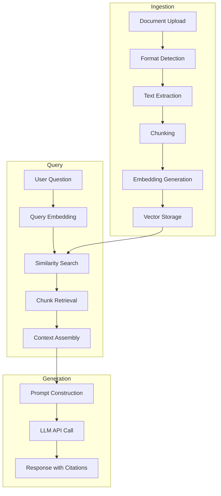
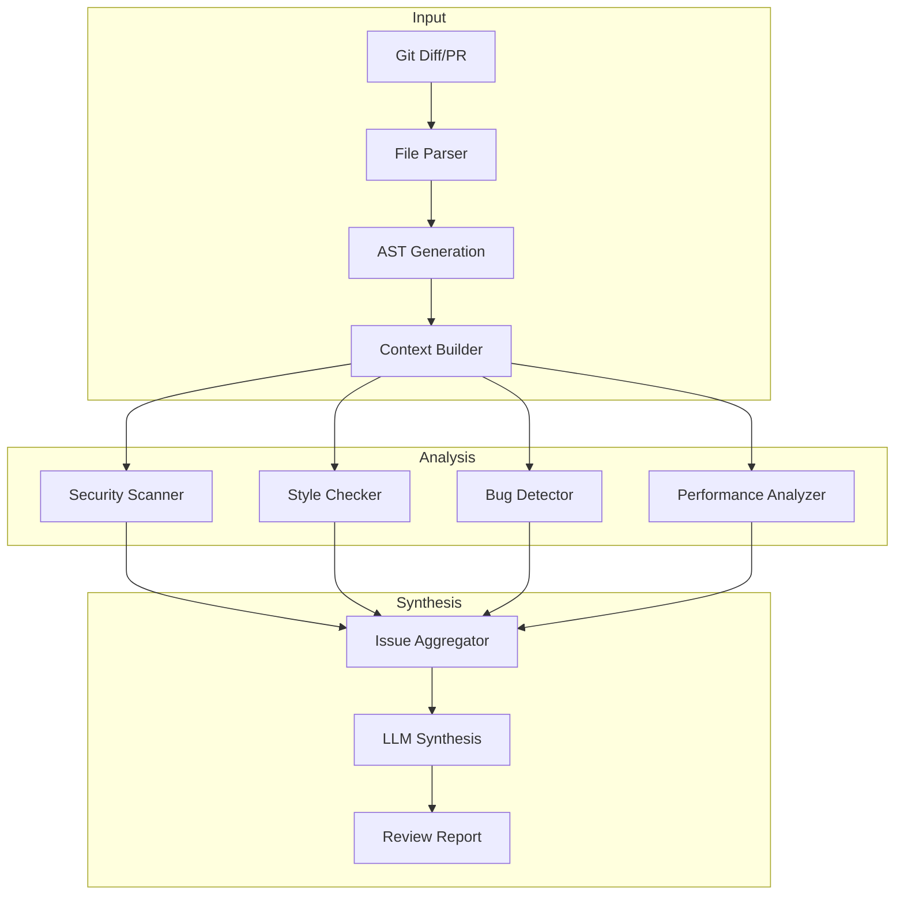
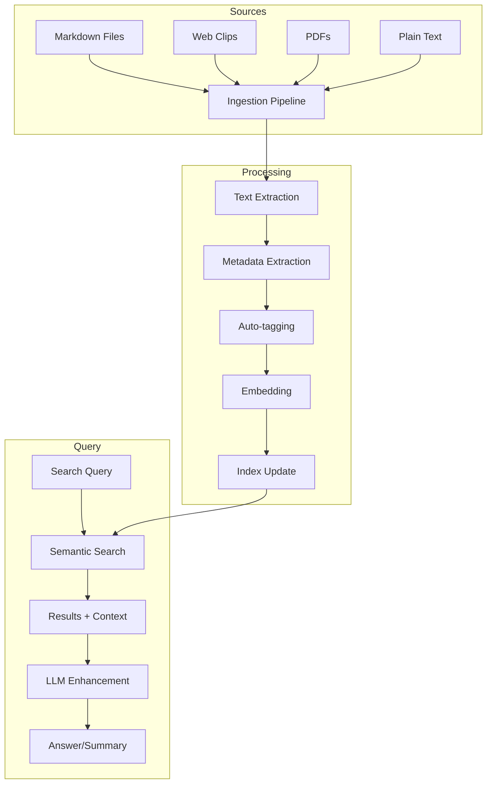
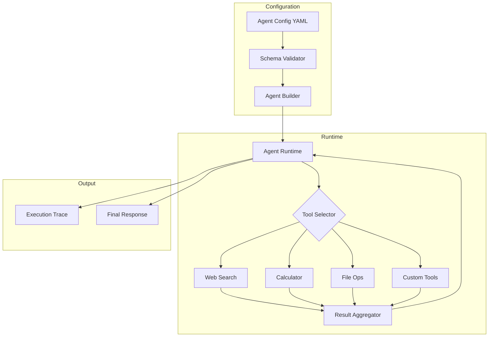

# Capstone Projects

The capstone project is the culminating experience of the Developer of Tomorrow course. It synthesizes concepts from all four parts into a production-quality AI-powered application.

---

## Overview

**Duration**: 4-8 hours (self-paced)

**Goal**: Build a complete AI application that demonstrates mastery of:

- AI API integration and error handling
- Prompt engineering techniques
- Safety and responsible AI practices
- Agent architectures (where applicable)
- Production-ready code patterns

**Deliverables**:

1. Working application with source code
2. Architecture documentation
3. Demo video (5-10 minutes)
4. Reflection essay (500-1000 words)

---

## Project Options

Choose one of the following projects, or propose your own.

---

## Option A: Intelligent Research Assistant

### Description

Build a RAG-powered research assistant that can ingest documents from multiple sources, answer questions with citations, and help users explore a knowledge domain.

### Requirements

**Core Features**:

- Document ingestion from multiple formats (PDF, Markdown, web pages)
- Semantic search across ingested documents
- Question answering with source citations
- Conversation memory within a session
- Export findings to Markdown

**Technical Requirements**:

- Vector database for embeddings (Chroma, Pinecone, or pgvector)
- Chunking strategy with metadata preservation
- Hybrid search (semantic + keyword) implementation
- Citation tracking to original sources
- Rate limiting and error handling for AI API calls

**Safety Requirements**:

- Input validation to prevent prompt injection
- Clear disclosure that responses are AI-generated
- Source attribution to avoid plagiarism
- Handling of potentially sensitive documents

### Architecture Diagram



### Evaluation Criteria

| Criterion             | Weight | Description                           |
| --------------------- | ------ | ------------------------------------- |
| Retrieval Quality     | 25%    | Relevant chunks retrieved for queries |
| Answer Accuracy       | 25%    | Correct, well-supported answers       |
| Citation Accuracy     | 15%    | Citations point to actual sources     |
| Code Quality          | 15%    | Clean, documented, production-ready   |
| Safety Implementation | 10%    | Proper input validation, disclosures  |
| User Experience       | 10%    | Intuitive interface, helpful errors   |

### Suggested Tech Stack

- **Backend**: Python (FastAPI or Flask)
- **Vector DB**: Chroma (local) or Pinecone (cloud)
- **Embeddings**: OpenAI text-embedding-3-small or Sentence Transformers
- **LLM**: Claude or GPT-4
- **Frontend**: Simple web interface or CLI

---

## Option B: Code Review Agent

### Description

Build an AI agent that performs comprehensive code reviews on pull requests or code changes, identifying bugs, security issues, style violations, and suggesting improvements.

### Requirements

**Core Features**:

- Multi-file code analysis
- Security vulnerability detection
- Code style and best practices checking
- Performance issue identification
- Actionable improvement suggestions
- Summary report generation

**Technical Requirements**:

- File parsing for multiple languages (at minimum: Python, JavaScript/TypeScript)
- Context-aware analysis (understanding file relationships)
- Structured output format (JSON or Markdown)
- Git integration for PR analysis
- Configurable rules and severity levels

**Safety Requirements**:

- Never execute untrusted code
- Sensitive data detection (API keys, passwords in code)
- Rate limiting for large codebases
- Clear limitations disclosure

### Architecture Diagram



### Evaluation Criteria

| Criterion              | Weight | Description                      |
| ---------------------- | ------ | -------------------------------- |
| Issue Detection        | 25%    | Finds real issues in test code   |
| False Positive Rate    | 20%    | Avoids flagging correct code     |
| Suggestion Quality     | 20%    | Actionable, correct suggestions  |
| Multi-language Support | 15%    | Works across specified languages |
| Code Quality           | 10%    | Clean, documented implementation |
| Report Clarity         | 10%    | Easy to understand output        |

### Suggested Tech Stack

- **Backend**: Python or TypeScript
- **Parsing**: Tree-sitter or language-specific parsers
- **LLM**: Claude (good at code) or GPT-4
- **Git**: GitPython or simple-git
- **Output**: GitHub PR comments or Markdown report

---

## Option C: Personal Knowledge Base

### Description

Build a personal knowledge management system that ingests your notes, bookmarks, and documents, then helps you find connections, generate summaries, and answer questions about your own knowledge.

### Requirements

**Core Features**:

- Multi-format ingestion (Markdown, text, web clips, PDFs)
- Automatic tagging and categorization
- Semantic search across all content
- Daily/weekly digest generation
- Question answering about your knowledge
- Connection discovery between notes

**Technical Requirements**:

- Incremental indexing (add content without reprocessing all)
- Metadata extraction and storage
- Embedding-based similarity for connections
- Background processing for large imports
- Export to standard formats

**Safety Requirements**:

- Local-first data storage option
- Encryption at rest for sensitive notes
- Clear data handling policies
- Ability to exclude content from AI processing

### Architecture Diagram



### Evaluation Criteria

| Criterion            | Weight | Description                       |
| -------------------- | ------ | --------------------------------- |
| Search Quality       | 25%    | Finds relevant content accurately |
| Connection Discovery | 20%    | Surfaces meaningful relationships |
| Ingestion Robustness | 20%    | Handles various formats reliably  |
| Privacy Controls     | 15%    | Respects user data preferences    |
| Code Quality         | 10%    | Clean, documented implementation  |
| User Experience      | 10%    | Intuitive interaction patterns    |

### Suggested Tech Stack

- **Backend**: Python or Node.js
- **Database**: SQLite + Chroma (local-first)
- **Embeddings**: Local model (Sentence Transformers) or API
- **LLM**: Local (Ollama) or API (Claude/OpenAI)
- **Frontend**: CLI, Obsidian plugin, or web interface

---

## Option D: Custom Agent Platform

### Description

Build a platform for creating and deploying custom AI agents. Users should be able to define agent behaviors, tools, and personas through configuration rather than code.

### Requirements

**Core Features**:

- Agent definition via YAML/JSON configuration
- Built-in tool library (web search, calculator, file operations)
- Custom tool creation interface
- Multi-agent orchestration support
- Execution tracing and debugging
- Agent sharing/export

**Technical Requirements**:

- Agent runtime with tool execution
- Configuration validation and schema
- State management for conversations
- Parallel tool execution where safe
- Comprehensive logging

**Safety Requirements**:

- Tool permission system (sandboxing)
- Resource limits (time, API calls)
- Input/output filtering
- Audit logging

### Architecture Diagram



### Evaluation Criteria

| Criterion                 | Weight | Description              |
| ------------------------- | ------ | ------------------------ |
| Configuration Flexibility | 25%    | Diverse agents creatable |
| Tool Execution            | 20%    | Tools work correctly     |
| Orchestration             | 20%    | Multi-agent flows work   |
| Safety Controls           | 15%    | Proper sandboxing        |
| Code Quality              | 10%    | Clean, documented        |
| User Experience           | 10%    | Easy to create agents    |

### Suggested Tech Stack

- **Backend**: Python (LangGraph) or TypeScript
- **Config**: YAML with JSON Schema validation
- **LLM**: Any (abstracted provider)
- **Tools**: Custom implementations
- **Tracing**: LangSmith or custom logging

---

## Option E: Your Own Project

### Description

Propose your own project that demonstrates the skills learned in this course. Your project must be approved before starting.

### Proposal Requirements

Submit a 1-2 page proposal including:

1. **Project Title and Description**
   - What does it do?
   - Who is it for?

2. **Technical Scope**
   - What AI capabilities does it use?
   - What's the architecture?
   - What's the tech stack?

3. **Course Concepts Demonstrated**
   - Which modules does it draw from?
   - How does it show mastery?

4. **Safety Considerations**
   - What risks exist?
   - How will you mitigate them?

5. **Deliverables and Timeline**
   - What will you submit?
   - Estimated time to complete?

### Approval Criteria

Your project will be approved if it:

- Demonstrates understanding of at least 5 course modules
- Includes meaningful AI integration (not just a wrapper)
- Addresses safety and responsible use
- Is achievable within the time allotted
- Produces a tangible, demonstrable result

---

## Submission Guidelines

### Code Repository

Your code should be submitted as a GitHub repository including:

```
project-name/
├── README.md           # Setup and usage instructions
├── src/                # Source code
├── tests/              # Test files
├── docs/
│   └── architecture.md # Architecture documentation
├── .env.example        # Environment template (no secrets!)
├── requirements.txt    # Python dependencies
│   or package.json     # Node dependencies
└── LICENSE
```

**README Requirements**:

- Project description
- Setup instructions (step by step)
- Usage examples
- Known limitations
- Future improvements

### Architecture Document

Your architecture document should include:

1. **System Overview** (with diagram)
2. **Component Descriptions**
   - What each part does
   - Why you chose this design
3. **Data Flow**
   - How data moves through the system
4. **AI Integration Details**
   - Which models/APIs
   - Prompt strategies used
   - Token/cost management
5. **Safety Measures**
   - How you handle risks
6. **Trade-offs and Decisions**
   - What alternatives you considered
   - Why you made your choices

### Demo Video

Create a 5-10 minute video demonstrating:

1. **Setup and Installation** (1-2 min)
   - Show someone could run this

2. **Core Features** (3-5 min)
   - Walk through main functionality
   - Show real outputs

3. **Technical Highlights** (1-2 min)
   - Interesting implementation details
   - How you solved challenges

4. **Limitations and Future Work** (1 min)
   - Honest about what doesn't work yet

**Video Guidelines**:

- Screen recording with narration
- Clear audio quality
- Visible code and outputs
- Can be unlisted YouTube or direct upload

### Reflection Essay

Write 500-1000 words reflecting on:

1. **What You Learned**
   - New skills acquired
   - Concepts that clicked

2. **Challenges Faced**
   - What was hard?
   - How did you overcome it?

3. **What You'd Do Differently**
   - With hindsight, what would change?

4. **Next Steps**
   - How will you continue learning?
   - What would you build next?

---

## Evaluation Rubric

### Technical Implementation (40%)

| Score  | Description                                                        |
| ------ | ------------------------------------------------------------------ |
| 90-100 | Exceptional - Production quality, handles edge cases, elegant code |
| 80-89  | Strong - Works well, good practices, minor issues                  |
| 70-79  | Competent - Core functionality works, some rough edges             |
| 60-69  | Developing - Basic functionality, notable issues                   |
| <60    | Incomplete - Major functionality missing                           |

### Documentation (25%)

| Score  | Description                                                   |
| ------ | ------------------------------------------------------------- |
| 90-100 | Comprehensive, clear, would help anyone set up and understand |
| 80-89  | Good coverage, minor gaps or unclear sections                 |
| 70-79  | Adequate, covers basics but lacks depth                       |
| 60-69  | Minimal documentation, hard to follow                         |
| <60    | Missing or unusable documentation                             |

### Safety and Responsibility (15%)

| Score  | Description                                                   |
| ------ | ------------------------------------------------------------- |
| 90-100 | Thorough safety measures, clear disclosures, production-ready |
| 80-89  | Good safety awareness, minor gaps                             |
| 70-79  | Basic safety considered, some risks unaddressed               |
| 60-69  | Limited safety consideration                                  |
| <60    | Safety not addressed                                          |

### Demo and Communication (20%)

| Score  | Description                                              |
| ------ | -------------------------------------------------------- |
| 90-100 | Compelling demo, clear explanation, professional quality |
| 80-89  | Good demo, clear communication                           |
| 70-79  | Adequate demo, some unclear parts                        |
| 60-69  | Basic demo, hard to follow                               |
| <60    | Missing or very poor demo                                |

---

## Resources

### Getting Started

1. Review all course modules for relevant techniques
2. Sketch your architecture before coding
3. Start with a minimal working version
4. Iterate and improve

### Helpful References

- **RAG**: Module 5 (Databases), Module 11 (RAG)
- **Agents**: Module 15-17 (Agent architecture)
- **Safety**: Module 13 (Safety), Module 6 (Security)
- **Prompting**: Module 14 (Prompt Engineering)
- **APIs**: Module 4 (Networks and APIs)

### Common Pitfalls

1. **Scope creep** - Start small, add features incrementally
2. **Ignoring error handling** - AI APIs fail; handle it gracefully
3. **Skipping safety** - Easy to overlook, hard to add later
4. **Poor documentation** - Document as you build
5. **No testing** - Test with edge cases and adversarial inputs

---

## FAQ

**Q: Can I use frameworks like LangChain?**
A: Yes, but you should understand what the framework does. Don't use it as a black box.

**Q: What if I can't finish in time?**
A: Submit what you have with a note about what's incomplete. Partial credit is possible.

**Q: Can I work with a partner?**
A: This is designed as an individual project to demonstrate your personal mastery. Collaboration on ideas is fine, but code should be your own.

**Q: What if my project idea isn't listed?**
A: Submit a proposal for Option E. Most reasonable projects are approved.

**Q: How do I handle API costs?**
A: Budget carefully. Use cheaper models for development, expensive ones for demos. Most projects can complete under $10 in API costs.

---

Good luck! This is your opportunity to demonstrate everything you've learned and build something you're proud of.
