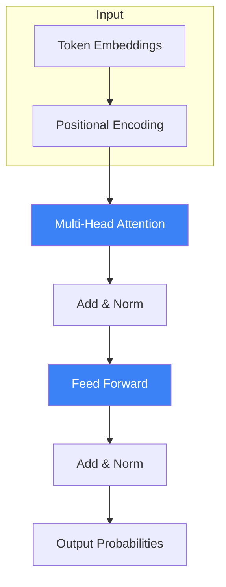

# Tech Stack Deep Dive

This document provides comprehensive reasoning for every technology choice in the Developer of Tomorrow course platform.

## Executive Summary

**Chosen Stack: Astro + MDX + Tailwind CSS + React Islands**

This stack optimizes for:

1. **Zero hosting cost** - Static output for Render.com free tier
2. **Content author experience** - Write in Markdown, add interactivity where needed
3. **User experience** - Fast loads, minimal JavaScript, offline-capable
4. **Developer experience** - Modern tooling, type safety, component reuse

---

## Core Framework: Astro

### Why Astro Over Alternatives?

| Framework  | Pros                                                    | Cons                                                | Verdict       |
| ---------- | ------------------------------------------------------- | --------------------------------------------------- | ------------- |
| **Astro**  | Content-first, zero JS by default, islands architecture | Newer ecosystem                                     | **Winner**    |
| Next.js    | Mature, great DX, large ecosystem                       | Overkill for static content, larger bundles         | Too heavy     |
| VitePress  | Fast, Vue-based, good for docs                          | Vue-focused, less flexible for custom interactivity | Close second  |
| Docusaurus | Purpose-built for docs                                  | Opinionated styling, harder to customize            | Too rigid     |
| Gatsby     | Mature React ecosystem                                  | Complex GraphQL layer, slow builds                  | Legacy choice |

### Astro's Key Advantages

#### 1. Islands Architecture

```astro
<!-- Only this component ships JavaScript -->
<Quiz client:visible questions={quizData} />

<!-- Everything else is static HTML -->
<article>
  <h1>{title}</h1>
  <Content />
</article>
```

**Result**: A typical lesson page ships ~5KB JavaScript instead of ~200KB+ with full React hydration.

#### 2. Content Collections

```typescript
// src/content/config.ts
import { z, defineCollection } from "astro:content";

const lessonsCollection = defineCollection({
  type: "content",
  schema: z.object({
    title: z.string(),
    module: z.string(),
    order: z.number(),
    duration: z.number(),
    objectives: z.array(z.string()),
  }),
});
```

Type-safe content with validation at build time catches errors before deployment.

#### 3. Framework Agnostic

Can use React, Vue, Svelte, or vanilla JS components interchangeably. We chose React for ecosystem familiarity, but individual components could be swapped.

#### 4. Build Output

Pure static HTML/CSS/JS - no server runtime needed. Perfect for:

- Render.com static hosting (free tier)
- CDN edge caching
- Offline PWA capability (future)

### Astro Configuration

```javascript
// astro.config.mjs
import { defineConfig } from "astro/config";
import react from "@astrojs/react";
import tailwind from "@astrojs/tailwind";
import mdx from "@astrojs/mdx";
import sitemap from "@astrojs/sitemap";

import remarkMath from "remark-math";
import rehypeKatex from "rehype-katex";
import rehypeSlug from "rehype-slug";
import rehypeAutolinkHeadings from "rehype-autolink-headings";
import { remarkMermaid } from "remark-mermaidjs";

export default defineConfig({
  site: "https://developer-of-tomorrow.onrender.com",
  output: "static",

  integrations: [
    react(),
    tailwind({ applyBaseStyles: false }),
    mdx({
      syntaxHighlight: "shiki",
      shikiConfig: {
        themes: {
          light: "github-light",
          dark: "github-dark",
        },
      },
      remarkPlugins: [remarkMath, remarkMermaid],
      rehypePlugins: [
        rehypeKatex,
        rehypeSlug,
        [rehypeAutolinkHeadings, { behavior: "wrap" }],
      ],
    }),
    sitemap(),
  ],

  prefetch: {
    prefetchAll: true,
    defaultStrategy: "viewport",
  },
});
```

---

## Content Format: MDX

### Why MDX?

MDX allows embedding React components directly in Markdown:

```mdx
# Understanding Attention Mechanisms

The attention mechanism lets each token "look at" all other tokens.

<Tip>
  Think of it like a dinner party where everyone can hear everyone else, rather
  than a game of telephone.
</Tip>

Here's the key equation:

$$
\text{Attention}(Q, K, V) = \text{softmax}\left(\frac{QK^T}{\sqrt{d_k}}\right)V
$$

<InteractiveDemo type="attention" />

## Knowledge Check

<Quiz
  questions={[
    {
      question: "What does the softmax function do?",
      options: [
        "Normalizes to probabilities",
        "Adds values",
        "Multiplies matrices",
      ],
      correct: 0,
    },
  ]}
/>
```

### MDX Component Library

| Component           | Purpose              | Hydration        |
| ------------------- | -------------------- | ---------------- |
| `<Tip>`             | Helpful hints        | None (static)    |
| `<Warning>`         | Important cautions   | None (static)    |
| `<Exercise>`        | Hands-on activities  | None (static)    |
| `<Definition>`      | Key term definitions | None (static)    |
| `<Quiz>`            | Knowledge checks     | `client:visible` |
| `<CodePlayground>`  | Interactive code     | `client:visible` |
| `<InteractiveDemo>` | Visualizations       | `client:load`    |

### Math Rendering

Using KaTeX for mathematical notation:

```markdown
Inline: The loss function $L(\theta)$ measures error.

Block:

$$
\nabla_\theta L = \frac{1}{N} \sum_{i=1}^{N} \nabla_\theta \ell(f_\theta(x_i), y_i)
$$
```

Renders beautiful math without JavaScript runtime (pre-rendered at build).

---

## Styling: Tailwind CSS

### Why Tailwind?

1. **Utility-first**: No context switching between HTML and CSS files
2. **Dark mode**: Built-in `dark:` variant
3. **Design tokens**: Consistent spacing, colors, typography
4. **PurgeCSS**: Only ships used classes (~10KB final CSS)
5. **Typography plugin**: Beautiful prose styling out of the box

### Design Token System

```javascript
// tailwind.config.mjs
export default {
  darkMode: "class",
  theme: {
    extend: {
      colors: {
        // Primary brand
        primary: {
          50: "#eff6ff",
          500: "#3b82f6", // Main
          600: "#2563eb",
          900: "#1e3a8a",
        },
        // Warm accent
        accent: {
          500: "#ed7410", // Orange
        },
        // Dark mode surfaces
        dark: {
          bg: "#0f0f10",
          surface: "#18181b",
          elevated: "#27272a",
        },
      },
      fontFamily: {
        sans: ["Inter Variable", "system-ui", "sans-serif"],
        mono: ["JetBrains Mono", "monospace"],
      },
    },
  },
  plugins: [require("@tailwindcss/typography"), require("@tailwindcss/forms")],
};
```

### Component Styling Pattern

```tsx
// Consistent button styling
const buttonVariants = {
  primary: "bg-primary-600 text-white hover:bg-primary-700",
  secondary:
    "bg-neutral-100 text-neutral-700 dark:bg-neutral-800 dark:text-neutral-200",
  ghost:
    "text-neutral-600 hover:bg-neutral-100 dark:text-neutral-300 dark:hover:bg-neutral-800",
};

function Button({ variant = "primary", children, ...props }) {
  return (
    <button
      className={`px-4 py-2 rounded-lg font-medium transition-colors ${buttonVariants[variant]}`}
      {...props}
    >
      {children}
    </button>
  );
}
```

---

## Interactive Components: React

### Why React for Islands?

1. **Developer familiarity**: Most common framework
2. **Ecosystem**: Rich component libraries (Radix UI)
3. **TypeScript support**: Excellent type inference
4. **Testing**: Mature testing tools (React Testing Library)

### Island Hydration Strategies

Astro provides fine-grained control over when components hydrate:

```astro
<!-- Never hydrate - renders static HTML -->
<StaticContent />

<!-- Hydrate immediately on page load -->
<ThemeToggle client:load />

<!-- Hydrate when component enters viewport -->
<Quiz client:visible />

<!-- Hydrate only on user interaction -->
<SearchModal client:idle />

<!-- Hydrate only on this media query -->
<MobileNav client:media="(max-width: 768px)" />
```

### Key React Components

#### Quiz Component

```typescript
interface QuizProps {
  quizId: string;
  moduleSlug: string;
  questions: QuizQuestion[];
  passingScore?: number; // Default: 70%
  allowRetry?: boolean; // Default: true
}

interface QuizQuestion {
  id: string;
  type: "multiple-choice" | "multiple-select" | "true-false";
  question: string;
  options: { id: string; text: string }[];
  correctAnswer: string | string[];
  explanation: string;
}
```

State persisted to `localStorage` key: `dot-quiz-{moduleSlug}-{quizId}`

#### Progress Tracker

```typescript
interface ProgressState {
  completedLessons: string[];
  completedModules: string[];
  quizScores: Record<string, number>;
  lastVisited: string;
  startedAt: string;
  totalTimeSpent: number; // minutes
}
```

localStorage key: `dot-progress`

---

## Diagrams: Mermaid

### Why Mermaid?

1. **Diagrams as code**: Version controlled, diffable
2. **No external tools**: Authors write text, diagrams render automatically
3. **Dark mode**: Automatic theme adaptation
4. **Wide support**: Flowcharts, sequences, class diagrams, etc.

### Example: Transformer Architecture



### Build-Time Rendering

Mermaid diagrams are rendered to SVG at build time via `remark-mermaidjs`. No client-side JavaScript required - diagrams are static images.

---

## Code Highlighting: Shiki

### Why Shiki Over Prism?

| Feature     | Shiki              | Prism      |
| ----------- | ------------------ | ---------- |
| Accuracy    | VSCode-level       | Good       |
| Themes      | 100+ VSCode themes | Limited    |
| Languages   | 150+               | 200+       |
| Runtime     | Build-time         | Runtime JS |
| Bundle size | 0KB                | ~15KB      |

### Dual-Theme Support

```javascript
shikiConfig: {
  themes: {
    light: 'github-light',
    dark: 'github-dark',
  },
}
```

Generates CSS that automatically switches based on `dark` class:

```css
.shiki.github-light {
  display: block;
}
.shiki.github-dark {
  display: none;
}
.dark .shiki.github-light {
  display: none;
}
.dark .shiki.github-dark {
  display: block;
}
```

---

## Search: Fuse.js

### Why Client-Side Search?

1. **No backend required**: Keeps static hosting viable
2. **Instant results**: No network latency
3. **Privacy**: Queries never leave user's browser
4. **Offline capable**: Works without internet

### Implementation

```typescript
// Build-time: Generate search index
const searchIndex = lessons.map((lesson) => ({
  slug: lesson.slug,
  title: lesson.data.title,
  description: lesson.data.description,
  headings: extractHeadings(lesson.body),
  content: stripMarkdown(lesson.body).slice(0, 1000),
}));

// Client-side: Fuse.js search
const fuse = new Fuse(searchIndex, {
  keys: [
    { name: "title", weight: 3 },
    { name: "headings", weight: 2 },
    { name: "content", weight: 1 },
  ],
  threshold: 0.3,
  includeMatches: true,
});

const results = fuse.search(query);
```

### Search Index Size

For 23 modules with ~80 lessons total:

- Estimated index size: ~200KB
- Loaded on-demand when search modal opens
- Cached after first load

---

## Deployment: Render.com

### Why Render?

| Provider     | Free Tier | Custom Domain | SSL | Build Minutes |
| ------------ | --------- | ------------- | --- | ------------- |
| **Render**   | 100GB/mo  | Yes           | Yes | 500/mo        |
| Vercel       | 100GB/mo  | Yes           | Yes | 6000/mo       |
| Netlify      | 100GB/mo  | Yes           | Yes | 300/mo        |
| GitHub Pages | Unlimited | Yes           | Yes | 2000/mo       |

Render chosen because:

1. Simple static site configuration
2. Infrastructure-as-code via `render.yaml`
3. Automatic HTTPS
4. Good free tier limits

### Configuration

```yaml
# render.yaml
services:
  - type: web
    name: developer-of-tomorrow
    runtime: static
    buildCommand: npm ci && npm run build
    staticPublishPath: ./dist
    headers:
      - path: /*
        name: Cache-Control
        value: public, max-age=31536000, immutable
      - path: /*.html
        name: Cache-Control
        value: public, max-age=0, must-revalidate
    envVars:
      - key: NODE_VERSION
        value: 20
```

### Caching Strategy

- **Static assets** (JS, CSS, fonts, images): 1 year cache, immutable
- **HTML pages**: No cache (always fresh)
- **Content updates**: Just rebuild, new HTML served immediately

---

## Dependencies Summary

### Production Dependencies

```json
{
  "astro": "^4.15.0",
  "@astrojs/mdx": "^3.1.0",
  "@astrojs/react": "^3.6.0",
  "@astrojs/sitemap": "^3.1.0",
  "@astrojs/tailwind": "^5.1.0",

  "react": "^18.3.0",
  "react-dom": "^18.3.0",

  "@radix-ui/react-accordion": "^1.2.0",
  "@radix-ui/react-dialog": "^1.1.0",
  "@radix-ui/react-progress": "^1.1.0",

  "fuse.js": "^7.0.0",
  "lucide-react": "^0.447.0",
  "canvas-confetti": "^1.9.0",

  "remark-math": "^6.0.0",
  "remark-mermaidjs": "^6.0.0",
  "rehype-katex": "^7.0.0",
  "rehype-slug": "^6.0.0",
  "rehype-autolink-headings": "^7.1.0"
}
```

### Dev Dependencies

```json
{
  "tailwindcss": "^3.4.0",
  "@tailwindcss/typography": "^0.5.14",
  "@tailwindcss/forms": "^0.5.7",

  "typescript": "^5.5.0",
  "@types/react": "^18.3.0",

  "eslint": "^8.57.0",
  "prettier": "^3.3.0",
  "prettier-plugin-astro": "^0.14.0",
  "prettier-plugin-tailwindcss": "^0.6.0"
}
```

### Total Bundle Analysis

| Asset Type        | Size       | Notes            |
| ----------------- | ---------- | ---------------- |
| HTML (per page)   | ~15KB      | Gzipped          |
| CSS (total)       | ~10KB      | Purged Tailwind  |
| JS (core)         | ~5KB       | Theme, progress  |
| JS (quiz)         | ~20KB      | On-demand        |
| JS (search)       | ~15KB      | On-demand        |
| Fonts             | ~100KB     | Inter, JetBrains |
| **Total initial** | **~130KB** | Before images    |

---

## Future Considerations

### Potential Additions

1. **PWA Support**: Service worker for offline access
2. **PDF Export**: Generate printable versions of modules
3. **Analytics**: Privacy-respecting usage tracking (Plausible/Umami)
4. **Comments**: Giscus for GitHub-based discussions
5. **Progress Sync**: Optional cloud backup of progress

### Migration Paths

If requirements change significantly:

- **Need server features**: Add `@astrojs/node` adapter
- **Need CMS**: Integrate with Sanity, Contentful, or Notion
- **Need auth**: Add Auth.js with database adapter
- **Need payments**: Can remain static, use Stripe payment links

The Astro foundation is flexible enough to accommodate these changes without full rewrites.

---

## Setup Instructions

### Local Development

```bash
# Prerequisites
node --version  # Should be 20+
npm --version   # Should be 10+

# Install
npm install

# Development server with hot reload
npm run dev

# Open http://localhost:4321
```

### Building for Production

```bash
# Type check and build
npm run build

# Preview production build locally
npm run preview

# Build artifacts in ./dist/
```

### Common Issues

**Issue**: Mermaid diagrams not rendering
**Solution**: Ensure `remark-mermaidjs` is in `remarkPlugins` array

**Issue**: Dark mode flashing on load
**Solution**: Add theme script in `<head>` before body renders

**Issue**: Quiz state not persisting
**Solution**: Check localStorage is available and not blocked

---

This tech stack provides a solid foundation for a high-quality educational experience while keeping operational costs at zero and maintenance burden minimal.
