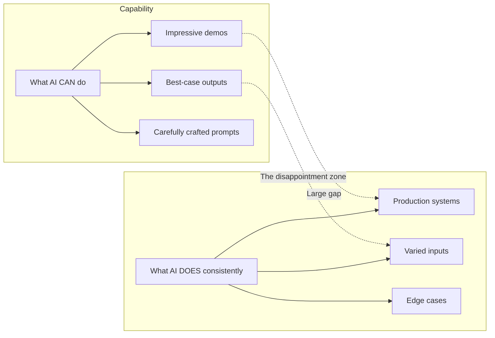
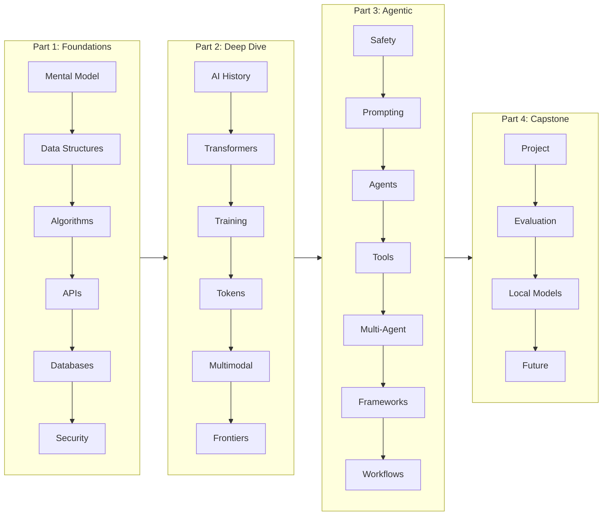
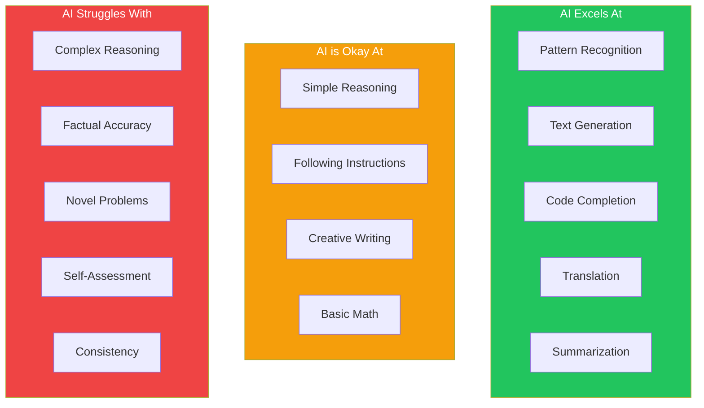
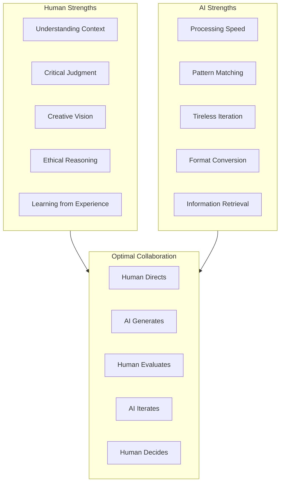

# Module 1: The Developer's Mental Model for AI

**Part 1: Foundations** | **Duration**: 1 hour 15 minutes | **Difficulty**: Beginner

---

## Learning Objectives

By the end of this module, you will be able to:

- Understand why AI literacy is essential for modern technical professionals
- Recognize AI as a sophisticated tool, not magic or a replacement for human judgment
- Identify key differences between human reasoning and AI token prediction
- Establish a productive, skeptical-but-open mindset for learning AI
- Map your personal learning journey through the course

---

## Section 1: Welcome and Course Overview (10 minutes)

### Why This Course Exists

You're a technical professional. You've built systems, debugged nightmares, shipped products. You've adapted to countless technology shifts. And now, you're facing another one.

AI isn't coming. It's here. And unlike previous paradigm shifts, this one feels different. It feels... personal. The tools aren't just changing how you work—they're doing parts of what you do.

This course exists because the conversation around AI has become unhelpfully polarized:

- **The hype camp** promises AI will solve everything. "AGI next year!" "10x developers!" "Just prompt harder!"
- **The doomer camp** warns AI will destroy everything. Jobs, society, maybe humanity itself.
- **The dismissive camp** insists it's just autocomplete with good marketing.

All three camps are wrong in instructive ways.

**The truth is more nuanced and more interesting.** Modern AI systems are genuine technological breakthroughs that can meaningfully enhance your work—if you understand them. They're also limited, unreliable, and frequently wrong in ways that require your expertise to navigate.

This course teaches you that understanding.

### What You'll Build

Over the next 10-12 weeks, you'll develop:

1. **Deep Understanding**: How transformers actually work, why they succeed and fail
2. **Practical Skills**: Prompt engineering, API integration, agent building
3. **Critical Judgment**: When to use AI, when not to, and how to evaluate outputs
4. **Safety Awareness**: Real risks, responsible practices, organizational considerations

By the end, you'll be the person on your team who actually understands this stuff—not at a surface level, but deeply enough to make good decisions.

### How to Succeed

This course is designed for working professionals. You don't need to complete it linearly or quickly. The best approach:

- **Commit to consistency**: 3-4 hours per week beats 12-hour marathon sessions
- **Do the exercises**: Reading about AI is not the same as using AI
- **Question everything**: Including what this course tells you
- **Build things**: The capstone matters, but so do small experiments along the way

---

## Section 2: The AI Moment in Software Development (15 minutes)

### Previous Paradigm Shifts

If you've been in tech for any length of time, you've lived through paradigm shifts before:

- **Mainframe to PC**: "Real" computing meant big iron
- **Desktop to Web**: "Serious" applications were installed locally
- **Waterfall to Agile**: "Professional" development meant upfront planning
- **On-prem to Cloud**: "Secure" infrastructure meant your own data center
- **Mobile**: "Users" meant people at desks

Each shift had its skeptics who were eventually proven wrong—but also its hype merchants who overpromised. The cloud didn't eliminate ops; it transformed it. Agile didn't eliminate planning; it made it continuous. Mobile didn't kill desktop; it added a new platform.

AI will follow the same pattern: transformation, not elimination.

### What's Actually Changing

Here's what AI is demonstrably changing in software development right now:

**Code generation is real**: Tools like GitHub Copilot, Cursor, and Claude Code can generate working code from descriptions. They're not perfect, but they're good enough to change workflows.

**Natural language interfaces are viable**: Users can interact with systems through conversation rather than forms and buttons. This creates new product possibilities.

**Automation scope has expanded**: Tasks that previously required human judgment—code review, documentation, test generation—can now be partially automated.

**The skill ceiling is rising**: The best developers using AI effectively can outproduce their past selves. The gap between AI-fluent and AI-naive developers is growing.

### The Productivity Evidence

Let's be honest about what the research actually shows:

**Studies claiming 2x productivity gains** often measure specific, narrow tasks where AI excels (writing boilerplate, generating tests from examples). Real-world productivity is harder to measure.

**Developer surveys show mixed results**: Some report significant time savings. Others report time lost to debugging AI-generated code or correcting hallucinations.

**The learning curve matters**: Developers who understand AI's limitations get more value than those who blindly accept outputs.

The honest summary: AI can meaningfully accelerate your work _if_ you know how to use it effectively, _if_ you can recognize when it's failing, and _if_ you apply it to appropriate tasks.

This course teaches you those skills.

---

## Section 3: AI as Power Tool — The Right Mental Model (15 minutes)

### The Chainsaw Analogy

Think about a chainsaw. It's a power tool that amplifies human capability. It lets you do in minutes what would take hours with a hand saw.

But you wouldn't:

- Let a chainsaw "decide" which trees to cut
- Trust it to stop before hitting something important
- Assume it works the same on every type of wood
- Operate it without understanding the kickback zone

The chainsaw doesn't understand trees or forests. It's an amplifier for human intent and skill. A skilled user with a chainsaw accomplishes remarkable things. An unskilled user creates disasters.

AI is a power tool. The most sophisticated one we've ever built, perhaps—but still a tool that amplifies human capability rather than replacing human judgment.

### What AI Actually Excels At

Given appropriate tasks and supervision, modern AI is genuinely impressive at:

**Pattern matching at scale**: Finding similar code, documents, concepts across massive datasets

**Generation within established patterns**: Writing code that follows conventions, prose that matches styles, data that fits schemas

**Transformation between formats**: Converting between languages, summarizing, expanding, reformatting

**First drafts and scaffolding**: Starting points that humans can refine, outlines to build on

**Tireless iteration**: Generating variations, trying different approaches, exploring options

### What AI Reliably Struggles With

Even the most advanced AI systems today reliably struggle with:

**Factual accuracy**: AI systems hallucinate confident falsehoods. This isn't a bug that will be fixed; it's inherent to how they work.

**Complex reasoning**: Multi-step logical deduction, especially when it requires holding many constraints in mind simultaneously

**Novel situations**: Problems that don't match patterns in training data, truly creative solutions

**Knowing what they don't know**: AI systems can't reliably express uncertainty. They generate plausible-sounding outputs even when they're completely wrong.

**Consistent behavior**: The same prompt can produce different outputs. This is a feature for creativity, a bug for reliability.

### The Capability-Reliability Gap

Here's a critical concept for your mental model:

**Capability** is what AI can do on a good day with a good prompt.
**Reliability** is what AI does consistently across varied conditions.

The gap between these is huge—and this is where most AI disappointments come from.

AI demos show capability: the perfect output, the impressive example, the "wow" moment. Real-world use requires reliability: consistent outputs, predictable failures, manageable edge cases.



Your job is to work in the overlap: tasks where capability and reliability align.

---

## Section 4: How AI "Thinks" vs. How You Think (15 minutes)

### The Fundamental Difference

When you solve a problem, you:

1. Understand what you're being asked
2. Recall relevant knowledge and experiences
3. Reason through the problem
4. Evaluate potential solutions
5. Choose and execute an approach
6. Reflect on whether it worked

When an AI generates a response, it:

1. Converts your input to numerical tokens
2. Predicts statistically likely next tokens
3. Repeats until done

That's it. There's no understanding, no reasoning, no evaluation, no reflection. There's prediction: "given everything before this point, what token is most likely to come next?"

This isn't a limitation of current AI that will be solved. It's what these systems fundamentally are.

### Token Prediction in Practice

Let's make this concrete. When you ask Claude: "What's the capital of France?"

The system doesn't:

- Access a database of facts about France
- "Know" that France is a country with a capital
- Understand the concept of capital cities

The system does:

- Recognize this pattern of tokens as similar to many training examples
- Predict that the token "Paris" is overwhelmingly likely to come next
- Generate that token

For this query, the distinction doesn't matter—you get the right answer either way.

But consider: "What's the capital of the country that hosted the 2024 Summer Olympics?"

Now the system must:

- Recognize the pattern asking for a capital
- Pattern-match "2024 Summer Olympics" to likely location (France/Paris)
- Combine these pattern matches correctly

Usually it works. But sometimes it doesn't—and when it fails, it fails confidently.

### Why Hallucinations Happen

"Hallucination" is the AI field's term for confident false outputs. It happens because:

1. **Token prediction doesn't verify truth**. The system predicts what text is likely to come next, not what's true.

2. **Training data contains falsehoods**. The internet is full of wrong information presented confidently.

3. **The model optimizes for plausibility**. Outputs that "sound right" are rewarded, regardless of accuracy.

4. **No mechanism for uncertainty**. The system can't represent "I don't know" internally—it just produces lower-probability tokens.

This isn't fixable by scaling. A bigger model makes more predictions and gets more predictions right—but it still fundamentally predicts rather than reasons.

### The Anthropomorphization Trap

It's almost impossible to interact with modern AI without feeling like you're talking to someone. The systems use "I," express preferences, seem to have personalities. This is by design—it makes them easier to use.

But the feeling is an illusion. When Claude says "I think," there's no thinker thinking. When it says "I don't know," it's predicting that a hedging response is appropriate—not experiencing uncertainty.

This matters because:

- **You can't trust AI self-reports**. "Are you sure?" is meaningless—the system can't introspect on its confidence.
- **Politeness doesn't improve outputs**. The AI isn't pleased or motivated by "please" (though it might change prediction patterns slightly).
- **Threats and promises are irrelevant**. The system has no future, no goals, nothing to gain or lose.

Use AI like you'd use a search engine: as a tool that gives you outputs to evaluate, not a colleague who gives you advice to follow.

---

## Section 5: Common Misconceptions Debunked (10 minutes)

### Misconception 1: "AI is just autocomplete"

This undersells what's happening. Modern LLMs can:

- Generate working code in multiple languages
- Explain complex concepts at various levels
- Translate between natural languages
- Produce coherent long-form content

If autocomplete could do this, we'd have had it decades ago. These systems represent genuine breakthroughs in machine learning.

**The truth**: AI is a fundamentally new capability, but it's still a pattern-matching system that predicts rather than reasons.

### Misconception 2: "AI understands what I mean"

This oversells what's happening. Consider:

> "I need a function that's really fast"

An AI will generate code. But does it understand that "really fast" might mean O(1) vs O(n), or low latency, or high throughput? Does it know your specific constraints?

No. It pattern-matches "fast function" to training examples of code labeled or discussed as fast. It might get lucky. It might not.

**The truth**: AI matches patterns to your words. The better your words match training patterns, the better your results.

### Misconception 3: "AI will be AGI next year"

Artificial General Intelligence—AI that can do anything humans can—has been "coming soon" for 70 years. Current systems, despite impressive capabilities, show no signs of general reasoning ability.

They can't:

- Learn new facts without retraining
- Apply knowledge to genuinely novel situations
- Recognize their own limitations
- Improve through reflection

**The truth**: Current trajectory might never lead to AGI. It's a possibility worth considering, but not an assumption worth planning around.

### Misconception 4: "AI is useless for serious work"

This undersells demonstrated capabilities. AI is currently useful for:

- Accelerating routine coding tasks
- Drafting documentation and communications
- Exploring solution spaces quickly
- Learning new technologies (with verification)
- Automating repetitive analysis

**The truth**: AI is a productivity multiplier for the right tasks, applied with appropriate skepticism.

### The Nuanced Middle Ground

The useful position is somewhere between the hype and the dismissal:

- AI can significantly enhance your productivity _for certain tasks_
- AI outputs require verification _every time_
- AI capabilities are improving _but fundamental limitations remain_
- AI is worth learning deeply _because the details matter_

This course aims to give you that nuanced understanding.

---

## Section 6: Your Learning Path (10 minutes)

### What's Ahead

This course is structured in four parts:

**Part 1: Foundations** (Modules 1-6)
We'll build solid ground: the CS concepts that matter for AI, how data and algorithms work in this context, networking and APIs, databases, and security. If you're already strong here, some will be review—but we'll connect everything to AI applications.

**Part 2: AI/ML Deep Dive** (Modules 7-12)
The technical core: how we got from perceptrons to transformers, what attention mechanisms actually do, how models are trained and aligned, tokens and embeddings, multimodal systems, and current frontiers. This is the "how it actually works" section.

**Part 3: Safe Use & Agentic Workflows** (Modules 13-19)
Practical application: responsible AI practices, prompt engineering mastery, building agents, tool use, multi-agent systems, frameworks, and real-world workflow integration. This is the "how to actually use it" section.

**Part 4: Capstone & Advanced** (Modules 20-23)
Synthesis and beyond: a substantial project combining everything, plus advanced topics on evaluation, local models, and your career in an AI world.

### Self-Assessment: Where Are You Starting?

Take a moment to honestly assess:

**AI familiarity**: Have you used ChatGPT or similar? Built anything with AI APIs? Trained a model?

**Technical background**: How strong is your CS fundamentals? Linear algebra and calculus? API integration?

**Goals**: Are you trying to use AI in your current role? Transition to AI-focused work? Build AI products?

**Time availability**: Can you commit to 3-4 hours per week consistently?

There's no wrong answer. The course is designed to meet you where you are and take you where you want to go.

### Setting Expectations

Here's what you can realistically expect:

**After Part 1**: You'll have solid foundations and understand how AI fits into the technical landscape.

**After Part 2**: You'll deeply understand how modern AI works—transformers, attention, training, inference. You'll be able to explain it to others.

**After Part 3**: You'll be productive with AI tools. You'll know prompt engineering, can build agents, understand safety considerations.

**After Part 4**: You'll have built something substantial and know how to keep learning.

The journey is worth taking. Let's begin.

---

## Diagrams

### Course Journey Map



### AI Capability Spectrum



### Human-AI Collaboration Model



---

## Knowledge Check

Test your understanding with these questions:

### Question 1

What is the most accurate description of how large language models generate responses?

- A) They search a database for pre-written answers
- B) They predict the most likely next tokens based on training patterns
- C) They reason through problems like a human would
- D) They retrieve information from the internet in real-time

**Correct Answer**: B

**Explanation**: LLMs are fundamentally token predictors. They generate each token by predicting what is most likely to come next given everything before it. They don't search databases, reason in human-like ways, or access the internet during generation.

### Question 2

Which mental model for AI is most productive for developers?

- A) AI as a replacement for human developers
- B) AI as a magical oracle with perfect knowledge
- C) AI as a sophisticated power tool requiring skill to use effectively
- D) AI as a simple autocomplete feature

**Correct Answer**: C

**Explanation**: The "power tool" mental model accurately captures that AI can significantly amplify human capabilities (like a chainsaw amplifies cutting ability) but requires skill to use effectively, doesn't understand what it's doing, and needs human judgment to direct it.

### Question 3

When AI generates confident-sounding but incorrect information, this is called:

- A) Hallucination
- B) Overfitting
- C) Underfitting
- D) Tokenization error

**Correct Answer**: A

**Explanation**: "Hallucination" is the AI field's term for when models generate plausible-sounding but factually incorrect information. It happens because models predict likely tokens rather than verifying truth—they can't distinguish between patterns learned from accurate vs. inaccurate training data.

### Question 4

What is the "capability-reliability gap" in AI systems?

- A) The difference between model size and performance
- B) The difference between what AI can do at best and what it does consistently
- C) The gap between training and inference
- D) The difference between open and closed models

**Correct Answer**: B

**Explanation**: The capability-reliability gap refers to the significant difference between what AI can achieve under ideal conditions (impressive demos, perfect prompts) versus what it delivers consistently across varied real-world conditions. Most AI disappointments stem from expecting reliability to match demonstrated capability.

### Question 5

Why does asking an AI "Are you sure about that?" not reliably improve accuracy?

- A) AIs are always sure about everything
- B) AIs cannot introspect on their actual confidence—they just predict likely response patterns
- C) The question uses too many tokens
- D) AIs are programmed to never admit uncertainty

**Correct Answer**: B

**Explanation**: AI systems can't genuinely introspect on their confidence. When asked "Are you sure?", they predict what response is likely in that context—which might be hedging or might be doubling down, depending on training patterns. There's no internal uncertainty state being queried.

---

## Hands-On Exercise: AI Interaction Experiment

### Objective

Develop intuition about AI behavior by conducting structured interactions and observing patterns.

### Time Required

30-45 minutes

### Setup

You'll need access to an AI assistant. Options include:

- Claude (claude.ai)
- ChatGPT (chatgpt.com)
- Any other capable LLM

### Exercise Steps

#### Part 1: Testing on Familiar Ground (10 minutes)

Choose a topic you know well (your programming language of expertise, a hobby, your field).

Ask the AI:

1. A basic question you know the answer to
2. A nuanced question where details matter
3. A question with a common misconception

**Observe**: Where is it accurate? Where does it get details wrong? How confident does it sound in both cases?

**Document your findings**:

```
Topic: _____________
Basic question accuracy: [1-5]
Nuance handling: [1-5]
Misconception handling: [1-5]
Notes:
```

#### Part 2: Probing Uncertainty (10 minutes)

Ask the AI questions about:

1. Something obscure that probably wasn't in training data
2. Recent events (after the model's training cutoff)
3. Something genuinely unknowable (e.g., "What will the stock market do tomorrow?")

**Observe**: Does it acknowledge uncertainty? Does it hedge appropriately? Does it confabulate?

**Document your findings**:

```
Obscure topic response: [admitted ignorance / hedged / confabulated]
Recent event handling: [acknowledged cutoff / attempted anyway / hallucinated]
Unknowable question: [appropriate response / false confidence]
Notes:
```

#### Part 3: Testing with Misleading Premises (10 minutes)

Ask questions with false premises built in:

- "Why did [historical figure] say [thing they never said]?"
- "How does [technology] work?" (for technology that doesn't exist)
- "What's the best approach for [impossible task]?"

**Observe**: Does the AI recognize and challenge the false premise? Or does it play along?

**Document your findings**:

```
False quote handling: [challenged / played along]
Fake technology response: [acknowledged / invented explanation]
Impossible task response: [noted impossibility / provided "solution"]
Notes:
```

#### Part 4: Reflection (10 minutes)

Write a brief reflection addressing:

1. What surprised you most about AI behavior?
2. What patterns did you notice across different question types?
3. How does this change how you'll use AI going forward?
4. What questions do you want answered by the end of this course?

### Success Criteria

You've successfully completed this exercise if you:

- [ ] Conducted all three types of tests
- [ ] Documented specific observations
- [ ] Found at least one instance of AI being confidently wrong
- [ ] Identified at least one pattern in AI behavior
- [ ] Written a reflection with actionable insights

---

## References

### Foundational Reading

1. **"On the Dangers of Stochastic Parrots"** - Bender, Gebru, et al. (2021)
   A critical examination of large language models, their limitations, and risks. Essential context for understanding the "stochastic parrot" critique.

2. **"Computing Machinery and Intelligence"** - Alan Turing (1950)
   The foundational paper on machine intelligence, introducing the Turing Test. Historical context for how long we've been thinking about these questions.

3. **State of AI Report** (Annual)
   Comprehensive annual overview of AI progress, investments, and trends. Good for understanding the broader landscape.

### Practical Resources

4. **Anthropic Claude Documentation**
   Official documentation on Claude's capabilities and limitations. Primary source for understanding one major AI system.
   [docs.anthropic.com](https://docs.anthropic.com)

5. **OpenAI GPT Best Practices**
   Official guidance on effective use of GPT models.
   [platform.openai.com/docs](https://platform.openai.com/docs)

### For Deeper Exploration

6. **"The Alignment Problem"** - Brian Christian (2020)
   Book-length treatment of AI safety and alignment challenges. Accessible introduction to these important topics.

7. **"Artificial Intelligence: A Modern Approach"** - Russell & Norvig
   The standard AI textbook. Dense but comprehensive if you want academic depth.

---

## Summary

In this module, you've learned:

1. **AI is a genuine breakthrough** that can meaningfully enhance your work, but it's not magic, not a replacement for judgment, and not a colleague who understands you.

2. **The right mental model is "power tool"**: AI amplifies your capabilities, requires skill to use effectively, and needs your direction and evaluation.

3. **AI predicts tokens, it doesn't reason**: Understanding this fundamental nature helps explain both capabilities and limitations.

4. **The capability-reliability gap** is crucial: Don't expect production reliability from demo-level capabilities.

5. **Your skepticism is an asset**: The most effective AI users are those who understand limitations and verify outputs.

In the next module, we'll explore data structures—not as abstract CS concepts, but as the foundation for understanding how AI systems organize and process information.

---

## What's Next

**Module 2: Data Structures for the AI Era**

We'll cover:

- How traditional data structures apply to AI systems
- The revolution of embeddings and vector spaces
- Why these concepts matter for practical AI work
- Hands-on exploration of embeddings

This foundation will make the deep dive into AI/ML architecture much more comprehensible.
