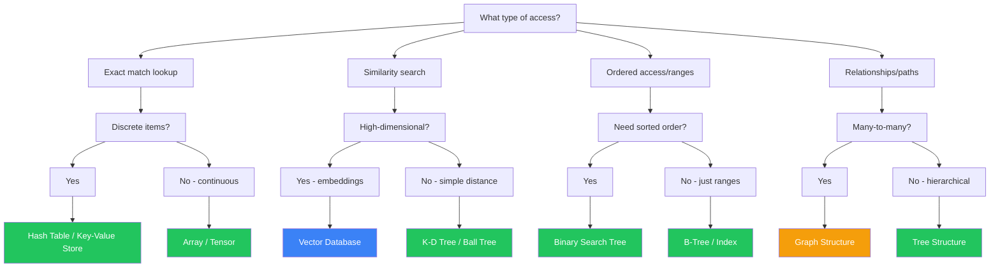
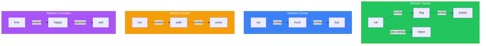
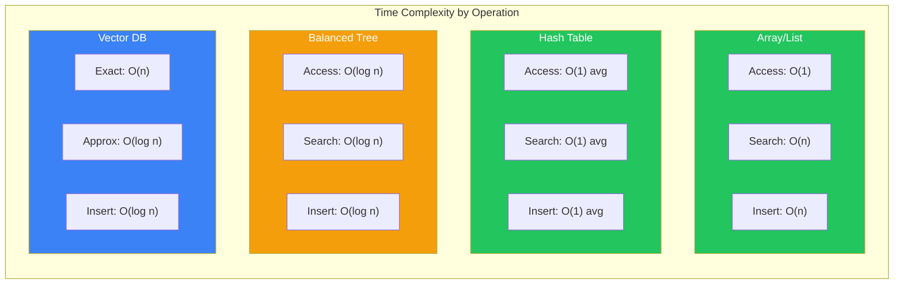

# Module 2: Data Structures for the AI Era

**Part 1: Foundations** | **Duration**: 1 hour 30 minutes | **Difficulty**: Beginner

---

## Learning Objectives

By the end of this module, you will be able to:

- Understand how data structures underpin AI systems and their operations
- Recognize which data structures are most relevant for modern AI development
- Grasp embeddings as the fundamental data representation in AI
- Connect traditional computer science concepts to modern AI implementations
- Make informed choices about data organization in AI-enhanced applications

---

## Section 1: Why Data Structures Matter for AI (10 minutes)

### The Foundation of Everything

You already know data structures matter. Arrays, hash tables, trees—they're the building blocks of software. Choose the wrong one and your algorithm goes from O(1) to O(n). Your fast API becomes a slow nightmare. Your elegant code turns into technical debt.

But here's what's changed: AI systems have introduced a new category of data structures that fundamentally reshape how we think about organizing and accessing information.

**Traditional data structures** organize discrete items: numbers, strings, objects. You access them through exact matches, ranges, or relationships. A hash table gives you instant lookup if you have the exact key. A tree gives you ordered traversal. A graph gives you relationship exploration.

**AI-era data structures** organize meaning. You access them through similarity and semantic relationships. A vector database gives you "things like this." An embedding space lets you compute "how related are these concepts?" This is fundamentally different.

### The Old World: Exact Matches

Consider how you traditionally search data:

```python
# Dictionary lookup: exact match required
user = users["user_12345"]

# Database query: precise predicate
results = db.query("SELECT * FROM products WHERE price < 50")

# Array search: equality test
found = "error" in log_messages
```

All of these require you to specify exactly what you're looking for. You need the right key, the right column name, the right search term. Close doesn't count.

This works brilliantly when you know what you want. It falls apart when you're looking for:

- Similar items
- Conceptually related content
- Patterns across variations
- Meaning rather than exact matches

### The New World: Semantic Similarity

Now consider how AI systems search data:

```python
# Vector similarity: semantic search
similar = vector_db.search(embedding("cats"), k=5)
# Returns: cats, kittens, felines, pets, animals

# Semantic query: meaning-based
results = semantic_search("affordable products")
# Returns items related to cheapness, budget-friendly, economical

# Embedding comparison: conceptual distance
similarity = cosine_similarity(
    embed("king") - embed("man") + embed("woman"),
    embed("queen")
)
# Returns: 0.87 (highly similar)
```

These searches work with meaning, not exact matches. They understand that "cats" relates to "kittens," that "affordable" connects to "cheap," that conceptual arithmetic makes semantic sense.

This capability comes from how AI systems represent information: as vectors in high-dimensional space. Understanding this representation—and the data structures that support it—is essential for modern development.

### Why This Module Matters

We're going to bridge traditional computer science and modern AI by:

1. **Reviewing classic data structures** with an eye toward where they appear in AI systems
2. **Understanding their computational characteristics** and why they matter for AI workloads
3. **Introducing vector representations** as the new fundamental data type
4. **Exploring embeddings** as a revolutionary way to organize information

By the end, you'll understand not just what a vector database is, but why it exists—and why traditional databases couldn't fill that role.

---

## Section 2: Arrays, Lists, and Sequences (15 minutes)

### The Universal Data Structure

Arrays and lists are foundational because they're simple and universal. They store ordered sequences of items. That's it. And that simplicity makes them incredibly versatile.

In AI systems, sequences are everywhere:

- **Token sequences**: Every text input becomes an ordered list of tokens
- **Embeddings**: Each token's vector representation is an array of numbers
- **Training batches**: Groups of examples processed together
- **Model outputs**: Generated sequences of tokens
- **Time series**: Ordered observations for prediction tasks

Understanding how sequences work at a low level helps you reason about AI performance characteristics.

### Computational Characteristics

The operations that matter for sequences:

**Access by index**: O(1)

```python
# Instant access to any position
token = sequence[42]
embedding_dimension = vector[128]
```

This is crucial when you need random access to specific positions—like retrieving a particular token's embedding during processing.

**Append to end**: O(1) amortized

```python
# Building sequences incrementally
generated_tokens.append(next_token)
```

AI models generate text one token at a time. Fast appending matters.

**Search for value**: O(n)

```python
# Linear scan required
if target_token in sequence:
    # Found it
```

Without an index, you check every item. This becomes expensive for large sequences.

**Insertion/deletion in middle**: O(n)

```python
# Everything after shifts
sequence.insert(10, new_token)
```

Rarely needed in AI workflows, but important to understand the cost when it is.

### Tensors: Multidimensional Arrays

Here's where AI extends the basic array concept: tensors are multidimensional arrays that represent increasingly complex data:

**1D tensor (vector)**: A single sequence

```python
embedding = [0.123, -0.456, 0.789, ...]  # Shape: (768,)
```

One token's representation. A list of numbers.

**2D tensor (matrix)**: Sequence of sequences

```python
batch_embeddings = [
    [0.123, -0.456, 0.789, ...],  # Token 1
    [0.234, -0.567, 0.890, ...],  # Token 2
    [0.345, -0.678, 0.901, ...],  # Token 3
]  # Shape: (3, 768)
```

Three tokens' embeddings. Each row is one token.

**3D tensor**: Batch of sequences

```python
batch = [
    [[...], [...], [...]],  # Sequence 1
    [[...], [...], [...]],  # Sequence 2
]  # Shape: (2, 3, 768)
```

Two sequences of three tokens each. Batch processing multiple inputs simultaneously.

**4D tensor and beyond**: Images, video, complex structures

```python
images = [[[[...]]]]  # Shape: (batch, height, width, channels)
```

The dimensionality represents the structure of your data. Understanding tensor shapes is essential for working with AI models—every input and output is a tensor.

### Shape Thinking

When debugging AI code, you'll spend significant time thinking about shapes. A mismatch causes errors:

```python
# Expected: (batch_size, sequence_length, embedding_dim)
# Got: (sequence_length, embedding_dim)
# Error: Missing batch dimension

# Expected: (10, 768)
# Got: (10, 512)
# Error: Wrong embedding dimension
```

Get comfortable asking: "What's the shape of this tensor?" It's the AI equivalent of "What's the type of this variable?"

### Where Sequences Matter in AI

**Tokenization**: Text becomes a sequence of integers

```python
text = "Hello, world!"
tokens = [15496, 11, 1917, 0]  # Sequence of token IDs
```

**Embeddings**: Each token maps to a dense vector

```python
token_15496 -> [0.123, -0.456, 0.789, ..., 0.234]  # 768 dimensions
```

**Processing**: Models operate on these sequences

```python
# Input: (batch=1, seq_len=4, embed=768)
# Output: (batch=1, seq_len=4, embed=768)
```

**Generation**: Outputs build sequences incrementally

```python
generated = []
for _ in range(max_tokens):
    next_token = model.predict(generated)
    generated.append(next_token)
```

Understanding sequences deeply helps you reason about context windows, batch sizes, memory usage, and performance optimization.

---

## Section 3: Hash Tables and Key-Value Stores (15 minutes)

### The Instant Lookup Structure

Hash tables solve a fundamental problem: how do you find something in a massive collection without searching through everything?

The answer: compute where it should be stored, then go directly there.

This gives you O(1) average-case lookup—instant access regardless of collection size. With a million items, finding one takes the same time as with ten items.

### How Hash Tables Work (Quick Refresher)

The core concept:

1. **Hash function**: Converts a key to an index

```python
hash("user_12345") -> 7821
```

2. **Array storage**: Store value at that index

```python
array[7821] = user_data
```

3. **Collision handling**: Deal with hash conflicts

```python
# If slot 7821 is occupied, use backup strategy
# - Chaining: Link multiple items at same index
# - Open addressing: Try next slot
```

The magic is the hash function: deterministic, fast, and distributes keys evenly across available space.

### Why Hash Tables Matter for AI

AI systems use hash tables constantly:

**Token vocabularies**: Map text to token IDs

```python
tokenizer.vocab = {
    "hello": 15496,
    "world": 1917,
    "AI": 16781,
    # ... 50,000+ entries
}

# O(1) lookup regardless of vocabulary size
token_id = tokenizer.vocab[word]
```

**Caching**: Store computed results to avoid recomputation

```python
embedding_cache = {
    "hello": [0.123, -0.456, ...],
    "world": [0.234, -0.567, ...],
}

# Check cache before computing
if text in embedding_cache:
    return embedding_cache[text]
else:
    embedding = compute_embedding(text)
    embedding_cache[text] = embedding
    return embedding
```

**Configuration**: Model parameters, hyperparameters, settings

```python
config = {
    "model_name": "claude-3-opus",
    "temperature": 0.7,
    "max_tokens": 1024,
}
```

**Attention mappings**: Though abstracted, attention mechanisms use hash-table-like patterns for key-value-query operations (we'll explore this in depth in Module 8).

### The Embedding Lookup Pattern

One of the most important uses in AI: converting token IDs to embeddings.

```python
# Embedding matrix: 50,000 tokens × 768 dimensions
embedding_matrix = np.array([
    [0.123, -0.456, ...],  # Token 0
    [0.234, -0.567, ...],  # Token 1
    # ...
    [0.345, -0.678, ...],  # Token 49,999
])

# Lookup is just array indexing (effectively a hash table)
token_id = 15496
embedding = embedding_matrix[token_id]  # O(1) access
```

The token ID serves as a direct index into the embedding matrix. This is why token vocabularies are fixed-size: they correspond to rows in this matrix.

### Key-Value Stores in Production AI

At scale, hash tables evolve into distributed key-value stores:

**Redis**: In-memory cache for embeddings

```python
# Cache expensive embedding computations
redis.set(f"embedding:{text_hash}", embedding_vector)
embedding = redis.get(f"embedding:{text_hash}")
```

**DynamoDB / Firestore**: Persistent storage for AI state

```python
# Store conversation history
db.put({
    "conversation_id": "conv_123",
    "messages": [...],
    "embeddings": [...],
})
```

**Memory in AI agents**: Agents use key-value stores for recall

```python
agent.memory = {
    "user_preference": "prefers concise responses",
    "conversation_context": "discussing AI data structures",
    "last_action": "explained hash tables",
}
```

### Limitations for AI Workloads

Hash tables excel at exact-match lookups but fail at:

**Similarity search**: "Find items like this one"

```python
# Hash table: Can't do this efficiently
similar = find_similar(target_embedding)

# Need different structure: vector database
similar = vector_db.search(target_embedding, k=5)
```

**Range queries**: "Find all items between X and Y"

```python
# Hash table: Must scan everything
results = [v for k, v in table.items() if x <= k <= y]  # O(n)

# Better: Sorted structure like B-tree
results = tree.range_query(x, y)  # O(log n + k)
```

**Nearest neighbors**: "Find the 10 closest matches"

```python
# Hash table: Compute distance to everything
closest = sorted(items, key=lambda x: distance(query, x))[:10]  # O(n log n)

# Better: Specialized index (HNSW, IVF)
closest = index.search(query, k=10)  # O(log n)
```

This is why AI systems need new data structures. Hash tables remain essential for exact lookups, but semantic search requires different approaches.

---

## Section 4: Trees and Hierarchical Data (15 minutes)

### Organizing by Relationships

Trees represent hierarchical relationships. Unlike sequences (linear) or hash tables (flat), trees capture structure: parents, children, ancestry, depth.

You've used trees constantly, even if you haven't thought about them:

- File systems (directories and files)
- DOM structure (HTML elements)
- Organization charts (management hierarchies)
- Decision trees (if-then chains)
- Parse trees (syntax structures)

In AI contexts, trees appear in specific but important places.

### Binary Search Trees: Sorted Access

The fundamental tree structure for sorted data:

```
       50
      /  \
    30    70
   /  \   / \
  20  40 60  80
```

Every node follows a rule: left children are smaller, right children are larger. This enables:

**Sorted traversal**: Visit all items in order - O(n)

```python
def inorder(node):
    if node.left: inorder(node.left)
    visit(node)
    if node.right: inorder(node.right)
```

**Efficient search**: Find any item - O(log n) for balanced trees

```python
def search(node, target):
    if not node: return None
    if target == node.value: return node
    if target < node.value: return search(node.left, target)
    return search(node.right, target)
```

**Range queries**: Find all items in a range - O(log n + k)

```python
def range_query(node, low, high, results):
    if not node: return
    if low < node.value: range_query(node.left, low, high, results)
    if low <= node.value <= high: results.append(node.value)
    if high > node.value: range_query(node.right, low, high, results)
```

### Decision Trees in Machine Learning

Before neural networks dominated, decision trees were the workhorse of ML:

```
                Is feature_1 > 0.5?
                   /         \
                 Yes          No
                  |            |
        Is feature_2 > 0.3?  Return: Class A
            /         \
          Yes          No
           |            |
    Return: Class B   Return: Class C
```

Each node asks a question. Each path leads to a decision. The tree structure represents learned decision boundaries.

**Advantages**:

- Interpretable: You can trace exactly why a prediction was made
- Handle non-linear relationships: Complex decisions decompose into simple yes/no questions
- No feature scaling needed: Decisions are based on thresholds, not distances

**Where they're used in AI**:

- Random forests: Ensembles of decision trees that vote
- Gradient boosted trees: Sequential trees that learn from previous errors
- XGBoost, LightGBM: Optimized implementations for tabular data

Neural networks largely replaced decision trees for unstructured data (text, images), but trees remain competitive for structured/tabular data.

### Hierarchical Attention: Trees in Transformers

Modern transformers use attention mechanisms that can be understood through tree-like patterns. When processing a sentence, attention creates relationships:

```
                     "The cat sat"
                    /      |      \
                  /        |        \
              "The"      "cat"      "sat"
                |       /    \        |
            (article) (noun) (subject) (verb)
```

Each token attends to others with varying weights, creating implicit hierarchical relationships. We'll explore this deeply in Module 8, but the tree metaphor helps: attention builds a weighted graph of relationships, often with hierarchical patterns.

### Trie Structures: Prefix Trees

A specialized tree for text that shares common prefixes:

```
           root
           /  \
          c    h
          |    |
          a    e
         / \   |
        t   r  l
            |  |
            e  l
                |
                o
```

This represents: "cat", "care", "hello"

**Why this matters for AI**:

**Tokenization**: Some tokenizers use tries to efficiently match text to tokens

```python
# Find longest matching token prefix
current = root
for char in text:
    if char in current.children:
        current = current.children[char]
    else:
        break
# current.token_id gives the matched token
```

**Autocomplete**: Prefix search is natural with tries

```python
# Find all tokens starting with "hel"
node = trie.navigate("hel")
completions = trie.all_descendants(node)
# Returns: ["hello", "help", "helmet", ...]
```

**Beam search**: Tree structures guide generation strategies

```python
# Expand most promising branches
beam = [(root, score)]
for step in range(max_steps):
    candidates = []
    for node, score in beam:
        for child in node.children:
            candidates.append((child, score + child.score))
    beam = sorted(candidates, key=lambda x: x[1])[:beam_width]
```

### When Trees Fail in AI

Trees have limitations for AI workloads:

**Curse of dimensionality**: Tree-based search breaks down in high dimensions

```python
# 2D space: Binary space partition works great
# 768D space: Nearly every point is equidistant from every other
# Tree structure provides little benefit
```

**Rigid structure**: Trees require hierarchical relationships

```python
# Good for: File systems, taxonomies, org charts
# Bad for: Semantic similarity, where relationships are fluid
```

**Update cost**: Balancing trees after insertions is expensive

```python
# Each insert may require tree rebalancing: O(log n)
# Batch updates more efficient than incremental
```

This is why vector databases use different index structures (HNSW graphs, approximate methods) rather than trees for high-dimensional similarity search.

---

## Section 5: Graphs and Networks (15 minutes)

### Beyond Hierarchies

Trees represent one-to-many relationships (each node has one parent, multiple children). Graphs represent any-to-any relationships: nodes connected to any number of other nodes, in any pattern.

```
     A --- B
     |   / |
     | /   |
     C --- D
      \   /
        E
```

Every node can connect to any other. Relationships can be:

- **Directed**: A → B (A links to B, but not vice versa)
- **Undirected**: A — B (mutual connection)
- **Weighted**: A —5→ B (connection has a strength)
- **Labeled**: A —"likes"→ B (connection has a type)

### Graph Representation Methods

**Adjacency matrix**: 2D array of connections

```python
# matrix[i][j] = 1 if edge exists, 0 otherwise
graph = [
    [0, 1, 1, 0, 0],  # Node 0 connects to 1, 2
    [1, 0, 0, 1, 1],  # Node 1 connects to 0, 3, 4
    [1, 0, 0, 1, 0],  # Node 2 connects to 0, 3
    [0, 1, 1, 0, 1],  # Node 3 connects to 1, 2, 4
    [0, 1, 0, 1, 0],  # Node 4 connects to 1, 3
]

# Check connection: O(1)
connected = graph[i][j] == 1

# Find all neighbors: O(n) - must scan entire row
neighbors = [j for j in range(n) if graph[i][j] == 1]
```

Space complexity: O(n²) - wasteful for sparse graphs

**Adjacency list**: Dictionary/list of neighbors

```python
graph = {
    0: [1, 2],
    1: [0, 3, 4],
    2: [0, 3],
    3: [1, 2, 4],
    4: [1, 3],
}

# Check connection: O(degree)
connected = j in graph[i]

# Find all neighbors: O(1)
neighbors = graph[i]
```

Space complexity: O(n + e) where e = number of edges - efficient for sparse graphs

### Knowledge Graphs in AI

Knowledge graphs represent facts as relationships between entities:

```
(Albert Einstein) —[born_in]→ (Germany)
(Albert Einstein) —[developed]→ (Theory of Relativity)
(Theory of Relativity) —[describes]→ (Spacetime)
(Spacetime) —[composed_of]→ (Space, Time)
```

These enable:

**Structured knowledge storage**: Facts as edges

```python
knowledge_graph.add_triple(
    subject="Einstein",
    predicate="won",
    object="Nobel Prize"
)
```

**Reasoning through relationships**: Multi-hop queries

```python
# "What did the person who developed relativity win?"
query = kg.query("""
    ?person developed "Theory of Relativity" .
    ?person won ?award .
""")
# Returns: Nobel Prize
```

**Context for AI systems**: Grounding LLM outputs in facts

```python
# Retrieve relevant facts for query
facts = kg.get_neighbors("Einstein", max_hops=2)
# Include in prompt to reduce hallucinations
```

### Graph Neural Networks (GNNs)

Neural networks that operate on graph-structured data. Instead of processing sequences or grids, they process arbitrary node-relationship structures.

**Key idea**: Each node aggregates information from its neighbors

```python
for layer in range(num_layers):
    for node in graph.nodes:
        neighbor_features = [graph.nodes[n].features for n in node.neighbors]
        aggregated = aggregate(neighbor_features)  # mean, sum, max, etc.
        node.features = combine(node.features, aggregated)
```

This lets the network learn patterns in graph structure.

**Applications**:

- **Social networks**: Predict user interests based on friend graphs
- **Molecule property prediction**: Atoms as nodes, bonds as edges
- **Recommendation systems**: Users and items as nodes, interactions as edges
- **Knowledge graph reasoning**: Predict missing relationships

### Attention as a Graph

Here's a crucial connection: attention mechanisms in transformers create fully-connected graphs.

```
      [The]
     /  |  \
   /    |    \
[cat] [sat] [mat]
  |   /  |  \  |
  | /    |    \|
 [on]   [the]
```

Every token connects to every other token with learned edge weights. Attention is graph processing where:

- Nodes: Token positions
- Edges: Attention weights (how much each token "attends" to each other token)
- Graph is fully connected: Every token can influence every other

This is why transformers scale poorly with sequence length: O(n²) edges for n tokens.

### Graph Search Algorithms in AI

Graph traversal algorithms appear throughout AI:

**Breadth-First Search (BFS)**: Explore level by level

```python
def bfs(graph, start):
    queue = [start]
    visited = {start}
    while queue:
        node = queue.pop(0)
        for neighbor in graph[node]:
            if neighbor not in visited:
                visited.add(neighbor)
                queue.append(neighbor)
```

Used in: Agent planning (shortest path), knowledge graph traversal, game AI

**Depth-First Search (DFS)**: Explore as deep as possible first

```python
def dfs(graph, node, visited=None):
    if visited is None: visited = set()
    visited.add(node)
    for neighbor in graph[node]:
        if neighbor not in visited:
            dfs(graph, neighbor, visited)
```

Used in: Decision tree exploration, recursive reasoning, backtracking search

**A\* Search**: Informed search with heuristics

```python
def a_star(graph, start, goal, heuristic):
    frontier = PriorityQueue()
    frontier.put((0, start))
    cost_so_far = {start: 0}

    while frontier:
        current = frontier.get()[1]
        if current == goal: return path

        for next in graph.neighbors(current):
            new_cost = cost_so_far[current] + graph.cost(current, next)
            if next not in cost_so_far or new_cost < cost_so_far[next]:
                cost_so_far[next] = new_cost
                priority = new_cost + heuristic(next, goal)
                frontier.put((priority, next))
```

Used in: Path planning for robotics, optimal action selection in agents

### The Graph View of AI Systems

Understanding AI systems through graphs provides powerful mental models:

- **Neural networks**: Graphs of computation (nodes = operations, edges = data flow)
- **Attention**: Dynamic graph construction based on content
- **Knowledge bases**: Explicit graphs of facts and relationships
- **Agent reasoning**: Graph search through possible action sequences

As you progress through this course, you'll see graph patterns repeatedly. The data structure is more relevant to AI than it might initially appear.

---

## Section 6: Vector Spaces and Embeddings (15 minutes)

### The Revolution in Data Representation

Everything we've discussed so far—arrays, hash tables, trees, graphs—deals with discrete items and explicit relationships. You store specific values and access them through defined operations.

Embeddings change the game entirely.

An embedding represents information as a point in continuous, high-dimensional space. Instead of discrete categories or exact values, you have positions in a space where distance means similarity.

This is revolutionary because:

**Similarity becomes computation**: How related are two concepts? Measure their distance.

**Relationships become geometry**: "King - Man + Woman = ?" becomes vector arithmetic.

**Search becomes nearest neighbors**: Find similar items by finding nearby points.

**Meaning becomes structure**: The space's geometry encodes semantic relationships.

### What Is an Embedding?

At the most basic level, an embedding is just an array of numbers:

```python
embedding = [0.123, -0.456, 0.789, ..., 0.234]  # 768 numbers
```

But these numbers aren't arbitrary. They're coordinates in a high-dimensional space that has been carefully constructed so that semantically similar things end up close together.

```python
# Word embeddings (simplified to 3D for visualization)
cat   = [0.8, 0.9, 0.1]
kitten = [0.82, 0.88, 0.12]  # Very close to 'cat'
dog   = [0.75, 0.85, 0.15]   # Somewhat close to 'cat'
car   = [0.1, 0.2, 0.8]      # Far from 'cat'
```

Plot these in 3D space and you'd see 'cat' and 'kitten' very close, 'dog' nearby, and 'car' distant. Scale this up to 768 dimensions and you have modern embeddings.

### How Embeddings Are Created

Embeddings are learned, not designed. The process:

1. **Initialize randomly**: Start with random numbers for each item

```python
vocab_size = 50000
embedding_dim = 768
embeddings = np.random.randn(vocab_size, embedding_dim)
```

2. **Train on a task**: Adjust embeddings to make the task work better

```python
# Example: Predict next word
context_embedding = embeddings[context_tokens].mean()
predicted_word = model(context_embedding)
loss = difference(predicted_word, actual_word)
# Adjust embeddings to reduce loss
```

3. **Emerge with structure**: After training, similar items naturally cluster

```python
# Not explicitly programmed, but emerges from training
distance(embed("cat"), embed("kitten"))  # Small
distance(embed("cat"), embed("car"))     # Large
```

The model learns that certain words should have similar embeddings because they're used in similar contexts, appear in similar relationships, or contribute similarly to predictions.

### Dense vs Sparse Representations

**Sparse representation**: Most values are zero

```python
# One-hot encoding: vocabulary of 50,000
"cat" = [0, 0, 0, ..., 1, ..., 0, 0]  # 50,000 dimensions, one 1
"dog" = [0, 0, 0, ..., 1, ..., 0, 0]  # Different position

# No notion of similarity
distance(cat_onehot, dog_onehot) == distance(cat_onehot, car_onehot)
```

**Dense representation**: Most values are non-zero

```python
# Embedding: learned representation
"cat" = [0.12, -0.45, 0.78, ..., 0.23]  # 768 dimensions, all meaningful
"dog" = [0.15, -0.42, 0.81, ..., 0.26]  # Similar values

# Meaningful similarity
distance(cat_embed, dog_embed) < distance(cat_embed, car_embed)
```

Dense embeddings pack more information into fewer dimensions. Instead of 50,000 sparse dimensions, you get 768 dense dimensions that capture much more meaning.

### Measuring Similarity

The key operation with embeddings: measuring distance/similarity.

**Euclidean distance**: Straight-line distance

```python
def euclidean_distance(a, b):
    return np.sqrt(np.sum((a - b) ** 2))

# Smaller = more similar
dist = euclidean_distance(cat_embedding, dog_embedding)
```

**Cosine similarity**: Angle between vectors

```python
def cosine_similarity(a, b):
    return np.dot(a, b) / (np.linalg.norm(a) * np.linalg.norm(b))

# 1 = identical direction, 0 = perpendicular, -1 = opposite
sim = cosine_similarity(cat_embedding, dog_embedding)
```

Cosine similarity is most common for text embeddings because it measures direction regardless of magnitude. Two texts with similar meaning point in similar semantic directions.

### Semantic Arithmetic

Embeddings enable surprising mathematical operations on meaning:

```python
# Classic example: King - Man + Woman ≈ Queen
result = embed("king") - embed("man") + embed("woman")
closest = find_nearest(result)
# Returns: "queen"

# Other examples:
embed("Paris") - embed("France") + embed("Germany") ≈ embed("Berlin")
embed("walking") - embed("walk") + embed("swim") ≈ embed("swimming")
```

This works because the embedding space captures relationships as directions. The "gender" relationship between "king" and "queen" is encoded as a vector direction that's similar to the direction between "man" and "woman."

### Multi-Level Embeddings in AI

Modern AI systems use embeddings at multiple levels:

**Token embeddings**: Individual word pieces

```python
"hello" -> [0.123, -0.456, ..., 0.234]  # 768-dim
```

**Positional embeddings**: Where in the sequence

```python
position_0 -> [0.011, 0.022, ..., 0.033]  # 768-dim
position_1 -> [0.012, 0.023, ..., 0.034]  # 768-dim
```

**Combined input**: Token + position

```python
input_embedding = token_embedding + positional_embedding
```

**Contextual embeddings**: Change based on surrounding context

```python
# "bank" has different contextual embeddings in:
"river bank" -> [0.5, 0.7, ...]
"savings bank" -> [0.2, 0.3, ...]
```

**Sentence embeddings**: Entire text as single vector

```python
"The cat sat on the mat" -> [0.345, -0.678, ..., 0.901]
```

Each level captures different information, all represented as vectors in learned spaces.

### Vector Databases

Embeddings require new database technology. Traditional databases organize discrete records with exact-match queries. Vector databases organize high-dimensional points with similarity queries.

**Traditional database**:

```sql
SELECT * FROM documents WHERE category = 'AI'
```

Returns documents where category exactly equals 'AI'.

**Vector database**:

```python
vector_db.search(
    query_embedding=embed("artificial intelligence"),
    k=10
)
```

Returns the 10 documents whose embeddings are closest to the query embedding.

This enables **semantic search**: finding documents by meaning rather than exact keywords. A query for "artificial intelligence" can return documents about "machine learning," "neural networks," or "deep learning" even if they never use the term "artificial intelligence."

### The Embedding Pipeline

Here's how text becomes searchable via embeddings:

```
Text Input → Tokenization → Token IDs → Embedding Lookup → Vector
"Hello world" → ["Hello", "world"] → [15496, 1917] → [[0.12,...], [0.34,...]] → [0.23,...]
```

1. **Tokenization**: Break text into pieces
2. **Token IDs**: Map pieces to vocabulary indices
3. **Embedding Lookup**: Retrieve vector for each token
4. **Aggregation**: Combine token embeddings (mean, weighted, transformer output)
5. **Final embedding**: Single vector representing entire input

This pipeline runs billions of times per day across AI systems. Understanding it helps you debug, optimize, and design better AI applications.

### Why Embeddings Matter for You

As a developer working with AI, embeddings appear everywhere:

- **RAG systems**: Embed documents for semantic search
- **Recommendation engines**: Embed users and items for similarity matching
- **Clustering**: Group similar items by embedding proximity
- **Classification**: Use embeddings as features for downstream models
- **Evaluation**: Measure semantic similarity between generated and reference text

You don't need to train embeddings from scratch (pre-trained models exist), but you need to understand what they are, how they work, and when to use them.

---

## Section 7: Practical Application (5 minutes)

### Choosing the Right Data Structure

When building AI-enhanced systems, you'll combine traditional and modern data structures. Here's a decision framework:

**Use hash tables / key-value stores when**:

- You need exact-match lookups: user IDs, configuration keys, token vocabularies
- You're caching computed results: embeddings, API responses
- You need O(1) access to discrete items

**Use arrays / tensors when**:

- You're representing sequences: token lists, time series
- You're working with model inputs/outputs: embeddings, activations
- You need fast indexed access or batch operations

**Use trees when**:

- You have hierarchical relationships: document structure, decision logic
- You need sorted access or range queries: timestamp ranges, sorted IDs
- You're implementing parsers or decision trees

**Use graphs when**:

- Relationships are many-to-many: social networks, knowledge graphs
- You need path finding or network analysis: agent planning, reasoning chains
- Structure is network-like: dependencies, citations, links

**Use vector databases when**:

- You need similarity search: "find documents like this"
- You're building semantic search: meaning-based rather than keyword-based
- You're implementing RAG: retrieval-augmented generation systems

### Common Patterns in AI Applications

**Pattern 1: Hybrid search**

```python
# Combine exact match (hash table) + semantic search (vector DB)
exact_results = cache.get(query_hash)  # Fast path for exact duplicates
if not exact_results:
    semantic_results = vector_db.search(embed(query), k=10)
    return semantic_results
```

**Pattern 2: Embedding cache**

```python
# Hash table caches expensive embedding computations
embedding = embedding_cache.get(text_hash)
if not embedding:
    embedding = model.embed(text)  # Expensive
    embedding_cache.set(text_hash, embedding)
return embedding
```

**Pattern 3: Graph + embeddings**

```python
# Knowledge graph provides structure, embeddings provide similarity
related_entities = knowledge_graph.neighbors(entity)  # Graph traversal
entity_embeddings = [embed(e) for e in related_entities]
most_similar = max(entity_embeddings, key=lambda e: cosine_sim(query_embed, e))
```

**Pattern 4: Multi-stage retrieval**

```python
# Tree/index for fast filtering, then vector search for ranking
candidates = index.range_query(start_date, end_date)  # Tree: fast filtering
candidate_embeddings = [doc.embedding for doc in candidates]
ranked = sorted(candidates, key=lambda d: similarity(query_embed, d.embedding))
return ranked[:10]
```

### Performance Considerations

**Embedding computation**: Expensive, should be cached or batched

```python
# Bad: Embed one at a time
for text in texts:
    embedding = model.embed(text)  # Many small API calls

# Good: Batch embed
embeddings = model.embed_batch(texts)  # One large API call
```

**Vector search**: Approximate for speed, exact for accuracy

```python
# Approximate (fast): HNSW, IVF indexes
results = approx_index.search(query, k=100)  # Fast, might miss some

# Exact (slow): Brute force comparison
results = exact_search(query, all_vectors, k=100)  # Accurate, slow for large datasets
```

**Dimensionality**: Higher isn't always better

```python
# 1536 dimensions: More information, slower search, more storage
# 768 dimensions: Less information, faster search, less storage
# 384 dimensions: Sufficient for many applications, very fast

# Choose based on your accuracy/speed tradeoff
```

### Real-World Tradeoffs

You'll constantly balance:

- **Accuracy vs Speed**: Exact search vs approximate
- **Storage vs Computation**: Cache embeddings vs compute on-demand
- **Flexibility vs Performance**: General structures vs specialized indexes
- **Simplicity vs Optimization**: Simple sequential scan vs complex index structures

Start simple. Profile. Optimize where it matters. Don't pre-optimize—most applications don't need the most sophisticated solutions.

---

## Diagrams

### Data Structure Decision Tree



### Embedding Space Visualization



### Token-to-Embedding Pipeline


### Complexity Comparison



---

## Knowledge Check

Test your understanding with these questions:

### Question 1

What is the fundamental difference between traditional data structures and embeddings?

- A) Embeddings use more memory
- B) Traditional structures store discrete items with exact matches; embeddings represent information as points in continuous space where distance means similarity
- C) Embeddings are faster to search
- D) Traditional structures can't be used with AI systems

**Correct Answer**: B

**Explanation**: The revolutionary aspect of embeddings is that they represent information as continuous vectors where semantic similarity corresponds to geometric proximity. Traditional data structures (hash tables, trees, etc.) organize discrete items and require exact matches or explicit relationships, while embeddings enable similarity-based operations through distance computation.

### Question 2

Why are hash tables (O(1) lookup) not sufficient for AI similarity search?

- A) Hash tables are too slow for AI workloads
- B) Hash tables require exact key matches and can't efficiently find "similar" items or nearest neighbors
- C) Hash tables can't store embeddings
- D) Hash tables only work with text data

**Correct Answer**: B

**Explanation**: Hash tables excel at exact-match lookups but have no concept of similarity. Given a query embedding, a hash table can't help you find "nearby" embeddings—you'd need to compute distance to every stored embedding (O(n)). This is why vector databases use specialized index structures (HNSW, IVF) that organize points by proximity.

### Question 3

What does it mean when we say embeddings enable "semantic arithmetic"?

- A) You can add up the file sizes of embeddings
- B) You can perform vector operations like "king - man + woman ≈ queen" that yield semantically meaningful results
- C) Embeddings make math operations faster
- D) You can count the number of dimensions in an embedding

**Correct Answer**: B

**Explanation**: Semantic arithmetic refers to the surprising property that mathematical operations on embeddings produce semantically meaningful results. Because the embedding space encodes relationships as geometric directions, you can manipulate meaning through vector math. "King - man + woman" removes the "masculine" direction and adds the "feminine" direction, landing near "queen."

### Question 4

In the context of AI models, what is a tensor?

- A) A type of neural network
- B) A multidimensional array that represents structured data (1D vectors, 2D matrices, 3D batches, etc.)
- C) A measure of model accuracy
- D) A tokenization algorithm

**Correct Answer**: B

**Explanation**: A tensor is a multidimensional array. In AI: 1D tensors are vectors (single sequences), 2D tensors are matrices (batches of sequences or embeddings), 3D tensors are batches of sequences, and 4D+ represent images, video, or other structured data. Understanding tensor shapes is crucial for debugging AI code—shape mismatches are among the most common errors.

### Question 5

Why do modern AI systems use "dense" embeddings rather than "sparse" one-hot encodings?

- A) Dense embeddings are easier to compute
- B) Dense embeddings pack more semantic information into fewer dimensions and enable similarity comparisons
- C) Sparse encodings don't work with neural networks
- D) Dense embeddings use less memory

**Correct Answer**: B

**Explanation**: One-hot encodings (sparse) represent each item as a unique position in a large vector (50,000 dimensions for a 50,000-word vocabulary) with no notion of similarity—every word is equally different from every other. Dense embeddings (768 dimensions) pack semantic meaning into fewer dimensions where similar concepts have similar values, enabling similarity computation and capturing relationships.

---

## Hands-On Exercise: Embedding Explorer

### Objective

Build intuition about embeddings by exploring pre-trained embeddings, computing similarities, and visualizing semantic relationships.

### Time Required

45-60 minutes

### Prerequisites

- Python 3.8+
- Libraries: `numpy`, `sentence-transformers`, `scikit-learn`, `matplotlib`

### Setup

Install required libraries:

```bash
pip install sentence-transformers numpy scikit-learn matplotlib
```

### Exercise Steps

#### Part 1: Loading and Exploring Embeddings (15 minutes)

Create a new Python file `embedding_explorer.py`:

```python
from sentence_transformers import SentenceTransformer
import numpy as np
from sklearn.metrics.pairwise import cosine_similarity
import matplotlib.pyplot as plt

# Load a pre-trained embedding model
model = SentenceTransformer('all-MiniLM-L6-v2')

# Sample words and phrases to explore
texts = [
    "cat", "kitten", "dog", "puppy",
    "car", "vehicle", "truck", "bicycle",
    "happy", "joyful", "sad", "depressed",
    "king", "queen", "man", "woman",
    "run", "walk", "swim", "fly",
    "computer", "technology", "algorithm", "code"
]

# Generate embeddings
print("Generating embeddings...")
embeddings = model.encode(texts)

# Explore dimensions
print(f"\nEmbedding dimensions: {embeddings.shape}")
print(f"Number of texts: {embeddings.shape[0]}")
print(f"Dimensions per embedding: {embeddings.shape[1]}")

# Look at a single embedding
print(f"\nEmbedding for 'cat' (first 10 dimensions):")
print(embeddings[0][:10])
```

**Run this and observe**:

- How many dimensions do these embeddings have?
- What do the actual numbers look like?
- Are they normalized (all values between -1 and 1)?

#### Part 2: Computing Similarities (15 minutes)

Add similarity computation:

```python
def find_most_similar(query_text, texts, embeddings, top_k=5):
    """Find the most similar texts to the query."""
    query_embedding = model.encode([query_text])
    similarities = cosine_similarity(query_embedding, embeddings)[0]

    # Get indices of top-k most similar
    top_indices = np.argsort(similarities)[::-1][:top_k]

    print(f"\nMost similar to '{query_text}':")
    for i, idx in enumerate(top_indices, 1):
        print(f"  {i}. {texts[idx]}: {similarities[idx]:.4f}")

    return top_indices, similarities[top_indices]

# Test similarity searches
find_most_similar("kitten", texts, embeddings)
find_most_similar("automobile", texts, embeddings)
find_most_similar("joyful", texts, embeddings)

# Compute similarity matrix for all pairs
similarity_matrix = cosine_similarity(embeddings)
print(f"\nSimilarity matrix shape: {similarity_matrix.shape}")
```

**Experiment**:

- Try queries that aren't in the original list. How does the model handle them?
- Find similarity between very different concepts (e.g., "happy" and "car")
- Notice which pairs have high similarity scores

#### Part 3: Semantic Arithmetic (15 minutes)

Test vector arithmetic with meaning:

```python
def semantic_arithmetic(texts, embeddings, word1, word2, word3):
    """
    Perform: word1 - word2 + word3
    Example: king - man + woman ≈ queen
    """
    # Get embeddings for each word
    idx1 = texts.index(word1)
    idx2 = texts.index(word2)
    idx3 = texts.index(word3)

    # Perform vector arithmetic
    result = embeddings[idx1] - embeddings[idx2] + embeddings[idx3]

    # Find closest match
    similarities = cosine_similarity([result], embeddings)[0]
    top_idx = np.argmax(similarities)

    print(f"\n{word1} - {word2} + {word3} ≈ {texts[top_idx]}")
    print(f"Similarity score: {similarities[top_idx]:.4f}")

    # Show top 5 closest
    top_indices = np.argsort(similarities)[::-1][:5]
    print("\nTop 5 closest:")
    for i, idx in enumerate(top_indices, 1):
        print(f"  {i}. {texts[idx]}: {similarities[idx]:.4f}")

# Test semantic relationships
semantic_arithmetic(texts, embeddings, "king", "man", "woman")
semantic_arithmetic(texts, embeddings, "kitten", "cat", "dog")
semantic_arithmetic(texts, embeddings, "happy", "joyful", "sad")
```

**Explore**:

- Does "king - man + woman ≈ queen" work?
- Try other analogies: "kitten - cat + dog ≈ puppy"
- What happens with unrelated concepts?

#### Part 4: Visualization (15 minutes)

Visualize embeddings in 2D using dimensionality reduction:

```python
from sklearn.decomposition import PCA

# Reduce to 2D for visualization
pca = PCA(n_components=2)
embeddings_2d = pca.fit_transform(embeddings)

# Create visualization
plt.figure(figsize=(12, 8))
plt.scatter(embeddings_2d[:, 0], embeddings_2d[:, 1], alpha=0.6)

# Label each point
for i, text in enumerate(texts):
    plt.annotate(text, (embeddings_2d[i, 0], embeddings_2d[i, 1]),
                fontsize=9, alpha=0.8)

plt.title('Embedding Space (2D Projection)')
plt.xlabel('First Principal Component')
plt.ylabel('Second Principal Component')
plt.grid(True, alpha=0.3)
plt.tight_layout()
plt.savefig('embedding_visualization.png', dpi=300)
print("\nVisualization saved as 'embedding_visualization.png'")
plt.show()
```

**Observe**:

- Do related concepts cluster together?
- Where are "cat/kitten/dog/puppy" relative to each other?
- Where are "car/vehicle/truck" compared to animals?
- Does the 2D projection preserve semantic relationships?

#### Part 5: Exploration Challenge (Bonus)

Extend the code to explore your own domain:

```python
# Your domain-specific texts
your_texts = [
    # Add 20-30 terms from your area of expertise:
    # - Programming languages if you're a developer
    # - Medical terms if you're in healthcare
    # - Business concepts if you're in that domain
    # etc.
]

# Generate embeddings
your_embeddings = model.encode(your_texts)

# Explore relationships in your domain
find_most_similar("your_query_here", your_texts, your_embeddings)

# Test domain-specific semantic arithmetic
# semantic_arithmetic(your_texts, your_embeddings, "term1", "term2", "term3")
```

### Success Criteria

You've successfully completed this exercise if you:

- [ ] Generated embeddings for a set of texts
- [ ] Computed similarity scores between different concepts
- [ ] Found that semantically similar words have high similarity scores
- [ ] Tested semantic arithmetic (e.g., king - man + woman)
- [ ] Created a 2D visualization showing semantic clusters
- [ ] Explored embeddings for texts in your domain

### Reflection Questions

After completing the exercise, consider:

1. Were you surprised by any of the similarity scores? Which pairs were more/less similar than you expected?

2. How well did semantic arithmetic work? When did it succeed or fail?

3. In the 2D visualization, could you identify distinct semantic clusters?

4. How might you use embeddings in a real application you're building or have built?

5. What are the limitations you noticed? When might embeddings not capture the relationships you want?

### Going Further

Once you've completed the basic exercise:

- **Try different embedding models**: Compare `all-MiniLM-L6-v2` (small, fast) with `all-mpnet-base-v2` (larger, more accurate)
- **Explore sentence embeddings**: Instead of single words, embed full sentences and compare
- **Build a simple semantic search**: Create a collection of documents, embed them, and search by meaning
- **Test multilingual embeddings**: Use a multilingual model and compare embeddings across languages

---

## References

### Foundational Papers

1. **"Efficient Estimation of Word Representations in Vector Space"** - Mikolov et al. (2013)
   The Word2Vec paper that popularized dense word embeddings. Introduced skip-gram and CBOW architectures that learn embeddings from context.
   [arXiv:1301.3781](https://arxiv.org/abs/1301.3781)

2. **"GloVe: Global Vectors for Word Representation"** - Pennington et al. (2014)
   Alternative embedding approach based on word co-occurrence statistics. Shows embeddings capture semantic and syntactic relationships.
   [nlp.stanford.edu/projects/glove](https://nlp.stanford.edu/projects/glove/)

3. **"Attention Is All You Need"** - Vaswani et al. (2017)
   The transformer architecture paper. Introduces contextual embeddings where the same word gets different representations based on context.
   [arXiv:1706.03762](https://arxiv.org/abs/1706.03762)

### Practical Resources

4. **Sentence Transformers Documentation**
   Library for computing sentence and text embeddings. Practical guide to using pre-trained models.
   [sbert.net](https://www.sbert.net/)

5. **Pinecone Vector Database Guides**
   Comprehensive guides on vector databases, similarity search, and production deployments.
   [docs.pinecone.io](https://docs.pinecone.io/)

6. **OpenAI Embeddings Guide**
   Official documentation on using OpenAI's embedding models for various applications.
   [platform.openai.com/docs/guides/embeddings](https://platform.openai.com/docs/guides/embeddings)

### Deep Dives

7. **"Neural Network Embeddings Explained"** - Towards Data Science
   Accessible explanation of how and why embeddings work, with visualizations.

8. **"A Visual Exploration of Semantic Spaces"** - Distill.pub
   Interactive article exploring embedding spaces and their properties.
   [distill.pub](https://distill.pub/)

---

## Summary

In this module, you've learned:

1. **Traditional data structures remain essential** for organizing discrete data in AI systems: hash tables for vocabularies and caching, arrays for sequences and tensors, trees for hierarchies, graphs for relationships.

2. **Computational complexity matters** in AI workloads: O(1) lookups for token vocabularies, O(n²) attention over sequences, O(log n) approximate similarity search. Understanding these characteristics helps you design efficient systems.

3. **Embeddings are revolutionary**: They represent information as points in continuous high-dimensional space where geometric distance corresponds to semantic similarity. This enables similarity search, semantic arithmetic, and meaning-based operations impossible with traditional structures.

4. **Vector databases are purpose-built** for embedding search: Traditional databases can't efficiently find "similar" items, requiring new data structures (HNSW, IVF) that organize vectors by proximity.

5. **Hybrid approaches are common**: Real systems combine traditional structures (hash tables for caching, graphs for knowledge) with modern approaches (embeddings for search, vectors for representation).

The bridge between computer science fundamentals and AI is clearer now. The same principles—data organization, algorithmic complexity, tradeoffs between speed and accuracy—apply, but with new structures designed for semantic operations rather than just discrete lookups.

In the next module, we'll explore algorithms and computational thinking, focusing on how AI systems process these data structures to perform increasingly sophisticated tasks.

---

## What's Next

**Module 3: Algorithms and Computational Thinking in AI**

We'll cover:

- How classical algorithms appear in AI systems
- Search, sorting, and optimization in AI contexts
- The computational cost of training vs inference
- Parallelism and why GPUs matter
- Algorithmic thinking for prompt engineering

This will complete the foundation needed to understand how AI models actually compute their results.
