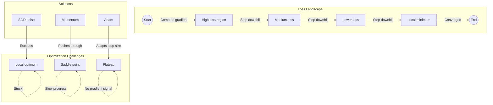
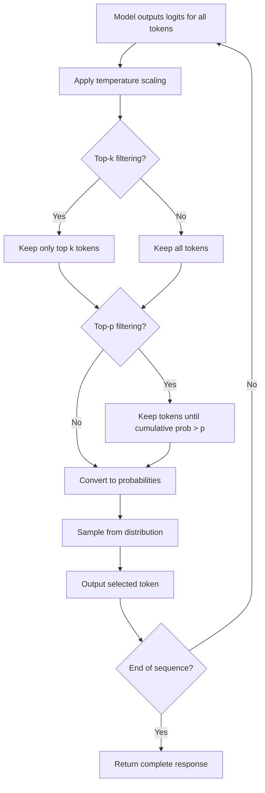

# Module 3: Algorithms That Power AI Systems

**Part 1: Foundations** | **Duration**: 1 hour 30 minutes | **Difficulty**: Beginner-Intermediate

---

## Learning Objectives

By the end of this module, you will be able to:

- Understand the algorithmic foundations that make modern AI possible
- Recognize gradient descent as the core optimization algorithm driving machine learning
- Grasp how search and optimization algorithms apply in AI contexts
- Connect classical computer science algorithms to their modern AI implementations
- Explain how LLMs select tokens during text generation

---

## Section 1: Algorithms in the Age of AI (10 minutes)

### Why Algorithms Matter More Than Ever

You might think that in the age of neural networks, classical algorithms are obsolete. After all, isn't the whole point of machine learning that systems learn patterns instead of following hand-coded rules?

The reality is exactly the opposite. Understanding algorithms has never been more important.

Modern AI systems are built on algorithmic foundations. The transformer architecture that powers ChatGPT and Claude? It's fundamentally a clever combination of matrix multiplication, attention mechanisms (a form of weighted search), and optimization algorithms. The training process that makes these systems useful? It's gradient descent at massive scale.

When you use an AI coding assistant, multiple algorithmic layers are at work:

- **Tokenization algorithms** break your code into processable units
- **Search algorithms** find relevant context from your codebase
- **Optimization algorithms** trained the model's billions of parameters
- **Sampling algorithms** select which tokens to generate next

You don't need to implement these from scratch. But understanding them transforms AI from a black box into a comprehensible system with predictable behaviors.

### The Three Pillars of AI Algorithms

AI systems rely on three fundamental algorithmic categories:

**Search**: Finding solutions in large spaces. Traditional AI was dominated by search—game-playing programs searched possible moves, planning systems searched action sequences. Modern AI still uses search extensively: finding similar embeddings, exploring generation paths, retrieving relevant context.

**Optimization**: Finding the best solution among alternatives. Machine learning is fundamentally optimization—finding model parameters that minimize prediction error. Understanding optimization illuminates why models succeed and fail.

**Sampling**: Selecting from probability distributions. When an LLM generates text, it doesn't deterministically choose the "best" next token. It samples from a distribution of possibilities, with various algorithms controlling that sampling process.

This module explores each pillar, building your intuition for how they combine to create intelligent-seeming behavior.

### From Theory to Practice

Every algorithm we'll discuss has direct practical implications:

- Understanding search helps you structure retrieval-augmented generation effectively
- Understanding optimization explains why fine-tuning works and when it fails
- Understanding sampling lets you tune generation parameters intelligently

By the end of this module, you'll see AI systems differently—not as mysterious black boxes, but as sophisticated combinations of comprehensible algorithmic components.

---

## Section 2: Search Algorithms (20 minutes)

### Search as the Foundation of AI

Before deep learning dominated, AI was largely about search. A chess program searches possible moves. A route planner searches possible paths. A theorem prover searches possible proof steps.

This framing remains powerful. Many AI problems can be cast as: given a starting point and a goal, find a path through some space of possibilities.

### Binary Search: The Simplest Case

Let's start with the most fundamental search algorithm. Binary search finds an item in a sorted list by repeatedly dividing the search space in half.

If you have a sorted list of 1 million items:

- Linear search might check all 1 million items
- Binary search needs at most 20 checks (log2 of 1,000,000)

The principle—systematically eliminating half the possibilities—appears throughout AI:

- **Embedding search** often uses hierarchical structures where each step narrows the candidate set
- **Decision trees** are essentially binary search over feature values
- **Beam search** (which we'll cover shortly) involves selection steps that eliminate candidates

The efficiency insight matters: when you can impose structure on your search space, you can search exponentially faster.

### Approximate Nearest Neighbor (ANN) Search

Here's where things get interesting for modern AI.

When you ask an AI system a question, it often needs to find relevant information. In retrieval-augmented generation (RAG), this means finding documents similar to your query. With embeddings, "similarity" is measured by distance in high-dimensional space.

The problem: you might have millions of embedded documents. Finding the absolute nearest neighbor requires checking every single one. With billion-item databases and real-time requirements, exact search is impossible.

Enter Approximate Nearest Neighbor algorithms. These trade perfect accuracy for massive speed improvements:

**Locality-Sensitive Hashing (LSH)**: Projects high-dimensional vectors into hash buckets designed so similar vectors land in the same bucket. Search becomes: hash your query, check items in matching buckets.

**Hierarchical Navigable Small Worlds (HNSW)**: Builds a multi-layer graph where each layer is increasingly sparse. Search starts at the top (coarse) layer and descends, using neighbors to navigate toward the target.

**IVF (Inverted File Index)**: Clusters vectors into groups, then searches only the most promising clusters.

These algorithms enable the vector databases powering modern AI applications. When you use semantic search, RAG, or recommendation systems, ANN search is doing the heavy lifting.

**The practical tradeoff**: ANN might miss the true nearest neighbor occasionally. But finding a very good match in milliseconds beats finding the perfect match in minutes. For most AI applications, "good enough, fast" beats "perfect, slow."

### Beam Search: Structured Generation

When an LLM generates text, it doesn't just pick the single most likely token at each step. That greedy approach often produces repetitive, low-quality outputs.

Instead, many systems use beam search: maintaining multiple candidate sequences simultaneously.

Here's how it works:

1. Start with your prompt
2. Generate the top k most likely next tokens (these are your "beams")
3. For each beam, generate the top k continuations
4. Keep only the k best complete sequences so far
5. Repeat until sequences are complete

Beam search explores multiple paths through the space of possible outputs, keeping the most promising candidates. It's a middle ground between:

- **Greedy search** (always pick the most likely): Fast but often suboptimal
- **Exhaustive search** (consider all possibilities): Optimal but computationally impossible

The beam width (k) controls the tradeoff. Wider beams find better solutions but cost more computation.

Beam search is particularly important for tasks with clear correctness criteria—machine translation, summarization, structured output generation. For creative writing, other approaches (which we'll cover in Section 5) often work better.

### Monte Carlo Tree Search (MCTS)

MCTS is the algorithm that enabled AI breakthroughs in games like Go. It combines tree search with random sampling to explore vast possibility spaces.

The key insight: you don't need to explore every possibility. You can randomly sample paths, see which ones lead to good outcomes, and focus exploration on promising directions.

MCTS has four phases:

1. **Selection**: Starting from the root, choose child nodes to explore (balancing between promising nodes and unexplored ones)
2. **Expansion**: Add a new node to the tree
3. **Simulation**: Play out a random sequence from that node to see what happens
4. **Backpropagation**: Update statistics for all nodes along the path

This creates a virtuous cycle: random exploration discovers promising regions, which receive more exploration, which refines understanding of their value.

MCTS matters for AI because:

- It scales to enormous search spaces (Go has 10^170 possible positions)
- It works with limited domain knowledge
- It balances exploration (trying new things) with exploitation (pursuing known good options)

Modern AI systems use MCTS and similar techniques for reasoning tasks. When an AI "thinks step by step," it may be searching through possible reasoning paths, evaluating which ones lead to good answers.

---

## Section 3: Optimization Fundamentals (20 minutes)

### What Is Optimization?

At its core, optimization is about finding the best solution from a set of possibilities. "Best" is defined by an objective function—a mathematical formula that scores any candidate solution.

Consider training a spam filter. You have:

- A model with adjustable parameters
- Training data with emails labeled spam/not-spam
- An objective function measuring prediction accuracy

Optimization finds parameter values that maximize accuracy (or equivalently, minimize error).

This framing is universal in machine learning:

- Neural network training: minimize prediction error
- Reinforcement learning: maximize cumulative reward
- Fine-tuning: minimize loss on your specific task

Understanding optimization illuminates what machine learning actually does—and why it sometimes fails.

### The Loss Landscape

Imagine your model has just two parameters. You can visualize the objective function as a surface in 3D space: x and y are parameter values, height (z) is the loss (error).

This "loss landscape" has topography:

- **Valleys** are good: low error
- **Peaks** are bad: high error
- **Flat regions** are tricky: gradient provides no guidance

Real models have millions or billions of parameters—the landscape exists in high-dimensional space. We can't visualize it, but the same concepts apply.

The optimization problem is: starting from some point in this landscape, find a valley (low loss).

### Local vs. Global Optima

Here's where optimization gets interesting—and difficult.

A **global optimum** is the absolute best solution. The deepest valley in the entire landscape.

A **local optimum** is the best solution in a neighborhood. A valley that's surrounded by higher terrain, but might not be the deepest valley overall.

Simple optimization algorithms can get stuck in local optima. They find a valley and have no way to know if better valleys exist elsewhere.

This matters for AI because:

- Real loss landscapes have many local optima
- Different training runs can find different solutions
- "Good enough" local optima often work fine in practice

The surprising finding from deep learning: for very large neural networks, most local optima are nearly as good as the global optimum. The landscape has many valleys, but they tend to have similar depths. This is part of why large models train successfully despite the theoretical difficulty.

### Saddle Points and Plateaus

Beyond local optima, optimization faces other challenges:

**Saddle points** are positions that are minima in some directions but maxima in others—like the center of a horse's saddle. They can trap or slow optimization algorithms.

**Plateaus** are flat regions where the gradient is near zero. With no slope to follow, gradient-based methods make little progress.

**Sharp vs. flat minima** matter for generalization. Sharp minima (narrow valleys) tend to overfit; flat minima (broad valleys) generalize better. Some optimization techniques explicitly seek flat minima.

Understanding these landscape features explains puzzling training behaviors:

- Loss suddenly dropping after a plateau (escaping a flat region)
- Training stuck despite more data (trapped in a local optimum)
- Different random seeds producing different final performance (finding different minima)

### Why This Matters

You might wonder: why should a developer care about optimization theory?

Because it demystifies AI behavior:

- Model training failing or succeeding is an optimization story
- Fine-tuning working better on some tasks than others relates to loss landscape structure
- The randomness in AI training comes from stochastic optimization

And it has practical implications:

- Learning rate (how big a step to take) is the most important hyperparameter
- Training longer doesn't always help (you might be stuck)
- Initialization matters (your starting point affects which valley you find)

---

## Section 4: Gradient Descent Deep Dive (20 minutes)

### The Core Algorithm

Gradient descent is the optimization algorithm that makes neural network training possible. It's beautifully simple:

1. Calculate the gradient (slope) of the loss function with respect to each parameter
2. Take a small step in the direction that decreases loss
3. Repeat

The gradient tells you: for each parameter, which direction improves the objective? Gradient descent follows that direction.

Mathematically: parameters = parameters - learning_rate \* gradient

The **learning rate** controls step size. Too large, and you overshoot valleys. Too small, and training takes forever or gets stuck.

That's the entire algorithm. Everything else is optimization and adaptation of this core idea.

### Stochastic Gradient Descent (SGD)

Computing the exact gradient requires processing your entire dataset. With millions of training examples, this is slow.

Stochastic Gradient Descent computes gradients on small batches of data:

- Pick a random batch (e.g., 32 examples)
- Compute gradient on just that batch
- Update parameters
- Repeat with a new batch

The gradient estimate is noisy—it might not point exactly toward the optimum. But on average, it points in the right direction, and the noise can actually help escape local optima.

SGD enables training on massive datasets. Instead of one slow update per pass through the data, you get many fast updates. Modern AI training processes billions of examples through trillions of SGD steps.

**Batch size** is a key choice:

- Smaller batches: noisier gradients, more updates, can help generalization
- Larger batches: smoother gradients, fewer updates, more stable training

### Momentum and Adam

Basic SGD can oscillate or slow down in certain landscape regions. Modern optimizers add improvements:

**Momentum** adds "inertia" to parameter updates. Instead of moving exactly where the gradient points, you continue somewhat in your previous direction. This helps:

- Move faster in consistent directions
- Dampen oscillations
- Push through small bumps

**Adam (Adaptive Moment Estimation)** adapts the learning rate for each parameter:

- Parameters with large gradients get smaller effective learning rates
- Parameters with small gradients get larger effective learning rates
- It also incorporates momentum

Adam is the default optimizer for most modern AI training. It's robust across different problems and requires less tuning than basic SGD.

Other optimizers exist (RMSprop, AdaGrad, AdamW), each with tradeoffs. But the core insight is consistent: adapt step sizes based on gradient history.

### Learning Rate: The Most Important Hyperparameter

If you can only tune one hyperparameter, tune the learning rate.

**Too high**: Training diverges. Loss explodes. Parameters shoot to extreme values.

**Too low**: Training progresses, but slowly. Might get stuck in poor local optima. Wastes computation.

**Just right**: Loss decreases smoothly. Training converges to a good solution in reasonable time.

The "right" learning rate depends on:

- Model architecture
- Batch size
- Data characteristics
- Training stage

**Learning rate schedules** adjust the rate during training:

- Start high to make quick progress
- Decay over time for fine-grained convergence
- Warm-up briefly to let momentum estimates stabilize

Common schedules include linear decay, cosine annealing, and step decay.

**Learning rate warmup** starts training with a very small learning rate, gradually increasing it. This helps stabilize early training when the model is far from optimal.

### Why Gradient Descent Works at Scale

Here's something remarkable: gradient descent shouldn't work as well as it does.

Neural networks have billions of parameters. The loss landscape is incredibly complex. There are countless local optima. And yet, gradient descent reliably finds good solutions.

Several factors contribute:

**Overparameterization**: With more parameters than constraints, many good solutions exist. The optimizer doesn't need to find the global optimum—any good solution will do.

**Implicit regularization**: SGD with momentum tends to find "flat" minima that generalize well. The algorithm's dynamics bias it toward certain solutions.

**Loss landscape structure**: Deep networks have surprisingly benign landscapes. Local optima tend to have similar quality. Saddle points are common but escapable.

**Scale itself**: Very large models have smoother landscapes and more easily found good solutions.

This is why massive models with simple optimizers outperform sophisticated optimization of small models. Scale changes the optimization problem itself.

---

## Section 5: Sampling and Generation (15 minutes)

### How LLMs Select Tokens

When an LLM generates text, it produces a probability distribution over the next token. The vocabulary might contain 100,000 tokens; each gets a probability.

The question: given this distribution, which token do you actually output?

The simplest approach—always pick the highest probability token—produces deterministic, often repetitive text. The same prompt always generates the same output.

Instead, LLMs sample from the distribution, introducing controlled randomness. The sampling strategy dramatically affects output quality and style.

### Temperature: Controlling Randomness

Temperature is the most important sampling parameter. It scales the logits (pre-probability scores) before converting to probabilities.

**Temperature = 0**: Deterministic. Always pick the highest probability token. Outputs are focused but potentially repetitive and boring.

**Temperature = 1**: Use the model's learned distribution unchanged. Balanced between coherence and creativity.

**Temperature > 1**: Increase randomness. Lower-probability tokens get relatively more likely. Outputs become more creative but potentially incoherent.

**Temperature < 1**: Decrease randomness. High-probability tokens become even more likely. Outputs become more focused but potentially generic.

Mathematically, temperature divides the logits before softmax. Lower temperature makes the probability distribution "peakier" (concentrated on favorites); higher temperature makes it "flatter" (more uniform).

**Practical guidelines**:

- Factual tasks, code generation: low temperature (0.0-0.3)
- General assistance: moderate temperature (0.5-0.7)
- Creative writing: higher temperature (0.8-1.0)
- Brainstorming: even higher (1.0+), but watch for incoherence

### Top-k Sampling

Top-k sampling restricts selection to the k most likely tokens before sampling.

With k=50, only the 50 highest-probability tokens are candidates. Their probabilities are renormalized, and sampling proceeds.

This prevents selecting extremely unlikely tokens that might be nonsensical or off-topic, while still allowing variation among likely candidates.

**Tradeoffs**:

- Low k (e.g., 10): Very constrained, might miss valid options
- High k (e.g., 100): More variation, but rare tokens can slip in
- k=1: Equivalent to greedy (deterministic) selection

Top-k is simple but has a flaw: it uses the same k regardless of the distribution shape. When one token is overwhelmingly likely, you want few candidates. When many tokens are plausible, you want more.

### Top-p (Nucleus) Sampling

Top-p sampling addresses this by including tokens until their cumulative probability exceeds p.

With p=0.9, you include tokens from most to least probable until their probabilities sum to 0.9. Then sample from this nucleus.

This adapts to the distribution:

- When one token has 95% probability, only it is included
- When many tokens each have 5%, many are included

Top-p handles varying distribution shapes more gracefully than fixed top-k.

**Typical values**: p=0.9 to p=0.95 work well for most applications.

### Combining Strategies

In practice, multiple strategies combine:

**Temperature + Top-p** is common: temperature adjusts the distribution shape, top-p cuts off the tail.

**Temperature + Top-k + Top-p** provides maximum control.

**Frequency and presence penalties** discourage repetition:

- Frequency penalty: reduces probability of tokens proportional to how often they've appeared
- Presence penalty: reduces probability of any token that has appeared

**Stop sequences** halt generation at specific tokens or phrases.

Understanding these parameters lets you tune generation for your use case:

- Tight parameters for factual, deterministic outputs
- Looser parameters for creative, varied outputs
- Penalties for avoiding repetitive behavior

### Why Sampling Matters

Sampling isn't just a technicality—it's fundamental to how LLMs work.

The same model with different sampling produces vastly different outputs. You're not changing the model; you're changing how it expresses its learned distribution.

This has practical implications:

- A "bad" model output might just need different sampling parameters
- Reproducibility requires fixing random seeds and parameters
- "Randomness" in AI isn't a bug—it's a feature enabling variety and creativity

---

## Section 6: Putting It Together (5 minutes)

### The Algorithmic Stack

Let's trace how these algorithms combine in a typical AI interaction.

**You send a prompt**:

1. Your text is tokenized (string matching algorithms)
2. Tokens become embeddings (learned vector representations)

**Context is retrieved** (for RAG systems): 3. Your query is embedded 4. ANN search finds similar documents in the vector database 5. Retrieved context is added to your prompt

**The model processes your prompt**: 6. Attention mechanisms (a form of weighted search) relate tokens to each other 7. These computations use parameters learned through gradient descent on massive training data

**The response is generated**: 8. The model outputs probability distributions over next tokens 9. Sampling algorithms (temperature, top-p) select actual tokens 10. This repeats until the response is complete

Every step involves algorithms we've discussed. The magic of modern AI is this algorithmic stack working together.

### Key Takeaways

**Search is everywhere**: Finding information, exploring possibilities, selecting outputs—all involve search algorithms adapted to specific contexts.

**Optimization is learning**: When we say a model "learns," we mean optimization algorithms adjusted its parameters to minimize loss. The quality of learning depends on algorithmic choices.

**Sampling creates variety**: The same model can produce deterministic or creative outputs based on sampling parameters. Understanding sampling gives you control.

**Scale matters, but algorithms do too**: Bigger models are better, but only because algorithms (especially gradient descent) can extract learning from massive data. The algorithms make scale useful.

### Looking Forward

In the next module on APIs and networking, we'll see how these algorithmic principles manifest in practical AI system design. The computational intensity of these algorithms—ANN search, inference, generation—shapes how AI APIs are built and how you should interact with them.

Understanding algorithms transforms AI from a black box into a comprehensible system. You know what's happening under the hood. That knowledge makes you more effective at leveraging AI and more capable of recognizing when it's likely to succeed or fail.

---

## Diagrams

### Search Algorithm Comparison

```mermaid
graph TD
    subgraph Linear["Linear Search - O(n)"]
        L1[Check 1] --> L2[Check 2]
        L2 --> L3[Check 3]
        L3 --> L4[...]
        L4 --> L5[Check n]
    end

    subgraph Binary["Binary Search - O(log n)"]
        B1[Check middle] --> B2{Target higher or lower?}
        B2 -->|Lower| B3[Search left half]
        B2 -->|Higher| B4[Search right half]
        B3 --> B5[Repeat]
        B4 --> B5
    end

    subgraph ANN["ANN Search - O(log n) approximate"]
        A1[Hash/Index query] --> A2[Check candidate bucket]
        A2 --> A3[Find approximate nearest]
        A3 --> A4[Optional: refine]
    end

    subgraph Beam["Beam Search - O(k * vocab)"]
        BE1[Keep top k candidates] --> BE2[Expand each]
        BE2 --> BE3[Score all expansions]
        BE3 --> BE4[Keep new top k]
        BE4 --> BE1
    end
```



### Gradient Descent Visualization



### Token Sampling Process



### The Complete AI Pipeline

```mermaid
flowchart LR
    subgraph Input["Input Processing"]
        I1[User prompt] --> I2[Tokenization]
        I2 --> I3[Embedding]
    end

    subgraph Retrieval["Context Retrieval"]
        R1[Query embedding] --> R2[ANN Search]
        R2 --> R3[Retrieved documents]
    end

    subgraph Model["Model Inference"]
        M1[Combined context] --> M2[Attention layers]
        M2 --> M3[Feed-forward layers]
        M3 --> M4[Output logits]
    end

    subgraph Generation["Token Generation"]
        G1[Apply temperature] --> G2[Top-p sampling]
        G2 --> G3[Select token]
        G3 --> G4{Done?}
        G4 -->|No| M1
        G4 -->|Yes| G5[Final response]
    end

    I3 --> R1
    I3 --> M1
    R3 --> M1
    M4 --> G1
```



---

## Knowledge Check

Test your understanding with these questions:

### Question 1

Why do modern AI systems use Approximate Nearest Neighbor (ANN) search instead of exact nearest neighbor search?

- A) ANN is more accurate than exact search
- B) Exact search is computationally infeasible for large-scale vector databases with real-time requirements
- C) ANN uses less memory
- D) Exact search doesn't work with embeddings

**Correct Answer**: B

**Explanation**: With millions or billions of vectors, computing exact distances to every item for every query is too slow for real-time applications. ANN algorithms like HNSW and LSH trade a small amount of accuracy for orders-of-magnitude speed improvements. The slight possibility of missing the true nearest neighbor is acceptable when queries complete in milliseconds instead of seconds.

### Question 2

What happens when you increase the temperature parameter during LLM text generation?

- A) The model generates text faster
- B) The probability distribution becomes more uniform, increasing randomness in token selection
- C) The model accesses more training data
- D) The output becomes more factually accurate

**Correct Answer**: B

**Explanation**: Temperature scales the logits before converting to probabilities. Higher temperature flattens the distribution, making lower-probability tokens relatively more likely to be selected. This increases variety and creativity in outputs but can also lead to less coherent or accurate text. Lower temperature sharpens the distribution, making the model more likely to select high-probability (but potentially more predictable) tokens.

### Question 3

What is the relationship between gradient descent and machine learning training?

- A) Gradient descent is one possible training method among many equally common alternatives
- B) Gradient descent is the core optimization algorithm that adjusts model parameters to minimize prediction error
- C) Gradient descent is only used for small models
- D) Gradient descent was replaced by attention mechanisms

**Correct Answer**: B

**Explanation**: Gradient descent (and its variants like SGD and Adam) is the foundational algorithm for training virtually all modern neural networks, including LLMs. It works by computing how the loss changes with respect to each parameter (the gradient) and taking small steps to reduce that loss. Without gradient descent, we couldn't train the billion-parameter models that power modern AI.

### Question 4

Why might beam search be preferred over greedy decoding (always selecting the most likely token) for certain AI tasks?

- A) Beam search is faster
- B) Beam search uses less memory
- C) Beam search explores multiple candidate sequences, often finding better overall solutions than greedy decoding
- D) Greedy decoding doesn't work with transformers

**Correct Answer**: C

**Explanation**: Greedy decoding picks the locally optimal choice at each step, but locally optimal choices don't always lead to globally optimal sequences. A token that seems less likely now might lead to a much better overall output. Beam search maintains multiple candidate sequences (beams), evaluating them as they develop. This is especially valuable for tasks like translation where early word choices constrain later options.

---

## Hands-On Exercise: Generation Parameters Lab

### Objective

Develop intuition for how sampling parameters affect LLM outputs by systematically experimenting with different configurations.

### Time Required

30-45 minutes

### Setup

You'll need access to an AI system where you can modify generation parameters. Options include:

- **OpenAI Playground** (platform.openai.com/playground) - allows temperature, top_p, and other adjustments
- **Claude API** - if you have API access
- **Local model interfaces** like Ollama or LM Studio - full parameter control
- **Hugging Face spaces** - many allow parameter adjustments

If you only have access to a chat interface without parameter controls, you can still complete a modified version by prompting the AI to simulate different parameter effects.

### Exercise Steps

#### Part 1: Temperature Exploration (10 minutes)

Use this prompt for all temperature tests:

```
Write a short story opening (2-3 sentences) about a robot discovering something unexpected.
```

Generate outputs at different temperatures:

| Temperature | Expected Behavior                  | Your Observation |
| ----------- | ---------------------------------- | ---------------- |
| 0.0         | Deterministic, predictable         |                  |
| 0.3         | Focused, minor variation           |                  |
| 0.7         | Balanced creativity                |                  |
| 1.0         | Model's natural distribution       |                  |
| 1.5         | High creativity, possible oddities |                  |

**Questions to answer**:

1. At what temperature do you start seeing noticeably different outputs for the same prompt?
2. At what temperature does quality start degrading?
3. Run the same prompt 3 times at temperature 0.7. How different are the outputs?

#### Part 2: Top-p Comparison (10 minutes)

Fix temperature at 0.7 and vary top_p:

```
List three creative uses for a paper clip.
```

| Top-p | Expected Behavior  | Your Observation |
| ----- | ------------------ | ---------------- |
| 0.5   | Very constrained   |                  |
| 0.9   | Moderate filtering |                  |
| 1.0   | No filtering       |                  |

**Questions to answer**:

1. How does top_p affect the creativity of responses?
2. What happens when you combine low temperature (0.3) with high top_p (0.95)?
3. What happens with high temperature (1.0) and low top_p (0.5)?

#### Part 3: Task-Appropriate Settings (10 minutes)

Try different parameter combinations for different tasks:

**Task A - Factual**: "What is the capital of Australia and what is its population?"

- Try: temp=0.0 vs temp=0.7
- Which is more appropriate? Why?

**Task B - Creative**: "Write a haiku about programming."

- Try: temp=0.3 vs temp=1.0
- Which produces more interesting results? What's the tradeoff?

**Task C - Code**: "Write a Python function to calculate factorial."

- Try: temp=0.0 vs temp=0.5
- Does the code work in both cases? What differences do you observe?

#### Part 4: Synthesis (10 minutes)

Based on your experiments, create a "settings cheat sheet":

```
My Recommended Settings:

Factual Q&A:
  Temperature: ___
  Top-p: ___
  Reasoning: ___

Code Generation:
  Temperature: ___
  Top-p: ___
  Reasoning: ___

Creative Writing:
  Temperature: ___
  Top-p: ___
  Reasoning: ___

Brainstorming:
  Temperature: ___
  Top-p: ___
  Reasoning: ___
```

### Success Criteria

You've successfully completed this exercise if you:

- [ ] Tested at least 5 different temperature values
- [ ] Compared multiple top_p settings
- [ ] Identified parameter combinations appropriate for different tasks
- [ ] Observed the tradeoff between coherence and creativity
- [ ] Created a personal settings cheat sheet with reasoning
- [ ] Can explain to someone else how temperature affects output

### Reflection Questions

1. Was there a parameter combination that surprised you with its results?
2. How might understanding these parameters change how you use AI tools?
3. For your most common AI use case, what parameters would you now recommend?

---

## References

### Foundational Algorithms

1. **"Introduction to Algorithms"** - Cormen, Leiserson, Rivest, Stein
   The comprehensive reference for classical algorithms. Essential for understanding search, sorting, and graph algorithms.

2. **"Artificial Intelligence: A Modern Approach"** - Russell & Norvig
   Covers search algorithms, optimization, and their application to AI in depth.

### Optimization and Deep Learning

3. **"Deep Learning"** - Goodfellow, Bengio, Courville
   Chapter 8 covers optimization for deep learning comprehensively. Available free online at deeplearningbook.org.

4. **"Adam: A Method for Stochastic Optimization"** - Kingma & Ba (2015)
   The original Adam optimizer paper. Technical but readable.

5. **"Why Momentum Really Works"** - Gabriel Goh
   Excellent visual explanation of momentum in gradient descent.
   [distill.pub/2017/momentum/](https://distill.pub/2017/momentum/)

### Search and Retrieval

6. **"Approximate Nearest Neighbor Search in High Dimensional Spaces"** - Survey paper
   Comprehensive overview of ANN algorithms including LSH and HNSW.

7. **"Efficient and Robust Approximate Nearest Neighbor Search Using HNSW"** - Malkov & Yashunin
   The original HNSW paper, explaining the algorithm powering many vector databases.

### Sampling and Generation

8. **"The Curious Case of Neural Text Degeneration"** - Holtzman et al. (2020)
   Introduces nucleus (top-p) sampling and analyzes why greedy and beam search produce repetitive text.

9. **"Hierarchical Text Generation with Reinforcement Learning"** - Survey
   Covers various decoding strategies including beam search and sampling methods.

### Practical Resources

10. **OpenAI API Documentation**
    Practical documentation on temperature, top_p, and other generation parameters.
    [platform.openai.com/docs](https://platform.openai.com/docs)

11. **Anthropic Claude Documentation**
    Parameter documentation for Claude models.
    [docs.anthropic.com](https://docs.anthropic.com)

12. **Pinecone Learning Center**
    Excellent practical guides to vector search and ANN algorithms.
    [pinecone.io/learn](https://www.pinecone.io/learn/)

---

## Summary

In this module, you've learned:

1. **Algorithms are the foundation of AI**: Modern AI systems are sophisticated combinations of classical algorithms—search, optimization, and sampling—adapted to new scales and contexts.

2. **Search algorithms enable AI at scale**: From binary search principles to ANN algorithms like HNSW, search makes it possible to find relevant information in massive datasets. Understanding ANN tradeoffs helps you design better retrieval systems.

3. **Optimization is how AI learns**: Gradient descent and its variants (SGD, Adam) are the algorithms that train neural networks. The loss landscape concept explains why training succeeds, fails, or gets stuck.

4. **Sampling creates variety**: LLMs don't deterministically select tokens—they sample from distributions. Temperature, top-k, and top-p parameters give you control over the randomness-coherence tradeoff.

5. **Parameters matter**: The same model produces very different outputs with different sampling parameters. Understanding these controls lets you tune AI for your specific use case.

These algorithms aren't just theory—they're running every time you interact with an AI system. Understanding them transforms AI from a black box into a comprehensible system with predictable, tunable behavior.

---

## What's Next

**Module 4: APIs and Networking in the AI Landscape**

We'll cover:

- How AI APIs are designed around the computational reality of these algorithms
- Understanding latency, throughput, and rate limits in AI contexts
- Effective patterns for integrating AI into your applications
- Best practices for building reliable AI-powered systems

The algorithmic knowledge from this module will help you understand why AI APIs work the way they do—and how to use them effectively.
