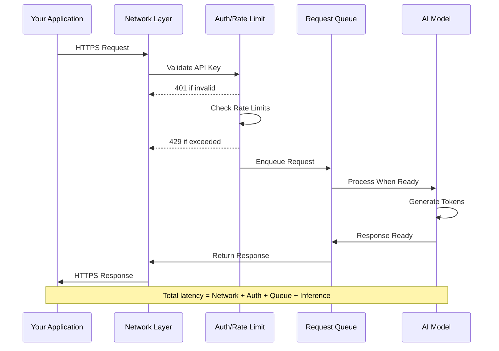
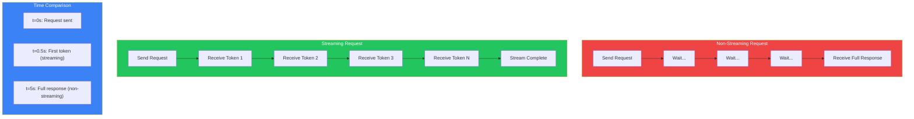
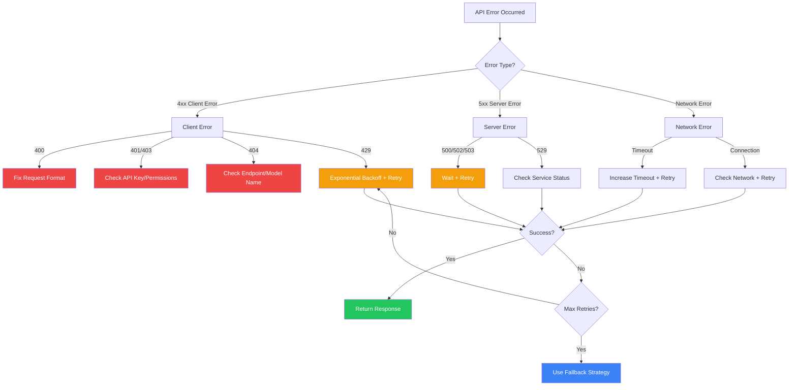
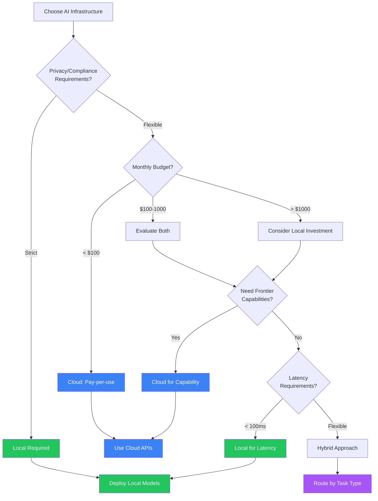

# Module 4: Networks, APIs, and AI Infrastructure

**Part 1: Foundations** | **Duration**: 1 hour 15 minutes | **Difficulty**: Beginner-Intermediate

---

## Learning Objectives

By the end of this module, you will be able to:

- Understand how AI applications communicate over networks and why it matters
- Master AI API design patterns including REST conventions, authentication, and rate limiting
- Implement streaming responses for real-time AI interactions
- Handle failures gracefully with retries, timeouts, and fallback strategies
- Choose between local and cloud AI solutions based on your specific requirements

---

## Section 1: The Network Layer of AI (10 minutes)

### Why Networking Matters for AI Apps

Here's a truth that surprises many developers new to AI: most of your AI code won't be AI code at all. It will be networking code. API calls, error handling, retries, timeouts, connection management, response parsing. The actual intelligence lives somewhere else—your job is getting data to it and back.

This isn't a temporary situation. Even as AI capabilities advance, the fundamental architecture remains: your application talks to AI services over networks. Understanding this layer deeply separates developers who build reliable AI applications from those whose applications fail mysteriously in production.

### The Request-Response Model

Every AI interaction follows the same basic pattern:

```
Your Application → Network → AI Service → Network → Your Application
```

Simple in concept. Complicated in practice. That bidirectional arrow represents:

- TCP connection establishment
- TLS negotiation for security
- HTTP protocol handling
- Request serialization (your prompt becomes bytes)
- Network transit (potentially across continents)
- Server queuing (you're not the only one asking)
- Model inference (the actual AI part)
- Response serialization (tokens become bytes)
- Network transit back
- Response parsing

The AI inference—the part that feels like the whole point—is often the fastest step. A model generates tokens in milliseconds. The network adds seconds.

### Latency: The Hidden Tax

Let's make this concrete. When you send a prompt to Claude or GPT-4:

**Network round-trip**: 50-200ms (depending on your location, their servers)
**Request processing**: 10-50ms (authentication, rate limiting, queuing)
**Model inference**: Varies wildly—100ms for a short response, 30+ seconds for a long one
**Response transmission**: Depends on response size

A simple query might take 500ms total. A complex generation might take 30 seconds. And every retry multiplies these costs.

This is why AI API design patterns differ from typical web APIs. You're not fetching a database row. You're initiating computation that might run for half a minute.

### The Stateless Illusion

Here's something that trips up developers: AI APIs are stateless. Each request is independent. The service doesn't remember your previous conversation.

"But I'm having a conversation with Claude! It remembers what I said!"

No, you're remembering and re-sending. Every request includes the full conversation history:

```python
# First request
messages = [
    {"role": "user", "content": "What is Python?"}
]

# Second request - YOU include the history
messages = [
    {"role": "user", "content": "What is Python?"},
    {"role": "assistant", "content": "Python is a programming language..."},
    {"role": "user", "content": "Show me an example"}  # New message
]
```

The AI service processes each request fresh. The "memory" is in your application, sent with every request. This has profound implications:

- **Context window limits**: You can only send so much history
- **Cost scales with conversation**: Longer conversations cost more
- **Latency increases**: More tokens to send means longer requests
- **You control the memory**: You decide what the AI "remembers"

Understanding this stateless model is crucial for designing efficient AI applications.

### What You're Actually Paying For

When you use AI APIs, you pay for:

**Tokens processed**: Both input (your prompt + history) and output (the response)
**Compute time**: More complex reasoning takes longer
**Network bandwidth**: Those tokens travel over wires

This is why optimization matters. Sending unnecessary context costs money. Inefficient prompts cost money. Poor retry logic costs money. The network layer isn't free.

---

## Section 2: AI API Design Patterns (20 minutes)

### REST for AI: Same Verbs, Different Semantics

AI APIs use familiar REST patterns, but the semantics differ from typical CRUD operations:

**Traditional REST**:

```
GET /users/123       → Retrieve existing data
POST /users          → Create new resource
PUT /users/123       → Update existing resource
DELETE /users/123    → Remove resource
```

**AI REST**:

```
POST /v1/chat/completions    → Generate new content
POST /v1/embeddings          → Transform text to vectors
POST /v1/images/generations  → Create images from descriptions
```

Notice: it's almost all POST. You're not retrieving stored data—you're requesting computation. Each request creates something new.

### The Standard Request Structure

AI APIs have converged on similar request structures. Here's the anatomy:

```python
import requests

response = requests.post(
    "https://api.anthropic.com/v1/messages",
    headers={
        "Content-Type": "application/json",
        "X-API-Key": "your-api-key",
        "anthropic-version": "2024-01-01"
    },
    json={
        "model": "claude-sonnet-4-20250514",
        "max_tokens": 1024,
        "messages": [
            {"role": "user", "content": "Explain networking"}
        ],
        "temperature": 0.7
    }
)
```

Let's break down each component:

**Endpoint**: Where to send the request. Usually versioned (`/v1/`) for stability.

**Headers**:

- `Content-Type`: Always `application/json` for AI APIs
- `Authorization` or `X-API-Key`: Your credentials
- `anthropic-version` or similar: API version for consistent behavior

**Body parameters**:

- `model`: Which model to use (affects capability, speed, cost)
- `max_tokens`: Limit response length (prevents runaway costs)
- `messages`: The actual conversation
- `temperature`: Randomness control (0 = deterministic, 1 = creative)

### The Standard Response Structure

Responses follow predictable patterns:

```json
{
  "id": "msg_01XFDUDYJgAACzvnptvVoYEL",
  "type": "message",
  "role": "assistant",
  "content": [
    {
      "type": "text",
      "text": "Networking in AI applications involves..."
    }
  ],
  "model": "claude-sonnet-4-20250514",
  "stop_reason": "end_turn",
  "usage": {
    "input_tokens": 12,
    "output_tokens": 156
  }
}
```

Key fields:

- `id`: Unique identifier for logging, debugging, support tickets
- `content`: The actual generated text
- `stop_reason`: Why generation stopped (`end_turn`, `max_tokens`, `stop_sequence`)
- `usage`: Token counts for billing and optimization

### Authentication Patterns

AI APIs use several authentication approaches:

**API Key in Header** (most common):

```python
headers = {"Authorization": "Bearer sk-..."}
# or
headers = {"X-API-Key": "sk-..."}
```

**OAuth 2.0** (for enterprise integrations):

```python
# Get token first
token_response = requests.post(
    "https://auth.provider.com/oauth/token",
    data={"grant_type": "client_credentials", ...}
)
access_token = token_response.json()["access_token"]

# Use token
headers = {"Authorization": f"Bearer {access_token}"}
```

**Signed Requests** (for AWS Bedrock):

```python
from botocore.auth import SigV4Auth
# Request signing using AWS credentials
```

**Security best practices**:

1. **Never hardcode keys**: Use environment variables

   ```python
   import os
   api_key = os.environ.get("ANTHROPIC_API_KEY")
   ```

2. **Rotate keys regularly**: Treat them like passwords

3. **Use key scoping**: If the provider supports it, create keys with minimal permissions

4. **Monitor usage**: Watch for unexpected spikes that might indicate compromise

### Rate Limiting: Playing Nice

AI APIs impose rate limits. You'll encounter:

**Requests per minute (RPM)**: How many calls you can make
**Tokens per minute (TPM)**: How many tokens you can process
**Tokens per day (TPD)**: Daily quotas

Rate limit headers tell you where you stand:

```
X-RateLimit-Limit-Requests: 100
X-RateLimit-Remaining-Requests: 95
X-RateLimit-Reset-Requests: 2024-01-15T10:00:00Z

X-RateLimit-Limit-Tokens: 100000
X-RateLimit-Remaining-Tokens: 85000
X-RateLimit-Reset-Tokens: 2024-01-15T10:00:00Z
```

When you hit limits, you get HTTP 429:

```json
{
  "error": {
    "type": "rate_limit_error",
    "message": "Rate limit exceeded. Please retry after 30 seconds."
  }
}
```

### Handling Rate Limits Gracefully

Don't just retry blindly. Implement intelligent backoff:

```python
import time
import random

def call_with_backoff(func, max_retries=5):
    """Call function with exponential backoff on rate limits."""
    for attempt in range(max_retries):
        try:
            return func()
        except RateLimitError as e:
            if attempt == max_retries - 1:
                raise

            # Exponential backoff with jitter
            base_delay = 2 ** attempt  # 1, 2, 4, 8, 16 seconds
            jitter = random.uniform(0, 1)
            delay = base_delay + jitter

            print(f"Rate limited. Waiting {delay:.2f}s before retry {attempt + 1}")
            time.sleep(delay)
```

**Why jitter matters**: If 100 clients all hit rate limits simultaneously and all retry after exactly 2 seconds, they'll all hit the limit again. Jitter spreads out the retries.

### Versioning and Stability

AI APIs evolve rapidly. Protect yourself:

**Pin API versions**:

```python
headers = {"anthropic-version": "2024-01-01"}
```

**Pin model versions**:

```python
# Instead of "claude-3-opus" (might change)
model = "claude-3-opus-20240229"  # Specific version
```

**Document your dependencies**:

```python
# requirements.txt
anthropic==0.18.1  # Pinned SDK version
```

This prevents surprises when providers update their models or APIs.

---

## Section 3: Streaming and Real-Time (15 minutes)

### Why Streaming Matters

Traditional request-response feels wrong for AI. You send a prompt, wait 5-30 seconds, then get a wall of text. Users wonder if anything is happening.

Streaming changes this: tokens arrive as they're generated. The response builds character by character, word by word. Users see progress. The experience feels alive.

This isn't just UX polish—it's a fundamental shift in how applications interact with AI.

### Server-Sent Events (SSE)

The dominant streaming protocol for AI APIs is Server-Sent Events (SSE). Here's how it works:

**Client opens a persistent connection**:

```
GET /v1/chat/completions HTTP/1.1
Accept: text/event-stream
```

**Server sends events as they occur**:

```
data: {"type": "content_block_delta", "delta": {"text": "Hello"}}

data: {"type": "content_block_delta", "delta": {"text": " world"}}

data: {"type": "content_block_delta", "delta": {"text": "!"}}

data: {"type": "message_stop"}
```

Each `data:` line is one event. The blank lines separate events. Simple, text-based, easy to debug.

### Implementing Streaming Clients

Here's how to consume streaming responses:

```python
import anthropic

client = anthropic.Anthropic()

# Streaming response
with client.messages.stream(
    model="claude-sonnet-4-20250514",
    max_tokens=1024,
    messages=[{"role": "user", "content": "Write a short story"}]
) as stream:
    for text in stream.text_stream:
        print(text, end="", flush=True)  # Print each chunk immediately

print()  # Final newline
```

Or with raw HTTP:

```python
import requests
import json

response = requests.post(
    "https://api.anthropic.com/v1/messages",
    headers={
        "X-API-Key": api_key,
        "anthropic-version": "2024-01-01",
        "Content-Type": "application/json"
    },
    json={
        "model": "claude-sonnet-4-20250514",
        "max_tokens": 1024,
        "messages": [{"role": "user", "content": "Tell me a story"}],
        "stream": True  # Enable streaming
    },
    stream=True  # Tell requests to stream
)

for line in response.iter_lines():
    if line:
        line = line.decode('utf-8')
        if line.startswith('data: '):
            data = json.loads(line[6:])
            if data.get('type') == 'content_block_delta':
                print(data['delta']['text'], end='', flush=True)
```

### Token-by-Token Processing

Streaming enables real-time processing as tokens arrive:

```python
class StreamProcessor:
    def __init__(self):
        self.buffer = ""
        self.total_tokens = 0

    def process_chunk(self, chunk):
        """Process each streaming chunk."""
        self.buffer += chunk
        self.total_tokens += 1

        # Real-time analysis
        if "error" in chunk.lower():
            self.flag_potential_issue()

        # Update UI
        self.update_display(chunk)

        # Detect complete sentences for TTS
        if self.ends_with_sentence(self.buffer):
            self.speak_sentence(self.buffer)
            self.buffer = ""

    def ends_with_sentence(self, text):
        return text.rstrip().endswith(('.', '!', '?'))
```

This enables:

- **Progressive rendering**: Show text as it arrives
- **Early termination**: Stop generation if you see what you need
- **Real-time feedback**: Flag issues without waiting for completion
- **Text-to-speech**: Speak complete sentences as they form

### WebSockets vs SSE

You might wonder: why SSE instead of WebSockets?

**SSE advantages**:

- Simpler: Just HTTP with a persistent connection
- Firewall-friendly: Looks like regular HTTP traffic
- Auto-reconnect: Built into the protocol
- One-directional: Perfect for AI responses

**WebSocket advantages**:

- Bidirectional: Send data while receiving
- Binary support: More efficient for large data
- Lower latency: No HTTP overhead per message

For AI APIs, SSE wins because:

1. You send one request, receive many response chunks (one-directional)
2. Responses are text (no need for binary)
3. Simplicity matters more than micro-optimizations

Some real-time AI applications (live conversation, collaborative editing) might prefer WebSockets, but for standard API interactions, SSE is the standard.

### Handling Stream Interruptions

Streams can fail mid-response. Handle this gracefully:

```python
class ResilientStreamHandler:
    def __init__(self, client, messages):
        self.client = client
        self.messages = messages
        self.accumulated_response = ""
        self.max_retries = 3

    def stream_with_recovery(self):
        """Stream with automatic recovery from interruptions."""
        for attempt in range(self.max_retries):
            try:
                with self.client.messages.stream(
                    model="claude-sonnet-4-20250514",
                    max_tokens=1024,
                    messages=self.messages
                ) as stream:
                    for text in stream.text_stream:
                        self.accumulated_response += text
                        yield text
                return  # Success, exit

            except StreamInterruptedError:
                if attempt < self.max_retries - 1:
                    # Continue from where we left off
                    self.messages.append({
                        "role": "assistant",
                        "content": self.accumulated_response
                    })
                    self.messages.append({
                        "role": "user",
                        "content": "Please continue from where you left off."
                    })
                else:
                    raise
```

### Buffering Strategies

Different use cases need different buffering:

**Character-by-character** (typing effect):

```python
for text in stream.text_stream:
    for char in text:
        display(char)
        time.sleep(0.02)  # Typing delay
```

**Word-by-word** (speech synthesis):

```python
buffer = ""
for text in stream.text_stream:
    buffer += text
    while " " in buffer:
        word, buffer = buffer.split(" ", 1)
        speak(word)
```

**Sentence-by-sentence** (paragraph display):

```python
buffer = ""
for text in stream.text_stream:
    buffer += text
    sentences = re.split(r'(?<=[.!?])\s+', buffer)
    for sentence in sentences[:-1]:  # All complete sentences
        display_sentence(sentence)
    buffer = sentences[-1]  # Keep incomplete part
```

Choose based on your application's needs.

---

## Section 4: Error Handling and Resilience (15 minutes)

### The Error Taxonomy

AI APIs fail in predictable ways. Know your errors:

**4xx Client Errors** (your problem):

- `400 Bad Request`: Malformed request, invalid parameters
- `401 Unauthorized`: Invalid or missing API key
- `403 Forbidden`: Key doesn't have permission
- `404 Not Found`: Wrong endpoint or model name
- `429 Too Many Requests`: Rate limit exceeded

**5xx Server Errors** (their problem):

- `500 Internal Server Error`: Something broke on their end
- `502 Bad Gateway`: Upstream service failed
- `503 Service Unavailable`: Overloaded or maintenance
- `529 Overloaded`: AI-specific—model capacity exceeded

**Network Errors** (nobody's problem):

- Connection timeout: Couldn't reach the server
- Read timeout: Connected but response took too long
- Connection reset: Something interrupted the connection

### When to Retry

Not all errors should be retried:

**Always retry**:

- `429` Rate limit (with backoff)
- `500` Server error (might be transient)
- `502` Bad gateway (usually transient)
- `503` Service unavailable (wait and retry)
- Network timeouts (might just be slow)

**Never retry**:

- `400` Bad request (your code is wrong)
- `401` Unauthorized (your key is wrong)
- `403` Forbidden (you don't have permission)
- `404` Not found (wrong endpoint)

**Maybe retry**:

- `529` Overloaded (might clear up, or might not)

```python
def should_retry(error):
    """Determine if an error is retryable."""
    if isinstance(error, RateLimitError):
        return True
    if isinstance(error, APIStatusError):
        return error.status_code in (500, 502, 503, 529)
    if isinstance(error, (ConnectionError, TimeoutError)):
        return True
    return False
```

### Implementing Robust Retry Logic

Here's production-grade retry logic:

```python
import time
import random
from dataclasses import dataclass
from typing import Callable, TypeVar, Optional

T = TypeVar('T')

@dataclass
class RetryConfig:
    max_retries: int = 3
    base_delay: float = 1.0
    max_delay: float = 60.0
    exponential_base: float = 2.0
    jitter: bool = True

def retry_with_backoff(
    func: Callable[[], T],
    config: RetryConfig = RetryConfig(),
    should_retry: Callable[[Exception], bool] = lambda e: True
) -> T:
    """Execute function with exponential backoff retry."""
    last_exception: Optional[Exception] = None

    for attempt in range(config.max_retries + 1):
        try:
            return func()
        except Exception as e:
            last_exception = e

            if not should_retry(e):
                raise

            if attempt == config.max_retries:
                raise

            # Calculate delay
            delay = min(
                config.base_delay * (config.exponential_base ** attempt),
                config.max_delay
            )

            # Add jitter
            if config.jitter:
                delay = delay * (0.5 + random.random())

            print(f"Attempt {attempt + 1} failed: {e}")
            print(f"Retrying in {delay:.2f} seconds...")
            time.sleep(delay)

    raise last_exception  # Should never reach here
```

### Timeout Strategies

Different timeouts for different purposes:

```python
import httpx

# Connection timeout: How long to wait for connection
# Read timeout: How long to wait for response data
# Write timeout: How long to wait to send request

client = httpx.Client(
    timeout=httpx.Timeout(
        connect=5.0,    # 5 seconds to connect
        read=120.0,     # 2 minutes to read (AI can be slow!)
        write=10.0,     # 10 seconds to send
        pool=5.0        # 5 seconds to get connection from pool
    )
)
```

For streaming responses, consider per-chunk timeouts:

```python
import asyncio

async def stream_with_chunk_timeout(stream, chunk_timeout=30.0):
    """Timeout if no chunk received within threshold."""
    async for chunk in stream:
        try:
            text = await asyncio.wait_for(
                get_next_chunk(stream),
                timeout=chunk_timeout
            )
            yield text
        except asyncio.TimeoutError:
            raise StreamStalledException("No data received for 30 seconds")
```

### Graceful Degradation

When the AI service fails, what does your application do?

**Option 1: Fail visibly**

```python
def get_ai_response(prompt):
    try:
        return call_ai_api(prompt)
    except AIServiceError:
        return "I'm sorry, the AI service is temporarily unavailable. Please try again."
```

**Option 2: Fallback to simpler model**

```python
def get_ai_response(prompt):
    try:
        return call_primary_model(prompt)  # Claude Opus
    except (RateLimitError, ServiceUnavailableError):
        return call_fallback_model(prompt)  # Claude Haiku (faster, cheaper)
```

**Option 3: Cached responses**

```python
def get_ai_response(prompt):
    cache_key = hash_prompt(prompt)

    # Check cache first
    cached = cache.get(cache_key)
    if cached:
        return cached

    try:
        response = call_ai_api(prompt)
        cache.set(cache_key, response, ttl=3600)  # Cache for 1 hour
        return response
    except AIServiceError:
        # Return slightly stale cache if available
        stale = cache.get(cache_key, ignore_ttl=True)
        if stale:
            return stale
        raise
```

**Option 4: Local fallback**

```python
def get_ai_response(prompt):
    try:
        return call_cloud_ai(prompt)
    except AIServiceError:
        # Fall back to local model
        return call_local_model(prompt)  # Slower, less capable, but available
```

### Circuit Breakers

Prevent cascade failures with circuit breakers:

```python
from datetime import datetime, timedelta
from enum import Enum

class CircuitState(Enum):
    CLOSED = "closed"      # Normal operation
    OPEN = "open"          # Failing, reject requests
    HALF_OPEN = "half_open"  # Testing if recovered

class CircuitBreaker:
    def __init__(
        self,
        failure_threshold: int = 5,
        recovery_timeout: timedelta = timedelta(seconds=30)
    ):
        self.failure_threshold = failure_threshold
        self.recovery_timeout = recovery_timeout
        self.failure_count = 0
        self.last_failure_time = None
        self.state = CircuitState.CLOSED

    def call(self, func):
        """Execute function through circuit breaker."""
        if self.state == CircuitState.OPEN:
            if datetime.now() - self.last_failure_time > self.recovery_timeout:
                self.state = CircuitState.HALF_OPEN
            else:
                raise CircuitOpenError("Circuit breaker is open")

        try:
            result = func()
            self._on_success()
            return result
        except Exception as e:
            self._on_failure()
            raise

    def _on_success(self):
        self.failure_count = 0
        self.state = CircuitState.CLOSED

    def _on_failure(self):
        self.failure_count += 1
        self.last_failure_time = datetime.now()
        if self.failure_count >= self.failure_threshold:
            self.state = CircuitState.OPEN
```

Usage:

```python
ai_circuit = CircuitBreaker(failure_threshold=5)

def get_response(prompt):
    return ai_circuit.call(lambda: client.messages.create(...))
```

After 5 failures, the circuit opens and requests fail immediately (without hammering the struggling service). After 30 seconds, it tries one request. If that succeeds, normal operation resumes.

---

## Section 5: Local vs Cloud Trade-offs (10 minutes)

### The Fundamental Choice

Every AI application faces a fundamental architecture question: where does inference happen?

**Cloud AI** (OpenAI, Anthropic, Google):

- Call an API
- Pay per token
- No infrastructure to manage
- Access to most capable models

**Local AI** (llama.cpp, Ollama, vLLM):

- Run on your hardware
- Pay for compute once
- Full infrastructure responsibility
- Limited to models you can run

Neither is universally better. The right choice depends on your constraints.

### Latency Analysis

**Cloud latency breakdown**:

```
Network round-trip:     50-200ms (geographic dependent)
Request processing:     10-50ms
Queue wait:            0-5000ms (depends on load)
Inference:             100ms-30s
Response transmission: 10-100ms
---
Total:                 170ms-35s
```

**Local latency breakdown**:

```
Network round-trip:    0-5ms (localhost or LAN)
Request processing:    1-5ms
Queue wait:            0ms (your hardware, your queue)
Inference:             200ms-60s (depends on hardware)
Response transmission: <1ms
---
Total:                 200ms-60s
```

Key insight: Cloud has lower inference latency (better hardware), but network and queuing add unpredictability. Local has predictable latency—it's all on your hardware.

### Cost Modeling

**Cloud costs** (example rates):

```python
# Cost per 1M tokens (approximate, varies by provider)
CLOUD_COSTS = {
    "gpt-4-turbo": {"input": 10.00, "output": 30.00},
    "claude-opus": {"input": 15.00, "output": 75.00},
    "claude-sonnet": {"input": 3.00, "output": 15.00},
    "claude-haiku": {"input": 0.25, "output": 1.25},
}

def estimate_cloud_cost(input_tokens, output_tokens, model="claude-sonnet"):
    costs = CLOUD_COSTS[model]
    return (input_tokens * costs["input"] + output_tokens * costs["output"]) / 1_000_000
```

**Local costs** (one-time + ongoing):

```python
# Hardware investment (example)
HARDWARE_COSTS = {
    "rtx_4090": 1600,       # Consumer GPU, ~100 tokens/sec for 7B model
    "a100_80gb": 15000,     # Data center GPU, ~300 tokens/sec for 70B model
    "mac_studio_m2": 4000,  # Unified memory, ~50 tokens/sec for 7B model
}

# Ongoing costs (electricity, cooling, maintenance)
MONTHLY_OPERATING = {
    "rtx_4090": 50,      # ~500W under load
    "a100_80gb": 300,    # ~400W + data center overhead
    "mac_studio_m2": 20, # ~200W max
}
```

**Break-even analysis**:

```python
def months_to_break_even(
    hardware_cost,
    monthly_operating,
    monthly_cloud_cost
):
    """Calculate months until local becomes cheaper."""
    if monthly_cloud_cost <= monthly_operating:
        return float('inf')  # Never breaks even

    monthly_savings = monthly_cloud_cost - monthly_operating
    return hardware_cost / monthly_savings
```

If you spend $500/month on Claude API and could serve those requests locally for $50/month in electricity with a $5000 hardware investment, you break even in about 11 months.

### Privacy and Compliance

This is often the deciding factor:

**Cloud concerns**:

- Data leaves your network
- Provider can see your prompts and responses
- Data may be used for training (opt-out policies vary)
- Compliance (HIPAA, GDPR, SOC2) depends on provider certifications

**Local advantages**:

- Data never leaves your infrastructure
- No third-party access
- Full audit trail control
- Compliance is your responsibility (and within your control)

For healthcare, legal, financial, or classified workloads, local AI may be required regardless of cost or capability trade-offs.

### Capability vs Availability

**Cloud capabilities**:

- Access to largest models (GPT-4, Claude Opus)
- Automatic scaling
- Continuous improvements
- Multi-modal support

**Local capabilities**:

- Limited by your hardware
- Smaller models (7B-70B typically)
- Manual updates
- Rapidly improving open-source ecosystem

The capability gap is narrowing. Open-source models are surprisingly capable for many tasks. But frontier capabilities remain cloud-only.

### Hybrid Approaches

Many production systems use both:

```python
class HybridAIClient:
    def __init__(self):
        self.local_model = LocalModel("llama-7b")
        self.cloud_client = anthropic.Anthropic()

    def get_response(self, prompt, require_high_capability=False):
        """Route to appropriate backend based on requirements."""
        if require_high_capability:
            return self._cloud_request(prompt)

        # Try local first
        try:
            response = self._local_request(prompt)
            if self._quality_check(response):
                return response
        except LocalModelError:
            pass

        # Fall back to cloud
        return self._cloud_request(prompt)

    def _quality_check(self, response):
        """Basic quality heuristics."""
        # Check for coherence, length, task completion
        return len(response) > 50 and not self._is_gibberish(response)
```

**Routing strategies**:

- Simple tasks to local, complex to cloud
- Latency-sensitive to local, quality-sensitive to cloud
- Development/testing to local, production to cloud
- First attempt local, fallback to cloud

---

## Section 6: Production API Integration (5 minutes)

### Best Practices Summary

Here's what production AI integrations need:

**1. Defense in depth**:

```python
# Multiple layers of protection
client = AIClient(
    timeout=30,           # Don't wait forever
    max_retries=3,        # But do retry
    circuit_breaker=True, # Stop hammering failing services
    fallback_model=True   # Have a backup plan
)
```

**2. Observability**:

```python
def call_ai_with_metrics(prompt):
    start_time = time.time()
    try:
        response = client.complete(prompt)
        metrics.record("ai_latency", time.time() - start_time)
        metrics.record("ai_tokens", response.usage.total_tokens)
        metrics.increment("ai_success")
        return response
    except Exception as e:
        metrics.increment("ai_error", tags={"type": type(e).__name__})
        raise
```

**3. Cost controls**:

```python
class CostGuard:
    def __init__(self, daily_budget=100.0):
        self.daily_budget = daily_budget
        self.daily_spend = 0.0

    def check_budget(self, estimated_cost):
        if self.daily_spend + estimated_cost > self.daily_budget:
            raise BudgetExceededError("Daily AI budget exhausted")
        self.daily_spend += estimated_cost
```

**4. Request queuing**:

```python
from queue import Queue
from threading import Thread

class AIRequestQueue:
    def __init__(self, max_concurrent=5):
        self.queue = Queue()
        self.workers = [
            Thread(target=self._worker)
            for _ in range(max_concurrent)
        ]
        for w in self.workers:
            w.start()

    def _worker(self):
        while True:
            request, callback = self.queue.get()
            try:
                result = process_request(request)
                callback(result, None)
            except Exception as e:
                callback(None, e)
            self.queue.task_done()
```

**5. Graceful shutdown**:

```python
import signal

def shutdown_handler(signum, frame):
    print("Shutting down gracefully...")
    ai_queue.join()  # Wait for pending requests
    save_state()     # Persist any important state
    sys.exit(0)

signal.signal(signal.SIGTERM, shutdown_handler)
signal.signal(signal.SIGINT, shutdown_handler)
```

### Architecture Patterns

**Pattern: API Gateway**

```
Client → Your Gateway → AI Provider
                     → Cache
                     → Rate Limiter
                     → Logger
```

Centralize all AI calls through your gateway for consistent handling.

**Pattern: Async Processing**

```
Client → Queue → Worker → AI Provider
             ↓
         Webhook/Poll → Client
```

For long-running AI tasks, queue requests and notify on completion.

**Pattern: Edge Caching**

```
Client → CDN Cache → Your API → AI Provider
              ↑
         Cache Hit (fast)
```

Cache common AI responses at the edge for repeated queries.

### Checklist for Production Readiness

Before deploying AI integrations to production:

- [ ] API keys stored securely (not in code)
- [ ] Rate limiting implemented
- [ ] Retry logic with exponential backoff
- [ ] Timeouts configured appropriately
- [ ] Error handling for all failure modes
- [ ] Fallback strategy defined
- [ ] Metrics and logging in place
- [ ] Cost monitoring and alerts
- [ ] Circuit breaker for cascade prevention
- [ ] Graceful degradation tested
- [ ] Load testing completed
- [ ] Security review passed

---

## Diagrams

### AI API Request Flow



### Streaming vs Non-Streaming



### Error Handling Decision Tree



### Local vs Cloud Decision Framework



---

## Knowledge Check

Test your understanding with these questions:

### Question 1

Why do AI APIs use POST for nearly all operations instead of GET?

- A) POST requests are faster than GET requests
- B) AI operations create new content through computation rather than retrieving stored data
- C) GET requests don't support JSON
- D) POST is more secure than GET

**Correct Answer**: B

**Explanation**: AI API calls are fundamentally different from traditional CRUD operations. You're not retrieving existing data—you're requesting computation that generates new content. Each request produces a unique response based on the model's inference. POST semantically represents "create" or "process," which accurately describes what AI endpoints do.

### Question 2

What is the primary advantage of streaming responses for AI applications?

- A) Streaming responses use less bandwidth
- B) Streaming allows users to see tokens as they're generated, providing immediate feedback and enabling early termination
- C) Streaming responses are more accurate
- D) Streaming is required by all AI APIs

**Correct Answer**: B

**Explanation**: Streaming transforms user experience by showing progress immediately rather than making users wait for complete responses. Beyond UX, streaming enables practical benefits: early termination if the response is going wrong, real-time processing (like text-to-speech), and better perceived performance. The total response time is the same, but the experience differs dramatically.

### Question 3

When implementing retry logic for AI APIs, why is "jitter" added to exponential backoff?

- A) To make the code more random and unpredictable
- B) To prevent synchronized retries from many clients hitting rate limits simultaneously
- C) To reduce the total number of retries needed
- D) Jitter is required by AI API specifications

**Correct Answer**: B

**Explanation**: Without jitter, if 100 clients all hit a rate limit at the same time and retry after exactly 2 seconds, they'll all hit the limit again simultaneously. This creates "thundering herd" problems. Jitter adds random variation to retry timing, spreading out requests and reducing the chance of synchronized spikes that overwhelm the service.

### Question 4

Which factor most often makes local AI deployment mandatory rather than optional?

- A) Cost savings potential
- B) Lower latency requirements
- C) Privacy and compliance requirements that prohibit data leaving the network
- D) Better model quality

**Correct Answer**: C

**Explanation**: While cost and latency can favor local deployment, these are usually optimization choices. Privacy and compliance requirements are often non-negotiable constraints. Healthcare (HIPAA), legal (attorney-client privilege), financial (regulatory requirements), and classified/defense workloads may legally require that data never leave controlled infrastructure, making cloud AI impossible regardless of other trade-offs.

---

## Hands-On Exercise: Build an API Client

### Objective

Build a production-ready AI API client that handles streaming, errors, retries, and rate limits gracefully.

### Time Required

45-60 minutes

### Prerequisites

- Python 3.8+
- An Anthropic API key (or OpenAI key with modifications)
- Libraries: `anthropic`, `httpx`

### Setup

Install required libraries:

```bash
pip install anthropic httpx
```

Set your API key:

```bash
export ANTHROPIC_API_KEY="your-key-here"
```

### Exercise Steps

#### Part 1: Basic Client with Error Handling (15 minutes)

Create `ai_client.py`:

```python
import os
import time
import random
from dataclasses import dataclass
from typing import Optional, Generator
import anthropic
from anthropic import APIError, RateLimitError, APIConnectionError

@dataclass
class RetryConfig:
    max_retries: int = 3
    base_delay: float = 1.0
    max_delay: float = 60.0
    jitter: bool = True

class RobustAIClient:
    """A production-ready AI API client."""

    def __init__(self, retry_config: Optional[RetryConfig] = None):
        self.client = anthropic.Anthropic()
        self.retry_config = retry_config or RetryConfig()
        self.request_count = 0
        self.total_tokens = 0

    def _calculate_delay(self, attempt: int) -> float:
        """Calculate delay with exponential backoff and optional jitter."""
        delay = min(
            self.retry_config.base_delay * (2 ** attempt),
            self.retry_config.max_delay
        )
        if self.retry_config.jitter:
            delay = delay * (0.5 + random.random())
        return delay

    def _should_retry(self, error: Exception) -> bool:
        """Determine if an error is retryable."""
        if isinstance(error, RateLimitError):
            return True
        if isinstance(error, APIConnectionError):
            return True
        if isinstance(error, APIError):
            return error.status_code in (500, 502, 503, 529)
        return False

    def complete(
        self,
        prompt: str,
        model: str = "claude-sonnet-4-20250514",
        max_tokens: int = 1024
    ) -> str:
        """Get a completion with automatic retries."""
        last_error: Optional[Exception] = None

        for attempt in range(self.retry_config.max_retries + 1):
            try:
                response = self.client.messages.create(
                    model=model,
                    max_tokens=max_tokens,
                    messages=[{"role": "user", "content": prompt}]
                )
                self.request_count += 1
                self.total_tokens += response.usage.input_tokens + response.usage.output_tokens
                return response.content[0].text

            except Exception as e:
                last_error = e

                if not self._should_retry(e):
                    print(f"Non-retryable error: {type(e).__name__}: {e}")
                    raise

                if attempt < self.retry_config.max_retries:
                    delay = self._calculate_delay(attempt)
                    print(f"Attempt {attempt + 1} failed: {e}")
                    print(f"Retrying in {delay:.2f} seconds...")
                    time.sleep(delay)

        raise last_error

# Test basic functionality
if __name__ == "__main__":
    client = RobustAIClient()

    try:
        response = client.complete("What is 2 + 2? Reply with just the number.")
        print(f"Response: {response}")
        print(f"Total requests: {client.request_count}")
        print(f"Total tokens: {client.total_tokens}")
    except Exception as e:
        print(f"Failed: {e}")
```

**Run and verify**:

- Does it handle a successful request?
- Check that token counting works

#### Part 2: Add Streaming Support (15 minutes)

Add streaming to your client:

```python
def stream(
    self,
    prompt: str,
    model: str = "claude-sonnet-4-20250514",
    max_tokens: int = 1024
) -> Generator[str, None, None]:
    """Stream a completion token by token."""
    last_error: Optional[Exception] = None

    for attempt in range(self.retry_config.max_retries + 1):
        try:
            with self.client.messages.stream(
                model=model,
                max_tokens=max_tokens,
                messages=[{"role": "user", "content": prompt}]
            ) as stream:
                self.request_count += 1
                for text in stream.text_stream:
                    yield text

                # Get final message for token counting
                final_message = stream.get_final_message()
                self.total_tokens += (
                    final_message.usage.input_tokens +
                    final_message.usage.output_tokens
                )
                return

        except Exception as e:
            last_error = e

            if not self._should_retry(e):
                raise

            if attempt < self.retry_config.max_retries:
                delay = self._calculate_delay(attempt)
                print(f"\nStream attempt {attempt + 1} failed: {e}")
                print(f"Retrying in {delay:.2f} seconds...")
                time.sleep(delay)

    raise last_error

# Test streaming
if __name__ == "__main__":
    client = RobustAIClient()

    print("Streaming response:")
    for chunk in client.stream("Write a haiku about programming."):
        print(chunk, end="", flush=True)
    print(f"\n\nTotal tokens: {client.total_tokens}")
```

**Observe**:

- How does streaming feel different from non-streaming?
- Watch the tokens appear one by one

#### Part 3: Add Circuit Breaker (10 minutes)

Implement circuit breaker protection:

```python
from datetime import datetime, timedelta
from enum import Enum

class CircuitState(Enum):
    CLOSED = "closed"
    OPEN = "open"
    HALF_OPEN = "half_open"

class CircuitBreaker:
    def __init__(
        self,
        failure_threshold: int = 5,
        recovery_timeout: timedelta = timedelta(seconds=30)
    ):
        self.failure_threshold = failure_threshold
        self.recovery_timeout = recovery_timeout
        self.failure_count = 0
        self.last_failure_time: Optional[datetime] = None
        self.state = CircuitState.CLOSED

    def record_success(self):
        self.failure_count = 0
        self.state = CircuitState.CLOSED

    def record_failure(self):
        self.failure_count += 1
        self.last_failure_time = datetime.now()
        if self.failure_count >= self.failure_threshold:
            self.state = CircuitState.OPEN

    def can_proceed(self) -> bool:
        if self.state == CircuitState.CLOSED:
            return True

        if self.state == CircuitState.OPEN:
            if datetime.now() - self.last_failure_time > self.recovery_timeout:
                self.state = CircuitState.HALF_OPEN
                return True
            return False

        # HALF_OPEN: allow one request through
        return True

# Add to RobustAIClient.__init__:
# self.circuit_breaker = CircuitBreaker()

# Modify complete() to use circuit breaker:
def complete_with_circuit_breaker(self, prompt: str, **kwargs) -> str:
    if not self.circuit_breaker.can_proceed():
        raise Exception("Circuit breaker is open - service appears down")

    try:
        result = self.complete(prompt, **kwargs)
        self.circuit_breaker.record_success()
        return result
    except Exception as e:
        self.circuit_breaker.record_failure()
        raise
```

#### Part 4: Add Metrics and Logging (5 minutes)

Add observability:

```python
from dataclasses import dataclass, field
from typing import Dict, List

@dataclass
class Metrics:
    request_count: int = 0
    success_count: int = 0
    error_count: int = 0
    total_tokens: int = 0
    total_latency_ms: float = 0.0
    error_types: Dict[str, int] = field(default_factory=dict)
    latencies: List[float] = field(default_factory=list)

    def record_request(self, success: bool, latency_ms: float, tokens: int = 0, error_type: str = None):
        self.request_count += 1
        self.total_latency_ms += latency_ms
        self.latencies.append(latency_ms)
        self.total_tokens += tokens

        if success:
            self.success_count += 1
        else:
            self.error_count += 1
            if error_type:
                self.error_types[error_type] = self.error_types.get(error_type, 0) + 1

    def summary(self) -> str:
        avg_latency = self.total_latency_ms / max(self.request_count, 1)
        success_rate = self.success_count / max(self.request_count, 1) * 100

        return f"""
Metrics Summary:
  Requests: {self.request_count}
  Success Rate: {success_rate:.1f}%
  Total Tokens: {self.total_tokens}
  Avg Latency: {avg_latency:.0f}ms
  Errors by Type: {self.error_types}
"""

# Add to RobustAIClient:
# self.metrics = Metrics()

# Wrap requests with timing:
def complete_with_metrics(self, prompt: str, **kwargs) -> str:
    start_time = time.time()
    try:
        result = self.complete(prompt, **kwargs)
        latency_ms = (time.time() - start_time) * 1000
        self.metrics.record_request(True, latency_ms, self.total_tokens)
        return result
    except Exception as e:
        latency_ms = (time.time() - start_time) * 1000
        self.metrics.record_request(False, latency_ms, error_type=type(e).__name__)
        raise
```

#### Part 5: Integration Test (5 minutes)

Test everything together:

```python
def test_client():
    """Test the full client functionality."""
    client = RobustAIClient()

    print("Test 1: Basic completion")
    response = client.complete("Say 'Hello, World!' and nothing else.")
    print(f"Response: {response}\n")

    print("Test 2: Streaming")
    print("Streaming: ", end="")
    for chunk in client.stream("Count from 1 to 5, one number per line."):
        print(chunk, end="", flush=True)
    print("\n")

    print("Test 3: Multiple requests (for metrics)")
    prompts = [
        "What is Python?",
        "What is JavaScript?",
        "What is Rust?"
    ]
    for prompt in prompts:
        try:
            client.complete_with_metrics(prompt[:50] + "... Be brief.")
        except Exception as e:
            print(f"Error: {e}")

    print(client.metrics.summary())

if __name__ == "__main__":
    test_client()
```

### Success Criteria

You've successfully completed this exercise if you:

- [ ] Built a client with automatic retry logic
- [ ] Implemented exponential backoff with jitter
- [ ] Added streaming support
- [ ] Implemented a circuit breaker
- [ ] Added metrics collection
- [ ] Tested all components together
- [ ] Handled at least one error scenario gracefully

### Extension Challenges

Once the basic client works:

1. **Add request queuing**: Implement a queue that limits concurrent requests
2. **Add caching**: Cache responses for identical prompts
3. **Add fallback**: Try a different model if the primary fails
4. **Add cost tracking**: Track estimated costs based on token usage
5. **Add async support**: Convert to async/await for better concurrency

---

## References

### Official Documentation

1. **Anthropic API Documentation**
   Complete reference for Claude APIs, including authentication, rate limits, and streaming.
   [docs.anthropic.com](https://docs.anthropic.com)

2. **OpenAI API Documentation**
   Comprehensive guide to OpenAI's API patterns and best practices.
   [platform.openai.com/docs](https://platform.openai.com/docs)

3. **HTTP/1.1 Specification (RFC 9110)**
   The definitive reference for HTTP semantics that all AI APIs build upon.
   [datatracker.ietf.org/doc/html/rfc9110](https://datatracker.ietf.org/doc/html/rfc9110)

### Practical Guides

4. **Server-Sent Events Specification**
   W3C specification for SSE, the streaming protocol used by most AI APIs.
   [html.spec.whatwg.org/multipage/server-sent-events.html](https://html.spec.whatwg.org/multipage/server-sent-events.html)

5. **Circuit Breaker Pattern (Martin Fowler)**
   Detailed explanation of the circuit breaker pattern for resilient systems.
   [martinfowler.com/bliki/CircuitBreaker.html](https://martinfowler.com/bliki/CircuitBreaker.html)

6. **Exponential Backoff and Jitter (AWS Architecture Blog)**
   Deep dive into retry strategies for distributed systems.
   [aws.amazon.com/blogs/architecture/exponential-backoff-and-jitter](https://aws.amazon.com/blogs/architecture/exponential-backoff-and-jitter/)

### Local AI Resources

7. **Ollama Documentation**
   Guide to running local LLMs with a simple API.
   [ollama.ai/docs](https://ollama.ai/docs)

8. **llama.cpp**
   High-performance inference for running LLMs locally.
   [github.com/ggerganov/llama.cpp](https://github.com/ggerganov/llama.cpp)

9. **vLLM Documentation**
   Production-grade local inference with high throughput.
   [docs.vllm.ai](https://docs.vllm.ai)

---

## Summary

In this module, you've learned:

1. **The network layer dominates AI applications**: Most of your "AI code" is actually networking code—API calls, error handling, retries, and response parsing. Understanding this layer deeply is essential for building reliable applications.

2. **AI APIs follow patterns with AI-specific semantics**: While built on familiar REST conventions, AI APIs are fundamentally different—you're requesting computation that generates new content, not retrieving stored data. This affects everything from HTTP methods to timeout strategies.

3. **Streaming transforms user experience**: Server-Sent Events enable token-by-token delivery that makes AI feel responsive. Beyond UX, streaming enables early termination, real-time processing, and better error handling.

4. **Resilience requires multiple strategies**: Production AI integrations need exponential backoff, jitter, circuit breakers, graceful degradation, and fallback options. Single-point-of-failure designs will fail in production.

5. **Local vs cloud is a trade-off, not a hierarchy**: Privacy, cost, latency, and capability requirements all factor into infrastructure decisions. Many production systems use hybrid approaches that leverage both.

The network layer might seem like plumbing compared to the excitement of AI capabilities, but it's the plumbing that determines whether your AI application works reliably in the real world.

---

## What's Next

**Module 5: Databases and Data Management for AI**

We'll cover:

- How AI applications store and retrieve data
- Vector databases for semantic search
- Conversation history and context management
- RAG (Retrieval-Augmented Generation) architectures
- Scaling data infrastructure for AI workloads

The data layer complements the network layer—together they form the infrastructure foundation for all AI applications.
