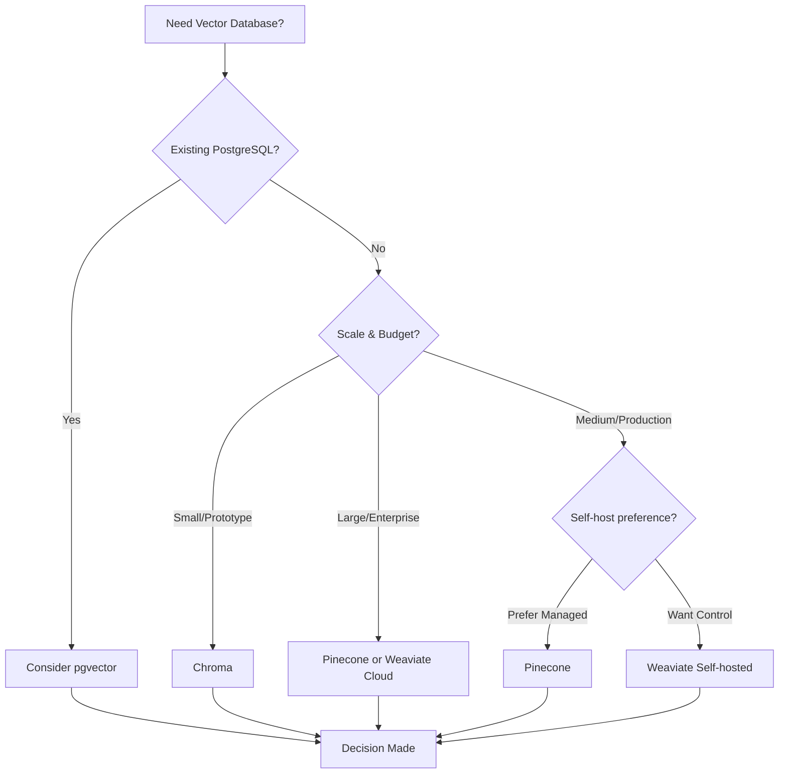
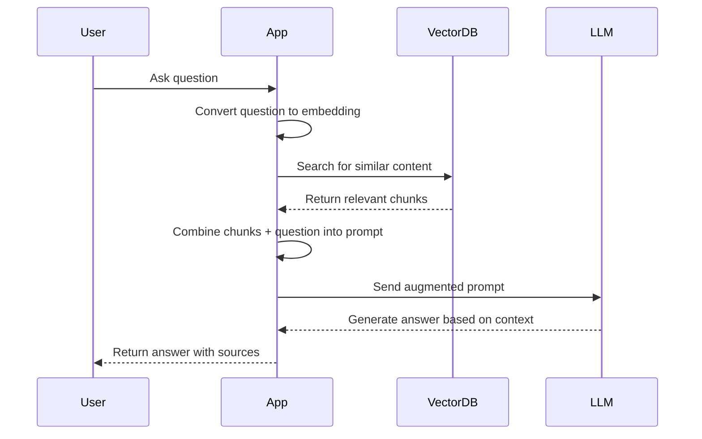
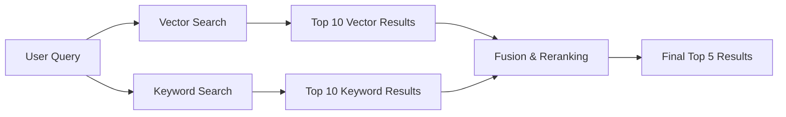
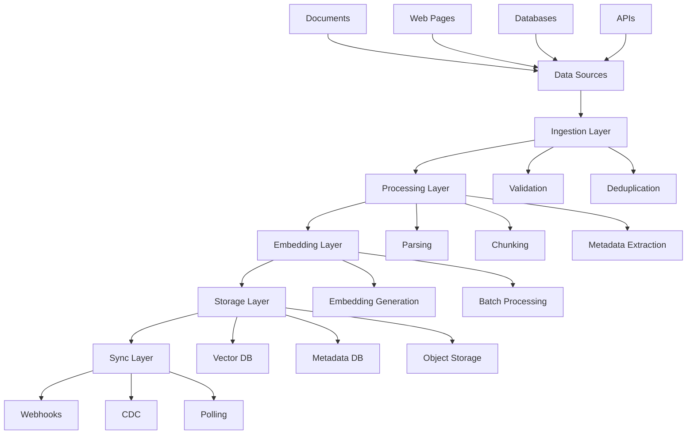

# Module 5: Databases and Data Management for AI

**Duration:** 1 hour 30 minutes
**Difficulty:** Intermediate

## Learning Objectives

By the end of this module, you will be able to:

- Understand how different database types serve AI applications
- Master vector database concepts and operations
- Recognize data pipeline patterns for AI systems
- Design data architectures that support AI features

---

## 1. The Data Foundation of AI (10 minutes)

### Why Data Architecture Matters for AI

If AI models are the engine, data is the fuel. But not all fuel tanks are created equal. The way you store, organize, and retrieve data fundamentally determines what your AI applications can do and how well they perform.

Traditional applications primarily work with **structured data** - users, products, transactions - things that fit neatly into tables with defined schemas. AI applications, however, need to work with **meaning and semantics**. They need to find similar concepts, understand context, and retrieve relevant information even when exact matches don't exist.

This shift requires a fundamental rethinking of database architecture.

### The Three Data Layers in Modern AI Systems

Most production AI systems operate with three complementary data layers:

**1. Transactional Layer (Traditional Databases)**

- Stores structured business data
- Handles CRUD operations
- Ensures consistency and reliability
- Examples: User profiles, orders, application state

**2. Semantic Layer (Vector Databases)**

- Stores meaning as mathematical representations
- Enables similarity search
- Powers AI features like RAG, recommendations
- Examples: Document embeddings, image features, product semantics

**3. Cache Layer (Fast Access)**

- Stores frequently accessed data
- Reduces latency for AI operations
- Examples: Recent embeddings, session context, prompt templates

Understanding when and how to use each layer is crucial for building AI systems that are both powerful and practical.

### From Keywords to Concepts

The fundamental shift in AI-powered data retrieval is moving from exact matching to semantic similarity:

**Traditional Search:**

- "Show me documents containing 'machine learning'"
- Relies on exact keyword matches
- Misses synonyms, related concepts, different phrasings

**AI-Powered Search:**

- "Show me documents similar to this concept"
- Understands meaning and context
- Finds relevant content even without keyword overlap

This shift is powered by **embeddings** - numerical representations of meaning that we can store, compare, and search mathematically. Vector databases are purpose-built for this new paradigm.

---

## 2. Traditional Databases in AI Systems (15 minutes)

### SQL Databases: The Structured Foundation

Despite the emergence of vector databases, traditional SQL databases remain essential in AI systems. They handle the structured data that AI applications still need.

**When to Use SQL in AI Systems:**

1. **User Management and Authentication**
   - User profiles, permissions, sessions
   - Requires transactional integrity
   - Example: Storing user preferences for personalized AI responses

2. **Application State and Metadata**
   - Conversation history metadata (not the embeddings)
   - Document upload records
   - AI feature usage tracking

3. **Audit and Compliance**
   - Who accessed what AI feature when
   - Data lineage for AI decisions
   - Required for regulated industries

**Example Schema for an AI Chatbot:**

```sql
-- User management
CREATE TABLE users (
    id UUID PRIMARY KEY,
    email VARCHAR(255) UNIQUE NOT NULL,
    created_at TIMESTAMP DEFAULT NOW()
);

-- Conversation tracking
CREATE TABLE conversations (
    id UUID PRIMARY KEY,
    user_id UUID REFERENCES users(id),
    title VARCHAR(255),
    created_at TIMESTAMP DEFAULT NOW(),
    updated_at TIMESTAMP DEFAULT NOW()
);

-- Message metadata (actual content may be in vector DB)
CREATE TABLE messages (
    id UUID PRIMARY KEY,
    conversation_id UUID REFERENCES conversations(id),
    role VARCHAR(50), -- 'user', 'assistant', 'system'
    created_at TIMESTAMP DEFAULT NOW(),
    token_count INTEGER,
    embedding_id VARCHAR(255) -- Reference to vector DB
);

-- Document management
CREATE TABLE documents (
    id UUID PRIMARY KEY,
    user_id UUID REFERENCES users(id),
    filename VARCHAR(255),
    file_size INTEGER,
    upload_date TIMESTAMP DEFAULT NOW(),
    processing_status VARCHAR(50), -- 'pending', 'processing', 'completed'
    chunk_count INTEGER -- Number of chunks in vector DB
);
```

### NoSQL Databases: Flexibility for Unstructured Data

NoSQL databases excel at storing the variable, unstructured data common in AI applications.

**When to Use NoSQL in AI Systems:**

1. **Document Storage**
   - Original documents before chunking
   - Full conversation histories
   - Flexible schema as AI features evolve

2. **Session Context**
   - Temporary user state during AI interactions
   - Prompt templates and variations
   - A/B test configurations

3. **Metadata and Tags**
   - Document categories, tags, custom fields
   - User-defined attributes for search
   - Rapidly changing feature flags

**Example: MongoDB for Conversation Storage**

```javascript
// Conversation document with full context
{
  "_id": "conv_123",
  "user_id": "user_456",
  "created_at": "2026-01-10T10:00:00Z",
  "updated_at": "2026-01-10T10:15:00Z",
  "title": "Building a RAG system",
  "messages": [
    {
      "role": "user",
      "content": "How do I implement RAG?",
      "timestamp": "2026-01-10T10:00:00Z",
      "metadata": {
        "source": "web",
        "language": "en"
      }
    },
    {
      "role": "assistant",
      "content": "RAG combines retrieval with generation...",
      "timestamp": "2026-01-10T10:00:05Z",
      "metadata": {
        "model": "claude-sonnet-4",
        "tokens": 150,
        "sources": ["doc_1", "doc_2"]
      }
    }
  ],
  "context": {
    "domain": "software_engineering",
    "user_level": "intermediate",
    "previous_topics": ["embeddings", "vector_search"]
  }
}
```

### The Hybrid Approach

Most production AI systems use both SQL and NoSQL databases alongside vector databases:

- **SQL**: Critical structured data requiring transactions
- **NoSQL**: Flexible document storage and rapid iteration
- **Vector DB**: Semantic search and similarity operations

The key is understanding the strengths of each and designing your architecture accordingly.

---

## 3. Vector Databases Deep Dive (25 minutes)

### What Makes Vector Databases Different

Vector databases are purpose-built for a fundamentally different operation than traditional databases. Instead of asking "Does this field equal that value?", they answer "What is most similar to this concept?"

**Key Differences:**

| Traditional Database      | Vector Database                      |
| ------------------------- | ------------------------------------ |
| Stores discrete values    | Stores high-dimensional vectors      |
| Exact match queries       | Similarity search queries            |
| B-tree, hash indexes      | Specialized vector indexes           |
| Fast at O(log n) lookup   | Fast at approximate nearest neighbor |
| Schema-enforced structure | Flexible metadata alongside vectors  |

**What is a Vector?**

In AI contexts, a vector is an array of numbers (typically 384 to 1536 dimensions) that represents the meaning of some content:

```python
# Example embedding vector (simplified to 5 dimensions)
doc_embedding = [0.23, -0.45, 0.89, 0.12, -0.67]

# In reality, embeddings are much larger
real_embedding = [0.023, -0.145, 0.389, ...] # 1536 numbers for OpenAI
```

Two vectors that are close together in this high-dimensional space represent similar meanings, even if the original text was completely different.

### Vector Similarity Metrics

To find "similar" vectors, we need a mathematical definition of similarity. The three most common metrics are:

**1. Cosine Similarity**

- Measures the angle between vectors
- Range: -1 (opposite) to 1 (identical)
- Most common for text embeddings
- Ignores magnitude, only considers direction

```python
import numpy as np

def cosine_similarity(vec_a, vec_b):
    dot_product = np.dot(vec_a, vec_b)
    norm_a = np.linalg.norm(vec_a)
    norm_b = np.linalg.norm(vec_b)
    return dot_product / (norm_a * norm_b)

# Example
query = [0.2, 0.3, 0.5]
doc1 = [0.25, 0.35, 0.45]  # Similar
doc2 = [-0.2, -0.3, -0.5]  # Opposite direction

print(cosine_similarity(query, doc1))  # ~0.99 (very similar)
print(cosine_similarity(query, doc2))  # ~-1.0 (opposite)
```

**2. Euclidean Distance (L2)**

- Measures straight-line distance between vectors
- Lower distance = more similar
- Sensitive to magnitude
- Used for image embeddings, spatial data

**3. Dot Product**

- Measures alignment and magnitude
- Higher value = more similar
- Fastest to compute
- Good for normalized vectors

### Vector Indexing Strategies

The magic of vector databases is finding similar vectors quickly among millions or billions of entries. This requires specialized indexing algorithms.

**HNSW (Hierarchical Navigable Small World)**

HNSW is the most popular indexing algorithm, used by Pinecone, Weaviate, and others.

**How it works:**

- Builds a multi-layer graph of connections
- Top layers have long-range connections for coarse navigation
- Bottom layers have short-range connections for fine-grained search
- Query starts at top, navigates down to find nearest neighbors

**Characteristics:**

- Fast query times: O(log n)
- Higher memory usage (stores graph structure)
- Excellent recall (finds true nearest neighbors)
- Good balance of speed and accuracy

```python
# HNSW configuration example (Weaviate)
{
    "vectorIndexType": "hnsw",
    "vectorIndexConfig": {
        "efConstruction": 128,  # Build-time quality (higher = better)
        "maxConnections": 64,    # Connections per layer
        "ef": 64                 # Query-time search breadth
    }
}
```

**IVF (Inverted File Index)**

IVF divides the vector space into clusters, then searches only relevant clusters.

**How it works:**

- Clusters vectors using k-means or similar
- Query finds closest cluster centers
- Searches only within those clusters
- Trade-off: Speed vs. accuracy

**Characteristics:**

- Very fast queries
- Lower memory usage
- Some accuracy loss (may miss nearest neighbors in other clusters)
- Good for massive scale (billions of vectors)

```python
# IVF configuration example
{
    "index_type": "IVF_FLAT",
    "params": {
        "nlist": 1024,  # Number of clusters
        "nprobe": 64    # How many clusters to search
    }
}
```

**Other Indexing Methods:**

- **Flat (Brute Force)**: Checks every vector, slow but perfect accuracy
- **ANNOY**: Tree-based, good for static datasets
- **ScaNN**: Google's algorithm optimized for very large scale
- **DiskANN**: Microsoft's disk-based approach for massive datasets

### Major Vector Database Players

**1. Pinecone**

Fully managed, cloud-native vector database.

```python
import pinecone

# Initialize
pinecone.init(api_key="your-api-key")
index = pinecone.Index("example-index")

# Upsert vectors
index.upsert(vectors=[
    ("doc1", [0.1, 0.2, 0.3], {"text": "AI is transforming software"}),
    ("doc2", [0.15, 0.25, 0.35], {"text": "Machine learning powers apps"})
])

# Query
results = index.query(
    vector=[0.12, 0.22, 0.32],
    top_k=5,
    include_metadata=True
)
```

**Strengths:**

- Zero operations overhead
- Excellent performance and reliability
- Simple API
- Built-in filtering and metadata

**Considerations:**

- Cloud-only (vendor lock-in)
- Pricing can scale with usage
- Less control over infrastructure

**2. Weaviate**

Open-source vector database with rich querying capabilities.

```python
import weaviate

client = weaviate.Client("http://localhost:8080")

# Define schema
schema = {
    "class": "Document",
    "vectorizer": "text2vec-openai",
    "properties": [
        {"name": "text", "dataType": ["text"]},
        {"name": "category", "dataType": ["string"]}
    ]
}
client.schema.create_class(schema)

# Add data (automatic vectorization)
client.data_object.create(
    class_name="Document",
    data_object={
        "text": "AI is transforming software development",
        "category": "technology"
    }
)

# Query with filters
results = client.query.get(
    "Document", ["text", "category"]
).with_near_text({
    "concepts": ["artificial intelligence"]
}).with_where({
    "path": ["category"],
    "operator": "Equal",
    "valueString": "technology"
}).with_limit(5).do()
```

**Strengths:**

- Self-hostable or cloud
- Built-in vectorization modules
- Powerful filtering and hybrid search
- GraphQL API

**Considerations:**

- More complex to operate
- Requires infrastructure management (if self-hosted)

**3. Chroma**

Lightweight, embeddable vector database for developers.

```python
import chromadb

client = chromadb.Client()
collection = client.create_collection("docs")

# Add documents (can auto-generate embeddings)
collection.add(
    documents=[
        "AI is transforming software",
        "Machine learning powers applications"
    ],
    metadatas=[
        {"category": "tech", "date": "2026-01"},
        {"category": "tech", "date": "2026-01"}
    ],
    ids=["doc1", "doc2"]
)

# Query
results = collection.query(
    query_texts=["artificial intelligence"],
    n_results=2,
    where={"category": "tech"}
)
```

**Strengths:**

- Easy to get started
- Runs in-process or client-server
- Built-in embedding generation
- Great for prototyping

**Considerations:**

- Less mature for production scale
- Fewer advanced features
- Smaller community

**4. pgvector**

PostgreSQL extension adding vector capabilities to your existing database.

```sql
-- Enable extension
CREATE EXTENSION vector;

-- Create table with vector column
CREATE TABLE documents (
    id SERIAL PRIMARY KEY,
    text TEXT,
    embedding vector(1536)  -- 1536 dimensions
);

-- Insert vectors
INSERT INTO documents (text, embedding)
VALUES ('AI is transforming software', '[0.1, 0.2, ...]');

-- Query by similarity
SELECT text, embedding <-> '[0.12, 0.22, ...]' AS distance
FROM documents
ORDER BY distance
LIMIT 5;
```

**Strengths:**

- Uses existing PostgreSQL infrastructure
- Combines relational and vector data
- ACID transactions
- Familiar SQL interface

**Considerations:**

- Not optimized purely for vectors
- Scaling requires PostgreSQL expertise
- Performance may lag specialized solutions at massive scale

### Choosing the Right Vector Database



**Decision Factors:**

- **Scale**: How many vectors? (Thousands vs. millions vs. billions)
- **Operations**: Do you have infrastructure team?
- **Budget**: Cloud costs vs. self-hosting effort
- **Features**: Need hybrid search? Filtering? Multi-tenancy?
- **Integration**: Existing tech stack compatibility

---

## 4. RAG Data Architecture (20 minutes)

### The RAG Pattern Overview

Retrieval-Augmented Generation (RAG) is the most common pattern for building AI applications with your own data. It addresses the core limitation of LLMs: they only know what they were trained on.

**How RAG Works:**



**The Three Stages:**

1. **Indexing (Offline)**
   - Ingest documents
   - Split into chunks
   - Generate embeddings
   - Store in vector database

2. **Retrieval (Query Time)**
   - Convert user question to embedding
   - Search for similar chunks
   - Apply filters and re-ranking

3. **Generation (Query Time)**
   - Construct prompt with retrieved context
   - Send to LLM
   - Return answer

### Chunking Strategies

Chunking is the art of splitting documents into pieces that are meaningful for both retrieval and context provision.

**Why Chunk?**

- Documents are often too long for single embeddings
- Different parts may be relevant to different queries
- Embeddings work best on focused, coherent text
- LLMs have context window limits

**Common Chunking Strategies:**

**1. Fixed-Size Chunking**

Split text into fixed character or token counts with overlap.

```python
def fixed_size_chunk(text, chunk_size=500, overlap=50):
    chunks = []
    start = 0

    while start < len(text):
        end = start + chunk_size
        chunk = text[start:end]
        chunks.append(chunk)
        start = end - overlap  # Overlap prevents cutting mid-context

    return chunks

# Example
document = "..." # Long text
chunks = fixed_size_chunk(document, chunk_size=500, overlap=50)
```

**Pros:** Simple, predictable sizes
**Cons:** May split mid-sentence or mid-concept

**2. Sentence/Paragraph Chunking**

Split on natural boundaries, group to target size.

```python
from nltk.tokenize import sent_tokenize

def semantic_chunk(text, max_sentences=5):
    sentences = sent_tokenize(text)
    chunks = []
    current_chunk = []

    for sentence in sentences:
        current_chunk.append(sentence)
        if len(current_chunk) >= max_sentences:
            chunks.append(' '.join(current_chunk))
            current_chunk = []

    if current_chunk:  # Don't forget last chunk
        chunks.append(' '.join(current_chunk))

    return chunks
```

**Pros:** Preserves natural boundaries
**Cons:** Variable sizes, may be too small or too large

**3. Recursive Chunking**

Split hierarchically (paragraphs → sentences → words) until target size reached.

```python
def recursive_chunk(text, max_size=500, separators=["\n\n", "\n", ". ", " "]):
    if len(text) <= max_size:
        return [text]

    # Try each separator
    for separator in separators:
        if separator in text:
            splits = text.split(separator)
            chunks = []
            current = ""

            for split in splits:
                if len(current) + len(split) <= max_size:
                    current += split + separator
                else:
                    if current:
                        chunks.append(current)
                    current = split + separator

            if current:
                chunks.append(current)

            return chunks

    # Fallback: hard split
    return [text[i:i+max_size] for i in range(0, len(text), max_size)]
```

**Pros:** Balance between natural boundaries and size control
**Cons:** More complex implementation

**4. Semantic Chunking**

Use embeddings to find natural topic boundaries.

```python
import numpy as np
from openai import OpenAI

client = OpenAI()

def semantic_chunk(text, similarity_threshold=0.7):
    sentences = sent_tokenize(text)

    # Get embeddings for each sentence
    embeddings = []
    for sentence in sentences:
        response = client.embeddings.create(
            model="text-embedding-3-small",
            input=sentence
        )
        embeddings.append(response.data[0].embedding)

    # Find boundaries where similarity drops
    chunks = []
    current_chunk = [sentences[0]]

    for i in range(1, len(sentences)):
        similarity = cosine_similarity(embeddings[i-1], embeddings[i])

        if similarity < similarity_threshold:
            # Topic change detected
            chunks.append(' '.join(current_chunk))
            current_chunk = [sentences[i]]
        else:
            current_chunk.append(sentences[i])

    chunks.append(' '.join(current_chunk))
    return chunks
```

**Pros:** Respects semantic boundaries
**Cons:** Expensive (embedding every sentence), variable sizes

**Choosing a Strategy:**

- **Technical docs**: Recursive (respects structure)
- **Conversational text**: Sentence/paragraph
- **Mixed content**: Fixed-size with overlap (reliable)
- **High-quality corpus**: Semantic (best accuracy)

### Metadata and Filtering

Raw vector search isn't always enough. Metadata enables hybrid approaches that combine semantic similarity with traditional filtering.

**Example Metadata Schema:**

```python
{
    "chunk_id": "doc1_chunk3",
    "document_id": "doc1",
    "document_title": "RAG Implementation Guide",
    "author": "Jane Smith",
    "created_date": "2026-01-01",
    "category": "technical",
    "tags": ["rag", "ai", "database"],
    "chunk_index": 3,
    "chunk_total": 10,
    "section": "Vector Databases",
    "language": "en",
    "access_level": "public"
}
```

**Query with Metadata:**

```python
# Search only within specific category
results = vector_db.query(
    vector=query_embedding,
    filter={
        "category": "technical",
        "created_date": {"$gte": "2025-01-01"},
        "access_level": "public"
    },
    top_k=5
)
```

### Hybrid Search

Combine dense vector search with sparse keyword search for best results.



**Why Hybrid?**

- Vectors capture meaning but may miss exact terms
- Keywords catch specific names, codes, acronyms
- Combination improves both precision and recall

**Implementation Example:**

```python
def hybrid_search(query, vector_db, traditional_db):
    # Vector search
    query_embedding = get_embedding(query)
    vector_results = vector_db.query(query_embedding, top_k=20)

    # Keyword search (BM25 or similar)
    keyword_results = traditional_db.search(query, top_k=20)

    # Reciprocal Rank Fusion
    def reciprocal_rank_fusion(results_list, k=60):
        scores = {}
        for results in results_list:
            for rank, result in enumerate(results):
                doc_id = result['id']
                if doc_id not in scores:
                    scores[doc_id] = 0
                scores[doc_id] += 1 / (rank + k)

        return sorted(scores.items(), key=lambda x: x[1], reverse=True)

    # Combine and rank
    fused = reciprocal_rank_fusion([vector_results, keyword_results])

    # Optional: Rerank with cross-encoder
    top_docs = [doc_id for doc_id, score in fused[:10]]
    reranked = rerank_with_model(query, top_docs)

    return reranked[:5]
```

### RAG Architecture Patterns

**Pattern 1: Simple RAG**

```
User Query → Embedding → Vector Search → Prompt + Context → LLM → Response
```

**When to use:** Small knowledge base, straightforward Q&A

**Pattern 2: RAG with Filtering**

```
User Query → Intent + Filters → Filtered Vector Search → Context → LLM → Response
```

**When to use:** Multi-tenant, need access control, domain-specific search

**Pattern 3: Multi-Stage RAG**

```
User Query → Initial Search → Rerank → Multi-hop Retrieval → Context → LLM → Response
```

**When to use:** Complex questions requiring multiple sources, high accuracy needs

**Pattern 4: Agentic RAG**

```
User Query → Agent → [Plan] → Multiple Searches → [Synthesize] → LLM → Response
```

**When to use:** Open-ended questions, research-style queries, complex reasoning

---

## 5. Data Pipelines for AI (15 minutes)

### Ingestion Pipeline Architecture

Data doesn't magically appear in your vector database. You need a robust pipeline to get it there and keep it updated.



### Stage 1: Ingestion and Validation

**Responsibilities:**

- Accept data from various sources
- Validate format and structure
- Detect duplicates
- Handle errors gracefully

```python
import hashlib
from dataclasses import dataclass
from typing import Optional

@dataclass
class Document:
    id: str
    content: str
    metadata: dict
    content_hash: str

class IngestionPipeline:
    def __init__(self):
        self.seen_hashes = set()

    def ingest(self, raw_content: str, metadata: dict) -> Optional[Document]:
        # Validate
        if not raw_content or len(raw_content) < 10:
            print("Content too short, skipping")
            return None

        # Compute hash for deduplication
        content_hash = hashlib.sha256(raw_content.encode()).hexdigest()

        if content_hash in self.seen_hashes:
            print(f"Duplicate content detected: {content_hash[:8]}")
            return None

        self.seen_hashes.add(content_hash)

        # Create document object
        doc = Document(
            id=f"doc_{content_hash[:16]}",
            content=raw_content,
            metadata=metadata,
            content_hash=content_hash
        )

        return doc

# Usage
pipeline = IngestionPipeline()
doc = pipeline.ingest(
    raw_content="This is a document about AI...",
    metadata={"source": "web", "url": "https://example.com"}
)
```

### Stage 2: Processing and Chunking

**Responsibilities:**

- Parse different formats (PDF, HTML, Markdown, etc.)
- Clean and normalize text
- Split into chunks
- Extract and enrich metadata

```python
from typing import List
import PyPDF2
from bs4 import BeautifulSoup

class DocumentProcessor:
    def parse_pdf(self, file_path: str) -> str:
        with open(file_path, 'rb') as file:
            reader = PyPDF2.PdfReader(file)
            text = ""
            for page in reader.pages:
                text += page.extract_text()
        return text

    def parse_html(self, html: str) -> str:
        soup = BeautifulSoup(html, 'html.parser')
        # Remove scripts and styles
        for script in soup(["script", "style"]):
            script.decompose()
        return soup.get_text()

    def clean_text(self, text: str) -> str:
        # Remove extra whitespace
        text = ' '.join(text.split())
        # Remove special characters if needed
        # text = re.sub(r'[^\w\s.,!?-]', '', text)
        return text

    def process_and_chunk(self, doc: Document, chunk_size: int = 500) -> List[dict]:
        # Parse based on type
        if doc.metadata.get('type') == 'pdf':
            text = self.parse_pdf(doc.content)
        elif doc.metadata.get('type') == 'html':
            text = self.parse_html(doc.content)
        else:
            text = doc.content

        # Clean
        text = self.clean_text(text)

        # Chunk
        chunks = fixed_size_chunk(text, chunk_size=chunk_size, overlap=50)

        # Create chunk objects with metadata
        chunk_objects = []
        for i, chunk in enumerate(chunks):
            chunk_objects.append({
                'id': f"{doc.id}_chunk_{i}",
                'text': chunk,
                'metadata': {
                    **doc.metadata,
                    'chunk_index': i,
                    'chunk_total': len(chunks),
                    'document_id': doc.id
                }
            })

        return chunk_objects
```

### Stage 3: Embedding Generation

**Responsibilities:**

- Generate embeddings for chunks
- Handle batching for efficiency
- Implement retry logic
- Cache embeddings when possible

```python
from openai import OpenAI
from typing import List
import time

class EmbeddingGenerator:
    def __init__(self, model: str = "text-embedding-3-small"):
        self.client = OpenAI()
        self.model = model
        self.batch_size = 100  # API limits

    def generate_embeddings(self, chunks: List[dict]) -> List[dict]:
        results = []

        # Process in batches
        for i in range(0, len(chunks), self.batch_size):
            batch = chunks[i:i+self.batch_size]
            texts = [chunk['text'] for chunk in batch]

            # Generate embeddings with retry
            embeddings = self._generate_with_retry(texts)

            # Attach embeddings to chunks
            for chunk, embedding in zip(batch, embeddings):
                chunk['embedding'] = embedding
                results.append(chunk)

        return results

    def _generate_with_retry(self, texts: List[str], max_retries: int = 3):
        for attempt in range(max_retries):
            try:
                response = self.client.embeddings.create(
                    model=self.model,
                    input=texts
                )
                return [item.embedding for item in response.data]

            except Exception as e:
                if attempt == max_retries - 1:
                    raise
                print(f"Retry {attempt + 1}/{max_retries} after error: {e}")
                time.sleep(2 ** attempt)  # Exponential backoff
```

### Stage 4: Storage and Indexing

**Responsibilities:**

- Store embeddings in vector database
- Store metadata in traditional database
- Store original documents in object storage
- Maintain consistency across stores

```python
class StorageLayer:
    def __init__(self, vector_db, metadata_db, object_store):
        self.vector_db = vector_db
        self.metadata_db = metadata_db
        self.object_store = object_store

    def store_document(self, doc: Document, chunks_with_embeddings: List[dict]):
        try:
            # 1. Store original in object storage
            self.object_store.upload(
                key=f"documents/{doc.id}",
                content=doc.content
            )

            # 2. Store metadata in traditional DB
            self.metadata_db.insert({
                'id': doc.id,
                'content_hash': doc.content_hash,
                'metadata': doc.metadata,
                'chunk_count': len(chunks_with_embeddings),
                'created_at': 'NOW()'
            })

            # 3. Store embeddings in vector DB
            vectors = []
            for chunk in chunks_with_embeddings:
                vectors.append({
                    'id': chunk['id'],
                    'values': chunk['embedding'],
                    'metadata': chunk['metadata']
                })

            self.vector_db.upsert(vectors=vectors)

            print(f"Successfully stored document {doc.id} with {len(chunks_with_embeddings)} chunks")

        except Exception as e:
            # Rollback if any step fails
            self._rollback(doc.id)
            raise

    def _rollback(self, doc_id: str):
        # Clean up partial writes
        self.object_store.delete(f"documents/{doc_id}")
        self.metadata_db.delete(doc_id)
        self.vector_db.delete(filter={'document_id': doc_id})
```

### Incremental Updates

Real-world systems need to handle updates, not just initial loads.

**Update Strategies:**

**1. Full Replacement**

- Delete all old chunks
- Reprocess and reinsert
- Simple but potentially wasteful

**2. Smart Diff**

- Compare content hashes
- Only update changed sections
- More efficient but complex

**3. Append-Only with Versioning**

- Keep old versions
- Mark latest as active
- Enables rollback and history

```python
class IncrementalUpdater:
    def update_document(self, doc_id: str, new_content: str):
        # Check if document exists
        existing = self.metadata_db.get(doc_id)

        if not existing:
            # New document, full process
            return self.full_ingest(new_content)

        # Compare hashes
        new_hash = hashlib.sha256(new_content.encode()).hexdigest()

        if new_hash == existing['content_hash']:
            print("No changes detected")
            return

        # Content changed - update
        # Option 1: Full replacement
        self._delete_old_chunks(doc_id)
        self._process_and_store(doc_id, new_content)

        # Option 2: Smart update (more complex, shown conceptually)
        # old_chunks = self._get_chunks(doc_id)
        # new_chunks = self._process_chunks(new_content)
        # diff = self._compute_diff(old_chunks, new_chunks)
        # self._apply_diff(diff)

    def _delete_old_chunks(self, doc_id: str):
        self.vector_db.delete(filter={'document_id': doc_id})
```

### Complete Pipeline Example

```python
class AIDataPipeline:
    def __init__(self):
        self.ingestion = IngestionPipeline()
        self.processor = DocumentProcessor()
        self.embedder = EmbeddingGenerator()
        self.storage = StorageLayer(vector_db, metadata_db, object_store)

    def process_document(self, raw_content: str, metadata: dict):
        # Stage 1: Ingest and validate
        doc = self.ingestion.ingest(raw_content, metadata)
        if not doc:
            return None

        # Stage 2: Process and chunk
        chunks = self.processor.process_and_chunk(doc)

        # Stage 3: Generate embeddings
        chunks_with_embeddings = self.embedder.generate_embeddings(chunks)

        # Stage 4: Store
        self.storage.store_document(doc, chunks_with_embeddings)

        return doc.id

# Usage
pipeline = AIDataPipeline()
doc_id = pipeline.process_document(
    raw_content=open('document.pdf', 'rb').read(),
    metadata={'source': 'upload', 'type': 'pdf', 'category': 'technical'}
)
```

---

## 6. Practical Considerations (5 minutes)

### Cost Management

Vector databases and embedding generation can get expensive at scale. Understanding the cost structure helps you optimize.

**Embedding Generation Costs:**

| Provider | Model                  | Cost per 1M tokens | Dimensions |
| -------- | ---------------------- | ------------------ | ---------- |
| OpenAI   | text-embedding-3-small | $0.02              | 1536       |
| OpenAI   | text-embedding-3-large | $0.13              | 3072       |
| Cohere   | embed-english-v3.0     | $0.10              | 1024       |
| Voyage   | voyage-2               | $0.10              | 1024       |

**Cost Optimization Strategies:**

1. **Cache Embeddings**: Store and reuse for unchanged content
2. **Smaller Models**: Use smaller embedding models if accuracy permits
3. **Batch Processing**: Generate embeddings in bulk during off-peak hours
4. **Deduplicate**: Don't embed the same content twice

**Vector Database Costs:**

- **Managed (Pinecone)**: Pay per vector stored and queries
- **Self-hosted (Weaviate)**: Infrastructure costs (compute, storage)
- **Hybrid (pgvector)**: Marginal cost if already using PostgreSQL

**Example Cost Calculation:**

```python
# 10,000 documents, average 2000 tokens each
# Using OpenAI text-embedding-3-small

total_tokens = 10_000 * 2_000  # 20M tokens
embedding_cost = (total_tokens / 1_000_000) * 0.02  # $0.40

# Pinecone: 1 million vectors (assuming 10 chunks per doc = 100k vectors)
# p1 pod: ~$70/month

# Total first month: $0.40 + $70 = ~$70.40
# Ongoing: $70/month (no re-embedding if content unchanged)
```

### Scaling Strategies

**Horizontal Scaling:**

- Shard vectors across multiple indexes/namespaces
- Route queries based on metadata (tenant ID, category)
- Use read replicas for query-heavy workloads

**Vertical Scaling:**

- Increase index size/resources for single tenant
- Optimize index parameters (HNSW efConstruction)
- Use faster storage (SSD vs. HDD)

**Query Optimization:**

- Implement aggressive filtering before vector search
- Cache frequent queries
- Use smaller top_k values when possible
- Consider approximate search for massive scale

### Backup and Disaster Recovery

Don't lose your embeddings - they're expensive to regenerate.

**Backup Strategy:**

```python
class BackupManager:
    def backup_pipeline(self):
        # 1. Backup original documents (object storage handles this)
        # 2. Backup metadata database (standard DB backup)
        self.metadata_db.create_backup('s3://backups/metadata/')

        # 3. Backup vector database
        # Option A: Export to files (if supported)
        self.vector_db.export_snapshot('s3://backups/vectors/')

        # Option B: Store embedding generation config
        # Can regenerate if needed
        self.store_regeneration_config({
            'model': 'text-embedding-3-small',
            'chunking_params': {'size': 500, 'overlap': 50},
            'last_backup': 'NOW()'
        })

    def disaster_recovery(self):
        # Restore from backups
        # If vector DB backup unavailable, regenerate from documents
        docs = self.object_store.list_all('documents/')
        for doc in docs:
            self.pipeline.process_document(doc)
```

**Best Practices:**

- Regular automated backups
- Test recovery procedures
- Store original documents (cheaper than embeddings)
- Document your pipeline configuration
- Consider multi-region replication for critical systems

### Monitoring and Observability

**Key Metrics to Track:**

1. **Pipeline Health:**
   - Documents processed per hour
   - Embedding generation latency
   - Error rates and types
   - Queue depths

2. **Query Performance:**
   - Vector search latency (p50, p95, p99)
   - Result relevance (requires human eval)
   - Cache hit rates
   - Top_k distribution

3. **Storage Metrics:**
   - Total vectors stored
   - Storage growth rate
   - Index size
   - Query QPS

```python
import time
from dataclasses import dataclass

@dataclass
class PipelineMetrics:
    docs_processed: int = 0
    embeddings_generated: int = 0
    errors: int = 0
    total_latency: float = 0.0

    def record_success(self, latency: float):
        self.docs_processed += 1
        self.total_latency += latency

    def record_error(self):
        self.errors += 1

    @property
    def avg_latency(self):
        if self.docs_processed == 0:
            return 0
        return self.total_latency / self.docs_processed

# Usage in pipeline
metrics = PipelineMetrics()

start = time.time()
try:
    result = pipeline.process_document(content, metadata)
    metrics.record_success(time.time() - start)
except Exception as e:
    metrics.record_error()
    # Send to monitoring system
    monitoring.alert(f"Pipeline error: {e}")
```

---

## Hands-On Exercise: Build a Mini RAG System

### Objective

Build a complete RAG system that ingests documents, generates embeddings, stores them in a vector database, and answers questions using retrieved context.

### Prerequisites

```bash
pip install openai chromadb nltk tiktoken
```

### Step 1: Set Up the Environment

```python
import os
from openai import OpenAI
import chromadb
from chromadb.config import Settings
import nltk
from typing import List, Dict
import tiktoken

# Download NLTK data
nltk.download('punkt', quiet=True)
from nltk.tokenize import sent_tokenize

# Initialize clients
openai_client = OpenAI(api_key=os.environ.get("OPENAI_API_KEY"))
chroma_client = chromadb.Client()
collection = chroma_client.create_collection(
    name="knowledge_base",
    metadata={"hnsw:space": "cosine"}
)
```

### Step 2: Create the Document Processing Pipeline

```python
class MiniRAGSystem:
    def __init__(self, openai_client, chroma_collection):
        self.openai_client = openai_client
        self.collection = chroma_collection
        self.embedding_model = "text-embedding-3-small"
        self.chat_model = "gpt-4"
        self.tokenizer = tiktoken.encoding_for_model(self.chat_model)

    def chunk_text(self, text: str, max_tokens: int = 400, overlap: int = 50) -> List[str]:
        """Split text into overlapping chunks."""
        sentences = sent_tokenize(text)
        chunks = []
        current_chunk = []
        current_tokens = 0

        for sentence in sentences:
            sentence_tokens = len(self.tokenizer.encode(sentence))

            if current_tokens + sentence_tokens > max_tokens and current_chunk:
                # Save current chunk
                chunks.append(' '.join(current_chunk))

                # Start new chunk with overlap
                overlap_sentences = current_chunk[-2:] if len(current_chunk) >= 2 else current_chunk
                current_chunk = overlap_sentences + [sentence]
                current_tokens = sum(len(self.tokenizer.encode(s)) for s in current_chunk)
            else:
                current_chunk.append(sentence)
                current_tokens += sentence_tokens

        if current_chunk:
            chunks.append(' '.join(current_chunk))

        return chunks

    def generate_embedding(self, text: str) -> List[float]:
        """Generate embedding for text."""
        response = self.openai_client.embeddings.create(
            model=self.embedding_model,
            input=text
        )
        return response.data[0].embedding

    def ingest_document(self, document: str, metadata: Dict = None):
        """Process and store a document."""
        # Chunk the document
        chunks = self.chunk_text(document)
        print(f"Split document into {len(chunks)} chunks")

        # Generate embeddings and store
        for i, chunk in enumerate(chunks):
            embedding = self.generate_embedding(chunk)

            chunk_metadata = metadata.copy() if metadata else {}
            chunk_metadata.update({
                'chunk_index': i,
                'chunk_total': len(chunks)
            })

            self.collection.add(
                embeddings=[embedding],
                documents=[chunk],
                metadatas=[chunk_metadata],
                ids=[f"chunk_{id(document)}_{i}"]
            )

        print(f"Ingested document with {len(chunks)} chunks")

    def retrieve(self, query: str, n_results: int = 3) -> List[Dict]:
        """Retrieve relevant chunks for a query."""
        query_embedding = self.generate_embedding(query)

        results = self.collection.query(
            query_embeddings=[query_embedding],
            n_results=n_results
        )

        return results

    def answer_question(self, question: str, n_results: int = 3) -> str:
        """Answer a question using RAG."""
        # Retrieve relevant context
        results = self.retrieve(question, n_results=n_results)

        if not results['documents'][0]:
            return "I don't have enough information to answer that question."

        # Build context from retrieved chunks
        context = "\n\n".join(results['documents'][0])

        # Create prompt
        prompt = f"""Answer the question based on the context below. If the context doesn't contain enough information, say so.

Context:
{context}

Question: {question}

Answer:"""

        # Generate answer
        response = self.openai_client.chat.completions.create(
            model=self.chat_model,
            messages=[
                {"role": "system", "content": "You are a helpful assistant that answers questions based on the provided context."},
                {"role": "user", "content": prompt}
            ],
            temperature=0.7,
            max_tokens=500
        )

        answer = response.choices[0].message.content

        # Return answer with sources
        sources = results['metadatas'][0]
        return {
            'answer': answer,
            'sources': sources,
            'retrieved_chunks': results['documents'][0]
        }
```

### Step 3: Test the RAG System

```python
# Initialize the system
rag = MiniRAGSystem(openai_client, collection)

# Sample documents about AI and databases
documents = [
    """
    Vector databases are specialized databases designed to store and query high-dimensional
    vectors efficiently. Unlike traditional databases that use exact matching, vector databases
    use similarity search to find the most similar vectors to a query vector. This makes them
    ideal for AI applications like semantic search, recommendation systems, and RAG.

    The most common indexing algorithm is HNSW (Hierarchical Navigable Small World), which
    creates a multi-layer graph structure for fast approximate nearest neighbor search. Other
    algorithms include IVF (Inverted File Index) and ANNOY.
    """,

    """
    Retrieval-Augmented Generation (RAG) combines information retrieval with text generation.
    The process works in three stages: first, documents are chunked and embedded into vectors.
    Second, when a user asks a question, the system retrieves the most relevant chunks using
    vector similarity search. Finally, these chunks are provided as context to a language model
    to generate an accurate, grounded answer.

    RAG solves the problem of LLMs only knowing what they were trained on. By retrieving
    up-to-date information from a knowledge base, RAG systems can provide current and
    domain-specific answers.
    """,

    """
    Chunking strategies are crucial for RAG performance. Fixed-size chunking splits text into
    equal pieces with overlap to prevent cutting mid-context. Semantic chunking uses embeddings
    to detect topic boundaries and split at natural breaks. Recursive chunking tries multiple
    separators hierarchically (paragraphs, sentences, words) until reaching the target size.

    The choice of chunking strategy depends on your content type. Technical documentation
    benefits from recursive chunking that respects structure, while conversational text works
    well with sentence or paragraph boundaries.
    """
]

# Ingest documents
for i, doc in enumerate(documents):
    rag.ingest_document(doc, metadata={'doc_id': i, 'source': 'training_material'})

print("\n" + "="*80)
print("RAG System Ready! Testing with questions...")
print("="*80 + "\n")

# Test questions
questions = [
    "What is HNSW and how does it work?",
    "How does RAG solve the limitations of LLMs?",
    "What chunking strategy should I use for technical documentation?"
]

for question in questions:
    print(f"Question: {question}")
    result = rag.answer_question(question)
    print(f"Answer: {result['answer']}")
    print(f"Sources: Retrieved {len(result['retrieved_chunks'])} chunks")
    print("-" * 80 + "\n")
```

### Step 4: Experiment and Extend

**Challenges to try:**

1. **Add filtering**: Modify retrieval to filter by metadata
2. **Implement hybrid search**: Combine vector search with keyword matching
3. **Add reranking**: Use a cross-encoder to rerank retrieved results
4. **Build a chat interface**: Maintain conversation context across questions
5. **Add source citations**: Include specific chunks in the answer

**Example Extension: Add Filtering**

```python
def retrieve_filtered(self, query: str, filter_metadata: Dict, n_results: int = 3):
    """Retrieve with metadata filtering."""
    query_embedding = self.generate_embedding(query)

    results = self.collection.query(
        query_embeddings=[query_embedding],
        n_results=n_results,
        where=filter_metadata  # e.g., {"doc_id": 0}
    )

    return results

# Usage
result = rag.retrieve_filtered(
    query="How does HNSW work?",
    filter_metadata={"doc_id": 0}  # Only search in first document
)
```

### Expected Output

When you run the system, you should see:

```
Split document into 2 chunks
Ingested document with 2 chunks
Split document into 2 chunks
Ingested document with 2 chunks
Split document into 2 chunks
Ingested document with 2 chunks

================================================================================
RAG System Ready! Testing with questions...
================================================================================

Question: What is HNSW and how does it work?
Answer: HNSW (Hierarchical Navigable Small World) is a popular indexing algorithm used in vector databases. It creates a multi-layer graph structure that enables fast approximate nearest neighbor search. This hierarchical approach allows for efficient similarity searches across high-dimensional vectors.
Sources: Retrieved 3 chunks
--------------------------------------------------------------------------------

Question: How does RAG solve the limitations of LLMs?
Answer: RAG solves the key limitation that LLMs only know what they were trained on. By retrieving up-to-date information from a knowledge base using vector similarity search and providing it as context to the language model, RAG systems can generate accurate, current, and domain-specific answers that go beyond the model's training data.
Sources: Retrieved 3 chunks
--------------------------------------------------------------------------------

Question: What chunking strategy should I use for technical documentation?
Answer: For technical documentation, recursive chunking is recommended as it respects the document structure. This strategy tries multiple separators hierarchically (paragraphs, sentences, words) until reaching the target size, which helps preserve the logical organization of technical content.
Sources: Retrieved 3 chunks
--------------------------------------------------------------------------------
```

### What You've Built

Congratulations! You've built a complete RAG system that:

- Processes and chunks documents intelligently
- Generates embeddings using OpenAI
- Stores vectors in ChromaDB
- Retrieves relevant context using similarity search
- Generates grounded answers using an LLM

This is the foundation of many production AI applications. From here, you can add authentication, build a UI, scale to thousands of documents, and deploy to production.

---

## Knowledge Check

### Question 1: Vector Database Fundamentals

**Which statement best describes the primary advantage of vector databases over traditional databases for AI applications?**

A) Vector databases are faster at exact match queries
B) Vector databases can find semantically similar content without exact keyword matches
C) Vector databases use less storage space
D) Vector databases are easier to set up

<details>
<summary>View Answer</summary>

**Answer: B**

Vector databases excel at semantic similarity search, which allows them to find conceptually related content even when the exact words differ. This is fundamental for AI applications where understanding meaning matters more than exact matches. Traditional databases are actually faster at exact matches (A), and vector databases typically use more storage due to high-dimensional vectors (C), and can be more complex to set up (D).

</details>

### Question 2: Chunking Strategy Selection

**You're building a RAG system for a legal document database where maintaining context and precise citations is critical. Which chunking strategy would be most appropriate?**

A) Fixed-size chunking with 200 characters per chunk
B) Sentence-level chunking with no overlap
C) Recursive chunking that respects section and paragraph boundaries
D) Semantic chunking with high similarity threshold

<details>
<summary>View Answer</summary>

**Answer: C**

Legal documents have hierarchical structure (sections, subsections, paragraphs) that carries important meaning. Recursive chunking respects these natural boundaries while maintaining controllable chunk sizes, which is crucial for accurate citations. Fixed-size chunking (A) might split mid-sentence or mid-concept. Sentence-level with no overlap (B) might lose important context between chunks. Semantic chunking (D) is expensive and may create unpredictable boundaries that make citation difficult.

</details>

### Question 3: RAG Architecture Patterns

**Your RAG system needs to answer questions that require information from multiple documents and some reasoning about the connections between them. Which pattern should you implement?**

A) Simple RAG with single-stage retrieval
B) RAG with metadata filtering
C) Multi-stage RAG with reranking
D) Agentic RAG with planning and multi-hop retrieval

<details>
<summary>View Answer</summary>

**Answer: D**

Questions requiring multiple sources and reasoning about connections benefit from an agentic approach where the system can plan its retrieval strategy, make multiple searches, and synthesize information. Simple RAG (A) retrieves once and may miss connections. Filtering (B) helps narrow results but doesn't help with multi-hop reasoning. Multi-stage with reranking (C) improves single-query accuracy but doesn't handle the multi-document reasoning requirement.

</details>

### Question 4: Cost Optimization

**You're ingesting 50,000 documents into your RAG system. Many documents are slightly different versions of the same content. What's the most effective cost optimization strategy?**

A) Use a smaller embedding model to reduce API costs
B) Implement content hashing and deduplication before generating embeddings
C) Reduce chunk sizes to generate fewer embeddings
D) Process documents only during off-peak hours for discounts

<details>
<summary>View Answer</summary>

**Answer: B**

Deduplication prevents generating embeddings for essentially identical content, which directly eliminates unnecessary API calls. This is far more effective than (A) using smaller models, which may hurt quality without much savings. Reducing chunk sizes (C) doesn't reduce total tokens processed. Off-peak processing (D) may help with infrastructure costs but doesn't reduce API costs, which typically don't vary by time of day.

</details>

---

## Summary

In this module, you've learned how databases form the foundation of AI applications:

**Key Takeaways:**

1. **Layered Architecture**: Modern AI systems use three complementary data layers - transactional (SQL/NoSQL), semantic (vector databases), and cache - each serving specific purposes.

2. **Vector Databases**: Purpose-built for similarity search using specialized indexes (HNSW, IVF) that enable fast approximate nearest neighbor search across millions of high-dimensional vectors.

3. **RAG Pattern**: Retrieval-Augmented Generation combines vector search with LLM generation to create AI systems that can answer questions using your own data, with chunking and hybrid search as critical implementation details.

4. **Data Pipelines**: Production AI systems require robust pipelines for ingestion, processing, embedding generation, and storage, with careful attention to incremental updates and error handling.

5. **Practical Considerations**: Cost management through deduplication and caching, scaling strategies for growth, and proper backup procedures are essential for production deployments.

**The Data-AI Connection:**

The quality of your AI application is fundamentally limited by the quality of your data architecture. A well-designed database layer enables accurate retrieval, fast responses, and maintainable systems. As you build AI features, always consider:

- Where will this data live?
- How will it be updated?
- What query patterns will users need?
- How will this scale?

**Next Steps:**

- Practice building RAG systems with different data types
- Experiment with various chunking strategies for your use case
- Benchmark different vector databases for your scale
- Design data pipelines that fit your application's needs

In the next module, we'll explore how to deploy these AI systems to production, covering infrastructure, monitoring, and scaling considerations.

---

## References and Further Reading

### Official Documentation

- **Vector Databases:**
  - [Pinecone Documentation](https://docs.pinecone.io/)
  - [Weaviate Documentation](https://weaviate.io/developers/weaviate)
  - [ChromaDB Documentation](https://docs.trychroma.com/)
  - [pgvector GitHub](https://github.com/pgvector/pgvector)

- **Embedding Models:**
  - [OpenAI Embeddings Guide](https://platform.openai.com/docs/guides/embeddings)
  - [Cohere Embed](https://docs.cohere.com/docs/embeddings)
  - [Voyage AI](https://docs.voyageai.com/)

### Academic Papers

- **HNSW Algorithm:**
  Malkov, Y. A., & Yashunin, D. A. (2018). "Efficient and robust approximate nearest neighbor search using Hierarchical Navigable Small World graphs." IEEE Transactions on Pattern Analysis and Machine Intelligence.

- **RAG Pattern:**
  Lewis, P., et al. (2020). "Retrieval-Augmented Generation for Knowledge-Intensive NLP Tasks." NeurIPS 2020.

### Practical Guides

- [LangChain RAG Tutorial](https://python.langchain.com/docs/use_cases/question_answering/)
- [Building RAG Applications](https://www.pinecone.io/learn/retrieval-augmented-generation/)
- [Advanced RAG Techniques](https://docs.llamaindex.ai/en/stable/examples/query_engine/advanced_query_engine.html)

### Tools and Libraries

- **LangChain**: Framework for building LLM applications with RAG support
- **LlamaIndex**: Data framework specifically designed for LLM applications
- **Haystack**: End-to-end framework for building search systems with LLMs
- **Unstructured**: Library for parsing and processing diverse document types

### Community Resources

- [r/VectorDatabase](https://reddit.com/r/vectordatabase) - Community discussions
- [Pinecone Learning Center](https://www.pinecone.io/learn/) - Tutorials and guides
- [Weaviate Blog](https://weaviate.io/blog) - Technical deep dives
- [AI Stack Devs Discord](https://discord.gg/aistack) - Community support

### Benchmarks

- [VectorDBBench](https://github.com/zilliztech/VectorDBBench) - Performance comparisons
- [BEIR Benchmark](https://github.com/beir-cellar/beir) - Information retrieval evaluation
- [MTEB Leaderboard](https://huggingface.co/spaces/mteb/leaderboard) - Embedding model comparisons

---

**Module Complete!** You now have a solid understanding of database architectures for AI applications. Continue to Module 6 to learn about deploying and scaling these systems in production.
