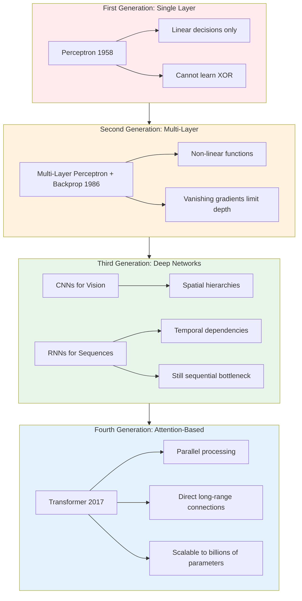
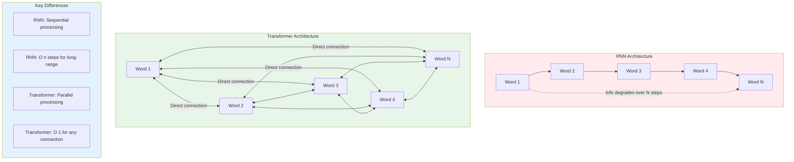
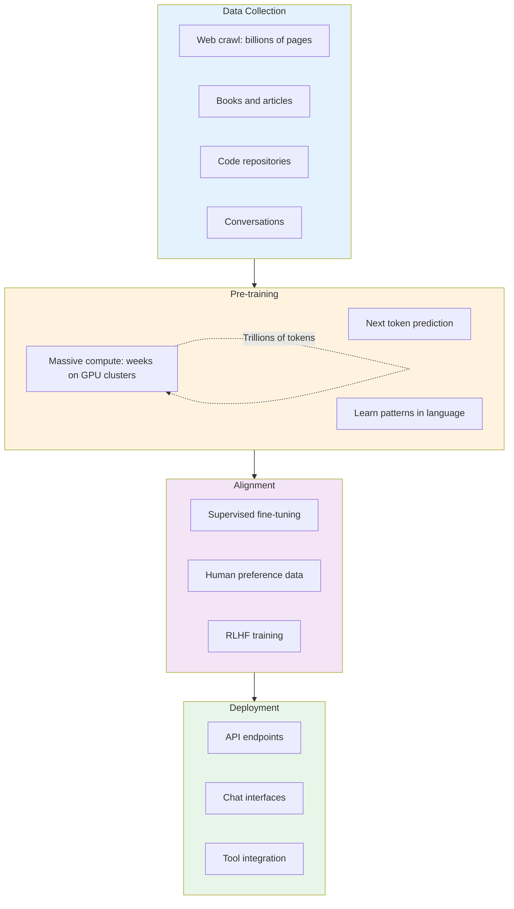

# Module 7: The Journey to Modern AI

**Part 2: AI/ML Deep Dive** | **Duration**: 1 hour 30 minutes | **Difficulty**: Intermediate

---

## Learning Objectives

By the end of this module, you will be able to:

- Trace the evolution from early AI research to modern transformers
- Understand key breakthroughs that enabled today's AI capabilities
- Recognize why deep learning succeeded where earlier approaches failed
- Connect historical context to current AI capabilities and limitations

---

## Section 1: The Early Dreams (1950-1980) (10 minutes)

### The Birth of a Field

In the summer of 1956, a group of researchers gathered at Dartmouth College for a workshop that would coin the term "artificial intelligence." John McCarthy, Marvin Minsky, Claude Shannon, and Nathaniel Rochester proposed that "every aspect of learning or any other feature of intelligence can in principle be so precisely described that a machine can be made to simulate it."

This was breathtaking optimism. And it set the tone for decades of ambition, progress, disappointment, and renewed hope that would eventually lead to the AI systems you work with today.

### The Turing Test and the Dream of Machine Intelligence

Before Dartmouth, there was Alan Turing. In his 1950 paper "Computing Machinery and Intelligence," Turing didn't ask "Can machines think?" Instead, he proposed a practical test: if a machine could converse with a human and the human couldn't tell they were talking to a machine, we might as well call that intelligence.

The Turing Test shaped early AI research in important ways. It suggested that intelligence could be measured by behavior rather than internal mechanisms. It focused attention on language as a key marker of intelligence. And it implied that symbolic, logical manipulation of language might be the path to artificial minds.

### The Perceptron: First Glimpse of Neural Networks

In 1958, Frank Rosenblatt introduced the perceptron, a mathematical model loosely inspired by biological neurons. A perceptron takes inputs, multiplies them by weights, sums them, and produces an output if the sum exceeds a threshold.

The perceptron could learn. Given labeled examples, it could adjust its weights to correctly classify inputs. Rosenblatt demonstrated perceptrons learning to distinguish shapes, and the media announced that thinking machines were imminent.

The mathematics were simple:

```
output = 1 if (w1*x1 + w2*x2 + ... + wn*xn) > threshold
output = 0 otherwise
```

A single perceptron implements a linear decision boundary. It can learn any function that's linearly separable, things like AND and OR. The learning rule is elegant: if the output is wrong, adjust weights toward the correct answer.

But there was a problem.

### The Minsky-Papert Critique and First AI Winter

In 1969, Marvin Minsky and Seymour Papert published "Perceptrons," a mathematical analysis proving that single-layer perceptrons cannot learn functions that aren't linearly separable. The most famous example: XOR (exclusive or). No single perceptron can compute XOR because there's no straight line that separates the true cases from the false cases.

This was a devastating critique. Not because the limitation wasn't already known, but because Minsky and Papert also raised doubts about whether multi-layer perceptrons could be trained effectively. Without a way to train deeper networks, neural networks seemed like a dead end.

Funding dried up. Researchers moved on. The first "AI winter" had begun.

### Symbolic AI: Logic and Knowledge Representation

With neural networks in hibernation, AI research shifted toward symbolic approaches. The idea was straightforward: intelligence involves manipulating symbols according to logical rules. A chess-playing program doesn't need neurons; it needs rules about how pieces move and strategies for evaluation.

Symbolic AI produced genuine achievements:

- **SHRDLU** (1970): Terry Winograd's system that could understand natural language commands about a simulated block world
- **MYCIN** (1976): An expert system for diagnosing bacterial infections that outperformed some physicians on specific cases
- **Chess programs**: Steady improvement through better search algorithms and evaluation functions

These systems demonstrated that computers could do things that seemed intelligent. But they also revealed a fundamental challenge: the knowledge had to be hand-coded by human experts. Every rule, every relationship, every exception needed explicit programming.

This would become known as the "knowledge acquisition bottleneck," and it would define the limits of symbolic AI.

---

## Section 2: Expert Systems and Second Winter (10 minutes)

### The Expert Systems Boom

By the early 1980s, AI had found a commercial application: expert systems. The idea was compelling, capture the knowledge of human experts in rules, and use that knowledge to make decisions in specialized domains.

MYCIN's success in medical diagnosis inspired dozens of expert systems for:

- Financial analysis and credit scoring
- Equipment fault diagnosis
- Chemical analysis
- Legal reasoning
- Mineral exploration (PROSPECTOR)

Companies like Teknowledge and IntelliCorp emerged to build and sell expert systems. Corporate AI labs proliferated. Japan announced the Fifth Generation Computer Project, a massive government initiative to build AI systems. The hype was real, and so was the investment.

Expert systems had a clear architecture:

1. **Knowledge base**: Rules encoded in IF-THEN statements
2. **Inference engine**: Software that applied rules to reach conclusions
3. **User interface**: Questions and explanations for users

A typical rule might look like:

```
IF patient has fever
AND patient has rash
AND rash appeared after taking medication
THEN suspect drug allergy (confidence 0.8)
```

### Knowledge Engineering: The Achilles Heel

Building an expert system required "knowledge engineering," the painstaking process of interviewing experts, extracting their knowledge, and encoding it as rules. This revealed several problems:

**Experts can't always explain their expertise.** A skilled diagnostician might recognize a pattern without being able to articulate how. Tacit knowledge resisted codification.

**Knowledge is context-dependent.** Rules that work in one hospital might not work in another. Knowledge that's valid in one era becomes obsolete.

**Edge cases multiply.** Real-world problems have countless exceptions. Each exception needed a new rule, and rules could conflict with each other.

**Maintenance becomes impossible.** As knowledge bases grew, they became increasingly fragile. Changing one rule could break others. Nobody could understand the whole system.

### Brittleness and the Frame Problem

Expert systems were "brittle." They worked well within their narrow domains but failed catastrophically when they encountered situations outside their training. They couldn't generalize, couldn't adapt, and couldn't recognize when they were out of their depth.

The deeper philosophical issue was the "frame problem": how do you represent everything that doesn't change when an action occurs? If a robot moves a block, the block changes position. But what about the block's color, weight, temperature? What about the table the block was on? The room? The universe?

Symbolic systems struggled with what humans handle effortlessly: common sense about how the world works.

### The Second AI Winter

By the late 1980s, the expert systems market collapsed. Companies had oversold capabilities and underdelivered results. The Fifth Generation Project failed to meet its ambitious goals. Investment evaporated.

The second AI winter wasn't just about expert systems. It reflected a deeper disillusionment with the entire approach. If intelligence required hand-coding knowledge, and hand-coding couldn't scale, perhaps the dream of artificial intelligence was simply unachievable.

What researchers didn't know was that the key to progress was already being developed in isolated research labs. The solution wasn't better knowledge engineering. It was learning from data.

---

## Section 3: The Neural Network Revival (15 minutes)

### Backpropagation: The Key That Unlocked Deep Networks

The perceptron's fatal flaw was that multi-layer networks couldn't be trained effectively. The insight that changed everything was backpropagation, an algorithm for computing how to adjust weights throughout a network based on errors at the output.

The mathematics had actually been discovered multiple times: by Paul Werbos in 1974, by David Parker in 1985, and by Geoffrey Hinton, David Rumelhart, and Ronald Williams in 1986. But it was the Hinton paper, "Learning Representations by Back-propagating Errors," that brought the technique to widespread attention.

Backpropagation works by:

1. **Forward pass**: Input flows through the network, producing an output
2. **Error calculation**: Compare output to the desired answer
3. **Backward pass**: Compute how much each weight contributed to the error
4. **Weight update**: Adjust weights to reduce the error

The key is the chain rule from calculus. If you know how the error depends on the output, and how the output depends on the previous layer, you can compute how the error depends on the previous layer. Apply this recursively, and you can compute gradients for every weight in an arbitrarily deep network.

```
For each weight w:
    gradient = d(error)/d(w)
    w = w - learning_rate * gradient
```

This was the breakthrough Minsky and Papert had doubted. Multi-layer networks could now learn. The XOR problem was trivially solved. And researchers began exploring what deeper networks could achieve.

### Convolutional Neural Networks and Computer Vision

In 1989, Yann LeCun combined backpropagation with a specialized architecture for image recognition: the convolutional neural network (CNN). Instead of connecting every input to every neuron, CNNs use:

**Convolutional layers**: Small filters that slide across the image, detecting local patterns like edges and textures. The same filter is applied everywhere, so the network learns position-invariant features.

**Pooling layers**: Downsampling that reduces spatial dimensions while preserving the most important information. This builds invariance to small translations.

**Hierarchical features**: Early layers detect simple patterns (edges, colors). Later layers combine these into complex features (eyes, faces, objects).

LeCun's system, applied to handwritten digit recognition for postal mail, was one of the first practical applications of deep learning. It worked well enough for real-world deployment at AT&T.

But there was a problem: depth. Networks with more than a few layers were extremely difficult to train. Gradients would either explode (growing uncontrollably) or vanish (shrinking to effectively zero). This "vanishing gradient problem" limited network depth and, therefore, capability.

### The Long Wait: Neural Networks in the Wilderness

Despite the promise of backpropagation, neural networks remained a niche interest through the 1990s and 2000s. Why?

**Computing power was insufficient.** Training deep networks on meaningful datasets required more computation than was practically available.

**Data was scarce.** The internet existed, but the massive labeled datasets needed for training didn't.

**Other methods worked better.** Support Vector Machines (SVMs) and ensemble methods like Random Forests achieved better results on many benchmarks with less computation.

**Theoretical foundations were weak.** Neural networks were often dismissed as "black boxes" without the mathematical elegance of competing approaches.

The researchers who kept working on neural networks during this period, like Geoffrey Hinton, Yann LeCun, and Yoshua Bengio, would later be recognized as pioneers. But at the time, they were swimming against the tide.

### The ImageNet Moment

Everything changed in 2012. The ImageNet competition challenged systems to classify images into 1,000 categories using a dataset of over 1 million labeled images. The best systems used carefully engineered features fed into machine learning classifiers.

Then Alex Krizhevsky, Ilya Sutskever, and Geoffrey Hinton entered AlexNet, a deep convolutional neural network. It won the competition by a staggering margin, reducing error rates by more than 40% compared to the second-place system.

AlexNet succeeded because of several converging factors:

**Scale**: 60 million parameters, 8 layers deep. Far larger than previous CNNs.

**GPU training**: Graphics processing units, designed for video games, turned out to be perfect for the matrix operations underlying neural networks. AlexNet trained on two GPUs.

**ReLU activation**: Replacing traditional sigmoid activations with Rectified Linear Units (ReLU) helped prevent vanishing gradients.

**Dropout regularization**: Randomly dropping neurons during training prevented overfitting to the training data.

**Data augmentation**: Creating variations of training images (flips, crops, color shifts) effectively multiplied the dataset size.

The ImageNet moment marked the beginning of the deep learning revolution. It wasn't just that neural networks worked; they worked dramatically better than anything else. Within a few years, nearly every computer vision benchmark would be dominated by deep learning.

---

## Section 4: Deep Learning Revolution (20 minutes)

### The Perfect Storm: GPUs, Data, and Algorithms

AlexNet didn't emerge from nowhere. It was the result of three trends converging:

**GPU computing**: NVIDIA's CUDA platform (2007) made it possible to run general-purpose computations on graphics cards. GPUs, with thousands of simple cores optimized for parallel operations, were ideal for the matrix multiplications at the heart of neural networks. Training that would take weeks on CPUs could complete in hours on GPUs.

**Big data**: The internet had been accumulating data for two decades. ImageNet, with 14 million labeled images, was a direct product of this data explosion. Wikipedia, digitized books, crawled websites, and social media created unprecedented training corpora.

**Algorithmic innovations**: ReLU, dropout, batch normalization, better initialization schemes, new architectures, each innovation addressed specific problems that had blocked progress.

The result was exponential improvement. Every year brought deeper networks, better results, and new capabilities. The field that had struggled for decades was suddenly advancing faster than anyone could track.

### Key Architectural Breakthroughs

Several architectural innovations drove the deep learning revolution:

**VGGNet (2014)**: Showed that very deep networks (16-19 layers) with small 3x3 filters outperformed shallower networks with larger filters. Depth mattered.

**GoogLeNet/Inception (2014)**: Introduced "inception modules" that applied multiple filter sizes in parallel, letting the network learn which scales were most informative. Also demonstrated that auxiliary classifiers during training could improve gradient flow.

**ResNet (2015)**: The breakthrough that solved the depth problem. Kaiming He and colleagues introduced "skip connections" that let gradients flow directly through the network:

```
output = F(x) + x
```

Instead of learning the full mapping from input to output, each layer learns the "residual," the difference between input and output. If a layer doesn't help, it can learn to do nothing (F(x) = 0), and the input passes through unchanged.

ResNet enabled networks with hundreds or even thousands of layers. The 152-layer ResNet won ImageNet 2015 and became the foundation for countless subsequent architectures.

**Batch Normalization (2015)**: Normalizing activations within each mini-batch stabilized training and allowed higher learning rates. This seemingly simple technique dramatically accelerated training and became standard.

### Beyond Vision: Deep Learning Takes Over

Computer vision was just the beginning. Deep learning spread to every domain where large datasets existed:

**Speech recognition**: Deep neural networks replaced the complex, hand-engineered pipelines that had defined speech recognition for decades. Error rates dropped precipitously. Virtual assistants like Siri and Alexa became possible.

**Natural language processing**: Neural language models began outperforming traditional n-gram approaches. Word embeddings (Word2Vec, 2013) showed that neural networks could learn meaningful representations of words.

**Game playing**: DeepMind's Deep Q-Network (DQN, 2013) learned to play Atari games from raw pixels, achieving superhuman performance on many games. AlphaGo (2016) defeated the world champion at Go, a game long considered a decade away from AI mastery.

**Drug discovery, protein folding, weather prediction**: Deep learning found applications wherever patterns could be learned from data.

### The Limits of Feedforward Networks

Despite these successes, feedforward networks (including CNNs) had fundamental limitations for certain tasks:

**Fixed input size**: CNNs expect fixed-size inputs. Processing variable-length sequences or arbitrarily-sized images required awkward workarounds.

**No memory**: Each input is processed independently. There's no way to maintain state across a sequence.

**No attention**: Every part of the input is processed similarly. There's no mechanism to focus on relevant parts.

For sequential data, language, speech, time series, something different was needed. That something was recurrent neural networks.

### Recurrent Neural Networks and Sequence Modeling

Recurrent Neural Networks (RNNs) introduced loops that allowed information to persist:

```
h_t = f(W * x_t + U * h_{t-1})
```

At each time step, the network takes an input (x*t) and the previous hidden state (h*{t-1}), combines them, and produces a new hidden state. The hidden state serves as memory, carrying information from earlier in the sequence.

RNNs could, in theory, model arbitrarily long sequences. In practice, they struggled with long-range dependencies. The same vanishing gradient problem that plagued deep feedforward networks returned: gradients through many time steps tended to either explode or vanish.

**Long Short-Term Memory (LSTM, 1997)**: Sepp Hochreiter and Jurgen Schmidhuber designed LSTM units with explicit "gates" controlling information flow. A forget gate decides what to discard from memory. An input gate decides what new information to store. An output gate decides what to output. These gates, learned during training, allowed LSTMs to maintain information over hundreds of time steps.

**Gated Recurrent Units (GRU, 2014)**: A simplified version of LSTM with fewer gates, often performing comparably with less computation.

By 2015, sequence-to-sequence models using LSTMs were achieving state-of-the-art results in machine translation, outperforming the statistical methods that had dominated for decades.

But RNNs had a fundamental problem that no amount of gating could solve: they processed sequences one element at a time. You couldn't parallelize across the sequence. Training was slow, and there was a hard limit on the context that could effectively inform each prediction.

The solution would come from an unexpected direction: attention mechanisms.

---

## Section 5: The Road to Transformers (20 minutes)

### The Attention Mechanism

In 2014, Dzmitry Bahdanau and colleagues introduced attention to machine translation. The insight was simple but powerful: instead of compressing the entire input sequence into a fixed-size vector, let the decoder look back at all encoder states, focusing on the most relevant ones for each output.

Traditional sequence-to-sequence models had a bottleneck: the encoder compressed the entire input into a single "context vector," and the decoder had to extract all relevant information from that fixed representation. For long sentences, this was asking too much of a single vector.

Attention changed the equation:

```
context_t = sum(alpha_t_i * h_i)
```

At each decoding step, the model computed attention weights (alpha) over all encoder hidden states (h). The context for that step was a weighted sum of all encoder states. Important words got high weights; irrelevant words got low weights.

This attention mechanism was differentiable, so the model could learn which parts of the input mattered for each part of the output. A translation model could learn to attend to the source word when producing its translation, even if word order differed between languages.

Attention improved translation quality significantly. But it was still an add-on to RNNs. The sequential bottleneck remained.

### The Limitations of RNNs Become Critical

As datasets grew larger and models grew more ambitious, RNN limitations became increasingly painful:

**Training time**: Processing one word requires the result from the previous word. Sequences can't be parallelized. A 100-word sentence takes 100 sequential steps, and those steps can't be distributed across the thousands of cores in a modern GPU.

**Long-range dependencies**: Despite LSTMs and attention, information degraded over long sequences. The model might attend to a distant word, but the representation of that word had passed through many transformations, losing information along the way.

**Memory constraints**: Hidden states had fixed size. To capture more context, you needed larger states, which meant more parameters and more computation.

Researchers began asking: what if we got rid of recurrence entirely? What if attention wasn't just an add-on, but the whole architecture?

### Attention Is All You Need

In June 2017, a team from Google published "Attention Is All You Need," introducing the Transformer architecture. The title was a provocation: it claimed you could build state-of-the-art sequence models using only attention, no recurrence, no convolutions.

The results were striking:

**Better quality**: The Transformer achieved 28.4 BLEU on WMT 2014 English-to-German translation, improving on the previous best by over 2 points.

**Faster training**: Training time dropped from 3.5 days to 12 hours on the same hardware.

**Parallelization**: Without recurrence, the entire sequence could be processed simultaneously. Every position attended to every other position in one parallel operation.

The key innovation was **self-attention**: instead of just attending from decoder to encoder, each position in a sequence attended to all other positions in the same sequence. This created direct connections between any two positions, regardless of distance.

For a sequence of length n:

- RNN: Information between position 1 and position n must traverse n-1 steps
- Transformer: Position 1 directly attends to position n in one operation

This direct connection solved the long-range dependency problem. It also enabled massive parallelization, since all positions could compute their attention simultaneously.

### The Self-Attention Mechanism

Self-attention (also called scaled dot-product attention) works through three learned transformations:

**Query (Q)**: "What am I looking for?"
**Key (K)**: "What information do I contain?"
**Value (V)**: "What information should I pass along?"

For each position:

1. Compute Q, K, V by multiplying the input by learned weight matrices
2. Compute attention scores: how well does each position's key match my query?
3. Apply softmax to get attention weights (probabilities summing to 1)
4. Compute output as weighted sum of values

The formula:

```
Attention(Q, K, V) = softmax(QK^T / sqrt(d_k)) * V
```

The division by sqrt(d_k) (dimension of keys) prevents dot products from becoming too large, which would push softmax into regions with vanishing gradients.

Multi-head attention runs this process multiple times in parallel with different learned projections, allowing the model to attend to information from different representation subspaces at different positions.

### Beyond the Original Paper

The Transformer architecture didn't just improve translation. It sparked a revolution that would reshape all of natural language processing within two years:

**BERT (2018)**: Google's "Bidirectional Encoder Representations from Transformers" showed that pre-training a transformer on massive unlabeled text, then fine-tuning on specific tasks, achieved state-of-the-art results on 11 NLP benchmarks.

**GPT (2018)**: OpenAI's "Generative Pre-trained Transformer" took a different approach: train a transformer to predict the next word, then fine-tune or prompt for downstream tasks.

**GPT-2 (2019)**: Scaled up to 1.5 billion parameters. Demonstrated surprisingly coherent text generation. OpenAI initially withheld the full model, citing concerns about misuse.

**T5 (2019)**: Google's "Text-to-Text Transfer Transformer" framed all NLP tasks as text-to-text problems, showing the power of unified architectures.

The key insight: scale the transformer, train it on massive data, and capabilities emerge that weren't explicitly programmed.

---

## Section 6: The LLM Era (10 minutes)

### GPT-3 and the Power of Scale

In 2020, OpenAI released GPT-3 with 175 billion parameters, trained on hundreds of billions of tokens. It was the largest language model ever trained, and it demonstrated something remarkable: capabilities that seemed to emerge from scale alone.

GPT-3 could perform tasks it was never explicitly trained for:

- **Few-shot learning**: Show the model a few examples in the prompt, and it would generalize to new cases
- **Translation**: Without being trained as a translator, it could translate between languages
- **Code generation**: Without being trained as a programmer, it could write working code
- **Arithmetic**: Without being trained as a calculator, it could perform multi-digit calculations (sometimes)

These "emergent capabilities" seemed to appear suddenly at certain scales. A model half the size might fail completely at a task; double the parameters, and the capability appears.

The implications were profound. Instead of designing specialized architectures for each task, you could train one massive model and adapt it through prompting. The era of task-specific models was giving way to general-purpose language models.

### BERT vs GPT: Two Paths Diverge

Two architectural families emerged from the transformer:

**Encoder-only (BERT)**: Uses bidirectional attention. Each token can see all other tokens. Trained with masked language modeling: hide some tokens, predict them from context. Excellent for understanding tasks (classification, entity recognition, question answering).

**Decoder-only (GPT)**: Uses causal (left-to-right) attention. Each token can only see previous tokens. Trained with next-token prediction: given previous tokens, predict the next one. Excellent for generation tasks.

**Encoder-decoder (T5, BART)**: Combines both. Encoder processes input bidirectionally; decoder generates output autoregressively. Good for sequence-to-sequence tasks (translation, summarization).

The decoder-only approach won for large-scale models because:

- Simpler architecture scales more cleanly
- Next-token prediction uses every position for training (more efficient)
- Generation naturally enables few-shot prompting
- One architecture handles many tasks via appropriate prompting

### Scaling Laws and Chinchilla

OpenAI's 2020 paper "Scaling Laws for Neural Language Models" formalized what researchers were observing: model performance improves predictably with scale. Loss decreases as a power law with model size, dataset size, and compute.

But how should you allocate a fixed compute budget between model size and data? Should you train a huge model on limited data, or a smaller model on more data?

DeepMind's Chinchilla paper (2022) provided an answer: previous models were undertrained. For optimal performance, tokens trained should scale roughly linearly with parameters. GPT-3's 175B parameters should have been trained on about 3.5 trillion tokens, not 300 billion.

Chinchilla, with "only" 70 billion parameters but trained on 1.4 trillion tokens, matched or exceeded GPT-3's performance on most benchmarks. The implication: you could get GPT-3-level performance with a smaller, more efficient model if you trained it properly.

This insight reshaped the field. LLaMA (Meta, 2023) applied the Chinchilla scaling laws to train a 65B parameter model that could rival much larger models. The race for the biggest model gave way to a race for the best-trained model.

### RLHF and the Alignment Revolution

Raw language models have a problem: they're trained to predict likely text, not to be helpful, harmless, and honest. A model that perfectly predicts internet text will generate spam, misinformation, and toxicity, because the internet contains those things.

Reinforcement Learning from Human Feedback (RLHF) addressed this. The process:

1. **Supervised fine-tuning**: Train the model on examples of desired behavior (helpful responses to questions)
2. **Reward model training**: Have humans rank model outputs; train a model to predict these rankings
3. **RL optimization**: Use reinforcement learning to adjust the language model to maximize the reward model's score

InstructGPT (OpenAI, 2022) demonstrated that RLHF-tuned models were dramatically preferred by users over raw models, even when the raw model was larger.

ChatGPT (November 2022) brought RLHF-tuned models to the public. The response was explosive: 100 million users in two months, the fastest-growing consumer application in history. People who had never heard of transformers or language models were suddenly having conversations with AI.

### The Current Landscape

By 2024, the LLM landscape had evolved dramatically:

**Frontier models**: GPT-4 (OpenAI), Claude (Anthropic), Gemini (Google), and others push the boundaries of capability. Multi-modal models that handle text, images, and more have become standard.

**Open models**: LLaMA, Mistral, Qwen, and others provide high-quality models that can be run locally or fine-tuned for specific applications.

**Specialized models**: Code-specific models (Codex, CodeLlama), domain-specific fine-tunes, and task-optimized variants proliferate.

**Deployment evolution**: Models are getting both bigger (frontier models) and smaller (efficient models for edge deployment). The gap between cloud APIs and local models continues to narrow.

The journey from Turing's 1950 paper to ChatGPT's 2022 launch took 72 years. The pace of change shows no signs of slowing.

---

## Section 7: Where We Are Now (5 minutes)

### Current Capabilities

Modern large language models demonstrate remarkable capabilities:

**Language understanding**: Near-human performance on many NLP benchmarks. Sophisticated comprehension of nuance, context, and implication.

**Generation**: Coherent, contextually appropriate text across many styles and formats. Code, prose, poetry, technical writing.

**Reasoning**: Multi-step problem solving, especially when guided to "think step by step." Not perfect, but often impressive.

**Multi-modal**: Processing and generating images, understanding diagrams, extracting information from screenshots.

**Tool use**: Calling APIs, writing and executing code, searching the web, interacting with applications.

**Conversation**: Maintaining context over long exchanges, adapting to user preferences, handling follow-up questions.

### Remaining Challenges

Despite these capabilities, fundamental challenges remain:

**Hallucination**: Models still generate confident falsehoods. This isn't a bug being fixed; it's inherent to prediction-based generation. Mitigation strategies help but don't eliminate the problem.

**Reasoning brittleness**: Models can solve problems that match training patterns but fail on novel variations. What looks like reasoning is often sophisticated pattern matching.

**Consistency**: The same prompt can produce different outputs. Models don't have persistent beliefs or knowledge, they have probability distributions.

**Factual grounding**: Models don't have access to current information, can't verify claims against reality, and mix real facts with plausible-sounding fabrications.

**Understanding vs. pattern matching**: Whether models "understand" anything in a meaningful sense remains philosophically and empirically contested.

### What the History Teaches Us

Looking back at this 75-year journey, several patterns emerge:

**Progress comes in waves.** Periods of optimism and progress alternate with winters of disillusionment. We may be in a spring, but winters have come before.

**Scale matters, but it's not everything.** AlexNet succeeded because of scale, but also because of ReLU, dropout, and GPUs. Transformers succeeded because of scale, but also because of attention and architectural choices.

**The hard problems remain hard.** Common sense reasoning, true understanding, factual reliability, these were challenges in 1970 and they're challenges today.

**Practical value doesn't require AGI.** Expert systems were useful despite not being generally intelligent. Current LLMs are useful despite their limitations.

**Each wave builds on the previous.** Perceptrons informed modern neural networks. Expert systems informed knowledge representation. RNNs informed attention mechanisms. Nothing is wasted.

Understanding this history gives you perspective. The AI systems you work with today are remarkable achievements built on decades of research, false starts, breakthroughs, and persistence. They're not magic, they're engineering. And like all engineering, they have strengths, weaknesses, and appropriate use cases.

---

## Diagrams

### AI Timeline: Major Milestones

```mermaid
graph LR
    subgraph 1950s-1970s[Early AI Era]
        T1[1950: Turing Test]
        T2[1956: Dartmouth Conference]
        T3[1958: Perceptron]
        T4[1969: Minsky-Papert Critique]
    end

    subgraph 1980s[Expert Systems Era]
        T5[1980: Expert Systems Boom]
        T6[1987: Second AI Winter]
    end

    subgraph 1990s-2000s[Neural Revival]
        T7[1986: Backpropagation]
        T8[1989: CNNs/LeNet]
        T9[1997: LSTM]
    end

    subgraph 2010s[Deep Learning]
        T10[2012: AlexNet/ImageNet]
        T11[2014: Attention Mechanism]
        T12[2015: ResNet]
        T13[2017: Transformer]
        T14[2018: BERT & GPT]
    end

    subgraph 2020s[LLM Era]
        T15[2020: GPT-3]
        T16[2022: ChatGPT]
        T17[2023: GPT-4]
    end

    T1 --> T2 --> T3 --> T4 --> T5 --> T6 --> T7 --> T8 --> T9 --> T10 --> T11 --> T12 --> T13 --> T14 --> T15 --> T16 --> T17

    style 1950s-1970s fill:#ffebee
    style 1980s fill:#fff3e0
    style 1990s-2000s fill:#e8f5e9
    style 2010s fill:#e3f2fd
    style 2020s fill:#f3e5f5
```



### Evolution of Neural Network Architectures



### Why RNNs Lost to Transformers



### The LLM Training Pipeline



---

## Knowledge Check

Test your understanding of AI history and evolution:

### Question 1

What was the fundamental limitation of the perceptron that led to the first AI winter?

- A) It was too slow to train
- B) It could only learn linearly separable functions (couldn't learn XOR)
- C) It required too much data
- D) It couldn't process images

**Correct Answer**: B

**Explanation**: Minsky and Papert proved mathematically that single-layer perceptrons cannot learn functions that aren't linearly separable, with XOR being the classic example. This was devastating because it suggested neural networks were fundamentally limited, and at the time, there was no effective way to train multi-layer networks that could overcome this limitation.

### Question 2

What three factors converged to enable the deep learning revolution around 2012?

- A) Faster CPUs, smaller datasets, simpler algorithms
- B) GPU computing, big data, algorithmic innovations (ReLU, dropout, etc.)
- C) Quantum computers, synthetic data, expert systems
- D) Cloud computing, symbolic AI, rule-based systems

**Correct Answer**: B

**Explanation**: The deep learning revolution required three elements that finally came together around 2012: GPU computing enabled parallel training on massive datasets; big data (like ImageNet's 14 million labeled images) provided the training material; and algorithmic innovations like ReLU activations, dropout regularization, and batch normalization solved training problems that had blocked progress for decades.

### Question 3

What was the key innovation of the Transformer architecture that made it superior to RNNs?

- A) Using convolutional layers for text processing
- B) Self-attention allowing parallel processing and direct long-range connections
- C) Larger model sizes
- D) Better training data

**Correct Answer**: B

**Explanation**: The Transformer's key innovation was self-attention, which allows every position in a sequence to directly attend to every other position in a single operation. This solved two critical RNN limitations: the sequential bottleneck (now everything can be processed in parallel) and vanishing gradients over long distances (now any two positions are directly connected, regardless of distance in the sequence).

### Question 4

What does RLHF (Reinforcement Learning from Human Feedback) accomplish that pre-training alone cannot?

- A) It makes models larger
- B) It teaches models new facts
- C) It aligns model outputs with human preferences for helpfulness, harmlessness, and honesty
- D) It speeds up inference

**Correct Answer**: C

**Explanation**: Pre-training teaches a model to predict likely text, but the internet contains helpful and harmful content alike. RLHF uses human preferences to adjust the model's behavior, making it more helpful, less harmful, and more honest than a raw pre-trained model. This is why ChatGPT feels more useful than a base GPT model, it's been aligned to human preferences through RLHF.

---

## Hands-On Exercise: AI History Timeline Research

### Objective

Deepen your understanding of AI history by researching key milestones and their connections to modern systems.

### Time Required

45-60 minutes

### Prerequisites

- Access to search engines and/or AI assistants for research
- Note-taking tools

### Exercise Steps

#### Part 1: Deep Dive on a Breakthrough (20 minutes)

Choose one of the following breakthroughs to research in depth:

1. **The Perceptron (1958)** - Frank Rosenblatt's original system
2. **Backpropagation (1986)** - The Hinton, Rumelhart, Williams paper
3. **AlexNet (2012)** - The ImageNet competition winner
4. **Attention Is All You Need (2017)** - The original Transformer paper

For your chosen breakthrough, answer:

1. What problem was it trying to solve?
2. What was the key insight or innovation?
3. What were the immediate reactions from the research community?
4. How did it influence subsequent work?
5. What limitations did it have that later work addressed?

**Document your findings**:

```
Breakthrough: _____________
Problem being solved:

Key insight:

Community reaction:

Influence on later work:

Limitations addressed by later work:
```

#### Part 2: Tracing a Concept's Evolution (15 minutes)

Trace how one of these concepts evolved from early AI to modern transformers:

- **Attention**: From human attention in psychology to attention mechanisms in neural networks
- **Learning from data**: From perceptron learning rules to modern gradient descent
- **Scale**: From single-layer networks to GPT-4's trillion parameters

For your chosen concept:

1. Identify at least 3 key milestones in its evolution
2. Explain what changed at each milestone
3. Describe how the modern version differs from the original

**Document your findings**:

```
Concept: _____________

Milestone 1 (year):
- What existed:
- What changed:

Milestone 2 (year):
- What existed:
- What changed:

Milestone 3 (year):
- What existed:
- What changed:

Original vs. Modern:
```

#### Part 3: Connecting History to Current Practice (15 minutes)

Reflect on how understanding AI history changes your perspective on current AI systems:

1. **The hype cycle**: How do current AI claims compare to historical predictions? What should make you skeptical vs. optimistic?

2. **Fundamental vs. solved problems**: Which challenges from early AI remain challenges today? Which have been genuinely solved?

3. **The role of scale**: Early AI researchers couldn't imagine current compute scales. What might future scale enable that seems impossible today?

4. **Practical implications**: How does knowing the history change how you'll use AI tools?

**Write a brief reflection** (200-300 words) addressing these questions.

#### Part 4: Timeline Synthesis (10 minutes)

Create a personal timeline of the 10 most important milestones in AI history, based on your research and the module content. For each milestone, write one sentence explaining why it matters.

```
Your Top 10 AI History Milestones:

1. (Year) _____________: Why it matters:
2. (Year) _____________: Why it matters:
3. (Year) _____________: Why it matters:
4. (Year) _____________: Why it matters:
5. (Year) _____________: Why it matters:
6. (Year) _____________: Why it matters:
7. (Year) _____________: Why it matters:
8. (Year) _____________: Why it matters:
9. (Year) _____________: Why it matters:
10. (Year) _____________: Why it matters:
```

### Success Criteria

You've successfully completed this exercise if you:

- [ ] Researched one breakthrough in depth with specific details
- [ ] Traced a concept's evolution through at least 3 milestones
- [ ] Connected historical patterns to current AI systems
- [ ] Created a personal top-10 timeline with explanations
- [ ] Written a reflection connecting history to practice

### Extension Ideas

If you want to explore further:

1. **Read original papers**: The Turing 1950 paper, Minsky-Papert 1969, or "Attention Is All You Need" 2017 are all accessible and enlightening
2. **Interview perspective**: Talk to someone who worked in AI during a previous era, their perspective on current progress is invaluable
3. **Failure analysis**: Research AI projects that failed spectacularly (Fifth Generation, Cyc) and analyze why
4. **Alternative histories**: Research approaches that were abandoned but might be relevant again (symbolic AI, neurosymbolic systems)

---

## References

### Original Papers

1. **"Computing Machinery and Intelligence"** - Alan Turing (1950)
   The foundational paper on machine intelligence, introducing the Turing Test. Still relevant for framing questions about AI.
   [philpapers.org/rec/TURCMA](https://philpapers.org/rec/TURCMA)

2. **"Perceptrons"** - Minsky & Papert (1969)
   The mathematical critique that ended the first neural network era. Important for understanding AI winters.

3. **"Learning Representations by Back-propagating Errors"** - Rumelhart, Hinton, Williams (1986)
   The paper that made backpropagation widely known and reignited neural network research.
   [nature.com/articles/323533a0](https://www.nature.com/articles/323533a0)

4. **"ImageNet Classification with Deep Convolutional Neural Networks"** - Krizhevsky, Sutskever, Hinton (2012)
   The AlexNet paper that launched the deep learning revolution.
   [papers.nips.cc/paper/4824-imagenet-classification-with-deep-convolutional-neural-networks](https://papers.nips.cc/paper/4824-imagenet-classification-with-deep-convolutional-neural-networks)

5. **"Attention Is All You Need"** - Vaswani et al. (2017)
   The Transformer paper. Required reading for anyone working with modern AI.
   [arxiv.org/abs/1706.03762](https://arxiv.org/abs/1706.03762)

### Historical Context

6. **"Artificial Intelligence: A Modern Approach"** - Russell & Norvig
   The standard AI textbook, with excellent historical chapters.
   [aima.cs.berkeley.edu](https://aima.cs.berkeley.edu)

7. **"The Quest for Artificial Intelligence"** - Nils Nilsson (2010)
   Comprehensive history of AI from a pioneer in the field.
   [ai.stanford.edu/~nilsson/QAI/qai.pdf](https://ai.stanford.edu/~nilsson/QAI/qai.pdf)

8. **"Deep Learning"** - Goodfellow, Bengio, Courville (2016)
   The definitive deep learning textbook, with good historical context.
   [deeplearningbook.org](https://www.deeplearningbook.org)

### Modern Developments

9. **"Language Models are Few-Shot Learners"** - Brown et al. (GPT-3, 2020)
   The paper that demonstrated emergent few-shot capabilities at scale.
   [arxiv.org/abs/2005.14165](https://arxiv.org/abs/2005.14165)

10. **"Training language models to follow instructions with human feedback"** - Ouyang et al. (InstructGPT, 2022)
    The paper describing RLHF and its dramatic impact on model usefulness.
    [arxiv.org/abs/2203.02155](https://arxiv.org/abs/2203.02155)

### Accessible Explainers

11. **"The Illustrated Transformer"** - Jay Alammar
    Visual, intuitive explanation of how Transformers work.
    [jalammar.github.io/illustrated-transformer](https://jalammar.github.io/illustrated-transformer/)

12. **"A Brief History of AI"** - Various sources
    Many good overviews exist; search for recent ones that cover through GPT-4.

---

## Summary

In this module, you've traced the journey from AI's earliest dreams to today's large language models:

1. **The early era (1950-1980)** established the dream of machine intelligence. The perceptron showed machines could learn, but its limitations led to the first AI winter. Symbolic AI and expert systems offered an alternative approach based on hand-coded knowledge.

2. **Expert systems (1980s)** demonstrated practical AI applications but hit the knowledge acquisition bottleneck. The difficulty of encoding human expertise led to the second AI winter.

3. **The neural revival** came through backpropagation, which finally enabled training of multi-layer networks. CNNs conquered computer vision, and the 2012 ImageNet moment marked the beginning of the deep learning revolution.

4. **Deep learning (2012-2017)** was enabled by the convergence of GPU computing, big data, and algorithmic innovations. ResNet solved the depth problem; attention mechanisms addressed long-range dependencies.

5. **The Transformer (2017)** replaced recurrence with self-attention, enabling parallel processing and direct connections between any positions. This architecture became the foundation for all modern language models.

6. **The LLM era (2020-present)** demonstrated that scaling Transformers produces emergent capabilities. RLHF alignment made models useful for conversation. ChatGPT brought AI to mainstream awareness.

7. **Current state** shows remarkable capabilities alongside persistent challenges. Hallucination, reasoning brittleness, and consistency remain unsolved.

Understanding this history matters because it shows that:

- Progress comes in waves, not straight lines
- Current limitations have historical roots
- Scale is important but not sufficient
- Today's systems are engineering achievements, not magic

In the next module, we'll dive deep into the Transformer architecture that powers modern AI, understanding exactly how attention mechanisms, positional encoding, and the other components work together.

---

## What's Next

**Module 8: The Transformer Revolution**

We'll cover:

- The complete Transformer architecture in detail
- Self-attention: Query, Key, Value mechanics
- Multi-head attention and why it matters
- Positional encoding and the position problem
- Layer normalization and residual connections
- Encoder-decoder vs. decoder-only architectures
- Hands-on visualization of attention patterns

This module gave you the historical context; Module 8 gives you the technical depth to understand how modern AI actually works.
