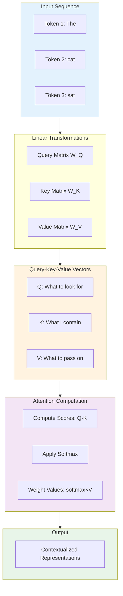
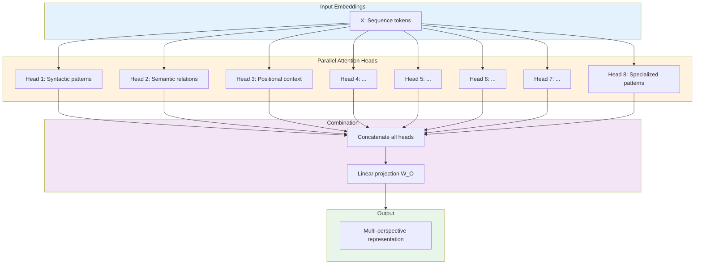
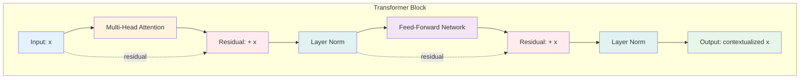
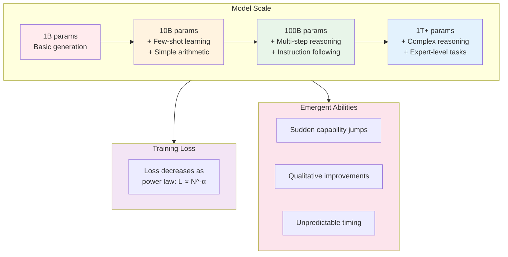

# Module 8: The Transformer Revolution

**Part 2: AI/ML Deep Dive** | **Duration**: 2 hours | **Difficulty**: Advanced

---

## Learning Objectives

By the end of this module, you will be able to:

- Understand why the transformer architecture changed everything in AI
- Grasp the attention mechanism both intuitively and technically
- Recognize how transformers process sequences differently than RNNs
- Explain the key components: self-attention, multi-head attention, positional encoding
- Distinguish between encoder-decoder and decoder-only architectures
- Build intuition for what transformers can and cannot do
- Understand scaling laws and emergent capabilities

---

## Section 1: "Attention Is All You Need" (15 minutes)

### The AI Timeline Before 2017

In 2017, deep learning was already successful but hitting walls:

**Convolutional Neural Networks (CNNs)** dominated computer vision. They were great at images but struggled with sequences—text, speech, time series data.

**Recurrent Neural Networks (RNNs)** and their variants (LSTMs, GRUs) handled sequences. They could process text word by word, maintaining a hidden state that captured context. But they had fatal flaws:

- **Sequential bottleneck**: Each word had to be processed before the next. No parallelization meant slow training.
- **Vanishing gradients**: Information from early in a sequence degraded over time. Long-range dependencies were hard to learn.
- **Fixed capacity**: The hidden state had to compress all context into a fixed-size vector. More context meant more compression loss.

Machine translation exemplified these struggles. State-of-the-art systems used sequence-to-sequence models: an RNN encoder processed the source sentence into a context vector, then an RNN decoder generated the translation. They worked, but poorly for long sentences and slowly for everything.

### The Paper That Changed Everything

In June 2017, a team at Google Brain and Google Research published "Attention Is All You Need."

The title was a provocation. The prevailing wisdom was that attention mechanisms—which let models focus on relevant parts of the input—were useful additions to RNNs. This paper claimed you could throw out the RNN entirely and build everything from attention.

The results were striking:

- **Better**: State-of-the-art translation quality on WMT 2014 English-to-German (BLEU score 28.4, improving by 2+ points)
- **Faster**: Training time reduced from 3.5 days to 12 hours on the same hardware
- **Simpler**: The architecture was more elegant, more parallelizable, more interpretable

Within months, transformers started dominating NLP. Within two years, BERT (2018) and GPT-2 (2019) showed that pre-trained transformers could be fine-tuned for almost any language task. By 2020, GPT-3 demonstrated few-shot learning at scale. By 2022, ChatGPT brought transformers to mainstream awareness.

Today, virtually every major AI breakthrough uses transformers or their descendants. Vision transformers (ViTs) are replacing CNNs. Audio transformers process speech. Multimodal transformers combine images and text. Diffusion models use transformer-like attention mechanisms.

The 2017 paper didn't just introduce a better architecture. It revealed a fundamental principle: **attention over sequences is the key computational primitive for learning from data**.

### What Problem Did Transformers Solve?

The core insight: **all inputs should be able to attend to all other inputs simultaneously**.

In RNNs, information flows sequentially. Word 1 affects word 2, which affects word 3, and so on. To connect word 1 to word 50, information must traverse 49 steps, degrading along the way.

In transformers, word 1 can attend directly to word 50. Every position can look at every other position in one step. This enables:

1. **Parallelization**: All positions process simultaneously. Training becomes massively parallelizable on GPUs.
2. **Long-range dependencies**: Direct connections mean no degradation over distance.
3. **Dynamic weighting**: The model learns which connections matter, rather than treating all sequential connections equally.

The fundamental mechanism enabling this is **self-attention**. Let's understand how it works.

---

## Section 2: Self-Attention Mechanism (25 minutes)

### The Intuition: Dynamic Relevance

Imagine reading this sentence: "The animal didn't cross the street because it was too tired."

What does "it" refer to? Your brain instantly resolves this: "it" means the animal, not the street. You do this by paying attention to context—"tired" relates to animals, not streets.

Self-attention formalizes this intuition. For each word, the mechanism:

1. Looks at all other words in the sequence
2. Computes how relevant each word is to the current word
3. Creates a new representation that mixes information based on relevance

Let's make this concrete with a simpler example: "The cat sat on the mat."

For the word "cat", self-attention might determine:

- "The" (before it): low relevance, it's just an article
- "cat" (itself): high relevance, self-reference helps with identity
- "sat": high relevance, this is what the cat did
- "on": medium relevance, preposition indicating relationship
- "the": low relevance
- "mat": medium relevance, location of sitting

The output representation of "cat" would be a weighted combination of all these words, with "cat" and "sat" contributing most.

### The Math: Query, Key, Value

Self-attention implements this through three learned transformations of each input:

**Query (Q)**: "What am I looking for?"
**Key (K)**: "What information do I contain?"
**Value (V)**: "What information should I pass along?"

Think of it like a database lookup system:

- **Query** is your search term
- **Key** is the index you search against
- **Value** is the actual data you retrieve

For each position in the sequence:

1. **Transform inputs**: Apply learned weight matrices to create Q, K, V vectors
   - Q = X × W_Q
   - K = X × W_K
   - V = X × W_V

2. **Compute attention scores**: For each position, compute how much it should attend to every position
   - Score(i,j) = Q_i · K_j (dot product)
   - This measures compatibility: how well position i's query matches position j's key

3. **Normalize with softmax**: Convert scores to probabilities that sum to 1
   - Attention(i,j) = softmax(Score(i,j))
   - Divide by √d_k (dimension of keys) for stable gradients

4. **Weighted combination**: Mix values according to attention weights
   - Output_i = Σ_j Attention(i,j) × V_j

### The Equation

The complete self-attention equation, as written in the paper:

```
Attention(Q, K, V) = softmax(QK^T / √d_k)V
```

Let's decode this:

- **QK^T**: Matrix multiplication of queries with keys (transposed). This computes all pairwise compatibility scores at once.
- **/ √d_k**: Scale by the square root of key dimension. Prevents dot products from becoming too large, which would push softmax into saturation regions with tiny gradients.
- **softmax(...)**: Converts each row of scores to probabilities (each row sums to 1).
- **× V**: Multiply attention probabilities by values. This computes the weighted combinations.

The genius is that everything happens in parallel. All positions compute their attention simultaneously. A single matrix multiplication computes all pairwise interactions.

### Concrete Example with Numbers

Let's trace through a tiny example. Sequence: "cat sat", embedded as 4-dimensional vectors.

**Input embeddings** (simplified):

```
cat: [1.0, 0.5, 0.3, 0.8]
sat: [0.2, 0.9, 0.7, 0.1]
```

**Learned weight matrices** (2D output for simplicity):

```
W_Q: [[0.3, 0.1],    W_K: [[0.2, 0.4],    W_V: [[0.5, 0.2],
      [0.4, 0.2],          [0.3, 0.1],          [0.1, 0.6],
      [0.1, 0.5],          [0.5, 0.2],          [0.3, 0.4],
      [0.2, 0.3]]          [0.1, 0.3]]          [0.2, 0.5]]
```

**Step 1: Create Q, K, V**

```
Q_cat = [1.0, 0.5, 0.3, 0.8] × W_Q = [0.64, 0.49]
Q_sat = [0.2, 0.9, 0.7, 0.1] × W_Q = [0.63, 0.54]

K_cat = [1.0, 0.5, 0.3, 0.8] × W_K = [0.63, 0.61]
K_sat = [0.2, 0.9, 0.7, 0.1] × W_K = [0.68, 0.33]

V_cat = [1.0, 0.5, 0.3, 0.8] × W_V = [0.77, 0.92]
V_sat = [0.2, 0.9, 0.7, 0.1] × W_V = [0.62, 0.75]
```

**Step 2: Attention scores** (dot products)

```
score(cat→cat) = Q_cat · K_cat = (0.64×0.63) + (0.49×0.61) = 0.70
score(cat→sat) = Q_cat · K_sat = (0.64×0.68) + (0.49×0.33) = 0.60
score(sat→cat) = Q_sat · K_cat = (0.63×0.63) + (0.54×0.61) = 0.73
score(sat→sat) = Q_sat · K_sat = (0.63×0.68) + (0.54×0.33) = 0.61
```

**Step 3: Scale and softmax** (d_k = 2, so √d_k = 1.41)

```
scaled_score(cat→cat) = 0.70 / 1.41 = 0.49
scaled_score(cat→sat) = 0.60 / 1.41 = 0.42

After softmax:
attention(cat→cat) = 0.52  (cat attends 52% to itself)
attention(cat→sat) = 0.48  (cat attends 48% to sat)

Similarly for sat→*
```

**Step 4: Weighted sum of values**

```
output_cat = 0.52×V_cat + 0.48×V_sat
          = 0.52×[0.77, 0.92] + 0.48×[0.62, 0.75]
          = [0.70, 0.84]
```

This output representation of "cat" now incorporates information from both "cat" and "sat", weighted by their relevance.

### Why This Works

The beauty of self-attention:

1. **Learned relevance**: The Q, K, V transformations are learned. The model discovers what makes words relevant to each other.

2. **Content-based addressing**: Attention is based on content similarity (Q·K), not position. "cat" can attend strongly to "sat" or weakly to it based on learned semantics.

3. **Differentiable**: Everything is matrix multiplication and softmax. Backpropagation works smoothly.

4. **Parallel**: All attention computations happen simultaneously. This scales beautifully on modern hardware.

### What Self-Attention Can't Do (Yet)

Self-attention has no inherent sense of position. "cat sat mat" and "mat sat cat" produce the same attention patterns without positional information. We'll address this with positional encoding later.

Self-attention is also O(n²) in sequence length: every position attends to every position. For a 1000-word document, that's 1,000,000 interactions. This becomes the bottleneck for very long sequences.

---

## Section 3: Multi-Head Attention (15 minutes)

### Why Multiple Attention Heads?

Self-attention lets the model learn one pattern of relevance. But language has many types of relationships:

- Syntactic: subject-verb agreement, pronoun resolution
- Semantic: thematic similarity, contradiction, entailment
- Positional: nearby words, distant dependencies
- Functional: modifiers to nouns, arguments to verbs

A single attention mechanism must compromise between these. Multi-head attention runs several attention mechanisms in parallel, each learning different patterns.

### The Architecture

Instead of one set of Q, K, V transformations, use h parallel heads (typically h=8 or h=16):

```
For each head i:
  Q_i = X × W^Q_i
  K_i = X × W^K_i
  V_i = X × W^V_i

  head_i = Attention(Q_i, K_i, V_i)

MultiHead = Concat(head_1, head_2, ..., head_h) × W^O
```

Each head has its own learned weight matrices. Each learns its own attention patterns. The outputs are concatenated and linearly transformed.

### Intuitive Example

Consider the sentence: "The bank can guarantee deposits will eventually cover future tuition costs because it has reliable income."

Different heads might specialize:

**Head 1 (Syntactic)**:

- "bank" → "can" (subject-verb)
- "it" → "bank" (pronoun resolution)
- "deposits" → "cover" (subject-verb)

**Head 2 (Semantic - Finance)**:

- "bank" → "deposits", "guarantee", "income"
- "costs" → "tuition", "cover"

**Head 3 (Semantic - Temporal)**:

- "eventually" → "future", "will"
- "costs" → "future"

**Head 4 (Causal)**:

- "guarantee" → "because"
- "because" → "has", "income"

Each head forms a different "understanding" of the sentence. The model learns to route different aspects of meaning through different heads.

### Empirical Observations

Researchers have analyzed what different heads learn in trained models:

**Positional heads**: Some heads attend primarily to adjacent words or words at fixed relative positions. These capture local n-gram patterns.

**Syntactic heads**: Some heads learn to follow syntactic dependencies—subjects to verbs, adjectives to nouns, pronouns to antecedents.

**Semantic heads**: Some heads group semantically related words—"bank" with financial terms, "river" with geographic terms.

**Rare heads**: Some heads develop specialized, hard-to-interpret patterns that nonetheless improve performance.

Importantly, this specialization emerges from training. Heads aren't designed for specific roles—they learn them.

### The Math

Multi-head attention with h heads, model dimension d_model, and head dimension d_k = d_model/h:

```
MultiHead(Q,K,V) = Concat(head_1, ..., head_h)W^O

where head_i = Attention(QW^Q_i, KW^K_i, VW^V_i)

Parameter matrices:
W^Q_i ∈ R^(d_model × d_k)
W^K_i ∈ R^(d_model × d_k)
W^V_i ∈ R^(d_model × d_v)
W^O ∈ R^(hd_v × d_model)
```

Typically d_k = d_v = d_model/h, so total computation is similar to single-head attention with the full dimension.

### Why This Improves Performance

Multiple heads provide:

1. **Representational diversity**: Different views of the same input
2. **Specialization**: Heads can focus on different aspects
3. **Redundancy**: If one head learns poorly, others compensate
4. **Ensemble effects**: Multiple learned patterns vote on the best representation

Empirically, multi-head attention consistently outperforms single-head attention. The improvement is largest for complex tasks requiring multiple types of reasoning.

---

## Section 4: The Complete Transformer Block (20 minutes)

### Beyond Attention: The Full Architecture

Self-attention is the star, but a complete transformer block includes several other crucial components. Each serves a specific purpose in making the model trainable and effective.

A single transformer block consists of:

1. **Multi-head self-attention** (we've covered this)
2. **Add & Normalize** (residual connection + layer normalization)
3. **Position-wise feed-forward network**
4. **Add & Normalize** (another residual + normalization)

Let's understand why each piece matters.

### Residual Connections

Deep networks face the vanishing gradient problem: as gradients backpropagate through many layers, they can become vanishingly small, making learning slow or impossible.

Residual connections (from ResNet, 2015) solve this:

```
output = F(input) + input
```

Instead of learning output = F(input), the layer learns the residual: output - input = F(input).

This creates "gradient highways"—gradients can flow backward through the identity connection without being diminished by transformations. Even if F contributes little, the gradient passes through.

In transformers:

```
# After attention
x = x + MultiHeadAttention(x)

# After feed-forward
x = x + FeedForward(x)
```

The input is always added back. If attention or the feed-forward network doesn't improve the representation, the original is preserved.

### Layer Normalization

Training deep networks requires keeping activations in a reasonable range. Batch normalization (normalizing across the batch dimension) works well for CNNs but poorly for variable-length sequences.

Layer normalization normalizes across the feature dimension for each position:

```
LayerNorm(x) = γ × (x - μ) / σ + β

where:
  μ = mean(x) across features
  σ = std(x) across features
  γ, β = learned scale and shift parameters
```

This ensures each position's representation has mean 0 and standard deviation 1 (before the learned scale/shift). It stabilizes training and enables deeper networks.

In transformers, layer norm is applied after each residual connection:

```
x = LayerNorm(x + MultiHeadAttention(x))
x = LayerNorm(x + FeedForward(x))
```

### Position-Wise Feed-Forward Network

After attention mixes information across positions, each position independently passes through a feed-forward network:

```
FFN(x) = max(0, xW_1 + b_1)W_2 + b_2
```

This is two linear transformations with a ReLU activation between them. "Position-wise" means the same network applies to each position independently (no mixing across positions here—that's attention's job).

The feed-forward layer typically expands to higher dimension then projects back:

- Input: d_model (e.g., 512)
- Hidden: 4×d_model (e.g., 2048)
- Output: d_model (e.g., 512)

**Why is this necessary?** Attention is linear (weighted sums). The feed-forward network adds non-linear processing capacity. It lets each position transform its (now contextualized) representation in complex, non-linear ways.

Empirically, this is where much of the model's capacity comes from. Attention gathers information; feed-forward processes it.

### The Complete Block

Putting it together:

```python
def transformer_block(x):
    # Multi-head self-attention + residual + norm
    attn_output = multi_head_attention(x, x, x)  # Q, K, V all from x
    x = layer_norm(x + attn_output)

    # Feed-forward + residual + norm
    ffn_output = feed_forward(x)
    x = layer_norm(x + ffn_output)

    return x
```

Each position:

1. Gathers information from all positions (attention)
2. Adds that to its original representation (residual)
3. Normalizes (layer norm)
4. Processes the contextualized representation (feed-forward)
5. Adds that to the pre-FFN representation (residual)
6. Normalizes (layer norm)

### Stacking Blocks

Modern transformers stack many blocks (GPT-3: 96 blocks, GPT-4: rumored 120+):

```
x = embed(tokens)
x = x + positional_encoding
x = transformer_block_1(x)
x = transformer_block_2(x)
...
x = transformer_block_N(x)
output = output_layer(x)
```

Each block refines representations. Early blocks learn surface patterns (syntax, local context). Deeper blocks learn abstract patterns (semantics, long-range dependencies, reasoning).

### Parameter Count

For a transformer with:

- L layers (blocks)
- h attention heads
- d_model embedding dimension
- Vocabulary size V

Major parameters:

- Embeddings: V × d_model
- Each attention head: 3 × d_model × (d_model/h) for Q, K, V
- Feed-forward: d_model × (4×d_model) + (4×d_model) × d_model ≈ 8 × d_model²
- Per block: ~12 × d_model² (attention + FFN)
- Total: V×d_model + L×12×d_model²

For GPT-3 (L=96, d_model=12288, V=50257):

- Embeddings: ~600M parameters
- Blocks: 96 × 12 × 12288² ≈ 174B parameters
- Total: ~175B parameters

Most parameters are in the feed-forward networks and embeddings.

---

## Section 5: Positional Encoding (15 minutes)

### The Position Problem

Self-attention has no inherent notion of position. It computes attention based purely on content:

```
Attention(Q, K, V) = softmax(QK^T / √d_k)V
```

This means:

- "cat sat mat" produces the same attention patterns as "mat sat cat"
- "The cat sat on the mat" is indistinguishable from "mat the on sat cat The"

Position is crucial for language. Word order changes meaning:

- "dog bites man" ≠ "man bites dog"
- "not bad" ≠ "bad not"

We need to inject positional information into the model.

### Requirements for Position Encoding

A good positional encoding should:

1. **Be unique**: Each position should have a different encoding
2. **Be generalizable**: The model should handle sequences longer than those seen in training
3. **Capture distance**: Relative distances between positions should be meaningful
4. **Be deterministic**: Same position should always get the same encoding

### Sinusoidal Positional Encoding

The original transformer paper used a clever sinusoidal scheme:

```
PE(pos, 2i)   = sin(pos / 10000^(2i/d_model))
PE(pos, 2i+1) = cos(pos / 10000^(2i/d_model))

where:
  pos = position in sequence (0, 1, 2, ...)
  i = dimension index (0, 1, 2, ..., d_model/2)
  d_model = embedding dimension
```

Even dimensions use sine, odd dimensions use cosine. The frequency decreases with dimension index.

**Visualization** for d_model=8, positions 0-19:

```
Position 0:  [sin(0/10000^0),  cos(0/10000^0),  sin(0/10000^2/8), ...]
Position 1:  [sin(1/10000^0),  cos(1/10000^0),  sin(1/10000^2/8), ...]
...
```

Low dimensions oscillate rapidly (capturing fine-grained position).
High dimensions oscillate slowly (capturing coarse-grained position).

**Why this works**:

1. **Uniqueness**: Each position gets a unique pattern of sines/cosines
2. **Bounded**: All values are in [-1, 1]
3. **Deterministic**: No parameters to learn, same encoding every time
4. **Relative positions**: For any fixed offset k, PE(pos+k) can be expressed as a linear function of PE(pos)—the model can learn to attend to relative positions

### Learned Positional Embeddings

An alternative: learn positional embeddings like word embeddings:

```python
position_embeddings = nn.Embedding(max_sequence_length, d_model)
```

Each position (0, 1, 2, ..., max_length) gets a learned vector.

**Advantages**:

- Model can learn optimal encodings for the task
- Often performs slightly better empirically

**Disadvantages**:

- Requires specifying max sequence length upfront
- Doesn't naturally generalize to longer sequences
- Adds parameters (though relatively few)

Modern models (BERT, GPT-2/3) typically use learned positional embeddings.

### Adding Position to Embeddings

Positional encodings are added to token embeddings:

```python
# Token embeddings: [batch, seq_len, d_model]
token_emb = embedding_layer(tokens)

# Positional encodings: [seq_len, d_model]
pos_enc = positional_encoding(seq_len)

# Combine by addition
x = token_emb + pos_enc
```

Why addition, not concatenation? Addition preserves dimensionality and creates an inductive bias: position modulates token meaning rather than being an independent feature.

The model learns to use position information through attention. Queries and keys incorporate position, so attention patterns can be position-aware.

### Relative Positional Encodings

Recent work (Transformer-XL, T5) uses relative position encodings:

Instead of encoding absolute position (5th token, 10th token), encode relative distance (5 tokens before, 3 tokens after).

This is integrated directly into attention:

```
Attention(i→j) includes a bias based on (j - i)
```

**Advantages**:

- More natural for language (relative distance often matters more than absolute position)
- Better generalization to longer sequences
- Can capture patterns like "always attend to previous token"

**Disadvantage**:

- More complex to implement
- Slightly more computation

### Positional Encoding in Vision

Vision Transformers (ViTs) apply transformers to images by:

1. Dividing the image into patches (e.g., 16×16 pixels)
2. Flattening each patch to a vector
3. Adding positional encodings for 2D position

For 2D, positional encodings capture both x and y coordinates. Learned 2D positional embeddings work well.

### Why Position Isn't Learned Better from Data

You might wonder: can't the model learn position from context alone? If words always appear in certain orders, wouldn't that be encoded?

The answer is: somewhat, but not reliably. Without explicit position encoding:

- The model can learn some positional patterns from statistics
- But it has no principled way to distinguish position from content
- Performance degrades significantly

Explicit positional encoding provides a clear signal that the model can use or ignore as needed. Empirically, it's essential.

---

## Section 6: Encoder-Decoder vs. Decoder-Only (15 minutes)

### Two Architectural Paradigms

The original transformer paper described an encoder-decoder architecture for machine translation. But modern LLMs diverged into different designs:

1. **Encoder-Decoder** (Original, T5, BART): Separate encoder and decoder stacks
2. **Encoder-Only** (BERT): Just the encoder stack
3. **Decoder-Only** (GPT series, LLaMA, Claude): Just the decoder stack

Each suits different tasks. Understanding the differences clarifies why GPT and BERT behave so differently.

### Encoder-Decoder Architecture

**Structure**:

- **Encoder**: Stack of transformer blocks with full self-attention. Each token attends to all tokens in the input.
- **Decoder**: Stack of transformer blocks with masked self-attention and cross-attention to encoder outputs.

**Attention patterns**:

- Encoder self-attention: Bidirectional (each token sees all tokens)
- Decoder self-attention: Causal/masked (each token sees only previous tokens)
- Decoder cross-attention: Each decoder token attends to all encoder tokens

**Use case**: Tasks with distinct input and output, like:

- Machine translation: English input → French output
- Summarization: Long document input → Short summary output
- Question answering: Context + question input → Answer output

**Example flow** for translation "the cat" → "le chat":

```
Encoder:
  "the" sees ["the", "cat"]
  "cat" sees ["the", "cat"]

Decoder:
  Generate "le":
    - Sees [] (start token)
    - Attends to encoder["the", "cat"]

  Generate "chat":
    - Sees ["le"]
    - Attends to encoder["the", "cat"]
```

The encoder processes the entire input into rich representations. The decoder generates output token-by-token, attending to both previous output tokens and the encoder's representations.

### Encoder-Only Architecture (BERT)

**Structure**: Stack of encoder blocks with bidirectional self-attention.

**Training objective**: Masked language modeling

- Randomly mask 15% of tokens
- Train model to predict masked tokens from context

**Use case**: Understanding tasks where you have the full input and want representations:

- Classification: Sentiment, topic, spam detection
- Named entity recognition
- Question answering (with context)
- Semantic similarity

**Why bidirectional**: For understanding, you want context from both directions. To classify a sentence's sentiment, every word should see every other word.

**Example**: "The movie was not very [MASK]"

- BERT sees full context: ["The", "movie", "was", "not", "very", [MASK]]
- Each token attends to all others
- Predicts [MASK] = "good" using bidirectional context

**Limitation**: BERT cannot generate text fluently. It predicts individual masked tokens but doesn't naturally produce sequences.

### Decoder-Only Architecture (GPT)

**Structure**: Stack of decoder blocks with causal (masked) self-attention.

**Training objective**: Autoregressive language modeling

- Predict next token given all previous tokens
- No masking in input—masking is in attention (can't see future)

**Use case**: Generative tasks and, surprisingly, most other tasks via prompting:

- Text generation
- Translation (with prompting)
- Summarization (with prompting)
- Classification (with prompting)
- Question answering (with prompting)

**Why causal**: For generation, you can't see the future. At each step, you only have previous tokens.

**Attention masking**:

```
Token 0: sees [0]
Token 1: sees [0, 1]
Token 2: sees [0, 1, 2]
Token 3: sees [0, 1, 2, 3]
...
```

This is implemented via attention masks that zero out future positions:

```
Attention mask:
[1 0 0 0]  # Position 0 only sees itself
[1 1 0 0]  # Position 1 sees 0, 1
[1 1 1 0]  # Position 2 sees 0, 1, 2
[1 1 1 1]  # Position 3 sees 0, 1, 2, 3
```

**Why decoder-only won**: GPT-3 demonstrated that decoder-only models can handle virtually any task via prompting. Instead of fine-tuning task-specific models, you prompt a general-purpose generator:

- Classification: "Sentence: {text}\nSentiment: positive/negative/neutral\nAnswer:" → generate "positive"
- Translation: "English: The cat\nFrench:" → generate "Le chat"
- QA: "Context: {...}\nQuestion: {...}\nAnswer:" → generate answer

This unified interface made decoder-only models dominant.

### Architectural Comparison

| Aspect      | Encoder-Decoder                    | Encoder-Only (BERT)          | Decoder-Only (GPT)         |
| ----------- | ---------------------------------- | ---------------------------- | -------------------------- |
| Attention   | Bidirectional (enc) + Causal (dec) | Bidirectional                | Causal                     |
| Use case    | Input→Output tasks                 | Understanding/Classification | Generation + Everything    |
| Training    | Various objectives                 | Masked LM                    | Next token prediction      |
| Fine-tuning | Often required                     | Often required               | Optional (prompting works) |
| Examples    | T5, BART                           | BERT, RoBERTa                | GPT-2/3/4, LLaMA, Claude   |

### Why Decoder-Only Dominates for LLMs

Several factors favor decoder-only architectures:

1. **Simplicity**: One stack, one attention pattern. Easier to scale.

2. **Data efficiency**: Next-token prediction uses every token as a training example. In a 1000-token sequence, you get 1000 predictions.

3. **Prompting**: Causal generation naturally supports prompting. You provide a prefix, the model continues.

4. **Scale**: Decoder-only models scale cleaner. Encoder-decoder requires careful balancing of encoder and decoder sizes.

5. **Unified interface**: One model for all tasks eliminates task-specific architectures.

BERT-style models still excel at specific understanding tasks (classification, NER) with fine-tuning. But the trend is toward unified decoder-only models.

---

## Section 7: Scaling and Emergent Abilities (15 minutes)

### The Scaling Hypothesis

Around 2020, researchers observed something remarkable: as you make language models larger, performance improves predictably across a wide range of tasks.

This led to the **scaling hypothesis**: model capability scales as a power law with compute, data, and parameters.

**Empirical scaling laws** (from OpenAI, DeepMind):

```
Loss = (N/C)^α

where:
  N = number of parameters
  C = compute (in FLOPs)
  α ≈ 0.07 for optimal models
```

Translation: double the compute, reduce loss by ~5%. This holds across many orders of magnitude.

This was revolutionary because it suggested a clear path forward: build bigger models with more data and compute, and performance will improve predictably.

### Scaling Dimensions

Three factors scale together:

**Model size (N)**: Number of parameters

- GPT-2: 1.5B parameters
- GPT-3: 175B parameters
- GPT-4: Estimated 1.7T parameters (across multiple models)

**Data size (D)**: Tokens in training data

- GPT-2: 40GB text (~10B tokens)
- GPT-3: 300B tokens
- GPT-4: Estimated 10T+ tokens

**Compute (C)**: FLOPs for training

- GPT-2: ~10^21 FLOPs
- GPT-3: ~3 × 10^23 FLOPs
- GPT-4: Estimated ~10^25 FLOPs

These must scale together. A huge model with tiny data overfits. Massive data with a small model undertrains. The optimal ratio: D ≈ 20N (tokens ≈ 20× parameters).

### Emergent Abilities

As models scale, new capabilities "emerge" that weren't present at smaller scales:

**Few-shot learning**: GPT-2 couldn't learn from examples in the prompt. GPT-3 could. This ability emerged somewhere between 10B and 100B parameters.

**Arithmetic**: Small models can't do multi-digit addition. Around 10B parameters, this ability emerges.

**Reasoning chains**: Models below ~100B parameters struggle with multi-step reasoning. Larger models can follow chains of logic (though imperfectly).

**Instruction following**: Very large models (100B+) can follow complex, multi-part instructions without fine-tuning.

These aren't programmed—they emerge from scale. The model isn't designed to add; it learns to add from seeing arithmetic in text. It isn't designed to reason; it learns patterns of reasoning from seeing reasoning in text.

### The Emergent Abilities Debate

Recently, researchers questioned whether emergence is real or a measurement artifact:

**Pro-emergence view**: Abilities genuinely appear suddenly at scale. The model crosses a capability threshold.

**Anti-emergence view**: Abilities improve gradually, but metrics are non-linear (like accuracy), making smooth improvements look sudden.

Example: If a task requires getting all 5 steps correct:

- 50% per-step accuracy → 3% task accuracy (0.5^5)
- 80% per-step accuracy → 33% task accuracy (0.8^5)
- 90% per-step accuracy → 59% task accuracy (0.9^5)

Gradual per-step improvement looks like sudden task emergence.

The truth is likely mixed: some abilities emerge smoothly but appear sudden due to metrics; others may have genuine phase transitions.

### Scaling Limits and Challenges

Scaling faces practical limits:

**Compute costs**: Training GPT-4 cost an estimated $100M+. Scaling further could reach billions.

**Data quality**: The internet contains ~10T tokens of text. We're approaching the limit of available text data. Future scaling requires better data curation or synthetic data.

**Architectural bottlenecks**: Attention is O(n²) in sequence length. Scaling to book-length context (100K+ tokens) requires architectural innovation.

**Diminishing returns**: Scaling laws predict improvement, but practical usefulness matters. Going from 95% to 96% accuracy might not justify 10× more compute.

**Environmental impact**: Training large models consumes massive energy. Sustainability concerns are real.

### Beyond Scale: Other Frontiers

Recent progress comes from more than raw scale:

**Architecture improvements**: Sparse models (mixture-of-experts), efficient attention mechanisms, better optimization.

**Data quality**: High-quality, curated datasets outperform larger, noisier datasets.

**Alignment techniques**: RLHF (reinforcement learning from human feedback) dramatically improves usefulness without adding parameters.

**Inference optimization**: Making models faster and cheaper to run matters as much as training performance.

The frontier is no longer just "make it bigger." It's "make it better per parameter, per FLOP, per dollar."

### Implications for Developers

Understanding scaling helps you:

1. **Predict capabilities**: Larger models will generally be more capable. Knowing the frontier helps set expectations.

2. **Choose models**: For your task, do you need the latest 100B+ parameter model, or will a 7B model suffice?

3. **Anticipate costs**: Inference costs scale with model size. Bigger isn't always better for production.

4. **Understand limitations**: Even scaled-up models won't fix fundamental limitations (hallucination, reasoning brittleness).

Scaling improved AI dramatically from 2018-2023. The next leap will likely require more than scale alone.

---

## Diagrams

### Self-Attention Step-by-Step



### Multi-Head Attention Architecture



### Complete Transformer Block



### Encoder-Decoder vs Decoder-Only Architecture

```mermaid
graph TB
    subgraph EncDec[Encoder-Decoder: T5, BART]
        ED_Input[Input Sequence]
        ED_Enc[Encoder Stack<br/>Bidirectional Attention]
        ED_Dec[Decoder Stack<br/>Causal Attention<br/>Cross-Attention]
        ED_Out[Output Sequence]

        ED_Input --> ED_Enc
        ED_Enc --> ED_Dec
        ED_Dec --> ED_Out
    end

    subgraph EncOnly[Encoder-Only: BERT]
        EO_Input[Input Sequence<br/>with [MASK] tokens]
        EO_Enc[Encoder Stack<br/>Bidirectional Attention]
        EO_Out[Predictions<br/>Classification/Masked tokens]

        EO_Input --> EO_Enc
        EO_Enc --> EO_Out
    end

    subgraph DecOnly[Decoder-Only: GPT, Claude]
        DO_Input[Input Sequence<br/>Prompt]
        DO_Dec[Decoder Stack<br/>Causal Attention Only]
        DO_Out[Generated Sequence<br/>Continuation]

        DO_Input --> DO_Dec
        DO_Dec --> DO_Out
    end

    style ED_Enc fill:#e3f2fd
    style ED_Dec fill:#f3e5f5
    style EO_Enc fill:#e3f2fd
    style DO_Dec fill:#fff3e0
```

### Scaling Laws and Emergent Capabilities



---

## Knowledge Check

Test your understanding of transformer architecture:

### Question 1

What is the primary advantage of self-attention over RNNs for sequence processing?

- A) Self-attention uses less memory
- B) Self-attention can process all positions in parallel and capture long-range dependencies directly
- C) Self-attention requires fewer parameters
- D) Self-attention is more interpretable

**Correct Answer**: B

**Explanation**: The key innovation of self-attention is that every position can attend to every other position simultaneously, enabling parallel processing (unlike sequential RNNs) and direct connections between distant positions (no degradation through many steps). This solved the two main bottlenecks of RNNs: slow training due to sequential processing, and vanishing gradients over long sequences.

### Question 2

In the attention mechanism, what roles do Query (Q), Key (K), and Value (V) play?

- A) Q is the output, K is the input, V is the hidden state
- B) Q represents what to look for, K represents what information each position contains, V represents the information to pass along
- C) Q, K, V are three different attention patterns
- D) They are three different learned embeddings

**Correct Answer**: B

**Explanation**: The Q/K/V framework is a learned content-based addressing system. Query represents "what am I looking for?" Key represents "what information do I contain?" and their dot product determines relevance (attention scores). Value represents "what information should I pass along?" and is weighted by the attention scores. Think of it like a database: Query is your search term, Key is the index, Value is the data you retrieve.

### Question 3

Why do transformers use multiple attention heads instead of a single attention mechanism?

- A) To reduce computation
- B) To enable parallel processing
- C) To learn different types of relationships (syntactic, semantic, positional) simultaneously
- D) To increase model size

**Correct Answer**: C

**Explanation**: Multiple heads allow the model to learn diverse patterns of attention simultaneously. One head might focus on syntactic relationships (subject-verb), another on semantic similarity, another on positional patterns. This representational diversity improves performance. It's not about parallelization (a single large head could be equally parallel) or size (total parameters are similar)—it's about learning multiple perspectives on the data.

### Question 4

What problem does positional encoding solve, and why is it necessary?

- A) It makes training faster
- B) Self-attention has no inherent notion of token position, so positional encoding injects order information
- C) It reduces the number of parameters
- D) It enables attention to work with longer sequences

**Correct Answer**: B

**Explanation**: Self-attention computes relationships based purely on content similarity (Q·K), with no awareness of position. "cat sat mat" and "mat sat cat" would produce identical attention patterns without positional encoding. Since word order matters in language, we must inject position information. Positional encodings (sinusoidal or learned) are added to embeddings, allowing attention to become position-aware.

### Question 5

What is the main reason decoder-only architectures (like GPT) have become dominant over encoder-decoder architectures for large language models?

- A) Decoder-only models are smaller and faster
- B) Decoder-only models can handle any task via prompting, providing a unified interface
- C) Decoder-only models are more accurate
- D) Encoder-decoder models cannot scale as large

**Correct Answer**: B

**Explanation**: Decoder-only models trained on next-token prediction can handle virtually any task by prompting: generation naturally, but also classification, translation, QA, etc. by framing them as generation tasks. This unified interface eliminates the need for task-specific architectures and fine-tuning. While encoder-decoder models excel at specific tasks, the flexibility and simplicity of decoder-only models made them the foundation for general-purpose LLMs like GPT-3, Claude, and LLaMA.

---

## Hands-On Exercise: Transformer Internals Lab

### Objective

Build intuition for how transformers process sequences by visualizing attention patterns and tracing token transformations through a model.

### Time Required

45-60 minutes

### Prerequisites

- Python 3.8+
- Access to a transformer model (we'll use a small model for speed)

### Setup

Install required libraries:

```bash
pip install torch transformers matplotlib numpy seaborn
```

### Part 1: Visualizing Attention Patterns (20 minutes)

Let's visualize what different attention heads learn.

**Code**:

```python
import torch
from transformers import GPT2Tokenizer, GPT2LMHeadModel
import matplotlib.pyplot as plt
import seaborn as sns
import numpy as np

# Load small GPT-2 model
model_name = "gpt2"  # 12 layers, 12 heads, 117M params
tokenizer = GPT2Tokenizer.from_pretrained(model_name)
model = GPT2LMHeadModel.from_pretrained(model_name, output_attentions=True)

# Test sentence
text = "The cat sat on the mat because it was tired."
inputs = tokenizer(text, return_tensors="pt")

# Forward pass with attention outputs
with torch.no_grad():
    outputs = model(**inputs)
    attentions = outputs.attentions  # Tuple of (12 layers, each: [1, 12 heads, seq_len, seq_len])

# Get tokens for labeling
tokens = tokenizer.convert_ids_to_tokens(inputs['input_ids'][0])

def plot_attention_head(layer_idx, head_idx):
    """Plot attention pattern for a specific layer and head"""
    # Get attention weights: [seq_len, seq_len]
    attention = attentions[layer_idx][0, head_idx].cpu().numpy()

    plt.figure(figsize=(10, 8))
    sns.heatmap(
        attention,
        xticklabels=tokens,
        yticklabels=tokens,
        cmap='YlOrRd',
        cbar_kws={'label': 'Attention Weight'}
    )
    plt.xlabel('Keys (attending to)')
    plt.ylabel('Queries (attending from)')
    plt.title(f'Layer {layer_idx}, Head {head_idx} Attention Pattern')
    plt.tight_layout()
    plt.savefig(f'attention_layer{layer_idx}_head{head_idx}.png')
    plt.close()

# Visualize different heads
# Early layer, first head
plot_attention_head(layer_idx=0, head_idx=0)

# Middle layer, middle head
plot_attention_head(layer_idx=5, head_idx=6)

# Late layer, last head
plot_attention_head(layer_idx=11, head_idx=11)

print(f"Visualized attention for: '{text}'")
print(f"Tokens: {tokens}")
print("\nCheck the saved PNG files to see attention patterns.")
```

**Exploration Tasks**:

1. **Observe patterns**: Do different heads show different patterns? Look for:
   - Diagonal patterns (attending to nearby tokens)
   - Vertical lines (attending strongly to specific tokens like punctuation)
   - Diffuse patterns (attending broadly)

2. **Track pronoun resolution**: Where does "it" attend? Does any head connect "it" to "cat" or "mat"?

3. **Layer differences**: How do early vs. late layer patterns differ?

4. **Document findings**:

   ```
   Layer 0, Head 0 pattern: [describe what you see]
   Layer 5, Head 6 pattern: [describe what you see]
   Layer 11, Head 11 pattern: [describe what you see]

   Pronoun resolution observation: [does "it" attend to "cat"?]
   ```

### Part 2: Token Transformation Through Layers (15 minutes)

Trace how a token's representation changes as it flows through transformer blocks.

**Code**:

```python
from transformers import GPT2Model

# Load model without language modeling head, just encoder
model = GPT2Model.from_pretrained(model_name, output_hidden_states=True)

text = "Transformer"
inputs = tokenizer(text, return_tensors="pt")

with torch.no_grad():
    outputs = model(**inputs)
    hidden_states = outputs.hidden_states  # Tuple: (embedding + 12 layers)

# Get representation of first token at each layer
token_representations = [h[0, 0].cpu().numpy() for h in hidden_states]

# Compute similarity between consecutive layers
def cosine_similarity(a, b):
    return np.dot(a, b) / (np.linalg.norm(a) * np.linalg.norm(b))

similarities = []
for i in range(len(token_representations) - 1):
    sim = cosine_similarity(token_representations[i], token_representations[i+1])
    similarities.append(sim)

# Plot how much representation changes per layer
plt.figure(figsize=(12, 5))

plt.subplot(1, 2, 1)
plt.plot(range(len(similarities)), similarities, marker='o')
plt.xlabel('Layer Transition')
plt.ylabel('Cosine Similarity')
plt.title('Token Representation Stability Across Layers')
plt.axhline(y=0.95, color='r', linestyle='--', alpha=0.5, label='High similarity')
plt.legend()
plt.grid(True, alpha=0.3)

# Plot norm (magnitude) of representation at each layer
norms = [np.linalg.norm(rep) for rep in token_representations]
plt.subplot(1, 2, 2)
plt.plot(range(len(norms)), norms, marker='o', color='green')
plt.xlabel('Layer (0=embedding, 1-12=transformer layers)')
plt.ylabel('L2 Norm')
plt.title('Representation Magnitude Across Layers')
plt.grid(True, alpha=0.3)

plt.tight_layout()
plt.savefig('token_transformation.png')
plt.close()

print("\nToken representation analysis:")
print(f"Initial embedding norm: {norms[0]:.3f}")
print(f"Final layer norm: {norms[-1]:.3f}")
print(f"\nLayer-to-layer similarities:")
for i, sim in enumerate(similarities):
    print(f"  Layer {i} → {i+1}: {sim:.4f}")
```

**Analysis Questions**:

1. Do representations change more in early or late layers?
2. Does the magnitude (norm) increase or decrease through layers?
3. Which layer transitions show the biggest changes?

**Document findings**:

```
Greatest change between layers: [X to Y]
Pattern observed: [early layers change more / late layers change more / uniform]
Hypothesis for why: [...]
```

### Part 3: Comparing Attention for Different Inputs (15 minutes)

See how attention patterns change with different sentence structures.

**Code**:

```python
def get_attention_summary(text):
    """Get average attention pattern across all heads"""
    inputs = tokenizer(text, return_tensors="pt")
    tokens = tokenizer.convert_ids_to_tokens(inputs['input_ids'][0])

    with torch.no_grad():
        outputs = model(**inputs, output_attentions=True)
        attentions = outputs.attentions

    # Average attention across all layers and heads
    all_attention = torch.stack([attn[0] for attn in attentions])  # [12 layers, 12 heads, seq_len, seq_len]
    avg_attention = all_attention.mean(dim=[0, 1]).cpu().numpy()  # [seq_len, seq_len]

    return tokens, avg_attention

# Test different sentence types
sentences = [
    "The cat sat on the mat.",
    "Although the weather was bad, we went hiking.",
    "She said that he thought that they knew.",
]

fig, axes = plt.subplots(1, 3, figsize=(18, 5))

for idx, text in enumerate(sentences):
    tokens, attention = get_attention_summary(text)

    ax = axes[idx]
    sns.heatmap(
        attention,
        xticklabels=tokens,
        yticklabels=tokens,
        cmap='YlOrRd',
        ax=ax,
        cbar_kws={'label': 'Avg Attention'}
    )
    ax.set_title(f'Sentence {idx+1}')
    ax.set_xlabel('Attending to')
    ax.set_ylabel('Attending from')

plt.tight_layout()
plt.savefig('attention_comparison.png')
plt.close()

print("\nGenerated attention comparison for:")
for i, s in enumerate(sentences, 1):
    print(f"  {i}. {s}")
```

**Comparison Tasks**:

1. Do commas get special attention?
2. In nested clauses ("She said that he thought that..."), does each "that" attend to its corresponding verb?
3. Which words get the most attention overall?

**Document findings**:

```
Punctuation observation: [...]
Nested structure handling: [...]
High-attention words: [...]
```

### Part 4: Reflection (10 minutes)

Write a brief reflection addressing:

1. **Most surprising discovery**: What pattern did you not expect?

2. **Head specialization**: Did you observe different heads learning different patterns?

3. **Layer hierarchy**: How do early vs. late layers differ in what they capture?

4. **Limitations observed**: What aspects of language did attention patterns NOT capture well?

5. **Application insights**: How does understanding attention help you use LLMs better?

### Success Criteria

You've successfully completed this exercise if you:

- [ ] Visualized attention patterns for at least 3 different heads
- [ ] Traced token transformation through layers
- [ ] Compared attention across different sentence structures
- [ ] Identified at least one clear pattern (e.g., attending to punctuation, nearby words, etc.)
- [ ] Written a reflection connecting observations to LLM behavior

### Extension Ideas

If you want to explore further:

1. **Test edge cases**: What happens with very long sentences? Nonsense words?
2. **Compare models**: Run the same analysis on BERT vs. GPT-2
3. **Attention attribution**: For a generated token, trace back which input tokens influenced it most
4. **Attention interventions**: Zero out specific attention connections and see how it affects output

---

## References

### Foundational Papers

1. **"Attention Is All You Need"** - Vaswani et al. (2017)
   The original transformer paper. Dense but essential. Introduces the architecture that powers modern LLMs.
   [arxiv.org/abs/1706.03762](https://arxiv.org/abs/1706.03762)

2. **"BERT: Pre-training of Deep Bidirectional Transformers"** - Devlin et al. (2018)
   Showed how to pre-train transformers with masked language modeling for encoder-only architecture.
   [arxiv.org/abs/1810.04805](https://arxiv.org/abs/1810.04805)

3. **"Language Models are Unsupervised Multitask Learners"** - Radford et al. (GPT-2, 2019)
   Demonstrated that decoder-only language models can handle diverse tasks via prompting.
   [cdn.openai.com/better-language-models/language_models_are_unsupervised_multitask_learners.pdf](https://cdn.openai.com/better-language-models/language_models_are_unsupervised_multitask_learners.pdf)

4. **"Language Models are Few-Shot Learners"** - Brown et al. (GPT-3, 2020)
   Showed that scaling leads to few-shot learning—models can learn tasks from just a few examples in context.
   [arxiv.org/abs/2005.14165](https://arxiv.org/abs/2005.14165)

### Scaling and Emergent Abilities

5. **"Scaling Laws for Neural Language Models"** - Kaplan et al. (2020)
   Empirical study of how loss scales with model size, data, and compute. Established power law relationships.
   [arxiv.org/abs/2001.08361](https://arxiv.org/abs/2001.08361)

6. **"Emergent Abilities of Large Language Models"** - Wei et al. (2022)
   Documents abilities that appear suddenly at scale: few-shot learning, reasoning, etc.
   [arxiv.org/abs/2206.07682](https://arxiv.org/abs/2206.07682)

7. **"Are Emergent Abilities of Large Language Models a Mirage?"** - Schaeffer et al. (2023)
   Challenges the emergence narrative, arguing it's partially a measurement artifact.
   [arxiv.org/abs/2304.15004](https://arxiv.org/abs/2304.15004)

### Explainers and Visualizations

8. **"The Illustrated Transformer"** - Jay Alammar
   Visual, intuitive explanation of transformer architecture. The best first resource.
   [jalammar.github.io/illustrated-transformer/](https://jalammar.github.io/illustrated-transformer/)

9. **"The Annotated Transformer"** - Harvard NLP
   Transformer implementation with line-by-line explanations. For those who learn by coding.
   [nlp.seas.harvard.edu/annotated-transformer/](https://nlp.seas.harvard.edu/annotated-transformer/)

10. **"Attention? Attention!"** - Lilian Weng
    Technical blog post diving deep into various attention mechanisms.
    [lilianweng.github.io/posts/2018-06-24-attention/](https://lilianweng.github.io/posts/2018-06-24-attention/)

### Architectural Variants

11. **"Transformer-XL: Attentive Language Models Beyond a Fixed-Length Context"** - Dai et al. (2019)
    Introduces relative positional encoding and recurrence for longer context.
    [arxiv.org/abs/1901.02860](https://arxiv.org/abs/1901.02860)

12. **"Reformer: The Efficient Transformer"** - Kitaev et al. (2020)
    Addresses efficiency challenges: locality-sensitive hashing attention reduces complexity.
    [arxiv.org/abs/2001.04451](https://arxiv.org/abs/2001.04451)

### Books

13. **"Speech and Language Processing"** - Jurafsky & Martin (3rd ed.)
    Chapter 10 covers transformers in detail. Free online.
    [web.stanford.edu/~jurafsky/slp3/](https://web.stanford.edu/~jurafsky/slp3/)

---

## Summary

In this module, you've learned:

1. **The transformer revolution**: The 2017 "Attention Is All You Need" paper solved RNN bottlenecks (sequential processing, vanishing gradients) with attention mechanisms that process all positions in parallel.

2. **Self-attention mechanism**: The core innovation—every position attends to every position simultaneously via Query-Key-Value transformations. Attention scores (Q·K) determine relevance; values (V) are weighted accordingly.

3. **Multi-head attention**: Running multiple attention heads in parallel enables learning diverse relationship patterns (syntactic, semantic, positional) simultaneously.

4. **Complete transformer block**: Beyond attention, blocks include residual connections (for gradient flow), layer normalization (for training stability), and position-wise feed-forward networks (for non-linear processing).

5. **Positional encoding**: Since self-attention has no inherent position awareness, positional encodings (sinusoidal or learned) inject order information into embeddings.

6. **Architectural variants**: Encoder-decoder (original design for translation), encoder-only (BERT for understanding), and decoder-only (GPT for generation + everything via prompting). Decoder-only won for general-purpose LLMs.

7. **Scaling and emergence**: Model capability scales as a power law with size, data, and compute. New abilities (few-shot learning, reasoning, instruction following) emerge at scale, though whether emergence is sudden or gradual remains debated.

Understanding transformers deeply helps you:

- Predict what LLMs can and cannot do
- Debug unexpected behaviors (attention patterns, positional dependencies)
- Choose appropriate architectures for tasks
- Interpret model outputs through the lens of attention
- Anticipate capabilities as models scale

In the next module, we'll explore how these transformer models are actually trained—the objectives, algorithms, and alignment techniques that turn a randomly initialized transformer into a useful language model.

---

## What's Next

**Module 9: Training and Alignment**

We'll cover:

- Pre-training objectives: next-token prediction and masked language modeling
- The training process: optimization, learning rates, batch sizes
- Fine-tuning for specific tasks
- Reinforcement learning from human feedback (RLHF)
- Constitutional AI and other alignment techniques
- Why aligned models behave differently than raw pre-trained models

This will complete your understanding of the full pipeline: from architecture (Module 8) to training (Module 9) to inference and use (Module 10+).
