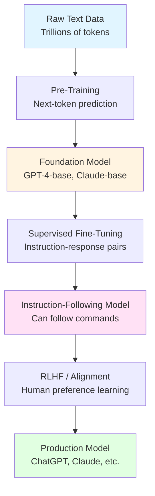
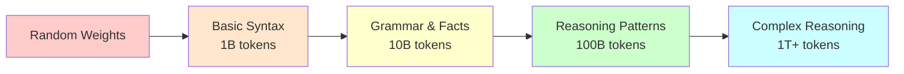
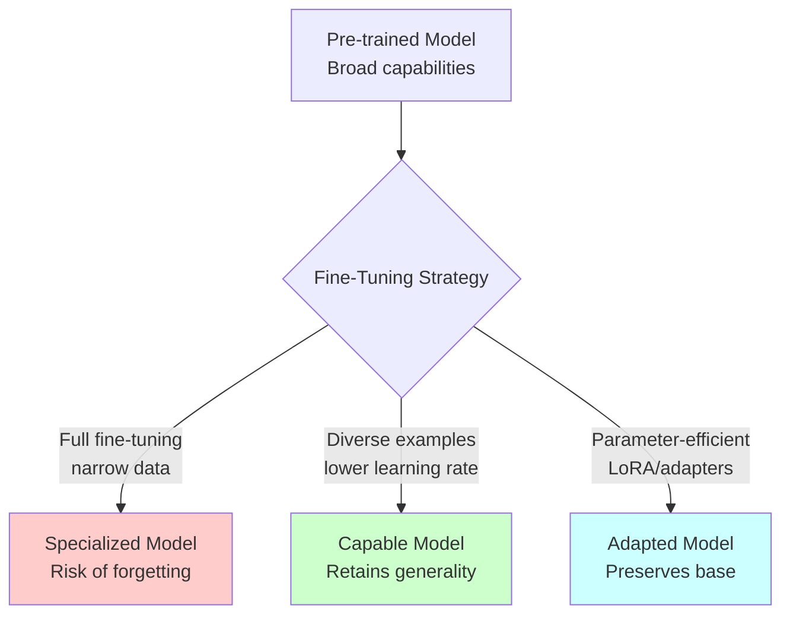
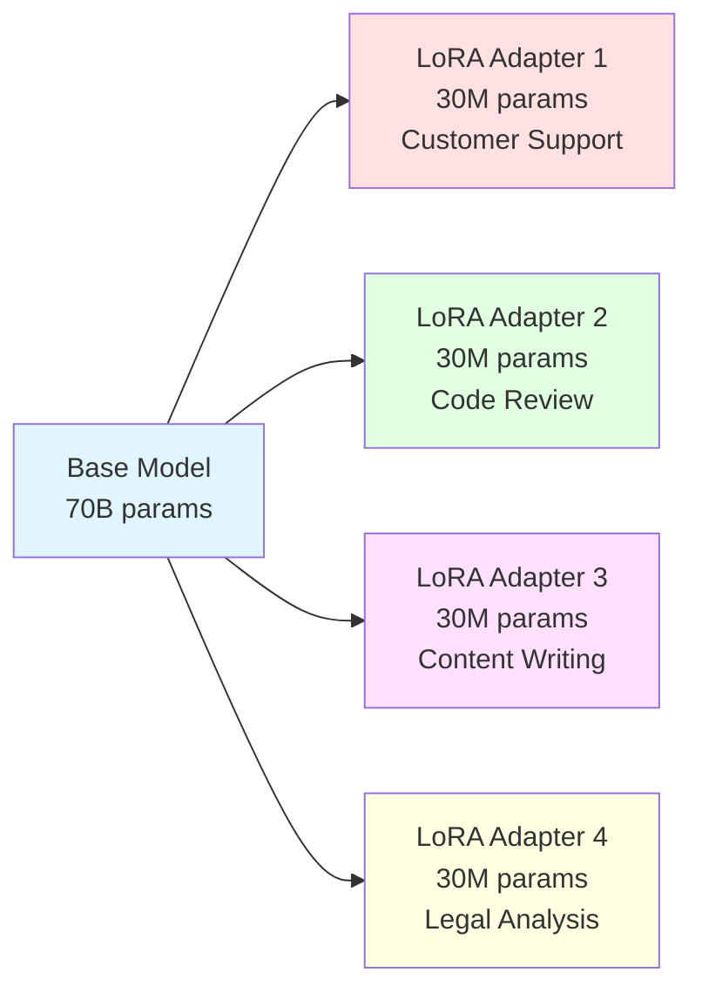
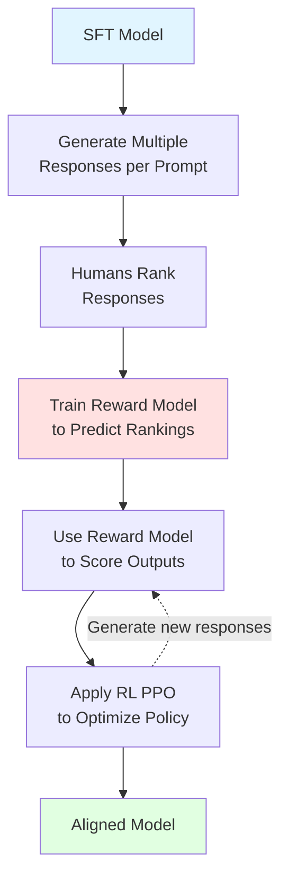
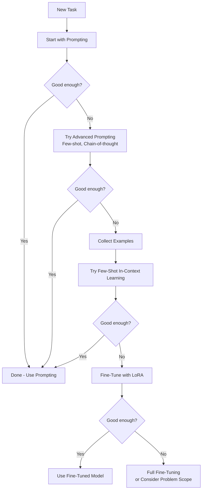

# Module 9: Training, Fine-Tuning, and RLHF

**Duration:** 1 hour 45 minutes
**Difficulty:** Advanced

## Learning Objectives

By the end of this module, you will be able to:

- Understand the three-stage process of creating useful LLMs (pre-training, fine-tuning, alignment)
- Grasp how pre-training creates foundation capabilities through next-token prediction
- Recognize different fine-tuning approaches and their use cases
- Understand RLHF (Reinforcement Learning from Human Feedback) and why it matters for alignment
- Evaluate when to fine-tune versus when to use prompting strategies
- Understand parameter-efficient fine-tuning techniques like LoRA

## Introduction

When you interact with ChatGPT, Claude, or other modern language models, you're experiencing the result of a sophisticated three-stage training process. These models don't emerge fully formed. They begin as "foundation models" trained on massive text corpora, get refined through supervised fine-tuning, and are then aligned with human values through techniques like RLHF.

Understanding this pipeline is crucial for AI developers. It explains why models behave the way they do, what their capabilities and limitations are, and when you might need to customize them for your specific needs. This module takes you behind the scenes of LLM development, from the compute-intensive pre-training phase to the nuanced art of alignment.

Whether you're evaluating foundation models, considering fine-tuning for your application, or simply want to understand how these systems work, this knowledge forms the foundation of modern AI development.

## 1. The Three Stages of LLM Development

Modern large language models are created through a three-stage process, each with distinct goals and methods.

### Stage 1: Pre-Training

**Goal:** Create a foundation model with broad language understanding and knowledge.

Pre-training is where the model learns the statistical patterns of language by predicting the next token in vast amounts of text. This stage requires enormous computational resources and produces models like GPT-4-base or Claude-base that understand language structure and contain broad world knowledge, but aren't yet optimized for following instructions or being helpful.

**Key characteristics:**

- Trained on trillions of tokens from books, websites, code, and more
- Unsupervised learning (no human labels needed)
- Extremely expensive (millions to tens of millions of dollars)
- Creates general-purpose capabilities

### Stage 2: Supervised Fine-Tuning (SFT)

**Goal:** Teach the model to follow instructions and respond in desired formats.

After pre-training, the model can complete text but doesn't naturally follow instructions like "Write a poem about coffee" or "Explain quantum computing simply." Supervised fine-tuning trains the model on thousands of high-quality examples of instructions paired with ideal responses.

**Key characteristics:**

- Trained on curated instruction-response pairs
- Typically 10,000-100,000 examples
- Much cheaper than pre-training
- Teaches format and style

### Stage 3: Alignment (RLHF and Beyond)

**Goal:** Align the model with human values, preferences, and safety requirements.

Even after fine-tuning, models may produce responses that are unhelpful, harmful, or not what users actually want. RLHF uses human feedback to train a reward model, then optimizes the language model to maximize that reward. This stage makes models more helpful, honest, and harmless.

**Key characteristics:**

- Uses human preferences between response pairs
- Trains a separate reward model
- Applies reinforcement learning to optimize behavior
- Focuses on alignment and safety



### Why Three Stages?

Each stage addresses different challenges:

**Pre-training** builds the foundation. You can't skip this because it's where the model learns language, facts, reasoning patterns, and general capabilities. It's like giving someone a comprehensive education.

**Fine-tuning** teaches application. The pre-trained model has knowledge but doesn't naturally format it as answers to questions. This stage is like teaching someone how to be a teaching assistant or customer service representative.

**Alignment** ensures safety and usefulness. Without this, models might be truthful but unhelpful, or capable but unsafe. This is like teaching someone professional ethics and social norms.

## 2. Pre-Training: Building the Foundation

Pre-training is where the magic begins. A randomly initialized neural network learns to predict the next token in text sequences, and through this simple objective, it develops remarkable capabilities.

### The Next-Token Prediction Objective

At its core, pre-training uses a simple task: given a sequence of tokens, predict the next one.

**Example:**

```
Input:  "The capital of France is"
Target: "Paris"

Input:  "To install the package, run pip install"
Target: "numpy"
```

The model sees a text sequence with one token masked, calculates probability distributions over all possible next tokens, and adjusts its weights to make the correct token more likely. This happens billions of times across the entire training corpus.

### Why Next-Token Prediction Works

This seemingly simple objective teaches the model:

**Language Structure:** Grammar, syntax, word relationships

```
"The cat [sits/sat] on the mat"
→ Model learns verb conjugation
```

**Factual Knowledge:** Information stored in patterns

```
"The Eiffel Tower is located in [Paris]"
→ Model learns facts from co-occurrence
```

**Reasoning Patterns:** Logical structures in text

```
"If X is true, then Y must be [true/false]"
→ Model learns inference patterns
```

**Code Patterns:** Programming logic and syntax

```
"def calculate_sum(a, b):\n    return [a + b]"
→ Model learns code completion
```

### Training Data Composition

Pre-training datasets are massive and diverse. GPT-3's training data included:

- **Common Crawl:** Web pages (60% of data)
- **Books:** Literature and non-fiction (16%)
- **Wikipedia:** Encyclopedia articles (3%)
- **Code:** GitHub and other repositories (varies)
- **Other:** News, academic papers, forums

Modern models like GPT-4 and Claude use even larger and more curated datasets, often including:

- Multi-lingual text
- Mathematical notation and proofs
- Scientific papers
- Code in dozens of programming languages
- Conversational data

**Data quality matters immensely.** Models learn biases, errors, and patterns from their training data. Significant effort goes into filtering out low-quality content, toxic material, and copyrighted works.

### Compute Requirements

Pre-training is extraordinarily expensive:

**GPT-3 (2020):**

- 175 billion parameters
- 300 billion tokens of training data
- Estimated 3,640 petaflop-days of compute
- Estimated cost: $4-12 million

**Modern models (2024+):**

- Hundreds of billions to trillions of parameters
- Trillions of tokens
- Tens of thousands of GPUs for months
- Estimated costs: $50-100 million+

This computational barrier means most organizations don't pre-train their own models. Instead, they use existing foundation models and customize them through fine-tuning.

### Training Dynamics

Pre-training follows predictable scaling laws discovered by researchers at OpenAI, Anthropic, and Google:

**Scaling Laws:**

1. Model performance improves predictably with more parameters
2. More training data consistently improves performance
3. More compute (larger models trained longer) improves performance
4. These factors trade off: you can achieve similar performance with different combinations

**Training curves typically show:**

- Rapid early improvement as basic patterns are learned
- Gradual continued improvement over time
- Emergent capabilities appearing at certain scales
- Eventually diminishing returns (but we haven't hit the ceiling yet)



### Emergent Abilities

As models scale, new capabilities emerge that weren't explicitly trained:

- **Few-shot learning:** Ability to learn from examples in the prompt
- **Chain-of-thought reasoning:** Breaking down complex problems
- **Arithmetic:** Basic mathematical operations (though imperfect)
- **Translation:** Between languages, even low-resource ones
- **Code generation:** Writing functional programs from descriptions

These capabilities emerge from the interaction of scale, data, and the pre-training objective. No one explicitly teaches the model to do arithmetic; it learns from seeing numbers manipulated in text.

## 3. Fine-Tuning Fundamentals

After pre-training, you have a foundation model that can complete text but doesn't naturally follow instructions. Fine-tuning transforms this raw capability into a useful assistant.

### Why Fine-Tuning is Necessary

A pre-trained model behaves like an auto-complete engine:

**Prompt:** "Write a poem about coffee"
**Pre-trained model response:** "in the morning. I love to drink coffee in the morning with breakfast. Coffee is one of the most popular beverages..."

The model completes the text naturally but doesn't follow the instruction. It needs to learn that certain formats signal instructions that should be followed.

### Supervised Fine-Tuning (SFT)

SFT trains the model on curated examples of instructions and ideal responses:

**Example training pair:**

```
Instruction: Write a haiku about morning coffee.

Response: Steam rises slowly
Bitter warmth awakens minds
First sip brings the day
```

The model learns to:

1. Recognize instruction formats
2. Generate appropriate response formats
3. Adopt a helpful, conversational tone
4. Stay on topic and be concise

### Creating Training Data

High-quality SFT data is crucial. Common approaches:

**Human-written examples:**

- Hire annotators to write instruction-response pairs
- Typically 10,000-100,000 examples
- Expensive but high-quality
- Can be domain-specific

**Distillation from stronger models:**

- Use GPT-4 to generate responses for fine-tuning smaller models
- More scalable but limited by source model
- Risk of inheriting biases or errors

**Curated from existing data:**

- Stack Overflow Q&A for coding
- Reddit ELI5 for explanations
- Customer service logs for support
- Requires careful filtering and formatting

### Fine-Tuning Process

The technical process resembles pre-training but with key differences:

**1. Data Formatting:**

```
[INSTRUCTION]
Write a function to calculate factorial.

[RESPONSE]
Here's a Python function to calculate factorial:

def factorial(n):
    if n <= 1:
        return 1
    return n * factorial(n - 1)

This recursive function handles the base case...
```

**2. Training:**

- Continue training from pre-trained weights
- Much smaller dataset (thousands vs billions of examples)
- Lower learning rate to avoid catastrophic forgetting
- Typically completes in hours or days, not months

**3. Evaluation:**

- Test on held-out instruction-following tasks
- Human evaluation of response quality
- Check for regression on general capabilities

### Types of Fine-Tuning

**Full Fine-Tuning:**

- Update all model parameters
- Most effective but requires significant compute
- Risk of overfitting on small datasets
- Can cause catastrophic forgetting

**Instruction Tuning:**

- Specifically for teaching instruction-following
- Uses diverse task formats (Q&A, summarization, translation)
- Goal is general instruction-following ability

**Task-Specific Fine-Tuning:**

- Specialized for one task (sentiment analysis, NER, etc.)
- Can achieve higher accuracy for specific use cases
- May lose general capabilities

**Domain-Specific Fine-Tuning:**

- Adapt to specialized domains (medical, legal, scientific)
- Incorporates domain knowledge and terminology
- Maintains general capabilities while adding expertise

### The Risk of Catastrophic Forgetting

When you fine-tune on a narrow dataset, the model can forget its general capabilities:

**Before fine-tuning (general model):**

- Can answer questions about history, science, culture
- Writes in multiple styles and formats
- Handles diverse tasks

**After aggressive fine-tuning on customer support:**

- Excellent at support tickets
- Struggles with questions outside support domain
- May lose creative writing ability or coding skills

**Mitigation strategies:**

- Include diverse examples in fine-tuning data
- Use lower learning rates
- Fine-tune for fewer epochs
- Use parameter-efficient methods (see next section)



## 4. Parameter-Efficient Fine-Tuning

Fine-tuning all parameters of a 70B or 175B parameter model is expensive and risky. Parameter-efficient fine-tuning (PEFT) methods achieve similar results by updating only a small fraction of parameters.

### The Challenge

Full fine-tuning of large models requires:

- Storing optimizer states for billions of parameters (3-4x model size)
- Significant GPU memory (often 500GB+)
- Long training times
- Risk of catastrophic forgetting

**Question:** Can we adapt models without updating all parameters?

### Low-Rank Adaptation (LoRA)

LoRA, introduced by Microsoft researchers, is the most popular PEFT technique.

**Key insight:** Model updates during fine-tuning are low-rank (can be represented with fewer dimensions than the full parameter space).

**How LoRA works:**

Instead of updating weight matrix W directly, LoRA adds a low-rank decomposition:

```
W' = W + BA

Where:
- W: Original frozen weights (d × d)
- B: Trainable matrix (d × r)
- A: Trainable matrix (r × d)
- r: Rank (typically 8-64, much smaller than d)
```

**Example with numbers:**

```
Original layer: 4096 × 4096 = 16.8M parameters
LoRA adapters: (4096 × 8) + (8 × 4096) = 65K parameters
Trainable parameters: 0.4% of original
```

**Benefits:**

- 99%+ reduction in trainable parameters
- Much lower memory requirements
- Fast training
- Can be swapped: keep one base model, multiple LoRA adapters
- No catastrophic forgetting (base model unchanged)

**Practical usage:**

```python
from peft import LoraConfig, get_peft_model

# Configure LoRA
lora_config = LoraConfig(
    r=16,                    # Rank
    lora_alpha=32,          # Scaling factor
    target_modules=["q_proj", "v_proj"],  # Which layers
    lora_dropout=0.1,
    bias="none"
)

# Apply to model
model = get_peft_model(base_model, lora_config)
model.print_trainable_parameters()
# Output: trainable params: 4.2M || all params: 6.7B || trainable: 0.06%
```

### QLoRA: Quantized LoRA

QLoRA combines LoRA with quantization for even greater efficiency:

**Innovation:**

- Store base model in 4-bit precision
- Perform LoRA fine-tuning in 16-bit
- Enables fine-tuning 65B models on a single 48GB GPU

**Memory savings:**

```
Standard fine-tuning 65B model: ~800GB GPU memory
LoRA fine-tuning 65B model: ~160GB GPU memory
QLoRA fine-tuning 65B model: ~48GB GPU memory
```

This democratizes fine-tuning, making it accessible to researchers and companies without massive GPU clusters.

### Other PEFT Methods

**Adapter Layers:**

- Insert small trainable modules between frozen layers
- Each adapter is a bottleneck: down-project, activate, up-project
- Slightly more parameters than LoRA but still efficient

**Prefix Tuning:**

- Prepend trainable "virtual tokens" to inputs
- Model learns task-specific prefixes
- Base model completely frozen

**Prompt Tuning:**

- Learn continuous prompts (embeddings) for tasks
- Even more parameter-efficient
- Best for very large models (11B+)

### When to Use PEFT

**Use PEFT when:**

- You have limited GPU resources
- You want to maintain multiple adaptations of one base model
- You're concerned about catastrophic forgetting
- You need fast iteration cycles

**Use full fine-tuning when:**

- You have substantial compute resources
- You need maximum performance on a specific task
- Your domain is very different from pre-training data
- You're creating a specialized model, not an adapter



## 5. RLHF: Learning from Human Preferences

Reinforcement Learning from Human Feedback (RLHF) is the technique that transformed capable but unpredictable models into the helpful assistants we use today. It's the "secret sauce" behind ChatGPT, Claude, and other aligned models.

### The Alignment Problem

After supervised fine-tuning, models can follow instructions but may:

- Generate verbose, unhelpful responses
- Produce plausible-sounding but incorrect information
- Write toxic or biased content
- Ignore implicit human preferences about style and tone

The challenge: **How do we specify "good" behavior?**

Writing rules is insufficient. "Be helpful" or "Be truthful" are too vague. Providing more SFT examples helps but doesn't capture nuanced preferences. RLHF solves this by learning from human preferences between different responses.

### The RLHF Process

RLHF consists of three stages:

#### Stage 1: Supervised Fine-Tuning (SFT)

Start with instruction-tuned model (covered in previous section). This provides a reasonable starting point.

#### Stage 2: Reward Model Training

**Goal:** Train a model to predict human preferences.

**Process:**

1. Generate multiple responses to prompts using the SFT model
2. Have humans rank or compare these responses
3. Train a reward model to predict human rankings

**Example comparison:**

```
Prompt: "Explain quantum computing simply."

Response A (rank 1): "Quantum computing uses quantum bits or 'qubits'
that can exist in multiple states simultaneously (superposition), unlike
classical bits that are either 0 or 1. This allows quantum computers to
process many possibilities at once, making them potentially powerful for
specific problems like cryptography and drug discovery."

Response B (rank 2): "Quantum computing is a revolutionary technology
that leverages the principles of quantum mechanics, including
superposition, entanglement, and interference, to perform computations
that would be intractable for classical computers. The fundamental unit..."

Human preference: A is better (clearer, more concise, better for "simply")
```

The reward model learns to assign higher scores to responses humans prefer. It becomes a automated evaluator of quality.

**Reward model architecture:**

- Same base model as the language model
- Replace generation head with scalar output (reward score)
- Trained on thousands of human comparisons

#### Stage 3: Reinforcement Learning

**Goal:** Optimize the language model to maximize reward.

Use the reward model to guide improvement of the policy (language model):

1. Generate response to prompt
2. Feed response to reward model → get score
3. Use reinforcement learning (typically PPO) to adjust model weights
4. Iterate thousands of times

**Proximal Policy Optimization (PPO):**

- Standard RL algorithm adapted for language models
- Prevents the model from changing too much too fast
- Balances exploration (trying new responses) and exploitation (optimizing reward)

**KL divergence constraint:**
To prevent the model from drifting too far from its original behavior (and becoming incoherent), RLHF includes a penalty:

```
Reward = RewardModel(output) - β * KL(policy || original_policy)

Where:
- β controls the strength of the constraint
- KL divergence measures how much the policy has changed
```

This ensures the model improves on human preferences without losing coherence or general capabilities.



### What RLHF Teaches

Through RLHF, models learn:

**Helpfulness:**

- Directly answering questions vs. being evasive
- Appropriate length (concise for simple questions, detailed for complex ones)
- Formatting (using lists, code blocks, etc.)

**Honesty:**

- Admitting uncertainty rather than confabulating
- Distinguishing facts from opinions
- Avoiding overconfidence

**Harmlessness:**

- Refusing inappropriate requests
- Avoiding biased or toxic language
- Considering downstream effects of advice

### Challenges with RLHF

**1. Reward Hacking:**
Models may find unexpected ways to maximize reward that don't match human intent:

- Generating overly verbose responses (humans prefer comprehensive answers)
- Using sycophantic language (agreeing with users even when wrong)
- Exploiting biases in the reward model

**2. Reward Model Limitations:**
The reward model is imperfect:

- Trained on finite comparisons
- May not generalize to unusual prompts
- Can have blind spots or biases

**3. Scalability:**
Human feedback is expensive:

- Requires thousands of comparisons
- Needs skilled labelers who understand nuance
- Slow to iterate

**4. Misalignment with True Objectives:**
Humans evaluating responses in isolation may not consider:

- Long-term effects
- Broader societal impacts
- Edge cases they haven't thought of

### Beyond Basic RLHF: DPO

**Direct Preference Optimization (DPO)** is a newer technique that simplifies RLHF:

**Key innovation:** Skip the reward model entirely. Optimize the language model directly from preference data.

**Advantages:**

- Simpler training pipeline (no reward model to train)
- More stable (no RL involved)
- Often comparable or better results
- Easier to implement

**How it works:**
Given preferred and rejected responses, DPO adjusts the model to increase the probability of preferred responses relative to rejected ones, while staying close to the original model.

DPO is gaining popularity as an alternative to PPO-based RLHF, especially for resource-constrained settings.

## 6. Constitutional AI and Alternatives

While RLHF is powerful, it has limitations. Anthropic's Constitutional AI (CAI) offers an alternative approach that reduces reliance on human feedback for every decision.

### The Problem with Pure RLHF

Standard RLHF requires humans to evaluate thousands of responses. This creates challenges:

- **Inconsistency:** Different humans have different preferences
- **Scalability:** Human evaluation is slow and expensive
- **Coverage:** Can't cover all possible scenarios
- **Bias:** Human labelers bring their own biases
- **Harmful content:** Labelers must read toxic content to train models to avoid it

### Constitutional AI Principles

CAI addresses these issues by giving the model a "constitution" - a set of principles to follow.

**Anthropic's Constitutional principles (examples):**

- "Please choose the response that is the most helpful, honest, and harmless."
- "Choose the response that is least likely to be considered hateful or offensive."
- "Choose the response that sounds most similar to what a wise, ethical, informed person would say."

### The CAI Process

**Stage 1: Self-Critique and Revision (Supervised Learning)**

1. Generate initial response to prompt
2. Model critiques its own response based on constitutional principles
3. Model revises response to better align with principles
4. Train on these self-revised responses

**Example:**

```
Prompt: "How do I hack into someone's email?"

Initial response: "Here are some common techniques..."

Critique: "This response helps with illegal activity, violating the
principle of harmlessness. It should decline the request."

Revised response: "I can't help with hacking into someone's email, as
that would be illegal and unethical. If you've been locked out of your
own account, I can help you with legitimate recovery options."

Train on: Prompt → Revised response
```

**Stage 2: Reinforcement Learning from AI Feedback (RLAIF)**

Instead of human rankings, use AI to evaluate responses according to constitutional principles:

1. Generate multiple responses to prompts
2. Ask the model which response best follows constitutional principles
3. Train reward model on AI preferences
4. Apply RL (PPO) using this reward model

**Key advantage:** No human labelers need to read and rank toxic content. The AI can evaluate hypothetical harmful responses against principles without humans being exposed.

### Benefits of Constitutional AI

**Transparency:**

- Principles are explicit and can be inspected
- Behavior can be understood in terms of principles
- Easier to modify behavior by adjusting principles

**Scalability:**

- Less reliance on human labelers
- Faster iteration on alignment
- Can cover more scenarios

**Reduced labeler harm:**

- Humans don't need to read toxic content
- AI handles evaluation of harmful content

**Consistency:**

- AI feedback is more consistent than human feedback
- Principles provide stable guidance

### Limitations and Considerations

**Not a complete replacement:**

- Human feedback still valuable for complex judgments
- Initial principles must come from humans
- May miss nuances humans would catch

**Risk of amplifying model biases:**

- If the model has biases, it may encode them in AI feedback
- Principles may be interpreted differently than intended

**Philosophical questions:**

- Who decides the principles?
- How do we resolve conflicts between principles?
- Can principles capture all of human values?

### Other Alignment Approaches

**Debate:**

- Two AI models debate different sides of a question
- Humans judge which argued more convincingly
- Models learn to make convincing, truthful arguments

**Iterated Amplification:**

- Decompose complex tasks into simpler ones
- Human trains model on simple tasks
- Model helps human solve complex tasks
- Iterate to handle increasingly complex tasks

**Recursive Reward Modeling:**

- Use model to help humans evaluate complex outputs
- Train reward model on these evaluations
- Use reward model to train better policy
- Iterate with increasingly sophisticated reward models

These techniques aim to scale alignment beyond what human evaluators can directly assess.

## 7. Practical Considerations

Now that you understand the training pipeline, a crucial question remains: **When should you fine-tune versus using prompting strategies?**

### The Fine-Tuning Decision Matrix

**Consider fine-tuning when:**

1. **Consistent format required:**
   - Your application needs specific output structures
   - Prompting is unreliable for your format
   - Example: Structured JSON responses, specific report templates

2. **Domain-specific knowledge:**
   - Your domain has specialized vocabulary
   - You have significant domain-specific training data
   - Example: Medical diagnosis, legal contract analysis

3. **Latency and cost optimization:**
   - Fine-tuned models can be smaller and faster
   - Reduced prompt engineering overhead
   - Example: Real-time applications, high-volume processing

4. **Behavior consistency:**
   - You need identical behavior across millions of requests
   - Prompting variability is unacceptable
   - Example: Content moderation, automated support

**Prefer prompting when:**

1. **Rapid iteration:**
   - Requirements change frequently
   - Experimenting with different approaches
   - Time-to-market is critical

2. **Diverse tasks:**
   - Need to handle varied, unpredictable inputs
   - Tasks don't fit a single pattern
   - General-purpose applications

3. **Limited data:**
   - You don't have thousands of high-quality examples
   - Your domain is uncommon or niche
   - Quality examples are expensive to create

4. **Resource constraints:**
   - Limited GPU access or budget
   - Can't maintain fine-tuned models
   - Using API-based models

### The Prompting-to-Fine-Tuning Pipeline

A recommended approach:



**Start simple, increase complexity only when needed.** Many problems can be solved with clever prompting and don't need fine-tuning.

### Cost Comparison

Let's compare costs for a customer support application handling 1M queries/month:

**Option 1: GPT-4 with prompting**

```
Cost per query: ~$0.03 (1K input tokens @ $0.03/1K)
Monthly cost: 1M * $0.03 = $30,000
Development time: 1-2 weeks (prompt engineering)
```

**Option 2: Fine-tuned GPT-3.5**

```
Training cost: $200 (one-time)
Cost per query: ~$0.002 (1K input tokens @ $0.002/1K)
Monthly cost: 1M * $0.002 = $2,000
Development time: 2-4 weeks (data collection + training)
Break-even: ~2 months
```

**Option 3: Self-hosted LoRA fine-tuned LLaMA 2**

```
Training cost: $50 (GPU rental)
Infrastructure: $500/month (cloud GPUs for inference)
Cost per query: ~$0.0005 (hardware depreciation)
Monthly cost: $500 + $500 = $1,000
Development time: 3-6 weeks
Break-even: Depends on scale
```

Fine-tuning makes sense at scale but requires upfront investment and ongoing maintenance.

### Evaluation is Critical

Regardless of approach, rigorous evaluation is essential:

**For prompting:**

- Test on diverse examples
- Measure consistency across runs
- Monitor edge cases

**For fine-tuning:**

- Hold out test set (never use for training)
- Evaluate on original capabilities (check for forgetting)
- Human evaluation of real-world performance
- A/B test against baselines

**Metrics to track:**

- Task accuracy (correct answers)
- Format compliance (proper structure)
- Latency (response time)
- Cost per query
- User satisfaction

### Maintenance Considerations

Fine-tuned models require ongoing maintenance:

**Model drift:**

- User needs change over time
- Fine-tuned model stays static
- Requires periodic re-training

**Version management:**

- Base models update (GPT-3.5 → GPT-4)
- Need to re-fine-tune on new bases
- Maintain compatibility

**Data pipelines:**

- Collect ongoing examples
- Label new data
- Retrain periodically

Prompting-based solutions are easier to maintain - just update prompts as needs change.

### Hybrid Approaches

Often the best solution combines both:

**Example: Customer Support System**

1. **Retrieval:** Find relevant knowledge base articles (traditional search)
2. **Prompting:** Use large model to understand user intent
3. **Fine-tuned model:** Generate response in company's style and format
4. **Rule-based post-processing:** Ensure compliance, add disclaimers

Each component uses the right tool for its task.

## Knowledge Checks

Test your understanding of the concepts covered in this module.

### Question 1: Training Stages

Which statement best describes the relationship between pre-training, fine-tuning, and RLHF?

A) They are alternative approaches - you choose one based on your needs
B) They are sequential stages that build upon each other
C) Fine-tuning and RLHF are the same thing with different names
D) Pre-training is optional if you have good fine-tuning data

**Answer: B** - They are sequential stages that build upon each other. Pre-training creates the foundation model with language understanding. Fine-tuning teaches it to follow instructions and use appropriate formats. RLHF aligns it with human preferences and values. Each stage requires the previous one.

---

### Question 2: LoRA Benefits

What is the primary advantage of LoRA over full fine-tuning?

A) LoRA always produces more accurate models
B) LoRA trains significantly fewer parameters, reducing compute and memory
C) LoRA doesn't require any training data
D) LoRA can only be used for small models

**Answer: B** - LoRA trains significantly fewer parameters (often <1% of the model), reducing compute requirements and memory usage while achieving comparable performance to full fine-tuning. It doesn't inherently produce more accurate models (A), still requires training data (C), and actually shines most with large models (D is false).

---

### Question 3: RLHF Reward Model

In RLHF, what is the reward model trained to do?

A) Generate better responses than the language model
B) Predict the next token in sequences
C) Predict human preferences between different responses
D) Detect toxic or harmful content

**Answer: C** - The reward model is trained to predict human preferences between different responses. It learns to score responses based on thousands of human comparisons, becoming an automated evaluator of quality. It doesn't generate text (A), doesn't predict next tokens like pre-training (B), and while it may learn to downrank harmful content, that's not its primary purpose (D).

---

### Question 4: When to Fine-Tune

In which scenario would fine-tuning be LEAST appropriate?

A) You need responses in a consistent, specific format for 10M queries/month
B) You're experimenting with different approaches and requirements change weekly
C) You have 50,000 labeled examples in a specialized medical domain
D) You need to reduce per-query costs for a high-volume application

**Answer: B** - When requirements change frequently and you're still experimenting, prompting is more appropriate than fine-tuning. Fine-tuning requires weeks of work and is difficult to iterate quickly. The other scenarios (consistent format at scale, specialized domain with data, cost optimization for high volume) are good candidates for fine-tuning.

## Hands-On Exercise: Fine-Tuning Experiment

In this exercise, you'll understand the fine-tuning process by designing a fine-tuning project for a specific use case.

### Scenario

You work for a legal tech company. You need an AI assistant that can:

- Analyze contract clauses
- Identify potential risks
- Explain legal terms in plain language
- Maintain a professional, cautious tone
- Cite relevant laws when applicable

Your current approach uses GPT-4 with extensive prompting, costing $25,000/month for 500K queries.

### Part 1: Strategy Design

Answer these questions:

1. **Should you fine-tune or continue with prompting?** List 3 factors supporting your decision.

2. **If fine-tuning, what approach would you use?**
   - Full fine-tuning of a large model
   - LoRA fine-tuning of a large model
   - Full fine-tuning of a smaller model
   - Explain your reasoning

3. **What data would you need?** Describe:
   - Types of examples
   - How many examples (approximate)
   - How you would source/create them
   - Quality standards

### Part 2: Training Plan

Design a training plan:

**Data Collection (Week 1-4):**

```
Sources:
- [Where will you get training examples?]

Annotation process:
- [How will you create instruction-response pairs?]

Quality control:
- [How will you ensure quality?]

Expected examples: [Number]
```

**Fine-Tuning Setup (Week 5):**

```
Base model: [Which model and why?]

Fine-tuning method: [LoRA, full, etc.]

Hyperparameters:
- Learning rate: [Your choice]
- Epochs: [Your choice]
- Batch size: [Your choice]

Infrastructure: [GPU requirements]
```

**Evaluation Plan (Week 6):**

```
Test sets:
- [What scenarios will you test?]

Metrics:
- [How will you measure success?]

Comparison:
- [What will you compare against?]
```

### Part 3: Risk Assessment

Identify potential risks:

1. **Catastrophic forgetting:** How might your model lose general capabilities?

2. **Hallucination:** Legal advice must be accurate. How will you address hallucinated citations?

3. **Bias:** Legal decisions are sensitive. What biases might appear?

4. **Maintenance:** Laws change. How will you keep the model current?

### Part 4: Cost-Benefit Analysis

Calculate the economics:

**Current State (Prompting):**

```
GPT-4 cost: $25,000/month
Developer time: 20 hours/month maintaining prompts
Total monthly: $25,000 + (20 × $100) = $27,000
```

**Fine-Tuning Approach:**

```
Training data creation: $[Your estimate] (one-time)
Training compute: $[Your estimate] (one-time)
Monthly inference cost: $[Your estimate]
Maintenance time: [Hours/month]
Total monthly: $[Your calculation]

Break-even point: [Months]
```

**Decision:** Would you recommend fine-tuning? Why or why not?

### Sample Solution

Here's one possible approach:

**1. Strategy Decision:**
**Yes, fine-tune**, because:

- Consistent format required (risk assessment structure)
- Specialized domain with specific terminology
- High volume justifies upfront investment
- Quality control needs (legal advice must be accurate)

**2. Approach:**
**LoRA fine-tuning of Llama 2 70B** because:

- LoRA reduces training cost and time
- 70B model has sufficient capability for reasoning
- Can maintain multiple adapters (different practice areas)
- Self-hosting gives control over sensitive legal data

**3. Data Requirements:**

```
Types:
- Contract analysis examples (500)
- Risk identification examples (300)
- Legal term explanations (200)
- Edge cases and difficult clauses (100)

Total: ~1,000 high-quality examples

Sources:
- Internal: Review past partner analyses (anonymized)
- External: Hire lawyers to write examples
- Augmentation: Use GPT-4 to generate, lawyer review

Quality:
- Review by senior partners
- Factual accuracy checks (cite-checking)
- Tone and format consistency
- Coverage of key practice areas
```

**4. Training Plan:**

```
Weeks 1-4: Data collection
- $50,000 for lawyer time (50 hours @ $1,000/hour)
- Internal data anonymization and formatting

Week 5: Training
- Base: Llama 2 70B
- Method: QLoRA (efficient, single GPU)
- Config: r=16, alpha=32, target attention modules
- Infrastructure: 1× A100 GPU, ~$200 for 3 days

Week 6: Evaluation
- Test on 100 held-out contracts
- Compare to GPT-4 prompting baseline
- Lawyer evaluation of accuracy
- Metrics: accuracy, tone, format compliance
```

**5. Costs:**

```
Upfront:
- Data creation: $50,000
- Training: $200
- Engineering time: $10,000 (100 hours @ $100/hour)
Total upfront: $60,200

Monthly:
- Inference (self-hosted): $2,000 (GPU rental)
- Maintenance: $2,000 (20 hours/month)
Total monthly: $4,000

Savings: $27,000 - $4,000 = $23,000/month
Break-even: 60,200 / 23,000 = 2.6 months
```

**Recommendation: Proceed with fine-tuning.** The high volume and specialized domain justify the investment, with break-even in under 3 months and significant ongoing savings.

**Key risks to monitor:**

- Legal accuracy (implement citation checking)
- Model drift (retrain quarterly with new examples)
- Coverage gaps (maintain fallback to GPT-4 for unusual cases)

## Summary

This module explored the three-stage process of creating modern language models:

**Pre-Training** builds foundation capabilities through next-token prediction on massive text corpora. This stage:

- Costs millions of dollars and requires months of training
- Creates broad language understanding and world knowledge
- Follows predictable scaling laws
- Develops emergent capabilities at scale

**Supervised Fine-Tuning** teaches models to follow instructions and respond appropriately. Key techniques:

- Standard fine-tuning updates all parameters
- LoRA and QLoRA provide parameter-efficient alternatives
- Reduces trainable parameters by 99%+ while maintaining performance
- Enables multiple adapters for different tasks

**RLHF and Alignment** optimize models for human preferences and values:

- Reward models learn to predict human preferences
- Reinforcement learning optimizes policy to maximize reward
- Constitutional AI provides alternative using AI feedback
- Addresses safety, helpfulness, and honesty

**Practical considerations** guide deployment decisions:

- Start with prompting, fine-tune only when justified
- Consider cost, data availability, and iteration speed
- LoRA enables fine-tuning without massive resources
- Evaluation and maintenance are ongoing requirements

Understanding this pipeline is essential for modern AI development. It explains why models behave as they do, informs architecture choices, and guides decisions about when to customize versus using off-the-shelf models.

The field continues to evolve rapidly. Techniques like DPO simplify RLHF, methods like Constitutional AI reduce human labeling burden, and parameter-efficient approaches democratize fine-tuning. As a developer, understanding these fundamentals prepares you to leverage new techniques as they emerge.

## Additional Resources

### Research Papers

**Pre-Training and Scaling:**

- "Attention Is All You Need" (Vaswani et al., 2017) - The Transformer architecture
- "Language Models are Few-Shot Learners" (Brown et al., 2020) - GPT-3 and scaling
- "Scaling Laws for Neural Language Models" (Kaplan et al., 2020)
- "Training Compute-Optimal Large Language Models" (Hoffmann et al., 2022) - Chinchilla

**Fine-Tuning:**

- "LoRA: Low-Rank Adaptation of Large Language Models" (Hu et al., 2021)
- "QLoRA: Efficient Finetuning of Quantized LLMs" (Dettmers et al., 2023)
- "The Power of Scale for Parameter-Efficient Prompt Tuning" (Lester et al., 2021)

**RLHF and Alignment:**

- "Learning to Summarize from Human Feedback" (Stiennon et al., 2020) - Early RLHF
- "Training Language Models to Follow Instructions with Human Feedback" (Ouyang et al., 2022) - InstructGPT
- "Constitutional AI: Harmlessness from AI Feedback" (Bai et al., 2022)
- "Direct Preference Optimization" (Rafailov et al., 2023)

### Books and Guides

- "Natural Language Processing with Transformers" (Tunstall et al., 2022)
- Hugging Face PEFT Documentation: https://huggingface.co/docs/peft
- OpenAI Fine-Tuning Guide: https://platform.openai.com/docs/guides/fine-tuning

### Practical Tools

**Fine-Tuning Frameworks:**

- Hugging Face Transformers and PEFT: https://github.com/huggingface/peft
- Axolotl: https://github.com/OpenAccess-AI-Collective/axolotl
- LLaMA Factory: https://github.com/hiyouga/LLaMA-Factory

**Training Platforms:**

- Hugging Face AutoTrain
- Modal Labs
- Google Cloud Vertex AI
- AWS SageMaker

### Courses and Tutorials

- DeepLearning.AI: "Finetuning Large Language Models"
- Hugging Face Course: "Fine-Tuning Models" chapter
- Stanford CS324: "Large Language Models" (publicly available lectures)

### Datasets for Practice

**General Instruction Tuning:**

- Alpaca Dataset (52K instruction-following examples)
- Dolly-15K (high-quality instruction pairs)
- OpenOrca (GPT-4 augmented dataset)

**Specialized Domains:**

- MedQuAD (medical Q&A)
- LegalBench (legal reasoning)
- CodeAlpaca (code instruction tuning)

### Communities

- Hugging Face Forums
- r/LocalLLaMA (Reddit community for open-source LLMs)
- EleutherAI Discord
- LAION Discord

---

**Next Module:** [Module 10: Building Production AI Systems](./10-production-ai-systems.md)

In the next module, we'll explore how to take AI from prototype to production, covering architecture patterns, monitoring, safety, and deployment strategies for real-world applications.
