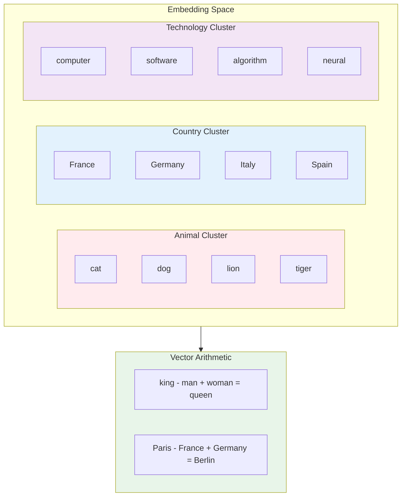
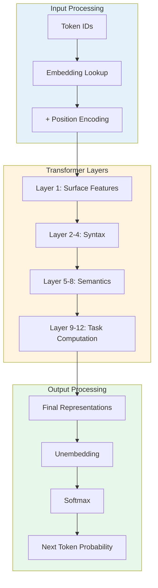
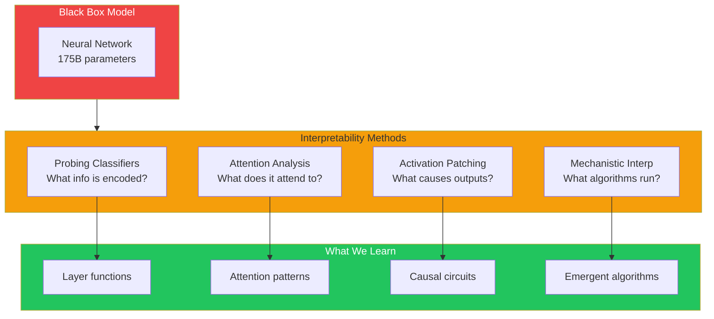

# Module 10: Tokens, Embeddings, and Model Internals

**Part 2: AI/ML Deep Dive** | **Duration**: 1 hour 30 minutes | **Difficulty**: Intermediate

---

## Learning Objectives

By the end of this module, you will be able to:

- Understand how text becomes numbers that models can process
- Master tokenization schemes and their trade-offs
- Grasp embedding spaces and semantic relationships
- Peek inside model weights and representations
- Recognize how interpretability research reveals model behavior

---

## Section 1: From Text to Numbers (10 minutes)

### The Fundamental Problem

Computers operate on numbers. Language models are neural networks that perform matrix operations, compute gradients, and adjust floating-point weights. Yet we interact with them using words. Something must bridge this gap.

This is the representation problem: how do we convert human language into a form that mathematical operations can manipulate?

The answer involves two steps:

1. **Tokenization**: Breaking text into discrete pieces (tokens)
2. **Embedding**: Mapping those pieces to dense numerical vectors

Every word you type into ChatGPT or Claude goes through this transformation before the model can process it. Understanding this process reveals why models behave the way they do.

### Historical Approaches

The history of text representation reflects the evolution of AI itself.

**One-Hot Encoding**: The simplest approach. Each word gets a unique position in a vocabulary-sized vector. "Cat" might be [1,0,0,...], "dog" [0,1,0,...], and so on.

Problems:

- Vectors are enormous (vocabulary sizes of 100,000+)
- No semantic relationships: "cat" is equally different from "dog" as from "spaceship"
- No way to handle unknown words

**Word-Level Tokenization**: Split text on whitespace and punctuation. Each word is a token.

Problems:

- Vocabulary explodes with morphology: "run", "runs", "running", "runner" are separate tokens
- Out-of-vocabulary (OOV) words can't be represented
- Rare words have poor representations due to limited training examples

**Character-Level Tokenization**: Each character is a token. Vocabulary is tiny (26 letters + punctuation + numbers).

Problems:

- Sequences become very long (a 500-word document becomes ~2,500 characters)
- Long-range dependencies are harder to learn
- Computational cost scales with sequence length

Each approach trades vocabulary size against sequence length. Modern tokenization finds a middle ground.

### Why Tokenization Matters for Developers

Understanding tokenization isn't just academic. It has practical implications:

**Token limits**: GPT-4's context window is measured in tokens, not words. A 128K token limit might be 90K-100K words depending on content.

**API costs**: OpenAI, Anthropic, and other providers charge per token. Code (with short tokens like `{`, `}`, `=`) uses more tokens per line than prose.

**Model behavior**: Tokenization affects what the model "sees". If "tokenization" is split into ["token", "ization"], the model processes it differently than if it's one token.

**Multilingual performance**: English-centric tokenizers represent Chinese characters or Arabic text with more tokens than equivalent English, affecting both cost and context utilization.

---

## Section 2: Modern Tokenization (20 minutes)

### Subword Tokenization

Modern language models use subword tokenization, which splits text into pieces smaller than words but larger than characters. This achieves a balance:

- Common words stay intact: "the", "and", "hello"
- Rare words split into recognizable pieces: "tokenization" becomes ["token", "ization"]
- Novel words can still be represented through composition

The key insight: you can represent any text with a fixed, manageable vocabulary by allowing words to be decomposed into subparts.

### Byte Pair Encoding (BPE)

Byte Pair Encoding, introduced by Sennrich et al. (2016), is the most widely used subword algorithm. GPT models use BPE.

**The Algorithm**:

1. Start with a character-level vocabulary
2. Count all adjacent pair frequencies in the training corpus
3. Merge the most frequent pair into a new token
4. Repeat until vocabulary reaches target size

**Example Training**:

```
Training corpus: "low lower lowest"

Initial tokens: [l, o, w, _, l, o, w, e, r, _, l, o, w, e, s, t]

Round 1: Most frequent pair is (l, o), merge to "lo"
Tokens: [lo, w, _, lo, w, e, r, _, lo, w, e, s, t]

Round 2: Most frequent pair is (lo, w), merge to "low"
Tokens: [low, _, low, e, r, _, low, e, s, t]

Round 3: Most frequent pair is (e, r), merge to "er"
Tokens: [low, _, low, er, _, low, e, s, t]

Round 4: Most frequent pair is (e, s), merge to "es"
Tokens: [low, _, low, er, _, low, es, t]

Continue until vocabulary size reached...
```

After training, the tokenizer has a vocabulary of subword units and rules for applying them.

**Tokenization at Inference**:

For new text, BPE greedily applies learned merges:

```
Input: "lowest"

1. Start with characters: [l, o, w, e, s, t]
2. Apply learned merges in order:
   - (l, o) -> [lo, w, e, s, t]
   - (lo, w) -> [low, e, s, t]
   - (e, s) -> [low, es, t]
3. Result: ["low", "es", "t"]
```

### WordPiece

WordPiece, used by BERT, is similar to BPE but uses a different merge criterion. Instead of raw frequency, it maximizes the likelihood of the training data.

**Key difference**: BPE merges the most common pair; WordPiece merges the pair that most increases corpus probability.

WordPiece also uses a special prefix for continuation tokens:

```
Input: "tokenization"
Output: ["token", "##ization"]

The ## indicates this token continues the previous word.
```

This helps the model understand word boundaries even with subword splitting.

### SentencePiece

SentencePiece (Kudo & Richardson, 2018) treats the input as a raw byte stream, handling whitespace as a regular character (represented as `_`). It doesn't require pre-tokenization.

**Key advantages**:

- Language-agnostic: doesn't assume whitespace-separated words
- Reversible: can perfectly reconstruct original text
- Works well for Chinese, Japanese, and other languages without spaces

```
Input: "Hello world"
Output: ["_Hello", "_world"]

(underscore represents the space before a word)
```

SentencePiece can use either BPE or a unigram language model for subword selection. LLaMA and many multilingual models use SentencePiece.

### Tokenizer Training in Practice

When organizations train tokenizers, they make deliberate choices:

**Vocabulary size**: Typically 30,000-100,000 tokens

- Larger vocabularies: shorter sequences, but more parameters in embedding matrix
- Smaller vocabularies: longer sequences, but more compositional

**Training data**: The corpus used to train the tokenizer shapes what gets good representation

- Code-heavy corpus: programming tokens stay intact
- Multilingual corpus: better coverage of non-English

**Special tokens**: Models add tokens for specific purposes

- `[PAD]`: Padding for batch processing
- `[UNK]`: Unknown tokens (less common with BPE)
- `[CLS]`: Classification token (BERT)
- `[SEP]`: Separator between segments
- `<|endoftext|>`: End of document marker (GPT)
- `[INST]`, `[/INST]`: Instruction markers (LLaMA/Mistral)

### Tokenization Quirks and Gotchas

Understanding tokenization explains many model behaviors:

**Arithmetic struggles**: "123456" might tokenize as ["123", "456"], making digit-level operations hard. The model sees two tokens, not six digits.

```python
# Example: How GPT-2 tokenizes numbers
from transformers import GPT2Tokenizer
tokenizer = GPT2Tokenizer.from_pretrained("gpt2")

print(tokenizer.tokenize("12345"))    # ['123', '45']
print(tokenizer.tokenize("123456"))   # ['123', '456']
```

**Spacing sensitivity**: "Hello world" and "Hello world" (two spaces) produce different token sequences.

**Capitalization effects**: "THE" and "the" are different tokens, using different embedding space positions.

**Programming quirks**: Variable names affect token count. `calculateTotalPrice` might be 3+ tokens while `calc_tot` might be 2.

**Non-English penalties**: Chinese text often uses 2-3x more tokens than equivalent English text, effectively reducing context window size and increasing costs.

### Comparing Tokenizers

Let's see how different tokenizers handle the same text:

```python
from transformers import AutoTokenizer

text = "The transformer architecture revolutionized NLP."

# GPT-2 (BPE)
gpt2 = AutoTokenizer.from_pretrained("gpt2")
print(f"GPT-2: {gpt2.tokenize(text)}")
# ['The', ' transform', 'er', ' architecture', ' revolution', 'ized', ' NL', 'P', '.']

# BERT (WordPiece)
bert = AutoTokenizer.from_pretrained("bert-base-uncased")
print(f"BERT: {bert.tokenize(text)}")
# ['the', 'transform', '##er', 'architecture', 'revolution', '##ized', 'nl', '##p', '.']

# LLaMA (SentencePiece)
llama = AutoTokenizer.from_pretrained("meta-llama/Llama-2-7b-hf")
print(f"LLaMA: {llama.tokenize(text)}")
# ['The', 'transform', 'er', 'architecture', 'revolution', 'ized', 'NL', 'P', '.']
```

Same text, different token boundaries. This affects model behavior in subtle but real ways.

---

## Section 3: The Embedding Revolution (20 minutes)

### What Are Embeddings?

After tokenization, each token becomes an integer ID. But neural networks work better with dense, continuous representations. Embeddings map discrete token IDs to dense vectors.

An embedding is a learned lookup table:

```
Token "cat" -> ID 5847 -> Vector [0.23, -0.91, 0.15, ..., 0.44] (e.g., 768 dimensions)
Token "dog" -> ID 3029 -> Vector [0.28, -0.84, 0.22, ..., 0.51]
```

The key insight: these vectors are not arbitrary. Through training, semantically similar tokens end up with similar vectors.

### The Word2Vec Revolution

Before transformers, Word2Vec (Mikolov et al., 2013) demonstrated that word embeddings could capture semantic relationships.

**Training approach**: Predict a word from its context (CBOW) or context from a word (Skip-gram).

The famous discovery: word arithmetic works.

```
vector("king") - vector("man") + vector("woman") ≈ vector("queen")

vector("Paris") - vector("France") + vector("Germany") ≈ vector("Berlin")
```

This showed that the embedding space wasn't random. Directions in the space corresponded to semantic relationships:

- Male/female direction
- Capital city direction
- Verb tense direction
- Comparative/superlative direction

### Understanding Embedding Spaces

Think of embeddings as coordinates in a high-dimensional space where distance corresponds to meaning.

**Cosine similarity**: The standard metric for comparing embeddings.

```python
import numpy as np

def cosine_similarity(a, b):
    return np.dot(a, b) / (np.linalg.norm(a) * np.linalg.norm(b))

# After training, semantically similar words cluster:
similarity("cat", "dog")  # ~0.85 (high)
similarity("cat", "car")  # ~0.30 (low)
similarity("cat", "feline")  # ~0.90 (very high)
```

**Clustering**: Similar concepts cluster together in embedding space:

- Animals in one region
- Countries in another
- Programming terms in another

**Analogy structure**: Relationships form consistent directional patterns.

### Static vs. Contextual Embeddings

Word2Vec and similar methods produce static embeddings: one vector per word, regardless of context.

Problem: "bank" (financial) and "bank" (river) have the same embedding, despite different meanings.

**Contextual embeddings** (ELMo, BERT, GPT) solve this. The same word gets different vectors depending on context:

```
"I deposited money at the bank"
   "bank" -> [0.23, -0.91, ...] (financial meaning)

"I sat by the river bank"
   "bank" -> [-0.15, 0.42, ...] (river meaning)
```

This is a key innovation of transformer models: every token's representation is conditioned on its entire context through attention.

### How Transformer Embeddings Work

In transformers, embeddings have multiple stages:

**1. Token Embedding**: Initial lookup from the embedding matrix

```python
embedding_matrix = nn.Embedding(vocab_size, d_model)
# vocab_size: 50,000 tokens
# d_model: 768 dimensions
# Total: 38.4M parameters just for embeddings
```

**2. Positional Encoding**: Added to token embeddings (see Module 8)

**3. Layer Processing**: Each transformer layer refines embeddings

- Layer 0: Surface-level features
- Middle layers: Syntactic patterns
- Final layers: Semantic understanding

**4. Output Representations**: Final layer embeddings are highly contextualized

The model doesn't just look up a vector. It transforms and refines it through every layer based on the full context.

### The Embedding Matrix

The embedding matrix is one of the largest components of language models:

```
GPT-3: 50,257 tokens × 12,288 dimensions = 617M parameters (just embeddings)
LLaMA 2: 32,000 tokens × 4,096 dimensions = 131M parameters
```

At the output, the same matrix (or its transpose) is often used to project back to vocabulary probabilities:

```
hidden_state (d_model) × embedding_matrix.T (d_model × vocab_size) = logits (vocab_size)
```

This weight tying improves efficiency and creates interesting properties: input and output spaces are aligned.

### Using Embeddings in Practice

Embeddings power many practical applications:

**Semantic search**: Embed documents and queries, find nearest neighbors

```python
query_embedding = model.encode("machine learning tutorial")
results = vector_db.search(query_embedding, top_k=10)
```

**Clustering**: Group similar documents without labeled data

```python
embeddings = model.encode(documents)
clusters = KMeans(n_clusters=10).fit(embeddings)
```

**Classification**: Fine-tune on embeddings for downstream tasks

```python
# Use final layer embedding of [CLS] token for classification
class_probabilities = classifier(bert_output[:, 0, :])  # [CLS] position
```

**Recommendation**: Find items similar to user preferences

```python
user_embedding = combine(item_embeddings_user_liked)
recommendations = find_nearest(user_embedding, all_item_embeddings)
```

### Embedding APIs

Major providers offer embedding-specific APIs:

**OpenAI Embeddings**:

```python
from openai import OpenAI
client = OpenAI()

response = client.embeddings.create(
    model="text-embedding-3-small",  # 1536 dimensions
    input="Your text here"
)
embedding = response.data[0].embedding
```

**Sentence Transformers** (open source):

```python
from sentence_transformers import SentenceTransformer
model = SentenceTransformer('all-MiniLM-L6-v2')

embeddings = model.encode([
    "This is the first sentence",
    "This is the second sentence"
])
```

These models are optimized for semantic similarity, distinct from generative language models.

---

## Section 4: Inside the Model (20 minutes)

### Model Architecture Overview

Transformer language models stack repeated blocks. Let's understand what each component does:

**Input processing**:

1. Tokenizer converts text to token IDs
2. Embedding layer maps IDs to vectors
3. Positional encoding adds position information

**Transformer blocks** (repeated N times):

1. Multi-head self-attention
2. Residual connection + layer norm
3. Feed-forward network (MLP)
4. Residual connection + layer norm

**Output processing**:

1. Final layer representations
2. Linear projection to vocabulary size
3. Softmax for probability distribution

### What Happens in Each Layer

Research has revealed that different layers serve different purposes:

**Early layers (0-3)**:

- Detect surface patterns (capitalization, punctuation)
- Learn basic positional relationships
- Build local context (adjacent word relationships)

**Middle layers (4-8)**:

- Syntactic structure (subject-verb-object)
- Part-of-speech patterns
- Phrase boundaries

**Late layers (9-12+)**:

- Semantic meaning
- Long-range dependencies
- Task-specific computation
- Factual knowledge retrieval

This has been validated through probing experiments: train simple classifiers on layer outputs to predict linguistic properties.

### The Feed-Forward Networks as Memory

Feed-forward networks in transformers are surprisingly important. Research suggests they act as key-value memories storing factual knowledge.

Each FFN has structure:

```python
def feed_forward(x):
    hidden = relu(x @ W1)  # Project up to larger dimension
    output = hidden @ W2   # Project back down
    return output
```

**The memory hypothesis**: W1 maps to "keys" (patterns to recognize) and W2 maps to "values" (information to output).

When the model answers "The Eiffel Tower is in [Paris]":

1. Middle layer attention identifies "Eiffel Tower" in context
2. FFN recognizes this pattern (activates certain neurons)
3. FFN outputs information about Paris toward the final token

This explains why knowledge can be edited by modifying specific weight matrices.

### Attention Patterns

Different attention heads learn different functions:

**Positional heads**: Attend to fixed positions (next word, previous word)

**Syntactic heads**: Follow grammatical structure (subject to verb, noun to modifier)

**Rare word heads**: Copy rare tokens to output positions

**Induction heads**: Pattern-match sequences (if A follows B earlier, and B appears now, predict A)

The last type, induction heads, is particularly interesting. They implement in-context learning by finding and copying patterns from earlier in the context.

### Residual Stream View

An elegant way to understand transformers: the residual stream.

Each position has a "residual stream" that accumulates information:

```
Initial: x = embed(token) + position

After attention: x = x + attention_output
After FFN: x = x + ffn_output
After attention: x = x + attention_output
After FFN: x = x + ffn_output
...
Final: output = project_to_vocab(x)
```

The residual stream is a "working memory" that each layer reads from and writes to. Attention moves information between positions; FFN processes information at each position.

This view explains several phenomena:

- Skip connections preserve information
- Layers can be added without destroying earlier computation
- Information from early layers persists to late layers

### Weight Matrices and Their Roles

Understanding weight matrices demystifies model behavior:

**Embedding matrix** (W_E): Maps token IDs to vectors

- Shape: (vocab_size, d_model)
- Contains the learned "meaning" of each token

**Unembedding matrix** (W_U): Maps vectors back to vocabulary

- Often W_E transposed (weight tying)
- Final projection before softmax

**QKV projection matrices** (W_Q, W_K, W_V):

- Transform embeddings into queries, keys, values
- Each attention head has its own set
- Shape per head: (d_model, d_head)

**Output projection** (W_O):

- Combines attention head outputs
- Shape: (n_heads \* d_head, d_model)

**FFN matrices** (W_1, W_2):

- W_1 projects up: (d_model, d_ffn) where d_ffn ≈ 4 \* d_model
- W_2 projects down: (d_ffn, d_model)

### Model Scale and Parameters

Here's where parameters live in GPT-3 (175B):

```
Embeddings:        50,257 × 12,288 = 617M      (0.4%)
Attention (per layer):
  - QKV:          3 × 12,288 × 12,288 = 452M
  - Output:       12,288 × 12,288 = 151M
  Subtotal:       603M × 96 layers = 58B       (33%)
FFN (per layer):
  - W1:           12,288 × 49,152 = 604M
  - W2:           49,152 × 12,288 = 604M
  Subtotal:       1.2B × 96 layers = 116B      (66%)

Total: ~175B parameters
```

The FFN layers dominate. This supports the "FFN as memory" hypothesis: most model capacity stores knowledge in feed-forward weights.

---

## Section 5: Interpretability Basics (15 minutes)

### Why Interpretability Matters

Language models are black boxes. They produce impressive outputs, but we don't know why. This creates problems:

**Safety**: How can we trust a system we don't understand?
**Debugging**: When it fails, how do we fix it?
**Alignment**: Is the model doing what we think it's doing?
**Science**: What has the model actually learned?

Interpretability research aims to open the black box. While we can't fully understand 175B parameters, we can make progress.

### Probing Classifiers

**Technique**: Train simple classifiers on model representations to detect what information they contain.

**Example**: Does layer 6 encode part-of-speech information?

```python
# 1. Run model, extract layer 6 outputs
representations = model(texts, output_hidden_states=True).hidden_states[6]

# 2. Train a logistic regression to predict POS tags
probe = LogisticRegression()
probe.fit(representations, pos_tags)

# 3. High accuracy → layer 6 encodes POS information
print(f"Layer 6 POS accuracy: {probe.score(test_reps, test_tags)}")
```

Results consistently show:

- Early layers encode surface features
- Middle layers encode syntax
- Late layers encode semantics

Probing reveals the "information geography" of the model.

### Attention Visualization

Attention weights tell us what positions the model focuses on:

```python
from bertviz import head_view

# Visualize attention patterns
outputs = model(inputs, output_attentions=True)
attention = outputs.attentions  # [layers, heads, seq, seq]

# Plot: which tokens attend to which
head_view(attention, tokens)
```

**What we learn**:

- Some heads attend to previous token (positional)
- Some heads track syntactic dependencies (subject to verb)
- Some heads focus on specific tokens (periods, names)

**Limitations**: Attention shows where the model looks, not what it does with that information. High attention doesn't mean the attended position influenced the output.

### Activation Patching

**Technique**: Replace activations during inference to test causal effects.

**Example**: Test if position X is necessary for output Y.

```python
# Normal run
normal_output = model(input)

# Patched run: replace X's activation with a different activation
def patch_activation(module, input, output):
    output[position_X] = different_activation
    return output

model.layer[5].register_forward_hook(patch_activation)
patched_output = model(input)

# If output changes, position X was causally important
```

This technique helps identify which computations actually matter for specific predictions.

### Mechanistic Interpretability

Mechanistic interpretability aims to reverse-engineer models into understandable algorithms.

**Key discoveries**:

**Induction heads**: Two-layer circuit that implements pattern matching.

- First head copies previous occurrences
- Second head uses that to predict what comes next
- Enables in-context learning

**Indirect object identification**: Circuit that tracks who did what to whom.

- Attention heads identify subject and object
- FFN layers route information appropriately

**Modular arithmetic**: Models trained on simple tasks (like modular addition) develop interpretable Fourier-based algorithms.

This research is difficult because models have millions of interacting components. But early results suggest models implement interpretable algorithms, not just memorization.

### Limitations of Current Interpretability

We're still far from fully understanding large models:

**Scale**: Techniques that work on small models may not scale to 175B parameters.

**Polysemanticity**: Single neurons often respond to multiple unrelated concepts ("superposition").

**Distributed computation**: Information is spread across many components, not localized.

**Causal complexity**: Interactions between components are highly non-linear.

Current interpretability gives us useful tools but not complete understanding. The field is advancing rapidly.

---

## Section 6: Practical Implications (5 minutes)

### Token Limits and Context Windows

Understanding tokens helps you work within context limits:

**Estimation**: 1 token ≈ 4 characters in English, or roughly 0.75 words.

- 4K tokens ≈ 3K words ≈ 6 pages
- 128K tokens ≈ 96K words ≈ a short book

**Optimization strategies**:

- Summarize long documents before including in context
- Use retrieval to select relevant passages
- Be concise in system prompts

**Code is expensive**: Programming tokens are short, so code uses more tokens per line than prose.

```python
# This function definition might be 20+ tokens:
def calculate_total_price(items, tax_rate):
    return sum(item.price for item in items) * (1 + tax_rate)
```

### Embedding-Based Applications

Embeddings enable practical applications:

**Semantic search**:

```python
# Index documents by embedding
for doc in documents:
    embedding = embed(doc.text)
    vector_db.insert(doc.id, embedding)

# Search by meaning, not keywords
query_embedding = embed("machine learning for beginners")
results = vector_db.search(query_embedding, top_k=10)
```

**RAG (Retrieval-Augmented Generation)**:

```python
# 1. Embed user query
query_embedding = embed(user_query)

# 2. Find relevant documents
relevant_docs = vector_db.search(query_embedding, top_k=5)

# 3. Include in context
context = "\n".join(doc.text for doc in relevant_docs)
response = llm.generate(f"Context: {context}\n\nQuestion: {user_query}")
```

**Clustering and classification**:

```python
# Cluster support tickets by topic
embeddings = embed(tickets)
clusters = KMeans(n_clusters=10).fit(embeddings)

# Find tickets similar to a new issue
similar_tickets = find_nearest(embed(new_ticket), embeddings)
```

### Cost Optimization

Token-based pricing means tokenization affects costs:

**Measure token counts**:

```python
import tiktoken
encoding = tiktoken.encoding_for_model("gpt-4")
tokens = encoding.encode(text)
print(f"Token count: {len(tokens)}")
```

**Optimization tactics**:

- Shorter system prompts (they repeat every request)
- Compressed output formats (JSON vs. verbose explanation)
- Strategic truncation of long inputs
- Batching similar requests

**Cost comparison** (approximate):

```
GPT-4-turbo: $10 / 1M input tokens, $30 / 1M output tokens
Claude 3 Opus: $15 / 1M input, $75 / 1M output
Claude 3 Haiku: $0.25 / 1M input, $1.25 / 1M output
```

At scale, tokenization efficiency matters significantly.

### Debugging with Tokenization Awareness

When models behave unexpectedly, check tokenization:

**Problem**: Model struggles with specific words
**Solution**: Check how they tokenize

```python
tokenizer.tokenize("supercalifragilisticexpialidocious")
# Many tokens → harder for model to handle
```

**Problem**: Inconsistent handling of similar inputs
**Solution**: Check token boundaries

```python
tokenizer.tokenize("email")      # ['email']
tokenizer.tokenize("e-mail")     # ['e', '-', 'mail']
# Different representations → different behavior
```

**Problem**: Poor non-English performance
**Solution**: Check token efficiency

```python
len(tokenizer.encode("Hello world"))  # 2 tokens
len(tokenizer.encode("Hola mundo"))   # 3 tokens
len(tokenizer.encode("Hallo Welt"))   # 3 tokens
len(tokenizer.encode("nihao shijie")) # 4+ tokens
```

---

## Diagrams

### Tokenization Process

```mermaid
graph LR
    subgraph Input[Input Text]
        T["The transformer revolutionized NLP."]
    end

    subgraph Tokenization[Tokenization]
        B[BPE Algorithm]
        V[Vocabulary Lookup]
    end

    subgraph Tokens[Token Sequence]
        T1["The"]
        T2["transform"]
        T3["er"]
        T4["revolution"]
        T5["ized"]
        T6["NLP"]
        T7["."]
    end

    subgraph IDs[Token IDs]
        I1[464]
        I2[5128]
        I3[263]
        I4[14857]
        I5[1143]
        I6[32812]
        I7[13]
    end

    T --> B
    B --> V
    V --> Tokens
    Tokens --> IDs

    style Input fill:#e3f2fd
    style Tokenization fill:#fff3e0
    style Tokens fill:#f3e5f5
    style IDs fill:#e8f5e9
```



### Embedding Space Visualization



### Model Information Flow



### Interpretability Techniques



---

## Knowledge Check

### Question 1

What is the main advantage of subword tokenization (BPE) over word-level tokenization?

- A) It produces shorter sequences
- B) It handles rare and unknown words by breaking them into known subword pieces
- C) It requires less compute to train
- D) It produces more accurate embeddings

**Correct Answer**: B

**Explanation**: Subword tokenization's key advantage is handling out-of-vocabulary words. If the tokenizer hasn't seen "tokenization" during training, it can still represent it as ["token", "ization"]. Word-level tokenization would either fail or produce an unknown token. This vocabulary coverage comes at the cost of slightly longer sequences for rare words, but the tradeoff is worthwhile.

---

### Question 2

Why do contextual embeddings (like those from BERT or GPT) represent a major advance over static embeddings (like Word2Vec)?

- A) They use fewer parameters
- B) They're faster to compute
- C) They produce different vectors for the same word based on context, handling polysemy
- D) They don't require tokenization

**Correct Answer**: C

**Explanation**: Static embeddings assign one vector per word regardless of context, so "bank" (financial) and "bank" (river) have identical representations. Contextual embeddings from transformers produce different vectors based on surrounding context, allowing the model to distinguish word senses. This is possible because attention mechanisms incorporate the full sequence when computing each token's representation.

---

### Question 3

Where does most of the parameter count reside in large transformer language models?

- A) The embedding matrix
- B) The attention weight matrices
- C) The feed-forward network (MLP) layers
- D) The positional encodings

**Correct Answer**: C

**Explanation**: In models like GPT-3, approximately 66% of parameters are in the feed-forward networks (FFN). Each layer has two large matrices: one projecting from d_model to ~4x larger dimension, and one projecting back. Research suggests these FFN layers serve as "key-value memories" storing factual knowledge. Attention layers contain the next largest portion (~33%), while embeddings are relatively small (~0.4% in GPT-3).

---

### Question 4

What does probing classifier research reveal about transformer layers?

- A) All layers learn the same representations
- B) Early layers encode syntax, late layers encode surface features
- C) Early layers encode surface features, middle layers encode syntax, late layers encode semantics
- D) Layers don't specialize; all information is distributed uniformly

**Correct Answer**: C

**Explanation**: Probing experiments consistently show that transformer layers develop specialized functions. Early layers (0-3) capture surface-level features like capitalization and word boundaries. Middle layers (4-8) encode syntactic structure like part-of-speech and dependencies. Late layers (9+) encode semantic meaning and task-specific computations. This layered abstraction enables transformers to build complex understanding from simple foundations.

---

## Hands-On Exercise: Tokenization Explorer

### Objective

Build intuition for how tokenizers work by exploring their behavior on different types of text. You'll discover why models behave differently for different inputs and languages.

### Time Required

45-60 minutes

### Prerequisites

- Python 3.8+
- Access to Hugging Face transformers library

### Setup

```bash
pip install transformers tiktoken torch matplotlib
```

### Part 1: Comparing Tokenizers (15 minutes)

Compare how different tokenizers handle the same text.

```python
from transformers import AutoTokenizer
import tiktoken

def compare_tokenizers(text):
    """Compare tokenization across different models."""

    # GPT-4 (tiktoken)
    gpt4_enc = tiktoken.encoding_for_model("gpt-4")
    gpt4_tokens = gpt4_enc.encode(text)
    gpt4_decoded = [gpt4_enc.decode([t]) for t in gpt4_tokens]

    # BERT
    bert = AutoTokenizer.from_pretrained("bert-base-uncased")
    bert_tokens = bert.tokenize(text)

    # LLaMA 2
    llama = AutoTokenizer.from_pretrained("meta-llama/Llama-2-7b-hf")
    llama_tokens = llama.tokenize(text)

    print(f"Text: {text}")
    print(f"{'='*60}")
    print(f"GPT-4:  {len(gpt4_decoded):3d} tokens: {gpt4_decoded}")
    print(f"BERT:   {len(bert_tokens):3d} tokens: {bert_tokens}")
    print(f"LLaMA:  {len(llama_tokens):3d} tokens: {llama_tokens}")
    print()

# Test cases
test_texts = [
    "Hello, world!",
    "The quick brown fox jumps over the lazy dog.",
    "supercalifragilisticexpialidocious",
    "def calculate_total(items): return sum(items)",
    "12345 + 67890 = 80235",
    "Transformers are amazing!",
]

for text in test_texts:
    compare_tokenizers(text)
```

**Tasks**:

1. Which tokenizer produces the fewest tokens for English prose?
2. How do they differ on code?
3. What happens with numbers?

**Document your observations**:

```
English prose efficiency: [...]
Code tokenization patterns: [...]
Number handling: [...]
```

### Part 2: Multilingual Analysis (10 minutes)

Explore how tokenizers handle different languages.

```python
def multilingual_analysis():
    """Compare token efficiency across languages."""

    gpt4_enc = tiktoken.encoding_for_model("gpt-4")

    # Same meaning in different languages
    samples = [
        ("English", "Hello, how are you today?"),
        ("Spanish", "Hola, como estas hoy?"),
        ("French", "Bonjour, comment allez-vous aujourd'hui?"),
        ("German", "Hallo, wie geht es Ihnen heute?"),
        ("Chinese", "Ni hao, jin tian zen me yang?"),  # Pinyin
        ("Japanese", "Konnichiwa, kyou wa ikaga desu ka?"),  # Romaji
        ("Arabic", "Marhaba, kayf halak alyawm?"),  # Transliterated
    ]

    print("Token Efficiency by Language")
    print("="*50)

    for lang, text in samples:
        tokens = gpt4_enc.encode(text)
        chars = len(text)
        ratio = chars / len(tokens)
        print(f"{lang:12s}: {len(tokens):3d} tokens, {chars:3d} chars, ratio: {ratio:.2f} chars/token")

multilingual_analysis()
```

**Tasks**:

1. Which languages get the best (highest) chars/token ratio?
2. What does this mean for users of those languages?
3. How would you expect this to affect API costs?

### Part 3: Edge Cases and Quirks (10 minutes)

Discover tokenization behaviors that might surprise you.

```python
def explore_edge_cases():
    """Find interesting tokenization behaviors."""

    gpt4_enc = tiktoken.encoding_for_model("gpt-4")

    edge_cases = [
        # Whitespace sensitivity
        ("Single space", "Hello world"),
        ("Double space", "Hello  world"),
        ("Tab", "Hello\tworld"),

        # Capitalization
        ("Lowercase", "hello"),
        ("Uppercase", "HELLO"),
        ("Mixed", "Hello"),

        # Numbers
        ("Small number", "42"),
        ("Large number", "1234567890"),
        ("Decimal", "3.14159"),

        # Special characters
        ("Emoji", "Hello :)"),
        ("Unicode emoji", "Hello !"),

        # Code patterns
        ("CamelCase", "calculateTotalPrice"),
        ("snake_case", "calculate_total_price"),
        ("Brackets", "[]{}()"),
    ]

    print("Edge Cases Analysis")
    print("="*60)

    for name, text in edge_cases:
        tokens = gpt4_enc.encode(text)
        decoded = [gpt4_enc.decode([t]) for t in tokens]
        print(f"{name:20s}: {decoded}")

explore_edge_cases()
```

**Tasks**:

1. Find at least 3 surprising tokenization behaviors
2. How might these affect model behavior?
3. Can you find inputs where adding characters reduces token count?

### Part 4: Token Cost Analysis (10 minutes)

Calculate real costs for different use cases.

```python
def cost_analysis():
    """Analyze token costs for different scenarios."""

    gpt4_enc = tiktoken.encoding_for_model("gpt-4")

    # GPT-4-turbo pricing (approximate)
    input_cost_per_million = 10.0   # $10 per 1M input tokens
    output_cost_per_million = 30.0  # $30 per 1M output tokens

    scenarios = {
        "Short question": {
            "input": "What is the capital of France?",
            "output": "The capital of France is Paris."
        },
        "Code review": {
            "input": '''Review this code:
def fibonacci(n):
    if n <= 1:
        return n
    return fibonacci(n-1) + fibonacci(n-2)
''',
            "output": '''The code correctly implements the Fibonacci sequence recursively.
However, it has exponential time complexity O(2^n). Consider:
1. Add memoization for O(n) time
2. Use iteration for O(n) time, O(1) space
3. Add input validation for negative numbers'''
        },
        "Long document summary": {
            "input": "Lorem ipsum " * 1000,  # ~1000 words
            "output": "This document discusses various topics including... (summary of 200 words)" + "word " * 200
        }
    }

    print("Cost Analysis")
    print("="*60)

    for name, content in scenarios.items():
        input_tokens = len(gpt4_enc.encode(content["input"]))
        output_tokens = len(gpt4_enc.encode(content["output"]))

        input_cost = (input_tokens / 1_000_000) * input_cost_per_million
        output_cost = (output_tokens / 1_000_000) * output_cost_per_million
        total_cost = input_cost + output_cost

        print(f"\n{name}:")
        print(f"  Input:  {input_tokens:6d} tokens = ${input_cost:.6f}")
        print(f"  Output: {output_tokens:6d} tokens = ${output_cost:.6f}")
        print(f"  Total:  ${total_cost:.6f}")

        # Cost at scale
        daily_requests = 10000
        daily_cost = total_cost * daily_requests
        monthly_cost = daily_cost * 30
        print(f"  At 10K requests/day: ${monthly_cost:.2f}/month")

cost_analysis()
```

**Tasks**:

1. Which type of content is most expensive per word?
2. How might you reduce costs for each scenario?
3. What's the breakeven for switching to a cheaper model?

### Part 5: Build a Token Counter Tool (10 minutes)

Create a utility you can use in your projects.

```python
import tiktoken
from typing import Dict

class TokenCounter:
    """Utility for counting and analyzing tokens."""

    def __init__(self, model: str = "gpt-4"):
        self.encoding = tiktoken.encoding_for_model(model)
        self.model = model

    def count(self, text: str) -> int:
        """Count tokens in text."""
        return len(self.encoding.encode(text))

    def analyze(self, text: str) -> Dict:
        """Detailed token analysis."""
        tokens = self.encoding.encode(text)
        decoded = [self.encoding.decode([t]) for t in tokens]

        return {
            "token_count": len(tokens),
            "char_count": len(text),
            "word_count": len(text.split()),
            "chars_per_token": len(text) / len(tokens) if tokens else 0,
            "tokens": decoded,
            "token_ids": tokens
        }

    def estimate_cost(self, text: str, is_output: bool = False) -> float:
        """Estimate cost in USD."""
        tokens = self.count(text)
        # GPT-4-turbo pricing
        rate = 30.0 if is_output else 10.0  # per million
        return (tokens / 1_000_000) * rate

    def truncate_to_limit(self, text: str, max_tokens: int) -> str:
        """Truncate text to fit within token limit."""
        tokens = self.encoding.encode(text)
        if len(tokens) <= max_tokens:
            return text
        truncated_tokens = tokens[:max_tokens]
        return self.encoding.decode(truncated_tokens)

# Test your tool
counter = TokenCounter()

sample = """
Transformers have revolutionized natural language processing by introducing
the self-attention mechanism, which allows models to weigh the importance of
different parts of the input sequence when making predictions.
"""

analysis = counter.analyze(sample)
print(f"Analysis of sample text:")
print(f"  Tokens: {analysis['token_count']}")
print(f"  Words: {analysis['word_count']}")
print(f"  Chars/token: {analysis['chars_per_token']:.2f}")
print(f"  Estimated input cost: ${counter.estimate_cost(sample):.6f}")

# Truncation example
long_text = "word " * 1000
truncated = counter.truncate_to_limit(long_text, 100)
print(f"\nTruncated {counter.count(long_text)} tokens to {counter.count(truncated)} tokens")
```

### Reflection (5 minutes)

Write brief answers:

1. **Most surprising discovery**: What tokenization behavior surprised you most?

2. **Practical impact**: How will understanding tokenization change how you use LLMs?

3. **Cost awareness**: What strategies will you use to optimize token usage?

4. **Language fairness**: What are the implications of tokenization for non-English users?

### Success Criteria

You've successfully completed this exercise if you:

- [ ] Compared at least 3 different tokenizers
- [ ] Analyzed multilingual token efficiency
- [ ] Found at least 3 surprising edge cases
- [ ] Calculated costs for realistic scenarios
- [ ] Built a working token counter tool
- [ ] Reflected on practical implications

---

## Summary

This module explored the journey from human-readable text to model-processable numbers:

**Tokenization** breaks text into subword pieces:

- BPE, WordPiece, and SentencePiece balance vocabulary size against sequence length
- Tokenizer training determines what becomes a single token
- Tokenization quirks explain many model behaviors (arithmetic, multilingual performance)

**Embeddings** map discrete tokens to dense vectors:

- Static embeddings (Word2Vec) capture semantic relationships but miss context
- Contextual embeddings (transformer-based) produce context-dependent representations
- Vector operations reveal meaningful semantic structure

**Model internals** reveal how transformers process language:

- Different layers serve different functions (surface, syntax, semantics)
- Feed-forward networks act as key-value memories storing knowledge
- Attention patterns implement various computational functions
- The residual stream provides a unified view of information flow

**Interpretability** opens the black box:

- Probing classifiers reveal what layers encode
- Attention visualization shows where models focus
- Mechanistic interpretability reverse-engineers algorithms
- Much remains unknown about large model behavior

**Practical implications** affect everyday work:

- Token counts determine context limits and costs
- Embeddings power semantic search and RAG systems
- Understanding tokenization helps debug model behavior
- Cost optimization requires token awareness

These fundamentals enable informed decisions about model usage, debugging, and application design. The gap between text and computation is bridged by elegant mathematical structures that, while not fully understood, can be leveraged effectively.

---

## References

### Tokenization

1. **"Neural Machine Translation of Rare Words with Subword Units"** - Sennrich et al. (2016)
   The paper introducing BPE for neural MT. Foundational for modern tokenization.
   [arXiv:1508.07909](https://arxiv.org/abs/1508.07909)

2. **"SentencePiece: A simple and language independent subword tokenizer"** - Kudo & Richardson (2018)
   Google's language-agnostic tokenization. Used by LLaMA, T5, and multilingual models.
   [arXiv:1808.06226](https://arxiv.org/abs/1808.06226)

3. **"Fast WordPiece Tokenization"** - Song et al. (2020)
   Improved WordPiece algorithm used in BERT.
   [arXiv:2012.15524](https://arxiv.org/abs/2012.15524)

### Embeddings

4. **"Efficient Estimation of Word Representations in Vector Space"** - Mikolov et al. (2013)
   The Word2Vec paper. Demonstrated semantic arithmetic in embedding spaces.
   [arXiv:1301.3781](https://arxiv.org/abs/1301.3781)

5. **"GloVe: Global Vectors for Word Representation"** - Pennington et al. (2014)
   Alternative to Word2Vec using co-occurrence statistics.
   [nlp.stanford.edu/pubs/glove.pdf](https://nlp.stanford.edu/pubs/glove.pdf)

6. **"Deep contextualized word representations"** - Peters et al. (ELMo, 2018)
   First widely-used contextual embeddings.
   [arXiv:1802.05365](https://arxiv.org/abs/1802.05365)

### Model Internals

7. **"A Mathematical Framework for Transformer Circuits"** - Elhage et al., Anthropic (2021)
   Technical deep-dive into transformer computation.
   [transformer-circuits.pub/2021/framework](https://transformer-circuits.pub/2021/framework/index.html)

8. **"In-context Learning and Induction Heads"** - Olsson et al., Anthropic (2022)
   Identifies induction heads as the mechanism for in-context learning.
   [transformer-circuits.pub/2022/in-context-learning-and-induction-heads](https://transformer-circuits.pub/2022/in-context-learning-and-induction-heads/index.html)

9. **"Locating and Editing Factual Knowledge in GPT"** - Meng et al. (2022)
   Demonstrates that factual knowledge is stored in MLP layers.
   [arXiv:2202.05262](https://arxiv.org/abs/2202.05262)

### Interpretability

10. **"A Primer on Neural Network Models for Natural Language Processing"** - Goldberg (2015)
    Comprehensive introduction to neural NLP including embeddings.
    [arXiv:1510.00726](https://arxiv.org/abs/1510.00726)

11. **"Probing Neural Network Comprehension of Natural Language Arguments"** - Richardson et al. (2020)
    Examples of probing methodology.
    [arXiv:1907.07355](https://arxiv.org/abs/1907.07355)

12. **"What BERT Looks At: An Analysis of BERT's Attention"** - Clark et al. (2019)
    Systematic analysis of BERT attention patterns.
    [arXiv:1906.04341](https://arxiv.org/abs/1906.04341)

### Practical Tools

13. **Hugging Face Tokenizers**
    Fast, production-grade tokenization library.
    [huggingface.co/docs/tokenizers](https://huggingface.co/docs/tokenizers)

14. **tiktoken**
    OpenAI's BPE tokenization library for GPT models.
    [github.com/openai/tiktoken](https://github.com/openai/tiktoken)

15. **BertViz**
    Interactive attention visualization tool.
    [github.com/jessevig/bertviz](https://github.com/jessevig/bertviz)

### Further Reading

16. **"The Illustrated Word2vec"** - Jay Alammar
    Visual explanation of word embeddings.
    [jalammar.github.io/illustrated-word2vec](https://jalammar.github.io/illustrated-word2vec/)

17. **Anthropic Transformer Circuits Thread**
    Ongoing research into mechanistic interpretability.
    [transformer-circuits.pub](https://transformer-circuits.pub)

18. **Neel Nanda's Interpretability Tutorials**
    Hands-on mechanistic interpretability resources.
    [neelnanda.io/mechanistic-interpretability](https://www.neelnanda.io/mechanistic-interpretability)

---

## What's Next

**Module 11: Production AI Systems**

We'll cover:

- Taking AI from prototype to production
- Architecture patterns for AI applications
- Reliability, monitoring, and observability
- Safety mechanisms and guardrails
- Cost management at scale
- Building robust AI-powered products

Understanding how tokens and embeddings work provides foundation for building production systems that leverage these primitives effectively and efficiently.
