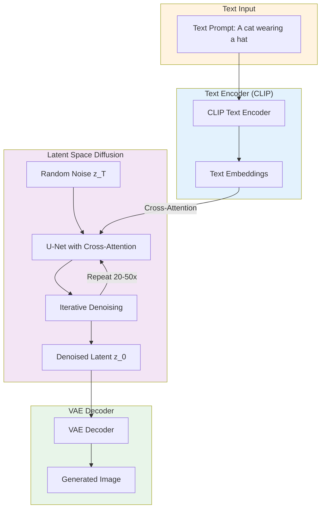
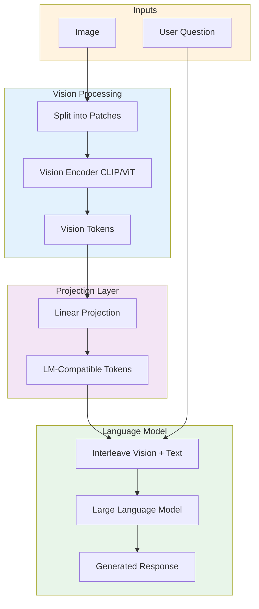
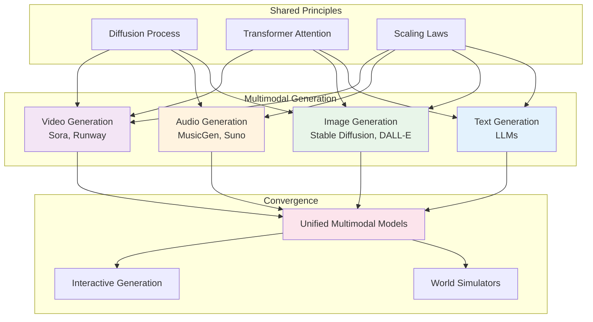
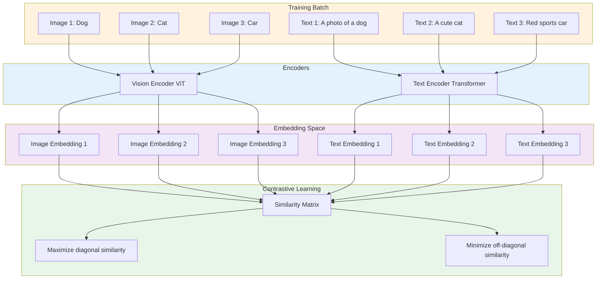

# Module 11: Diffusion Models and Multimodal AI

**Duration:** 1 hour 30 minutes | **Difficulty:** Intermediate-Advanced

---

## Learning Objectives

By the end of this module, you will be able to:

- Understand how diffusion models generate images through iterative denoising
- Grasp multimodal architectures that connect text and images
- Recognize the capabilities and limitations of current image generation systems
- Explain how CLIP bridges text and visual understanding
- Connect diffusion principles to audio and video generation
- Evaluate when to use multimodal AI in practical applications

---

## Section 1: Beyond Text (10 minutes)

### The Multimodal Frontier

Language models transformed how we interact with text. But the world is not just text. We see images, hear sounds, watch videos. True artificial intelligence must understand and generate across modalities.

The multimodal revolution happened in two waves:

**Wave 1 (2021-2022): Text-to-Image Generation**

DALL-E, Midjourney, and Stable Diffusion showed that AI could generate photorealistic images from text descriptions. "A cat wearing a spacesuit on Mars" became a reality with a few keystrokes. This wasn't just impressive; it was transformative for creative industries.

**Wave 2 (2023-2024): Multimodal Understanding**

GPT-4V, Claude with vision, and LLaVA demonstrated that language models could see. Upload an image, ask questions about it, get intelligent answers. Visual question answering moved from research demos to production systems.

Today, we stand at the convergence of these waves. Models generate images, understand images, and increasingly bridge between modalities fluidly.

### Why Images and Audio Matter

Text is powerful but limited. Consider these scenarios:

**Design and creativity**: A graphic designer needs variations of a logo concept. Describing each variation in text is tedious; generating visual options is instant.

**Documentation**: A technician photographs a broken machine part. Instead of describing the problem in text, they ask: "What's wrong with this component?"

**Accessibility**: A visually impaired user receives an image. A multimodal model can describe its contents naturally.

**Education**: A student struggles with geometry. Seeing step-by-step visual proofs alongside explanations accelerates understanding.

**Medical imaging**: Radiologists review thousands of scans. AI systems that understand medical images can flag anomalies for human review.

The trend is clear: AI systems that operate across modalities are more useful than text-only systems. The question is how they work.

### The Modality Challenge

Why is multimodal AI harder than text-only AI?

**Different data structures**: Text is sequential (words in order). Images are 2D grids of pixels. Audio is 1D waveforms over time. Video adds temporal dimension to images. Each requires different processing approaches.

**Different information density**: A 1000-word essay contains roughly 1000 tokens. A single 1024x1024 image contains over 1 million pixels. Naive approaches don't scale.

**Alignment problems**: How do you connect the word "cat" in a caption to the pixels depicting the cat in an image? This correspondence isn't explicit in the data.

**Generation challenges**: Generating coherent text means selecting from ~50,000 vocabulary tokens at each step. Generating coherent images means selecting from billions of possible pixel combinations. The search space explodes.

These challenges drove the development of specialized architectures. Diffusion models solved the generation problem. Contrastive learning (CLIP) solved the alignment problem. Vision transformers adapted attention to images. Together, they enable modern multimodal AI.

---

## Section 2: Diffusion Models Explained (25 minutes)

### The Core Insight

Diffusion models approach image generation through an unusual lens: **destruction and reconstruction**.

The insight: If you can learn to reverse gradual noise addition, you can generate images by starting from pure noise and progressively removing it.

This is counterintuitive. Most generative models try to learn the data distribution directly. Diffusion models learn the opposite: how to undo corruption.

### The Forward Process: Adding Noise

The forward process is simple and requires no learning. Given a clean image x_0, we gradually add Gaussian noise over T timesteps:

```
x_1 = sqrt(1 - beta_1) * x_0 + sqrt(beta_1) * noise_1
x_2 = sqrt(1 - beta_2) * x_1 + sqrt(beta_2) * noise_2
...
x_T = pure noise (approximately)
```

Where:

- beta_t is the noise schedule (how much noise to add at each step)
- noise_t is random Gaussian noise
- T is typically 1000 steps

After many steps, the original image is completely destroyed. x_T looks like random static, with no trace of the original image.

**Key property**: This process is mathematically well-defined. We can compute x_t directly from x_0 without simulating all intermediate steps:

```
x_t = sqrt(alpha_bar_t) * x_0 + sqrt(1 - alpha_bar_t) * noise

where alpha_bar_t = product of (1 - beta_1) * (1 - beta_2) * ... * (1 - beta_t)
```

This closed-form expression is crucial for efficient training.

### The Reverse Process: Learning to Denoise

The reverse process is where learning happens. A neural network learns to predict the noise that was added at each step, enabling us to remove it:

```
Given noisy image x_t, predict the noise that was added.
Subtract the predicted noise to get a cleaner x_{t-1}.
Repeat T times to recover x_0.
```

The training objective is surprisingly simple:

```
Loss = E[||noise - predicted_noise||^2]

1. Sample a clean image x_0 from training data
2. Sample a random timestep t
3. Sample random noise
4. Compute x_t (noisy version)
5. Train network to predict the noise from x_t and t
```

The network learns to denoise at every noise level. It sees heavily corrupted images (high t) and slightly corrupted images (low t), learning appropriate denoising for each.

### Noise Scheduling

The beta schedule controls how quickly noise accumulates. Common choices:

**Linear schedule**: beta increases linearly from beta_1 to beta_T. Simple but not optimal.

**Cosine schedule**: beta follows a cosine curve, adding noise more gradually in early steps. Often produces better image quality.

**Learned schedules**: Some models learn the optimal noise schedule during training.

The schedule matters because:

- Too fast: Image information destroyed before the model can learn structure
- Too slow: Training becomes inefficient, requiring more steps
- Optimal: Gradual destruction that lets the model learn at each corruption level

### The U-Net Architecture

Diffusion models typically use a U-Net architecture for the denoising network:

```
Input: Noisy image x_t + timestep embedding t

Encoder path (downsampling):
  - Convolutional blocks reduce spatial resolution
  - Increase channel depth
  - Capture global context

Bottleneck:
  - Self-attention layers
  - Process at lowest resolution

Decoder path (upsampling):
  - Transpose convolutions increase resolution
  - Skip connections from encoder preserve details
  - Produce noise prediction at original resolution

Output: Predicted noise (same shape as input)
```

**Why U-Net?**

1. **Skip connections**: Direct connections from encoder to decoder preserve fine details that would otherwise be lost through downsampling.

2. **Multi-scale processing**: The encoder captures context at multiple resolutions. Global structure (composition, objects) at low resolution; fine details (textures, edges) at high resolution.

3. **Attention in bottleneck**: Self-attention at the lowest resolution is computationally tractable and captures long-range dependencies.

4. **Timestep conditioning**: The network receives the timestep t as input, allowing it to learn different denoising behaviors for different noise levels.

### Timestep Conditioning

The same network must handle all noise levels. It needs to know "how noisy is this image?"

**Sinusoidal embeddings**: Similar to transformer positional encodings, timestep t is converted to a continuous vector:

```
embedding(t) = [sin(t/10000^0), cos(t/10000^0), sin(t/10000^1), cos(t/10000^1), ...]
```

This embedding is injected into the network (often added to intermediate activations), informing the model about the current noise level.

**Why this matters**: At high noise levels (t near T), the model should focus on global structure—placing objects, establishing composition. At low noise levels (t near 0), it should focus on fine details—textures, sharp edges, subtle colors.

### Sampling: Generating Images

To generate an image:

```
1. Start with pure noise: x_T ~ N(0, I)
2. For t = T, T-1, ..., 1:
   a. Predict noise: predicted_noise = network(x_t, t)
   b. Compute x_{t-1} using predicted noise
   c. Add small amount of random noise (for stochasticity)
3. Return x_0 (the generated image)
```

The random noise addition in step 2c is important: it prevents the model from collapsing to deterministic outputs and allows diverse generation.

**Sampling speed**: Standard DDPM (Denoising Diffusion Probabilistic Models) requires 1000 steps. This is slow. Improvements:

- **DDIM** (Denoising Diffusion Implicit Models): Enables deterministic sampling and fewer steps (50-100)
- **Classifier-free guidance**: Improves quality by amplifying the conditional signal
- **Distillation**: Train a faster model to mimic the slow model's outputs

Modern systems generate high-quality images in 20-50 steps, taking seconds rather than minutes.

```mermaid
graph TB
    subgraph Forward["Forward Process (Fixed)"]
        F1[Clean Image x_0] --> F2[Slightly Noisy x_1]
        F2 --> F3[More Noisy x_2]
        F3 --> F4[...]
        F4 --> F5[Pure Noise x_T]
    end

    subgraph Reverse["Reverse Process (Learned)"]
        R1[Pure Noise x_T] --> R2[Less Noisy x_{T-1}]
        R2 --> R3[Even Less Noisy x_{T-2}]
        R3 --> R4[...]
        R4 --> R5[Clean Image x_0]
    end

    subgraph Network["U-Net Denoiser"]
        N1[Input: x_t + timestep t]
        N2[Predict noise added at step t]
        N3[Subtract to get x_{t-1}]
        N1 --> N2 --> N3
    end

    Forward -.-> |"Training: learn to reverse"| Reverse
    Reverse --> |"Each step uses"| Network

    style F1 fill:#e8f5e9
    style F5 fill:#ffebee
    style R1 fill:#ffebee
    style R5 fill:#e8f5e9
    style Network fill:#e3f2fd
```

### Why Diffusion Works So Well

Several properties make diffusion models effective:

**Stable training**: Unlike GANs, diffusion models train with a simple mean-squared error loss. No adversarial dynamics, no mode collapse, no training instability.

**High quality**: The iterative refinement process produces remarkably detailed outputs. Each step makes small, accurate corrections.

**Controllability**: Conditioning (text, class labels, etc.) integrates naturally into the denoising process.

**Theoretical grounding**: Diffusion models have connections to score matching, stochastic differential equations, and variational inference. This mathematical foundation enables principled improvements.

**Scalability**: They scale well with compute, data, and model size. Larger diffusion models consistently produce better results.

---

## Section 3: Text-to-Image (20 minutes)

### The Text-Image Alignment Problem

Diffusion models can generate images, but how do we control what they generate? We need to connect text descriptions to the image generation process.

The challenge: Text and images live in different spaces. "A golden retriever playing fetch" is a sequence of tokens. The corresponding image is a 2D grid of RGB values. How do we bridge them?

Enter CLIP.

### CLIP: Connecting Language and Vision

CLIP (Contrastive Language-Image Pre-training), developed by OpenAI, learns a shared embedding space for text and images.

**Training data**: 400 million image-caption pairs scraped from the internet.

**Architecture**:

- Image encoder: Vision Transformer (ViT) or ResNet that converts images to vectors
- Text encoder: Transformer that converts text to vectors
- Both encoders produce embeddings in the same dimensional space (e.g., 512D)

**Training objective**: Contrastive learning

```
Given a batch of N image-caption pairs:
1. Encode all images: [img_emb_1, img_emb_2, ..., img_emb_N]
2. Encode all captions: [txt_emb_1, txt_emb_2, ..., txt_emb_N]
3. Compute similarity matrix: sim[i,j] = dot(img_emb_i, txt_emb_j)
4. Training target: sim[i,i] should be high (matching pairs)
                   sim[i,j] for i!=j should be low (non-matching)
```

The model learns to place matching images and captions near each other in embedding space, while pushing non-matching pairs apart.

**What CLIP learns**: After training, CLIP understands visual concepts through language:

- "dog" vectors are similar to dog images
- "sunrise over ocean" is close to such images
- Abstract concepts like "freedom" or "chaos" have visual associations

This learned alignment is the key to text-guided image generation.

### Latent Diffusion: Efficiency Through Compression

Running diffusion in pixel space is expensive. A 512x512 image has 786,432 values (512 _ 512 _ 3 channels). Processing this at every denoising step is slow.

**Latent Diffusion Models (LDMs)** solve this by operating in a compressed latent space:

```
1. Train an autoencoder:
   - Encoder compresses 512x512 image to 64x64 latent
   - Decoder reconstructs image from latent
   - Compression factor: 8x in each dimension (64x reduction in size)

2. Train diffusion model in latent space:
   - Forward process adds noise to latents (not pixels)
   - Reverse process denoises latents
   - Much faster: 64x64 vs 512x512

3. To generate:
   - Diffusion produces a latent
   - Decoder converts latent to full-resolution image
```

This is dramatically more efficient. The diffusion model operates on 64x64x4 = 16,384 values instead of 786,432. Training and inference are 10-100x faster.

**The autoencoder** must be high-quality. If information is lost during compression, the diffusion model cannot generate fine details. Modern autoencoders (VAEs) achieve remarkable reconstruction quality.

### Stable Diffusion Architecture

Stable Diffusion, the most widely-used open-source text-to-image model, combines these components:

```
Components:
1. VAE Encoder: Compress image to latent
2. VAE Decoder: Reconstruct image from latent
3. Text Encoder: CLIP text encoder (or OpenCLIP)
4. U-Net: Conditional denoising network

Generation Pipeline:
1. Encode text prompt with CLIP → text embedding
2. Initialize latent with random noise
3. Iteratively denoise:
   - U-Net predicts noise given latent + text embedding
   - Remove predicted noise
   - Repeat 20-50 times
4. Decode final latent to image with VAE
```

**Cross-attention for conditioning**: The U-Net incorporates text conditioning through cross-attention layers. At each resolution level:

```
- Query: from noisy latent features
- Key, Value: from text embeddings

This lets every spatial location in the image attend to relevant words in the prompt.
```

When generating "a cat wearing a hat", the pixels forming the cat attend to "cat", while pixels forming the hat attend to "hat".



### Classifier-Free Guidance

Raw conditional diffusion often produces images that match the prompt weakly. Classifier-free guidance (CFG) amplifies the conditioning signal.

**The idea**: Run the denoiser twice:

1. With text conditioning: noise_cond = network(x_t, t, text)
2. Without conditioning: noise_uncond = network(x_t, t, empty)

**Guided prediction**:

```
noise_guided = noise_uncond + guidance_scale * (noise_cond - noise_uncond)
```

The guidance_scale (typically 7-15) amplifies the difference between conditional and unconditional predictions. This pushes the output more strongly toward matching the prompt.

**Trade-offs**:

- Higher guidance: Better prompt adherence, but less diversity, can cause artifacts
- Lower guidance: More diverse, but may ignore parts of the prompt
- Typical sweet spot: 7-10 for photorealistic, 10-15 for stylized

### Image Variations and Editing

Text-to-image is just one application. The same architecture enables:

**Image-to-image**: Start from an encoded image (with some noise added) instead of pure noise. The output preserves structure from the input while following the new prompt.

**Inpainting**: Mask a region of the image. The model fills in the masked region while maintaining consistency with the unmasked areas.

**ControlNet**: Add additional conditioning (edge maps, depth maps, pose skeletons) to guide generation. "Draw an image following this sketch" or "Generate a person in this pose."

**Upscaling**: Use diffusion to add high-frequency details to low-resolution images.

These variations demonstrate the flexibility of the diffusion framework. The same core architecture, with minor modifications, handles diverse creative tasks.

### Current Capabilities and Limitations

**What works well**:

- Photorealistic scenes, objects, and textures
- Artistic styles and aesthetic control
- Combining concepts in novel ways
- Specific compositions with ControlNet
- Consistency within a single image

**Current limitations**:

- **Text rendering**: Models struggle with legible text in images
- **Counting**: "Three cats" might produce two or four
- **Spatial relationships**: "Cat on top of dog" may be reversed
- **Hands and fine anatomy**: Often produces distorted fingers, limbs
- **Consistency across images**: Same character looks different in each generation
- **Long prompts**: May ignore parts of complex prompts

These limitations are actively researched. Each generation of models improves on these weaknesses, though fundamental challenges remain.

---

## Section 4: Vision-Language Models (15 minutes)

### From Generation to Understanding

Text-to-image models generate images from text. Vision-language models (VLMs) do the reverse: they understand images and respond with text.

This capability emerged from combining two breakthroughs:

1. Large language models that understand and generate text
2. Vision encoders that extract meaningful features from images

The key insight: If we can project image features into the language model's embedding space, the language model can "see."

### GPT-4V and Multimodal LLMs

GPT-4V (GPT-4 with Vision) demonstrated that state-of-the-art language models could incorporate visual understanding:

**Capabilities**:

- Describe image contents in natural language
- Answer questions about images
- Analyze charts, diagrams, and documents
- Identify objects, scenes, and activities
- Read and understand text in images
- Reason about spatial relationships
- Compare multiple images

**Architecture** (inferred, not officially disclosed):

- Vision encoder processes images into patch embeddings
- Projection layer maps vision embeddings to language model space
- Language model processes interleaved text and image tokens

**Example interaction**:

```
User: [uploads image of complex circuit diagram]
      What does this circuit do?

GPT-4V: This appears to be a voltage regulator circuit using an LM7805.
        The input voltage enters from the left, passes through a
        protection diode, then the regulator stabilizes it at 5V.
        The capacitors on input and output smooth the voltage and
        prevent oscillation. The LED with its current-limiting resistor
        provides visual indication that power is present.
```

### LLaVA: Open-Source Vision-Language Models

LLaVA (Large Language and Vision Assistant) showed that vision-language models could be created by fine-tuning existing LLMs:

**Training approach**:

1. **Vision encoder**: CLIP ViT-L (frozen during training)
2. **Projection layer**: Simple MLP that maps CLIP features to LLM embedding dimension
3. **Language model**: Vicuna (fine-tuned LLaMA)

**Training stages**:

- Stage 1: Train only the projection layer on image-caption pairs
- Stage 2: Fine-tune both projection and LLM on visual instruction data

**Key insight**: The LLM already understands language and reasoning. The projection layer just needs to translate visual features into a form the LLM can process.

This approach is remarkably efficient. LLaVA was trained on 8 A100 GPUs in about one day, yet achieved impressive visual understanding.

### Visual Question Answering

VQA is the canonical task for vision-language models: given an image and a question, produce an answer.

**Types of questions**:

- **Recognition**: "What animal is in the image?" (perceptual)
- **Counting**: "How many people are there?" (enumeration)
- **Spatial**: "What is to the left of the table?" (relationship)
- **Reasoning**: "Why might the person be sad?" (inference)
- **Reading**: "What does the sign say?" (OCR)
- **Knowledge**: "What breed of dog is this?" (external knowledge)

**Challenges**:

- Models must ground language to specific image regions
- Answers require integrating visual perception with world knowledge
- Some questions have ambiguous or subjective answers

### How VLMs Process Images

The typical VLM pipeline:

```
1. Image preprocessing:
   - Resize to fixed resolution (e.g., 336x336)
   - Split into patches (e.g., 14x14 = 196 patches)

2. Vision encoding:
   - Each patch embedded by vision transformer
   - Result: 196 vision tokens

3. Projection:
   - Linear layer maps vision tokens to LLM dimension
   - May include additional processing (pooling, resampling)

4. Interleaving:
   - Vision tokens inserted into text sequence
   - Example: [BOS] [IMG_1] [IMG_2] ... [IMG_196] User: What is this? [/INST]

5. Language model processing:
   - LLM attends to both text and image tokens
   - Generates response autoregressively
```

The projection layer is crucial. It must preserve visual information while transforming it into a format the language model can process. Simple linear projections work surprisingly well.



### Emerging Capabilities

Vision-language models are rapidly developing new abilities:

**Document understanding**: Parse invoices, forms, academic papers. Extract structured information from unstructured documents.

**GUI interaction**: Understand screenshots, identify UI elements, suggest interactions. Foundation for AI agents that operate computers.

**Video understanding**: Process video as sequences of frames. Describe events, track objects, answer temporal questions.

**Multimodal reasoning**: Combine visual and textual reasoning. "Based on this graph and the text in the article, what conclusion can we draw?"

**Few-shot visual learning**: Learn new visual concepts from a few examples shown in context.

These capabilities emerge from scale and training data diversity. As datasets and models grow, more sophisticated visual understanding follows.

### Limitations of Current VLMs

**Hallucination**: VLMs sometimes describe objects or details that aren't in the image. This is especially problematic for safety-critical applications.

**Spatial reasoning**: Understanding precise spatial relationships ("the red ball is between the blue and green cubes") remains challenging.

**Fine-grained recognition**: Distinguishing similar categories (bird species, car models) requires specialized training.

**Temporal understanding**: Video models often struggle with precise temporal reasoning.

**Consistency**: The same image may elicit different responses in different contexts.

**Adversarial robustness**: Small perturbations to images can dramatically change model responses.

These limitations motivate ongoing research in training procedures, architectures, and evaluation methods.

---

## Section 5: Audio and Video Frontiers (15 minutes)

### Audio Generation with Diffusion

The principles that power image generation extend naturally to audio. Audio is a 1D waveform over time; diffusion can learn to denoise it just as it denoises images.

**Approaches to audio diffusion**:

**Waveform diffusion**: Operate directly on raw audio samples. Produces highest quality but is computationally expensive due to high sample rates (44.1kHz = 44,100 samples per second).

**Spectrogram diffusion**: Convert audio to spectrograms (time-frequency representations), run diffusion on these 2D images, then convert back to audio. More efficient, leverages image diffusion techniques.

**Token-based**: Encode audio into discrete tokens (like text), then use autoregressive or diffusion models on token sequences. Used by AudioLM and MusicLM.

### Music Generation

Several systems now generate music from text prompts:

**MusicGen (Meta)**: Generates high-quality music from text descriptions. Uses a transformer decoder over compressed audio tokens. Supports melody conditioning.

**Stable Audio**: Latent diffusion applied to audio. Generates music and sound effects from text prompts.

**Suno AI**: Commercial system generating full songs with vocals, lyrics, and accompaniment.

**Capabilities**:

- Genre and style control: "jazz piano with upright bass"
- Mood specification: "energetic and uplifting"
- Instrumentation: "orchestral strings and brass"
- Structural elements: "verse-chorus structure"

**Limitations**:

- Long-form coherence: Songs may lack structural development
- Precise control: Hard to specify exact melodies or harmonies
- Copyright concerns: Training data includes copyrighted music

### Text-to-Speech and Voice Cloning

Diffusion and related techniques have revolutionized speech synthesis:

**Natural TTS**: Systems like Bark, Tortoise-TTS, and XTTS produce remarkably natural speech. Prosody, emotion, and pacing approach human quality.

**Voice cloning**: Given seconds of reference audio, systems can synthesize new speech in that voice. This enables personalization but raises ethical concerns.

**Expressive speech**: Modern TTS controls emotion, speaking rate, and style through prompts or reference audio.

**Multilingual**: Many systems handle multiple languages, and some can even translate while preserving the speaker's voice.

### Video Generation

Video adds temporal consistency to image generation. A video is a sequence of images that must be coherent across frames.

**Current approaches**:

**Frame-by-frame with temporal attention**: Extend image diffusion with attention across frames. Models like Stable Video Diffusion and Runway Gen-3 use this approach.

**Latent video diffusion**: Compress video to 3D latent space (spatial + temporal), run diffusion in this space.

**Autoregressive**: Generate frames sequentially, conditioning each on previous frames. Used by VideoPoet and some research systems.

### Sora and the Video Generation Frontier

OpenAI's Sora (announced 2024) demonstrated a leap in video generation:

**Capabilities**:

- Minute-long videos with consistent characters and scenes
- Complex camera movements and cinematography
- Physical understanding (reflections, shadows, object permanence)
- Multiple characters interacting

**Architecture insights** (from the technical report):

- Operates on "spacetime patches" (3D chunks of video)
- Transformer-based, not convolutional
- Variable duration and resolution
- Text, image, and video conditioning

Sora showed that scaling diffusion-like approaches to video can produce remarkable results. However, it also highlighted remaining challenges:

**Limitations**:

- Physics violations (objects passing through each other, impossible movements)
- Temporal inconsistencies over long durations
- Struggles with fine-grained interactions
- Extremely compute-intensive

### Current State and Future Directions

**What's working**:

- Short clips (5-30 seconds) with reasonable quality
- Image-to-video animation
- Style transfer and video editing
- Music and sound effect generation
- High-quality text-to-speech

**Active research areas**:

- Longer coherent videos (minutes to hours)
- Real-time generation for interactive applications
- Precise control over actions and movements
- Audio-visual synchronization
- World simulation and embodied AI

**Convergence trends**:

- Unified architectures handling text, images, audio, video
- World models that understand physics and causality
- Interactive generation (AI collaborator, not just generator)

The trajectory suggests that multimodal generation will become increasingly capable and unified. Systems may eventually generate complete movies from scripts, or simulate interactive 3D worlds from descriptions.



---

## Section 6: Practical Applications (5 minutes)

### When to Use Multimodal AI

Multimodal AI opens new application categories. Consider these use cases:

**Content creation**:

- Marketing assets (images, videos, audio)
- Social media content generation
- Concept art and design exploration
- Stock photography and illustration

**Product applications**:

- Visual search (search by image, not text)
- Automatic alt-text for accessibility
- Document processing and extraction
- Quality inspection in manufacturing

**User interfaces**:

- Conversational interfaces with image understanding
- Voice assistants with visual context
- Accessibility tools for visually impaired users

**Analysis and research**:

- Medical image analysis (radiology, pathology)
- Satellite and aerial imagery analysis
- Scientific visualization interpretation
- Security and surveillance

### Choosing the Right Approach

**For image generation**:

- Quick prototypes: API services (DALL-E, Midjourney)
- Fine control and customization: Stable Diffusion + ControlNet
- High volume: Self-hosted open-source models
- Specific domains: Fine-tuned models on domain data

**For image understanding**:

- General understanding: GPT-4V, Claude Vision
- High throughput: LLaVA or similar open models
- Specific tasks: Task-specific vision models may outperform generalists

**For audio/video**:

- Music generation: MusicGen, Suno
- TTS: ElevenLabs, OpenAI TTS, open-source options
- Video: Runway, Pika, or research implementations

### Ethical Considerations

Multimodal AI raises significant ethical questions:

**Deepfakes and misinformation**: Generated images and videos can spread false information. Detection tools lag behind generation capabilities.

**Copyright and ownership**: Training on copyrighted material without consent raises legal questions. Generated outputs may reproduce copyrighted styles or content.

**Bias and representation**: Models trained on internet data reflect societal biases in their outputs.

**Economic disruption**: Creative professions face disruption as AI generates content at scale.

**Consent and privacy**: Voice cloning and face generation can be used without consent.

**Best practices**:

- Implement watermarking for AI-generated content
- Respect opt-out requests for training data
- Disclose AI involvement in content creation
- Avoid applications that could harm individuals
- Monitor for misuse and have takedown procedures
- Consider the environmental impact of training and inference

These are not merely theoretical concerns. They require active attention in any production deployment of multimodal AI.

---

## Diagrams

### The Complete Diffusion Process

```mermaid
graph TB
    subgraph Forward["Forward Diffusion (No Learning)"]
        X0[Clean Image x_0]
        X1[x_1 = x_0 + noise]
        X2[x_2 = x_1 + noise]
        XD[...]
        XT[Pure Noise x_T]

        X0 --> |"Add noise beta_1"| X1
        X1 --> |"Add noise beta_2"| X2
        X2 --> XD
        XD --> |"Add noise beta_T"| XT
    end

    subgraph Training["Training"]
        Sample[Sample random t and noise]
        Corrupt[Create x_t from x_0]
        Predict[Network predicts noise]
        Loss[MSE Loss: predicted vs actual noise]

        Sample --> Corrupt --> Predict --> Loss
    end

    subgraph Reverse["Reverse Diffusion (Generation)"]
        ZT[Start: Random Noise z_T]
        ZT1[z_{T-1} = z_T - predicted_noise]
        ZT2[z_{T-2} = z_{T-1} - predicted_noise]
        ZD[...]
        Z0[Generated Image z_0]

        ZT --> |"Denoise"| ZT1
        ZT1 --> |"Denoise"| ZT2
        ZT2 --> ZD
        ZD --> |"Denoise"| Z0
    end

    Forward -.-> |"Learn to reverse"| Training
    Training -.-> |"Apply learned denoising"| Reverse

    style X0 fill:#e8f5e9
    style XT fill:#ffebee
    style ZT fill:#ffebee
    style Z0 fill:#e8f5e9
    style Training fill:#e3f2fd
```

### CLIP Contrastive Learning



---

## Knowledge Check

### Question 1

What is the core principle behind diffusion models for image generation?

A) They learn to directly sample from the data distribution
B) They learn to reverse a gradual noise addition process
C) They use adversarial training between generator and discriminator
D) They compress images into discrete tokens for generation

**Correct Answer**: B

**Explanation**: Diffusion models work by first defining a forward process that gradually adds noise to images until they become pure noise, then learning the reverse process to denoise. During generation, the model starts from pure noise and iteratively removes noise to produce a clean image. This is fundamentally different from GANs (adversarial training) or VAEs (learning the distribution directly) or tokenization approaches.

---

### Question 2

How does CLIP enable text-to-image generation?

A) CLIP directly generates images from text
B) CLIP learns a shared embedding space where text and images with similar meanings are close together
C) CLIP translates text into pixel values
D) CLIP provides a loss function that measures image quality

**Correct Answer**: B

**Explanation**: CLIP uses contrastive learning to train a text encoder and image encoder that produce embeddings in the same vector space. Matching text-image pairs have similar embeddings. This alignment allows diffusion models to use CLIP text embeddings as conditioning, guiding image generation toward content that matches the text description. CLIP itself doesn't generate images; it provides the connection between text and visual concepts.

---

### Question 3

What is the primary advantage of latent diffusion models over pixel-space diffusion?

A) Higher image quality
B) Computational efficiency through operating on compressed representations
C) Better text conditioning
D) Simpler training objectives

**Correct Answer**: B

**Explanation**: Latent diffusion models first compress images (e.g., from 512x512 to 64x64) using a VAE, then run diffusion in this compressed latent space. This is dramatically more efficient because diffusion operations are O(n) in the number of values being processed. A 64x64 latent has 64x fewer values than a 512x512 image, making training and inference 10-100x faster while maintaining comparable quality.

---

### Question 4

What challenge do vision-language models still struggle with most?

A) Basic object recognition
B) Generating natural language responses
C) Precise spatial reasoning and counting
D) Processing images of different sizes

**Correct Answer**: C

**Explanation**: Current VLMs, including GPT-4V and Claude Vision, struggle with precise spatial reasoning ("What is to the left of X?") and accurate counting ("How many cats are there?"). They excel at recognition, captioning, and qualitative understanding, but quantitative and precise spatial tasks remain challenging. This is an active area of research with ongoing improvements.

---

## Hands-On Exercise: Image Generation Experiment

### Objective

Explore the capabilities and limitations of text-to-image generation through systematic experimentation with prompts and observe how diffusion models respond to different types of inputs.

### Time Required

30-45 minutes

### Prerequisites

Access to an image generation system. Options:

- **API access**: OpenAI DALL-E API, Stability AI API
- **Local**: Stable Diffusion via Automatic1111, ComfyUI, or Diffusers library
- **Online tools**: Midjourney, Leonardo.ai, or similar

### Part 1: Basic Prompt Engineering (10 minutes)

Generate images for each prompt and document the results:

**Prompt Set 1: Specificity**

```
a. "dog"
b. "a golden retriever"
c. "a golden retriever puppy playing in autumn leaves"
d. "a golden retriever puppy playing in autumn leaves,
    professional photography, shallow depth of field,
    golden hour lighting"
```

**Questions to answer**:

1. How does specificity affect output quality and consistency?
2. At what point does adding detail improve results, and when does it become excessive?
3. Which details had the most impact on the output?

### Part 2: Testing Known Limitations (10 minutes)

Test areas where current models struggle:

**Prompt Set 2: Challenging cases**

```
a. "A sign that says 'OPEN 24 HOURS'" (text rendering)
b. "Three red apples and two green apples on a table" (counting)
c. "A cat sitting on top of a dog" (spatial relationships)
d. "A hand holding a pencil, writing in a notebook" (anatomy)
```

**Questions to answer**:

1. Which prompts produced accurate results? Which failed?
2. How did the model interpret ambiguous instructions?
3. What workarounds might improve results for challenging cases?

### Part 3: Style Control (10 minutes)

Explore style modification:

**Prompt Set 3: Same subject, different styles**

```
Base subject: "a medieval castle on a cliff"

a. "...in the style of Studio Ghibli animation"
b. "...as a oil painting by Monet"
c. "...as a cyberpunk neon-lit scene"
d. "...as a technical architectural blueprint"
e. "...as a watercolor illustration"
```

**Questions to answer**:

1. How well does the model capture each style?
2. Does style affect the structural accuracy of the castle?
3. Which style combinations work well, and which seem to conflict?

### Part 4: Negative Prompts and Guidance (10 minutes)

If your system supports negative prompts:

**Prompt Set 4: Refinement**

```
Prompt: "portrait of a person in a garden"

Negative prompts to try:
a. No negative prompt
b. "blurry, low quality, distorted"
c. "cartoon, illustration, painting"
d. "dark, gloomy, shadowy"
```

**For guidance scale experiments (if supported)**:

```
Same prompt at guidance scales: 3, 7, 12, 20
```

**Questions to answer**:

1. How do negative prompts change the output?
2. What is the effect of guidance scale on prompt adherence vs. image quality?
3. What guidance scale worked best for your prompts?

### Part 5: Analysis and Reflection

Write a brief report (1-2 paragraphs each):

1. **Capability assessment**: Based on your experiments, what types of images can current models generate well? What remains challenging?

2. **Prompt engineering insights**: What strategies were most effective for getting desired results? What common mistakes led to poor outputs?

3. **Practical applications**: Given your observations, what applications would you recommend using these tools for? What applications would you caution against?

4. **Ethical observations**: Did you observe any biases in the outputs? What content policies or limitations did you encounter?

### Success Criteria

You've completed this exercise successfully if you:

- [ ] Generated at least 12 images across the different prompt categories
- [ ] Documented both successful and unsuccessful generation attempts
- [ ] Identified at least 3 specific model limitations through testing
- [ ] Found at least 2 effective prompt engineering strategies
- [ ] Wrote a reflection connecting observations to real-world applications

### Extension Activities

If you want to explore further:

1. **ControlNet**: Try using pose, edge, or depth conditioning for more precise control
2. **Image-to-image**: Start from an existing image and modify it with prompts
3. **Inpainting**: Mask and regenerate specific regions of images
4. **Comparison**: Run the same prompts on different models and compare results

---

## Summary

This module explored the multimodal AI landscape, focusing on diffusion models for generation and vision-language models for understanding.

**Diffusion Models** generate images through iterative denoising:

- The forward process gradually adds noise until images become pure noise
- The reverse process learns to remove noise, step by step
- U-Net architectures with timestep conditioning perform the denoising
- Latent diffusion improves efficiency by operating in compressed spaces

**Text-to-Image Generation** connects language and vision:

- CLIP learns aligned embeddings for text and images
- Cross-attention injects text conditioning into the denoising process
- Classifier-free guidance amplifies adherence to prompts
- Stable Diffusion combines VAE, CLIP, and U-Net for accessible generation

**Vision-Language Models** enable image understanding:

- VLMs project image features into language model embedding spaces
- Models like GPT-4V and LLaVA answer questions about images
- The key is alignment between visual and textual representations
- Limitations include hallucination, spatial reasoning, and counting

**Audio and Video Generation** extends these principles:

- Audio diffusion operates on waveforms or spectrograms
- Video adds temporal consistency to image generation
- Systems like Sora show the potential for long-form video synthesis
- Unified multimodal models are an active research frontier

**Practical Considerations** guide deployment:

- Match the tool to the task: generation vs. understanding
- Consider efficiency, cost, and quality trade-offs
- Ethical concerns include deepfakes, copyright, and bias
- Best practices include watermarking, disclosure, and monitoring

The multimodal revolution is still early. As models improve and new modalities are integrated, the boundary between text, images, audio, and video will continue to blur. Understanding these foundations prepares you to leverage and build on these technologies as they evolve.

---

## Additional Resources

### Foundational Papers

**Diffusion Models**:

- "Denoising Diffusion Probabilistic Models" (Ho et al., 2020) - The DDPM paper that started modern diffusion
  [arxiv.org/abs/2006.11239](https://arxiv.org/abs/2006.11239)
- "Denoising Diffusion Implicit Models" (Song et al., 2020) - DDIM for faster sampling
  [arxiv.org/abs/2010.02502](https://arxiv.org/abs/2010.02502)

**Text-to-Image**:

- "High-Resolution Image Synthesis with Latent Diffusion Models" (Rombach et al., 2022) - Stable Diffusion
  [arxiv.org/abs/2112.10752](https://arxiv.org/abs/2112.10752)
- "Learning Transferable Visual Models From Natural Language Supervision" (Radford et al., 2021) - CLIP
  [arxiv.org/abs/2103.00020](https://arxiv.org/abs/2103.00020)

**Vision-Language Models**:

- "Visual Instruction Tuning" (Liu et al., 2023) - LLaVA
  [arxiv.org/abs/2304.08485](https://arxiv.org/abs/2304.08485)
- "Flamingo: a Visual Language Model for Few-Shot Learning" (Alayrac et al., 2022)
  [arxiv.org/abs/2204.14198](https://arxiv.org/abs/2204.14198)

**Audio and Video**:

- "AudioLM: a Language Modeling Approach to Audio Generation" (Borsos et al., 2023)
  [arxiv.org/abs/2209.03143](https://arxiv.org/abs/2209.03143)
- "Video generation models as world simulators" (OpenAI, 2024) - Sora technical report
  [openai.com/research/video-generation-models-as-world-simulators](https://openai.com/research/video-generation-models-as-world-simulators)

### Tutorials and Explainers

- "The Illustrated Stable Diffusion" - Jay Alammar
  [jalammar.github.io/illustrated-stable-diffusion/](https://jalammar.github.io/illustrated-stable-diffusion/)
- "What are Diffusion Models?" - Lilian Weng
  [lilianweng.github.io/posts/2021-07-11-diffusion-models/](https://lilianweng.github.io/posts/2021-07-11-diffusion-models/)
- Hugging Face Diffusers Course
  [huggingface.co/docs/diffusers/tutorials/tutorial_overview](https://huggingface.co/docs/diffusers/tutorials/tutorial_overview)

### Practical Tools

**Image Generation**:

- Stable Diffusion WebUI (Automatic1111): [github.com/AUTOMATIC1111/stable-diffusion-webui](https://github.com/AUTOMATIC1111/stable-diffusion-webui)
- ComfyUI (node-based interface): [github.com/comfyanonymous/ComfyUI](https://github.com/comfyanonymous/ComfyUI)
- Hugging Face Diffusers: [github.com/huggingface/diffusers](https://github.com/huggingface/diffusers)

**Vision-Language Models**:

- LLaVA: [github.com/haotian-liu/LLaVA](https://github.com/haotian-liu/LLaVA)
- OpenAI Vision API: [platform.openai.com/docs/guides/vision](https://platform.openai.com/docs/guides/vision)

**Audio Generation**:

- AudioCraft (MusicGen, AudioGen): [github.com/facebookresearch/audiocraft](https://github.com/facebookresearch/audiocraft)
- Bark TTS: [github.com/suno-ai/bark](https://github.com/suno-ai/bark)

### Communities

- r/StableDiffusion - Active community for image generation
- Hugging Face Discord - ML/AI community with diffusion channels
- Civitai - Repository of Stable Diffusion models and LoRAs

---

**Next Module:** [Module 12: AI Safety and Alignment](./12-ai-safety-alignment.md)

In the next module, we'll explore the critical challenges of ensuring AI systems are safe, aligned with human values, and behave as intended. We'll cover alignment techniques, safety research, and the governance landscape surrounding advanced AI systems.
