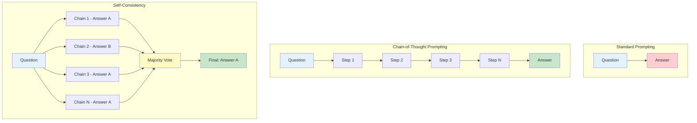
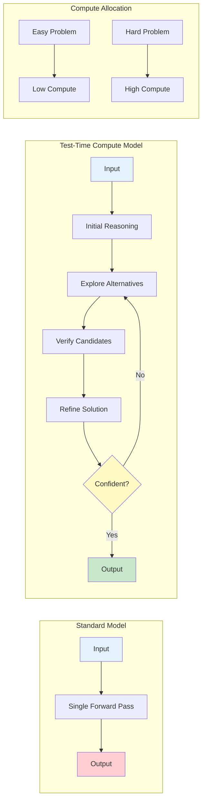
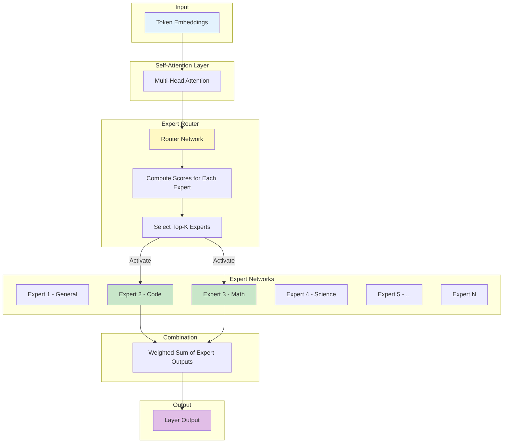
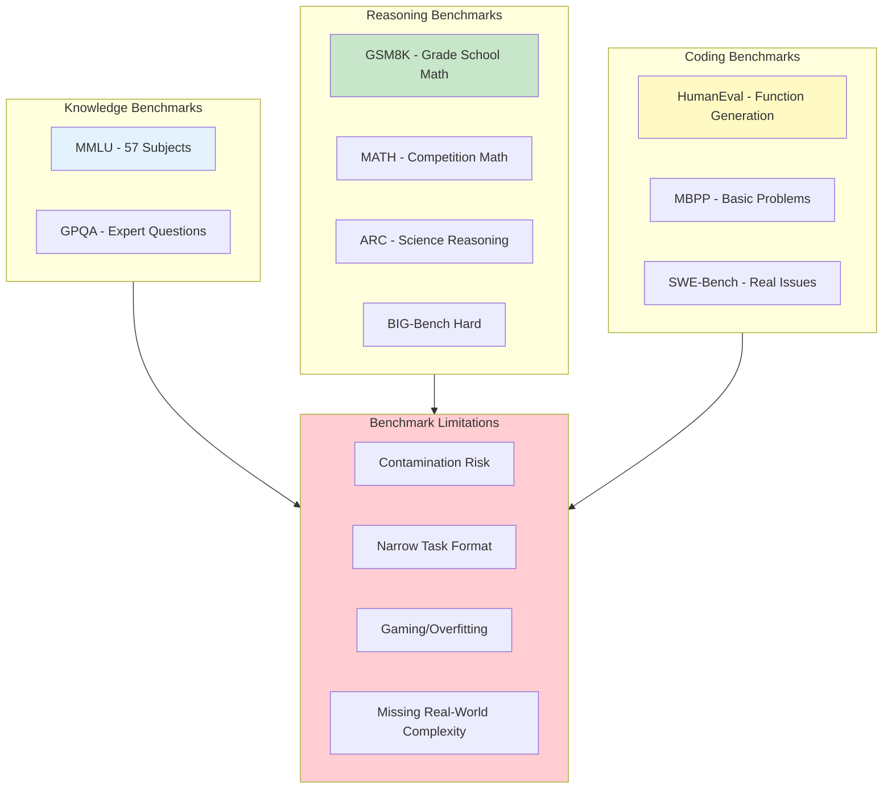

# Module 12: Reasoning Models and Current Frontiers

**Duration:** 1 hour 30 minutes
**Difficulty:** Advanced

## Learning Objectives

By the end of this module, you will be able to:

- Understand why reasoning remains one of the hardest challenges in AI
- Grasp chain-of-thought prompting and its extensions (self-consistency, Tree-of-Thoughts)
- Recognize how test-time compute enables models to "think longer" on hard problems
- Understand Mixture of Experts architectures and their efficiency advantages
- Navigate current AI benchmarks and understand their limitations
- Identify promising research directions and open questions in the field

## Introduction

Language models have made remarkable progress on many tasks, yet reasoning remains stubbornly difficult. A model that can write poetry, translate languages, and explain quantum physics may stumble on a logic puzzle a child could solve. This isn't an accident. Reasoning requires something fundamentally different from pattern matching in training data.

This module explores the frontier of AI reasoning: techniques that coax better reasoning from existing models, architectures designed for complex problem-solving, and the benchmarks we use to measure progress. We'll examine o1-style models that "think before they speak," Mixture of Experts architectures that scale efficiently, and the research directions that may define the next generation of AI systems.

Understanding these frontiers matters for developers. It shapes expectations about what current models can and cannot do, informs decisions about which problems to tackle with AI, and provides context for the rapid advances that will continue to reshape our field.

## 1. The Reasoning Challenge

**Time: 10 minutes**

### Why Reasoning Is Hard for LLMs

Large language models learn to predict the next token based on patterns in training data. This works remarkably well for many tasks: if the training data contains examples of good code, the model learns to generate good code. If it contains accurate facts, the model often reproduces them correctly.

Reasoning is different. Consider this problem:

```
If all bloops are razzies, and all razzies are lazzies,
are all bloops lazzies?
```

This requires applying logical rules to novel terms. The answer (yes) doesn't come from having seen this specific example before. It comes from understanding the structure of transitivity: if A implies B, and B implies C, then A implies C.

**The fundamental tension:** Language models learn statistical patterns. Reasoning requires applying rules to novel situations, including situations that may contradict statistical patterns in the training data.

### Where Standard LLMs Fail

Research has identified consistent failure modes in LLM reasoning:

**Multi-step arithmetic:** Models often fail at problems requiring many sequential operations:

```
What is 7 * 23 + 15 * 8 - 42 / 6?

Expected process:
7 * 23 = 161
15 * 8 = 120
42 / 6 = 7
161 + 120 - 7 = 274

LLM behavior: May compute some steps correctly but lose track of
intermediate results, or make errors that compound through the chain.
```

**Logical consistency:** Models struggle to maintain consistent reasoning across a problem:

```
Prompt: "Is 847 a prime number? Think carefully."

Poor reasoning: "847 ends in 7, which is odd. 847 is not divisible
by 2, 3, or 5. Looking at the digits, 8+4+7=19, which isn't
divisible by 3. Therefore 847 is prime."

Issue: This reasoning misses that 847 = 7 * 121 = 7 * 11 * 11.
The model didn't systematically check all relevant factors.
```

**Counterfactual reasoning:** Models have difficulty reasoning about hypotheticals that contradict their training:

```
Prompt: "If humans had four arms instead of two, how would
keyboards be different?"

Issue: Models may default to describing real keyboards, struggle
to maintain the counterfactual premise, or produce superficial
responses rather than thinking through the implications.
```

**Planning and search:** Problems requiring exploration of a solution space often fail:

```
Prompt: "Find a path from A to D in this graph:
A connects to B, C
B connects to D
C connects to B"

Issue: Models may miss valid paths, hallucinate nonexistent
connections, or fail to systematically search the space.
```

### The Limits of Pure Scaling

Early evidence suggested that larger models reason better. GPT-4 solves problems GPT-3.5 cannot. But scaling alone has limitations:

**Diminishing returns:** Each doubling of parameters yields smaller improvements. Going from 7B to 70B parameters is more impactful than going from 70B to 700B.

**Reasoning doesn't scale linearly:** Some reasoning abilities show minimal improvement with scale, while others improve dramatically. Logical consistency improves less than factual recall.

**Cost prohibitions:** Training models 10x larger requires roughly 10x more compute. We're approaching limits of what's economically feasible through pure scaling.

**Data exhaustion:** We're running out of high-quality training data. Reasoning improvements from scale assume more data, but the internet is finite.

This has driven research toward methods that improve reasoning without proportional increases in training compute: better prompting, test-time compute, and architectural innovations.

### The Reasoning Spectrum

Not all reasoning is equally difficult. A useful framework:

**Pattern matching (easy):** "What is the capital of France?" The answer exists in training data.

**One-step inference (moderate):** "If Paris is the capital of France, and the Eiffel Tower is in Paris, is the Eiffel Tower in France?" Requires combining two facts.

**Multi-step inference (hard):** Problems requiring chains of 5-10 steps with intermediate results that must be tracked.

**Novel reasoning (very hard):** Applying logical structures to completely unfamiliar domains, or discovering non-obvious solution strategies.

Current frontier models handle pattern matching and one-step inference reliably. Multi-step inference is improving but inconsistent. Novel reasoning remains an open challenge.

## 2. Chain-of-Thought and Beyond

**Time: 20 minutes**

### The Chain-of-Thought Revolution

In 2022, researchers discovered that explicitly prompting models to "think step by step" dramatically improved reasoning performance. This technique, called Chain-of-Thought (CoT) prompting, was surprisingly simple yet remarkably effective.

**Standard prompting:**

```
Question: Roger has 5 tennis balls. He buys 2 more cans of
tennis balls. Each can has 3 tennis balls. How many tennis
balls does he have now?

Answer: 11
```

The model often gets this wrong, jumping directly to an answer.

**Chain-of-thought prompting:**

```
Question: Roger has 5 tennis balls. He buys 2 more cans of
tennis balls. Each can has 3 tennis balls. How many tennis
balls does he have now?

Let's think step by step:
1. Roger starts with 5 tennis balls
2. He buys 2 cans, each with 3 balls
3. That's 2 * 3 = 6 new balls
4. Total: 5 + 6 = 11 tennis balls

Answer: 11
```

By showing the reasoning process, or simply asking the model to explain its thinking, accuracy improves substantially. On the GSM8K math benchmark, CoT improved GPT-3's accuracy from 18% to 57%.

### Why Chain-of-Thought Works

Several mechanisms explain CoT's effectiveness:

**Decomposition:** Breaking complex problems into simpler sub-problems that the model can solve reliably. Each step is easier than the whole.

**Working memory externalization:** The model's context window becomes external working memory. Intermediate results written in text can be referenced, whereas internal computations are opaque and limited.

**Eliciting learned procedures:** The model may have learned multi-step procedures during training but doesn't apply them by default. CoT prompts trigger these latent capabilities.

**Error detection:** When reasoning is explicit, the model can sometimes catch its own mistakes. Implicit reasoning doesn't allow for this self-correction.

**Attention focusing:** Each step keeps relevant information in the model's attention, preventing the context from being overwhelmed by irrelevant details.

### Zero-Shot vs. Few-Shot CoT

**Few-shot CoT:** Provide examples of step-by-step reasoning, then ask the model to solve a new problem similarly:

```
Q: Janet's ducks lay 16 eggs per day. She eats 3 for breakfast
and uses 4 to bake muffins. She sells the rest at $2 each.
How much does she make daily?

A: Let's think step by step.
Janet's ducks lay 16 eggs per day.
She eats 3 for breakfast, leaving 16 - 3 = 13.
She uses 4 to bake, leaving 13 - 4 = 9.
She sells 9 eggs at $2 each: 9 * 2 = $18.

Q: [New problem here]
A: Let's think step by step.
```

**Zero-shot CoT:** Simply append "Let's think step by step" to any question, without examples:

```
Q: [Problem]

A: Let's think step by step.
```

Remarkably, zero-shot CoT works nearly as well as few-shot for many problems. The phrase "Let's think step by step" triggers the model's latent reasoning capabilities.

### Self-Consistency

A single chain of thought can be wrong. Self-consistency improves reliability by sampling multiple reasoning paths and taking the majority answer.

**Process:**

1. Generate N different reasoning chains for the same problem (using temperature > 0)
2. Extract the final answer from each chain
3. Return the most common answer (majority vote)

**Example:**

```
Problem: "A bat and ball cost $1.10. The bat costs $1 more
than the ball. How much does the ball cost?"

Chain 1: "The ball costs $0.10 because 1.10 - 1.00 = 0.10"
Answer: $0.10 (incorrect)

Chain 2: "Let b = ball cost. Bat costs b + 1.00.
b + (b + 1.00) = 1.10
2b = 0.10
b = 0.05"
Answer: $0.05 (correct)

Chain 3: Similar to Chain 2
Answer: $0.05 (correct)

Majority vote: $0.05 (correct)
```

Self-consistency works because correct reasoning paths tend to converge on the same answer, while incorrect paths produce varied wrong answers. With enough samples, the correct answer typically wins.

**Trade-offs:**

- Requires multiple inference calls (increased latency and cost)
- Works best when there's a clear correct answer
- Less effective for open-ended generation
- Diminishing returns beyond ~10-20 samples

### Tree of Thoughts

Tree of Thoughts (ToT) extends CoT by explicitly exploring multiple reasoning paths and allowing backtracking when a path seems unpromising.

**Key insight:** Some problems require exploring alternatives, not just step-by-step reasoning. If you realize mid-solution that your approach won't work, you should try a different path.

**How ToT works:**

1. **Decompose** the problem into steps
2. **Generate** multiple possible next steps at each point
3. **Evaluate** each candidate step (using the model itself or heuristics)
4. **Search** the tree of possibilities (breadth-first, depth-first, or best-first)
5. **Backtrack** when paths seem unpromising

**Example: Game of 24**

Given four numbers, use +, -, \*, / to make 24.

Numbers: 4, 9, 10, 13

```
Step 1 candidates:
- 13 - 9 = 4 (now have 4, 4, 10)
- 10 - 4 = 6 (now have 6, 9, 13)
- 9 - 4 = 5 (now have 5, 10, 13)
...

Evaluate: Which gives promising options for reaching 24?

If "13 - 9 = 4" chosen:
Step 2 candidates from (4, 4, 10):
- 10 - 4 = 6 (now have 4, 6)
- 4 + 4 = 8 (now have 8, 10)
- 4 * 4 = 16 (now have 10, 16)
...

Continue until 24 is reached or all paths exhausted.
```

ToT dramatically improves performance on problems requiring search and planning. On the Game of 24, GPT-4 with standard prompting solves 7.3% of problems; with ToT, it solves 74%.

### Limitations of Prompting-Based Approaches

These techniques improve reasoning but have limits:

**Context window constraints:** Long chains of thought consume tokens. Very complex problems may exceed context limits.

**Compounding errors:** Each step can introduce errors. Long chains may accumulate mistakes despite step-by-step reasoning.

**Prompt sensitivity:** Performance depends heavily on how you phrase the prompt. "Think step by step" works differently than "Reason carefully."

**Not always applicable:** Some tasks don't decompose into discrete steps. Creative writing, for instance, doesn't benefit much from CoT.

**Cost and latency:** Self-consistency and ToT require multiple inference calls, increasing both cost and response time.

These limitations motivated research into models that are trained to reason, rather than prompted to reason. The next section covers this direction.

## 3. Test-Time Compute

**Time: 20 minutes**

### The Core Insight

Traditional LLMs spend a fixed amount of compute per token generated, regardless of problem difficulty. A trivial question ("What color is the sky?") uses the same compute as a complex one ("Prove that there are infinitely many primes"). This seems wrong.

**Test-time compute** refers to techniques that allow models to spend more computation on harder problems. Instead of a fixed forward pass, the model can "think" for varying amounts of time depending on the problem.

This mirrors human cognition: easy questions get fast, reflexive answers; hard questions require deliberation.

### o1 and the "Thinking" Paradigm

OpenAI's o1 model (released late 2024) represents a major step toward test-time compute. Rather than generating an answer immediately, o1 produces an extended internal reasoning trace before its final response.

**Observable behavior:**

```
User: "Find a number that when you multiply all its digits,
you get 0, and when you add all its digits, you get 5."

o1 thinking (simplified, actual reasoning is hidden):
- Need: product of digits = 0, sum of digits = 5
- Product = 0 means at least one digit is 0
- If one digit is 0, others must sum to 5
- Options: 50, 410, 320, 2210, 11110, ...
- Verify 50: 5*0=0 (check), 5+0=5 (check)
- Answer: 50

o1 response: "50 works. The product 5*0 = 0, and the sum
5+0 = 5."
```

The model takes time (seconds to minutes) to reason before responding. This reasoning is not shown to users but influences the final answer.

**Key characteristics of o1:**

- Trained with reinforcement learning to produce reasoning traces
- Can spend more tokens on internal reasoning for hard problems
- Substantially better on math, coding, and logic benchmarks
- Higher latency and cost than standard models

### How Test-Time Compute Works

Several mechanisms enable test-time compute:

**Extended generation:** The model generates a long internal monologue, solving intermediate sub-problems, before producing its final answer. More tokens of reasoning = more computation.

**Iterative refinement:** The model produces a draft answer, critiques it, and refines. This can repeat multiple times.

**Search and verification:** The model generates multiple candidate solutions and verifies each, selecting the best one or recognizing that none work and trying different approaches.

**Adaptive depth:** Some architectures allow the model to dynamically decide how many layers or iterations to use, spending more compute on harder inputs.

### Scaling Laws for Test-Time Compute

Research suggests that test-time compute follows its own scaling laws, complementary to training-time scaling:

**Training compute:** Larger models trained on more data are generally more capable. This has diminishing returns and enormous costs.

**Test-time compute:** Given a fixed model, spending more inference compute (more reasoning tokens, more samples, more search) improves results on hard problems. This scales more efficiently for some problem types.

**The insight:** It may be more efficient to train a medium-sized model that can allocate variable inference compute than to train an enormous model that uses fixed compute per token.

**Example tradeoff:**

```
Option A: 1 trillion parameter model, fast inference, $0.10/query
Accuracy on hard math: 60%

Option B: 100 billion parameter model with test-time search,
slow inference, $0.10/query
Accuracy on hard math: 75%

Same cost, better results through test-time compute.
```

### Verification and Self-Critique

A key component of test-time compute is the ability to verify answers:

**Generate-and-verify pattern:**

1. Generate a candidate solution
2. Check if the solution is correct (using the model itself or external tools)
3. If incorrect, analyze the error and try again
4. Repeat until a valid solution is found or resources exhausted

**Self-critique:**

```
Model: "The answer is 42."

Self-critique prompt: "Check if 42 is correct by substituting
back into the original equation..."

Model: "42 gives left side = 85, right side = 87.
This is incorrect. Let me try again..."
```

Verification is easier than generation for many problems. A model that struggles to solve a math problem directly may reliably verify whether a proposed answer is correct. This enables sample-and-verify approaches.

### Tool Use in Reasoning

Advanced reasoning often combines language models with external tools:

**Code execution:** Generate code to solve a problem, execute it, and use the result:

```
Problem: "What is the 47th Fibonacci number?"

Model reasoning:
"I'll write Python to compute this rather than trying to
calculate manually."

def fib(n):
    if n <= 1:
        return n
    return fib(n-1) + fib(n-2)

print(fib(47))  # Too slow, need memoization

Model: "Let me optimize..."

from functools import lru_cache

@lru_cache
def fib(n):
    if n <= 1:
        return n
    return fib(n-1) + fib(n-2)

print(fib(47))  # Output: 2971215073

Answer: 2,971,215,073
```

**Calculator/symbolic math:** Offload precise computation to reliable tools.

**Search engines:** Retrieve information needed for reasoning.

**Formal verifiers:** For proofs, use theorem provers to verify steps.

Tool use extends the model's capabilities by combining linguistic reasoning with precise computation.

### Challenges and Open Questions

Test-time compute raises several challenges:

**Latency:** Users may not want to wait minutes for an answer, even if it's more accurate. How do we balance speed and accuracy?

**Cost:** More computation means higher costs. Who pays for extended reasoning?

**Diminishing returns:** How do we know when additional reasoning won't help? Some problems are fundamentally hard; more thinking won't solve them.

**Reliable termination:** How does the model know when to stop reasoning? It may spin indefinitely on impossible problems.

**Hallucinated reasoning:** Extended reasoning can also extend hallucinations. More steps create more opportunities for errors.

**Evaluation:** How do we benchmark test-time compute fairly? Comparing a model that thinks for 10 seconds vs. one that thinks for 10 minutes is not straightforward.

Research continues on all these fronts. Test-time compute is a promising direction but not a solved problem.

## 4. Mixture of Experts

**Time: 15 minutes**

### The Efficiency Problem

Scaling language models has been remarkably effective, but standard dense transformers have a problem: every parameter is used for every token. A 175B parameter model requires activating all 175B parameters for each input token.

This creates challenges:

- **Memory:** All parameters must be in GPU memory
- **Compute:** All parameters participate in each forward pass
- **Energy:** Larger models consume proportionally more power

**The question:** Can we build models that are "large" in some sense but don't use all their capacity for every input?

### Sparse Models and Mixture of Experts

Mixture of Experts (MoE) architectures address this by having many "expert" networks but only activating a subset for each input.

**Architecture:**

In a standard transformer layer:

```
x -> Self-Attention -> FFN -> output
```

In an MoE layer:

```
x -> Self-Attention -> Router -> [Expert 1, Expert 2, ... Expert N]
                                 (select top-k) -> Combine -> output
```

The router (a small learned network) examines each token and decides which experts should process it. Only the selected experts (typically 1-2 out of 8-64) are activated.

**Example:**

```
Token: "mitochondria"
Router scores: [0.8 (Biology), 0.6 (Chemistry), 0.1 (Sports), ...]
Selected: Top-2 = [Biology Expert, Chemistry Expert]

Token: "touchdown"
Router scores: [0.1 (Biology), 0.05 (Chemistry), 0.9 (Sports), ...]
Selected: Top-2 = [Sports Expert, ...]
```

Different experts can specialize in different types of content, and the router learns to match tokens to appropriate experts.

### Scaling Properties

MoE models have unique scaling properties:

**Total parameters:** The full model might have 1 trillion parameters across all experts.

**Active parameters:** For any given token, only 100 billion parameters might be active (the shared layers plus 2 of 16 experts).

**This means:**

- Training can leverage all 1T parameters for learning capacity
- Inference only requires compute proportional to active parameters
- Memory requirements are still for all parameters (a limitation)

**Comparison:**

```
Dense model: 175B parameters, 175B active per token
MoE model: 1T parameters, 100B active per token

The MoE model has more "knowledge capacity" but similar
inference compute to a smaller dense model.
```

### Real-World MoE Models

Several influential models use MoE:

**Switch Transformer (Google, 2021):**

- One of the first successful large MoE LLMs
- Simplified routing: each token goes to exactly one expert
- Showed MoE can train efficiently at scale

**Mixtral 8x7B (Mistral, 2024):**

- 8 experts, 2 active per token
- Total: ~47B parameters
- Active: ~13B parameters per token
- Matches or exceeds Llama 2 70B performance at lower inference cost

**GPT-4 (rumored):**

- OpenAI has not confirmed architecture details
- Industry speculation suggests GPT-4 uses MoE
- Explains its capability level with reportedly "only" 220B+ active parameters

### Routing Challenges

The router in MoE models faces several challenges:

**Load balancing:** If all tokens go to the same expert, you lose the efficiency benefits. Training includes auxiliary losses to encourage balanced routing.

```
Without balance loss: Expert 3 gets 80% of tokens, others starve
With balance loss: Tokens distributed roughly evenly across experts
```

**Expert specialization:** Ideally, experts specialize meaningfully (one for code, one for medicine, etc.). In practice, specialization is often subtle and emergent.

**Routing instability:** Early in training, routing decisions may be unstable or random. Careful initialization and training procedures are needed.

**Token dropping:** Some architectures drop tokens when experts are overloaded, which can hurt quality. Modern approaches use load balancing to avoid this.

### MoE Advantages and Limitations

**Advantages:**

- **Compute efficiency:** Larger effective model size for similar FLOPS
- **Specialization:** Experts can develop distinct capabilities
- **Scalability:** Can scale total parameters further than dense models
- **Training efficiency:** More parameters can be trained on same compute

**Limitations:**

- **Memory requirements:** All expert weights must be in memory (or loaded just-in-time)
- **Routing overhead:** The router adds computational and architectural complexity
- **Communication costs:** In distributed training, routing requires cross-device communication
- **Harder to analyze:** Understanding which experts do what is challenging
- **Load balancing:** Achieving balanced expert utilization requires careful design

### The Future of Sparse Models

MoE represents a broader trend toward sparse computation:

**Key insight:** Not every part of a model is relevant to every input. Selectively activating relevant components can improve efficiency without sacrificing capability.

**Extensions:**

- **Learned sparsity:** Not just in experts, but in attention patterns and other components
- **Conditional computation:** Deciding dynamically how much compute to use
- **Modular networks:** Routing to entirely different sub-networks for different tasks

This connects to test-time compute: MoE is about routing tokens to the right parameters; test-time compute is about spending the right amount of compute on each problem.

## 5. Benchmarks and Evaluation

**Time: 15 minutes**

### Why Benchmarks Matter

Benchmarks drive research direction. What we measure shapes what we optimize. Understanding current benchmarks, their strengths, and their limitations is essential for interpreting AI progress claims.

**A cautionary note:** Benchmarks measure specific capabilities under specific conditions. High benchmark scores don't guarantee real-world reliability. Low scores on one benchmark don't mean a model is useless.

### Major Reasoning and Knowledge Benchmarks

**MMLU (Massive Multitask Language Understanding):**

- 57 tasks spanning STEM, humanities, social sciences
- Multiple-choice questions from elementary to professional level
- Tests: Broad knowledge, basic reasoning
- Example: "The longest river in Africa is: (A) Nile (B) Congo (C) Niger (D) Zambezi"
- Frontier models: 85-90% accuracy

**GSM8K (Grade School Math):**

- 8,500 grade-school math word problems
- Requires multi-step reasoning
- Tests: Arithmetic, word problem comprehension
- Example: "Janet's ducks lay 16 eggs per day..."
- Frontier models: 90-95% with CoT

**HumanEval:**

- 164 programming problems
- Tests: Code generation from docstrings
- Metric: pass@k (% of problems solved with k attempts)
- Frontier models: 80-90% pass@1

**ARC (AI2 Reasoning Challenge):**

- Science questions from standardized tests
- ARC-Easy and ARC-Challenge splits
- Tests: Scientific reasoning, common sense
- Example: "What causes day and night on Earth?"
- Frontier models: 95%+ on ARC-Challenge

**MATH:**

- 12,500 competition mathematics problems
- Covers algebra, geometry, number theory, etc.
- Tests: Complex mathematical reasoning
- Example: AMC/AIME level problems
- Frontier models: 50-70% (much harder than GSM8K)

**GPQA (Graduate-Level Google-Proof Q&A):**

- Questions written by domain experts
- Cannot be easily answered by search
- Tests: Deep domain expertise
- Frontier models: 40-60% (experts score 70-80%)

### Limitations of Current Benchmarks

Benchmarks have significant limitations:

**Contamination:** Models may have seen benchmark questions during training. Newer benchmarks try to prevent this, but it's a constant concern.

**Narrow scope:** Multiple-choice and short-answer formats don't capture real-world complexity. Helping a user debug code is harder than passing HumanEval.

**Gaming:** Once a benchmark becomes popular, models may be optimized specifically for it, inflating scores without improving general capability.

**Static nature:** Benchmarks are fixed, but real-world tasks evolve. A benchmark from 2020 may not capture 2025 challenges.

**Missing skills:** Important capabilities may not be measured:

- Long-horizon planning
- Learning from feedback within a conversation
- Knowing when to ask for clarification
- Maintaining consistency across long conversations

**Ceiling effects:** As models approach human-level or above on benchmarks, the benchmarks become less informative.

### Reasoning-Specific Benchmarks

For reasoning specifically:

**BIG-Bench (Beyond the Imitation Game):**

- 200+ diverse tasks from 450+ authors
- Includes novel reasoning tasks
- Tasks span math, logic, language, common sense
- Designed to resist contamination

**LogiQA / LogiQA 2.0:**

- Logical reasoning from civil service exams
- Tests formal logic understanding
- Multi-step deductive reasoning

**CLUTRR:**

- Kinship reasoning from natural language
- "John's mother's brother is \_\_\_'s uncle"
- Tests systematic relational reasoning

**PrOntoQA:**

- Synthetic reasoning with made-up terms
- "All bloops are razzies..."
- Tests pure logical inference without world knowledge

### Evaluation Beyond Benchmarks

Real capability assessment often requires more than benchmark scores:

**Human evaluation:**

- Have humans rate model outputs on specific criteria
- More expensive but captures nuance
- Challenges: consistency, scale, defining criteria

**A/B testing:**

- Compare models on real user tasks
- Measures actual utility, not proxy metrics
- Gold standard for production systems

**Red teaming:**

- Adversarial testing for failures and vulnerabilities
- Finds weaknesses benchmarks miss
- Essential for safety evaluation

**Longitudinal evaluation:**

- Track performance over extended interactions
- Important for consistency and reliability
- Standard benchmarks don't capture this

### Interpreting Benchmark Claims

When reading about model performance:

**Check the benchmark:**

- Is it well-known and validated?
- How old is it? (contamination risk increases with age)
- Does it measure what you care about?

**Check the methodology:**

- Few-shot or fine-tuned?
- Standard prompts or optimized prompts?
- How many attempts? (pass@1 vs pass@10)

**Compare fairly:**

- Same benchmark version?
- Same evaluation protocol?
- Reported confidence intervals?

**Consider real-world relevance:**

- Does benchmark performance predict actual utility?
- What capabilities aren't measured?
- How does performance degrade on harder/longer tasks?

## 6. Research Frontiers

**Time: 10 minutes**

### The Current Landscape

AI research moves rapidly. Techniques that were frontier six months ago may be mainstream today. This section highlights directions that appear promising as of the module's writing.

**Caveat:** By the time you read this, some of these may be solved or abandoned, and new directions may have emerged. The goal is to understand how to think about the frontier, not to memorize specific techniques.

### Promising Research Directions

**Scaling test-time compute:**

We're early in understanding how to optimally allocate inference compute. Research questions:

- What's the optimal balance between model size and reasoning depth?
- How do we train models to use test-time compute effectively?
- Can we predict problem difficulty to allocate compute adaptively?

**Improved chain-of-thought:**

CoT works, but we don't fully understand why. Ongoing research:

- What makes some reasoning traces better than others?
- Can we train models to produce better CoT natively?
- How do we combine CoT with external verification?

**Formal reasoning integration:**

Combining neural networks with formal methods:

- Use LLMs to generate proofs, verify with theorem provers
- Neuro-symbolic architectures that combine learning and logic
- Guaranteed-correct reasoning for high-stakes domains

**Multimodal reasoning:**

Reasoning that integrates multiple modalities:

- Visual reasoning (diagrams, charts, geometric problems)
- Audio understanding combined with linguistic reasoning
- Embodied reasoning about physical situations

**Long-context reasoning:**

As context windows grow (100K+ tokens), new challenges emerge:

- Maintaining coherence over long reasoning chains
- Integrating information from distant context
- Avoiding lost-in-the-middle problems

**Agentic systems:**

Models that take actions, observe results, and iterate:

- Tool use for reliable computation
- Multi-step task completion
- Error recovery and planning

### Open Questions

Fundamental questions remain unanswered:

**What is reasoning?**

We use the term "reasoning" but lack a precise definition. Is statistical pattern matching over training data "reasoning"? At what point does it become something more?

**Can LLMs reason, or just simulate reasoning?**

Debate continues over whether current models perform genuine reasoning or sophisticated pattern matching. Practically, the distinction may not matter if they solve real problems. Theoretically, it matters for understanding limits.

**What are the fundamental limits?**

Are there reasoning tasks that transformer architectures fundamentally cannot do? Or can any reasoning ability emerge given sufficient scale and training?

**How much is in the training data?**

Do models generalize reasoning procedures, or do they memorize and retrieve? If a model solves a novel math problem, did it learn mathematical reasoning or retrieve a similar problem from training?

**How should we evaluate progress?**

Current benchmarks have known limitations. What should the benchmarks of 2030 look like?

### What to Watch For

Signals of important advances:

**Consistent multi-step reasoning:** Models that reliably solve 10+ step problems, not just sometimes getting them right.

**Transfer to novel domains:** Reasoning learned in one domain applying to completely new ones.

**Self-correction:** Models that catch and fix their own mistakes reliably.

**Formal verification integration:** LLMs that can generate and verify proofs in automated theorem provers.

**Efficient scaling:** Getting more capability without proportionally more compute.

**Reliability:** Reducing the variance in model performance on similar problems.

Watch for these not as binary "achieved/not achieved" but as gradual improvements that accumulate toward more capable systems.

---

## Diagrams

### Chain-of-Thought Reasoning Flow



### Test-Time Compute: Thinking Before Answering



### Mixture of Experts Architecture



### Benchmark Landscape



---

## Knowledge Check

Test your understanding of reasoning models and current frontiers.

### Question 1: Chain-of-Thought Benefits

What is the primary mechanism by which Chain-of-Thought prompting improves reasoning performance?

A) It increases the model's parameter count during inference
B) It externalizes intermediate reasoning steps, allowing the model to reference and build on them
C) It accesses a separate reasoning module in the model architecture
D) It fine-tunes the model on the specific problem during inference

**Answer: B** - Chain-of-Thought works by externalizing intermediate reasoning steps into the context. This allows the model to "see" its previous reasoning and build on it, effectively using the context window as working memory. It doesn't change parameters (A, D) or access separate modules (C).

---

### Question 2: Test-Time Compute

What distinguishes o1-style models from standard LLMs in terms of compute allocation?

A) o1 models use larger parameter counts for every query
B) o1 models spend variable amounts of compute based on problem difficulty, "thinking" longer on harder problems
C) o1 models require less compute than standard models
D) o1 models only work on mathematical problems

**Answer: B** - The key innovation of o1-style models is variable test-time compute. They can spend more reasoning tokens (and thus more compute) on difficult problems, effectively "thinking longer" before responding. This contrasts with standard LLMs that use fixed compute per token regardless of difficulty.

---

### Question 3: Mixture of Experts

In a Mixture of Experts architecture, what is the role of the router?

A) To compress the model for faster inference
B) To decide which subset of expert networks should process each token
C) To translate between different languages
D) To store the model's long-term memory

**Answer: B** - The router in MoE architectures examines each token and determines which experts (typically top-1 or top-2 out of many) should process it. This selective activation enables large total parameter counts with lower active compute per token.

---

### Question 4: Benchmark Limitations

Which of the following is NOT a significant limitation of current AI benchmarks?

A) Potential contamination from benchmark data appearing in training sets
B) Narrow task formats that don't capture real-world complexity
C) Benchmarks being too difficult for any model to make progress
D) Risk of models being optimized specifically for benchmarks rather than general capability

**Answer: C** - Current frontier models actually perform very well on most benchmarks, often approaching or exceeding human performance. The real limitations are contamination (A), narrow formats (B), and benchmark-specific optimization (D). The challenge is often that benchmarks are too easy or narrow, not too hard.

---

## Hands-On Exercise: Benchmark Exploration

### Objective

Explore reasoning benchmarks firsthand to understand what they measure, how models perform, and what their limitations are.

### Time Required

45-60 minutes

### Prerequisites

- Access to a frontier LLM (Claude, GPT-4, or similar)
- Optional: Python environment for more systematic testing

### Part 1: Testing Chain-of-Thought (15 minutes)

Select three problems of increasing difficulty:

**Problem 1 (Easy):**

```
A train travels at 60 mph for 2 hours. How far does it travel?
```

**Problem 2 (Medium):**

```
A store offers a 20% discount, then applies a 10% loyalty discount
on the reduced price. What is the total percentage off the original price?
```

**Problem 3 (Hard):**

```
In a family, each daughter has the same number of brothers as sisters.
Each son has twice as many sisters as brothers. How many sons and
daughters are in the family?
```

For each problem, test:

1. **Direct prompting:** Just ask the question
2. **Zero-shot CoT:** Add "Let's think step by step."
3. **Structured CoT:** Explicitly ask for steps: "Solve this step by step, showing each calculation."

**Document your findings:**

```
Problem 1:
- Direct: [Correct/Incorrect, answer given]
- Zero-shot CoT: [Correct/Incorrect, quality of reasoning]
- Structured CoT: [Correct/Incorrect, quality of reasoning]

Problem 2:
[Same format]

Problem 3:
[Same format]

Observations:
- When did CoT help most?
- When did the model make errors?
- How did reasoning quality differ?
```

### Part 2: Testing Self-Consistency (15 minutes)

Take this problem:

```
A bat and ball cost $1.10 total. The bat costs $1.00 more than the ball.
How much does the ball cost?
```

This is a famous cognitive bias trap. The intuitive (wrong) answer is $0.10. The correct answer is $0.05.

**Procedure:**

1. Ask the model this question 5 times (refresh context between each)
2. Record the answer each time
3. Note whether reasoning was shown and if it was correct

**Document:**

```
Trial 1: Answer = $[X], Reasoning: [correct/incorrect/none]
Trial 2: Answer = $[X], Reasoning: [correct/incorrect/none]
...
Trial 5: Answer = $[X], Reasoning: [correct/incorrect/none]

Consistency: [X/5 gave same answer]
Majority answer: $[X]
Correct answer: $0.05

Did self-consistency help? Why or why not?
```

### Part 3: Exploring Benchmark Questions (15 minutes)

Try real questions from standard benchmarks:

**MMLU-style (knowledge + reasoning):**

```
In the context of biochemistry, which of the following statements
about enzyme kinetics is correct?

A) The Michaelis constant (Km) represents the substrate concentration
   at which the reaction rate is at its maximum
B) Competitive inhibitors increase the apparent Km without affecting Vmax
C) Allosteric enzymes always follow Michaelis-Menten kinetics
D) The turnover number (kcat) decreases as enzyme concentration increases
```

**ARC-style (science reasoning):**

```
A student places a lit candle inside a glass jar and seals the jar.
After a few minutes, the candle goes out. Which of the following
best explains why the candle went out?

A) The glass jar blocked the light from reaching the candle
B) The candle used up the oxygen inside the jar
C) The temperature inside the jar became too cold
D) The jar created a vacuum that extinguished the flame
```

**GSM8K-style (math word problem):**

```
Natalia sold clips to 48 of her friends in April, and then she sold
half as many clips in May. How many clips did Natalia sell altogether
in April and May?
```

Test each with CoT and evaluate:

- Did the model get the correct answer?
- Was the reasoning sound even if the answer was wrong?
- Where did errors occur?

### Part 4: Identifying Benchmark Limitations (10 minutes)

Based on your exploration, answer:

1. **What skills do these benchmarks test?**

   ```
   [List the cognitive/reasoning skills required]
   ```

2. **What skills do they NOT test?**

   ```
   [List capabilities that wouldn't be measured]
   ```

3. **How might high benchmark scores be misleading?**

   ```
   [Describe scenarios where benchmark success doesn't
   predict real-world utility]
   ```

4. **Design a benchmark question that would test something current benchmarks miss:**

   ```
   [Your novel benchmark question]
   [What capability does it test?]
   [Why isn't this captured by existing benchmarks?]
   ```

### Success Criteria

You've successfully completed this exercise if you:

- [ ] Tested CoT on problems of varying difficulty and documented when it helps
- [ ] Explored self-consistency across multiple trials
- [ ] Attempted questions from at least 2 different benchmark types
- [ ] Identified specific limitations of benchmark evaluation
- [ ] Proposed at least one novel evaluation approach or question

### Reflection Questions

After completing the exercise, consider:

1. How well do benchmark scores predict the model's usefulness for your actual tasks?
2. When would you trust a model's reasoning, and when would you verify independently?
3. How might the limitations you identified affect real-world AI deployment decisions?

---

## Summary

This module explored the frontier of AI reasoning:

**The Reasoning Challenge:** Language models excel at pattern matching but struggle with systematic reasoning. Multi-step inference, logical consistency, and novel problem-solving remain difficult. Pure scaling improves but doesn't solve these challenges.

**Chain-of-Thought and Extensions:** Prompting models to "think step by step" dramatically improves reasoning performance. Self-consistency (sampling multiple chains and voting) and Tree of Thoughts (explicit search over reasoning paths) further enhance reliability. These techniques work by externalizing reasoning and enabling verification.

**Test-Time Compute:** Models like o1 represent a new paradigm: spending variable compute based on problem difficulty. By "thinking longer" on hard problems, models can solve challenges that stump faster approaches. This complements training-time scaling with a new axis of improvement.

**Mixture of Experts:** MoE architectures achieve efficiency by activating only relevant experts for each token. This enables larger total parameter counts with lower inference costs, though it introduces routing complexity. MoE is becoming common in frontier models.

**Benchmarks and Evaluation:** Current benchmarks (MMLU, GSM8K, HumanEval, ARC, etc.) measure specific capabilities but have significant limitations: contamination risks, narrow formats, and gaps in coverage. Real capability assessment requires multiple evaluation approaches including human judgment.

**Research Frontiers:** Active research directions include scaling test-time compute, improved CoT training, neuro-symbolic integration, multimodal reasoning, and agentic systems. Fundamental questions remain about the nature of reasoning in neural networks and the limits of current approaches.

**For developers, the practical implications are:**

- Use CoT prompting for complex reasoning tasks
- Consider self-consistency for high-stakes decisions
- Don't over-trust benchmark scores; evaluate on your specific use cases
- Expect continued rapid progress, but also continued limitations
- Understand that harder reasoning problems may benefit from test-time compute models despite higher cost and latency

The reasoning frontier is advancing rapidly. Techniques that seem exotic today may be standard practice next year. Understanding the current landscape prepares you to adopt new approaches as they mature.

---

## References

### Foundational Papers

1. **"Chain-of-Thought Prompting Elicits Reasoning in Large Language Models"** - Wei et al. (2022)
   The paper that introduced CoT prompting and demonstrated its effectiveness across reasoning tasks.
   [arxiv.org/abs/2201.11903](https://arxiv.org/abs/2201.11903)

2. **"Self-Consistency Improves Chain of Thought Reasoning in Language Models"** - Wang et al. (2022)
   Introduces sampling multiple reasoning paths and majority voting for improved reliability.
   [arxiv.org/abs/2203.11171](https://arxiv.org/abs/2203.11171)

3. **"Tree of Thoughts: Deliberate Problem Solving with Large Language Models"** - Yao et al. (2023)
   Extends CoT to explicit tree search over reasoning paths.
   [arxiv.org/abs/2305.10601](https://arxiv.org/abs/2305.10601)

4. **"Scaling Laws for Neural Language Models"** - Kaplan et al. (2020)
   Establishes the power-law relationship between model size, data, compute, and performance.
   [arxiv.org/abs/2001.08361](https://arxiv.org/abs/2001.08361)

### Mixture of Experts

5. **"Switch Transformers: Scaling to Trillion Parameter Models with Simple and Efficient Sparsity"** - Fedus et al. (2022)
   Simplified MoE architecture that routes each token to a single expert.
   [arxiv.org/abs/2101.03961](https://arxiv.org/abs/2101.03961)

6. **"Mixtral of Experts"** - Mistral AI (2024)
   Technical report on the efficient MoE architecture achieving strong performance.
   [arxiv.org/abs/2401.04088](https://arxiv.org/abs/2401.04088)

7. **"Outrageously Large Neural Networks: The Sparsely-Gated Mixture-of-Experts Layer"** - Shazeer et al. (2017)
   Earlier foundational work on MoE in neural networks.
   [arxiv.org/abs/1701.06538](https://arxiv.org/abs/1701.06538)

### Test-Time Compute and Reasoning

8. **"Let's Verify Step by Step"** - Lightman et al. (2023)
   Process-based supervision for improving mathematical reasoning.
   [arxiv.org/abs/2305.20050](https://arxiv.org/abs/2305.20050)

9. **"Large Language Monkeys: Scaling Inference Compute with Repeated Sampling"** - Brown et al. (2024)
   Analysis of how repeated sampling at inference time improves problem-solving.
   [arxiv.org/abs/2407.21787](https://arxiv.org/abs/2407.21787)

10. **"Scaling LLM Test-Time Compute Optimally"** - Snell et al. (2024)
    Framework for understanding optimal allocation of test-time compute.
    [arxiv.org/abs/2408.03314](https://arxiv.org/abs/2408.03314)

### Benchmarks

11. **"Measuring Massive Multitask Language Understanding"** - Hendrycks et al. (2020)
    Introduces the MMLU benchmark for broad knowledge evaluation.
    [arxiv.org/abs/2009.03300](https://arxiv.org/abs/2009.03300)

12. **"Training Verifiers to Solve Math Word Problems"** - Cobbe et al. (2021)
    Introduces GSM8K, the grade-school math benchmark.
    [arxiv.org/abs/2110.14168](https://arxiv.org/abs/2110.14168)

13. **"Evaluating Large Language Models Trained on Code"** - Chen et al. (2021)
    Introduces HumanEval for code generation evaluation.
    [arxiv.org/abs/2107.03374](https://arxiv.org/abs/2107.03374)

14. **"Beyond the Imitation Game: Quantifying and Extrapolating the Capabilities of Language Models"** - Srivastava et al. (2022)
    The BIG-Bench collaborative benchmark with 200+ tasks.
    [arxiv.org/abs/2206.04615](https://arxiv.org/abs/2206.04615)

### Critical Perspectives

15. **"Are Emergent Abilities of Large Language Models a Mirage?"** - Schaeffer et al. (2023)
    Questions whether emergent abilities are artifacts of metric choice.
    [arxiv.org/abs/2304.15004](https://arxiv.org/abs/2304.15004)

16. **"Sparks of Artificial General Intelligence: Early experiments with GPT-4"** - Bubeck et al. (2023)
    Early analysis of GPT-4 capabilities and reasoning.
    [arxiv.org/abs/2303.12712](https://arxiv.org/abs/2303.12712)

---

**Next Module:** [Module 13: Safe and Responsible AI Use](./13-safe-responsible-ai-use.md)

In the next module, we'll explore the crucial topic of AI safety and responsibility: understanding risks, implementing safeguards, and developing AI systems that are beneficial and aligned with human values.
