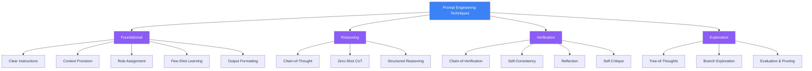
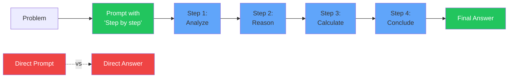
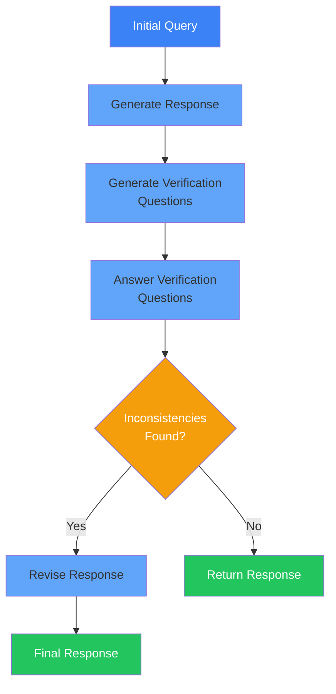
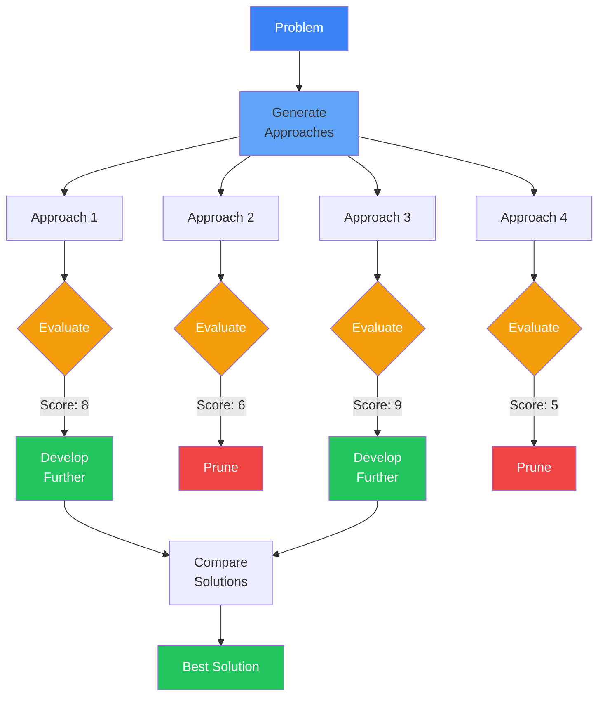
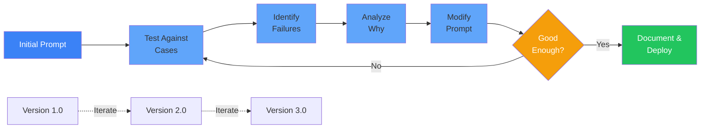

# Module 14: Prompt Engineering Mastery

**Part 3: Safe Use & Agentic Workflows** | **Duration**: 2 hours | **Difficulty**: Intermediate

---

## Learning Objectives

By the end of this module, you will be able to:

- Apply advanced prompting techniques to achieve reliable, consistent outputs
- Understand the underlying principles that make prompts effective
- Implement Chain-of-Thought (CoT), Chain-of-Verification (CoV), and Tree-of-Thoughts (ToT) reasoning patterns
- Design prompts for complex, multi-step tasks
- Systematically optimize prompts through testing and iteration
- Build a personal library of prompt patterns for common scenarios

---

## Section 1: Prompt Engineering Principles (15 minutes)

### Why Prompts Matter

You've used AI. You've typed questions, gotten answers. Sometimes they're brilliant; sometimes they're nonsense. Often, the difference isn't the AI—it's the prompt.

Prompt engineering isn't about finding magic words. It's about understanding how language models process input and structuring that input to maximize the probability of useful outputs.

Think of it this way: when you call a function in code, you provide parameters in a specific format. The function doesn't guess what you mean—it processes exactly what you give it. Prompts work similarly, but the "function" is a probabilistic token predictor, not deterministic logic.

This creates both challenges and opportunities:

**Challenges**:

- Same prompt can produce different outputs
- Subtle wording changes can dramatically affect results
- Models may misinterpret intent or context
- No guarantee of factual accuracy

**Opportunities**:

- Iterative refinement can dramatically improve outputs
- Structured approaches yield consistent results
- You can "program" behavior through examples and instructions
- Advanced techniques unlock reasoning capabilities

### Prompt as Programming

Consider this perspective: prompt engineering is a form of programming where:

- Your code is natural language
- Your compiler is a language model
- Your output is generated text
- Your debugging is iterative testing

Traditional programming:

```python
def calculate_tax(income, rate):
    return income * rate
```

Prompt programming:

```
Given an income and tax rate, calculate the tax owed.

Income: $50,000
Tax rate: 22%

Step by step:
```

In both cases, you're specifying inputs, operations, and expected outputs. But with prompts, you're working with a probabilistic system that requires different skills.

### The Prompt Engineering Mindset

Effective prompt engineering requires:

**Precision**: Be specific about what you want. "Write a function" is vague. "Write a Python function that takes a list of integers and returns the median value, handling even-length lists correctly" is precise.

**Experimentation**: Your first prompt rarely works perfectly. Expect to iterate.

**Verification**: Always validate outputs. The model can sound confident while being completely wrong.

**Pattern Recognition**: Learn what works across different tasks and domains.

**Documentation**: Keep track of effective prompts. Build a personal library.

### The Anatomy of a Good Prompt

Effective prompts typically include:

1. **Context**: Background information the model needs
2. **Instruction**: What you want it to do
3. **Input**: The specific data or query
4. **Output Format**: How you want the response structured
5. **Constraints**: What to avoid or emphasize
6. **Examples**: Few-shot demonstrations (optional but powerful)

Example:

```
[CONTEXT]
You are a senior code reviewer for a Python project following PEP 8 standards.

[INSTRUCTION]
Review the following code for style issues, bugs, and potential improvements.

[INPUT]
def calc(x,y):
    return x/y

[OUTPUT FORMAT]
Provide your review as:
1. Style issues (list)
2. Potential bugs (list)
3. Suggested improvements (list)

[CONSTRAINTS]
- Be specific with line references
- Explain why each issue matters
- Provide corrected code for each issue
```

Not every prompt needs all components, but thinking in these terms helps structure your requests effectively.

---

## Section 2: Foundational Techniques (20 minutes)

### Clear Instructions

The foundation of good prompting is clarity. Models are literal—they do what you ask, not what you mean.

**Weak prompt**:

```
Tell me about React hooks
```

**Strong prompt**:

```
Explain React hooks to an experienced developer familiar with class components
but new to hooks. Focus on useState and useEffect. Include:
- What problems hooks solve
- Basic syntax with code examples
- Common mistakes to avoid
- When to use each hook
```

The strong prompt specifies audience, scope, structure, and emphasis.

### Providing Context

Models have no memory beyond the conversation. Every prompt exists in isolation unless you provide context.

**Without context**:

```
How do I fix this error?
```

**With context**:

```
I'm building a Node.js Express API. When I try to query my PostgreSQL database,
I get: "Error: Connection terminated unexpectedly"

My connection code:
[code here]

Environment: Node 18, PostgreSQL 14, running in Docker

What could cause this error and how do I fix it?
```

Context transforms an impossible question into an answerable one.

### Role Assignment

Giving the model a role can improve outputs by activating relevant patterns from training data.

```
You are an experienced DevOps engineer specializing in Kubernetes.
A junior developer asks: "Why is my pod constantly restarting?"
How would you troubleshoot this?
```

This works because training data likely contains many examples of experienced engineers explaining concepts to juniors. The role primes the model to match those patterns.

**Effective roles**:

- "You are a [expert/teacher/critic] in [domain]"
- "You are a [senior developer/architect/reviewer]"
- "You are helping a [beginner/colleague/student]"

**Ineffective roles**:

- Overly creative ("You are a time-traveling wizard who codes")
- Contradictory ("You are always right and never make mistakes")
- Too vague ("You are helpful")

### Few-Shot Learning

Instead of describing what you want, show examples. This is called few-shot prompting.

**Zero-shot** (no examples):

```
Convert the sentence to title case.

Input: the quick brown fox
Output:
```

**Few-shot** (with examples):

```
Convert sentences to title case, preserving lowercase for articles and prepositions.

Input: the quick brown fox jumps over the lazy dog
Output: The Quick Brown Fox Jumps Over the Lazy Dog

Input: a tale of two cities
Output: A Tale of Two Cities

Input: introduction to machine learning
Output:
```

Few-shot learning is powerful because it:

- Shows rather than tells
- Handles edge cases through examples
- Establishes patterns the model can follow
- Works across domains

### Output Format Specification

Tell the model exactly how to structure its response.

**Unstructured request**:

```
Analyze this code for security issues
```

**Structured request**:

```
Analyze this code for security issues.

Return your analysis in this JSON format:
{
  "critical": ["issue description"],
  "warnings": ["issue description"],
  "suggestions": ["improvement description"],
  "severity_score": 1-10
}
```

Specified formats make outputs parseable, consistent, and actionable.

**Common formats**:

- JSON for structured data
- Markdown for documentation
- Code blocks for implementations
- Lists for options or steps
- Tables for comparisons

### Chain Breaking for Complex Tasks

Don't ask the model to do everything at once. Break complex tasks into steps.

**Monolithic prompt** (prone to failure):

```
Write a complete REST API for a blog with users, posts, and comments,
including authentication, database models, and tests
```

**Chained prompts** (more reliable):

```
1. First prompt: "Design the database schema for a blog with users, posts, and comments"
2. Second prompt: "Based on this schema [paste schema], create SQLAlchemy models"
3. Third prompt: "Create REST endpoints for the User model with this structure [paste]"
4. Continue...
```

Each step produces output you can verify before proceeding. If one step fails, you don't lose all progress.

---

## Section 3: Chain-of-Thought Prompting (20 minutes)

### What is Chain-of-Thought?

Chain-of-Thought (CoT) prompting encourages models to show their reasoning process rather than jumping directly to answers. This improves accuracy, especially for tasks requiring multiple reasoning steps.

The technique comes from research by Wei et al. (2022) at Google, showing that asking models to "think step by step" significantly improves performance on complex reasoning tasks.

### Why CoT Works

Remember: language models predict next tokens based on patterns. When you ask for reasoning steps, you:

1. **Prime better token predictions**: Training data contains more correct answers that show work than correct answers alone
2. **Create intermediate checkpoints**: Each reasoning step constrains subsequent steps
3. **Enable error detection**: Wrong reasoning is often more obvious than wrong answers
4. **Leverage training patterns**: Educational content and technical documentation frequently show step-by-step reasoning

### Standard Chain-of-Thought

Basic CoT structure:

```
[PROBLEM]
Calculate the total cost of 3 items priced at $19.99, $24.50, and $31.25
with 8% sales tax.

[INSTRUCTION]
Let's solve this step by step:
```

The model will typically continue:

```
1. First, add the prices: $19.99 + $24.50 + $31.25 = $75.74
2. Calculate 8% tax: $75.74 × 0.08 = $6.06
3. Add tax to subtotal: $75.74 + $6.06 = $81.80

The total cost is $81.80
```

### Zero-Shot Chain-of-Thought

Remarkably, simply adding "Let's think step by step" often triggers reasoning:

```
Question: If a train travels 120 miles in 2 hours, then increases speed by 20%,
how far will it travel in the next 3 hours?

Let's think step by step:
```

This "zero-shot CoT" works without examples because the phrase appears in training data associated with correct reasoning processes.

### When CoT Helps Most

Chain-of-Thought is particularly effective for:

**Mathematical reasoning**:

```
A recipe serves 4 people and requires 3/4 cup of flour. How much flour for 14 people?

Let's solve this step by step:
```

**Logical deduction**:

```
All developers can code. Some developers can design. Jane is a developer who cannot design.
Can Jane code?

Let's reason through this:
```

**Multi-step procedures**:

```
Debug this code that should reverse a linked list but returns wrong results.

Let's trace through the execution step by step:
```

**Complex comparisons**:

```
Compare PostgreSQL and MongoDB for a read-heavy analytics application with
structured financial data.

Let's evaluate this systematically:
```

### When CoT May Not Help

CoT is less useful or even counterproductive for:

- Simple fact retrieval ("What's the capital of France?")
- Pattern completion ("Complete this regex:")
- Creative generation ("Write a poem about coding")
- Tasks requiring conciseness (summaries, headlines)

The overhead of reasoning steps outweighs benefits for simple queries.

### Structured CoT Templates

For consistent results, provide a reasoning structure:

```
Analyze whether this code change will break existing functionality.

Use this analysis framework:
1. What does the current code do?
2. What does the new code do?
3. What are the differences?
4. What depends on the changed behavior?
5. Could existing code rely on that behavior?
6. Conclusion: Breaking or non-breaking?

Code change:
[paste code]
```

The framework ensures comprehensive analysis.

### CoT with Few-Shot Examples

Combine CoT with few-shot learning for maximum effectiveness:

```
Determine if user input is safe to use in a SQL query.

Example 1:
Input: "John Smith"
Reasoning:
- Contains only letters and space
- No SQL keywords
- No special characters
- Safe for parameterized query
Assessment: SAFE

Example 2:
Input: "admin' OR '1'='1"
Reasoning:
- Contains SQL keywords (OR)
- Contains single quotes
- Pattern matches SQL injection
- Could bypass authentication
Assessment: UNSAFE

Now analyze this input:
Input: "user123; DROP TABLE users--"
Reasoning:
```

The model will follow the pattern established in examples.

---

## Section 4: Chain-of-Verification (CoV) (15 minutes)

### The Hallucination Problem

We've established that language models hallucinate—generate confident falsehoods. Chain-of-Verification (CoV) is a technique to reduce this by having the model verify its own outputs.

The key insight: models are often better at verification than generation. They might incorrectly claim "Python was released in 1995" but correctly answer "Was Python released in 1995?" with "No, it was first released in 1991."

### Basic CoV Pattern

The structure:

1. Generate an initial response
2. Generate verification questions
3. Answer verification questions
4. Produce final revised response

Example:

```
Question: What are the key features of Rust's ownership system?

Step 1 - Initial answer:
[model generates response]

Step 2 - Verification questions:
Now generate 3 questions to verify the accuracy of this answer.

Step 3 - Answer verification:
Answer each verification question.

Step 4 - Revised answer:
Based on the verification, provide a revised, corrected answer.
```

### Self-Consistency Checking

Ask the model to solve problems multiple times using different approaches, then reconcile:

```
Calculate the time complexity of this algorithm.

Approach 1 - Count operations:
[analysis]

Approach 2 - Recurrence relation:
[analysis]

Approach 3 - Compare to known patterns:
[analysis]

Do all approaches agree? If not, which is correct and why?
```

Disagreement between approaches signals potential errors.

### Fact-Checking Prompts

For factual claims, explicitly request verification:

```
List the command-line options for the 'docker run' command.

Now, for each option listed:
1. Verify it exists in Docker documentation
2. Confirm the syntax is correct
3. Note if it's deprecated or version-specific

Provide a final verified list with any corrections.
```

### The Verification Loop

For high-stakes outputs, implement an explicit loop:

```
Task: Write a function to parse ISO 8601 date strings.

Step 1: Write the function

Step 2: Identify potential edge cases
- What date formats should be handled?
- What about timezones?
- How should invalid input be handled?

Step 3: For each edge case, does the function handle it correctly?

Step 4: Revise the function to address any gaps

Step 5: Final verification - will this function work for [specific test cases]?
```

### Limitations of CoV

Chain-of-Verification has limits:

**Same model, same biases**: If the model doesn't know something, verification won't help. Garbage in, garbage out.

**Overconfidence**: Models can verify incorrect information confidently.

**Computational cost**: Multiple generation steps mean higher latency and token usage.

**Not a substitute for real verification**: For critical information, verify against actual sources, not model self-checking.

### When to Use CoV

Chain-of-Verification is most valuable when:

- Factual accuracy is important but not mission-critical
- You're generating technical content that can be verified logically
- The cost of hallucinations is moderate (important but not dangerous)
- You can't easily verify outputs yourself

Don't use CoV when:

- Lives, money, or security depend on accuracy (verify externally)
- The task is simple and low-risk
- Latency is critical
- You can easily verify the output yourself

---

## Section 5: Reflection and Self-Correction (15 minutes)

### Beyond Verification: Critique

While CoV focuses on factual verification, reflection techniques ask models to critique the quality of their outputs: clarity, completeness, adherence to requirements.

### The Self-Critique Pattern

Basic structure:

```
Task: Write documentation for this API endpoint.

Step 1: Generate documentation

Step 2: Critique the documentation
Evaluate on these dimensions:
- Clarity: Is it easy to understand?
- Completeness: Does it cover all parameters, return values, errors?
- Examples: Are examples helpful and correct?
- Accuracy: Is the technical information correct?

Rate each 1-5 and explain deficiencies.

Step 3: Revise based on critique
```

### Iterative Refinement

Use multiple rounds of critique and revision:

```
Task: Design a database schema for an e-commerce platform.

Round 1: Initial design
[model generates schema]

Round 2: Identify issues
What problems exist with this design?
- Normalization issues?
- Missing constraints?
- Performance concerns?
- Scalability limitations?

Round 3: Revise design
[model revises]

Round 4: Final critique
Is this production-ready? What concerns remain?
```

### Role-Based Critique

Have the model adopt different perspectives:

```
Code review: Review this function from three perspectives:

As a Security Reviewer:
- What security vulnerabilities exist?
- How could this be exploited?

As a Performance Engineer:
- What are the performance characteristics?
- Where are the bottlenecks?

As a Maintainability Advocate:
- How readable is this code?
- How easy would it be to modify?

Synthesize findings and suggest revisions.
```

Multiple perspectives often catch issues single-perspective analysis misses.

### The "What Could Go Wrong" Technique

Ask the model to explicitly consider failure modes:

```
System design: Microservices architecture for a payment processing system.

Design:
[model generates design]

Failure mode analysis:
1. What happens if the payment service is unavailable?
2. What happens if the database fails mid-transaction?
3. What happens under extreme load?
4. What happens if the network is unreliable?
5. What happens if data becomes inconsistent?

Revised design addressing these concerns:
```

This "pre-mortem" approach improves robustness.

### Limitations of Self-Correction

Models have inherent limitations in self-correction:

**Can't fix unknown unknowns**: If the model doesn't have knowledge, reflection won't create it.

**May double-down on errors**: Sometimes critique reinforces incorrect outputs instead of fixing them.

**Limited meta-cognition**: Models can't truly assess their own confidence or knowledge gaps.

**Diminishing returns**: Beyond 2-3 rounds, additional reflection rarely helps and may introduce new errors.

**Still probabilistic**: Self-correction improves odds but doesn't guarantee correctness.

### Best Practices for Reflection

To maximize effectiveness:

1. **Be specific about evaluation criteria**: "Is this good?" is less effective than "Does this handle errors correctly?"

2. **Use concrete examples in critique**: "Check if this works for input X" is better than "Check for edge cases"

3. **Limit reflection rounds**: 2-3 rounds is usually optimal

4. **Verify critical outputs externally**: Don't rely solely on self-correction for high-stakes content

5. **Compare before/after**: Sometimes the original output is better than the "improved" version

---

## Section 6: Tree-of-Thoughts and Beyond (15 minutes)

### From Chains to Trees

Chain-of-Thought follows a single reasoning path. But complex problems often require exploring multiple paths before committing to one. Tree-of-Thoughts (ToT) enables this exploration.

The key idea: generate multiple reasoning branches, evaluate each, and pursue the most promising ones. It's like beam search for reasoning.

### Basic Tree-of-Thoughts Structure

```
Problem: Optimize this slow database query.

Step 1 - Generate multiple approaches:
Approach A: Add indexes
Approach B: Rewrite query logic
Approach C: Denormalize data
Approach D: Use caching

Step 2 - Evaluate each approach:
Approach A - Indexes:
  Pros: [...], Cons: [...], Complexity: [...]
Approach B - Rewrite:
  Pros: [...], Cons: [...], Complexity: [...]
[etc.]

Step 3 - Select most promising approaches (A and B)

Step 4 - Develop selected approaches in detail:
Approach A detailed:
  [specific implementation]
Approach B detailed:
  [specific implementation]

Step 5 - Final comparison and recommendation:
[detailed comparison leading to best solution]
```

### When ToT is Valuable

Tree-of-Thoughts shines for:

**Problems with multiple viable approaches**:

```
Design a caching strategy for this API.

Generate 3 different caching approaches:
1. [Approach 1]
2. [Approach 2]
3. [Approach 3]

Evaluate each for:
- Hit rate
- Complexity
- Memory usage
- Consistency challenges

Select the best approach and detail implementation.
```

**Optimization problems**:

```
Refactor this code for better performance.

Generate 5 different optimization strategies:
[...]

Estimate performance impact of each:
[...]

Pursue the top 2 in detail:
[...]
```

**Creative tasks requiring exploration**:

```
Design a unique authentication flow for this application.

Brainstorm 4 different approaches:
[...]

Evaluate each for security, UX, and implementation cost:
[...]

Develop the most promising approach:
[...]
```

### Pruning Strategies

ToT can explode combinatorially. Use pruning to stay manageable:

**Evaluation-based pruning**:

```
Generate 5 solutions, evaluate each, pursue only top 2
```

**Constraint-based pruning**:

```
Generate solutions meeting these constraints: [...]
Discard any that violate constraints
Evaluate remaining
```

**Threshold-based pruning**:

```
Score each approach 1-10
Pursue only those scoring 7+
```

### Self-Evaluation in ToT

Have the model evaluate its own branches:

```
Problem: Design an error handling strategy.

Generate 3 approaches:
[A, B, C]

For each approach, rate 1-10 on:
- Robustness
- Developer ergonomics
- Performance impact
- Testability

Ranking: [...]

Detailed development of top-ranked approach:
[...]
```

### Combining Techniques

The most powerful prompts combine multiple techniques:

```
Task: Debug why this distributed system has inconsistent state.

[ToT: Generate multiple hypotheses]
Possible causes:
1. Race condition in message handling
2. Clock skew between nodes
3. Network partition
4. Database replication lag

[CoT: Trace through each hypothesis]
Hypothesis 1 - Race condition:
  Step 1: How would this manifest?
  Step 2: What evidence would we see?
  Step 3: Does our evidence match?
  Conclusion: [...]

[Repeat for each hypothesis]

[CoV: Verify most likely hypothesis]
Most likely cause: [...]
Verification questions:
1. Does this explain all symptoms?
2. Is this consistent with timing of issues?
3. What would disprove this hypothesis?

Verification answers:
[...]

[Final diagnosis and solution]
[...]
```

### Limitations and Costs

Tree-of-Thoughts has significant downsides:

**Computational cost**: Exploring multiple branches requires many tokens and API calls. A simple question might require 10x the tokens of a direct answer.

**Latency**: Sequential generation of branches and evaluation takes time.

**Complexity**: ToT prompts are harder to design and debug.

**Diminishing returns**: For simple problems, the overhead outweighs benefits.

**Not always better**: Sometimes the first answer is best; exploration introduces confusion.

Use ToT selectively for complex, high-value problems where the cost is justified.

---

## Section 7: Practical Prompt Optimization (15 minutes)

### Systematic Testing

Prompt engineering is empirical. What works must be tested, not assumed.

**Create test cases**:

```
Test suite for code generation prompt:

Easy case:
  Input: "function to add two numbers"
  Expected: simple, correct function

Moderate case:
  Input: "function to validate email addresses"
  Expected: reasonable regex or parsing logic

Hard case:
  Input: "function to parse nested JSON with error handling"
  Expected: comprehensive error handling, edge cases

Edge case:
  Input: "function to handle Unicode in filenames"
  Expected: proper Unicode handling, cross-platform concerns
```

**Run your prompt against all test cases**:

```python
test_cases = [
    {"input": "...", "expected_characteristics": ["correct syntax", "handles edge case X"]},
    # ...
]

for test in test_cases:
    output = model.generate(prompt + test["input"])
    evaluate(output, test["expected_characteristics"])
```

### Versioning Your Prompts

Treat prompts like code—version them:

```
Prompt: Code Review Assistant
Version: 1.0
Date: 2024-01-15
Performance: 70% of reviews caught major issues
Issues: Misses performance problems, too verbose

---

Prompt: Code Review Assistant
Version: 2.0
Date: 2024-01-22
Changes:
  - Added explicit "check for performance issues"
  - Added "be concise" instruction
Performance: 85% of reviews caught major issues
Issues: Still misses concurrency bugs

---

Prompt: Code Review Assistant
Version: 3.0
Date: 2024-01-29
Changes:
  - Added concurrency checklist
  - Added few-shot examples of concise reviews
Performance: 92% of reviews caught major issues
Issues: [Current limitations]
```

### A/B Testing Prompts

Compare variations systematically:

```python
prompt_a = """
Generate unit tests for this function.
"""

prompt_b = """
Generate unit tests for this function.
Include:
- Happy path cases
- Edge cases
- Error cases
"""

prompt_c = """
You are a senior SDET. Generate comprehensive unit tests for this function.

For each test:
- Clear test name
- Arrange-Act-Assert structure
- Descriptive assertion messages

Cover:
- Happy path
- Edge cases (empty input, null, boundary values)
- Error cases

Example format:
[show example]
"""

# Test each on same inputs
results_a = [test_prompt(prompt_a, input) for input in test_inputs]
results_b = [test_prompt(prompt_b, input) for input in test_inputs]
results_c = [test_prompt(prompt_c, input) for input in test_inputs]

# Compare: which catches most bugs? Which has best code quality?
```

### Iteration Workflow

1. **Start simple**: Begin with basic prompt
2. **Test**: Run against diverse inputs
3. **Identify failures**: Where does it break?
4. **Hypothesize**: Why did it fail?
5. **Modify**: Make targeted changes
6. **Test again**: Did it improve?
7. **Repeat**: Iterate until good enough

### Common Improvements

When prompts underperform, try:

**Add specificity**:

```
Before: "Write a function"
After: "Write a Python function with type hints that..."
```

**Add structure**:

```
Before: "Review this code"
After: "Review this code for: 1) bugs, 2) security, 3) performance"
```

**Add examples**:

```
Before: [instruction only]
After: [instruction + 2-3 examples]
```

**Add constraints**:

```
Before: "Suggest improvements"
After: "Suggest improvements. Each suggestion must include specific line numbers and explain why the change improves the code."
```

**Add output format**:

```
Before: [generates free-form text]
After: "Return as JSON: {issues: [...], severity: 1-10, fixed_code: '...'}"
```

### Performance Metrics

Define what "good" means for your use case:

**Accuracy**: Does it give correct information?
**Completeness**: Does it cover all requirements?
**Conciseness**: Is it the right length?
**Format adherence**: Does it follow the requested structure?
**Consistency**: Does it give similar outputs for similar inputs?

Track these over time as you iterate.

### Edge Case Handling

Test your prompts against:

- Empty inputs
- Extremely long inputs
- Malformed inputs
- Ambiguous inputs
- Adversarial inputs (trying to break it)

Add handling for cases that fail:

```
Handle edge cases:
- If input is empty, respond with: [...]
- If input is ambiguous, ask clarifying questions: [...]
- If input is too long, focus on: [...]
```

---

## Section 8: Prompt Patterns Library (5 minutes)

### Essential Patterns

Here's a library of reusable prompt patterns for common scenarios:

#### Pattern: Role-Task-Format (RTF)

```
You are [ROLE].

Your task is to [TASK].

Provide your response as [FORMAT].
```

Example:

```
You are a senior backend engineer specializing in API design.

Your task is to review this API endpoint design and suggest improvements.

Provide your response as:
1. Current design issues (list)
2. Suggested improvements (list with rationale)
3. Revised endpoint design (code)
```

#### Pattern: Few-Shot with CoT

```
[TASK DESCRIPTION]

Example 1:
Input: [example input]
Reasoning:
- [step 1]
- [step 2]
- [step 3]
Output: [example output]

Example 2:
[similar structure]

Now solve:
Input: [actual input]
Reasoning:
```

#### Pattern: Structured Analysis

```
Analyze [SUBJECT] using this framework:

1. [Dimension 1]
   - [Sub-dimension 1a]
   - [Sub-dimension 1b]

2. [Dimension 2]
   - [Sub-dimension 2a]
   - [Sub-dimension 2b]

3. [Dimension 3]
   - [Sub-dimension 3a]

Conclusion: [synthesis]
```

#### Pattern: Generate-Critique-Revise

```
Task: [TASK]

Step 1 - Generate:
[initial output]

Step 2 - Critique:
Evaluate the above on:
- [Criterion 1]
- [Criterion 2]
- [Criterion 3]

Step 3 - Revise:
Based on the critique, provide an improved version.
```

#### Pattern: Explore-Evaluate-Select

```
Problem: [PROBLEM]

Exploration: Generate [N] different approaches
1. [Approach 1]
2. [Approach 2]
[...]

Evaluation: For each approach, assess:
- [Criterion 1]: [rating/analysis]
- [Criterion 2]: [rating/analysis]
[...]

Selection: Based on evaluation, the best approach is [X] because [reasoning].

Detailed solution using selected approach:
[...]
```

#### Pattern: Context-Question-Constraints

```
Context:
[All relevant background information]

Question:
[Specific question]

Constraints:
- [Constraint 1]
- [Constraint 2]
- [Constraint 3]

[Optional: Output format specification]
```

#### Pattern: Comparative Analysis

```
Compare [A] and [B] for use case [X].

Create a comparison table:
| Feature | A | B | Winner |
|---------|---|---|--------|
| [Feature 1] | | | |
| [Feature 2] | | | |
[...]

Pros of A:
-

Pros of B:
-

Cons of A:
-

Cons of B:
-

Recommendation for use case [X]:
[Recommendation with reasoning]
```

### Domain-Specific Adaptations

#### Code Review Pattern

```
You are conducting a code review. Review this [LANGUAGE] code for:

1. Correctness: Does it work as intended?
2. Security: Any vulnerabilities?
3. Performance: Any bottlenecks or inefficiencies?
4. Maintainability: Is it readable and well-structured?
5. Best practices: Does it follow [LANGUAGE] conventions?

For each issue found:
- Line number(s)
- Severity (Critical/Major/Minor)
- Explanation
- Suggested fix

Code to review:
[CODE]
```

#### Debugging Pattern

```
Debug this issue:

Symptoms:
[What's happening]

Expected behavior:
[What should happen]

Code:
[Relevant code]

Environment:
[Environment details]

Step-by-step debugging:
1. What is the likely cause?
2. How can we verify this hypothesis?
3. What would fix it?
4. What are alternative explanations?

Diagnosis and solution:
[...]
```

#### Documentation Pattern

```
Generate [TYPE] documentation for:

[CODE/API/SYSTEM]

The documentation should include:

## Overview
[What it is and why it exists]

## Usage
[How to use it with examples]

## Parameters/Configuration
[Detailed parameter descriptions]

## Return Values/Responses
[What you get back]

## Examples
[At least 2 realistic examples]

## Edge Cases and Errors
[Common issues and how to handle them]

## Notes
[Any important considerations]
```

### Building Your Personal Library

As you work:

1. **Save effective prompts**: When a prompt works well, save it
2. **Generalize patterns**: Turn specific prompts into templates
3. **Document context**: Note what works when
4. **Share and iterate**: Build team prompt libraries
5. **Version control**: Track changes and improvements

Create a prompt repository:

```
/prompts
  /code-generation
    basic-function.txt
    api-endpoint.txt
    test-suite.txt
  /code-review
    security-focused.txt
    performance-focused.txt
  /documentation
    api-doc.txt
    readme.txt
```

---

## Diagrams

### Prompt Engineering Techniques Hierarchy



### Chain-of-Thought Flow



### Chain-of-Verification Process



### Tree-of-Thoughts Structure



### Prompt Optimization Iteration Cycle



---

## Knowledge Check

### Question 1

What is the primary reason Chain-of-Thought prompting improves accuracy on complex reasoning tasks?

- A) It makes the model work harder
- B) It uses more tokens, giving the model more context
- C) Training data contains more correct answers that show reasoning steps
- D) It forces the model to check its work

**Correct Answer**: C

**Explanation**: CoT works because training data (especially educational and technical content) frequently includes correct answers with reasoning steps shown. When you prompt for step-by-step thinking, you're priming the model to match those patterns, which are statistically more likely to lead to correct conclusions than patterns where only final answers appear.

### Question 2

When is Chain-of-Verification (CoV) LEAST useful?

- A) When generating factual technical documentation
- B) When solving multi-step math problems
- C) When lives or large sums of money depend on accuracy
- D) When writing code that will be reviewed by humans

**Correct Answer**: C

**Explanation**: CoV has inherent limitations because it's the same model verifying itself. For critical applications where accuracy is life-or-death or involves significant financial risk, you must verify outputs against authoritative external sources, not rely on model self-verification. CoV can reduce hallucinations but can't eliminate them.

### Question 3

Which component is most important to include in a prompt for consistent, structured outputs?

- A) Polite language ("please", "thank you")
- B) Explicit output format specification
- C) Multiple examples of unrelated tasks
- D) Threats of consequences for bad outputs

**Correct Answer**: B

**Explanation**: Specifying the output format (JSON structure, markdown sections, specific fields, etc.) is crucial for consistent, parseable outputs. Models respond well to explicit structure. Politeness doesn't affect output quality, unrelated examples add noise, and threats are meaningless to models.

### Question 4

Tree-of-Thoughts (ToT) is most valuable for which type of task?

- A) Simple fact retrieval
- B) Complex problems with multiple viable solution approaches
- C) Generating short, concise summaries
- D) Tasks requiring maximum speed and minimum latency

**Correct Answer**: B

**Explanation**: ToT shines when problems have multiple potential approaches that need exploration and evaluation. It's overkill for simple tasks, counterproductive for tasks requiring conciseness, and too slow for latency-critical applications. Use ToT selectively for complex, high-value problems where exploring solution spaces justifies the computational cost.

### Question 5

What is the most effective way to improve an underperforming prompt?

- A) Make it longer and more detailed
- B) Add more polite language
- C) Test it against diverse inputs, identify failure patterns, and make targeted improvements
- D) Repeat the same instruction multiple times

**Correct Answer**: C

**Explanation**: Prompt optimization is empirical. The systematic approach is: test against diverse inputs, identify where and why it fails, hypothesize improvements, implement changes, and test again. Simply making prompts longer or repeating instructions doesn't address underlying issues. Polite language doesn't affect model performance.

---

## Hands-On Exercise: Prompt Engineering Challenge

### Objective

Apply multiple prompt engineering techniques to solve progressively challenging tasks. Compare different approaches and evaluate which techniques work best for each scenario.

### Time Required

60-90 minutes

### Setup

You'll need access to an AI assistant (Claude, ChatGPT, or similar). You'll also need a way to document your prompts and results (text editor, notebook, etc.).

### Challenge 1: Code Generation (20 minutes)

**Task**: Create prompts to generate a function that validates email addresses.

#### Attempt 1: Basic Prompt

Write a simple, direct prompt:

```
Write a function to validate email addresses
```

**Document**:

- What did it generate?
- Does it handle edge cases?
- Is it correct?

#### Attempt 2: Add Structure

Improve your prompt with:

- Role assignment
- Context
- Output format requirements
- Specific requirements (what constitutes a valid email?)

**Document**:

- How did outputs improve?
- What's still missing?

#### Attempt 3: Add Examples (Few-Shot)

Add 2-3 examples of email addresses with whether they're valid:

```
Valid: user@example.com
Valid: user.name+tag@example.co.uk
Invalid: user@
Invalid: @example.com
Invalid: user space@example.com
```

**Document**:

- Does it now handle the edge cases you showed?
- Does it handle edge cases you didn't show?

#### Comparison

Which approach produced the best code? Why? What was the tradeoff between prompt complexity and output quality?

### Challenge 2: Debugging with CoT (20 minutes)

**Task**: Debug this buggy code using Chain-of-Thought prompting.

```python
def find_duplicates(arr):
    seen = set()
    duplicates = []
    for item in arr:
        if item in seen:
            duplicates.append(item)
        seen.add(item)
    return duplicates

# Bug: Returns [2, 3] for [1, 2, 2, 3, 3, 3]
# Expected: [2, 3] (unique duplicates)
# But also returns [2, 2, 3, 3] for multiple occurrences
```

#### Attempt 1: Without CoT

Simple prompt:

```
This function has a bug. What's wrong and how do I fix it?
```

**Document**:

- Did it identify the issue?
- Was the fix correct?

#### Attempt 2: With CoT

Structured reasoning prompt:

```
This function should return unique duplicate values.

Let's trace through the execution step by step for input [1, 2, 2, 3, 3, 3]:

Step 1: What happens on each iteration?
Step 2: When does item get added to duplicates?
Step 3: What's the bug?
Step 4: How do we fix it?
```

**Document**:

- Was the reasoning clearer?
- Was the diagnosis more accurate?

#### Comparison

Did CoT improve debugging accuracy? Was the explanation better? What's the tradeoff?

### Challenge 3: System Design with ToT (25 minutes)

**Task**: Design a caching strategy for a REST API.

**Context**:

- High-read, low-write workload
- 100+ endpoints
- Need to balance hit rate vs. memory usage
- Some data is more cacheable than others

#### Attempt 1: Direct Request

Simple prompt:

```
Design a caching strategy for this API.
[Provide context above]
```

**Document**:

- What approach did it suggest?
- Did it explore alternatives?

#### Attempt 2: Tree-of-Thoughts

Structured exploration:

```
Design a caching strategy for this API.

[Context]

Step 1: Generate 4 different caching approaches.

Step 2: For each approach, evaluate:
- Estimated hit rate
- Memory requirements
- Implementation complexity
- Consistency challenges
- Cost

Step 3: Rank the approaches.

Step 4: Develop detailed implementation for the top-ranked approach.
```

**Document**:

- Did it explore more solutions?
- Was the final solution better?
- Was the analysis more thorough?

#### Comparison

Did ToT produce a better design? Was the exploration valuable? What was the cost (tokens, time, complexity)?

### Challenge 4: Verification (15 minutes)

**Task**: Generate a technical explanation with Chain-of-Verification to reduce errors.

**Topic**: "Explain how database transactions ensure ACID properties."

#### Attempt 1: Direct Generation

Simple prompt:

```
Explain how database transactions ensure ACID properties.
```

**Document**:

- Was the explanation accurate?
- Any factual errors?
- How confident are you?

#### Attempt 2: With CoV

Verification prompt:

```
Explain how database transactions ensure ACID properties.

[Initial explanation]

Now, generate 3 verification questions to check this explanation's accuracy.

[Answer verification questions]

Based on verification, provide a corrected explanation if needed.
```

**Document**:

- Did verification catch any errors?
- Was the final explanation more accurate?
- Did verification introduce any new errors?

### Challenge 5: Build Your Pattern (10 minutes)

**Task**: Based on what you've learned, create a reusable prompt pattern for code review.

Your pattern should:

- Specify what aspects to review
- Produce structured, actionable output
- Be reusable across different code samples

**Template**:

```
[Your code review prompt pattern]
```

**Test it** on 2-3 different code samples. Refine based on results.

### Reflection (10 minutes)

Write a brief reflection:

1. **Most effective technique**: Which technique improved outputs most for you?

2. **Biggest surprise**: What surprised you about how different prompts performed?

3. **Practical applications**: Which techniques will you use in your actual work?

4. **Cost vs. benefit**: Which techniques are worth the added complexity?

5. **Next steps**: What prompt engineering skills do you want to develop further?

### Success Criteria

You've successfully completed this exercise if you:

- [ ] Attempted all five challenges
- [ ] Compared at least two approaches for each challenge
- [ ] Documented specific differences in outputs
- [ ] Created at least one reusable prompt pattern
- [ ] Reflected on practical applications
- [ ] Identified which techniques work best for which scenarios

### Bonus Challenges

If you want to go further:

1. **Combine techniques**: Create a prompt using CoT + CoV + Few-Shot for a complex task
2. **Build a library**: Create 5 reusable prompt templates for your common tasks
3. **Quantitative testing**: Test the same prompt 10 times, measure consistency
4. **Edge case testing**: Create prompts specifically to handle adversarial or unusual inputs
5. **Team patterns**: Share prompt patterns with colleagues, collect feedback

---

## Real-World Prompt Examples

### Example 1: API Design Review

```
You are a senior API architect with 10+ years of experience designing RESTful APIs.

Review this API endpoint design:

POST /api/users/update
Body: {
  "userId": 123,
  "field": "email",
  "value": "new@example.com"
}

Evaluate using REST principles:
1. HTTP method appropriateness
2. URL structure
3. Request body design
4. Idempotency
5. Error handling approach

For each issue:
- Severity: Critical/Major/Minor
- Explanation: Why it's problematic
- Fix: Specific corrected design

Provide corrected endpoint design at the end.
```

### Example 2: Performance Analysis with CoT

```
Analyze the time complexity of this algorithm:

def find_pair_sum(arr, target):
    for i in range(len(arr)):
        for j in range(i + 1, len(arr)):
            if arr[i] + arr[j] == target:
                return (i, j)
    return None

Step-by-step analysis:

1. Outer loop analysis:
   - How many iterations?
   - What's the cost per iteration?

2. Inner loop analysis:
   - How many iterations on average?
   - Relationship to input size?

3. Nested loop cost:
   - Combined complexity?

4. Best/worst/average cases:
   - When does it terminate early?
   - When does it run longest?

5. Final complexity:
   - Big O notation
   - Space complexity

6. Optimization opportunities:
   - Can we do better?
   - What approach would improve this?
```

### Example 3: Security Review with Structured Framework

```
Security review for the following authentication implementation:

[Code here]

Review using OWASP top 10 as framework:

1. Injection vulnerabilities:
   - SQL injection points?
   - Command injection points?
   - Assessment: [...]

2. Broken authentication:
   - Password storage method?
   - Session management?
   - Assessment: [...]

3. Sensitive data exposure:
   - What sensitive data is handled?
   - How is it protected?
   - Assessment: [...]

[Continue for other OWASP categories...]

Summary:
- Critical issues: [count and list]
- High priority fixes: [...]
- Medium priority improvements: [...]

Risk assessment: [1-10 with justification]
```

### Example 4: Documentation Generation

````
Generate comprehensive API documentation for this endpoint:

[Endpoint code]

Use this structure:

## Endpoint: [HTTP METHOD] [PATH]

### Description
[What this endpoint does and when to use it]

### Authentication
[Requirements]

### Request

#### Path Parameters
| Parameter | Type | Required | Description |
|-----------|------|----------|-------------|
| ... | ... | ... | ... |

#### Query Parameters
[Table format same as above]

#### Request Body
```json
{
  // Example with comments
}
````

### Response

#### Success Response (200 OK)

```json
{
  // Example response
}
```

#### Error Responses

[List of possible errors with codes and descriptions]

### Examples

#### Example 1: [Common use case]

```bash
curl -X POST ...
```

Response:

```json
...
```

[More examples]

### Notes

- [Important considerations]
- [Common pitfalls]
- [Related endpoints]

```

### Example 5: Refactoring with ToT

```

Refactor this code for better maintainability:

[Code here]

Step 1 - Identify issues:

1. [Issue 1]
2. [Issue 2]
3. [Issue 3]

Step 2 - Generate refactoring strategies:

Strategy A: Extract methods

- Pros: [...]
- Cons: [...]
- Estimated effort: [...]

Strategy B: Introduce design pattern [X]

- Pros: [...]
- Cons: [...]
- Estimated effort: [...]

Strategy C: Simplify logic

- Pros: [...]
- Cons: [...]
- Estimated effort: [...]

Step 3 - Select best strategy: [X] because [reasoning]

Step 4 - Implement refactoring:
[Refactored code]

Step 5 - Verification:

- Does it preserve original behavior?
- Is it more maintainable?
- What tests should we add?

```

---

## Advanced Tips

### Tip 1: Prompt Chaining for Complex Workflows

For very complex tasks, chain multiple specialized prompts:

```

Prompt 1: "Design database schema for [system]"
↓ [Output: schema]

Prompt 2: "Based on this schema [paste], generate SQLAlchemy models"
↓ [Output: models]

Prompt 3: "Based on these models [paste], create CRUD operations"
↓ [Output: CRUD code]

Prompt 4: "Based on this CRUD code [paste], generate tests"
↓ [Output: tests]

```

Each prompt specializes. Outputs are verified before feeding to next prompt.

### Tip 2: Negative Prompting

Sometimes telling the model what NOT to do helps:

```

Generate unit tests for this function.

Do NOT:

- Use deprecated assertion methods
- Skip edge cases
- Write tests that depend on execution order
- Use magic numbers without explanation
- Test implementation details instead of behavior

DO:

- Use descriptive test names
- Follow Arrange-Act-Assert
- Test public interface
- Cover edge cases explicitly

```

### Tip 3: Confidence Calibration

Ask for confidence levels to identify uncertain outputs:

```

Answer this question: [question]

Then, rate your confidence 1-10 and explain:

- What information you're certain about
- What you're uncertain about
- What additional information would increase confidence

```

This doesn't make the model truly know its confidence, but low confidence signals often correlate with likely errors.

### Tip 4: Iterative Refinement Pattern

```

Initial output:
[Generation]

Review and list 3 specific improvements needed:

1. [Improvement 1]
2. [Improvement 2]
3. [Improvement 3]

Revised output incorporating improvements:
[Better generation]

Final review - is this production-ready? Any remaining concerns?

```

### Tip 5: Constraint Emphasis

For critical constraints, emphasize multiple times:

```

CRITICAL CONSTRAINT: Output must be valid JSON.

[Task description]

Remember: The output MUST be parseable JSON. Do not include any text before or after the JSON object.

Format:
{
"field": "value"
}

Again, ensure the entire response is valid JSON only.

```

Repetition increases adherence to critical requirements.

---

## Common Pitfalls and How to Avoid Them

### Pitfall 1: Over-Complicated Prompts

**Problem**: Prompts become so long and complex they confuse rather than clarify.

**Solution**: Start simple. Add complexity only when testing shows it's needed.

### Pitfall 2: Assuming Consistency

**Problem**: Getting one good output and assuming it will always work.

**Solution**: Test prompts multiple times. Measure consistency across runs.

### Pitfall 3: Ignoring Token Costs

**Problem**: Using ToT or CoV for every query, running up costs and latency.

**Solution**: Reserve advanced techniques for high-value tasks. Use simple prompts for simple tasks.

### Pitfall 4: Not Verifying Outputs

**Problem**: Trusting outputs because the prompt was good.

**Solution**: Good prompts improve odds, not guarantees. Always verify critical outputs.

### Pitfall 5: Prompt Brittleness

**Problem**: Prompts that work for one input fail for slightly different inputs.

**Solution**: Test against diverse inputs during development. Build robustness, not just accuracy.

### Pitfall 6: Copying Without Understanding

**Problem**: Using CoT, CoV, or ToT patterns without understanding when they help.

**Solution**: Understand the "why" behind each technique. Apply purposefully, not ritually.

---

## Summary

In this module, you've learned:

1. **Prompt engineering is a skill** that combines understanding of language models, systematic testing, and iterative refinement.

2. **Foundational techniques** (clear instructions, context, roles, few-shot, format specification) form the base of effective prompting.

3. **Chain-of-Thought (CoT)** improves reasoning by eliciting step-by-step thinking, especially for complex multi-step problems.

4. **Chain-of-Verification (CoV)** reduces hallucinations by having models verify their own outputs, though it's not a substitute for external verification.

5. **Reflection and self-critique** can improve output quality through iterative refinement, with diminishing returns after 2-3 rounds.

6. **Tree-of-Thoughts (ToT)** enables exploration of multiple solution paths, valuable for complex problems but costly for simple ones.

7. **Systematic optimization** through testing, versioning, and iteration is essential for production-quality prompts.

8. **Reusable patterns** accelerate your work and encode best practices.

The key insight: prompts are not magic incantations. They're interfaces to probabilistic systems. Understanding both the system and the interface lets you engineer reliable outputs.

---

## References

### Academic Papers

1. **"Chain-of-Thought Prompting Elicits Reasoning in Large Language Models"** - Wei et al., Google (2022)
   The foundational paper demonstrating CoT's effectiveness on reasoning tasks. Shows that simply asking models to think step-by-step dramatically improves performance.
   [arXiv:2201.11903](https://arxiv.org/abs/2201.11903)

2. **"Tree of Thoughts: Deliberate Problem Solving with Large Language Models"** - Yao et al. (2023)
   Introduces ToT framework for exploring multiple reasoning paths. Demonstrates significant improvements on complex tasks.
   [arXiv:2305.10601](https://arxiv.org/abs/2305.10601)

3. **"Chain-of-Verification Reduces Hallucination in Large Language Models"** - Dhuliawala et al., Meta (2023)
   Proposes CoV method for reducing hallucinations through self-verification. Shows measurable improvement in factual accuracy.
   [arXiv:2309.11495](https://arxiv.org/abs/2309.11495)

4. **"Reflexion: Language Agents with Verbal Reinforcement Learning"** - Shinn et al. (2023)
   Explores self-reflection and iterative improvement in language models. Demonstrates learning from mistakes.
   [arXiv:2303.11366](https://arxiv.org/abs/2303.11366)

5. **"Large Language Models Are Human-Level Prompt Engineers"** - Zhou et al. (2022)
   Investigates automatic prompt optimization. Shows models can improve their own prompts.
   [arXiv:2211.01910](https://arxiv.org/abs/2211.01910)

### Official Documentation and Guides

6. **Anthropic Prompt Engineering Guide**
   Comprehensive guide to prompting Claude effectively. Covers techniques, examples, and best practices.
   [docs.anthropic.com/claude/docs/prompt-engineering](https://docs.anthropic.com/claude/docs/prompt-engineering)

7. **OpenAI Prompt Engineering Guide**
   Official OpenAI guidance on GPT model prompting. Includes techniques and examples.
   [platform.openai.com/docs/guides/prompt-engineering](https://platform.openai.com/docs/guides/prompt-engineering)

8. **Google AI Prompt Design Best Practices**
   Google's recommendations for effective prompting. Focus on practical applications.
   [ai.google.dev/docs/prompt_best_practices](https://ai.google.dev/docs/prompt_best_practices)

### Practical Resources

9. **Prompt Engineering Guide (DAIR.AI)**
   Community-maintained comprehensive guide. Covers techniques, papers, and examples.
   [promptingguide.ai](https://www.promptingguide.ai)

10. **LangChain Prompt Templates**
    Library of reusable prompt patterns for common tasks. Practical implementations.
    [python.langchain.com/docs/modules/model_io/prompts](https://python.langchain.com/docs/modules/model_io/prompts)

### Books and Long-Form Content

11. **"The Prompt Engineering Handbook"** - Anthropic (2024)
    Book-length treatment of prompt engineering across domains. Deep dives into advanced techniques.

12. **"Coaxing AI"** - Blog series by Eugene Yan
    Practical insights on prompting from an ML engineer at Amazon. Real-world examples.
    [eugeneyan.com/writing/prompting](https://eugeneyan.com/writing/prompting/)

### Community and Discussion

13. **r/PromptEngineering on Reddit**
    Active community sharing techniques, examples, and discussions.

14. **LessWrong AI Alignment Forum**
    Deeper discussions on prompting for alignment, safety, and reliability.

---

## What's Next

**Module 15: Building AI Agents**

We'll cover:

- What makes an agent different from a chatbot
- The agent loop: perceive, reason, act
- Tool use and function calling
- Memory systems for agents
- Agent architectures and patterns
- Building your first agent

Prompt engineering is the foundation of agent behavior. Next, we'll use these skills to build systems that can take action.

---

## Practice Exercises for Continued Learning

Beyond the main exercise, practice these scenarios:

### Exercise 1: Debug Your Own Code
Take buggy code you've written. Create prompts using CoT to debug it. Compare different prompt structures.

### Exercise 2: Documentation Sprint
Take an undocumented project. Create a prompt pattern that generates consistent, high-quality documentation. Test it across multiple functions/modules.

### Exercise 3: Code Review Assistant
Build a comprehensive code review prompt pattern. Test it on open-source PRs. Refine based on what it misses.

### Exercise 4: Prompt Library
Create a personal library of 10 prompt patterns for your most common tasks. Version them. Track what works.

### Exercise 5: Failure Analysis
Intentionally try to break prompts. What inputs cause failures? How can you make prompts more robust?

### Exercise 6: Cost Optimization
For a complex task, measure tokens used by different techniques. Find the optimal tradeoff between quality and cost.

### Exercise 7: Domain Adaptation
Take a general prompt pattern and adapt it to your specific domain. What domain knowledge needs to be encoded?

### Exercise 8: Team Patterns
Share prompts with teammates. Collect feedback. Build shared patterns. Document what works in your context.

The best way to master prompt engineering is to practice deliberately on real tasks you care about.
```
