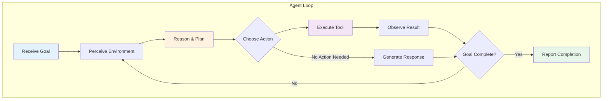
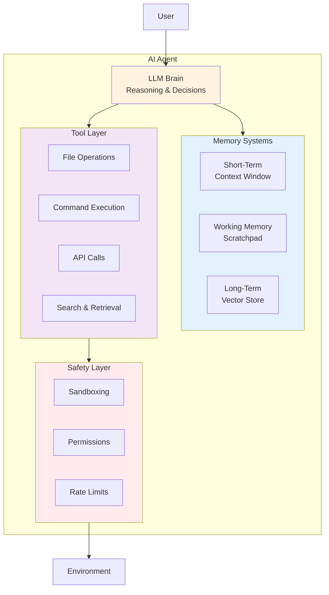
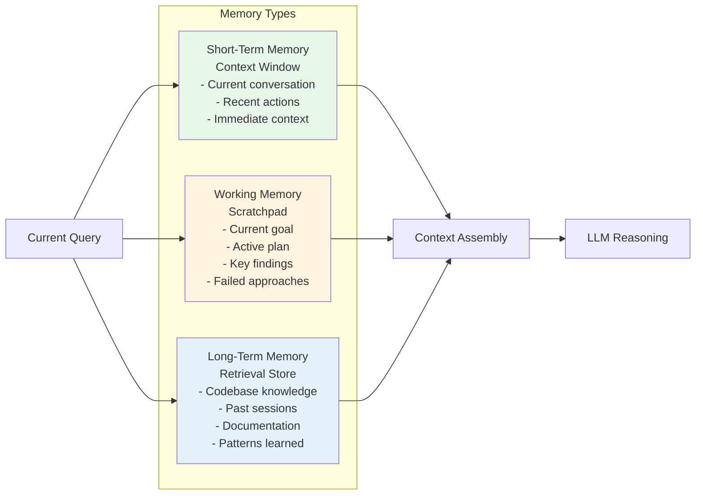
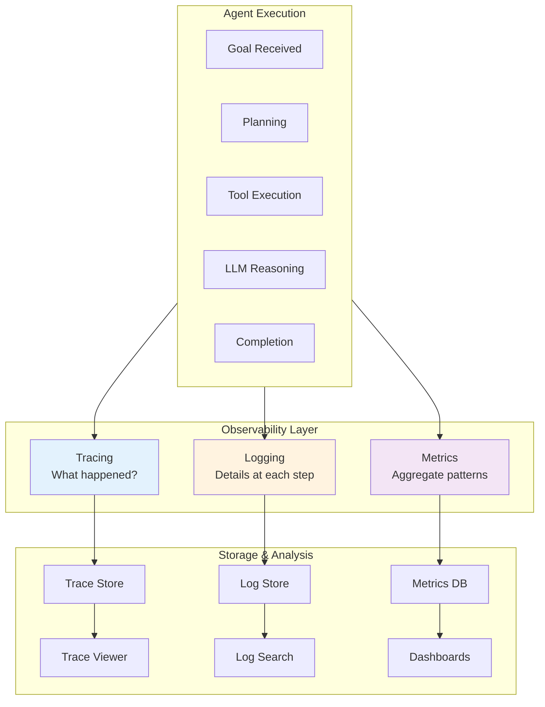
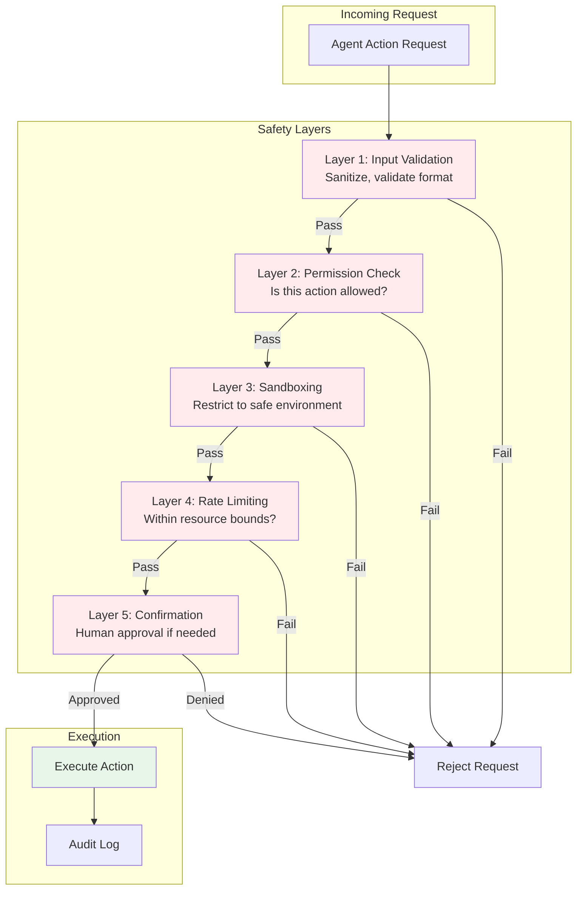

# Module 15: AI Agents - Concepts and Architecture

**Part 3: Safe Use & Agentic Workflows** | **Duration**: 1 hour 45 minutes | **Difficulty**: Advanced

---

## Learning Objectives

By the end of this module, you will be able to:

- Understand what makes an AI system "agentic" and how agents differ from chatbots
- Recognize and design the core components of agent architectures
- Grasp how agents plan, reason, and decompose complex tasks
- Understand memory systems that enable agents to maintain context and learn
- Implement observability practices for debugging and monitoring agents
- Apply safety principles specific to agentic systems
- Choose appropriate agent designs for real-world applications

---

## Section 1: What is an AI Agent? (15 minutes)

### Beyond Chatbots: The Agentic Spectrum

You've used chatbots. You ask a question, you get an answer. The conversation ends, or you ask another question. The AI is reactive---it responds to your prompts but doesn't take initiative.

An **AI agent** is fundamentally different. It pursues goals over time, makes decisions about what actions to take, observes the results, and adjusts its behavior accordingly. The shift from chatbot to agent is the shift from "answer my question" to "accomplish this task."

Consider the difference:

**Chatbot interaction:**

```
User: "How do I create a new Git branch?"
AI: "To create a new Git branch, use: git checkout -b branch-name"
```

**Agent interaction:**

```
User: "Review the codebase and create a PR that fixes the authentication bug"
Agent: [Reads code files] -> [Identifies bug] -> [Writes fix] -> [Runs tests] ->
       [Creates branch] -> [Commits changes] -> [Opens PR] -> [Reports completion]
```

The agent takes a high-level goal and autonomously executes multiple steps to achieve it. It decides what to do, does it, and handles problems along the way.

### The Agentic Spectrum

"Agentic" isn't binary---it's a spectrum of increasing autonomy:

| Level                            | Description                                          | Example                                           |
| -------------------------------- | ---------------------------------------------------- | ------------------------------------------------- |
| **Level 0: Chatbot**             | Single-turn Q&A, no persistence                      | Basic ChatGPT conversation                        |
| **Level 1: Conversational**      | Multi-turn with memory, but user-driven              | Claude with conversation history                  |
| **Level 2: Tool-Augmented**      | Can use tools when prompted                          | ChatGPT with code interpreter                     |
| **Level 3: Reactive Agent**      | Takes actions in response to events                  | Customer service bot that creates tickets         |
| **Level 4: Goal-Directed Agent** | Pursues objectives across multiple steps             | Coding agent that implements features             |
| **Level 5: Autonomous Agent**    | Sets sub-goals, self-corrects, long-horizon planning | Research agent that explores topics independently |

Most production systems today operate at levels 2-4. Fully autonomous agents (Level 5) remain experimental and require significant human oversight.

### What Makes a System "Agentic"?

An AI system becomes agentic when it exhibits these characteristics:

**1. Goal-Directed Behavior**
The system works toward objectives, not just responding to individual queries. It maintains intent across multiple interactions and actions.

**2. Environmental Interaction**
The system perceives its environment (reading files, observing states) and acts on it (writing code, calling APIs, modifying databases). It doesn't just generate text---it does things.

**3. Autonomy**
The system makes decisions about what to do next without explicit user instruction for each step. Given "fix this bug," it decides how to investigate, what to try, and when it's done.

**4. Feedback Loops**
The system observes the results of its actions and adjusts accordingly. If a test fails after a code change, it reads the error and tries a different approach.

**5. Persistence**
The system maintains state across actions. It remembers what it's tried, what worked, and what the current goal is.

### Why Agents Now?

The emergence of capable AI agents is driven by recent advances:

**Large Language Models as Reasoners:** Modern LLMs can break down complex problems, generate plans, and adapt to unexpected situations. This reasoning capability is the "brain" of an agent.

**Tool Use:** Models can reliably format function calls, interpret results, and decide what tool to use next. This bridges the gap between "thinking" and "doing."

**Extended Context Windows:** Agents need to track history, goals, observations, and plans simultaneously. Context windows of 100K+ tokens enable sophisticated agent behavior.

**Retrieval Systems:** Agents can access vast knowledge bases and codebases through retrieval-augmented generation, extending their capabilities beyond training data.

**Infrastructure Maturity:** Frameworks, APIs, and deployment patterns for agents have matured, making production deployment feasible.

### The Agent Opportunity

Agents unlock capabilities impossible for traditional software or simple chatbots:

- **Complex workflows**: Tasks requiring dozens of steps, with branching based on intermediate results
- **Adaptive behavior**: Handling novel situations not explicitly programmed
- **Integration**: Coordinating across multiple systems, APIs, and data sources
- **Continuous operation**: Monitoring, responding, and acting over extended periods

But agents also introduce new challenges: unpredictability, safety concerns, debugging complexity, and the need for robust human oversight. This module addresses all of these.

---

## Section 2: Core Agent Architecture (20 minutes)

### The Agent Loop

At its core, every agent follows a simple loop: **Perceive, Reason, Act**. This loop repeats until the goal is achieved, a termination condition is met, or resources are exhausted.

```
while not done:
    observation = perceive(environment)
    plan = reason(observation, goal, history)
    result = act(plan)
    history.append(observation, plan, result)
    done = check_completion(goal, result)
```

Let's examine each component:

**Perceive:** The agent gathers information about its environment. This might include reading files, calling APIs, checking system state, or processing user input. Perception produces observations that inform reasoning.

**Reason:** The agent's LLM "brain" processes observations, considers the goal, and decides what to do next. This is where planning, problem decomposition, and decision-making occur.

**Act:** The agent executes the decided action through tools---writing files, running commands, making API calls, sending messages. Actions change the environment.

**Update:** The agent records what happened for future reference. History enables learning from attempts and avoiding repeated failures.

**Evaluate:** The agent checks whether the goal is achieved. Evaluation might be explicit (run tests, check output) or implicit (has the task been completed?).

### The LLM as Agent Brain

The language model is the reasoning engine of an agent. It performs several critical functions:

**Intent Understanding:** Parsing high-level goals into actionable understanding. "Fix the authentication bug" requires understanding what authentication means in this context, what "fix" entails, and what success looks like.

**Planning:** Breaking complex goals into steps. A skilled LLM can generate a multi-step plan before executing, improving success rates on complex tasks.

**Tool Selection:** Choosing which tool to use for each step. The LLM must understand tool capabilities and match them to requirements.

**Result Interpretation:** Understanding the output of actions. Did the command succeed? What does the error message mean? Is more information needed?

**Error Recovery:** When things go wrong, deciding how to proceed. Try again? Try differently? Ask for help? Give up?

**Natural Language Interface:** Communicating with users in natural language, explaining what it's doing, and asking clarifying questions when needed.

### System Prompts for Agents

The system prompt defines the agent's identity, capabilities, and constraints. A well-designed agent system prompt includes:

**1. Identity and Role**

```
You are a senior software engineer AI assistant. Your task is to help users
accomplish coding tasks by reading, analyzing, and modifying code.
```

**2. Available Capabilities**

```
You have access to the following tools:
- read_file(path): Read the contents of a file
- write_file(path, content): Write content to a file
- run_command(cmd): Execute a shell command
- search_codebase(query): Search for code matching a query
```

**3. Behavioral Guidelines**

```
When working on tasks:
1. Always read and understand existing code before modifying it
2. Make minimal, targeted changes
3. Test your changes before declaring completion
4. Explain your reasoning before taking actions
```

**4. Constraints and Safety**

```
Never:
- Delete files without explicit user permission
- Execute commands that modify system configuration
- Expose sensitive information like API keys
- Make changes outside the project directory
```

**5. Output Format**

```
When you want to use a tool, respond with:
<tool_call>
<tool_name>tool_name_here</tool_name>
<parameters>{"param": "value"}</parameters>
</tool_call>
```

### Tool Integration Architecture

Tools are how agents interact with the world. A well-designed tool system has several layers:

**Tool Definition:** Each tool is defined with a name, description, parameters, and implementation.

```python
class Tool:
    name: str           # "read_file"
    description: str    # "Read the contents of a file at the given path"
    parameters: Schema  # {"path": {"type": "string", "required": True}}

    def execute(self, **params) -> ToolResult:
        # Implementation
        pass
```

**Tool Registry:** The agent maintains a registry of available tools, which is presented to the LLM for selection.

**Execution Layer:** When the LLM selects a tool, the execution layer validates parameters, runs the tool, handles errors, and formats results.

**Security Layer:** Tools are sandboxed with appropriate permissions. A file-reading tool might be restricted to certain directories. A command-execution tool might have a whitelist of allowed commands.

### Agent Loop Implementation

Here's a simplified but complete agent loop:

```python
class Agent:
    def __init__(self, llm, tools, system_prompt):
        self.llm = llm
        self.tools = {tool.name: tool for tool in tools}
        self.system_prompt = system_prompt
        self.history = []

    def run(self, user_goal, max_iterations=20):
        self.history.append({"role": "user", "content": user_goal})

        for iteration in range(max_iterations):
            # Reason: Ask LLM what to do
            response = self.llm.generate(
                system=self.system_prompt,
                messages=self.history,
                tools=list(self.tools.values())
            )

            # Check if LLM wants to use a tool
            if response.tool_call:
                tool_name = response.tool_call.name
                tool_params = response.tool_call.parameters

                # Act: Execute the tool
                tool = self.tools[tool_name]
                try:
                    result = tool.execute(**tool_params)
                    tool_output = f"Tool '{tool_name}' succeeded:\n{result}"
                except Exception as e:
                    tool_output = f"Tool '{tool_name}' failed:\n{str(e)}"

                # Update history
                self.history.append({
                    "role": "assistant",
                    "content": response.text,
                    "tool_call": response.tool_call
                })
                self.history.append({
                    "role": "tool",
                    "content": tool_output
                })
            else:
                # LLM responded without tool call - task may be complete
                self.history.append({
                    "role": "assistant",
                    "content": response.text
                })

                if self.is_task_complete(response.text):
                    return {"status": "complete", "result": response.text}

        return {"status": "max_iterations", "history": self.history}
```

This loop continues until the LLM indicates completion, an error occurs, or max iterations are reached.

---

## Section 3: Planning and Reasoning (20 minutes)

### Task Decomposition

Complex tasks require breaking down into manageable steps. Effective agents decompose tasks before executing:

**Top-Down Decomposition:** Start with the high-level goal and recursively break it into sub-goals.

```
Goal: "Implement user authentication for the API"

Decomposition:
1. Understand current API structure
   1.1. Read main app file
   1.2. Identify existing routes and middleware
   1.3. Find database models
2. Design authentication approach
   2.1. Decide between JWT and session-based
   2.2. Plan required endpoints
   2.3. Define user model changes
3. Implement authentication
   3.1. Create user model/schema
   3.2. Implement registration endpoint
   3.3. Implement login endpoint
   3.4. Add authentication middleware
4. Test implementation
   4.1. Write unit tests
   4.2. Run tests
   4.3. Fix any failures
5. Document changes
   5.1. Update API documentation
   5.2. Add usage examples
```

This decomposition happens in the reasoning phase before execution begins.

### Planning Strategies

Different planning strategies suit different situations:

**Upfront Planning:** Generate a complete plan before taking any action. Best for well-understood tasks with predictable steps.

```
User: "Refactor this function to use async/await"

Agent Plan:
1. Read the current function implementation
2. Identify all Promise-based calls
3. Rewrite function with async keyword
4. Convert .then() chains to await
5. Add error handling with try/catch
6. Test the refactored function
7. Report completion

[Begin execution]
```

**Reactive Planning:** Plan one step at a time based on current state. Best for exploratory tasks or when outcomes are unpredictable.

```
User: "Debug why the tests are failing"

Agent: Let me start by running the tests to see the failure.
[Runs tests, sees error]
Agent: The error indicates a database connection issue. Let me check the database config.
[Reads config]
Agent: The config looks correct. Let me check if the database is running.
[Checks database status]
...
```

**Hybrid Planning:** Generate a high-level plan upfront, but adapt during execution. This is often the most effective approach.

### Goal-Directed Behavior

Agents must maintain focus on the goal while handling intermediate details. This requires:

**Goal Tracking:** Explicitly tracking what the current goal is and how current actions relate to it.

```
Current Goal: Fix authentication bug
Current Sub-goal: Understand where authentication happens
Current Action: Reading auth.py to find token validation logic
```

**Progress Assessment:** Periodically evaluating whether actions are making progress toward the goal.

**Goal Refinement:** Updating understanding of the goal based on new information.

```
Initial understanding: "Fix the login bug"
After investigation: "The login bug is caused by incorrect password hashing comparison;
                     need to update the comparison to use constant-time comparison"
```

### Handling Errors and Failures

Agents inevitably encounter errors. Robust agents handle them gracefully:

**Error Classification:**

| Error Type           | Example           | Response                              |
| -------------------- | ----------------- | ------------------------------------- |
| **Transient**        | Network timeout   | Retry with backoff                    |
| **Input Error**      | Invalid file path | Ask for clarification                 |
| **Capability Limit** | Task too complex  | Decompose further or escalate         |
| **Resource Error**   | Out of memory     | Reduce scope or request resources     |
| **Logic Error**      | Wrong approach    | Backtrack and try different approach  |
| **Unrecoverable**    | Permission denied | Report and request human intervention |

**Recovery Strategies:**

```python
def handle_action_result(self, action, result):
    if result.success:
        return self.continue_with_plan()

    error_type = self.classify_error(result.error)

    if error_type == "transient":
        return self.retry_with_backoff(action)

    elif error_type == "input_error":
        return self.ask_clarification(result.error)

    elif error_type == "logic_error":
        self.mark_approach_failed(action)
        return self.try_alternative_approach()

    elif error_type == "unrecoverable":
        return self.escalate_to_human(action, result.error)
```

### Reasoning Traces

Making agent reasoning visible helps with debugging and building trust:

```
[THINKING] User wants to add a new API endpoint for user preferences.
[THINKING] First, I need to understand the existing API structure.
[ACTION] Reading src/routes/index.js to see how routes are organized
[OBSERVATION] Routes are organized by resource: /users, /posts, /comments
[THINKING] I should add preferences as a sub-route of users: /users/:id/preferences
[THINKING] I need to check if there's a preferences model already
[ACTION] Searching for "preferences" in the codebase
[OBSERVATION] No existing preferences model found
[THINKING] I'll need to create the model, route, and controller
[PLAN]
  1. Create preferences model
  2. Create preferences controller
  3. Add route to users routes
  4. Write tests
  5. Test the endpoint
[ACTION] Creating src/models/preferences.js
...
```

This trace shows the agent's thought process, making it easier to understand decisions and identify where things went wrong.

---

## Section 4: Memory Systems (20 minutes)

### Why Agents Need Memory

Without memory, every action would start from scratch. Agents need multiple types of memory to function effectively:

**Context Awareness:** What has happened in the current session?
**Task Progress:** What have we tried? What worked?
**Knowledge Accumulation:** What have we learned about this codebase?
**Persistent State:** What do we need to remember across sessions?

### Short-Term Memory: The Context Window

The most fundamental memory is the LLM's context window---the conversation history that influences each response.

**Components of Context:**

- System prompt (agent identity and instructions)
- User's original goal
- Actions taken and results
- Current observations
- Relevant retrieved information

**Context Management Challenges:**

Context windows are limited (even 100K tokens fill up). Agents must manage context carefully:

```python
class ContextManager:
    def __init__(self, max_tokens=100000):
        self.max_tokens = max_tokens
        self.system_prompt = ""  # Always included
        self.user_goal = ""       # Always included
        self.history = []         # Managed for recency
        self.summaries = []       # Compressed old context

    def add_to_history(self, entry):
        self.history.append(entry)
        self._manage_context_size()

    def _manage_context_size(self):
        current_size = self._estimate_tokens()

        while current_size > self.max_tokens * 0.8:  # Keep 20% buffer
            if len(self.history) > 10:
                # Summarize oldest entries
                old_entries = self.history[:5]
                summary = self._summarize(old_entries)
                self.summaries.append(summary)
                self.history = self.history[5:]
            else:
                # Compress summaries
                self._compress_summaries()

            current_size = self._estimate_tokens()
```

### Working Memory: The Scratchpad

Beyond conversation history, agents benefit from structured working memory---a "scratchpad" for tracking state:

```python
class WorkingMemory:
    def __init__(self):
        self.current_goal = None
        self.sub_goals = []
        self.current_plan = []
        self.completed_steps = []
        self.failed_approaches = []
        self.key_findings = {}
        self.open_questions = []

    def to_prompt_section(self):
        return f"""
## Current State
Goal: {self.current_goal}
Progress: {len(self.completed_steps)}/{len(self.current_plan)} steps complete

## Key Findings
{self._format_findings()}

## Failed Approaches (don't repeat these)
{self._format_failures()}

## Open Questions
{self._format_questions()}
"""
```

This structured state is injected into the prompt, helping the agent maintain focus and avoid repeating mistakes.

### Long-Term Memory: Retrieval Systems

For knowledge that exceeds context limits or persists across sessions, agents use retrieval systems:

**Vector Databases:** Store embeddings of documents, code, or past conversations. Query with semantic similarity.

```python
class LongTermMemory:
    def __init__(self, vector_store):
        self.vector_store = vector_store

    def store(self, content, metadata):
        embedding = self.embed(content)
        self.vector_store.add(embedding, content, metadata)

    def retrieve(self, query, top_k=5):
        query_embedding = self.embed(query)
        results = self.vector_store.search(query_embedding, top_k)
        return results

    def retrieve_for_context(self, current_goal, current_state):
        """Retrieve relevant memories for current situation."""
        queries = [
            current_goal,
            f"similar tasks: {current_goal}",
            f"errors in: {current_state.get('file', '')}",
        ]

        all_results = []
        for query in queries:
            results = self.retrieve(query)
            all_results.extend(results)

        # Deduplicate and rank
        return self._rank_and_dedupe(all_results)
```

**Use Cases for Long-Term Memory:**

| Memory Type            | Content                           | Example Use                        |
| ---------------------- | --------------------------------- | ---------------------------------- |
| **Codebase Knowledge** | File summaries, architecture docs | "Where is authentication handled?" |
| **Past Sessions**      | Previous goals and solutions      | "How did we fix this before?"      |
| **User Preferences**   | Coding style, preferred tools     | Consistent with user's patterns    |
| **Error Patterns**     | Common errors and fixes           | Recognize and fix known issues     |
| **Domain Knowledge**   | API docs, best practices          | Reference documentation            |

### Memory Architecture

A complete agent memory system combines all three types:

```
                    +-----------------------+
                    |      Agent Core       |
                    +-----------+-----------+
                                |
           +--------------------+--------------------+
           |                    |                    |
   +-------v-------+    +-------v-------+    +-------v-------+
   |  Short-Term   |    |   Working     |    |   Long-Term   |
   |    Memory     |    |    Memory     |    |    Memory     |
   | (Context      |    | (Scratchpad)  |    | (Vector DB)   |
   |  Window)      |    |               |    |               |
   +---------------+    +---------------+    +---------------+
   | - Messages    |    | - Goals       |    | - Codebase    |
   | - Tool calls  |    | - Plans       |    | - Past tasks  |
   | - Results     |    | - Findings    |    | - Docs        |
   +---------------+    +---------------+    +---------------+
```

### Context Construction

When the agent reasons, it constructs a context from all memory sources:

```python
def build_context(self):
    context_parts = []

    # 1. System prompt (always included)
    context_parts.append(self.system_prompt)

    # 2. Working memory state
    context_parts.append(self.working_memory.to_prompt_section())

    # 3. Retrieved long-term memories (relevant to current goal)
    relevant_memories = self.long_term_memory.retrieve_for_context(
        self.working_memory.current_goal,
        self.working_memory.to_dict()
    )
    if relevant_memories:
        context_parts.append(f"## Relevant Knowledge\n{relevant_memories}")

    # 4. Recent history (most recent actions and results)
    recent_history = self.context_manager.get_recent_history(max_tokens=50000)
    context_parts.append(f"## Recent History\n{recent_history}")

    # 5. Current observation (latest state)
    context_parts.append(f"## Current State\n{self.current_observation}")

    return "\n\n".join(context_parts)
```

### Memory Best Practices

**Structured Over Unstructured:** Store structured state (JSON, key-value) rather than raw conversation dumps. Easier to query and update.

**Selective Persistence:** Not everything needs long-term storage. Save successful patterns, important discoveries, and error resolutions.

**Recency Weighting:** Recent information is usually more relevant. Weight retrieval toward recent memories.

**Explicit Forgetting:** Sometimes agents need to forget (outdated information, incorrect assumptions). Build in mechanisms to deprecate old memories.

**Memory Boundaries:** Keep session memory separate from persistent memory. Allow users to reset session state without losing long-term learning.

---

## Section 5: Agent Observability (15 minutes)

### Why Observability Matters

Agents are complex systems with many failure modes. Without observability, debugging is guesswork:

- Why did the agent take 50 steps for a simple task?
- Where did it go wrong?
- What was it "thinking" when it made that decision?
- Why did it use that tool instead of another?

Observability answers these questions by making agent behavior transparent.

### The Three Pillars of Agent Observability

**1. Tracing: What happened and in what order?**

Traces capture the full execution path of an agent task:

```python
class AgentTracer:
    def __init__(self, trace_id=None):
        self.trace_id = trace_id or str(uuid4())
        self.spans = []

    def start_span(self, name, metadata=None):
        span = {
            "span_id": str(uuid4()),
            "trace_id": self.trace_id,
            "name": name,
            "start_time": time.time(),
            "metadata": metadata or {},
            "events": []
        }
        self.spans.append(span)
        return span

    def end_span(self, span, result=None, error=None):
        span["end_time"] = time.time()
        span["duration_ms"] = (span["end_time"] - span["start_time"]) * 1000
        span["result"] = result
        span["error"] = str(error) if error else None
```

A trace for a coding task might look like:

```
Trace: fix-auth-bug-2024-01-10-abc123
  |
  +-- [0ms] User Goal: "Fix the authentication bug"
  |
  +-- [50ms] Planning
  |     +-- Generated 5-step plan
  |
  +-- [200ms] Step 1: Read auth.py
  |     +-- Tool: read_file
  |     +-- Result: 245 lines read
  |
  +-- [800ms] Step 2: Analyze code
  |     +-- LLM reasoning (350 tokens)
  |     +-- Identified issue in line 87
  |
  +-- [1200ms] Step 3: Write fix
  |     +-- Tool: write_file
  |     +-- Modified 3 lines
  |
  +-- [3500ms] Step 4: Run tests
  |     +-- Tool: run_command
  |     +-- Tests passed (15/15)
  |
  +-- [3700ms] Completion
        +-- Task completed successfully
```

**2. Logging: What were the details?**

Logs capture detailed information at each step:

```python
class AgentLogger:
    def __init__(self, level="INFO"):
        self.level = level
        self.entries = []

    def log(self, level, message, **context):
        entry = {
            "timestamp": datetime.utcnow().isoformat(),
            "level": level,
            "message": message,
            **context
        }
        self.entries.append(entry)

    def debug(self, message, **ctx):
        self.log("DEBUG", message, **ctx)

    def info(self, message, **ctx):
        self.log("INFO", message, **ctx)

    def warning(self, message, **ctx):
        self.log("WARNING", message, **ctx)

    def error(self, message, **ctx):
        self.log("ERROR", message, **ctx)
```

Key events to log:

| Event             | Level         | Context to Include                                  |
| ----------------- | ------------- | --------------------------------------------------- |
| Goal received     | INFO          | goal, user_id                                       |
| Plan generated    | INFO          | plan_steps, estimated_complexity                    |
| Tool invoked      | DEBUG         | tool_name, parameters                               |
| Tool result       | DEBUG         | success, result_summary, duration                   |
| LLM reasoning     | DEBUG         | prompt_tokens, completion_tokens, reasoning_summary |
| Error encountered | WARNING/ERROR | error_type, error_message, recovery_action          |
| Goal completed    | INFO          | steps_taken, total_duration, success                |

**3. Metrics: What are the aggregate patterns?**

Metrics help you understand agent performance over time:

```python
class AgentMetrics:
    def __init__(self):
        self.metrics = defaultdict(list)

    def record(self, metric_name, value, tags=None):
        self.metrics[metric_name].append({
            "value": value,
            "timestamp": time.time(),
            "tags": tags or {}
        })

    # Key metrics to track
    def record_task_completion(self, success, duration_ms, steps):
        self.record("task.success", 1 if success else 0)
        self.record("task.duration_ms", duration_ms)
        self.record("task.steps", steps)

    def record_tool_usage(self, tool_name, success, duration_ms):
        self.record("tool.invocation", 1, {"tool": tool_name})
        self.record("tool.success", 1 if success else 0, {"tool": tool_name})
        self.record("tool.duration_ms", duration_ms, {"tool": tool_name})

    def record_llm_usage(self, prompt_tokens, completion_tokens, latency_ms):
        self.record("llm.prompt_tokens", prompt_tokens)
        self.record("llm.completion_tokens", completion_tokens)
        self.record("llm.latency_ms", latency_ms)
```

Key metrics to monitor:

| Metric                | What It Tells You                    |
| --------------------- | ------------------------------------ |
| Task success rate     | Is the agent achieving goals?        |
| Steps per task        | Is the agent efficient?              |
| Task duration         | How long do tasks take?              |
| Tool failure rate     | Are tools reliable?                  |
| LLM tokens per task   | Cost efficiency                      |
| Error recovery rate   | Can the agent recover from failures? |
| Human escalation rate | When does the agent need help?       |

### Debugging Agent Failures

When an agent fails, use observability data to diagnose:

**1. Start with the trace:** What was the execution path? Where did it diverge from expected?

**2. Check the logs:** What was happening at each step? What did the agent "see" and "decide"?

**3. Examine the prompts:** What context did the LLM have when it made the problematic decision? Was important information missing?

**4. Review tool results:** Did a tool fail silently or return unexpected data?

**5. Check metrics:** Is this a one-off failure or part of a pattern?

### Observability Infrastructure

For production agents, invest in proper infrastructure:

```
Agent Application
       |
       v
+----------------+     +-----------------+     +------------------+
|   Tracer SDK   | --> |   Trace Store   | --> |   Trace Viewer   |
+----------------+     +-----------------+     +------------------+
       |
       v
+----------------+     +-----------------+     +------------------+
|   Logger SDK   | --> |   Log Store     | --> |   Log Search     |
+----------------+     +-----------------+     +------------------+
       |
       v
+----------------+     +-----------------+     +------------------+
|  Metrics SDK   | --> |  Time Series DB | --> |   Dashboards     |
+----------------+     +-----------------+     +------------------+
```

**Tools and Services:**

- **Tracing:** OpenTelemetry, Jaeger, LangSmith, Weights & Biases
- **Logging:** ELK Stack, Datadog, Papertrail
- **Metrics:** Prometheus, Grafana, Datadog
- **Agent-Specific:** LangSmith (LangChain), Phoenix (Arize)

---

## Section 6: Safety in Agentic Systems (10 minutes)

### Amplified Risks

Everything that can go wrong with AI gets worse with agents. Agents act autonomously, at scale, and across systems. The risks are amplified:

| Risk                 | In Chatbot            | In Agent                               |
| -------------------- | --------------------- | -------------------------------------- |
| **Hallucination**    | Wrong answer          | Wrong action with real-world effects   |
| **Prompt Injection** | Changed response      | Hijacked agent takes malicious actions |
| **Data Leakage**     | Leaks in conversation | Leaks via file writes, API calls       |
| **Errors**           | Incorrect output      | Incorrect changes to systems           |
| **Infinite Loops**   | Stuck conversation    | Resource exhaustion, cost explosion    |

### Sandboxing Agent Actions

Never give agents unrestricted access. Sandbox all operations:

**File System Sandboxing:**

```python
class SandboxedFileSystem:
    def __init__(self, allowed_paths):
        self.allowed_paths = [os.path.abspath(p) for p in allowed_paths]

    def is_allowed(self, path):
        abs_path = os.path.abspath(path)
        return any(abs_path.startswith(allowed) for allowed in self.allowed_paths)

    def read(self, path):
        if not self.is_allowed(path):
            raise SecurityError(f"Access denied: {path}")
        return open(path).read()

    def write(self, path, content):
        if not self.is_allowed(path):
            raise SecurityError(f"Access denied: {path}")
        # Additional checks
        if self._is_system_file(path):
            raise SecurityError(f"Cannot modify system file: {path}")
        open(path, 'w').write(content)
```

**Command Execution Sandboxing:**

```python
class SandboxedExecutor:
    ALLOWED_COMMANDS = {'ls', 'cat', 'grep', 'find', 'git', 'npm', 'python'}
    BLOCKED_PATTERNS = ['rm -rf', 'sudo', '>', '>>', '|', ';', '&&', 'curl', 'wget']

    def execute(self, command):
        # Check if command is allowed
        cmd_parts = shlex.split(command)
        base_cmd = cmd_parts[0]

        if base_cmd not in self.ALLOWED_COMMANDS:
            raise SecurityError(f"Command not allowed: {base_cmd}")

        # Check for dangerous patterns
        for pattern in self.BLOCKED_PATTERNS:
            if pattern in command:
                raise SecurityError(f"Blocked pattern in command: {pattern}")

        # Execute in restricted subprocess
        return subprocess.run(
            cmd_parts,
            capture_output=True,
            timeout=30,
            cwd=self.sandbox_dir
        )
```

### Permission Systems

Implement fine-grained permissions for agent actions:

```python
class AgentPermissions:
    def __init__(self, permission_level="standard"):
        self.level = permission_level
        self.permissions = self._load_permissions(permission_level)

    def can(self, action, resource=None):
        if action not in self.permissions:
            return False

        perm = self.permissions[action]

        if perm == "always":
            return True
        elif perm == "never":
            return False
        elif perm == "with_confirmation":
            return self.request_confirmation(action, resource)
        elif callable(perm):
            return perm(resource)

        return False

    def _load_permissions(self, level):
        if level == "restricted":
            return {
                "read_file": "always",
                "write_file": "with_confirmation",
                "run_command": "never",
                "call_api": "never",
            }
        elif level == "standard":
            return {
                "read_file": "always",
                "write_file": "always",
                "run_command": lambda cmd: self._is_safe_command(cmd),
                "call_api": "with_confirmation",
            }
        elif level == "elevated":
            return {
                "read_file": "always",
                "write_file": "always",
                "run_command": "always",
                "call_api": "always",
            }
```

### Rate Limiting and Resource Controls

Prevent runaway agents:

```python
class AgentResourceLimits:
    def __init__(self):
        self.limits = {
            "max_iterations": 50,
            "max_tool_calls": 100,
            "max_tokens_per_task": 500000,
            "max_duration_seconds": 600,
            "max_file_writes": 20,
            "max_commands": 30,
        }
        self.usage = defaultdict(int)
        self.start_time = time.time()

    def check_and_increment(self, resource):
        self.usage[resource] += 1

        limit_key = f"max_{resource}"
        if limit_key in self.limits:
            if self.usage[resource] > self.limits[limit_key]:
                raise ResourceLimitExceeded(
                    f"{resource} limit exceeded: {self.usage[resource]}/{self.limits[limit_key]}"
                )

        # Also check duration
        elapsed = time.time() - self.start_time
        if elapsed > self.limits["max_duration_seconds"]:
            raise ResourceLimitExceeded(f"Time limit exceeded: {elapsed}s")
```

### Fail-Safes and Human Oversight

Build in multiple layers of protection:

**1. Confirmation for Destructive Actions:**

```python
DESTRUCTIVE_PATTERNS = ['delete', 'remove', 'drop', 'truncate', 'reset']

def requires_confirmation(action_description):
    return any(pattern in action_description.lower() for pattern in DESTRUCTIVE_PATTERNS)
```

**2. Automatic Rollback Capability:**

```python
class AgentWithRollback:
    def execute_with_rollback(self, action):
        # Create checkpoint before action
        checkpoint = self.create_checkpoint()

        try:
            result = self.execute_action(action)
            if self.verify_result(result):
                return result
            else:
                self.rollback(checkpoint)
                return {"status": "rolled_back", "reason": "verification_failed"}
        except Exception as e:
            self.rollback(checkpoint)
            raise
```

**3. Human-in-the-Loop for High-Stakes Actions:**

```python
HIGH_STAKES_ACTIONS = ['deploy', 'publish', 'send_email', 'modify_database', 'api_mutation']

def execute_action(self, action):
    if self.is_high_stakes(action):
        approval = self.request_human_approval(action)
        if not approval.granted:
            return {"status": "rejected", "reason": approval.reason}

    return self._execute(action)
```

### Security Principles for Agents

**Principle of Least Privilege:** Agents should have the minimum permissions necessary for their task.

**Defense in Depth:** Multiple layers of protection---sandboxing, permissions, rate limits, human oversight.

**Fail-Safe Defaults:** When in doubt, deny. Unknown actions should require explicit approval.

**Audit Everything:** Log all agent actions for post-hoc review.

**Graceful Degradation:** When limits are hit, degrade gracefully rather than failing catastrophically.

---

## Section 7: Agent Design Patterns (5 minutes)

### When to Use Agents

Agents add complexity. Use them when the benefits justify the costs:

**Good Fit for Agents:**

- Multi-step tasks with unpredictable paths
- Tasks requiring tool coordination
- Long-running processes needing adaptation
- Tasks where human effort is high and errors are recoverable

**Poor Fit for Agents:**

- Simple, deterministic workflows (use regular code)
- Tasks where every error is critical (use human oversight)
- High-frequency, low-latency requirements (agents are slow)
- Tasks with clear, fixed procedures (use automation)

### Simple vs. Complex Agent Designs

**Simple Agent:** Single LLM, linear tool usage, limited memory

```
User Goal --> LLM --> Tool --> LLM --> Tool --> Response
```

Best for: Well-defined tasks, lower latency, easier debugging

**Complex Agent:** Multiple specialized LLMs, hierarchical planning, sophisticated memory

```
User Goal --> Planner LLM --> Sub-Agent 1 --> Tools
                          --> Sub-Agent 2 --> Tools
                          --> Sub-Agent 3 --> Tools
          --> Synthesizer LLM --> Response
```

Best for: Complex, open-ended tasks requiring specialized capabilities

### Start Simple

For most applications, start with the simplest agent that could work:

**1. Single-Turn Tool Use:** LLM decides which tool to call based on user query
**2. Multi-Turn Tool Use:** LLM can call multiple tools in sequence
**3. Planning Agent:** LLM generates a plan before executing
**4. Reflective Agent:** LLM reviews its own output and refines
**5. Multi-Agent System:** Specialized agents collaborate

Move to more complex patterns only when simpler ones fail.

### Design Heuristics

**Explicit > Implicit:** Make goals, plans, and state explicit in prompts

**Observation > Assumption:** Have agents verify assumptions rather than assuming

**Incremental > Monolithic:** Prefer many small actions over few large ones

**Reversible > Irreversible:** Favor actions that can be undone

**Logged > Unlogged:** If it's not logged, it didn't happen (for debugging)

---

## Diagrams

### The Agent Loop



### Agent Architecture Components



### Memory System Architecture



### Observability Stack



### Safety Layers



---

## Knowledge Check

### Question 1

What is the fundamental difference between a chatbot and an AI agent?

- A) Agents use larger language models
- B) Agents pursue goals over multiple steps and take actions in their environment
- C) Agents have more training data
- D) Agents can process images and audio

**Correct Answer:** B

**Explanation:** The key distinction is agency itself. Chatbots respond to prompts reactively---they answer questions but don't take initiative or execute multi-step plans. Agents pursue goals over time, make decisions about what actions to take, observe results, and adapt their behavior. They interact with their environment (files, APIs, databases) to accomplish tasks, not just generate text responses.

### Question 2

Why do agents need multiple types of memory (short-term, working, long-term)?

- A) To make them more expensive to run
- B) Short-term memory handles immediate context, working memory tracks task state, and long-term memory provides persistent knowledge
- C) It's a marketing feature
- D) To slow down processing

**Correct Answer:** B

**Explanation:** Each memory type serves a distinct purpose. Short-term memory (the context window) holds the immediate conversation and recent actions. Working memory (the scratchpad) tracks structured task state---current goal, plan, findings, failed approaches. Long-term memory (retrieval systems) stores persistent knowledge that exceeds context limits---codebase understanding, past solutions, documentation. Together, they enable agents to maintain context, learn from attempts, and leverage accumulated knowledge.

### Question 3

What is the most critical safety principle for production agents?

- A) Use the largest possible model
- B) Give agents maximum permissions for flexibility
- C) Defense in depth: multiple layers of protection including sandboxing, permissions, rate limits, and human oversight
- D) Trust the LLM's judgment completely

**Correct Answer:** C

**Explanation:** Production agents require defense in depth. No single safety measure is sufficient. Sandboxing restricts what actions can affect. Permissions control what's allowed. Rate limits prevent runaway resource consumption. Human oversight catches what automated systems miss. Each layer catches failures that slip through others. The combination provides robust protection against the amplified risks that agents introduce.

### Question 4

When should you use a simple agent design vs. a complex multi-agent system?

- A) Always use complex systems for better results
- B) Start with the simplest design that could work; add complexity only when simpler approaches fail
- C) Complex systems are always faster
- D) Simple agents can't use tools

**Correct Answer:** B

**Explanation:** Complexity has costs: harder debugging, higher latency, more failure modes, greater resource usage. Simple agents (single LLM, linear tool use) are easier to understand, debug, and maintain. Start simple: can a basic tool-using LLM accomplish the task? Only add planning, reflection, or multi-agent coordination when simpler approaches demonstrably fail. Many production use cases work well with surprisingly simple agent designs.

---

## Hands-On Exercise: Build a Simple Agent

### Objective

Build a minimal but functional coding agent that can read files, make changes, and run tests. This exercise demonstrates the core agent loop, tool integration, and basic observability.

### Time Required

60-75 minutes

### Prerequisites

- Python 3.8+
- Access to an LLM API (Claude, OpenAI, or local model)
- A simple test project to work with

### Part 1: Define Tools (15 minutes)

Create the tools your agent will use:

```python
# tools.py
import os
import subprocess
from dataclasses import dataclass
from typing import Optional

@dataclass
class ToolResult:
    success: bool
    output: str
    error: Optional[str] = None

class Tool:
    name: str
    description: str

    def execute(self, **params) -> ToolResult:
        raise NotImplementedError

class ReadFileTool(Tool):
    name = "read_file"
    description = "Read the contents of a file. Parameters: path (string)"

    def __init__(self, allowed_dir: str):
        self.allowed_dir = os.path.abspath(allowed_dir)

    def execute(self, path: str) -> ToolResult:
        abs_path = os.path.abspath(path)

        # Security check
        if not abs_path.startswith(self.allowed_dir):
            return ToolResult(
                success=False,
                output="",
                error=f"Access denied: {path} is outside allowed directory"
            )

        try:
            with open(abs_path, 'r') as f:
                content = f.read()
            return ToolResult(success=True, output=content)
        except Exception as e:
            return ToolResult(success=False, output="", error=str(e))

class WriteFileTool(Tool):
    name = "write_file"
    description = "Write content to a file. Parameters: path (string), content (string)"

    def __init__(self, allowed_dir: str):
        self.allowed_dir = os.path.abspath(allowed_dir)

    def execute(self, path: str, content: str) -> ToolResult:
        abs_path = os.path.abspath(path)

        if not abs_path.startswith(self.allowed_dir):
            return ToolResult(
                success=False,
                output="",
                error=f"Access denied: {path} is outside allowed directory"
            )

        try:
            with open(abs_path, 'w') as f:
                f.write(content)
            return ToolResult(success=True, output=f"Successfully wrote to {path}")
        except Exception as e:
            return ToolResult(success=False, output="", error=str(e))

class RunCommandTool(Tool):
    name = "run_command"
    description = "Run a shell command. Parameters: command (string)"

    ALLOWED_COMMANDS = {'ls', 'cat', 'grep', 'python', 'pytest', 'npm', 'git'}

    def __init__(self, working_dir: str):
        self.working_dir = working_dir

    def execute(self, command: str) -> ToolResult:
        # Security: check if base command is allowed
        base_cmd = command.split()[0] if command else ""
        if base_cmd not in self.ALLOWED_COMMANDS:
            return ToolResult(
                success=False,
                output="",
                error=f"Command not allowed: {base_cmd}"
            )

        try:
            result = subprocess.run(
                command,
                shell=True,
                capture_output=True,
                text=True,
                timeout=30,
                cwd=self.working_dir
            )

            output = result.stdout
            if result.stderr:
                output += f"\nSTDERR:\n{result.stderr}"

            return ToolResult(
                success=result.returncode == 0,
                output=output,
                error=None if result.returncode == 0 else f"Exit code: {result.returncode}"
            )
        except subprocess.TimeoutExpired:
            return ToolResult(success=False, output="", error="Command timed out")
        except Exception as e:
            return ToolResult(success=False, output="", error=str(e))
```

### Part 2: Build the Agent Core (20 minutes)

Implement the agent loop:

```python
# agent.py
import json
import re
from typing import List, Dict, Any

class SimpleAgent:
    def __init__(self, llm_client, tools: List[Tool], system_prompt: str):
        self.llm = llm_client
        self.tools = {tool.name: tool for tool in tools}
        self.system_prompt = system_prompt
        self.history = []
        self.trace = []

    def _log(self, event_type: str, data: Dict[str, Any]):
        """Log an event for observability."""
        entry = {"type": event_type, "data": data}
        self.trace.append(entry)
        print(f"[{event_type}] {json.dumps(data, indent=2)[:200]}")

    def _build_tools_description(self) -> str:
        """Build description of available tools for the prompt."""
        lines = ["Available tools:"]
        for name, tool in self.tools.items():
            lines.append(f"- {name}: {tool.description}")
        return "\n".join(lines)

    def _parse_tool_call(self, response: str) -> tuple:
        """Parse tool call from LLM response."""
        # Look for tool call in format: <tool>name</tool><params>{"key": "value"}</params>
        tool_match = re.search(r'<tool>(\w+)</tool>', response)
        params_match = re.search(r'<params>({.*?})</params>', response, re.DOTALL)

        if tool_match and params_match:
            try:
                params = json.loads(params_match.group(1))
                return tool_match.group(1), params
            except json.JSONDecodeError:
                return None, None
        return None, None

    def run(self, user_goal: str, max_iterations: int = 20) -> Dict[str, Any]:
        """Run the agent loop until goal is complete or max iterations reached."""

        self._log("goal_received", {"goal": user_goal})

        # Build initial prompt
        messages = [
            {"role": "system", "content": self.system_prompt + "\n\n" + self._build_tools_description()},
            {"role": "user", "content": f"Goal: {user_goal}\n\nBegin working on this goal. Use tools as needed. When complete, respond with TASK_COMPLETE."}
        ]
        self.history = messages.copy()

        for iteration in range(max_iterations):
            self._log("iteration_start", {"iteration": iteration})

            # Get LLM response
            response = self.llm.generate(messages)
            self._log("llm_response", {"response": response[:500]})

            # Check for completion
            if "TASK_COMPLETE" in response:
                self._log("task_complete", {"iterations": iteration + 1})
                return {
                    "status": "complete",
                    "iterations": iteration + 1,
                    "final_response": response,
                    "trace": self.trace
                }

            # Parse tool call
            tool_name, params = self._parse_tool_call(response)

            if tool_name and tool_name in self.tools:
                self._log("tool_call", {"tool": tool_name, "params": params})

                # Execute tool
                tool = self.tools[tool_name]
                result = tool.execute(**params)

                self._log("tool_result", {
                    "tool": tool_name,
                    "success": result.success,
                    "output_preview": result.output[:200] if result.output else "",
                    "error": result.error
                })

                # Add to conversation
                messages.append({"role": "assistant", "content": response})

                tool_response = f"Tool '{tool_name}' result:\n"
                if result.success:
                    tool_response += result.output
                else:
                    tool_response += f"ERROR: {result.error}\n{result.output}"

                messages.append({"role": "user", "content": tool_response})
            else:
                # LLM responded without tool call - add response and continue
                messages.append({"role": "assistant", "content": response})
                messages.append({"role": "user", "content": "Continue working on the goal or respond with TASK_COMPLETE if finished."})

        self._log("max_iterations", {"iterations": max_iterations})
        return {
            "status": "max_iterations_reached",
            "iterations": max_iterations,
            "trace": self.trace
        }
```

### Part 3: Create System Prompt (10 minutes)

Design your agent's identity and instructions:

```python
CODING_AGENT_PROMPT = """You are a skilled software engineer assistant. Your job is to help users accomplish coding tasks by reading, understanding, and modifying code.

## How to Work

1. Start by understanding the task and the relevant code
2. Read files to understand the current implementation
3. Make changes incrementally - small, targeted modifications
4. Test your changes when possible
5. Report what you did when complete

## Using Tools

When you need to use a tool, format your response like this:
<tool>tool_name</tool>
<params>{"param1": "value1", "param2": "value2"}</params>

Then wait for the result before continuing.

## Rules

- Always read code before modifying it
- Make minimal changes - don't rewrite entire files
- Explain your reasoning before taking actions
- If you're unsure, read more code rather than guessing
- When done, summarize what you did and say TASK_COMPLETE

## Example Interaction

User: Fix the bug in calculate.py where division by zero occurs
```
