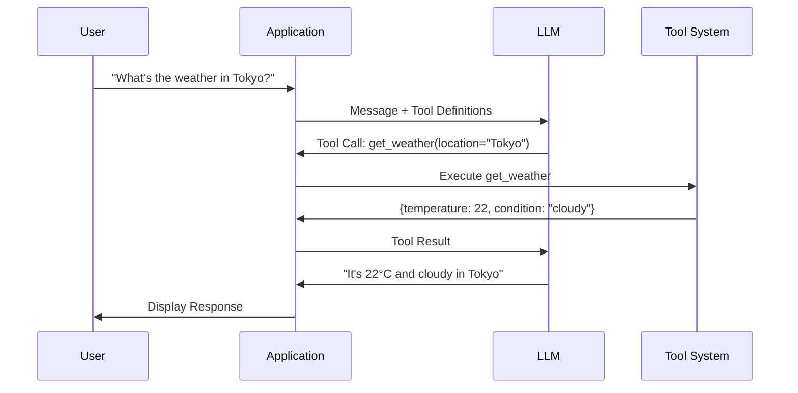
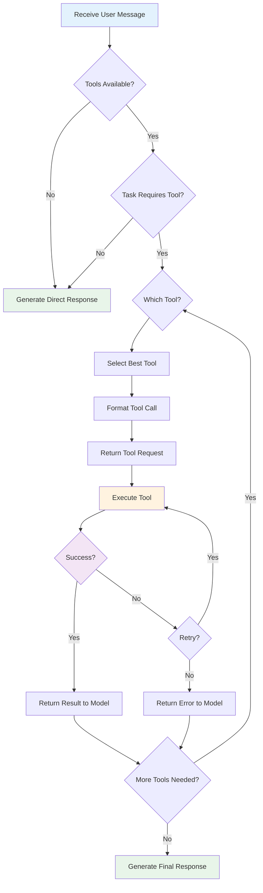
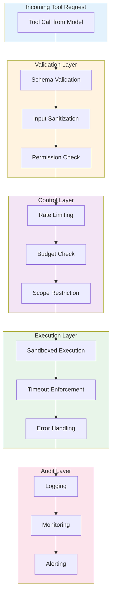
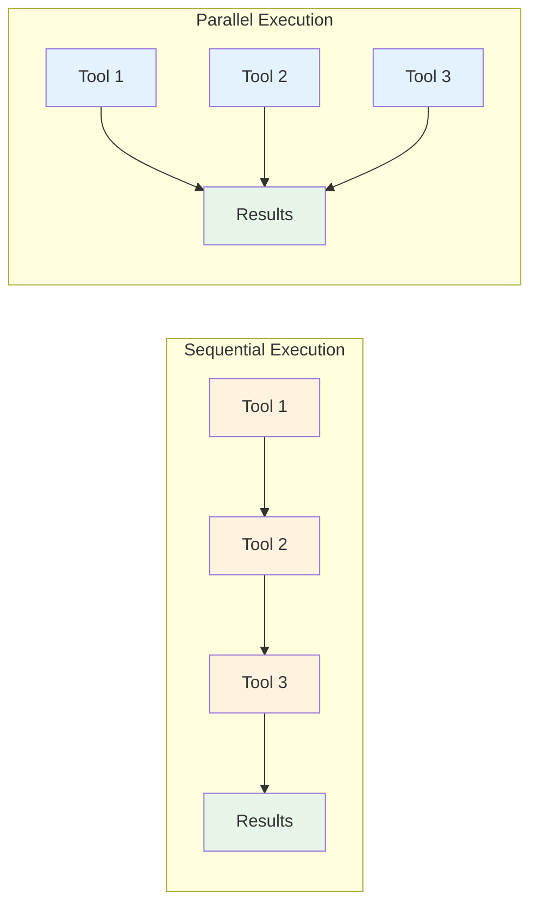

# Module 16: Tool Use and Function Calling

**Part 3: Safe Use & Agentic Workflows** | **Duration**: 1 hour 30 minutes | **Difficulty**: Intermediate-Advanced

---

## Learning Objectives

By the end of this module, you will be able to:

- Understand how LLMs interact with external tools and why this matters
- Master function calling API patterns across major providers
- Design effective tool schemas with clear descriptions and appropriate constraints
- Handle tool execution errors gracefully with retries and fallbacks
- Implement both sequential and parallel tool execution patterns
- Apply production considerations: security, rate limiting, and cost management

---

## Section 1: Why Tools Matter (10 minutes)

### The Limitation Problem

Language models are powerful but fundamentally constrained. They:

- **Cannot access real-time information**: Training data has a cutoff date. They don't know today's weather, stock prices, or latest news.
- **Cannot perform precise calculations**: Despite appearing to do math, they're pattern-matching, not calculating. Complex arithmetic fails.
- **Cannot interact with systems**: They can describe how to send an email but cannot actually send one.
- **Cannot verify facts**: They generate plausible-sounding content without access to ground truth.

These aren't bugs to be fixed with more training. They're fundamental to what a language model is: a system that predicts text based on patterns in training data.

### Tools as Capability Extensions

Tools solve this by giving LLMs the ability to take actions in the world:

```
Without tools:
User: "What's the weather in Tokyo?"
LLM: "I don't have access to current weather data, but typical weather in Tokyo..."

With tools:
User: "What's the weather in Tokyo?"
LLM: [Calls weather_api("Tokyo")]
Tool: {"temperature": 22, "condition": "partly cloudy", "humidity": 65}
LLM: "It's currently 22°C and partly cloudy in Tokyo with 65% humidity."
```

The model doesn't magically know the weather. It recognizes that a tool can provide this information, formats a proper request, receives the result, and incorporates it into its response.

### The Tool Use Mental Model

Think of tool use as giving an LLM hands to interact with the world:

**Without tools**: The LLM is a brain in a jar. Incredibly capable at processing and generating language, but isolated from external reality.

**With tools**: The LLM gains the ability to:

- Read from external sources (search engines, databases, APIs)
- Write to external systems (send emails, create tickets, update records)
- Execute computations (calculators, code interpreters, data analysis)
- Control other systems (home automation, robots, software)

This transforms LLMs from passive text generators into active agents that can accomplish tasks.

### Common Tool Categories

Tools typically fall into these categories:

**Information Retrieval**:

- Web search
- Database queries
- Document retrieval
- API calls to external services

**Computation**:

- Calculators
- Code execution
- Data analysis
- Mathematical proofs

**System Interaction**:

- File operations
- Email/messaging
- Calendar management
- CRM updates

**External Actions**:

- E-commerce (ordering, inventory)
- Payments
- IoT control
- Robotics

Each category has different risk profiles and execution patterns. A search is relatively safe; a payment requires careful validation.

### Why This Matters for Developers

Understanding tool use is essential because:

1. **It's how modern AI applications work**: ChatGPT plugins, Claude's computer use, GitHub Copilot's workspace features—all rely on tool use.

2. **You'll build tool-using systems**: Any AI feature that interacts with your systems needs well-designed tools.

3. **Security depends on it**: Poorly designed tools create attack vectors. Understanding the patterns helps you build safely.

4. **Cost and latency are affected**: Each tool call has overhead. Design choices directly impact user experience and bills.

---

## Section 2: Function Calling Mechanics (20 minutes)

### The Function Calling Protocol

Function calling (also called tool use) is a structured protocol where:

1. You define available tools with their schemas
2. The model decides when to call tools and with what arguments
3. You execute the tool and return results
4. The model incorporates results into its response

This is not prompt engineering. It's a distinct API feature with structured inputs and outputs.

### Tool Definition Anatomy

A tool definition includes:

```json
{
  "name": "get_weather",
  "description": "Get current weather for a location. Use this when the user asks about weather conditions, temperature, or forecasts.",
  "parameters": {
    "type": "object",
    "properties": {
      "location": {
        "type": "string",
        "description": "City name or coordinates (e.g., 'Tokyo' or '35.6762,139.6503')"
      },
      "units": {
        "type": "string",
        "enum": ["celsius", "fahrenheit"],
        "description": "Temperature units for the response"
      }
    },
    "required": ["location"]
  }
}
```

**Key components**:

- **name**: Unique identifier the model uses to call the tool
- **description**: Critical for the model to understand when to use the tool
- **parameters**: JSON Schema defining expected arguments
- **required**: Which parameters must be provided

### OpenAI Function Calling Pattern

OpenAI's approach (used by GPT-4):

```python
import openai

# Define tools
tools = [
    {
        "type": "function",
        "function": {
            "name": "get_weather",
            "description": "Get current weather for a location",
            "parameters": {
                "type": "object",
                "properties": {
                    "location": {"type": "string", "description": "City name"},
                    "units": {"type": "string", "enum": ["celsius", "fahrenheit"]}
                },
                "required": ["location"]
            }
        }
    }
]

# Initial request
response = openai.chat.completions.create(
    model="gpt-4",
    messages=[{"role": "user", "content": "What's the weather in Paris?"}],
    tools=tools,
    tool_choice="auto"  # or "none" or {"type": "function", "function": {"name": "..."}}
)

# Check if model wants to call a tool
message = response.choices[0].message

if message.tool_calls:
    for tool_call in message.tool_calls:
        # Extract function details
        function_name = tool_call.function.name
        arguments = json.loads(tool_call.function.arguments)

        # Execute the function (your implementation)
        result = execute_function(function_name, arguments)

        # Continue conversation with tool result
        messages.append(message)  # Include assistant's tool call
        messages.append({
            "role": "tool",
            "tool_call_id": tool_call.id,
            "content": json.dumps(result)
        })

    # Get final response
    final_response = openai.chat.completions.create(
        model="gpt-4",
        messages=messages,
        tools=tools
    )
```

### Anthropic Tool Use Pattern

Anthropic's approach (used by Claude):

```python
import anthropic

client = anthropic.Anthropic()

# Define tools
tools = [
    {
        "name": "get_weather",
        "description": "Get current weather for a location",
        "input_schema": {
            "type": "object",
            "properties": {
                "location": {"type": "string", "description": "City name"},
                "units": {"type": "string", "enum": ["celsius", "fahrenheit"]}
            },
            "required": ["location"]
        }
    }
]

# Initial request
response = client.messages.create(
    model="claude-sonnet-4-20250514",
    max_tokens=1024,
    tools=tools,
    messages=[{"role": "user", "content": "What's the weather in Paris?"}]
)

# Check for tool use
if response.stop_reason == "tool_use":
    # Find tool use blocks in response
    for block in response.content:
        if block.type == "tool_use":
            tool_name = block.name
            tool_input = block.input
            tool_use_id = block.id

            # Execute the function
            result = execute_function(tool_name, tool_input)

            # Continue with tool result
            messages.append({"role": "assistant", "content": response.content})
            messages.append({
                "role": "user",
                "content": [{
                    "type": "tool_result",
                    "tool_use_id": tool_use_id,
                    "content": json.dumps(result)
                }]
            })

    # Get final response
    final_response = client.messages.create(
        model="claude-sonnet-4-20250514",
        max_tokens=1024,
        tools=tools,
        messages=messages
    )
```

### The Tool Execution Loop

Both patterns follow the same logical flow:

```
1. User sends message
2. Model receives message + tool definitions
3. Model decides: respond directly OR call tool(s)
4. If tool call:
   a. Model outputs structured tool call request
   b. Your code executes the tool
   c. You send tool result back to model
   d. Goto step 3 (model may call more tools or respond)
5. Model generates final response
```

This loop can continue multiple times. A complex query might require several tool calls before the model can respond.

### Tool Choice Control

You can control tool usage:

**Auto** (default): Model decides whether to use tools

```python
tool_choice="auto"  # OpenAI
# No tool_choice parameter needed for Anthropic (auto is default)
```

**Required**: Model must use at least one tool

```python
tool_choice="required"  # OpenAI
tool_choice={"type": "any"}  # Anthropic
```

**Specific tool**: Model must use a particular tool

```python
tool_choice={"type": "function", "function": {"name": "get_weather"}}  # OpenAI
tool_choice={"type": "tool", "name": "get_weather"}  # Anthropic
```

**None**: Disable tools for this request

```python
tool_choice="none"  # OpenAI
tool_choice={"type": "none"}  # Anthropic (or simply don't pass tools)
```

### Parallel vs Sequential Tool Calls

Models can request multiple tools simultaneously:

```json
{
  "tool_calls": [
    {
      "id": "call_1",
      "function": {
        "name": "get_weather",
        "arguments": "{\"location\": \"Paris\"}"
      }
    },
    {
      "id": "call_2",
      "function": {
        "name": "get_weather",
        "arguments": "{\"location\": \"London\"}"
      }
    },
    {
      "id": "call_3",
      "function": {
        "name": "get_exchange_rate",
        "arguments": "{\"from\": \"EUR\", \"to\": \"GBP\"}"
      }
    }
  ]
}
```

When you receive multiple tool calls:

1. **Execute in parallel** when tools are independent (weather for different cities)
2. **Execute sequentially** when there are dependencies
3. **Return all results** before continuing the conversation

```python
import asyncio

async def handle_parallel_tools(tool_calls):
    tasks = []
    for tool_call in tool_calls:
        task = asyncio.create_task(
            execute_tool_async(tool_call.function.name, tool_call.function.arguments)
        )
        tasks.append((tool_call.id, task))

    results = []
    for tool_id, task in tasks:
        result = await task
        results.append({
            "role": "tool",
            "tool_call_id": tool_id,
            "content": json.dumps(result)
        })

    return results
```

---

## Section 3: Tool Design Principles (20 minutes)

### The Description Is Everything

The model decides which tool to use based primarily on descriptions. Poor descriptions lead to wrong tool choices or no tool use at all.

**Bad description**:

```json
{
  "name": "search",
  "description": "Search function"
}
```

**Good description**:

```json
{
  "name": "web_search",
  "description": "Search the web for current information. Use this when the user asks about recent events, needs up-to-date facts, or asks questions about topics that may have changed since your knowledge cutoff. Returns a list of relevant web pages with titles, URLs, and snippets."
}
```

**Elements of a good description**:

1. **What it does**: Clear, specific action
2. **When to use it**: Conditions that trigger usage
3. **What it returns**: Shape of the response
4. **What it doesn't do**: Clarify boundaries to prevent misuse

### Atomic Actions

Each tool should do one thing well. Avoid "god tools" that do everything.

**Bad design** (too broad):

```json
{
  "name": "database",
  "description": "Perform database operations",
  "parameters": {
    "operation": {"enum": ["read", "write", "delete", "update", "query", "create_table", ...]},
    "table": {"type": "string"},
    "data": {"type": "object"}
  }
}
```

**Good design** (atomic):

```json
[
  {
    "name": "get_user",
    "description": "Retrieve a user by ID",
    "parameters": {
      "user_id": {
        "type": "string",
        "description": "The unique user identifier"
      }
    }
  },
  {
    "name": "update_user_email",
    "description": "Update a user's email address",
    "parameters": {
      "user_id": { "type": "string" },
      "new_email": { "type": "string", "format": "email" }
    }
  },
  {
    "name": "list_users",
    "description": "List users with optional filtering",
    "parameters": {
      "status": { "enum": ["active", "inactive", "all"] },
      "limit": { "type": "integer", "maximum": 100 }
    }
  }
]
```

Atomic tools are:

- Easier for the model to understand
- Safer (limited blast radius)
- Easier to test
- More composable

### Parameter Design

Parameters should be:

**Clearly named**: Use descriptive names, not abbreviations

```json
// Bad
"params": {"q": "string", "n": "integer"}

// Good
"params": {"search_query": "string", "max_results": "integer"}
```

**Well constrained**: Use JSON Schema features

```json
{
  "amount": {
    "type": "number",
    "minimum": 0,
    "maximum": 10000,
    "description": "Transfer amount in USD (max $10,000)"
  },
  "priority": {
    "type": "string",
    "enum": ["low", "medium", "high", "critical"],
    "description": "Issue priority level"
  },
  "email": {
    "type": "string",
    "format": "email",
    "description": "Valid email address"
  }
}
```

**Appropriately required**: Only require what's truly necessary

```json
{
  "required": ["user_id"], // Must have this
  "properties": {
    "user_id": { "type": "string" },
    "include_metadata": { "type": "boolean", "default": false }, // Optional with default
    "fields": { "type": "array", "items": { "type": "string" } } // Optional, no default
  }
}
```

### Error Handling in Schema Design

Design tools to return structured errors:

```json
{
  "name": "transfer_funds",
  "description": "Transfer funds between accounts. Returns success status or error details.",
  "parameters": {
    "from_account": { "type": "string" },
    "to_account": { "type": "string" },
    "amount": { "type": "number", "minimum": 0.01 }
  }
}
```

**Response schema** (documented but not enforced by the model):

```json
// Success
{"status": "success", "transaction_id": "txn_123", "new_balance": 450.00}

// Error
{"status": "error", "error_code": "INSUFFICIENT_FUNDS", "message": "Account balance too low", "available": 100.00}
```

The model can then communicate errors appropriately to users.

### Composable Tool Sets

Design tools that work together:

```python
tools = [
    {
        "name": "search_products",
        "description": "Search for products by name or category. Returns product IDs and basic info."
    },
    {
        "name": "get_product_details",
        "description": "Get detailed information about a specific product including price, availability, and reviews."
    },
    {
        "name": "add_to_cart",
        "description": "Add a product to the user's shopping cart."
    },
    {
        "name": "get_cart",
        "description": "View current cart contents and totals."
    },
    {
        "name": "checkout",
        "description": "Process checkout for current cart. Requires user confirmation."
    }
]
```

This enables workflows:

1. User: "Find me a good laptop under $1000"
2. Model calls: `search_products(category="laptops", max_price=1000)`
3. Model calls: `get_product_details(product_id="...")` for top results
4. Model presents options
5. User: "Add the second one to my cart"
6. Model calls: `add_to_cart(product_id="...")`

### Documentation Pattern

Create comprehensive tool documentation:

```python
TOOL_DOCUMENTATION = {
    "get_weather": {
        "description": "Get current weather for a location",
        "when_to_use": [
            "User asks about current weather",
            "User asks about temperature",
            "User planning outdoor activities"
        ],
        "when_not_to_use": [
            "Historical weather questions",
            "Climate/long-term trends",
            "Weather explanations (how rain forms, etc.)"
        ],
        "parameters": {
            "location": "City name, address, or coordinates. Be specific for accuracy.",
            "units": "User's preferred unit system. Default to celsius for international users."
        },
        "response_format": {
            "temperature": "Current temperature in requested units",
            "condition": "Weather condition (sunny, cloudy, rain, etc.)",
            "humidity": "Relative humidity percentage",
            "wind_speed": "Wind speed in km/h or mph"
        },
        "common_errors": {
            "LOCATION_NOT_FOUND": "The location string couldn't be resolved. Try being more specific.",
            "SERVICE_UNAVAILABLE": "Weather service is temporarily down. Apologize and try later."
        }
    }
}
```

This documentation helps you:

- Train developers on tool behavior
- Debug unexpected tool usage
- Build better descriptions
- Handle errors consistently

---

## Section 4: Execution Patterns (20 minutes)

### The Execution Loop

A robust tool execution loop handles multiple scenarios:

```python
import json
from typing import List, Dict, Any

def execute_tool_loop(
    client,
    initial_messages: List[Dict],
    tools: List[Dict],
    max_iterations: int = 10
) -> Dict:
    """Execute tool calls in a loop until completion or limit."""

    messages = initial_messages.copy()
    iteration = 0

    while iteration < max_iterations:
        iteration += 1

        # Call the model
        response = client.messages.create(
            model="claude-sonnet-4-20250514",
            max_tokens=4096,
            tools=tools,
            messages=messages
        )

        # Check if we're done
        if response.stop_reason == "end_turn":
            return {
                "status": "complete",
                "response": response,
                "iterations": iteration
            }

        # Handle tool use
        if response.stop_reason == "tool_use":
            # Add assistant's response
            messages.append({
                "role": "assistant",
                "content": response.content
            })

            # Process each tool call
            tool_results = []
            for block in response.content:
                if block.type == "tool_use":
                    result = execute_single_tool(block.name, block.input)
                    tool_results.append({
                        "type": "tool_result",
                        "tool_use_id": block.id,
                        "content": json.dumps(result)
                    })

            # Add tool results
            messages.append({
                "role": "user",
                "content": tool_results
            })
        else:
            # Unexpected stop reason
            return {
                "status": "unexpected_stop",
                "stop_reason": response.stop_reason,
                "response": response,
                "iterations": iteration
            }

    return {
        "status": "max_iterations",
        "iterations": iteration,
        "messages": messages
    }
```

### Error Handling Strategies

Tool execution can fail in many ways. Handle each appropriately:

```python
import traceback
from enum import Enum

class ToolErrorType(Enum):
    VALIDATION = "validation"      # Bad input
    EXECUTION = "execution"        # Tool failed
    TIMEOUT = "timeout"            # Too slow
    PERMISSION = "permission"      # Not allowed
    NOT_FOUND = "not_found"        # Resource missing
    RATE_LIMIT = "rate_limit"      # Too many requests

def execute_single_tool(tool_name: str, tool_input: Dict) -> Dict:
    """Execute a tool with comprehensive error handling."""

    try:
        # Validate input
        validation_error = validate_tool_input(tool_name, tool_input)
        if validation_error:
            return {
                "error": True,
                "error_type": ToolErrorType.VALIDATION.value,
                "message": validation_error,
                "suggestion": "Please check the input format and try again."
            }

        # Check permissions
        if not check_tool_permission(tool_name, tool_input):
            return {
                "error": True,
                "error_type": ToolErrorType.PERMISSION.value,
                "message": "This operation is not permitted.",
                "suggestion": "Contact an administrator if you believe this is an error."
            }

        # Execute with timeout
        result = execute_with_timeout(
            tool_name,
            tool_input,
            timeout_seconds=30
        )

        return {"success": True, "data": result}

    except TimeoutError:
        return {
            "error": True,
            "error_type": ToolErrorType.TIMEOUT.value,
            "message": f"Tool {tool_name} timed out after 30 seconds.",
            "suggestion": "The service may be slow. Try again or simplify the request."
        }

    except ResourceNotFoundError as e:
        return {
            "error": True,
            "error_type": ToolErrorType.NOT_FOUND.value,
            "message": str(e),
            "suggestion": "Verify the resource exists and the ID is correct."
        }

    except RateLimitError as e:
        return {
            "error": True,
            "error_type": ToolErrorType.RATE_LIMIT.value,
            "message": "Rate limit exceeded.",
            "retry_after": e.retry_after,
            "suggestion": f"Wait {e.retry_after} seconds before retrying."
        }

    except Exception as e:
        # Log the full error for debugging
        log_error(tool_name, tool_input, traceback.format_exc())

        return {
            "error": True,
            "error_type": ToolErrorType.EXECUTION.value,
            "message": "An unexpected error occurred.",
            "suggestion": "Please try again. If the problem persists, contact support."
        }
```

### Retry Patterns

Implement intelligent retries for transient failures:

```python
import asyncio
from typing import Callable, Any

async def retry_with_backoff(
    operation: Callable,
    max_attempts: int = 3,
    base_delay: float = 1.0,
    max_delay: float = 30.0,
    exponential_base: float = 2.0,
    retryable_errors: tuple = (TimeoutError, ConnectionError, RateLimitError)
) -> Any:
    """Retry an operation with exponential backoff."""

    last_error = None

    for attempt in range(max_attempts):
        try:
            return await operation()
        except retryable_errors as e:
            last_error = e

            if attempt == max_attempts - 1:
                raise

            # Calculate delay with jitter
            delay = min(
                base_delay * (exponential_base ** attempt),
                max_delay
            )
            delay *= (0.5 + random.random())  # Add jitter

            # Special handling for rate limits with retry-after
            if isinstance(e, RateLimitError) and e.retry_after:
                delay = max(delay, e.retry_after)

            await asyncio.sleep(delay)

    raise last_error

# Usage
async def execute_tool_with_retry(tool_name, tool_input):
    async def operation():
        return await execute_tool_async(tool_name, tool_input)

    return await retry_with_backoff(operation)
```

### Parallel Execution

When the model requests multiple independent tools, execute in parallel:

```python
import asyncio
from concurrent.futures import ThreadPoolExecutor

async def execute_tools_parallel(
    tool_calls: List[Dict],
    max_concurrent: int = 5
) -> List[Dict]:
    """Execute multiple tool calls in parallel with concurrency limit."""

    semaphore = asyncio.Semaphore(max_concurrent)

    async def execute_with_limit(tool_call):
        async with semaphore:
            result = await execute_tool_async(
                tool_call["name"],
                tool_call["input"]
            )
            return {
                "tool_use_id": tool_call["id"],
                "result": result
            }

    tasks = [execute_with_limit(tc) for tc in tool_calls]
    results = await asyncio.gather(*tasks, return_exceptions=True)

    # Process results, handling any exceptions
    processed = []
    for i, result in enumerate(results):
        if isinstance(result, Exception):
            processed.append({
                "tool_use_id": tool_calls[i]["id"],
                "result": {
                    "error": True,
                    "message": str(result)
                }
            })
        else:
            processed.append(result)

    return processed
```

### Result Formatting

Format tool results for optimal model consumption:

```python
def format_tool_result(raw_result: Any, tool_name: str) -> str:
    """Format tool results for the model."""

    # Handle errors
    if isinstance(raw_result, dict) and raw_result.get("error"):
        return json.dumps({
            "status": "error",
            "error_type": raw_result.get("error_type", "unknown"),
            "message": raw_result.get("message", "Unknown error"),
            "suggestion": raw_result.get("suggestion")
        })

    # Handle empty results
    if raw_result is None or raw_result == [] or raw_result == {}:
        return json.dumps({
            "status": "success",
            "message": "No results found",
            "data": None
        })

    # Handle large results - summarize or paginate
    result_str = json.dumps(raw_result)
    if len(result_str) > 10000:
        # Truncate with notice
        truncated = truncate_result(raw_result)
        return json.dumps({
            "status": "success",
            "data": truncated,
            "note": "Results truncated. Request specific items for more detail."
        })

    # Normal case
    return json.dumps({
        "status": "success",
        "data": raw_result
    })
```

### State Management

For multi-turn conversations with tools, manage state carefully:

```python
class ToolSession:
    """Manage state across a tool-using conversation."""

    def __init__(self, session_id: str):
        self.session_id = session_id
        self.messages = []
        self.tool_calls = []  # History of all tool calls
        self.context = {}      # Accumulated context
        self.created_at = datetime.now()
        self.last_activity = datetime.now()

    def add_tool_call(self, tool_name: str, tool_input: Dict, result: Dict):
        """Record a tool call for history and context."""
        self.tool_calls.append({
            "timestamp": datetime.now().isoformat(),
            "tool": tool_name,
            "input": tool_input,
            "result": result
        })

        # Update context based on tool results
        self.update_context(tool_name, result)
        self.last_activity = datetime.now()

    def update_context(self, tool_name: str, result: Dict):
        """Extract and store relevant context from tool results."""
        if tool_name == "get_user" and result.get("success"):
            self.context["current_user"] = result["data"]
        elif tool_name == "search_products":
            self.context["last_search_results"] = result.get("data", [])

    def get_context_summary(self) -> str:
        """Provide context summary for the model."""
        summary = []
        if self.context.get("current_user"):
            summary.append(f"Current user: {self.context['current_user']['name']}")
        if self.context.get("last_search_results"):
            count = len(self.context["last_search_results"])
            summary.append(f"Last search returned {count} results")
        return "\n".join(summary) if summary else "No prior context"
```

---

## Section 5: Production Considerations (15 minutes)

### Security Fundamentals

Tool use introduces security risks that don't exist in pure text generation:

**1. Input Validation**

Never trust model-generated input:

```python
def execute_shell_command(command: str) -> str:
    # DANGEROUS - model could inject malicious commands
    return subprocess.run(command, shell=True, capture_output=True)

def execute_shell_command_safe(command: str, allowed_commands: List[str]) -> str:
    # Parse and validate the command
    parts = shlex.split(command)
    if not parts:
        raise ValueError("Empty command")

    base_command = parts[0]
    if base_command not in allowed_commands:
        raise ValueError(f"Command '{base_command}' not in allowed list")

    # Use list form to prevent shell injection
    return subprocess.run(parts, shell=False, capture_output=True)
```

**2. Scope Limitation**

Limit what tools can access:

```python
class ScopedDatabaseTool:
    def __init__(self, user_id: str, allowed_tables: List[str]):
        self.user_id = user_id
        self.allowed_tables = allowed_tables

    def query(self, table: str, filters: Dict) -> List[Dict]:
        # Verify table access
        if table not in self.allowed_tables:
            raise PermissionError(f"Access to table '{table}' not permitted")

        # Always filter by user
        filters["user_id"] = self.user_id

        # Use parameterized queries
        return self.db.query(table, filters)
```

**3. Action Confirmation**

Require confirmation for destructive actions:

```python
DESTRUCTIVE_TOOLS = {"delete_user", "send_email", "transfer_funds", "cancel_order"}

def execute_tool(tool_name: str, tool_input: Dict, session: ToolSession) -> Dict:
    if tool_name in DESTRUCTIVE_TOOLS:
        if not session.pending_confirmation:
            # Don't execute - request confirmation
            session.pending_confirmation = {
                "tool": tool_name,
                "input": tool_input,
                "requested_at": datetime.now()
            }
            return {
                "status": "confirmation_required",
                "message": f"Please confirm: {describe_action(tool_name, tool_input)}",
                "confirmation_token": generate_token()
            }
        else:
            # Verify confirmation matches pending action
            if not verify_confirmation(session.pending_confirmation, tool_name, tool_input):
                raise SecurityError("Confirmation does not match pending action")
            session.pending_confirmation = None

    return execute_tool_internal(tool_name, tool_input)
```

### Rate Limiting

Protect your systems from excessive tool use:

```python
from collections import defaultdict
import time

class ToolRateLimiter:
    def __init__(self):
        self.calls = defaultdict(list)
        self.limits = {
            "default": {"calls": 100, "period": 60},     # 100 calls per minute
            "web_search": {"calls": 30, "period": 60},   # 30 searches per minute
            "send_email": {"calls": 10, "period": 3600}, # 10 emails per hour
            "database_query": {"calls": 200, "period": 60}
        }

    def check_limit(self, tool_name: str, user_id: str) -> bool:
        key = f"{user_id}:{tool_name}"
        limit = self.limits.get(tool_name, self.limits["default"])

        now = time.time()
        cutoff = now - limit["period"]

        # Clean old entries
        self.calls[key] = [t for t in self.calls[key] if t > cutoff]

        # Check limit
        if len(self.calls[key]) >= limit["calls"]:
            return False

        # Record this call
        self.calls[key].append(now)
        return True

    def get_reset_time(self, tool_name: str, user_id: str) -> int:
        key = f"{user_id}:{tool_name}"
        if not self.calls[key]:
            return 0

        limit = self.limits.get(tool_name, self.limits["default"])
        oldest_call = min(self.calls[key])
        return int(oldest_call + limit["period"] - time.time())
```

### Cost Management

Tool use can significantly increase costs through:

1. Additional API calls (each tool use round-trip)
2. Token usage (tool definitions, results)
3. External service costs (API calls, compute)

```python
class CostTracker:
    def __init__(self):
        self.costs = defaultdict(float)
        self.budgets = {
            "openai_tokens": 1000000,  # 1M tokens per day
            "web_search": 1000,         # 1000 searches per day
            "email_sends": 100          # 100 emails per day
        }

    def record_cost(self, category: str, amount: float):
        today = datetime.now().date().isoformat()
        key = f"{today}:{category}"
        self.costs[key] += amount

    def check_budget(self, category: str) -> bool:
        today = datetime.now().date().isoformat()
        key = f"{today}:{category}"
        budget = self.budgets.get(category, float("inf"))
        return self.costs[key] < budget

    def get_usage_report(self) -> Dict:
        today = datetime.now().date().isoformat()
        return {
            category: {
                "used": self.costs.get(f"{today}:{category}", 0),
                "budget": budget,
                "remaining": budget - self.costs.get(f"{today}:{category}", 0)
            }
            for category, budget in self.budgets.items()
        }
```

Strategies to reduce costs:

1. **Cache tool results**: Many queries return the same data
2. **Batch operations**: Combine multiple similar tool calls
3. **Limit tool definitions**: Only include relevant tools
4. **Set token budgets**: Limit response sizes

### Monitoring and Observability

Track tool usage for debugging and optimization:

```python
import logging
from dataclasses import dataclass
from typing import Optional
import json

@dataclass
class ToolEvent:
    timestamp: datetime
    session_id: str
    tool_name: str
    tool_input: Dict
    result: Optional[Dict]
    duration_ms: float
    error: Optional[str]

    def to_log_entry(self) -> str:
        return json.dumps({
            "timestamp": self.timestamp.isoformat(),
            "session_id": self.session_id,
            "tool": self.tool_name,
            "input_size": len(json.dumps(self.tool_input)),
            "result_size": len(json.dumps(self.result)) if self.result else 0,
            "duration_ms": self.duration_ms,
            "error": self.error
        })

class ToolMonitor:
    def __init__(self, logger: logging.Logger):
        self.logger = logger
        self.metrics = defaultdict(list)

    def record(self, event: ToolEvent):
        # Log for debugging
        self.logger.info(event.to_log_entry())

        # Aggregate metrics
        self.metrics[event.tool_name].append({
            "duration": event.duration_ms,
            "success": event.error is None,
            "timestamp": event.timestamp
        })

    def get_tool_stats(self, tool_name: str) -> Dict:
        events = self.metrics[tool_name]
        if not events:
            return {"calls": 0}

        durations = [e["duration"] for e in events]
        successes = sum(1 for e in events if e["success"])

        return {
            "calls": len(events),
            "success_rate": successes / len(events),
            "avg_duration_ms": sum(durations) / len(durations),
            "p95_duration_ms": sorted(durations)[int(len(durations) * 0.95)],
            "max_duration_ms": max(durations)
        }
```

### Graceful Degradation

Handle tool failures without breaking the user experience:

```python
class ToolExecutor:
    def __init__(self, fallback_responses: Dict[str, str]):
        self.fallback_responses = fallback_responses

    async def execute_with_fallback(
        self,
        tool_name: str,
        tool_input: Dict
    ) -> Dict:
        try:
            result = await self.execute(tool_name, tool_input)
            return {"success": True, "data": result}

        except ToolUnavailableError:
            fallback = self.fallback_responses.get(tool_name)
            if fallback:
                return {
                    "success": False,
                    "fallback": True,
                    "message": fallback
                }
            raise

        except Exception as e:
            # Log error, return graceful failure
            return {
                "success": False,
                "error": str(e),
                "message": "This action couldn't be completed. Please try again later."
            }

# Fallback messages
FALLBACKS = {
    "get_weather": "I'm unable to fetch current weather data. Check weather.com for updates.",
    "web_search": "Web search is temporarily unavailable. I'll answer based on my training data.",
    "get_stock_price": "Stock data is unavailable. Check your brokerage app for current prices."
}
```

---

## Section 6: Building Your Toolkit (5 minutes)

### Common Tool Patterns

Build a library of reusable tool patterns:

**Search Pattern**:

```python
{
    "name": "search_{domain}",
    "description": "Search {domain} for {query_type}. Returns paginated results.",
    "parameters": {
        "query": {"type": "string", "description": "Search terms"},
        "filters": {"type": "object", "description": "Optional filters"},
        "page": {"type": "integer", "minimum": 1, "default": 1},
        "limit": {"type": "integer", "minimum": 1, "maximum": 50, "default": 10}
    }
}
```

**CRUD Pattern**:

```python
{
    "name": "{action}_{resource}",
    "description": "{Action} a {resource} {details}",
    "parameters": {
        "id": {"type": "string", "description": "{Resource} identifier"},
        "data": {"type": "object", "description": "{Resource} data"}
    }
}
```

**Confirmation Pattern**:

```python
{
    "name": "confirm_{action}",
    "description": "Confirm a pending {action}. Must be called after {action} to complete it.",
    "parameters": {
        "confirmation_token": {"type": "string"},
        "confirmed": {"type": "boolean"}
    }
}
```

### Tool Composition

Combine tools for complex workflows:

```python
# Define atomic tools
tools = [
    # Data gathering
    {"name": "get_customer", ...},
    {"name": "get_orders", ...},
    {"name": "get_products", ...},

    # Analysis
    {"name": "calculate_metrics", ...},
    {"name": "generate_report", ...},

    # Actions
    {"name": "send_notification", ...},
    {"name": "create_ticket", ...}
]

# The model can now compose:
# 1. get_customer(id="...")
# 2. get_orders(customer_id="...", last_n=10)
# 3. calculate_metrics(orders=[...])
# 4. generate_report(customer=..., metrics=...)
# 5. send_notification(to=..., report=...)
```

### Starting Your Toolkit

Begin with high-value, low-risk tools:

**Phase 1: Read-Only**

- Search and retrieval tools
- Data lookups
- Calculations

**Phase 2: Controlled Write**

- Create operations with validation
- Updates with confirmation
- Append-only operations

**Phase 3: Full CRUD**

- Delete operations with safeguards
- Bulk operations with limits
- External integrations

Each phase should include monitoring, rate limiting, and cost controls before moving to the next.

---

## Diagrams

### Tool Execution Flow



### Tool Decision Tree



### Security Layers



### Parallel vs Sequential Execution



---

## Knowledge Check

### Question 1

What is the primary purpose of the tool description field in a tool definition?

- A) To document the tool for developers
- B) To help the model decide when to use the tool and how to call it correctly
- C) To validate the tool's response format
- D) To set rate limits on tool usage

**Correct Answer**: B

**Explanation**: The description is critical for the model's decision-making. It reads the description to understand when the tool should be used, what it does, and how to format requests. A poor description leads to the model using wrong tools or failing to use tools when appropriate. While descriptions also serve as documentation, their primary function is guiding model behavior.

### Question 2

When a model requests multiple tool calls simultaneously, what is the recommended approach?

- A) Execute them one at a time in order received
- B) Reject multiple tool calls and ask for one at a time
- C) Execute independent tools in parallel, dependent tools sequentially
- D) Always execute all tools in parallel regardless of dependencies

**Correct Answer**: C

**Explanation**: Independent tool calls (like getting weather for different cities) should be parallelized for efficiency. However, if tools have dependencies (tool B needs output from tool A), they must be executed sequentially. Blindly parallelizing everything can cause failures when dependencies exist; blindly serializing everything wastes time. Understanding the dependency graph is key.

### Question 3

Which security practice is MOST important for tools that can modify data?

- A) Rate limiting
- B) Logging all calls
- C) Input validation and scope restriction
- D) Caching responses

**Correct Answer**: C

**Explanation**: While all options are valuable, input validation and scope restriction are most critical for write operations. A model might generate malicious or malformed input (whether through prompt injection or errors). Validating inputs and restricting tools to operate only within appropriate scope prevents data corruption, unauthorized access, and security breaches. Rate limiting and logging are important but don't prevent bad data from being written.

### Question 4

What should a tool return when it encounters an error?

- A) An empty response
- B) A structured error object with type, message, and suggested action
- C) The exception stack trace
- D) A boolean false

**Correct Answer**: B

**Explanation**: The model needs actionable information to respond appropriately to users. A structured error with type (what went wrong), message (human-readable explanation), and suggestion (what to do next) enables the model to communicate effectively. Empty responses confuse the model; stack traces are too technical and may leak sensitive info; booleans provide no context for recovery.

---

## Hands-On Exercise: Build a Tool-Using Agent

### Objective

Build a simple agent that uses tools to answer questions about weather and perform calculations, implementing proper error handling and the full tool execution loop.

### Time Required

45-60 minutes

### Prerequisites

- Python 3.8+
- API access to Claude or OpenAI
- Basic understanding of async Python

### Part 1: Define Your Tools (10 minutes)

Create tool definitions for a weather service and calculator:

```python
# tools.py

TOOLS = [
    {
        "name": "get_weather",
        "description": """Get current weather conditions for a city.
        Use this when the user asks about weather, temperature, or conditions in a specific location.
        Returns temperature in Celsius, weather condition, and humidity.""",
        "input_schema": {
            "type": "object",
            "properties": {
                "city": {
                    "type": "string",
                    "description": "City name (e.g., 'London', 'Tokyo', 'New York')"
                }
            },
            "required": ["city"]
        }
    },
    {
        "name": "calculate",
        "description": """Perform mathematical calculations.
        Use this for any arithmetic: addition, subtraction, multiplication, division, percentages, etc.
        Supports standard mathematical expressions.""",
        "input_schema": {
            "type": "object",
            "properties": {
                "expression": {
                    "type": "string",
                    "description": "Mathematical expression to evaluate (e.g., '15 * 4 + 10', '100 / 5')"
                }
            },
            "required": ["expression"]
        }
    },
    {
        "name": "convert_temperature",
        "description": """Convert temperature between Celsius and Fahrenheit.
        Use this when the user asks for temperature in different units.""",
        "input_schema": {
            "type": "object",
            "properties": {
                "value": {
                    "type": "number",
                    "description": "Temperature value to convert"
                },
                "from_unit": {
                    "type": "string",
                    "enum": ["celsius", "fahrenheit"],
                    "description": "Current unit of the temperature"
                },
                "to_unit": {
                    "type": "string",
                    "enum": ["celsius", "fahrenheit"],
                    "description": "Target unit for conversion"
                }
            },
            "required": ["value", "from_unit", "to_unit"]
        }
    }
]
```

### Part 2: Implement Tool Execution (15 minutes)

Create mock implementations of each tool:

```python
# tool_executor.py
import json
import random
from typing import Dict, Any

# Mock weather data
WEATHER_DATA = {
    "london": {"temp": 12, "condition": "rainy", "humidity": 85},
    "tokyo": {"temp": 22, "condition": "sunny", "humidity": 60},
    "new york": {"temp": 18, "condition": "cloudy", "humidity": 70},
    "paris": {"temp": 15, "condition": "partly cloudy", "humidity": 65},
    "sydney": {"temp": 25, "condition": "sunny", "humidity": 55}
}

def execute_tool(tool_name: str, tool_input: Dict[str, Any]) -> Dict[str, Any]:
    """Execute a tool and return the result."""

    if tool_name == "get_weather":
        return get_weather(tool_input)
    elif tool_name == "calculate":
        return calculate(tool_input)
    elif tool_name == "convert_temperature":
        return convert_temperature(tool_input)
    else:
        return {"error": True, "message": f"Unknown tool: {tool_name}"}

def get_weather(params: Dict) -> Dict:
    """Mock weather API."""
    city = params.get("city", "").lower().strip()

    if not city:
        return {"error": True, "message": "City name is required"}

    # Check if we have data for this city
    if city in WEATHER_DATA:
        data = WEATHER_DATA[city]
        return {
            "city": city.title(),
            "temperature_celsius": data["temp"],
            "condition": data["condition"],
            "humidity_percent": data["humidity"]
        }
    else:
        # Simulate unknown city
        return {
            "error": True,
            "message": f"Weather data not available for '{city}'",
            "suggestion": "Try a major city like London, Tokyo, New York, Paris, or Sydney"
        }

def calculate(params: Dict) -> Dict:
    """Safe calculator - evaluates mathematical expressions."""
    expression = params.get("expression", "")

    if not expression:
        return {"error": True, "message": "Expression is required"}

    # Very basic safety check - only allow numbers and math operators
    allowed_chars = set("0123456789+-*/.() ")
    if not all(c in allowed_chars for c in expression):
        return {
            "error": True,
            "message": "Invalid characters in expression",
            "suggestion": "Use only numbers and operators: + - * / ( )"
        }

    try:
        # Use eval with restricted builtins (still not production-safe!)
        result = eval(expression, {"__builtins__": {}}, {})
        return {
            "expression": expression,
            "result": result
        }
    except ZeroDivisionError:
        return {"error": True, "message": "Division by zero"}
    except Exception as e:
        return {"error": True, "message": f"Calculation error: {str(e)}"}

def convert_temperature(params: Dict) -> Dict:
    """Convert between Celsius and Fahrenheit."""
    value = params.get("value")
    from_unit = params.get("from_unit", "").lower()
    to_unit = params.get("to_unit", "").lower()

    if value is None:
        return {"error": True, "message": "Temperature value is required"}

    if from_unit == to_unit:
        return {"original": value, "converted": value, "unit": to_unit}

    if from_unit == "celsius" and to_unit == "fahrenheit":
        converted = (value * 9/5) + 32
    elif from_unit == "fahrenheit" and to_unit == "celsius":
        converted = (value - 32) * 5/9
    else:
        return {"error": True, "message": "Invalid unit combination"}

    return {
        "original": value,
        "original_unit": from_unit,
        "converted": round(converted, 1),
        "converted_unit": to_unit
    }
```

### Part 3: Build the Agent Loop (15 minutes)

Implement the main agent that handles the conversation:

```python
# agent.py
import anthropic
import json
from tools import TOOLS
from tool_executor import execute_tool

def run_agent(user_message: str, max_iterations: int = 5):
    """Run an agent that can use tools to answer questions."""

    client = anthropic.Anthropic()

    messages = [{"role": "user", "content": user_message}]

    print(f"\nUser: {user_message}")
    print("-" * 50)

    for iteration in range(max_iterations):
        # Call the model
        response = client.messages.create(
            model="claude-sonnet-4-20250514",
            max_tokens=1024,
            tools=TOOLS,
            messages=messages
        )

        # Process the response
        print(f"\n[Iteration {iteration + 1}]")

        # Check if we're done (no more tool calls)
        if response.stop_reason == "end_turn":
            # Extract final text response
            for block in response.content:
                if hasattr(block, 'text'):
                    print(f"\nAssistant: {block.text}")
            return response

        # Handle tool use
        if response.stop_reason == "tool_use":
            # Add assistant's response to messages
            messages.append({
                "role": "assistant",
                "content": response.content
            })

            # Process each tool call
            tool_results = []

            for block in response.content:
                if block.type == "tool_use":
                    tool_name = block.name
                    tool_input = block.input
                    tool_id = block.id

                    print(f"  Calling tool: {tool_name}")
                    print(f"  Input: {json.dumps(tool_input, indent=2)}")

                    # Execute the tool
                    result = execute_tool(tool_name, tool_input)

                    print(f"  Result: {json.dumps(result, indent=2)}")

                    tool_results.append({
                        "type": "tool_result",
                        "tool_use_id": tool_id,
                        "content": json.dumps(result)
                    })

            # Add tool results to messages
            messages.append({
                "role": "user",
                "content": tool_results
            })

    print("\nMax iterations reached")
    return None

# Test the agent
if __name__ == "__main__":
    # Test cases
    test_queries = [
        "What's the weather like in Tokyo?",
        "What's 15% of 250?",
        "What's the temperature in London in Fahrenheit?",
        "Compare the weather in Paris and Sydney"
    ]

    for query in test_queries:
        print("\n" + "=" * 60)
        run_agent(query)
```

### Part 4: Add Error Handling (10 minutes)

Enhance your agent with proper error handling:

```python
# agent_enhanced.py
import anthropic
import json
import time
from typing import Optional, Dict, Any
from tools import TOOLS
from tool_executor import execute_tool

class ToolError(Exception):
    """Custom exception for tool execution errors."""
    pass

def execute_tool_safe(
    tool_name: str,
    tool_input: Dict[str, Any],
    max_retries: int = 2
) -> Dict[str, Any]:
    """Execute a tool with retry logic."""

    last_error = None

    for attempt in range(max_retries + 1):
        try:
            result = execute_tool(tool_name, tool_input)

            # Check if the tool returned an error
            if result.get("error"):
                # Don't retry validation errors
                if "Invalid" in result.get("message", ""):
                    return result

                # Retry other errors
                if attempt < max_retries:
                    time.sleep(0.5 * (attempt + 1))  # Backoff
                    continue

            return result

        except Exception as e:
            last_error = e
            if attempt < max_retries:
                time.sleep(0.5 * (attempt + 1))
                continue

    return {
        "error": True,
        "message": f"Tool failed after {max_retries + 1} attempts: {str(last_error)}"
    }

def run_agent_enhanced(
    user_message: str,
    max_iterations: int = 5,
    verbose: bool = True
) -> Optional[str]:
    """Enhanced agent with error handling."""

    client = anthropic.Anthropic()
    messages = [{"role": "user", "content": user_message}]

    if verbose:
        print(f"\nUser: {user_message}")
        print("-" * 50)

    for iteration in range(max_iterations):
        try:
            response = client.messages.create(
                model="claude-sonnet-4-20250514",
                max_tokens=1024,
                tools=TOOLS,
                messages=messages
            )
        except anthropic.APIError as e:
            print(f"API Error: {e}")
            return None

        if verbose:
            print(f"\n[Iteration {iteration + 1}] Stop reason: {response.stop_reason}")

        # Extract any text content
        text_content = ""
        for block in response.content:
            if hasattr(block, 'text'):
                text_content += block.text

        if response.stop_reason == "end_turn":
            if verbose and text_content:
                print(f"\nAssistant: {text_content}")
            return text_content

        if response.stop_reason == "tool_use":
            messages.append({
                "role": "assistant",
                "content": response.content
            })

            tool_results = []

            for block in response.content:
                if block.type == "tool_use":
                    if verbose:
                        print(f"  Tool: {block.name}({json.dumps(block.input)})")

                    result = execute_tool_safe(block.name, block.input)

                    if verbose:
                        status = "Error" if result.get("error") else "Success"
                        print(f"  Status: {status}")

                    tool_results.append({
                        "type": "tool_result",
                        "tool_use_id": block.id,
                        "content": json.dumps(result)
                    })

            messages.append({
                "role": "user",
                "content": tool_results
            })

        else:
            print(f"Unexpected stop reason: {response.stop_reason}")
            return text_content if text_content else None

    print("Max iterations reached")
    return None

if __name__ == "__main__":
    # Test with various scenarios
    tests = [
        "What's the weather in Tokyo?",                    # Normal case
        "What's the weather in Atlantis?",                 # Error case
        "Calculate (10 + 5) * 3 and then convert 25 celsius to fahrenheit"  # Multi-tool
    ]

    for test in tests:
        print("\n" + "=" * 60)
        result = run_agent_enhanced(test, verbose=True)
```

### Part 5: Test Your Agent (5 minutes)

Run your agent with various test cases:

```python
# test_agent.py
from agent_enhanced import run_agent_enhanced

def test_suite():
    """Test the agent with various scenarios."""

    test_cases = [
        # Basic tool use
        ("What's the weather in Tokyo?", "weather"),

        # Calculation
        ("What is 25 * 4 + 100?", "calculate"),

        # Multiple tools
        ("What's the weather in Paris in Fahrenheit?", "multi-tool"),

        # Error handling
        ("What's the weather in Narnia?", "error"),

        # No tool needed
        ("Hello, how are you?", "no-tool"),

        # Complex query
        ("Compare temperatures in London and Sydney", "comparison")
    ]

    results = []

    for query, test_type in test_cases:
        print(f"\n{'='*60}")
        print(f"Test: {test_type}")
        print(f"Query: {query}")

        response = run_agent_enhanced(query, verbose=True)

        success = response is not None
        results.append((test_type, success))

        print(f"Status: {'PASS' if success else 'FAIL'}")

    print(f"\n{'='*60}")
    print("Summary:")
    for test_type, success in results:
        print(f"  {test_type}: {'PASS' if success else 'FAIL'}")

if __name__ == "__main__":
    test_suite()
```

### Success Criteria

You've successfully completed this exercise if:

- [ ] Defined at least 3 tools with proper schemas
- [ ] Implemented the tool execution loop
- [ ] Handled both success and error cases
- [ ] Tested with queries requiring multiple tool calls
- [ ] Added retry logic for transient failures
- [ ] The agent responds appropriately to unknown cities

### Extension Challenges

1. **Add caching**: Cache weather results to avoid repeated calls
2. **Add rate limiting**: Limit tool calls per conversation
3. **Add new tools**: Implement a web search or database query tool
4. **Add persistence**: Save conversation history to a database
5. **Add streaming**: Stream the final response to the user

---

## Summary

In this module, you've learned:

1. **Why tools matter**: LLMs are powerful but limited. Tools extend their capabilities to interact with the real world—accessing live data, performing calculations, and taking actions.

2. **Function calling mechanics**: The structured protocol for tool use involves defining schemas, receiving tool call requests, executing tools, and returning results in a loop until completion.

3. **Tool design principles**: Effective tools have clear descriptions, atomic actions, well-constrained parameters, and structured error responses. The description is the most important element for model decision-making.

4. **Execution patterns**: Handle single and parallel tool calls, implement retries with backoff, format results consistently, and manage state across multi-turn conversations.

5. **Production considerations**: Security requires input validation, scope restriction, and confirmation for destructive actions. Cost management, rate limiting, monitoring, and graceful degradation are essential for reliable systems.

6. **Building toolkits**: Start with read-only tools, add write operations with safeguards, and compose atomic tools into powerful workflows.

Tool use transforms LLMs from passive text generators into active agents. Understanding these patterns lets you build AI systems that can accomplish real tasks in the world—safely and effectively.

---

## References

### Official Documentation

1. **Anthropic Tool Use Guide**
   Comprehensive guide to tool use with Claude, including patterns and best practices.
   [docs.anthropic.com/claude/docs/tool-use](https://docs.anthropic.com/en/docs/build-with-claude/tool-use)

2. **OpenAI Function Calling Guide**
   Official documentation for OpenAI's function calling feature.
   [platform.openai.com/docs/guides/function-calling](https://platform.openai.com/docs/guides/function-calling)

3. **JSON Schema Specification**
   The schema language used to define tool parameters.
   [json-schema.org](https://json-schema.org/)

### Research and Analysis

4. **"Toolformer: Language Models Can Teach Themselves to Use Tools"** - Schick et al. (2023)
   Research on training language models to use tools autonomously.
   [arxiv.org/abs/2302.04761](https://arxiv.org/abs/2302.04761)

5. **"ReAct: Synergizing Reasoning and Acting in Language Models"** - Yao et al. (2022)
   Foundational paper on combining reasoning and tool use.
   [arxiv.org/abs/2210.03629](https://arxiv.org/abs/2210.03629)

6. **"Gorilla: Large Language Model Connected with Massive APIs"** - Patil et al. (2023)
   Research on training LLMs specifically for API usage.
   [arxiv.org/abs/2305.15334](https://arxiv.org/abs/2305.15334)

### Practical Guides

7. **LangChain Tools Documentation**
   Framework for building tool-using applications.
   [python.langchain.com/docs/modules/tools](https://python.langchain.com/docs/modules/tools)

8. **"Building LLM Applications with Tool Use"** - Anthropic Cookbook
   Practical examples and patterns for tool use.
   [github.com/anthropics/anthropic-cookbook](https://github.com/anthropics/anthropic-cookbook)

### Security

9. **OWASP LLM Security Guidelines**
   Security considerations for LLM applications including tool use.
   [owasp.org/www-project-top-10-for-large-language-model-applications](https://owasp.org/www-project-top-10-for-large-language-model-applications/)

10. **"Prompt Injection Attacks on LLMs"** - Various Authors
    Understanding risks when LLMs interact with external systems.
    [Research compilation on prompt injection risks]

---

## What's Next

**Module 17: Building AI Agents**

We'll cover:

- The agent loop: perception, reasoning, and action
- Memory systems for long-running agents
- Planning and task decomposition
- Multi-agent architectures
- Agent evaluation and testing
- Real-world agent applications

Tool use is the foundation of agent capabilities. In the next module, we'll use these skills to build autonomous systems that can accomplish complex, multi-step tasks.
