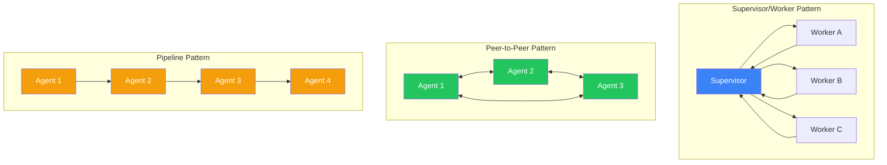
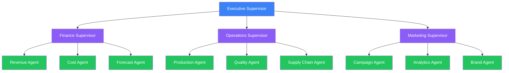
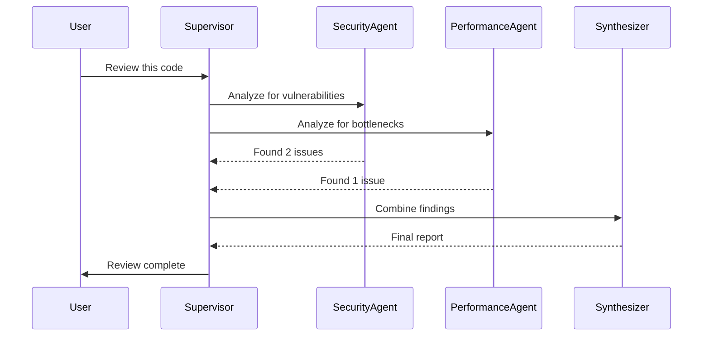
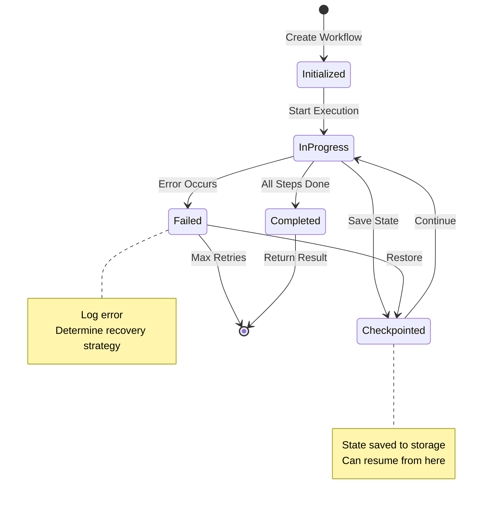
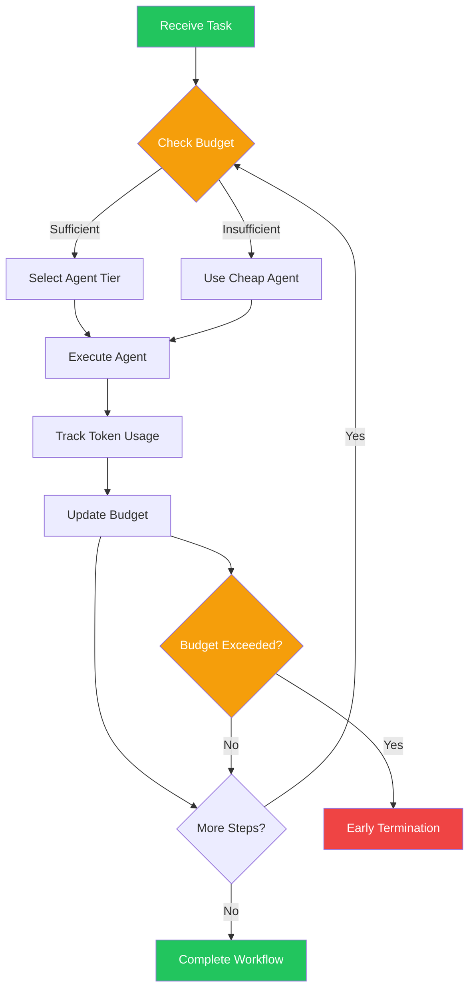

# Module 17: Multi-Agent Systems and Orchestration

**Part 3: Safe Use & Agentic Workflows** | **Duration**: 1 hour 45 minutes | **Difficulty**: Advanced

---

## Learning Objectives

By the end of this module, you will be able to:

- Understand when and why to use multiple agents instead of a single agent
- Master common coordination patterns including supervisor/worker, peer-to-peer, and hierarchical
- Design effective communication strategies between agents
- Evaluate and select appropriate orchestration frameworks for your use cases
- Implement robust state management for multi-agent systems
- Apply production-ready debugging, monitoring, and cost control strategies

---

## Introduction

Single agents are powerful. They can reason, use tools, and accomplish complex tasks autonomously. But as the complexity of tasks grows, so do the limitations of single-agent architectures. What happens when you need specialized expertise in multiple domains? When tasks require parallel processing? When you need checks and balances to ensure quality?

Multi-agent systems address these challenges by distributing work across multiple specialized agents that communicate and coordinate. Instead of one generalist trying to do everything, you have a team of specialists collaborating.

This isn't just about scaling up. Multi-agent architectures enable new capabilities: emergent behaviors from agent interactions, improved reliability through redundancy, and better quality through specialized expertise. They also introduce new challenges: coordination overhead, communication complexity, and harder debugging.

This module teaches you when multi-agent systems make sense, how to design them effectively, and how to operate them reliably in production.

---

## Section 1: Beyond Single Agents (10 minutes)

### When Single Agents Hit Their Limits

Single agents work well for many tasks, but they struggle when:

**Complexity exceeds context limits**: Even with large context windows, some tasks involve more information than a single agent can process coherently. A code review across a million-line codebase, legal analysis spanning thousands of documents, or research synthesis across hundreds of papers all challenge single-agent approaches.

**Specialized expertise is required**: A single agent asked to handle medical diagnosis, legal compliance, financial analysis, and technical implementation must be a mediocre generalist at all of them. Specialized agents can each excel in their domain.

**Parallelization is valuable**: Some tasks decompose into independent subtasks. A single agent processes them sequentially; multiple agents can work in parallel.

**Quality requires verification**: Having one agent generate and another verify creates natural checks and balances. The generator doesn't evaluate its own work.

**Different perspectives matter**: Debate, critique, and diverse viewpoints can improve decision quality. Multiple agents can argue different positions.

### Use Cases for Multi-Agent Systems

**Research and Analysis**:

- One agent searches and retrieves
- Another summarizes and synthesizes
- A third fact-checks and verifies claims
- Result: Higher quality, more reliable research

**Software Development**:

- Architect agent designs system structure
- Implementation agents write code for different modules
- Review agent evaluates code quality
- Test agent creates and runs tests
- Result: Better code with built-in review

**Customer Support Escalation**:

- Front-line agent handles common queries
- Specialist agents for billing, technical issues, account management
- Supervisor agent handles escalations and complex cases
- Result: Efficient routing with specialized handling

**Content Creation**:

- Research agent gathers information
- Writer agent creates drafts
- Editor agent refines and improves
- Fact-checker agent verifies claims
- Result: Higher quality content with fewer errors

**Autonomous Operations**:

- Monitoring agents watch different system aspects
- Analysis agents investigate anomalies
- Action agents execute remediations
- Supervisor coordinates and approves significant changes
- Result: 24/7 operations with human-like judgment

### The Complexity Trade-Off

Multi-agent systems aren't free. They introduce:

**Communication overhead**: Agents must exchange information, which takes time and tokens. Poor communication design can make systems slower than single agents.

**Coordination complexity**: Who does what? How do agents hand off work? What happens when they disagree? These questions need answers.

**Debugging difficulty**: When something goes wrong, tracing through multiple agents is harder than debugging a single agent.

**Cost multiplication**: More agents mean more LLM calls. Without careful design, costs can explode.

**Emergent failures**: Interactions between agents can produce unexpected behaviors that wouldn't occur in single-agent systems.

The question isn't "Should I use multi-agent?" but "Does the benefit of multi-agent outweigh its complexity for this specific problem?"

### A Decision Framework

Ask these questions:

1. **Can a single agent do this well?** Start simple. Only add agents when needed.

2. **What specific limitation am I hitting?** Identify the constraint: context, expertise, parallelism, quality, perspective.

3. **Will multiple agents address that limitation?** More agents for context limits won't help if the fundamental problem is reasoning quality.

4. **Is the coordination overhead acceptable?** Will the multi-agent version be fast enough and cheap enough?

5. **Can I debug and monitor this effectively?** If you can't understand what's happening, you can't fix it.

If you answer yes to all five, multi-agent may be appropriate. If not, reconsider.

---

## Section 2: Coordination Patterns (25 minutes)

### Pattern 1: Supervisor/Worker

The most common multi-agent pattern. One agent (the supervisor) coordinates work, while worker agents execute specific tasks.

**Structure**:

- Supervisor receives the overall task
- Supervisor decomposes task into subtasks
- Supervisor assigns subtasks to appropriate workers
- Workers execute and return results
- Supervisor synthesizes results into final output

**Example: Code Review System**

```
User Request: "Review this pull request for security, performance, and code style"

Supervisor Analysis:
- Security review needed → Assign to Security Agent
- Performance review needed → Assign to Performance Agent
- Style review needed → Assign to Style Agent
- Will need to synthesize findings

Parallel Worker Execution:
- Security Agent: Analyzes for vulnerabilities, injection points, auth issues
- Performance Agent: Analyzes for bottlenecks, complexity, resource usage
- Style Agent: Checks formatting, naming, documentation

Supervisor Synthesis:
- Collects all findings
- Resolves conflicts (security vs. performance trade-offs)
- Prioritizes issues by severity
- Generates unified review with recommendations
```

**When to use**:

- Clear task decomposition
- Workers have distinct, non-overlapping responsibilities
- Need for centralized coordination
- Results require synthesis

**Advantages**:

- Clear hierarchy and responsibility
- Easy to add or remove workers
- Supervisor can handle conflicts
- Natural routing point for observability

**Disadvantages**:

- Supervisor is a bottleneck
- Single point of failure
- Supervisor must understand all domains enough to coordinate
- Sequential flow through supervisor adds latency

### Pattern 2: Peer-to-Peer (Collaborative)

Agents communicate directly with each other without a central coordinator. They self-organize to complete tasks.

**Structure**:

- Agents share a common goal
- Each agent has visibility into others' work
- Agents communicate as needed
- Consensus or voting determines outcomes

**Example: Debate and Synthesis**

```
Topic: "Should we migrate from REST to GraphQL?"

Agent A (Pro-REST):
- Argues for REST simplicity
- Points out GraphQL learning curve
- Cites REST ecosystem maturity

Agent B (Pro-GraphQL):
- Argues for GraphQL efficiency
- Points out over-fetching problems with REST
- Cites GraphQL's type safety

Agent C (Synthesis):
- Reviews both positions
- Identifies valid points from each
- Proposes hybrid approach or clear recommendation

Each round, agents can respond to each other's points,
refining the analysis until convergence.
```

**When to use**:

- Tasks benefit from multiple perspectives
- No clear hierarchical structure
- Agents have complementary expertise
- Consensus or debate improves outcomes

**Advantages**:

- No single bottleneck
- Emergent collaboration
- Resilient to individual agent failures
- Can explore solution space more broadly

**Disadvantages**:

- Coordination is implicit, harder to control
- May not converge (agents can argue indefinitely)
- Harder to debug (no central log)
- Risk of groupthink or deadlock

### Pattern 3: Hierarchical (Multi-Level Supervision)

Multiple levels of supervisors, each managing agents below them. Like an organizational chart.

**Structure**:

- Top-level supervisor handles strategic decisions
- Mid-level supervisors manage functional areas
- Workers execute specific tasks
- Information flows up and down the hierarchy

**Example: Enterprise Report Generation**

```
Executive Supervisor:
- Receives request: "Generate quarterly business review"
- Delegates to functional supervisors

Finance Supervisor:
- Assigns: Revenue Agent, Cost Agent, Forecast Agent
- Synthesizes financial section

Operations Supervisor:
- Assigns: Production Agent, Quality Agent, Supply Chain Agent
- Synthesizes operations section

Marketing Supervisor:
- Assigns: Campaign Agent, Analytics Agent, Brand Agent
- Synthesizes marketing section

Executive Supervisor:
- Receives sections from all supervisors
- Synthesizes executive summary
- Creates final report with all sections
```

**When to use**:

- Large, complex tasks with multiple domains
- Need for both domain expertise and cross-domain coordination
- Organizations with natural hierarchical structure
- Scale beyond what single supervisor can manage

**Advantages**:

- Scales to very complex tasks
- Mirrors organizational thinking
- Domain supervisors have deep expertise
- Failures are contained within branches

**Disadvantages**:

- Deep hierarchies add latency (many hops)
- Complex to design and maintain
- Information can get lost in translation between levels
- Over-engineering risk for simpler problems

### Pattern 4: Pipeline (Sequential)

Agents process work in sequence, each transforming output from the previous agent.

**Structure**:

- Work flows linearly through agents
- Each agent has a specific role in the pipeline
- Output of one agent becomes input to next
- Final agent produces result

**Example: Content Publishing Pipeline**

```
Research Agent:
- Input: Topic
- Output: Gathered facts, sources, key points

Writer Agent:
- Input: Research output
- Output: Initial draft

Editor Agent:
- Input: Draft
- Output: Refined content

Fact-Checker Agent:
- Input: Edited content
- Output: Verified content with citations

Publisher Agent:
- Input: Verified content
- Output: Formatted, published article
```

**When to use**:

- Clear sequential process
- Each stage has distinct transformation
- Quality gates between stages
- Similar to existing workflows

**Advantages**:

- Simple to understand and debug
- Each agent has clear responsibility
- Easy to add quality gates
- Mirrors human workflows

**Disadvantages**:

- No parallelism (sequential bottleneck)
- Later agents wait for earlier ones
- Errors propagate forward
- Inflexible for tasks that don't fit linear flow

### Pattern 5: Swarm (Dynamic Assignment)

Large pool of agents dynamically claim and process work from a shared queue.

**Structure**:

- Central work queue holds tasks
- Agents claim tasks based on capability and availability
- Agents work independently
- Results aggregated as they complete

**Example: Large-Scale Document Processing**

```
Work Queue: 10,000 documents to classify

Agent Pool: 50 classification agents

Process:
1. Each agent claims a document from queue
2. Agent classifies document
3. Agent returns result and claims next document
4. Continue until queue empty

Aggregator:
- Collects all classifications
- Builds final report
- Handles any failed tasks (re-queue or escalate)
```

**When to use**:

- High-volume, uniform tasks
- Need for parallelism
- Tasks are independent
- Scale is primary concern

**Advantages**:

- Maximum parallelism
- Scales horizontally
- Resilient (one agent failure doesn't stop others)
- Efficient resource utilization

**Disadvantages**:

- Only works for independent tasks
- Coordination overhead for queue
- No inter-agent communication
- Results lack coherence (just aggregation)

### Choosing the Right Pattern

| Pattern           | Best For                                      | Avoid When                             |
| ----------------- | --------------------------------------------- | -------------------------------------- |
| Supervisor/Worker | Clear decomposition, need for synthesis       | Simple tasks, very deep specialization |
| Peer-to-Peer      | Debate, creative tasks, multiple perspectives | Need for speed, clear hierarchy        |
| Hierarchical      | Complex enterprise tasks, multiple domains    | Simple tasks, flat organizations       |
| Pipeline          | Sequential workflows, quality gates           | Parallel tasks, iterative refinement   |
| Swarm             | High-volume processing, parallelism           | Tasks requiring coordination           |

Real systems often combine patterns. A hierarchical structure might use pipelines within each branch and swarm processing for bulk tasks.

---

## Section 3: Communication Design (20 minutes)

### The Communication Challenge

In single-agent systems, "communication" is just the context window. In multi-agent systems, agents must exchange information explicitly. Poor communication design causes:

- **Information loss**: Important context doesn't reach agents that need it
- **Information overload**: Agents receive too much irrelevant information
- **Latency**: Waiting for responses blocks progress
- **Cost explosion**: Every message means more tokens
- **Coherence breakdown**: Agents work from inconsistent states

### Message Passing

The most explicit communication model. Agents send discrete messages to each other.

**Structure**:

```python
class Message:
    sender: str           # Which agent sent this
    recipient: str        # Which agent receives this (or "broadcast")
    message_type: str     # "request", "response", "info", "error"
    content: dict         # The actual payload
    timestamp: datetime   # When sent
    correlation_id: str   # Links related messages
```

**Example: Request-Response**

```
Worker Agent → Supervisor:
{
  "sender": "security_agent",
  "recipient": "supervisor",
  "message_type": "response",
  "content": {
    "task_id": "review-123",
    "status": "complete",
    "findings": [
      {"severity": "high", "issue": "SQL injection in line 45"},
      {"severity": "medium", "issue": "Missing CSRF token"}
    ]
  }
}
```

**Advantages**:

- Explicit, traceable communication
- Easy to log and debug
- Clear contracts between agents
- Supports async patterns

**Disadvantages**:

- Verbose (lots of tokens)
- Need to define message schemas
- Agents must handle message parsing
- Latency for round-trips

### Shared State

Agents communicate by reading and writing to shared state (like a blackboard or shared memory).

**Structure**:

```python
shared_state = {
    "task": {
        "id": "review-123",
        "status": "in_progress",
        "assigned_agents": ["security", "performance", "style"]
    },
    "findings": {
        "security": [...],
        "performance": [...],
        "style": []  # Not yet complete
    },
    "metadata": {
        "started": "2024-01-15T10:00:00Z",
        "deadline": "2024-01-15T11:00:00Z"
    }
}
```

**Agents read and write**:

```python
# Security agent writes findings
shared_state["findings"]["security"] = [
    {"severity": "high", "issue": "SQL injection"}
]

# Supervisor reads status
all_complete = all(
    shared_state["findings"][agent]
    for agent in shared_state["task"]["assigned_agents"]
)
```

**Advantages**:

- Agents see same state (coherence)
- Less message overhead
- Easy to checkpoint/restore
- Natural for collaborative editing

**Disadvantages**:

- Concurrency challenges (race conditions)
- Agents must coordinate writes
- Can become large/bloated
- Less explicit than messages

### Handoff Protocols

When one agent passes work to another, clear handoff protocols prevent information loss.

**What a handoff should include**:

```python
handoff = {
    "from_agent": "research_agent",
    "to_agent": "writer_agent",
    "context": {
        "original_request": "Write article about AI safety",
        "work_completed": "Research phase",
        "key_findings": [
            "Point 1...",
            "Point 2...",
            "Point 3..."
        ],
        "sources": ["url1", "url2", "url3"],
        "constraints": "1500 words, academic tone",
        "remaining_work": "Draft article based on findings"
    },
    "instructions": "Use the key findings to structure the article. Cite sources inline.",
    "quality_criteria": "Accuracy, clarity, proper citations"
}
```

**Handoff anti-patterns**:

```python
# BAD: Loses context
handoff = {
    "from": "research",
    "to": "writer",
    "message": "Done with research, your turn"
}

# BAD: Too much raw data
handoff = {
    "from": "research",
    "to": "writer",
    "content": "[500 pages of raw research notes]"
}
```

**Handoff best practices**:

- Include original request (context)
- Summarize work done (progress)
- Provide processed output (not raw data)
- State remaining work clearly
- Define success criteria

### Broadcast vs. Direct Communication

**Direct**: Agent A sends to Agent B specifically

- Lower overhead
- Clearer responsibility
- No eavesdropping

**Broadcast**: Agent A sends to all agents

- Everyone stays informed
- Enables opportunistic collaboration
- Higher overhead
- Requires filtering

**Hybrid**: Broadcast important state changes, direct for specific requests

```python
# Direct: Specific request
security_agent.send_to(supervisor, {
    "type": "help_request",
    "issue": "Need database schema to complete analysis"
})

# Broadcast: State update
supervisor.broadcast({
    "type": "status_update",
    "message": "Deadline extended by 30 minutes"
})
```

### Managing Context Across Agents

Each agent has limited context. How do you ensure agents have what they need?

**Strategy 1: Minimal Context**
Pass only what's needed for the immediate task. Risk: missing context causes errors.

**Strategy 2: Full Context**
Pass everything to every agent. Risk: overwhelming context, high cost.

**Strategy 3: Layered Context**

- Core context (always passed): Original request, global constraints
- Task context (passed for specific tasks): Relevant prior work
- Available context (retrievable): Full history, accessible on demand

```python
context_layers = {
    "core": {
        "original_request": "...",
        "user_id": "...",
        "constraints": "..."
    },
    "task": {
        "current_subtask": "...",
        "relevant_findings": "...",
        "immediate_dependencies": "..."
    },
    "available": {
        "retrieval_endpoint": "/context/full",
        "can_query": ["previous_analyses", "user_history", "knowledge_base"]
    }
}
```

### Communication Patterns Summary

| Approach        | Best For                         | Trade-off                 |
| --------------- | -------------------------------- | ------------------------- |
| Message Passing | Explicit coordination, debugging | Verbose, latency          |
| Shared State    | Collaborative work, coherence    | Concurrency complexity    |
| Minimal Context | Speed, cost                      | Missing information       |
| Full Context    | Accuracy, autonomy               | Cost, context limits      |
| Layered Context | Balance                          | Implementation complexity |

---

## Section 4: Orchestration Frameworks (20 minutes)

### Why Use a Framework?

Building multi-agent systems from scratch requires implementing:

- Agent lifecycle management
- Message routing
- State persistence
- Error handling
- Observability
- Retry logic

Frameworks provide these out of the box, letting you focus on agent logic.

### LangGraph

LangGraph, from the LangChain team, models multi-agent workflows as graphs.

**Core Concepts**:

- **Nodes**: Agents or functions that process state
- **Edges**: Transitions between nodes
- **State**: Shared data passed through the graph
- **Conditional Edges**: Dynamic routing based on state

**Example: Review Workflow**

```python
from langgraph.graph import StateGraph, END
from typing import TypedDict, List

class ReviewState(TypedDict):
    code: str
    security_review: str
    performance_review: str
    final_report: str

def security_agent(state: ReviewState) -> ReviewState:
    # Analyze code for security issues
    findings = analyze_security(state["code"])
    return {"security_review": findings}

def performance_agent(state: ReviewState) -> ReviewState:
    # Analyze code for performance issues
    findings = analyze_performance(state["code"])
    return {"performance_review": findings}

def synthesize_agent(state: ReviewState) -> ReviewState:
    # Combine findings into final report
    report = synthesize(
        state["security_review"],
        state["performance_review"]
    )
    return {"final_report": report}

# Build the graph
workflow = StateGraph(ReviewState)

# Add nodes
workflow.add_node("security", security_agent)
workflow.add_node("performance", performance_agent)
workflow.add_node("synthesize", synthesize_agent)

# Add edges (parallel execution, then synthesis)
workflow.set_entry_point("security")
workflow.add_edge("security", "performance")  # Sequential here
workflow.add_edge("performance", "synthesize")
workflow.add_edge("synthesize", END)

# Compile and run
app = workflow.compile()
result = app.invoke({"code": "def process(x): return x + 1"})
```

**Strengths**:

- Graph model is intuitive
- Built-in state management
- Checkpointing for long-running workflows
- Integrates with LangChain ecosystem

**Limitations**:

- Graph model can be constraining
- Steeper learning curve than alternatives
- Tied to LangChain paradigms

### AutoGen

Microsoft's AutoGen focuses on conversational multi-agent patterns.

**Core Concepts**:

- **Agents**: Entities that can send/receive messages
- **Conversations**: Message exchanges between agents
- **Group Chat**: Multi-agent conversations

**Example: Code Review Conversation**

```python
from autogen import AssistantAgent, UserProxyAgent, GroupChat, GroupChatManager

# Define agents
security_agent = AssistantAgent(
    name="SecurityReviewer",
    system_message="""You are a security expert.
    Review code for vulnerabilities.
    Be specific about line numbers and severity."""
)

performance_agent = AssistantAgent(
    name="PerformanceReviewer",
    system_message="""You are a performance expert.
    Review code for bottlenecks and inefficiencies.
    Suggest specific optimizations."""
)

lead_reviewer = AssistantAgent(
    name="LeadReviewer",
    system_message="""You are the lead reviewer.
    Synthesize feedback from security and performance reviews.
    Prioritize issues and create actionable summary."""
)

# Create group chat
group_chat = GroupChat(
    agents=[security_agent, performance_agent, lead_reviewer],
    messages=[],
    max_round=10
)

manager = GroupChatManager(groupchat=group_chat)

# Start conversation
lead_reviewer.initiate_chat(
    manager,
    message="""Please review this code:

    def process_user_input(data):
        query = f"SELECT * FROM users WHERE id = {data}"
        result = db.execute(query)
        return result

    SecurityReviewer: Start with security analysis.
    PerformanceReviewer: Then analyze performance.
    I'll synthesize findings at the end."""
)
```

**Strengths**:

- Natural conversational model
- Easy to set up simple multi-agent chats
- Good for debate/collaboration patterns
- Code execution support

**Limitations**:

- Less structured than graph-based approaches
- Conversation can wander without guidance
- Harder to control flow precisely

### CrewAI

CrewAI models multi-agent systems as teams with roles and processes.

**Core Concepts**:

- **Agents**: Have roles, goals, and backstories
- **Tasks**: Specific work items
- **Crew**: Collection of agents working together
- **Process**: How the crew executes (sequential, hierarchical)

**Example: Research Team**

```python
from crewai import Agent, Task, Crew, Process

# Define agents with personalities
researcher = Agent(
    role="Senior Research Analyst",
    goal="Find comprehensive, accurate information on topics",
    backstory="""You're a meticulous researcher with 15 years of experience.
    You verify facts from multiple sources and cite everything.""",
    tools=[search_tool, scrape_tool]
)

writer = Agent(
    role="Content Writer",
    goal="Create clear, engaging content from research",
    backstory="""You're an experienced technical writer who excels at
    making complex topics accessible. You never sacrifice accuracy for clarity."""
)

editor = Agent(
    role="Editor",
    goal="Ensure content is polished, accurate, and compelling",
    backstory="""You're a senior editor with high standards. You check facts,
    improve clarity, and ensure consistent voice and style."""
)

# Define tasks
research_task = Task(
    description="Research the current state of multi-agent AI systems",
    agent=researcher,
    expected_output="Comprehensive research notes with sources"
)

writing_task = Task(
    description="Write a 2000-word article based on the research",
    agent=writer,
    expected_output="Draft article with clear structure"
)

editing_task = Task(
    description="Edit the article for clarity, accuracy, and style",
    agent=editor,
    expected_output="Polished final article"
)

# Assemble crew
crew = Crew(
    agents=[researcher, writer, editor],
    tasks=[research_task, writing_task, editing_task],
    process=Process.sequential
)

# Execute
result = crew.kickoff()
```

**Strengths**:

- Role-based model is intuitive
- Rich agent personas
- Clean task abstraction
- Built-in process types

**Limitations**:

- Less flexibility than lower-level frameworks
- Harder to implement complex coordination
- Abstraction may hide important details

### Framework Comparison

| Framework | Model               | Best For                           | Complexity  |
| --------- | ------------------- | ---------------------------------- | ----------- |
| LangGraph | Graph/State Machine | Complex workflows, precise control | Medium-High |
| AutoGen   | Conversations       | Debate, collaboration, chat        | Low-Medium  |
| CrewAI    | Teams/Roles         | Role-based workflows, delegation   | Low         |

### When to Build Custom

Use a framework when:

- Your pattern matches the framework's model
- You need the framework's features (checkpointing, observability)
- Development speed matters more than full control

Build custom when:

- Your pattern doesn't fit available frameworks
- You need maximum performance/efficiency
- You have unique coordination requirements
- You're building a platform, not an application

### Custom Orchestration Basics

If building custom, you need:

```python
class Orchestrator:
    def __init__(self):
        self.agents = {}
        self.state = {}
        self.message_queue = []

    def register_agent(self, name: str, agent: Agent):
        """Register an agent with the orchestrator"""
        self.agents[name] = agent

    def send_message(self, from_agent: str, to_agent: str, content: dict):
        """Route message between agents"""
        message = Message(from_agent, to_agent, content)
        self.log_message(message)
        self.message_queue.append(message)

    def run(self, initial_task: dict) -> dict:
        """Execute the multi-agent workflow"""
        self.state["task"] = initial_task

        while not self.is_complete():
            # Get next message or determine next agent
            next_action = self.determine_next_action()

            # Execute agent
            agent = self.agents[next_action.agent]
            result = agent.execute(next_action.input, self.state)

            # Update state
            self.update_state(result)

            # Check for errors
            self.handle_errors(result)

        return self.state["result"]
```

Key components to implement:

- Agent registry
- Message routing
- State management
- Error handling
- Execution loop
- Observability hooks

---

## Section 5: State Management (15 minutes)

### Why State Management Matters

Multi-agent systems are inherently stateful. At any moment, you need to know:

- What has been done
- What is in progress
- What remains to be done
- What each agent knows
- What decisions have been made

Poor state management causes:

- Lost work on failures
- Inconsistent agent behavior
- Impossible debugging
- Inability to resume interrupted workflows

### Conversation History

The simplest state: track all messages exchanged.

```python
conversation_history = [
    {
        "agent": "supervisor",
        "action": "delegate",
        "content": "Security agent, please review code.py for vulnerabilities",
        "timestamp": "2024-01-15T10:00:00Z"
    },
    {
        "agent": "security_agent",
        "action": "analyze",
        "content": "Analyzing code.py...",
        "timestamp": "2024-01-15T10:00:05Z"
    },
    {
        "agent": "security_agent",
        "action": "report",
        "content": "Found 2 high-severity issues: SQL injection on line 45, XSS on line 78",
        "timestamp": "2024-01-15T10:01:30Z"
    }
]
```

**Challenges**:

- Grows large over time
- May exceed context limits
- Redundant information
- Hard to query specific facts

**Solutions**:

- Summarize periodically
- Index by topic for retrieval
- Keep recent detailed, older summarized

### Structured State

More than conversation: track semantic state of the workflow.

```python
workflow_state = {
    "request": {
        "id": "review-123",
        "type": "code_review",
        "input": {"file": "code.py", "commit": "abc123"},
        "created_at": "2024-01-15T10:00:00Z"
    },
    "progress": {
        "status": "in_progress",
        "completed_steps": ["security_review"],
        "current_step": "performance_review",
        "pending_steps": ["style_review", "synthesis"]
    },
    "findings": {
        "security": {
            "agent": "security_agent",
            "completed_at": "2024-01-15T10:01:30Z",
            "issues": [
                {"severity": "high", "line": 45, "type": "sql_injection"},
                {"severity": "high", "line": 78, "type": "xss"}
            ]
        },
        "performance": None,  # Not yet complete
        "style": None
    },
    "metadata": {
        "total_tokens": 4523,
        "total_time_seconds": 90,
        "retry_count": 0
    }
}
```

**Benefits**:

- Clear picture of workflow status
- Easy to resume after failures
- Queryable (what issues found? what's pending?)
- Supports checkpointing

### Checkpointing

Save state at key points to enable recovery.

```python
class CheckpointManager:
    def __init__(self, storage):
        self.storage = storage

    def save_checkpoint(self, workflow_id: str, state: dict):
        """Save current state as checkpoint"""
        checkpoint = {
            "workflow_id": workflow_id,
            "state": state,
            "timestamp": datetime.now().isoformat(),
            "version": self.get_next_version(workflow_id)
        }
        self.storage.save(f"checkpoint:{workflow_id}:{checkpoint['version']}", checkpoint)

    def restore_checkpoint(self, workflow_id: str, version: int = None) -> dict:
        """Restore from checkpoint"""
        if version is None:
            version = self.get_latest_version(workflow_id)
        checkpoint = self.storage.load(f"checkpoint:{workflow_id}:{version}")
        return checkpoint["state"]

    def list_checkpoints(self, workflow_id: str) -> List[dict]:
        """List all checkpoints for a workflow"""
        return self.storage.list(f"checkpoint:{workflow_id}:*")
```

**When to checkpoint**:

- After each agent completes its task
- Before expensive operations
- At decision points
- Periodically for long-running workflows

### Recovery Strategies

When failures occur, how do you recover?

**Strategy 1: Restart from Beginning**
Simple but wasteful. Discard all progress.

**Strategy 2: Restart from Last Checkpoint**
Resume from saved state. May need to handle idempotency.

**Strategy 3: Retry Failed Step**
Keep successful work, retry only the failed agent.

```python
def execute_with_recovery(workflow_state, checkpoint_manager):
    try:
        while not is_complete(workflow_state):
            current_step = get_current_step(workflow_state)

            # Checkpoint before each step
            checkpoint_manager.save_checkpoint(workflow_state)

            # Execute step
            result = execute_step(current_step, workflow_state)
            update_state(workflow_state, result)

    except Exception as e:
        # Log error
        log_error(e, workflow_state)

        # Determine recovery strategy
        if is_transient_error(e):
            # Retry current step
            workflow_state["retry_count"] += 1
            if workflow_state["retry_count"] < MAX_RETRIES:
                return execute_with_recovery(workflow_state, checkpoint_manager)

        # Restore from checkpoint
        restored_state = checkpoint_manager.restore_checkpoint(workflow_state["id"])

        # Mark current step as failed and skip or escalate
        restored_state["failed_steps"].append(current_step)
        return execute_with_recovery(restored_state, checkpoint_manager)
```

### State Consistency Across Agents

When multiple agents access shared state, consistency matters.

**Problem: Race Conditions**

```python
# Agent A reads state
balance = state["balance"]  # 100

# Agent B reads state (same time)
balance = state["balance"]  # 100

# Agent A writes
state["balance"] = balance - 50  # 50

# Agent B writes (overwrites A's change!)
state["balance"] = balance - 30  # 70 (wrong! should be 20)
```

**Solutions**:

**1. Locking**:

```python
with state_lock:
    balance = state["balance"]
    state["balance"] = balance - 50
```

**2. Optimistic Concurrency**:

```python
version = state["version"]
new_state = compute_new_state(state)
if not state.compare_and_swap(version, new_state):
    # State changed, retry
    retry()
```

**3. Append-Only State**:

```python
# Instead of modifying, append operations
state["operations"].append({"type": "debit", "amount": 50, "agent": "A"})
# Compute current state by replaying operations
current_balance = replay_operations(state["operations"])
```

**4. Agent-Scoped State**:

```python
# Each agent has its own state section
state["agents"]["security"]["findings"] = [...]
state["agents"]["performance"]["findings"] = [...]
# Only supervisor writes to shared sections
```

### State Management Best Practices

1. **Design state schema upfront**: Know what you're tracking
2. **Checkpoint frequently**: Cheaper than redoing work
3. **Keep history**: Enables debugging and rollback
4. **Scope agent access**: Minimize shared mutable state
5. **Version state**: Enable migration as schema evolves
6. **Monitor state size**: Prune old data before it explodes
7. **Test recovery**: Verify you can actually restore from checkpoints

---

## Section 6: Production Multi-Agent (15 minutes)

### Debugging Multi-Agent Systems

Debugging single agents is hard. Debugging multiple agents interacting is harder. You need visibility.

**Log Everything**

```python
def log_agent_action(agent_name: str, action: str, input: dict, output: dict,
                      duration_ms: int, tokens_used: int):
    log_entry = {
        "timestamp": datetime.now().isoformat(),
        "workflow_id": get_current_workflow_id(),
        "agent": agent_name,
        "action": action,
        "input": input,
        "output": output,
        "duration_ms": duration_ms,
        "tokens_used": tokens_used,
        "trace_id": get_trace_id()
    }
    logger.info(json.dumps(log_entry))
```

**Trace Workflows**

Use distributed tracing to follow work across agents:

```python
from opentelemetry import trace

tracer = trace.get_tracer("multi-agent-system")

def execute_agent(agent, input, state):
    with tracer.start_as_current_span(f"agent:{agent.name}") as span:
        span.set_attribute("agent.name", agent.name)
        span.set_attribute("workflow.id", state["workflow_id"])
        span.set_attribute("input.size", len(str(input)))

        result = agent.execute(input, state)

        span.set_attribute("output.size", len(str(result)))
        span.set_attribute("tokens.used", result.get("tokens", 0))

        return result
```

**Visual Flow**

Generate visualizations of agent interactions:

```python
def generate_workflow_diagram(workflow_log: List[dict]) -> str:
    """Generate Mermaid diagram from workflow log"""
    lines = ["sequenceDiagram"]

    for entry in workflow_log:
        sender = entry.get("from_agent", "User")
        receiver = entry["agent"]
        action = entry["action"]

        lines.append(f"    {sender}->>+{receiver}: {action}")

        if entry.get("output"):
            lines.append(f"    {receiver}-->>-{sender}: complete")

    return "\n".join(lines)
```

### Monitoring

Track these metrics for multi-agent systems:

**Performance Metrics**:

- Workflow completion time (end-to-end)
- Per-agent execution time
- Time spent in communication/coordination
- Queue depths (for async systems)

**Quality Metrics**:

- Success rate per workflow type
- Error rate per agent
- Retry frequency
- Human escalation rate

**Cost Metrics**:

- Tokens per workflow
- Tokens per agent
- API costs per workflow
- Cost per successful outcome

**Dashboard Example**:

```
Multi-Agent System Health
-------------------------
Workflows Today: 1,234
Success Rate: 94.2%
Avg Duration: 45s
Avg Cost: $0.23

Agent Performance:
| Agent          | Calls | Avg Time | Error % | Tokens |
|----------------|-------|----------|---------|--------|
| supervisor     | 1,234 | 2.1s     | 0.5%    | 850    |
| security       | 1,180 | 8.3s     | 2.1%    | 2,100  |
| performance    | 1,150 | 6.7s     | 1.8%    | 1,800  |
| synthesizer    | 1,120 | 3.2s     | 0.3%    | 1,200  |

Alerts:
- [WARN] Security agent error rate above threshold
- [INFO] Avg workflow duration up 15% vs last week
```

### Cost Control

Multi-agent systems can be expensive. Control costs through:

**1. Token Budgets**

```python
class TokenBudget:
    def __init__(self, max_tokens: int):
        self.max_tokens = max_tokens
        self.used_tokens = 0

    def can_spend(self, tokens: int) -> bool:
        return self.used_tokens + tokens <= self.max_tokens

    def spend(self, tokens: int):
        if not self.can_spend(tokens):
            raise BudgetExceeded()
        self.used_tokens += tokens

    def remaining(self) -> int:
        return self.max_tokens - self.used_tokens

# Usage
workflow_budget = TokenBudget(max_tokens=10000)

for agent in workflow.agents:
    if not workflow_budget.can_spend(agent.estimated_tokens):
        # Switch to cheaper strategy or abort
        handle_budget_constraint()

    result = agent.execute()
    workflow_budget.spend(result.tokens_used)
```

**2. Tiered Agent Selection**

Use expensive agents only when needed:

```python
def select_agent_tier(task_complexity: str, remaining_budget: int) -> str:
    if task_complexity == "simple" or remaining_budget < 1000:
        return "gpt-3.5-turbo"  # Cheaper
    elif task_complexity == "medium" or remaining_budget < 5000:
        return "gpt-4"  # Balanced
    else:
        return "gpt-4-turbo"  # Most capable
```

**3. Early Termination**

Stop workflows that won't succeed:

```python
def should_continue(state: dict) -> bool:
    # Too many retries
    if state["retry_count"] > MAX_RETRIES:
        return False

    # Budget exhausted
    if state["tokens_used"] > state["token_budget"]:
        return False

    # Taking too long
    elapsed = time.time() - state["start_time"]
    if elapsed > MAX_WORKFLOW_TIME:
        return False

    # Quality too low
    if state.get("quality_score", 1.0) < MIN_QUALITY:
        return False

    return True
```

**4. Caching**

Cache agent outputs for similar inputs:

```python
def execute_with_cache(agent, input, cache):
    cache_key = generate_cache_key(agent.name, input)

    if cache_key in cache:
        return cache[cache_key]

    result = agent.execute(input)
    cache[cache_key] = result

    return result
```

### Scaling Multi-Agent Systems

As load increases:

**Horizontal Scaling**:

- Run multiple workflow instances in parallel
- Use queue-based architecture
- Stateless orchestrators with external state storage

**Agent Pooling**:

- Maintain pools of pre-initialized agents
- Reuse agents across workflows
- Warm agent contexts where possible

**Async Execution**:

- Don't wait for slow agents
- Process independent subtasks in parallel
- Use callbacks/webhooks for completion

```python
async def execute_parallel_agents(agents: List[Agent], input: dict) -> List[dict]:
    """Execute multiple agents in parallel"""
    tasks = [
        asyncio.create_task(agent.execute_async(input))
        for agent in agents
    ]
    results = await asyncio.gather(*tasks, return_exceptions=True)

    # Handle any failures
    for i, result in enumerate(results):
        if isinstance(result, Exception):
            results[i] = {"error": str(result), "agent": agents[i].name}

    return results
```

### Error Handling Patterns

**Graceful Degradation**:

```python
def execute_with_fallback(primary_agent, fallback_agent, input):
    try:
        return primary_agent.execute(input)
    except AgentError:
        log.warning(f"Primary agent failed, using fallback")
        return fallback_agent.execute(input)
```

**Circuit Breaker**:

```python
class AgentCircuitBreaker:
    def __init__(self, failure_threshold: int = 5, reset_timeout: int = 60):
        self.failures = 0
        self.failure_threshold = failure_threshold
        self.reset_timeout = reset_timeout
        self.last_failure_time = None
        self.state = "closed"  # closed, open, half-open

    def can_execute(self) -> bool:
        if self.state == "closed":
            return True
        elif self.state == "open":
            if time.time() - self.last_failure_time > self.reset_timeout:
                self.state = "half-open"
                return True
            return False
        else:  # half-open
            return True

    def record_success(self):
        self.failures = 0
        self.state = "closed"

    def record_failure(self):
        self.failures += 1
        self.last_failure_time = time.time()
        if self.failures >= self.failure_threshold:
            self.state = "open"
```

---

## Diagrams

### Multi-Agent Coordination Patterns



### Hierarchical Multi-Agent Architecture



### Message Passing Flow



### State Management Lifecycle



### Cost Control Flow



---

## Knowledge Check

### Question 1

When is a multi-agent system most likely to provide significant benefits over a single agent?

- A) When the task is simple and well-defined
- B) When maximum speed is required and latency is critical
- C) When the task requires specialized expertise across multiple domains and benefits from verification
- D) When you want to minimize operational complexity

**Correct Answer**: C

**Explanation**: Multi-agent systems excel when tasks require diverse specialized expertise (different agents for security, performance, style review) and when quality benefits from verification (one agent checks another's work). Single agents are often better for simple tasks (A), multi-agent adds latency overhead (B), and multi-agent increases operational complexity (D).

### Question 2

In the supervisor/worker pattern, what is the primary responsibility of the supervisor agent?

- A) Executing all the actual work tasks
- B) Decomposing tasks, routing to workers, and synthesizing results
- C) Providing computational resources to worker agents
- D) Storing state and handling persistence

**Correct Answer**: B

**Explanation**: The supervisor's role is coordination: it receives the overall task, breaks it into subtasks, assigns them to appropriate workers, collects results, and synthesizes the final output. Workers execute the actual tasks (A), infrastructure provides resources (C), and state management is a separate concern (D).

### Question 3

What is the main advantage of checkpointing in multi-agent workflows?

- A) It makes agents run faster
- B) It reduces the number of agents needed
- C) It enables recovery from failures without losing all progress
- D) It prevents agents from making errors

**Correct Answer**: C

**Explanation**: Checkpointing saves workflow state at key points, allowing recovery from the last checkpoint rather than restarting from scratch when failures occur. It doesn't affect speed (A), agent count (B), or prevent errors (D) - but it does make errors recoverable.

### Question 4

Which framework would be most appropriate for implementing a debate between multiple AI perspectives that should converge on a consensus?

- A) LangGraph (graph-based workflows)
- B) AutoGen (conversational multi-agent)
- C) A swarm pattern with work queues
- D) A strict pipeline pattern

**Correct Answer**: B

**Explanation**: AutoGen's conversational model is designed for debate and collaboration patterns where agents exchange messages, respond to each other, and work toward consensus. LangGraph is better for structured workflows (A), swarm for parallel independent tasks (C), and pipeline for sequential processing (D).

---

## Hands-On Exercise: Building a Multi-Agent Code Review System

### Objective

Design and implement a multi-agent code review system using the supervisor/worker pattern. The system should coordinate specialized reviewers and produce a unified review report.

### Time Required

60-90 minutes

### Overview

You'll build a system where:

- A **Supervisor Agent** receives code review requests and coordinates the process
- A **Security Agent** analyzes code for vulnerabilities
- A **Performance Agent** identifies bottlenecks and inefficiencies
- A **Style Agent** checks code quality and conventions
- The **Supervisor** synthesizes findings into a final report

### Part 1: Design the System (20 minutes)

Before writing code, design your system:

**1. Define Agent Responsibilities**

For each agent, specify:

- Input: What does it receive?
- Output: What does it produce?
- Tools: What tools does it need?

```
Security Agent:
- Input: Code to review, file context
- Output: List of security findings with severity, line numbers, descriptions
- Tools: Code analysis, vulnerability patterns, OWASP checklist

Performance Agent:
- Input: [Define...]
- Output: [Define...]
- Tools: [Define...]

Style Agent:
- Input: [Define...]
- Output: [Define...]
- Tools: [Define...]

Supervisor Agent:
- Input: [Define...]
- Output: [Define...]
- Tools: [Define...]
```

**2. Define Message Schemas**

Design the messages exchanged:

```python
# Review Request (User to Supervisor)
review_request = {
    "code": "...",
    "file_path": "path/to/file.py",
    "context": "This is a user authentication module",
    "priority_areas": ["security", "performance"]
}

# Task Assignment (Supervisor to Worker)
task_assignment = {
    # Define fields...
}

# Findings Report (Worker to Supervisor)
findings_report = {
    # Define fields...
}

# Final Report (Supervisor to User)
final_report = {
    # Define fields...
}
```

**3. Define State Schema**

What state needs to be tracked?

```python
workflow_state = {
    "request_id": "...",
    "status": "...",
    "assignments": {},
    "findings": {},
    "final_report": None,
    # Add more fields...
}
```

### Part 2: Implement Core Components (30 minutes)

Implement the agents (pseudocode or your preferred language):

**Agent Base Class**:

```python
class Agent:
    def __init__(self, name: str, system_prompt: str):
        self.name = name
        self.system_prompt = system_prompt

    def execute(self, task: dict, state: dict) -> dict:
        """Execute the agent's task and return results"""
        raise NotImplementedError

class SecurityAgent(Agent):
    def __init__(self):
        super().__init__(
            name="security_reviewer",
            system_prompt="""You are a security expert reviewing code.
            Identify vulnerabilities including:
            - Injection attacks (SQL, command, XSS)
            - Authentication/authorization issues
            - Data exposure risks
            - Insecure configurations

            For each issue, provide:
            - Severity (critical, high, medium, low)
            - Line number(s)
            - Description
            - Recommended fix"""
        )

    def execute(self, task: dict, state: dict) -> dict:
        # Implement security analysis
        # Return findings in defined schema
        pass

# Implement PerformanceAgent
# Implement StyleAgent
```

**Supervisor Implementation**:

```python
class Supervisor:
    def __init__(self, agents: List[Agent]):
        self.agents = {agent.name: agent for agent in agents}
        self.state = {}

    def process_request(self, request: dict) -> dict:
        """Main workflow orchestration"""
        # 1. Initialize state
        self.state = self.initialize_state(request)

        # 2. Analyze request and create assignments
        assignments = self.create_assignments(request)

        # 3. Execute each agent
        for agent_name, task in assignments.items():
            agent = self.agents[agent_name]
            result = agent.execute(task, self.state)
            self.state["findings"][agent_name] = result

        # 4. Synthesize final report
        final_report = self.synthesize_report()

        return final_report

    def create_assignments(self, request: dict) -> dict:
        """Determine which agents to invoke and what to ask them"""
        # Implement task decomposition
        pass

    def synthesize_report(self) -> dict:
        """Combine all findings into final report"""
        # Implement synthesis
        pass
```

### Part 3: Add Robustness (20 minutes)

Add error handling and checkpointing:

**Error Handling**:

```python
def execute_with_retry(self, agent: Agent, task: dict, max_retries: int = 3) -> dict:
    """Execute agent with retry logic"""
    for attempt in range(max_retries):
        try:
            result = agent.execute(task, self.state)
            return result
        except Exception as e:
            if attempt == max_retries - 1:
                return {
                    "status": "failed",
                    "error": str(e),
                    "agent": agent.name
                }
            time.sleep(2 ** attempt)  # Exponential backoff
```

**Checkpointing**:

```python
def checkpoint(self):
    """Save current state"""
    # Implement saving state to storage
    pass

def restore(self, checkpoint_id: str):
    """Restore from checkpoint"""
    # Implement restoring state
    pass
```

### Part 4: Test the System (15 minutes)

Test with sample code:

**Test Case 1: Security Vulnerability**

```python
test_code = """
def get_user(user_id):
    query = f"SELECT * FROM users WHERE id = {user_id}"
    return db.execute(query)
"""

# Expected: Security agent flags SQL injection
```

**Test Case 2: Performance Issue**

```python
test_code = """
def process_items(items):
    result = []
    for item in items:
        for other in items:
            if item.matches(other):
                result.append((item, other))
    return result
"""

# Expected: Performance agent flags O(n^2) complexity
```

**Test Case 3: Style Issues**

```python
test_code = """
def x(a,b,c):
    # does stuff
    return a+b*c
"""

# Expected: Style agent flags naming, spacing, documentation
```

### Reflection Questions

After building the system, consider:

1. **Coordination overhead**: How much of the total execution time is coordination vs. actual work?

2. **Error propagation**: What happens if one agent fails? How does it affect others?

3. **Context sharing**: Did agents have enough context to do their jobs? Too much?

4. **Synthesis challenges**: What was hardest about combining different agents' outputs?

5. **Scaling considerations**: How would this system change with 10 agents? 100?

### Success Criteria

Your implementation should:

- [ ] Successfully coordinate three specialized agents
- [ ] Handle at least one error scenario gracefully
- [ ] Produce a unified report from multiple agent findings
- [ ] Include basic checkpointing capability
- [ ] Log enough information to debug issues

### Extension Challenges

If you complete the basic exercise:

1. **Parallel Execution**: Modify to run all agents in parallel
2. **Human-in-the-Loop**: Add escalation to human for critical findings
3. **Iterative Review**: Allow agents to request clarification from each other
4. **Cost Tracking**: Add token counting and budget enforcement
5. **Framework Integration**: Reimplement using LangGraph or CrewAI

---

## Summary

In this module, you've learned:

1. **When to use multi-agent systems**: Multiple agents add value when tasks require specialized expertise, benefit from verification, can be parallelized, or need diverse perspectives. They add complexity, so start simple and add agents only when needed.

2. **Coordination patterns**: Supervisor/worker for hierarchical control, peer-to-peer for collaboration and debate, hierarchical for complex multi-domain tasks, pipeline for sequential workflows, and swarm for parallel processing. Choose based on your task structure.

3. **Communication design**: Message passing for explicit coordination, shared state for coherence, and layered context for efficiency. Clear handoff protocols prevent information loss between agents.

4. **Orchestration frameworks**: LangGraph for graph-based workflows with precise control, AutoGen for conversational patterns, CrewAI for role-based teams. Use frameworks when they fit; build custom when they don't.

5. **State management**: Track conversation history and structured state, checkpoint frequently to enable recovery, handle consistency carefully when agents share state.

6. **Production considerations**: Log and trace everything for debugging, monitor performance/quality/cost metrics, implement token budgets and tiered agent selection, use circuit breakers and graceful degradation for reliability.

Multi-agent systems are powerful but complex. The key insight is that coordination overhead must be worth the benefit. A well-designed multi-agent system can achieve results impossible for single agents. A poorly designed one is just expensive and slow.

Start with the simplest pattern that might work. Add complexity only when you hit specific limitations. Invest heavily in observability - you can't improve what you can't see.

---

## References

### Foundational Research

1. **"Communicating Agents in AI"** - Early work on agent communication languages
   Foundation for modern message-passing patterns in multi-agent systems.

2. **"Multi-Agent Reinforcement Learning"** - Survey of MARL techniques
   Covers how agents can learn to coordinate without explicit programming.

3. **"Emergent Communication in Multi-Agent Systems"** - Research on learned protocols
   How agents can develop their own communication strategies.

### Framework Documentation

4. **LangGraph Documentation**
   https://langchain-ai.github.io/langgraph/
   Official guide to building stateful, multi-agent applications with LangGraph.

5. **AutoGen Documentation**
   https://microsoft.github.io/autogen/
   Microsoft's framework for conversational multi-agent systems.

6. **CrewAI Documentation**
   https://docs.crewai.com/
   Role-based multi-agent orchestration framework.

### Practical Guides

7. **"Building LLM Applications with Multi-Agent Architectures"** - Harrison Chase (LangChain)
   Practical patterns for production multi-agent systems.

8. **"Multi-Agent Systems for Enterprise AI"** - Microsoft Research Blog
   Case studies of multi-agent deployments in enterprise settings.

9. **"Debugging Distributed AI Systems"** - Anthropic Engineering Blog
   Techniques for observability in complex AI systems.

### Production References

10. **"Scaling Language Model Agents"** - OpenAI Research
    Challenges and solutions for large-scale agent deployments.

11. **"Cost-Effective Multi-Agent Systems"** - AI Infrastructure research
    Strategies for managing costs in multi-agent architectures.

12. **"Observability for AI Systems"** - O'Reilly
    Monitoring and debugging patterns for production AI.

### Tools and Libraries

13. **OpenTelemetry for LLM Applications**
    https://opentelemetry.io/
    Distributed tracing for multi-agent observability.

14. **LangSmith**
    https://smith.langchain.com/
    Debugging and monitoring platform for LLM applications.

15. **Weights & Biases Prompts**
    https://wandb.ai/
    Experiment tracking for agent development.

---

## What's Next

**Module 18: Agent Security and Safety**

We'll cover:

- Security risks in agentic systems
- Tool use safety and sandboxing
- Prompt injection defense
- Output validation and guardrails
- Human oversight mechanisms
- Safety testing and red teaming

Multi-agent systems amplify both capabilities and risks. Understanding how to build secure, safe agents is essential before deploying them in production.

---

## Practice Exercises for Continued Learning

Beyond the main exercise, practice these scenarios:

### Exercise 1: Debate System

Build a peer-to-peer system where two agents debate different sides of a technical decision, with a third agent synthesizing the best approach.

### Exercise 2: Pipeline Transformation

Create a content pipeline with research, writing, editing, and fact-checking stages. Measure how errors propagate through the pipeline.

### Exercise 3: Hierarchical Decomposition

Design a hierarchical system for a complex task like "plan a software project," with multiple levels of supervisors and workers.

### Exercise 4: Failure Scenarios

Deliberately introduce failures into your multi-agent system. Practice debugging with logs and traces.

### Exercise 5: Cost Optimization

Take an existing multi-agent system and reduce its cost by 50% without significantly impacting quality. Document your strategies.

### Exercise 6: Framework Comparison

Implement the same workflow in two different frameworks (e.g., LangGraph and CrewAI). Compare developer experience and system behavior.

### Exercise 7: Monitoring Dashboard

Build a monitoring dashboard for a multi-agent system that tracks performance, quality, and cost metrics in real-time.

### Exercise 8: Scaling Analysis

Take a working multi-agent system and analyze how it would scale to 100x the current load. Identify bottlenecks and propose solutions.
