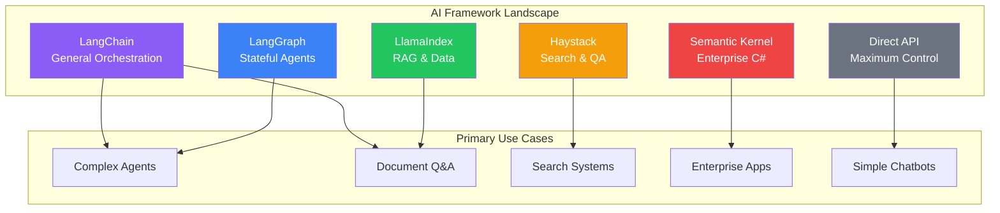
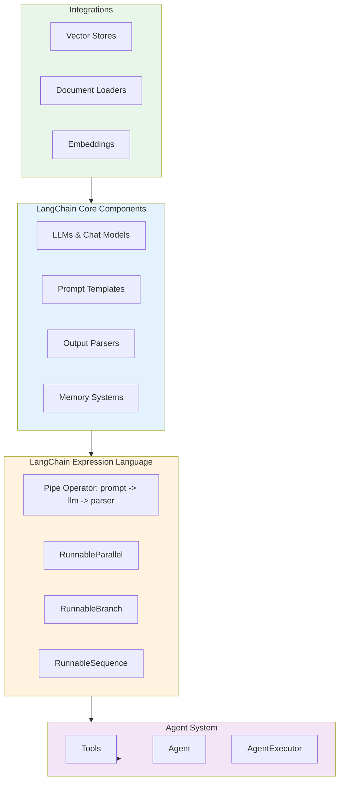
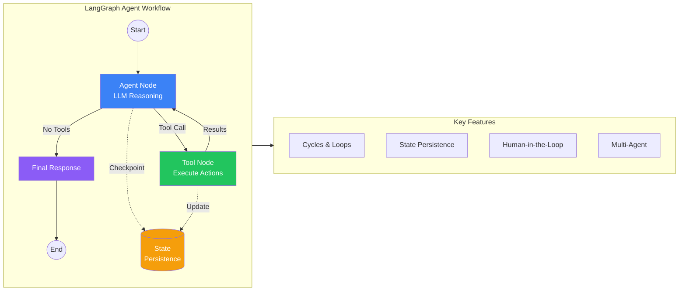
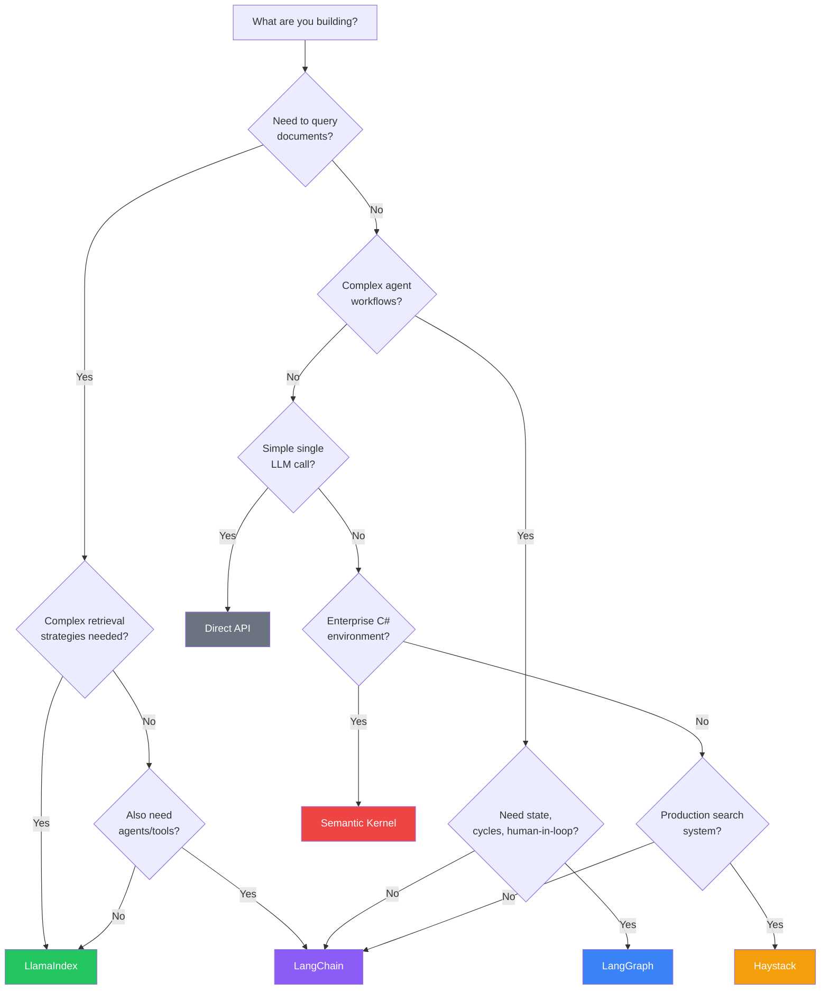

# Module 18: Framework Deep Dive - LangChain and Alternatives

**Part 3: Safe Use & Agentic Workflows** | **Duration**: 1 hour 30 minutes | **Difficulty**: Intermediate-Advanced

---

## Learning Objectives

By the end of this module, you will be able to:

- Understand why AI frameworks exist and their abstraction trade-offs
- Navigate LangChain architecture: chains, agents, memory, and LCEL
- Build graph-based workflows with LangGraph for complex agent systems
- Leverage LlamaIndex for production RAG pipelines
- Compare alternatives: Haystack, Semantic Kernel, and direct API use
- Choose the right tool for your specific use case

---

## Section 1: The Framework Landscape (10 minutes)

### Why Frameworks Exist

When you first call an LLM API, it feels simple. You send a prompt, you get a response. Why would you need a framework?

Then reality hits:

**Challenge 1: Composition**. You need to chain multiple calls. First, classify the query. Then, based on classification, route to different prompts. Then, validate the output. Then, maybe retry with corrections. Suddenly you're writing orchestration code.

**Challenge 2: Memory**. Your chatbot needs to remember previous messages. Easy for 10 messages, but what about 1000? You need summarization, windowing, or vector storage. You're writing memory management code.

**Challenge 3: Tools**. Your agent needs to search the web, query a database, run code. Each tool has different interfaces. You're writing tool integration code.

**Challenge 4: RAG**. You need to retrieve context from documents. That means embeddings, chunking, vector stores, retrieval strategies. You're writing an entire retrieval pipeline.

**Challenge 5: Production**. You need logging, tracing, evaluation, error handling, rate limiting, caching. You're writing infrastructure code.

Frameworks exist to solve these recurring problems. They provide:

- **Abstractions**: Reusable components for common patterns
- **Composability**: Ways to combine components into pipelines
- **Integrations**: Pre-built connections to LLMs, vector stores, tools
- **Best practices**: Patterns that work, encoded into APIs

### The Abstraction Trade-off

Frameworks trade simplicity for flexibility. More abstraction means:

**Pros**:

- Faster development for common use cases
- Less boilerplate code
- Community-tested patterns
- Ecosystem of integrations

**Cons**:

- Learning curve for the framework itself
- Less control over implementation details
- Debugging through abstraction layers
- Dependency on external library updates
- Potential performance overhead

The key question: **does the framework accelerate your specific use case more than it slows you down?**

For a simple chatbot: probably no framework needed.
For a production RAG system with multiple retrieval strategies: probably yes.
For a novel research project: maybe not, you need flexibility.

### The Major Players

The AI framework landscape in 2025 includes several major options:

**LangChain**: The most popular, feature-rich, but also most complex. Strong in composition and agents. Best for: general-purpose LLM applications.

**LangGraph**: LangChain's companion for stateful, graph-based agent workflows. Best for: complex multi-step agents with cycles and state.

**LlamaIndex**: Focused on data indexing and retrieval. Best for: RAG applications, knowledge bases.

**Haystack**: End-to-end NLP framework with modular pipelines. Best for: production search and QA systems.

**Semantic Kernel**: Microsoft's orchestration framework. Best for: enterprise C#/.NET environments, tight Azure integration.

**Direct API use**: No framework, just HTTP calls. Best for: simple use cases, maximum control, learning fundamentals.

We'll explore each, then develop a decision framework for choosing.

---

## Section 2: LangChain Deep Dive (25 minutes)

### What is LangChain?

LangChain is a framework for developing applications powered by language models. It provides:

1. **Components**: Modular abstractions for working with LLMs
2. **Chains**: Ways to combine components into multi-step workflows
3. **Agents**: Systems that use LLMs to choose actions dynamically
4. **Memory**: Systems for persisting state across interactions
5. **Integrations**: Connections to 50+ LLM providers, vector stores, tools

LangChain's philosophy: make LLM development "composable"—build complex applications by connecting simple, reusable components.

### Core Abstractions

**LLMs and Chat Models**: Wrappers around language model APIs.

```python
from langchain_openai import ChatOpenAI
from langchain_anthropic import ChatAnthropic

# Initialize a chat model
llm = ChatOpenAI(model="gpt-4", temperature=0)

# Or use Claude
llm = ChatAnthropic(model="claude-sonnet-4-20250514")

# Simple invocation
response = llm.invoke("What is the capital of France?")
print(response.content)
```

**Prompts**: Templates for constructing inputs to LLMs.

```python
from langchain_core.prompts import ChatPromptTemplate

# Create a reusable prompt template
prompt = ChatPromptTemplate.from_messages([
    ("system", "You are a helpful assistant that translates {input_language} to {output_language}."),
    ("human", "{text}")
])

# Format with variables
formatted = prompt.format_messages(
    input_language="English",
    output_language="French",
    text="Hello, how are you?"
)
```

**Output Parsers**: Structured extraction from LLM responses.

```python
from langchain_core.output_parsers import JsonOutputParser
from pydantic import BaseModel, Field

class MovieReview(BaseModel):
    title: str = Field(description="Movie title")
    rating: int = Field(description="Rating from 1-10")
    summary: str = Field(description="Brief summary")

parser = JsonOutputParser(pydantic_object=MovieReview)

# Include format instructions in prompt
prompt = ChatPromptTemplate.from_messages([
    ("system", "Extract movie review information.\n{format_instructions}"),
    ("human", "{review}")
])

# Chain them together
chain = prompt | llm | parser
result = chain.invoke({
    "review": "Inception was mind-blowing! A solid 9/10...",
    "format_instructions": parser.get_format_instructions()
})
# result is a structured MovieReview object
```

### LangChain Expression Language (LCEL)

LCEL is LangChain's declarative syntax for composing chains. The pipe operator (`|`) connects components:

```python
# Simple chain: prompt -> model -> parser
chain = prompt | llm | parser

# Invoke the chain
result = chain.invoke({"text": "some input"})

# Stream outputs
for chunk in chain.stream({"text": "some input"}):
    print(chunk, end="")

# Batch process
results = chain.batch([{"text": "input1"}, {"text": "input2"}])

# Async
result = await chain.ainvoke({"text": "some input"})
```

LCEL provides:

- **Streaming**: First-class support for streaming outputs
- **Async**: Native async/await support
- **Batching**: Efficient parallel processing
- **Retries**: Built-in retry logic
- **Tracing**: Automatic logging for debugging

**Complex LCEL patterns**:

```python
from langchain_core.runnables import RunnableParallel, RunnableLambda

# Parallel execution
parallel_chain = RunnableParallel(
    summary=summarize_chain,
    sentiment=sentiment_chain,
    entities=entity_chain
)

# All three run in parallel on the same input
results = parallel_chain.invoke({"document": "..."})
# results = {"summary": "...", "sentiment": "positive", "entities": [...]}

# Conditional routing
from langchain_core.runnables import RunnableBranch

route_chain = RunnableBranch(
    (lambda x: "code" in x["query"].lower(), code_chain),
    (lambda x: "math" in x["query"].lower(), math_chain),
    default_chain  # fallback
)

# Transforms with lambdas
chain = (
    RunnableLambda(lambda x: x["text"].upper())  # Pre-process
    | prompt
    | llm
    | RunnableLambda(lambda x: {"result": x.content, "length": len(x.content)})  # Post-process
)
```

### Memory Systems

LangChain provides several memory strategies:

**Conversation Buffer Memory**: Store all messages.

```python
from langchain.memory import ConversationBufferMemory

memory = ConversationBufferMemory()
memory.save_context({"input": "Hi"}, {"output": "Hello! How can I help?"})
memory.save_context({"input": "What's the weather?"}, {"output": "I don't have access to weather data."})

# Retrieve conversation history
print(memory.load_memory_variables({}))
# {'history': 'Human: Hi\nAI: Hello! How can I help?\nHuman: What\'s the weather?\nAI: I don\'t have access to weather data.'}
```

**Conversation Buffer Window Memory**: Keep only recent N messages.

```python
from langchain.memory import ConversationBufferWindowMemory

memory = ConversationBufferWindowMemory(k=2)  # Keep last 2 exchanges
```

**Conversation Summary Memory**: Summarize older messages.

```python
from langchain.memory import ConversationSummaryMemory

memory = ConversationSummaryMemory(llm=llm)
# Automatically summarizes conversation as it grows
```

**Vector Store Memory**: Store messages in a vector database for semantic retrieval.

```python
from langchain.memory import VectorStoreRetrieverMemory
from langchain_community.vectorstores import Chroma
from langchain_openai import OpenAIEmbeddings

vectorstore = Chroma(embedding_function=OpenAIEmbeddings())
retriever = vectorstore.as_retriever(search_kwargs={"k": 5})
memory = VectorStoreRetrieverMemory(retriever=retriever)

# Semantically search past conversations
```

### Building Agents

Agents use LLMs to decide which actions to take. They have access to tools and can reason about how to use them.

```python
from langchain.agents import create_tool_calling_agent, AgentExecutor
from langchain_core.tools import tool
from langchain_openai import ChatOpenAI

# Define tools
@tool
def search_web(query: str) -> str:
    """Search the web for information."""
    # Implementation here
    return f"Results for: {query}"

@tool
def calculate(expression: str) -> str:
    """Evaluate a mathematical expression."""
    try:
        return str(eval(expression))  # Simplified; use safer eval in production
    except:
        return "Could not evaluate expression"

@tool
def get_weather(city: str) -> str:
    """Get current weather for a city."""
    # Implementation here
    return f"Weather in {city}: 72F, sunny"

tools = [search_web, calculate, get_weather]

# Create agent
llm = ChatOpenAI(model="gpt-4")
prompt = ChatPromptTemplate.from_messages([
    ("system", "You are a helpful assistant with access to tools."),
    ("placeholder", "{chat_history}"),
    ("human", "{input}"),
    ("placeholder", "{agent_scratchpad}")
])

agent = create_tool_calling_agent(llm, tools, prompt)
agent_executor = AgentExecutor(agent=agent, tools=tools, verbose=True)

# Run agent
result = agent_executor.invoke({
    "input": "What's 25 * 4, and what's the weather in Paris?",
    "chat_history": []
})
```

The agent will:

1. Analyze the query
2. Decide to use `calculate` for "25 \* 4"
3. Decide to use `get_weather` for Paris weather
4. Combine results into a coherent response

### When to Use LangChain

**Good fit**:

- You need to combine multiple LLM providers
- You want pre-built integrations (50+ vector stores, tools, etc.)
- You're building standard patterns: RAG, agents, chatbots
- You value ecosystem and community support
- You want built-in streaming and async support

**Poor fit**:

- Simple single-call applications
- You need maximum performance (abstractions add overhead)
- You want to understand every detail of what's happening
- You're doing novel research that doesn't fit standard patterns
- You prefer minimal dependencies

### LangChain Gotchas

**Version churn**: LangChain evolves rapidly. APIs change frequently. Pin your versions.

**Complexity creep**: Easy to over-abstract. Start simple, add complexity only when needed.

**Debugging difficulty**: Errors can be hard to trace through multiple abstraction layers. Use verbose mode and LangSmith tracing.

**Documentation gaps**: Documentation sometimes lags behind code changes. Read the source code when docs are unclear.

---

## Section 3: LangGraph for Agents (20 minutes)

### Why LangGraph?

Standard LangChain agents follow a loop: think -> act -> observe -> repeat. This works for simple tasks but struggles with:

- **Complex branching**: Different paths based on intermediate results
- **Cycles and loops**: Revisiting previous steps with new information
- **Persistent state**: Maintaining rich state across steps
- **Human-in-the-loop**: Pausing for human input at specific points
- **Error recovery**: Graceful handling of failures mid-workflow

LangGraph addresses these by modeling agents as **graphs**:

- **Nodes** are functions that do work (call LLMs, tools, etc.)
- **Edges** define transitions between nodes
- **State** flows through the graph and persists across steps

### Core Concepts

**State**: A typed schema that flows through the graph.

```python
from typing import TypedDict, Annotated, List
from langgraph.graph import StateGraph
from langchain_core.messages import BaseMessage
import operator

class AgentState(TypedDict):
    messages: Annotated[List[BaseMessage], operator.add]
    current_step: str
    tool_results: dict
    iteration_count: int
```

**Nodes**: Functions that take state and return updated state.

```python
def call_model(state: AgentState) -> AgentState:
    """Node that calls the LLM."""
    messages = state["messages"]
    response = llm.invoke(messages)
    return {"messages": [response]}

def call_tool(state: AgentState) -> AgentState:
    """Node that executes a tool."""
    last_message = state["messages"][-1]
    tool_call = last_message.tool_calls[0]
    result = execute_tool(tool_call)
    return {"tool_results": {tool_call["name"]: result}}
```

**Edges**: Define flow between nodes.

```python
from langgraph.graph import END

# Conditional edge based on state
def should_continue(state: AgentState) -> str:
    last_message = state["messages"][-1]
    if last_message.tool_calls:
        return "call_tool"
    return END

# Build graph
workflow = StateGraph(AgentState)

# Add nodes
workflow.add_node("agent", call_model)
workflow.add_node("call_tool", call_tool)

# Add edges
workflow.set_entry_point("agent")
workflow.add_conditional_edges(
    "agent",
    should_continue,
    {
        "call_tool": "call_tool",
        END: END
    }
)
workflow.add_edge("call_tool", "agent")  # Loop back after tool call

# Compile
app = workflow.compile()
```

### Building a ReAct Agent with LangGraph

ReAct (Reasoning + Acting) is a pattern where the agent reasons about what to do, takes an action, observes the result, and repeats.

```python
from langgraph.graph import StateGraph, END
from langgraph.prebuilt import ToolNode
from langchain_openai import ChatOpenAI
from langchain_core.messages import HumanMessage, AIMessage
from typing import TypedDict, Annotated, List
import operator

# Define state
class AgentState(TypedDict):
    messages: Annotated[List, operator.add]

# Define tools
@tool
def search(query: str) -> str:
    """Search for information."""
    return f"Search results for: {query}"

@tool
def calculator(expression: str) -> str:
    """Calculate mathematical expressions."""
    return str(eval(expression))

tools = [search, calculator]
tool_node = ToolNode(tools)

# Bind tools to model
model = ChatOpenAI(model="gpt-4").bind_tools(tools)

# Define nodes
def call_model(state: AgentState):
    messages = state["messages"]
    response = model.invoke(messages)
    return {"messages": [response]}

def should_continue(state: AgentState):
    messages = state["messages"]
    last_message = messages[-1]
    if last_message.tool_calls:
        return "tools"
    return END

# Build graph
workflow = StateGraph(AgentState)
workflow.add_node("agent", call_model)
workflow.add_node("tools", tool_node)

workflow.set_entry_point("agent")
workflow.add_conditional_edges("agent", should_continue, {"tools": "tools", END: END})
workflow.add_edge("tools", "agent")

# Compile
app = workflow.compile()

# Run
result = app.invoke({
    "messages": [HumanMessage(content="What is 25 * 47? Then search for Python tutorials.")]
})
```

### State Persistence and Checkpointing

LangGraph supports persistent state, enabling pause/resume and human-in-the-loop workflows.

```python
from langgraph.checkpoint.memory import MemorySaver

# Add checkpointing
memory = MemorySaver()
app = workflow.compile(checkpointer=memory)

# Run with thread ID for persistence
config = {"configurable": {"thread_id": "user-123"}}
result = app.invoke({"messages": [HumanMessage(content="Hi!")]}, config)

# Later, continue the same conversation
result = app.invoke({"messages": [HumanMessage(content="What did I say before?")]}, config)
```

### Human-in-the-Loop

LangGraph can pause for human approval before sensitive actions.

```python
from langgraph.graph import StateGraph, END
from langgraph.checkpoint.memory import MemorySaver

class State(TypedDict):
    messages: list
    pending_action: str
    approved: bool

def check_approval(state: State):
    if state.get("pending_action") and not state.get("approved"):
        return "wait_for_human"
    return "continue"

workflow = StateGraph(State)
workflow.add_node("agent", agent_node)
workflow.add_node("wait_for_human", lambda s: s)  # Pause point
workflow.add_node("execute_action", execute_action_node)

workflow.add_conditional_edges("agent", check_approval)
workflow.add_edge("wait_for_human", "execute_action")  # After human approves

# Compile with interrupt_before for the human step
app = workflow.compile(
    checkpointer=MemorySaver(),
    interrupt_before=["execute_action"]
)

# Run until it hits the interrupt
result = app.invoke(initial_state, config)

# Human reviews and approves
app.update_state(config, {"approved": True})

# Continue execution
result = app.invoke(None, config)  # Resume from checkpoint
```

### Multi-Agent Systems

LangGraph excels at coordinating multiple agents.

```python
class MultiAgentState(TypedDict):
    messages: list
    current_agent: str
    research_complete: bool
    writing_complete: bool

def researcher_node(state: MultiAgentState):
    """Research agent gathers information."""
    # Use research-focused prompt and tools
    response = researcher_llm.invoke(state["messages"])
    return {"messages": [response], "research_complete": True}

def writer_node(state: MultiAgentState):
    """Writer agent creates content from research."""
    # Use writing-focused prompt
    response = writer_llm.invoke(state["messages"])
    return {"messages": [response], "writing_complete": True}

def reviewer_node(state: MultiAgentState):
    """Reviewer agent critiques the draft."""
    response = reviewer_llm.invoke(state["messages"])
    return {"messages": [response]}

def route(state: MultiAgentState):
    if not state.get("research_complete"):
        return "researcher"
    elif not state.get("writing_complete"):
        return "writer"
    else:
        return "reviewer"

workflow = StateGraph(MultiAgentState)
workflow.add_node("researcher", researcher_node)
workflow.add_node("writer", writer_node)
workflow.add_node("reviewer", reviewer_node)

workflow.set_entry_point("researcher")
workflow.add_conditional_edges("researcher", route)
workflow.add_conditional_edges("writer", route)
workflow.add_edge("reviewer", END)

app = workflow.compile()
```

### When to Use LangGraph

**Good fit**:

- Complex agent workflows with branching logic
- Workflows that need to loop or cycle
- Human-in-the-loop requirements
- Multi-agent coordination
- Long-running tasks that need persistence
- You need fine-grained control over agent behavior

**Poor fit**:

- Simple linear chains (use LCEL)
- One-shot LLM calls
- You don't need stateful workflows
- Simpler agent patterns work fine

---

## Section 4: LlamaIndex for RAG (15 minutes)

### What is LlamaIndex?

LlamaIndex (formerly GPT Index) is a framework specifically designed for connecting LLMs to data. While LangChain is general-purpose, LlamaIndex focuses deeply on:

- **Data ingestion**: Loading documents from various sources
- **Indexing**: Structuring data for efficient retrieval
- **Querying**: Retrieving and synthesizing information
- **RAG optimization**: Advanced retrieval and generation strategies

If your primary task is "help an LLM understand my documents," LlamaIndex is purpose-built for this.

### Core Abstractions

**Documents and Nodes**: The basic units of data.

```python
from llama_index.core import Document, SimpleDirectoryReader

# Load documents from a directory
documents = SimpleDirectoryReader("./data").load_data()

# Or create documents manually
doc = Document(
    text="LlamaIndex is a data framework for LLM applications.",
    metadata={"source": "website", "date": "2024-01-15"}
)
```

**Indices**: Data structures that organize nodes for retrieval.

```python
from llama_index.core import VectorStoreIndex

# Create a vector index (most common)
index = VectorStoreIndex.from_documents(documents)

# Persist to disk
index.storage_context.persist(persist_dir="./storage")

# Load from disk
from llama_index.core import StorageContext, load_index_from_storage
storage_context = StorageContext.from_defaults(persist_dir="./storage")
index = load_index_from_storage(storage_context)
```

**Query Engines**: Interfaces for querying indices.

```python
# Create a query engine
query_engine = index.as_query_engine()

# Query
response = query_engine.query("What is LlamaIndex?")
print(response)
```

### Advanced Indexing Strategies

**Vector Store Index**: Embed chunks, retrieve by similarity.

```python
from llama_index.core import VectorStoreIndex

index = VectorStoreIndex.from_documents(
    documents,
    show_progress=True
)
```

**Summary Index**: Summarize documents for retrieval.

```python
from llama_index.core import SummaryIndex

index = SummaryIndex.from_documents(documents)
# Better for questions requiring holistic understanding
```

**Tree Index**: Hierarchical structure for large documents.

```python
from llama_index.core import TreeIndex

index = TreeIndex.from_documents(documents)
# Good for documents with inherent hierarchy
```

**Keyword Table Index**: Extract and index keywords.

```python
from llama_index.core import KeywordTableIndex

index = KeywordTableIndex.from_documents(documents)
# Good for keyword-based queries
```

### Node Parsing and Chunking

Chunking strategy dramatically affects RAG quality.

```python
from llama_index.core.node_parser import (
    SentenceSplitter,
    SemanticSplitterNodeParser,
    HierarchicalNodeParser
)
from llama_index.embeddings.openai import OpenAIEmbedding

# Simple chunking by sentences/tokens
splitter = SentenceSplitter(
    chunk_size=1024,
    chunk_overlap=200
)
nodes = splitter.get_nodes_from_documents(documents)

# Semantic chunking (split at semantic boundaries)
semantic_splitter = SemanticSplitterNodeParser(
    buffer_size=1,
    breakpoint_percentile_threshold=95,
    embed_model=OpenAIEmbedding()
)
nodes = semantic_splitter.get_nodes_from_documents(documents)

# Hierarchical chunking (parent/child relationships)
hierarchical_splitter = HierarchicalNodeParser.from_defaults(
    chunk_sizes=[2048, 512, 128]
)
nodes = hierarchical_splitter.get_nodes_from_documents(documents)
```

### Query Transformations

Improve retrieval by transforming queries.

```python
from llama_index.core.indices.query.query_transform import HyDEQueryTransform
from llama_index.core.query_engine import TransformQueryEngine

# HyDE: Generate hypothetical document, then retrieve
hyde = HyDEQueryTransform(include_original=True)
query_engine = TransformQueryEngine(
    base_query_engine,
    query_transform=hyde
)

# Multi-step query decomposition
from llama_index.core.query_engine import MultiStepQueryEngine
from llama_index.core.indices.query.query_transform.base import StepDecomposeQueryTransform

step_decompose_transform = StepDecomposeQueryTransform(llm=llm, verbose=True)
query_engine = MultiStepQueryEngine(
    query_engine=base_query_engine,
    query_transform=step_decompose_transform,
    num_steps=3
)
```

### Response Synthesis

Control how retrieved nodes are combined into responses.

```python
from llama_index.core import get_response_synthesizer
from llama_index.core.response_synthesizers import ResponseMode

# Compact: stuff all nodes into one prompt
synthesizer = get_response_synthesizer(response_mode=ResponseMode.COMPACT)

# Refine: iterate through nodes, refining answer
synthesizer = get_response_synthesizer(response_mode=ResponseMode.REFINE)

# Tree summarize: hierarchical summarization
synthesizer = get_response_synthesizer(response_mode=ResponseMode.TREE_SUMMARIZE)

# Simple summarize: concatenate and summarize
synthesizer = get_response_synthesizer(response_mode=ResponseMode.SIMPLE_SUMMARIZE)
```

### Building a Production RAG Pipeline

```python
from llama_index.core import (
    VectorStoreIndex,
    SimpleDirectoryReader,
    Settings,
    StorageContext
)
from llama_index.embeddings.openai import OpenAIEmbedding
from llama_index.llms.openai import OpenAI
from llama_index.vector_stores.chroma import ChromaVectorStore
import chromadb

# Configure global settings
Settings.llm = OpenAI(model="gpt-4", temperature=0)
Settings.embed_model = OpenAIEmbedding(model="text-embedding-3-small")

# Load documents
documents = SimpleDirectoryReader("./data", recursive=True).load_data()

# Set up persistent vector store
chroma_client = chromadb.PersistentClient(path="./chroma_db")
chroma_collection = chroma_client.get_or_create_collection("my_collection")
vector_store = ChromaVectorStore(chroma_collection=chroma_collection)
storage_context = StorageContext.from_defaults(vector_store=vector_store)

# Create index
index = VectorStoreIndex.from_documents(
    documents,
    storage_context=storage_context,
    show_progress=True
)

# Create query engine with customizations
query_engine = index.as_query_engine(
    similarity_top_k=5,
    response_mode="compact",
    streaming=True
)

# Query
response = query_engine.query("What are the key concepts?")
for text in response.response_gen:
    print(text, end="")
```

### When to Use LlamaIndex

**Good fit**:

- Primary focus is RAG / document Q&A
- You need sophisticated chunking and indexing strategies
- You want built-in query transformations (HyDE, etc.)
- You're building a knowledge base application
- You need fine control over retrieval pipeline

**Poor fit**:

- You don't have documents to index
- You need complex agent workflows (use LangGraph)
- Simple embedding + retrieve is sufficient
- You want maximum flexibility in pipeline design

---

## Section 5: Comparing Alternatives (15 minutes)

### Haystack

**What it is**: An end-to-end NLP framework from deepset, focused on production search and question answering systems.

**Philosophy**: Pipelines of modular components. Strong emphasis on production readiness: evaluation, deployment, monitoring.

**Key features**:

- Pipeline-based architecture
- Strong NLP heritage (pre-dates LLM era)
- Built-in evaluation framework
- Production-focused tooling

**Example**:

```python
from haystack import Pipeline
from haystack.components.retrievers import InMemoryEmbeddingRetriever
from haystack.components.generators import OpenAIGenerator
from haystack.components.builders import PromptBuilder
from haystack.document_stores.in_memory import InMemoryDocumentStore

# Create document store
document_store = InMemoryDocumentStore()

# Build RAG pipeline
rag_pipeline = Pipeline()
rag_pipeline.add_component("retriever", InMemoryEmbeddingRetriever(document_store))
rag_pipeline.add_component("prompt_builder", PromptBuilder(template="""
Given these documents: {{documents}}
Answer: {{question}}
"""))
rag_pipeline.add_component("llm", OpenAIGenerator(model="gpt-4"))

# Connect components
rag_pipeline.connect("retriever", "prompt_builder.documents")
rag_pipeline.connect("prompt_builder", "llm")

# Run
result = rag_pipeline.run({
    "retriever": {"query": "What is AI?"},
    "prompt_builder": {"question": "What is AI?"}
})
```

**When to use Haystack**:

- Building production search/QA systems
- Need strong evaluation capabilities
- Prefer explicit pipeline definitions over magic
- Coming from traditional NLP/search background
- Want self-hosted, enterprise-ready solution

### Semantic Kernel

**What it is**: Microsoft's AI orchestration framework, with strong C# and Python support.

**Philosophy**: "Kernel" that orchestrates "plugins" (skills/functions). Strong typing, enterprise patterns.

**Key features**:

- Native C# support (unique among frameworks)
- Deep Azure OpenAI integration
- "Planner" for automatic task decomposition
- Enterprise-grade architecture

**Example (Python)**:

```python
import semantic_kernel as sk
from semantic_kernel.connectors.ai.open_ai import AzureChatCompletion

# Create kernel
kernel = sk.Kernel()

# Add AI service
kernel.add_service(AzureChatCompletion(
    deployment_name="gpt-4",
    endpoint="https://your-endpoint.openai.azure.com/",
    api_key="your-key"
))

# Create a semantic function
summarize = kernel.create_function_from_prompt(
    "Summarize this text in one sentence: {{$input}}",
    function_name="summarize",
    plugin_name="TextPlugin"
)

# Run
result = await kernel.invoke(summarize, input="Long text here...")
```

**When to use Semantic Kernel**:

- C#/.NET environment
- Heavy Azure investment
- Enterprise compliance requirements
- Microsoft ecosystem alignment
- Prefer strongly-typed, explicit APIs

### Direct API Use

**What it is**: No framework—just HTTP calls or thin SDK wrappers.

**Philosophy**: Maximum control, minimum abstraction.

**Example**:

```python
from anthropic import Anthropic

client = Anthropic()

# Direct API call
response = client.messages.create(
    model="claude-sonnet-4-20250514",
    max_tokens=1024,
    messages=[
        {"role": "user", "content": "Explain quantum computing."}
    ]
)

print(response.content[0].text)

# With tool use
response = client.messages.create(
    model="claude-sonnet-4-20250514",
    max_tokens=1024,
    tools=[{
        "name": "get_weather",
        "description": "Get weather for a city",
        "input_schema": {
            "type": "object",
            "properties": {
                "city": {"type": "string", "description": "City name"}
            },
            "required": ["city"]
        }
    }],
    messages=[{"role": "user", "content": "What's the weather in Paris?"}]
)
```

**When to use direct APIs**:

- Simple, single-purpose applications
- Learning how LLMs work
- Maximum performance (no framework overhead)
- Novel use cases that don't fit framework patterns
- You want to understand every line of code
- Minimal dependencies required

### Comparison Matrix

| Feature               | LangChain             | LangGraph       | LlamaIndex | Haystack  | Semantic Kernel | Direct API  |
| --------------------- | --------------------- | --------------- | ---------- | --------- | --------------- | ----------- |
| **Primary focus**     | General orchestration | Stateful agents | RAG/Data   | Search/QA | Enterprise AI   | Raw calls   |
| **Learning curve**    | High                  | Medium          | Medium     | Medium    | Medium          | Low         |
| **Flexibility**       | High                  | High            | Medium     | Medium    | Medium          | Maximum     |
| **Abstraction level** | High                  | Medium          | Medium     | Medium    | High            | None        |
| **Production ready**  | Yes                   | Yes             | Yes        | Yes       | Yes             | Depends     |
| **Best for**          | Everything            | Complex agents  | Documents  | Search    | Enterprise      | Simple apps |
| **Community size**    | Large                 | Growing         | Large      | Medium    | Growing         | N/A         |
| **C# support**        | No                    | No              | No         | No        | Yes             | Varies      |

---

## Section 6: Making the Choice (5 minutes)

### Decision Framework

Ask these questions:

**1. What's your primary use case?**

- **Document Q&A / RAG**: Start with LlamaIndex
- **Complex agents with state**: Start with LangGraph
- **Search / QA system**: Consider Haystack
- **Enterprise C# environment**: Consider Semantic Kernel
- **Simple chatbot or single calls**: Start with direct API
- **General-purpose LLM app**: Consider LangChain

**2. How complex is your workflow?**

- **Linear pipeline**: LCEL or direct API
- **Branching logic**: LangGraph or Haystack
- **Cycles/loops**: LangGraph
- **Multi-agent**: LangGraph

**3. What's your team's expertise?**

- **Python developers**: LangChain, LlamaIndex, Haystack
- **C# developers**: Semantic Kernel
- **ML engineers**: Any framework, or direct API
- **New to AI**: Start simple (direct API), then add frameworks

**4. What are your production requirements?**

- **High throughput**: Direct API (least overhead)
- **Observability**: LangChain (LangSmith), Haystack (evaluation)
- **Enterprise compliance**: Semantic Kernel, Haystack

**5. How much do you value control vs. convenience?**

- **Maximum control**: Direct API
- **Balance**: LlamaIndex, Haystack
- **Maximum convenience**: LangChain

### The Hybrid Approach

You don't have to choose just one. Many production systems combine:

- **LlamaIndex** for document processing and retrieval
- **LangGraph** for agent orchestration
- **Direct API** for simple, performance-critical paths

```python
# Example: LlamaIndex for retrieval, LangGraph for orchestration
from llama_index.core import VectorStoreIndex
from langgraph.graph import StateGraph

# LlamaIndex handles document retrieval
index = VectorStoreIndex.from_documents(documents)
retriever = index.as_retriever()

# LangGraph handles the agent workflow
def retrieve_context(state):
    query = state["query"]
    nodes = retriever.retrieve(query)
    return {"context": [n.text for n in nodes]}

def generate_response(state):
    # Use retrieved context
    context = "\n".join(state["context"])
    response = llm.invoke(f"Context: {context}\n\nQuestion: {state['query']}")
    return {"response": response}

# Build hybrid workflow
workflow = StateGraph(State)
workflow.add_node("retrieve", retrieve_context)
workflow.add_node("generate", generate_response)
workflow.add_edge("retrieve", "generate")
```

### Start Simple, Add Complexity

The best advice: **start with the simplest approach that could work**.

1. Begin with direct API calls
2. Hit a pain point? Add a targeted tool
3. Building RAG? Try LlamaIndex
4. Need complex orchestration? Add LangGraph
5. Need everything? Consider LangChain

Don't start with the most complex framework because it might be useful someday. Start simple, and let actual needs drive tool adoption.

---

## Diagrams

### AI Framework Landscape Overview



### LangChain Architecture



### LangGraph Workflow Model



### Framework Decision Tree



---

## Knowledge Check

### Question 1

What is the primary trade-off when using AI frameworks like LangChain?

- A) Cost vs. performance
- B) Speed of development vs. flexibility and control
- C) Python vs. JavaScript compatibility
- D) Cloud vs. on-premise deployment

**Correct Answer**: B

**Explanation**: Frameworks trade flexibility for convenience. They accelerate development for common patterns but add abstraction layers that reduce control over implementation details. The key question is whether the framework accelerates your specific use case more than it constrains you. Simple applications often don't need frameworks; complex production systems often benefit from them.

### Question 2

When would LangGraph be a better choice than standard LangChain agents?

- A) When building a simple chatbot
- B) When you need single-shot LLM calls
- C) When building complex agents with cycles, state persistence, or human-in-the-loop requirements
- D) When you only need document retrieval

**Correct Answer**: C

**Explanation**: LangGraph excels at complex agent workflows that require features standard LangChain agents don't support well: cycles and loops (revisiting previous steps), persistent state across interactions, human-in-the-loop approval points, and multi-agent coordination. For simpler linear workflows, standard LCEL chains are sufficient. For document retrieval, LlamaIndex is purpose-built.

### Question 3

What makes LlamaIndex particularly well-suited for RAG applications?

- A) It has the largest community
- B) It provides sophisticated chunking, indexing, and query transformation strategies purpose-built for document Q&A
- C) It's the fastest framework
- D) It works with the most LLM providers

**Correct Answer**: B

**Explanation**: LlamaIndex is purpose-built for connecting LLMs to data. It provides sophisticated chunking strategies (semantic, hierarchical), multiple index types (vector, summary, tree, keyword), and advanced query transformations (HyDE, multi-step decomposition). While LangChain can do RAG, LlamaIndex goes deeper on the specific challenges of document retrieval and synthesis.

### Question 4

What is the best approach when you're unsure which framework to use?

- A) Start with the most feature-rich framework (LangChain)
- B) Start with direct API calls, then add framework tools as specific needs arise
- C) Use all frameworks together from the start
- D) Avoid frameworks entirely

**Correct Answer**: B

**Explanation**: Start simple and add complexity as needed. Direct API calls have zero framework overhead and maximum control. When you hit a specific pain point (memory management, complex orchestration, document retrieval), add a targeted tool. This approach avoids premature complexity and ensures you understand what each framework component is doing for you.

---

## Hands-On Exercise: Framework Comparison Project

### Objective

Build the same application—a RAG-powered Q&A system—using three different approaches: direct API, LlamaIndex, and LangChain. Compare the developer experience, code complexity, and capabilities.

### Time Required

60-90 minutes

### Prerequisites

- Python 3.9+
- API key for OpenAI or Anthropic
- Sample documents to query (we'll provide examples)

### Setup

Install required libraries:

```bash
pip install openai anthropic llama-index langchain langchain-openai chromadb
```

Create a sample documents directory:

```bash
mkdir -p ./docs
```

Create sample documents (or use your own):

```python
# save as create_docs.py
docs = [
    ("python_basics.txt", """
Python is a high-level, interpreted programming language. It emphasizes code readability
with its use of significant indentation. Python supports multiple programming paradigms,
including procedural, object-oriented, and functional programming.

Key features of Python:
- Dynamic typing
- Automatic memory management
- Large standard library
- Cross-platform compatibility

Python was created by Guido van Rossum and first released in 1991.
"""),
    ("machine_learning.txt", """
Machine learning is a subset of artificial intelligence that enables systems to learn
and improve from experience without being explicitly programmed. It focuses on developing
algorithms that can access data and use it to learn for themselves.

Types of machine learning:
1. Supervised learning - learns from labeled training data
2. Unsupervised learning - finds patterns in unlabeled data
3. Reinforcement learning - learns through trial and error

Popular ML libraries include scikit-learn, TensorFlow, and PyTorch.
"""),
    ("transformers.txt", """
Transformers are a neural network architecture introduced in the paper "Attention Is All
You Need" (2017). They rely entirely on self-attention mechanisms, dispensing with
recurrence and convolutions entirely.

Key components:
- Self-attention mechanism
- Multi-head attention
- Positional encoding
- Feed-forward networks

Transformers power modern LLMs like GPT, Claude, and LLaMA.
""")
]

import os
os.makedirs("./docs", exist_ok=True)
for filename, content in docs:
    with open(f"./docs/{filename}", "w") as f:
        f.write(content.strip())
print("Created sample documents in ./docs/")
```

### Part 1: Direct API Approach (20 minutes)

Build a simple RAG system using only the OpenAI API.

```python
# direct_api_rag.py
import os
from openai import OpenAI

client = OpenAI()

def load_documents(directory):
    """Load all text files from a directory."""
    documents = []
    for filename in os.listdir(directory):
        if filename.endswith(".txt"):
            with open(os.path.join(directory, filename)) as f:
                documents.append({
                    "filename": filename,
                    "content": f.read()
                })
    return documents

def get_embedding(text):
    """Get embedding for a text."""
    response = client.embeddings.create(
        model="text-embedding-3-small",
        input=text
    )
    return response.data[0].embedding

def cosine_similarity(a, b):
    """Calculate cosine similarity between two vectors."""
    import math
    dot_product = sum(x * y for x, y in zip(a, b))
    norm_a = math.sqrt(sum(x * x for x in a))
    norm_b = math.sqrt(sum(x * x for x in b))
    return dot_product / (norm_a * norm_b)

def retrieve_relevant(query, documents, top_k=2):
    """Retrieve most relevant documents for a query."""
    query_embedding = get_embedding(query)

    scored = []
    for doc in documents:
        doc_embedding = get_embedding(doc["content"])
        score = cosine_similarity(query_embedding, doc_embedding)
        scored.append((score, doc))

    scored.sort(reverse=True, key=lambda x: x[0])
    return [doc for _, doc in scored[:top_k]]

def generate_answer(query, context_docs):
    """Generate answer using retrieved context."""
    context = "\n\n".join([
        f"Document: {doc['filename']}\n{doc['content']}"
        for doc in context_docs
    ])

    response = client.chat.completions.create(
        model="gpt-4",
        messages=[
            {"role": "system", "content": "Answer questions based on the provided context. If the context doesn't contain the answer, say so."},
            {"role": "user", "content": f"Context:\n{context}\n\nQuestion: {query}"}
        ]
    )
    return response.choices[0].message.content

def main():
    # Load documents
    documents = load_documents("./docs")
    print(f"Loaded {len(documents)} documents")

    # Query
    query = "What are the key features of Python?"

    # Retrieve
    relevant_docs = retrieve_relevant(query, documents)
    print(f"\nRetrieved {len(relevant_docs)} relevant documents")

    # Generate
    answer = generate_answer(query, relevant_docs)
    print(f"\nAnswer: {answer}")

if __name__ == "__main__":
    main()
```

**Document your observations**:

```
Lines of code: ___
Time to implement: ___
What was easy: ___
What was hard: ___
Limitations noticed: ___
```

### Part 2: LlamaIndex Approach (20 minutes)

Build the same system using LlamaIndex.

```python
# llamaindex_rag.py
from llama_index.core import (
    VectorStoreIndex,
    SimpleDirectoryReader,
    Settings
)
from llama_index.embeddings.openai import OpenAIEmbedding
from llama_index.llms.openai import OpenAI

# Configure settings
Settings.llm = OpenAI(model="gpt-4", temperature=0)
Settings.embed_model = OpenAIEmbedding(model="text-embedding-3-small")

def main():
    # Load documents (one line!)
    documents = SimpleDirectoryReader("./docs").load_data()
    print(f"Loaded {len(documents)} documents")

    # Create index (handles chunking, embedding automatically)
    index = VectorStoreIndex.from_documents(documents, show_progress=True)

    # Create query engine
    query_engine = index.as_query_engine(similarity_top_k=2)

    # Query
    query = "What are the key features of Python?"
    response = query_engine.query(query)

    print(f"\nAnswer: {response}")
    print(f"\nSources: {[node.node.metadata for node in response.source_nodes]}")

if __name__ == "__main__":
    main()
```

**Document your observations**:

```
Lines of code: ___
Time to implement: ___
What was easy: ___
What was hard: ___
Features you got "for free": ___
```

### Part 3: LangChain Approach (20 minutes)

Build the same system using LangChain.

```python
# langchain_rag.py
from langchain_community.document_loaders import DirectoryLoader, TextLoader
from langchain.text_splitter import RecursiveCharacterTextSplitter
from langchain_openai import OpenAIEmbeddings, ChatOpenAI
from langchain_community.vectorstores import Chroma
from langchain_core.prompts import ChatPromptTemplate
from langchain_core.runnables import RunnablePassthrough
from langchain_core.output_parsers import StrOutputParser

def format_docs(docs):
    return "\n\n".join(doc.page_content for doc in docs)

def main():
    # Load documents
    loader = DirectoryLoader("./docs", glob="*.txt", loader_cls=TextLoader)
    documents = loader.load()
    print(f"Loaded {len(documents)} documents")

    # Split into chunks
    splitter = RecursiveCharacterTextSplitter(chunk_size=500, chunk_overlap=50)
    chunks = splitter.split_documents(documents)
    print(f"Split into {len(chunks)} chunks")

    # Create vector store
    embeddings = OpenAIEmbeddings(model="text-embedding-3-small")
    vectorstore = Chroma.from_documents(chunks, embeddings)
    retriever = vectorstore.as_retriever(search_kwargs={"k": 2})

    # Create RAG chain
    prompt = ChatPromptTemplate.from_template("""
Answer the question based on the following context:

{context}

Question: {question}

Answer:""")

    llm = ChatOpenAI(model="gpt-4", temperature=0)

    rag_chain = (
        {"context": retriever | format_docs, "question": RunnablePassthrough()}
        | prompt
        | llm
        | StrOutputParser()
    )

    # Query
    query = "What are the key features of Python?"
    answer = rag_chain.invoke(query)

    print(f"\nAnswer: {answer}")

if __name__ == "__main__":
    main()
```

**Document your observations**:

```
Lines of code: ___
Time to implement: ___
What was easy: ___
What was hard: ___
LCEL learning curve: ___
```

### Part 4: Comparison Analysis (15 minutes)

Create a comparison table:

| Aspect                   | Direct API | LlamaIndex | LangChain |
| ------------------------ | ---------- | ---------- | --------- |
| Lines of code            |            |            |           |
| Setup complexity         |            |            |           |
| Readability              |            |            |           |
| Flexibility              |            |            |           |
| Features included        |            |            |           |
| Error messages           |            |            |           |
| Documentation quality    |            |            |           |
| Would use for production |            |            |           |

### Part 5: Extension Challenges (Optional)

Try these extensions with your preferred approach:

1. **Add streaming**: Make the answer stream token by token
2. **Add memory**: Make it a chatbot that remembers previous questions
3. **Add re-ranking**: Implement a second-stage re-ranking of retrieved documents
4. **Add evaluation**: Measure retrieval quality with ground truth Q&A pairs

### Reflection Questions

1. Which approach would you choose for a quick prototype? Why?

2. Which approach would you choose for production? Why?

3. What framework features saved you the most time?

4. What framework abstractions got in your way?

5. How would your choice change for a different use case (e.g., complex agents, simple chatbot)?

### Success Criteria

You've successfully completed this exercise if you:

- [ ] Implemented RAG with all three approaches
- [ ] Successfully queried documents with each approach
- [ ] Documented comparative observations
- [ ] Identified trade-offs between approaches
- [ ] Formed a reasoned opinion on when to use each

---

## Summary

In this module, you've learned:

1. **Why frameworks exist**: They solve recurring problems in LLM application development—composition, memory, tools, RAG, and production infrastructure. The trade-off is always flexibility vs. convenience.

2. **LangChain deep dive**: The most comprehensive framework, offering components (LLMs, prompts, parsers, memory), LCEL for composition, agents for dynamic tool use, and 50+ integrations. Best for general-purpose LLM applications, but has a steep learning curve.

3. **LangGraph for agents**: Graph-based workflow engine for complex agent systems. Excels at cycles, state persistence, human-in-the-loop, and multi-agent coordination. Use when standard agent patterns aren't sufficient.

4. **LlamaIndex for RAG**: Purpose-built for connecting LLMs to data. Sophisticated chunking, indexing strategies, and query transformations. Best choice when document Q&A is your primary use case.

5. **Alternative frameworks**: Haystack (production search/QA), Semantic Kernel (enterprise C#), and direct API use (maximum control). Each has its niche.

6. **Making the choice**: Start simple with direct APIs. Add framework tools as specific needs arise. Consider a hybrid approach using the best tool for each part of your system.

The key insight: **there is no universally best framework**. The right choice depends on your use case, team expertise, and production requirements. Start simple, understand what each tool offers, and add complexity only when it solves a real problem.

---

## References

### Framework Documentation

1. **LangChain Documentation**
   Comprehensive documentation for LangChain and LCEL.
   [python.langchain.com/docs](https://python.langchain.com/docs/)

2. **LangGraph Documentation**
   Guide to building stateful, graph-based agent workflows.
   [langchain-ai.github.io/langgraph](https://langchain-ai.github.io/langgraph/)

3. **LlamaIndex Documentation**
   Complete guide to data indexing and RAG with LlamaIndex.
   [docs.llamaindex.ai](https://docs.llamaindex.ai/)

4. **Haystack Documentation**
   End-to-end NLP framework documentation.
   [docs.haystack.deepset.ai](https://docs.haystack.deepset.ai/)

5. **Semantic Kernel Documentation**
   Microsoft's AI orchestration framework.
   [learn.microsoft.com/semantic-kernel](https://learn.microsoft.com/en-us/semantic-kernel/)

### Tutorials and Guides

6. **LangChain Cookbook**
   Practical recipes for common LangChain patterns.
   [github.com/langchain-ai/langchain/cookbook](https://github.com/langchain-ai/langchain/tree/master/cookbook)

7. **LlamaIndex Starter Tutorials**
   Step-by-step guides for RAG applications.
   [docs.llamaindex.ai/en/stable/getting_started](https://docs.llamaindex.ai/en/stable/getting_started/)

8. **Building LLM Applications with LangGraph** - DeepLearning.AI
   Free course on graph-based agent workflows.
   [deeplearning.ai/short-courses](https://www.deeplearning.ai/short-courses/)

### Comparison Resources

9. **"LangChain vs LlamaIndex"** - Various blog posts
   Community comparisons of framework strengths and weaknesses.
   Search for recent comparisons as frameworks evolve rapidly.

10. **Framework GitHub Repositories**
    - LangChain: [github.com/langchain-ai/langchain](https://github.com/langchain-ai/langchain)
    - LlamaIndex: [github.com/run-llama/llama_index](https://github.com/run-llama/llama_index)
    - Haystack: [github.com/deepset-ai/haystack](https://github.com/deepset-ai/haystack)
    - Semantic Kernel: [github.com/microsoft/semantic-kernel](https://github.com/microsoft/semantic-kernel)

### API Documentation

11. **OpenAI API Reference**
    Direct API documentation for comparison with frameworks.
    [platform.openai.com/docs/api-reference](https://platform.openai.com/docs/api-reference)

12. **Anthropic API Reference**
    Claude API documentation.
    [docs.anthropic.com/claude/reference](https://docs.anthropic.com/en/api/)

### Production Resources

13. **LangSmith Documentation**
    LangChain's observability and evaluation platform.
    [docs.smith.langchain.com](https://docs.smith.langchain.com/)

14. **"Emerging Architectures for LLM Applications"** - a]16z
    Survey of production LLM application patterns.
    [a16z.com/emerging-architectures-for-llm-applications](https://a16z.com/emerging-architectures-for-llm-applications/)

---

## What's Next

**Module 19: Evaluating AI Systems**

We'll cover:

- Why evaluation is crucial and difficult for AI systems
- Metrics: accuracy, latency, cost, user satisfaction
- Evaluation datasets and benchmarks
- A/B testing AI features
- Automated evaluation with LLM judges
- Building evaluation pipelines for continuous improvement

You now understand the frameworks for building AI applications. Next, we'll learn how to measure whether they actually work.
