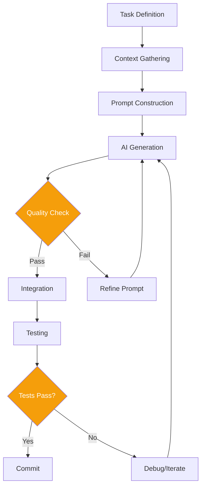
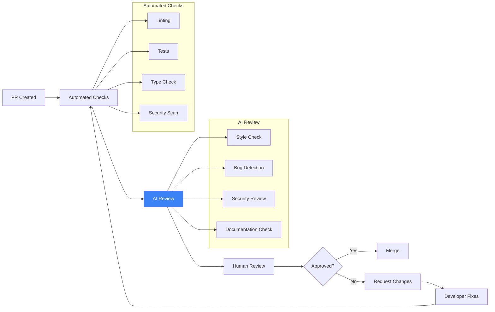
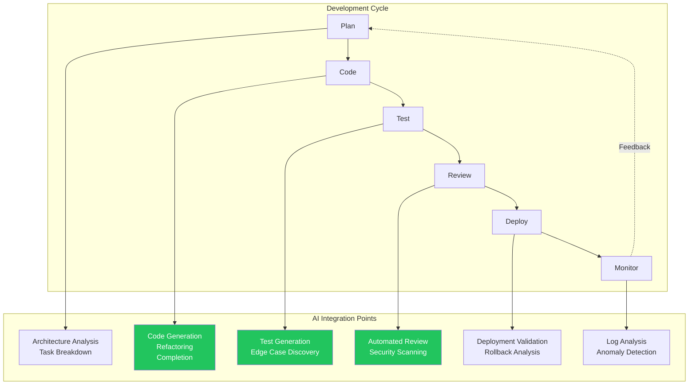
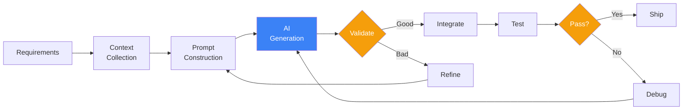
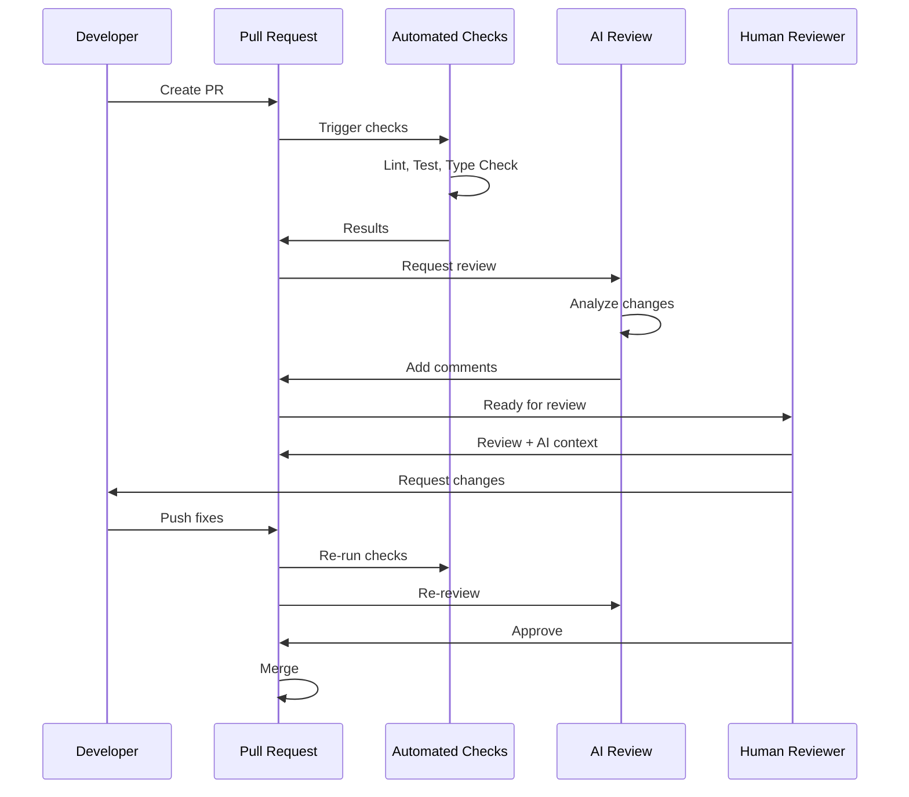
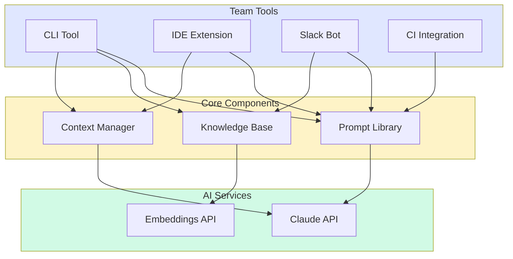

# Module 19: Real-World Workflow Integration

**Part 3: Safe Use & Agentic Workflows** | **Duration**: 1 hour 30 minutes | **Difficulty**: Intermediate

---

## Learning Objectives

By the end of this module, you will be able to:

- Integrate AI tools into existing development workflows without disrupting team productivity
- Build effective code generation and review pipelines that amplify your capabilities
- Automate documentation and testing processes with AI assistance
- Create custom tools and shared prompts that benefit your entire team
- Evaluate when AI integration adds value and when it adds friction

---

## Section 1: AI in Your Daily Work (10 minutes)

### The Integration Challenge

You have learned how AI works, how to prompt effectively, and how to build agents. Now comes the hard part: making AI actually useful in your day-to-day work.

The challenge is not technical. It is cultural and practical. AI tools promise productivity gains, but poorly integrated AI creates friction, introduces errors, and wastes time. The goal is not to use AI everywhere; it is to use AI where it helps and avoid it where it hurts.

Most developers fall into one of two traps:

**The Skeptic Trap**: "I tried GitHub Copilot once and it wrote bad code. AI is useless." This ignores that AI tools require skill to use effectively. You would not conclude that version control is useless because your first merge conflict was frustrating.

**The Enthusiast Trap**: "AI can do everything now. I'll just prompt my way through." This ignores that AI outputs require verification, that some tasks are faster to do manually, and that over-reliance creates blind spots.

The productive middle ground: treat AI as a tool in your toolkit. Use it where it excels. Skip it where it does not. Build intuition through deliberate practice.

### Finding Integration Points

AI integrates most naturally at specific points in the development workflow:

```mermaid
graph LR
    subgraph Planning["Planning Phase"]
        P1[Requirements Analysis]
        P2[Architecture Design]
        P3[Task Breakdown]
    end

    subgraph Development["Development Phase"]
        D1[Code Generation]
        D2[Debugging]
        D3[Refactoring]
    end

    subgraph Quality["Quality Phase"]
        Q1[Code Review]
        Q2[Testing]
        Q3[Documentation]
    end

    subgraph Maintenance["Maintenance Phase"]
        M1[Bug Investigation]
        M2[Migration]
        M3[Knowledge Transfer]
    end

    Planning --> Development
    Development --> Quality
    Quality --> Maintenance
    Maintenance -.->|Feedback| Planning

    style D1 fill:#22c55e,color:#fff
    style D2 fill:#22c55e,color:#fff
    style Q1 fill:#22c55e,color:#fff
    style Q2 fill:#22c55e,color:#fff
    style Q3 fill:#22c55e,color:#fff
    style M2 fill:#22c55e,color:#fff
```



The green boxes indicate where AI currently provides the highest value. This does not mean AI cannot help elsewhere; it means these are the highest-leverage starting points.

### Maximizing Value

To get real value from AI integration:

**Start with high-frequency, low-stakes tasks**. Writing boilerplate code, generating test cases, explaining unfamiliar code. If AI fails, the cost is minimal. If it succeeds, you save time daily.

**Build verification habits**. Never accept AI output without review. This is not paranoia; it is professionalism. AI will confidently generate subtle bugs, security vulnerabilities, and incorrect logic. Your job is to catch them.

**Track what works**. Keep a mental (or literal) log of where AI helps and where it wastes time. Your experience will differ from generic advice because your codebase, language, and domain are unique.

**Invest in prompting skill**. The same task can take 30 seconds or 30 minutes depending on how you prompt. Time spent learning effective prompting pays compound returns.

**Know when to stop**. If you have prompted three times and still have not gotten useful output, do it manually. AI should accelerate work, not become a puzzle to solve.

### The 80/20 of AI Assistance

For most developers, 80% of AI value comes from 20% of use cases:

1. **Autocomplete and inline suggestions** (GitHub Copilot, Cursor): Saves keystrokes, suggests completions, reduces context switching to documentation
2. **Explaining code**: "What does this function do?" saves time when onboarding or debugging unfamiliar code
3. **Generating boilerplate**: Tests, API endpoints, data models, configuration files
4. **Rubber duck debugging**: Describing a problem to AI often clarifies your own thinking
5. **Translation between formats**: JSON to YAML, SQL to ORM, one language to another

Master these before pursuing more exotic use cases.

---

## Section 2: Code Generation Workflows (20 minutes)

### Beyond Simple Prompts

We covered basic code generation in prompt engineering. Real-world code generation requires more sophistication: context management, iterative refinement, and integration with your actual codebase.

The naive approach (paste code into ChatGPT, get code back) breaks down for serious work because:

- AI lacks context about your codebase conventions
- Generated code may not integrate with existing systems
- There is no feedback loop for improvement
- It does not scale to complex features

Effective code generation workflows address these limitations.

### Scaffolding Workflows

Scaffolding is generating structural code that you will fill in with implementation details. This is AI's sweet spot because:

- Structure is often boilerplate
- Patterns are well-established
- Details require your domain knowledge
- The cost of errors is low (you review before filling in)

**Example: Generating a new API endpoint**

Instead of asking AI to write a complete endpoint, scaffold it:

```
I'm adding a new API endpoint to my Express.js application.

Existing patterns in my codebase:
- Routes are in /routes/{resource}.js
- Controllers are in /controllers/{resource}Controller.js
- Services are in /services/{resource}Service.js
- We use Joi for validation
- All responses use a standard envelope: { success: boolean, data: any, error?: string }

Generate the scaffolding for a new "comments" resource with:
- GET /comments (list with pagination)
- GET /comments/:id (single comment)
- POST /comments (create)
- PUT /comments/:id (update)
- DELETE /comments/:id (delete)

Include:
1. Route file with all endpoints
2. Controller with handler stubs
3. Service with method stubs
4. Validation schema
5. TODO comments where I need to add business logic

Do not implement the actual database queries or business logic - just structure.
```

This prompt produces useful scaffolding because:

- It provides context about existing patterns
- It specifies exactly what to generate
- It explicitly requests stubs, not implementations
- It asks for TODO markers where human work is needed

### Refactoring Assistance

AI excels at mechanical refactoring tasks where the transformation is well-defined:

**Renaming and restructuring**:

```
Refactor this class to use composition instead of inheritance.

Current code:
[paste code]

The Animal base class methods should become:
- A MovementBehavior interface/strategy
- A SoundBehavior interface/strategy

Preserve all existing functionality. Show me the refactored code with the new class structure.
```

**Modernizing syntax**:

```
Convert this JavaScript code to use modern ES6+ syntax:
- var -> const/let (prefer const)
- Functions -> arrow functions where appropriate
- Callbacks -> async/await
- String concatenation -> template literals
- Object.assign -> spread operator

[paste code]

Explain each change you make.
```

**Extracting patterns**:

```
This codebase has repeated error handling patterns. Identify the pattern and show me:
1. A reusable utility function that captures the pattern
2. How to refactor one example to use the utility
3. The find-and-replace approach to update all instances

[paste examples of the repeated pattern]
```

### Migration Assistance

Migrating between technologies (frameworks, languages, APIs) is tedious and error-prone. AI can accelerate this significantly:

**API migration**:

```
We're migrating from the legacy PaymentService to StripeService.

Old API:
- PaymentService.charge(amount, customerId, cardToken) -> Promise<PaymentResult>
- PaymentService.refund(transactionId) -> Promise<RefundResult>
- PaymentService.getTransaction(transactionId) -> Promise<Transaction>

New API:
- StripeService.createPaymentIntent(params: StripePaymentParams) -> Promise<PaymentIntent>
- StripeService.createRefund(params: StripeRefundParams) -> Promise<Refund>
- StripeService.retrievePaymentIntent(id: string) -> Promise<PaymentIntent>

Create an adapter class that:
1. Implements the old PaymentService interface
2. Internally delegates to StripeService
3. Maps between old and new data structures
4. Logs deprecation warnings when old methods are called

This lets us migrate gradually without changing all call sites at once.
```

**Framework migration**:

```
Convert this React class component to a functional component with hooks.

Class component:
[paste code]

Requirements:
- Use useState for state
- Use useEffect for lifecycle methods
- Use useCallback for event handlers passed to children
- Use useMemo for expensive computations
- Preserve all existing functionality
- Add comments explaining non-obvious hook usage
```

### The Code Generation Pipeline

For production use, establish a consistent pipeline:



**1. Task Definition**: What exactly do you need? Be specific. "Add a feature" is too vague. "Add pagination to the /users endpoint with cursor-based navigation" is actionable.

**2. Context Gathering**: What does AI need to know? Existing patterns, constraints, dependencies. More context usually means better output.

**3. Prompt Construction**: Build the prompt with all necessary information. Use templates for common tasks.

**4. AI Generation**: Generate the code. Consider generating multiple versions if the task is complex.

**5. Quality Check**: Review the output. Does it follow your patterns? Is the logic correct? Are there security issues?

**6. Integration**: Integrate into your codebase. This often reveals issues that were not obvious in isolation.

**7. Testing**: Run tests. Write new tests for new functionality.

**8. Iteration**: If tests fail or quality check fails, iterate. Sometimes refine the prompt; sometimes fix manually.

### When Code Generation Fails

Code generation does not work well for:

**Complex business logic**: AI does not know your domain. It will generate plausible-looking code that does the wrong thing.

**Security-critical code**: Authentication, authorization, cryptography. AI might generate code with subtle vulnerabilities.

**Performance-critical code**: AI optimizes for "looks correct" not "runs fast". Profile actual performance.

**Highly contextual code**: Code that depends heavily on runtime state, external systems, or specific configurations.

For these cases, use AI for initial ideas or rubber-ducking, but write the code yourself.

---

## Section 3: Code Review Automation (20 minutes)

### AI-Assisted Review

Code review is time-consuming and cognitively demanding. AI can assist by:

- Catching common issues before human review
- Explaining unfamiliar code patterns
- Checking for consistent style
- Identifying potential security vulnerabilities
- Suggesting improvements

This is assistance, not replacement. Human reviewers catch subtle logic errors, evaluate architectural decisions, and ensure code serves business needs. AI catches the mechanical stuff so humans can focus on what matters.

### Building a Review Pipeline

A practical AI review pipeline runs automatically on pull requests:



**Automated checks** run first: linting, tests, type checking, and static security scanning. These are deterministic and must pass.

**AI review** runs next, producing comments and suggestions. These are advisory, not blocking.

**Human review** makes final decisions, considering both automated feedback and business context.

### Security Scanning with AI

AI can identify security issues that static analyzers miss because it understands context:

```
Review this code for security vulnerabilities.

Focus on:
1. Injection vulnerabilities (SQL, command, XSS)
2. Authentication/authorization issues
3. Data exposure risks
4. Insecure defaults
5. Missing input validation
6. Cryptography misuse

For each issue:
- Severity: Critical/High/Medium/Low
- Location: File and line number
- Description: What's the vulnerability
- Exploitation: How could it be exploited
- Fix: Specific remediation

Code to review:
[paste code]
```

**Example AI security findings**:

````markdown
## Security Review Results

### Critical: SQL Injection in user lookup

**Location**: `userService.js:45`
**Description**: User input is concatenated directly into SQL query
**Exploitation**: Attacker can input `' OR '1'='1` to bypass authentication
**Fix**: Use parameterized queries:

```javascript
// Before (vulnerable)
const query = `SELECT * FROM users WHERE email = '${email}'`;

// After (safe)
const query = "SELECT * FROM users WHERE email = ?";
db.query(query, [email]);
```
````

### High: Missing authorization check

**Location**: `orderController.js:78`
**Description**: `/orders/:id` endpoint returns order without verifying user ownership
**Exploitation**: Any authenticated user can view any order by guessing IDs
**Fix**: Add ownership verification:

```javascript
const order = await Order.findById(orderId);
if (order.userId !== req.user.id) {
  return res.status(403).json({ error: "Forbidden" });
}
```

```

### Style Checking Beyond Linting

Linters catch syntax issues. AI can catch style issues that require understanding:

```

Review this code for style and clarity.

Our team conventions:

- Functions should do one thing
- Names should be descriptive and unambiguous
- Comments explain "why", code explains "what"
- Error handling should be explicit
- Magic numbers should be named constants

For each suggestion:

- Current code snippet
- Issue explanation
- Suggested improvement

[paste code]

````

**Example AI style findings**:

```markdown
## Style Review

### Unclear function name
**Current**: `function process(data)`
**Issue**: "process" is vague. What kind of processing?
**Suggestion**: `function validateAndTransformUserInput(data)` - describes what it actually does

### Magic number
**Current**: `if (attempts > 3)`
**Issue**: Why 3? What does this number represent?
**Suggestion**:
```javascript
const MAX_LOGIN_ATTEMPTS = 3;
if (attempts > MAX_LOGIN_ATTEMPTS)
````

### Comment describes "what" not "why"

**Current**: `// Loop through users`
**Issue**: The code already shows you're looping through users
**Suggestion**: `// Process inactive users first to free up memory before handling active sessions`

````

### Implementing Review Automation

A simple GitHub Actions workflow for AI review:

```yaml
name: AI Code Review

on:
  pull_request:
    types: [opened, synchronize]

jobs:
  ai-review:
    runs-on: ubuntu-latest
    steps:
      - uses: actions/checkout@v4
        with:
          fetch-depth: 0

      - name: Get changed files
        id: changed
        run: |
          echo "files=$(git diff --name-only origin/main...HEAD | grep -E '\.(js|ts|py)$' | tr '\n' ' ')" >> $GITHUB_OUTPUT

      - name: Run AI review
        env:
          ANTHROPIC_API_KEY: ${{ secrets.ANTHROPIC_API_KEY }}
        run: |
          python scripts/ai_review.py ${{ steps.changed.outputs.files }}

      - name: Post review comments
        uses: actions/github-script@v7
        with:
          script: |
            const fs = require('fs');
            const review = JSON.parse(fs.readFileSync('review_results.json'));

            for (const comment of review.comments) {
              await github.rest.pulls.createReviewComment({
                owner: context.repo.owner,
                repo: context.repo.repo,
                pull_number: context.issue.number,
                body: comment.body,
                path: comment.path,
                line: comment.line
              });
            }
````

The `ai_review.py` script:

```python
import sys
import json
from anthropic import Anthropic

def review_file(filepath: str, content: str) -> list:
    """Review a single file and return comments."""
    client = Anthropic()

    prompt = f"""Review this code file for:
1. Potential bugs
2. Security issues
3. Style improvements
4. Performance concerns

Return JSON array of comments:
[{{"line": number, "severity": "error|warning|info", "message": "description"}}]

File: {filepath}
```

{content}

```"""

    response = client.messages.create(
        model="claude-3-5-sonnet-latest",
        max_tokens=2000,
        messages=[{"role": "user", "content": prompt}]
    )

    # Parse JSON from response
    try:
        comments = json.loads(response.content[0].text)
        return [{"path": filepath, **c} for c in comments]
    except json.JSONDecodeError:
        return []

def main():
    files = sys.argv[1:]
    all_comments = []

    for filepath in files:
        with open(filepath) as f:
            content = f.read()
        comments = review_file(filepath, content)
        all_comments.extend(comments)

    with open('review_results.json', 'w') as f:
        json.dump({"comments": all_comments}, f)

if __name__ == "__main__":
    main()
```

### Managing False Positives

AI review generates false positives. Handle them by:

**Tuning prompts**: Add examples of good code that AI flagged incorrectly. "Do not flag X pattern as it is intentional in our codebase."

**Confidence thresholds**: Only show high-confidence issues, or categorize by confidence level.

**Learning from dismissals**: Track which AI comments developers dismiss. Patterns indicate prompt improvement opportunities.

**Making it optional**: Let developers opt out of AI review for specific files or directories.

---

## Section 4: Documentation Generation (15 minutes)

### The Documentation Problem

Documentation is perpetually out of date because:

- Writing documentation is less satisfying than writing code
- Documentation is updated separately from code
- There is no automated way to verify documentation accuracy
- Documentation requirements are fuzzy

AI can help by generating initial documentation, updating documentation when code changes, and verifying documentation against code.

### README Generation

For new projects or features, AI can generate comprehensive README files:

```
Generate a README for this project.

Project context:
- Name: TaskQueue
- Purpose: Distributed task queue for background job processing
- Language: Python
- Key dependencies: Redis, Celery, PostgreSQL

Include sections:
1. Overview (what problem it solves)
2. Quick Start (get running in 5 minutes)
3. Installation (detailed setup)
4. Configuration (all config options with defaults)
5. Usage Examples (common use cases with code)
6. API Reference (key functions/classes)
7. Architecture (how it works internally)
8. Troubleshooting (common issues)
9. Contributing (how to contribute)

Source code for reference:
[paste key files]
```

### API Documentation

Generate API documentation from code:

```
Generate API documentation for these endpoints.

Format: OpenAPI 3.0 YAML

For each endpoint include:
- Summary and description
- Request parameters (path, query, body)
- Request body schema with examples
- Response schemas for all status codes
- Example requests and responses
- Authentication requirements

Endpoint code:
[paste route handlers]

Data models:
[paste relevant models/schemas]
```

For existing documentation, verify accuracy:

```
Compare this API documentation against the actual implementation.

Documentation claims:
[paste API docs]

Actual implementation:
[paste code]

Identify:
1. Documented features that don't exist in code
2. Implemented features not documented
3. Parameter mismatches (names, types, required vs optional)
4. Response format differences
5. Status code discrepancies
```

### Inline Documentation

Generate and improve inline documentation:

```
Add JSDoc comments to these functions.

Requirements:
- @description explaining what the function does
- @param for each parameter with type and description
- @returns describing return value
- @throws for any exceptions
- @example with realistic usage example

Functions to document:
[paste code]
```

For existing documentation, improve quality:

```
Improve these code comments.

Problems to fix:
- Comments that just repeat the code ("// increment counter" before counter++)
- Outdated comments that don't match the code
- Missing comments for complex logic
- Excessive comments for obvious code

Add comments that explain:
- Why this approach was chosen (not what it does)
- Non-obvious business rules
- Edge cases being handled
- Performance considerations

Current code:
[paste code]
```

### Keeping Documentation Updated

The real challenge is keeping documentation current. Strategies:

**Pre-commit hooks**: Before committing, check if changed files have corresponding documentation. Generate update suggestions.

```bash
#!/bin/bash
# pre-commit hook for documentation

changed_files=$(git diff --cached --name-only)

for file in $changed_files; do
    if [[ $file == *.py ]] || [[ $file == *.js ]]; then
        # Check if function signatures changed
        if git diff --cached "$file" | grep -E "^[+-]\s*(def|function|const.*=.*=>)" > /dev/null; then
            echo "Warning: Function signatures changed in $file"
            echo "Run 'npm run update-docs' to regenerate documentation"
        fi
    fi
done
```

**CI documentation checks**: In CI, compare documentation against code and fail if they diverge too much.

**Scheduled regeneration**: Weekly regenerate documentation from code and create PRs for review.

**Documentation as code**: Keep documentation in the same files as code (docstrings, JSDoc) so changes are natural.

### Documentation Templates

Create templates for consistent documentation:

````
Generate documentation for a new React component following this template:

## ComponentName

### Purpose
[One sentence explaining what this component does]

### Props
| Prop | Type | Required | Default | Description |
|------|------|----------|---------|-------------|
| ... | ... | ... | ... | ... |

### Usage
```jsx
// Basic usage
<ComponentName prop="value" />

// With all options
<ComponentName
  prop="value"
  optionalProp="optional"
/>
````

### Styling

[How to customize appearance]

### Accessibility

[a11y considerations and implementations]

### Examples

[2-3 realistic examples with different configurations]

Component code:
[paste component]

```

---

## Section 5: Testing with AI (15 minutes)

### Test Generation Strategies

AI can generate tests, but the value varies by test type:

**High value**: Unit tests for pure functions, edge case discovery, test data generation

**Medium value**: Integration tests (requires understanding of system boundaries), snapshot tests

**Lower value**: End-to-end tests (too dependent on UI and system state), performance tests (requires profiling, not generation)

### Unit Test Generation

For pure functions, AI generates excellent tests:

```

Generate comprehensive unit tests for this function.

Function:

```python
def calculate_discount(price: float, customer_type: str, quantity: int) -> float:
    """Calculate discount based on customer type and quantity."""
    base_discount = 0

    if customer_type == "premium":
        base_discount = 0.15
    elif customer_type == "business":
        base_discount = 0.10
    elif customer_type == "regular":
        base_discount = 0.05

    quantity_discount = min(quantity // 10 * 0.02, 0.10)

    total_discount = min(base_discount + quantity_discount, 0.25)

    return round(price * (1 - total_discount), 2)
```

Generate tests covering:

1. Each customer type
2. Quantity discount tiers (0, 10, 50, 100+)
3. Edge cases (zero price, negative values if possible)
4. Maximum discount cap
5. Rounding behavior

Use pytest with clear test names describing the scenario.

```

### Edge Case Discovery

AI excels at thinking of edge cases:

```

Identify edge cases for this function that should be tested:

```python
def parse_date_range(input_string: str) -> tuple[date, date]:
    """Parse date range like '2024-01-01 to 2024-12-31' into start and end dates."""
    parts = input_string.split(" to ")
    start = datetime.strptime(parts[0], "%Y-%m-%d").date()
    end = datetime.strptime(parts[1], "%Y-%m-%d").date()
    return start, end
```

For each edge case:

1. Input that would trigger it
2. Expected behavior (success or specific error)
3. Why this edge case matters

````

**Example AI edge case analysis**:

```markdown
## Edge Cases for parse_date_range

### Input format variations
- Extra whitespace: `"2024-01-01  to  2024-12-31"` (double spaces)
- Tab characters: `"2024-01-01\tto\t2024-12-31"`
- Leading/trailing whitespace: `" 2024-01-01 to 2024-12-31 "`

### Invalid inputs
- Missing "to": `"2024-01-01 2024-12-31"`
- Multiple "to": `"2024-01-01 to 2024-06-01 to 2024-12-31"`
- Empty string: `""`
- Only "to": `"to"`
- Reversed order: `"2024-12-31 to 2024-01-01"` (end before start)

### Date format issues
- Wrong format: `"01-01-2024 to 12-31-2024"` (MM-DD-YYYY)
- Partial date: `"2024-01 to 2024-12"`
- Invalid date: `"2024-02-30 to 2024-03-01"` (Feb 30 doesn't exist)
- Leap year: `"2024-02-29 to 2024-03-01"` (valid) vs `"2023-02-29 to 2023-03-01"` (invalid)

### Boundary conditions
- Same day: `"2024-01-01 to 2024-01-01"`
- Year boundaries: `"2023-12-31 to 2024-01-01"`
- Far future: `"2024-01-01 to 9999-12-31"`
- Far past: `"0001-01-01 to 2024-01-01"`
````

### Coverage Improvement

Use AI to improve test coverage:

```
Here is our test file and coverage report.

Test file:
[paste tests]

Coverage report showing uncovered lines:
[paste coverage output]

Source file:
[paste source]

Generate additional tests to cover the uncovered lines. For each new test:
1. Which uncovered line(s) it covers
2. The test code
3. Why this scenario matters
```

### Test Data Generation

AI generates realistic test data:

````
Generate test fixtures for user profile testing.

User model:
```python
@dataclass
class UserProfile:
    id: str
    email: str
    name: str
    created_at: datetime
    subscription_tier: Literal["free", "pro", "enterprise"]
    preferences: dict
    last_login: datetime | None
````

Generate 10 diverse test users covering:

- All subscription tiers
- Various preference configurations
- Edge cases (new users, inactive users, users with missing optional fields)
- Realistic but fictional data

Output as Python dict literals.

```

### Test Maintenance

When code changes, AI helps update tests:

```

The function signature changed. Update these tests to match.

Old function:

```python
def send_notification(user_id: str, message: str) -> bool:
```

New function:

```python
def send_notification(user_id: str, message: str, channel: str = "email", priority: int = 1) -> NotificationResult:
```

Existing tests:
[paste tests]

Update tests to:

1. Pass the new required/optional parameters
2. Assert on the new return type
3. Add tests for the new parameters
4. Keep existing test coverage

````

---

## Section 6: Building Team Tools (10 minutes)

### Why Custom Tools Matter

Generic AI tools work generically. Custom tools work for your team because they:

- Encode your codebase conventions
- Include project-specific context
- Integrate with your existing workflows
- Solve your specific problems

Building custom tools is not complex. It is about wrapping AI APIs with your context.

### Custom Assistants

Build assistants specialized for your codebase:

```python
"""
Custom code assistant that knows our codebase conventions.
"""

import os
from anthropic import Anthropic

# Load codebase context once
CONVENTIONS = open("docs/CONVENTIONS.md").read()
ARCHITECTURE = open("docs/ARCHITECTURE.md").read()
EXAMPLES = open("docs/CODE_EXAMPLES.md").read()

SYSTEM_PROMPT = f"""You are a coding assistant for our team's codebase.

Our conventions:
{CONVENTIONS}

Our architecture:
{ARCHITECTURE}

Code examples showing our patterns:
{EXAMPLES}

When helping with code:
1. Follow our established patterns
2. Use our naming conventions
3. Reference our existing utilities rather than reimplementing
4. Suggest tests following our test patterns
5. Consider our deployment constraints (list them)

Be concise. We're experienced developers who want help, not tutorials.
"""

def get_assistant():
    client = Anthropic()

    def ask(question: str, code_context: str = "") -> str:
        messages = [
            {
                "role": "user",
                "content": f"{question}\n\nCode context:\n{code_context}" if code_context else question
            }
        ]

        response = client.messages.create(
            model="claude-3-5-sonnet-latest",
            max_tokens=4096,
            system=SYSTEM_PROMPT,
            messages=messages
        )

        return response.content[0].text

    return ask

# Usage
assistant = get_assistant()
answer = assistant(
    "How should I implement pagination for this endpoint?",
    code_context=open("routes/users.py").read()
)
````

### Shared Prompt Libraries

Create a library of prompts your team shares:

```yaml
# prompts/library.yaml

code_review:
  security:
    name: "Security Review"
    description: "Review code for security vulnerabilities"
    template: |
      Review this code for security issues following OWASP Top 10.

      Focus areas:
      - Injection vulnerabilities
      - Authentication issues
      - Sensitive data exposure
      - Access control

      Code to review:
      {code}

      Return findings as:
      - Severity (Critical/High/Medium/Low)
      - Location
      - Description
      - Remediation

  performance:
    name: "Performance Review"
    description: "Review code for performance issues"
    template: |
      Review this code for performance issues.

      Our constraints:
      - Response time target: <200ms
      - Memory limit: 512MB per request
      - Database: PostgreSQL with connection pooling

      Look for:
      - N+1 queries
      - Missing indexes (suggest based on queries)
      - Unnecessary data loading
      - Memory leaks or excessive allocation

      Code to review:
      {code}

generation:
  api_endpoint:
    name: "API Endpoint Generator"
    description: "Generate REST API endpoint following our patterns"
    template: |
      Generate a REST endpoint for {resource}.

      Our patterns:
      - Framework: FastAPI
      - Database: SQLAlchemy with async
      - Validation: Pydantic models
      - Auth: JWT via dependency injection
      - Error handling: HTTPException with standard error schema

      Include:
      - Route handler
      - Pydantic models (request/response)
      - Service function
      - Tests

      Operations needed: {operations}

documentation:
  function_docs:
    name: "Function Documentation"
    description: "Generate docstrings for functions"
    template: |
      Generate Google-style docstrings for these functions.

      Requirements:
      - Args section with types and descriptions
      - Returns section
      - Raises section if applicable
      - Example section with working code

      Functions:
      {code}
```

Usage:

```python
import yaml

def load_prompt(category: str, name: str, **kwargs) -> str:
    with open("prompts/library.yaml") as f:
        library = yaml.safe_load(f)

    template = library[category][name]["template"]
    return template.format(**kwargs)

# Use a shared prompt
prompt = load_prompt(
    "code_review",
    "security",
    code=open("api/auth.py").read()
)
```

### Knowledge Bases

Build team knowledge bases that AI can reference:

```python
"""
Knowledge base for team AI tools.
Uses vector search to find relevant context.
"""

from pathlib import Path
import chromadb

def build_knowledge_base(docs_dir: str = "docs/"):
    """Index team documentation for retrieval."""
    client = chromadb.Client()
    collection = client.create_collection("team_knowledge")

    docs = []
    for path in Path(docs_dir).glob("**/*.md"):
        content = path.read_text()
        # Split into chunks
        chunks = split_into_chunks(content, max_tokens=500)
        for i, chunk in enumerate(chunks):
            docs.append({
                "id": f"{path.stem}_{i}",
                "content": chunk,
                "source": str(path),
                "type": categorize_doc(path)
            })

    collection.add(
        ids=[d["id"] for d in docs],
        documents=[d["content"] for d in docs],
        metadatas=[{"source": d["source"], "type": d["type"]} for d in docs]
    )

    return collection

def query_knowledge_base(collection, question: str, n_results: int = 5):
    """Find relevant documentation for a question."""
    results = collection.query(
        query_texts=[question],
        n_results=n_results
    )

    return results["documents"][0]

def ask_with_knowledge(question: str, collection) -> str:
    """Answer question using team knowledge base."""
    relevant_docs = query_knowledge_base(collection, question)

    context = "\n\n".join(relevant_docs)

    prompt = f"""Answer this question using the provided team documentation.

Documentation:
{context}

Question: {question}

If the documentation doesn't contain the answer, say so.
"""

    # Call your AI API
    return call_ai(prompt)
```

### Tool Distribution

Make tools easy for your team to use:

**CLI tool**:

```python
#!/usr/bin/env python
"""
Team AI assistant CLI.

Usage:
    ai review <file>           Review code for issues
    ai generate <type> <name>  Generate code from templates
    ai explain <file>          Explain what code does
    ai ask <question>          Ask about our codebase
"""

import click
import sys

@click.group()
def cli():
    """Team AI assistant."""
    pass

@cli.command()
@click.argument('file')
@click.option('--type', default='all', help='Review type: security|performance|style|all')
def review(file, type):
    """Review code file for issues."""
    code = open(file).read()
    result = do_review(code, type)
    print(result)

@cli.command()
@click.argument('type')
@click.argument('name')
def generate(type, name):
    """Generate code from templates."""
    result = do_generate(type, name)
    print(result)

@cli.command()
@click.argument('question', nargs=-1)
def ask(question):
    """Ask about the codebase."""
    question_text = " ".join(question)
    result = ask_with_knowledge(question_text)
    print(result)

if __name__ == "__main__":
    cli()
```

**IDE integration**: Most IDEs support custom commands or extensions. Wrap your tools in IDE-specific packages.

**Slack/Teams bot**: For quick questions, deploy a bot that queries your knowledge base:

```python
from slack_bolt import App

app = App(token=os.environ["SLACK_BOT_TOKEN"])

@app.message("ask ai")
def handle_question(message, say):
    question = message["text"].replace("ask ai", "").strip()
    answer = ask_with_knowledge(question)
    say(answer)
```

---

## Diagrams

### Workflow Integration Points



### Code Generation Pipeline



### Review Automation Flow



### Team Tools Architecture



---

## Knowledge Check

### Question 1

You are building an AI-assisted code review pipeline. Where in the review process should AI review run?

- A) After human review, to catch anything the human missed
- B) Before human review, so humans can focus on high-level concerns
- C) Instead of human review for small changes
- D) In parallel with human review to save time

**Correct Answer**: B

**Explanation**: AI review should run before human review. This lets AI catch mechanical issues (style, common bugs, security patterns) so human reviewers can focus on what AI cannot assess: business logic correctness, architectural fit, and maintainability decisions. Running AI after human review wastes the human's time on things AI could have caught. Replacing human review entirely is inappropriate because AI misses subtle issues. Parallel review creates confusion about who catches what.

### Question 2

When is AI code generation LEAST appropriate?

- A) Generating boilerplate for a new API endpoint
- B) Implementing a core algorithm that determines pricing for customers
- C) Creating test cases for a utility function
- D) Converting code from one framework to another

**Correct Answer**: B

**Explanation**: AI code generation is least appropriate for critical business logic. Pricing algorithms directly affect revenue and customer trust. AI does not understand your business domain and may generate subtly incorrect logic that "looks right" but calculates wrong prices. For such critical code, humans must design and implement the logic, using AI only for peripheral tasks like test generation. Boilerplate, tests, and framework conversions are all suitable because errors are more obvious and consequences are lower.

### Question 3

Your team creates a shared prompt library. What is the most important characteristic for prompts in this library?

- A) They should be as long and detailed as possible
- B) They should encode team-specific conventions and context
- C) They should work with multiple AI providers
- D) They should be written by the most senior developer

**Correct Answer**: B

**Explanation**: Shared prompts provide value by encoding team-specific knowledge that generic prompts lack: your coding conventions, architecture decisions, common patterns, and project constraints. This context makes AI output immediately useful rather than requiring manual adaptation. Length should match need, not maximize detail. Provider portability is nice but secondary. Authorship matters less than whether the prompts capture team knowledge effectively.

### Question 4

You notice your AI documentation generator frequently produces inaccurate descriptions of function behavior. What is the best approach to fix this?

- A) Switch to a more capable AI model
- B) Include example inputs and outputs in the prompt
- C) Generate documentation less frequently
- D) Add a disclaimer that documentation may be inaccurate

**Correct Answer**: B

**Explanation**: When AI generates inaccurate descriptions, the issue is usually insufficient context, not model capability. Including example inputs and outputs shows the AI what the function actually does rather than relying on it to infer behavior from code alone. A more capable model might help marginally but does not address the root cause. Generating less frequently or adding disclaimers are avoidance strategies that do not improve quality.

---

## Hands-On Exercise: Build a Development Workflow

### Objective

Create an integrated AI-assisted development workflow for a specific task in your actual work environment. This exercise has you build something you will actually use.

### Time Required

45-60 minutes

### Prerequisites

- Access to an AI API (Claude, OpenAI, or similar)
- A codebase you work in regularly
- Basic scripting ability (Python, Bash, or your preferred language)

### Part 1: Identify Your Workflow (10 minutes)

Choose a recurring development task where AI could add value. Good candidates:

- Code review checklist verification
- Writing tests for new features
- Generating documentation for APIs
- Creating boilerplate for common patterns
- Explaining legacy code when onboarding

**Document your chosen workflow**:

```markdown
## Workflow: [Name]

### Current process (without AI)

1. [Step 1]
2. [Step 2]
3. [Step 3]
   Time: [estimated time]

### Pain points

- [What makes this tedious or error-prone?]
- [What do you often forget or get wrong?]

### AI assistance opportunity

- [Where could AI help?]
- [What would AI need to know?]
```

### Part 2: Design the AI Integration (10 minutes)

Design how AI will integrate into your workflow.

**Questions to answer**:

1. What context does AI need? (conventions, examples, constraints)
2. What input will AI receive? (code, questions, specifications)
3. What output should AI produce? (code, documentation, suggestions)
4. How will you verify AI output? (tests, review, comparison)
5. What is the fallback if AI fails? (manual process, different approach)

**Document your design**:

```markdown
## AI Integration Design

### Context requirements

- [ ] Coding conventions document
- [ ] Example code showing patterns
- [ ] Project-specific constraints
- [ ] [Other context]

### Input/Output specification

Input: [What you'll provide]
Output: [What AI should return]
Format: [Structured format if any]

### Verification approach

- [How you'll check output quality]

### Fallback plan

- [What to do if AI output is unusable]
```

### Part 3: Build the Tool (20 minutes)

Implement your AI-assisted workflow tool.

**Minimum viable tool**:

```python
"""
AI-assisted [your workflow] tool.
"""

import os
from anthropic import Anthropic

# Configuration
MODEL = "claude-3-5-sonnet-latest"
client = Anthropic()

# Load context (customize for your workflow)
def load_context() -> str:
    """Load project-specific context for AI."""
    context_parts = []

    # Add your conventions
    if os.path.exists("CONVENTIONS.md"):
        context_parts.append(open("CONVENTIONS.md").read())

    # Add example code
    if os.path.exists("examples/"):
        for f in os.listdir("examples/"):
            context_parts.append(open(f"examples/{f}").read())

    return "\n\n---\n\n".join(context_parts)

# Build prompt (customize for your workflow)
def build_prompt(user_input: str, context: str) -> str:
    """Construct the prompt for your specific workflow."""
    return f"""You are assisting with [your workflow].

Project context:
{context}

Task: {user_input}

[Add specific instructions for your workflow]

Provide output as:
[Specify your desired output format]
"""

# Main function
def run_workflow(user_input: str) -> str:
    """Execute the AI-assisted workflow."""
    context = load_context()
    prompt = build_prompt(user_input, context)

    response = client.messages.create(
        model=MODEL,
        max_tokens=4096,
        messages=[{"role": "user", "content": prompt}]
    )

    return response.content[0].text

# CLI interface
if __name__ == "__main__":
    import sys
    if len(sys.argv) < 2:
        print(f"Usage: {sys.argv[0]} <input>")
        sys.exit(1)

    user_input = " ".join(sys.argv[1:])
    result = run_workflow(user_input)
    print(result)
```

### Part 4: Test and Refine (10 minutes)

Test your tool on real examples from your work.

**Test cases**:

1. A typical case your workflow handles
2. An edge case that often causes problems
3. A case where you expect AI might struggle

**For each test**:

```markdown
### Test: [Description]

Input: [What you provided]

Expected output: [What you wanted]

Actual output: [What AI produced]

Quality: [Good / Needs improvement / Failed]

Refinement needed: [Changes to make]
```

**Refine based on results**:

- Adjust prompts based on failures
- Add more context if AI misses patterns
- Simplify output format if AI struggles with structure
- Add validation if output quality is inconsistent

### Part 5: Document for Your Team (10 minutes)

Create documentation so others can use your tool.

````markdown
# [Tool Name]

## Purpose

[What workflow this tool assists with]

## Installation

```bash
# Installation steps
```
````

## Usage

```bash
# Example usage
[tool] [arguments]
```

## Examples

### Example 1: [Common use case]

```bash
# Command
[example command]

# Output
[example output]
```

### Example 2: [Another use case]

[...]

## Limitations

- [What the tool doesn't handle well]
- [Cases where manual process is better]

## Contributing

- [How to improve the prompts]
- [How to add context]

```

### Success Criteria

You have successfully completed this exercise if you:

- [ ] Identified a real workflow from your actual work
- [ ] Designed AI integration with clear input/output specs
- [ ] Built a working tool (even if simple)
- [ ] Tested on at least 3 real examples
- [ ] Refined based on test results
- [ ] Created documentation for team use

### Bonus: Share and Iterate

If time permits:

1. Share your tool with a teammate
2. Have them try it on their own examples
3. Collect feedback on what works and what does not
4. Iterate based on real-world usage

---

## Summary

In this module, you learned how to integrate AI into real-world development workflows:

1. **AI works best at specific integration points**: Code generation, testing, review, and documentation are high-value areas. Planning and architecture require more human judgment.

2. **Code generation requires context and verification**: Provide AI with your conventions and patterns. Always verify generated code through review and testing.

3. **Review automation augments humans, not replaces them**: AI catches mechanical issues so humans can focus on logic, architecture, and business requirements.

4. **Documentation generation keeps docs current**: AI can generate and update documentation from code, but humans must verify accuracy.

5. **Testing with AI focuses on coverage and edge cases**: AI excels at generating test cases and identifying edge cases you might miss.

6. **Custom team tools encode your specific knowledge**: Generic AI is generic. Build tools that include your conventions, patterns, and constraints.

The key insight: AI integration is not about using AI everywhere. It is about using AI where it provides genuine leverage while maintaining the verification habits that catch AI errors.

---

## References

### Industry Resources

1. **GitHub Copilot Documentation**
   Official documentation on using Copilot effectively for code generation and completion.
   [docs.github.com/copilot](https://docs.github.com/en/copilot)

2. **Cursor Documentation**
   Guide to AI-assisted coding with Cursor editor, including best practices.
   [cursor.com/docs](https://docs.cursor.com)

3. **Anthropic Claude API Documentation**
   Reference for building custom AI tools with Claude.
   [docs.anthropic.com](https://docs.anthropic.com)

4. **OpenAI API Documentation**
   Comprehensive API reference for GPT models.
   [platform.openai.com/docs](https://platform.openai.com/docs)

### Research and Best Practices

5. **"Measuring GitHub Copilot's Impact on Developer Productivity"** - GitHub (2022)
   Research on productivity effects of AI coding assistants. Important for setting realistic expectations.

6. **"Large Language Models for Code: Security Hardening and Adversarial Testing"** - Pearce et al. (2022)
   Research on security implications of AI-generated code. Essential reading for understanding risks.

7. **OWASP AI Security and Privacy Guide**
   Security considerations when integrating AI into applications.
   [owasp.org/www-project-ai-security-and-privacy-guide](https://owasp.org/www-project-ai-security-and-privacy-guide/)

### Tools and Frameworks

8. **LangChain**
   Framework for building applications with LLMs, including chains and agents.
   [langchain.com](https://www.langchain.com)

9. **Semantic Kernel**
   Microsoft's SDK for integrating AI into applications.
   [learn.microsoft.com/semantic-kernel](https://learn.microsoft.com/en-us/semantic-kernel/)

10. **ChromaDB**
    Vector database for building knowledge bases and retrieval systems.
    [trychroma.com](https://www.trychroma.com)

### Community Resources

11. **r/LocalLLaMA**
    Community discussions on local AI models and practical usage.

12. **Hacker News AI Discussions**
    Technical discussions on AI tool integration and experiences.

13. **Dev.to AI Tag**
    Developer-focused articles on practical AI integration.

---

## What's Next

**Module 20: Capstone Project - Building a Production AI Application**

You will apply everything from this course to build a substantial AI-powered application:

- Designing for reliability and safety
- Implementing proper error handling and fallbacks
- Building monitoring and observability
- Deploying and operating AI systems in production

The capstone integrates technical skills with practical judgment you have developed throughout the course.

---

## Practice Exercises for Continued Learning

### Exercise 1: Workflow Audit

Audit your typical work week. For each major task:

- Could AI assist? How?
- What context would AI need?
- What verification would be required?
- Is the AI overhead worth the benefit?

Document your findings and identify the top 3 integration opportunities.

### Exercise 2: Prompt Library Development

Create a prompt library for your team with at least 5 prompts:

- 2 for code generation tasks
- 2 for review/analysis tasks
- 1 for documentation

Include context requirements and expected outputs for each.

### Exercise 3: Review Pipeline Implementation

Implement an AI review step in your actual CI/CD pipeline:

- Choose a specific focus (security, style, or performance)
- Handle false positives gracefully
- Measure impact on review time and issue detection

### Exercise 4: Knowledge Base Construction

Build a knowledge base from your team's documentation:

- Index relevant docs with embeddings
- Create a query interface
- Test with real questions from new team members
- Iterate based on answer quality

### Exercise 5: Metrics and Evaluation

Establish metrics for your AI integrations:

- Time saved vs. time spent on verification
- Error rate of AI suggestions
- Adoption rate among team members
- Impact on code quality metrics

Track these over a month and adjust tools based on data.

### Exercise 6: Tool Sharing

Share one of your AI tools with another team:

- Document it for their context
- Adapt prompts to their conventions
- Collect feedback on utility
- Learn what transfers and what does not
```
