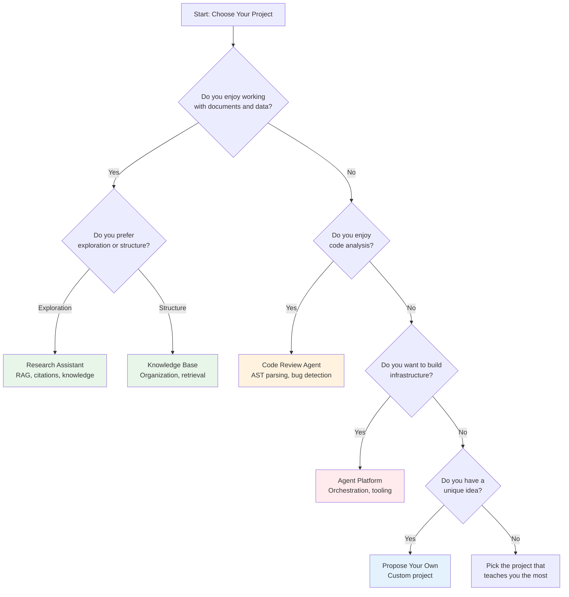
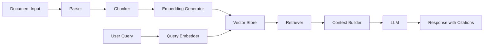

# Module 20: Capstone Project

**Part 4: Capstone & Advanced** | **Duration**: 4-8 hours (self-paced) | **Difficulty**: Advanced

---

## Learning Objectives

By the end of this capstone project, you will be able to:

- Synthesize all course learning into a complete, production-ready AI application
- Build an AI-powered system that demonstrates technical mastery and practical judgment
- Navigate real-world challenges including error handling, safety measures, and trade-offs
- Make informed architectural decisions and justify your technical choices
- Document your work professionally for technical audiences
- Present your project effectively through demonstration and reflection

---

## Section 1: Capstone Overview (10 minutes)

### What is the Capstone Project?

The capstone project is the culminating experience of the Developer of Tomorrow course. It is your opportunity to demonstrate everything you have learned by building a substantial, production-quality AI application.

This is not a tutorial to follow. This is not a toy example. This is a real project that solves a real problem, built to a professional standard.

### Why This Matters

Throughout this course, you have learned concepts: how transformers work, how to prompt effectively, how agents reason, how to build safely. Concepts matter, but what separates knowledge from mastery is application.

The capstone forces you to:

- **Make trade-offs**: You cannot implement everything perfectly. You must decide what matters most.
- **Handle ambiguity**: Real problems are not well-specified. You must define success criteria.
- **Debug complexity**: When your agent fails on the 37th step, you must diagnose why.
- **Ship something**: A perfect design that never ships is worthless. A working system with rough edges is valuable.

This is as close as a course can get to real-world software engineering with AI.

### What You'll Build

You will build one of five pre-defined projects, or propose your own:

| Project                            | Complexity | Key Skills                                  |
| ---------------------------------- | ---------- | ------------------------------------------- |
| **Intelligent Research Assistant** | Medium     | RAG, embeddings, citation tracking          |
| **Code Review Agent**              | High       | Multi-file analysis, AST parsing, synthesis |
| **Personal Knowledge Base**        | Medium     | Incremental indexing, semantic search       |
| **Custom Agent Platform**          | High       | Agent orchestration, sandboxing, tracing    |
| **Your Own Proposal**              | Varies     | Self-directed learning, scope management    |

Each project draws from multiple course modules and requires meaningful AI integration, not just wrapping an API.

### Deliverables

You will submit four artifacts:

1. **Working Application**: A functional codebase with source code, tests, and dependencies
2. **Architecture Document**: A detailed explanation of your system design, decisions, and trade-offs
3. **Demo Video**: A 5-10 minute walkthrough showing setup, features, and technical highlights
4. **Reflection Essay**: A 500-1000 word reflection on what you learned, challenges faced, and next steps

### Evaluation Approach

Your project will be evaluated on:

- **Technical Implementation (40%)**: Does it work? Is the code clean? Does it handle edge cases?
- **Documentation (25%)**: Can someone else understand and use your project?
- **Safety and Responsibility (15%)**: Did you address risks appropriately?
- **Demo and Communication (20%)**: Can you explain your work clearly?

Note that "perfect" is not the goal. "Production-ready for a V1" is the goal. You will have rough edges. What matters is that you demonstrate understanding, make reasonable decisions, and ship something that works.

### Timeline and Effort

- **Estimated time**: 4-8 hours, self-paced
- **Recommended approach**: Multiple sessions, not one marathon
- **Checkpoints**: Planning (1 hour), Implementation (2-5 hours), Documentation (1-2 hours)

Start early. You will encounter unexpected challenges. That is part of the learning.

---

## Section 2: Choosing Your Project (15 minutes)

### How to Choose

The right project for you depends on:

1. **Interest**: You will spend 4-8 hours on this. Pick something you find engaging.
2. **Relevant Skills**: Consider your background. A strong Python developer might choose the research assistant; a JavaScript developer might prefer the agent platform.
3. **Learning Goals**: What do you want to get better at? RAG? Agents? Production deployment?
4. **Time Available**: More complex projects take longer. Be realistic about your timeline.

### Decision Tree for Project Selection



### Quick Comparison

| Project                | Best For                          | Hardest Part              | Most Rewarding                 |
| ---------------------- | --------------------------------- | ------------------------- | ------------------------------ |
| **Research Assistant** | Those who love data and retrieval | Citation accuracy         | Building something useful      |
| **Code Review Agent**  | Those who love code analysis      | False positive management | Catching real bugs             |
| **Knowledge Base**     | Those who organize information    | Incremental indexing      | Seeing connections emerge      |
| **Agent Platform**     | Those who love infrastructure     | Sandboxing and safety     | Creating a reusable system     |
| **Your Own**           | Those with a specific vision      | Scope management          | Building exactly what you want |

### Detailed Project Overviews

For complete specifications, see `/mnt/c/Users/simon/Code/trainer/docs/CAPSTONE.md`. Here is a summary:

**Option A: Intelligent Research Assistant**

Build a RAG-powered system that ingests documents (PDFs, Markdown, web pages), indexes them with embeddings, and answers questions with citations. Core challenge: retrieval quality and accurate citation tracking.

**Option B: Code Review Agent**

Build an agent that analyzes code for bugs, security issues, style violations, and performance problems. Core challenge: understanding code context across multiple files while managing false positives.

**Option C: Personal Knowledge Base**

Build a knowledge management system that ingests your notes and documents, automatically tags and categorizes content, and helps you discover connections. Core challenge: incremental indexing and semantic connection discovery.

**Option D: Custom Agent Platform**

Build a platform where users define agents through configuration (YAML/JSON) rather than code. Include a tool library, agent runtime, and orchestration. Core challenge: safe execution and flexible configuration.

**Option E: Your Own Proposal**

Propose a project that demonstrates mastery of at least 5 course modules, includes meaningful AI integration, addresses safety, and is achievable in the time allotted. Requires written proposal and approval.

### Making Your Choice

Take 10 minutes now to:

1. Read the full specifications in `docs/CAPSTONE.md`
2. Consider which project aligns with your interests and goals
3. Check if you have the required skills or are willing to learn
4. Make a tentative decision (you can adjust during planning)

**Your choice**: ****************\_****************

---

## Section 3: Planning Phase (20 minutes)

### Why Planning Matters

The temptation is to start coding immediately. Resist this urge.

Poor planning leads to:

- Scope creep (the project grows beyond what's achievable)
- Architectural dead-ends (you realize your approach doesn't work after implementing it)
- Missing critical features (you forget about error handling until the end)
- Wasted time (you rewrite components multiple times)

Good planning leads to:

- Clear scope (you know what's in and what's out)
- Solid foundation (your architecture supports what you need)
- Predictable progress (you know what to build next)
- Fewer surprises (you've thought through challenges upfront)

Spend 20 minutes planning now to save 2 hours later.

### Step 1: Define Success Criteria

What does "done" look like for your project? Be specific.

**Example for Research Assistant**:

```
Done means:
- Can ingest at least 3 different document formats (PDF, Markdown, plain text)
- Stores documents in vector database with metadata
- Answers questions with 3-5 relevant passages retrieved
- Includes citations to source documents in responses
- Handles errors gracefully (missing files, API failures)
- Has a README with setup instructions
- Includes 5 test cases demonstrating core functionality
```

**Your success criteria**:

```
Done means:
-
-
-
-
-
```

### Step 2: Architecture Decisions

Sketch your system architecture before coding. Answer these questions:

**1. What are the major components?**

Example: Document Processor → Embedding Generator → Vector Store → Query Handler → Response Generator

**2. What technologies will you use?**

| Component  | Technology Choice | Why? |
| ---------- | ----------------- | ---- |
| Language   |                   |      |
| LLM        |                   |      |
| Vector DB  |                   |      |
| Framework  |                   |      |
| Deployment |                   |      |

**3. What data flows through your system?**

Draw a simple data flow diagram:

```
Input → Processing → Storage → Retrieval → Generation → Output
```

**4. What are your constraints?**

Budget: $****\_\_**** for API costs
Time: ****\_\_**** hours available
Complexity: Must be deployable without complex infrastructure

### Step 3: Scope Management

Decide what's in scope (must have), what's out of scope (explicitly not included), and what's stretch goals (if time permits).

**In Scope (Must Have)**:

- Core functionality that demonstrates project concept
- Error handling for common failure cases
- Basic tests for critical paths
- Clear documentation of setup and usage

**Out of Scope (Not Included)**:

- Advanced features that aren't core to the concept
- Perfect UI/UX (command line is fine)
- Deployment to production infrastructure
- Extensive test coverage (focus on critical paths)

**Stretch Goals (If Time Permits)**:

- Nice-to-have features that enhance the project
- Additional tests or documentation
- Performance optimizations

### Step 4: Milestones and Checkpoints

Break your project into milestones with time estimates:

**Example Milestones**:

| Milestone                | Estimated Time | Done When                            |
| ------------------------ | -------------- | ------------------------------------ |
| Basic document ingestion | 1 hour         | Can load and parse a PDF             |
| Embedding pipeline       | 1 hour         | Documents stored in vector DB        |
| Query and retrieval      | 1.5 hours      | Can retrieve relevant passages       |
| Answer generation        | 1 hour         | Generates answers with citations     |
| Error handling           | 30 minutes     | Handles common errors gracefully     |
| Testing                  | 45 minutes     | 5 tests pass                         |
| Documentation            | 1 hour         | README complete                      |
| Demo video               | 45 minutes     | Video recorded and uploaded          |
| Reflection essay         | 30 minutes     | Essay written                        |
| **Total**                | **8 hours**    | Project complete and ready to submit |

**Your milestones**:

| Milestone | Estimated Time | Done When |
| --------- | -------------- | --------- |
|           |                |           |
|           |                |           |
|           |                |           |
|           |                |           |

### Step 5: Risk Assessment

What could go wrong? Plan mitigations upfront.

**Common Risks**:

| Risk                                       | Likelihood | Impact | Mitigation                        |
| ------------------------------------------ | ---------- | ------ | --------------------------------- |
| API costs exceed budget                    | Medium     | High   | Use smaller models for dev        |
| Vector DB setup more complex than expected | High       | Medium | Have backup (Chroma local)        |
| Retrieval quality poor                     | Medium     | High   | Test early, adjust chunking       |
| Time runs short                            | High       | High   | Cut stretch goals, focus on core  |
| Unfamiliar technology slows progress       | Medium     | Medium | Timebox learning, switch if stuck |

**Your risks**:

| Risk | Likelihood | Impact | Mitigation |
| ---- | ---------- | ------ | ---------- |
|      |            |        |            |
|      |            |        |            |
|      |            |        |            |

### Planning Checkpoint

Before proceeding to implementation, verify:

- [ ] I have clear success criteria
- [ ] I have sketched my architecture
- [ ] I know what's in and out of scope
- [ ] I have milestones with time estimates
- [ ] I have identified and mitigated risks
- [ ] I have allocated 4-8 hours total (including documentation)

If you cannot check all boxes, spend more time planning.

---

## Section 4: Implementation Strategy (30 minutes)

### The Right Development Approach

You are building a project that integrates multiple components, uses external APIs, and must handle errors. The wrong approach leads to frustration. The right approach leads to steady progress.

### Start Small, Iterate

**Wrong approach**: Build the entire system, then test it all at once.

**Right approach**: Build the smallest possible end-to-end flow, verify it works, then add features incrementally.

For a Research Assistant, the progression might be:

```
Iteration 1: Load one PDF, extract text, print it
Iteration 2: Generate embeddings for text, store in vector DB
Iteration 3: Query vector DB, retrieve passages
Iteration 4: Send retrieved passages to LLM, get answer
Iteration 5: Add citation tracking
Iteration 6: Add error handling
Iteration 7: Support multiple document formats
Iteration 8: Add tests and documentation
```

Each iteration produces something that works. If you run out of time, you have a partial but functional project.

### Vertical Slices Over Horizontal Layers

**Wrong approach**: Build all the infrastructure first, then add functionality.

**Right approach**: Build one complete feature (end-to-end), then add the next.

Example: Don't build a complete ingestion pipeline for all document types before testing retrieval. Build ingestion for one type, add retrieval, test it end-to-end, then add more document types.

### The 80/20 Rule

80% of the value comes from 20% of the features. Focus on that 20%.

For most projects, the core value is:

- Research Assistant: Accurate retrieval and citation
- Code Review Agent: Finding real issues with low false positives
- Knowledge Base: Semantic search that finds connections
- Agent Platform: Safe agent execution with configuration

Polish and nice-to-haves are secondary. If you achieve the core value proposition, your project succeeds. If you build 10 features but none work well, your project fails.

### Development Best Practices

**1. Version Control**

Use Git from the start. Commit frequently with clear messages. This:

- Provides a backup if you break something
- Lets you experiment safely on branches
- Shows your development process in the final submission

**2. Environment Management**

Use virtual environments or containers to isolate dependencies:

```bash
# Python
python -m venv venv
source venv/bin/activate
pip install -r requirements.txt

# Node.js
npm install
```

Document your environment setup clearly in the README.

**3. API Key Management**

Never commit API keys. Use environment variables:

```python
import os
from dotenv import load_dotenv

load_dotenv()
api_key = os.getenv("ANTHROPIC_API_KEY")
```

Include a `.env.example` file showing required variables without actual keys.

**4. Cost Control**

AI APIs cost money. Manage costs:

- Use smaller models during development (Haiku instead of Sonnet)
- Cache results when possible
- Limit iterations and tokens
- Track spending with API dashboards

Budget $5-10 for the project. If you exceed that, you're likely inefficient or have a scope problem.

**5. Error Handling**

AI systems fail in many ways. Handle errors gracefully:

```python
try:
    response = llm.generate(prompt)
except RateLimitError:
    # Wait and retry
    time.sleep(60)
    response = llm.generate(prompt)
except APIError as e:
    # Log and provide fallback
    logger.error(f"API error: {e}")
    return {"error": "Service temporarily unavailable"}
```

Common failure modes to handle:

- API rate limits and timeouts
- Network failures
- Malformed input
- Missing files or resources
- Vector database connection issues
- Out-of-memory errors with large documents

### Common Pitfalls and How to Avoid Them

**Pitfall 1: Over-engineering**

Building a perfect, scalable, production-ready system is not the goal. A working V1 is the goal.

**Avoid it**: Use simple solutions. Flat files instead of databases where appropriate. Hardcoded configurations instead of complex systems. You can always refactor later.

**Pitfall 2: Ignoring Testing Until the End**

Waiting until the end to test means debugging a complex system all at once.

**Avoid it**: Test each component as you build it. Write a few tests early to verify core functionality.

**Pitfall 3: Poor Prompt Engineering**

Spending hours debugging code when the real issue is a poorly constructed prompt.

**Avoid it**: Test prompts in isolation first. Use structured output formats. Include clear instructions and examples.

**Pitfall 4: Inadequate Documentation**

Writing documentation after building leads to gaps and inaccuracies.

**Avoid it**: Document as you build. Update the README with each milestone. Capture architectural decisions when you make them.

**Pitfall 5: Perfectionism**

Trying to make everything perfect before moving forward.

**Avoid it**: Ship something that works, even if it's rough. You can always iterate. A complete project with rough edges beats a perfect project that's 70% done.

### Getting Unstuck

You will get stuck. Here's how to get unstuck:

**If a component isn't working**:

1. Reduce it to the simplest possible test case
2. Verify each assumption (is the file actually there? is the API key correct?)
3. Add logging to see what's actually happening
4. Check documentation and examples for the library you're using
5. If stuck for more than 30 minutes, try a different approach

**If the scope feels overwhelming**:

1. Cut features. What's the absolute minimum that demonstrates the concept?
2. Simplify the architecture. Do you really need that component?
3. Focus on one milestone at a time. Don't think about the whole project.

**If you're running out of time**:

1. Prioritize ruthlessly. What absolutely must work?
2. Cut stretch goals immediately
3. Simplify documentation and demo (clear but brief is fine)
4. Submit what you have. Partial credit is better than no credit.

### Implementation Checkpoint

Before diving into code:

- [ ] I understand the iterative development approach
- [ ] I have set up version control
- [ ] I have configured my development environment
- [ ] I have a plan for API key management
- [ ] I have budgeted for API costs
- [ ] I know the common pitfalls and how to avoid them
- [ ] I have a strategy for getting unstuck

Now begin implementation. Start with your first milestone, build it, test it, then move to the next.

---

## Section 5: Documentation and Demo (20 minutes)

### Why Documentation Matters

Your project may work perfectly, but if no one else can understand or use it, you have not succeeded. Documentation is not an afterthought; it is part of the deliverable.

Good documentation:

- Allows someone else to run your project without asking you questions
- Explains your architectural decisions and trade-offs
- Demonstrates your technical communication skills
- Serves as reference for your future self

### The README

Your README is the entry point to your project. It should answer five questions in order:

**1. What is this?**

One paragraph describing what your project does and who it's for.

```markdown
# Intelligent Research Assistant

A RAG-powered research assistant that ingests documents from multiple sources
and answers questions with cited passages. Built for students and researchers
who need to quickly find information across large document collections.
```

**2. How do I run it?**

Step-by-step setup and usage instructions. Assume the reader has basic technical knowledge but is unfamiliar with your project.

````markdown
## Setup

1. Clone the repository:

   ```bash
   git clone https://github.com/yourusername/research-assistant.git
   cd research-assistant
   ```
````

2. Create and activate a virtual environment:

   ```bash
   python -m venv venv
   source venv/bin/activate
   ```

3. Install dependencies:

   ```bash
   pip install -r requirements.txt
   ```

4. Set up environment variables:

   ```bash
   cp .env.example .env
   # Edit .env and add your ANTHROPIC_API_KEY
   ```

5. Run the application:
   ```bash
   python main.py
   ```

## Usage

To ingest a document:

```bash
python main.py ingest document.pdf
```

To ask a question:

```bash
python main.py query "What is the main finding?"
```

````

**3. What does it do?**

Feature list or examples showing the main capabilities.

```markdown
## Features

- Ingest PDFs, Markdown, and plain text documents
- Semantic search across ingested documents
- Question answering with cited passages
- Conversation history within a session
- Export findings to Markdown
````

**4. What are its limitations?**

Be honest about what doesn't work or isn't supported.

```markdown
## Known Limitations

- PDFs with complex layouts may have extraction issues
- Limited to 100 documents in the vector database (local Chroma instance)
- Citation accuracy depends on chunk boundaries
- English language only
```

**5. What could be improved?**

Show you're thinking about next steps.

```markdown
## Future Improvements

- Support for more document types (Word, EPUB)
- Improved chunking strategy for better citation accuracy
- Web interface for easier interaction
- Multi-language support
```

### The Architecture Document

Your architecture document should be in `docs/architecture.md` and include:

**1. System Overview**

High-level description of the system and its components.

```markdown
# Architecture

## Overview

The Research Assistant is built as a pipeline with four main stages:
ingestion, indexing, retrieval, and generation. Each stage is modular
and can be tested independently.
```

**2. Component Diagram**

Visual representation of your system.



**3. Key Design Decisions**

Explain the choices you made and why.

```markdown
## Design Decisions

### Vector Database: Chroma

**Decision**: Use Chroma as the vector database.

**Rationale**: Chroma is easy to set up locally, requires no external
services, and supports the features we need (metadata filtering, hybrid
search). Alternatives like Pinecone require cloud setup and cost money.

**Trade-off**: Chroma doesn't scale to millions of documents, but for a
V1 with 100-1000 documents, it's sufficient.

### Chunking Strategy: Fixed Size with Overlap

**Decision**: Chunk documents into 500-token segments with 50-token overlap.

**Rationale**: Fixed-size chunks are simple to implement and work reasonably
well. Overlap ensures that information spanning chunk boundaries isn't lost.

**Trade-off**: More sophisticated approaches (semantic chunking, sentence-aware
splitting) could improve retrieval quality but add complexity.
```

**4. Data Flow**

Describe how data moves through your system.

```markdown
## Data Flow

### Ingestion Flow

1. User provides document path
2. Parser detects format and extracts text
3. Chunker splits text into overlapping segments
4. Embedding generator creates vectors for each chunk
5. Chunks and embeddings stored in Chroma with metadata

### Query Flow

1. User asks a question
2. Question is embedded using the same embedding model
3. Chroma performs similarity search, returns top-5 chunks
4. Context builder assembles retrieved chunks into prompt
5. LLM generates answer using retrieved context
6. System extracts citations from chunk metadata
7. Answer with citations returned to user
```

**5. AI Integration Details**

Explain how you use AI in your project.

```markdown
## AI Integration

### Models Used

- **Embeddings**: text-embedding-3-small (OpenAI)
  - Cost: $0.02 per 1M tokens
  - Dimension: 1536
  - Chosen for balance of quality and cost

- **Generation**: Claude Sonnet 3.5
  - Used for answer generation
  - Chosen for strong reasoning and citation quality

### Prompt Strategy

The generation prompt uses few-shot examples to improve citation quality:
```

You are a research assistant. Answer questions based only on the provided
context. Always cite your sources.

Context:
[retrieved passages]

Question: {user_question}

Answer with citations in this format:
"The main finding is X [Source: document.pdf, page 5]."

```

```

**6. Safety Measures**

Describe how you handle risks.

```markdown
## Safety Measures

- **Input validation**: File paths are validated to prevent directory traversal
- **Rate limiting**: API calls are rate-limited to prevent cost explosions
- **Error handling**: All external calls wrapped in try-catch with retries
- **Disclosure**: Responses clearly indicate they are AI-generated
- **Citation tracking**: Source attribution to avoid plagiarism
```

### The Demo Video

Your demo video is a 5-10 minute walkthrough showing your project in action.

**Structure**:

**1. Introduction (30 seconds)**

- What is this project?
- What problem does it solve?

**2. Setup (1-2 minutes)**

- Show how to install and configure
- Don't narrate every command, but show that it's straightforward

**3. Core Features (3-5 minutes)**

- Demonstrate the main functionality
- Show real inputs and outputs
- Explain what's happening at each step

**4. Technical Highlights (1-2 minutes)**

- Show an interesting part of the code
- Explain a non-obvious decision
- Demonstrate error handling or a challenging feature

**5. Limitations and Future Work (1 minute)**

- Be honest about what doesn't work perfectly
- Show you're thinking about improvements

**Recording Tips**:

- Use screen recording software (OBS, QuickTime, Loom)
- Record audio narration as you go
- Show terminal output clearly (large font, high contrast)
- Edit out long pauses or mistakes (but rough is fine)
- Upload to YouTube (unlisted) or another host

### The Reflection Essay

Your reflection essay (500-1000 words) is a structured self-assessment.

**Prompts to address**:

**1. What did you learn?**

- New technical skills (RAG, agent architecture, vector databases)
- Conceptual insights (when to use what approach, trade-offs)
- Process lessons (how you debug, plan, or manage scope)

**2. What challenges did you face?**

- Technical challenges (retrieval quality, error handling)
- Conceptual challenges (understanding how agents work)
- Process challenges (scope creep, time management)
- How did you overcome them?

**3. What would you do differently?**

- With hindsight, what would you change?
- Different architecture? Technology choices? Approach?
- What did you over-engineer? Under-engineer?

**4. What are your next steps?**

- How will you continue learning about AI?
- What would you build next?
- How will you apply this in your work?

**Writing tips**:

- Be honest and specific (not generic)
- Use concrete examples from your project
- Show self-awareness about your decisions
- Demonstrate growth mindset

### Documentation Checklist

Before submitting, verify:

- [ ] README answers: What is this? How do I run it? What does it do? What are its limits?
- [ ] Architecture document includes: Overview, diagram, decisions, data flow, AI integration, safety
- [ ] Demo video shows: Setup, features, technical highlights, limitations (5-10 minutes)
- [ ] Reflection essay addresses: Learning, challenges, what you'd do differently, next steps (500-1000 words)
- [ ] All documents are well-formatted and professional
- [ ] Code is clean with comments where needed
- [ ] Dependencies are documented (requirements.txt or package.json)
- [ ] .env.example shows required environment variables

---

## Section 6: Submission and Next Steps (5 minutes)

### Submission Process

Your complete submission should include:

**1. Code Repository** (GitHub or similar)

```
project-name/
├── README.md           # Setup and usage
├── src/                # Source code
├── tests/              # Test files
├── docs/
│   └── architecture.md # Architecture documentation
├── .env.example        # Environment template
├── requirements.txt    # Dependencies
└── LICENSE             # Open source license
```

**2. Demo Video**

- Upload to YouTube (unlisted) or Vimeo
- Include link in README

**3. Reflection Essay**

- PDF or Markdown file
- Include in `docs/reflection.md` or separate submission

**Submission Checklist**:

- [ ] Code is committed to a Git repository
- [ ] Repository is public or shared with instructors
- [ ] README is complete and clear
- [ ] Architecture document is included
- [ ] Demo video is recorded and linked
- [ ] Reflection essay is written
- [ ] All tests pass
- [ ] No API keys or secrets in the repository

### What Comes After

Congratulations! You have completed a substantial AI project. Here's what to do next:

**1. Share Your Work**

- Write a blog post about what you built
- Share on LinkedIn, Twitter, or dev.to
- Add to your portfolio
- Use it in job interviews as a talking point

**2. Continue Building**

Your capstone project is a foundation. Extend it:

- Add the features you cut for scope
- Improve performance or quality
- Deploy it for real use
- Open source it and invite contributions

**3. Apply Your Learning**

Use what you learned in your work:

- Identify problems AI can solve
- Build prototypes and MVPs
- Advocate for AI adoption responsibly
- Teach others what you know

**4. Keep Learning**

AI is evolving rapidly. Stay current:

- Follow research (papers, conferences)
- Experiment with new models and techniques
- Join communities (Discord, forums)
- Build more projects

### Evaluation Rubric

Your project will be evaluated using this rubric:

```mermaid
graph TD
    subgraph Evaluation["Project Evaluation (100 points)"]
        A[Technical Implementation<br/>40 points]
        B[Documentation<br/>25 points]
        C[Safety & Responsibility<br/>15 points]
        D[Demo & Communication<br/>20 points]
    end

    A --> A1[Core Functionality<br/>15 pts]
    A --> A2[Code Quality<br/>10 pts]
    A --> A3[Error Handling<br/>8 pts]
    A --> A4[Testing<br/>7 pts]

    B --> B1[README Clarity<br/>8 pts]
    B --> B2[Architecture Doc<br/>10 pts]
    B --> B3[Code Comments<br/>4 pts]
    B --> B4[Reflection Essay<br/>3 pts]

    C --> C1[Safety Measures<br/>8 pts]
    C --> C2[Input Validation<br/>4 pts]
    C --> C3[Disclosure<br/>3 pts]

    D --> D1[Demo Quality<br/>10 pts]
    D --> D2[Technical Explanation<br/>7 pts]
    D --> D3[Professionalism<br/>3 pts]

    style A fill:#e3f2fd
    style B fill:#f3e5f5
    style C fill:#ffebee
    style D fill:#fff3e0
```



**Grading Scale**:

| Score    | Grade | Description                              |
| -------- | ----- | ---------------------------------------- |
| 90-100   | A     | Exceptional - Production quality         |
| 80-89    | B     | Strong - Works well, good practices      |
| 70-79    | C     | Competent - Core functionality works     |
| 60-69    | D     | Developing - Basic functionality, issues |
| Below 60 | F     | Incomplete - Major functionality missing |

### Final Thoughts

This capstone is challenging by design. You are building something real, not following a tutorial. You will encounter problems without obvious solutions. You will make trade-offs. You will ship something imperfect.

This is what real software engineering with AI looks like.

The goal is not perfection. The goal is to demonstrate that you can:

- Take a problem and build a working solution
- Make reasonable technical decisions
- Handle errors and edge cases
- Document your work professionally
- Reflect on your learning

If you can do these things, you have succeeded.

Now go build something great.

---

## Project Planning Templates

### Project Planning Template

```markdown
# Capstone Project Plan

## Project Choice

**Selected Project**: **************\_\_\_**************

**Why I chose this project**:

## Success Criteria

Done means:

- [ ]
- [ ]
- [ ]
- [ ]
- [ ]

## Architecture

### Components

1.
2.
3.
4.

### Technology Stack

| Component | Technology | Rationale |
| --------- | ---------- | --------- |
| Language  |            |           |
| LLM       |            |           |
| Vector DB |            |           |
| Framework |            |           |

### Data Flow

[Diagram or description]

## Scope

### In Scope (Must Have)

- [ ]
- [ ]
- [ ]

### Out of Scope (Not Included)

- [ ]
- [ ]

### Stretch Goals (If Time Permits)

- [ ]
- [ ]

## Milestones

| Milestone | Est. Time | Done When | Status |
| --------- | --------- | --------- | ------ |
|           |           |           | [ ]    |
|           |           |           | [ ]    |
|           |           |           | [ ]    |

## Risks and Mitigations

| Risk | Likelihood | Impact | Mitigation |
| ---- | ---------- | ------ | ---------- |
|      |            |        |            |
|      |            |        |            |

## Schedule

Start Date: ****\_\_\_****
Target Completion: ****\_\_\_****

## Notes

[Any additional planning notes]
```

### Daily Progress Log Template

```markdown
# Progress Log

## Day 1: [Date]

**Goal for today**: **************\_\_\_**************

**What I accomplished**:

- [ ]
- [ ]

**What went well**:

**Challenges faced**:

**Decisions made**:

**Tomorrow's priority**:

---

## Day 2: [Date]

...
```

### Testing Checklist Template

```markdown
# Testing Checklist

## Core Functionality

- [ ] Happy path: Core feature works as expected
- [ ] Edge case: Empty input handled
- [ ] Edge case: Very large input handled
- [ ] Edge case: Invalid input rejected gracefully
- [ ] Error: API failure handled

## Integration

- [ ] All components work together end-to-end
- [ ] Data flows correctly between components
- [ ] State is maintained properly

## Safety

- [ ] Invalid inputs don't cause crashes
- [ ] Sensitive data is not logged or exposed
- [ ] Rate limits are respected
- [ ] Error messages don't reveal system internals

## Performance

- [ ] Typical requests complete in reasonable time
- [ ] System handles expected load
- [ ] Memory usage is bounded

## Documentation

- [ ] README instructions work on a fresh install
- [ ] All examples in docs are accurate
- [ ] Error messages are helpful
```

---

## Success Criteria Checklist

Use this checklist to verify your project is complete and ready to submit:

### Technical Completeness

- [ ] Core functionality works end-to-end
- [ ] At least 3 major features implemented
- [ ] Error handling for common failure modes
- [ ] Basic tests for critical paths
- [ ] No hardcoded secrets in code
- [ ] Dependencies documented in requirements.txt or package.json
- [ ] .env.example shows required environment variables

### Code Quality

- [ ] Code is organized into logical modules
- [ ] Functions have clear, descriptive names
- [ ] Complex logic includes comments
- [ ] No obvious bugs or errors
- [ ] Consistent style throughout

### Documentation

- [ ] README explains what the project does
- [ ] README includes setup instructions
- [ ] README shows usage examples
- [ ] README acknowledges limitations
- [ ] Architecture document explains system design
- [ ] Architecture document includes diagram
- [ ] Architecture document explains key decisions
- [ ] Code includes comments where needed

### Safety and Responsibility

- [ ] Input validation prevents injection attacks
- [ ] Sensitive data is protected
- [ ] AI-generated content is clearly disclosed
- [ ] Sources are cited appropriately
- [ ] Rate limits prevent runaway costs
- [ ] Error messages don't leak sensitive information

### Demo and Communication

- [ ] Demo video is 5-10 minutes
- [ ] Demo shows setup process
- [ ] Demo demonstrates core features
- [ ] Demo highlights technical decisions
- [ ] Demo acknowledges limitations
- [ ] Video quality is clear (audio and video)
- [ ] Reflection essay is 500-1000 words
- [ ] Reflection essay addresses all prompts

### Submission Readiness

- [ ] All code committed to Git
- [ ] Repository is public or shared appropriately
- [ ] Demo video is uploaded and linked
- [ ] Reflection essay is included
- [ ] No API keys in repository
- [ ] All tests pass
- [ ] Project can be run by following README

---

## Motivational Guidance

### When You Feel Overwhelmed

It's normal to feel overwhelmed by a project of this scope. Here's what to remember:

**You don't have to be perfect**. A working V1 with rough edges is far better than a perfect design that's 70% complete. Ship something that works.

**You've learned everything you need**. This course has prepared you. Trust your knowledge. When you get stuck, review the relevant module.

**Progress compounds**. The first hour might feel slow as you set up infrastructure. Then progress accelerates as components come together.

**Everyone struggles with scope**. Professional engineers struggle with scope management. Cutting features is a skill, not a failure.

**The learning happens in the struggle**. The moments when you're stuck and have to figure something out are when you learn the most.

### When You're Stuck on a Technical Problem

**Take a break**. Walk away for 15 minutes. Your subconscious will work on it.

**Simplify**. Make the problem smaller. Test one component in isolation.

**Ask for help**. Check documentation, search for examples, ask in forums. You're not supposed to figure everything out alone.

**Try a different approach**. If you've been stuck for 30 minutes, the approach might be wrong. Try something simpler.

**Remember your goal**. You're trying to demonstrate understanding, not build a perfect system. Simpler solutions that work are better than elegant solutions that don't.

### When You're Running Out of Time

**Cut ruthlessly**. What's the absolute minimum that demonstrates the concept? Cut everything else.

**Focus on demonstration**. Your goal is to show you understand, not to build a complete product. A working core with good documentation is enough.

**Document what you'd do differently**. In your reflection essay, explain what you would have done with more time. This shows you understand the trade-offs.

**Submit what you have**. An incomplete submission that shows solid work is better than no submission. Partial credit is real.

### Remember Why You're Here

You're not just building a project. You're proving to yourself that you can take what you've learned and create something real.

When you finish this capstone, you will have:

- Built a complete AI application from scratch
- Made architectural decisions and trade-offs
- Debugged complex systems
- Documented your work professionally
- Demonstrated mastery of multiple course concepts

This is the transition from "learning about AI" to "building with AI."

**You've got this. Now go build.**

---

## References

### Course Modules Referenced

This capstone synthesizes learning from across the entire course:

- **Module 4**: Networks and APIs - API integration and error handling
- **Module 5**: Databases and Data Management - Vector databases and storage
- **Module 6**: Security Fundamentals - Input validation and safety
- **Module 10**: Tokens, Embeddings, and Internals - Embedding generation and retrieval
- **Module 13**: Safe and Responsible AI Use - Safety measures and disclosures
- **Module 14**: Prompt Engineering Mastery - Effective prompts for agents
- **Module 15**: AI Agents - Architecture - Agent design patterns
- **Module 16**: Tool Use and Function Calling - Tool integration
- **Module 17**: Multi-Agent Orchestration - Coordination (for Agent Platform)
- **Module 19**: Real-World Workflow Integration - Production patterns

### External Resources

**RAG and Retrieval**:

- [Pinecone Learning Center - RAG](https://www.pinecone.io/learn/retrieval-augmented-generation/)
- [LangChain RAG Documentation](https://python.langchain.com/docs/use_cases/question_answering/)

**Vector Databases**:

- [Chroma Documentation](https://docs.trychroma.com/)
- [Weaviate Documentation](https://weaviate.io/developers/weaviate)

**Agent Frameworks**:

- [LangGraph Documentation](https://langchain-ai.github.io/langgraph/)
- [AutoGPT](https://github.com/Significant-Gravitas/AutoGPT)

**Code Analysis**:

- [Tree-sitter Documentation](https://tree-sitter.github.io/tree-sitter/)
- [AST Explorer](https://astexplorer.net/)

**Production Best Practices**:

- [The Twelve-Factor App](https://12factor.net/)
- [Google SRE Book](https://sre.google/books/)

### Community and Support

**Where to get help**:

- Course discussion forum
- [r/MachineLearning](https://www.reddit.com/r/MachineLearning/)
- [LangChain Discord](https://discord.gg/langchain)
- [Anthropic Discord](https://discord.gg/anthropic)

**Where to share your work**:

- Dev.to
- Hacker News (Show HN)
- LinkedIn
- Twitter/X
- Personal blog

---

## What's Next

Congratulations on completing the Developer of Tomorrow course!

You have journeyed from understanding mental models and core computer science concepts, through the foundations and internals of AI, to safe and practical deployment, and finally to building complete AI applications.

**You are now equipped to**:

- Build AI-powered applications that solve real problems
- Make informed decisions about when and how to use AI
- Integrate AI responsibly and safely into systems
- Evaluate AI tools and technologies critically
- Continue learning as AI evolves

**Possible next steps**:

- **Module 21: Advanced - Evaluating AI Systems** - Learn systematic evaluation of AI performance
- Build more projects to deepen your skills
- Contribute to open source AI tools
- Apply AI in your work or side projects
- Teach others what you've learned

The field of AI is evolving rapidly. The mental models, fundamentals, and practical skills you've learned will remain relevant even as specific tools and models change.

**Keep building. Keep learning. Keep questioning.**

The future of AI is being written now. You're part of it.
