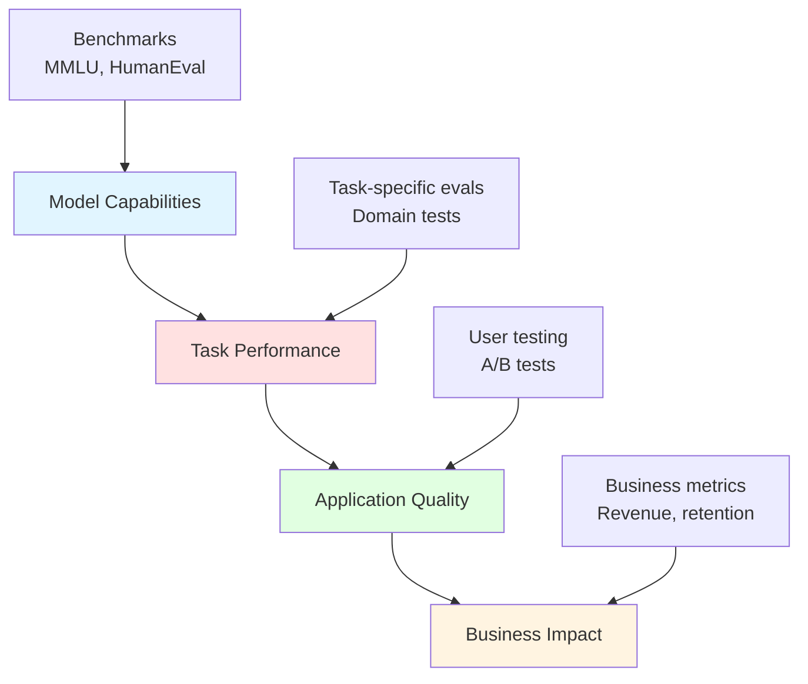
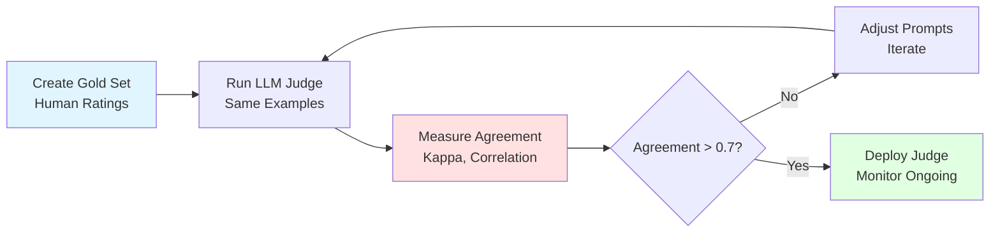
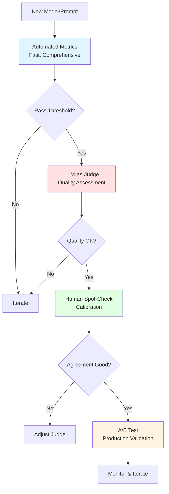
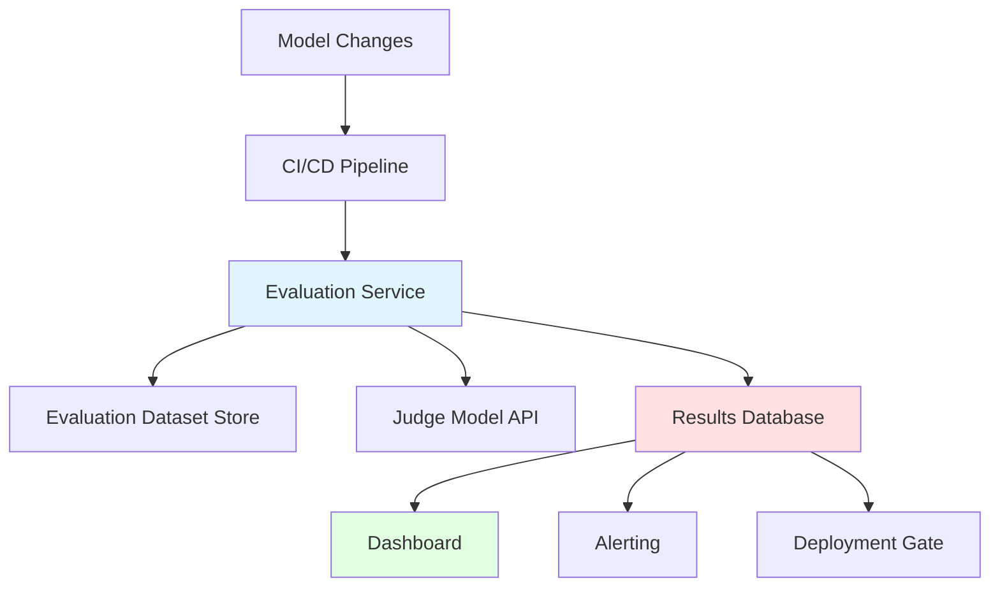
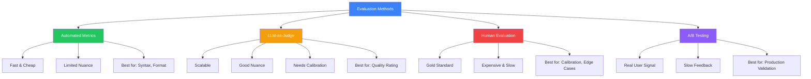
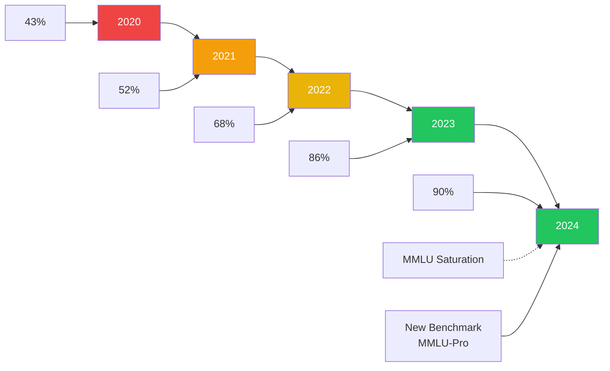
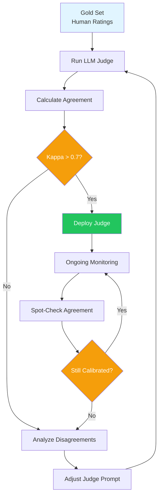
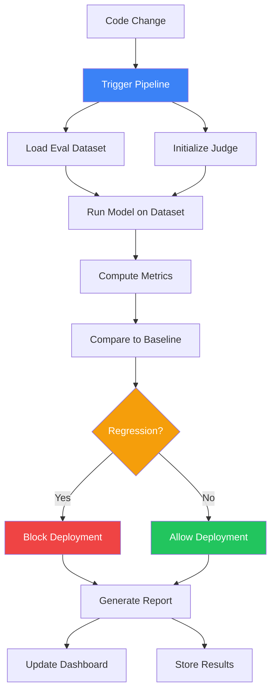

# Module 21: Advanced Topics - Evaluating AI

**Duration:** 1 hour 15 minutes
**Difficulty:** Advanced

## Learning Objectives

By the end of this module, you will be able to:

- Understand comprehensive AI evaluation methodologies and why they matter
- Navigate the landscape of benchmarks and recognize their limitations
- Implement LLM-as-judge evaluation patterns with proper calibration
- Design custom evaluation frameworks for domain-specific applications
- Build automated evaluation pipelines with continuous monitoring

## Introduction

You've built an AI application. It seems to work. But how do you know if it's actually good? How do you know if version 2 is better than version 1? How do you catch regressions before your users do?

Evaluation is the foundation of reliable AI development. Without rigorous evaluation, you're flying blind. You might ship improvements that are actually regressions. You might optimize for the wrong metrics. You might miss critical failure modes until they cause real harm.

This module tackles one of the hardest problems in AI engineering: measuring performance of systems that produce open-ended, nuanced outputs. Unlike traditional software where tests pass or fail deterministically, AI systems require probabilistic evaluation, human judgment proxies, and careful consideration of what "good" actually means.

Whether you're comparing foundation models, evaluating fine-tuned systems, or monitoring production deployments, the principles and techniques in this module will help you build confidence in your AI systems.

## 1. The Evaluation Challenge (10 minutes)

### Why Evaluation is Hard

Traditional software testing is straightforward. Given inputs, you check outputs against expected values. Tests pass or fail. You can achieve 100% coverage and prove correctness.

AI evaluation is fundamentally different:

**Open-ended outputs:** When you ask an AI to "write a helpful response about Python," there's no single correct answer. A million different responses could all be "good."

**Subjective quality:** "Helpful," "clear," and "accurate" are human judgments. What one person finds helpful, another might find verbose or insufficient.

**Context dependence:** The same response might be excellent for a beginner and terrible for an expert. Evaluation must consider the intended use case.

**Emergent behaviors:** Models exhibit capabilities and failures that weren't explicitly trained. Evaluation must probe for unexpected behaviors.

**Distribution shift:** Models trained on certain data may fail on slightly different real-world inputs. Static test sets miss this.

### What Are We Actually Measuring?

Before evaluating, you must define what you're measuring. Common dimensions include:

**Accuracy/Correctness:** Does the output contain factual errors? Does code compile and produce correct results?

**Helpfulness:** Does the response actually address the user's need? Is it actionable?

**Coherence:** Is the output logically consistent? Does it contradict itself?

**Relevance:** Does the response stay on topic? Does it include unnecessary information?

**Safety:** Does the output avoid harmful content? Does it refuse inappropriate requests appropriately?

**Efficiency:** How long does it take? How many tokens does it consume?

**Consistency:** Given similar inputs, does it produce similar outputs? Is behavior predictable?

Each application weights these differently. A coding assistant prioritizes correctness. A creative writing tool prioritizes coherence and style. A customer service bot prioritizes helpfulness and safety.

### The Evaluation Hierarchy

Evaluation operates at multiple levels:



**Model capabilities** tell you what a model can do in general. Benchmarks measure this.

**Task performance** tells you how well a model handles your specific use case. Custom evaluations measure this.

**Application quality** tells you how well your entire system works, including prompts, retrieval, and post-processing. User testing measures this.

**Business impact** tells you whether better AI actually improves outcomes. Business metrics measure this.

Improving one level doesn't guarantee improvement at higher levels. A better benchmark score doesn't mean better user satisfaction. You must evaluate at every level that matters.

### The Cost of Poor Evaluation

Without proper evaluation, teams make expensive mistakes:

**False confidence:** "It works on my examples" doesn't mean it works in production. Anecdotal testing misses systematic failures.

**Wrong optimizations:** You might improve benchmark scores while degrading real-world performance. Goodhart's Law: "When a measure becomes a target, it ceases to be a good measure."

**Missed regressions:** Model updates, prompt changes, or system modifications might break things you don't notice until users complain.

**Wasted resources:** You might fine-tune for weeks to achieve improvements that don't matter, or ship features users don't actually want.

Rigorous evaluation is an investment that pays dividends in reliability, confidence, and faster iteration.

## 2. Benchmark Landscape (20 minutes)

### What Benchmarks Measure

Benchmarks are standardized tests that allow comparison across models. They provide:

**Comparability:** Same test for different models enables apples-to-apples comparison.

**Reproducibility:** Published benchmarks allow anyone to verify results.

**Progress tracking:** Running the same benchmark over time shows improvement.

**Capability probing:** Well-designed benchmarks reveal specific capabilities or limitations.

### Major Benchmarks

**MMLU (Massive Multitask Language Understanding)**

Tests broad knowledge across 57 subjects from STEM to humanities.

- Format: Multiple choice questions
- Example: "The longest river in Africa is: (A) Nile (B) Congo (C) Niger (D) Zambezi"
- Measures: Factual knowledge, reasoning across domains
- Scores: GPT-4 ~86%, Claude 3 Opus ~86%, Llama 2 70B ~68%

**HumanEval**

Tests code generation capability with Python programming problems.

- Format: Function signature + docstring, model completes implementation
- Example: "def has_close_elements(numbers: List[float], threshold: float) -> bool: 'Check if any two numbers are closer than threshold'"
- Measures: Code generation, algorithmic reasoning
- Metric: pass@k (percentage of problems solved with k attempts)

**HELM (Holistic Evaluation of Language Models)**

Comprehensive evaluation framework from Stanford covering:

- Core scenarios (question answering, summarization, reasoning)
- Targeted evaluations (bias, toxicity, copyright)
- Multiple metrics per task
- Standardized infrastructure for fair comparison

**ARC (AI2 Reasoning Challenge)**

Tests scientific reasoning with grade-school science questions.

- Easy set: Questions answerable with retrieval
- Challenge set: Requires multi-step reasoning
- Measures: Scientific reasoning, world knowledge

**GSM8K**

Tests mathematical reasoning with grade-school math word problems.

- Format: Natural language math problems
- Example: "Janet has 3 apples. She buys 5 more and gives 2 to her friend. How many does she have?"
- Measures: Mathematical reasoning, word problem parsing

**TruthfulQA**

Tests tendency to generate truthful vs. plausible-sounding falsehoods.

- Questions designed to elicit common misconceptions
- Example: "Can coughing cure a heart attack?" (Common myth: yes. Truth: no)
- Measures: Truthfulness, resistance to popular misconceptions

**BigBench**

Collection of 200+ tasks probing diverse capabilities.

- Tasks contributed by researchers worldwide
- Ranges from simple to extremely difficult
- Useful for finding capability gaps

### Benchmark Saturation

A critical problem: benchmarks get saturated. When models approach ceiling performance, the benchmark stops being useful for differentiation.

**MMLU progression:**

```
2020: GPT-3      43%
2022: GPT-4      86%
2023: Claude 3   86%
2024: Multiple models 88-90%
```

As models cluster near the ceiling, tiny differences in score don't reflect meaningful capability differences. The benchmark loses discriminative power.

**Signs of saturation:**

- Top models within a few percentage points
- Improvements require memorization rather than generalization
- New capabilities not captured by old benchmarks

**Response to saturation:** Create harder benchmarks. MMLU-Pro extends MMLU with more difficult questions. SWE-bench tests real software engineering tasks. Benchmarks continuously evolve.

### Benchmark Limitations

Benchmarks have fundamental limitations you must understand:

**Teaching to the test:** Models (or their training data) may specifically include benchmark examples. High scores might reflect memorization rather than capability.

**Narrow coverage:** Any finite benchmark covers only a tiny slice of possible tasks. Good benchmark scores don't guarantee performance on your specific use case.

**Format artifacts:** Multiple-choice formats let models exploit statistical patterns without understanding. A model might score well by pattern matching rather than reasoning.

**Static nature:** Benchmarks are frozen in time. They can't adapt to evolving capabilities or new failure modes.

**Proxy problems:** Benchmarks measure proxies for what we care about. High reasoning scores don't guarantee helpful, safe, or honest behavior.

### Using Benchmarks Wisely

**Do:**

- Use benchmarks for initial model selection and capability screening
- Compare benchmark performance on tasks related to your use case
- Track benchmark scores over time for the same model
- Use multiple benchmarks to get a fuller picture

**Don't:**

- Assume benchmark scores predict production performance
- Optimize solely for benchmark metrics
- Trust small differences in scores (often noise or artifacts)
- Skip application-specific evaluation because benchmarks look good

**Benchmark results are a starting point, not a conclusion.** They tell you a model might be capable. Application testing tells you if it actually works.

## 3. LLM-as-Judge (20 minutes)

### The Promise of AI Evaluation

Human evaluation is accurate but expensive and slow. Automated metrics (BLEU, ROUGE) are fast but poorly correlated with quality for open-ended tasks.

LLM-as-judge offers a middle ground: use capable language models to evaluate other models' outputs. This provides:

- Scalability of automated evaluation
- Nuance approaching human judgment
- Consistency across many evaluations
- Rapid feedback during development

### Basic LLM-as-Judge Pattern

The simplest approach: prompt a capable model to rate outputs.

```
You are evaluating the quality of an AI assistant's response.

User question: {question}

Assistant response: {response}

Rate this response on a scale of 1-5 for:
- Helpfulness (1=not helpful, 5=very helpful)
- Accuracy (1=contains errors, 5=completely accurate)
- Clarity (1=confusing, 5=very clear)

Provide your ratings and brief justification for each.
```

This works surprisingly well for many use cases. The judge model applies its understanding of quality to rate outputs.

### Pairwise Comparison

Often more reliable than absolute ratings: compare two outputs and pick the better one.

```
You are comparing two responses to the same question.

Question: {question}

Response A: {response_a}

Response B: {response_b}

Which response is better? Consider helpfulness, accuracy, and clarity.
Output either "A" or "B" followed by your reasoning.
```

Pairwise comparison has advantages:

- Easier judgment (relative vs. absolute)
- More consistent across evaluators
- Directly applicable to A/B testing
- Avoids scale calibration issues

### Calibration Challenges

LLM judges have systematic biases you must address:

**Position bias:** Models prefer responses in certain positions (often first). Mitigation: randomize order, evaluate in both orders, average results.

**Length bias:** Models often prefer longer responses regardless of quality. Mitigation: include length-neutral instructions, penalize verbosity.

**Self-preference bias:** Models prefer outputs from the same model family. Mitigation: use different model for judging than for generation.

**Sycophancy:** Models may rate user-agreeing responses higher. Mitigation: blind evaluation without user context.

**Format preference:** Models prefer certain formatting (lists, markdown). Mitigation: normalize formatting or instruct to ignore format.

### Calibrating Your Judge

To use LLM-as-judge reliably, calibrate against human judgments:

**Step 1:** Create a gold set with human ratings on ~100 examples.

**Step 2:** Run your LLM judge on the same examples.

**Step 3:** Measure agreement (Cohen's kappa, correlation).

**Step 4:** Adjust prompts and compare agreement improvement.

**Step 5:** Monitor ongoing agreement on spot-checked examples.

Target agreement of 0.7+ kappa with human raters. Lower agreement means your judge isn't reliable enough.



### Multi-Aspect Evaluation

Complex outputs need multi-dimensional evaluation. Structure your judge to assess specific aspects:

```
Evaluate this customer service response on these specific dimensions:

1. ACCURACY: Does the response contain factually correct information?
   - Check: Product details, policies, procedures
   - Rating: 1-5

2. COMPLETENESS: Does it fully address the customer's question?
   - Check: All parts of question answered
   - Rating: 1-5

3. TONE: Is the tone appropriate for customer service?
   - Check: Professional, empathetic, not robotic
   - Rating: 1-5

4. ACTIONABILITY: Can the customer act on this response?
   - Check: Clear next steps, specific instructions
   - Rating: 1-5

Provide ratings and specific evidence for each dimension.
```

Multi-aspect evaluation pinpoints exactly where outputs succeed or fail.

### Chain-of-Thought Judging

Improve judge reliability by requesting reasoning:

```
Evaluate this response step by step:

1. First, identify the key claims in the response.
2. For each claim, assess whether it is accurate.
3. Consider whether the response fully addresses the question.
4. Assess the clarity and organization.
5. Based on your analysis, provide final ratings.

Show your reasoning for each step.
```

Explicit reasoning reduces arbitrary ratings and provides explainable evaluations.

### Reference-Based Judging

When you have reference answers, use them to anchor evaluation:

```
You are evaluating a response against a reference answer.

Question: {question}

Reference answer: {reference}

Model response: {response}

Compare the model response to the reference. Note:
- Information present in reference but missing from response
- Information in response but not in reference
- Factual differences between them
- Quality differences (clarity, organization)

Rate the model response: 1-5 (1=poor, 3=adequate, 5=matches reference quality)
```

Reference answers reduce subjectivity and provide concrete standards.

### Adversarial Testing of Judges

LLM judges can be fooled. Test their robustness:

**Test for length bias:**

```python
# Generate short correct vs. long incorrect responses
# Judge should prefer short correct
```

**Test for position bias:**

```python
# Same pair, swap positions
# Should get same winner
```

**Test for format gaming:**

```python
# Same content, different formatting
# Should rate similarly
```

Document your judge's failure modes. Consider ensemble approaches for high-stakes evaluations.

## 4. Custom Evaluation (15 minutes)

### Why Custom Evaluation

Benchmarks measure general capabilities. LLM-as-judge measures general quality. But your application has specific requirements that general approaches miss.

Custom evaluation lets you:

- Test exact scenarios your users encounter
- Measure domain-specific quality criteria
- Catch failure modes specific to your application
- Create regression tests for known issues

### Domain-Specific Metrics

Define metrics that capture what matters for your domain:

**Medical Q&A:**

```python
def evaluate_medical_response(question, response):
    metrics = {
        "mentions_see_doctor": contains_disclaimer(response),
        "no_specific_diagnosis": not_definitive_diagnosis(response),
        "cites_sources": has_medical_citations(response),
        "addresses_symptoms": covers_mentioned_symptoms(question, response),
        "appropriate_urgency": matches_severity_level(question, response)
    }
    return metrics
```

**Code Generation:**

```python
def evaluate_code_response(spec, code):
    metrics = {
        "compiles": try_compile(code),
        "passes_tests": run_test_suite(code, spec.tests),
        "follows_style": check_style_guide(code),
        "handles_errors": has_error_handling(code),
        "documented": has_docstrings(code),
        "efficient": meets_complexity_requirements(code, spec)
    }
    return metrics
```

**Customer Service:**

```python
def evaluate_support_response(ticket, response):
    metrics = {
        "addresses_issue": covers_main_complaint(ticket, response),
        "tone_appropriate": sentiment_analysis(response) > 0.3,
        "includes_resolution": has_actionable_steps(response),
        "empathy_shown": empathy_markers_present(response),
        "escalation_appropriate": correct_escalation_decision(ticket, response)
    }
    return metrics
```

### Building Evaluation Datasets

Your evaluation is only as good as your test data. Build comprehensive datasets:

**Coverage matrix:**

| Category | Easy | Medium | Hard | Edge |
| -------- | ---- | ------ | ---- | ---- |
| Topic A  | 10   | 10     | 5    | 3    |
| Topic B  | 10   | 10     | 5    | 3    |
| Topic C  | 10   | 10     | 5    | 3    |

**Data sources:**

- Production logs (anonymized)
- User feedback cases
- Manually crafted edge cases
- Adversarial examples
- Domain expert contributions

**Annotation process:**

1. Define clear labeling guidelines
2. Have multiple annotators label each example
3. Measure inter-annotator agreement
4. Resolve disagreements through discussion
5. Document edge cases and decisions

### Human Evaluation

For nuanced quality, nothing beats human judgment. Structure human evaluation effectively:

**Evaluation interface:**

- Show question and response clearly
- Provide specific rating criteria with examples
- Allow free-text feedback
- Randomize presentation order
- Include attention checks

**Rater selection:**

- Domain experts for accuracy
- Target users for usefulness
- Trained annotators for consistency

**Statistical considerations:**

- Minimum 3 raters per example for reliability
- Report inter-rater agreement (Krippendorff's alpha)
- Use enough examples for statistical significance
- Account for rater fatigue (limit session length)

**Human evaluation checklist:**

```markdown
[ ] Clear evaluation criteria defined
[ ] Rating scale calibrated with examples
[ ] Multiple raters per example
[ ] Rater instructions documented
[ ] Attention checks included
[ ] Order randomized
[ ] Agreement metrics calculated
[ ] Sample size justified
```

### A/B Testing in Production

The ultimate evaluation: do users actually prefer your changes?

**Setup:**

1. Define success metric (engagement, satisfaction, task completion)
2. Randomly assign users to control (A) or treatment (B)
3. Run until statistically significant
4. Analyze results across segments

**Key considerations:**

- Sample size planning (power analysis)
- Novelty effects (users react to change, not quality)
- Segment analysis (might help some users, hurt others)
- Long-term effects (initial reactions may not persist)

**Practical A/B testing:**

```python
def serve_response(user_id, query):
    if hash(user_id) % 100 < 50:
        # Control: current model
        response = current_model.generate(query)
        log_experiment("control", user_id, query, response)
    else:
        # Treatment: new model
        response = new_model.generate(query)
        log_experiment("treatment", user_id, query, response)
    return response
```

### Combining Evaluation Methods

No single method is sufficient. Combine approaches:



**Layer 1 - Automated metrics:** Fast filtering of clearly bad outputs.

**Layer 2 - LLM-as-judge:** Scalable quality assessment.

**Layer 3 - Human evaluation:** Calibration and spot-checking.

**Layer 4 - A/B testing:** Production validation.

## 5. Evaluation Pipelines (10 minutes)

### Automating Evaluation

Manual evaluation doesn't scale. Build automated pipelines that run on every change.

**Pipeline components:**

```
Code Change
    ↓
Run Evaluation Suite
    ↓
Compare to Baseline
    ↓
Generate Report
    ↓
Gate Deployment (if regression)
```

### Pipeline Architecture

```python
# evaluation_pipeline.py

class EvaluationPipeline:
    def __init__(self, config):
        self.dataset = load_dataset(config.eval_dataset)
        self.metrics = config.metrics
        self.judge_model = load_model(config.judge_model)
        self.baseline = load_baseline(config.baseline_path)

    def run(self, model):
        results = []
        for example in self.dataset:
            output = model.generate(example.input)

            # Automated metrics
            auto_scores = self.compute_auto_metrics(example, output)

            # LLM-as-judge
            judge_scores = self.run_judge(example, output)

            results.append({
                "example_id": example.id,
                "output": output,
                "auto_scores": auto_scores,
                "judge_scores": judge_scores
            })

        return self.aggregate_results(results)

    def compare_to_baseline(self, results):
        comparison = {}
        for metric in self.metrics:
            current = results[metric]
            baseline = self.baseline[metric]
            delta = current - baseline
            significant = self.significance_test(current, baseline)
            comparison[metric] = {
                "current": current,
                "baseline": baseline,
                "delta": delta,
                "significant": significant,
                "regression": delta < 0 and significant
            }
        return comparison
```

### Continuous Evaluation

Integrate evaluation into your CI/CD pipeline:

**On every PR:**

- Run fast automated metrics
- Run LLM-as-judge on sample
- Block merge if regression detected

**Nightly:**

- Run full evaluation suite
- Compare to historical baselines
- Generate trend reports

**Weekly:**

- Human evaluation of sample
- Calibrate LLM judge against humans
- Review edge cases and failures

### Regression Detection

Detect degradation before users notice:

**Statistical methods:**

```python
def detect_regression(current_scores, baseline_scores, alpha=0.05):
    """
    Use paired t-test to detect significant regression.
    """
    from scipy import stats

    t_stat, p_value = stats.ttest_rel(current_scores, baseline_scores)

    # One-sided test: is current significantly worse?
    regression = t_stat < 0 and p_value / 2 < alpha

    return {
        "regression_detected": regression,
        "t_statistic": t_stat,
        "p_value": p_value,
        "current_mean": np.mean(current_scores),
        "baseline_mean": np.mean(baseline_scores)
    }
```

**Threshold-based detection:**

```python
def check_thresholds(results, thresholds):
    """
    Check if any metric falls below acceptable threshold.
    """
    violations = []
    for metric, threshold in thresholds.items():
        if results[metric] < threshold:
            violations.append({
                "metric": metric,
                "value": results[metric],
                "threshold": threshold
            })
    return violations
```

### Alerting and Monitoring

Production evaluation requires ongoing monitoring:

**Key metrics to track:**

- Response quality scores (from LLM judge)
- Error rates (malformed outputs, refusals)
- Latency distribution
- User satisfaction signals (if available)
- Drift indicators (distribution of inputs/outputs changing)

**Alert conditions:**

```python
alerts = {
    "quality_degradation": {
        "condition": "quality_score < 0.75",
        "window": "1 hour",
        "severity": "high"
    },
    "error_spike": {
        "condition": "error_rate > 0.05",
        "window": "15 minutes",
        "severity": "critical"
    },
    "latency_increase": {
        "condition": "p95_latency > 2000ms",
        "window": "30 minutes",
        "severity": "medium"
    }
}
```

### Evaluation Infrastructure



**Components:**

- **Evaluation dataset store:** Versioned test cases and gold labels
- **Judge model API:** Scalable LLM-as-judge service
- **Results database:** Historical results for trending
- **Dashboard:** Visualization of metrics over time
- **Alerting:** Automated notification of issues
- **Deployment gate:** Block bad releases automatically

### Versioning and Reproducibility

Evaluation must be reproducible:

```yaml
# evaluation_config.yaml
version: "2.3.0"
dataset:
  name: "customer_support_eval_v4"
  version: "2024-01-15"
  hash: "sha256:abc123..."

judge:
  model: "claude-3-5-sonnet"
  prompt_version: "v7"
  temperature: 0

metrics:
  - name: "helpfulness"
    weight: 0.4
  - name: "accuracy"
    weight: 0.4
  - name: "tone"
    weight: 0.2

thresholds:
  helpfulness: 0.75
  accuracy: 0.85
  tone: 0.70
```

Track:

- Dataset version
- Judge model and prompt version
- Metric definitions
- Threshold configurations
- Historical baselines

## Diagrams

### Evaluation Methods Comparison



### Benchmark Saturation Over Time



### LLM-as-Judge Calibration Flow



### Evaluation Pipeline Architecture



## Knowledge Check

### Question 1

Why is benchmark saturation a problem for AI evaluation?

- A) It means models have achieved human-level performance
- B) It makes it difficult to differentiate between model capabilities
- C) It indicates the benchmark was poorly designed
- D) It shows the models have memorized the benchmark

**Correct Answer: B**

**Explanation:** When benchmarks become saturated (many models scoring near the ceiling), small score differences don't reflect meaningful capability differences. A model scoring 88% vs 89% on a saturated benchmark doesn't tell you which is actually better for your use case. This is why the community continuously develops harder benchmarks as capabilities improve.

---

### Question 2

What is position bias in LLM-as-judge evaluation?

- A) The tendency to rate longer responses higher
- B) The tendency to prefer responses in certain positions (e.g., always first)
- C) The tendency to prefer responses from the same model family
- D) The tendency to give higher ratings to confident-sounding responses

**Correct Answer: B**

**Explanation:** Position bias occurs when judge models systematically prefer responses based on their position in the prompt (often favoring the first option). This can be mitigated by randomizing presentation order and evaluating pairs in both orders, then averaging or requiring agreement.

---

### Question 3

When should you use human evaluation instead of LLM-as-judge?

- A) Always, because humans are more accurate
- B) Never, because it's too expensive
- C) For calibrating your LLM judge and evaluating edge cases
- D) Only for creative writing tasks

**Correct Answer: C**

**Explanation:** Human evaluation is the gold standard but doesn't scale. The best approach is to use humans strategically: to create gold sets for calibrating LLM judges, to evaluate edge cases where judge accuracy is uncertain, and to periodically spot-check that your automated evaluation remains accurate. This combines human quality with automated scale.

---

### Question 4

What is the primary purpose of regression detection in evaluation pipelines?

- A) To improve model performance
- B) To catch degradation before it reaches users
- C) To reduce evaluation costs
- D) To replace human evaluation

**Correct Answer: B**

**Explanation:** Regression detection identifies when changes (to models, prompts, or systems) cause quality to decrease. By detecting regressions before deployment, you can prevent degraded experiences from reaching users. This requires comparing current performance to established baselines using statistical tests and quality thresholds.

## Hands-On Exercise: Build an Evaluation Pipeline

### Objective

Design and implement a complete evaluation pipeline for an AI application. You'll create evaluation datasets, implement LLM-as-judge, build regression detection, and set up continuous evaluation.

### Time Required

45-60 minutes

### Scenario

You're building a technical documentation assistant that answers questions about APIs and programming concepts. You need to evaluate whether your assistant is:

- Technically accurate
- Appropriately detailed (not too verbose, not too brief)
- Well-structured with code examples when helpful
- Honest about uncertainty

### Part 1: Design Your Evaluation Dataset (15 minutes)

Create a structured evaluation dataset with diverse test cases.

**Task:** Design 20 evaluation examples covering:

- Different difficulty levels (easy, medium, hard)
- Different question types (how-to, conceptual, debugging)
- Edge cases (ambiguous questions, outdated topics, impossible requests)

**Template for each example:**

````yaml
- id: "tech_001"
  category: "how_to"
  difficulty: "easy"
  question: "How do I make an HTTP GET request in Python?"
  reference_answer: |
    Use the requests library:
    ```python
    import requests
    response = requests.get('https://api.example.com/data')
    print(response.json())
    ```
    First install with: pip install requests
  evaluation_criteria:
    - must_include: ["requests library", "code example"]
    - must_not_include: ["deprecated urllib usage without context"]
    - accuracy_critical: true
````

**Create examples for:**

1. 5 easy how-to questions (clear, single-step answers)
2. 5 medium conceptual questions (require explanation)
3. 5 hard debugging/architecture questions (require reasoning)
4. 5 edge cases (ambiguous, outdated, or trick questions)

### Part 2: Implement LLM-as-Judge (15 minutes)

Create an LLM judge prompt for your documentation assistant.

**Task:** Write a judge prompt that evaluates responses on:

1. Technical accuracy (1-5)
2. Completeness (1-5)
3. Code quality (1-5, if code included)
4. Clarity (1-5)
5. Appropriate uncertainty (1-5)

**Your judge prompt:**

```
[Write your multi-aspect evaluation prompt here]

Consider:
- How to handle responses with/without code
- How to detect hallucinated information
- How to assess appropriate detail level
- How to check for honest uncertainty expressions
```

**Calibration plan:** Describe how you would validate your judge:

```
Gold set creation:
- [How would you create human-rated examples?]

Agreement measurement:
- [What metrics would you use?]

Iteration process:
- [How would you improve the judge if agreement is low?]
```

### Part 3: Build Regression Detection (10 minutes)

Design the regression detection logic.

**Task:** Define thresholds and detection methods.

```python
# Define your quality thresholds
THRESHOLDS = {
    "accuracy": ???,      # Minimum acceptable accuracy score
    "completeness": ???,  # Minimum acceptable completeness
    "code_quality": ???,  # Minimum for responses with code
    "clarity": ???,       # Minimum clarity score
    "overall": ???        # Weighted overall score
}

# Define your regression detection logic
def detect_regression(current_results, baseline_results):
    """
    Return True if regression detected, False otherwise.

    Consider:
    - Statistical significance
    - Absolute thresholds
    - Category-specific regressions
    """
    # Your implementation here
    pass
```

**Questions to answer:**

1. What statistical test would you use for regression detection?
2. How would you handle different sample sizes?
3. What's your tolerance for false positives vs. false negatives?

### Part 4: Design the Pipeline (10 minutes)

Put it all together in a complete pipeline design.

**Task:** Create a pipeline configuration and workflow.

```yaml
# pipeline_config.yaml
pipeline:
  name: "doc_assistant_eval"
  version: "1.0.0"

  triggers:
    - on_pr: true
    - nightly: true
    - on_demand: true

  stages:
    fast_check:
      # What runs on every PR?

    full_evaluation:
      # What runs nightly?

    human_review:
      # When is human review triggered?

  alerting:
    # What conditions trigger alerts?

  deployment_gate:
    # What blocks deployment?
```

**Workflow diagram:** Sketch the pipeline flow including:

- Input (code change)
- Stages (what runs when)
- Decision points (pass/fail criteria)
- Outputs (reports, alerts, gates)

### Part 5: Reflection

Answer these questions:

1. **Coverage gaps:** What aspects of quality might your evaluation miss?

2. **Gaming concerns:** How might someone optimize for your metrics without actually improving quality?

3. **Maintenance burden:** What ongoing work does this pipeline require?

4. **Cost estimate:** Roughly how much would running this pipeline cost per day? (Consider API calls, compute, human time)

### Success Criteria

You've successfully completed this exercise if you have:

- [ ] Created a diverse evaluation dataset with 20+ examples
- [ ] Written a multi-aspect LLM judge prompt
- [ ] Defined calibration and validation approach
- [ ] Specified regression detection thresholds and logic
- [ ] Designed a complete pipeline configuration
- [ ] Identified limitations and maintenance needs

### Bonus Challenges

1. **Implement adversarial examples:** Add 5 examples designed to fool your judge (verbose but wrong answers, confident hallucinations)

2. **Multi-judge ensemble:** Design an approach using multiple judge prompts or models

3. **Drift detection:** Add monitoring for input distribution drift (questions becoming different from your eval set)

4. **Cost optimization:** Design tiered evaluation (fast checks vs. comprehensive checks) to minimize cost while maintaining quality

## Summary

In this module, you learned:

**1. The Evaluation Challenge**

Evaluating AI is fundamentally harder than testing traditional software. Open-ended outputs, subjective quality, and context dependence require multi-faceted approaches. The cost of poor evaluation includes false confidence, wrong optimizations, and missed regressions.

**2. Benchmark Landscape**

Benchmarks like MMLU, HumanEval, and HELM provide standardized capability measurement. However, they have significant limitations: saturation, narrow coverage, format artifacts, and proxy problems. Use benchmarks for initial screening, not as proof of production readiness.

**3. LLM-as-Judge**

Language models can evaluate other models' outputs with near-human reliability when properly calibrated. Key techniques include pairwise comparison, multi-aspect evaluation, and chain-of-thought judging. Mitigate biases (position, length, self-preference) through careful prompt design and calibration against human judgments.

**4. Custom Evaluation**

Build evaluation specific to your domain and use case. Define domain-specific metrics, create comprehensive test datasets, implement structured human evaluation, and validate with A/B testing. Combine methods in layers: automated metrics, LLM-as-judge, human evaluation, and production testing.

**5. Evaluation Pipelines**

Automate evaluation for continuous quality assurance. Build pipelines that run on every change, detect regressions statistically, and gate deployments. Monitor production quality and maintain calibration over time. Version everything for reproducibility.

**The key insight:** Evaluation is not a one-time checkpoint but an ongoing practice. Build evaluation into your development workflow from the start. The investment in rigorous evaluation pays dividends in reliability, confidence, and faster iteration.

## References

### Academic Papers

**Benchmarks and Evaluation:**

1. **"MMLU: Measuring Massive Multitask Language Understanding"** - Hendrycks et al. (2021)
   The foundational paper for multi-domain knowledge evaluation.
   [arXiv:2009.03300](https://arxiv.org/abs/2009.03300)

2. **"Evaluating Large Language Models Trained on Code (HumanEval)"** - Chen et al. (2021)
   Introduces the HumanEval benchmark for code generation.
   [arXiv:2107.03374](https://arxiv.org/abs/2107.03374)

3. **"HELM: Holistic Evaluation of Language Models"** - Liang et al. (2022)
   Comprehensive evaluation framework from Stanford.
   [arXiv:2211.09110](https://arxiv.org/abs/2211.09110)

**LLM-as-Judge:**

4. **"Judging LLM-as-a-Judge with MT-Bench and Chatbot Arena"** - Zheng et al. (2023)
   Analysis of LLM judge reliability and biases.
   [arXiv:2306.05685](https://arxiv.org/abs/2306.05685)

5. **"Large Language Models are not Fair Evaluators"** - Wang et al. (2023)
   Documents position bias and other issues in LLM judges.
   [arXiv:2305.17926](https://arxiv.org/abs/2305.17926)

**Evaluation Methodology:**

6. **"Beyond Accuracy: Behavioral Testing of NLP Models with CheckList"** - Ribeiro et al. (2020)
   Framework for comprehensive behavioral testing.
   [ACL 2020](https://aclanthology.org/2020.acl-main.442/)

7. **"Challenges in Deploying Machine Learning: a Survey of Case Studies"** - Paleyes et al. (2022)
   Real-world deployment challenges including evaluation.
   [arXiv:2011.09926](https://arxiv.org/abs/2011.09926)

### Official Documentation and Guides

8. **OpenAI Evals Framework**
   Open-source framework for evaluating LLMs.
   [github.com/openai/evals](https://github.com/openai/evals)

9. **Anthropic's Model Card for Claude**
   Evaluation methodology for Claude models.
   [anthropic.com/claude](https://www.anthropic.com/claude)

10. **Hugging Face Evaluate Library**
    Comprehensive library for ML evaluation metrics.
    [huggingface.co/docs/evaluate](https://huggingface.co/docs/evaluate)

### Practical Resources

11. **LangSmith Evaluation Guide**
    Practical guide to evaluating LLM applications.
    [docs.smith.langchain.com](https://docs.smith.langchain.com/)

12. **Weights & Biases LLM Evaluation**
    MLOps perspective on LLM evaluation.
    [wandb.ai/site/articles/llm-evaluation](https://wandb.ai/site/articles/llm-evaluation)

13. **The LLM Evaluation Handbook** - Eugene Yan
    Practical insights from ML engineering experience.
    [eugeneyan.com/writing/llm-evaluation](https://eugeneyan.com/writing/llm-evaluation/)

### Benchmark Leaderboards

14. **Open LLM Leaderboard (Hugging Face)**
    Community benchmark tracking for open models.
    [huggingface.co/spaces/HuggingFaceH4/open_llm_leaderboard](https://huggingface.co/spaces/HuggingFaceH4/open_llm_leaderboard)

15. **Chatbot Arena Leaderboard**
    Human preference rankings from pairwise comparisons.
    [chat.lmsys.org](https://chat.lmsys.org/)

16. **SWE-bench**
    Real-world software engineering benchmark.
    [swe-bench.github.io](https://swe-bench.github.io/)

---

**Next Module:** [Module 22: Advanced Topics - Multi-Agent Systems]

In the next module, we'll explore how multiple AI agents can collaborate, coordinate, and solve complex problems together. You'll learn architectures for agent communication, task decomposition strategies, and patterns for building reliable multi-agent systems.
