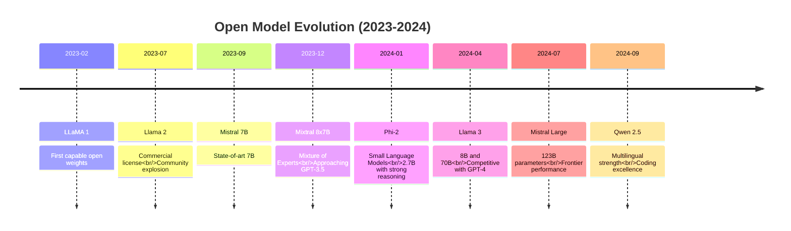
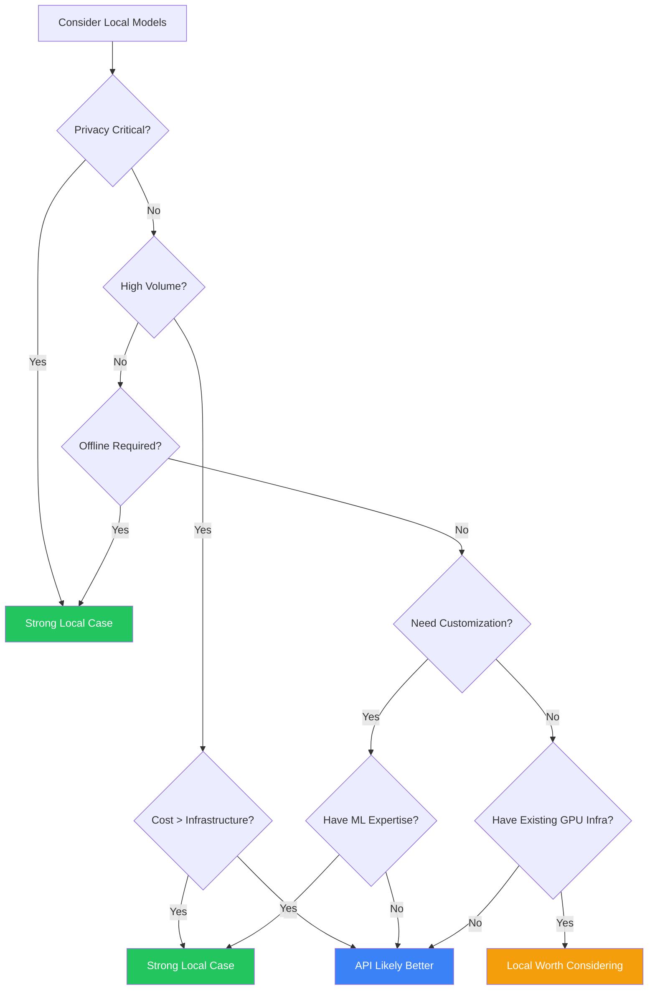
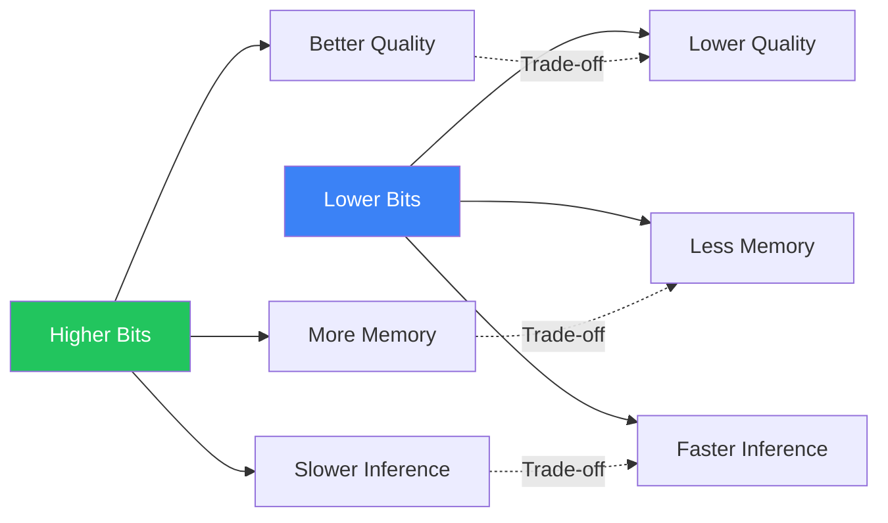
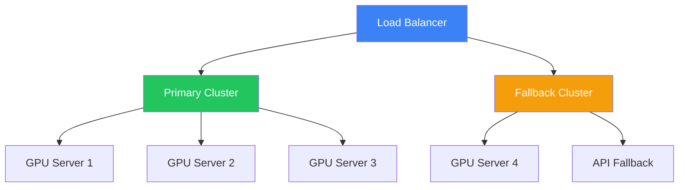
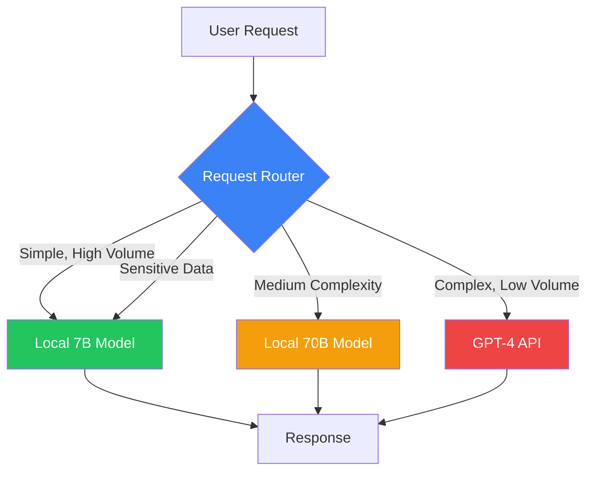
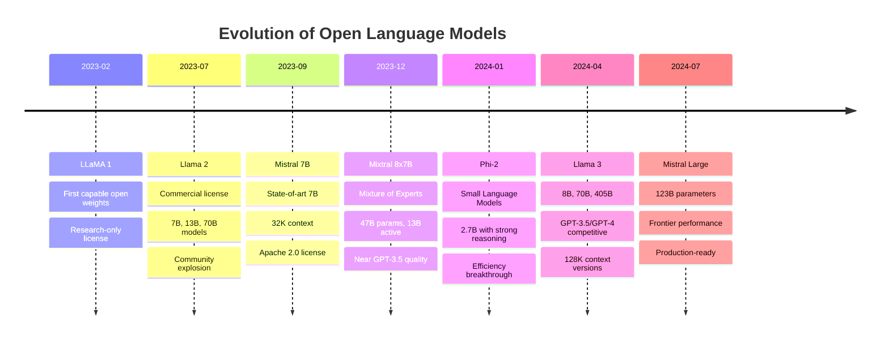
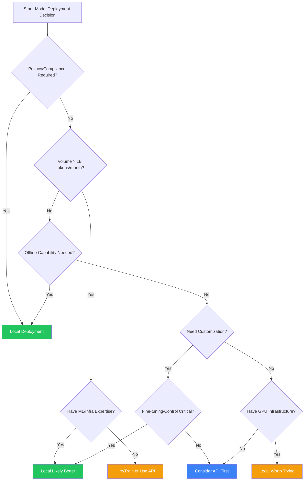
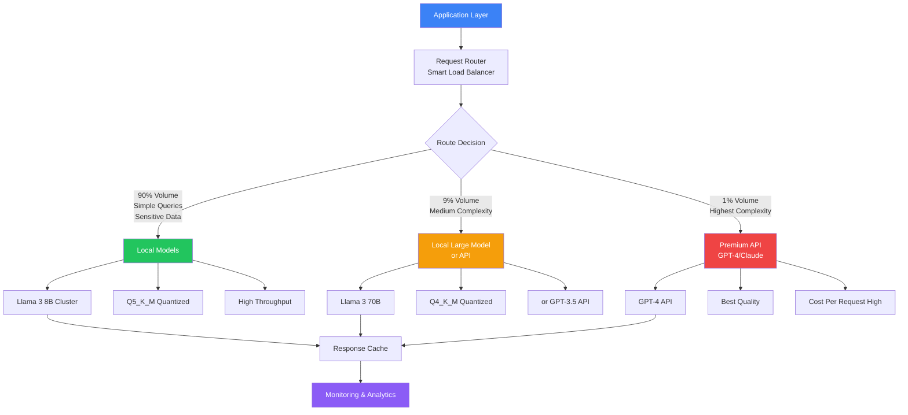

# Module 22: Advanced Topics - Local and Open Models

**Part 4: Capstone & Advanced** | **Duration**: 1 hour 15 minutes | **Difficulty**: Intermediate-Advanced

---

## Learning Objectives

By the end of this module, you will be able to:

- Understand the open model ecosystem and differentiate between open weights and open source
- Set up and run language models locally using tools like Ollama and llama.cpp
- Make informed decisions about when to use local vs. API-based models
- Apply optimization techniques like quantization to improve local model performance
- Evaluate production considerations for deploying local models at scale

---

## Introduction

Throughout this course, you've primarily worked with API-based models: Claude, GPT-4, commercial offerings that you access over the internet. These models are powerful, convenient, and continuously improving. But they're not the only option.

The open model ecosystem has exploded. Models like Llama, Mistral, and Phi offer capabilities that were cutting-edge just months ago—and they can run on your hardware. You can download them, modify them, run them completely offline, and never send a single token to a third-party server.

This shift is fundamental. For the first time, serious AI capabilities are available as software you control rather than services you subscribe to. This opens new possibilities: perfect privacy, zero runtime costs, complete customization, offline operation. It also introduces new challenges: hardware requirements, performance optimization, maintenance burden, expertise requirements.

This module explores the landscape of local and open models. You'll learn what's available, how to run models locally, when local deployment makes sense, and how to optimize performance. Whether you're building privacy-sensitive applications, operating in bandwidth-constrained environments, or simply want full control over your AI stack, understanding local models is increasingly essential.

---

## 1. The Open Model Landscape (15 minutes)

### The Open Model Revolution

For years, the most capable language models were proprietary and API-only. GPT-3, then GPT-4, set the standard—but you could only access them through OpenAI's API. Then Meta released Llama.

**Llama (July 2023)** changed everything. Meta released model weights for their 7B, 13B, and 70B parameter models. The license was restrictive (research-only), but the weights were out. The community fine-tuned, quantized, and optimized. GGML and llama.cpp made it possible to run these models on consumer hardware.

**Llama 2 (July 2023)** was the true breakthrough. Meta released with a permissive commercial license. Suddenly, anyone could download and use models that rivaled GPT-3.5 for many tasks—completely free.

**Since then, the floodgates opened:**

- Mistral released competitive 7B and 8x7B models
- Microsoft released Phi small language models with surprising capabilities
- Alibaba released Qwen models with strong performance
- Dozens of specialized fine-tunes appeared for code, math, roleplay, reasoning
- Open model performance rapidly approached (and in some cases matched) proprietary models

### Timeline of Major Releases



### Open Weights vs. Open Source

Critical distinction: "open model" can mean very different things.

**Open Weights:**

- Model parameters are publicly downloadable
- You can run inference, fine-tune, quantize
- Training code may not be available
- Training data usually not disclosed
- License may restrict commercial use

**Examples:** Original LLaMA 1, many research releases

**Open Source (by full definition):**

- Model weights available
- Training code available
- Training data disclosed (or methodology detailed)
- Permissive license for commercial use
- Reproducible training process

**Examples:** Few models meet all criteria. OLMo from AI2 is notable for transparency.

**Practical Open Models:**

Most models fall somewhere in between:

- Weights available
- Commercial license
- Some technical details disclosed
- Training data not fully public (often proprietary web scrapes)

**Examples:** Llama 2/3, Mistral, Phi, Qwen

### Major Model Families

**Meta Llama Family**

The foundation of the open model ecosystem.

- **Llama 2** (July 2023): 7B, 13B, 70B parameter versions
  - Strong general capability
  - Extended context (4K tokens)
  - Chat-tuned versions available
  - Commercial-friendly license

- **Llama 3** (April 2024): 8B, 70B, 405B
  - Significantly improved performance
  - Competitive with GPT-3.5/GPT-4 on many tasks
  - 8K context, later extended to 128K
  - Multilingual improvements

**Mistral AI Models**

French startup focused on efficient, capable open models.

- **Mistral 7B**: Exceptional performance for size
  - Outperforms Llama 2 13B on many benchmarks
  - 32K context window
  - Sliding window attention for efficiency

- **Mixtral 8x7B**: Mixture of Experts architecture
  - 47B total parameters, only 13B active per token
  - Approaches GPT-3.5 quality
  - Efficient inference despite large total size

**Microsoft Phi Family**

Small Language Models (SLMs) with surprising capabilities.

- **Phi-2** (2.7B parameters): Strong reasoning in tiny package
- **Phi-3** (3.8B, 7B, 14B): Further improved, extremely efficient
- Trained on "textbook quality" synthetic data
- Excellent for resource-constrained deployment

**Qwen (Alibaba)**

Strong multilingual and coding capabilities.

- Multiple sizes: 0.5B to 72B
- Qwen2.5 series with improved coding
- Strong Chinese language performance
- Math and reasoning specialized versions

### Model Capabilities by Size

**Small (1B-3B parameters):**

- Runs on phones, edge devices
- Basic instruction following
- Simple Q&A, classification, extraction
- Weak reasoning, limited knowledge
- Examples: Phi-2, TinyLlama, Qwen 1.8B

**Medium (7B-13B parameters):**

- Runs on consumer GPUs (8-16GB VRAM)
- Good general capability
- Decent coding, writing, reasoning
- Practical for many applications
- Examples: Mistral 7B, Llama 3 8B, Phi-3

**Large (30B-70B parameters):**

- Requires high-end GPUs (24GB+ VRAM) or quantization
- Strong performance across tasks
- Competitive with GPT-3.5
- Good coding and reasoning
- Examples: Llama 3 70B, Qwen 2.5 72B

**Frontier (100B+ parameters):**

- Requires multiple GPUs or extreme quantization
- Approaches GPT-4 performance
- State-of-art reasoning
- Practical only for serious deployments
- Examples: Llama 3 405B, Mixtral Large

### Open vs. Closed: The Trade-offs

**Open Model Advantages:**

- **Privacy**: Data never leaves your infrastructure
- **Cost**: No per-token API fees (just hardware costs)
- **Control**: Modify, fine-tune, customize completely
- **Offline**: No internet dependency
- **Transparency**: Inspect weights, understand behavior
- **No rate limits**: Scale to your hardware capacity

**Open Model Disadvantages:**

- **Hardware required**: GPUs aren't free
- **Maintenance burden**: You manage updates, optimizations
- **Capability gap**: Top proprietary models still lead (for now)
- **Expertise needed**: Optimization, troubleshooting requires knowledge
- **Upfront effort**: Setup, testing, deployment takes time

**Proprietary Model Advantages:**

- **No infrastructure**: Just API calls
- **Best performance**: GPT-4, Claude, Gemini lead capability
- **Constantly improving**: Updates happen automatically
- **Simple scaling**: Pay for what you use
- **Professional support**: Companies stand behind their APIs

**Proprietary Model Disadvantages:**

- **Privacy concerns**: Data sent to third parties
- **Cost at scale**: Can be expensive for high volume
- **API dependency**: Downtime affects you
- **Limited control**: Can't modify or fine-tune (usually)
- **Rate limits**: Throttling affects throughput
- **Vendor lock-in**: Migration is costly

### The Convergence Hypothesis

An interesting trend: open models are closing the capability gap.

**2023 gap:**

- GPT-4 >> GPT-3.5 >> Open models
- Proprietary models 6-12 months ahead

**2024 gap:**

- GPT-4 ≈ Claude Opus ≥ Llama 3 70B ≥ GPT-3.5
- Proprietary edge narrowing

**Future trajectory:**

- Will open models reach GPT-4 level capability?
- Will they catch up to GPT-5/Claude 4?
- Or will proprietary maintain a lead?

The answer affects strategy. If open models reach "good enough" for your use case, local deployment becomes compelling.

---

## 2. Running Models Locally (20 minutes)

### Hardware Requirements

Running models locally requires appropriate hardware.

**Minimum viable setup:**

- **CPU-only**: Possible but painfully slow (tokens per minute, not per second)
- **Integrated GPU**: Can run tiny models (1B-3B) slowly
- **8GB VRAM GPU**: 7B models with quantization
- **16GB VRAM GPU**: 13B models quantized, or 7B models unquantized
- **24GB VRAM GPU**: 30B models quantized, or 13B models unquantized
- **48GB+ VRAM**: 70B models quantized

**Memory calculation:**

Roughly, you need:

```
Memory (GB) = Parameters (B) × Bits per parameter / 8 × 1.2 (overhead)
```

For full precision (16-bit):

```
7B model:  7 × 16 / 8 × 1.2 ≈ 17 GB
13B model: 13 × 16 / 8 × 1.2 ≈ 31 GB
70B model: 70 × 16 / 8 × 1.2 ≈ 168 GB
```

Quantization dramatically reduces these requirements (more in Section 4).

**Recommended hardware:**

For serious local inference:

- **GPU**: NVIDIA RTX 4090 (24GB), RTX 4080 (16GB), or professional cards
- **Apple Silicon**: M1/M2/M3 Max or Ultra with unified memory
- **RAM**: 32GB+ system RAM if using CPU fallback
- **Storage**: Fast SSD (models are large, slow storage hurts load times)

### Ollama: The Easy Path

**Ollama** makes running models locally as easy as Docker made running containers.

**Installation:**

```bash
# macOS
curl -fsSL https://ollama.com/install.sh | sh

# Linux
curl -fsSL https://ollama.com/install.sh | sh

# Windows
# Download installer from ollama.com
```

**Running your first model:**

```bash
# Pull and run Llama 3 8B
ollama run llama3

# Pull and run Mistral 7B
ollama run mistral

# Pull and run Phi-3
ollama run phi3
```

That's it. Ollama handles:

- Downloading model weights
- Optimal quantization for your hardware
- Efficient inference
- Model management

**Using Ollama from code:**

```python
import ollama

response = ollama.chat(model='llama3', messages=[
    {
        'role': 'user',
        'content': 'Explain quantum computing in simple terms',
    },
])
print(response['message']['content'])
```

Or via API (OpenAI-compatible):

```python
from openai import OpenAI

client = OpenAI(
    base_url='http://localhost:11434/v1',
    api_key='ollama',  # Required but unused
)

response = client.chat.completions.create(
    model="llama3",
    messages=[{"role": "user", "content": "Hello!"}]
)
```

**Ollama advantages:**

- Extremely simple setup
- Automatic optimization
- Model library (hundreds of models)
- Cross-platform (Mac, Linux, Windows)
- Active development

**Ollama limitations:**

- Less control over low-level parameters
- Limited fine-tuning support
- Fewer advanced features than llama.cpp

### LM Studio: The GUI Approach

**LM Studio** provides a graphical interface for local models.

**Features:**

- Browse and download models from Hugging Face
- Chat interface for testing
- OpenAI-compatible API server
- Model comparison tools
- Hardware monitoring

**Best for:**

- Non-technical users
- Quick experimentation
- Visual preference
- Windows users (excellent Windows support)

**Download:** lmstudio.ai

### llama.cpp: Maximum Control

**llama.cpp** is the foundational library that powers much of the ecosystem (including Ollama).

**Why use llama.cpp directly:**

- Maximum performance optimization
- Full control over quantization
- Support for exotic hardware
- Bleeding-edge features first
- Understand what's happening under the hood

**Installation:**

```bash
git clone https://github.com/ggerganov/llama.cpp
cd llama.cpp
make
```

**Running inference:**

```bash
# Download a GGUF model
wget https://huggingface.co/TheBloke/Llama-2-7B-GGUF/resolve/main/llama-2-7b.Q4_K_M.gguf

# Run inference
./main -m llama-2-7b.Q4_K_M.gguf -p "Explain machine learning in one sentence." -n 50
```

**Server mode:**

```bash
# Start OpenAI-compatible server
./server -m llama-2-7b.Q4_K_M.gguf --host 0.0.0.0 --port 8080
```

**llama.cpp advantages:**

- Absolute performance maximum
- Runs on CPU efficiently (not fast, but viable)
- Supports quantization experimentation
- Community support and rapid development

**llama.cpp disadvantages:**

- Requires compilation
- Command-line focused
- Steeper learning curve
- More manual management

### Model Format: GGUF

**GGUF** (GPT-Generated Unified Format) is the standard for llama.cpp and Ollama.

**What it provides:**

- Quantized weights for efficiency
- Metadata (model architecture, tokenizer, hyperparameters)
- Single-file distribution (easy sharing)
- Fast loading

**Finding GGUF models:**

- **Hugging Face**: TheBloke's repository (thousands of quantized models)
- **Ollama library**: Built-in model registry
- **Community conversions**: Most popular models available

**Quantization levels in filenames:**

```
llama-2-7b.Q4_K_M.gguf
           ^^^^^^^
           Quantization type

Q4_0:   4-bit, fastest, lower quality
Q4_K_M: 4-bit, medium quality-speed balance
Q5_K_M: 5-bit, better quality
Q6_K:   6-bit, high quality
Q8_0:   8-bit, nearly full quality
```

### vLLM: Production Inference

For serious production deployment, **vLLM** offers state-of-the-art inference performance.

**Key features:**

- **PagedAttention**: Breakthrough in KV cache management
- **Continuous batching**: Maximize throughput
- **Tensor parallelism**: Multi-GPU support
- **OpenAI-compatible API**: Drop-in replacement

**Installation:**

```bash
pip install vllm
```

**Starting a server:**

```bash
python -m vllm.entrypoints.openai.api_server \
    --model meta-llama/Llama-2-7b-chat-hf \
    --tensor-parallel-size 2  # Use 2 GPUs
```

**Why vLLM for production:**

- **Throughput**: 10-20x higher than naive implementations
- **Latency**: Optimized request scheduling
- **Memory efficiency**: Serves more users with same hardware
- **Production-ready**: Used by major companies

**Trade-off:**

- More complex setup than Ollama
- Requires CUDA-capable GPUs
- Best for high-volume production, overkill for experimentation

### Alternative Runtimes

**Text Generation Inference (TGI)** from Hugging Face:

- Production-ready inference server
- Multi-GPU support
- Good observability and monitoring
- Docker-based deployment

**LocalAI**:

- OpenAI-compatible API for local models
- Supports more than just LLMs (Stable Diffusion, Whisper)
- Easy Docker deployment

**Replicate Cog**:

- Package models as containers
- Local or cloud deployment
- Good for reproducibility

### Choosing Your Stack

**For experimentation:**

- **Start with Ollama**: Easiest path to running models
- **Try LM Studio**: If you prefer GUIs
- **Explore llama.cpp**: When you want to understand the details

**For development:**

- **Ollama**: Good for prototyping
- **llama.cpp server**: When you need control
- **vLLM**: If you're building for production

**For production:**

- **vLLM**: Maximize throughput and efficiency
- **TGI**: If you're Hugging Face-centric
- **Custom**: For specific requirements

---

## 3. When to Use Local Models (15 minutes)

### Decision Framework

Choosing between local and API models isn't binary. Consider multiple factors:



### Privacy and Compliance

**When privacy mandates local:**

**Healthcare (HIPAA):**

Protected Health Information (PHI) can't be sent to third-party APIs without strict controls. Local models keep PHI on-premises.

```python
# HIPAA-compliant medical record summarization
# Using local model, data never leaves hospital network

def summarize_patient_notes(notes):
    response = ollama.chat(
        model='llama3-medical-finetuned',
        messages=[{
            'role': 'user',
            'content': f'Summarize this clinical note:\n\n{notes}'
        }]
    )
    return response['message']['content']

# Notes never transmitted externally
```

**Legal (Attorney-Client Privilege):**

Law firms can't risk client information in API logs. Local models preserve privilege.

**Defense and Intelligence:**

Government and military applications often prohibit external data transmission entirely.

**Financial Services:**

Customer financial data, trading strategies, and proprietary analysis often require on-premises processing.

**The privacy calculation:**

- **API approach**: Trust vendor's security + their sub-processors + their incident response
- **Local approach**: Your infrastructure security + your incident response

If the data is sensitive enough, local is the only viable option.

### Cost Analysis

**API pricing** (approximate, 2024):

- GPT-4: $30-60 per 1M tokens
- GPT-3.5: $0.50-1.50 per 1M tokens
- Claude Opus: $15-75 per 1M tokens
- Claude Haiku: $0.25-1.25 per 1M tokens

**Local cost structure:**

- **Hardware**: GPU purchase or rental (amortized)
- **Electricity**: Ongoing operational cost
- **Maintenance**: Engineering time

**Break-even analysis:**

Assume:

- GPU server: $5,000 (24GB VRAM)
- Power: $0.15/kWh, 300W average = $32/month
- Throughput: 50 tokens/second, 50% utilization
- Monthly tokens: 50 × 60 × 60 × 24 × 30 × 0.5 = 64.8B tokens
- Monthly cost: $32 power + $150 amortized hardware = $182

**API equivalent at GPT-3.5 pricing ($1/1M tokens):**

- 64.8B tokens × $1/1M = $64,800/month

**Break-even: Month 1.**

If you're processing billions of tokens monthly, local models pay for themselves almost immediately.

**The hidden costs:**

- Engineering time for setup
- Ongoing maintenance and optimization
- Monitoring and alerting
- Upgrade cycles

**Honest assessment:**

- **Low volume (<10M tokens/month)**: APIs almost certainly cheaper
- **Medium volume (10M-1B tokens/month)**: Depends on complexity and expertise
- **High volume (>1B tokens/month)**: Local likely much cheaper

### Latency and Offline Capability

**Offline requirements:**

Some environments simply can't depend on internet connectivity:

- **Edge devices**: Robots, drones, vehicles
- **Remote locations**: Ships, rural areas, developing regions
- **Disaster response**: When infrastructure is damaged
- **Classified environments**: Air-gapped networks

For these scenarios, local models aren't optional—they're the only option.

**Latency considerations:**

**API latency:**

- Network round-trip: 50-200ms
- API processing: Variable
- Total first token: 200-500ms typical

**Local latency:**

- No network overhead
- Direct GPU inference
- Total first token: 10-50ms typical

For interactive applications where every millisecond matters, local can provide noticeably better user experience.

**Reliability:**

Local models remove API dependencies:

- No rate limiting
- No API outages affect you
- No vendor policy changes
- Guaranteed availability

### Control and Customization

**When you need customization:**

**Fine-tuning for domain:**

Train on your specific domain data to improve quality.

```python
# Fine-tune Llama 3 on legal documents
# Only practical with local model access

from transformers import AutoModelForCausalLM, TrainingArguments, Trainer

model = AutoModelForCausalLM.from_pretrained("meta-llama/Llama-3-8B")

# Your proprietary legal corpus
train_dataset = load_legal_documents()

trainer = Trainer(
    model=model,
    args=TrainingArguments(...),
    train_dataset=train_dataset,
)

trainer.train()
# Deploy your specialized model
```

**System prompt baking:**

Embed instructions directly into model weights for consistency.

**Architecture modifications:**

Experiment with attention mechanisms, add retrieval components, modify behavior at the architecture level.

**Deterministic behavior:**

Local models let you control randomness completely, enable reproducibility, and implement custom sampling strategies.

### The Hybrid Approach

You don't have to choose only one. Many production systems use both:

**Pattern 1: Tiered by sensitivity**

```python
def route_request(query, sensitivity):
    if sensitivity == "high":
        # Use local model for sensitive data
        return local_model.generate(query)
    else:
        # Use API for non-sensitive queries
        return api_model.generate(query)
```

**Pattern 2: Tiered by complexity**

```python
def route_by_complexity(query):
    complexity = estimate_complexity(query)

    if complexity == "simple":
        # Local model handles simple queries
        return local_7b_model.generate(query)
    elif complexity == "medium":
        # Local large model
        return local_70b_model.generate(query)
    else:
        # API for hardest queries
        return gpt4.generate(query)
```

**Pattern 3: Fallback**

```python
def generate_with_fallback(query):
    try:
        # Try local first (fast, cheap)
        return local_model.generate(query, timeout=2)
    except TimeoutError:
        # Fall back to API
        return api_model.generate(query)
```

**Pattern 4: Local first-draft, API refinement**

```python
def hybrid_generation(query):
    # Local model generates draft quickly
    draft = local_model.generate(query)

    # API model refines for quality
    refined = api_model.generate(
        f"Improve this response:\n\n{draft}\n\nOriginal query: {query}"
    )

    return refined
```

### When APIs Are Simply Better

Be honest about when APIs make more sense:

**You should probably use APIs if:**

- You're building an MVP and need to ship fast
- You have low/medium volume (<100M tokens/month)
- You need absolute best quality (GPT-4/Claude level)
- You lack ML/infrastructure expertise
- You don't have GPU infrastructure
- You want someone else to handle model updates
- Your use case isn't privacy-sensitive

**Local models are a tool, not a religion.** Use what's best for your specific situation.

---

## 4. Optimization Techniques (15 minutes)

### Quantization Explained

**The problem:** A 7B parameter model at full precision (FP16) requires ~14GB memory. A 70B model needs ~140GB.

**The solution:** Quantization reduces precision of weights to use less memory with minimal quality loss.

**How it works:**

Full precision (FP16): Each weight is 16 bits

```
Weight: 0.7284519... (full precision, 16 bits)
```

Quantized (4-bit): Each weight uses only 4 bits

```
Weight: 0.73 (quantized, 4 bits)
```

**Memory savings:**

```
FP16 → INT8:  2x smaller (16 bits → 8 bits)
FP16 → INT4:  4x smaller (16 bits → 4 bits)
FP16 → INT3:  5.3x smaller (16 bits → 3 bits)
```

**Quality-speed trade-off:**



### Quantization Methods

**GGUF/GGML Quantization (llama.cpp):**

**Q4_0:** Basic 4-bit, fastest, ~0.5 quality loss
**Q4_K_M:** 4-bit with K-quant, better quality
**Q5_K_M:** 5-bit, good balance
**Q6_K:** 6-bit, minimal quality loss
**Q8_0:** 8-bit, nearly lossless

**Example size comparison for Llama 3 8B:**

```
FP16:     ~16 GB   (full precision)
Q8_0:     ~8.5 GB  (minimal loss)
Q6_K:     ~6.6 GB  (very good)
Q5_K_M:   ~5.5 GB  (good)
Q4_K_M:   ~4.6 GB  (acceptable)
Q4_0:     ~4.1 GB  (noticeable loss)
Q3_K_M:   ~3.5 GB  (quality degradation)
```

**GPTQ (GPT Quantization):**

- Post-training quantization optimized for GPUs
- Good quality retention
- Requires GPU for inference
- Popular for 4-bit quantization

**AWQ (Activation-aware Weight Quantization):**

- Preserves important weights at higher precision
- Better quality than naive quantization
- Efficient GPU inference
- State-of-art quality/size trade-off

**GGUF vs GPTQ vs AWQ:**

```
GGUF:  CPU and GPU, llama.cpp ecosystem, easy deployment
GPTQ:  GPU-only, good speed, widely supported
AWQ:   GPU-only, best quality, newer but promising
```

### Choosing Quantization Levels

**Decision matrix:**

**For 7B-8B models:**

- 16GB+ VRAM: Use Q6_K or Q8_0 (minimal sacrifice)
- 8-12GB VRAM: Use Q5_K_M (good balance)
- 4-8GB VRAM: Use Q4_K_M (acceptable)
- <4GB VRAM: Use Q3_K_M or smaller model

**For 13B models:**

- 24GB+ VRAM: Q6_K or Q8_0
- 16GB VRAM: Q5_K_M
- 12GB VRAM: Q4_K_M
- <12GB VRAM: Consider 7B model instead

**For 70B models:**

- 48GB+ VRAM: Q5_K_M or Q6_K
- 24-48GB VRAM: Q4_K_M
- <24GB VRAM: Q3_K_M or Q2_K (significant quality loss)

**Quality thresholds:**

- Q6_K and above: Essentially imperceptible quality difference
- Q5_K_M: Minimal quality loss, recommended default
- Q4_K_M: Noticeable but acceptable for most use cases
- Q3_K_M and below: Significant quality degradation, avoid unless necessary

### Context Length Optimization

**The context problem:**

Memory and compute scale quadratically with context length in standard transformers.

```
Context: 2K  → Memory: X
Context: 4K  → Memory: 4X
Context: 8K  → Memory: 16X
Context: 16K → Memory: 64X
```

**Optimization techniques:**

**1. Sliding window attention (Mistral):**

Only attend to recent tokens, fixed memory regardless of total length.

**2. Grouped-query attention (Llama 3):**

Share key/value heads across queries, reduce KV cache size.

**3. Context compression:**

Summarize or prune less relevant context automatically.

**4. Sparse attention:**

Only compute attention for important token pairs.

**Practical guidance:**

- Don't use max context if you don't need it
- Most queries work fine with 2K-4K context
- Enable quantization for KV cache (INT8 cache saves 50% memory)
- Monitor actual context usage in production

### Batching Strategies

**Continuous batching (vLLM PagedAttention):**

Traditional batching waits for all requests in batch to complete (wasted compute when sequences have different lengths).

Continuous batching dynamically adds new requests as old ones complete.

**Benefits:**

- 10-20x throughput improvement
- Lower latency for individual requests
- Better GPU utilization

**Implementation:**

Use vLLM—it handles this automatically.

```python
from vllm import LLM, SamplingParams

llm = LLM(model="meta-llama/Llama-3-8B")

# vLLM automatically batches and schedules optimally
outputs = llm.generate(
    ["Query 1", "Query 2", "Query 3", ...],
    sampling_params=SamplingParams(temperature=0.7)
)
```

### Flash Attention

**Flash Attention** is an algorithm optimization that dramatically speeds up attention computation.

**Improvements:**

- 2-4x faster training
- 5-20x faster inference
- Enables longer contexts
- Less memory usage

**Availability:**

- Built into most modern frameworks
- Enabled by default in vLLM
- Available in llama.cpp with `--flash-attn`

**To enable in Ollama:**

Automatically used when available on your hardware.

**To enable in llama.cpp:**

```bash
# Compile with flash attention
make LLAMA_FLASH_ATTN=1

# Run with flash attention
./main -m model.gguf --flash-attn
```

### Practical Optimization Checklist

When deploying local models:

**Memory:**

- [ ] Choose appropriate quantization (Q4_K_M or Q5_K_M typically)
- [ ] Monitor VRAM usage, leave 10-20% headroom
- [ ] Enable KV cache quantization if available

**Speed:**

- [ ] Use Flash Attention if supported
- [ ] Implement continuous batching (vLLM)
- [ ] Profile token generation rate, optimize bottlenecks

**Quality:**

- [ ] Benchmark quantized models against your eval set
- [ ] Compare Q6_K vs Q4_K_M for your use case
- [ ] Document quality/speed trade-offs

**Context:**

- [ ] Monitor actual context usage
- [ ] Don't over-provision context length
- [ ] Implement context pruning if needed

---

## 5. Production Considerations (10 minutes)

### From Experiment to Production

Running a model on your laptop is very different from serving it in production.

**Production requirements:**

- **Reliability**: 99.9%+ uptime
- **Latency**: Consistent p95/p99 response times
- **Throughput**: Handle expected load plus headroom
- **Monitoring**: Observability into performance and quality
- **Deployment**: Reproducible, version-controlled infrastructure

### Deployment Architectures

**Single GPU Server:**

Simplest production setup.

```
Load Balancer
     ↓
[GPU Server]
     ↓
   Model
```

**Pros:** Simple, low overhead
**Cons:** Single point of failure, limited scale

**Multi-GPU Vertical Scaling:**

Run large models across multiple GPUs on one server.

```
Load Balancer
     ↓
[4× GPU Server]
     ↓
Model (Tensor Parallel)
```

**Pros:** Run larger models, higher throughput
**Cons:** Expensive hardware, still single point of failure

**Horizontal Scaling:**

Multiple servers with replicated models.

```
      Load Balancer
     ↙      ↓      ↘
[GPU 1]  [GPU 2]  [GPU 3]
Model    Model    Model
```

**Pros:** High availability, linear scaling
**Cons:** Higher infrastructure cost

**Hybrid Architecture:**

Combine techniques for scale and reliability.



### Monitoring and Observability

**Key metrics to track:**

**Performance metrics:**

- Requests per second
- Tokens per second
- Latency (p50, p95, p99)
- Queue depth

**Resource metrics:**

- GPU utilization
- VRAM usage
- CPU usage
- Memory usage
- Temperature

**Quality metrics:**

- Error rate (failed requests)
- Malformed outputs
- User feedback (if available)
- Semantic quality (via LLM-as-judge sampling)

**Example monitoring setup:**

```python
from prometheus_client import Counter, Histogram, Gauge

# Define metrics
requests_total = Counter('inference_requests_total', 'Total requests')
latency_seconds = Histogram('inference_latency_seconds', 'Request latency')
gpu_utilization = Gauge('gpu_utilization_percent', 'GPU utilization')
tokens_generated = Counter('tokens_generated_total', 'Total tokens generated')

# Instrument your inference
def generate(prompt):
    requests_total.inc()

    start_time = time.time()
    response = model.generate(prompt)
    latency = time.time() - start_time

    latency_seconds.observe(latency)
    tokens_generated.inc(len(response))

    return response
```

### Scaling Strategies

**When to scale:**

- Latency exceeds target (p95 > 2 seconds)
- Queue depth consistently high
- GPU utilization > 90% sustained
- User complaints about speed

**How to scale:**

**Vertical (single machine):**

1. Better GPU (more VRAM, newer generation)
2. Multiple GPUs with tensor parallelism
3. Better quantization (accept quality trade-off for speed)

**Horizontal (multiple machines):**

1. Add more replicas behind load balancer
2. Implement request routing (route by user, task type, etc.)
3. Auto-scaling based on load

**Algorithmic:**

1. Implement continuous batching (vLLM)
2. Optimize model serving code
3. Use speculative decoding
4. Enable Flash Attention

### The Hybrid Production Pattern

Many successful production deployments use local and API models together:



**Benefits:**

- Optimize cost (local for bulk, API for edge cases)
- Optimize quality (API for hardest problems)
- Ensure privacy (local for sensitive data)
- Redundancy (fallback between systems)

### Cost at Scale

**Real-world cost comparison:**

Assume 1B tokens/month:

**API approach (GPT-3.5 @ $1/1M tokens):**

```
1,000M tokens × $1/1M = $1,000/month
```

**Local approach:**

```
Hardware: $10,000 (4× A100 GPUs)
Amortized (3 years): $278/month
Power (1000W, $0.15/kWh): ~$110/month
Engineering (10% FTE): ~$2,000/month

Total: $2,388/month
```

**Wait, local is more expensive?**

Yes, when you include engineering time. But:

1. Engineering investment is upfront, then maintenance
2. Cost scales with volume (10B tokens/month changes equation dramatically)
3. Privacy/control benefits may justify cost
4. As engineers gain expertise, maintenance burden decreases

**The honest assessment:**

- **< 100M tokens/month**: APIs almost always cheaper
- **100M - 1B tokens/month**: Depends on complexity and team expertise
- **> 1B tokens/month**: Local likely cheaper, even with engineering

### Security Considerations

**Model security:**

- **Model theft**: Protect model weights (they're valuable IP)
- **Prompt injection**: Still a risk with local models
- **Data exfiltration**: Even local models can leak data if prompted carefully

**Infrastructure security:**

- **Access control**: Who can deploy models, change configs?
- **Network isolation**: Isolate GPU infrastructure appropriately
- **Audit logging**: Track all inference requests
- **Update management**: Keep dependencies and drivers current

### The Local Model Maturity Matrix

**Level 1 - Experimentation:**

- Running Ollama on laptop
- Testing different models
- Prototyping applications

**Level 2 - Development:**

- Consistent model deployment
- Version control for model configs
- Basic performance monitoring
- Development/staging environments

**Level 3 - Production:**

- High availability setup
- Comprehensive monitoring
- Alerting and incident response
- Load testing and capacity planning

**Level 4 - Scaled Production:**

- Multi-region deployment
- Auto-scaling infrastructure
- Advanced optimization (continuous batching, etc.)
- Hybrid local/API architecture
- Dedicated ML platform team

Most teams should start at Level 1, prove value, then gradually mature. Don't build Level 4 infrastructure until you need it.

---

## Diagrams

### Open Model Timeline



### Local vs Cloud Decision Tree



### Quantization Trade-off Spectrum

```mermaid
graph LR
    subgraph High_Quality[Higher Quality]
        FP16[FP16: 16 bits<br/>Original Quality<br/>~16GB for 7B]
        Q8[Q8_0: 8 bits<br/>Minimal Loss<br/>~8GB for 7B]
        Q6[Q6_K: 6 bits<br/>Very Good<br/>~6GB for 7B]
    end

    subgraph Balanced[Balanced]
        Q5[Q5_K_M: 5 bits<br/>Good Quality<br/>~5.5GB for 7B]
        Q4[Q4_K_M: 4 bits<br/>Acceptable<br/>~4.5GB for 7B]
    end

    subgraph Aggressive[Lower Quality]
        Q3[Q3_K_M: 3 bits<br/>Noticeable Loss<br/>~3.5GB for 7B]
        Q2[Q2_K: 2 bits<br/>Significant Loss<br/>~2.5GB for 7B]
    end

    FP16 -.->|Less Memory →| Q8
    Q8 -.->|Less Memory →| Q6
    Q6 -.->|Less Memory →| Q5
    Q5 -.->|Less Memory →| Q4
    Q4 -.->|Less Memory →| Q3
    Q3 -.->|Less Memory →| Q2

    FP16 -.->|← More Quality| Q8
    Q8 -.->|← More Quality| Q6
    Q6 -.->|← More Quality| Q5
    Q5 -.->|← More Quality| Q4
    Q4 -.->|← More Quality| Q3
    Q3 -.->|← More Quality| Q2

    style High_Quality fill:#22c55e,color:#fff
    style Balanced fill:#f59e0b,color:#fff
    style Aggressive fill:#ef4444,color:#fff
```



### Hybrid Architecture Pattern



---

## Knowledge Check

### Question 1

What is the primary difference between "open weights" and truly "open source" AI models?

- A) Open weights models are always free, open source models require payment
- B) Open weights provides model parameters but may not include training code/data, while open source includes full reproducibility
- C) Open source models are newer and better performing
- D) There is no difference, the terms are synonymous

**Correct Answer: B**

**Explanation:** "Open weights" means model parameters are downloadable and usable, but training code, training data, and full methodology may not be disclosed. True "open source" (like OLMo) provides weights, training code, data documentation, and reproducible training pipelines. Most "open" models like Llama and Mistral are technically "open weights" with permissive licenses, not fully open source by strict definitions.

---

### Question 2

For a Llama 3 8B model at full precision (FP16), approximately how much VRAM is required?

- A) 4 GB
- B) 8 GB
- C) 16 GB
- D) 32 GB

**Correct Answer: C**

**Explanation:** A rough calculation: 8 billion parameters × 2 bytes per parameter (FP16) × 1.2 (overhead) = ~19.2 GB. In practice, about 16GB of VRAM is needed. This is why quantization is so important—Q4_K_M quantization reduces this to ~4.5GB, making the model runnable on consumer GPUs with 8GB VRAM.

---

### Question 3

When does using local models typically become more cost-effective than API calls?

- A) Always, because open models are free
- B) When processing more than ~100M-1B tokens per month
- C) Only for companies with dedicated ML teams
- D) Never, APIs are always cheaper when considering total cost

**Correct Answer: B**

**Explanation:** While open model weights are free, running them requires hardware, electricity, and engineering time. For low volumes (<100M tokens/month), API costs are typically lower than infrastructure costs. At higher volumes (>1B tokens/month), the per-token cost of APIs exceeds amortized hardware costs even including engineering time. The exact break-even point depends on your team's expertise and infrastructure.

---

### Question 4

What is quantization's primary purpose in local model deployment?

- A) To make models run faster by removing unnecessary parameters
- B) To reduce memory requirements by lowering weight precision
- C) To improve model quality by training with less data
- D) To encrypt model weights for security

**Correct Answer: B**

**Explanation:** Quantization reduces the precision of model weights (e.g., from 16-bit to 4-bit), dramatically reducing memory requirements. A 7B model that needs 14GB at FP16 can fit in ~4.5GB with Q4_K_M quantization. This comes with a trade-off: lower precision means slight quality degradation, but modern quantization methods minimize this loss. Quantization doesn't remove parameters, improve training, or provide security.

---

## Hands-On Exercise: Local Model Lab

### Objective

Set up and experiment with local models to understand their capabilities, limitations, and optimization trade-offs. You'll install tools, run multiple models, compare performance, and test quantization effects.

### Time Required

45-60 minutes

### Prerequisites

- **Hardware**: 8GB+ RAM, 4GB+ VRAM recommended (can work with less)
- **Operating System**: macOS, Linux, or Windows
- **Internet**: For downloading models (~4-8GB total)

### Part 1: Setup Ollama (10 minutes)

**Install Ollama:**

**macOS or Linux:**

```bash
curl -fsSL https://ollama.com/install.sh | sh
```

**Windows:**
Download installer from [ollama.com](https://ollama.com)

**Verify installation:**

```bash
ollama --version
```

**Pull your first model:**

```bash
# Start with Phi-3, a small but capable model
ollama pull phi3
```

**Test it:**

```bash
ollama run phi3
```

Try asking: "Explain neural networks in one sentence."

Type `/bye` to exit.

**Success criteria:**

- [ ] Ollama installed successfully
- [ ] Phi-3 model downloaded
- [ ] Generated a response

### Part 2: Model Comparison (15 minutes)

**Download multiple models:**

```bash
# Small model (3.8B params)
ollama pull phi3

# Medium model (8B params)
ollama pull llama3

# Alternative medium (7B params)
ollama pull mistral
```

**Create a test suite:**

Write these test prompts to a file `test_prompts.txt`:

```
1. Explain machine learning in one sentence.
2. Write a Python function to calculate fibonacci numbers.
3. What are the key differences between React and Vue?
4. Translate "Hello, how are you?" to French and Spanish.
5. Write a haiku about programming.
```

**Test each model:**

```bash
# Test Phi-3
echo "Testing Phi-3..."
ollama run phi3 < test_prompts.txt > results_phi3.txt

# Test Llama 3
echo "Testing Llama 3..."
ollama run llama3 < test_prompts.txt > results_llama3.txt

# Test Mistral
echo "Testing Mistral..."
ollama run mistral < test_prompts.txt > results_mistral.txt
```

**Compare results:**

Open the three results files and compare:

**Questions to answer:**

1. **Quality**: Which model gave the best responses? Any hallucinations?
2. **Speed**: Which model felt fastest? (Note: this is subjective unless you time it)
3. **Style**: Did you notice different personalities or tones?
4. **Accuracy**: For the Python function, did they all produce working code?

**Document your findings:**

```markdown
### Model Comparison Results

**Phi-3 (3.8B):**

- Quality: [1-5]
- Speed: [Fast/Medium/Slow]
- Best at: [specific tasks]
- Weakest at: [specific tasks]

**Llama 3 (8B):**

- Quality: [1-5]
- Speed: [Fast/Medium/Slow]
- Best at: [specific tasks]
- Weakest at: [specific tasks]

**Mistral (7B):**

- Quality: [1-5]
- Speed: [Fast/Medium/Slow]
- Best at: [specific tasks]
- Weakest at: [specific tasks]

**Winner for my use case:** [Model name and why]
```

### Part 3: Quantization Experiment (15 minutes)

**Understanding quantization levels:**

Ollama automatically uses optimized quantization. To see different levels, we'll use llama.cpp directly.

**Install llama.cpp:**

```bash
# Clone repository
git clone https://github.com/ggerganov/llama.cpp
cd llama.cpp

# Build (macOS/Linux)
make

# Windows: Use Visual Studio or CMake (see llama.cpp docs)
```

**Download different quantization levels:**

Visit [Hugging Face - TheBloke](https://huggingface.co/TheBloke) and download different quantizations of the same model:

```bash
# Example: Download Mistral 7B in different quantizations
wget https://huggingface.co/TheBloke/Mistral-7B-v0.1-GGUF/resolve/main/mistral-7b-v0.1.Q4_K_M.gguf
wget https://huggingface.co/TheBloke/Mistral-7B-v0.1-GGUF/resolve/main/mistral-7b-v0.1.Q6_K.gguf
```

**Test same prompt with different quantizations:**

```bash
# Test Q4_K_M (4-bit)
./main -m mistral-7b-v0.1.Q4_K_M.gguf \
  -p "Explain the difference between supervised and unsupervised learning." \
  -n 100

# Test Q6_K (6-bit)
./main -m mistral-7b-v0.1.Q6_K.gguf \
  -p "Explain the difference between supervised and unsupervised learning." \
  -n 100
```

**Compare:**

**Questions to answer:**

1. **File size difference**: How much smaller is Q4_K_M vs Q6_K?
2. **Quality difference**: Is there a noticeable difference in response quality?
3. **Speed difference**: Which loaded faster? Which generated tokens faster?
4. **Memory usage**: Monitor RAM/VRAM usage (use `nvidia-smi` for NVIDIA GPUs)

**Document findings:**

```markdown
### Quantization Comparison

**Q4_K_M (4-bit):**

- File size: [size in GB]
- Quality: [observations]
- Load time: [seconds]
- Generation speed: [subjective or measured]
- Memory usage: [GB]

**Q6_K (6-bit):**

- File size: [size in GB]
- Quality: [observations]
- Load time: [seconds]
- Generation speed: [subjective or measured]
- Memory usage: [GB]

**Trade-off assessment:**
For my use case, I would choose [quantization level] because [reasoning].
```

### Part 4: Build a Local API (10 minutes)

**Start Ollama as an API server:**

Ollama runs as a server automatically. Test the API:

```python
# Create test_api.py
import requests
import json
import time

def test_ollama_api(model, prompt):
    url = "http://localhost:11434/api/generate"

    data = {
        "model": model,
        "prompt": prompt,
        "stream": False
    }

    start_time = time.time()
    response = requests.post(url, json=data)
    end_time = time.time()

    result = response.json()

    print(f"\nModel: {model}")
    print(f"Prompt: {prompt}")
    print(f"Response: {result['response']}")
    print(f"Time: {end_time - start_time:.2f}s")
    print(f"Tokens: {result.get('eval_count', 'N/A')}")
    print(f"Tokens/sec: {result.get('eval_count', 0) / (end_time - start_time):.2f}")

# Test different models
test_ollama_api("phi3", "Write a Python function to reverse a string.")
test_ollama_api("llama3", "Write a Python function to reverse a string.")
```

**Run the test:**

```bash
python test_api.py
```

**Build a simple comparison tool:**

```python
# Create compare_models.py
import requests
import time

def compare_models(prompt, models=["phi3", "llama3", "mistral"]):
    results = []

    for model in models:
        print(f"\nTesting {model}...")

        start = time.time()
        response = requests.post(
            "http://localhost:11434/api/generate",
            json={"model": model, "prompt": prompt, "stream": False}
        )
        elapsed = time.time() - start

        data = response.json()

        results.append({
            "model": model,
            "response": data["response"],
            "time": elapsed,
            "tokens": data.get("eval_count", 0),
            "tokens_per_sec": data.get("eval_count", 0) / elapsed
        })

    # Print comparison
    print("\n" + "="*60)
    print("COMPARISON RESULTS")
    print("="*60)

    for r in results:
        print(f"\n{r['model'].upper()}:")
        print(f"Time: {r['time']:.2f}s")
        print(f"Speed: {r['tokens_per_sec']:.1f} tokens/sec")
        print(f"Response: {r['response'][:100]}...")

# Test it
compare_models("Explain recursion in programming in simple terms.")
```

**Success criteria:**

- [ ] Successfully called Ollama API from Python
- [ ] Measured performance metrics (time, tokens/sec)
- [ ] Compared multiple models programmatically

### Part 5: Reflection and Decision Making (10 minutes)

**Answer these questions based on your experiments:**

**1. Model Selection:**

```
For my use case [describe it], I would choose [model name] because:
- Quality: [assessment]
- Speed: [assessment]
- Size: [assessment]
- Trade-offs: [what I'm sacrificing]
```

**2. Quantization Choice:**

```
For production deployment, I would use [quantization level] because:
- Quality impact: [acceptable/not acceptable]
- Memory savings: [important/not important]
- Speed impact: [positive/negative]
```

**3. Local vs. API Decision:**

```
For my use case, I would choose [local/API/hybrid] because:
- Volume: [expected tokens/month]
- Privacy: [critical/important/not important]
- Latency: [requirements]
- Cost: [budget considerations]
- Expertise: [team capabilities]
```

**4. Surprises:**

```
What surprised me most:
- [observation 1]
- [observation 2]
- [observation 3]
```

**5. Next Steps:**

```
Based on this experiment, my next steps are:
- [ ] [action item 1]
- [ ] [action item 2]
- [ ] [action item 3]
```

### Bonus Challenges

**Challenge 1: Optimize for Speed**

Implement a caching layer to avoid re-computing identical queries:

```python
import hashlib
import json

cache = {}

def cached_generate(model, prompt):
    # Create cache key
    key = hashlib.md5(f"{model}:{prompt}".encode()).hexdigest()

    if key in cache:
        print("Cache hit!")
        return cache[key]

    # Generate if not cached
    response = requests.post(
        "http://localhost:11434/api/generate",
        json={"model": model, "prompt": prompt, "stream": False}
    )

    result = response.json()["response"]
    cache[key] = result
    return result
```

**Challenge 2: Build a Router**

Implement smart routing between models based on query complexity:

```python
def estimate_complexity(prompt):
    # Simple heuristic: longer prompts = more complex
    if len(prompt) < 50:
        return "simple"
    elif len(prompt) < 200:
        return "medium"
    else:
        return "complex"

def smart_generate(prompt):
    complexity = estimate_complexity(prompt)

    if complexity == "simple":
        model = "phi3"  # Fast, small
    elif complexity == "medium":
        model = "llama3"  # Balanced
    else:
        model = "mistral"  # Capable

    print(f"Routing to {model} (complexity: {complexity})")
    # Generate with chosen model
```

**Challenge 3: A/B Test Quality**

Create a blind comparison tool where you guess which model generated each response:

```python
import random

def blind_comparison(prompt):
    models = ["phi3", "llama3"]
    random.shuffle(models)

    responses = []
    for model in models:
        response = generate(model, prompt)
        responses.append(response)

    # Show responses without revealing which model
    print("Response A:", responses[0])
    print("\nResponse B:", responses[1])

    guess = input("\nWhich is better? (A/B): ")

    # Reveal
    print(f"\nA was {models[0]}, B was {models[1]}")
```

### Success Criteria

You've successfully completed this exercise if you:

- [ ] Installed Ollama and ran at least one model
- [ ] Compared 3+ different models on the same prompts
- [ ] Tested different quantization levels
- [ ] Built API integration with Python
- [ ] Documented your findings and made deployment decisions
- [ ] Identified at least one surprise or unexpected insight

---

## Summary

In this module, you learned:

**1. The Open Model Landscape**

The open model ecosystem has exploded since Llama 2's release in July 2023. Major families include Meta's Llama (foundation of ecosystem), Mistral's efficient models, Microsoft's Phi small language models, and Alibaba's Qwen multilingual models. Open models range from tiny 1B parameter models for edge devices to massive 400B+ parameter models approaching frontier performance. Understanding "open weights" vs. true "open source" matters for licensing and transparency. The capability gap between open and proprietary models is narrowing rapidly.

**2. Running Models Locally**

Multiple tools enable local inference: Ollama (easiest, great for prototyping), LM Studio (GUI-focused), llama.cpp (maximum control), and vLLM (production throughput). Hardware requirements vary dramatically with model size and quantization: 7B models need ~4-8GB VRAM with quantization, while 70B models require 24GB+ or extreme quantization. GGUF is the standard format for efficient local inference. Production deployments should consider vLLM for its breakthrough PagedAttention and continuous batching.

**3. When to Use Local Models**

Local models excel for: privacy-sensitive applications (healthcare, legal, defense), high-volume scenarios (>1B tokens/month where cost favors local), offline/edge requirements, and when customization/fine-tuning is critical. API models remain better for: low volume, MVP development, need for absolute best quality, lack of ML expertise, or no GPU infrastructure. Hybrid approaches combining local and API models offer the best of both worlds: use local for bulk/sensitive traffic, API for edge cases.

**4. Optimization Techniques**

Quantization reduces memory requirements by lowering weight precision: Q8_0 (nearly lossless), Q6_K (minimal loss), Q5_K_M (recommended default), Q4_K_M (acceptable), Q3_K_M and below (significant degradation). Context length optimization matters: memory scales quadratically, techniques like sliding window attention help. Continuous batching (vLLM) provides 10-20x throughput improvements. Flash Attention dramatically accelerates inference. Choose quantization based on available VRAM and quality requirements.

**5. Production Considerations**

Production deployment requires: reliability (99.9%+ uptime), monitoring (latency, throughput, quality metrics), scaling strategy (vertical vs horizontal), and security hardening. Deployment architectures range from single GPU servers to multi-region horizontal scaling with hybrid API fallback. Cost analysis must include hardware, electricity, and engineering time—break-even typically occurs at 100M-1B tokens/month. Monitoring should track performance metrics (latency, throughput), resource metrics (GPU utilization, VRAM), and quality metrics (error rates, user feedback).

**The key insight:** Local models are no longer a fringe option—they're production-ready for many use cases. The decision isn't "local vs API" but "which combination optimizes for my specific requirements of privacy, cost, latency, quality, and control?" As open models continue improving and tooling matures, local inference becomes increasingly compelling for a wider range of applications.

---

## References

### Foundational Papers

**Model Architectures:**

1. **"LLaMA: Open and Efficient Foundation Language Models"** - Touvron et al. (2023)
   The paper that launched the open model revolution.
   [arXiv:2302.13971](https://arxiv.org/abs/2302.13971)

2. **"Mistral 7B"** - Jiang et al. (2023)
   Introduces efficient 7B model with sliding window attention.
   [arXiv:2310.06825](https://arxiv.org/abs/2310.06825)

3. **"Mixtral of Experts"** - Jiang et al. (2024)
   Mixture-of-experts architecture for efficient large models.
   [arXiv:2401.04088](https://arxiv.org/abs/2401.04088)

**Quantization and Optimization:**

4. **"GPTQ: Accurate Post-Training Quantization for Generative Pre-trained Transformers"** - Frantar et al. (2023)
   Foundation of modern quantization techniques.
   [arXiv:2210.17323](https://arxiv.org/abs/2210.17323)

5. **"AWQ: Activation-aware Weight Quantization"** - Lin et al. (2023)
   State-of-art quantization preserving important weights.
   [arXiv:2306.00978](https://arxiv.org/abs/2306.00978)

6. **"FlashAttention: Fast and Memory-Efficient Exact Attention"** - Dao et al. (2022)
   Algorithm breakthrough enabling efficient long-context inference.
   [arXiv:2205.14135](https://arxiv.org/abs/2205.14135)

7. **"Efficient Memory Management for Large Language Model Serving with PagedAttention"** - Kwon et al. (2023)
   vLLM's breakthrough in inference efficiency.
   [arXiv:2309.06180](https://arxiv.org/abs/2309.06180)

### Tools and Documentation

**Inference Engines:**

8. **llama.cpp Repository**
   The foundational C++ implementation.
   [github.com/ggerganov/llama.cpp](https://github.com/ggerganov/llama.cpp)

9. **Ollama**
   Simple, Docker-like local model serving.
   [ollama.com](https://ollama.com)

10. **vLLM Documentation**
    Production-ready inference server.
    [docs.vllm.ai](https://docs.vllm.ai)

11. **Text Generation Inference (TGI)**
    Hugging Face's production inference server.
    [github.com/huggingface/text-generation-inference](https://github.com/huggingface/text-generation-inference)

**Model Repositories:**

12. **Hugging Face Hub**
    Central repository for open models.
    [huggingface.co/models](https://huggingface.co/models)

13. **TheBloke's GGUF Collection**
    Pre-quantized models ready for llama.cpp.
    [huggingface.co/TheBloke](https://huggingface.co/TheBloke)

### Model Documentation

14. **Llama 3 Model Card**
    Official Meta documentation for Llama 3.
    [github.com/meta-llama/llama3](https://github.com/meta-llama/llama3)

15. **Mistral AI Documentation**
    Official Mistral model documentation.
    [docs.mistral.ai](https://docs.mistral.ai)

16. **Microsoft Phi Technical Report**
    Small Language Models research.
    [arxiv.org/abs/2309.05463](https://arxiv.org/abs/2309.05463)

### Practical Guides

17. **"A Comprehensive Guide to Running LLMs Locally"** - Simon Willison
    Practical walkthrough of local inference tools.
    [simonwillison.net](https://simonwillison.net/tags/llms/)

18. **"The Beginner's Guide to Quantization"** - Hugging Face
    Understanding quantization methods.
    [huggingface.co/blog/quantization](https://huggingface.co/blog/quantization)

19. **"LLM Inference Optimization"** - Eugene Yan
    Production optimization techniques.
    [eugeneyan.com/writing/llm-inference](https://eugeneyan.com/writing/llm-inference/)

### Benchmarks and Leaderboards

20. **Open LLM Leaderboard**
    Community benchmark tracking.
    [huggingface.co/spaces/HuggingFaceH4/open_llm_leaderboard](https://huggingface.co/spaces/HuggingFaceH4/open_llm_leaderboard)

21. **Chatbot Arena**
    Human preference rankings via pairwise comparison.
    [chat.lmsys.org](https://chat.lmsys.org/)

---

## What's Next

**Module 23: AI and Your Career**

In the final module, we'll explore how AI will shape your career and the broader technical landscape. You'll learn:

- How AI changes the skills that matter for technical professionals
- Strategies for staying relevant in an AI-augmented world
- Career paths at the intersection of traditional software and AI
- How to position yourself for the next 5-10 years
- Continuous learning strategies for a rapidly evolving field

This synthesis module brings together everything you've learned and helps you chart your personal path forward in an AI-transformed industry.
