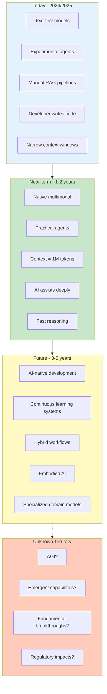
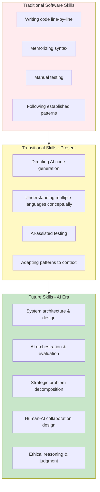
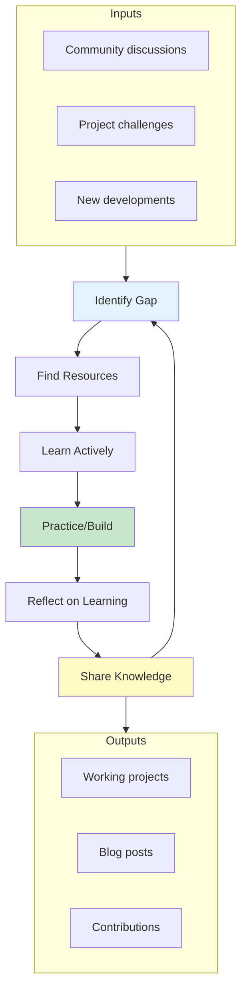
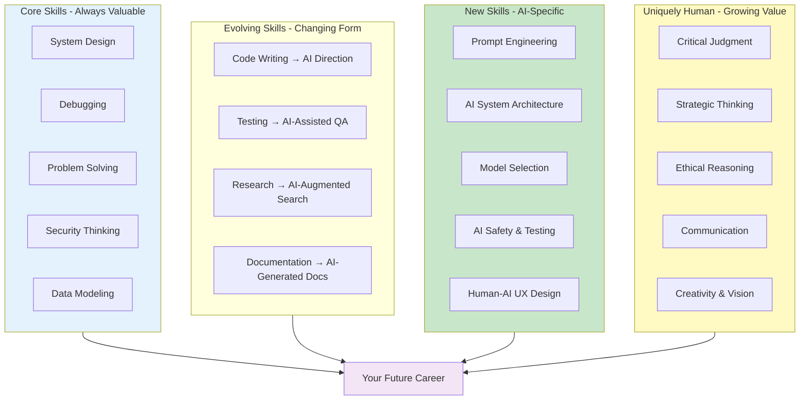
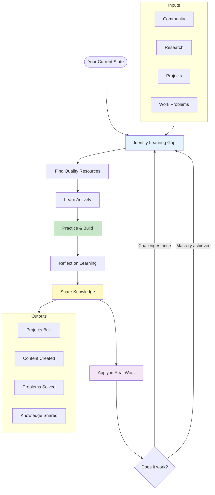

# Module 23: The Future of AI and Your Career

**Part 4: Capstone & Advanced** | **Duration**: 1 hour | **Difficulty**: Beginner-Intermediate

---

## Learning Objectives

By the end of this module, you will be able to:

- Understand emerging trends in AI development and distinguish signal from hype
- Prepare for evolving skill requirements in an AI-augmented world
- Build a sustainable learning practice to stay current without burning out
- Connect with the AI developer community for growth and contribution
- Chart your personal path forward in the AI era

---

## Section 1: Where AI is Heading (15 minutes)

### The Challenge of Prediction

Predicting the future of technology is notoriously difficult. In 1943, IBM's chairman allegedly said there was a world market for "maybe five computers." In 2007, Steve Ballmer predicted the iPhone would never gain significant market share.

AI predictions are particularly fraught because:

- **The field moves fast**: What's true today may be obsolete in six months
- **Hype distorts reality**: Marketing claims outpace actual capabilities
- **Breakthroughs are unpredictable**: Transformers weren't inevitable; they were discovered
- **Societal factors matter**: Regulation, ethics, and economics shape what gets built

So this section comes with a disclaimer: These are informed guesses, not certainties. The goal is to help you think about possibilities, not to predict the future precisely.

### Near-Term Trends (1-2 Years)

These trends are already visible and likely to accelerate:

**1. Multimodal Becomes Standard**

Current state: Most models are still primarily text-based, with multimodal capabilities bolted on.

Likely evolution: Native multimodal models that understand text, images, audio, and video equally well become the default. You won't think about "image models" vs "text models"—you'll just use models that handle whatever input you provide.

**Impact on developers**: You'll design interfaces assuming users can communicate through any modality. A user might upload a photo, ask a question about it, get a video response.

**2. Reasoning Models Mature**

Current state: Early reasoning models like o1 show promise but are slow and expensive.

Likely evolution: Reasoning capabilities become faster, cheaper, and more reliable. The gap between "quick generation" and "deep reasoning" narrows.

**Impact on developers**: You'll have better tools for complex multi-step tasks. Bugs in agentic workflows decrease as reasoning improves. But you'll still need to verify outputs.

**3. Agents Become Practical**

Current state: Agents are experimental. They work in demos but struggle in production.

Likely evolution: Agent frameworks mature. Best practices emerge. Tooling improves for debugging, monitoring, and controlling agents.

**Impact on developers**: You'll build agent-based systems routinely. The challenge shifts from "can we make this work?" to "how do we make this reliable and safe?"

**4. Context Windows Expand Further**

Current state: Models handle 200K+ tokens, enough for small codebases or books.

Likely evolution: Million-token context windows become standard. Models can reason over entire codebases, large document collections, or extensive conversation histories.

**Impact on developers**: RAG becomes less critical for many use cases. You can often just put everything in context. But you'll need new UX patterns for navigating massive contexts.

**5. Specialized Models Proliferate**

Current state: A few general-purpose models dominate (GPT, Claude, Gemini).

Likely evolution: Specialized models for specific domains (code, law, medicine, science) offer better performance and lower cost for narrow tasks.

**Impact on developers**: You'll choose models based on task requirements, potentially using multiple models in one application. Model selection becomes a key architectural decision.

### Longer-Term Possibilities (3-5 Years)

These are plausible but less certain:

**1. AI-Native Development Environments**

Instead of AI as a copilot, AI becomes the primary interface. You describe what you want at a high level; the system handles implementation details, testing, deployment.

**What this means**: Your role shifts toward architecture, product vision, and validation. Writing boilerplate code becomes rare. But understanding code remains essential for verification.

**2. Continuous Learning Systems**

Models that update continuously from new data, feedback, and corrections rather than requiring complete retraining.

**What this means**: AI systems that improve through use, learning your preferences and domain-specific knowledge. But also new challenges around drift, consistency, and control.

**3. Hybrid Human-AI Workflows**

Systems designed from the ground up for human-AI collaboration rather than AI augmenting human workflows.

**What this means**: New product categories that weren't possible before. Tasks get restructured around what the hybrid team does best.

**4. Embodied AI**

AI systems that interact with the physical world through robotics, not just digital information.

**What this means**: If you work in robotics, manufacturing, or physical systems, AI integration becomes central. Software developers might increasingly work on systems that bridge digital and physical.

### What to Expect vs. Hype

Let's be clear about what's likely hype and what's real:

**Likely Hype**:

- AGI (Artificial General Intelligence) arriving in 1-2 years
- AI fully replacing software developers
- AI systems that truly "understand" in human-like ways
- All problems becoming trivially solvable with AI
- AI reaching human-level reasoning across all domains

**Likely Real**:

- Continued incremental improvements in capabilities
- AI handling more complex tasks with less human oversight
- Significant productivity gains for developers who use AI well
- New job roles emerging around AI development and oversight
- Some job categories being substantially disrupted
- Continued limitations and failure modes requiring human judgment

### The Key Insight

The future isn't "humans OR AI." It's humans AND AI, working together on tasks neither could handle alone.

Your value as a developer won't be "things AI can't do." Your value will be:

- Understanding what problems matter
- Knowing when and how to apply AI
- Verifying and validating AI outputs
- Handling edge cases and failures
- Making ethical and strategic decisions
- Combining AI capabilities in novel ways

These are uniquely human skills. And they're getting more valuable, not less.

### The Trajectory Diagram



---

## Section 2: Skills for the AI Era (15 minutes)

### The Shifting Skill Landscape

As AI capabilities expand, the value of different skills is shifting. Understanding this shift helps you invest your learning time wisely.

### Technical Skills That Remain Valuable

These core technical skills aren't going anywhere:

**1. System Design and Architecture**

AI can generate code, but it can't decide whether you should build a monolith or microservices, SQL or NoSQL, synchronous or event-driven.

**Why it matters**: Someone needs to make high-level decisions about system structure. That's you.

**How to develop**: Study system design patterns. Build diverse projects. Learn to reason about trade-offs.

**2. Debugging and Problem Diagnosis**

When a system fails (and it will), AI can suggest possibilities, but it can't navigate your specific system's complexity, understand your business context, or make judgment calls about root causes.

**Why it matters**: Complex systems fail in complex ways. Diagnosis requires deep understanding, not just pattern matching.

**How to develop**: Debug lots of code. Learn to use debugging tools deeply. Build mental models of how systems work.

**3. Performance and Optimization**

AI can suggest optimizations, but understanding _why_ a system is slow, _what_ trade-offs optimizations involve, and _whether_ the optimization matters requires expertise.

**Why it matters**: Performance isn't just about faster code. It's about user experience, cost management, and scalability.

**How to develop**: Study algorithms and data structures. Profile real applications. Understand hardware and networking fundamentals.

**4. Security Thinking**

AI can identify common vulnerabilities, but adversarial thinking—imagining how a system could be attacked, understanding threat models, balancing security with usability—remains deeply human.

**Why it matters**: Security failures have real consequences. Someone needs to think adversarially about systems.

**How to develop**: Study security fundamentals. Think like an attacker. Participate in code reviews with security in mind.

**5. Data Modeling and Structures**

Understanding how to represent data, what schema designs make sense, how to evolve data models—these require deep domain understanding and judgment.

**Why it matters**: Poor data models cause cascading problems. Good data models make everything easier.

**How to develop**: Study database design. Work with various data paradigms (relational, document, graph, time-series). Learn domain-driven design.

### AI-Specific Skills to Develop

These skills are becoming increasingly valuable:

**1. Prompt Engineering Mastery**

Knowing how to communicate effectively with AI systems—how to structure prompts, provide context, guide reasoning, handle errors.

**Why it matters**: The difference between effective and ineffective AI use often comes down to prompt quality.

**How to develop**: Practice deliberately. Study others' effective prompts. Learn the patterns that work reliably.

**2. AI System Design**

Understanding when to use RAG vs. fine-tuning vs. agents, how to architect AI-powered systems, what failure modes to design for.

**Why it matters**: AI systems have different failure modes and design patterns than traditional software.

**How to develop**: Build diverse AI applications. Study production AI systems. Learn from failures.

**3. Model Selection and Evaluation**

Knowing which models to use for which tasks, how to evaluate performance, when specialized models beat general ones.

**Why it matters**: The AI landscape is complex. Choosing well saves time and money.

**How to develop**: Experiment with different models. Build intuition through practice. Study benchmarks critically.

**4. Human-AI Interface Design**

Designing interactions that leverage AI strengths while protecting against AI weaknesses.

**Why it matters**: Poor interfaces lead to over-reliance or under-utilization of AI capabilities.

**How to develop**: Study human-computer interaction. Build user-facing AI features. Observe how people actually use AI systems.

**5. AI Safety and Testing**

Knowing how to test AI systems, what risks to mitigate, how to make AI systems behave predictably.

**Why it matters**: AI systems fail differently than traditional software. Standard testing approaches miss AI-specific risks.

**How to develop**: Study AI safety research. Practice adversarial testing. Learn evaluation methodologies.

### Soft Skills That Matter More

As AI handles more technical execution, these human skills become more valuable:

**1. Critical Judgment**

The ability to evaluate whether an AI output is correct, whether a technical approach makes sense, whether a solution fits the problem.

**Why it matters**: AI produces plausible-sounding outputs. Someone needs to judge quality and correctness.

**How to develop**: Practice skepticism. Verify claims. Build deep expertise in your domain.

**2. Strategic Thinking**

Understanding what problems are worth solving, what solutions make business sense, what trade-offs matter.

**Why it matters**: AI can execute plans, but it can't decide what plans matter.

**How to develop**: Study business and product strategy. Think about problems from multiple perspectives. Learn to ask "why" recursively.

**3. Communication and Teaching**

Explaining technical concepts to non-technical stakeholders, helping teammates understand AI capabilities and limitations, documenting effectively.

**Why it matters**: AI knowledge isn't widely distributed. Those who can communicate effectively become multipliers.

**How to develop**: Write. Teach. Present. Practice explaining complex topics simply. Get feedback.

**4. Ethical Reasoning**

Thinking through the implications of technical decisions, considering who benefits and who might be harmed, making value-aligned choices.

**Why it matters**: AI systems encode values. Someone needs to think carefully about what values those should be.

**How to develop**: Study ethics and philosophy. Consider stakeholder impacts. Engage with diverse perspectives.

**5. Adaptability and Learning**

The ability to learn new tools, adapt to changing best practices, and update mental models as the field evolves.

**Why it matters**: AI is evolving rapidly. Specific tools and techniques have short half-lives.

**How to develop**: Embrace discomfort. Try new tools. Read widely. Maintain beginner's mind.

### The Skill Evolution Model



### Where to Invest Your Time

Given limited time, prioritize:

**High-priority investments**:

- Core CS fundamentals (they compound over time)
- Hands-on AI practice (build things)
- Communication and judgment (uniquely human)
- Domain expertise in your field (AI amplifies this)

**Medium-priority investments**:

- Specific AI tools and frameworks (useful but change frequently)
- Keeping up with AI research (helpful but can be time-consuming)
- Learning new programming languages (valuable but AI reduces the barrier)

**Low-priority investments**:

- Memorizing API documentation (AI handles this)
- Learning every new AI tool (many won't matter)
- Chasing every trend (most are hype)

### The Meta-Skill: Learning to Learn

The most valuable skill is learning how to learn effectively. As AI evolves, specific knowledge becomes dated, but learning ability remains valuable.

Effective learning in the AI era means:

- Building mental models, not memorizing facts
- Practicing deliberately, not just reading
- Seeking feedback and verification
- Learning from failures
- Teaching others (teaching solidifies understanding)
- Staying curious without drowning in information

---

## Section 3: Staying Current (15 minutes)

### The Information Overload Problem

AI research moves fast. New papers daily. New models monthly. New frameworks constantly. Twitter is a firehose of AI news, half of it hype.

You cannot keep up with everything. Trying will burn you out and make you less effective, not more.

The challenge is staying current without drowning. Here's how.

### Following Research (Without Going Crazy)

**What matters in research**:

- Fundamental breakthroughs (rare but important)
- Architectural innovations (transformers, diffusion, etc.)
- Evaluation methodologies (how we measure progress)
- Limitations and failure modes (often underreported)

**What doesn't matter as much**:

- Incremental performance improvements (most papers)
- Benchmark gaming (optimizing for metrics without real improvement)
- Hype-driven announcements (AGI every month)

**How to filter effectively**:

**1. Use Curated Sources**

Don't try to read everything. Follow curators who do the filtering:

- **Papers with Code** - Highlights significant papers
- **AI Newsletter(s)** - Pick one or two good ones (e.g., The Batch, AI Breakdown)
- **High-quality blogs** - Anthropic, OpenAI, Google Research blogs
- **Researchers you trust** - Follow a few thoughtful researchers on social media

**2. Read Selectively**

You don't need to read every paper in detail:

- Read titles and abstracts widely
- Read introductions for interesting papers
- Read full papers only for topics directly relevant to your work
- Skim most; deep-dive rarely

**3. Focus on Understanding Over Coverage**

It's better to deeply understand a few important concepts than to have surface knowledge of everything.

- Pick important papers and really work through them
- Implement key ideas to solidify understanding
- Discuss with others to test comprehension

**4. Schedule Your Learning**

Set boundaries to avoid burnout:

- Dedicate specific time (e.g., Friday afternoons, 1 hour)
- Don't check AI news constantly throughout the day
- Batch your learning rather than context-switching constantly

### Community Engagement

Learning in isolation is slower and less effective. Engaging with community accelerates growth.

**Where to engage**:

**Online Communities**:

- Reddit (r/MachineLearning, r/LocalLLaMA)
- Discord servers (Anthropic, LangChain, Hugging Face)
- Forums (Hacker News, specific platform forums)
- Twitter/X (for quick updates, but use curated lists)

**Local Communities**:

- Meetup groups in your city
- Conference attendance (when possible)
- Study groups (form your own if none exist)

**How to engage effectively**:

**1. Start by Listening**

- Observe community norms before posting
- Read the room—what questions are well-received?
- Learn from how experienced members communicate

**2. Ask Good Questions**

- Show you've done basic research first
- Be specific about what you've tried
- Provide context about your goals
- Be respectful of volunteers' time

**3. Contribute Back**

- Answer questions you can help with
- Share what you've learned
- Document solutions to problems you've solved
- Be patient with beginners (you were one recently)

**4. Build Relationships**

- Engage consistently over time
- Thank people who help you
- Offer help to others
- Find learning partners at your level

### Hands-On Practice

Reading about AI is not the same as using AI. Hands-on practice is essential.

**Types of practice**:

**1. Micro-Projects (1-4 hours)**

Small projects that explore specific concepts:

- "Can I build a basic RAG system?"
- "How do agents handle tool failures?"
- "What's the difference between prompt patterns?"

**Value**: Low commitment, high learning rate, safe to fail.

**2. Side Projects (10-40 hours)**

Substantial projects that solve real problems:

- Tools that make your own work easier
- Open source contributions
- Products for small user groups

**Value**: Deep learning, portfolio building, real-world complexity.

**3. Daily Integration (ongoing)**

Using AI tools in your regular work:

- AI-assisted coding
- Documentation with AI help
- Problem-solving with AI as a thought partner

**Value**: Builds intuition about what works, develops practical skills.

**4. Deliberate Experiments (variable time)**

Structured exploration of specific questions:

- "How do different chunking strategies affect retrieval?"
- "What prompt patterns reduce hallucinations?"
- "How much does model choice matter for this task?"

**Value**: Develops deep understanding, informs future decisions.

### Avoiding Information Overload

Signs you're overwhelmed:

- Anxiously checking for AI news constantly
- Feeling behind no matter how much you learn
- Collecting resources but never engaging deeply
- Paralysis from too many options
- Burnout and decreasing enjoyment

**Strategies to manage overload**:

**1. Accept You Can't Know Everything**

This is liberating. You don't need to know everything. You need to know enough for your goals and know where to find more when needed.

**2. Just-In-Time Learning**

Learn what you need when you need it, not everything in advance.

- Building a RAG app? Learn about RAG now, not agents.
- Focus narrows your attention and makes learning stick.

**3. Prune Ruthlessly**

Unfollow, unsubscribe, exit communities that aren't serving your goals. Your attention is precious.

**4. Batch Information Consumption**

Dedicate specific times for learning. Outside those times, focus on building and practicing.

**5. Measure Learning by Output**

What matters is what you can build, not what you've read. If you're consuming without creating, rebalance.

### The Continuous Learning Cycle



### Building a Sustainable Practice

The goal isn't to learn everything as fast as possible. The goal is to build a sustainable practice that keeps you current and effective over years.

**Sustainable learning looks like**:

- Regular but bounded time investment (e.g., 3-5 hours per week)
- Balance of consuming and creating
- Connection with community
- Periods of deep focus and shallow exploration
- Regular application to real problems
- Enjoyment and curiosity, not just obligation

**Unsustainable learning looks like**:

- Trying to read everything
- Collecting resources without engaging
- Isolation without community
- Pure consumption without creation
- Learning for its own sake without application
- Anxiety and burnout

Choose sustainability. This is a marathon, not a sprint.

---

## Section 4: Community and Contribution (10 minutes)

### Why Community Matters

Software development has always been a community endeavor. AI development is no different—and perhaps even more dependent on community.

Why?

- **The field is evolving too fast** for any individual to track alone
- **Best practices are still emerging** through collective experimentation
- **Open source is central** to AI tooling and model ecosystems
- **Ethical questions require diverse perspectives** that individuals don't have
- **Learning is social**—teaching others solidifies your own understanding

Being part of community isn't just altruistic. It's strategically valuable for your own growth.

### Open Source Contribution

Open source is the backbone of the AI ecosystem. Nearly every tool you've used in this course is open source.

**Ways to contribute (in order of commitment)**:

**1. Use and Report Issues**

The simplest contribution: use tools, report bugs, suggest improvements.

- Clear bug reports with reproduction steps help maintainers
- Thoughtful feature requests inform roadmaps
- Feedback on documentation helps new users

**2. Improve Documentation**

Documentation is often neglected. Good documentation has massive impact.

- Fix typos and unclear explanations
- Add examples for common use cases
- Write tutorials for getting started

**3. Answer Questions**

Many projects have discussion forums or Discord channels.

- Answer questions from users
- Point people to relevant documentation
- Share solutions to problems you've solved

**4. Contribute Code**

For projects you use regularly, contribute improvements:

- Start with small fixes ("good first issue" labels)
- Add features you need
- Improve test coverage
- Refactor for clarity

**Why contribute**:

- Deepens your understanding (reading code, understanding architecture)
- Builds your reputation (public contributions matter)
- Helps the ecosystem (tools you rely on improve)
- Connects you with others (collaborating builds relationships)

**How to start**:

- Pick one tool you use regularly
- Read the contribution guidelines
- Start small (documentation, small bug)
- Engage with maintainers respectfully
- Build from there

### Sharing Knowledge

Knowledge shared is knowledge multiplied.

**Ways to share**:

**1. Write Blog Posts**

Document what you learn:

- Tutorials for concepts you figured out
- Project write-ups explaining your approach
- Comparisons of different tools or techniques
- Lessons learned from failures

**Benefits**:

- Solidifies your understanding
- Helps others avoid your mistakes
- Builds your professional presence
- Creates a reference for your future self

**Where to publish**:

- Personal blog (full control)
- Dev.to, Medium, Hashnode (built-in audience)
- Company blog (if relevant to your work)

**2. Create Videos or Talks**

Some people learn better from video:

- YouTube tutorials
- Conference talks
- Meetup presentations
- Recorded workshops

**3. Contribute to Documentation**

Official documentation is hugely valuable:

- Contribute to open source project docs
- Write guides for internal tools at work
- Create cheat sheets and quick references

**4. Teach Others**

Direct teaching is powerful:

- Mentor junior developers
- Lead lunch-and-learns at work
- Host study groups
- Answer questions in forums

### Building in Public

"Building in public" means sharing your journey—both successes and failures—as you work.

**What this looks like**:

- Sharing progress on projects
- Documenting challenges you face
- Explaining decisions you make
- Showing work-in-progress, not just finished products

**Why it matters**:

- Makes you findable by others working on similar problems
- Creates accountability that helps you ship
- Builds an audience for your work
- Demonstrates your learning process

**How to do it**:

- Share updates on Twitter/X or LinkedIn
- Write build logs or weekly notes
- Stream your work on Twitch or YouTube
- Post in relevant communities

**What to share**:

- "Working on X, here's what I learned today..."
- "Built this feature, here's the approach..."
- "Stuck on Y, here's what I've tried..."
- "Shipped Z, here's what went wrong..."

### Mentoring Others

As you become more experienced, you can help those earlier in their journey.

**Why mentor**:

- Teaching is the best way to solidify understanding
- You gain perspective by seeing problems through fresh eyes
- You build relationships and networks
- You contribute to the field's health and diversity
- It's rewarding to help others grow

**How to mentor effectively**:

**1. Meet people where they are**

- Don't assume knowledge
- Remember what it was like to be a beginner
- Adjust your explanations to their level

**2. Guide, don't solve**

- Ask questions that lead to discovery
- Let them struggle productively
- Provide hints, not answers

**3. Be generous with time, but set boundaries**

- Offer specific office hours
- Be clear about what you can help with
- Point to resources for self-learning

**4. Encourage experimentation**

- Emphasize that failure is part of learning
- Celebrate effort and process, not just results
- Share your own failures and learning

### Being a Good Community Member

Communities thrive when members contribute positively.

**Good community citizenship**:

- Be respectful and assume good intent
- Thank people who help you
- Uplift others' work
- Admit when you're wrong
- Ask thoughtful questions
- Share credit generously
- Welcome newcomers
- Call out poor behavior constructively

**Poor community citizenship**:

- Being dismissive or condescending
- Self-promotion without contribution
- Demanding help without respect
- Spreading misinformation confidently
- Gatekeeping ("real developers don't...")
- Taking without giving back

### Finding Your Community

Not every community will be a good fit. Finding your community takes time.

**How to find your people**:

- Try several communities, see where you feel comfortable
- Look for communities that share your values
- Seek spaces that welcome learning and questions
- Find groups with healthy, constructive norms
- Connect with people at your level and just ahead of you

**You'll know it's right when**:

- You feel comfortable asking questions
- People engage constructively with your ideas
- You see others learning and growing
- You want to contribute, not just consume
- You feel energized, not drained

---

## Section 5: Your AI Journey (5 minutes)

### Course Wrap-Up

You began this course many modules ago, perhaps with uncertainty. Maybe you weren't sure AI was worth learning. Maybe you were skeptical, or overwhelmed by hype, or worried about what it meant for your career.

You've now traveled through:

**Part 1: Foundations**

- The mental model for understanding AI as a power tool
- Data structures, algorithms, networks, databases, and security—the foundation AI systems build on

**Part 2: AI/ML Deep Dive**

- The journey from perceptrons to transformers
- How attention mechanisms work
- Training, fine-tuning, RLHF
- Tokens, embeddings, and model internals
- Diffusion, multimodal AI, and reasoning models

**Part 3: Safe Use & Agentic Workflows**

- Responsible AI practices
- Prompt engineering mastery
- Agent architecture
- Tool use and function calling
- Multi-agent orchestration
- Frameworks and real-world integration

**Part 4: Capstone & Advanced**

- Building a complete AI application
- Evaluating AI systems
- Working with local and open models
- Looking toward the future

You are no longer an AI beginner. You understand how these systems work, when to use them, how to use them safely, and how to build with them.

### Reflection Questions

Take a moment to reflect:

**Looking Back**:

- What was your biggest surprise in this course?
- What concept that seemed confusing at first now makes sense?
- What did you build that you're most proud of?
- What challenged you most?

**Looking at Yourself**:

- How has your perspective on AI changed?
- What skills have you developed?
- What do you understand now that you didn't before?
- How have your career concerns shifted?

**Looking Forward**:

- What are you excited to build next?
- What areas do you want to explore more deeply?
- How will you apply this learning in your work?
- Who will you teach what you've learned?

### Next Steps: Your Personal AI Roadmap

Where you go from here depends on your goals. Here are common paths:

**Path 1: Deepen Technical Expertise**

If you love the technical depth and want to go deeper:

- Study AI/ML research more formally
- Implement papers from scratch
- Contribute to AI frameworks
- Build expertise in specific areas (RAG, agents, evaluation)
- Consider graduate study or specialized courses

**Path 2: Build AI Products**

If you want to build user-facing AI applications:

- Identify problems AI can solve in your domain
- Build MVPs and iterate with users
- Learn product management and UX design for AI
- Study successful AI products
- Connect with users and gather feedback

**Path 3: Integrate AI at Work**

If you want to bring AI to your current organization:

- Start with low-risk, high-value use cases
- Build internal proof-of-concepts
- Educate stakeholders on capabilities and limitations
- Develop organizational AI strategy
- Champion responsible AI practices

**Path 4: Become an AI Educator**

If you love teaching and want to help others learn:

- Create content (blog posts, videos, courses)
- Mentor developers learning AI
- Speak at conferences and meetups
- Build educational tools and resources
- Contribute to AI documentation

**Path 5: Focus on AI Safety and Ethics**

If you're concerned about responsible development:

- Study AI safety research
- Work on evaluation and red-teaming
- Develop governance frameworks
- Advocate for responsible practices
- Contribute to policy discussions

Most likely, your path combines elements of several of these. That's fine. The paths aren't mutually exclusive.

### Staying Connected

Learning doesn't end with this course. Stay connected:

**With This Community**:

- Join the course discussion forum
- Share what you build
- Help others who are learning
- Come back when you have questions

**With the Broader Community**:

- Follow researchers and practitioners
- Engage in online communities
- Attend conferences and meetups
- Contribute to open source
- Share your knowledge

**With Yourself**:

- Keep building and experimenting
- Reflect on what you learn
- Update your understanding as AI evolves
- Maintain curiosity and skepticism
- Remember why you started

---

## Diagrams

### AI Development Trajectory


### Skill Evolution for AI-Era Developers



### Continuous Learning Cycle



---

## Hands-On Exercise: Personal AI Development Plan

### Objective

Create a concrete, actionable plan for your continued learning and growth in AI development.

### Time Required

30-45 minutes

### Exercise Steps

#### Part 1: Self-Assessment (10 minutes)

Honestly assess where you are now:

**Technical Skills** (Rate 1-5):

```
Core CS Fundamentals: [ ]
AI/ML Concepts: [ ]
Prompt Engineering: [ ]
Agent Development: [ ]
Production AI Systems: [ ]
AI Safety & Evaluation: [ ]
```

**Current Comfort Level** (Rate 1-5):

```
Building with AI APIs: [ ]
Designing AI systems: [ ]
Debugging AI applications: [ ]
Evaluating AI outputs: [ ]
Explaining AI to others: [ ]
```

**Your Learning Style** (Check all that apply):

```
[ ] Learn by reading
[ ] Learn by doing
[ ] Learn by teaching
[ ] Learn through community
[ ] Learn from video content
[ ] Learn through structured courses
```

**Time Available** (Be realistic):

```
Hours per week for AI learning: _____
Preference for:
[ ] Daily small chunks (30 min)
[ ] Weekly dedicated blocks (2-4 hours)
[ ] Monthly deep dives (8+ hours)
```

#### Part 2: Goal Setting (10 minutes)

Define your goals across different time horizons:

**3-Month Goals** (Specific and achievable):

```
1. ___________________________________
2. ___________________________________
3. ___________________________________
```

**1-Year Vision** (Ambitious but realistic):

```
In one year, I want to:
- Be able to: ___________________________________
- Have built: ___________________________________
- Be known for: ___________________________________
```

**3-Year Aspiration** (Dream big):

```
In three years, I envision:
___________________________________
___________________________________
___________________________________
```

#### Part 3: Action Planning (15 minutes)

Create your personal development plan:

**Learning Priorities** (Pick top 3 for next 3 months):

```
Priority 1: ___________________________________
Why it matters: ___________________________________
Resources needed: ___________________________________
Success metric: ___________________________________

Priority 2: ___________________________________
Why it matters: ___________________________________
Resources needed: ___________________________________
Success metric: ___________________________________

Priority 3: ___________________________________
Why it matters: ___________________________________
Resources needed: ___________________________________
Success metric: ___________________________________
```

**Project Ideas** (What you'll build to practice):

```
Small Project (1-4 hours):
What: ___________________________________
Learns: ___________________________________
Deadline: ___________________________________

Medium Project (10-20 hours):
What: ___________________________________
Learns: ___________________________________
Deadline: ___________________________________

Ambitious Project (40+ hours):
What: ___________________________________
Learns: ___________________________________
Deadline: ___________________________________
```

**Community Engagement** (How you'll connect):

```
Communities to join:
1. ___________________________________
2. ___________________________________

Contribution plan:
Month 1: ___________________________________
Month 2: ___________________________________
Month 3: ___________________________________
```

**Content Creation** (How you'll share):

```
What I'll write/create:
1. ___________________________________
2. ___________________________________
3. ___________________________________

Where I'll publish:
___________________________________

Cadence:
___________________________________
```

**Weekly Routine** (Make it sustainable):

```
Monday: ___________________________________
Tuesday: ___________________________________
Wednesday: ___________________________________
Thursday: ___________________________________
Friday: ___________________________________
Weekend: ___________________________________
```

#### Part 4: Accountability (5 minutes)

Set up accountability mechanisms:

**Progress Tracking**:

```
How I'll track progress:
[ ] Weekly journal
[ ] Public updates on social media
[ ] Build logs or blog posts
[ ] Accountability partner check-ins
[ ] Other: ___________________________________
```

**Review Schedule**:

```
Weekly review: [Day] _________
Monthly review: [Date] _________
Quarterly review: [Date] _________
```

**Accountability Partner** (Optional but valuable):

```
Name: ___________________________________
How we'll check in: ___________________________________
Frequency: ___________________________________
```

**Rewards and Milestones**:

```
After completing first project: ___________________________________
After 3 months consistent learning: ___________________________________
After building something significant: ___________________________________
```

#### Part 5: Commitment (5 minutes)

Write a commitment to yourself:

```
I commit to learning and growing in AI development because:
___________________________________
___________________________________

I will invest ___ hours per week for the next ___ months.

I will focus on:
1. ___________________________________
2. ___________________________________
3. ___________________________________

I will know I'm successful when:
___________________________________
___________________________________

Signed: ___________________ Date: ___________
```

### Success Criteria

You've successfully completed this exercise if you:

- [ ] Honestly assessed your current skills and situation
- [ ] Set concrete, time-bound goals
- [ ] Identified specific learning priorities
- [ ] Planned projects to build
- [ ] Committed to community engagement
- [ ] Created a sustainable weekly routine
- [ ] Set up accountability mechanisms
- [ ] Made a personal commitment in writing

### What to Do Next

1. **Save this plan** somewhere you'll see it regularly
2. **Share it** with an accountability partner or mentor
3. **Start this week** with one small action from your plan
4. **Review regularly** and adjust as needed
5. **Celebrate progress** along the way

---

## References for Ongoing Learning

### Research and News

**Curated Sources** (Pick 1-2):

- [Papers with Code](https://paperswithcode.com/) - Research with implementations
- [The Batch](https://www.deeplearning.ai/the-batch/) - Weekly AI newsletter by Andrew Ng
- [Import AI](https://importai.substack.com/) - Jack Clark's research newsletter
- [AI Breakfast](https://aibreakfast.beehiiv.com/) - Daily AI news digest

**Research Platforms**:

- [arXiv](https://arxiv.org/list/cs.AI/recent) - AI research papers (overwhelming, be selective)
- [Hugging Face Papers](https://huggingface.co/papers) - ML papers with community discussion
- [Semantic Scholar](https://www.semanticscholar.org/) - Research search with citations

**Company Blogs** (High quality):

- [Anthropic Research](https://www.anthropic.com/research)
- [OpenAI Research](https://openai.com/research)
- [Google AI Blog](https://ai.googleblog.com/)
- [Meta AI](https://ai.meta.com/blog/)

### Community Platforms

**Discussion Forums**:

- [r/MachineLearning](https://www.reddit.com/r/MachineLearning/) - Research-focused
- [r/LocalLLaMA](https://www.reddit.com/r/LocalLLaMA/) - Open models and local running
- [Hacker News](https://news.ycombinator.com/) - Tech discussion, AI coverage
- [LessWrong](https://www.lesswrong.com/) - AI safety and alignment

**Discord Communities**:

- Anthropic Discord
- LangChain Discord
- Hugging Face Discord
- Local communities for specific frameworks

**Social Media**:

- Twitter/X AI researcher lists (curate carefully)
- LinkedIn for professional AI content
- YouTube for tutorials and explanations

### Learning Resources

**Books - Foundations**:

- "The Alignment Problem" - Brian Christian (AI safety)
- "Artificial Intelligence: A Modern Approach" - Russell & Norvig (comprehensive textbook)
- "Deep Learning" - Goodfellow, Bengio, Courville (technical ML)

**Books - Practical**:

- "Designing Machine Learning Systems" - Chip Huyen (production ML)
- "Building LLMs for Production" - Louis-François Bouchard (practical guide)
- "Hands-On Large Language Models" - Jay Alammar & Maarten Grootendorst

**Online Courses** (For deeper study):

- [Fast.ai](https://www.fast.ai/) - Practical deep learning
- [DeepLearning.AI](https://www.deeplearning.ai/) - Andrew Ng's courses
- [Hugging Face Course](https://huggingface.co/learn) - NLP and transformers
- [Stanford CS229](https://cs229.stanford.edu/) - Machine learning fundamentals

**Video Content**:

- [Two Minute Papers](https://www.youtube.com/@TwoMinutePapers) - Research summaries
- [Andrej Karpathy](https://www.youtube.com/@AndrejKarpathy) - Deep technical content
- [3Blue1Brown](https://www.youtube.com/@3blue1brown) - Math foundations with visuals

### Tools and Frameworks

**Essential Documentation**:

- [LangChain Docs](https://python.langchain.com/)
- [LlamaIndex Docs](https://docs.llamaindex.ai/)
- [Anthropic API Docs](https://docs.anthropic.com/)
- [OpenAI API Docs](https://platform.openai.com/docs)

**Model Platforms**:

- [Hugging Face](https://huggingface.co/) - Model hub
- [Replicate](https://replicate.com/) - Run models via API
- [Together AI](https://www.together.ai/) - Open model inference

**Vector Databases**:

- [Chroma](https://docs.trychroma.com/)
- [Pinecone](https://docs.pinecone.io/)
- [Weaviate](https://weaviate.io/developers/weaviate)
- [Qdrant](https://qdrant.tech/documentation/)

### Building in Public

**Where to Share**:

- [Dev.to](https://dev.to/) - Developer community
- [Hashnode](https://hashnode.com/) - Blogging platform
- [Medium](https://medium.com/) - General audience
- Personal blog (full control)

**Project Showcasing**:

- [GitHub](https://github.com/) - Code repository
- [Product Hunt](https://www.producthunt.com/) - Product launches
- [Show HN](https://news.ycombinator.com/showhn.html) - Hacker News
- LinkedIn posts - Professional network

### Career Development

**Job Boards** (AI-specific):

- [ai-jobs.net](https://ai-jobs.net/)
- [Remote AI Jobs](https://www.remoteaijobs.com/)
- LinkedIn AI-tagged jobs
- Company career pages directly

**Networking**:

- Local AI/ML meetups
- Conference attendance (NeurIPS, ICLR, etc.)
- Online community connections
- Open source collaboration

**Portfolio Building**:

- GitHub projects (well-documented)
- Technical blog posts
- Conference talks or presentations
- Open source contributions
- Kaggle competitions (for ML focus)

---

## Summary: Your Journey Continues

You've reached the end of this course, but this is not an ending—it's a beginning.

### What You've Accomplished

Over these 23 modules, you've:

**Built Understanding**: You understand how AI actually works—not marketing hype, not surface-level explanations, but real technical understanding of transformers, attention, embeddings, training, and reasoning.

**Developed Skills**: You can prompt effectively, build agents, design AI systems, evaluate outputs, and deploy responsibly. You've built real projects, not just followed tutorials.

**Gained Judgment**: You know when to use AI and when not to. You recognize capabilities and limitations. You can evaluate claims critically.

**Connected Concepts**: You see how CS fundamentals connect to AI systems. You understand the full stack from tokens to applications.

**Joined a Community**: You're part of a growing community of developers learning to build with AI responsibly and effectively.

This is significant. You're no longer an outsider wondering what AI is about. You're a practitioner who can build, evaluate, and reason about AI systems.

### What This Means for Your Career

The AI era doesn't mean human developers become obsolete. It means effective developers become more valuable.

You are now equipped to be one of those effective developers.

**You can**:

- Build AI-powered applications that solve real problems
- Integrate AI into existing systems thoughtfully
- Evaluate AI tools and make informed technical decisions
- Lead AI adoption in your organization
- Teach others and advocate for responsible practices
- Continue learning as the field evolves

The developers who thrive in the AI era will be those who:

- Understand these tools deeply
- Apply them judiciously
- Verify outputs critically
- Design systems thoughtfully
- Build responsibly

You've developed these capabilities.

### The Path Forward

AI will continue evolving. Models will improve. New capabilities will emerge. Some of what you learned will become outdated.

But the fundamentals—understanding how these systems work, knowing when and how to apply them, maintaining critical judgment, building responsibly—these will remain relevant.

**Keep building**. Every project teaches you something new. Every failure is a lesson. Every success builds confidence.

**Keep learning**. Stay curious. Follow your interests. Dive deep into topics that fascinate you. Don't try to learn everything—focus on what matters for your goals.

**Keep questioning**. Maintain healthy skepticism. Verify claims. Test assumptions. Think critically about capabilities, limitations, and implications.

**Keep connecting**. Learn with others. Share what you know. Contribute to the community. Teach and be taught.

**Keep perspective**. AI is a tool—powerful, but still a tool. The problems that matter, the solutions worth building, the decisions about what to create and how to deploy it—these remain human concerns.

### The Future is Being Built

The future of AI isn't predetermined. It's being built right now, by people like you who choose to engage thoughtfully, build responsibly, and contribute to the community.

You can shape that future.

Maybe you'll build products that help people work more effectively. Maybe you'll contribute to open source tools that democratize AI. Maybe you'll teach others and help them develop AI literacy. Maybe you'll work on safety and ensure AI systems behave responsibly.

Whatever path you choose, you're equipped to contribute meaningfully.

### A Final Thought

Technology shifts are simultaneously threatening and empowering. They disrupt what's comfortable while creating new possibilities.

AI is no different.

It will change how you work. Some tasks you do today will be automated. But new tasks—more interesting tasks—will emerge. Problems that were impossible to solve will become tractable. Products that couldn't exist will become possible.

The question isn't whether AI will change software development. It will.

The question is whether you'll be part of shaping that change or watching it happen.

You've chosen to be part of it. You've invested the time to understand deeply, practice deliberately, and build thoughtfully.

That choice matters.

### Now Go Build the Future

You have the knowledge. You have the skills. You have the community.

The only thing left is to start building.

What will you create?

What problems will you solve?

How will you contribute?

The journey continues. And it starts with your next project, your next experiment, your next line of code.

**Thank you for taking this journey. Now go build something great.**

---

_This concludes Module 23 and the Developer of Tomorrow course._

_Your learning doesn't end here—it transforms into doing._

_Welcome to the AI era. You're ready._

---

## What's Next

This is the final module of the Developer of Tomorrow course. Congratulations on completing the journey!

**Your next steps**:

1. **Review your Personal AI Development Plan** from the hands-on exercise
2. **Choose one small project** to start this week
3. **Connect with the community** through forums, Discord, or local meetups
4. **Share what you've learned** through blog posts, talks, or mentoring
5. **Keep building and experimenting** with AI in your work and projects

**If you haven't yet**:

- Complete **Module 20: Capstone Project** to synthesize your learning
- Explore **Module 21: Advanced - Evaluating AI Systems** for evaluation methodology
- Review **Module 22: Advanced - Local and Open Models** for open-source alternatives

**For support and community**:

- Join the course discussion forum
- Connect on LinkedIn or Twitter/X
- Contribute to open source AI projects
- Attend local AI/ML meetups

**Remember**:

- You don't need to know everything to be valuable
- Building is more important than consuming
- Community accelerates learning
- The best time to start is now

Thank you for your commitment to learning. The field of AI development is richer because you're part of it.

**Keep building. Keep learning. Keep questioning.**

**The future is yours to create.**
