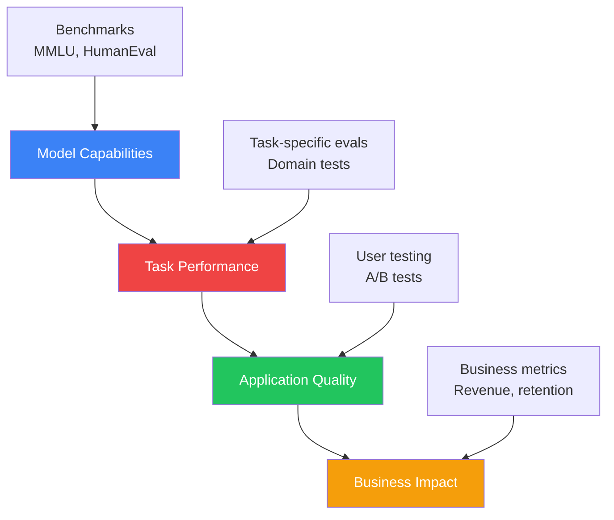
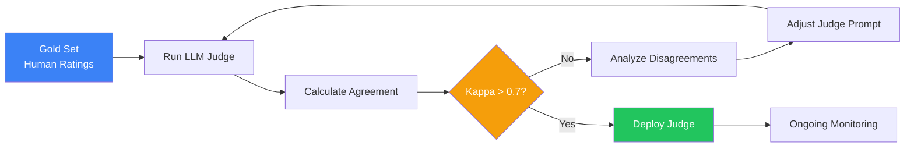
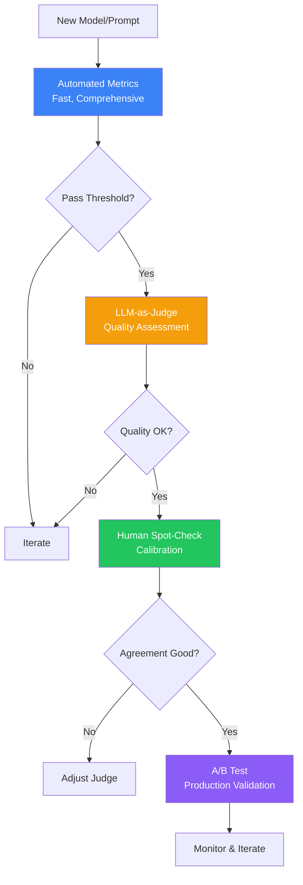

import Tip from "@components/mdx/Tip.astro";
import Warning from "@components/mdx/Warning.astro";
import Info from "@components/mdx/Info.astro";
import Definition from "@components/mdx/Definition.astro";
import Quiz from "@components/react/Quiz";
import HandsOnExercise from "@components/react/HandsOnExercise";

You have built an AI application. It seems to work. But how do you know if it is actually good? How do you know if version 2 is better than version 1? How do you catch regressions before your users do?

Evaluation is the foundation of reliable AI development. Without rigorous evaluation, you are flying blind. You might ship improvements that are actually regressions. You might optimize for the wrong metrics. You might miss critical failure modes until they cause real harm.

This module tackles one of the hardest problems in AI engineering: measuring performance of systems that produce open-ended, nuanced outputs. Unlike traditional software where tests pass or fail deterministically, AI systems require probabilistic evaluation, human judgment proxies, and careful consideration of what "good" actually means.

## The Evaluation Challenge

<Definition term="AI Evaluation">
  The systematic process of measuring how well an AI system performs on its
  intended tasks. Unlike traditional software testing with deterministic
  pass/fail outcomes, AI evaluation must handle open-ended outputs, subjective
  quality judgments, and probabilistic behavior.
</Definition>

Traditional software testing is straightforward. Given inputs, you check outputs against expected values. Tests pass or fail. You can achieve 100% coverage and prove correctness.

AI evaluation is fundamentally different. Open-ended outputs mean that when you ask an AI to write a helpful response about Python, there is no single correct answer. A million different responses could all be good.

Subjective quality makes evaluation challenging because helpful, clear, and accurate are human judgments. What one person finds helpful, another might find verbose or insufficient.

Context dependence means the same response might be excellent for a beginner and terrible for an expert. Evaluation must consider the intended use case.

Emergent behaviors appear as capabilities and failures that were not explicitly trained. Evaluation must probe for unexpected behaviors.

Distribution shift occurs when models trained on certain data fail on slightly different real-world inputs. Static test sets miss this.

### What Are We Actually Measuring?

Before evaluating, you must define what you are measuring. Common dimensions include accuracy and correctness examining whether the output contains factual errors and whether code compiles and produces correct results. Helpfulness assesses whether the response actually addresses the user's need and is actionable. Coherence examines whether the output is logically consistent and does not contradict itself. Relevance checks whether the response stays on topic and avoids unnecessary information. Safety evaluates whether the output avoids harmful content and refuses inappropriate requests appropriately. Efficiency measures how long responses take and how many tokens they consume. Consistency examines whether similar inputs produce similar outputs and whether behavior is predictable.

Each application weights these differently. A coding assistant prioritizes correctness. A creative writing tool prioritizes coherence and style. A customer service bot prioritizes helpfulness and safety.



Model capabilities tell you what a model can do in general, measured by benchmarks. Task performance tells you how well a model handles your specific use case, measured by custom evaluations. Application quality tells you how well your entire system works including prompts, retrieval, and post-processing, measured by user testing. Business impact tells you whether better AI actually improves outcomes, measured by business metrics.

Improving one level does not guarantee improvement at higher levels. A better benchmark score does not mean better user satisfaction. You must evaluate at every level that matters.

### The Cost of Poor Evaluation

Without proper evaluation, teams make expensive mistakes. False confidence emerges from believing that something working on personal examples means it works in production. Anecdotal testing misses systematic failures.

Wrong optimizations occur when you improve benchmark scores while degrading real-world performance. Goodhart's Law states that when a measure becomes a target, it ceases to be a good measure.

Missed regressions happen when model updates, prompt changes, or system modifications break things you do not notice until users complain.

Wasted resources result from fine-tuning for weeks to achieve improvements that do not matter, or shipping features users do not actually want.

<Warning>
  Rigorous evaluation is an investment that pays dividends in reliability,
  confidence, and faster iteration. The cost of thorough evaluation is always
  less than the cost of shipping broken systems.
</Warning>

## Benchmark Landscape

Benchmarks are standardized tests that allow comparison across models. They provide comparability with the same test for different models enabling apples-to-apples comparison, reproducibility allowing anyone to verify published results, progress tracking by running the same benchmark over time to show improvement, and capability probing through well-designed benchmarks that reveal specific capabilities or limitations.

### Major Benchmarks

MMLU (Massive Multitask Language Understanding) tests broad knowledge across 57 subjects from STEM to humanities using multiple choice questions. An example question asks which river is the longest in Africa with options Nile, Congo, Niger, or Zambezi. It measures factual knowledge and reasoning across domains. On the original MMLU, top models had reached the high 80s–low 90s by 2024 (saturation on this particular benchmark led to harder variants).

HumanEval tests code generation capability with Python programming problems. The format provides a function signature plus docstring, and the model completes the implementation. It measures code generation and algorithmic reasoning using pass@k, the percentage of problems solved with k attempts.

HELM (Holistic Evaluation of Language Models) is a comprehensive evaluation framework from Stanford covering core scenarios like question answering, summarization, and reasoning, targeted evaluations for bias, toxicity, and copyright, multiple metrics per task, and standardized infrastructure for fair comparison.

GSM8K tests mathematical reasoning with grade-school math word problems in natural language format like calculating how many apples Janet has after buying and giving some away.

TruthfulQA tests the tendency to generate truthful versus plausible-sounding falsehoods using questions designed to elicit common misconceptions.

### Benchmark Saturation

A critical problem is that benchmarks get saturated. When models approach ceiling performance, the benchmark stops being useful for differentiation.

MMLU progression (as of ~2024): GPT-3 at 43% in 2020, GPT-4 at ~86% in 2022, Claude 3 at ~86% in 2023, and multiple models at 88-90% in 2024 on the original version. As models cluster near the ceiling on older benchmarks, tiny score differences do not reflect meaningful capability differences. The benchmark loses discriminative power, which is why harder successors were created.

Signs of saturation include top models within a few percentage points, improvements requiring memorization rather than generalization, and new capabilities not captured by old benchmarks.

The response to saturation is creating harder benchmarks. MMLU-Pro extends MMLU with more difficult questions. SWE-bench tests real software engineering tasks. Benchmarks continuously evolve.

### Benchmark Limitations

Benchmarks have fundamental limitations you must understand.

Teaching to the test occurs when models or their training data specifically include benchmark examples. High scores might reflect memorization rather than capability.

Narrow coverage means any finite benchmark covers only a tiny slice of possible tasks. Good benchmark scores do not guarantee performance on your specific use case.

Format artifacts emerge when multiple-choice formats let models exploit statistical patterns without understanding. A model might score well by pattern matching rather than reasoning.

Static nature means benchmarks are frozen in time. They cannot adapt to evolving capabilities or new failure modes.

Proxy problems arise because benchmarks measure proxies for what we care about. High reasoning scores do not guarantee helpful, safe, or honest behavior.

<Tip>
  Use benchmarks for initial model selection and capability screening. Compare
  benchmark performance on tasks related to your use case. But never assume
  benchmark scores predict production performance or skip application-specific
  evaluation because benchmarks look good. Benchmark results are a starting
  point, not a conclusion.
</Tip>

## LLM-as-Judge

Human evaluation is accurate but expensive and slow. Automated metrics like BLEU and ROUGE are fast but poorly correlated with quality for open-ended tasks.

LLM-as-judge offers a middle ground: use capable language models to evaluate other models' outputs. This provides scalability of automated evaluation, nuance approaching human judgment, consistency across many evaluations, and rapid feedback during development.

### Basic LLM-as-Judge Pattern

The simplest approach prompts a capable model to rate outputs on scales for helpfulness, accuracy, and clarity with brief justifications for each rating. This works surprisingly well for many use cases as the judge model applies its understanding of quality to rate outputs.

### Pairwise Comparison

Often more reliable than absolute ratings is comparing two outputs and picking the better one. Pairwise comparison has advantages including easier judgment through relative versus absolute comparison, more consistency across evaluators, direct applicability to A/B testing, and avoiding scale calibration issues.



### Calibration Challenges

LLM judges have systematic biases you must address.

Position bias causes models to prefer responses in certain positions, often first. Mitigation involves randomizing order, evaluating in both orders, and averaging results.

Length bias causes models to often prefer longer responses regardless of quality. Mitigation includes length-neutral instructions and penalizing verbosity.

Self-preference bias causes models to prefer outputs from the same model family. Mitigation uses a different model for judging than for generation.

Sycophancy causes models to rate user-agreeing responses higher. Mitigation involves blind evaluation without user context.

Format preference causes models to prefer certain formatting like lists and markdown. Mitigation normalizes formatting or instructs to ignore format.

### Calibrating Your Judge

To use LLM-as-judge reliably, calibrate against human judgments. Create a gold set with human ratings on approximately 100 examples. Run your LLM judge on the same examples. Measure agreement using Cohen's kappa and correlation. Adjust prompts and compare agreement improvement. Monitor ongoing agreement on spot-checked examples.

Target agreement of 0.7+ kappa with human raters. Lower agreement means your judge is not reliable enough.

### Multi-Aspect Evaluation

Complex outputs need multi-dimensional evaluation. Structure your judge to assess specific aspects with clear criteria. For customer service responses, evaluate accuracy checking product details, policies, and procedures. Evaluate completeness checking all parts of the question answered. Evaluate tone checking professional, empathetic, not robotic style. Evaluate actionability checking clear next steps and specific instructions.

### Chain-of-Thought Judging

Improve judge reliability by requesting reasoning. Have the judge first identify key claims in the response, then assess accuracy of each claim, consider whether the response fully addresses the question, assess clarity and organization, and finally provide ratings based on the analysis. Explicit reasoning reduces arbitrary ratings and provides explainable evaluations.

<Info>
  LLM judges can be fooled. Test for length bias with short correct versus long
  incorrect responses where the judge should prefer short correct. Test for
  position bias by swapping positions and expecting the same winner. Test for
  format gaming with same content in different formatting expecting similar
  ratings.
</Info>

## Custom Evaluation

Benchmarks measure general capabilities. LLM-as-judge measures general quality. But your application has specific requirements that general approaches miss.

Custom evaluation lets you test exact scenarios your users encounter, measure domain-specific quality criteria, catch failure modes specific to your application, and create regression tests for known issues.

### Domain-Specific Metrics

Define metrics that capture what matters for your domain.

For medical Q&A, check whether responses mention seeing a doctor, avoid specific diagnoses, cite sources, address mentioned symptoms, and match severity level appropriately.

For code generation, check whether code compiles, passes test suites, follows style guides, has error handling, includes documentation, and meets complexity requirements.

For customer service, check whether responses address the main issue, have appropriate tone through sentiment analysis, include resolutions with actionable steps, show empathy markers, and make correct escalation decisions.

### Building Evaluation Datasets

Your evaluation is only as good as your test data. Build comprehensive datasets with coverage matrices across categories and difficulty levels.

Data sources include production logs that are anonymized, user feedback cases, manually crafted edge cases, adversarial examples, and domain expert contributions.

The annotation process should define clear labeling guidelines, have multiple annotators label each example, measure inter-annotator agreement, resolve disagreements through discussion, and document edge cases and decisions.

### Human Evaluation

For nuanced quality, nothing beats human judgment. Structure human evaluation with clear interfaces showing question and response clearly, providing specific rating criteria with examples, allowing free-text feedback, randomizing presentation order, and including attention checks.

Select raters appropriately: domain experts for accuracy, target users for usefulness, and trained annotators for consistency.

Consider statistical factors including minimum 3 raters per example for reliability, reporting inter-rater agreement with Krippendorff's alpha, using enough examples for statistical significance, and accounting for rater fatigue by limiting session length.

### A/B Testing in Production

The ultimate evaluation asks whether users actually prefer your changes. Setup involves defining success metrics like engagement, satisfaction, and task completion, randomly assigning users to control or treatment, running until statistically significant, and analyzing results across segments.

Key considerations include sample size planning through power analysis, novelty effects where users react to change rather than quality, segment analysis since changes might help some users while hurting others, and long-term effects since initial reactions may not persist.

### Combining Evaluation Methods

No single method is sufficient. Combine approaches in layers.

Layer 1 with automated metrics provides fast filtering of clearly bad outputs.

Layer 2 with LLM-as-judge provides scalable quality assessment.

Layer 3 with human evaluation provides calibration and spot-checking.

Layer 4 with A/B testing provides production validation.



## Evaluation Pipelines

Manual evaluation does not scale. Build automated pipelines that run on every change.

Pipeline components flow from code change to running evaluation suite to comparing to baseline to generating report to gating deployment if regression detected.

### Continuous Evaluation

Integrate evaluation into your CI/CD pipeline.

On every PR, run fast automated metrics, run LLM-as-judge on a sample, and block merge if regression detected.

Nightly, run the full evaluation suite, compare to historical baselines, and generate trend reports.

Weekly, perform human evaluation of a sample, calibrate LLM judge against humans, and review edge cases and failures.

### Regression Detection

Detect degradation before users notice using statistical methods. Paired t-tests determine if current performance is significantly worse than baseline. Threshold-based detection checks if any metric falls below acceptable levels.

```python
def detect_regression(current_scores, baseline_scores, alpha=0.05):
    """
    Use paired t-test to detect significant regression.
    """
    from scipy import stats

    t_stat, p_value = stats.ttest_rel(current_scores, baseline_scores)

    # One-sided test: is current significantly worse?
    regression = t_stat < 0 and p_value / 2 < alpha

    return {
        "regression_detected": regression,
        "t_statistic": t_stat,
        "p_value": p_value,
        "current_mean": np.mean(current_scores),
        "baseline_mean": np.mean(baseline_scores)
    }
```

### Alerting and Monitoring

Production evaluation requires ongoing monitoring.

Key metrics to track include response quality scores from LLM judge, error rates for malformed outputs and refusals, latency distribution, user satisfaction signals if available, and drift indicators for distribution of inputs and outputs changing.

Alert conditions should trigger on quality degradation below thresholds over time windows, error rate spikes, and latency increases.

### Versioning and Reproducibility

Evaluation must be reproducible. Track dataset version with name, version date, and hash. Track judge model and prompt version with temperature settings. Track metric definitions with weights. Track threshold configurations. Track historical baselines.

<Quiz
  client:visible
  quizId="module-21-knowledge-check"
  moduleSlug="advanced-evaluating-ai"
  questions={[
    {
      id: "q1",
      type: "multiple-choice",
      question: "Why is benchmark saturation a problem for AI evaluation?",
      options: [
        {
          id: "a",
          text: "It means models have achieved human-level performance",
        },
        {
          id: "b",
          text: "It makes it difficult to differentiate between model capabilities",
        },
        { id: "c", text: "It indicates the benchmark was poorly designed" },
        { id: "d", text: "It shows the models have memorized the benchmark" },
      ],
      correctAnswer: "b",
      explanation:
        "When benchmarks become saturated with many models scoring near the ceiling, small score differences don't reflect meaningful capability differences. A model scoring 88% vs 89% on a saturated benchmark doesn't tell you which is actually better for your use case. This is why the community continuously develops harder benchmarks as capabilities improve.",
    },
    {
      id: "q2",
      type: "multiple-choice",
      question: "What is position bias in LLM-as-judge evaluation?",
      options: [
        { id: "a", text: "The tendency to rate longer responses higher" },
        {
          id: "b",
          text: "The tendency to prefer responses in certain positions (e.g., always first)",
        },
        {
          id: "c",
          text: "The tendency to prefer responses from the same model family",
        },
        {
          id: "d",
          text: "The tendency to give higher ratings to confident-sounding responses",
        },
      ],
      correctAnswer: "b",
      explanation:
        "Position bias occurs when judge models systematically prefer responses based on their position in the prompt, often favoring the first option. This can be mitigated by randomizing presentation order and evaluating pairs in both orders, then averaging or requiring agreement.",
    },
    {
      id: "q3",
      type: "multiple-choice",
      question: "When should you use human evaluation instead of LLM-as-judge?",
      options: [
        { id: "a", text: "Always, because humans are more accurate" },
        { id: "b", text: "Never, because it's too expensive" },
        {
          id: "c",
          text: "For calibrating your LLM judge and evaluating edge cases",
        },
        { id: "d", text: "Only for creative writing tasks" },
      ],
      correctAnswer: "c",
      explanation:
        "Human evaluation is the gold standard but doesn't scale. The best approach is to use humans strategically: to create gold sets for calibrating LLM judges, to evaluate edge cases where judge accuracy is uncertain, and to periodically spot-check that your automated evaluation remains accurate. This combines human quality with automated scale.",
    },
    {
      id: "q4",
      type: "multiple-choice",
      question:
        "What is the primary purpose of regression detection in evaluation pipelines?",
      options: [
        { id: "a", text: "To improve model performance" },
        { id: "b", text: "To catch degradation before it reaches users" },
        { id: "c", text: "To reduce evaluation costs" },
        { id: "d", text: "To replace human evaluation" },
      ],
      correctAnswer: "b",
      explanation:
        "Regression detection identifies when changes to models, prompts, or systems cause quality to decrease. By detecting regressions before deployment, you can prevent degraded experiences from reaching users. This requires comparing current performance to established baselines using statistical tests and quality thresholds.",
    },
    {
      id: "q5",
      type: "multiple-choice",
      question:
        "What target agreement level (Cohen's kappa) should you aim for when calibrating an LLM judge against human ratings?",
      options: [
        { id: "a", text: "0.3+ (fair agreement)" },
        { id: "b", text: "0.5+ (moderate agreement)" },
        { id: "c", text: "0.7+ (substantial agreement)" },
        { id: "d", text: "0.9+ (near perfect agreement)" },
      ],
      correctAnswer: "c",
      explanation:
        "Target agreement of 0.7+ kappa with human raters represents substantial agreement and indicates your LLM judge is reliable enough for production use. Lower agreement means the judge is not capturing human quality judgments well enough. However, requiring 0.9+ is often unrealistic since even human raters rarely achieve this level of agreement.",
    },
  ]}
  passingScore={70}
  allowRetry={true}
/>

<HandsOnExercise
  client:visible
  moduleSlug="advanced-evaluating-ai"
  exerciseId="build-evaluation-pipeline"
  title="Build an Evaluation Pipeline"
  objective="Design and implement a complete evaluation pipeline for an AI documentation assistant that answers questions about APIs and programming concepts."
  totalTime="90-120 minutes"
  setupInstructions={[
    "Choose an AI documentation domain to evaluate (e.g., Python API docs, REST API documentation, or framework documentation)",
    "Set up a development environment with Python and access to an LLM API (OpenAI or Anthropic)",
    "Create a project structure with folders for test cases, evaluation scripts, and results",
  ]}
  parts={[
    {
      id: "design-test-cases",
      title: "Design Test Cases",
      duration: "20 min",
      instructions: [
        "Design 20 evaluation examples covering different difficulty levels (easy, medium, hard)",
        "Include diverse question types: how-to, conceptual, debugging, and edge cases",
        "Structure each example with: id, category, difficulty, question, reference answer, and evaluation criteria",
        "Ensure coverage across common scenarios and potential failure modes",
      ],
      observePrompt:
        "What patterns emerge in the types of questions that are hardest to evaluate? Which categories need the most careful criteria?",
    },
    {
      id: "build-llm-judge",
      title: "Create LLM-as-Judge System",
      duration: "30 min",
      instructions: [
        "Write a multi-aspect LLM judge prompt that evaluates: technical accuracy, completeness, code quality (if applicable), clarity, and appropriate uncertainty",
        "Use 1-5 scales for each dimension with clear rubrics",
        "Include instructions for the judge to explain its ratings",
        "Test the judge on 3-5 examples to verify it produces sensible ratings",
      ],
      observePrompt:
        "Does your judge show any biases (length bias, format preference)? How consistent are ratings across similar inputs?",
    },
    {
      id: "calibration-plan",
      title: "Design Calibration Strategy",
      duration: "20 min",
      instructions: [
        "Define a calibration plan: how will you create a gold set with human ratings?",
        "Specify agreement measurement metrics (Cohen's kappa, correlation)",
        "Design an iteration process for improving judge-human agreement",
        "Set a target agreement threshold (e.g., kappa > 0.7)",
      ],
      observePrompt:
        "What disagreements between human and LLM judges would be most concerning? How would you adjust the prompt based on disagreements?",
    },
    {
      id: "regression-detection",
      title: "Implement Quality Gates",
      duration: "30 min",
      instructions: [
        "Define quality thresholds for each evaluation dimension and overall scores",
        "Implement regression detection logic using statistical significance tests (paired t-test)",
        "Add absolute threshold checks (e.g., accuracy must stay above 4.0)",
        "Consider category-specific regressions (e.g., edge cases getting worse)",
      ],
      observePrompt:
        "How sensitive should your regression detection be? What's worse: false positives blocking good changes or false negatives shipping regressions?",
    },
    {
      id: "pipeline-design",
      title: "Design Complete Pipeline",
      duration: "30 min",
      instructions: [
        "Design pipeline configuration with triggers: on PR (fast), nightly (full), on-demand",
        "Define stages: fast check (5 min, critical examples), full evaluation (20 min, all examples), human review (as needed)",
        "Specify alerting conditions for quality drops, error rate spikes, or cost overruns",
        "Define deployment gates: what quality scores must pass to allow deployment?",
      ],
      observePrompt:
        "How do you balance thoroughness vs. speed? What would make developers trust and use this pipeline versus ignore it?",
    },
  ]}
  successCriteria={[
    {
      id: "test-coverage",
      text: "Created 20 diverse test cases covering multiple difficulty levels and question types",
    },
    {
      id: "judge-implementation",
      text: "Built a multi-aspect LLM judge with clear evaluation criteria and rubrics",
    },
    {
      id: "calibration-plan",
      text: "Defined a concrete calibration plan with metrics and target thresholds",
    },
    {
      id: "regression-detection",
      text: "Implemented regression detection using both statistical tests and absolute thresholds",
    },
    {
      id: "pipeline-config",
      text: "Designed a complete pipeline with triggers, stages, and gates appropriate for real-world use",
    },
    {
      id: "cost-awareness",
      text: "Estimated costs and identified strategies to control expenses",
    },
  ]}
/>

## Summary

Evaluation is the foundation of reliable AI development. Without rigorous evaluation, you are flying blind, potentially shipping regressions and optimizing for wrong metrics.

The evaluation challenge is fundamentally harder than testing traditional software. Open-ended outputs, subjective quality, and context dependence require multi-faceted approaches. The cost of poor evaluation includes false confidence, wrong optimizations, and missed regressions.

Benchmarks like MMLU, HumanEval, and HELM provide standardized capability measurement. However, they have significant limitations including saturation, narrow coverage, format artifacts, and proxy problems. Use benchmarks for initial screening, not as proof of production readiness.

LLM-as-judge enables language models to evaluate other models' outputs with near-human reliability when properly calibrated. Key techniques include pairwise comparison, multi-aspect evaluation, and chain-of-thought judging. Mitigate biases through careful prompt design and calibration against human judgments targeting 0.7+ kappa agreement.

Custom evaluation addresses your domain and use case specifically. Define domain-specific metrics, create comprehensive test datasets, implement structured human evaluation, and validate with A/B testing. Combine methods in layers from automated metrics through LLM-as-judge through human evaluation through production testing.

Evaluation pipelines automate quality assurance through continuous integration. Build pipelines that run on every change, detect regressions statistically, and gate deployments. Monitor production quality and maintain calibration over time. Version everything for reproducibility.

The key insight is that evaluation is not a one-time checkpoint but an ongoing practice. Build evaluation into your development workflow from the start. The investment in rigorous evaluation pays dividends in reliability, confidence, and faster iteration.

## References

**Academic Papers**

"MMLU: Measuring Massive Multitask Language Understanding" by Hendrycks et al. (2021) is the foundational paper for multi-domain knowledge evaluation.

"Evaluating Large Language Models Trained on Code (HumanEval)" by Chen et al. (2021) introduces the HumanEval benchmark for code generation.

"HELM: Holistic Evaluation of Language Models" by Liang et al. (2022) provides a comprehensive evaluation framework from Stanford.

"Judging LLM-as-a-Judge with MT-Bench and Chatbot Arena" by Zheng et al. (2023) analyzes LLM judge reliability and biases.

"Large Language Models are not Fair Evaluators" by Wang et al. (2023) documents position bias and other issues in LLM judges.

**Official Documentation**

OpenAI Evals Framework at github.com/openai/evals provides an open-source framework for evaluating LLMs.

Hugging Face Evaluate Library at huggingface.co/docs/evaluate offers a comprehensive library for ML evaluation metrics.

**Practical Resources**

LangSmith Evaluation Guide at docs.smith.langchain.com provides practical guidance on evaluating LLM applications.

"The LLM Evaluation Handbook" by Eugene Yan at eugeneyan.com offers practical insights from ML engineering experience.

**Benchmark Leaderboards**

Open LLM Leaderboard on Hugging Face tracks community benchmarks for open models.

Chatbot Arena Leaderboard provides human preference rankings from pairwise comparisons.

SWE-bench at swe-bench.github.io offers real-world software engineering benchmarks.
