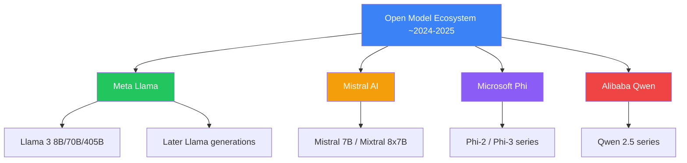
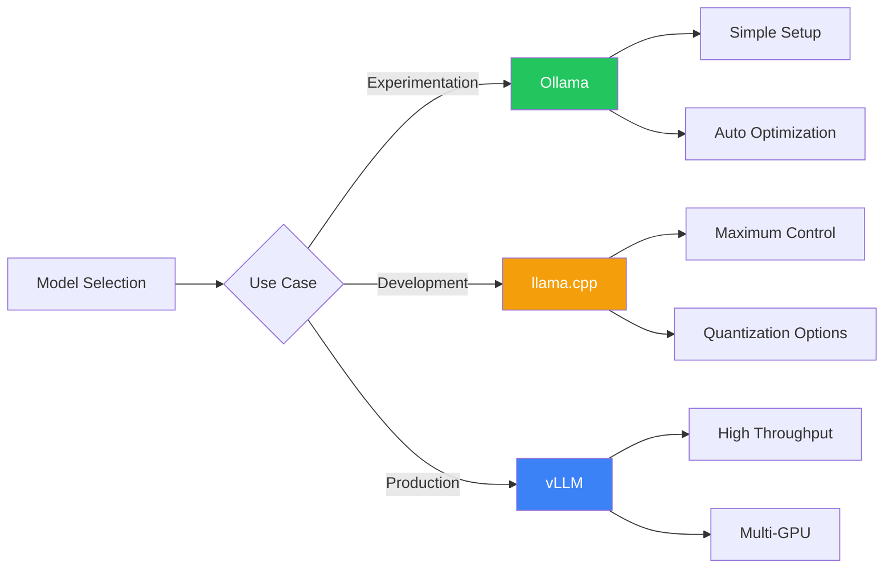
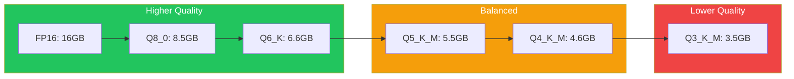

import Tip from "@components/mdx/Tip.astro";
import Warning from "@components/mdx/Warning.astro";
import Info from "@components/mdx/Info.astro";
import Definition from "@components/mdx/Definition.astro";
import Quiz from "@components/react/Quiz";
import HandsOnExercise from "@components/react/HandsOnExercise";

Throughout this course, you have primarily worked with API-based models: Claude, GPT-4, commercial offerings that you access over the internet. These models are powerful, convenient, and continuously improving. But they are not the only option.

The open model ecosystem has exploded. Models like Llama, Mistral, and Phi offer capabilities that were cutting-edge just months ago, and they can run on your hardware. You can download them, modify them, run them completely offline, and never send a single token to a third-party server.

This shift is fundamental. For the first time, serious AI capabilities are available as software you control rather than services you subscribe to. This opens new possibilities including perfect privacy, zero runtime costs, complete customization, and offline operation. It also introduces new challenges including hardware requirements, performance optimization, maintenance burden, and expertise requirements.

## The Open Model Landscape

<Definition term="Open Weights">
  A model release where the trained parameters (weights) are publicly
  downloadable, allowing inference and fine-tuning, but where training code,
  training data, and full methodology may not be disclosed. Most "open" models
  like Llama and Mistral are technically open weights rather than fully open
  source.
</Definition>

For years, the most capable language models were proprietary and API-only. GPT-3, then GPT-4, set the standard but you could only access them through OpenAI's API. Then Meta released Llama.

Llama in July 2023 changed everything. Meta released model weights for their 7B, 13B, and 70B parameter models. The license was restrictive for research only, but the weights were out. The community fine-tuned, quantized, and optimized. GGML and llama.cpp made it possible to run these models on consumer hardware.

Llama 2 in July 2023 was the true breakthrough. Meta released with a permissive commercial license. Suddenly, anyone could download and use models that rivaled GPT-3.5 for many tasks completely free.

Since then, the floodgates opened. Mistral released competitive 7B and 8x7B models. Microsoft released Phi small language models with surprising capabilities. Alibaba released Qwen models with strong performance. Dozens of specialized fine-tunes appeared for code, math, roleplay, and reasoning. Open model performance rapidly approached and in some cases matched proprietary models.

### Major Model Families

The Meta Llama Family formed the foundation of the open model ecosystem. Llama 2 (July 2023) included 7B, 13B, and 70B versions with a permissive commercial license that accelerated the ecosystem. Llama 3 (April 2024) brought 8B, 70B, and 405B versions with major capability jumps, extended context, and strong performance that was competitive with GPT-3.5 / early GPT-4 class models on many tasks.

Subsequent releases (Llama 3.1 and later generations) continued to push the frontier for open weights. Mistral released efficient high-performing models (Mistral 7B, Mixtral 8x7B). Microsoft’s Phi series demonstrated strong reasoning from small models trained on high-quality synthetic data. Alibaba’s Qwen family (including Qwen2.5) excelled at multilingual and coding tasks.

The examples below reflect the state of the ecosystem around 2024–2025; the space continued to evolve quickly with new releases from these labs and others.



### Model Capabilities by Size

Small models from 1B to 3B parameters run on phones and edge devices. They handle basic instruction following, simple Q&A, classification, and extraction with weak reasoning and limited knowledge. Examples include Phi-2, TinyLlama, and Qwen 1.8B.

Medium models from 7B to 13B parameters run on consumer GPUs with 8-16GB VRAM. They offer good general capability with decent coding, writing, and reasoning, practical for many applications. Examples include Mistral 7B, Llama 3 8B, and Phi-3.

Large models from 30B to 70B parameters require high-end GPUs with 24GB+ VRAM or quantization. They offer strong performance across tasks, competitive with GPT-3.5-class models, and good coding and reasoning. Examples from the 2024-2025 period included Llama 3 70B and Qwen 2.5 72B.

Larger open models (100B+) continued to close the gap with proprietary frontier models, though top proprietary systems (GPT-4 class, Claude, Gemini) generally retained a lead in raw capability at the time. The gap has narrowed further since.

### Open vs. Closed Trade-offs

Open model advantages include privacy where data never leaves your infrastructure, cost with no per-token API fees just hardware costs, control to modify, fine-tune, and customize completely, offline operation with no internet dependency, transparency to inspect weights and understand behavior, and no rate limits to scale to your hardware capacity.

Open model disadvantages include hardware requirements since GPUs are not free, maintenance burden where you manage updates and optimizations, capability gaps where top proprietary models still lead, expertise needed for optimization and troubleshooting, and upfront effort for setup, testing, and deployment.

Proprietary model advantages include no infrastructure with just API calls, best performance from GPT-4, Claude, and Gemini leading capability, constant improvements happening automatically, simple scaling where you pay for what you use, and professional support where companies stand behind their APIs.

Proprietary model disadvantages include privacy concerns with data sent to third parties, cost at scale for high volume, API dependency where downtime affects you, limited control where you usually cannot modify or fine-tune, rate limits affecting throughput, and vendor lock-in where migration is costly.

<Info>
  An interesting trend: open models continued closing the capability gap. In
  2023, proprietary models were significantly ahead. By 2024-2025, strong open
  models like Llama 3 70B were competitive with GPT-3.5-class systems and
  approaching GPT-4 on many tasks. The gap has narrowed further with subsequent
  releases. The strategic question remains: for your workload, is "good enough"
  open model performance worth the operational trade-offs of local deployment?
</Info>

## Running Models Locally

Running models locally requires appropriate hardware. For minimum viable setup, CPU-only is possible but painfully slow with tokens per minute rather than per second. Integrated GPU can run tiny 1B-3B models slowly. 8GB VRAM GPU handles 7B models with quantization. 16GB VRAM GPU handles 13B models quantized or 7B models unquantized. 24GB VRAM GPU handles 30B models quantized or 13B models unquantized. 48GB+ VRAM handles 70B models quantized.

For memory calculation, roughly you need parameters in billions times bits per parameter divided by 8 times 1.2 for overhead. For full precision 16-bit: a 7B model needs about 17GB, a 13B model needs about 31GB, and a 70B model needs about 168GB. Quantization dramatically reduces these requirements.

### Ollama: The Easy Path

Ollama makes running models locally as easy as Docker made running containers.

Installation is straightforward. On macOS or Linux, use curl to fetch and run the install script from ollama.com. On Windows, download the installer from ollama.com.

Running your first model is simple:

```bash
# Pull and run Llama 3 8B
ollama run llama3

# Pull and run Mistral 7B
ollama run mistral

# Pull and run Phi-3
ollama run phi3
```

That is it. Ollama handles downloading model weights, optimal quantization for your hardware, efficient inference, and model management.

Using Ollama from code works through Python:

```python
import ollama

response = ollama.chat(model='llama3', messages=[
    {
        'role': 'user',
        'content': 'Explain quantum computing in simple terms',
    },
])
print(response['message']['content'])
```

Or via the OpenAI-compatible API:

```python
from openai import OpenAI

client = OpenAI(
    base_url='http://localhost:11434/v1',
    api_key='ollama',  # Required but unused
)

response = client.chat.completions.create(
    model="llama3",
    messages=[{"role": "user", "content": "Hello!"}]
)
```

Ollama advantages include extremely simple setup, automatic optimization, a model library with hundreds of models, cross-platform support for Mac, Linux, and Windows, and active development. Limitations include less control over low-level parameters, limited fine-tuning support, and fewer advanced features than llama.cpp.

### llama.cpp: Maximum Control

llama.cpp is the foundational library that powers much of the ecosystem including Ollama. Use llama.cpp directly for maximum performance optimization, full control over quantization, support for exotic hardware, bleeding-edge features first, and understanding what is happening under the hood.

Installation involves cloning the repository and building:

```bash
git clone https://github.com/ggerganov/llama.cpp
cd llama.cpp
make
```

Running inference uses the main executable with a GGUF model file, prompt, and token count. Server mode starts an OpenAI-compatible server on a specified port.

llama.cpp advantages include absolute performance maximum, efficient CPU operation that is not fast but viable, quantization experimentation support, and community support with rapid development. Disadvantages include requiring compilation, being command-line focused, having a steeper learning curve, and requiring more manual management.

### vLLM: Production Inference

For serious production deployment, vLLM offers state-of-the-art inference performance. Key features include PagedAttention for breakthrough KV cache management, continuous batching to maximize throughput, tensor parallelism for multi-GPU support, and an OpenAI-compatible API for drop-in replacement.

Why use vLLM for production? Throughput is 10-20x higher than naive implementations. Latency is optimized through request scheduling. Memory efficiency serves more users with the same hardware. It is production-ready and used by major companies.

The trade-off is more complex setup than Ollama, requiring CUDA-capable GPUs. It is best for high-volume production and overkill for experimentation.



## When to Use Local Models

Choosing between local and API models is not binary. Consider multiple factors.

### Privacy and Compliance

When privacy mandates local deployment: Healthcare under HIPAA cannot send Protected Health Information to third-party APIs without strict controls, so local models keep PHI on-premises. Legal work with attorney-client privilege cannot risk client information in API logs. Defense and intelligence applications often prohibit external data transmission entirely. Financial services often require on-premises processing for customer financial data, trading strategies, and proprietary analysis.

The privacy calculation: API approach requires trusting the vendor's security plus their sub-processors plus their incident response. Local approach relies on your infrastructure security plus your incident response. If the data is sensitive enough, local is the only viable option.

### Cost Analysis

For illustration, API pricing around 2024 was in the ballpark of $30-60 per million tokens for GPT-4-class models, much lower for lighter models (e.g. GPT-3.5 or Claude Haiku). Prices and model availability have continued to change. Always check current provider pricing for your use case.

Local cost structure includes hardware with GPU purchase or rental amortized, electricity as ongoing operational cost, and maintenance as engineering time.

For break-even analysis, assume a GPU server at $5,000 with 24GB VRAM, power at $0.15 per kWh with 300W average at $32 per month, throughput of 50 tokens per second at 50% utilization, monthly tokens of 64.8 billion, and monthly cost of $32 power plus $150 amortized hardware totaling $182. API equivalent at GPT-3.5 pricing of $1 per million tokens would be $64,800 per month. Break-even is month one.

If you are processing billions of tokens monthly, local models pay for themselves almost immediately. The hidden costs include engineering time for setup, ongoing maintenance and optimization, monitoring and alerting, and upgrade cycles.

<Tip>
  Honest assessment: for low volume under 10 million tokens per month, APIs are
  almost certainly cheaper. For medium volume of 10 million to 1 billion tokens
  per month, it depends on complexity and expertise. For high volume over 1
  billion tokens per month, local is likely much cheaper.
</Tip>

### Latency and Offline Capability

Some environments simply cannot depend on internet connectivity including edge devices like robots, drones, and vehicles, remote locations like ships, rural areas, and developing regions, disaster response when infrastructure is damaged, and classified environments with air-gapped networks. For these scenarios, local models are not optional but the only option.

For latency, API latency involves network round-trip of 50-200ms, variable API processing, and total first token of 200-500ms typical. Local latency has no network overhead, direct GPU inference, and total first token of 10-50ms typical. For interactive applications where every millisecond matters, local can provide noticeably better user experience.

Local models remove API dependencies with no rate limiting, no API outages affecting you, no vendor policy changes, and guaranteed availability.

### The Hybrid Approach

You do not have to choose only one. Many production systems use both.

Pattern 1 tiers by sensitivity, using local model for sensitive data and API for non-sensitive queries.

Pattern 2 tiers by complexity, routing simple queries to local 7B model, medium queries to local 70B model, and complex queries to GPT-4.

Pattern 3 uses fallback, trying local first since it is fast and cheap, then falling back to API on timeout.

Pattern 4 uses local first-draft with API refinement, generating a draft quickly with local model then refining for quality with API.

<Warning>
  Local models are a tool, not a religion. Use APIs when building an MVP and
  needing to ship fast, when you have low to medium volume under 100 million
  tokens per month, when you need absolute best quality at GPT-4 or Claude
  level, when you lack ML or infrastructure expertise, when you have no GPU
  infrastructure, when you want someone else to handle model updates, or when
  your use case is not privacy-sensitive.
</Warning>

## Optimization Techniques

### Quantization Explained

The problem is that a 7B parameter model at full precision FP16 requires approximately 14GB memory. A 70B model needs approximately 140GB.

The solution is quantization, which reduces precision of weights to use less memory with minimal quality loss.

Full precision FP16 stores each weight as 16 bits. Quantized to 4-bit stores each weight using only 4 bits. Memory savings are dramatic: FP16 to INT8 is 2x smaller, FP16 to INT4 is 4x smaller, FP16 to INT3 is 5.3x smaller.

GGUF/GGML quantization levels used in llama.cpp include Q4_0 for basic 4-bit that is fastest with about 0.5 quality loss, Q4_K_M for 4-bit with K-quant for better quality, Q5_K_M for 5-bit with good balance, Q6_K for 6-bit with minimal quality loss, and Q8_0 for 8-bit that is nearly lossless.

Example size comparison for Llama 3 8B: FP16 is about 16GB at full precision, Q8_0 is about 8.5GB with minimal loss, Q6_K is about 6.6GB and very good, Q5_K_M is about 5.5GB and good, Q4_K_M is about 4.6GB and acceptable, Q4_0 is about 4.1GB with noticeable loss, Q3_K_M is about 3.5GB with quality degradation.



### Choosing Quantization Levels

For 7B-8B models with 16GB+ VRAM, use Q6_K or Q8_0 with minimal sacrifice. With 8-12GB VRAM, use Q5_K_M for good balance. With 4-8GB VRAM, use Q4_K_M for acceptable quality. With less than 4GB VRAM, use Q3_K_M or consider a smaller model.

For 13B models with 24GB+ VRAM, use Q6_K or Q8_0. With 16GB VRAM, use Q5_K_M. With 12GB VRAM, use Q4_K_M. With less than 12GB VRAM, consider a 7B model instead.

For 70B models with 48GB+ VRAM, use Q5_K_M or Q6_K. With 24-48GB VRAM, use Q4_K_M. With less than 24GB VRAM, use Q3_K_M or Q2_K with significant quality loss.

Quality thresholds: Q6_K and above has essentially imperceptible quality difference. Q5_K_M has minimal quality loss and is the recommended default. Q4_K_M has noticeable but acceptable loss for most use cases. Q3_K_M and below has significant quality degradation and should be avoided unless necessary.

### Other Optimizations

Context length optimization matters because memory and compute scale quadratically with context length in standard transformers. Optimization techniques include sliding window attention in Mistral attending only to recent tokens with fixed memory regardless of total length, grouped-query attention in Llama 3 sharing key/value heads across queries to reduce KV cache size, and context compression summarizing or pruning less relevant context automatically.

Practical guidance is not to use max context if you do not need it. Most queries work fine with 2K-4K context. Enable quantization for KV cache where INT8 cache saves 50% memory. Monitor actual context usage in production.

Continuous batching in vLLM PagedAttention provides 10-20x throughput improvement by dynamically adding new requests as old ones complete rather than waiting for all requests in a batch to finish.

Flash Attention is an algorithm optimization that dramatically speeds up attention computation with 2-4x faster training, 5-20x faster inference, enables longer contexts, and uses less memory. It is built into most modern frameworks and enabled by default in vLLM.

## Production Considerations

Running a model on your laptop is very different from serving it in production. Production requirements include reliability at 99.9%+ uptime, latency with consistent p95/p99 response times, throughput to handle expected load plus headroom, monitoring with observability into performance and quality, and deployment with reproducible version-controlled infrastructure.

### Deployment Architectures

Single GPU server is the simplest production setup with a load balancer routing to one GPU server running the model. Pros are simplicity and low overhead. Cons are single point of failure and limited scale.

Multi-GPU vertical scaling runs large models across multiple GPUs on one server with tensor parallelism. Pros are running larger models with higher throughput. Cons are expensive hardware and still a single point of failure.

Horizontal scaling uses multiple servers with replicated models behind a load balancer. Pros are high availability and linear scaling. Cons are higher infrastructure cost.

Hybrid architecture combines techniques for scale and reliability with primary and fallback clusters, multiple GPU servers, and API fallback options.

### Monitoring and Observability

Key metrics to track include performance metrics like requests per second, tokens per second, latency at p50, p95, and p99, and queue depth. Resource metrics include GPU utilization, VRAM usage, CPU usage, memory usage, and temperature. Quality metrics include error rate for failed requests, malformed outputs, user feedback if available, and semantic quality via LLM-as-judge sampling.

### The Hybrid Production Pattern

Many successful production deployments use local and API models together. A request router directs simple high volume traffic and sensitive data to local 7B model, medium complexity traffic to local 70B model, and complex low volume traffic to GPT-4 API.

Benefits include optimizing cost with local for bulk and API for edge cases, optimizing quality with API for hardest problems, ensuring privacy with local for sensitive data, and providing redundancy with fallback between systems.

<Quiz
  client:visible
  quizId="module-22-knowledge-check"
  moduleSlug="advanced-local-open-models"
  questions={[
    {
      id: "q1",
      type: "multiple-choice",
      question:
        "What is the primary difference between 'open weights' and truly 'open source' AI models?",
      options: [
        {
          id: "a",
          text: "Open weights models are always free, open source models require payment",
        },
        {
          id: "b",
          text: "Open weights provides model parameters but may not include training code/data, while open source includes full reproducibility",
        },
        { id: "c", text: "Open source models are newer and better performing" },
        { id: "d", text: "There is no difference, the terms are synonymous" },
      ],
      correctAnswer: "b",
      explanation:
        "Open weights means model parameters are downloadable and usable, but training code, training data, and full methodology may not be disclosed. True open source provides weights, training code, data documentation, and reproducible training pipelines. Most 'open' models like Llama and Mistral are technically open weights with permissive licenses, not fully open source by strict definitions.",
    },
    {
      id: "q2",
      type: "multiple-choice",
      question:
        "For a Llama 3 8B model at full precision (FP16), approximately how much VRAM is required?",
      options: [
        { id: "a", text: "4 GB" },
        { id: "b", text: "8 GB" },
        { id: "c", text: "16 GB" },
        { id: "d", text: "32 GB" },
      ],
      correctAnswer: "c",
      explanation:
        "A rough calculation: 8 billion parameters times 2 bytes per parameter (FP16) times 1.2 overhead equals about 19.2 GB. In practice, about 16GB of VRAM is needed. This is why quantization is so important - Q4_K_M quantization reduces this to about 4.5GB, making the model runnable on consumer GPUs with 8GB VRAM.",
    },
    {
      id: "q3",
      type: "multiple-choice",
      question:
        "When does using local models typically become more cost-effective than API calls?",
      options: [
        { id: "a", text: "Always, because open models are free" },
        {
          id: "b",
          text: "When processing more than approximately 100M-1B tokens per month",
        },
        { id: "c", text: "Only for companies with dedicated ML teams" },
        {
          id: "d",
          text: "Never, APIs are always cheaper when considering total cost",
        },
      ],
      correctAnswer: "b",
      explanation:
        "While open model weights are free, running them requires hardware, electricity, and engineering time. For low volumes (under 100M tokens/month), API costs are typically lower than infrastructure costs. At higher volumes (over 1B tokens/month), the per-token cost of APIs exceeds amortized hardware costs even including engineering time.",
    },
    {
      id: "q4",
      type: "multiple-choice",
      question:
        "What is quantization's primary purpose in local model deployment?",
      options: [
        {
          id: "a",
          text: "To make models run faster by removing unnecessary parameters",
        },
        {
          id: "b",
          text: "To reduce memory requirements by lowering weight precision",
        },
        {
          id: "c",
          text: "To improve model quality by training with less data",
        },
        { id: "d", text: "To encrypt model weights for security" },
      ],
      correctAnswer: "b",
      explanation:
        "Quantization reduces the precision of model weights (e.g., from 16-bit to 4-bit), dramatically reducing memory requirements. A 7B model that needs 14GB at FP16 can fit in about 4.5GB with Q4_K_M quantization. This comes with a trade-off: lower precision means slight quality degradation, but modern quantization methods minimize this loss.",
    },
    {
      id: "q5",
      type: "multiple-choice",
      question:
        "Which tool would you choose for maximum performance optimization and control over quantization?",
      options: [
        { id: "a", text: "Ollama" },
        { id: "b", text: "LM Studio" },
        { id: "c", text: "llama.cpp" },
        { id: "d", text: "ChatGPT" },
      ],
      correctAnswer: "c",
      explanation:
        "llama.cpp is the foundational library that provides maximum control over inference parameters and quantization options. While Ollama (which is built on llama.cpp) offers easier setup, llama.cpp directly gives you access to bleeding-edge features, custom quantization, and support for exotic hardware when you need the ultimate control.",
    },
  ]}
  passingScore={70}
  allowRetry={true}
/>

<HandsOnExercise
  client:visible
  moduleSlug="advanced-local-open-models"
  exerciseId="local-model-lab"
  title="Local Model Lab"
  objective="Set up and experiment with local models to understand their capabilities, limitations, and optimization trade-offs through hands-on comparison and testing."
  totalTime="60-90 minutes"
  setupInstructions={[
    "Install Ollama from ollama.com for your operating system (macOS, Linux, or Windows)",
    "Verify installation by running `ollama --version` in your terminal",
    "Ensure you have at least 8GB of available disk space for model downloads",
    "Have Python 3.8+ installed for building the API integration script",
  ]}
  parts={[
    {
      id: "setup-and-first-model",
      title: "Setup and First Model Test",
      duration: "15 min",
      instructions: [
        "Install Ollama and verify it's running with `ollama serve` (or check it auto-started)",
        "Pull the Phi-3 model with `ollama pull phi3`",
        "Test it with a simple prompt: `ollama run phi3 'Explain quantum computing in simple terms'`",
        "Note the response quality and generation speed",
      ],
      observePrompt:
        "How does the model response compare to what you'd expect from GPT or Claude? How fast does it feel?",
    },
    {
      id: "model-comparison-setup",
      title: "Download Additional Models",
      duration: "10 min",
      instructions: [
        "Pull Llama 3 with `ollama pull llama3`",
        "Pull Mistral with `ollama pull mistral`",
        "Note the download sizes for each model",
        "Check your available disk space after downloads",
      ],
      observePrompt:
        "What are the size differences between these models? How does download time correlate with model size?",
    },
    {
      id: "create-test-suite",
      title: "Build Test Suite",
      duration: "15 min",
      instructions: [
        "Create 5 test prompts: 1) explanation task, 2) code generation, 3) comparison/reasoning, 4) translation, 5) creative writing",
        "Save these prompts in a file or list for consistent testing",
        "Run each prompt against all three models using `ollama run <model> '<prompt>'`",
        "Save the outputs to compare (copy to a document or use shell redirection)",
      ],
      observePrompt:
        "Which tasks show the biggest quality differences between models? Which model is most consistent?",
    },
    {
      id: "performance-analysis",
      title: "Analyze Performance and Quality",
      duration: "20 min",
      instructions: [
        "Build a Python script using the `ollama` library or direct HTTP requests to http://localhost:11434/api/generate",
        "Measure tokens per second for each model on the same prompt",
        "Track memory usage during inference (use system monitor or `nvidia-smi` if you have NVIDIA GPU)",
        "Compare response quality: accuracy, coherence, and completeness",
      ],
      observePrompt:
        "Is there a clear winner or do different models excel at different tasks? What's the speed-quality trade-off?",
    },
    {
      id: "document-findings",
      title: "Document and Decide",
      duration: "20 min",
      instructions: [
        "Create a comparison table with columns: Model, Size, Speed (tokens/sec), Quality by Task, Memory Usage",
        "Document surprising findings (e.g., when smaller model outperforms larger one)",
        "Make a model selection recommendation for 3 hypothetical use cases: low-resource edge device, interactive coding assistant, high-quality content generation",
        "Note what you learned about local model trade-offs",
      ],
      observePrompt:
        "Would you use local models in production? For what use cases would they be better than API-based models?",
    },
  ]}
  successCriteria={[
    {
      id: "ollama-installed",
      text: "Successfully installed Ollama and downloaded at least 3 different models",
    },
    {
      id: "comparative-testing",
      text: "Tested all models with the same set of prompts and documented results",
    },
    {
      id: "performance-metrics",
      text: "Measured quantitative metrics: tokens/second, memory usage, response time",
    },
    {
      id: "quality-analysis",
      text: "Evaluated qualitative differences: which models excel at which tasks",
    },
    {
      id: "api-integration",
      text: "Built a Python script that integrates with Ollama API and measures performance",
    },
    {
      id: "documented-findings",
      text: "Created clear documentation of findings with actionable recommendations",
    },
  ]}
/>

## Summary

The open model ecosystem has exploded since Llama 2's release in July 2023. Major families include Meta's Llama forming the foundation of the ecosystem, Mistral's efficient models, Microsoft's Phi small language models, and Alibaba's Qwen multilingual models. Open models range from tiny 1B parameter models for edge devices to massive 400B+ parameter models approaching frontier performance. The capability gap between open and proprietary models is narrowing rapidly.

Running models locally requires appropriate tools. Ollama provides the easiest path great for prototyping with automatic optimization and cross-platform support. llama.cpp offers maximum control for advanced users needing custom quantization and performance tuning. vLLM delivers production-grade throughput with PagedAttention and continuous batching. GGUF is the standard format for efficient local inference across these tools.

Choosing when to use local models depends on your requirements. Local models excel for privacy-sensitive applications in healthcare, legal, and defense, for high-volume scenarios over 1 billion tokens per month where cost favors local, for offline and edge requirements, and when customization and fine-tuning are critical. API models remain better for low volume, MVP development, need for absolute best quality, lack of ML expertise, or no GPU infrastructure. Hybrid approaches combining local and API models offer the best of both worlds.

Quantization is essential for practical deployment. Q8_0 is nearly lossless, Q6_K has minimal loss, Q5_K_M is the recommended default, and Q4_K_M is acceptable for most use cases. Q3_K_M and below show significant degradation. Choose quantization based on available VRAM and quality requirements. Other optimizations include context length management, continuous batching, and Flash Attention.

Production deployment requires comprehensive infrastructure. This includes reliability at 99.9%+ uptime, monitoring of latency, throughput, and quality metrics, and scaling strategies both vertical and horizontal. Cost analysis must include hardware, electricity, and engineering time with break-even typically occurring at 100 million to 1 billion tokens per month. Hybrid production patterns using local for bulk traffic and sensitive data with API fallback for complex cases often provide the optimal balance.

The key insight is that local models are no longer a fringe option but production-ready for many use cases. The decision is not local versus API but which combination optimizes for your specific requirements of privacy, cost, latency, quality, and control.

## References

**Foundational Papers**

**"LLaMA: Open and Efficient Foundation Language Models"** - Touvron et al. (2023). Launched the open model revolution.
[arxiv.org/abs/2302.13971](https://arxiv.org/abs/2302.13971)

**"Mistral 7B"** - Jiang et al. (2023). Efficient 7B model with sliding window attention.
[arxiv.org/abs/2310.06825](https://arxiv.org/abs/2310.06825)

**"Mixtral of Experts"** - Jiang et al. (2024). Mixture-of-experts architecture for efficient large models.
[arxiv.org/abs/2401.04088](https://arxiv.org/abs/2401.04088)

**"GPTQ: Accurate Post-Training Quantization"** - Frantar et al. (2023). Foundation of modern quantization techniques.
[arxiv.org/abs/2210.17323](https://arxiv.org/abs/2210.17323)

**"AWQ: Activation-aware Weight Quantization"** - Lin et al. (2023). State-of-art quantization preserving important weights.
[arxiv.org/abs/2306.00978](https://arxiv.org/abs/2306.00978)

**"FlashAttention"** - Dao et al. (2022). Efficient long-context inference.
[arxiv.org/abs/2205.14135](https://arxiv.org/abs/2205.14135)

**"Efficient Memory Management with PagedAttention"** - Kwon et al. (2023). vLLM's breakthrough in inference efficiency.
[arxiv.org/abs/2309.06180](https://arxiv.org/abs/2309.06180)

**Tools and Documentation**

**llama.cpp Repository** - Foundational C++ implementation.
[github.com/ggerganov/llama.cpp](https://github.com/ggerganov/llama.cpp)

**Ollama** - Simple, Docker-like local model serving.
[ollama.com](https://ollama.com/)

**vLLM Documentation** - Production-ready inference serving.
[docs.vllm.ai](https://docs.vllm.ai)

**Text Generation Inference** - Hugging Face's production inference server.
[github.com/huggingface/text-generation-inference](https://github.com/huggingface/text-generation-inference)

**Model Resources**

**Hugging Face Hub** - Central repository for open models.
[huggingface.co/models](https://huggingface.co/models)

**TheBloke's GGUF Collection** - Pre-quantized models ready for llama.cpp.
[huggingface.co/TheBloke](https://huggingface.co/TheBloke)

**Open LLM Leaderboard** - Community benchmarks for open models.
[huggingface.co/spaces/HuggingFaceH4/open_llm_leaderboard](https://huggingface.co/spaces/HuggingFaceH4/open_llm_leaderboard)

**Chatbot Arena** - Human preference rankings via pairwise comparison.
[lmsys.org/blog/2023-05-03-arena](https://lmsys.org/blog/2023-05-03-arena/)
