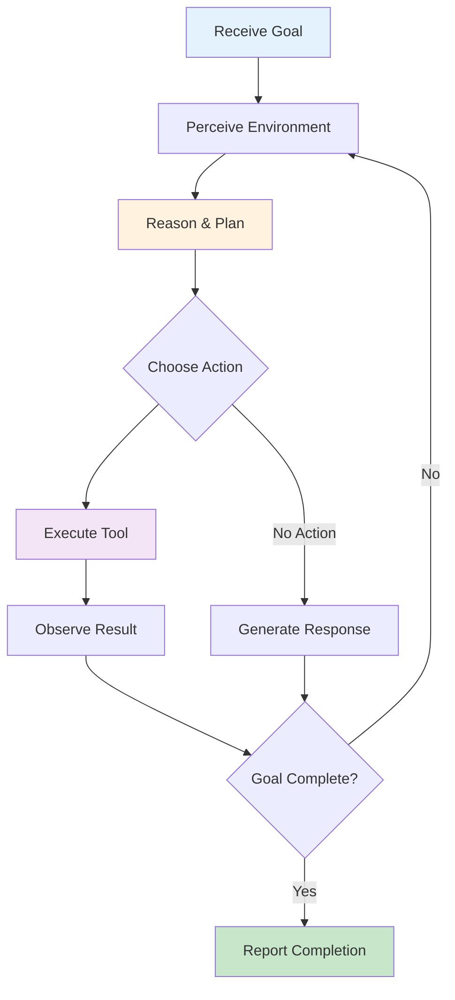
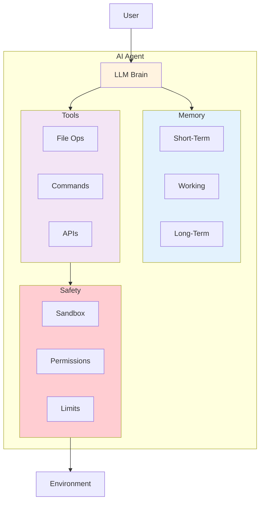
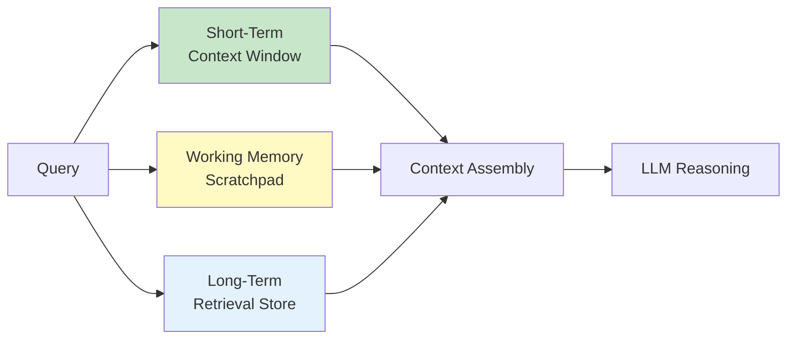
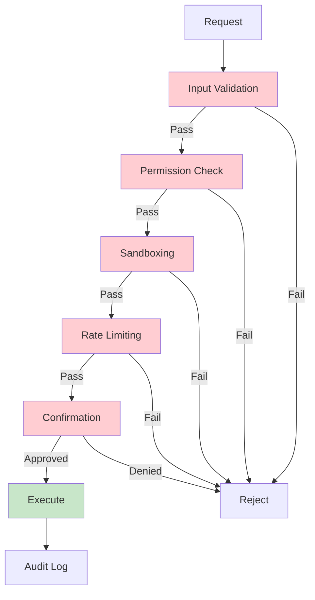
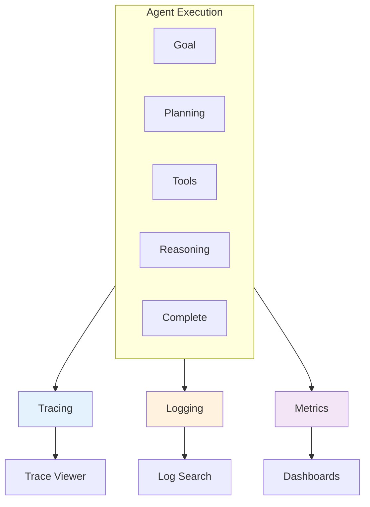

import Tip from "@components/mdx/Tip.astro";
import Warning from "@components/mdx/Warning.astro";
import Info from "@components/mdx/Info.astro";
import Definition from "@components/mdx/Definition.astro";
import Quiz from "@components/react/Quiz";
import HandsOnExercise from "@components/react/HandsOnExercise";

# AI Agents: Concepts and Architecture

You have used chatbots. You ask a question, you get an answer. The conversation ends, or you ask another question. The AI is reactive. It responds to your prompts but does not take initiative.

An AI agent is fundamentally different. It pursues goals over time, makes decisions about what actions to take, observes the results, and adjusts its behavior accordingly. The shift from chatbot to agent is the shift from "answer my question" to "accomplish this task."

## What is an AI Agent?

Consider the difference between these interactions.

A chatbot interaction: "How do I create a new Git branch?" The AI responds: "To create a new Git branch, use: git checkout -b branch-name."

<Definition term="AI Agent">
  An AI system that pursues goals over time, makes autonomous decisions about
  what actions to take, observes the results of those actions, and adjusts its
  behavior accordingly. Unlike chatbots that respond to individual prompts,
  agents execute multi-step plans to accomplish tasks.
</Definition>

An agent interaction: "Review the codebase and create a PR that fixes the authentication bug." The agent reads code files, identifies the bug, writes a fix, runs tests, creates a branch, commits changes, opens a PR, and reports completion.

The agent takes a high-level goal and autonomously executes multiple steps to achieve it. It decides what to do, does it, and handles problems along the way.

### The Agentic Spectrum

Agentic is not binary. It is a spectrum of increasing autonomy.

Level 0 is a basic chatbot with single-turn question and answer, no persistence. Level 1 is conversational with multi-turn memory but user-driven flow. Level 2 is tool-augmented where the model can use tools when prompted. Level 3 is a reactive agent that takes actions in response to events. Level 4 is a goal-directed agent that pursues objectives across multiple steps. Level 5 is an autonomous agent that sets sub-goals, self-corrects, and handles long-horizon planning.

<Info>
  Most production systems today operate at levels 2-4. Fully autonomous agents
  remain experimental and require significant human oversight. The sweet spot
  for most applications is tool-augmented or goal-directed agents with clear
  scope.
</Info>

### What Makes a System Agentic

An AI system becomes agentic when it exhibits several characteristics.

Goal-directed behavior means the system works toward objectives, not just responding to individual queries. It maintains intent across multiple interactions and actions.

Environmental interaction means the system perceives its environment by reading files and observing states, and acts on it by writing code, calling APIs, and modifying databases. It does not just generate text. It does things.

<Tip>
  Autonomy is the defining characteristic. Given "fix this bug," the agent
  decides how to investigate, what to try, and when it is done. Each step does
  not require explicit user instruction.
</Tip>

Feedback loops mean the system observes the results of its actions and adjusts accordingly. If a test fails after a code change, it reads the error and tries a different approach.

Persistence means the system maintains state across actions. It remembers what it has tried, what worked, and what the current goal is.

### Why Agents Now

The emergence of capable AI agents is driven by recent advances.

Large language models serve as reasoners. Modern LLMs can break down complex problems, generate plans, and adapt to unexpected situations. This reasoning capability is the brain of an agent.

Tool use has matured. Models can reliably format function calls, interpret results, and decide what tool to use next. This bridges the gap between thinking and doing.

Extended context windows enable sophisticated agent behavior. Agents need to track history, goals, observations, and plans simultaneously. Context windows of 100K or more tokens make this possible.

Retrieval systems allow agents to access vast knowledge bases and codebases through retrieval-augmented generation, extending capabilities beyond training data.

Infrastructure maturity means frameworks, APIs, and deployment patterns for agents have developed, making production deployment feasible.

### The Agent Opportunity

Agents unlock capabilities impossible for traditional software or simple chatbots.

Complex workflows involve tasks requiring dozens of steps with branching based on intermediate results. Adaptive behavior handles novel situations not explicitly programmed. Integration coordinates across multiple systems, APIs, and data sources. Continuous operation monitors, responds, and acts over extended periods.

<Warning>
  Agents also introduce new challenges: unpredictability, safety concerns,
  debugging complexity, and the need for robust human oversight. These
  challenges require explicit architectural solutions.
</Warning>

## Core Agent Architecture

At its core, every agent follows a simple loop: perceive, reason, act. This loop repeats until the goal is achieved, a termination condition is met, or resources are exhausted.

### The Agent Loop

The loop structure is straightforward. While not done, the agent perceives the environment to gather observations, reasons about observations, goals, and history to form a plan, acts on the plan to produce a result, appends observations, plan, and result to history, and checks completion against the goal and result.

<video 
  autoplay 
  loop 
  muted 
  playsinline 
  style="width: 100%; border-radius: 8px; margin: 1rem 0; cursor: pointer;" 
  onclick="this.paused ? this.play() : this.pause()"
>
  <source src="/videos/course/agent-loop-cycle.mp4" type="video/mp4" />
  Your browser does not support the video tag.
</video>

*Animated cycle of the agent loop showing how perception, reasoning, action, and evaluation repeat until the goal is achieved.*

<Definition term="Agent Loop">
  The fundamental cycle of agent operation: perceive the environment, reason
  about what to do next, execute an action, observe the result, and repeat until
  the goal is achieved or termination conditions are met.
</Definition>

Perceive means the agent gathers information about its environment. This might include reading files, calling APIs, checking system state, or processing user input. Perception produces observations that inform reasoning.

Reason means the agent's LLM brain processes observations, considers the goal, and decides what to do next. This is where planning, problem decomposition, and decision-making occur.

Act means the agent executes the decided action through tools: writing files, running commands, making API calls, sending messages. Actions change the environment.

Update means the agent records what happened for future reference. History enables learning from attempts and avoiding repeated failures.

Evaluate means the agent checks whether the goal is achieved. Evaluation might be explicit through running tests or checking output, or implicit through assessing task completion.

### The LLM as Agent Brain

The language model is the reasoning engine of an agent. It performs several critical functions.

Intent understanding parses high-level goals into actionable understanding. "Fix the authentication bug" requires understanding what authentication means in this context, what fix entails, and what success looks like.

<Info>
  Planning is often the most critical capability. A skilled LLM can generate a
  multi-step plan before executing, improving success rates on complex tasks.
  The quality of planning directly affects agent effectiveness.
</Info>

Planning breaks complex goals into steps. Tool selection chooses which tool to use for each step. Result interpretation understands the output of actions. Error recovery decides how to proceed when things go wrong. Natural language interface communicates with users, explains actions, and asks clarifying questions.

### System Prompts for Agents

The system prompt defines the agent's identity, capabilities, and constraints. A well-designed agent system prompt includes several components.

Identity and role establish what the agent is. "You are a senior software engineer AI assistant. Your task is to help users accomplish coding tasks by reading, analyzing, and modifying code."

<Tip>
  The tools description should be detailed and precise. Each tool needs a clear
  name, description, and parameter specification. This helps the LLM select the
  right tool and use it correctly.
</Tip>

Available capabilities list the tools the agent can use: read_file to read contents of a file, write_file to write content to a file, run_command to execute a shell command, search_codebase to search for matching code.

Behavioral guidelines specify how to work: always read and understand existing code before modifying it, make minimal targeted changes, test changes before declaring completion, explain reasoning before taking actions.

Constraints and safety rules specify what never to do: never delete files without explicit user permission, never execute commands that modify system configuration, never expose sensitive information like API keys, never make changes outside the project directory.

Output format specifies how to request tool use, ensuring the agent formats tool calls in a way the system can parse.

### Tool Integration Architecture

Tools are how agents interact with the world. A well-designed tool system has several layers.

Tool definition specifies each tool with a name, description, parameters, and implementation.

Tool registry maintains available tools, presented to the LLM for selection.

Execution layer validates parameters when the LLM selects a tool, runs the tool, handles errors, and formats results.

<Warning>
  The security layer is essential. Tools must be sandboxed with appropriate
  permissions. A file-reading tool might be restricted to certain directories. A
  command-execution tool might have a whitelist of allowed commands.
</Warning>

## Planning and Reasoning

Complex tasks require breaking down into manageable steps. Effective agents decompose tasks before executing.

### Task Decomposition

Top-down decomposition starts with the high-level goal and recursively breaks it into sub-goals.

<Definition term="Task Decomposition">
  The process of breaking complex goals into smaller, manageable sub-goals and
  steps. Effective decomposition creates a hierarchical plan where each step is
  achievable with available tools and capabilities.
</Definition>

For implementing user authentication for an API, decomposition might proceed as follows. First, understand current API structure by reading the main app file, identifying existing routes and middleware, and finding database models. Second, design the authentication approach by deciding between JWT and session-based, planning required endpoints, and defining user model changes. Third, implement authentication by creating the user model schema, implementing registration and login endpoints, and adding authentication middleware. Fourth, test implementation by writing unit tests, running tests, and fixing any failures. Fifth, document changes by updating API documentation and adding usage examples.

This decomposition happens in the reasoning phase before execution begins.

### Planning Strategies

Different planning strategies suit different situations.

Upfront planning generates a complete plan before taking any action. Best for well-understood tasks with predictable steps. The agent generates a numbered plan, then begins execution.

<Tip>
  Reactive planning works best for exploratory tasks or when outcomes are
  unpredictable. The agent plans one step at a time based on current state,
  adapting as it learns more about the problem.
</Tip>

Reactive planning plans one step at a time based on current state. Best for exploratory tasks or when outcomes are unpredictable. The agent runs tests, sees an error, investigates, checks configuration, and continues based on what it finds.

Hybrid planning generates a high-level plan upfront but adapts during execution. This is often the most effective approach, combining the benefits of both.

### Goal-Directed Behavior

Agents must maintain focus on the goal while handling intermediate details.

Goal tracking explicitly tracks what the current goal is and how current actions relate to it. The agent knows the current goal, current sub-goal, and current action.

Progress assessment periodically evaluates whether actions are making progress toward the goal.

Goal refinement updates understanding of the goal based on new information. Initial understanding might be "fix the login bug" while after investigation it becomes "the login bug is caused by incorrect password hashing comparison; need to update to use constant-time comparison."

### Handling Errors and Failures

Agents inevitably encounter errors. Robust agents handle them gracefully.

Error classification determines the type of error. Transient errors like network timeouts should retry with backoff. Input errors like invalid file paths should ask for clarification. Capability limits where the task is too complex should decompose further or escalate. Resource errors like out of memory should reduce scope or request resources. Logic errors where the approach is wrong should backtrack and try different approaches. Unrecoverable errors like permission denied should report and request human intervention.

<Info>
  Making agent reasoning visible helps with debugging and building trust.
  Reasoning traces show the agent's thought process, making it easier to
  understand decisions and identify where things went wrong.
</Info>

### Reasoning Traces

Making agent reasoning visible helps with debugging and building trust.

A trace shows thinking, actions, observations, plans, and conclusions in sequence. "THINKING: User wants to add a new API endpoint for user preferences. THINKING: First, I need to understand the existing API structure. ACTION: Reading src/routes/index.js to see how routes are organized. OBSERVATION: Routes are organized by resource: /users, /posts, /comments. THINKING: I should add preferences as a sub-route of users. PLAN: 1. Create preferences model. 2. Create preferences controller. 3. Add route to users routes. 4. Write tests. 5. Test the endpoint. ACTION: Creating src/models/preferences.js..."

## Memory Systems

Without memory, every action would start from scratch. Agents need multiple types of memory to function effectively.

### Why Agents Need Memory

Context awareness tracks what has happened in the current session. Task progress tracks what has been tried and what worked. Knowledge accumulation records what has been learned about the codebase. Persistent state remembers information across sessions.

<Definition term="Agent Memory">
  The systems that enable agents to maintain context, track progress, and learn
  from experience. Agent memory typically includes short-term memory (context
  window), working memory (structured task state), and long-term memory
  (persistent retrieval systems).
</Definition>

### Short-Term Memory: The Context Window

The most fundamental memory is the LLM's context window, the conversation history that influences each response.

Components of context include the system prompt for agent identity and instructions, the user's original goal, actions taken and results, current observations, and relevant retrieved information.

Context management presents challenges because context windows are limited. Even 100K tokens fill up. Agents must manage context carefully by summarizing oldest entries when approaching limits and compressing summaries as needed.

### Working Memory: The Scratchpad

Beyond conversation history, agents benefit from structured working memory, a scratchpad for tracking state.

<Tip>
  Structured working memory is injected into the prompt, helping the agent
  maintain focus and avoid repeating mistakes. It tracks current goal,
  sub-goals, current plan, completed steps, failed approaches, key findings, and
  open questions.
</Tip>

Working memory tracks the current goal, sub-goals, current plan, completed steps, failed approaches, key findings, and open questions. This structured state is injected into the prompt to help the agent maintain focus.

### Long-Term Memory: Retrieval Systems

For knowledge that exceeds context limits or persists across sessions, agents use retrieval systems.

Vector databases store embeddings of documents, code, or past conversations. Query with semantic similarity to retrieve relevant content for the current situation.

Use cases for long-term memory include codebase knowledge for answering "Where is authentication handled?", past sessions for asking "How did we fix this before?", user preferences for maintaining consistency with the user's patterns, error patterns for recognizing and fixing known issues, and domain knowledge for referencing documentation.

### Memory Architecture

A complete agent memory system combines all three types.

The agent core connects to short-term memory (context window) containing messages, tool calls, and results. It connects to working memory (scratchpad) containing goals, plans, and findings. It connects to long-term memory (vector store) containing codebase, past tasks, and documentation.

<Info>
  Context construction combines all memory sources when the agent reasons.
  System prompt is always included, followed by working memory state, relevant
  long-term memories retrieved for the current goal, recent history with recent
  actions and results, and current observation with latest state.
</Info>

### Memory Best Practices

Structured over unstructured means storing structured state in JSON or key-value format rather than raw conversation dumps. Easier to query and update.

Selective persistence means not everything needs long-term storage. Save successful patterns, important discoveries, and error resolutions.

Recency weighting recognizes that recent information is usually more relevant. Weight retrieval toward recent memories.

Explicit forgetting means sometimes agents need to forget outdated information or incorrect assumptions. Build in mechanisms to deprecate old memories.

Memory boundaries keep session memory separate from persistent memory. Allow users to reset session state without losing long-term learning.

## Agent Observability

Agents are complex systems with many failure modes. Without observability, debugging is guesswork.

### Why Observability Matters

Why did the agent take 50 steps for a simple task? Where did it go wrong? What was it thinking when it made that decision? Why did it use that tool instead of another? Observability answers these questions by making agent behavior transparent.

### The Three Pillars of Agent Observability

Tracing captures what happened and in what order. Traces capture the full execution path of an agent task: user goal, planning, step execution, tool calls, and completion.

<Definition term="Agent Observability">
  The practice of making agent behavior transparent through tracing, logging,
  and metrics. Observability enables debugging agent failures, understanding
  agent decisions, and monitoring agent performance over time.
</Definition>

A trace for a coding task might show: Trace: fix-auth-bug-2024-01-10-abc123 with user goal at 0ms, planning at 50ms with a 5-step plan generated, step 1 at 200ms reading auth.py with 245 lines read, step 2 at 800ms analyzing code with issue identified at line 87, step 3 at 1200ms writing fix with 3 lines modified, step 4 at 3500ms running tests with 15/15 passed, and completion at 3700ms with task completed successfully.

<Tip>
  Key events to log include goal received, plan generated, tool invoked, tool
  result, LLM reasoning, errors encountered, and goal completed. Include
  relevant context like goal text, plan steps, tool parameters, success status,
  and duration.
</Tip>

Logging captures the details at each step: timestamp, level, message, and relevant context.

Metrics help understand agent performance over time: task success rate, steps per task, task duration, tool failure rate, LLM tokens per task, error recovery rate, and human escalation rate.

### Debugging Agent Failures

When an agent fails, use observability data to diagnose.

Start with the trace to see the execution path and where it diverged from expected. Check the logs to see what was happening at each step, what the agent saw and decided. Examine the prompts to see what context the LLM had when it made the problematic decision and whether important information was missing. Review tool results to see if a tool failed silently or returned unexpected data. Check metrics to see if this is a one-off failure or part of a pattern.

### Observability Infrastructure

For production agents, invest in proper infrastructure.

The agent application connects to tracer SDK, logger SDK, and metrics SDK. These connect to trace store, log store, and time series database. These connect to trace viewer, log search, and dashboards.

<Info>
  Tools and services for agent observability include OpenTelemetry, Jaeger, and
  LangSmith for tracing; ELK Stack, Datadog, and Papertrail for logging;
  Prometheus, Grafana, and Datadog for metrics; and agent-specific tools like
  LangSmith and Phoenix from Arize.
</Info>

## Safety in Agentic Systems

Everything that can go wrong with AI gets worse with agents. Agents act autonomously, at scale, and across systems. The risks are amplified.

### Amplified Risks

Hallucination in a chatbot produces a wrong answer. In an agent, it produces a wrong action with real-world effects.

Prompt injection in a chatbot changes the response. In an agent, it hijacks the agent to take malicious actions.

<Warning>
  Agents require defense in depth: multiple layers of protection including
  sandboxing, permissions, rate limits, and human oversight. No single safety
  measure is sufficient.
</Warning>

Data leakage in a chatbot leaks in conversation. In an agent, it leaks via file writes and API calls.

Errors in a chatbot produce incorrect output. In an agent, they produce incorrect changes to systems.

Infinite loops in a chatbot produce a stuck conversation. In an agent, they produce resource exhaustion and cost explosion.

### Sandboxing Agent Actions

Never give agents unrestricted access. Sandbox all operations.

File system sandboxing restricts which paths are allowed. Before reading or writing, check if the absolute path starts with an allowed directory. Additional checks prevent modifying system files.

Command execution sandboxing maintains a whitelist of allowed commands and blocked patterns. Check if the base command is allowed, check for dangerous patterns, and execute in a restricted subprocess with timeout.

### Permission Systems

Implement fine-grained permissions for agent actions.

Permissions can be configured as always, never, with_confirmation, or conditional based on the resource. Restricted level might allow read_file always but require confirmation for write_file and never allow run_command or call_api. Standard level might allow more operations with conditional checks. Elevated level might allow all operations.

### Rate Limiting and Resource Controls

Prevent runaway agents with explicit limits on max iterations, max tool calls, max tokens per task, max duration seconds, max file writes, and max commands. Track usage and check against limits for each resource. Also check elapsed time against the duration limit.

<Tip>
  Build in multiple layers of protection: confirmation for destructive actions,
  automatic rollback capability, and human-in-the-loop for high-stakes actions
  like deploy, publish, send_email, modify_database, and api_mutation.
</Tip>

### Security Principles for Agents

Principle of least privilege means agents should have the minimum permissions necessary for their task.

Defense in depth means multiple layers of protection: sandboxing, permissions, rate limits, human oversight.

Fail-safe defaults mean when in doubt, deny. Unknown actions should require explicit approval.

Audit everything means log all agent actions for post-hoc review.

Graceful degradation means when limits are hit, degrade gracefully rather than failing catastrophically.

## Agent Design Patterns

Agents add complexity. Use them when the benefits justify the costs.

### When to Use Agents

Good fit for agents includes multi-step tasks with unpredictable paths, tasks requiring tool coordination, long-running processes needing adaptation, and tasks where human effort is high and errors are recoverable.

<Info>
  Poor fit for agents includes simple deterministic workflows (use regular
  code), tasks where every error is critical (use human oversight),
  high-frequency low-latency requirements (agents are slow), and tasks with
  clear fixed procedures (use automation).
</Info>

### Simple vs. Complex Agent Designs

Simple agent design uses a single LLM with linear tool usage and limited memory. User goal flows to LLM, to tool, to LLM, to tool, to response. Best for well-defined tasks, lower latency, easier debugging.

Complex agent design uses multiple specialized LLMs with hierarchical planning and sophisticated memory. User goal flows to planner LLM, which coordinates sub-agents each with their own tools, then to synthesizer LLM, then to response. Best for complex open-ended tasks requiring specialized capabilities.

### Start Simple

For most applications, start with the simplest agent that could work.

Single-turn tool use has the LLM decide which tool to call based on user query. Multi-turn tool use allows the LLM to call multiple tools in sequence. Planning agent generates a plan before executing. Reflective agent reviews its own output and refines. Multi-agent system has specialized agents collaborate.

Move to more complex patterns only when simpler ones fail.

### Design Heuristics

Explicit over implicit makes goals, plans, and state explicit in prompts.

Observation over assumption has agents verify assumptions rather than assuming.

Incremental over monolithic prefers many small actions over few large ones.

<Tip>
  Reversible over irreversible favors actions that can be undone. Logged over
  unlogged means if it is not logged, it did not happen for debugging purposes.
</Tip>

## Diagrams

### The Agent Loop

### Agent Architecture Components

### Memory System Architecture

### Safety Layers

### Observability Stack

## Hands-On Exercise

<HandsOnExercise
  client:visible
  moduleSlug="ai-agents-architecture"
  exerciseId="build-simple-agent"
  title="Build a Simple Agent"
  objective="Implement a functional AI agent with tool use capabilities, proper sandboxing, and observability"
  totalTime="60-75 minutes"
  setupInstructions={[
    "Install Python 3.8 or higher",
    "Set up access to an LLM API (Claude, OpenAI, or local model)",
    "Create a test project directory with a sample Python file containing a small bug",
  ]}
  parts={[
    {
      id: "define-tools",
      title: "Define Tools",
      duration: "15 min",
      instructions: [
        "Create ReadFileTool that reads file contents with path validation and restricts access to an allowed directory",
        "Create WriteFileTool that writes content to files with the same security restrictions plus additional checks for system files",
        "Create RunCommandTool that executes shell commands with a whitelist (ls, cat, grep, python, pytest, git) and blocked patterns (rm -rf, sudo, pipes, redirects)",
        "Add timeout protection to the RunCommandTool",
        "Ensure each tool returns a structured result with success status, output, and optional error",
      ],
      observePrompt:
        "How does restricting tools to specific directories and commands improve agent safety? What other restrictions might be useful?",
    },
    {
      id: "build-agent-core",
      title: "Build the Agent Core",
      duration: "20 min",
      instructions: [
        "Initialize the agent with LLM client, tools registry, and system prompt",
        "Set up history and trace structures for observability",
        "Build a tools description that will be included in the prompt",
        "Implement the run method that logs when a goal is received",
        "Create the main loop that gets LLM responses, checks for completion markers, parses tool calls, executes tools, and adds results to the conversation",
        "Set a maximum iteration count to prevent infinite loops",
        "Return status, iteration count, and trace when complete",
      ],
      observePrompt:
        "What happens if the agent requests an unknown tool? How does the iteration limit prevent runaway execution?",
    },
    {
      id: "create-system-prompt",
      title: "Create System Prompt",
      duration: "15 min",
      instructions: [
        "Define the agent's identity and purpose (e.g., 'You are a senior software engineer AI assistant')",
        "Specify the step-by-step work process: understand the task, read existing code, make minimal targeted changes, test changes, and report completion",
        "Document the format for requesting tool calls",
        "Add behavioral rules: always read before modifying, make minimal changes, explain reasoning before actions",
        "Define how the agent should signal task completion",
        "Test the prompt with several different goals to verify expected behavior",
      ],
      observePrompt:
        "How do the instructions influence agent behavior? What happens if you make the instructions too vague or too specific?",
    },
    {
      id: "test-agent",
      title: "Test the Agent",
      duration: "20 min",
      instructions: [
        "Create a test directory with a Python file containing a small bug (e.g., off-by-one error, incorrect comparison)",
        "Run your agent with the goal: 'Fix the bug in calculate.py'",
        "Observe the trace output to see the agent's decision-making process",
        "Verify the agent read the file first before making changes",
        "Confirm the agent identified the correct bug",
        "Check that the changes made are appropriate and minimal",
        "Ensure the agent signaled completion properly",
        "If issues occur, examine the trace to understand what went wrong",
      ],
      observePrompt:
        "What does the agent do well? Where does it struggle? How could you improve the system prompt or tools based on observed behavior?",
    },
  ]}
  successCriteria={[
    {
      id: "sandboxing",
      text: "Tools implement proper sandboxing and security checks",
    },
    {
      id: "loop",
      text: "Agent loop correctly handles tool calls and responses",
    },
    {
      id: "prompt",
      text: "System prompt produces structured, predictable agent behavior",
    },
    {
      id: "observability",
      text: "Trace output enables understanding of agent decisions",
    },
    {
      id: "completion",
      text: "Agent successfully completes a simple coding task",
    },
  ]}
/>

## Knowledge Check

<Quiz
  client:visible
  quizId="module-15-knowledge-check"
  moduleSlug="ai-agents-architecture"
  questions={[
    {
      question:
        "What is the fundamental difference between a chatbot and an AI agent?",
      options: [
        "Agents use larger language models",
        "Agents pursue goals over multiple steps and take actions in their environment",
        "Agents have more training data",
        "Agents can process images and audio",
      ],
      correctAnswer: 1,
      explanation:
        "The key distinction is agency itself. Chatbots respond to prompts reactively - they answer questions but don't take initiative. Agents pursue goals over time, make decisions about what actions to take, observe results, and adapt their behavior. They interact with their environment to accomplish tasks, not just generate text responses.",
    },
    {
      question:
        "Why do agents need multiple types of memory (short-term, working, long-term)?",
      options: [
        "To make them more expensive to run",
        "Short-term memory handles immediate context, working memory tracks task state, and long-term memory provides persistent knowledge",
        "It's a marketing feature",
        "To slow down processing",
      ],
      correctAnswer: 1,
      explanation:
        "Each memory type serves a distinct purpose. Short-term memory (context window) holds immediate conversation and recent actions. Working memory (scratchpad) tracks structured task state - current goal, plan, findings, failed approaches. Long-term memory (retrieval systems) stores persistent knowledge that exceeds context limits. Together, they enable agents to maintain context, learn from attempts, and leverage accumulated knowledge.",
    },
    {
      question:
        "What is the most critical safety principle for production agents?",
      options: [
        "Use the largest possible model",
        "Give agents maximum permissions for flexibility",
        "Defense in depth: multiple layers of protection including sandboxing, permissions, rate limits, and human oversight",
        "Trust the LLM's judgment completely",
      ],
      correctAnswer: 2,
      explanation:
        "Production agents require defense in depth. No single safety measure is sufficient. Sandboxing restricts what actions can affect. Permissions control what's allowed. Rate limits prevent runaway resource consumption. Human oversight catches what automated systems miss. Each layer catches failures that slip through others.",
    },
    {
      question:
        "When should you use a simple agent design versus a complex multi-agent system?",
      options: [
        "Always use complex systems for better results",
        "Start with the simplest design that could work; add complexity only when simpler approaches fail",
        "Complex systems are always faster",
        "Simple agents can't use tools",
      ],
      correctAnswer: 1,
      explanation:
        "Complexity has costs: harder debugging, higher latency, more failure modes, greater resource usage. Simple agents are easier to understand, debug, and maintain. Start simple: can a basic tool-using LLM accomplish the task? Only add planning, reflection, or multi-agent coordination when simpler approaches demonstrably fail.",
    },
    {
      id: "q5",
      type: "multiple-choice",
      question: "What are the three pillars of agent observability?",
      options: [
        "Speed, accuracy, and cost",
        "Tracing, logging, and metrics",
        "Planning, execution, and evaluation",
        "Input, processing, and output",
      ],
      correctAnswer: 1,
      explanation:
        "Agent observability relies on three pillars. Tracing captures what happened and in what order - the full execution path. Logging captures details at each step with timestamps and context. Metrics show aggregate patterns over time - success rates, steps per task, duration. Together, these enable debugging failures, understanding decisions, and monitoring performance.",
    },
  ]}
  passingScore={70}
  allowRetry={true}
/>

## Summary

AI agents represent a fundamental shift from reactive chatbots to goal-directed systems that take autonomous action.

The agent loop of perceive, reason, act, update, and evaluate forms the core of all agent architectures. The LLM serves as the reasoning brain, handling intent understanding, planning, tool selection, result interpretation, and error recovery.

Effective agents require well-designed system prompts that establish identity, capabilities, behavioral guidelines, constraints, and output formats. Tool integration needs careful architecture with clear definitions, registries, execution layers, and security boundaries.

Planning and reasoning enable agents to tackle complex tasks through decomposition, goal tracking, and error handling. Different strategies, whether upfront, reactive, or hybrid, suit different situations.

Memory systems provide essential context across multiple timescales: short-term memory in the context window, working memory in a structured scratchpad, and long-term memory in retrieval systems. Proper memory management enables agents to maintain focus and learn from experience.

Observability through tracing, logging, and metrics is critical for debugging and monitoring. Without observability, agent failures become guesswork.

Safety in agentic systems requires defense in depth: sandboxing, permissions, rate limits, and human oversight. The risks of chatbots are amplified when agents take autonomous action.

Start simple with agent designs. Move to complex patterns only when simpler approaches fail. The best agent is the simplest one that accomplishes the task reliably and safely.

## What's Next

In the next module, we will explore tool use and function calling in depth. We will cover how to design tool interfaces, implement reliable function calling, handle tool errors, and build composable tool ecosystems that extend agent capabilities.

## References

### Architecture and Design

- **"Building LLM-Powered Applications"** by Harrison Chase. Comprehensive guide to agent architectures.
  [blog.langchain.dev](https://blog.langchain.dev/)

- **"The Anatomy of Autonomy"** by Anthropic. Framework for understanding agentic systems.
  [anthropic.com/research](https://www.anthropic.com/research)

### Research

- Yao, S., et al. (2022). **"ReAct: Synergizing Reasoning and Acting in Language Models."** Foundation paper for reasoning-and-acting agents.
  [arxiv.org/abs/2210.03629](https://arxiv.org/abs/2210.03629)

- Shinn, N., et al. (2023). **"Reflexion: Language Agents with Verbal Reinforcement Learning."** Self-reflection in agents.
  [arxiv.org/abs/2303.11366](https://arxiv.org/abs/2303.11366)

- Wang, G., et al. (2023). **"Voyager: An Open-Ended Embodied Agent with Large Language Models."** Long-horizon agent behavior.
  [arxiv.org/abs/2305.16291](https://arxiv.org/abs/2305.16291)

### Frameworks

- **LangChain documentation.** Popular framework for building agent applications.
  [python.langchain.com](https://python.langchain.com/)

- **AutoGPT** and similar autonomous agent projects. Examples of agent implementation patterns.
  [github.com/Significant-Gravitas/AutoGPT](https://github.com/Significant-Gravitas/AutoGPT)

### Safety

- **OWASP LLM Top 10.** Security considerations for LLM applications including agents.
  [owasp.org/www-project-top-10-for-large-language-model-applications](https://owasp.org/www-project-top-10-for-large-language-model-applications/)

- **Anthropic Claude documentation on tool use safety.** Best practices for agent safety.
  [docs.anthropic.com/en/docs/build-with-claude/tool-use](https://docs.anthropic.com/en/docs/build-with-claude/tool-use)
