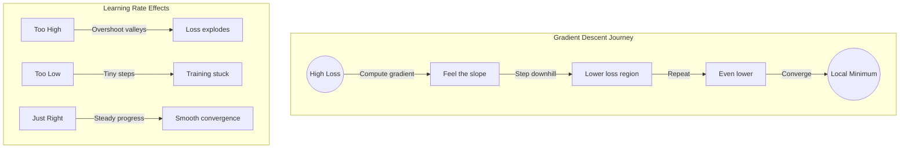
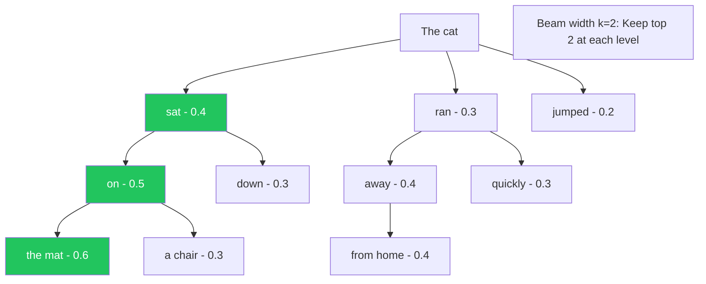
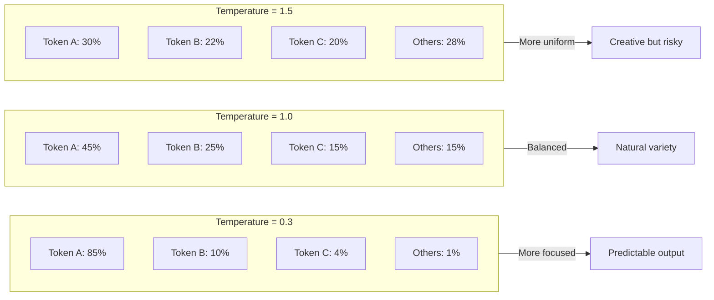
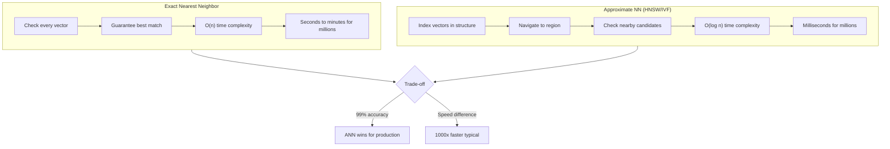
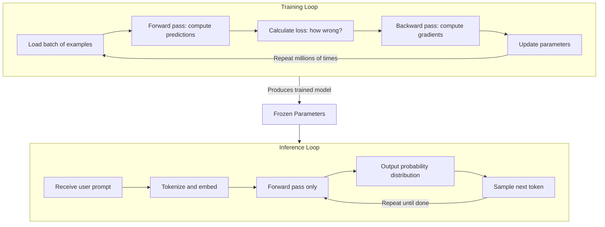

import Tip from "@components/mdx/Tip.astro";
import Warning from "@components/mdx/Warning.astro";
import Info from "@components/mdx/Info.astro";
import Exercise from "@components/mdx/Exercise.astro";
import Definition from "@components/mdx/Definition.astro";
import Quiz from "@components/react/Quiz";
import HandsOnExercise from "@components/react/HandsOnExercise";

## Section 1: Algorithms in the Age of AI

### Why Algorithms Matter More Than Ever

You might think that in the age of neural networks, classical algorithms are obsolete. After all, isn't the whole point of machine learning that systems learn patterns instead of following hand-coded rules?

The reality is exactly the opposite. Understanding algorithms has never been more important.

Modern AI systems are built on algorithmic foundations. The transformer architecture that powers ChatGPT and Claude? It's fundamentally a clever combination of matrix multiplication, attention mechanisms (a form of weighted search), and optimization algorithms. The training process that makes these systems useful? It's gradient descent at massive scale.

When you use an AI coding assistant, multiple algorithmic layers are at work simultaneously. Tokenization algorithms break your code into processable units. Search algorithms find relevant context from your codebase. Optimization algorithms trained the model's billions of parameters. Sampling algorithms select which tokens to generate next. You don't need to implement these from scratch. But understanding them transforms AI from a black box into a comprehensible system with predictable behaviors.

<Info title="The Three Pillars of AI Algorithms">
  AI systems rely on three fundamental algorithmic categories: **Search**
  (finding solutions in large spaces), **Optimization** (finding the best
  solution among alternatives), and **Sampling** (selecting from probability
  distributions). This module explores each pillar, building your intuition for
  how they combine to create intelligent-seeming behavior.
</Info>

### From Classical to AI Applications

Traditional AI was dominated by search. Game-playing programs searched possible moves. Planning systems searched action sequences. Route planners searched possible paths. Modern AI still uses search extensively: finding similar embeddings, exploring generation paths, retrieving relevant context.

Optimization is fundamentally what machine learning does. When we say a model "learns," we mean optimization algorithms adjusted parameters to minimize prediction error. Understanding optimization illuminates why models succeed and fail.

Sampling might be the least familiar concept, but it's crucial for understanding how LLMs generate text. When an AI produces a response, it doesn't deterministically choose the "best" next token. It samples from a distribution of possibilities, with various algorithms controlling that sampling process.

Every algorithm we'll discuss has direct practical implications. Understanding search helps you structure retrieval-augmented generation effectively. Understanding optimization explains why fine-tuning works and when it fails. Understanding sampling lets you tune generation parameters intelligently.

By the end of this module, you'll see AI systems differently. Not as mysterious black boxes, but as sophisticated combinations of comprehensible algorithmic components.

---

## Section 2: Search Algorithms

### Search as the Foundation of AI

Before deep learning dominated the AI landscape, the field was largely about search. A chess program searches possible moves. A route planner searches possible paths. A theorem prover searches possible proof steps.

This framing remains powerful. Many AI problems can be cast as: given a starting point and a goal, find a path through some space of possibilities.

### Binary Search: The Simplest Case

Let's start with the most fundamental search algorithm. Binary search finds an item in a sorted list by repeatedly dividing the search space in half. If you have a sorted list of one million items, linear search might check all one million items. Binary search needs at most 20 checks, because log base 2 of 1,000,000 is approximately 20.

The principle of systematically eliminating half the possibilities appears throughout AI. Embedding search often uses hierarchical structures where each step narrows the candidate set. Decision trees are essentially binary search over feature values. Beam search involves selection steps that eliminate candidates.

The efficiency insight matters: when you can impose structure on your search space, you can search exponentially faster.

<Definition term="Approximate Nearest Neighbor (ANN) Search">
  A family of algorithms that trade perfect accuracy for massive speed
  improvements when searching for similar items in high-dimensional spaces.
  Instead of checking every item, these algorithms use clever data structures to
  find very good matches in milliseconds rather than seconds.
</Definition>

### Approximate Nearest Neighbor Search

Here's where things get interesting for modern AI. When you ask an AI system a question, it often needs to find relevant information. In retrieval-augmented generation (RAG), this means finding documents similar to your query. With embeddings, "similarity" is measured by distance in high-dimensional space.

The problem is that you might have millions of embedded documents. Finding the absolute nearest neighbor requires checking every single one. With billion-item databases and real-time requirements, exact search is impossible.

Enter Approximate Nearest Neighbor algorithms. These trade perfect accuracy for massive speed improvements. Locality-Sensitive Hashing (LSH) projects high-dimensional vectors into hash buckets designed so similar vectors land in the same bucket. Search becomes: hash your query, check items in matching buckets. Hierarchical Navigable Small Worlds (HNSW) builds a multi-layer graph where each layer is increasingly sparse. Search starts at the top coarse layer and descends, using neighbors to navigate toward the target. Inverted File Index (IVF) clusters vectors into groups, then searches only the most promising clusters.

These algorithms enable the vector databases powering modern AI applications. When you use semantic search, RAG, or recommendation systems, ANN search is doing the heavy lifting.

<Tip title="The Practical Tradeoff">
  ANN might miss the true nearest neighbor occasionally. But finding a very good
  match in milliseconds beats finding the perfect match in minutes. For most AI
  applications, "good enough, fast" beats "perfect, slow."
</Tip>

### Beam Search: Structured Generation

When an LLM generates text, it doesn't just pick the single most likely token at each step. That greedy approach often produces repetitive, low-quality outputs.

Instead, many systems use beam search: maintaining multiple candidate sequences simultaneously. Here's how it works. You start with your prompt. Generate the top k most likely next tokens. These are your "beams." For each beam, generate the top k continuations. Keep only the k best complete sequences so far. Repeat until sequences are complete.

Beam search explores multiple paths through the space of possible outputs, keeping the most promising candidates. It's a middle ground between greedy search (always pick the most likely, fast but often suboptimal) and exhaustive search (consider all possibilities, optimal but computationally impossible).

The beam width controls the tradeoff. Wider beams find better solutions but cost more computation. Beam search is particularly important for tasks with clear correctness criteria like machine translation, summarization, and structured output generation. For creative writing, other approaches often work better.

### Monte Carlo Tree Search

Monte Carlo Tree Search (MCTS) is the algorithm that enabled AI breakthroughs in games like Go. It combines tree search with random sampling to explore vast possibility spaces.

The key insight is that you don't need to explore every possibility. You can randomly sample paths, see which ones lead to good outcomes, and focus exploration on promising directions.

MCTS has four phases. Selection starts from the root and chooses child nodes to explore, balancing between promising nodes and unexplored ones. Expansion adds a new node to the tree. Simulation plays out a random sequence from that node to see what happens. Backpropagation updates statistics for all nodes along the path.

This creates a virtuous cycle: random exploration discovers promising regions, which receive more exploration, which refines understanding of their value. MCTS matters for AI because it scales to enormous search spaces (Go has approximately 10 to the power of 170 possible positions), works with limited domain knowledge, and balances exploration with exploitation.

Modern AI systems use MCTS and similar techniques for reasoning tasks. When an AI "thinks step by step," it may be searching through possible reasoning paths, evaluating which ones lead to good answers.

---

## Section 3: Optimization Fundamentals

### What Is Optimization?

At its core, optimization is about finding the best solution from a set of possibilities. "Best" is defined by an objective function, a mathematical formula that scores any candidate solution.

Consider training a spam filter. You have a model with adjustable parameters. You have training data with emails labeled spam or not-spam. You have an objective function measuring prediction accuracy. Optimization finds parameter values that maximize accuracy, or equivalently, minimize error.

This framing is universal in machine learning. Neural network training minimizes prediction error. Reinforcement learning maximizes cumulative reward. Fine-tuning minimizes loss on your specific task.

Understanding optimization illuminates what machine learning actually does, and why it sometimes fails.

### The Loss Landscape

Imagine your model has just two parameters. You can visualize the objective function as a surface in 3D space: x and y are parameter values, height (z) is the loss, which represents error.

This "loss landscape" has topography. Valleys are good because they represent low error. Peaks are bad because they represent high error. Flat regions are tricky because the gradient provides no guidance.

Real models have millions or billions of parameters, and the landscape exists in high-dimensional space. We can't visualize it, but the same concepts apply. The optimization problem is: starting from some point in this landscape, find a valley with low loss.

<Definition term="Local vs Global Optima">
  A **global optimum** is the absolute best solution: the deepest valley in the
  entire landscape. A **local optimum** is the best solution in a neighborhood:
  a valley surrounded by higher terrain, but might not be the deepest valley
  overall. Simple optimization algorithms can get stuck in local optima.
</Definition>

### Why Local Optima Are Less Scary Than They Sound

The existence of local optima matters for AI because real loss landscapes have many of them. Different training runs can find different solutions. "Good enough" local optima often work fine in practice.

Here's the surprising finding from deep learning: for very large neural networks, most local optima are nearly as good as the global optimum. The landscape has many valleys, but they tend to have similar depths. This is part of why large models train successfully despite the theoretical difficulty.

Beyond local optima, optimization faces other challenges. Saddle points are positions that are minima in some directions but maxima in others, like the center of a horse's saddle. They can trap or slow optimization algorithms. Plateaus are flat regions where the gradient is near zero. With no slope to follow, gradient-based methods make little progress.

Understanding these landscape features explains puzzling training behaviors. Loss suddenly dropping after a plateau means escaping a flat region. Training stuck despite more data might mean being trapped in a local optimum. Different random seeds producing different final performance means finding different minima.

<Warning title="Why This Matters Practically">
  Model training failing or succeeding is an optimization story. Fine-tuning
  working better on some tasks than others relates to loss landscape structure.
  The randomness in AI training comes from stochastic optimization. Learning
  rate is the most important hyperparameter because it controls how big a step
  to take.
</Warning>

---

## Section 4: Gradient Descent Deep Dive

### The Core Algorithm

Gradient descent is the optimization algorithm that makes neural network training possible. Imagine you're blindfolded on a hilly landscape and need to reach the lowest point. You can feel the slope under your feet. The obvious strategy: always step downhill. Take a step, feel the new slope, step downhill again. Eventually, you'll reach a valley.

That's gradient descent. Calculate the gradient (slope) of the loss function with respect to each parameter. Take a small step in the direction that decreases loss. Repeat.

The gradient tells you: for each parameter, which direction improves the objective? Gradient descent follows that direction. Mathematically: parameters equal parameters minus learning rate multiplied by gradient.

The learning rate controls step size. Too large, and you overshoot valleys. Too small, and training takes forever or gets stuck.

That's the entire algorithm. Everything else is optimization and adaptation of this core idea.

### Stochastic Gradient Descent

Computing the exact gradient requires processing your entire dataset. With millions of training examples, this is slow. Stochastic Gradient Descent computes gradients on small batches of data.

Pick a random batch, perhaps 32 examples. Compute gradient on just that batch. Update parameters. Repeat with a new batch.

The gradient estimate is noisy, meaning it might not point exactly toward the optimum. But on average, it points in the right direction, and the noise can actually help escape local optima.

<Info title="Why Batch Size Matters">
  SGD enables training on massive datasets. Instead of one slow update per pass
  through the data, you get many fast updates. Modern AI training processes
  billions of examples through trillions of SGD steps. Smaller batches give
  noisier gradients and more updates, which can help generalization. Larger
  batches give smoother gradients and more stable training.
</Info>

### Momentum and Adam

Basic SGD can oscillate or slow down in certain landscape regions. Modern optimizers add improvements.

Momentum adds "inertia" to parameter updates. Instead of moving exactly where the gradient points, you continue somewhat in your previous direction. This helps move faster in consistent directions, dampen oscillations, and push through small bumps.

Adam, which stands for Adaptive Moment Estimation, adapts the learning rate for each parameter. Parameters with large gradients get smaller effective learning rates. Parameters with small gradients get larger effective learning rates. It also incorporates momentum.

Adam is the default optimizer for most modern AI training. It's robust across different problems and requires less tuning than basic SGD. Other optimizers exist like RMSprop, AdaGrad, and AdamW, each with tradeoffs. But the core insight is consistent: adapt step sizes based on gradient history.

### Learning Rate: The Most Important Hyperparameter

If you can only tune one hyperparameter, tune the learning rate.

A learning rate that's too high causes training to diverge. Loss explodes. Parameters shoot to extreme values. A learning rate that's too low means training progresses, but slowly. You might get stuck in poor local optima and waste computation. A learning rate that's just right means loss decreases smoothly and training converges to a good solution in reasonable time.

The "right" learning rate depends on model architecture, batch size, data characteristics, and training stage.

Learning rate schedules adjust the rate during training. You start high to make quick progress, then decay over time for fine-grained convergence. A brief warm-up lets momentum estimates stabilize. Common schedules include linear decay, cosine annealing, and step decay.

### Why Gradient Descent Works at Scale

Here's something remarkable: gradient descent shouldn't work as well as it does.

Neural networks have billions of parameters. The loss landscape is incredibly complex. There are countless local optima. And yet, gradient descent reliably finds good solutions.

Several factors contribute. Overparameterization means that with more parameters than constraints, many good solutions exist. The optimizer doesn't need to find the global optimum. Any good solution will do. Implicit regularization means SGD with momentum tends to find "flat" minima that generalize well. The algorithm's dynamics bias it toward certain solutions. Loss landscape structure means deep networks have surprisingly benign landscapes. Local optima tend to have similar quality. Saddle points are common but escapable. Scale itself matters because very large models have smoother landscapes and more easily found good solutions.

This is why massive models with simple optimizers outperform sophisticated optimization of small models. Scale changes the optimization problem itself.

---

## Section 5: Sampling and Generation

### How LLMs Select Tokens

When an LLM generates text, it produces a probability distribution over the next token. The vocabulary might contain 100,000 tokens, and each gets a probability.

The question is: given this distribution, which token do you actually output?

The simplest approach, always picking the highest probability token, produces deterministic, often repetitive text. The same prompt always generates the same output.

Instead, LLMs sample from the distribution, introducing controlled randomness. The sampling strategy dramatically affects output quality and style.

<Definition term="Temperature">
  A parameter that scales the model's probability distribution before sampling.
  Lower temperature (closer to 0) makes the distribution "peakier,"
  concentrating probability on the most likely tokens. Higher temperature
  flattens the distribution, making less likely tokens more probable.
</Definition>

### Temperature: Controlling Randomness

Temperature is the most important sampling parameter. It scales the logits (pre-probability scores) before converting to probabilities.

At temperature 0, the model is deterministic and always picks the highest probability token. Outputs are focused but potentially repetitive and boring. At temperature 1, the model uses its learned distribution unchanged and is balanced between coherence and creativity. At temperature greater than 1, randomness increases and lower-probability tokens get relatively more likely. Outputs become more creative but potentially incoherent. At temperature less than 1, randomness decreases and high-probability tokens become even more likely. Outputs become more focused but potentially generic.

Mathematically, temperature divides the logits before softmax. Lower temperature makes the probability distribution "peakier" (concentrated on favorites); higher temperature makes it "flatter" (more uniform).

<Tip title="Practical Temperature Guidelines">
  For factual tasks and code generation, use low temperature between 0.0 and
  0.3. For general assistance, use moderate temperature between 0.5 and 0.7. For
  creative writing, use higher temperature between 0.8 and 1.0. For
  brainstorming, use 1.0 or higher, but watch for incoherence.
</Tip>

### Top-k Sampling

Top-k sampling restricts selection to the k most likely tokens before sampling. With k equals 50, only the 50 highest-probability tokens are candidates. Their probabilities are renormalized, and sampling proceeds.

This prevents selecting extremely unlikely tokens that might be nonsensical or off-topic, while still allowing variation among likely candidates.

Low k (around 10) is very constrained and might miss valid options. High k (around 100) gives more variation, but rare tokens can slip in. When k equals 1, it's equivalent to greedy deterministic selection.

Top-k is simple but has a flaw: it uses the same k regardless of the distribution shape. When one token is overwhelmingly likely, you want few candidates. When many tokens are plausible, you want more.

### Top-p (Nucleus) Sampling

Top-p sampling addresses this by including tokens until their cumulative probability exceeds p.

With p equals 0.9, you include tokens from most to least probable until their probabilities sum to 0.9. Then sample from this nucleus.

This adapts to the distribution. When one token has 95% probability, only it is included. When many tokens each have 5%, many are included.

Top-p handles varying distribution shapes more gracefully than fixed top-k. Typical values between p equals 0.9 and p equals 0.95 work well for most applications.

### Combining Strategies

In practice, multiple strategies combine. Temperature plus Top-p is common: temperature adjusts the distribution shape, top-p cuts off the tail. Temperature plus Top-k plus Top-p provides maximum control.

Frequency and presence penalties discourage repetition. Frequency penalty reduces probability of tokens proportional to how often they've appeared. Presence penalty reduces probability of any token that has appeared. Stop sequences halt generation at specific tokens or phrases.

Understanding these parameters lets you tune generation for your use case. Use tight parameters for factual, deterministic outputs. Use looser parameters for creative, varied outputs. Use penalties for avoiding repetitive behavior.

<Warning title="Sampling Isn't Just a Technicality">
  The same model with different sampling produces vastly different outputs.
  You're not changing the model; you're changing how it expresses its learned
  distribution. A "bad" model output might just need different sampling
  parameters. Reproducibility requires fixing random seeds and parameters.
  "Randomness" in AI isn't a bug; it's a feature enabling variety and
  creativity.
</Warning>

---

## Section 6: Putting It Together

### The Algorithmic Stack

Let's trace how these algorithms combine in a typical AI interaction.

When you send a prompt, your text is tokenized using string matching algorithms, and tokens become embeddings, which are learned vector representations. For RAG systems, context is retrieved: your query is embedded, ANN search finds similar documents in the vector database, and retrieved context is added to your prompt.

When the model processes your prompt, attention mechanisms (a form of weighted search) relate tokens to each other. These computations use parameters learned through gradient descent on massive training data.

When the response is generated, the model outputs probability distributions over next tokens. Sampling algorithms using temperature and top-p select actual tokens. This repeats until the response is complete.

Every step involves algorithms we've discussed. The magic of modern AI is this algorithmic stack working together.

### Key Takeaways

Search is everywhere. Finding information, exploring possibilities, selecting outputs: all involve search algorithms adapted to specific contexts. When you use RAG, you're using ANN search. When an AI generates text, it's searching through possible continuations.

Optimization is learning. When we say a model "learns," we mean optimization algorithms adjusted its parameters to minimize loss. The quality of learning depends on algorithmic choices. Gradient descent, despite being deceptively simple, scales to train the largest models ever built.

Sampling creates variety. The same model can produce deterministic or creative outputs based on sampling parameters. Understanding sampling gives you control over AI behavior that most users never realize they have.

Scale matters, but algorithms do too. Bigger models are better, but only because algorithms (especially gradient descent) can extract learning from massive data. The algorithms make scale useful.

---

## Diagrams

### Gradient Descent Visualization

### Beam Search Tree

### Temperature Effects on Sampling Distribution

### ANN vs Exact Search Trade-offs

### Training vs Inference Loop

---

## Hands-On Exercise: Generation Parameters Lab

<HandsOnExercise
  client:visible
  moduleSlug="algorithms-ai-systems"
  exerciseId="generation-parameters-lab"
  title="Generation Parameters Lab"
  objective="Develop intuition for how temperature, top_p, and top_k affect AI text generation through systematic experimentation."
  totalTime="45-60 minutes"
  setupInstructions={[
    "Access an AI system where you can modify generation parameters (OpenAI Playground, Claude API, local model interface like Ollama)",
    "Have a text editor ready to record observations",
    "Prepare to run the same prompts multiple times with different settings",
  ]}
  parts={[
    {
      id: "temperature-exploration",
      title: "Temperature Exploration",
      duration: "15 min",
      instructions: [
        "Use this prompt for all temperature tests: 'Write a short story opening (2-3 sentences) about a robot discovering something unexpected.'",
        "Generate outputs at temperature = 0.0, 0.3, 0.7, 1.0, and 1.5",
        "Run the same prompt 3 times at temperature 0.7 to observe variation",
        "Document the differences you observe at each temperature level",
      ],
      observePrompt:
        "At what temperature do outputs start varying noticeably? When does quality degrade?",
    },
    {
      id: "top-p-comparison",
      title: "Top-p (Nucleus Sampling) Comparison",
      duration: "15 min",
      instructions: [
        "Fix temperature at 1.0 and vary top_p",
        "Use prompt: 'List three creative uses for a paper clip.'",
        "Test top_p values: 0.1, 0.5, 0.9, 1.0",
        "Compare how top_p affects creativity differently than temperature",
      ],
      observePrompt:
        "How does constraining the nucleus affect output variety? What happens with very low top_p?",
    },
    {
      id: "task-appropriate-settings",
      title: "Finding Task-Appropriate Settings",
      duration: "15 min",
      instructions: [
        "Test factual task: 'What is the capital of Australia and what is its population?' - try temp=0.0 vs temp=0.7",
        "Test creative task: 'Write a haiku about programming.' - try temp=0.3 vs temp=1.0",
        "Test code task: 'Write a Python function to calculate factorial.' - try temp=0.0 vs temp=0.5",
        "Document which settings work best for each task type and why",
      ],
      observePrompt:
        "What trade-offs do you observe between accuracy and creativity for different tasks?",
    },
    {
      id: "synthesis",
      title: "Create Your Settings Cheat Sheet",
      duration: "10 min",
      instructions: [
        "Based on your experiments, document recommended settings for: Factual Q&A, Code Generation, Creative Writing, Brainstorming",
        "For each, note your recommended temperature, top_p, and reasoning",
        "Identify any parameter combinations that produced problematic results",
        "Write a brief summary of the key insight you gained",
      ],
    },
  ]}
  successCriteria={[
    {
      id: "tested-temperature",
      text: "Tested at least 5 different temperature values",
    },
    { id: "tested-top-p", text: "Tested at least 4 different top_p values" },
    {
      id: "documented-differences",
      text: "Documented observable differences between settings",
    },
    {
      id: "identified-trade-offs",
      text: "Identified trade-offs between coherence and creativity",
    },
    {
      id: "created-cheat-sheet",
      text: "Created a personal settings cheat sheet with reasoning",
    },
    {
      id: "can-explain",
      text: "Can explain to someone else how temperature affects output",
    },
  ]}
/>

---

## Knowledge Check

<Quiz
  client:visible
  quizId="module-03-knowledge-check"
  moduleSlug="algorithms-ai-systems"
  questions={[
    {
      id: "q1",
      type: "multiple-choice",
      question:
        "Why do modern AI systems use Approximate Nearest Neighbor (ANN) search instead of exact nearest neighbor search?",
      options: [
        { id: "a", text: "ANN is more accurate than exact search" },
        {
          id: "b",
          text: "Exact search is computationally infeasible for large-scale vector databases with real-time requirements",
        },
        { id: "c", text: "ANN uses less memory" },
        { id: "d", text: "Exact search doesn't work with embeddings" },
      ],
      correctAnswer: "b",
      explanation:
        "With millions or billions of vectors, computing exact distances to every item for every query is too slow for real-time applications. ANN algorithms like HNSW and LSH trade a small amount of accuracy for orders-of-magnitude speed improvements. The slight possibility of missing the true nearest neighbor is acceptable when queries complete in milliseconds instead of seconds.",
    },
    {
      id: "q2",
      type: "multiple-choice",
      question:
        "What happens when you increase the temperature parameter during LLM text generation?",
      options: [
        { id: "a", text: "The model generates text faster" },
        {
          id: "b",
          text: "The probability distribution becomes more uniform, increasing randomness in token selection",
        },
        { id: "c", text: "The model accesses more training data" },
        { id: "d", text: "The output becomes more factually accurate" },
      ],
      correctAnswer: "b",
      explanation:
        "Temperature scales the logits before converting to probabilities. Higher temperature flattens the distribution, making lower-probability tokens relatively more likely to be selected. This increases variety and creativity in outputs but can also lead to less coherent or accurate text. Lower temperature sharpens the distribution, making the model more likely to select high-probability tokens.",
    },
    {
      id: "q3",
      type: "multiple-choice",
      question:
        "What is the relationship between gradient descent and machine learning training?",
      options: [
        {
          id: "a",
          text: "Gradient descent is one possible training method among many equally common alternatives",
        },
        {
          id: "b",
          text: "Gradient descent is the core optimization algorithm that adjusts model parameters to minimize prediction error",
        },
        { id: "c", text: "Gradient descent is only used for small models" },
        {
          id: "d",
          text: "Gradient descent was replaced by attention mechanisms",
        },
      ],
      correctAnswer: "b",
      explanation:
        "Gradient descent and its variants like SGD and Adam are the foundational algorithms for training virtually all modern neural networks, including LLMs. The algorithm works by computing how the loss changes with respect to each parameter (the gradient) and taking small steps to reduce that loss. Without gradient descent, we couldn't train the billion-parameter models that power modern AI.",
    },
    {
      id: "q4",
      type: "multiple-choice",
      question:
        "Why might beam search be preferred over greedy decoding for certain AI tasks?",
      options: [
        { id: "a", text: "Beam search is faster than greedy decoding" },
        { id: "b", text: "Beam search uses less memory" },
        {
          id: "c",
          text: "Beam search explores multiple candidate sequences, often finding better overall solutions than greedy decoding",
        },
        { id: "d", text: "Greedy decoding doesn't work with transformers" },
      ],
      correctAnswer: "c",
      explanation:
        "Greedy decoding picks the locally optimal choice at each step, but locally optimal choices don't always lead to globally optimal sequences. A token that seems less likely now might lead to a much better overall output. Beam search maintains multiple candidate sequences, evaluating them as they develop. This is especially valuable for tasks like translation where early word choices constrain later options.",
    },
    {
      id: "q5",
      type: "multiple-choice",
      question:
        "What trade-off does approximate nearest neighbor (ANN) search make?",
      options: [
        { id: "a", text: "Speed for memory usage" },
        {
          id: "b",
          text: "Accuracy for speed - it may miss the true nearest neighbors but runs much faster",
        },
        { id: "c", text: "Memory for accuracy" },
        { id: "d", text: "Training time for inference time" },
      ],
      correctAnswer: "b",
      explanation:
        "ANN algorithms like HNSW and IVF sacrifice perfect accuracy for dramatically improved search speed, returning approximate (usually very good) nearest neighbors instead of guaranteed exact matches. This trade-off is essential for production systems that need to search millions of vectors in milliseconds.",
    },
  ]}
  passingScore={70}
  allowRetry={true}
/>

---

## Summary

In this module, you've learned:

1. **Algorithms are the foundation of AI**: Modern AI systems are sophisticated combinations of classical algorithms adapted to new scales and contexts. Search, optimization, and sampling work together to create intelligent-seeming behavior.

2. **Search algorithms enable AI at scale**: From binary search principles to ANN algorithms like HNSW, search makes it possible to find relevant information in massive datasets. Understanding ANN tradeoffs helps you design better retrieval systems.

3. **Optimization is how AI learns**: Gradient descent and its variants are the algorithms that train neural networks. The loss landscape concept explains why training succeeds, fails, or gets stuck. Learning rate is the most important hyperparameter.

4. **Sampling creates variety**: LLMs don't deterministically select tokens. They sample from distributions. Temperature, top-k, and top-p parameters give you control over the randomness-coherence tradeoff.

5. **Parameters matter**: The same model produces very different outputs with different sampling parameters. Understanding these controls lets you tune AI for your specific use case.

These algorithms aren't just theory. They're running every time you interact with an AI system. Understanding them transforms AI from a black box into a comprehensible system with predictable, tunable behavior.

---

## What's Next

**Module 4: Networks, APIs, and AI Infrastructure**

We'll cover:

- How AI APIs are designed around the computational reality of these algorithms
- Understanding latency, throughput, and rate limits in AI contexts
- Effective patterns for integrating AI into your applications
- Best practices for building reliable AI-powered systems

The algorithmic knowledge from this module will help you understand why AI APIs work the way they do, and how to use them effectively.

---

## References

### Foundational Resources

1. **"Introduction to Algorithms"** - Cormen, Leiserson, Rivest, Stein

   The comprehensive reference for classical algorithms. Essential for understanding search, sorting, and graph algorithms.

2. **"Artificial Intelligence: A Modern Approach"** - Russell & Norvig

   Covers search algorithms, optimization, and their application to AI in depth.

3. **"Gradient Descent, How Neural Networks Learn"** - 3Blue1Brown

   Visual intuition for gradient descent that makes the mathematics accessible.
   [youtube.com/watch?v=IHZwWFHWa-w](https://www.youtube.com/watch?v=IHZwWFHWa-w)

### Optimization and Deep Learning

4. **"Deep Learning"** - Goodfellow, Bengio, Courville

   Chapter 8 covers optimization for deep learning comprehensively. Available free online at deeplearningbook.org.

5. **"Adam: A Method for Stochastic Optimization"** - Kingma & Ba (2015)

   The original Adam optimizer paper. Technical but readable.

6. **"Why Momentum Really Works"** - Gabriel Goh

   Excellent visual explanation of momentum in gradient descent.
   [distill.pub/2017/momentum/](https://distill.pub/2017/momentum/)

### Search and Retrieval

7. **"Efficient and Robust Approximate Nearest Neighbor Search Using HNSW"** - Malkov & Yashunin

   The original HNSW paper, explaining the algorithm powering many vector databases.

8. **Pinecone Learning Center**

   Excellent practical guides to vector search and ANN algorithms.
   [pinecone.io/learn](https://www.pinecone.io/learn/)

### Sampling and Generation

9. **"The Curious Case of Neural Text Degeneration"** - Holtzman et al. (2020)

   Introduces nucleus (top-p) sampling and analyzes why greedy and beam search produce repetitive text.

10. **OpenAI API Documentation**

    Practical documentation on temperature, top_p, and other generation parameters.
    [platform.openai.com/docs](https://platform.openai.com/docs)

11. **Anthropic Claude Documentation**

    Parameter documentation for Claude models.
    [docs.anthropic.com](https://docs.anthropic.com)

12. **LLM Visualization** - Brendan Bycroft

    Interactive transformer visualization that shows token generation.
    [bbycroft.net/llm](https://bbycroft.net/llm)
