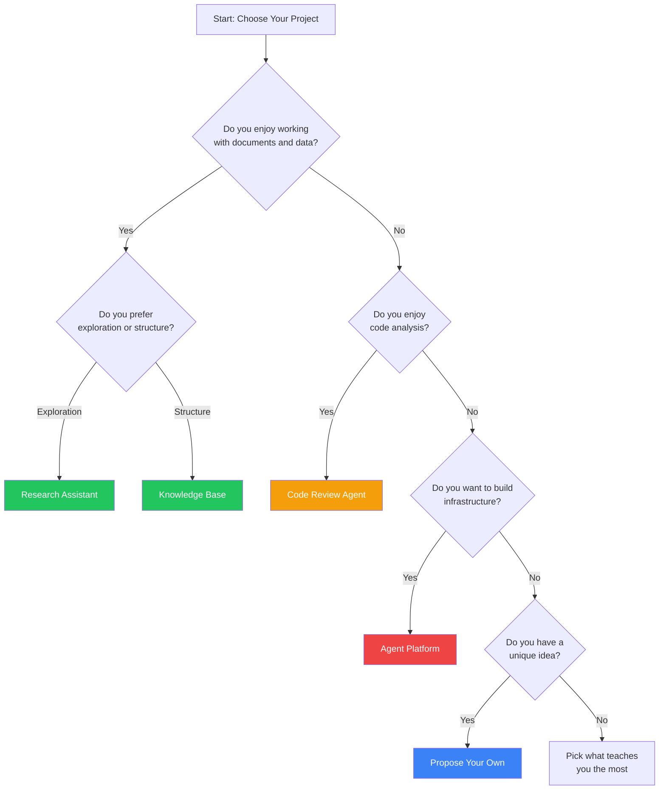
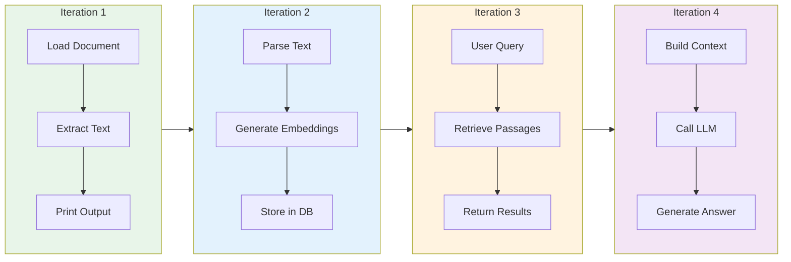
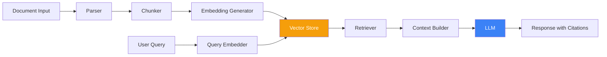

import Tip from "@components/mdx/Tip.astro";
import Warning from "@components/mdx/Warning.astro";
import Info from "@components/mdx/Info.astro";
import Definition from "@components/mdx/Definition.astro";
import Quiz from "@components/react/Quiz";
import HandsOnExercise from "@components/react/HandsOnExercise";

The capstone project is the culminating experience of the Developer of Tomorrow course. It is your opportunity to demonstrate everything you have learned by building a substantial, production-quality AI application.

This is not a tutorial to follow. This is not a toy example. This is a real project that solves a real problem, built to a professional standard.

## Why This Matters

Throughout this course, you have learned concepts: how transformers work, how to prompt effectively, how agents reason, how to build safely. Concepts matter, but what separates knowledge from mastery is application.

The capstone forces you to make trade-offs because you cannot implement everything perfectly and must decide what matters most. You must handle ambiguity because real problems are not well-specified and you must define success criteria yourself. You will debug complexity when your agent fails on the 37th step and must diagnose why. You must ship something because a perfect design that never ships is worthless while a working system with rough edges is valuable.

This is as close as a course can get to real-world software engineering with AI.

<Definition term="Capstone Project">
  A culminating project that synthesizes learning from an entire course into a
  substantial deliverable. In this course, the capstone is a complete AI
  application that demonstrates understanding of AI fundamentals, prompting,
  agents, safety, and production deployment.
</Definition>

## What You Will Build

You will build one of five pre-defined projects, or propose your own.

The Intelligent Research Assistant is a medium complexity project that focuses on RAG, embeddings, and citation tracking. You build a system that ingests documents from multiple sources, indexes them with embeddings, and answers questions with accurate citations.

The Code Review Agent is a high complexity project involving multi-file analysis, AST parsing, and synthesis. You build an agent that analyzes code for bugs, security issues, style violations, and performance problems while managing false positives.

The Personal Knowledge Base is a medium complexity project centered on incremental indexing and semantic search. You build a knowledge management system that ingests notes and documents, automatically tags and categorizes content, and helps discover connections.

The Custom Agent Platform is a high complexity project involving agent orchestration, sandboxing, and tracing. You build a platform where users define agents through configuration rather than code, including a tool library, agent runtime, and orchestration.

Your Own Proposal allows for self-directed learning and scope management at varying complexity. You propose a project demonstrating mastery of at least five course modules with meaningful AI integration and appropriate safety measures.

## Deliverables

You will submit four artifacts.

A Working Application consisting of a functional codebase with source code, tests, and dependencies that demonstrates your project's core value proposition.

An Architecture Document providing a detailed explanation of your system design, decisions, and trade-offs that helps others understand your technical approach.

A Demo Video of 5-10 minutes walking through setup, features, and technical highlights that showcases your project in action.

A Reflection Essay of 500-1000 words reflecting on what you learned, challenges faced, and next steps that demonstrates growth mindset and self-awareness.

## Evaluation Approach

Your project will be evaluated on Technical Implementation at 40% assessing whether it works, code cleanliness, and edge case handling. Documentation counts for 25% evaluating whether someone else can understand and use your project. Safety and Responsibility comprise 15% examining whether you addressed risks appropriately. Demo and Communication account for 20% assessing whether you can explain your work clearly.

Note that "perfect" is not the goal. "Production-ready for a V1" is the goal. You will have rough edges. What matters is that you demonstrate understanding, make reasonable decisions, and ship something that works.

<Info>
  The estimated time is 4-8 hours, self-paced. The recommended approach involves
  multiple sessions rather than one marathon. Checkpoints include Planning at 1
  hour, Implementation at 2-5 hours, and Documentation at 1-2 hours. Start early
  because you will encounter unexpected challenges. That is part of the
  learning.
</Info>

## Planning Phase

The temptation is to start coding immediately. Resist this urge.

Poor planning leads to scope creep where the project grows beyond what is achievable, architectural dead-ends where you realize your approach does not work after implementing it, missing critical features where you forget about error handling until the end, and wasted time rewriting components multiple times.

Good planning leads to clear scope where you know what is in and what is out, solid foundation where your architecture supports what you need, predictable progress where you know what to build next, and fewer surprises because you have thought through challenges upfront.

Spend 20 minutes planning now to save 2 hours later.

### Step 1: Define Success Criteria

What does "done" look like for your project? Be specific.

For a Research Assistant, done means being able to ingest at least 3 different document formats like PDF, Markdown, and plain text. It means storing documents in a vector database with metadata. It means answering questions with 3-5 relevant passages retrieved and including citations to source documents in responses. It means handling errors gracefully including missing files and API failures. It means having a README with setup instructions and including 5 test cases demonstrating core functionality.

### Step 2: Architecture Decisions

Sketch your system architecture before coding. Identify the major components and their connections. Determine what technologies you will use for language, LLM, vector database, framework, and deployment, along with why you chose each. Understand what data flows through your system from input through processing, storage, retrieval, generation, and output. Document your constraints including budget for API costs, available time, and deployment complexity requirements.

### Step 3: Scope Management

Decide what is in scope as must-have features, what is out of scope and explicitly not included, and what are stretch goals if time permits.

In Scope should include core functionality demonstrating the project concept, error handling for common failure cases, basic tests for critical paths, and clear documentation of setup and usage.

Out of Scope should include advanced features not core to the concept, perfect UI/UX since command line is acceptable, deployment to production infrastructure, and extensive test coverage beyond critical paths.

Stretch Goals might include nice-to-have features enhancing the project, additional tests or documentation, and performance optimizations.

### Step 4: Milestones and Checkpoints

Break your project into milestones with time estimates. For a Research Assistant, milestones might include basic document ingestion at 1 hour done when you can load and parse a PDF, embedding pipeline at 1 hour done when documents are stored in the vector database, query and retrieval at 1.5 hours done when you can retrieve relevant passages, answer generation at 1 hour done when the system generates answers with citations, error handling at 30 minutes done when common errors are handled gracefully, testing at 45 minutes done when 5 tests pass, documentation at 1 hour done when the README is complete, demo video at 45 minutes done when recorded and uploaded, and reflection essay at 30 minutes done when written.

### Step 5: Risk Assessment

Identify what could go wrong and plan mitigations upfront.

Common risks include API costs exceeding budget with mitigation using smaller models for development, vector database setup being more complex than expected with backup plan using Chroma locally, retrieval quality being poor with mitigation testing early and adjusting chunking, time running short with mitigation cutting stretch goals to focus on core, and unfamiliar technology slowing progress with mitigation timeboxing learning and switching if stuck.

<Tip>
  Before proceeding to implementation, verify you have clear success criteria,
  sketched architecture, defined scope, milestones with time estimates,
  identified and mitigated risks, and allocated 4-8 hours total including
  documentation. If you cannot check all boxes, spend more time planning.
</Tip>

## Implementation Strategy

You are building a project that integrates multiple components, uses external APIs, and must handle errors. The wrong approach leads to frustration. The right approach leads to steady progress.

### Start Small, Iterate

The wrong approach builds the entire system then tests it all at once. The right approach builds the smallest possible end-to-end flow, verifies it works, then adds features incrementally.

For a Research Assistant, the progression might be loading one PDF and extracting text, then generating embeddings and storing in vector database, then querying and retrieving passages, then sending retrieved passages to LLM for answers, then adding citation tracking, then adding error handling, then supporting multiple document formats, then adding tests and documentation.

Each iteration produces something that works. If you run out of time, you have a partial but functional project.

### Vertical Slices Over Horizontal Layers

The wrong approach builds all the infrastructure first then adds functionality. The right approach builds one complete feature end-to-end then adds the next.

Do not build a complete ingestion pipeline for all document types before testing retrieval. Build ingestion for one type, add retrieval, test it end-to-end, then add more document types.

### The 80/20 Rule

80% of the value comes from 20% of the features. Focus on that 20%.

For most projects, the core value is accurate retrieval and citation for Research Assistant, finding real issues with low false positives for Code Review Agent, semantic search that finds connections for Knowledge Base, and safe agent execution with configuration for Agent Platform.

Polish and nice-to-haves are secondary. If you achieve the core value proposition, your project succeeds. If you build 10 features but none work well, your project fails.

### Development Best Practices

Use Git from the start and commit frequently with clear messages. This provides backup if you break something, lets you experiment safely on branches, and shows your development process in the final submission.

Use virtual environments or containers to isolate dependencies and document your environment setup clearly in the README.

Never commit API keys. Use environment variables loaded from a .env file and include a .env.example file showing required variables without actual keys.

Manage API costs by using smaller models during development, caching results when possible, limiting iterations and tokens, and tracking spending with API dashboards. Budget $5-10 for the project. If you exceed that, you are likely inefficient or have a scope problem.

<Warning>
  AI systems fail in many ways. Handle errors gracefully including API rate
  limits and timeouts, network failures, malformed input, missing files or
  resources, vector database connection issues, and out-of-memory errors with
  large documents.
</Warning>

### Common Pitfalls and How to Avoid Them

Over-engineering is a common pitfall where you try to build a perfect, scalable, production-ready system. Avoid it by using simple solutions like flat files instead of databases where appropriate and hardcoded configurations instead of complex systems.

Ignoring testing until the end means debugging a complex system all at once. Avoid it by testing each component as you build it and writing a few tests early to verify core functionality.

Poor prompt engineering leads to spending hours debugging code when the real issue is a poorly constructed prompt. Avoid it by testing prompts in isolation first, using structured output formats, and including clear instructions and examples.

Inadequate documentation leads to gaps and inaccuracies when written after building. Avoid it by documenting as you build, updating the README with each milestone, and capturing architectural decisions when you make them.

Perfectionism involves trying to make everything perfect before moving forward. Avoid it by shipping something that works even if it is rough. You can always iterate. A complete project with rough edges beats a perfect project that is 70% done.

### Getting Unstuck

You will get stuck. Here is how to get unstuck.

If a component is not working, reduce it to the simplest possible test case. Verify each assumption about files, API keys, and configurations. Add logging to see what is actually happening. Check documentation and examples for the library you are using. If stuck for more than 30 minutes, try a different approach.

If the scope feels overwhelming, cut features to the absolute minimum that demonstrates the concept. Simplify the architecture by questioning whether you really need each component. Focus on one milestone at a time without thinking about the whole project.

If you are running out of time, prioritize ruthlessly for what absolutely must work. Cut stretch goals immediately. Simplify documentation and demo since clear but brief is fine. Submit what you have since partial credit is better than no credit.

## Documentation and Demo

Your project may work perfectly, but if no one else can understand or use it, you have not succeeded. Documentation is not an afterthought; it is part of the deliverable.

Good documentation allows someone else to run your project without asking questions, explains your architectural decisions and trade-offs, demonstrates your technical communication skills, and serves as reference for your future self.

### The README

Your README is the entry point to your project. It should answer five questions in order.

What is this? One paragraph describing what your project does and who it is for.

How do I run it? Step-by-step setup and usage instructions assuming basic technical knowledge but unfamiliarity with your project.

What does it do? Feature list or examples showing the main capabilities.

What are its limitations? Honest assessment of what does not work or is not supported.

What could be improved? Demonstration that you are thinking about next steps.

### The Architecture Document

Your architecture document should include a system overview with high-level description of the system and its components. Include a component diagram providing visual representation of your system. Document key design decisions explaining the choices you made and why. Describe data flow explaining how data moves through your system. Detail AI integration explaining how you use AI including models, prompts, and strategies. Describe safety measures explaining how you handle risks.

### The Demo Video

Your demo video is a 5-10 minute walkthrough showing your project in action.

Structure it with an Introduction of 30 seconds covering what the project is and what problem it solves. Setup of 1-2 minutes shows installation and configuration without narrating every command but demonstrating that it is straightforward. Core Features of 3-5 minutes demonstrates main functionality with real inputs and outputs while explaining what happens at each step. Technical Highlights of 1-2 minutes shows an interesting part of the code, explains a non-obvious decision, and demonstrates error handling or a challenging feature. Limitations and Future Work of 1 minute honestly acknowledges what does not work perfectly and shows you are thinking about improvements.

Recording tips include using screen recording software like OBS, QuickTime, or Loom. Record audio narration as you go. Show terminal output clearly with large font and high contrast. Edit out long pauses or mistakes but rough is fine. Upload to YouTube as unlisted or another host.

### The Reflection Essay

Your reflection essay of 500-1000 words is a structured self-assessment.

Address what you learned including new technical skills like RAG, agent architecture, and vector databases, conceptual insights about when to use what approach and trade-offs, and process lessons about how you debug, plan, or manage scope.

Address what challenges you faced including technical challenges like retrieval quality and error handling, conceptual challenges like understanding how agents work, and process challenges like scope creep and time management. Explain how you overcame them.

Address what you would do differently with hindsight including different architecture, technology choices, or approach. Note what you over-engineered and under-engineered.

Address your next steps including how you will continue learning about AI, what you would build next, and how you will apply this in your work.

<Quiz
  client:visible
  quizId="module-20-knowledge-check"
  moduleSlug="capstone-project"
  questions={[
    {
      id: "q1",
      type: "multiple-choice",
      question:
        "What is the primary purpose of the capstone project in this course?",
      options: [
        {
          id: "a",
          text: "To learn new AI concepts that were not covered in earlier modules",
        },
        {
          id: "b",
          text: "To synthesize all course learning into a complete, working AI application",
        },
        { id: "c", text: "To build the most complex possible AI system" },
        { id: "d", text: "To compare different AI frameworks" },
      ],
      correctAnswer: "b",
      explanation:
        "The capstone project is designed to synthesize all learning from the course into a substantial, production-quality AI application. It is not about learning new concepts or maximizing complexity, but about demonstrating mastery by applying what you have learned to build something real.",
    },
    {
      id: "q2",
      type: "multiple-choice",
      question:
        "Why is planning important before starting capstone implementation?",
      options: [
        {
          id: "a",
          text: "To satisfy a course requirement for a planning document",
        },
        {
          id: "b",
          text: "To avoid scope creep, architectural dead-ends, and missing critical features",
        },
        {
          id: "c",
          text: "To maximize the number of features in the final project",
        },
        {
          id: "d",
          text: "To ensure the project takes the full allocated time",
        },
      ],
      correctAnswer: "b",
      explanation:
        "Planning prevents common problems like scope creep where the project grows beyond what is achievable, architectural dead-ends where you realize your approach does not work after implementing it, and missing critical features. Good planning provides clear scope, solid foundation, predictable progress, and fewer surprises.",
    },
    {
      id: "q3",
      type: "multiple-choice",
      question:
        "What does 'vertical slices over horizontal layers' mean in implementation strategy?",
      options: [
        { id: "a", text: "Build all infrastructure first, then add features" },
        { id: "b", text: "Focus on visual presentation before functionality" },
        {
          id: "c",
          text: "Build one complete feature end-to-end before starting the next",
        },
        { id: "d", text: "Layer your code with clear separation of concerns" },
      ],
      correctAnswer: "c",
      explanation:
        "Vertical slices mean building one complete feature from input to output before starting the next feature. This approach lets you test end-to-end functionality early and ensures you always have something working. The alternative, building all infrastructure first (horizontal layers), risks having nothing complete if time runs out.",
    },
    {
      id: "q4",
      type: "multiple-choice",
      question:
        "What should you do if you have been stuck on a technical problem for more than 30 minutes?",
      options: [
        { id: "a", text: "Keep trying the same approach until it works" },
        { id: "b", text: "Skip that feature entirely and move on" },
        { id: "c", text: "Try a different, simpler approach" },
        { id: "d", text: "Start the entire project over" },
      ],
      correctAnswer: "c",
      explanation:
        "If stuck for more than 30 minutes on one approach, the approach might be wrong. Try something simpler. The goal is to demonstrate understanding, not to solve every problem in the most elegant way. Simpler solutions that work are better than elegant solutions that do not.",
    },
    {
      id: "q5",
      type: "multiple-choice",
      question:
        "In the evaluation rubric, what percentage does 'Safety and Responsibility' account for?",
      options: [
        { id: "a", text: "10%" },
        { id: "b", text: "15%" },
        { id: "c", text: "20%" },
        { id: "d", text: "25%" },
      ],
      correctAnswer: "b",
      explanation:
        "Safety and Responsibility accounts for 15% of the evaluation, covering safety measures, input validation, and appropriate disclosure. While not the largest component, it is explicitly evaluated to ensure you have addressed risks appropriately in your AI application.",
    },
  ]}
  passingScore={70}
  allowRetry={true}
/>

<HandsOnExercise
  client:visible
  moduleSlug="capstone-project"
  exerciseId="capstone-execution"
  title="Capstone Project Execution"
  objective="Build a complete, production-quality AI application that demonstrates your mastery of concepts from throughout the course and delivers real value."
  totalTime="4-8 hours"
  setupInstructions={[
    "Review the five project options (Research Assistant, Code Review Agent, Knowledge Base, Agent Platform, or propose your own)",
    "Set up a Git repository for version control from the start",
    "Create a virtual environment for Python dependencies (or equivalent for your language)",
    "Configure environment variables for API keys using a .env file (never commit keys)",
    "Set aside uninterrupted blocks of time - this works better across multiple sessions than one marathon",
  ]}
  parts={[
    {
      id: "planning-phase",
      title: "Planning Phase (Don't Skip This!)",
      duration: "60 min",
      instructions: [
        "Choose your project based on what interests you and what you'll learn most from",
        "Define clear success criteria: what does 'done' look like? Be specific about must-have features",
        "Sketch system architecture: major components, data flow, technologies you'll use",
        "Set scope explicitly: what's IN (must-have), what's OUT (explicitly excluded), what's STRETCH (if time permits)",
        "Create milestones with time estimates, breaking the project into 4-6 checkpoints",
        "Identify risks and plan mitigations: API costs, unfamiliar tech, time constraints",
      ],
      observePrompt:
        "Does your scope feel achievable in 4-8 hours? If you're not sure what 'done' looks like, spend more time here.",
    },
    {
      id: "first-iteration",
      title: "Build Smallest End-to-End Flow",
      duration: "60-90 min",
      instructions: [
        "Implement the absolute minimum that demonstrates your core concept working",
        "For Research Assistant: load one document, embed it, query it, get a response with citation",
        "For Code Review: analyze one file for one issue type and return structured feedback",
        "Verify this minimal flow works before adding features",
        "Commit your working code",
      ],
      observePrompt:
        "Does this minimal version prove the concept works? If not, troubleshoot before continuing.",
    },
    {
      id: "iterate-and-expand",
      title: "Add Features Iteratively",
      duration: "120-180 min",
      instructions: [
        "Add one feature at a time, testing after each addition",
        "Prioritize features by value: what adds the most to your core concept?",
        "Handle errors gracefully: API failures, rate limits, invalid inputs, network issues",
        "Add at least 5 test cases for critical functionality",
        "Commit after each working feature addition",
      ],
      observePrompt:
        "Are you adding features that matter or features that seem cool? Focus on the 20% that delivers 80% of value.",
    },
    {
      id: "documentation",
      title: "Document Your Work",
      duration: "60-90 min",
      instructions: [
        "Write a clear README: what is this, how to run it, what it does, what it doesn't do",
        "Create architecture document: system overview, component diagram, key design decisions, AI integration details",
        "Include a .env.example file showing required environment variables (without actual keys)",
        "Document known limitations honestly",
      ],
      observePrompt:
        "Could someone else run your project from your README without asking you questions?",
    },
    {
      id: "demo-and-reflection",
      title: "Demo Video and Reflection",
      duration: "45-60 min",
      instructions: [
        "Record a 5-10 minute demo video: intro (30s), setup demo (1-2 min), core features (3-5 min), technical highlights (1-2 min), limitations (1 min)",
        "Write 500-1000 word reflection: what you learned (technical and process), challenges you faced and how you overcame them, what you'd do differently, next steps",
        "Review your checklist: all tests pass, no API keys committed, documentation complete",
      ],
      observePrompt:
        "What surprised you most during this project? What will you do differently in your next AI project?",
    },
  ]}
  successCriteria={[
    {
      id: "working-application",
      text: "Built a functional application that demonstrates your project's core value proposition",
    },
    {
      id: "proper-architecture",
      text: "Made sound architectural decisions and can explain your trade-offs",
    },
    {
      id: "error-handling",
      text: "Handled common failure modes gracefully with appropriate error messages",
    },
    {
      id: "testing",
      text: "Wrote tests covering critical functionality with at least 5 test cases",
    },
    {
      id: "documentation",
      text: "Created clear documentation that enables others to understand and run your project",
    },
    {
      id: "demo-quality",
      text: "Produced a demo video that effectively showcases your work",
    },
    {
      id: "reflection-depth",
      text: "Wrote a thoughtful reflection demonstrating learning and growth mindset",
    },
    {
      id: "professional-quality",
      text: "Delivered production-ready V1 quality: works reliably, handles errors, is maintainable",
    },
  ]}
/>

## Submission

Your complete submission should include a code repository on GitHub or similar with source code, tests, dependencies, README, architecture documentation, .env.example, and LICENSE. Include a demo video uploaded to YouTube as unlisted or Vimeo with link in README. Include a reflection essay as PDF or Markdown in docs/reflection.md or as a separate submission.

Before submitting, verify that code is committed to a Git repository, repository is public or shared with instructors, README is complete and clear, architecture document is included, demo video is recorded and linked, reflection essay is written, all tests pass, and no API keys or secrets are in the repository.

## What Comes After

Congratulations! You have completed a substantial AI project. Here is what to do next.

Share your work by writing a blog post about what you built, sharing on LinkedIn, Twitter, or dev.to, adding to your portfolio, and using it in job interviews as a talking point.

Continue building by adding features you cut for scope, improving performance or quality, deploying for real use, and open sourcing to invite contributions.

Apply your learning by identifying problems AI can solve, building prototypes and MVPs, advocating for AI adoption responsibly, and teaching others what you know.

Keep learning as AI evolves rapidly by following research through papers and conferences, experimenting with new models and techniques, joining communities on Discord and forums, and building more projects.

## Summary

The capstone project is the transition from learning about AI to building with AI. It requires synthesizing everything you have learned into a complete, working application.

Success comes from good planning that prevents scope creep and architectural dead-ends, from iterative development that builds vertical slices with testable progress, from focusing on core value through the 80/20 rule rather than feature quantity, from professional documentation that allows others to understand and use your work, and from honest reflection that demonstrates growth mindset.

The goal is not perfection. The goal is to demonstrate that you can take a problem and build a working solution, make reasonable technical decisions, handle errors and edge cases, document your work professionally, and reflect on your learning.

When you finish this capstone, you will have built a complete AI application from scratch, made architectural decisions and trade-offs, debugged complex systems, documented your work professionally, and demonstrated mastery of multiple course concepts.

Now go build something great.

## References

**Course Modules Referenced**

This capstone synthesizes learning from across the entire course including **Module 10** (Tokens, Embeddings, and Internals) for embedding generation and retrieval, **Module 13** (Safe and Responsible AI Use) for safety measures and disclosures, **Module 14** (Prompt Engineering Mastery) for effective prompts, **Module 15** (AI Agents Architecture) for agent design patterns, **Module 16** (Tool Use and Function Calling) for tool integration, **Module 17** (Multi-Agent Orchestration) for coordination, and **Module 19** (Real-World Workflow Integration) for production patterns.

**External Resources**

**Pinecone Learning Center** - RAG concepts.
[pinecone.io/learn](https://www.pinecone.io/learn/)

**LangChain RAG Documentation** - RAG implementation.
[python.langchain.com/docs](https://python.langchain.com/docs)

**Chroma Documentation** - Vector database setup.
[docs.trychroma.com](https://docs.trychroma.com)

**LangGraph Documentation** - Agent frameworks.
[langchain-ai.github.io/langgraph](https://langchain-ai.github.io/langgraph/)

**Tree-sitter Documentation** - Code analysis.
[tree-sitter.github.io](https://tree-sitter.github.io/)

**The Twelve-Factor App** - Production best practices.
[12factor.net](https://12factor.net/)

**Community and Support**

**Community Discussion:**
- [r/MachineLearning](https://www.reddit.com/r/MachineLearning/)
- LangChain Discord
- Anthropic Discord

**Sharing Platforms:**
- [Dev.to](https://dev.to/)
- [Hacker News](https://news.ycombinator.com/)
- LinkedIn
- Twitter
