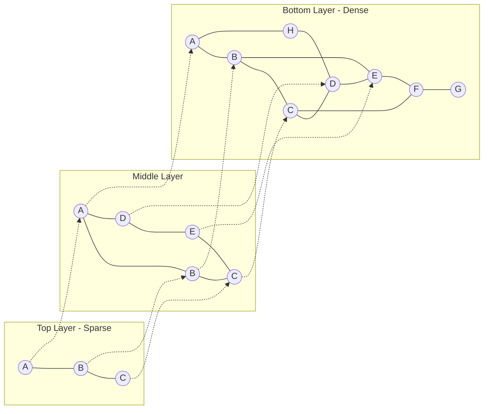
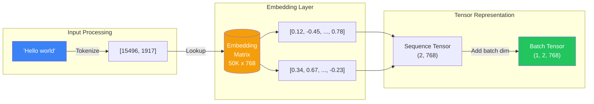
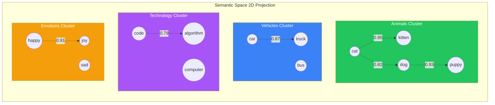
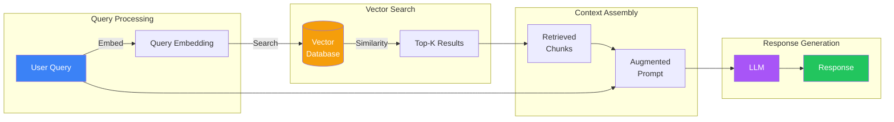
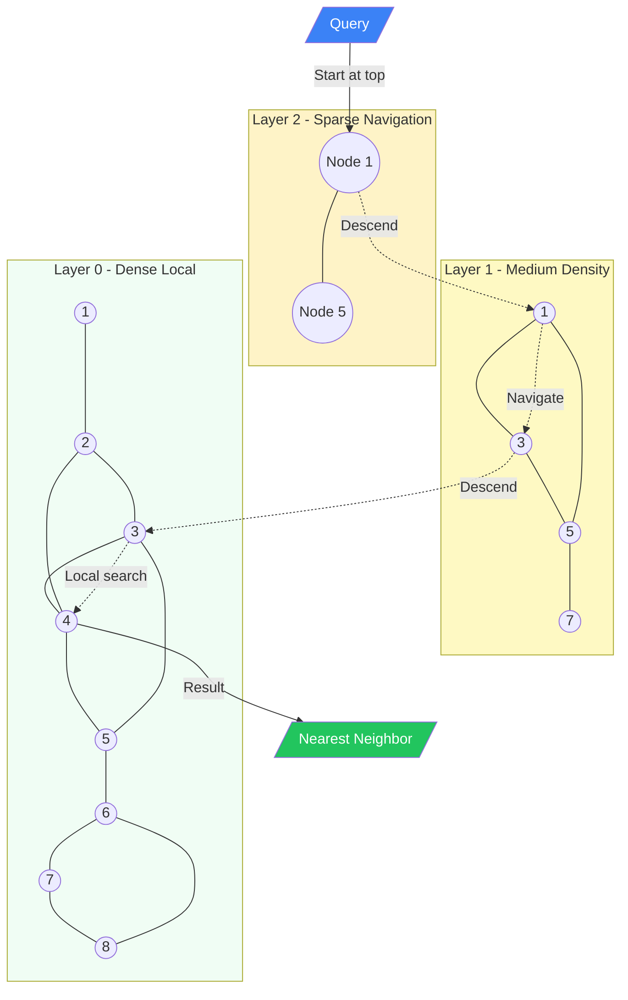
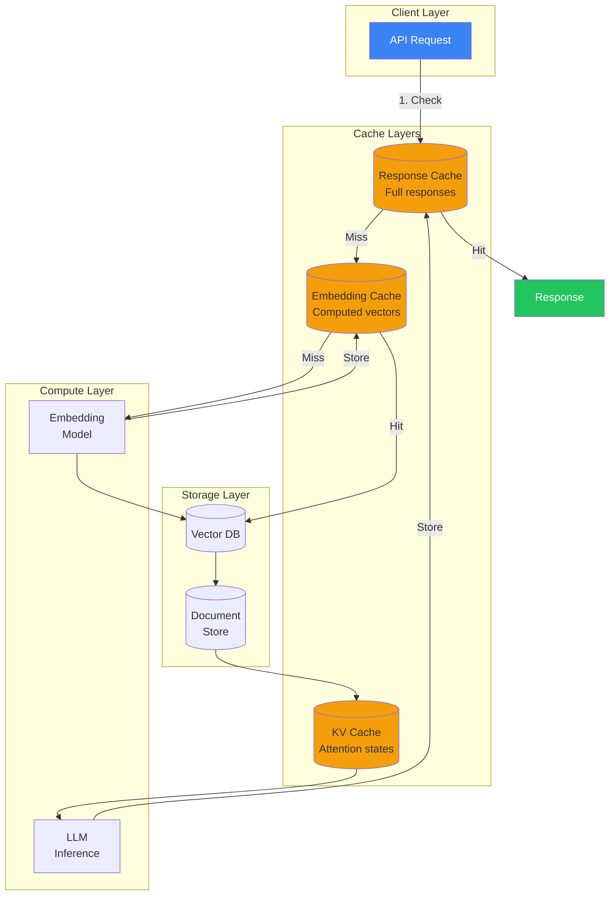

import Tip from "@components/mdx/Tip.astro";
import Warning from "@components/mdx/Warning.astro";
import Info from "@components/mdx/Info.astro";
import Definition from "@components/mdx/Definition.astro";
import Quiz from "@components/react/Quiz";
import HandsOnExercise from "@components/react/HandsOnExercise";

## Section 1: Why Data Structures Matter in AI

Picture this: you're building a chatbot for customer support. A user asks, "How do I reset my password?" Your bot needs to find relevant information from thousands of help articles. Simple enough, right? Just search for "reset password" in your database.

But then another user asks, "I can't log in anymore." Same intent, completely different words. Your traditional keyword search returns nothing useful, while your frustrated user abandons the chat.

This is the moment that changed everything in AI development. The realization that meaning matters more than exact matches. That "reset password" and "can't log in" belong together, even though they share no words in common.

Welcome to data structures for the AI era.

### The Old World Meets the New

You already know data structures matter. Arrays, hash tables, trees, graphs - they're the building blocks you've used for years. Choose the wrong one and your O(1) lookup becomes O(n). Your snappy API turns sluggish. Your elegant code becomes a maintenance nightmare.

Here's what hasn't changed: these fundamental structures still power AI systems. When Claude processes your message, it relies on arrays to hold token sequences. Hash tables map words to numerical IDs. Trees organize vocabulary efficiently. The computer science you already know applies directly.

What has changed is the addition of an entirely new category of data structures designed for a specific problem: finding things by meaning rather than by exact match.

Traditional data structures organize discrete items. You access them through precise operations: give me the user with this exact ID, find all records in this date range, traverse these relationships in order. The key insight is exactness. You know what you want, and the data structure helps you get it fast.

AI-era data structures organize meaning. You access them through similarity: find me things like this, show me concepts related to that, give me the nearest semantic neighbors. The key insight is approximation. You describe what you want, and the data structure finds things that are close enough.

### From Exact Matches to Semantic Similarity

Consider how you'd traditionally search a database of customer support articles:

```python
# Traditional: exact keyword search
results = db.query("SELECT * FROM articles WHERE content LIKE '%reset password%'")
```

This works when users type exactly what you expect. It fails spectacularly when they don't. "Can't log in," "forgot my credentials," "locked out of account" - all expressing the same need, all invisible to your keyword search.

Now consider the AI approach:

```python
# AI-era: semantic search
query_embedding = get_embedding("I can't log in anymore")
results = vector_db.search(query_embedding, top_k=5)
# Returns: password reset, login troubleshooting, account recovery...
```

The same query now finds relevant articles regardless of specific wording. It understands that login problems relate to passwords, that "locked out" is similar to "can't access." This isn't magic - it's a new data structure called a vector embedding, and understanding how it works is essential for modern AI development.

### What You'll Learn

This module bridges traditional computer science and modern AI by exploring how classic data structures appear in AI systems, what makes AI workloads different from traditional software, how embeddings revolutionize the way we represent and search information, and when to use each type of structure in your own applications.

By the end, you'll understand not just what a vector database is, but why it exists - and why your existing database knowledge is a foundation to build upon, not something to discard.

---

## Section 2: Arrays, Lists, and Sequences in AI

If there's one data structure that dominates AI systems, it's the humble array. Not because AI researchers love simplicity (though some do), but because sequences turn out to be the universal language of machine learning.

Think about what an AI model actually processes. Text? That's a sequence of tokens. Images? A sequence of pixels (or pixel patches). Audio? A sequence of samples. Video? Sequences of sequences. Even structured data like database records becomes sequences when fed to a model.

This isn't a coincidence. Transformers - the architecture behind GPT, Claude, and most modern AI - are explicitly designed to process sequences. They take in ordered lists of items and produce ordered lists of outputs. Everything else is just transformation to and from this fundamental format.

### Tokens: Where It All Begins

When you send a message to an AI model, the first thing that happens is tokenization. Your text gets chopped into pieces called tokens, which might be words, parts of words, or even individual characters.

```python
text = "Hello, AI world!"
tokens = tokenizer.encode(text)
# Result: [15496, 11, 9552, 1917, 0]
```

That innocent string became an array of integers. Each number is an index into the model's vocabulary - a lookup table mapping numbers to text pieces. The token 15496 might represent "Hello", 11 is the comma, and so on.

Why integers instead of words? Because neural networks only understand numbers. Everything in AI eventually becomes numerical operations on arrays. Text is no exception.

### From Tokens to Tensors

Here's where it gets interesting. Those token IDs don't just stay as a flat list. Each one gets transformed into a much richer representation called an embedding - an array of floating-point numbers that captures the meaning of that token.

```python
# Token 15496 ("Hello") becomes a 768-dimensional vector
hello_embedding = [0.123, -0.456, 0.789, ..., 0.234]  # 768 numbers
```

A single token becomes 768 numbers. If your input has 100 tokens, you now have 100 arrays of 768 numbers each. In mathematical terms, that's a 2D tensor with shape (100, 768).

Process multiple inputs at once (called batching), and you get 3D tensors. Process images with multiple color channels, and you're in 4D territory. The dimensions keep multiplying:

```python
# Text input shapes (typical)
single_token    = (768,)         # One embedding
one_sentence    = (100, 768)     # 100 tokens, each with 768 dimensions
batch_of_texts  = (32, 100, 768) # 32 sentences in a batch
```

<Definition term="Tensor">
  A tensor is a multi-dimensional array. A 1D tensor is a vector, 2D is a
  matrix, and higher dimensions are just... more arrays of arrays. The "shape"
  tells you how many dimensions and how big each one is.
</Definition>

### Why Shape Matters So Much

If you spend any time debugging AI code, you'll learn to ask one question reflexively: "What's the shape of this tensor?"

Shape mismatches are the number one source of errors in AI development. The model expects (batch_size, sequence_length, embedding_dim) and you give it (sequence_length, embedding_dim) - missing the batch dimension. Error. You pass embeddings with 768 dimensions to a model trained with 384. Error.

```python
# Common shape errors
expected: (1, 100, 768)   # batch=1, tokens=100, dims=768
actual:   (100, 768)      # forgot the batch dimension

expected: (32, 768)       # expecting specific embedding size
actual:   (32, 384)       # wrong model or wrong configuration
```

Get comfortable thinking in shapes. It's the AI equivalent of type checking - except the types are multi-dimensional arrays and the errors are often cryptic.

### The Sequence Processing Pattern

Once text becomes a sequence of embedding vectors, the transformer model processes it through multiple layers. Each layer transforms the sequence, adding contextual information. The word "bank" starts with the same embedding whether it means riverbank or financial institution, but after processing, the context makes its meaning clear.

```python
# Simplified: what happens inside a transformer
input_sequence = tokenize_and_embed("The cat sat on the mat")
# Shape: (1, 6, 768) - batch=1, tokens=6, dims=768

for layer in transformer_layers:
    input_sequence = layer(input_sequence)
    # Shape stays (1, 6, 768) - each layer transforms but preserves shape

output_sequence = input_sequence
# Final shape: (1, 6, 768) - same shape, but values are transformed
```

This pattern - sequence in, sequence out - is the heartbeat of modern AI. Understanding it helps you reason about context windows (how many tokens can fit), batch sizes (how many sequences at once), and memory usage (sequence_length x embedding_dim x bytes_per_number).

---

## Section 3: The Embeddings Revolution

Here's the moment that changed AI forever.

In 2013, researchers at Google published a paper with an unassuming title: "Efficient Estimation of Word Representations in Vector Space." What it demonstrated was extraordinary: if you train a simple neural network to predict words from their context, the internal representations it learns capture meaning in a way that allows mathematical operations on language.

The famous example: take the vector for "king," subtract the vector for "man," add the vector for "woman," and you get a vector very close to "queen."

King - Man + Woman = Queen

This wasn't programmed. It emerged from the structure of language itself. The relationship between king and queen mirrors the relationship between man and woman, and the neural network discovered this pattern by reading millions of sentences.

### The Problem Before Embeddings

To understand why this matters, consider how computers represented words before embeddings.

The simplest approach was one-hot encoding. If your vocabulary has 50,000 words, each word becomes a vector with 50,000 positions, where exactly one position is 1 and the rest are 0:

```python
# One-hot encoding: sparse, no similarity
"cat"  = [0, 0, ..., 1, ..., 0, 0]  # 50,000 dimensions, one 1
"dog"  = [0, 0, ..., 1, ..., 0, 0]  # different position

# Distance between any two words is the same!
distance("cat", "dog") == distance("cat", "democracy")
```

This representation has no notion of similarity. "Cat" and "dog" are just as different as "cat" and "democracy." Every word is equally far from every other word.

Embeddings solved this by learning a dense representation where similar words have similar vectors:

```python
# Embedding: dense, captures similarity
"cat"  = [0.82, 0.91, 0.12, ..., 0.45]  # 768 dimensions, all meaningful
"dog"  = [0.79, 0.88, 0.15, ..., 0.42]  # similar values!

# Now similarity reflects meaning
distance("cat", "dog") < distance("cat", "democracy")
```

Instead of 50,000 sparse dimensions, you get 768 dense dimensions that pack semantic information into every value.

### What Do Those Numbers Mean?

Here's where intuition gets tricky. Each of those 768 dimensions doesn't have a simple interpretation like "animatedness" or "size." The meanings are entangled and distributed.

Think of it like GPS coordinates. A position like (47.6062, -122.3321) doesn't have intuitive meaning in its individual numbers, but the combination precisely identifies a location (Seattle). Move northeast and both numbers change in a coordinated way.

Embeddings work similarly. The individual dimensions don't mean much, but the pattern across all 768 dimensions encodes semantic information. Words that are used in similar contexts end up with similar patterns.

<Info title="High-Dimensional Space Intuition">
  You can't visualize 768 dimensions, but here's a useful mental model: imagine
  a vast space where every concept has a location. Similar concepts cluster
  together - animals in one region, vehicles in another, emotions in a third.
  The embedding is just the coordinates in this semantic space.
</Info>

### How Embeddings Are Created

Embeddings aren't designed by hand - they're learned from data. The process varies by model, but the core idea is consistent: train a neural network on a task that requires understanding language, and the internal representations it develops will capture meaning.

The original Word2Vec approach was beautifully simple: predict a word from its neighbors, or predict neighbors from a word. To succeed at this task, the model must learn that "cat" often appears near "pet" and "fur" and "meow," while "democracy" appears near "government" and "vote."

Modern transformers like BERT and GPT use more sophisticated training objectives, but the principle remains. By learning to predict text, models develop internal representations that encode semantic relationships.

```python
# Getting embeddings from a modern model
from sentence_transformers import SentenceTransformer

model = SentenceTransformer('all-MiniLM-L6-v2')
embedding = model.encode("The quick brown fox")
# Returns: array of shape (384,) - 384-dimensional dense vector
```

For practical use, you don't train embedding models from scratch. Pre-trained models like Sentence-Transformers, OpenAI's text-embedding-ada-002, or Anthropic's embedding API do the heavy lifting. You just call them and get vectors back.

### Why This Changed Everything

The embedding revolution made three things possible that weren't before.

First, semantic search. Before embeddings, search meant matching keywords. After embeddings, search means finding meaning. A query for "affordable apartments" can find listings about "budget housing" or "cheap rentals" without those exact words appearing.

Second, language-agnostic operations. Embeddings can be trained on multiple languages simultaneously, creating a shared space where "dog" and "chien" and "perro" all land near each other. This enables cross-lingual search and translation.

Third, multimodal AI. Images can be embedded into the same space as text, enabling systems that understand both. Ask "show me photos of beaches at sunset" and the AI can find relevant images even if they weren't explicitly tagged with those words.

Every modern AI application - chatbots, search engines, recommendation systems, content moderation, document analysis - builds on embeddings. They're the fundamental representation that makes meaning computable.

---

## Section 4: Vector Similarity and Semantic Search

Now that you understand what embeddings are, the next question is: how do you use them? The answer is vector similarity - measuring how close two embeddings are in that high-dimensional semantic space.

### Measuring Similarity

Two embeddings are similar if they're close together. But "close" in 768 dimensions needs careful definition. There are two common approaches.

**Euclidean distance** measures straight-line distance between points, just like in regular geometry:

```python
import numpy as np

def euclidean_distance(a, b):
    return np.sqrt(np.sum((a - b) ** 2))

# Smaller distance = more similar
dist = euclidean_distance(embed("cat"), embed("kitten"))  # ~0.3
dist = euclidean_distance(embed("cat"), embed("democracy"))  # ~1.2
```

**Cosine similarity** measures the angle between vectors, ignoring their magnitude:

```python
def cosine_similarity(a, b):
    return np.dot(a, b) / (np.linalg.norm(a) * np.linalg.norm(b))

# Returns -1 to 1: higher = more similar
sim = cosine_similarity(embed("cat"), embed("kitten"))  # ~0.85
sim = cosine_similarity(embed("cat"), embed("democracy"))  # ~0.15
```

For text embeddings, cosine similarity is usually preferred. Why? Because it measures direction, not magnitude. Two documents about the same topic should be similar whether they're tweets or dissertations - their vectors point the same direction, even if one is "longer" because it has more content.

<Tip title="When to Use Which">
  Use cosine similarity for text and semantic search - you care about direction,
  not magnitude. Use Euclidean distance when magnitude matters, like comparing
  product feature vectors where larger values mean more of something.
</Tip>

### Building Semantic Search

With embeddings and similarity, you can build a semantic search system in surprisingly few lines:

```python
# Step 1: Embed your documents
documents = [
    "How to reset your password",
    "Troubleshooting login issues",
    "Account recovery options",
    "Billing and payment FAQ",
    "Contact customer support"
]

document_embeddings = model.encode(documents)

# Step 2: Embed the query
query = "I can't log into my account"
query_embedding = model.encode(query)

# Step 3: Find most similar documents
similarities = [cosine_similarity(query_embedding, doc_emb)
                for doc_emb in document_embeddings]

# Step 4: Rank by similarity
ranked = sorted(zip(documents, similarities),
                key=lambda x: x[1], reverse=True)

# Results:
# ("Troubleshooting login issues", 0.82)
# ("How to reset your password", 0.76)
# ("Account recovery options", 0.71)
# ...
```

The query "I can't log into my account" matches "Troubleshooting login issues" even though they share few words. That's the power of semantic search.

### The Chunking Challenge

Real-world semantic search has a problem: documents are too long. If you embed an entire 50-page PDF, the embedding captures some vague average of all the topics discussed. Searching for a specific detail returns the whole document, not the relevant paragraph.

The solution is chunking - splitting documents into smaller pieces before embedding:

```python
# Bad: one embedding for entire document
full_doc_embedding = model.encode(long_document)  # loses detail

# Better: chunk into paragraphs
chunks = split_into_paragraphs(long_document)
chunk_embeddings = [model.encode(chunk) for chunk in chunks]
```

Chunking strategies matter a lot. Chunk too small and you lose context - "it" and "they" become meaningless without their referents. Chunk too large and you're back to vague embeddings. Finding the right size is an empirical process that depends on your content and use case.

Common approaches include fixed-size chunks (500 tokens), semantic chunks (split at paragraph or section boundaries), and overlapping chunks (each chunk shares some content with its neighbors for context).

### From Search to RAG

Semantic search is the foundation of Retrieval-Augmented Generation (RAG) - the pattern that lets AI systems work with your specific data.

Instead of hoping the AI model memorized relevant facts during training (spoiler: it probably didn't), you search your documents and include relevant passages in the prompt:

```python
# RAG pattern (simplified)
def answer_question(user_query, document_store):
    # 1. Find relevant documents
    relevant_chunks = semantic_search(user_query, document_store, top_k=3)

    # 2. Build prompt with context
    context = "\n".join(relevant_chunks)
    prompt = f"""Based on the following information:

    {context}

    Answer this question: {user_query}"""

    # 3. Get AI response
    return ai_model.generate(prompt)
```

The AI doesn't need to have memorized your company's policies or your product documentation. You search for relevant information and hand it directly to the model. This is why semantic search isn't just nice to have - it's essential for building AI systems that work with private or current data.

---

## Section 5: Hash Tables, Caching, and KV Stores in AI

While embeddings and vector similarity get the spotlight, traditional data structures do the heavy lifting behind the scenes. Hash tables - giving you O(1) average-case lookups - remain essential even in the most sophisticated AI systems.

### The Token Vocabulary

When you send text to an AI model, the first operation is a hash table lookup. The tokenizer maintains a vocabulary mapping text pieces to integer IDs:

```python
# Inside a tokenizer
vocabulary = {
    "hello": 15496,
    "world": 1917,
    "the": 262,
    # ... 50,000+ entries
}

# Tokenization is just lookup
token_id = vocabulary["hello"]  # O(1)
```

This lookup happens for every token in every message. With millions of requests per day, that O(1) matters enormously. A hash table handles it instantly.

The reverse mapping - from IDs back to text - is equally important for generating responses:

```python
# Reverse vocabulary
id_to_token = {
    15496: "hello",
    1917: "world",
    262: "the",
    # ...
}

# Detokenization is also O(1) lookup
text = id_to_token[15496]  # "hello"
```

### The Embedding Matrix as Lookup

The embedding layer in a neural network is essentially a glorified lookup table. Given a token ID, retrieve its embedding vector:

```python
# Embedding matrix: shape (vocab_size, embedding_dim)
embedding_matrix = np.array([
    [0.123, -0.456, ..., 0.789],  # ID 0
    [0.234, -0.567, ..., 0.890],  # ID 1
    # ... 50,000 rows
])

# Lookup is just array indexing (O(1))
token_id = 15496
embedding = embedding_matrix[token_id]
```

This is why vocabulary sizes are fixed. The embedding matrix has a row for each possible token. You can't look up a token ID that doesn't exist in the matrix.

### Caching: Trading Memory for Speed

AI inference is expensive. Generating embeddings requires passing text through a neural network. API calls to embedding services cost money and add latency. The solution is caching.

```python
import hashlib

embedding_cache = {}

def get_embedding(text):
    # Create a cache key from the text
    cache_key = hashlib.md5(text.encode()).hexdigest()

    # Return cached embedding if available
    if cache_key in embedding_cache:
        return embedding_cache[cache_key]

    # Otherwise compute and cache
    embedding = model.encode(text)
    embedding_cache[cache_key] = embedding
    return embedding
```

For repeated queries, this transforms expensive computation into a cheap hash table lookup. In production systems, this cache might live in Redis or Memcached, shared across multiple servers.

<Warning title="Cache Invalidation">
  Caching embeddings is powerful but comes with the classic cache invalidation
  problem. If you update your embedding model, all cached vectors become stale.
  Version your caches or have a clear invalidation strategy.
</Warning>

### KV Caching in Transformers

Inside the transformer architecture itself, there's a critical optimization called KV caching. Understanding it helps you reason about AI performance characteristics.

When a transformer generates text, it doesn't process each token independently. It needs the representations of all previous tokens to generate the next one. Without caching, this means recomputing everything from scratch for each new token - O(n^2) work for n tokens.

KV caching stores intermediate computations (the "key" and "value" matrices from the attention mechanism) so they don't need recomputing. The first token still requires full computation, but subsequent tokens only compute their own contributions and look up cached results for previous tokens.

```python
# Without KV caching: recompute everything each step
for i in range(num_tokens):
    process_all_tokens(tokens[:i+1])  # O(n^2) total

# With KV caching: incremental computation
kv_cache = {}
for i in range(num_tokens):
    process_single_token(tokens[i], kv_cache)  # O(n) total
    update_cache(kv_cache, tokens[i])
```

This is why longer context windows are expensive - the KV cache grows linearly with sequence length, consuming GPU memory. When you hit context limits, the cache is often the bottleneck.

### Production Caching Patterns

In production AI systems, caching happens at multiple levels.

At the embedding level, cache computed embeddings for documents that don't change often. At the response level, cache full AI responses for repeated identical queries. At the session level, cache conversation context for ongoing interactions.

```python
# Multi-level caching example
class AIService:
    def __init__(self):
        self.embedding_cache = redis.Redis(db=0)  # Long-lived
        self.response_cache = redis.Redis(db=1)   # Short-lived

    def get_response(self, query, context):
        # Check response cache first
        response_key = hash(query + context)
        if cached := self.response_cache.get(response_key):
            return cached

        # Get embeddings (from cache or compute)
        query_embedding = self.get_cached_embedding(query)

        # Generate response
        response = self.model.generate(query, context)

        # Cache for future requests
        self.response_cache.set(response_key, response, ex=3600)

        return response
```

The trade-off is always memory versus computation. GPUs are expensive, but so is RAM. Finding the right balance depends on your traffic patterns, latency requirements, and budget.

---

## Section 6: Vector Databases and Indexing

Here's the problem with semantic search at scale: computing similarity against every stored vector is O(n). With a million documents, you're computing a million dot products per query. With a billion documents, it's a billion operations. That's too slow.

Enter vector databases - specialized systems designed to make similarity search fast.

### Why Traditional Databases Fail

You might wonder: why not just use PostgreSQL with the pgvector extension? For small datasets (under 100,000 vectors), you absolutely can. But traditional database indexes - B-trees, hash indexes - are designed for exact matches and range queries, not similarity search.

A B-tree can instantly find all products with price < $50. It cannot find all products with embeddings close to a query vector. The sorting property that makes B-trees efficient doesn't apply to high-dimensional distances.

You could scan every vector, compute distances, and sort. For small datasets, this is fine. For large datasets, it's hopeless.

### Approximate Nearest Neighbors

The breakthrough insight is that you often don't need exact answers. Finding the top 10 most similar items is valuable even if you occasionally miss the absolute best match. This relaxation - accepting approximate results - enables dramatically faster search.

The most popular algorithm is HNSW: Hierarchical Navigable Small World graphs. The name is intimidating, but the intuition is approachable.

Imagine your vectors as cities on a map. Instead of checking the distance to every city for each query, you build a network of connections. Close cities are connected, but some long-range connections exist too. To find the nearest city to your query, you start somewhere, jump to the best neighbor, then the best neighbor of that neighbor, navigating toward your target.



HNSW builds multiple layers. The top layer has few nodes with long-range connections - good for jumping to the right neighborhood. Lower layers have more nodes with shorter connections - good for precise navigation. Search starts at the top, finds the general area, then descends layers for refinement.

The result: O(log n) search instead of O(n). For a billion vectors, that's the difference between billions of operations and tens of operations.

### The Vector Database Landscape

Several vector databases have emerged to serve different needs.

**Pinecone** is a fully managed cloud service. You don't run servers - just send vectors and queries. Ideal for teams that want to move fast without managing infrastructure.

**Weaviate** is open source, offering both cloud and self-hosted options. It supports hybrid search (combining vector and keyword search) and has built-in machine learning integrations.

**Chroma** is designed for simplicity. It runs embedded in your Python process or as a lightweight server. Great for prototyping and moderate scale.

**Qdrant** is open source with a focus on performance and filtering. Written in Rust, it's fast and memory-efficient.

**Milvus** is built for massive scale, handling billions of vectors. More complex to operate but powerful for enterprise needs.

For most projects, start with Chroma locally, then consider Pinecone or Weaviate as you scale.

### Using a Vector Database

Here's what working with a vector database looks like in practice:

```python
import chromadb

# Create a collection (like a table)
client = chromadb.Client()
collection = client.create_collection("documents")

# Add documents with embeddings
collection.add(
    documents=["Password reset guide", "Login troubleshooting", "Billing FAQ"],
    ids=["doc1", "doc2", "doc3"]
    # Chroma auto-generates embeddings
)

# Or add your own embeddings
collection.add(
    embeddings=[[0.1, 0.2, ...], [0.3, 0.4, ...], [0.5, 0.6, ...]],
    metadatas=[{"type": "support"}, {"type": "support"}, {"type": "billing"}],
    ids=["doc1", "doc2", "doc3"]
)

# Query by similarity
results = collection.query(
    query_texts=["I can't access my account"],
    n_results=3
)
```

Notice the metadata support. Real applications need to filter results - only search this user's documents, only include items from the last month. Vector databases support metadata filtering alongside similarity search.

### Hybrid Search: The Best of Both Worlds

Sometimes keyword search still matters. The user searches for "error code 42" - you want exact matches, not semantically similar error messages. Hybrid search combines keyword matching with semantic similarity:

```python
# Hybrid search (Weaviate example)
results = (
    client.query
    .get("Document", ["title", "content"])
    .with_hybrid(
        query="error code 42",
        alpha=0.5  # 0=pure keyword, 1=pure vector
    )
    .with_limit(10)
    .do()
)
```

The alpha parameter controls the balance. For technical queries with specific terms, lean toward keywords. For conceptual queries, lean toward vectors. Many applications experiment to find the right balance for their users.

<Info title="When You Don't Need a Vector Database">
  For fewer than 10,000 vectors, brute-force search with numpy is often fast
  enough. For 10,000-100,000 vectors, pgvector or simple FAISS indexes work
  well. Vector databases shine at larger scale or when you need advanced
  features like real-time updates and filtering.
</Info>

---

## Diagrams

### Token Sequence to Tensor Flow



### Embedding Space Visualization



### Semantic Search Architecture (RAG Flow)



### HNSW Index Structure (Simplified)



### Caching Layers in AI Systems



---

## Hands-On Exercise: Building a Semantic Search System

<HandsOnExercise
  client:visible
  moduleSlug="data-structures-ai-era"
  exerciseId="semantic-search-system"
  title="Building a Semantic Search System"
  objective="Build intuition about embeddings and semantic search by implementing a working system from scratch."
  totalTime="45-60 minutes"
  setupInstructions={[
    "Create a new Python virtual environment: python -m venv venv && source venv/bin/activate",
    "Install dependencies: pip install sentence-transformers numpy scikit-learn",
    "Optional for visualization: pip install matplotlib",
    "Create a new file: semantic_search.py",
  ]}
  parts={[
    {
      id: "getting-embeddings",
      title: "Getting Embeddings",
      duration: "15 min",
      instructions: [
        "Load the sentence-transformers model: model = SentenceTransformer('all-MiniLM-L6-v2')",
        "Create a list of 10-15 sample documents about topics you know well",
        "Generate embeddings for all documents: embeddings = model.encode(documents)",
        "Examine the embedding shape and a sample embedding's values",
        "Note: The model downloads on first use (~90MB)",
      ],
      observePrompt:
        "What is the dimensionality of these embeddings? What do the raw numbers look like?",
    },
    {
      id: "computing-similarity",
      title: "Computing Similarity",
      duration: "15 min",
      instructions: [
        "Implement cosine_similarity(a, b) using numpy: np.dot(a, b) / (np.linalg.norm(a) * np.linalg.norm(b))",
        "Compute similarity between pairs of similar documents",
        "Compute similarity between pairs of dissimilar documents",
        "Try the semantic arithmetic example: embed('king') - embed('man') + embed('woman')",
        "Find the closest word to the result vector",
      ],
      observePrompt:
        "Do similar documents have higher similarity scores? Does semantic arithmetic work as expected?",
    },
    {
      id: "building-search",
      title: "Building Semantic Search",
      duration: "20 min",
      instructions: [
        "Create a search function that takes a query and returns top-k most similar documents",
        "Test with queries that use different words than your documents",
        "Test with queries that have no direct match in your documents",
        "Compare results: exact keyword match vs semantic search",
        "Experiment with queries in different phrasings",
      ],
      observePrompt:
        "When does semantic search outperform keyword search? When might it fail?",
    },
    {
      id: "reflection",
      title: "Reflection",
      duration: "10 min",
      instructions: [
        "Document three queries where semantic search found relevant results that keywords would miss",
        "Document any queries where semantic search returned unexpected results",
        "Consider how you would use this in a real application",
        "Note questions you have about scaling this approach",
      ],
    },
  ]}
  successCriteria={[
    {
      id: "loaded-model",
      text: "Successfully loaded the embedding model and generated document embeddings",
    },
    {
      id: "computed-similarity",
      text: "Computed cosine similarity between document pairs",
    },
    {
      id: "semantic-arithmetic",
      text: "Tested semantic arithmetic (king - man + woman) and examined results",
    },
    {
      id: "built-search",
      text: "Built a working semantic search function that returns ranked results",
    },
    {
      id: "found-semantic-matches",
      text: "Found at least one query where semantic search outperformed keyword matching",
    },
    {
      id: "documented-findings",
      text: "Documented observations about embedding behavior",
    },
  ]}
/>

### Starter Code

Here's a skeleton to get you started. Fill in the implementation gaps:

```python
from sentence_transformers import SentenceTransformer
import numpy as np

# Load the embedding model
model = SentenceTransformer('all-MiniLM-L6-v2')

# Your sample documents
documents = [
    "How to reset your password in the settings menu",
    "Troubleshooting login issues and authentication errors",
    "Setting up two-factor authentication for security",
    "Managing your account billing and subscription",
    "Contacting customer support for help",
    # Add more documents relevant to your domain...
]

# Generate embeddings
print("Generating embeddings...")
doc_embeddings = model.encode(documents)
print(f"Embedding shape: {doc_embeddings.shape}")

# TODO: Implement cosine similarity
def cosine_similarity(a, b):
    """Compute cosine similarity between two vectors."""
    pass  # Your implementation

# TODO: Implement semantic search
def semantic_search(query, documents, doc_embeddings, top_k=3):
    """
    Search documents by semantic similarity.
    Returns list of (document, similarity_score) tuples.
    """
    pass  # Your implementation

# Test your implementation
test_queries = [
    "I can't log in to my account",
    "how much does it cost",
    "I need help with security",
]

for query in test_queries:
    print(f"\nQuery: {query}")
    results = semantic_search(query, documents, doc_embeddings)
    for doc, score in results:
        print(f"  [{score:.3f}] {doc}")
```

### Optional: Using OpenAI Embeddings

If you have an OpenAI API key, you can alternatively use their embeddings:

```python
from openai import OpenAI

client = OpenAI()

def get_embedding(text):
    response = client.embeddings.create(
        model="text-embedding-3-small",
        input=text
    )
    return response.data[0].embedding

# Usage is the same - just returns 1536-dimensional vectors instead of 384
```

---

## Knowledge Check

<Quiz
  client:visible
  quizId="module-02-knowledge-check"
  moduleSlug="data-structures-ai-era"
  questions={[
    {
      id: "q1",
      type: "multiple-choice",
      question:
        "Why are embeddings considered revolutionary for search and retrieval?",
      options: [
        { id: "a", text: "They compress documents to use less storage space" },
        {
          id: "b",
          text: "They enable finding similar content by meaning rather than exact keyword matches",
        },
        { id: "c", text: "They make search faster by using hash tables" },
        { id: "d", text: "They allow searching without an index" },
      ],
      correctAnswer: "b",
      explanation:
        "Embeddings represent text as points in a high-dimensional space where semantic similarity corresponds to geometric proximity. This enables finding documents by meaning - 'login problems' can match 'authentication issues' even though they share no keywords. Before embeddings, search relied on exact or fuzzy keyword matching, missing conceptually related content that used different words. This capability powers semantic search, RAG systems, and recommendation engines throughout modern AI applications.",
    },
    {
      id: "q2",
      type: "multiple-choice",
      question:
        "When would you prefer cosine similarity over Euclidean distance for comparing embeddings?",
      options: [
        {
          id: "a",
          text: "When comparing product feature vectors where magnitude matters",
        },
        {
          id: "b",
          text: "When comparing text embeddings where you care about semantic direction, not magnitude",
        },
        { id: "c", text: "When you need faster computation" },
        { id: "d", text: "When working with binary vectors" },
      ],
      correctAnswer: "b",
      explanation:
        "Cosine similarity measures the angle between vectors, ignoring their magnitude. For text embeddings, this is typically what you want: two documents about the same topic should be considered similar regardless of length. A short tweet and a long article about machine learning should point in similar semantic directions. Euclidean distance would consider them far apart just because one vector is 'longer.' However, when magnitude carries meaning (like product feature scores where higher = better), Euclidean distance might be more appropriate.",
    },
    {
      id: "q3",
      type: "multiple-choice",
      question:
        "What is the primary benefit of KV caching in transformer models?",
      options: [
        { id: "a", text: "It reduces the model's memory footprint" },
        { id: "b", text: "It enables the model to access external databases" },
        {
          id: "c",
          text: "It avoids recomputing attention states for previous tokens during generation",
        },
        { id: "d", text: "It compresses the vocabulary size" },
      ],
      correctAnswer: "c",
      explanation:
        "During text generation, transformers need information from all previous tokens to generate each new token. Without KV caching, this means recomputing the attention mechanism over the entire sequence for every new token - O(n^2) work total. KV caching stores the 'key' and 'value' matrices from previous tokens, so each new token only needs to compute its own contribution - reducing to O(n) total. This is why KV cache size (which grows with sequence length) often determines the practical context window limit.",
    },
    {
      id: "q4",
      type: "multiple-choice",
      question:
        "When should you consider using a dedicated vector database instead of a simple brute-force search?",
      options: [
        {
          id: "a",
          text: "When you have fewer than 1,000 vectors and need exact results",
        },
        {
          id: "b",
          text: "When you have more than 100,000 vectors and can accept approximate results for speed",
        },
        { id: "c", text: "When you only need to search once and never update" },
        { id: "d", text: "When your vectors have fewer than 10 dimensions" },
      ],
      correctAnswer: "b",
      explanation:
        "Brute-force search (computing similarity against every vector) is O(n) and works fine for small collections. Below 10,000 vectors, it's often fast enough. But at 100,000+ vectors, computing 100,000 dot products per query becomes slow. Vector databases use algorithms like HNSW that provide O(log n) approximate search - potentially missing the absolute best match but finding excellent results orders of magnitude faster. The trade-off (approximate vs exact) is worth it at scale. They also provide features like metadata filtering, real-time updates, and distributed search that simple brute-force lacks.",
    },
  ]}
  passingScore={70}
  allowRetry={true}
/>

---

## Summary

In this module, you've learned how traditional data structures and modern AI-era structures work together.

Sequences and tensors are the universal format for AI data. Text becomes token sequences, which become embedding matrices, which become multi-dimensional tensors flowing through transformer layers. Understanding shapes - and why shape mismatches cause errors - is essential for debugging AI code.

Embeddings revolutionized how we represent meaning. Instead of sparse, discrete representations where every word is equally different from every other, embeddings provide dense vectors where similar concepts cluster together. This enables semantic search, where "login problems" finds "authentication issues" despite sharing no keywords.

Vector similarity makes meaning computable. Cosine similarity measures semantic closeness, enabling search by meaning rather than exact match. This is the foundation of RAG systems that let AI work with your specific data.

Traditional structures still matter. Hash tables power vocabularies and caching. KV caching makes transformer inference practical. Redis and Memcached store computed embeddings to avoid redundant computation.

Vector databases enable scale. HNSW and similar algorithms provide O(log n) approximate search, making it practical to search millions of vectors in milliseconds. Tools like Pinecone, Weaviate, Chroma, and Qdrant make this accessible.

The bridge between classic CS and modern AI is clearer now. The same principles apply - data organization, algorithmic complexity, memory/computation trade-offs - but with new structures designed for semantic operations.

---

## What's Next

**Module 3: Algorithms That Power AI Systems**

We'll explore how algorithms drive AI, covering gradient descent and optimization fundamentals, search algorithms in AI contexts, the computational cost of training versus inference, parallelism and why GPUs transformed AI, and algorithmic thinking for prompt engineering.

This completes the foundation for understanding how AI models actually compute their results.

---

## References

### Foundational Papers

1. **"Efficient Estimation of Word Representations in Vector Space"** - Mikolov et al. (2013)

   The Word2Vec paper that introduced dense word embeddings to the mainstream. Demonstrated that simple neural networks trained on word prediction learn semantic relationships, enabling the famous "king - man + woman = queen" arithmetic.

   [arXiv:1301.3781](https://arxiv.org/abs/1301.3781)

2. **"Attention Is All You Need"** - Vaswani et al. (2017)

   The transformer architecture paper. Introduced self-attention mechanisms and the architecture that underlies GPT, Claude, and most modern AI. Essential for understanding how sequences are processed.

   [arXiv:1706.03762](https://arxiv.org/abs/1706.03762)

3. **"BERT: Pre-training of Deep Bidirectional Transformers"** - Devlin et al. (2018)

   Introduced bidirectional pre-training and fine-tuning, creating embeddings that understand context from both directions. Foundation for modern embedding models.

   [arXiv:1810.04805](https://arxiv.org/abs/1810.04805)

4. **"Efficient and Robust Approximate Nearest Neighbor Search Using HNSW"** - Malkov & Yashunin (2018)

   The HNSW algorithm paper, explaining the hierarchical navigable small world graph structure used by most vector databases for fast similarity search.

   [arXiv:1603.09320](https://arxiv.org/abs/1603.09320)

### Practical Resources

5. **Sentence Transformers Documentation**

   Comprehensive guide to using pre-trained embedding models. Includes model recommendations, fine-tuning tutorials, and performance benchmarks.

   [sbert.net](https://www.sbert.net/)

6. **OpenAI Embeddings Guide**

   Official documentation on OpenAI's embedding API, including best practices for text chunking and use cases.

   [platform.openai.com/docs/guides/embeddings](https://platform.openai.com/docs/guides/embeddings)

7. **Pinecone Learning Center**

   Excellent tutorials on vector databases, similarity search, and RAG architecture from a vector database vendor.

   [pinecone.io/learn](https://www.pinecone.io/learn/)

8. **Chroma Documentation**

   Getting started guide for Chroma, an open-source embedding database perfect for prototyping.

   [docs.trychroma.com](https://docs.trychroma.com/)

### Visualizations and Intuition

9. **"The Illustrated Word2Vec"** - Jay Alammar

   Visual explanation of how word embeddings work, with interactive diagrams showing how training shapes the embedding space.

   [jalammar.github.io/illustrated-word2vec](https://jalammar.github.io/illustrated-word2vec/)

10. **"Visualizing and Understanding Neural Networks"** - 3Blue1Brown

    YouTube series providing intuitive explanations of neural network concepts, including how layers transform data.

    [youtube.com/@3blue1brown](https://www.youtube.com/c/3blue1brown)

11. **Embedding Projector** - TensorFlow

    Interactive tool for visualizing high-dimensional embeddings in 3D, demonstrating how similar words cluster together.

    [projector.tensorflow.org](https://projector.tensorflow.org/)

### Advanced Reading

12. **"Retrieval-Augmented Generation for Knowledge-Intensive NLP Tasks"** - Lewis et al. (2020)

    The original RAG paper, describing how to combine retrieval with generation for knowledge-grounded AI.

    [arXiv:2005.11401](https://arxiv.org/abs/2005.11401)

13. **"Scaling Laws for Neural Language Models"** - Kaplan et al. (2020)

    Explores how model performance scales with size, data, and compute. Helps understand why modern models are so large.

    [arXiv:2001.08361](https://arxiv.org/abs/2001.08361)

14. **"What Every Programmer Should Know About Memory"** - Drepper (2007)

    Classic paper on memory hierarchies and caching. Relevant background for understanding why KV caching and embedding caches matter.

    [lwn.net/Articles/250967](https://lwn.net/Articles/250967/)
