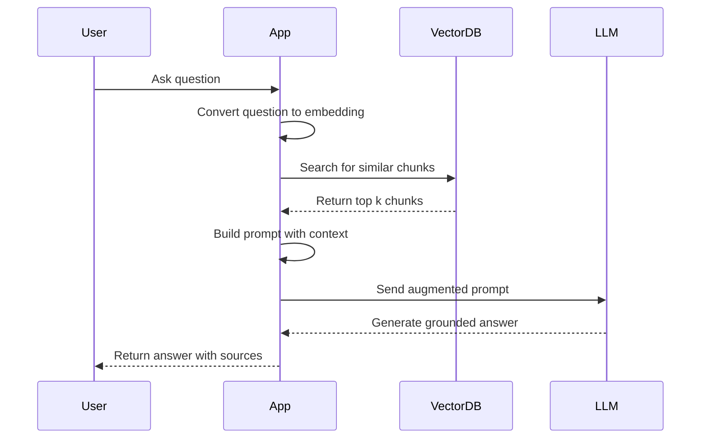
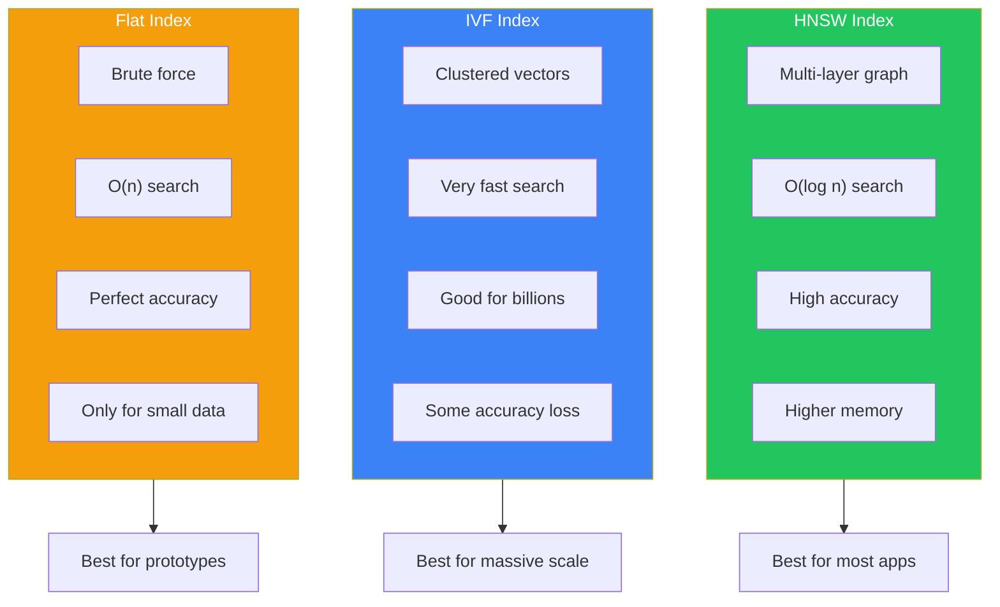
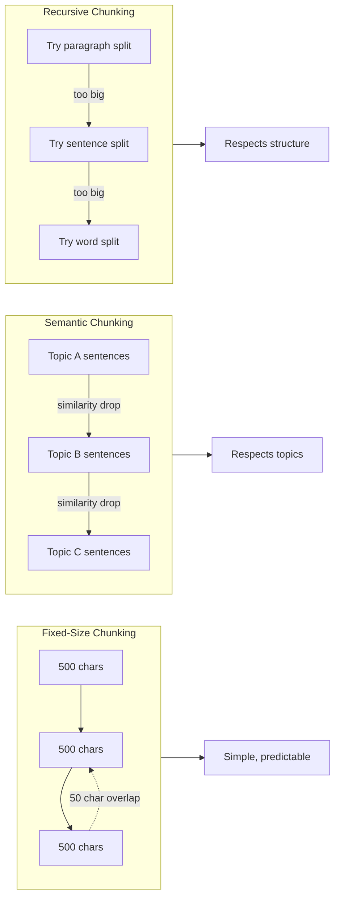
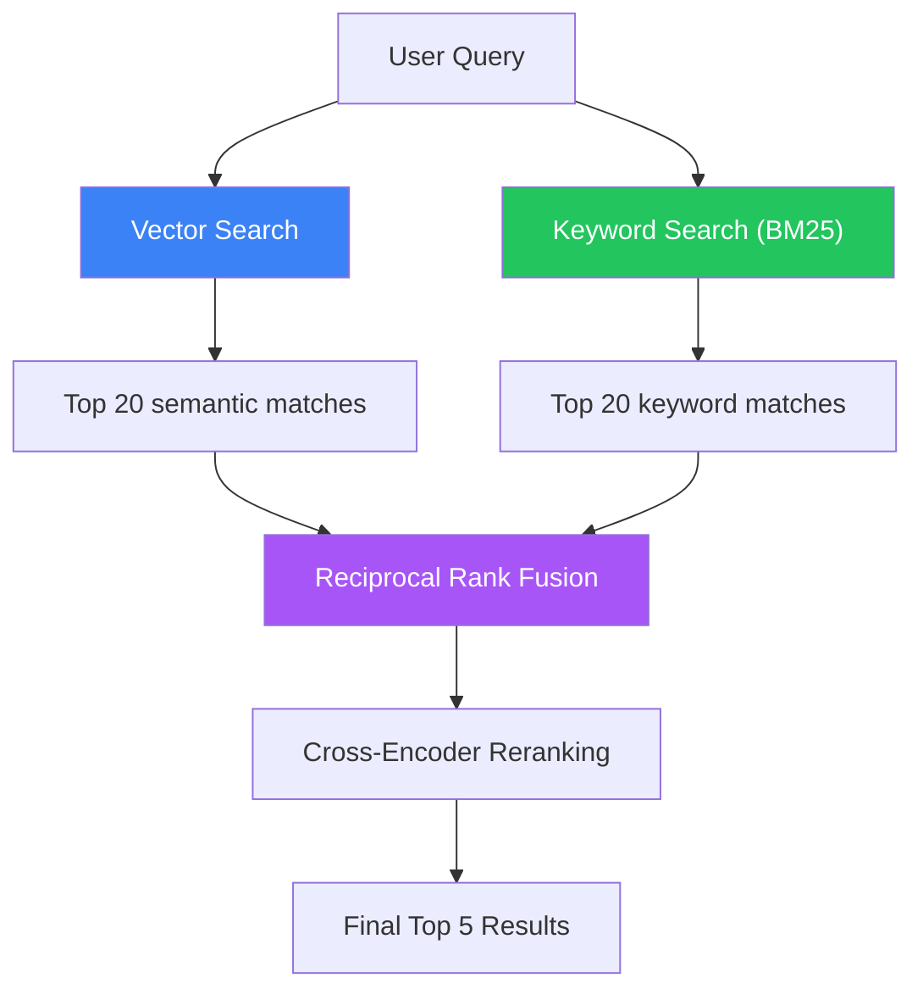

import Tip from "@components/mdx/Tip.astro";
import Warning from "@components/mdx/Warning.astro";
import Info from "@components/mdx/Info.astro";
import Exercise from "@components/mdx/Exercise.astro";
import Definition from "@components/mdx/Definition.astro";
import Quiz from "@components/react/Quiz";
import HandsOnExercise from "@components/react/HandsOnExercise";

## Section 1: The Data Foundation of AI

### Why Data Architecture Matters for AI

If AI models are the engine, data is the fuel. But not all fuel tanks are created equal. The way you store, organize, and retrieve data fundamentally determines what your AI applications can do and how well they perform.

Traditional applications primarily work with structured data: users, products, transactions, things that fit neatly into tables with defined schemas. AI applications, however, need to work with meaning and semantics. They need to find similar concepts, understand context, and retrieve relevant information even when exact matches don't exist.

This shift requires a fundamental rethinking of database architecture.

<Definition term="The Three Data Layers">
  Most production AI systems operate with three complementary data layers: a
  **transactional layer** (traditional databases for structured business data),
  a **semantic layer** (vector databases for meaning-based retrieval), and a
  **cache layer** (fast access for frequently needed data). Understanding when
  and how to use each layer is crucial for building AI systems that are both
  powerful and practical.
</Definition>

### From Keywords to Concepts

The fundamental shift in AI-powered data retrieval is moving from exact matching to semantic similarity.

Traditional search asks: "Show me documents containing 'machine learning.'" It relies on exact keyword matches and misses synonyms, related concepts, and different phrasings.

AI-powered search asks: "Show me documents similar to this concept." It understands meaning and context and finds relevant content even without keyword overlap.

This shift is powered by embeddings, numerical representations of meaning that we can store, compare, and search mathematically. Vector databases are purpose-built for this new paradigm.

---

## Section 2: Traditional Databases in AI Systems

### SQL Databases: The Structured Foundation

Despite the emergence of vector databases, traditional SQL databases remain essential in AI systems. They handle the structured data that AI applications still need.

SQL is the right choice for user management and authentication, which requires transactional integrity for user profiles, permissions, and sessions. Consider storing user preferences for personalized AI responses. SQL excels at application state and metadata: conversation history metadata (not the embeddings themselves), document upload records, and AI feature usage tracking. For audit and compliance, SQL captures who accessed what AI feature when, maintains data lineage for AI decisions, and fulfills requirements for regulated industries.

A typical AI chatbot schema stores users with their IDs and emails, conversations linked to users, messages within conversations (where the actual content might live in a vector database), and documents with their processing status and chunk counts. The SQL layer provides the relational structure and transactional guarantees while referencing the semantic content stored elsewhere.

### NoSQL Databases: Flexibility for Unstructured Data

NoSQL databases excel at storing the variable, unstructured data common in AI applications.

Use NoSQL for document storage: original documents before chunking, full conversation histories, and flexible schemas as AI features evolve. Use it for session context: temporary user state during AI interactions, prompt templates and variations, and A/B test configurations. Use it for metadata and tags: document categories, tags, custom fields, user-defined attributes for search, and rapidly changing feature flags.

<Info title="The Hybrid Approach">
  Most production AI systems use both SQL and NoSQL databases alongside vector
  databases. SQL handles critical structured data requiring transactions. NoSQL
  handles flexible document storage and rapid iteration. Vector databases handle
  semantic search and similarity operations. The key is understanding the
  strengths of each and designing your architecture accordingly.
</Info>

---

## Section 3: Vector Databases Deep Dive

### What Makes Vector Databases Different

Traditional databases answer the question "give me the exact record with this ID." Vector databases answer a different question: "give me the records most similar to this one." That seemingly simple shift requires completely different underlying technology.

When you search a traditional database for a user by ID, the system uses hash tables or B-trees to find the exact record instantly. When you search a vector database for documents similar to a query, the system must compare your query embedding against potentially millions of stored embeddings. Brute-force comparison would be O(n), impossibly slow. So vector databases use clever index structures like HNSW that organize vectors by similarity, enabling approximate nearest neighbor search in O(log n) time.

<Definition term="Vector">
  In AI contexts, a vector is an array of numbers (typically 384 to 1536
  dimensions) that represents the meaning of some content. Two vectors that are
  close together in this high-dimensional space represent similar meanings, even
  if the original text was completely different.
</Definition>

### Vector Similarity Metrics

To find "similar" vectors, we need a mathematical definition of similarity. The three most common metrics are cosine similarity, Euclidean distance, and dot product.

Cosine similarity measures the angle between vectors, ranging from -1 (opposite) to 1 (identical). It's the most common metric for text embeddings because it ignores magnitude and only considers direction. If two documents are about the same topic but one is longer, their embeddings will point in similar directions even if the magnitudes differ.

Euclidean distance (L2) measures the straight-line distance between vectors. Lower distance means more similar. It's sensitive to magnitude and often used for image embeddings and spatial data.

Dot product measures alignment and magnitude. Higher values mean more similar. It's the fastest to compute and works well for normalized vectors.

### Vector Indexing Strategies

The magic of vector databases is finding similar vectors quickly among millions or billions of entries. This requires specialized indexing algorithms.

HNSW (Hierarchical Navigable Small World) is the most popular indexing algorithm, used by Pinecone, Weaviate, and others. It builds a multi-layer graph of connections. Top layers have long-range connections for coarse navigation. Bottom layers have short-range connections for fine-grained search. A query starts at the top and navigates down to find nearest neighbors.

HNSW offers fast query times at O(log n), excellent recall for finding true nearest neighbors, and a good balance of speed and accuracy. The trade-off is higher memory usage because it stores the graph structure. Configuration parameters include efConstruction (build-time quality), maxConnections (connections per layer), and ef (query-time search breadth).

IVF (Inverted File Index) divides the vector space into clusters, then searches only relevant clusters. It clusters vectors using k-means or similar algorithms. At query time, it finds the closest cluster centers and searches only within those clusters. IVF offers very fast queries and lower memory usage, but there's some accuracy loss because it may miss nearest neighbors in other clusters. It's well-suited for massive scale with billions of vectors.

<Tip title="Choosing an Index">
  For most applications with millions of vectors, HNSW provides the best balance
  of speed and accuracy. Use IVF when you need to scale to billions of vectors
  or memory is constrained. Flat (brute force) search is only practical for
  small datasets under 10,000 vectors, but provides perfect accuracy.
</Tip>

### Major Vector Database Options

Pinecone is a fully managed, cloud-native vector database. It offers zero operations overhead, excellent performance and reliability, a simple API, and built-in filtering and metadata. The considerations are that it's cloud-only (potential vendor lock-in), pricing scales with usage, and you have less control over infrastructure.

Weaviate is an open-source vector database with rich querying capabilities. It can be self-hosted or cloud-hosted, has built-in vectorization modules, offers powerful filtering and hybrid search, and provides a GraphQL API. The considerations are that it's more complex to operate and requires infrastructure management if self-hosted.

Chroma is a lightweight, embeddable vector database for developers. It's easy to get started, runs in-process or client-server mode, has built-in embedding generation, and is great for prototyping. The considerations are that it's less mature for production scale, has fewer advanced features, and has a smaller community.

pgvector is a PostgreSQL extension adding vector capabilities to your existing database. It uses existing PostgreSQL infrastructure, combines relational and vector data, provides ACID transactions, and offers a familiar SQL interface. The considerations are that it's not optimized purely for vectors, scaling requires PostgreSQL expertise, and performance may lag specialized solutions at massive scale.

---

## Section 4: RAG Data Architecture

### The RAG Pattern Overview

Retrieval-Augmented Generation (RAG) is the most common pattern for building AI applications with your own data. It addresses the core limitation of LLMs: they only know what they were trained on.

When you ask Claude a question about your company's documentation, this is what happens behind the scenes: your question gets embedded into a vector, that vector gets compared against millions of document chunks, the most similar chunks get retrieved, and they're stuffed into the prompt alongside your question. Claude answers based on that retrieved context. That's RAG.

<Definition term="RAG (Retrieval-Augmented Generation)">
  A pattern that combines information retrieval with text generation. First,
  relevant documents are retrieved using similarity search. Then, these
  documents are provided as context to an LLM, which generates an answer
  grounded in the retrieved information. RAG solves the problem of LLMs only
  knowing their training data by giving them access to your specific knowledge
  base at query time.
</Definition>

The three stages are indexing (offline), retrieval (query time), and generation (query time). Indexing ingests documents, splits them into chunks, generates embeddings, and stores them in a vector database. Retrieval converts the user question to an embedding, searches for similar chunks, and applies filters and re-ranking. Generation constructs a prompt with retrieved context, sends it to the LLM, and returns the answer.

### Chunking Strategies

Chunking is the art of splitting documents into pieces that are meaningful for both retrieval and context provision.

Why chunk? Documents are often too long for single embeddings. Different parts may be relevant to different queries. Embeddings work best on focused, coherent text. LLMs have context window limits.

Chunk size is a critical trade-off. Small chunks (100-200 tokens) retrieve precise information but lose surrounding context. Large chunks (1000+ tokens) preserve context but may include irrelevant information that confuses the model. Most production systems use 500-800 tokens with 50-100 token overlap between chunks.

Fixed-size chunking splits text into fixed character or token counts with overlap. It's simple and predictable but may split mid-sentence or mid-concept.

Sentence and paragraph chunking splits on natural boundaries and groups to target size. It preserves natural boundaries but produces variable sizes that may be too small or too large.

Recursive chunking splits hierarchically using paragraphs, then sentences, then words until reaching the target size. It balances natural boundaries with size control but has more complex implementation.

Semantic chunking uses embeddings to find natural topic boundaries. When similarity between consecutive sentences drops below a threshold, it indicates a topic change and a good place to split. This respects semantic boundaries but is expensive (requires embedding every sentence) and produces variable sizes.

<Warning title="Chunking Strategy Matters">
  Choose based on your content type. Technical documentation benefits from
  recursive chunking that respects structure. Conversational text works well
  with sentence or paragraph boundaries. Mixed content often does best with
  fixed-size chunking with overlap as a reliable default. High-quality corpora
  where accuracy is paramount may justify the cost of semantic chunking.
</Warning>

### Metadata and Filtering

Raw vector search isn't always enough. Metadata enables hybrid approaches that combine semantic similarity with traditional filtering.

A well-designed metadata schema includes chunk_id, document_id, document_title, author, created_date, category, tags, chunk_index, chunk_total, section, language, and access_level. This metadata enables queries like "search only within technical documents from 2025 that are publicly accessible."

Filtering happens before vector search, narrowing the search space and improving both performance and relevance. A query about "2024 policies" should only search documents from 2024.

### Hybrid Search

Hybrid search combines dense vector search with sparse keyword search for best results. The user query goes to both a vector search component and a keyword search component in parallel. Each returns its top results. A fusion and reranking step combines these results, and the final top results are returned.

Why hybrid? Vectors capture meaning but may miss exact terms. Keywords catch specific names, codes, and acronyms. The combination improves both precision and recall.

Reciprocal Rank Fusion is a common technique for combining results. It scores each document based on its rank in each result list, then sorts by combined score. An optional reranking step using a cross-encoder model can further improve accuracy for the top candidates.

---

## Section 5: Data Pipelines for AI

### Ingestion Pipeline Architecture

Data doesn't magically appear in your vector database. You need a robust pipeline to get it there and keep it updated.

A complete pipeline has several stages. Data sources include documents, web pages, databases, and APIs. The ingestion layer handles validation and deduplication. The processing layer handles parsing, chunking, and metadata extraction. The embedding layer handles embedding generation with batch processing. The storage layer manages the vector database, metadata database, and object storage. The sync layer handles webhooks, change data capture, and polling for updates.

### Stage 1: Ingestion and Validation

The ingestion stage accepts data from various sources, validates format and structure, detects duplicates, and handles errors gracefully.

Content validation checks that content meets minimum length requirements. Hash-based deduplication computes a SHA-256 hash of each document's content and skips any document whose hash has been seen before. This prevents generating expensive embeddings for duplicate content.

### Stage 2: Processing and Chunking

The processing stage parses different formats (PDF, HTML, Markdown), cleans and normalizes text, splits into chunks, and extracts and enriches metadata.

Each chunk gets metadata including the chunk_index, chunk_total, and document_id, enabling reconstruction of document context when needed.

### Stage 3: Embedding Generation

The embedding stage generates embeddings for chunks, handles batching for efficiency, implements retry logic, and caches embeddings when possible.

Batch processing is essential because API limits typically allow around 100 texts per request. Retry logic with exponential backoff handles transient failures. For large ingestion jobs, consider generating embeddings in bulk during off-peak hours.

### Stage 4: Storage and Indexing

The storage stage stores embeddings in the vector database, stores metadata in a traditional database, stores original documents in object storage, and maintains consistency across stores.

A robust storage implementation stores the original document first, then metadata, then embeddings. If any step fails, a rollback function cleans up partial writes to maintain consistency.

<Info title="Incremental Updates">
  Real-world systems need to handle updates, not just initial loads. Strategies
  include full replacement (delete all old chunks and reinsert, simple but
  wasteful), smart diff (compare content hashes and only update changed
  sections, more efficient but complex), and append-only with versioning (keep
  old versions marked inactive, enables rollback and history).
</Info>

---

## Section 6: Practical Considerations

### Cost Management

Vector databases and embedding generation can get expensive at scale. Understanding the cost structure helps you optimize.

Embedding generation costs vary by provider and model. OpenAI's text-embedding-3-small costs about $0.02 per million tokens. Their text-embedding-3-large costs about $0.13 per million tokens. Different models have different dimension counts, which affects storage costs.

Cost optimization strategies include caching embeddings (store and reuse for unchanged content), using smaller models (if accuracy permits), batch processing (generate embeddings during off-peak hours), and deduplication (don't embed the same content twice).

For vector database costs, managed services like Pinecone charge per vector stored and per query. Self-hosted options like Weaviate have infrastructure costs for compute and storage. Hybrid options like pgvector add marginal cost if you're already using PostgreSQL.

An example calculation: 10,000 documents averaging 2,000 tokens each totals 20 million tokens. Using OpenAI's text-embedding-3-small at $0.02 per million tokens costs $0.40 for embedding generation. If each document produces 10 chunks, that's 100,000 vectors. A Pinecone p1 pod runs about $70 per month. Total first month: about $70.40. Ongoing cost with no re-embedding: $70 per month.

### Scaling Strategies

Horizontal scaling shards vectors across multiple indexes or namespaces, routes queries based on metadata (tenant ID, category), and uses read replicas for query-heavy workloads.

Vertical scaling increases index size and resources for a single tenant, optimizes index parameters like HNSW's efConstruction, and uses faster storage (SSD versus HDD).

Query optimization implements aggressive filtering before vector search, caches frequent queries, uses smaller top_k values when possible, and considers approximate search for massive scale.

### Backup and Disaster Recovery

Don't lose your embeddings. They're expensive to regenerate.

A backup strategy backs up original documents (object storage handles this), backs up the metadata database (standard database backup), and backs up the vector database either through native snapshot export or by storing regeneration configuration.

Best practices include regular automated backups, testing recovery procedures, storing original documents (cheaper than embeddings), documenting your pipeline configuration, and considering multi-region replication for critical systems.

---

## Diagrams

### RAG Architecture Flow

### Vector Index Comparison

### Chunking Strategy Comparison

### Hybrid Search Flow

### Document Ingestion Pipeline

---

## Hands-On Exercise: Build a Mini RAG System

<HandsOnExercise
  client:visible
  moduleSlug="databases-data-management-ai"
  exerciseId="mini-rag-system"
  title="Build a Mini RAG System"
  objective="Build a complete RAG system that ingests documents, generates embeddings, stores them in a vector database, and answers questions using retrieved context."
  totalTime="45-60 minutes"
  setupInstructions={[
    "Install Python 3.8+ if not already installed",
    "Install required libraries: pip install openai chromadb nltk tiktoken",
    "Set your API key: export OPENAI_API_KEY='your-key-here'",
    "Create a new file called rag_system.py for your code",
  ]}
  parts={[
    {
      id: "document-ingestion",
      title: "Document Ingestion Pipeline",
      duration: "15 min",
      instructions: [
        "Create a MiniRAGSystem class that initializes OpenAI and ChromaDB clients",
        "Implement a chunk_text() method that splits text into overlapping chunks using sentence tokenization",
        "Use tiktoken to count tokens and ensure chunks stay within limits (400 tokens max)",
        "Include 2-sentence overlap between chunks to preserve context",
      ],
      observePrompt:
        "How do different chunk sizes affect the number of chunks created?",
    },
    {
      id: "embedding-storage",
      title: "Embedding Generation and Storage",
      duration: "15 min",
      instructions: [
        "Implement generate_embedding() method using OpenAI's text-embedding-3-small model",
        "Create ingest_document() method that chunks text, generates embeddings, and stores in ChromaDB",
        "Add metadata to each chunk including chunk_index and chunk_total",
        "Test by ingesting 2-3 sample documents about different topics",
      ],
      observePrompt:
        "How long does embedding generation take? What metadata would be useful to track?",
    },
    {
      id: "retrieval-implementation",
      title: "Similarity Search and Retrieval",
      duration: "10 min",
      instructions: [
        "Implement retrieve() method that embeds a query and searches ChromaDB",
        "Return the top 3 most similar chunks with their metadata",
        "Test retrieval with various queries to verify relevance",
        "Experiment with different n_results values",
      ],
      observePrompt:
        "Are the retrieved chunks relevant to your queries? What happens with vague queries?",
    },
    {
      id: "rag-pipeline",
      title: "Complete RAG Pipeline",
      duration: "15 min",
      instructions: [
        "Implement answer_question() method that retrieves context and generates an answer",
        "Build a prompt that includes retrieved chunks as context",
        "Use GPT-4 or Claude to generate answers grounded in the context",
        "Return both the answer and the source chunks used",
        "Compare RAG answers to asking the LLM directly without context",
      ],
      observePrompt:
        "How do RAG answers differ from non-RAG answers? When does RAG help most?",
    },
  ]}
  successCriteria={[
    {
      id: "chunking",
      text: "Successfully loaded and chunked documents with overlap",
    },
    { id: "embeddings", text: "Generated and stored embeddings in ChromaDB" },
    { id: "retrieval", text: "Retrieval returns relevant chunks for queries" },
    {
      id: "rag-pipeline",
      text: "RAG pipeline produces grounded, accurate responses",
    },
    { id: "experimented", text: "Experimented with chunk size trade-offs" },
    { id: "metadata", text: "Added useful metadata to chunks" },
  ]}
/>

---

## Knowledge Check

<Quiz
  client:visible
  quizId="module-05-knowledge-check"
  moduleSlug="databases-data-management-ai"
  questions={[
    {
      id: "q1",
      type: "multiple-choice",
      question:
        "What is the primary purpose of a vector database in AI applications?",
      options: [
        { id: "a", text: "To store large files efficiently" },
        {
          id: "b",
          text: "To enable similarity-based retrieval by storing and searching embeddings",
        },
        {
          id: "c",
          text: "To replace traditional relational databases entirely",
        },
        { id: "d", text: "To train machine learning models faster" },
      ],
      correctAnswer: "b",
      explanation:
        "Vector databases are designed specifically for storing embeddings (vectors) and enabling efficient similarity search - finding the closest matches to a query vector rather than exact matches. This semantic search capability is essential for RAG systems and other AI applications that need to find conceptually related content.",
    },
    {
      id: "q2",
      type: "multiple-choice",
      question: "What is 'chunking' in the context of RAG systems?",
      options: [
        { id: "a", text: "Compressing files for more efficient storage" },
        {
          id: "b",
          text: "Splitting documents into smaller pieces for embedding and retrieval",
        },
        { id: "c", text: "A type of database index for faster queries" },
        { id: "d", text: "Batch processing of API requests to reduce costs" },
      ],
      correctAnswer: "b",
      explanation:
        "Chunking divides large documents into smaller segments that can be individually embedded and retrieved. The chunk size and strategy significantly impact retrieval quality - too large and you get irrelevant content, too small and you lose context. Most production systems use 500-800 tokens with overlap.",
    },
    {
      id: "q3",
      type: "multiple-choice",
      question:
        "Why is HNSW (Hierarchical Navigable Small World) commonly used for vector search?",
      options: [
        {
          id: "a",
          text: "It provides exact nearest neighbor results with perfect accuracy",
        },
        {
          id: "b",
          text: "It offers O(log n) approximate search while maintaining good accuracy",
        },
        { id: "c", text: "It uses the least memory of any index type" },
        {
          id: "d",
          text: "It's the fastest option for datasets under 1000 vectors",
        },
      ],
      correctAnswer: "b",
      explanation:
        "HNSW builds a multi-layer graph where each layer progressively coarsens the search space. This enables logarithmic time complexity for approximate nearest neighbor search, making it practical for millions of vectors while maintaining high accuracy. It uses more memory than IVF but offers better accuracy.",
    },
    {
      id: "q4",
      type: "multiple-choice",
      question: "What is hybrid search in the context of retrieval systems?",
      options: [
        { id: "a", text: "Using two different LLMs to generate answers" },
        {
          id: "b",
          text: "Combining keyword-based search with semantic vector search",
        },
        { id: "c", text: "Searching local and cloud databases simultaneously" },
        { id: "d", text: "Using both SQL and NoSQL databases in one query" },
      ],
      correctAnswer: "b",
      explanation:
        "Hybrid search combines traditional keyword/BM25 search with semantic vector search, then fuses the results. This captures both exact keyword matches (useful for names, codes, specific terms) and semantic similarity (useful for concepts and paraphrases), improving both precision and recall.",
    },
    {
      id: "q5",
      type: "multiple-choice",
      question: "Why is content deduplication important in RAG data pipelines?",
      options: [
        { id: "a", text: "To improve the accuracy of the LLM's responses" },
        {
          id: "b",
          text: "To reduce storage costs and avoid generating expensive embeddings for duplicate content",
        },
        {
          id: "c",
          text: "To make vector search faster by reducing index size",
        },
        { id: "d", text: "To comply with data privacy regulations" },
      ],
      correctAnswer: "b",
      explanation:
        "Deduplication prevents generating embeddings for essentially identical content, which directly eliminates unnecessary API calls. Embedding generation costs money, so avoiding duplicate embeddings is one of the most effective cost optimization strategies for RAG systems at scale.",
    },
  ]}
  passingScore={70}
  allowRetry={true}
/>

---

## Summary

In this module, you've learned how databases form the foundation of AI applications:

1. **Layered Architecture**: Modern AI systems use three complementary data layers - transactional (SQL/NoSQL), semantic (vector databases), and cache - each serving specific purposes. Understanding when to use each layer is crucial for building effective systems.

2. **Vector Databases**: Purpose-built for similarity search using specialized indexes like HNSW and IVF that enable fast approximate nearest neighbor search across millions of high-dimensional vectors. They answer "what is most similar?" rather than "what matches exactly?"

3. **RAG Pattern**: Retrieval-Augmented Generation combines vector search with LLM generation to create AI systems that can answer questions using your own data. Chunking strategy, metadata filtering, and hybrid search are critical implementation details that affect quality.

4. **Data Pipelines**: Production AI systems require robust pipelines for ingestion, processing, embedding generation, and storage, with careful attention to incremental updates, deduplication, and error handling.

5. **Practical Considerations**: Cost management through caching and deduplication, scaling strategies for growth, and proper backup procedures are essential for production deployments. Embeddings are expensive to regenerate, so protect them.

The quality of your AI application is fundamentally limited by the quality of your data architecture. A well-designed database layer enables accurate retrieval, fast responses, and maintainable systems.

---

## What's Next

**Module 6: Security Fundamentals for AI Applications**

We'll cover:

- Prompt injection attacks and how to defend against them
- Data privacy considerations when using AI systems
- API key management and secrets handling
- Responsible AI practices and safety considerations
- Building trustworthy AI applications

Security is critical for AI systems because they process natural language inputs that can be manipulated in ways traditional systems are not vulnerable to.

---

## References

### Vector Database Documentation

1. **Pinecone Documentation**

   Managed vector database with excellent getting-started guides.
   [docs.pinecone.io](https://docs.pinecone.io)

2. **Weaviate Documentation**

   Open-source vector database with rich querying capabilities.
   [weaviate.io/developers/weaviate](https://weaviate.io/developers/weaviate)

3. **ChromaDB Documentation**

   Lightweight, embeddable vector database perfect for prototyping.
   [docs.trychroma.com](https://docs.trychroma.com)

4. **pgvector GitHub**

   PostgreSQL extension for vector similarity search.
   [github.com/pgvector/pgvector](https://github.com/pgvector/pgvector)

### Embedding Models

5. **OpenAI Embeddings Guide**

   Official documentation for OpenAI's embedding models.
   [platform.openai.com/docs/guides/embeddings](https://platform.openai.com/docs/guides/embeddings)

### RAG Resources

6. **LangChain RAG Tutorial**

   Comprehensive guide to building RAG systems.
   [python.langchain.com/docs/tutorials/rag](https://python.langchain.com/docs/tutorials/rag)

7. **LlamaIndex Documentation**

   Data framework specifically designed for LLM applications.
   [docs.llamaindex.ai](https://docs.llamaindex.ai)

### Technical Papers

8. **"Retrieval-Augmented Generation for Knowledge-Intensive NLP Tasks"** - Lewis et al. (2020)

   The foundational RAG paper from Facebook AI Research.

9. **"Efficient and Robust Approximate Nearest Neighbor Search Using HNSW"** - Malkov & Yashunin

   The original HNSW paper explaining the algorithm powering most vector databases.

### Practical Guides

10. **Pinecone Learning Center**

    Excellent tutorials on chunking, RAG, and vector search best practices.
    [pinecone.io/learn](https://www.pinecone.io/learn)

### Benchmarks

11. **MTEB Leaderboard**

    Embedding model comparisons and benchmarks.
    [huggingface.co/spaces/mteb/leaderboard](https://huggingface.co/spaces/mteb/leaderboard)

12. **VectorDBBench**

    Performance comparisons across vector database options.
    [github.com/zilliztech/VectorDBBench](https://github.com/zilliztech/VectorDBBench)
