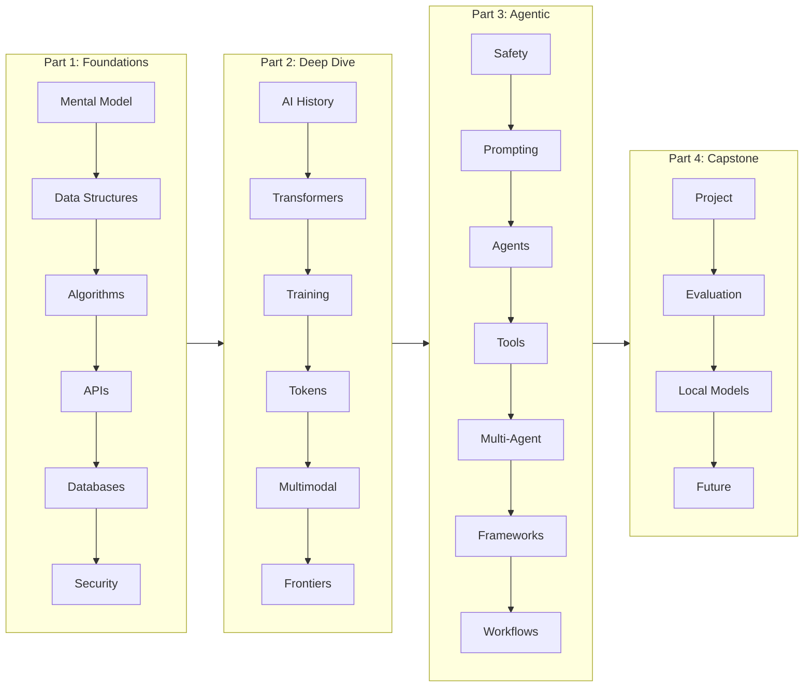
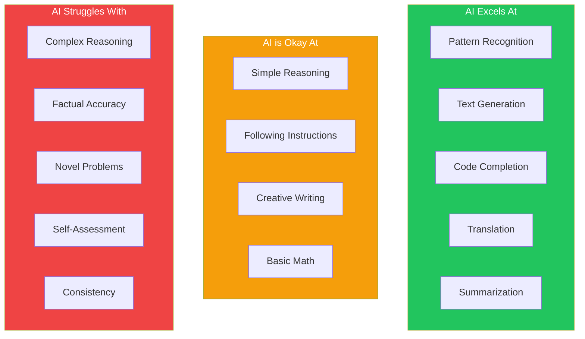
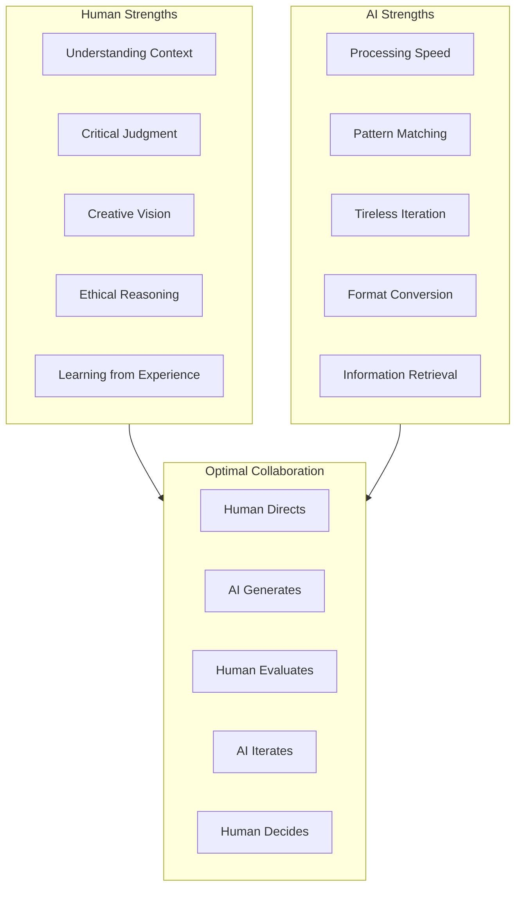
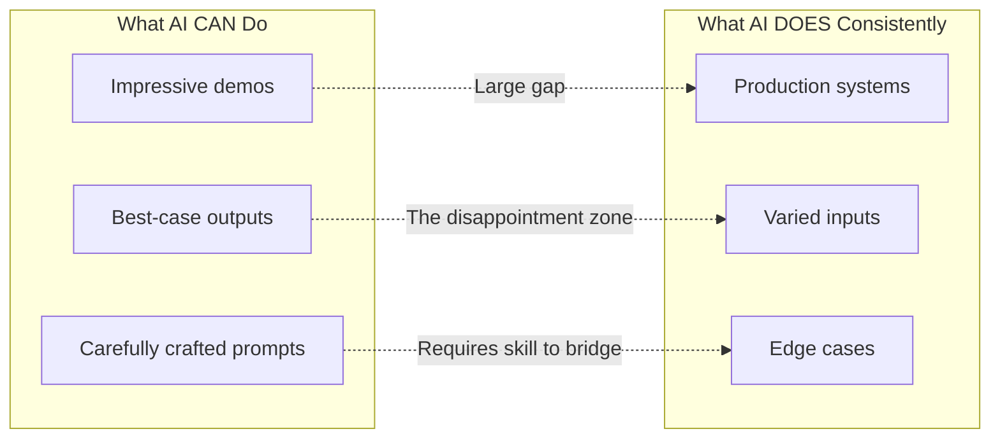

import Tip from "@components/mdx/Tip.astro";
import Warning from "@components/mdx/Warning.astro";
import Info from "@components/mdx/Info.astro";
import Exercise from "@components/mdx/Exercise.astro";
import Definition from "@components/mdx/Definition.astro";
import Quiz from "@components/react/Quiz";
import HandsOnExercise from "@components/react/HandsOnExercise";

## Section 1: Welcome and Course Overview

### Why This Course Exists

You're a technical professional. You've built systems, debugged nightmares, shipped products. You've adapted to countless technology shifts. And now, you're facing another one.

AI isn't coming. It's here. And unlike previous paradigm shifts, this one feels different. It feels... personal. The tools aren't just changing how you work—they're doing parts of what you do.

This course exists because the conversation around AI has become unhelpfully polarized. On one side, you have the hype camp promising that AI will solve everything—AGI arriving next year, everyone becoming a 10x developer overnight, just prompt a little harder and watch the magic happen. On the other side, the doomers warn that AI will destroy everything—jobs, society, maybe humanity itself. And sitting in the corner, the dismissive camp insists it's all just autocomplete with impressive marketing, nothing to see here.

All three camps are wrong, and they're wrong in instructive ways.

<Info title="The Truth Is More Nuanced">
  Modern AI systems are genuine technological breakthroughs that can
  meaningfully enhance your work—if you understand them. They're also limited,
  unreliable, and frequently wrong in ways that require your expertise to
  navigate.
</Info>

This course teaches you that understanding.

### What You'll Build

Over the next 10-12 weeks, you'll develop something more valuable than surface-level familiarity with AI tools. You'll build deep understanding of how transformers actually work, why they succeed at some tasks and fail spectacularly at others. You'll develop practical skills—prompt engineering that actually works, API integration that handles edge cases, agent building that doesn't fall apart in production.

More importantly, you'll develop critical judgment. You'll learn when to reach for AI and when to step back, how to evaluate outputs without blindly trusting or reflexively dismissing them. And you'll understand safety considerations—the real risks that matter, responsible practices that scale, and the organizational considerations that determine whether AI adoption helps or hurts.

By the end, you'll be the person on your team who actually understands this stuff. Not at a surface level where you can parrot buzzwords, but deeply enough to make good decisions when the stakes are real.

### How to Succeed

This course is designed for working professionals. You don't need to complete it linearly or quickly. The best approach:

<Tip title="Learning Strategy">
  - **Commit to consistency**: 3-4 hours per week beats 12-hour marathon
  sessions - **Do the exercises**: Reading about AI is not the same as using AI
  - **Question everything**: Including what this course tells you - **Build
  things**: The capstone matters, but so do small experiments along the way
</Tip>

---

## Section 2: The AI Moment in Software Development

### Previous Paradigm Shifts

If you've been in tech for any length of time, you've lived through paradigm shifts before. Remember when "real" computing meant big iron mainframes, and personal computers were toys? Then desktop applications were the serious choice, and this web thing was just a fad. Waterfall methodology was professional software development—agile was for startups who couldn't plan. Your own data center meant security; the cloud was reckless. And "users" meant people sitting at desks, not walking around with supercomputers in their pockets.

Each shift had its skeptics who were eventually proven wrong—but also its hype merchants who overpromised. The cloud didn't eliminate ops; it transformed it. Agile didn't eliminate planning; it made it continuous. Mobile didn't kill desktop; it added a new platform.

AI will follow the same pattern: transformation, not elimination.

### What's Actually Changing

Let's cut through the noise and look at what AI is demonstrably changing in software development right now—not the hype, not the fear, but the actual shift happening in codebases and workflows across the industry.

Picture yourself writing a new feature. You need a utility function to validate email addresses, handle some edge cases, return appropriate error messages. In the old world, you'd open a browser tab, search for regex patterns, copy something from Stack Overflow, tweak it to handle your specific cases, probably miss an edge case, find it in QA, fix it.

Now, you describe what you need to an AI assistant. "I need a function that validates email addresses, returns specific error messages for common mistakes like missing @ or invalid domain format, handles edge cases like plus-addressing." The AI generates working code in seconds. You review it, notice it didn't handle internationalized domain names, ask for that addition, and you're done. This isn't theoretical—tools like GitHub Copilot, Cursor, and Claude Code have made this workflow commonplace for millions of developers.

Code generation is genuinely changing how we work. It's not replacing the thinking—you still need to know what to ask for, evaluate whether the output is correct, and integrate it into your larger system. But the mechanical translation of intent to code? That's being automated, and pretending otherwise means falling behind.

Natural language interfaces are becoming viable in ways they never were before. Think about the applications you could build if users could just describe what they want instead of navigating through nested menus and configuration screens. "Show me all orders from last month where the customer complained within a week of delivery" becomes a possible query, not a feature request that sits in the backlog forever. This opens product possibilities that weren't practical when every user interaction required explicit UI design.

The scope of automation has expanded into territory that used to be exclusively human. Code review suggestions, documentation generation, test case creation—these tasks that required human judgment are now being partially automated. Not fully, not reliably, but enough to change workflows. A pull request can get initial feedback in seconds. Documentation can have a first draft generated from the code itself. Test cases can be suggested based on edge cases the AI identifies. None of this replaces human oversight, but it changes what humans spend their time on.

Here's the uncomfortable truth for developers who haven't started using AI tools: the skill ceiling is rising. The best developers using AI effectively are outproducing their past selves by meaningful margins. Not the mythical 10x improvement the hype merchants promise, but 20-30% more output with equivalent quality is realistic for appropriate tasks. And that gap between AI-fluent and AI-naive developers is growing month by month. This isn't about job security fears—it's about professional development reality.

### The Productivity Evidence

Let's be honest about what the research actually shows, because there's a lot of motivated reasoning on all sides.

<Warning title="Be Skeptical of Claims">
  **Studies claiming 2x productivity gains** often measure specific, narrow
  tasks where AI excels (writing boilerplate, generating tests from examples).
  Real-world productivity is harder to measure.
</Warning>

Developer surveys show genuinely mixed results. Some developers report significant time savings—hours per week recovered from mechanical coding tasks. Others report time lost to debugging AI-generated code that looked right but harbored subtle bugs, or correcting hallucinations that confidently referenced APIs that don't exist. The difference isn't random. It correlates with how well the developer understands AI's limitations.

The honest summary: AI can meaningfully accelerate your work _if_ you know how to use it effectively, _if_ you can recognize when it's failing, and _if_ you apply it to appropriate tasks.

This course teaches you those skills.

---

## Section 3: AI as Power Tool — The Right Mental Model

### The Chainsaw Analogy

Think about a chainsaw. It's a power tool that amplifies human capability. It lets you do in minutes what would take hours with a hand saw.

But you wouldn't:

- Let a chainsaw "decide" which trees to cut
- Trust it to stop before hitting something important
- Assume it works the same on every type of wood
- Operate it without understanding the kickback zone

The chainsaw doesn't understand trees or forests. It's an amplifier for human intent and skill. A skilled user with a chainsaw accomplishes remarkable things. An unskilled user creates disasters.

<Definition term="Power Tool Mental Model">
  AI is a sophisticated power tool that amplifies human capability but requires
  skill to use effectively, doesn't understand what it's doing, and needs human
  judgment to direct it.
</Definition>

### What AI Actually Excels At

To use any tool effectively, you need to understand what it's good for. Let's explore AI's genuine strengths—not the marketing claims, but the capabilities that hold up under real-world use.

Consider pattern matching at scale. Imagine you're investigating a bug that seems familiar. You vaguely remember seeing something like it before, maybe in a different project, maybe years ago. In the pre-AI world, you'd search through your codebase, maybe check your notes, probably give up and debug from scratch. With AI, you describe the symptoms and get back: "This pattern commonly occurs when async operations aren't properly awaited in forEach loops—the loop completes before the async work finishes." The AI isn't reasoning from first principles. It's matching your description against patterns from millions of code examples, forum discussions, and bug reports. When that pattern exists in its training, this matching is remarkably powerful.

Generation within established patterns is where AI truly shines. Need a React component that follows your team's conventions? A SQL query that matches your schema patterns? An API endpoint that mirrors your existing ones? These are problems with well-worn paths—countless examples exist of how to solve them. The AI doesn't need to invent anything novel; it needs to recognize what kind of thing you want and generate an example that fits. It's like having a junior developer who has read every tutorial ever written but never built anything in production. For cookie-cutter tasks, that's incredibly useful.

Think about transformation between formats. You have a JSON configuration file and need YAML. You have documentation in Markdown and need it in reStructuredText. You have code in Python and need the same logic in JavaScript. These transformations follow rules, and while the rules can be complex, they're fundamentally about mapping one structured format to another. AI handles this remarkably well because it's seen countless examples of both formats and can match the patterns of conversion. It won't understand why your particular transformation matters, but it can execute the mechanics reliably.

First drafts and scaffolding represent another area of strength. Starting from a blank page is hard. Starting from a rough draft that gets 70% of the way there? Much easier. When you ask AI to draft documentation for a function, outline a system design, or sketch out a test suite, you're not expecting perfection. You're expecting a starting point that captures the obvious parts, freeing your mental energy for the parts that actually require thought. This framing—AI as draft generator, you as editor—leads to much better outcomes than expecting finished work.

Finally, AI brings tireless iteration. Need to see five different approaches to a function? Want to explore what the code would look like with different design choices? Interested in generating variations until something clicks? AI doesn't get bored, doesn't get frustrated, doesn't slow down after the first attempt. This makes exploration cheap in a way it never was before. You can ask "what about..." as many times as you want, and each answer comes back in seconds.

### What AI Reliably Struggles With

Understanding AI's limitations isn't about pessimism—it's about calibrating your expectations so you know when to trust and when to verify. These aren't temporary bugs that better training will fix. They're inherent to how these systems work.

Factual accuracy is the big one, and it's worth understanding why. Last week, a colleague asked an AI assistant about a library's API. The AI confidently explained how to call a function with specific parameters. The function existed. The parameters were plausible. The documentation the AI seemed to be describing made sense. There was just one problem: the API didn't work that way. The function took different parameters in a different order. The AI had generated something that matched the pattern of how APIs typically work but didn't match this specific API's reality.

This happens because AI systems don't have verified access to ground truth. They generate plausible continuations of patterns. Usually plausible and true overlap—if a million examples show that the Earth orbits the Sun, the AI will say that too. But when training data is sparse, contradictory, or simply wrong, the AI generates plausible-sounding falsehoods with the same confidence it states verified facts. It cannot tell the difference. This isn't a bug that more training will fix; it's fundamental to token prediction.

Complex reasoning is another limitation, and watching AI fail at it is instructive. Present a multi-step logical puzzle where each step depends on getting the previous step exactly right, and you'll see the wheels come off. The AI might get each individual step approximately right, but "approximately" compounds. By step five or six, the accumulated approximations have drifted into nonsense. This matters for code review, system design, security analysis—anywhere you need to hold multiple constraints in mind simultaneously and verify they're all satisfied.

Novel situations expose AI limitations starkly. Ask an AI to solve a problem that genuinely doesn't look like anything in its training data—a unique combination of technologies, an unusual business constraint, a first-of-its-kind architecture decision—and you'll get answers that sound confident but draw from inappropriate analogies. The AI has no way to know it's in unfamiliar territory. It will pattern-match to something, even if that something is only superficially similar to your actual situation. This is why AI assistance is most dangerous in exactly the situations where you might be most tempted to lean on it: when you don't already know the answer and can't easily verify what you're told.

Self-assessment is essentially impossible for current AI systems. You might think you could just ask: "How confident are you about that answer?" But the AI's response to that question is just another prediction. It predicts what a confident or uncertain response should look like based on patterns in its training. It cannot actually introspect on whether its internal representations are reliable. When Claude says "I'm not sure about this," it's not experiencing uncertainty—it's predicting that hedging language is appropriate given the context. When it expresses confidence, that confidence isn't earned through any verification process.

Consistency is another challenge, and it bites in production. Run the same prompt twice and you might get different outputs. Ask the same question in slightly different wording and get contradictory answers. For creative tasks, this variability is a feature—you can generate multiple options. For production systems that need deterministic behavior, it's a serious problem. Temperature settings help but don't eliminate variability. This is why AI-generated outputs often need human review before going into systems that need reliability.

### The Capability-Reliability Gap

Here's a concept that will save you endless frustration:

<Definition term="Capability-Reliability Gap">
  **Capability** is what AI can do on a good day with a good prompt.
  **Reliability** is what AI does consistently across varied conditions. The gap
  between these is huge—and this is where most AI disappointments come from.
</Definition>

AI demos show capability. The carefully crafted prompt that produces perfect output. The ideal example that makes your jaw drop. The "wow" moment in the conference keynote. These are real—AI really can do those things, sometimes.

Real-world use requires reliability. Your users will phrase things strangely. Edge cases will appear. The exact wording that worked in your testing will be subtly different in production. And that's when you discover the gap: the impressive capability doesn't translate to consistent reliability.

Your job as a skilled AI user is to work in the overlap: find the tasks where capability and reliability align. These tend to be well-defined tasks with established patterns, where you can verify outputs, and where occasional failures are acceptable or easily caught. That's a narrower space than the demos suggest, but it's still genuinely useful.

---

## Section 4: How AI "Thinks" vs. How You Think

### The Fundamental Difference

Let's trace through what actually happens when you solve a problem, and then contrast it with what happens inside an AI. The differences are more profound than they might appear.

When you encounter a problem—say, "design a caching layer for our API"—your brain engages in something like this process: First, you understand what's being asked. Not just the words, but the context. Why is caching needed? What's slow? What's the access pattern? What constraints exist? You bring genuine comprehension to the request.

Then you recall relevant knowledge. Not just facts, but experiences. That time caching went wrong because you didn't handle invalidation. The article you read about Redis vs Memcached. The war story from a colleague about cache stampedes. Your knowledge is networked, contextual, earned through experience.

Next, you reason through the problem. You consider options, weigh trade-offs, think about what could go wrong. You might sketch diagrams, talk it through, sleep on it. The reasoning process is dynamic—you can change direction, zoom in, zoom out, doubt yourself productively.

You evaluate potential solutions against criteria that might be explicit or implicit. Does this fit the budget? Does the team have expertise? Does it scale? Is it worth the complexity? These judgments require understanding what matters.

Finally, you choose, execute, and then reflect on whether it worked. You learn from the outcome. You update your mental models. The next time you face a similar problem, you bring that hard-won knowledge.

Now consider what happens when an AI generates a response. Your input gets converted into numerical tokens—pieces of text become numbers that the model can process. Then the model predicts what token is statistically most likely to come next, given everything that came before. It generates that token, adds it to the sequence, and repeats until it decides the response is complete.

That's it. There's no understanding phase—the model doesn't grasp what caching means or why you might need it. There's no reasoning through trade-offs—no consideration of your specific constraints. There's no evaluation—the model has no way to judge whether its output actually solves your problem. And there's no learning from this interaction—the next user gets the same model, unaffected by whether this response was helpful or harmful.

<Warning title="Fundamental Limitation">
  This isn't a limitation of current AI that will be solved. It's what these
  systems fundamentally are.
</Warning>

This sounds abstract, so let's make it concrete.

### Token Prediction in Practice

When you ask Claude: "What's the capital of France?"

The system doesn't access a database of facts about France. It doesn't "know" that France is a country with a capital. It doesn't understand the concept of capital cities as seats of government with political significance.

What actually happens: the system recognizes this pattern of tokens as similar to countless training examples. In those examples, the token sequence "The capital of France is" was overwhelmingly followed by "Paris." So the system predicts "Paris" as the most likely next token and generates it.

For this query, the distinction doesn't matter—you get the right answer either way. Pattern matching and genuine knowledge produce the same output. This is what makes AI so seductive and so dangerous: for many queries, you can't tell whether you got the right answer for the right reasons.

But consider a slightly more complex query: "What's the capital of the country that hosted the 2024 Summer Olympics?"

Now the system must chain pattern matches. It needs to recognize this pattern as asking for a capital, then match "2024 Summer Olympics" to a location (France/Paris appeared frequently in training data as the 2024 host), then combine these matches correctly to produce "Paris."

Usually this works. The patterns are strong enough, the training data is recent enough, the matching is accurate enough. But sometimes it fails. Maybe the model associates 2024 Olympics with a bid city that didn't win. Maybe it confuses 2024 with another year. Maybe it produces a plausible-sounding answer that happens to be wrong.

The key insight: when AI fails, it fails confidently. There's no mechanism for uncertainty, no way for the system to flag that it's less sure about this answer. The same confident tone accompanies correct answers and hallucinations alike.

### Why Hallucinations Happen

<Definition term="Hallucination">
  The AI field's term for confident false outputs. It happens because token
  prediction doesn't verify truth, training data contains falsehoods, the model
  optimizes for plausibility, and there's no mechanism for uncertainty.
</Definition>

To understand why hallucinations are fundamental rather than fixable, imagine you're the AI. You've seen billions of examples of text, but you've never verified any of them. You've seen claims about history, but you weren't there. You've seen code examples, but you've never run them. You've seen API documentation, but you've never called those APIs.

Your job is to predict what comes next. What's the most likely continuation? Usually, truth and plausibility align—true statements appear frequently in training data, so predicting them gives good results. But when you encounter something rare, something where training data is thin, you still have to predict something. You can't say "I don't know" in any meaningful way, because you have no way to assess what you know and don't know. You just predict the most plausible-sounding continuation.

The result is hallucinations. Confidently stated falsehoods that match the pattern of how true statements look. Non-existent libraries described with convincing documentation. Historical events narrated in authoritative tones that never happened. Code that follows every convention except the ones that would make it work.

Bigger models make better predictions on average. They've seen more examples, they match patterns more accurately, they produce more human-like text. But they're still fundamentally predicting rather than reasoning. A bigger model hallucinates less frequently, but when it does hallucinate, the hallucination is more convincing. This is scaling's dark side.

Some approaches reduce hallucinations: retrieval-augmented generation provides verified source material, fine-tuning on high-quality data improves baseline accuracy, careful prompting can reduce failure modes. But none of these eliminate hallucinations, because none of them change the fundamental mechanism. Token prediction is what these models do. Everything else is mitigation.

### The Anthropomorphization Trap

It's almost impossible to interact with modern AI without feeling like you're talking to someone. The systems use "I," express preferences, seem to have personalities, make jokes, show apparent empathy. This is by design—conversational interfaces are easier to use than command-line prompts.

But the feeling is an illusion. When Claude says "I think this approach would work better," there's no thinker thinking. When it says "I'm not sure about that," it's not experiencing uncertainty—it's predicting that hedging language is appropriate for this context. When it apologizes for making a mistake, it's not feeling contrition—it's matching patterns of how apologies look in training data.

<Tip title="Practical Implication">
  Use AI like you'd use a search engine: as a tool that gives you outputs to
  evaluate, not a colleague who gives you advice to follow.
</Tip>

This matters practically in several ways.

You can't trust AI self-reports. Asking "Are you sure about that?" is meaningless—the system can't introspect on its confidence. It will predict whether to express certainty or uncertainty based on context, not based on any actual assessment of its knowledge. Sometimes it will confidently stand by wrong answers. Sometimes it will hedge on things it got perfectly right. The self-report tells you what hedging looks like, not whether the underlying answer is reliable.

Politeness doesn't improve outputs. The AI isn't pleased or motivated by "please" and "thank you." It doesn't try harder when you're polite or slack off when you're curt. Social niceties are fine if they make you more comfortable, but they're not levers that affect performance. What affects performance is clarity of instruction, relevant context, and task structure.

Threats and promises are entirely irrelevant. "I'll tip you $20 if you do well" doesn't motivate better performance—the system has no access to money and no desire for it. "This is really important, do your best" doesn't trigger extra effort—there's no effort mechanism to engage. The system predicts the next token regardless of what you promise or threaten.

---

## Section 5: Common Misconceptions Debunked

### Misconception 1: "AI is just autocomplete"

You've heard this dismissal. Someone waves their hand and says it's just fancy autocomplete, nothing revolutionary, we've had autocomplete for decades. The subtext is that current AI hype is overblown, that we're seeing a parlor trick dressed up in impressive demos.

This framing undersells what's actually happening. Your phone's autocomplete suggests the next word based on simple patterns—"looking forward to" usually leads to "hearing" or "seeing." It operates in a narrow window with shallow context.

Modern LLMs do something qualitatively different. They can take a function signature and docstring and generate working implementation code. They can explain quantum mechanics at different levels for different audiences. They can translate between languages while preserving idiom and tone. They can produce coherent long-form content that maintains consistency across thousands of words.

If autocomplete could do this, we'd have had it decades ago. The computational machinery that enables this—transformer architectures, attention mechanisms, training at scale—represents genuine breakthroughs in machine learning.

The truth isn't that AI is just autocomplete. The truth is that AI is a fundamentally new capability that still operates through pattern prediction rather than reasoning. Both parts matter: it's genuinely new, and it genuinely has the limitations of a system that predicts rather than understands.

### Misconception 2: "AI understands what I mean"

On the other end, some people treat AI as if it grasps intent, understands context, reads between the lines. They give vague instructions and expect the AI to fill in what they meant but didn't say.

Consider this prompt: "I need a function that's really fast."

An AI will generate code. But did it understand that "really fast" might mean O(1) instead of O(n)? Or low latency for individual calls? Or high throughput for batch processing? Did it know that your specific environment has 16 cores and 64GB of RAM? That this function runs in a loop that executes millions of times? That the current version is too slow by a factor of three?

It didn't understand any of this. It pattern-matched "fast function" to training examples of code labeled or discussed as fast. Those examples might have prioritized algorithmic complexity, or used caching, or leveraged SIMD instructions—depending on what came up in the pattern match. You might get lucky and get something appropriate. You might get something that's "fast" in a completely wrong sense for your context.

The truth is that AI matches patterns to your words. The more precisely your words match what you need, the better your results. This is why vague prompts get vague results, and why prompt engineering matters. You're not "explaining" to the AI—you're providing patterns for it to match.

### Misconception 3: "AI will be AGI next year"

Artificial General Intelligence—AI that can do anything humans can do—has been "coming soon" for 70 years. In the 1960s, leading researchers predicted human-level AI within a generation. In the 1980s, expert systems were supposed to capture and exceed human expertise. In the 2010s, deep learning was going to solve everything.

Now you hear that the next model (GPT-5, Claude 4, or whatever comes after) will achieve AGI. That the current trajectory leads inexorably to human-level or superhuman intelligence. That we're in the final years of human uniqueness.

Look at current systems carefully. They're impressive at specific tasks. They fail in predictable, systematic ways. They have no capacity for genuine learning, for updating their knowledge based on experience, for reasoning about novel situations. They're powerful pattern matchers, not general intelligences.

Maybe current approaches lead to AGI eventually. Maybe AGI requires entirely different architectures we haven't invented yet. Maybe AGI is impossible for reasons we don't understand. The honest answer is that we don't know. Current trajectory might lead there, or it might asymptote at sophisticated but fundamentally limited pattern matching.

The practical implication: plan for current capabilities, not hypothetical future ones. If AGI arrives, you'll adapt like you've adapted to every other technology shift. If it doesn't, you won't have wasted years waiting for a future that never came.

### Misconception 4: "AI is useless for serious work"

This dismissal comes from people who tried AI once, got a wrong or unhelpful answer, and concluded the whole thing is a waste of time. Or from people who haven't tried it at all and are pre-committed to skepticism.

Look at what AI demonstrably does today for serious professionals. Developers use it to accelerate routine coding tasks—not the complex design work, but the boilerplate, the utility functions, the glue code that's necessary but not intellectually demanding. Writers use it to draft documentation and communications, getting past the blank page problem. Engineers use it to explore solution spaces quickly, generating variations to react to. Learners use it to understand new technologies, getting explanations tailored to their level (with verification against authoritative sources). Analysts use it to automate repetitive analysis tasks, freeing attention for interpretation.

None of this replaces expertise. All of it requires expertise to use well. The AI can't evaluate whether the code it generated is secure. The human needs to know what secure code looks like. The AI can't determine whether the documentation accurately describes the system. The human needs to understand the system.

The truth is that AI is a productivity multiplier for the right tasks, applied with appropriate skepticism. The key words are "right tasks" and "appropriate skepticism." When you find that intersection, real value emerges. When you miss it—wrong task, naive trust—you get wasted time or worse.

---

## Section 6: Your Learning Path

### What's Ahead

This course is structured as a journey from foundations to mastery, and each part builds on what came before. Let me give you a roadmap of where we're going and why each piece matters.

We start with Foundations—Modules 1 through 6—building the ground you'll stand on for everything else. You're in Module 1 now, developing the mental model that makes everything else make sense. In Module 2, we'll explore how data structures work in the AI era—how embeddings represent meaning, how vector databases enable semantic search, how the classic CS you already know applies to AI systems. Module 3 covers algorithms with the same lens: what's different when you're dealing with AI workloads, why GPUs matter, how training and inference differ. Then we move to the practical infrastructure: APIs and networking in Module 4, databases in Module 5, security considerations in Module 6. By the end of this part, you'll have solid foundations and understand how AI fits into the technical landscape you already know.

Part 2 is the Deep Dive—Modules 7 through 12—where we go deep on how modern AI actually works. Module 7 traces the history from perceptrons to transformers, giving you context for why things are the way they are. Module 8 breaks down the transformer architecture: attention mechanisms, the mathematics, what's actually happening when a model processes text. Module 9 covers training—how these models learn from data, what RLHF means, what alignment involves. Module 10 explains tokens deeply—why tokenization matters, context windows, the practical implications. Module 11 explores multimodal AI—vision, audio, how different modalities combine. Module 12 looks at frontiers—where the field is heading, what limitations might or might not be overcome. By the end of this part, you'll deeply understand how modern AI works: transformers, attention, training, inference.

Part 3 covers Safe Use and Agentic Workflows—Modules 13 through 19—where we get intensely practical. Module 13 focuses on safety and responsible use: real risks, practical mitigations, organizational considerations. Module 14 is prompt engineering—not tips and tricks, but deep understanding of why certain approaches work. Module 15 introduces agents—AI that can take actions, not just generate text. Module 16 covers tool use—giving AI access to capabilities like search, code execution, APIs. Module 17 explores multi-agent systems—multiple AI agents collaborating. Module 18 surveys frameworks that support these patterns. Module 19 puts it all together into agentic workflows for real applications. By the end of this part, you'll be productive with AI tools in ways that most developers aren't.

Part 4—Modules 20 through 23—is Capstone and Advanced, where you synthesize everything you've learned. Module 20 is the capstone project: a substantial piece of work combining everything from the course. Module 21 covers evaluation—how to measure whether AI is actually working. Module 22 explores local models—running AI on your own hardware. Module 23 looks at your career in an AI world—how to keep learning, where the field is going, how to stay current. By the end, you'll have built something real and know how to keep building.

### Setting Expectations

Here's what you can realistically expect as you progress through this material.

After Part 1, you'll have solid foundations. The concepts won't feel foreign anymore. When someone mentions embeddings or vector databases or tokenization, you'll know what they mean and why they matter. You'll understand how AI fits into the broader technical landscape—not as magic, but as engineering with specific characteristics.

After Part 2, you'll understand the machinery. When an AI behaves surprisingly, you'll have intuitions about why. When you read about new developments in the field, you'll have context to evaluate them. You'll understand transformers, attention, training, and inference at a level most developers never reach.

After Part 3, you'll be productive. Prompt engineering will be a genuine skill, not random experimentation. You'll be able to build agents that do useful things. You'll understand safety considerations and know how to apply them. The gap between you and developers who haven't invested in understanding AI will be substantial.

After Part 4, you'll have proved it to yourself. The capstone project will be something real, something you built, something that works. You'll know you can do this because you'll have done it. And you'll know how to keep learning, because the field isn't done evolving.

The journey is worth taking. Let's begin.

---

## Diagrams

### Course Journey Map

### AI Capability Spectrum

### Human-AI Collaboration Model

### The Capability-Reliability Gap

---

## Hands-On Exercise: AI Interaction Experiment

<HandsOnExercise
  client:visible
  moduleSlug="developer-mental-model"
  exerciseId="ai-interaction-experiment"
  title="AI Interaction Experiment"
  objective="Develop intuition about AI behavior by conducting structured interactions and observing patterns."
  totalTime="30-45 minutes"
  setupInstructions={[
    "Access an AI assistant (Claude at claude.ai, ChatGPT at chatgpt.com, or similar)",
    "Have a notepad or text editor ready to record observations",
    "Choose a topic you're genuinely knowledgeable about for Part 1",
  ]}
  parts={[
    {
      id: "familiar-ground",
      title: "Testing on Familiar Ground",
      duration: "10 min",
      instructions: [
        "Choose a topic you know well (your programming language of expertise, a hobby, your professional field)",
        "Ask the AI a basic question you know the answer to",
        "Ask a nuanced question where details matter",
        "Ask a question with a common misconception in your field",
      ],
      observePrompt:
        "Where is it accurate? Where does it get details wrong? How confident does it sound in both cases?",
    },
    {
      id: "probing-uncertainty",
      title: "Probing Uncertainty",
      duration: "10 min",
      instructions: [
        "Ask about something obscure that probably wasn't in training data",
        "Ask about recent events (after the model's training cutoff)",
        "Ask something genuinely unknowable (e.g., 'What will the stock market do tomorrow?')",
      ],
      observePrompt:
        "Does it acknowledge uncertainty? Does it hedge appropriately? Does it confabulate?",
    },
    {
      id: "misleading-premises",
      title: "Testing with Misleading Premises",
      duration: "10 min",
      instructions: [
        "Ask 'Why did [historical figure] say [thing they never said]?'",
        "Ask 'How does [technology] work?' for technology that doesn't exist",
        "Ask 'What's the best approach for [impossible task]?'",
      ],
      observePrompt:
        "Does the AI recognize and challenge the false premise? Or does it play along?",
    },
    {
      id: "reflection",
      title: "Reflection",
      duration: "10 min",
      instructions: [
        "Write a brief reflection on what surprised you most about AI behavior",
        "Document the patterns you noticed across different question types",
        "Consider how this changes how you'll use AI going forward",
        "Note any questions you want answered by the end of this course",
      ],
    },
  ]}
  successCriteria={[
    {
      id: "conducted-tests",
      text: "Conducted all three types of tests (familiar, uncertainty, misleading)",
    },
    {
      id: "documented-observations",
      text: "Documented specific observations for each part",
    },
    {
      id: "found-error",
      text: "Found at least one instance of AI being confidently wrong",
    },
    {
      id: "identified-pattern",
      text: "Identified at least one pattern in AI behavior",
    },
    {
      id: "written-reflection",
      text: "Written a reflection with actionable insights",
    },
  ]}
/>

---

## Knowledge Check

<Quiz
  client:visible
  quizId="module-01-knowledge-check"
  moduleSlug="developer-mental-model"
  questions={[
    {
      id: "q1",
      type: "multiple-choice",
      question:
        "What is the most accurate description of how large language models generate responses?",
      options: [
        { id: "a", text: "They search a database for pre-written answers" },
        {
          id: "b",
          text: "They predict the most likely next tokens based on training patterns",
        },
        { id: "c", text: "They reason through problems like a human would" },
        {
          id: "d",
          text: "They retrieve information from the internet in real-time",
        },
      ],
      correctAnswer: "b",
      explanation:
        "LLMs are fundamentally token predictors. They generate each token by predicting what is most likely to come next given everything before it. They don't search databases, reason in human-like ways, or access the internet during generation.",
    },
    {
      id: "q2",
      type: "multiple-choice",
      question: "Which mental model for AI is most productive for developers?",
      options: [
        { id: "a", text: "AI as a replacement for human developers" },
        { id: "b", text: "AI as a magical oracle with perfect knowledge" },
        {
          id: "c",
          text: "AI as a sophisticated power tool requiring skill to use effectively",
        },
        { id: "d", text: "AI as a simple autocomplete feature" },
      ],
      correctAnswer: "c",
      explanation:
        "The 'power tool' mental model accurately captures that AI can significantly amplify human capabilities (like a chainsaw amplifies cutting ability) but requires skill to use effectively, doesn't understand what it's doing, and needs human judgment to direct it.",
    },
    {
      id: "q3",
      type: "multiple-choice",
      question:
        "When AI generates confident-sounding but incorrect information, this is called:",
      options: [
        { id: "a", text: "Hallucination" },
        { id: "b", text: "Overfitting" },
        { id: "c", text: "Underfitting" },
        { id: "d", text: "Tokenization error" },
      ],
      correctAnswer: "a",
      explanation:
        "'Hallucination' is the AI field's term for when models generate plausible-sounding but factually incorrect information. It happens because models predict likely tokens rather than verifying truth.",
    },
    {
      id: "q4",
      type: "multiple-choice",
      question: "What is the 'capability-reliability gap' in AI systems?",
      options: [
        { id: "a", text: "The difference between model size and performance" },
        {
          id: "b",
          text: "The difference between what AI can do at best and what it does consistently",
        },
        { id: "c", text: "The gap between training and inference" },
        { id: "d", text: "The difference between open and closed models" },
      ],
      correctAnswer: "b",
      explanation:
        "The capability-reliability gap refers to the significant difference between what AI can achieve under ideal conditions (impressive demos, perfect prompts) versus what it delivers consistently across varied real-world conditions.",
    },
    {
      id: "q5",
      type: "multiple-choice",
      question:
        "Why does asking an AI 'Are you sure about that?' not reliably improve accuracy?",
      options: [
        { id: "a", text: "AIs are always sure about everything" },
        {
          id: "b",
          text: "AIs cannot introspect on their actual confidence—they just predict likely response patterns",
        },
        { id: "c", text: "The question uses too many tokens" },
        { id: "d", text: "AIs are programmed to never admit uncertainty" },
      ],
      correctAnswer: "b",
      explanation:
        "AI systems can't genuinely introspect on their confidence. When asked 'Are you sure?', they predict what response is likely in that context—which might be hedging or might be doubling down, depending on training patterns.",
    },
  ]}
  passingScore={70}
  allowRetry={true}
/>

---

## Summary

In this module, you've learned:

1. **AI is a genuine breakthrough** that can meaningfully enhance your work, but it's not magic, not a replacement for judgment, and not a colleague who understands you.

2. **The right mental model is "power tool"**: AI amplifies your capabilities, requires skill to use effectively, and needs your direction and evaluation.

3. **AI predicts tokens, it doesn't reason**: Understanding this fundamental nature helps explain both capabilities and limitations.

4. **The capability-reliability gap** is crucial: Don't expect production reliability from demo-level capabilities.

5. **Your skepticism is an asset**: The most effective AI users are those who understand limitations and verify outputs.

---

## What's Next

**Module 2: Data Structures for the AI Era**

We'll cover:

- How traditional data structures apply to AI systems
- The revolution of embeddings and vector spaces
- Why these concepts matter for practical AI work
- Hands-on exploration of embeddings

This foundation will make the deep dive into AI/ML architecture much more comprehensible.

---

## References

### Foundational Reading

1. **"On the Dangers of Stochastic Parrots"** - Bender, Gebru, et al. (2021)

   A critical examination of large language models, their limitations, and risks. Essential context for understanding the "stochastic parrot" critique.

   [View on ACM Digital Library](https://dl.acm.org/doi/10.1145/3442188.3445922)

2. **"Computing Machinery and Intelligence"** - Alan Turing (1950)

   The foundational paper on machine intelligence, introducing the Turing Test. Historical context for how long we've been thinking about these questions.

   [View on Oxford Academic](https://academic.oup.com/mind/article/LIX/236/433/986238)

3. **State of AI Report** (Annual)

   Comprehensive annual overview of AI progress, investments, and trends. Good for understanding the broader landscape.

   [View State of AI Report](https://www.stateof.ai/)

### Practical Resources

4. **Anthropic Claude Documentation**

   Official documentation on Claude's capabilities and limitations. Primary source for understanding one major AI system.

   [docs.anthropic.com](https://docs.anthropic.com)

5. **OpenAI Platform Documentation**

   Official guidance on effective use of GPT models.

   [platform.openai.com/docs](https://platform.openai.com/docs)

### For Deeper Exploration

6. **"The Alignment Problem"** - Brian Christian (2020)

   Book-length treatment of AI safety and alignment challenges. Accessible introduction to these important topics.

7. **"Artificial Intelligence: A Modern Approach"** - Russell & Norvig

   The standard AI textbook. Dense but comprehensive if you want academic depth.
