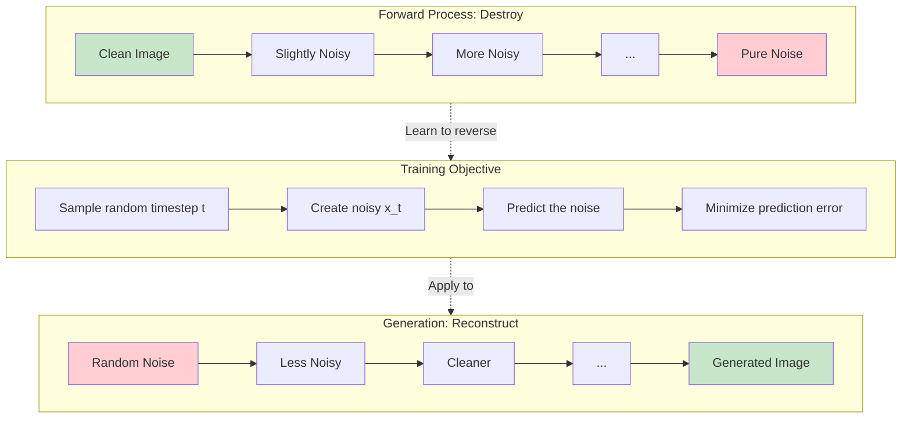
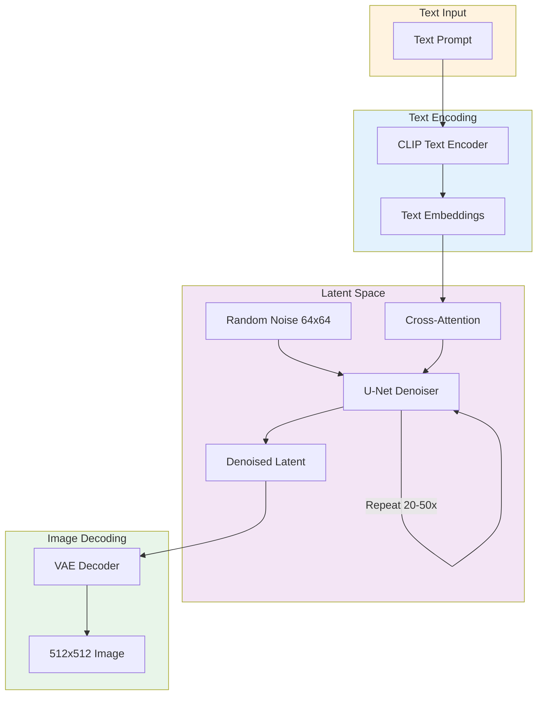
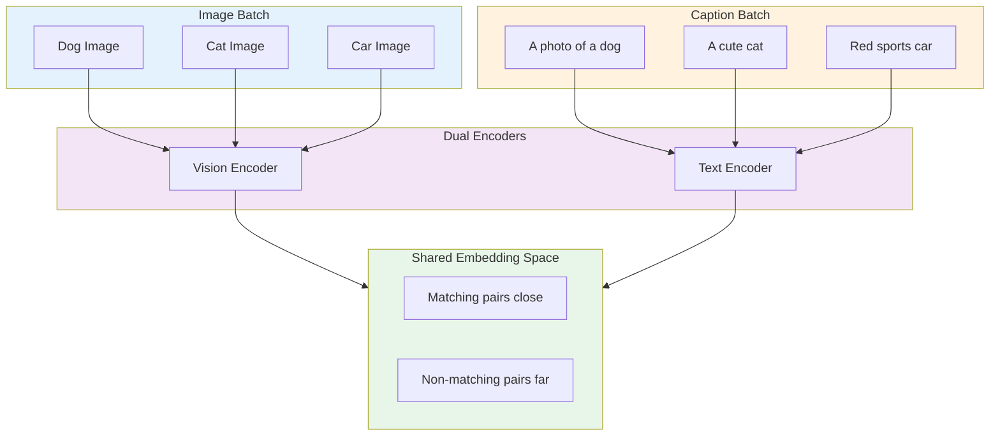
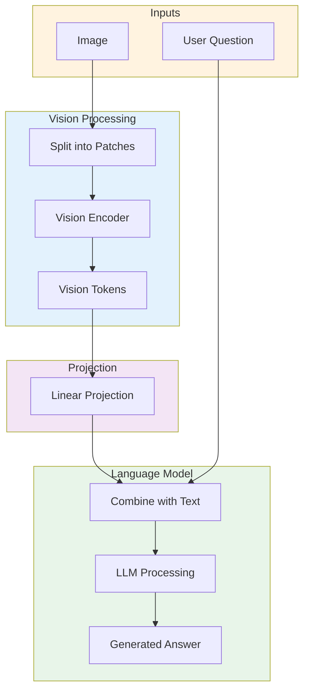
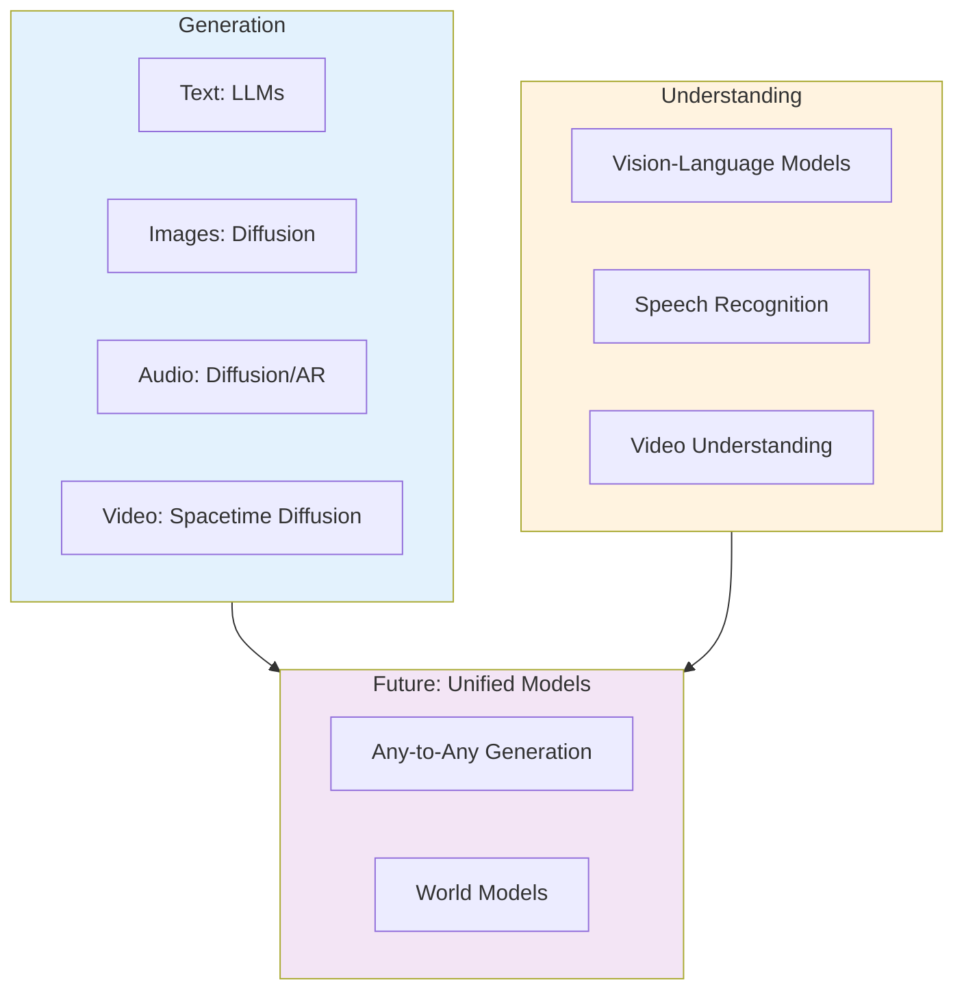

import Tip from "@components/mdx/Tip.astro";
import Warning from "@components/mdx/Warning.astro";
import Info from "@components/mdx/Info.astro";
import Definition from "@components/mdx/Definition.astro";
import Quiz from "@components/react/Quiz";
import HandsOnExercise from "@components/react/HandsOnExercise";

# Diffusion Models and Multimodal AI

Language models transformed how we interact with text. But the world is not just text. We see images, hear sounds, watch videos. True artificial intelligence must understand and generate across modalities. This module explores the technologies that make this possible.

## Beyond Text: The Multimodal Frontier

The multimodal revolution happened in two waves that fundamentally changed what AI systems can accomplish.

The first wave arrived in 2021-2022 with text-to-image generation. DALL-E, Midjourney, and Stable Diffusion demonstrated that AI could generate photorealistic images from text descriptions. Typing "a cat wearing a spacesuit on Mars" and receiving a convincing image seconds later was not just impressive; it was transformative for creative industries. Suddenly, visual concepts that would take hours to sketch or commission could be explored in moments.

The second wave came in 2023-2024 with multimodal understanding. GPT-4V, Claude with vision, and open models like LLaVA demonstrated that language models could see. Users could upload an image, ask questions about it, and receive intelligent answers. Visual question answering moved from research demonstrations to production systems that millions of people use daily.

Today, we stand at the convergence of these waves. Models generate images, understand images, and increasingly bridge between modalities fluidly. Understanding how these systems work is essential for any developer building modern AI applications.

<Info>
Multimodal AI refers to systems that can process or generate content in multiple formats, such as text, images, audio, or video. Rather than being specialists in one domain, these models develop cross-modal understanding that often exceeds the capabilities of single-modal systems.
</Info>

### Why Images and Audio Matter

Text is powerful but limited. Consider these scenarios where multimodal capabilities unlock new possibilities.

In design and creativity, a graphic designer needs variations of a logo concept. Describing each variation in text is tedious and imprecise, but generating visual options provides instant exploration of the design space. The designer can iterate on promising directions and discard others in minutes rather than hours.

For documentation and troubleshooting, a technician photographs a broken machine part. Instead of trying to describe the problem in text, possibly missing crucial details, they can simply ask: "What's wrong with this component?" A vision-language model can identify issues that might be difficult to articulate.

Accessibility benefits enormously from multimodal AI. A visually impaired user receives an image in a message. A multimodal model can describe its contents naturally, conveying not just what objects are present but the mood, composition, and context that make images meaningful.

In education, a student struggling with geometry can see step-by-step visual proofs alongside explanations. The combination of visual and textual information accelerates understanding in ways that neither modality achieves alone.

Medical imaging represents one of the highest-impact applications. Radiologists review thousands of scans. AI systems that understand medical images can flag anomalies for human review, helping ensure that subtle findings are not missed in high-volume settings.

### The Modality Challenge

Why is multimodal AI harder than text-only AI? Several fundamental challenges make cross-modal learning more complex.

Different data structures present the first hurdle. Text is sequential, with words appearing in order. Images are 2D grids of pixels. Audio is 1D waveforms over time. Video adds temporal dimension to images. Each modality requires different processing approaches, and connecting them demands architectural innovation.

<Definition term="Modality">
In AI contexts, a modality refers to a type of data or sensory input, such as text, images, audio, or video. Each modality has distinct characteristics that require specialized processing techniques.
</Definition>

Information density varies dramatically across modalities. A 1000-word essay contains roughly 1000 tokens. A single 1024x1024 image contains over 1 million pixels. Naive approaches that try to process every pixel as if it were a token simply do not scale. This density mismatch drove the development of compression techniques like autoencoders and patch-based processing.

Alignment problems arise because correspondences are implicit. How do you connect the word "cat" in a caption to the pixels depicting the cat in an image? This relationship is not labeled in the training data. Models must learn to ground language in visual content through indirect supervision.

Generation challenges compound these issues. Generating coherent text means selecting from roughly 50,000 vocabulary tokens at each step. Generating coherent images means selecting from billions of possible pixel combinations. The search space explodes, requiring fundamentally different generation strategies.

These challenges drove the development of specialized architectures. Diffusion models solved the generation problem. Contrastive learning through CLIP solved the alignment problem. Vision transformers adapted attention to images. Together, they enable modern multimodal AI.

## Diffusion Models Explained

Diffusion models approach image generation through an unusual lens: destruction and reconstruction. This counterintuitive strategy has proven remarkably effective.

### The Core Insight

The fundamental insight behind diffusion models is surprisingly simple: if you can learn to reverse gradual noise addition, you can generate images by starting from pure noise and progressively removing it.

Most generative models try to learn the data distribution directly. How likely is this particular arrangement of pixels to be a real image? Diffusion models learn the opposite: how to undo corruption. Given an image that has been partially obscured by noise, the model learns to predict what the cleaner version looks like.

<Definition term="Diffusion Model">
A generative model that learns to reverse a gradual noise-adding process. By training to denoise images at various corruption levels, the model can generate new images by starting from pure noise and iteratively removing it.
</Definition>

This approach has several advantages. The training objective is simple and stable. Each step makes small, well-defined progress. And the iterative nature allows the model to refine its output progressively, first establishing global structure and then adding fine details.

### The Forward Process: Adding Noise

The forward process is mathematically simple and requires no learning. Given a clean image, we gradually add Gaussian noise over many timesteps. At timestep 1, we add a little noise. At timestep 2, we add a bit more. By timestep 1000, the original image is completely destroyed, reduced to random static with no trace of the original content.

The rate at which noise accumulates is controlled by a noise schedule. This schedule determines how quickly the image degrades. With a linear schedule, noise increases steadily. With a cosine schedule, noise accumulates more gradually in early steps. The choice of schedule affects training efficiency and output quality.

A crucial mathematical property makes training efficient: we can compute the noisy version at any timestep directly from the original image without simulating all intermediate steps. If we want to know what the image looks like at timestep 500, we can jump directly there using a closed-form equation. This property enables efficient random sampling during training.

<Tip>
The forward process destroys information in a controlled, predictable way. Because we know exactly how noise was added, we can train a neural network to predict and remove it, recovering the original signal.
</Tip>

### The Reverse Process: Learning to Denoise

The reverse process is where learning happens. A neural network learns to predict the noise that was added at each step, enabling us to remove it and recover a cleaner image.

Training follows a straightforward recipe. Sample a clean image from your training data. Sample a random timestep between 1 and 1000. Sample random noise and add it to the image to create the noisy version. Train the network to predict what noise was added. The loss function is simply the mean squared error between the predicted noise and the actual noise.

The network learns to denoise at every noise level. It sees heavily corrupted images where barely any structure remains and slightly corrupted images where fine details are obscured. At each noise level, it learns the appropriate denoising behavior.

During generation, we reverse the process. Start with pure random noise. Use the network to predict and remove some noise. Repeat 20 to 50 times until a clean image emerges. Each step makes the image a little cleaner, a little more coherent.

### The U-Net Architecture

Diffusion models typically use a U-Net architecture for the denoising network. This architecture has proven particularly effective for image-to-image tasks where the output has the same resolution as the input.

The U-Net has an encoder path that progressively reduces spatial resolution while increasing the number of feature channels. This captures global context, understanding the overall composition and content of the image. The bottleneck processes information at the lowest resolution, often incorporating self-attention to capture long-range dependencies.

The decoder path reverses the encoder, progressively increasing resolution while decreasing channel depth. Crucially, skip connections connect each encoder layer directly to its corresponding decoder layer. These connections preserve fine details that would otherwise be lost through the compression and expansion.

<Info>
The U-Net was originally developed for biomedical image segmentation in 2015. Its ability to preserve fine details while also capturing global context made it ideal for the denoising task at the heart of diffusion models.
</Info>

The network also receives the timestep as input. This tells the model how noisy the current image is, allowing it to adjust its behavior. At high noise levels, the model focuses on establishing global structure. At low noise levels, it focuses on refining fine details. Sinusoidal embeddings, similar to positional encodings in transformers, encode the timestep into a continuous vector that is injected into the network.

### Why Diffusion Works So Well

Several properties make diffusion models remarkably effective compared to earlier generative approaches.

Training stability is a major advantage. Unlike generative adversarial networks that require careful balancing between generator and discriminator, diffusion models train with a simple mean-squared error loss. There is no adversarial dynamic, no mode collapse, no training instability. This makes them much easier to work with in practice.

Output quality benefits from the iterative refinement process. Rather than generating an image in a single forward pass, diffusion models make many small, accurate corrections. This allows them to produce remarkably detailed outputs that capture fine textures and subtle variations.

Controllability integrates naturally into the framework. Text conditioning, class labels, or other signals can guide the denoising process. The model simply learns to denoise differently based on the conditioning signal.

Theoretical grounding provides a foundation for principled improvements. Diffusion models have deep connections to score matching, stochastic differential equations, and variational inference. This mathematical foundation enables researchers to develop improvements with theoretical justification.

Scalability has proven excellent. Larger diffusion models consistently produce better results. More data, more compute, and more parameters all lead to improvements in a predictable way.

## Text-to-Image Generation

Diffusion models can generate images, but controlling what they generate requires connecting text descriptions to the image generation process. This connection is the key innovation that made tools like DALL-E, Midjourney, and Stable Diffusion possible.

### CLIP: Connecting Language and Vision

CLIP, which stands for Contrastive Language-Image Pre-training, learns a shared embedding space for text and images. Developed by OpenAI, it provides the bridge between language and visual concepts that text-to-image models require.

<Definition term="CLIP">
A neural network trained on 400 million image-caption pairs to learn aligned representations of text and images. Given any text and image, CLIP can compute how semantically related they are by comparing their embeddings.
</Definition>

The training data for CLIP consisted of 400 million image-caption pairs scraped from the internet. The architecture includes an image encoder, typically a Vision Transformer, that converts images to vectors, and a text encoder, a transformer that converts text to vectors. Both encoders produce embeddings in the same dimensional space.

The training objective uses contrastive learning. Given a batch of image-caption pairs, the model learns to place matching pairs near each other in embedding space while pushing non-matching pairs apart. The image of a dog should be close to "a photo of a dog" but far from "a tropical beach."

After training, CLIP understands visual concepts through language. The vector for "dog" is similar to vectors for dog images. "Sunrise over ocean" is close to such images in the shared space. Even abstract concepts like "freedom" or "chaos" have visual associations that CLIP has learned.

This learned alignment is the foundation for text-guided image generation. When you type a prompt, CLIP converts it to a vector that captures its visual meaning. The diffusion model then generates an image that matches that vector.

### Latent Diffusion: Efficiency Through Compression

Running diffusion in pixel space is computationally expensive. A 512x512 RGB image has over 786,000 values. Processing this at every denoising step requires enormous compute. Latent Diffusion Models solve this by operating in a compressed latent space.

The approach uses a two-stage training process. First, train an autoencoder that compresses images. The encoder takes a 512x512 image and compresses it to a 64x64 latent representation, a 64-fold reduction in size. The decoder reconstructs the image from this compressed form. This autoencoder is trained separately and frozen before diffusion training begins.

<Tip>
Latent diffusion operates on compressed representations, making it dramatically more efficient. This is why Stable Diffusion can run on consumer GPUs while achieving quality comparable to models that would require supercomputers in pixel space.
</Tip>

Second, train the diffusion model in this compressed latent space. The forward process adds noise to latents, not pixels. The reverse process denoises latents. Because we are working with 64x64 instead of 512x512, operations are roughly 100 times faster.

To generate an image, the diffusion process produces a denoised latent, then the decoder converts it to a full-resolution image. The quality depends on how well the autoencoder preserves information. Modern variational autoencoders achieve remarkable reconstruction quality, allowing the compressed diffusion approach to match or exceed pixel-space methods.

### The Stable Diffusion Architecture

Stable Diffusion, the most widely-used open-source text-to-image model, combines these components into a coherent system.

The architecture includes four main parts. A VAE encoder compresses images to latents during training. A VAE decoder reconstructs images from latents during generation. A text encoder, based on CLIP, converts text prompts to embeddings. A U-Net performs conditional denoising in latent space.

The generation pipeline flows as follows. The text prompt is encoded with CLIP to produce a text embedding. A latent is initialized with random noise. The U-Net iteratively denoises this latent, guided by the text embedding, over 20 to 50 steps. The final denoised latent is passed through the VAE decoder to produce the output image.

Text conditioning enters the U-Net through cross-attention layers. At each resolution level in the U-Net, cross-attention allows spatial locations in the image to attend to relevant words in the prompt. When generating "a cat wearing a hat," the pixels forming the cat attend to "cat," while pixels forming the hat attend to "hat." This fine-grained alignment between text and image regions is what makes prompt-following work.

### Classifier-Free Guidance

Raw conditional diffusion often produces images that match the prompt weakly. Classifier-free guidance, or CFG, amplifies the conditioning signal to improve prompt adherence.

The technique works by running the denoiser twice at each step. Once with the text conditioning, producing a conditional noise prediction. Once without conditioning, producing an unconditional noise prediction. The final prediction is the unconditional prediction plus an amplified difference between conditional and unconditional predictions.

<Warning>
Higher guidance scale improves prompt adherence but reduces diversity and can cause visual artifacts. The typical range is 7-15, with 7-10 for photorealistic images and 10-15 for stylized content. Going above 20 often produces distorted results.
</Warning>

The guidance scale controls how strongly the conditioning affects the output. Higher values push the output more strongly toward matching the prompt, but with trade-offs. Very high guidance can cause oversaturation, weird artifacts, or reduced diversity. The sweet spot depends on the application and artistic intent.

### Capabilities and Limitations

Current text-to-image models excel at many tasks. They produce photorealistic scenes, objects, and textures. They capture artistic styles and allow aesthetic control. They combine concepts in novel ways. With extensions like ControlNet, they can follow specific compositions, poses, or structures.

But significant limitations remain. Text rendering is unreliable; models struggle to generate legible text within images. Counting is imprecise; asking for "three cats" might produce two or four. Spatial relationships are often wrong; "cat on top of dog" may be reversed. Human anatomy, especially hands, frequently appears distorted with wrong numbers of fingers or impossible poses.

<Info>
These limitations stem from how diffusion models process information. They excel at capturing statistical patterns in images but lack explicit understanding of physics, geometry, or symbolic content like text. Each generation of models improves on these weaknesses, but fundamental challenges remain.
</Info>

Consistency across images is another challenge. Generating the same character in different scenes or poses is difficult. Each generation produces variations that may not match. This limits applications like illustration series or character design where consistency matters.

## Vision-Language Models

Text-to-image models generate images from text. Vision-language models do the reverse: they understand images and respond with text. This capability emerged from combining large language models with visual encoders.

### From Generation to Understanding

The key insight is surprisingly simple: if we can project image features into the language model's embedding space, the language model can "see." The visual information becomes another type of token that the model processes alongside text tokens.

This approach leverages a powerful capability. Language models already understand complex reasoning, follow instructions, and generate coherent text. They do not need to learn these skills from scratch. They only need to learn how to interpret visual input, which is a much smaller learning task.

<Definition term="Vision-Language Model (VLM)">
A model that combines visual understanding with language capabilities, typically by projecting image features into the embedding space of a large language model. VLMs can describe images, answer questions about visual content, and reason about what they see.
</Definition>

### How Vision-Language Models Process Images

The typical pipeline involves several stages. First, the image is preprocessed and split into patches, similar to how text is split into tokens. For a 336x336 image with 14x14 patches, this produces 196 vision tokens.

A vision encoder, often a CLIP Vision Transformer, processes these patches and produces rich feature representations. Each patch becomes a vector that captures local visual information in the context of the whole image.

A projection layer maps these vision features to the language model's embedding dimension. This is often as simple as a linear transformation, though some architectures use more sophisticated mappings. The projection allows the language model to process visual and textual information in a unified way.

The vision tokens are interleaved with text tokens to form the input sequence. The language model then attends to both types of tokens, allowing it to integrate visual and textual information as it generates its response.

<Tip>
The projection layer is the crucial bridge between vision and language. Despite its simplicity, often just a linear layer or small MLP, it enables sophisticated visual understanding by connecting pre-trained vision and language components.
</Tip>

### Capabilities of Modern VLMs

Modern vision-language models like GPT-4V, Claude with vision, and open-source alternatives demonstrate impressive capabilities.

They excel at image description, providing natural language summaries of visual content that capture not just objects but relationships, activities, and mood. They answer questions about images, handling queries that range from simple recognition to complex reasoning. They analyze charts, diagrams, and documents, extracting structured information from visual presentations.

They read and understand text in images through integrated OCR capabilities. They reason about spatial relationships, identifying what is near what, what contains what, and how elements relate to each other. They can compare multiple images, noting similarities, differences, and changes over time.

### Emerging Applications

Document understanding represents a high-value application. VLMs can parse invoices, forms, and academic papers, extracting structured information from unstructured visual documents. This enables automation of workflows that previously required human review.

GUI interaction opens possibilities for AI agents. VLMs can understand screenshots, identify UI elements, and suggest interactions. This is the foundation for AI systems that can operate computer interfaces on behalf of users.

Video understanding extends image capabilities to temporal sequences. By processing videos as sequences of frames, VLMs can describe events, track objects, and answer questions that require temporal reasoning.

<Info>
The rapid improvement of VLMs is driven by data diversity and scale. As training datasets grow to include more types of images, documents, and visual content, models develop increasingly sophisticated understanding.
</Info>

### Limitations of Current VLMs

Vision-language models have important limitations that affect their reliability.

Hallucination remains a significant challenge. VLMs sometimes describe objects or details that are not present in the image. This is particularly problematic for applications where accuracy is critical, such as medical imaging or legal document review.

Spatial reasoning is imperfect. Understanding precise spatial relationships like "the red ball is between the blue and green cubes" remains challenging. Models often make errors in complex spatial configurations.

Fine-grained recognition requires specialized training. Distinguishing similar categories like specific bird species or car models is difficult without domain-specific fine-tuning. General VLMs may not achieve the accuracy of specialized classifiers.

Consistency can vary. The same image may elicit different responses in different contexts or with slightly different prompts. This makes VLMs less reliable for applications requiring deterministic behavior.

## Audio and Video Frontiers

The principles powering image generation extend naturally to audio and video. These modalities present additional challenges but follow similar patterns.

### Audio Generation with Diffusion

Audio can be represented in multiple ways, each lending itself to different diffusion approaches.

Waveform diffusion operates directly on raw audio samples. This produces the highest quality output but is computationally expensive due to high sample rates. A single second of audio at CD quality contains 44,100 samples.

Spectrogram diffusion converts audio to time-frequency representations, essentially 2D images, and runs diffusion on these. This leverages image diffusion techniques and is more efficient, though conversion back to audio can introduce artifacts.

Token-based approaches encode audio into discrete tokens, similar to text, then use autoregressive or diffusion models on these token sequences. This approach powers systems like MusicGen and has shown strong results for both music and speech.

<Definition term="Spectrogram">
A visual representation of audio that shows frequency content over time. The x-axis represents time, the y-axis represents frequency, and color intensity represents amplitude. Spectrograms allow audio to be processed using image-based techniques.
</Definition>

### Music Generation

Several systems now generate music from text prompts with impressive quality.

These systems can control genre and style, responding to prompts like "jazz piano with upright bass." They capture mood specifications like "energetic and uplifting." They handle instrumentation requests and structural elements like verse-chorus patterns.

<Warning>
Music generation raises significant copyright concerns. Many systems were trained on copyrighted music, leading to ongoing legal questions about the ownership and licensing of AI-generated music. These issues remain unresolved.
</Warning>

Current limitations include long-form coherence, where songs may lack structural development over time, and precise control, where specifying exact melodies or harmonies is difficult. The relationship between text prompts and musical output is less precise than text-to-image generation.

### Video Generation

Video adds temporal consistency to image generation. A video is a sequence of frames that must be coherent not just individually but across time. Objects should move smoothly, scenes should remain consistent, and physics should be plausible.

Current approaches extend image diffusion with temporal attention, allowing the model to consider relationships between frames. Some systems operate on 3D latent spaces that capture both spatial and temporal information. Others generate frames autoregressively, conditioning each on previous frames.

Systems like Sora have demonstrated minute-long videos with consistent characters, complex camera movements, and some understanding of physics. Reflections, shadows, and object permanence are handled with increasing sophistication.

Yet limitations remain. Physics violations occur, with objects passing through each other or moving in impossible ways. Temporal inconsistencies accumulate over longer durations. Fine-grained interactions between objects or characters often appear wrong. And video generation remains extremely compute-intensive.

<Info>
The trajectory suggests video generation will become increasingly capable. Just as image generation progressed from blurry outputs to photorealism in a few years, video is following a similar path of rapid improvement.
</Info>

### The Convergence Trend

A clear trend emerges across modalities: convergence toward unified architectures. Rather than separate models for text, images, audio, and video, research increasingly focuses on models that handle all modalities in a unified framework.

This unification offers advantages. Shared representations can capture relationships between modalities that separate models miss. A single model can be more practical to deploy and maintain than a collection of specialists. And cross-modal understanding may emerge from training on diverse data.

The ultimate vision is world models that understand not just individual modalities but the underlying reality they represent. These models would understand physics, causality, and the relationships between different ways of perceiving the world. We are in the early stages of this journey.

## Practical Applications and Considerations

Understanding multimodal AI capabilities helps in choosing the right approach for different applications.

### When to Use Multimodal AI

Content creation benefits enormously from generative models. Marketing assets, social media content, concept art, and design exploration all become faster and cheaper. The key is using AI as a tool for exploration and iteration rather than final production.

Product applications include visual search, where users find products by uploading images rather than typing descriptions. Automatic alt-text generation improves accessibility at scale. Document processing extracts structured data from unstructured visual inputs. Quality inspection in manufacturing uses vision models to detect defects.

<Tip>
For most applications, consider combining AI generation with human review. AI can generate options quickly, but human judgment ensures quality, appropriateness, and alignment with specific goals.
</Tip>

User interfaces can leverage multimodal understanding. Conversational interfaces that accept images create more natural interactions. Voice assistants with visual context can help users with tasks involving physical objects. Accessibility tools transform visual information into other modalities.

Analysis and research applications include medical image analysis, satellite imagery interpretation, scientific visualization, and security monitoring. These high-stakes applications require careful validation but can benefit from AI assistance with appropriate oversight.

### Choosing the Right Approach

For image generation, the choice depends on requirements. API services like DALL-E or Midjourney offer convenience for quick prototypes. Stable Diffusion with extensions like ControlNet provides fine control and customization. Self-hosted open-source models enable high-volume generation without per-image costs. Fine-tuned models work best for specific domains with consistent requirements.

For image understanding, general-purpose models like GPT-4V or Claude handle diverse queries well. Open models like LLaVA offer high throughput for cost-sensitive applications. Task-specific vision models may outperform generalists for narrow applications where accuracy is critical.

For audio and video, the landscape is evolving rapidly. Music generation has several mature options. Text-to-speech has achieved near-human quality with multiple providers. Video generation is improving quickly but remains computationally intensive and less reliable than image generation.

### Ethical Considerations

Multimodal AI raises significant ethical questions that require active attention.

<Warning>
The ability to generate realistic images, video, and audio creates substantial risks for misinformation and fraud. Detection tools lag behind generation capabilities, making it increasingly difficult to distinguish authentic from synthetic media.
</Warning>

Deepfakes and misinformation are immediate concerns. Generated images and videos can spread false information at scale. While detection tools exist, they are imperfect, and the authenticity of visual media can no longer be assumed.

Copyright and ownership questions remain unresolved. Training on copyrighted material without consent raises legal questions in multiple jurisdictions. The ownership of AI-generated outputs, especially those that reproduce styles or content from training data, is contested.

Bias and representation manifest in generated content. Models trained on internet data reflect societal biases, potentially perpetuating stereotypes or underrepresenting certain groups.

Economic disruption affects creative professions as AI generates content at scale. While AI can augment human creativity, it also changes the economics of creative work.

Consent and privacy concerns arise from voice cloning and face generation capabilities. These can be used without the consent of the people being imitated.

Best practices for deploying multimodal AI include implementing watermarking for AI-generated content, respecting opt-out requests for training data, disclosing AI involvement in content creation, avoiding applications that could harm individuals, monitoring for misuse and having takedown procedures, and considering the environmental impact of training and inference.

## Diagrams

### The Diffusion Process

### Stable Diffusion Architecture

### CLIP Contrastive Learning

### Vision-Language Model Pipeline

### Multimodal AI Landscape

## Hands-On Exercise

<HandsOnExercise
  client:visible
  moduleSlug="diffusion-multimodal-ai"
  exerciseId="image-generation-experiment"
  title="Image Generation Experiment"
  objective="Explore and document the capabilities and limitations of text-to-image models through systematic experimentation"
  totalTime="30-45 minutes"
  setupInstructions={[
    "Get access to an image generation system (DALL-E, Stable Diffusion, Midjourney, or similar)",
    "Open a document or notebook for recording observations and generated images",
    "Prepare to generate at least 12 images across different categories"
  ]}
  parts={[
    {
      id: "prompt-specificity",
      title: "Test Prompt Specificity",
      duration: "10 min",
      instructions: [
        "Generate an image for the prompt: 'dog'",
        "Generate an image for: 'a golden retriever'",
        "Generate an image for: 'a golden retriever puppy playing in autumn leaves'",
        "Generate an image for: 'a golden retriever puppy playing in autumn leaves, professional photography, shallow depth of field, golden hour lighting'",
        "Record how each level of specificity affects quality, consistency, and composition",
        "Note which details (subject, style, lighting, technical terms) had the most impact"
      ],
      observePrompt: "How does adding detail change the output? Is there a point where additional details stop improving results or create confusion?"
    },
    {
      id: "known-limitations",
      title: "Explore Known Limitations",
      duration: "10 min",
      instructions: [
        "Test text rendering with: 'A sign that says OPEN 24 HOURS'",
        "Test counting with: 'Three red apples and two green apples on a table'",
        "Test spatial relationships with: 'A cat sitting on top of a dog'",
        "Test anatomy with: 'A hand holding a pencil, writing in a notebook'",
        "Document which prompts succeed and which fail",
        "Note how the model interprets or misinterprets each instruction",
        "Try variations if initial attempts fail to see if you can work around limitations"
      ],
      observePrompt: "Which limitations seem fundamental versus solvable with better prompting? Why do you think these specific challenges exist?"
    },
    {
      id: "style-control",
      title: "Experiment with Style Control",
      duration: "10 min",
      instructions: [
        "Use base subject 'a medieval castle on a cliff' and add: 'in the style of Studio Ghibli animation'",
        "Try the same base with: 'as an oil painting by Monet'",
        "Try with: 'as a cyberpunk neon-lit scene'",
        "Try with: 'as a technical architectural blueprint'",
        "Note how well the model captures each style",
        "Observe whether style modifiers affect structural accuracy or composition"
      ],
      observePrompt: "Which styles are captured most accurately? Does adding style affect other aspects like accuracy or detail level?"
    },
    {
      id: "analysis",
      title: "Write Analysis",
      duration: "15 min",
      instructions: [
        "Write a capability assessment: What types of images work well? What remains challenging?",
        "Document prompt engineering insights: What strategies were most effective for getting desired results?",
        "Consider practical applications: What would you recommend these tools for? What would you caution against?",
        "Record ethical observations: Did you notice any biases or content limitations in the outputs?",
        "Summarize what surprised you most about the model's capabilities or limitations"
      ],
      observePrompt: "How would you explain these capabilities and limitations to a client or stakeholder considering using image generation in their product?"
    }
  ]}
  successCriteria={[
    { id: "generation-volume", text: "Generated at least 12 images across different prompt categories" },
    { id: "documentation", text: "Documented both successful and unsuccessful generation attempts" },
    { id: "limitations", text: "Identified at least 3 specific model limitations through testing" },
    { id: "strategies", text: "Found at least 2 effective prompt engineering strategies" },
    { id: "applications", text: "Connected observations to real-world application considerations" }
  ]}
/>

## Knowledge Check

<Quiz
  client:load
  questions={[
    {
      question: "What is the core principle behind diffusion models for image generation?",
      options: [
        "They learn to directly sample from the data distribution",
        "They learn to reverse a gradual noise addition process",
        "They use adversarial training between generator and discriminator",
        "They compress images into discrete tokens for generation"
      ],
      correctAnswer: 1,
      explanation: "Diffusion models work by first defining a forward process that gradually adds noise to images until they become pure noise, then learning the reverse process to denoise. During generation, the model starts from pure noise and iteratively removes it to produce a clean image."
    },
    {
      question: "How does CLIP enable text-to-image generation?",
      options: [
        "CLIP directly generates images from text",
        "CLIP learns a shared embedding space where text and images with similar meanings are close together",
        "CLIP translates text into pixel values",
        "CLIP provides a loss function that measures image quality"
      ],
      correctAnswer: 1,
      explanation: "CLIP uses contrastive learning to train encoders that produce embeddings in the same vector space for both text and images. Matching text-image pairs have similar embeddings, allowing diffusion models to use CLIP text embeddings as conditioning to guide image generation toward content that matches the text description."
    },
    {
      question: "What is the primary advantage of latent diffusion models over pixel-space diffusion?",
      options: [
        "Higher image quality",
        "Better text conditioning",
        "Computational efficiency through operating on compressed representations",
        "Simpler training objectives"
      ],
      correctAnswer: 2,
      explanation: "Latent diffusion models compress images using a VAE before running diffusion, reducing the data size dramatically (for example, from 512x512 to 64x64). This makes training and inference 10-100x faster while maintaining comparable quality."
    },
    {
      question: "What challenge do vision-language models still struggle with most?",
      options: [
        "Basic object recognition",
        "Generating natural language responses",
        "Precise spatial reasoning and counting",
        "Processing images of different sizes"
      ],
      correctAnswer: 2,
      explanation: "Current VLMs struggle with precise spatial reasoning ('What is to the left of X?') and accurate counting ('How many cats are there?'). They excel at recognition, captioning, and qualitative understanding, but quantitative and precise spatial tasks remain challenging."
    },
    {
      question: "What is classifier-free guidance in diffusion models?",
      options: [
        "A technique for classifying generated images into categories",
        "A method that amplifies conditioning by comparing conditional and unconditional predictions",
        "A way to train diffusion models without labeled data",
        "An approach for filtering out low-quality generations"
      ],
      correctAnswer: 1,
      explanation: "Classifier-free guidance runs the denoiser twice (with and without text conditioning) and amplifies the difference between these predictions. This pushes the output more strongly toward matching the prompt, improving adherence at the cost of some diversity."
    }
  ]}
/>

## Summary

This module explored the multimodal AI landscape, from diffusion models for image generation to vision-language models for understanding.

Diffusion models generate images through a counterintuitive process of learning to reverse gradual noise addition. The forward process destroys images by progressively adding noise. The reverse process, learned by a neural network, removes noise step by step to generate new images. U-Net architectures with timestep conditioning perform the denoising, while latent diffusion makes the process efficient by operating in compressed spaces.

Text-to-image generation connects language and vision through CLIP, which learns aligned embeddings that place matching text and images near each other. Stable Diffusion combines VAE compression, CLIP encoding, and U-Net denoising into a system that generates images from text prompts. Classifier-free guidance amplifies prompt adherence. Despite impressive capabilities, current systems struggle with text rendering, counting, spatial relationships, and anatomical accuracy.

Vision-language models enable image understanding by projecting visual features into language model embedding spaces. Models like GPT-4V and LLaVA can describe images, answer questions, and reason about visual content. The projection layer bridges pre-trained vision and language components. Limitations include hallucination, imperfect spatial reasoning, and challenges with fine-grained recognition.

Audio and video generation extend these principles to new modalities. Audio diffusion operates on waveforms or spectrograms, enabling music and speech generation. Video adds temporal consistency requirements, with systems like Sora showing the potential for coherent long-form synthesis. The trend points toward unified multimodal models.

Practical deployment requires matching tools to tasks, understanding trade-offs between convenience and control, and attending to ethical considerations including deepfakes, copyright, bias, and consent.

## What's Next

In the next module, we will explore reasoning models and the frontiers of AI capabilities. We will examine how models like o1 achieve complex reasoning through extended thinking, investigate chain-of-thought prompting and its limitations, and consider where AI capabilities are heading. Understanding reasoning is essential as AI systems take on increasingly complex tasks.

## References

### Foundational Papers

- Ho, J., Jain, A., & Abbeel, P. (2020). "Denoising Diffusion Probabilistic Models." NeurIPS 2020. The paper that established modern diffusion models.

- Song, J., Meng, C., & Ermon, S. (2020). "Denoising Diffusion Implicit Models." ICLR 2021. Introduced DDIM for faster sampling.

- Rombach, R., et al. (2022). "High-Resolution Image Synthesis with Latent Diffusion Models." CVPR 2022. The Stable Diffusion paper.

- Radford, A., et al. (2021). "Learning Transferable Visual Models From Natural Language Supervision." ICML 2021. The CLIP paper.

- Liu, H., et al. (2023). "Visual Instruction Tuning." NeurIPS 2023. The LLaVA paper on efficient vision-language model training.

### Tutorials and Resources

- "The Illustrated Stable Diffusion" by Jay Alammar. Visual explanation of diffusion model mechanics.

- "What are Diffusion Models?" by Lilian Weng. Comprehensive technical overview of diffusion theory.

- Hugging Face Diffusers documentation. Practical guides for implementing and using diffusion models.

### Tools

- Stable Diffusion WebUI (Automatic1111). Popular interface for local image generation.

- ComfyUI. Node-based interface for complex diffusion workflows.

- Hugging Face Diffusers library. Python library for working with diffusion models programmatically.
