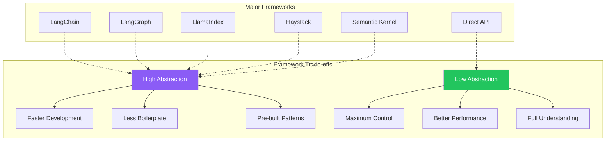
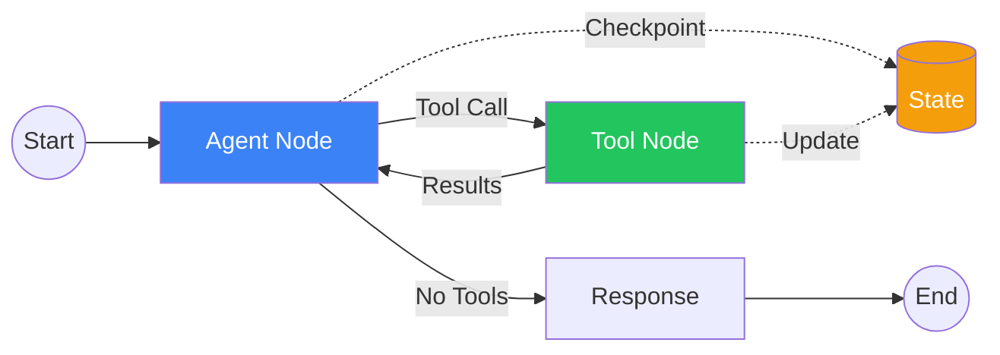
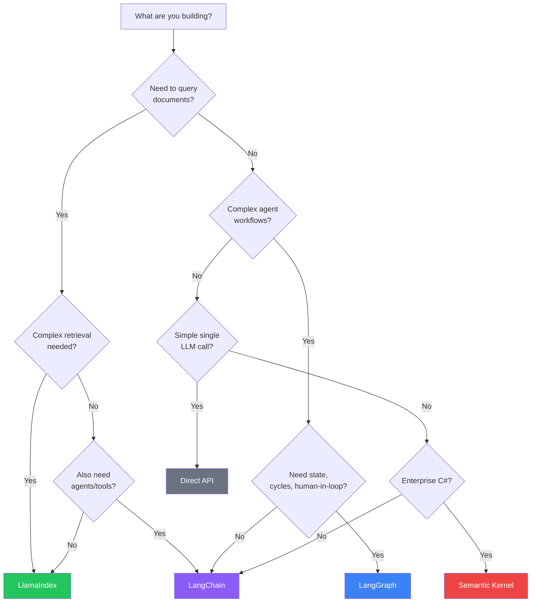

import Tip from "@components/mdx/Tip.astro";
import Warning from "@components/mdx/Warning.astro";
import Info from "@components/mdx/Info.astro";
import Definition from "@components/mdx/Definition.astro";
import Quiz from "@components/react/Quiz";
import HandsOnExercise from "@components/react/HandsOnExercise";

When you first call an LLM API, it feels simple. You send a prompt, you get a response. Why would you need a framework? Then reality hits with a series of challenges that quickly compound in complexity.

Composition becomes necessary when you need to chain multiple calls together. First classify the query, then route to different prompts based on classification, then validate the output, then maybe retry with corrections. Suddenly you are writing orchestration code.

Memory management grows complex quickly. Your chatbot needs to remember previous messages. Easy for 10 messages, but what about 1000? You need summarization, windowing, or vector storage. You find yourself writing memory management code.

Tool integration multiplies effort. Your agent needs to search the web, query a database, run code. Each tool has different interfaces. You are writing tool integration code.

RAG pipelines require significant infrastructure. You need to retrieve context from documents. That means embeddings, chunking, vector stores, retrieval strategies. You are writing an entire retrieval pipeline.

Production requirements add yet another layer. You need logging, tracing, evaluation, error handling, rate limiting, caching. You are writing infrastructure code.

Frameworks exist to solve these recurring problems. They provide abstractions with reusable components for common patterns, composability through ways to combine components into pipelines, integrations with pre-built connections to LLMs, vector stores, and tools, and best practices encoded into APIs through patterns that work.

## The Framework Landscape

<Definition term="AI Framework">
A software library that provides abstractions, components, and patterns for building applications powered by language models. Frameworks trade raw control for convenience, accelerating development of common patterns while adding abstraction layers.
</Definition>

The abstraction trade-off is fundamental to understanding when frameworks help and when they hinder. More abstraction means faster development for common use cases, less boilerplate code, community-tested patterns, and an ecosystem of integrations. But it also means a learning curve for the framework itself, less control over implementation details, debugging through abstraction layers, dependency on external library updates, and potential performance overhead.

The key question is whether the framework accelerates your specific use case more than it slows you down. For a simple chatbot, probably no framework is needed. For a production RAG system with multiple retrieval strategies, a framework probably helps significantly. For a novel research project, you might need the flexibility of working without one.



### The Major Players

The AI framework landscape includes several major options, each with distinct strengths.

LangChain is the most popular and feature-rich, but also most complex framework. It excels at composition and agents, making it best for general-purpose LLM applications.

LangGraph is LangChain's companion for stateful, graph-based agent workflows. It is best for complex multi-step agents with cycles and state.

LlamaIndex focuses specifically on data indexing and retrieval, making it best for RAG applications and knowledge bases.

Haystack is an end-to-end NLP framework with modular pipelines, best for production search and QA systems.

Semantic Kernel is Microsoft's orchestration framework, best for enterprise C# and .NET environments with tight Azure integration.

Direct API use means no framework, just HTTP calls. It is best for simple use cases, maximum control, and learning fundamentals.

## LangChain Deep Dive

LangChain is a framework for developing applications powered by language models. It provides components as modular abstractions for working with LLMs, chains as ways to combine components into multi-step workflows, agents as systems that use LLMs to choose actions dynamically, memory as systems for persisting state across interactions, and integrations connecting to 50+ LLM providers, vector stores, and tools.

LangChain's philosophy is to make LLM development composable, building complex applications by connecting simple, reusable components.

### Core Abstractions

LLMs and Chat Models wrap language model APIs with a consistent interface.

```python
from langchain_openai import ChatOpenAI
from langchain_anthropic import ChatAnthropic

# Initialize a chat model
llm = ChatOpenAI(model="gpt-4", temperature=0)

# Or use Claude
llm = ChatAnthropic(model="claude-sonnet-4-20250514")

# Simple invocation
response = llm.invoke("What is the capital of France?")
print(response.content)
```

Prompts are templates for constructing inputs to LLMs with variable substitution.

```python
from langchain_core.prompts import ChatPromptTemplate

# Create a reusable prompt template
prompt = ChatPromptTemplate.from_messages([
    ("system", "You are a helpful assistant that translates {input_language} to {output_language}."),
    ("human", "{text}")
])

# Format with variables
formatted = prompt.format_messages(
    input_language="English",
    output_language="French",
    text="Hello, how are you?"
)
```

Output Parsers extract structured data from LLM responses using Pydantic models.

```python
from langchain_core.output_parsers import JsonOutputParser
from pydantic import BaseModel, Field

class MovieReview(BaseModel):
    title: str = Field(description="Movie title")
    rating: int = Field(description="Rating from 1-10")
    summary: str = Field(description="Brief summary")

parser = JsonOutputParser(pydantic_object=MovieReview)

# Chain them together
chain = prompt | llm | parser
result = chain.invoke({
    "review": "Inception was mind-blowing! A solid 9/10...",
    "format_instructions": parser.get_format_instructions()
})
# result is a structured MovieReview object
```

<Info>
LangChain's power comes from composing these abstractions. A single chain might include a prompt template, model call, output parser, and several processing steps, all connected with the pipe operator.
</Info>

### LangChain Expression Language (LCEL)

LCEL is LangChain's declarative syntax for composing chains. The pipe operator connects components in a natural flow.

```python
# Simple chain: prompt -> model -> parser
chain = prompt | llm | parser

# Invoke the chain
result = chain.invoke({"text": "some input"})

# Stream outputs
for chunk in chain.stream({"text": "some input"}):
    print(chunk, end="")

# Batch process
results = chain.batch([{"text": "input1"}, {"text": "input2"}])

# Async
result = await chain.ainvoke({"text": "some input"})
```

LCEL provides streaming with first-class support for streaming outputs, async with native async/await support, batching for efficient parallel processing, retries with built-in retry logic, and tracing with automatic logging for debugging.

Complex LCEL patterns enable parallel execution and conditional routing.

```python
from langchain_core.runnables import RunnableParallel, RunnableBranch

# Parallel execution
parallel_chain = RunnableParallel(
    summary=summarize_chain,
    sentiment=sentiment_chain,
    entities=entity_chain
)

# All three run in parallel on the same input
results = parallel_chain.invoke({"document": "..."})
# results = {"summary": "...", "sentiment": "positive", "entities": [...]}

# Conditional routing
route_chain = RunnableBranch(
    (lambda x: "code" in x["query"].lower(), code_chain),
    (lambda x: "math" in x["query"].lower(), math_chain),
    default_chain  # fallback
)
```

### Memory Systems

LangChain provides several memory strategies for different use cases.

Conversation Buffer Memory stores all messages, simple but grows unbounded.

Conversation Buffer Window Memory keeps only the most recent N exchanges, preventing unlimited growth.

Conversation Summary Memory summarizes older messages using the LLM, preserving context while managing size.

Vector Store Memory stores messages in a vector database for semantic retrieval, enabling recall of relevant past context.

```python
from langchain.memory import ConversationSummaryMemory

memory = ConversationSummaryMemory(llm=llm)
# Automatically summarizes conversation as it grows
```

<Tip>
Choose memory strategy based on conversation length and relevance patterns. Buffer for short conversations, window for medium length, summary or vector for long-running interactions needing historical context.
</Tip>

### Building Agents

Agents use LLMs to decide which actions to take. They have access to tools and can reason about how to use them.

```python
from langchain.agents import create_tool_calling_agent, AgentExecutor
from langchain_core.tools import tool

# Define tools
@tool
def search_web(query: str) -> str:
    """Search the web for information."""
    return f"Results for: {query}"

@tool
def calculate(expression: str) -> str:
    """Evaluate a mathematical expression."""
    return str(eval(expression))

@tool
def get_weather(city: str) -> str:
    """Get current weather for a city."""
    return f"Weather in {city}: 72F, sunny"

tools = [search_web, calculate, get_weather]

# Create agent
agent = create_tool_calling_agent(llm, tools, prompt)
agent_executor = AgentExecutor(agent=agent, tools=tools, verbose=True)

# Run agent
result = agent_executor.invoke({
    "input": "What's 25 * 4, and what's the weather in Paris?",
    "chat_history": []
})
```

The agent analyzes the query, decides to use calculate for the math problem, decides to use get_weather for the Paris weather question, and combines results into a coherent response.

<Warning>
LangChain evolves rapidly with frequent API changes. Pin your versions carefully. Debugging through multiple abstraction layers can be challenging, so use verbose mode and LangSmith tracing when issues arise.
</Warning>

## LangGraph for Complex Agents

Standard LangChain agents follow a simple loop of think, act, observe, and repeat. This works for simple tasks but struggles with complex branching requiring different paths based on intermediate results, cycles and loops needing to revisit previous steps with new information, persistent state that must be maintained across steps, human-in-the-loop requirements for pausing at specific points, and error recovery requiring graceful handling of failures mid-workflow.

LangGraph addresses these challenges by modeling agents as graphs where nodes are functions that do work like calling LLMs or tools, edges define transitions between nodes, and state flows through the graph and persists across steps.



### Core Concepts

State is a typed schema that flows through the graph.

```python
from typing import TypedDict, Annotated, List
from langgraph.graph import StateGraph
from langchain_core.messages import BaseMessage
import operator

class AgentState(TypedDict):
    messages: Annotated[List[BaseMessage], operator.add]
    current_step: str
    tool_results: dict
    iteration_count: int
```

Nodes are functions that take state and return updated state.

```python
def call_model(state: AgentState) -> AgentState:
    """Node that calls the LLM."""
    messages = state["messages"]
    response = llm.invoke(messages)
    return {"messages": [response]}

def call_tool(state: AgentState) -> AgentState:
    """Node that executes a tool."""
    last_message = state["messages"][-1]
    tool_call = last_message.tool_calls[0]
    result = execute_tool(tool_call)
    return {"tool_results": {tool_call["name"]: result}}
```

Edges define flow between nodes, including conditional edges that route based on state.

```python
from langgraph.graph import END

def should_continue(state: AgentState) -> str:
    last_message = state["messages"][-1]
    if last_message.tool_calls:
        return "call_tool"
    return END

# Build graph
workflow = StateGraph(AgentState)
workflow.add_node("agent", call_model)
workflow.add_node("call_tool", call_tool)

workflow.set_entry_point("agent")
workflow.add_conditional_edges(
    "agent",
    should_continue,
    {"call_tool": "call_tool", END: END}
)
workflow.add_edge("call_tool", "agent")  # Loop back after tool call

app = workflow.compile()
```

### State Persistence and Human-in-the-Loop

LangGraph supports persistent state enabling pause/resume and human-in-the-loop workflows.

```python
from langgraph.checkpoint.memory import MemorySaver

# Add checkpointing
memory = MemorySaver()
app = workflow.compile(checkpointer=memory)

# Run with thread ID for persistence
config = {"configurable": {"thread_id": "user-123"}}
result = app.invoke({"messages": [HumanMessage(content="Hi!")]}, config)

# Later, continue the same conversation
result = app.invoke({"messages": [HumanMessage(content="What did I say before?")]}, config)
```

Human-in-the-loop workflows can pause for approval before sensitive actions by using interrupt_before on specific nodes. After human review, update_state applies approvals and execution resumes from the checkpoint.

### Multi-Agent Systems

LangGraph excels at coordinating multiple agents by routing between specialized nodes based on state flags.

```python
class MultiAgentState(TypedDict):
    messages: list
    current_agent: str
    research_complete: bool
    writing_complete: bool

def route(state: MultiAgentState):
    if not state.get("research_complete"):
        return "researcher"
    elif not state.get("writing_complete"):
        return "writer"
    else:
        return "reviewer"

workflow = StateGraph(MultiAgentState)
workflow.add_node("researcher", researcher_node)
workflow.add_node("writer", writer_node)
workflow.add_node("reviewer", reviewer_node)

workflow.set_entry_point("researcher")
workflow.add_conditional_edges("researcher", route)
workflow.add_conditional_edges("writer", route)
workflow.add_edge("reviewer", END)
```

## LlamaIndex for RAG

LlamaIndex is a framework specifically designed for connecting LLMs to data. While LangChain is general-purpose, LlamaIndex focuses deeply on data ingestion for loading documents from various sources, indexing for structuring data for efficient retrieval, querying for retrieving and synthesizing information, and RAG optimization with advanced retrieval and generation strategies.

If your primary task is helping an LLM understand your documents, LlamaIndex is purpose-built for this challenge.

### Core Abstractions

Documents and Nodes are the basic units of data.

```python
from llama_index.core import Document, SimpleDirectoryReader

# Load documents from a directory
documents = SimpleDirectoryReader("./data").load_data()

# Or create documents manually
doc = Document(
    text="LlamaIndex is a data framework for LLM applications.",
    metadata={"source": "website", "date": "2024-01-15"}
)
```

Indices are data structures that organize nodes for retrieval.

```python
from llama_index.core import VectorStoreIndex

# Create a vector index (most common)
index = VectorStoreIndex.from_documents(documents)

# Persist to disk
index.storage_context.persist(persist_dir="./storage")
```

Query Engines provide interfaces for querying indices.

```python
# Create a query engine
query_engine = index.as_query_engine()

# Query
response = query_engine.query("What is LlamaIndex?")
print(response)
```

### Advanced Indexing Strategies

LlamaIndex provides multiple index types for different use cases.

Vector Store Index embeds chunks and retrieves by similarity, the most common approach.

Summary Index summarizes documents for retrieval, better for questions requiring holistic understanding.

Tree Index creates hierarchical structure for large documents with inherent hierarchy.

Keyword Table Index extracts and indexes keywords, good for keyword-based queries.

### Node Parsing and Chunking

Chunking strategy dramatically affects RAG quality.

```python
from llama_index.core.node_parser import (
    SentenceSplitter,
    SemanticSplitterNodeParser,
    HierarchicalNodeParser
)

# Simple chunking by sentences/tokens
splitter = SentenceSplitter(chunk_size=1024, chunk_overlap=200)
nodes = splitter.get_nodes_from_documents(documents)

# Semantic chunking (split at semantic boundaries)
semantic_splitter = SemanticSplitterNodeParser(
    buffer_size=1,
    breakpoint_percentile_threshold=95,
    embed_model=OpenAIEmbedding()
)

# Hierarchical chunking (parent/child relationships)
hierarchical_splitter = HierarchicalNodeParser.from_defaults(
    chunk_sizes=[2048, 512, 128]
)
```

<Tip>
Semantic chunking often outperforms fixed-size chunking by respecting natural content boundaries. Hierarchical chunking enables parent-child retrieval where retrieving a child can surface the broader parent context.
</Tip>

### Query Transformations

Improve retrieval by transforming queries before search.

HyDE (Hypothetical Document Embeddings) generates a hypothetical answer document and uses its embedding for retrieval, often improving recall.

Multi-step query decomposition breaks complex questions into simpler sub-questions that can be answered independently, then synthesizes results.

### Response Synthesis

Control how retrieved nodes are combined into responses.

Compact mode stuffs all nodes into one prompt, fast but limited by context.

Refine mode iterates through nodes, refining the answer progressively.

Tree summarize performs hierarchical summarization for large result sets.

## Comparing Alternatives

### Haystack

Haystack is an end-to-end NLP framework from deepset, focused on production search and question answering systems. Its philosophy centers on pipelines of modular components with strong emphasis on production readiness including evaluation, deployment, and monitoring.

```python
from haystack import Pipeline
from haystack.components.retrievers import InMemoryEmbeddingRetriever
from haystack.components.generators import OpenAIGenerator
from haystack.components.builders import PromptBuilder

# Build RAG pipeline
rag_pipeline = Pipeline()
rag_pipeline.add_component("retriever", InMemoryEmbeddingRetriever(document_store))
rag_pipeline.add_component("prompt_builder", PromptBuilder(template="""
Given these documents: {{documents}}
Answer: {{question}}
"""))
rag_pipeline.add_component("llm", OpenAIGenerator(model="gpt-4"))

# Connect components
rag_pipeline.connect("retriever", "prompt_builder.documents")
rag_pipeline.connect("prompt_builder", "llm")
```

Use Haystack when building production search and QA systems, when you need strong evaluation capabilities, when you prefer explicit pipeline definitions over magic, or when coming from traditional NLP and search backgrounds.

### Semantic Kernel

Semantic Kernel is Microsoft's AI orchestration framework with strong C# and Python support. Its philosophy centers on a kernel that orchestrates plugins (skills and functions) with strong typing and enterprise patterns.

Use Semantic Kernel in C# and .NET environments, with heavy Azure investment, for enterprise compliance requirements, or for Microsoft ecosystem alignment.

### Direct API Use

Direct API use means no framework, just HTTP calls or thin SDK wrappers. This approach provides maximum control with minimum abstraction.

```python
from anthropic import Anthropic

client = Anthropic()

response = client.messages.create(
    model="claude-sonnet-4-20250514",
    max_tokens=1024,
    messages=[
        {"role": "user", "content": "Explain quantum computing."}
    ]
)

print(response.content[0].text)
```

Use direct APIs for simple single-purpose applications, for learning how LLMs work, for maximum performance without framework overhead, for novel use cases that do not fit framework patterns, when you want to understand every line of code, or when minimal dependencies are required.



## Making the Choice

### Decision Framework

Ask these questions to guide your choice.

What is your primary use case? Document Q&A and RAG points to LlamaIndex. Complex agents with state points to LangGraph. Search and QA systems point to Haystack. Enterprise C# environments point to Semantic Kernel. Simple chatbots or single calls point to direct API. General-purpose LLM apps point to LangChain.

How complex is your workflow? Linear pipelines work with LCEL or direct API. Branching logic benefits from LangGraph or Haystack. Cycles and loops require LangGraph. Multi-agent systems need LangGraph.

What is your team's expertise? Python developers can use LangChain, LlamaIndex, or Haystack. C# developers should consider Semantic Kernel. ML engineers can use any framework or direct API. Those new to AI should start simple with direct API, then add frameworks.

What are your production requirements? High throughput favors direct API with least overhead. Observability is strong in LangChain with LangSmith or Haystack with its evaluation framework. Enterprise compliance points to Semantic Kernel or Haystack.

### The Hybrid Approach

You do not have to choose just one framework. Many production systems combine tools effectively.

```python
# Example: LlamaIndex for retrieval, LangGraph for orchestration
from llama_index.core import VectorStoreIndex
from langgraph.graph import StateGraph

# LlamaIndex handles document retrieval
index = VectorStoreIndex.from_documents(documents)
retriever = index.as_retriever()

# LangGraph handles the agent workflow
def retrieve_context(state):
    query = state["query"]
    nodes = retriever.retrieve(query)
    return {"context": [n.text for n in nodes]}

def generate_response(state):
    context = "\n".join(state["context"])
    response = llm.invoke(f"Context: {context}\n\nQuestion: {state['query']}")
    return {"response": response}

# Build hybrid workflow
workflow = StateGraph(State)
workflow.add_node("retrieve", retrieve_context)
workflow.add_node("generate", generate_response)
workflow.add_edge("retrieve", "generate")
```

<Info>
The best advice is to start with the simplest approach that could work. Begin with direct API calls. Hit a pain point? Add a targeted tool. Building RAG? Try LlamaIndex. Need complex orchestration? Add LangGraph. Don't start with the most complex framework because it might be useful someday.
</Info>

<Quiz
  client:visible
  quizId="module-18-knowledge-check"
  moduleSlug="framework-deep-dive"
  questions={[
    {
      id: "q1",
      type: "multiple-choice",
      question: "What is the primary trade-off when using AI frameworks like LangChain?",
      options: [
        { id: "a", text: "Cost vs. performance" },
        { id: "b", text: "Speed of development vs. flexibility and control" },
        { id: "c", text: "Python vs. JavaScript compatibility" },
        { id: "d", text: "Cloud vs. on-premise deployment" }
      ],
      correctAnswer: "b",
      explanation: "Frameworks trade flexibility for convenience. They accelerate development for common patterns but add abstraction layers that reduce control over implementation details. The key question is whether the framework accelerates your specific use case more than it constrains you."
    },
    {
      id: "q2",
      type: "multiple-choice",
      question: "When would LangGraph be a better choice than standard LangChain agents?",
      options: [
        { id: "a", text: "When building a simple chatbot" },
        { id: "b", text: "When you need single-shot LLM calls" },
        { id: "c", text: "When building complex agents with cycles, state persistence, or human-in-the-loop requirements" },
        { id: "d", text: "When you only need document retrieval" }
      ],
      correctAnswer: "c",
      explanation: "LangGraph excels at complex agent workflows that require features standard LangChain agents don't support well: cycles and loops, persistent state across interactions, human-in-the-loop approval points, and multi-agent coordination. For simpler linear workflows, standard LCEL chains are sufficient."
    },
    {
      id: "q3",
      type: "multiple-choice",
      question: "What makes LlamaIndex particularly well-suited for RAG applications?",
      options: [
        { id: "a", text: "It has the largest community" },
        { id: "b", text: "It provides sophisticated chunking, indexing, and query transformation strategies purpose-built for document Q&A" },
        { id: "c", text: "It is the fastest framework" },
        { id: "d", text: "It works with the most LLM providers" }
      ],
      correctAnswer: "b",
      explanation: "LlamaIndex is purpose-built for connecting LLMs to data. It provides sophisticated chunking strategies (semantic, hierarchical), multiple index types (vector, summary, tree, keyword), and advanced query transformations (HyDE, multi-step decomposition). While LangChain can do RAG, LlamaIndex goes deeper on document retrieval challenges."
    },
    {
      id: "q4",
      type: "multiple-choice",
      question: "What is the best approach when you're unsure which framework to use?",
      options: [
        { id: "a", text: "Start with the most feature-rich framework (LangChain)" },
        { id: "b", text: "Start with direct API calls, then add framework tools as specific needs arise" },
        { id: "c", text: "Use all frameworks together from the start" },
        { id: "d", text: "Avoid frameworks entirely" }
      ],
      correctAnswer: "b",
      explanation: "Start simple and add complexity as needed. Direct API calls have zero framework overhead and maximum control. When you hit a specific pain point, add a targeted tool. This approach avoids premature complexity and ensures you understand what each framework component is doing for you."
    },
    {
      id: "q5",
      type: "multiple-choice",
      question: "Which memory strategy would be best for a long-running customer support chatbot that needs to recall relevant past conversations?",
      options: [
        { id: "a", text: "Conversation Buffer Memory storing all messages" },
        { id: "b", text: "Conversation Buffer Window Memory with the last 5 exchanges" },
        { id: "c", text: "Vector Store Memory with semantic retrieval" },
        { id: "d", text: "No memory, just the current conversation" }
      ],
      correctAnswer: "c",
      explanation: "Vector Store Memory stores messages in a vector database and retrieves semantically relevant past context. For long-running conversations where old context may become relevant again, semantic retrieval is more effective than buffer (which grows unbounded) or window (which forgets everything beyond the window)."
    }
  ]}
  passingScore={70}
  allowRetry={true}
/>

<HandsOnExercise
  client:visible
  moduleSlug="framework-deep-dive"
  exerciseId="framework-comparison"
  title="Framework Comparison Project"
  objective="Build the same RAG-powered Q&A system using three different approaches: direct API, LlamaIndex, and LangChain. Compare the developer experience, code complexity, and capabilities."
  totalTime="90-120 minutes"
  setupInstructions={[
    "Create a new Python project with a virtual environment",
    "Install required packages: openai (or anthropic), llama-index, langchain, chromadb, numpy",
    "Create a 'documents' folder with 3 text files on different topics (e.g., Python docs, JavaScript docs, SQL docs)",
    "Set up your API keys in a .env file"
  ]}
  parts={[
    {
      id: "direct-api-implementation",
      title: "Build RAG with Direct API Calls",
      duration: "30 min",
      instructions: [
        "Load documents from the folder and split into chunks (simple split by paragraphs or fixed size)",
        "Generate embeddings for each chunk using OpenAI's text-embedding-3-small API",
        "Store chunks and embeddings in a simple data structure (list of dicts)",
        "Implement cosine similarity function using numpy",
        "For a query: embed it, find top 3 most similar chunks, pass to LLM with context",
        "Return the answer"
      ],
      observePrompt: "How much code did you need to write? What was hardest: embedding, retrieval, or LLM integration?"
    },
    {
      id: "llamaindex-implementation",
      title: "Build RAG with LlamaIndex",
      duration: "20 min",
      instructions: [
        "Use SimpleDirectoryReader to load documents from the same folder",
        "Create a VectorStoreIndex from the documents (handles chunking and embedding automatically)",
        "Create a query engine from the index",
        "Query with the same question and get the response",
        "Note: what did the framework handle for you?"
      ],
      observePrompt: "How much simpler was this than direct API? What control did you lose by using the framework?"
    },
    {
      id: "langchain-implementation",
      title: "Build RAG with LangChain",
      duration: "25 min",
      instructions: [
        "Use DirectoryLoader to load documents from the same folder",
        "Use RecursiveCharacterTextSplitter to chunk the documents explicitly",
        "Create a Chroma vectorstore from the chunks with OpenAI embeddings",
        "Build a retrieval chain using LCEL: retriever | prompt | llm | output_parser",
        "Query with the same question and get the response"
      ],
      observePrompt: "How explicit was the LangChain approach compared to LlamaIndex? Did LCEL feel natural or confusing?"
    },
    {
      id: "comparison-testing",
      title: "Test and Compare Results",
      duration: "15 min",
      instructions: [
        "Query all three implementations with the same 3 test questions",
        "Compare answer quality: are they similar or different? Which is most accurate?",
        "Count lines of code for each implementation (excluding imports and comments)",
        "Note setup complexity: which was easiest to get working?",
        "Document what each framework gave you 'for free'"
      ],
      observePrompt: "Do the frameworks produce noticeably better or worse results? Or is the value mainly in developer convenience?"
    },
    {
      id: "analysis-and-recommendation",
      title: "Analyze Trade-offs",
      duration: "20 min",
      instructions: [
        "Create a comparison table: Approach, Lines of Code, Setup Complexity, Flexibility, What You Get Free, When to Use",
        "Document trade-offs: direct API gives max control but requires more code, LlamaIndex is simplest for RAG, LangChain is most composable",
        "Make recommendations: when would you use each approach?",
        "Reflect: which would you choose for a real project and why?"
      ],
      observePrompt: "Is there a clear winner or do different approaches suit different needs? What would make you choose direct API over frameworks?"
    }
  ]}
  successCriteria={[
    { id: "all-three-working", text: "Successfully implemented RAG with all three approaches: direct API, LlamaIndex, and LangChain" },
    { id: "consistent-testing", text: "Tested all implementations with the same questions and documented results" },
    { id: "quantitative-comparison", text: "Measured lines of code, setup time, and complexity for each approach" },
    { id: "qualitative-analysis", text: "Evaluated developer experience, flexibility, and what each framework provides" },
    { id: "comparison-table", text: "Created a clear comparison table documenting trade-offs" },
    { id: "reasoned-recommendations", text: "Provided thoughtful recommendations for when to use each approach based on use case" }
  ]}
/>

## Summary

AI frameworks exist to solve recurring problems in LLM application development including composition, memory, tools, RAG, and production infrastructure. The trade-off is always flexibility versus convenience. Choose based on whether the framework accelerates your specific use case more than it constrains you.

LangChain is the most comprehensive framework, offering components for LLMs, prompts, parsers, and memory, LCEL for composition, agents for dynamic tool use, and 50+ integrations. It is best for general-purpose LLM applications but has a steep learning curve.

LangGraph provides a graph-based workflow engine for complex agent systems. It excels at cycles, state persistence, human-in-the-loop, and multi-agent coordination. Use it when standard agent patterns are not sufficient.

LlamaIndex is purpose-built for connecting LLMs to data. Sophisticated chunking, indexing strategies, and query transformations make it the best choice when document Q&A is your primary use case.

Alternative frameworks serve specific niches. Haystack excels at production search and QA. Semantic Kernel serves enterprise C# environments. Direct API use provides maximum control for simple cases or learning.

There is no universally best framework. The right choice depends on your use case, team expertise, and production requirements. Start simple with direct APIs, understand what each tool offers, and add complexity only when it solves a real problem. A hybrid approach using the best tool for each part of your system often works best in production.

## References

**Framework Documentation**

LangChain Documentation at python.langchain.com/docs provides comprehensive coverage of LangChain and LCEL.

LangGraph Documentation at langchain-ai.github.io/langgraph covers building stateful, graph-based agent workflows.

LlamaIndex Documentation at docs.llamaindex.ai is the complete guide to data indexing and RAG with LlamaIndex.

Haystack Documentation at docs.haystack.deepset.ai covers the end-to-end NLP framework.

Semantic Kernel Documentation at learn.microsoft.com/semantic-kernel covers Microsoft's AI orchestration framework.

**Tutorials and Guides**

LangChain Cookbook at github.com/langchain-ai/langchain/cookbook provides practical recipes for common patterns.

LlamaIndex Starter Tutorials at docs.llamaindex.ai/en/stable/getting_started offer step-by-step guides for RAG applications.

Building LLM Applications with LangGraph from DeepLearning.AI is a free course on graph-based agent workflows.

**API Documentation**

OpenAI API Reference at platform.openai.com/docs/api-reference provides direct API documentation.

Anthropic API Reference at docs.anthropic.com covers Claude API documentation.

**Production Resources**

LangSmith Documentation at docs.smith.langchain.com covers LangChain's observability and evaluation platform.

"Emerging Architectures for LLM Applications" from a16z surveys production LLM application patterns.
