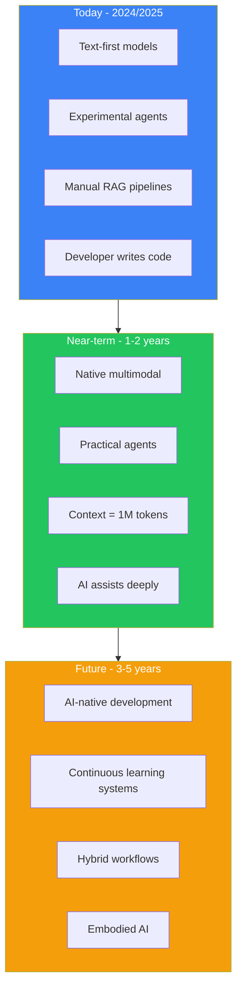
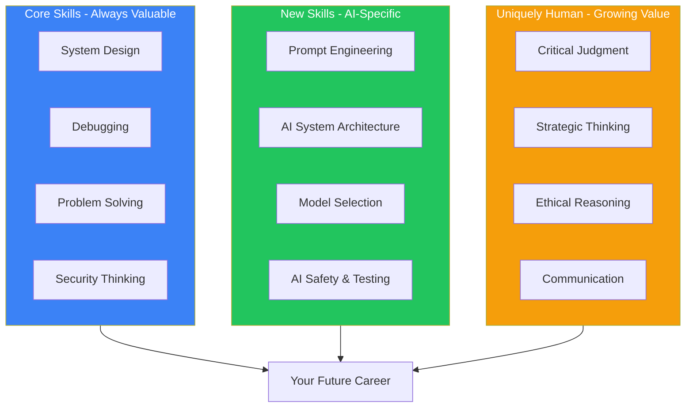
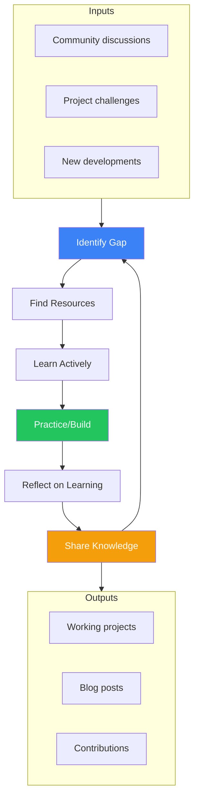

import Tip from "@components/mdx/Tip.astro";
import Warning from "@components/mdx/Warning.astro";
import Info from "@components/mdx/Info.astro";
import Definition from "@components/mdx/Definition.astro";
import Quiz from "@components/react/Quiz";
import HandsOnExercise from "@components/react/HandsOnExercise";

You have traveled through 22 modules, from mental models and CS fundamentals through the depths of transformers and attention mechanisms, to building agents and integrating AI into real-world workflows. This final module looks forward: where AI is heading, how your skills need to evolve, and how to build a sustainable practice for continuous growth.

The goal is not to predict the future precisely. That is impossible in a field moving this fast. The goal is to help you think about possibilities, invest your learning time wisely, and position yourself to thrive regardless of which specific technologies emerge.

## Where AI is Heading

<Definition term="AI Trajectory">
The expected direction of AI capability development over time. While specific predictions are unreliable, understanding broad trends helps developers make strategic decisions about skill investment and project choices.
</Definition>

Predicting technology futures is notoriously difficult. In 1943, IBM's chairman allegedly said there was a world market for maybe five computers. In 2007, Steve Ballmer predicted the iPhone would never gain significant market share.

AI predictions are particularly fraught because the field moves fast and what is true today may be obsolete in six months. Hype distorts reality as marketing claims outpace actual capabilities. Breakthroughs are unpredictable since transformers were not inevitable but discovered. Societal factors including regulation, ethics, and economics shape what gets built.

### Near-Term Trends (1-2 Years)

These trends are already visible and likely to accelerate.

Multimodal becomes standard. Current state has most models still primarily text-based with multimodal capabilities bolted on. Likely evolution brings native multimodal models that understand text, images, audio, and video equally well as the default. You will not think about image models versus text models but just use models that handle whatever input you provide. Impact on developers means designing interfaces assuming users can communicate through any modality where a user might upload a photo, ask a question about it, and get a video response.

Reasoning models mature. Current state shows early reasoning models like o1 demonstrating promise but being slow and expensive. Likely evolution has reasoning capabilities becoming faster, cheaper, and more reliable with the gap between quick generation and deep reasoning narrowing. Impact on developers means better tools for complex multi-step tasks with bugs in agentic workflows decreasing as reasoning improves, though you will still need to verify outputs.

Agents become practical. Current state has agents being experimental, working in demos but struggling in production. Likely evolution brings agent frameworks maturing with best practices emerging and tooling improving for debugging, monitoring, and controlling agents. Impact on developers means building agent-based systems routinely with the challenge shifting from can we make this work to how do we make this reliable and safe.

Context windows expand further. Current state has models handling 200K+ tokens, enough for small codebases or books. Likely evolution brings million-token context windows as standard where models can reason over entire codebases, large document collections, or extensive conversation histories. Impact on developers means RAG becomes less critical for many use cases since you can often just put everything in context, but you will need new UX patterns for navigating massive contexts.

Specialized models proliferate. Current state has a few general-purpose models dominating including GPT, Claude, and Gemini. Likely evolution brings specialized models for specific domains like code, law, medicine, and science offering better performance and lower cost for narrow tasks. Impact on developers means choosing models based on task requirements, potentially using multiple models in one application with model selection becoming a key architectural decision.

### Longer-Term Possibilities (3-5 Years)

These are plausible but less certain.

AI-native development environments move beyond AI as a copilot to AI becoming the primary interface. You describe what you want at a high level and the system handles implementation details, testing, and deployment. Your role shifts toward architecture, product vision, and validation. Writing boilerplate code becomes rare, but understanding code remains essential for verification.

Continuous learning systems have models that update continuously from new data, feedback, and corrections rather than requiring complete retraining. AI systems improve through use, learning your preferences and domain-specific knowledge. But this also brings new challenges around drift, consistency, and control.

Hybrid human-AI workflows are systems designed from the ground up for human-AI collaboration rather than AI augmenting human workflows. New product categories become possible that were not possible before. Tasks get restructured around what the hybrid team does best.

Embodied AI brings systems that interact with the physical world through robotics, not just digital information. If you work in robotics, manufacturing, or physical systems, AI integration becomes central. Software developers might increasingly work on systems that bridge digital and physical.

### Separating Hype from Reality

Likely hype includes AGI arriving in 1-2 years, AI fully replacing software developers, AI systems that truly understand in human-like ways, all problems becoming trivially solvable with AI, and AI reaching human-level reasoning across all domains.

Likely real includes continued incremental improvements in capabilities, AI handling more complex tasks with less human oversight, significant productivity gains for developers who use AI well, new job roles emerging around AI development and oversight, some job categories being substantially disrupted, and continued limitations and failure modes requiring human judgment.

<Info>
The future is not humans OR AI. It is humans AND AI, working together on tasks neither could handle alone. Your value as a developer will not be things AI cannot do. Your value will be understanding what problems matter, knowing when and how to apply AI, verifying and validating AI outputs, handling edge cases and failures, making ethical and strategic decisions, and combining AI capabilities in novel ways.
</Info>

## Skills for the AI Era

As AI capabilities expand, the value of different skills is shifting. Understanding this shift helps you invest your learning time wisely.

### Technical Skills That Remain Valuable

System design and architecture remain essential because AI can generate code but cannot decide whether you should build a monolith or microservices, SQL or NoSQL, synchronous or event-driven. Someone needs to make high-level decisions about system structure, and that is you. Develop this skill by studying system design patterns, building diverse projects, and learning to reason about trade-offs.

Debugging and problem diagnosis matter because when a system fails, AI can suggest possibilities but cannot navigate your specific system's complexity, understand your business context, or make judgment calls about root causes. Complex systems fail in complex ways, and diagnosis requires deep understanding, not just pattern matching. Develop this by debugging lots of code, learning to use debugging tools deeply, and building mental models of how systems work.

Performance and optimization require expertise because AI can suggest optimizations but understanding why a system is slow, what trade-offs optimizations involve, and whether the optimization matters requires human expertise. Performance is not just about faster code but about user experience, cost management, and scalability. Develop this by studying algorithms and data structures, profiling real applications, and understanding hardware and networking fundamentals.

Security thinking remains deeply human because AI can identify common vulnerabilities but adversarial thinking including imagining how a system could be attacked, understanding threat models, and balancing security with usability requires human judgment. Security failures have real consequences, so someone needs to think adversarially about systems. Develop this by studying security fundamentals, thinking like an attacker, and participating in code reviews with security in mind.

Data modeling and structures require deep domain understanding and judgment because understanding how to represent data, what schema designs make sense, and how to evolve data models all matter greatly. Poor data models cause cascading problems while good data models make everything easier. Develop this by studying database design, working with various data paradigms, and learning domain-driven design.

### AI-Specific Skills to Develop

Prompt engineering mastery means knowing how to communicate effectively with AI systems including how to structure prompts, provide context, guide reasoning, and handle errors. The difference between effective and ineffective AI use often comes down to prompt quality. Develop this by practicing deliberately, studying others' effective prompts, and learning the patterns that work reliably.

AI system design involves understanding when to use RAG versus fine-tuning versus agents, how to architect AI-powered systems, and what failure modes to design for. AI systems have different failure modes and design patterns than traditional software. Develop this by building diverse AI applications, studying production AI systems, and learning from failures.

Model selection and evaluation requires knowing which models to use for which tasks, how to evaluate performance, and when specialized models beat general ones. The AI landscape is complex and choosing well saves time and money. Develop this by experimenting with different models, building intuition through practice, and studying benchmarks critically.

Human-AI interface design means designing interactions that leverage AI strengths while protecting against AI weaknesses. Poor interfaces lead to over-reliance or under-utilization of AI capabilities. Develop this by studying human-computer interaction, building user-facing AI features, and observing how people actually use AI systems.

AI safety and testing requires knowing how to test AI systems, what risks to mitigate, and how to make AI systems behave predictably. AI systems fail differently than traditional software and standard testing approaches miss AI-specific risks. Develop this by studying AI safety research, practicing adversarial testing, and learning evaluation methodologies.

### Soft Skills That Matter More

Critical judgment is the ability to evaluate whether an AI output is correct, whether a technical approach makes sense, and whether a solution fits the problem. AI produces plausible-sounding outputs and someone needs to judge quality and correctness. Develop this by practicing skepticism, verifying claims, and building deep expertise in your domain.

Strategic thinking means understanding what problems are worth solving, what solutions make business sense, and what trade-offs matter. AI can execute plans but cannot decide what plans matter. Develop this by studying business and product strategy, thinking about problems from multiple perspectives, and learning to ask why recursively.

Communication and teaching involve explaining technical concepts to non-technical stakeholders, helping teammates understand AI capabilities and limitations, and documenting effectively. AI knowledge is not widely distributed and those who can communicate effectively become multipliers. Develop this by writing, teaching, presenting, practicing explaining complex topics simply, and getting feedback.

Ethical reasoning means thinking through the implications of technical decisions, considering who benefits and who might be harmed, and making value-aligned choices. AI systems encode values and someone needs to think carefully about what values those should be. Develop this by studying ethics and philosophy, considering stakeholder impacts, and engaging with diverse perspectives.

<Tip>
Given limited time, prioritize high-priority investments in core CS fundamentals that compound over time, hands-on AI practice through building things, communication and judgment that are uniquely human, and domain expertise in your field that AI amplifies. Medium-priority investments include specific AI tools and frameworks that are useful but change frequently. Low-priority investments include memorizing API documentation that AI handles, learning every new AI tool since many will not matter, and chasing every trend since most are hype.
</Tip>

## Staying Current

AI research moves fast with new papers daily, new models monthly, and new frameworks constantly. Twitter is a firehose of AI news, half of it hype. You cannot keep up with everything. Trying will burn you out and make you less effective, not more. The challenge is staying current without drowning.

### Following Research Wisely

What matters in research includes fundamental breakthroughs that are rare but important, architectural innovations like transformers and diffusion, evaluation methodologies showing how we measure progress, and limitations and failure modes that are often underreported.

What matters less includes incremental performance improvements that make up most papers, benchmark gaming that optimizes for metrics without real improvement, and hype-driven announcements claiming AGI every month.

How to filter effectively starts with using curated sources instead of trying to read everything. Follow curators who do the filtering through Papers with Code highlighting significant papers, one or two good AI newsletters, high-quality company blogs from Anthropic, OpenAI, and Google Research, and a few thoughtful researchers on social media.

Read selectively. You do not need to read every paper in detail. Read titles and abstracts widely, read introductions for interesting papers, read full papers only for topics directly relevant to your work, and skim most while deep-diving rarely.

Focus on understanding over coverage. It is better to deeply understand a few important concepts than to have surface knowledge of everything. Pick important papers and really work through them, implement key ideas to solidify understanding, and discuss with others to test comprehension.

Schedule your learning and set boundaries to avoid burnout. Dedicate specific time like Friday afternoons for one hour, do not check AI news constantly throughout the day, and batch your learning rather than context-switching constantly.

### Community Engagement

Learning in isolation is slower and less effective. Engaging with community accelerates growth.

Online communities include Reddit communities like r/MachineLearning and r/LocalLLaMA, Discord servers for Anthropic, LangChain, and Hugging Face, forums like Hacker News, and Twitter/X for quick updates using curated lists.

Local communities include meetup groups in your city, conference attendance when possible, and study groups that you can form yourself if none exist.

How to engage effectively starts with listening. Observe community norms before posting, read the room to see what questions are well-received, and learn from how experienced members communicate. Ask good questions by showing you have done basic research first, being specific about what you have tried, providing context about your goals, and respecting volunteers' time. Contribute back by answering questions you can help with, sharing what you have learned, documenting solutions to problems you have solved, and being patient with beginners. Build relationships by engaging consistently over time, thanking people who help you, offering help to others, and finding learning partners at your level.

### Hands-On Practice

Reading about AI is not the same as using AI. Hands-on practice is essential.

Micro-projects of 1-4 hours explore specific concepts like whether you can build a basic RAG system, how agents handle tool failures, or what the difference between prompt patterns is. Value comes from low commitment, high learning rate, and safety to fail.

Side projects of 10-40 hours are substantial projects solving real problems like tools that make your own work easier, open source contributions, or products for small user groups. Value comes from deep learning, portfolio building, and real-world complexity.

Daily integration involves using AI tools in your regular work including AI-assisted coding, documentation with AI help, and problem-solving with AI as a thought partner. Value comes from building intuition about what works and developing practical skills.

Deliberate experiments explore specific questions like how different chunking strategies affect retrieval, what prompt patterns reduce hallucinations, or how much model choice matters for a particular task. Value comes from developing deep understanding and informing future decisions.

<Warning>
Signs you are overwhelmed include anxiously checking for AI news constantly, feeling behind no matter how much you learn, collecting resources but never engaging deeply, paralysis from too many options, and burnout with decreasing enjoyment. Accept you cannot know everything. Learn just-in-time when you need it rather than everything in advance. Prune ruthlessly by unfollowing and unsubscribing from sources not serving your goals. Batch information consumption into dedicated times. Measure learning by output since what matters is what you can build, not what you have read.
</Warning>

## Community and Contribution

Software development has always been a community endeavor. AI development is no different and perhaps even more dependent on community.

The field is evolving too fast for any individual to track alone. Best practices are still emerging through collective experimentation. Open source is central to AI tooling and model ecosystems. Ethical questions require diverse perspectives that individuals do not have. Learning is social and teaching others solidifies your own understanding.

### Open Source Contribution

Open source is the backbone of the AI ecosystem. Nearly every tool you have used in this course is open source.

Ways to contribute in order of commitment start with using and reporting issues as the simplest contribution. Clear bug reports with reproduction steps help maintainers, thoughtful feature requests inform roadmaps, and feedback on documentation helps new users.

Improve documentation since it is often neglected and has massive impact. Fix typos and unclear explanations, add examples for common use cases, and write tutorials for getting started.

Answer questions in discussion forums or Discord channels. Answer questions from users, point people to relevant documentation, and share solutions to problems you have solved.

Contribute code for projects you use regularly. Start with small fixes using good first issue labels, add features you need, improve test coverage, and refactor for clarity.

Why contribute: it deepens your understanding through reading code and understanding architecture, builds your reputation through public contributions, helps the ecosystem so tools you rely on improve, and connects you with others through collaboration.

### Sharing Knowledge

Knowledge shared is knowledge multiplied.

Write blog posts documenting what you learn including tutorials for concepts you figured out, project write-ups explaining your approach, comparisons of different tools or techniques, and lessons learned from failures. Benefits include solidifying your understanding, helping others avoid your mistakes, building your professional presence, and creating a reference for your future self.

Create videos or talks for people who learn better from video through YouTube tutorials, conference talks, meetup presentations, and recorded workshops.

Teach others directly through mentoring junior developers, leading lunch-and-learns at work, hosting study groups, and answering questions in forums.

Build in public by sharing your journey with both successes and failures as you work. Share progress on projects, document challenges you face, explain decisions you make, and show work-in-progress rather than just finished products.

<Quiz
  client:visible
  quizId="module-23-knowledge-check"
  moduleSlug="future-ai-career"
  questions={[
    {
      id: "q1",
      type: "multiple-choice",
      question: "Which of the following is likely HYPE rather than a realistic near-term expectation?",
      options: [
        { id: "a", text: "Agents becoming more practical and reliable in production" },
        { id: "b", text: "AGI arriving within 1-2 years" },
        { id: "c", text: "Context windows expanding to 1 million+ tokens" },
        { id: "d", text: "Specialized models proliferating for specific domains" }
      ],
      correctAnswer: "b",
      explanation: "AGI arriving in 1-2 years is likely hype. While AI capabilities are advancing rapidly, AGI (Artificial General Intelligence with human-level reasoning across all domains) remains a distant and uncertain goal. The other options - practical agents, expanded context windows, and specialized models - are already visible trends likely to accelerate in the near term."
    },
    {
      id: "q2",
      type: "multiple-choice",
      question: "As AI handles more technical execution, which skill becomes MORE valuable, not less?",
      options: [
        { id: "a", text: "Memorizing API documentation" },
        { id: "b", text: "Writing boilerplate code from scratch" },
        { id: "c", text: "Critical judgment to evaluate AI outputs" },
        { id: "d", text: "Learning every new AI tool that emerges" }
      ],
      correctAnswer: "c",
      explanation: "Critical judgment becomes more valuable as AI handles more execution. Someone needs to evaluate whether AI outputs are correct, appropriate, and fit for purpose. AI produces plausible-sounding outputs that require human judgment to verify. Memorizing documentation, writing boilerplate, and chasing every new tool all become less important relative to judgment and evaluation skills."
    },
    {
      id: "q3",
      type: "multiple-choice",
      question: "What is the recommended approach for following AI research without burning out?",
      options: [
        { id: "a", text: "Read every paper that appears on arXiv daily" },
        { id: "b", text: "Use curated sources, read selectively, and schedule dedicated learning time" },
        { id: "c", text: "Avoid research entirely and focus only on practical implementation" },
        { id: "d", text: "Follow as many AI researchers on social media as possible" }
      ],
      correctAnswer: "b",
      explanation: "The recommended approach is to use curated sources (newsletters, Papers with Code, quality blogs), read selectively (titles widely, full papers rarely), and schedule dedicated learning time (weekly blocks rather than constant checking). Trying to read everything leads to burnout, while avoiding research entirely means missing important developments."
    },
    {
      id: "q4",
      type: "multiple-choice",
      question: "What is the primary benefit of contributing to open source AI projects?",
      options: [
        { id: "a", text: "It is required for career advancement" },
        { id: "b", text: "It replaces the need for formal education" },
        { id: "c", text: "It deepens understanding, builds reputation, and connects you with the community" },
        { id: "d", text: "It guarantees a job at a major AI company" }
      ],
      correctAnswer: "c",
      explanation: "Contributing to open source deepens your understanding through reading and working with real codebases, builds your professional reputation through public contributions, helps the ecosystem by improving tools you rely on, and connects you with others through collaboration. While beneficial for careers, it does not guarantee jobs or replace all forms of learning."
    },
    {
      id: "q5",
      type: "multiple-choice",
      question: "When building a sustainable learning practice, what should you measure to know if you are learning effectively?",
      options: [
        { id: "a", text: "Number of papers read per week" },
        { id: "b", text: "Hours spent consuming content" },
        { id: "c", text: "Number of newsletters subscribed to" },
        { id: "d", text: "What you can actually build and create" }
      ],
      correctAnswer: "d",
      explanation: "Effective learning should be measured by output - what you can build, not what you have read. If you are consuming without creating, rebalance. Building projects, contributing to open source, writing about what you learned, and teaching others are all outputs that indicate real learning. Simply consuming content can create the illusion of learning without developing practical skills."
    }
  ]}
  passingScore={70}
  allowRetry={true}
/>

<HandsOnExercise
  client:visible
  moduleSlug="future-ai-career"
  exerciseId="personal-development-plan"
  title="Personal AI Development Plan"
  objective="Create a concrete, actionable plan for your continued learning and growth in AI development that is sustainable over months and years."
  totalTime="60-90 minutes"
  setupInstructions={[
    "Set aside quiet time for reflection without distractions",
    "Have access to your calendar to plan realistic time commitments",
    "Prepare a document or notebook to capture your plan (digital or physical)",
    "Review your learning from this course and note what resonated most"
  ]}
  parts={[
    {
      id: "self-assessment",
      title: "Honest Self-Assessment",
      duration: "15 min",
      instructions: [
        "Rate yourself 1-5 (1=beginner, 5=expert) in: Core CS fundamentals, AI/ML concepts, Prompt engineering, Agent development, Production AI systems, AI safety & ethics",
        "Identify your learning style preferences: do you learn best by reading, doing projects, teaching others, community discussion, videos, or structured courses?",
        "Note your constraints: available time per week, budget for tools/courses, access to hardware/GPUs",
        "Be brutally honest - this is for you, not for anyone else"
      ],
      observePrompt: "Where are your biggest gaps? Which areas excite you most? Where does your current work need AI skills?"
    },
    {
      id: "vision-and-goals",
      title: "Define Vision and Goals",
      duration: "15 min",
      instructions: [
        "Write a 1-year vision: What do you want to be able to DO with AI? What do you want to have BUILT? What do you want to be KNOWN FOR?",
        "Set 3-month goals that move you toward the vision (specific and achievable)",
        "Choose your top 3 learning priorities for the next 3 months",
        "For each priority, define a success metric (e.g., 'Build 2 RAG projects' or 'Contribute to 1 open source AI tool')"
      ],
      observePrompt: "Does your 3-month goal feel challenging but achievable? Does it align with your 1-year vision?"
    },
    {
      id: "project-planning",
      title: "Plan Concrete Projects",
      duration: "20 min",
      instructions: [
        "Plan a SMALL project (1-4 hours) you'll complete THIS WEEK - something achievable that builds momentum",
        "Plan a MEDIUM project (10-20 hours) for this month - more substantial but still contained",
        "Plan an AMBITIOUS project (40+ hours) for the next 3 months - your showcase piece",
        "Set actual deadlines for each project",
        "For each project, note: What will I learn? What will I build? How will I know I'm done?"
      ],
      observePrompt: "Is your small project doable this week? Are you excited about the ambitious project?"
    },
    {
      id: "community-engagement",
      title: "Community and Learning Routine",
      duration: "15 min",
      instructions: [
        "Identify 2 communities to join (Reddit, Discord, local meetup, etc.)",
        "Create a monthly contribution plan: What will you give back? (answers, blog posts, open source PRs)",
        "Design your weekly routine: Allocate specific days/times for learning (be realistic: 3-5 hrs/week is substantial)",
        "Choose learning sources: Which newsletters will you follow? Which blogs? Which YouTube channels? (Max 3-5 total)"
      ],
      observePrompt: "Is your weekly routine sustainable long-term? Are you giving yourself permission to rest?"
    },
    {
      id: "accountability-commitment",
      title: "Accountability and Commitment",
      duration: "15 min",
      instructions: [
        "Set up progress tracking: How will you track what you learn and build? (GitHub commits, learning journal, blog)",
        "Schedule monthly reviews: First Monday of each month, review progress and adjust",
        "Optional: Find an accountability partner or join a study group",
        "Write your personal commitment statement: WHY are you learning AI? How much time will you invest? What are your focus areas? How will you know you're succeeding?"
      ],
      observePrompt: "Does your commitment feel authentic and sustainable? What will you do when you inevitably fall behind schedule?"
    }
  ]}
  successCriteria={[
    { id: "honest-assessment", text: "Completed honest self-assessment across all skill areas" },
    { id: "clear-vision", text: "Defined clear 1-year vision and 3-month goals aligned with your interests" },
    { id: "concrete-projects", text: "Planned 3 projects (small, medium, ambitious) with specific deadlines" },
    { id: "community-plan", text: "Identified communities to join and created contribution plan" },
    { id: "sustainable-routine", text: "Designed weekly learning routine that fits your actual life" },
    { id: "tracking-system", text: "Set up progress tracking and monthly review schedule" },
    { id: "personal-commitment", text: "Written personal commitment statement that motivates you" }
  ]}
/>

## Your Journey Continues

You began this course many modules ago, perhaps with uncertainty. Maybe you were not sure AI was worth learning. Maybe you were skeptical, or overwhelmed by hype, or worried about what it meant for your career.

You have now traveled through the mental model for understanding AI as a power tool, data structures, algorithms, networks, databases, and security as the foundation AI systems build on, the journey from perceptrons to transformers, how attention mechanisms work, training, fine-tuning, and RLHF, tokens, embeddings, and model internals, diffusion, multimodal AI, and reasoning models, responsible AI practices, prompt engineering mastery, agent architecture, tool use and function calling, multi-agent orchestration, frameworks and real-world integration, building a complete AI application, evaluating AI systems, working with local and open models, and looking toward the future.

You are no longer an AI beginner. You understand how these systems work, when to use them, how to use them safely, and how to build with them.

### Paths Forward

Where you go from here depends on your goals.

Path 1 for deepening technical expertise: study AI/ML research more formally, implement papers from scratch, contribute to AI frameworks, build expertise in specific areas like RAG, agents, or evaluation, and consider graduate study or specialized courses.

Path 2 for building AI products: identify problems AI can solve in your domain, build MVPs and iterate with users, learn product management and UX design for AI, study successful AI products, and connect with users to gather feedback.

Path 3 for integrating AI at work: start with low-risk, high-value use cases, build internal proof-of-concepts, educate stakeholders on capabilities and limitations, develop organizational AI strategy, and champion responsible AI practices.

Path 4 for becoming an AI educator: create content through blog posts, videos, and courses, mentor developers learning AI, speak at conferences and meetups, build educational tools and resources, and contribute to AI documentation.

Path 5 for focusing on AI safety and ethics: study AI safety research, work on evaluation and red-teaming, develop governance frameworks, advocate for responsible practices, and contribute to policy discussions.

Most likely, your path combines elements of several of these. That is fine. The paths are not mutually exclusive.

## Summary

You have completed the Developer of Tomorrow course. Over these 23 modules, you built understanding of how AI actually works with real technical understanding of transformers, attention, embeddings, training, and reasoning. You developed skills in prompting effectively, building agents, designing AI systems, evaluating outputs, and deploying responsibly. You gained judgment about when to use AI and when not to, recognizing capabilities and limitations and evaluating claims critically. You connected concepts seeing how CS fundamentals connect to AI systems and understanding the full stack from tokens to applications.

The AI era does not mean human developers become obsolete. It means effective developers become more valuable. You are now equipped to build AI-powered applications that solve real problems, integrate AI into existing systems thoughtfully, evaluate AI tools and make informed technical decisions, lead AI adoption in your organization, teach others and advocate for responsible practices, and continue learning as the field evolves.

AI will continue evolving. Models will improve. New capabilities will emerge. Some of what you learned will become outdated. But the fundamentals including understanding how these systems work, knowing when and how to apply them, maintaining critical judgment, and building responsibly will remain relevant.

Keep building because every project teaches you something new and every failure is a lesson. Keep learning by staying curious and following your interests while focusing on what matters for your goals. Keep questioning by maintaining healthy skepticism, verifying claims, and thinking critically about capabilities, limitations, and implications. Keep connecting by learning with others, sharing what you know, contributing to the community, and teaching and being taught. Keep perspective because AI is a tool, powerful but still a tool, and the problems that matter, the solutions worth building, and the decisions about what to create and how to deploy it remain human concerns.

The future of AI is not predetermined. It is being built right now, by people like you who choose to engage thoughtfully, build responsibly, and contribute to the community. You can shape that future.

Thank you for taking this journey. Now go build something great.

## References

**Research and News**

Papers with Code at paperswithcode.com highlights research with implementations.

The Batch at deeplearning.ai/the-batch provides Andrew Ng's weekly AI newsletter.

Import AI at importai.substack.com offers Jack Clark's research newsletter.

Anthropic Research, OpenAI Research, Google AI Blog, and Meta AI blogs provide high-quality company research updates.

**Community Platforms**

r/MachineLearning on Reddit focuses on research discussion.

r/LocalLLaMA on Reddit covers open models and local running.

Hacker News provides tech discussion with AI coverage.

Discord servers for Anthropic, LangChain, and Hugging Face offer real-time community.

**Learning Resources**

Fast.ai offers practical deep learning courses.

DeepLearning.AI provides Andrew Ng's structured courses.

Hugging Face Course covers NLP and transformers.

"Designing Machine Learning Systems" by Chip Huyen covers production ML.

"The Alignment Problem" by Brian Christian covers AI safety.

**Tools and Frameworks**

LangChain Documentation at python.langchain.com provides framework documentation.

LlamaIndex Documentation at docs.llamaindex.ai covers data indexing.

Anthropic API Docs and OpenAI API Docs provide API references.

Hugging Face at huggingface.co serves as the model hub.

**Career Development**

ai-jobs.net and Remote AI Jobs provide AI-specific job listings.

GitHub, Dev.to, and Hashnode offer platforms for portfolio building.

Local AI/ML meetups and conferences provide networking opportunities.
