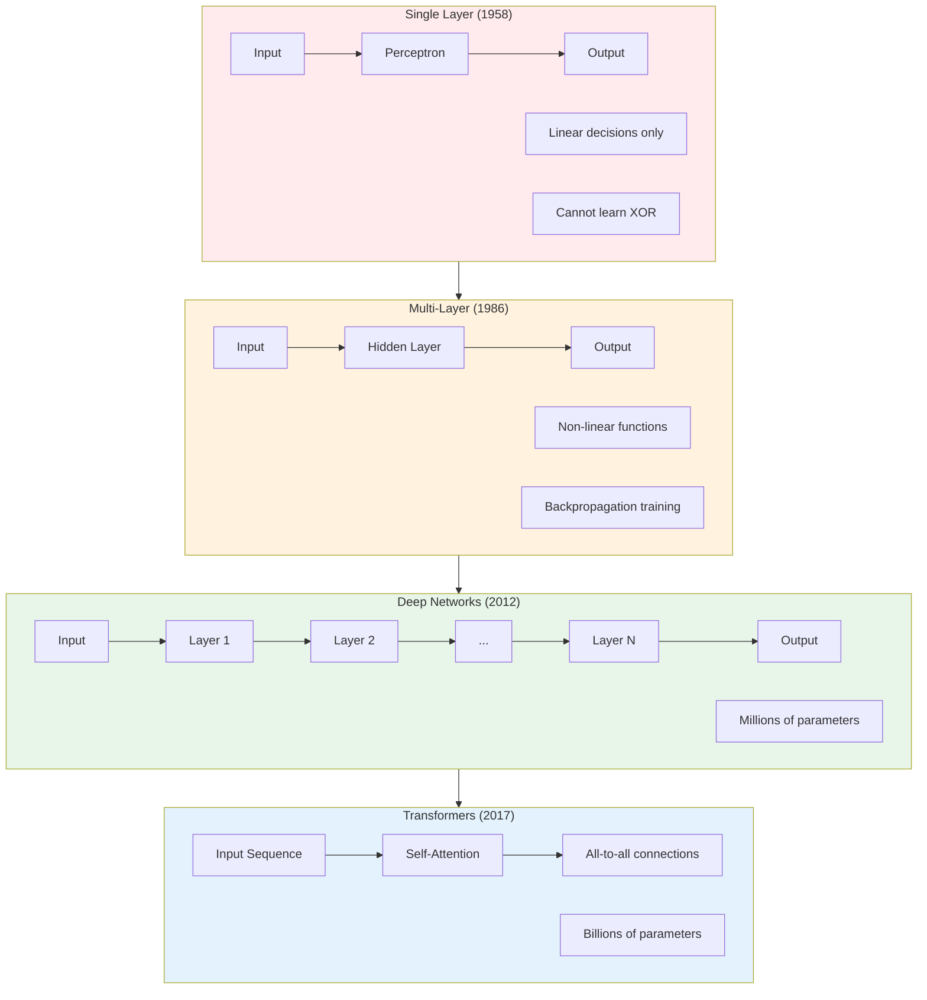
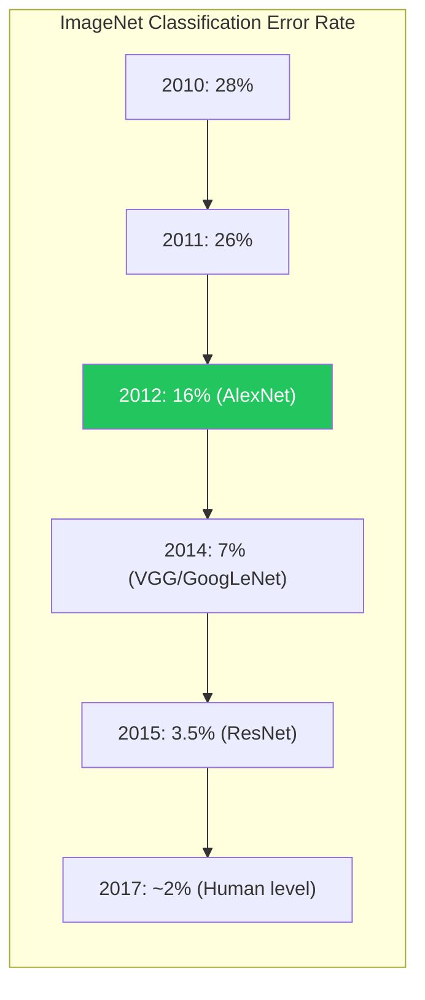
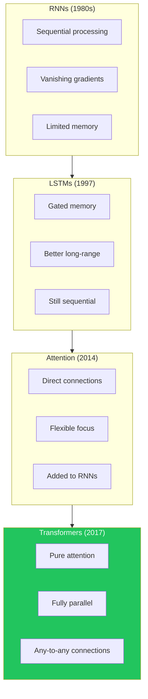
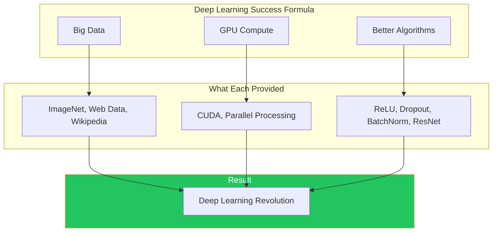

import Tip from "@components/mdx/Tip.astro";
import Warning from "@components/mdx/Warning.astro";
import Info from "@components/mdx/Info.astro";
import Definition from "@components/mdx/Definition.astro";
import Quiz from "@components/react/Quiz";
import HandsOnExercise from "@components/react/HandsOnExercise";

## Section 1: The Dream of Artificial Intelligence

### The Dartmouth Summer

In the summer of 1956, a small group of researchers gathered at Dartmouth College with an audacious proposal: they would spend the summer figuring out how to make machines think. John McCarthy, Marvin Minsky, Claude Shannon, and Nathaniel Rochester believed that "every aspect of learning or any other feature of intelligence can in principle be so precisely described that a machine can be made to simulate it."

This was breathtaking optimism. The field they created that summer would experience decades of cycles: breakthrough, hype, disappointment, winter. Each winter killed off weak ideas and left survivors that would eventually lead to the AI you work with today.

Understanding this history matters because it explains why current systems work the way they do. The limitations we see today have roots in decisions made decades ago. The breakthroughs that enable modern AI built on insights that were sometimes ignored for years before their time came.

### Turing's Foundation

Before Dartmouth, there was Alan Turing. In his 1950 paper "Computing Machinery and Intelligence," Turing did not ask "Can machines think?" directly. Instead, he proposed a practical test: if a machine could converse with a human and the human could not tell they were talking to a machine, we might as well call that intelligence.

The Turing Test shaped early AI research in important ways. It suggested that intelligence could be measured by behavior rather than internal mechanisms. It focused attention on language as a key marker of intelligence. And it implied that symbolic, logical manipulation of language might be the path to artificial minds.

<Definition term="Turing Test">
  A test of machine intelligence proposed by Alan Turing: if a human conversing
  with a machine cannot reliably distinguish it from another human, the machine
  exhibits intelligent behavior. The test measures behavioral capability rather
  than internal mechanism.
</Definition>

### The Perceptron: First Glimpse of Neural Networks

In 1958, Frank Rosenblatt introduced the perceptron, a mathematical model loosely inspired by biological neurons. A perceptron takes inputs, multiplies them by weights, sums them, and produces an output if the sum exceeds a threshold.

The perceptron could learn. Given labeled examples, it could adjust its weights to correctly classify inputs. Rosenblatt demonstrated perceptrons learning to distinguish shapes, and the media announced that thinking machines were imminent.

The mathematics were elegant in their simplicity: the perceptron implements a linear decision boundary. It can learn any function that is linearly separable, things like AND and OR. The learning rule is straightforward: if the output is wrong, adjust weights toward the correct answer.

But there was a problem lurking in that simplicity.

### The Minsky-Papert Critique and First AI Winter

In 1969, Marvin Minsky and Seymour Papert published "Perceptrons," a mathematical analysis proving that single-layer perceptrons cannot learn functions that are not linearly separable. The most famous example: XOR (exclusive or). No single perceptron can compute XOR because there is no straight line that separates the true cases from the false cases.

<Warning title="The XOR Problem">
  XOR returns true when exactly one input is true. Try to draw a single straight
  line on a 2D plane that separates (0,0) and (1,1) from (0,1) and (1,0). You
  cannot. This simple function defeated single-layer perceptrons and raised
  fundamental questions about the approach.
</Warning>

This was a devastating critique. Not because the limitation was not already known, but because Minsky and Papert also raised doubts about whether multi-layer perceptrons could be trained effectively. Without a way to train deeper networks, neural networks seemed like a dead end.

Funding dried up. Researchers moved on. The first "AI winter" had begun. The neural network approach would spend years in the wilderness while symbolic AI took center stage.

### Symbolic AI: A Different Path

With neural networks in hibernation, AI research shifted toward symbolic approaches. The idea was straightforward: intelligence involves manipulating symbols according to logical rules. A chess-playing program does not need neurons; it needs rules about how pieces move and strategies for evaluation.

Symbolic AI produced genuine achievements. Terry Winograd's SHRDLU in 1970 could understand natural language commands about a simulated block world. MYCIN in 1976 was an expert system for diagnosing bacterial infections that outperformed some physicians on specific cases. Chess programs showed steady improvement through better search algorithms and evaluation functions.

These systems demonstrated that computers could do things that seemed intelligent. But they also revealed a fundamental challenge: the knowledge had to be hand-coded by human experts. Every rule, every relationship, every exception needed explicit programming.

This would become known as the "knowledge acquisition bottleneck," and it would define the limits of symbolic AI for decades.

---

## Section 2: The Perceptron and Its Limitations

### Why Single Layers Fail

Understanding why single-layer perceptrons fail helps you understand why modern networks succeed. The XOR problem is not about XOR itself; it is about the limitations of linear functions.

A single perceptron can only draw a straight line (or hyperplane in higher dimensions) to divide its input space. When the correct classification requires a more complex boundary, the perceptron fails. Picture a checkerboard: no single straight line can separate black squares from white squares.

This seems like a minor limitation. Surely you just add more perceptrons? But in 1969, there was no efficient way to train multiple layers. Backpropagation existed in theoretical form, but it was not widely known or practically applied.

<Info title="Linear Separability">
  A problem is linearly separable if you can draw a straight line (or
  hyperplane) to separate the positive examples from the negative examples. AND
  is linearly separable. OR is linearly separable. XOR is not. Real-world
  problems are rarely linearly separable.
</Info>

### The Perception Gap

The gap between perception and reality in AI has repeated throughout the field's history. Rosenblatt's demonstrations seemed to show machines that could learn to see. The media reported breakthroughs. Funding flowed. But the actual capability was far more limited than the demonstrations suggested.

This pattern, demonstration exceeding general capability, remains relevant today. When you see impressive AI demos, remember: the question is not "Can it do this specific thing?" but "Can it do it reliably across varied conditions?" The perceptron could recognize specific shapes under controlled conditions. It could not see.

### The First Winter

The Minsky-Papert book did not kill neural networks alone, but it provided intellectual cover for a retreat that was already underway. Funding agencies had invested heavily in AI and were seeing diminishing returns. The field had overpromised and underdelivered.

The first AI winter lasted roughly from 1969 to 1980. During this period, neural network research continued in isolated pockets, but the mainstream of AI research moved elsewhere. Government funding dried up. Industry lost interest. The researchers who persisted did so despite, not because of, institutional support.

---

## Section 3: Neural Networks Rise Again

### The Expert Systems Boom

By the early 1980s, AI had found a commercial application: expert systems. The idea was compelling: capture the knowledge of human experts in rules, and use that knowledge to make decisions in specialized domains.

Companies built expert systems for financial analysis, equipment fault diagnosis, chemical analysis, legal reasoning, and mineral exploration. The hype was real, and so was the investment. Japan announced the Fifth Generation Computer Project, a massive government initiative to build AI systems.

Expert systems had a clear architecture. A knowledge base contained rules encoded in IF-THEN statements. An inference engine applied rules to reach conclusions. A user interface asked questions and provided explanations.

But expert systems had an Achilles' heel: knowledge engineering. Building an expert system required interviewing experts, extracting their knowledge, and encoding it as rules. This revealed several problems.

Experts cannot always explain their expertise. A skilled diagnostician might recognize a pattern without being able to articulate how. Tacit knowledge resisted codification. Knowledge was context-dependent: rules that work in one hospital might not work in another. Edge cases multiplied: real-world problems have countless exceptions, and each needed a new rule that could conflict with existing rules.

<Definition term="Knowledge Acquisition Bottleneck">
  The fundamental challenge of expert systems: human experts had to manually
  encode every rule, exception, and relationship. This was time-consuming,
  expensive, and could not capture tacit knowledge that experts could not
  articulate. It limited scalability and led to the second AI winter.
</Definition>

### The Second AI Winter

By the late 1980s, the expert systems market collapsed. Companies had oversold capabilities and underdelivered results. The Fifth Generation Project failed to meet its ambitious goals. Investment evaporated.

The second AI winter was not just about expert systems. It reflected deeper disillusionment with the entire approach. If intelligence required hand-coding knowledge, and hand-coding could not scale, perhaps the dream of artificial intelligence was simply unachievable.

What researchers did not know was that the key to progress was already being developed in isolated research labs. The solution was not better knowledge engineering. It was learning from data.

### Backpropagation: The Key That Unlocked Deep Networks

The perceptron's fatal flaw was that multi-layer networks could not be trained effectively. The insight that changed everything was backpropagation, an algorithm for computing how to adjust weights throughout a network based on errors at the output.

The mathematics had actually been discovered multiple times: by Paul Werbos in 1974, by David Parker in 1985, and by Geoffrey Hinton, David Rumelhart, and Ronald Williams in 1986. But it was the Hinton paper, "Learning Representations by Back-propagating Errors," that brought the technique to widespread attention.

Backpropagation works by running a forward pass where input flows through the network producing an output, then calculating error by comparing output to the desired answer, then running a backward pass to compute how much each weight contributed to the error, and finally updating weights to reduce the error.

The key is the chain rule from calculus. If you know how the error depends on the output, and how the output depends on the previous layer, you can compute how the error depends on the previous layer. Apply this recursively, and you can compute gradients for every weight in an arbitrarily deep network.

<Tip title="The Chain Rule Insight">
  Backpropagation applies the chain rule from calculus to compute gradients. If
  you know how error changes with respect to the output, and how the output
  changes with respect to the weights, you can compute how error changes with
  respect to the weights. Chain these computations backward through the network,
  and you can train arbitrarily deep networks.
</Tip>

This was the breakthrough Minsky and Papert had doubted. Multi-layer networks could now learn. The XOR problem was trivially solved. And researchers began exploring what deeper networks could achieve.

---

## Section 4: The Deep Learning Revolution

### What Changed: Data, Compute, Algorithms

Despite the promise of backpropagation, neural networks remained a niche interest through the 1990s and 2000s. Computing power was insufficient. Data was scarce. Other methods worked better on many benchmarks. Neural networks were often dismissed as "black boxes" without the mathematical elegance of competing approaches.

The researchers who kept working on neural networks during this period, like Geoffrey Hinton, Yann LeCun, and Yoshua Bengio, would later be recognized as pioneers. But at the time, they were swimming against the tide.

Everything changed in 2012. The ImageNet competition challenged systems to classify images into 1,000 categories using a dataset of over 1 million labeled images. The best systems used carefully engineered features fed into machine learning classifiers.

Then Alex Krizhevsky, Ilya Sutskever, and Geoffrey Hinton entered AlexNet, a deep convolutional neural network. It won the competition by a staggering margin, reducing error rates by more than 40% compared to the second-place system.

AlexNet succeeded because of several converging factors. Scale: 60 million parameters, 8 layers deep, far larger than previous CNNs. GPU training: graphics processing units, designed for video games, turned out to be perfect for the matrix operations underlying neural networks. ReLU activation: replacing traditional sigmoid activations with Rectified Linear Units helped prevent vanishing gradients. Dropout regularization: randomly dropping neurons during training prevented overfitting. Data augmentation: creating variations of training images effectively multiplied the dataset size.

<Definition term="ImageNet Moment">
  The 2012 ImageNet competition where AlexNet achieved a 15.3% error rate versus
  the next best 26.2%, a massive improvement that shocked the computer vision
  community. This demonstrated that deep neural networks with GPU training could
  dramatically outperform hand-engineered features and launched the deep
  learning revolution.
</Definition>

### The Perfect Storm

AlexNet did not emerge from nowhere. It was the result of three trends converging.

GPU computing transformed neural network training. NVIDIA's CUDA platform, released in 2007, made it possible to run general-purpose computations on graphics cards. GPUs, with thousands of simple cores optimized for parallel operations, were ideal for the matrix multiplications at the heart of neural networks. Training that would take weeks on CPUs could complete in hours on GPUs.

Big data provided the training material. The internet had been accumulating data for two decades. ImageNet, with 14 million labeled images, was a direct product of this data explosion. Wikipedia, digitized books, crawled websites, and social media created unprecedented training corpora.

Algorithmic innovations solved specific problems. ReLU, dropout, batch normalization, better initialization schemes, and new architectures each addressed specific problems that had blocked progress.

The result was exponential improvement. Every year brought deeper networks, better results, and new capabilities. The field that had struggled for decades was suddenly advancing faster than anyone could track.

### CNNs and Computer Vision

Convolutional Neural Networks, which Yann LeCun had pioneered in the 1980s for handwritten digit recognition, became the dominant architecture for computer vision after AlexNet.

CNNs use convolutional layers where small filters slide across the image detecting local patterns like edges and textures. Pooling layers downsample while preserving important information. Hierarchical features emerge: early layers detect simple patterns like edges and colors, while later layers combine these into complex features like eyes, faces, and objects.

VGGNet in 2014 showed that very deep networks with small 3x3 filters outperformed shallower networks with larger filters. Depth mattered. GoogLeNet introduced inception modules that applied multiple filter sizes in parallel. ResNet in 2015 was the breakthrough that truly solved the depth problem with skip connections that let gradients flow directly through the network.

ResNet enabled networks with hundreds or even thousands of layers. The 152-layer ResNet won ImageNet 2015 and became the foundation for countless subsequent architectures.

### Beyond Vision

Computer vision was just the beginning. Deep learning spread to every domain where large datasets existed.

Speech recognition was transformed. Deep neural networks replaced the complex, hand-engineered pipelines that had defined speech recognition for decades. Error rates dropped precipitously. Virtual assistants like Siri and Alexa became possible.

Natural language processing saw neural language models begin outperforming traditional n-gram approaches. Word embeddings, particularly Word2Vec in 2013, showed that neural networks could learn meaningful representations of words.

Game playing reached new heights. DeepMind's Deep Q-Network in 2013 learned to play Atari games from raw pixels, achieving superhuman performance on many games. AlphaGo in 2016 defeated the world champion at Go, a game long considered a decade away from AI mastery.

### The Limits of Recurrent Networks

Despite these successes, feedforward networks had fundamental limitations for sequential data like language, speech, and time series. They expected fixed-size inputs and had no memory.

Recurrent Neural Networks introduced loops that allowed information to persist. At each time step, the network takes an input and the previous hidden state, combines them, and produces a new hidden state. The hidden state serves as memory, carrying information from earlier in the sequence.

RNNs could, in theory, model arbitrarily long sequences. In practice, they struggled with long-range dependencies. The same vanishing gradient problem that plagued deep feedforward networks returned: gradients through many time steps tended to either explode or vanish.

Long Short-Term Memory networks, designed by Sepp Hochreiter and Jurgen Schmidhuber in 1997, addressed this with explicit gates controlling information flow. A forget gate decides what to discard from memory. An input gate decides what new information to store. An output gate decides what to output. These gates allowed LSTMs to maintain information over hundreds of time steps.

By 2015, sequence-to-sequence models using LSTMs were achieving state-of-the-art results in machine translation. But RNNs had a fundamental problem that no amount of gating could solve: they processed sequences one element at a time. You could not parallelize across the sequence. Training was slow, and there was a hard limit on how much context could effectively inform each prediction.

---

## Section 5: The Path to Language Models

### Word Embeddings: Meaning as Vectors

In 2013, Tomas Mikolov and colleagues at Google introduced Word2Vec, a simple but powerful technique for learning word representations. The insight was elegant: train a neural network to predict a word from its context, or predict context from a word. The learned representations capture semantic relationships.

Word2Vec embeddings have remarkable properties. Similar words cluster together: "king" is near "queen," "dog" is near "cat." Vector arithmetic works: "king" minus "man" plus "woman" approximately equals "queen." The network learned these relationships purely from patterns in text, with no explicit semantic labels.

<Info title="Word Vector Arithmetic">
  Word2Vec showed that semantic relationships are encoded in vector directions.
  The relationship between "man" and "woman" is similar to the relationship
  between "king" and "queen," so king - man + woman approximately equals queen.
  This suggested that neural networks could learn meaningful semantic structures
  from raw text.
</Info>

GloVe, developed at Stanford, achieved similar results through a different approach: matrix factorization of word co-occurrence statistics. The fact that different methods converged on similar representations suggested something real was being captured.

Word embeddings were static: each word had one representation regardless of context. "Bank" meant the same whether it was a river bank or a financial bank. This was a clear limitation.

### Attention Emerges

In 2014, Dzmitry Bahdanau and colleagues introduced attention to machine translation. The insight was simple but powerful: instead of compressing the entire input sequence into a fixed-size vector, let the decoder look back at all encoder states, focusing on the most relevant ones for each output.

Traditional sequence-to-sequence models had a bottleneck: the encoder compressed the entire input into a single context vector, and the decoder had to extract all relevant information from that fixed representation. For long sentences, this was asking too much of a single vector.

Attention changed the equation. At each decoding step, the model computed attention weights over all encoder hidden states. The context for that step was a weighted sum of all encoder states. Important words got high weights; irrelevant words got low weights.

This attention mechanism was differentiable, so the model could learn which parts of the input mattered for each part of the output. A translation model could learn to attend to the source word when producing its translation, even if word order differed between languages.

Attention improved translation quality significantly. But it was still an add-on to RNNs. The sequential bottleneck remained.

### The Limitations of RNNs Become Critical

As datasets grew larger and models grew more ambitious, RNN limitations became increasingly painful.

Training time was prohibitive. Processing one word requires the result from the previous word. Sequences cannot be parallelized. A 100-word sentence takes 100 sequential steps, and those steps cannot be distributed across the thousands of cores in a modern GPU.

Long-range dependencies remained difficult. Despite LSTMs and attention, information degraded over long sequences. The model might attend to a distant word, but the representation of that word had passed through many transformations, losing information along the way.

Memory constraints limited context. Hidden states had fixed size. To capture more context, you needed larger states, which meant more parameters and more computation.

Researchers began asking: what if we got rid of recurrence entirely? What if attention was not just an add-on, but the whole architecture?

---

## Section 6: Setting the Stage

### Attention Is All You Need

In June 2017, a team from Google published "Attention Is All You Need," introducing the Transformer architecture. The title was a provocation: it claimed you could build state-of-the-art sequence models using only attention, no recurrence, no convolutions.

The results were striking. Better quality: the Transformer achieved 28.4 BLEU on WMT 2014 English-to-German translation, improving on the previous best by over 2 points. Faster training: training time dropped from 3.5 days to 12 hours on the same hardware. Parallelization: without recurrence, the entire sequence could be processed simultaneously.

The key innovation was self-attention: instead of just attending from decoder to encoder, each position in a sequence attended to all other positions in the same sequence. This created direct connections between any two positions, regardless of distance.

For a sequence of length n, in an RNN, information between position 1 and position n must traverse n-1 steps. In a Transformer, position 1 directly attends to position n in one operation.

This direct connection solved the long-range dependency problem. It also enabled massive parallelization, since all positions could compute their attention simultaneously.

<Definition term="Transformer Architecture">
  A neural network architecture based entirely on attention mechanisms,
  introduced in 2017. By allowing every position to directly attend to every
  other position, Transformers solved the long-range dependency and
  parallelization problems of RNNs. This architecture underlies all modern large
  language models.
</Definition>

### The Pre-Transformer Landscape

To appreciate why Transformers mattered, consider the landscape before them. Machine translation used complex pipelines with separate components for alignment, language modeling, and translation. Speech recognition had similarly complex architectures. Natural language understanding relied heavily on hand-engineered features and task-specific models.

Each task had its own architecture. Transfer between tasks was limited. Training at scale was difficult.

The Transformer offered something different: a general-purpose architecture that could process any sequence, that trained efficiently at scale, and that transferred well between tasks. This generality would prove crucial.

### What Comes Next

In Module 8, you will dive deep into the Transformer architecture itself. You will understand how self-attention works, what Query, Key, and Value really mean, how multi-head attention enables richer representations, and why positional encodings are necessary.

The history you have learned here provides context. The Transformer did not appear from nothing. It solved problems that the field had struggled with for decades. It built on insights from perceptrons, backpropagation, LSTMs, and attention mechanisms. It succeeded because computation and data finally caught up with algorithmic ideas.

Understanding this history will help you understand not just how current systems work, but why they work the way they do, and what limitations persist despite the breakthroughs.

---

## Diagrams

### AI History Timeline

```mermaid
graph LR
    subgraph Era1["Early AI (1950s-1970s)"]
        T1[1950: Turing Test]
        T2[1956: Dartmouth]
        T3[1958: Perceptron]
        T4[1969: Minsky-Papert]
    end

    subgraph Era2["AI Winters (1970s-1990s)"]
        T5[First Winter]
        T6[1980s: Expert Systems]
        T7[1987: Second Winter]
    end

    subgraph Era3["Revival (1986-2012)"]
        T8[1986: Backpropagation]
        T9[1989: CNNs]
        T10[1997: LSTM]
    end

    subgraph Era4["Deep Learning (2012-2017)"]
        T11[2012: AlexNet]
        T12[2014: Attention]
        T13[2015: ResNet]
        T14[2017: Transformer]
    end

    subgraph Era5["LLM Era (2018+)"]
        T15[2018: BERT/GPT]
        T16[2020: GPT-3]
        T17[2022: ChatGPT]
    end

    Era1 --> Era2
    Era2 --> Era3
    Era3 --> Era4
    Era4 --> Era5

    style Era1 fill:#ffebee
    style Era2 fill:#fff3e0
    style Era3 fill:#e8f5e9
    style Era4 fill:#e3f2fd
    style Era5 fill:#f3e5f5
```

### Evolution from Perceptron to Deep Network

### ImageNet Error Rates Over Time

### Sequence Model Evolution

### The Three Ingredients of Deep Learning Success

---

## Hands-On Exercise: Historical Model Exploration

<HandsOnExercise
  client:visible
  moduleSlug="journey-to-modern-ai"
  exerciseId="historical-model-exploration"
  title="Historical Model Exploration"
  objective="Build intuition for AI history by implementing and experiencing the limitations of early models, then explore word embeddings to see how learned representations capture meaning."
  totalTime="45-60 minutes"
  setupInstructions={[
    "Set up Python environment with numpy, scikit-learn, and gensim",
    "Download pre-trained Word2Vec embeddings (gensim will download automatically)",
    "Have a notebook or Python environment ready for experimentation",
  ]}
  parts={[
    {
      id: "perceptron",
      title: "Perceptron Implementation",
      duration: "15 min",
      instructions: [
        "Implement a simple perceptron class with weights, bias, and learning rate",
        "Train it on linearly separable data (AND gate, OR gate)",
        "Verify it learns correct classifications",
        "Try training on XOR and observe the failure",
        "Visualize the decision boundary for AND vs XOR",
      ],
      observePrompt:
        "Why does the perceptron succeed on AND but fail on XOR? Sketch or describe the decision boundaries.",
    },
    {
      id: "mlp",
      title: "Multi-Layer Network",
      duration: "15 min",
      instructions: [
        "Use scikit-learn MLPClassifier or implement a simple two-layer network",
        "Solve XOR with a hidden layer",
        "Experiment with different hidden layer sizes (2, 4, 8 neurons)",
        "Observe how the network creates a non-linear decision boundary",
      ],
      observePrompt:
        "How does adding a hidden layer allow the network to solve XOR? What is the minimum hidden layer size needed?",
    },
    {
      id: "word-embeddings",
      title: "Word Embeddings Exploration",
      duration: "20 min",
      instructions: [
        "Load pre-trained Word2Vec embeddings using gensim",
        "Find similar words to 'king', 'computer', 'happy'",
        "Try the famous analogy: king - man + woman = ?",
        "Create your own analogies and test them",
        "Find words that do not behave as expected",
      ],
      observePrompt:
        "Which analogies work well? Which fail? What does this tell you about what Word2Vec actually learned?",
    },
    {
      id: "reflection",
      title: "Connecting History to Present",
      duration: "10 min",
      instructions: [
        "Write a brief reflection on how perceptron limitations connect to modern architectures",
        "Consider: modern networks have billions of parameters - what problem does this solve?",
        "Consider: Word2Vec was revolutionary in 2013 but limited - how do modern embeddings differ?",
        "Document one insight that surprised you about early models",
      ],
    },
  ]}
  successCriteria={[
    {
      id: "perceptron-works",
      text: "Implemented working perceptron that learns AND and OR",
    },
    { id: "xor-failure", text: "Demonstrated and understood XOR failure" },
    { id: "mlp-success", text: "Solved XOR using multi-layer network" },
    {
      id: "embeddings-explored",
      text: "Explored word embeddings and analogies",
    },
    { id: "analogies-tested", text: "Tested at least 3 word analogies" },
    {
      id: "reflection-written",
      text: "Written reflection connecting history to modern AI",
    },
  ]}
/>

---

## Knowledge Check

<Quiz
  client:visible
  quizId="module-07-knowledge-check"
  moduleSlug="journey-to-modern-ai"
  questions={[
    {
      id: "q1",
      type: "multiple-choice",
      question:
        "What was the significance of the Minsky-Papert 'Perceptrons' book (1969)?",
      options: [
        { id: "a", text: "It proved neural networks could solve any problem" },
        {
          id: "b",
          text: "It showed single-layer perceptrons cannot learn XOR and raised doubts about training deeper networks",
        },
        { id: "c", text: "It invented the modern neural network" },
        { id: "d", text: "It proposed the transformer architecture" },
      ],
      correctAnswer: "b",
      explanation:
        "Minsky and Papert proved that single-layer perceptrons cannot learn functions like XOR that are not linearly separable. More importantly, their skepticism about training deeper networks contributed to the first AI winter by discouraging funding and research in neural networks.",
    },
    {
      id: "q2",
      type: "multiple-choice",
      question:
        "What three factors converged to enable the deep learning revolution of the 2010s?",
      options: [
        {
          id: "a",
          text: "Better programming languages, faster internet, cheaper storage",
        },
        {
          id: "b",
          text: "More training data, GPU compute power, algorithmic improvements",
        },
        {
          id: "c",
          text: "Government funding, corporate investment, academic research",
        },
        {
          id: "d",
          text: "Open source software, cloud computing, mobile devices",
        },
      ],
      correctAnswer: "b",
      explanation:
        "Deep learning succeeded when massive datasets (ImageNet, web data), GPU acceleration (NVIDIA CUDA), and algorithmic improvements (ReLU, dropout, better optimization) converged. None alone was sufficient; together they enabled training previously impossible networks.",
    },
    {
      id: "q3",
      type: "multiple-choice",
      question:
        "Why was AlexNet's ImageNet victory in 2012 considered a watershed moment?",
      options: [
        { id: "a", text: "It was the first neural network ever built" },
        {
          id: "b",
          text: "It dramatically outperformed traditional methods, proving deep learning's potential",
        },
        { id: "c", text: "It was the first model to use GPUs" },
        { id: "d", text: "It solved natural language processing" },
      ],
      correctAnswer: "b",
      explanation:
        "AlexNet achieved a 15.3% error rate vs the next best 26.2%—a massive improvement that shocked the computer vision community. This demonstrated that deep neural networks with GPU training could dramatically outperform hand-engineered features and launched the deep learning revolution.",
    },
    {
      id: "q4",
      type: "multiple-choice",
      question:
        "What fundamental limitation of RNNs did attention mechanisms address?",
      options: [
        { id: "a", text: "RNNs were too fast" },
        {
          id: "b",
          text: "RNNs struggled with long-range dependencies because information degrades over sequential steps",
        },
        { id: "c", text: "RNNs could not process images" },
        { id: "d", text: "RNNs used too little memory" },
      ],
      correctAnswer: "b",
      explanation:
        "RNNs process sequences step-by-step, and information from early tokens can be lost or degraded by the time later tokens are processed. Attention allows direct connections between any positions, enabling models to capture long-range dependencies effectively without information passing through many intermediate steps.",
    },
    {
      id: "q5",
      type: "multiple-choice",
      question:
        "What was the 'knowledge acquisition bottleneck' that limited expert systems?",
      options: [
        { id: "a", text: "Computers could not store enough knowledge" },
        {
          id: "b",
          text: "Human experts had to manually encode every rule, exception, and relationship",
        },
        { id: "c", text: "Knowledge could not be transferred between systems" },
        { id: "d", text: "Expert systems were too expensive to run" },
      ],
      correctAnswer: "b",
      explanation:
        "Expert systems required human experts to explicitly program every rule, exception, and relationship. This was time-consuming, expensive, and could not capture tacit knowledge that experts could not articulate—limiting scalability and contributing to the second AI winter.",
    },
  ]}
  passingScore={70}
  allowRetry={true}
/>

---

## Summary

In this module, you traced the journey from AI's earliest dreams to the threshold of modern transformers.

The early era from 1950 to 1980 established the dream of machine intelligence. The perceptron showed machines could learn, but its limitations led to the first AI winter. Symbolic AI and expert systems offered an alternative approach based on hand-coded knowledge, but the knowledge acquisition bottleneck proved insurmountable.

The neural revival came through backpropagation, which finally enabled training of multi-layer networks. This solved the XOR problem and opened the door to deeper architectures, though practical applications remained limited by compute and data.

The deep learning revolution around 2012 was enabled by the convergence of GPU computing, big data, and algorithmic innovations. AlexNet proved that deep networks trained on GPUs could dramatically outperform traditional approaches. ResNet solved the depth problem with skip connections.

Sequence modeling evolved through RNNs and LSTMs, but the sequential bottleneck limited progress. Attention mechanisms, introduced for translation in 2014, provided direct connections between positions. The 2017 Transformer showed that attention alone was sufficient, eliminating recurrence entirely and enabling massive parallelization.

Understanding this history matters because current AI systems are not magic. They are engineering achievements built on decades of research, failures, and persistence. The limitations you see today have roots in fundamental design choices. The capabilities you use emerged from specific innovations solving specific problems.

---

## What's Next

**Module 8: The Transformer Revolution**

We will dive deep into the Transformer architecture itself:

- The complete self-attention mechanism and why it works
- Query, Key, Value: what they really mean
- Multi-head attention and representation diversity
- Positional encoding and the position problem
- Layer normalization and residual connections
- Encoder-decoder versus decoder-only architectures
- Scaling laws and emergent abilities

This module gave you historical context. Module 8 gives you technical depth to understand how modern AI actually processes language.

---

## References

### Historical Papers

1. **"Computing Machinery and Intelligence"** - Alan Turing (1950)
   The foundational paper on machine intelligence, introducing the Turing Test. Still relevant for framing questions about AI.
   [philpapers.org/rec/TURCMA](https://philpapers.org/rec/TURCMA)

2. **"Perceptrons"** - Minsky & Papert (1969)
   The mathematical critique that contributed to the first AI winter. Important for understanding AI history.

3. **"Learning Representations by Back-propagating Errors"** - Rumelhart, Hinton, Williams (1986)
   The paper that made backpropagation widely known and reignited neural network research.
   [nature.com/articles/323533a0](https://www.nature.com/articles/323533a0)

4. **"ImageNet Classification with Deep Convolutional Neural Networks"** - Krizhevsky, Sutskever, Hinton (2012)
   The AlexNet paper that launched the deep learning revolution.
   [papers.nips.cc/paper/4824](https://papers.nips.cc/paper/4824-imagenet-classification-with-deep-convolutional-neural-networks)

5. **"Attention Is All You Need"** - Vaswani et al. (2017)
   The Transformer paper. Required reading for anyone working with modern AI.
   [arxiv.org/abs/1706.03762](https://arxiv.org/abs/1706.03762)

### Historical Accounts

6. **"Artificial Intelligence: A Modern Approach"** - Russell & Norvig
   The standard AI textbook, with excellent historical chapters.
   [aima.cs.berkeley.edu](https://aima.cs.berkeley.edu)

7. **"The Quest for Artificial Intelligence"** - Nils Nilsson (2010)
   Comprehensive history of AI from a pioneer in the field.
   [ai.stanford.edu/~nilsson/QAI/qai.pdf](https://ai.stanford.edu/~nilsson/QAI/qai.pdf)

8. **"Deep Learning"** - Goodfellow, Bengio, Courville (2016)
   The definitive deep learning textbook, with good historical context.
   [deeplearningbook.org](https://www.deeplearningbook.org)

9. **"Genius Makers"** - Cade Metz
   Popular account of the deep learning revolution and its key figures.

### Technical Background

10. **"Efficient Estimation of Word Representations"** - Mikolov et al. (2013)
    The Word2Vec paper that showed neural networks could learn semantic representations from text.
    [arxiv.org/abs/1301.3781](https://arxiv.org/abs/1301.3781)

11. **"Long Short-Term Memory"** - Hochreiter & Schmidhuber (1997)
    The LSTM paper that addressed vanishing gradients in recurrent networks.

12. **"Neural Machine Translation by Jointly Learning to Align and Translate"** - Bahdanau et al. (2014)
    The paper that introduced attention mechanisms for sequence-to-sequence models.
    [arxiv.org/abs/1409.0473](https://arxiv.org/abs/1409.0473)
