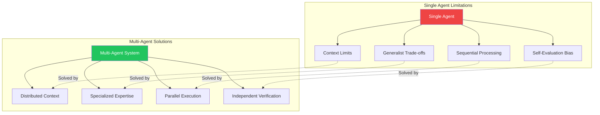
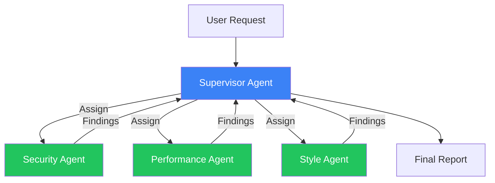
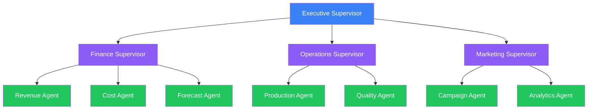
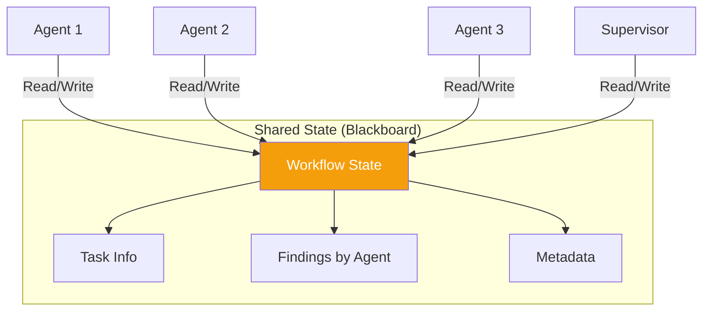
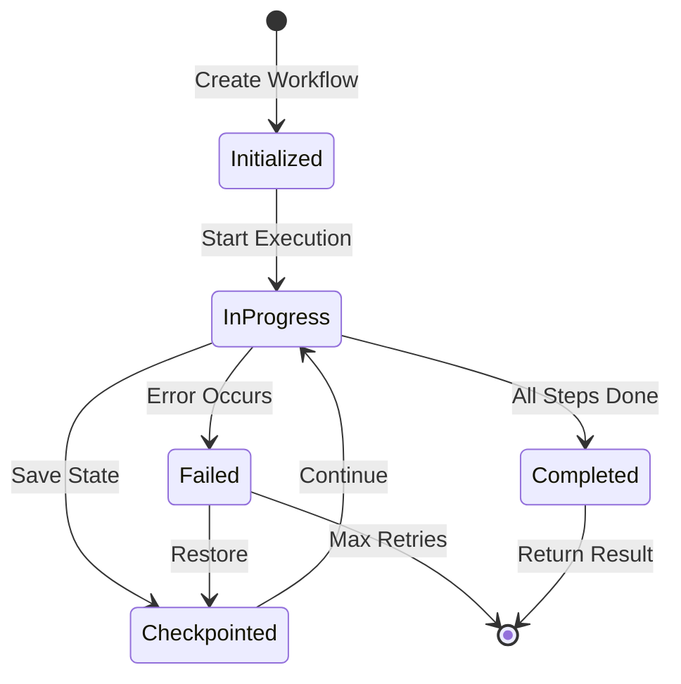
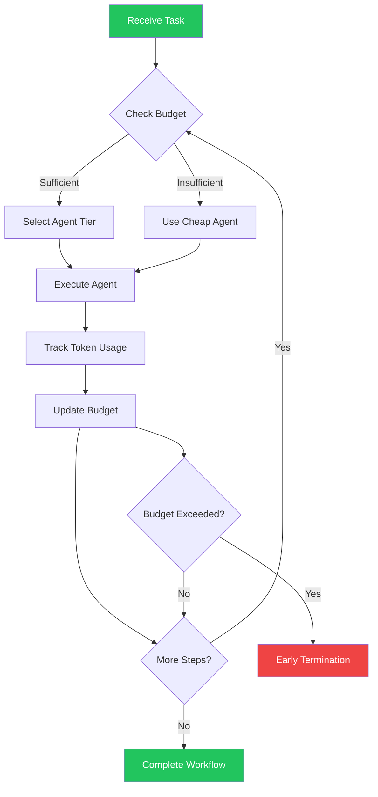

import Tip from "@components/mdx/Tip.astro";
import Warning from "@components/mdx/Warning.astro";
import Info from "@components/mdx/Info.astro";
import Definition from "@components/mdx/Definition.astro";
import Quiz from "@components/react/Quiz";
import HandsOnExercise from "@components/react/HandsOnExercise";

Single agents are powerful. They can reason, use tools, and accomplish complex tasks autonomously. But as the complexity of tasks grows, so do the limitations of single-agent architectures. What happens when you need specialized expertise in multiple domains? When tasks require parallel processing? When you need checks and balances to ensure quality?

Multi-agent systems address these challenges by distributing work across multiple specialized agents that communicate and coordinate. Instead of one generalist trying to do everything, you have a team of specialists collaborating. This is not just about scaling up. Multi-agent architectures enable new capabilities: emergent behaviors from agent interactions, improved reliability through redundancy, and better quality through specialized expertise. They also introduce new challenges: coordination overhead, communication complexity, and harder debugging.

This module teaches you when multi-agent systems make sense, how to design them effectively, and how to operate them reliably in production.

## Beyond Single Agents

Single agents work well for many tasks, but they struggle when certain conditions arise. Understanding these limitations helps you recognize when multi-agent architectures become valuable.

<Definition term="Multi-Agent System">
  A system where multiple autonomous agents work together, communicating and
  coordinating their actions to achieve goals that would be difficult or
  impossible for a single agent to accomplish alone.
</Definition>

Complexity can exceed context limits. Even with large context windows, some tasks involve more information than a single agent can process coherently. A code review across a million-line codebase, legal analysis spanning thousands of documents, or research synthesis across hundreds of papers all challenge single-agent approaches.

Specialized expertise is often required. A single agent asked to handle medical diagnosis, legal compliance, financial analysis, and technical implementation must be a mediocre generalist at all of them. Specialized agents can each excel in their domain.

Parallelization offers significant value for many tasks. Some work decomposes into independent subtasks. A single agent processes them sequentially, while multiple agents can work in parallel, dramatically reducing total time.

Quality requires verification. Having one agent generate and another verify creates natural checks and balances. The generator does not evaluate its own work, reducing the risk of self-consistent errors going undetected.

Different perspectives matter for complex decisions. Debate, critique, and diverse viewpoints can improve decision quality. Multiple agents can argue different positions, exposing assumptions and strengthening final conclusions.



### Use Cases for Multi-Agent Systems

Research and analysis workflows benefit tremendously from multi-agent approaches. One agent searches and retrieves information, another summarizes and synthesizes findings, and a third fact-checks and verifies claims. The result is higher quality, more reliable research than any single agent could produce.

Software development naturally decomposes into specialized roles. An architect agent designs system structure, implementation agents write code for different modules, a review agent evaluates code quality, and a test agent creates and runs tests. The result is better code with built-in review processes.

Customer support escalation demonstrates hierarchical multi-agent patterns. A front-line agent handles common queries, specialist agents handle billing, technical issues, or account management, and a supervisor agent handles escalations and complex cases. The result is efficient routing with specialized handling.

Content creation pipelines show sequential multi-agent patterns. A research agent gathers information, a writer agent creates drafts, an editor agent refines and improves, and a fact-checker agent verifies claims. The result is higher quality content with fewer errors.

<Info>
  Multi-agent systems are not always better. They introduce communication
  overhead, coordination complexity, and debugging challenges. Use them when the
  benefits clearly outweigh the costs.
</Info>

### The Complexity Trade-Off

Multi-agent systems are not free. They introduce several forms of overhead and complexity that must be weighed against their benefits.

Communication overhead requires agents to exchange information, which takes time and tokens. Poor communication design can make systems slower than single agents.

Coordination complexity raises difficult questions. Who does what? How do agents hand off work? What happens when they disagree? These questions need clear answers in your system design.

Debugging difficulty increases significantly. When something goes wrong, tracing through multiple agents is harder than debugging a single agent. You need comprehensive logging and tracing.

Cost multiplication is inevitable. More agents mean more LLM calls. Without careful design, costs can explode beyond what single-agent approaches would cost.

Emergent failures create new risk categories. Interactions between agents can produce unexpected behaviors that would not occur in single-agent systems.

<Warning>
  The question is not "Should I use multi-agent?" but "Does the benefit of
  multi-agent outweigh its complexity for this specific problem?" Start with
  single agents and add complexity only when you hit clear limitations.
</Warning>

## Coordination Patterns

Multi-agent systems follow recognizable patterns. Understanding these patterns helps you choose the right architecture for your specific needs.

### Supervisor/Worker Pattern

The most common multi-agent pattern involves one agent (the supervisor) coordinating work while worker agents execute specific tasks. The supervisor receives the overall task, decomposes it into subtasks, assigns subtasks to appropriate workers, collects results, and synthesizes them into final output.



Consider a code review system using this pattern. The supervisor receives a request to review a pull request for security, performance, and code style. The supervisor analyzes this request and assigns security review to a Security Agent, performance review to a Performance Agent, and style review to a Style Agent. These workers can execute in parallel, with the Security Agent analyzing for vulnerabilities, injection points, and authentication issues, while the Performance Agent analyzes for bottlenecks, complexity, and resource usage, and the Style Agent checks formatting, naming, and documentation. The supervisor then synthesizes all findings, resolves conflicts like security versus performance trade-offs, prioritizes issues by severity, and generates a unified review with recommendations.

This pattern works best when you have clear task decomposition, workers have distinct and non-overlapping responsibilities, you need centralized coordination, and results require synthesis. The advantages include clear hierarchy and responsibility, easy addition or removal of workers, conflict handling by the supervisor, and a natural routing point for observability. The disadvantages include the supervisor becoming a bottleneck, creating a single point of failure, requiring the supervisor to understand all domains enough to coordinate, and adding latency through sequential flow.

### Peer-to-Peer Pattern

In peer-to-peer patterns, agents communicate directly with each other without a central coordinator. They self-organize to complete tasks. Agents share a common goal, each has visibility into others' work, they communicate as needed, and consensus or voting determines outcomes.

Consider a debate and synthesis scenario about whether to migrate from REST to GraphQL. Agent A argues for REST, emphasizing simplicity, pointing out the GraphQL learning curve, and citing REST ecosystem maturity. Agent B argues for GraphQL, emphasizing efficiency, pointing out over-fetching problems with REST, and citing GraphQL's type safety. Agent C synthesizes the discussion, reviewing both positions, identifying valid points from each, and proposing a hybrid approach or clear recommendation. Each round, agents can respond to each other's points, refining the analysis until convergence.

This pattern works well when tasks benefit from multiple perspectives, there is no clear hierarchical structure, agents have complementary expertise, and consensus or debate improves outcomes. The advantages include no single bottleneck, emergent collaboration, resilience to individual agent failures, and broader exploration of the solution space. The disadvantages include implicit and harder to control coordination, potential for non-convergence, harder debugging without a central log, and risk of groupthink or deadlock.

<Tip>
  Peer-to-peer patterns excel for creative and analytical tasks where diverse
  perspectives add value. Add convergence mechanisms like voting or synthesis
  agents to prevent endless debate.
</Tip>

### Hierarchical Pattern

Multiple levels of supervisors each manage agents below them, similar to an organizational chart. The top-level supervisor handles strategic decisions, mid-level supervisors manage functional areas, and workers execute specific tasks. Information flows up and down the hierarchy.



For enterprise report generation, an executive supervisor receives a request to generate a quarterly business review and delegates to functional supervisors. The Finance Supervisor assigns Revenue, Cost, and Forecast agents and synthesizes a financial section. The Operations Supervisor assigns Production, Quality, and Supply Chain agents and synthesizes an operations section. The Marketing Supervisor assigns Campaign, Analytics, and Brand agents and synthesizes a marketing section. The Executive Supervisor receives sections from all supervisors, synthesizes an executive summary, and creates the final report.

This pattern suits large complex tasks with multiple domains, situations needing both domain expertise and cross-domain coordination, organizations with natural hierarchical structure, and scale beyond what a single supervisor can manage. The advantages include scaling to very complex tasks, mirroring organizational thinking, deep expertise at domain supervisors, and failure containment within branches. The disadvantages include latency from deep hierarchies with many hops, complexity to design and maintain, information getting lost between levels, and over-engineering risk for simpler problems.

### Pipeline Pattern

Agents process work in sequence, each transforming output from the previous agent. Work flows linearly through agents, each has a specific role in the pipeline, output of one becomes input to the next, and the final agent produces the result.

A content publishing pipeline demonstrates this pattern. A Research Agent receives the topic and outputs gathered facts, sources, and key points. A Writer Agent receives the research output and produces an initial draft. An Editor Agent receives the draft and produces refined content. A Fact-Checker Agent receives edited content and outputs verified content with citations. A Publisher Agent receives verified content and outputs a formatted, published article.

This pattern works well when there is a clear sequential process, each stage has distinct transformation, you need quality gates between stages, and the workflow is similar to existing human processes. The advantages include simplicity to understand and debug, clear responsibility for each agent, easy quality gates, and mirroring human workflows. The disadvantages include no parallelism creating a sequential bottleneck, later agents waiting for earlier ones, errors propagating forward, and inflexibility for tasks that do not fit linear flow.

### Swarm Pattern

A large pool of agents dynamically claims and processes work from a shared queue. A central work queue holds tasks, agents claim tasks based on capability and availability, agents work independently, and results are aggregated as they complete.

For large-scale document processing with 10,000 documents to classify, a pool of 50 classification agents operates against the work queue. Each agent claims a document from the queue, classifies it, returns the result, and claims the next document. This continues until the queue is empty. An aggregator collects all classifications, builds the final report, and handles any failed tasks through re-queuing or escalation.

This pattern excels for high-volume uniform tasks, situations requiring parallelism, independent tasks, and when scale is the primary concern. The advantages include maximum parallelism, horizontal scaling, resilience to single agent failures, and efficient resource utilization. The disadvantages include only working for independent tasks, coordination overhead for the queue, no inter-agent communication, and lack of coherence in results.

## Communication Design

In single-agent systems, communication is just the context window. In multi-agent systems, agents must exchange information explicitly. Poor communication design causes information loss where important context does not reach agents that need it, information overload where agents receive too much irrelevant information, latency from waiting for responses, cost explosion from token usage in messages, and coherence breakdown when agents work from inconsistent states.

### Message Passing

The most explicit communication model has agents send discrete messages to each other. A message structure typically includes the sender identifying which agent sent the message, the recipient identifying the target or broadcast for all, the message type such as request, response, info, or error, the content payload, a timestamp, and a correlation ID linking related messages.

```python
# Example message structure
class Message:
    sender: str           # Which agent sent this
    recipient: str        # Target agent or "broadcast"
    message_type: str     # "request", "response", "info", "error"
    content: dict         # The actual payload
    timestamp: datetime   # When sent
    correlation_id: str   # Links related messages
```

A worker reporting to a supervisor might send a message identifying itself as the security agent, targeting the supervisor, with a response type, containing the task ID, completion status, and findings list with severity ratings and specific issues identified.

Message passing offers explicit and traceable communication, easy logging and debugging, clear contracts between agents, and support for async patterns. The disadvantages include verbosity consuming tokens, needing to define message schemas, requiring agents to handle parsing, and latency for round-trips.

### Shared State

Agents communicate by reading and writing to shared state, functioning like a blackboard or shared memory. A shared state structure might track the task with its ID, status, and assigned agents, track findings by agent with completed analyses and pending slots, and include metadata like start time and deadline.



Shared state offers coherence where all agents see the same state, less message overhead, easy checkpointing and restoration, and natural fit for collaborative editing. The disadvantages include concurrency challenges with race conditions, need for agents to coordinate writes, potential for bloated state, and less explicitness than messages.

### Handoff Protocols

When one agent passes work to another, clear handoff protocols prevent information loss. A proper handoff should include the original request providing context, work completed showing progress, key findings as processed output rather than raw data, remaining work clearly stated, and quality criteria defining success.

Poor handoffs lose critical context. A message saying only "Done with research, your turn" loses the original request, the findings, and success criteria. Similarly, dumping 500 pages of raw research notes overwhelms the receiving agent and wastes tokens.

<Tip>
  Design handoff templates for each transition in your system. Include original
  request, summary of work done, processed output, clear remaining work, and
  success criteria.
</Tip>

### Context Management

Each agent has limited context. Ensuring agents have what they need requires careful strategy.

Minimal context passes only what is needed for the immediate task. The risk is missing context causing errors.

Full context passes everything to every agent. The risk is overwhelming context and high cost.

Layered context provides the best balance. Core context including the original request and global constraints always gets passed. Task context with relevant prior work gets passed for specific tasks. Available context including full history remains accessible on demand through retrieval.

## Orchestration Frameworks

Building multi-agent systems from scratch requires implementing agent lifecycle management, message routing, state persistence, error handling, observability, and retry logic. Frameworks provide these capabilities out of the box, letting you focus on agent logic.

### LangGraph

LangGraph from the LangChain team models multi-agent workflows as graphs. The core concepts include nodes which are agents or functions that process state, edges which are transitions between nodes, state which is shared data passed through the graph, and conditional edges for dynamic routing based on state.

A review workflow in LangGraph defines a state type with fields for code, security review, performance review, and final report. Agent functions receive state and return updated state. The workflow builds as a state graph, adding nodes for each agent, setting entry points, and adding edges to define flow. Compiling the graph creates an executable application.

LangGraph strengths include an intuitive graph model, built-in state management, checkpointing for long-running workflows, and integration with the LangChain ecosystem. Limitations include potentially constraining graph models, a steeper learning curve, and tight coupling to LangChain paradigms.

### AutoGen

Microsoft's AutoGen focuses on conversational multi-agent patterns. Core concepts include agents as entities that send and receive messages, conversations as message exchanges between agents, and group chat for multi-agent conversations.

A code review conversation defines multiple assistant agents with different system prompts for security review, performance review, and lead review roles. A group chat combines these agents with a message list and round limit. The manager coordinates the group chat, and the conversation initiates with a code sample and instructions for each reviewer.

AutoGen strengths include a natural conversational model, easy setup for simple multi-agent chats, good fit for debate and collaboration patterns, and code execution support. Limitations include less structure than graph-based approaches, potential for wandering conversations without guidance, and harder precise flow control.

### CrewAI

CrewAI models multi-agent systems as teams with roles and processes. Core concepts include agents with roles, goals, and backstories, tasks as specific work items, crews as collections of agents working together, and processes defining execution order.

A research team in CrewAI defines agents with detailed personas including role titles, goals, and backstory narratives. Tasks specify descriptions, assigned agents, and expected outputs. The crew assembles agents and tasks with a process type like sequential, and execution kicks off the workflow.

CrewAI strengths include an intuitive role-based model, rich agent personas, clean task abstraction, and built-in process types. Limitations include less flexibility than lower-level frameworks, harder implementation of complex coordination, and abstraction potentially hiding important details.

### Framework Selection

| Framework | Model               | Best For                           | Complexity  |
| --------- | ------------------- | ---------------------------------- | ----------- |
| LangGraph | Graph/State Machine | Complex workflows, precise control | Medium-High |
| AutoGen   | Conversations       | Debate, collaboration, chat        | Low-Medium  |
| CrewAI    | Teams/Roles         | Role-based workflows, delegation   | Low         |

Use a framework when your pattern matches the framework's model, you need the framework's features like checkpointing and observability, and development speed matters more than full control. Build custom when your pattern does not fit available frameworks, you need maximum performance and efficiency, you have unique coordination requirements, or you are building a platform rather than an application.

## State Management

Multi-agent systems are inherently stateful. At any moment, you need to know what has been done, what is in progress, what remains to be done, what each agent knows, and what decisions have been made. Poor state management causes lost work on failures, inconsistent agent behavior, impossible debugging, and inability to resume interrupted workflows.

### Conversation History

The simplest state tracks all messages exchanged. Each entry records the agent, action, content, and timestamp. This grows large over time, may exceed context limits, contains redundant information, and is hard to query for specific facts. Solutions include periodic summarization, indexing by topic for retrieval, and keeping recent messages detailed while older ones stay summarized.

### Structured State

Beyond conversation, track the semantic state of the workflow. A structured state object captures the request with ID, type, input, and creation time. Progress tracking records status, completed steps, current step, and pending steps. Findings organize by agent with completion time and issue lists. Metadata tracks tokens, time, and retry counts.

This approach provides a clear picture of workflow status, enables easy resumption after failures, supports queries like what issues were found or what is pending, and enables checkpointing.

### Checkpointing

Saving state at key points enables recovery. A checkpoint manager saves the current state with workflow ID, state, timestamp, and version number. Restoration loads the checkpoint and returns the state. Listing checkpoints shows all saved points for a workflow.



Checkpoint after each agent completes its task, before expensive operations, at decision points, and periodically for long-running workflows.

### Recovery Strategies

When failures occur, several recovery strategies apply. Restarting from the beginning is simple but wasteful, discarding all progress. Restarting from the last checkpoint resumes from saved state but needs idempotency handling. Retrying just the failed step keeps successful work and retries only the failed agent.

A robust execution function checkpoints before each step, executes the step, and updates state. On exception, it logs the error and determines recovery strategy. For transient errors, it increments retry count and recursively retries if under the limit. Otherwise, it restores from checkpoint, marks the current step as failed, and continues with recovery execution.

### State Consistency

When multiple agents access shared state, consistency matters. Race conditions occur when agents read the same value, compute independently, and write results that conflict. If Agent A reads balance of 100 and subtracts 50 while Agent B also reads 100 and subtracts 30, and B writes after A, the final balance is 70 instead of the correct 20.

Solutions include locking where operations acquire a lock before reading and writing. Optimistic concurrency reads a version, computes new state, and only writes if the version has not changed, retrying otherwise. Append-only state appends operations rather than modifying state, computing current values by replaying operations. Agent-scoped state gives each agent its own state section, with only the supervisor writing to shared sections.

<Warning>
  State consistency bugs in multi-agent systems are notoriously hard to debug
  because they occur non-deterministically. Design your state model carefully
  and test concurrent scenarios thoroughly.
</Warning>

## Production Multi-Agent Systems

### Debugging

Debugging single agents is hard. Debugging multiple agents interacting is harder. Visibility is essential.

Log everything with structured entries capturing timestamp, workflow ID, agent name, action, input, output, duration, tokens used, and trace ID. Use distributed tracing with tools like OpenTelemetry to follow work across agents. Each agent execution starts a span with attributes for the agent name, workflow ID, input size, and output size.

Generate visual flows from workflow logs. A function can produce Mermaid sequence diagrams from log entries, showing message flow between agents.

### Monitoring

Track performance metrics including workflow completion time end-to-end, per-agent execution time, time spent in communication and coordination, and queue depths for async systems.

Track quality metrics including success rate per workflow type, error rate per agent, retry frequency, and human escalation rate.

Track cost metrics including tokens per workflow, tokens per agent, API costs per workflow, and cost per successful outcome.

A monitoring dashboard displays workflows today with count, success rate, average duration, and average cost. Agent performance tables show calls, average time, error percentage, and token usage per agent. Alerts highlight when metrics exceed thresholds.

### Cost Control

Multi-agent systems can be expensive. Control costs through several mechanisms.

Token budgets track a maximum token allocation, used tokens, and remaining budget. Before each agent executes, check if the budget can accommodate the estimated tokens. If not, switch to a cheaper strategy or abort.

Tiered agent selection uses expensive models only when needed. Based on task complexity and remaining budget, select between cheaper models for simple tasks or limited budgets and more capable models for complex tasks with sufficient budget.

Early termination stops workflows that will not succeed. Check for too many retries, exhausted budget, excessive time, or quality too low. Return false to stop execution if any condition is met.

Caching stores agent outputs for similar inputs. Generate a cache key from agent name and input, return cached results if available, otherwise execute and cache the result.



### Scaling

As load increases, horizontal scaling runs multiple workflow instances in parallel using queue-based architecture with stateless orchestrators and external state storage.

Agent pooling maintains pools of pre-initialized agents, reuses agents across workflows, and warms agent contexts where possible.

Async execution does not wait for slow agents, processes independent subtasks in parallel, and uses callbacks or webhooks for completion. A function to execute parallel agents creates async tasks for each agent and gathers results, handling any failures by replacing exceptions with error dictionaries.

### Error Handling Patterns

Graceful degradation tries the primary agent first, falls back to a backup agent on failure, and logs the fallback.

Circuit breaker tracks failure counts, thresholds, and reset timeouts. The state transitions from closed allowing execution to open blocking execution after too many failures, then to half-open allowing a test request after the timeout. Success resets to closed, failure reopens the circuit.

<Quiz
  client:visible
  quizId="module-17-knowledge-check"
  moduleSlug="multi-agent-orchestration"
  questions={[
    {
      id: "q1",
      type: "multiple-choice",
      question:
        "When is a multi-agent system most likely to provide significant benefits over a single agent?",
      options: [
        { id: "a", text: "When the task is simple and well-defined" },
        {
          id: "b",
          text: "When maximum speed is required and latency is critical",
        },
        {
          id: "c",
          text: "When the task requires specialized expertise across multiple domains and benefits from verification",
        },
        { id: "d", text: "When you want to minimize operational complexity" },
      ],
      correctAnswer: "c",
      explanation:
        "Multi-agent systems excel when tasks require diverse specialized expertise (different agents for security, performance, style review) and when quality benefits from verification (one agent checks another's work). Single agents are often better for simple tasks, multi-agent adds latency overhead, and multi-agent increases operational complexity.",
    },
    {
      id: "q2",
      type: "multiple-choice",
      question:
        "In the supervisor/worker pattern, what is the primary responsibility of the supervisor agent?",
      options: [
        { id: "a", text: "Executing all the actual work tasks" },
        {
          id: "b",
          text: "Decomposing tasks, routing to workers, and synthesizing results",
        },
        { id: "c", text: "Providing computational resources to worker agents" },
        { id: "d", text: "Storing state and handling persistence" },
      ],
      correctAnswer: "b",
      explanation:
        "The supervisor's role is coordination: it receives the overall task, breaks it into subtasks, assigns them to appropriate workers, collects results, and synthesizes the final output. Workers execute the actual tasks, infrastructure provides resources, and state management is a separate concern.",
    },
    {
      id: "q3",
      type: "multiple-choice",
      question:
        "What is the main advantage of checkpointing in multi-agent workflows?",
      options: [
        { id: "a", text: "It makes agents run faster" },
        { id: "b", text: "It reduces the number of agents needed" },
        {
          id: "c",
          text: "It enables recovery from failures without losing all progress",
        },
        { id: "d", text: "It prevents agents from making errors" },
      ],
      correctAnswer: "c",
      explanation:
        "Checkpointing saves workflow state at key points, allowing recovery from the last checkpoint rather than restarting from scratch when failures occur. It does not affect speed, agent count, or prevent errors, but it does make errors recoverable.",
    },
    {
      id: "q4",
      type: "multiple-choice",
      question:
        "Which framework would be most appropriate for implementing a debate between multiple AI perspectives that should converge on a consensus?",
      options: [
        { id: "a", text: "LangGraph (graph-based workflows)" },
        { id: "b", text: "AutoGen (conversational multi-agent)" },
        { id: "c", text: "A swarm pattern with work queues" },
        { id: "d", text: "A strict pipeline pattern" },
      ],
      correctAnswer: "b",
      explanation:
        "AutoGen's conversational model is designed for debate and collaboration patterns where agents exchange messages, respond to each other, and work toward consensus. LangGraph is better for structured workflows, swarm for parallel independent tasks, and pipeline for sequential processing.",
    },
    {
      id: "q5",
      type: "multiple-choice",
      question:
        "When using shared state for agent communication, what is the primary risk that requires careful handling?",
      options: [
        { id: "a", text: "Messages being lost in transit" },
        { id: "b", text: "Race conditions causing inconsistent state" },
        { id: "c", text: "Agents not being able to communicate at all" },
        { id: "d", text: "State becoming too small to be useful" },
      ],
      correctAnswer: "b",
      explanation:
        "When multiple agents read and write shared state concurrently, race conditions can occur where agents work from stale data and overwrite each other's changes. Solutions include locking, optimistic concurrency, append-only state, or agent-scoped state sections.",
    },
  ]}
  passingScore={70}
  allowRetry={true}
/>

<HandsOnExercise
  client:visible
  moduleSlug="multi-agent-orchestration"
  exerciseId="multi-agent-code-review"
  title="Building a Multi-Agent Code Review System"
  objective="Design and implement a multi-agent code review system using the supervisor/worker pattern that coordinates specialized reviewers and produces a unified review report."
  totalTime="90-120 minutes"
  setupInstructions={[
    "Set up a Python project with virtual environment",
    "Install required packages: anthropic (or openai), pydantic for data models",
    "Prepare 3 code samples to review: one with security issues, one with performance issues, one with style issues",
    "Set up your API key in a .env file",
  ]}
  parts={[
    {
      id: "design-architecture",
      title: "Design System Architecture",
      duration: "20 min",
      instructions: [
        "Design agent responsibilities: SecurityAgent (checks for vulnerabilities), PerformanceAgent (checks for inefficiencies), StyleAgent (checks for readability)",
        "Specify input/output for each agent: what code format, what findings structure",
        "Design message schemas: ReviewRequest, TaskAssignment, FindingsReport, FinalReport",
        "Sketch the supervisor flow: receive request → analyze needs → assign to workers → collect results → synthesize report",
        "Draw a sequence diagram showing message flow between supervisor and workers",
      ],
      observePrompt:
        "Is your architecture clear enough that you could hand it to another developer to implement?",
    },
    {
      id: "implement-base-classes",
      title: "Build Foundation Classes",
      duration: "25 min",
      instructions: [
        "Create Agent base class with: name, system_prompt, execute(input) method that calls LLM",
        "Create data models using Pydantic: ReviewRequest, TaskAssignment, Finding (severity, location, description, remediation), FindingsReport",
        "Implement basic execute method that sends system_prompt + user input to LLM",
        "Test the base class with a simple prompt to verify it works",
      ],
      observePrompt:
        "Can your base class handle any type of agent by just changing the system_prompt?",
    },
    {
      id: "implement-worker-agents",
      title: "Create Specialized Agents",
      duration: "25 min",
      instructions: [
        "Implement SecurityAgent: system prompt focused on SQL injection, XSS, auth issues, etc.",
        "Implement PerformanceAgent: system prompt focused on algorithmic complexity, resource usage, bottlenecks",
        "Implement StyleAgent: system prompt focused on naming, documentation, code organization",
        "Each agent should parse LLM output into structured Finding objects",
        "Test each agent individually with appropriate code samples",
      ],
      observePrompt:
        "Are your agent prompts specific enough to produce useful findings? Do they return structured data?",
    },
    {
      id: "implement-supervisor",
      title: "Build Supervisor Orchestration",
      duration: "30 min",
      instructions: [
        "Create Supervisor class with process_request method as entry point",
        "Implement create_assignments: analyze request, decide which agents to invoke (could be all or subset)",
        "Implement execute_agents: invoke worker agents in parallel or sequence, collect results",
        "Implement synthesize_report: combine findings, identify conflicts, prioritize by severity, generate unified report",
        "Test end-to-end with a code sample that has multiple issue types",
      ],
      observePrompt:
        "Does your supervisor successfully coordinate workers and produce coherent reports? How does it handle conflicts between agents?",
    },
    {
      id: "add-reliability",
      title: "Add Retry and Checkpointing",
      duration: "20 min",
      instructions: [
        "Implement execute_with_retry wrapper with exponential backoff (2^attempt seconds, max 3 retries)",
        "Add checkpoint system: save_checkpoint(workflow_id, state) and restore_checkpoint(workflow_id)",
        "Checkpoint after each worker completes",
        "Test failure recovery: raise an exception in a worker, verify checkpoint restores state",
        "Test retry logic: simulate transient API error, verify retry succeeds",
      ],
      observePrompt:
        "How much more robust does the system feel with retries and checkpointing? What edge cases remain?",
    },
  ]}
  successCriteria={[
    {
      id: "architecture-design",
      text: "Designed clear architecture with agent responsibilities, message schemas, and supervisor flow",
    },
    {
      id: "base-implementation",
      text: "Implemented Agent base class and data models with Pydantic",
    },
    {
      id: "specialized-agents",
      text: "Created SecurityAgent, PerformanceAgent, and StyleAgent with appropriate prompts",
    },
    {
      id: "supervisor-working",
      text: "Built Supervisor that coordinates workers and synthesizes unified reports",
    },
    {
      id: "reliability-features",
      text: "Added retry logic with exponential backoff and checkpoint/restore functionality",
    },
    {
      id: "comprehensive-testing",
      text: "Tested with multiple code samples covering security, performance, and style issues",
    },
  ]}
/>

## Summary

Multi-agent systems distribute work across specialized agents that communicate and coordinate. They add value when tasks require specialized expertise across multiple domains, benefit from verification and checks, can be parallelized, or need diverse perspectives. They add complexity through communication overhead, coordination challenges, debugging difficulty, and cost multiplication, so start simple and add agents only when needed.

Coordination patterns provide structure for multi-agent interaction. The supervisor/worker pattern offers hierarchical control with clear task decomposition. Peer-to-peer enables collaboration and debate without central coordination. Hierarchical patterns scale to complex multi-domain tasks with multiple supervisor levels. Pipeline patterns handle sequential workflows with quality gates. Swarm patterns maximize parallelism for independent tasks. Choose the pattern that matches your task structure.

Communication design prevents information loss and overhead. Message passing provides explicit coordination that is easy to debug. Shared state enables coherence for collaborative work. Layered context balances efficiency and completeness. Clear handoff protocols ensure agents receive the context they need.

Orchestration frameworks accelerate development. LangGraph provides graph-based workflows with precise control. AutoGen offers conversational patterns for debate and collaboration. CrewAI delivers intuitive role-based team abstractions. Use frameworks when they fit your needs, build custom when they do not.

State management enables reliability. Track conversation history and structured workflow state. Checkpoint frequently to enable recovery without losing progress. Handle consistency carefully when agents share mutable state.

Production operations require comprehensive observability. Log and trace everything for debugging. Monitor performance, quality, and cost metrics. Implement token budgets, tiered agent selection, and caching for cost control. Use circuit breakers and graceful degradation for reliability.

The key insight is that coordination overhead must be worth the benefit. A well-designed multi-agent system achieves results impossible for single agents. A poorly designed one is just expensive and slow. Start with the simplest pattern that might work, add complexity only when you hit specific limitations, and invest heavily in observability because you cannot improve what you cannot see.

## References

**Framework Documentation**

LangGraph Documentation at langchain-ai.github.io/langgraph provides the official guide to building stateful, multi-agent applications.

AutoGen Documentation at microsoft.github.io/autogen covers Microsoft's framework for conversational multi-agent systems.

CrewAI Documentation at docs.crewai.com explains role-based multi-agent orchestration.

**Research and Background**

"Communicating Agents in AI" established early work on agent communication languages that forms the foundation for modern message-passing patterns.

"Multi-Agent Reinforcement Learning: A Selective Overview of Theories and Algorithms" surveys how agents can learn to coordinate without explicit programming.

**Production Guides**

"Building LLM Applications with Multi-Agent Architectures" by Harrison Chase provides practical patterns for production systems.

"Observability for AI Systems" from O'Reilly covers monitoring and debugging patterns for complex AI deployments.

**Tools**

OpenTelemetry at opentelemetry.io provides distributed tracing for multi-agent observability.

LangSmith at smith.langchain.com offers debugging and monitoring for LLM applications.
