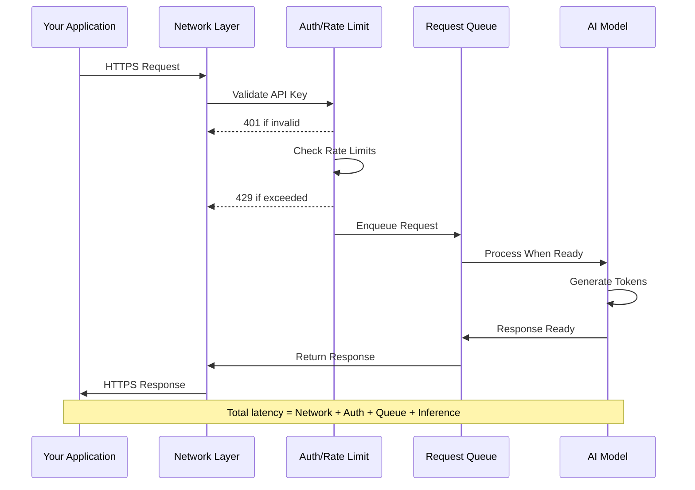
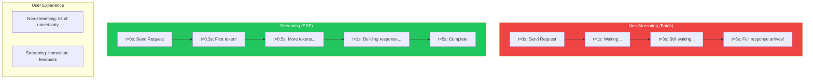
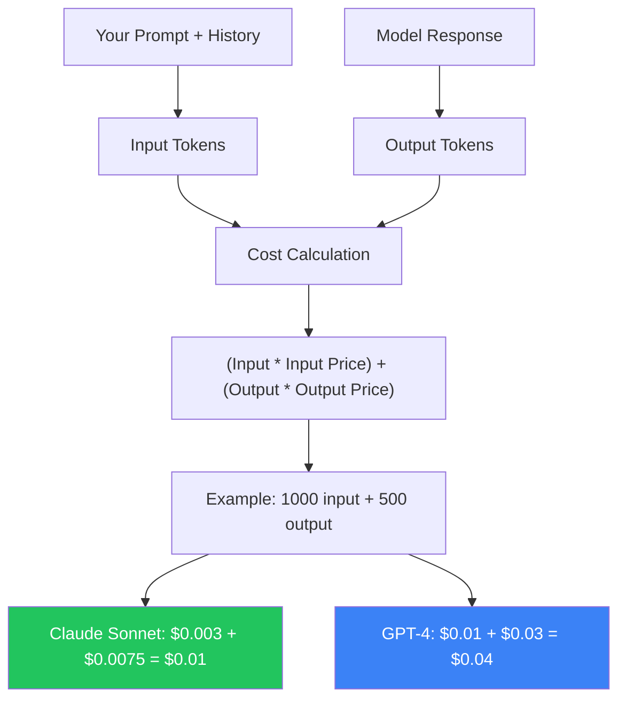
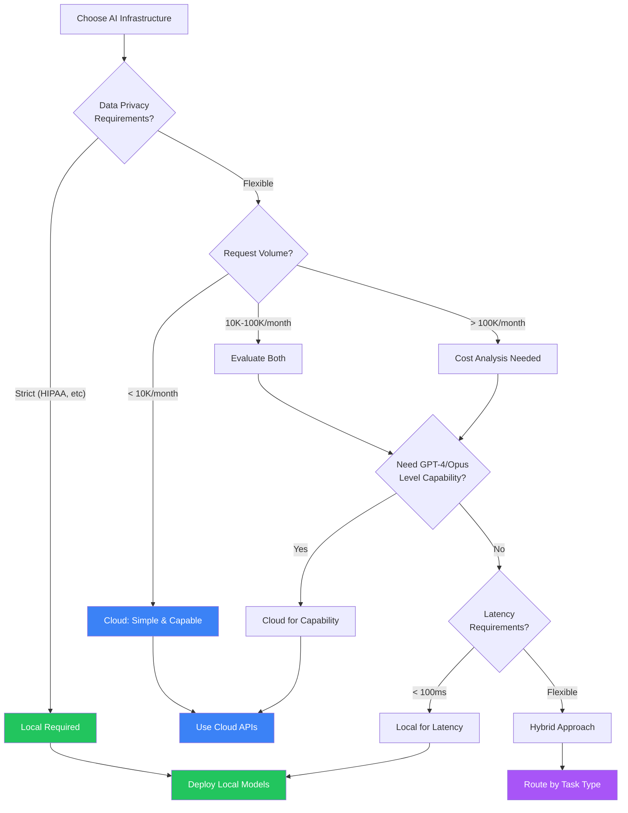
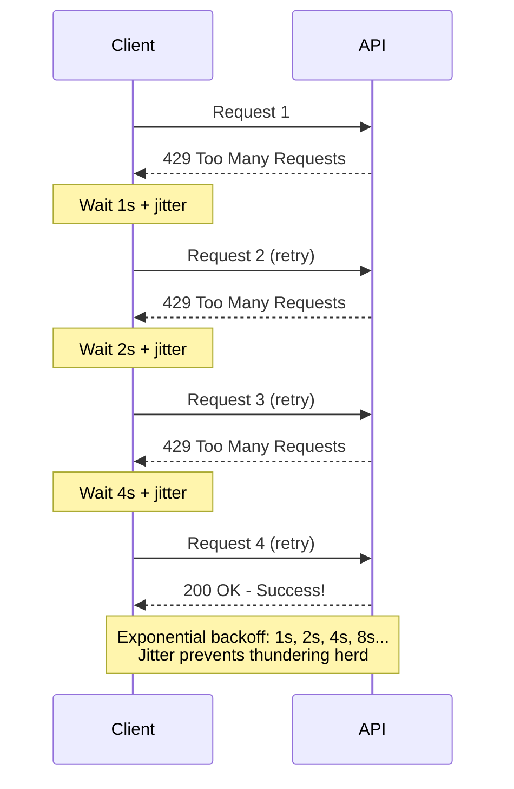

import Tip from "@components/mdx/Tip.astro";
import Warning from "@components/mdx/Warning.astro";
import Info from "@components/mdx/Info.astro";
import Exercise from "@components/mdx/Exercise.astro";
import Definition from "@components/mdx/Definition.astro";
import Quiz from "@components/react/Quiz";
import HandsOnExercise from "@components/react/HandsOnExercise";

## Section 1: The Network Layer of AI

### Why Networking Matters for AI Apps

Here's a truth that surprises many developers new to AI: most of your AI code won't be AI code at all. It will be networking code. API calls, error handling, retries, timeouts, connection management, response parsing. The actual intelligence lives somewhere else. Your job is getting data to it and back.

This isn't a temporary situation. Even as AI capabilities advance, the fundamental architecture remains: your application talks to AI services over networks. Understanding this layer deeply separates developers who build reliable AI applications from those whose applications fail mysteriously in production.

When you call Claude or GPT-4, multiple steps happen behind the scenes. TCP connection establishment. TLS negotiation for security. HTTP protocol handling. Request serialization where your prompt becomes bytes. Network transit, potentially across continents. Server queuing because you're not the only one asking. Model inference, which is the actual AI part. Response serialization where tokens become bytes. Network transit back. Response parsing. The AI inference, the part that feels like the whole point, is often the fastest step. A model generates tokens in milliseconds. The network adds seconds.

<Info title="The Latency Breakdown">
  A simple query might take 500ms total. A complex generation might take 30
  seconds. And every retry multiplies these costs. This is why AI API design
  patterns differ from typical web APIs. You're not fetching a database row.
  You're initiating computation that might run for half a minute.
</Info>

### The Stateless Illusion

Here's something that trips up developers: AI APIs are stateless. Each request is independent. The service doesn't remember your previous conversation.

"But I'm having a conversation with Claude! It remembers what I said!"

No, you're remembering and re-sending. Every request includes the full conversation history. The first request contains just your message. The second request contains your first message, the assistant's response, and your new message. The AI service processes each request fresh. The "memory" is in your application, sent with every request.

This has profound implications. Context window limits mean you can only send so much history. Cost scales with conversation because longer conversations include more tokens. Latency increases since more tokens to send means longer requests. And you control the memory, deciding what the AI "remembers."

Understanding this stateless model is crucial for designing efficient AI applications.

### What You're Actually Paying For

When you use AI APIs, you pay for tokens processed, both input (your prompt plus history) and output (the response). You pay for compute time since more complex reasoning takes longer. You pay for network bandwidth as those tokens travel over wires.

This is why optimization matters. Sending unnecessary context costs money. Inefficient prompts cost money. Poor retry logic costs money. The network layer isn't free.

---

## Section 2: AI API Design Patterns

### REST for AI: Same Verbs, Different Semantics

AI APIs use familiar REST patterns, but the semantics differ from typical CRUD operations. Traditional REST uses GET to retrieve existing data, POST to create new resources, PUT to update existing resources, and DELETE to remove resources. AI REST is almost all POST. You're not retrieving stored data. You're requesting computation. Each request creates something new.

<Definition term="AI API Semantics">
  Unlike traditional REST APIs that manage stored resources, AI APIs request
  computation. POST /v1/chat/completions generates new content. POST
  /v1/embeddings transforms text to vectors. Each call produces unique output
  based on model inference.
</Definition>

### The Standard Request Structure

AI APIs have converged on similar request structures. Understanding the anatomy helps you work with any AI API. The endpoint is where you send the request, usually versioned like /v1/ for stability. Headers include Content-Type (always application/json for AI APIs), Authorization or X-API-Key (your credentials), and version headers for consistent behavior.

The body contains your model selection (which affects capability, speed, and cost), max_tokens to limit response length and prevent runaway costs, messages containing the actual conversation, and parameters like temperature to control randomness.

### Authentication Patterns

Every AI API call needs to prove who you are. This happens through authentication tokens, long strings that identify your account. You include this token in the Authorization header of every request, and the API provider checks it before processing your request.

The pattern typically looks like "Authorization: Bearer sk-..." where that Bearer prefix tells the server you're providing a token. The token itself is your secret. Treat it like a password.

<Warning title="API Key Security">
  Never hardcode keys in your source code. Use environment variables. Rotate
  keys regularly, treating them like passwords. Use key scoping if the provider
  supports it, creating keys with minimal permissions. Monitor usage and watch
  for unexpected spikes that might indicate compromise.
</Warning>

### Rate Limiting: Playing Nice

AI APIs impose rate limits. You'll encounter requests per minute (RPM) which limits how many calls you can make, tokens per minute (TPM) which limits how many tokens you can process, and tokens per day (TPD) for daily quotas.

Rate limit headers tell you where you stand. They show your limit, remaining allowance, and when the limit resets. When you hit limits, you get HTTP 429 Too Many Requests.

When the API returns a 429, don't immediately retry. That's the API telling you to slow down. Instead, implement exponential backoff: wait 1 second, retry, wait 2 seconds, retry, wait 4 seconds. Each failure doubles the wait time, up to some maximum. This pattern respects the API's limits while eventually getting your request through.

Why does jitter matter? If 100 clients all hit rate limits simultaneously and all retry after exactly 2 seconds, they'll all hit the limit again. Adding random variation spreads out the retries.

### Versioning and Stability

AI APIs evolve rapidly. Protect yourself by pinning API versions through version headers and pinning model versions to specific releases rather than using floating identifiers that might change. Document your dependencies clearly in requirements files.

This prevents surprises when providers update their models or APIs.

---

## Section 3: Streaming and Real-Time

### Why Streaming Matters

Traditional request-response feels wrong for AI. You send a prompt, wait 5-30 seconds, then get a wall of text. Users wonder if anything is happening.

Streaming changes this: tokens arrive as they're generated. The response builds character by character, word by word. Users see progress. The experience feels alive.

This isn't just UX polish. It's a fundamental shift in how applications interact with AI. Streaming enables progressive rendering where you show text as it arrives. It enables early termination so you can stop generation if you see what you need. It enables real-time feedback where you can flag issues without waiting for completion. And it enables text-to-speech where you can speak complete sentences as they form.

### Server-Sent Events

The dominant streaming protocol for AI APIs is Server-Sent Events (SSE). The client opens a persistent connection with an Accept header of text/event-stream. The server sends events as they occur, with each data line being one event and blank lines separating events. Simple, text-based, easy to debug.

<Definition term="Server-Sent Events (SSE)">
  A standard for servers to push data to clients over HTTP. Unlike WebSockets,
  SSE is one-directional (server to client) and works over standard HTTP, making
  it firewall-friendly and simple to implement. Perfect for AI responses where
  the server streams tokens as they're generated.
</Definition>

### Implementing Streaming Clients

Using the Anthropic SDK, streaming looks like opening a context manager and iterating over the text_stream, printing each chunk immediately with flush=True. The SDK handles the SSE parsing for you.

With raw HTTP, you make a POST request with stream=True in both the JSON body and the requests call, then iterate over response lines, parsing each SSE data line and extracting the text deltas.

### Token-by-Token Processing

Streaming enables real-time processing as tokens arrive. You can buffer text and analyze it for issues, update the UI progressively, and detect complete sentences for text-to-speech. Different use cases need different buffering strategies: character-by-character for typing effects, word-by-word for speech synthesis, or sentence-by-sentence for paragraph display.

### WebSockets vs SSE

You might wonder: why SSE instead of WebSockets? SSE is simpler since it's just HTTP with a persistent connection. It's firewall-friendly since it looks like regular HTTP traffic. It has auto-reconnect built into the protocol. And it's one-directional, which is perfect for AI responses.

WebSockets offer bidirectional communication, binary support, and lower latency with no HTTP overhead per message. For AI APIs, SSE wins because you send one request and receive many response chunks (one-directional), responses are text (no need for binary), and simplicity matters more than micro-optimizations.

### Handling Stream Interruptions

Streams can fail mid-response. Handle this gracefully by accumulating the response as you receive it. If the stream fails, you can append what you received as an assistant message and ask the model to continue from where it left off. This recovery pattern ensures users don't lose partial responses.

---

## Section 4: Error Handling and Resilience

### The Error Taxonomy

AI APIs fail in predictable ways. Know your errors.

4xx client errors are your problem. 400 Bad Request means malformed request or invalid parameters. 401 Unauthorized means invalid or missing API key. 403 Forbidden means your key doesn't have permission. 404 Not Found means wrong endpoint or model name. 429 Too Many Requests means rate limit exceeded.

5xx server errors are their problem. 500 Internal Server Error means something broke on their end. 502 Bad Gateway means upstream service failed. 503 Service Unavailable means overloaded or maintenance. 529 Overloaded is AI-specific, meaning model capacity exceeded.

Network errors are nobody's problem. Connection timeout means you couldn't reach the server. Read timeout means you connected but the response took too long. Connection reset means something interrupted the connection.

<Tip title="When to Retry">
  Always retry 429 (with backoff), 500, 502, 503, network timeouts. Never retry
  400, 401, 403, 404 since these require code fixes, not retries. Maybe retry
  529 since it might clear up or might not.
</Tip>

### Implementing Robust Retry Logic

Production-grade retry logic needs a configuration with max retries, base delay, maximum delay, exponential base, and jitter toggle. The retry function calculates delay using exponential backoff, adds optional jitter, and checks whether each error type is retryable before deciding whether to retry or raise.

### Timeout Strategies

Different timeouts serve different purposes. Connection timeout controls how long to wait for connection, typically 5 seconds. Read timeout controls how long to wait for response data, which needs to be longer for AI since inference can be slow, perhaps 2 minutes. Write timeout controls how long to wait to send the request.

For streaming responses, consider per-chunk timeouts. If no data arrives for 30 seconds, the stream may have stalled.

### Graceful Degradation

When the AI service fails, what does your application do? You have several options. Fail visibly by returning a friendly error message. Fall back to a simpler model, perhaps from Claude Opus to Claude Haiku which is faster and cheaper. Use cached responses by returning slightly stale data if available. Fall back to a local model, which is slower and less capable but available.

### Circuit Breakers

Prevent cascade failures with circuit breakers. The circuit has three states: CLOSED for normal operation, OPEN when failing and rejecting requests, and HALF_OPEN when testing if recovered.

After a threshold of failures, the circuit opens and requests fail immediately without hammering the struggling service. After a recovery timeout, it tries one request. If that succeeds, normal operation resumes. This pattern prevents your application from overwhelming an already struggling service.

---

## Section 5: Local vs Cloud Trade-offs

### The Fundamental Choice

Every AI application faces a fundamental architecture question: where does inference happen?

Cloud AI from providers like OpenAI, Anthropic, and Google means you call an API, pay per token, have no infrastructure to manage, and get access to the most capable models. Local AI through tools like llama.cpp, Ollama, or vLLM means you run on your hardware, pay for compute once, have full infrastructure responsibility, and are limited to models you can run.

Neither is universally better. The right choice depends on your constraints.

### Latency Analysis

Cloud latency breaks down into network round-trip (50-200ms depending on geography), request processing (10-50ms), queue wait (0-5000ms depending on load), inference (100ms-30s), and response transmission (10-100ms). Total: 170ms to 35 seconds.

Local latency breaks down into network round-trip (0-5ms for localhost or LAN), request processing (1-5ms), queue wait (0ms since it's your hardware and queue), inference (200ms-60s depending on hardware), and response transmission (under 1ms). Total: 200ms to 60 seconds.

Cloud has lower inference latency due to better hardware, but network and queuing add unpredictability. Local has predictable latency since it's all on your hardware.

<Info title="Cost Modeling">
  Cloud costs are per-token, making them predictable per-request but potentially
  expensive at scale. Local costs are hardware investment plus electricity,
  which pays off with high volume. Break-even analysis helps: if you spend
  $500/month on Claude API and could serve those requests locally for $50/month
  in electricity with a $5000 hardware investment, you break even in about 11
  months.
</Info>

### Privacy and Compliance

This is often the deciding factor. With cloud, data leaves your network, the provider can see your prompts and responses, data may be used for training (opt-out policies vary), and compliance depends on provider certifications.

With local, data never leaves your infrastructure, there's no third-party access, you have full audit trail control, and compliance is your responsibility but also within your control.

For healthcare, legal, financial, or classified workloads, local AI may be required regardless of cost or capability trade-offs.

### Capability vs Availability

Cloud capabilities include access to largest models like GPT-4 and Claude Opus, automatic scaling, continuous improvements, and multi-modal support. Local capabilities are limited by your hardware, typically restricted to smaller models in the 7B-70B parameter range, require manual updates, but benefit from a rapidly improving open-source ecosystem.

The capability gap is narrowing. Open-source models are surprisingly capable for many tasks. But frontier capabilities remain cloud-only.

### Hybrid Approaches

Many production systems use both. Route simple tasks to local and complex tasks to cloud. Send latency-sensitive requests to local and quality-sensitive ones to cloud. Use local for development and testing, cloud for production. Try local first, fall back to cloud.

A hybrid client can check if a task requires high capability, try local first with a quality check, and fall back to cloud if needed.

---

## Section 6: Production API Integration

### Best Practices Summary

Production AI integrations need defense in depth: timeouts, retries, circuit breakers, and fallback models. They need observability: metrics for latency, token usage, success rates, and error types. They need cost controls: daily budgets with alerts. They need request queuing: limited concurrent requests to avoid overwhelming services. They need graceful shutdown: waiting for pending requests before exiting.

### Architecture Patterns

The API Gateway pattern centralizes all AI calls through your gateway for consistent handling, caching, rate limiting, and logging. The Async Processing pattern queues long-running AI tasks and notifies on completion via webhook or polling. The Edge Caching pattern caches common AI responses at the edge for repeated queries.

### Production Readiness Checklist

Before deploying AI integrations to production, verify that API keys are stored securely and not in code. Verify rate limiting is implemented. Verify retry logic uses exponential backoff. Verify timeouts are configured appropriately. Verify error handling covers all failure modes. Verify a fallback strategy is defined. Verify metrics and logging are in place. Verify cost monitoring and alerts exist. Verify circuit breaker prevents cascade failures. Verify graceful degradation has been tested. Verify load testing is complete. Verify security review has passed.

---

## Diagrams

### AI API Request Flow

### Streaming vs Batch Comparison

### Token Cost Calculator

### Local vs Cloud Decision Matrix

### Rate Limiting and Exponential Backoff

---

## Hands-On Exercise: Build a Production API Client

<HandsOnExercise
  client:visible
  moduleSlug="networks-apis-ai-infrastructure"
  exerciseId="production-api-client"
  title="Build a Production API Client"
  objective="Build a production-ready AI API client that handles streaming, errors, retries, and rate limits gracefully."
  totalTime="45-60 minutes"
  setupInstructions={[
    "Install Python 3.8+ if not already installed",
    "Install required libraries: pip install anthropic httpx",
    "Set your API key: export ANTHROPIC_API_KEY='your-key-here'",
    "Create a new file called ai_client.py for your code",
  ]}
  parts={[
    {
      id: "basic-client",
      title: "Basic Client with Error Handling",
      duration: "15 min",
      instructions: [
        "Create a RobustAIClient class that wraps the Anthropic client",
        "Implement a complete() method that makes API calls with automatic retries",
        "Add a _calculate_delay() method for exponential backoff with jitter",
        "Add a _should_retry() method that returns True for retryable errors (429, 500, 502, 503)",
        "Track request count and total tokens used",
      ],
      observePrompt:
        "Does the client handle successful requests? Does it track token usage correctly?",
    },
    {
      id: "streaming-support",
      title: "Add Streaming Support",
      duration: "15 min",
      instructions: [
        "Add a stream() method that yields tokens as they arrive",
        "Use the client.messages.stream() context manager",
        "Print tokens with flush=True for immediate display",
        "Get the final message for accurate token counting",
        "Test with: for chunk in client.stream('Write a haiku'): print(chunk, end='')",
      ],
      observePrompt:
        "How does streaming feel different from non-streaming? Watch tokens appear one by one.",
    },
    {
      id: "circuit-breaker",
      title: "Add Circuit Breaker Protection",
      duration: "10 min",
      instructions: [
        "Create a CircuitBreaker class with CLOSED, OPEN, and HALF_OPEN states",
        "Track failure count and last failure time",
        "Open the circuit after 5 consecutive failures",
        "After 30 seconds, allow one test request (HALF_OPEN)",
        "Reset to CLOSED on success, back to OPEN on failure",
      ],
      observePrompt:
        "How does the circuit breaker prevent overwhelming a failing service?",
    },
    {
      id: "metrics",
      title: "Add Metrics and Observability",
      duration: "10 min",
      instructions: [
        "Create a Metrics class tracking request count, success/error counts, total tokens, and latencies",
        "Add a record_request() method that logs each request's outcome",
        "Add a summary() method that returns formatted statistics",
        "Wrap your complete() method to record timing and outcomes",
        "Run several requests and review the metrics summary",
      ],
    },
  ]}
  successCriteria={[
    {
      id: "retry-logic",
      text: "Implemented automatic retry logic with exponential backoff",
    },
    { id: "jitter", text: "Added jitter to prevent thundering herd problems" },
    {
      id: "streaming",
      text: "Implemented streaming with progressive token display",
    },
    {
      id: "circuit-breaker",
      text: "Added circuit breaker to prevent cascade failures",
    },
    { id: "metrics", text: "Implemented metrics collection for observability" },
    { id: "tested", text: "Tested all components together successfully" },
  ]}
/>

---

## Knowledge Check

<Quiz
  client:visible
  quizId="module-04-knowledge-check"
  moduleSlug="networks-apis-ai-infrastructure"
  questions={[
    {
      id: "q1",
      type: "multiple-choice",
      question:
        "Why do AI APIs use POST for nearly all operations instead of GET?",
      options: [
        { id: "a", text: "POST requests are faster than GET requests" },
        {
          id: "b",
          text: "AI operations create new content through computation rather than retrieving stored data",
        },
        { id: "c", text: "GET requests don't support JSON" },
        { id: "d", text: "POST is more secure than GET" },
      ],
      correctAnswer: "b",
      explanation:
        "AI API calls are fundamentally different from traditional CRUD operations. You're not retrieving existing data - you're requesting computation that generates new content. Each request produces a unique response based on the model's inference. POST semantically represents 'create' or 'process,' which accurately describes what AI endpoints do.",
    },
    {
      id: "q2",
      type: "multiple-choice",
      question:
        "What is the primary advantage of streaming responses for AI applications?",
      options: [
        { id: "a", text: "Streaming responses use less bandwidth" },
        {
          id: "b",
          text: "Streaming allows users to see tokens as they're generated, providing immediate feedback",
        },
        { id: "c", text: "Streaming responses are more accurate" },
        { id: "d", text: "Streaming is required by all AI APIs" },
      ],
      correctAnswer: "b",
      explanation:
        "Streaming transforms user experience by showing progress immediately rather than making users wait for complete responses. Beyond UX, streaming enables practical benefits: early termination if the response is going wrong, real-time processing like text-to-speech, and better perceived performance.",
    },
    {
      id: "q3",
      type: "multiple-choice",
      question:
        "When implementing retry logic for AI APIs, why is 'jitter' added to exponential backoff?",
      options: [
        { id: "a", text: "To make the code more random and unpredictable" },
        {
          id: "b",
          text: "To prevent synchronized retries from many clients hitting rate limits simultaneously",
        },
        { id: "c", text: "To reduce the total number of retries needed" },
        { id: "d", text: "Jitter is required by AI API specifications" },
      ],
      correctAnswer: "b",
      explanation:
        "Without jitter, if 100 clients all hit a rate limit at the same time and retry after exactly 2 seconds, they'll all hit the limit again simultaneously. This creates 'thundering herd' problems. Jitter adds random variation to retry timing, spreading out requests and reducing the chance of synchronized spikes that overwhelm the service.",
    },
    {
      id: "q4",
      type: "multiple-choice",
      question:
        "Which factor most often makes local AI deployment mandatory rather than optional?",
      options: [
        { id: "a", text: "Cost savings potential" },
        { id: "b", text: "Lower latency requirements" },
        {
          id: "c",
          text: "Privacy and compliance requirements that prohibit data leaving the network",
        },
        { id: "d", text: "Better model quality" },
      ],
      correctAnswer: "c",
      explanation:
        "While cost and latency can favor local deployment, these are usually optimization choices. Privacy and compliance requirements are often non-negotiable constraints. Healthcare (HIPAA), legal (attorney-client privilege), financial (regulatory requirements), and classified/defense workloads may legally require that data never leave controlled infrastructure.",
    },
    {
      id: "q5",
      type: "multiple-choice",
      question:
        "What does a circuit breaker protect against in AI API integrations?",
      options: [
        { id: "a", text: "Electrical surges in the data center" },
        {
          id: "b",
          text: "Cascade failures by stopping requests to a failing service",
        },
        { id: "c", text: "Authentication token expiration" },
        { id: "d", text: "Response parsing errors" },
      ],
      correctAnswer: "b",
      explanation:
        "A circuit breaker prevents cascade failures by detecting when a service is struggling and stopping requests to it temporarily. After a threshold of failures, the circuit 'opens' and requests fail immediately without hitting the struggling service. This gives the service time to recover while preventing your application from being dragged down.",
    },
  ]}
  passingScore={70}
  allowRetry={true}
/>

---

## Summary

In this module, you've learned:

1. **The network layer dominates AI applications**: Most of your "AI code" is actually networking code - API calls, error handling, retries, and response parsing. Understanding this layer deeply is essential for building reliable applications.

2. **AI APIs follow patterns with AI-specific semantics**: While built on familiar REST conventions, AI APIs are fundamentally different. You're requesting computation that generates new content, not retrieving stored data. This affects everything from HTTP methods to timeout strategies.

3. **Streaming transforms user experience**: Server-Sent Events enable token-by-token delivery that makes AI feel responsive. Beyond UX, streaming enables early termination, real-time processing, and better error handling.

4. **Resilience requires multiple strategies**: Production AI integrations need exponential backoff, jitter, circuit breakers, graceful degradation, and fallback options. Single-point-of-failure designs will fail in production.

5. **Local vs cloud is a trade-off, not a hierarchy**: Privacy, cost, latency, and capability requirements all factor into infrastructure decisions. Many production systems use hybrid approaches that leverage both.

The network layer might seem like plumbing compared to the excitement of AI capabilities, but it's the plumbing that determines whether your AI application works reliably in the real world.

---

## What's Next

**Module 5: Databases and Data Management for AI**

We'll cover:

- How AI applications store and retrieve data
- Vector databases for semantic search
- Conversation history and context management
- RAG (Retrieval-Augmented Generation) architectures
- Scaling data infrastructure for AI workloads

The data layer complements the network layer. Together they form the infrastructure foundation for all AI applications.

---

## References

### Official Documentation

1. **Anthropic API Documentation**

   Complete reference for Claude APIs, including authentication, rate limits, and streaming.
   [docs.anthropic.com](https://docs.anthropic.com)

2. **OpenAI API Documentation**

   Comprehensive guide to OpenAI's API patterns and best practices.
   [platform.openai.com/docs](https://platform.openai.com/docs)

3. **HTTP/1.1 Specification (RFC 9110)**

   The definitive reference for HTTP semantics that all AI APIs build upon.
   [datatracker.ietf.org/doc/html/rfc9110](https://datatracker.ietf.org/doc/html/rfc9110)

### Practical Guides

4. **Server-Sent Events Specification**

   W3C specification for SSE, the streaming protocol used by most AI APIs.
   [html.spec.whatwg.org/multipage/server-sent-events.html](https://html.spec.whatwg.org/multipage/server-sent-events.html)

5. **Circuit Breaker Pattern (Martin Fowler)**

   Detailed explanation of the circuit breaker pattern for resilient systems.
   [martinfowler.com/bliki/CircuitBreaker.html](https://martinfowler.com/bliki/CircuitBreaker.html)

6. **Exponential Backoff and Jitter (AWS Architecture Blog)**

   Deep dive into retry strategies for distributed systems.
   [aws.amazon.com/blogs/architecture/exponential-backoff-and-jitter](https://aws.amazon.com/blogs/architecture/exponential-backoff-and-jitter/)

### Local AI Resources

7. **Ollama Documentation**

   Guide to running local LLMs with a simple API.
   [ollama.ai](https://ollama.ai)

8. **llama.cpp**

   High-performance inference for running LLMs locally.
   [github.com/ggerganov/llama.cpp](https://github.com/ggerganov/llama.cpp)

9. **vLLM Documentation**

   Production-grade local inference with high throughput.
   [docs.vllm.ai](https://docs.vllm.ai)

### Tools

10. **tiktoken**

    OpenAI's token counting library for accurate cost estimation.
    [github.com/openai/tiktoken](https://github.com/openai/tiktoken)

11. **httpx**

    Modern async HTTP client for Python with streaming support.
    [python-httpx.org](https://www.python-httpx.org/)

12. **MDN HTTP Guide**

    Comprehensive guide to HTTP fundamentals.
    [developer.mozilla.org/en-US/docs/Web/HTTP](https://developer.mozilla.org/en-US/docs/Web/HTTP)
