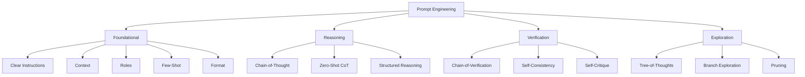
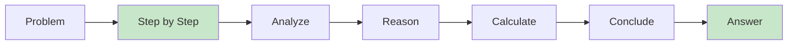
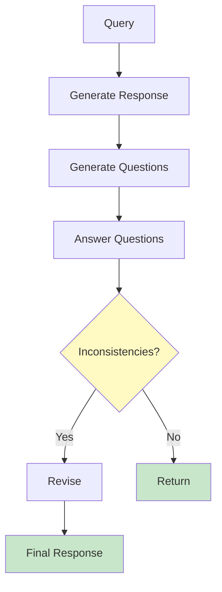
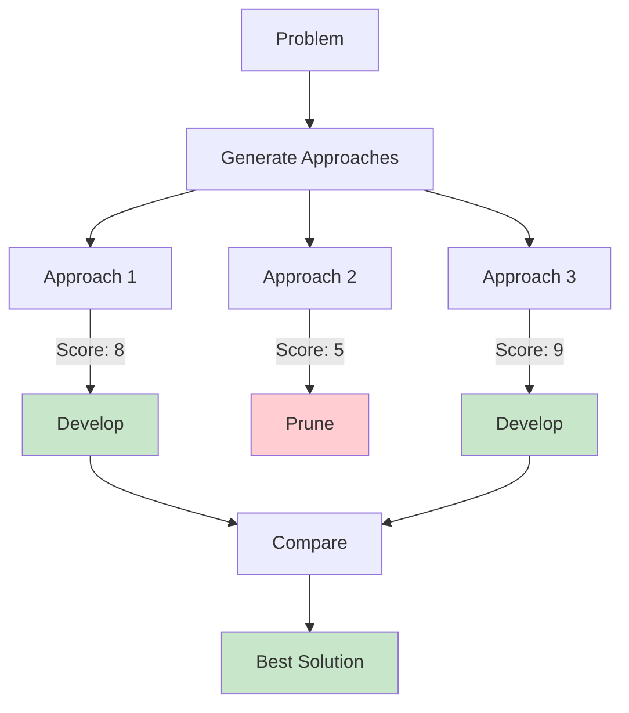
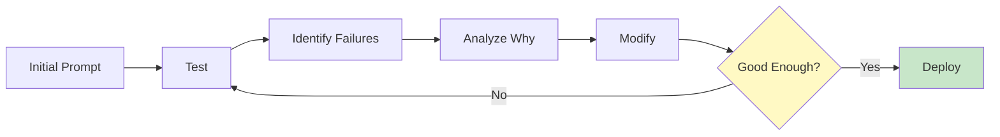

import Tip from "@components/mdx/Tip.astro";
import Warning from "@components/mdx/Warning.astro";
import Info from "@components/mdx/Info.astro";
import Definition from "@components/mdx/Definition.astro";
import Quiz from "@components/react/Quiz";
import HandsOnExercise from "@components/react/HandsOnExercise";

# Prompt Engineering Mastery

You have used AI. You have typed questions, gotten answers. Sometimes they are brilliant; sometimes they are nonsense. Often, the difference is not the AI. It is the prompt.

Prompt engineering is not about finding magic words. It is about understanding how language models process input and structuring that input to maximize the probability of useful outputs. This module teaches you the principles and techniques that separate effective prompts from ineffective ones.

## Prompt Engineering Principles

When you call a function in code, you provide parameters in a specific format. The function does not guess what you mean. It processes exactly what you give it. Prompts work similarly, but the "function" is a probabilistic token predictor, not deterministic logic.

<Definition term="Prompt Engineering">
  The practice of designing and refining inputs to language models to achieve
  desired outputs. It combines understanding of how models process text with
  systematic testing and iteration to produce reliable, consistent results.
</Definition>

This creates both challenges and opportunities.

The challenges include that the same prompt can produce different outputs, subtle wording changes can dramatically affect results, models may misinterpret intent or context, and there is no guarantee of factual accuracy.

The opportunities include that iterative refinement can dramatically improve outputs, structured approaches yield consistent results, you can "program" behavior through examples and instructions, and advanced techniques unlock reasoning capabilities.

### Prompt as Programming

Consider this perspective: prompt engineering is a form of programming where your code is natural language, your compiler is a language model, your output is generated text, and your debugging is iterative testing.

<Info>
  Traditional programming gives you deterministic execution: the same input
  always produces the same output. Prompt programming gives you probabilistic
  generation: similar inputs tend to produce similar outputs, but variation is
  inherent. This requires different skills and expectations.
</Info>

In traditional programming, you write a function like `calculate_tax(income, rate)` that returns `income * rate`. In prompt programming, you write something like "Given an income and tax rate, calculate the tax owed. Income: $50,000. Tax rate: 22%. Step by step:" Both specify inputs, operations, and expected outputs, but prompts work with a probabilistic system that requires different techniques.

### The Prompt Engineering Mindset

Effective prompt engineering requires several key practices.

Precision means being specific about what you want. "Write a function" is vague. "Write a Python function that takes a list of integers and returns the median value, handling even-length lists correctly" is precise.

Experimentation recognizes that your first prompt rarely works perfectly. Expect to iterate.

<Warning>
  Always validate outputs. The model can sound confident while being completely
  wrong. Good prompts improve the odds of correct outputs but never guarantee
  them.
</Warning>

Verification means always validating outputs. The model can sound confident while being completely wrong.

Pattern recognition develops as you learn what works across different tasks and domains.

Documentation keeps track of effective prompts. Build a personal library.

### The Anatomy of a Good Prompt

Effective prompts typically include several components.

Context provides background information the model needs. Instruction specifies what you want it to do. Input contains the specific data or query. Output format describes how you want the response structured. Constraints indicate what to avoid or emphasize. Examples provide few-shot demonstrations, which are optional but powerful.

<Tip>
  Not every prompt needs all components, but thinking in these terms helps
  structure your requests effectively. Start with context, instruction, and
  input, then add format and constraints as needed.
</Tip>

## Foundational Techniques

The foundation of good prompting is clarity. Models are literal. They do what you ask, not what you mean.

### Clear Instructions

A weak prompt says "Tell me about React hooks." A strong prompt says "Explain React hooks to an experienced developer familiar with class components but new to hooks. Focus on useState and useEffect. Include what problems hooks solve, basic syntax with code examples, common mistakes to avoid, and when to use each hook."

The strong prompt specifies audience, scope, structure, and emphasis.

### Providing Context

Models have no memory beyond the conversation. Every prompt exists in isolation unless you provide context.

Without context, asking "How do I fix this error?" is essentially unanswerable. With context, explaining that you are building a Node.js Express API, getting a specific error when querying PostgreSQL, providing your connection code, and specifying your environment transforms an impossible question into an answerable one.

<Info>
  Context transforms vague questions into answerable ones. The more relevant
  context you provide, the more useful the response will be. But avoid
  overwhelming the model with irrelevant details.
</Info>

### Role Assignment

Giving the model a role can improve outputs by activating relevant patterns from training data.

Effective roles include "You are a senior code reviewer for a Python project following PEP 8 standards" or "You are an experienced DevOps engineer specializing in Kubernetes."

This works because training data likely contains many examples of experts explaining concepts. The role primes the model to match those patterns.

<Definition term="Role Assignment">
  A prompting technique where you specify a persona or expertise level for the
  model to adopt, activating relevant patterns from training data. Effective
  roles are specific, domain-relevant, and establish clear expertise or
  perspective.
</Definition>

Ineffective roles include overly creative ones like "You are a time-traveling wizard who codes," contradictory ones like "You are always right and never make mistakes," or too vague ones like "You are helpful."

### Few-Shot Learning

Instead of describing what you want, show examples. This is called few-shot prompting.

Zero-shot provides only instruction without examples. Few-shot provides instruction with examples that demonstrate the desired behavior.

<Tip>
  Few-shot learning is powerful because it shows rather than tells, handles edge
  cases through examples, establishes patterns the model can follow, and works
  across domains. Two or three well-chosen examples often improve results more
  than lengthy instructions.
</Tip>

For a task like converting sentences to title case while preserving lowercase for articles and prepositions, showing examples like "the quick brown fox jumps over the lazy dog" becoming "The Quick Brown Fox Jumps Over the Lazy Dog" teaches the pattern more effectively than describing the rules.

### Output Format Specification

Tell the model exactly how to structure its response.

Unstructured requests often produce inconsistent formats. Structured requests that specify JSON schema, markdown structure, or specific field requirements make outputs parseable, consistent, and actionable.

Common formats include JSON for structured data, markdown for documentation, code blocks for implementations, lists for options or steps, and tables for comparisons.

### Chain Breaking for Complex Tasks

Do not ask the model to do everything at once. Break complex tasks into steps.

<Warning>
  Monolithic prompts that request complete systems with authentication, database
  models, and tests are prone to failure. Chain prompts that build
  incrementally, verifying each step before proceeding, are more reliable.
</Warning>

A monolithic prompt requesting "a complete REST API for a blog with users, posts, and comments, including authentication, database models, and tests" will often fail. A chained approach that first designs the schema, then creates models based on that schema, then builds endpoints based on those models, produces better results because each step can be verified before proceeding.

## Chain-of-Thought Prompting

Chain-of-Thought prompting encourages models to show their reasoning process rather than jumping directly to answers. This improves accuracy, especially for tasks requiring multiple reasoning steps.

<Definition term="Chain-of-Thought (CoT)">
  A prompting technique that elicits step-by-step reasoning from language
  models. By asking models to show their work, CoT improves accuracy on complex
  tasks by creating intermediate checkpoints and activating reasoning patterns
  from training data.
</Definition>

### Why CoT Works

When you ask for reasoning steps, several things happen.

Better token predictions result because training data contains more correct answers that show work than correct answers alone. Intermediate checkpoints constrain subsequent steps, each reasoning step narrowing the solution space. Error detection becomes possible because wrong reasoning is often more obvious than wrong answers. Training patterns are leveraged because educational content and technical documentation frequently show step-by-step reasoning.

### Standard Chain-of-Thought

The basic CoT structure presents a problem and adds "Let's solve this step by step" or similar phrasing. The model then generates numbered steps that walk through the reasoning before arriving at a final answer.

*Tree-of-Thoughts extends CoT by exploring multiple reasoning paths in parallel and evaluating them, improving performance on hard problems.*

<Info>
  Remarkably, simply adding "Let's think step by step" often triggers reasoning
  without any examples. This zero-shot CoT works because the phrase appears in
  training data associated with correct reasoning processes.
</Info>

### When CoT Helps Most

Chain-of-Thought is particularly effective for mathematical reasoning with multi-step calculations, logical deduction requiring inference from premises, multi-step procedures like debugging by tracing execution, and complex comparisons requiring systematic evaluation of multiple factors.

### When CoT May Not Help

CoT is less useful or even counterproductive for simple fact retrieval, pattern completion tasks, creative generation where flow matters more than logic, and tasks requiring conciseness like summaries or headlines. The overhead of reasoning steps outweighs benefits for simple queries.

### Structured CoT Templates

For consistent results, provide a reasoning structure. Instead of letting the model choose its reasoning format, specify the analysis framework. For code review, you might specify steps like "What does the current code do?" then "What does the new code do?" then "What are the differences?" then "What depends on the changed behavior?" then "Conclusion: Breaking or non-breaking?"

<Tip>
  Combining CoT with few-shot learning is particularly effective. Show examples
  of the reasoning pattern you want, then ask the model to apply the same
  pattern to new inputs.
</Tip>

## Chain-of-Verification

Language models hallucinate, generating confident falsehoods. Chain-of-Verification is a technique to reduce this by having the model verify its own outputs.

The key insight is that models are often better at verification than generation. A model might incorrectly claim "Python was released in 1995" but correctly answer "Was Python released in 1995?" with "No, it was first released in 1991."

<Definition term="Chain-of-Verification (CoV)">
  A technique that reduces hallucinations by having the model verify its own
  outputs. The model generates an initial response, creates verification
  questions, answers those questions, and produces a revised response
  incorporating any corrections.
</Definition>

### Basic CoV Pattern

The structure is straightforward. Generate an initial response. Generate verification questions about that response. Answer the verification questions. Produce a final revised response based on verification.

### Self-Consistency Checking

Ask the model to solve problems multiple times using different approaches, then reconcile. For calculating time complexity, you might use operation counting, recurrence relations, and comparison to known patterns, then check if all approaches agree. Disagreement between approaches signals potential errors.

<Warning>
  Chain-of-Verification has limits. If the model does not know something,
  verification will not help. Models can verify incorrect information
  confidently. For critical information, verify against actual sources, not
  model self-checking.
</Warning>

### Limitations of CoV

Chain-of-Verification has important limits. Same model, same biases means that if the model does not know something, verification will not help. Overconfidence means models can verify incorrect information confidently. Computational cost means multiple generation steps increase latency and token usage. Not a substitute for real verification means critical information needs external verification.

Use CoV when factual accuracy is important but not mission-critical, when you are generating technical content that can be verified logically, when the cost of hallucinations is moderate, and when you cannot easily verify outputs yourself.

## Reflection and Self-Correction

While CoV focuses on factual verification, reflection techniques ask models to critique the quality of their outputs: clarity, completeness, adherence to requirements.

### The Self-Critique Pattern

Generate initial output, then evaluate on specific dimensions like clarity, completeness, examples, and accuracy. Rate each dimension and explain deficiencies. Revise based on the critique.

<Tip>
  Multiple perspectives often catch issues single-perspective analysis misses.
  Have the model review from different roles: security reviewer, performance
  engineer, maintainability advocate. Then synthesize the findings.
</Tip>

### The "What Could Go Wrong" Technique

Ask the model to explicitly consider failure modes. For system design, generate the design, then analyze what happens if various components fail: service unavailable, database fails mid-transaction, extreme load, unreliable network, inconsistent data. Then revise the design to address these concerns.

This "pre-mortem" approach improves robustness.

### Limitations of Self-Correction

Models have inherent limitations in self-correction. They cannot fix unknown unknowns. They may double-down on errors. They have limited meta-cognition. Diminishing returns set in beyond two or three rounds. The process is still probabilistic.

<Info>
  To maximize effectiveness, be specific about evaluation criteria, use concrete
  examples in critique, limit reflection rounds to two or three, verify critical
  outputs externally, and compare before and after since sometimes the original
  is better than the "improved" version.
</Info>

## Tree-of-Thoughts and Beyond

Chain-of-Thought follows a single reasoning path. But complex problems often require exploring multiple paths before committing to one. Tree-of-Thoughts enables this exploration.

<Definition term="Tree-of-Thoughts (ToT)">
  A reasoning framework that generates multiple solution approaches, evaluates
  each, and pursues the most promising ones. Unlike linear Chain-of-Thought, ToT
  enables exploration and backtracking, similar to beam search for reasoning.
</Definition>

### Basic Tree-of-Thoughts Structure

Generate multiple approaches to a problem. Evaluate each approach on relevant criteria. Select the most promising approaches. Develop the selected approaches in detail. Make a final comparison and recommendation.

### When ToT is Valuable

Tree-of-Thoughts shines for problems with multiple viable approaches, optimization problems requiring comparison of different strategies, and creative tasks requiring exploration before committing to a direction.

### Pruning Strategies

ToT can explode combinatorially. Use pruning to stay manageable.

Evaluation-based pruning generates many solutions but pursues only the top performers. Constraint-based pruning discards any solutions that violate requirements. Threshold-based pruning pursues only those scoring above a minimum threshold.

<Warning>
  Tree-of-Thoughts has significant downsides: computational cost (potentially
  10x tokens for a simple question), latency from sequential generation,
  complexity in prompt design, and diminishing returns for simple problems. Use
  ToT selectively for complex, high-value problems.
</Warning>

### Combining Techniques

The most powerful prompts combine multiple techniques. For debugging a distributed system, you might use ToT to generate multiple hypotheses, CoT to trace through each hypothesis systematically, and CoV to verify the most likely cause before finalizing diagnosis and solution.

## Practical Prompt Optimization

Prompt engineering is empirical. What works must be tested, not assumed.

### Systematic Testing

Create test cases covering easy, moderate, hard, and edge cases. Run your prompt against all test cases. Measure specific characteristics of outputs.

<Tip>
  Treat prompts like code: version them. Track the version number, date, changes
  made, performance metrics, and remaining issues. This history helps you
  understand what improvements work.
</Tip>

### A/B Testing Prompts

Compare variations systematically. Test a basic prompt, one with added structure, and one with role assignment, examples, and explicit format requirements. Run each against the same inputs and compare which catches more issues, produces better quality, and is more consistent.

### Iteration Workflow

Start simple with a basic prompt. Test against diverse inputs. Identify where it fails. Hypothesize why it failed. Make targeted modifications. Test again to see if it improved. Repeat until good enough.

### Common Improvements

When prompts underperform, try adding specificity (from "Write a function" to "Write a Python function with type hints that..."), adding structure (from "Review this code" to "Review this code for: 1) bugs, 2) security, 3) performance"), adding examples, adding constraints, or adding explicit output format.

### Performance Metrics

Define what "good" means for your use case. Accuracy measures whether it gives correct information. Completeness measures whether it covers all requirements. Conciseness measures whether it is the right length. Format adherence measures whether it follows the requested structure. Consistency measures whether similar inputs produce similar outputs.

## Prompt Patterns Library

Here is a library of reusable prompt patterns for common scenarios.

### Pattern: Role-Task-Format

"You are [ROLE]. Your task is to [TASK]. Provide your response as [FORMAT]."

### Pattern: Few-Shot with CoT

Provide task description, then examples showing input, reasoning steps, and output. Then present the actual input and ask for reasoning.

<Info>
  Building a personal prompt library accelerates your work. Save effective
  prompts, generalize them into templates, document when each works best, share
  and iterate with your team, and version control changes.
</Info>

### Pattern: Generate-Critique-Revise

Generate initial output. Critique on specific criteria. Revise based on the critique.

### Pattern: Explore-Evaluate-Select

Generate multiple approaches. Evaluate each on defined criteria. Select the best and develop in detail.

### Pattern: Context-Question-Constraints

Provide all relevant background. Ask the specific question. List constraints. Optionally specify output format.

### Domain-Specific Patterns

For code review, specify the language, list what to review for (correctness, security, performance, maintainability, best practices), and for each issue require line numbers, severity, explanation, and suggested fix.

For debugging, provide symptoms, expected behavior, code, and environment. Then structure step-by-step debugging: likely cause, verification approach, fix, and alternative explanations.

For documentation, specify the type, include overview, usage with examples, parameters, return values, examples, edge cases and errors, and notes.

## Diagrams

### Prompt Engineering Techniques Hierarchy

### Chain-of-Thought Flow

### Chain-of-Verification Process

### Tree-of-Thoughts Structure

### Prompt Optimization Cycle

## Hands-On Exercise

<HandsOnExercise
  client:visible
  moduleSlug="prompt-engineering-mastery"
  exerciseId="prompt-engineering-challenge"
  title="Prompt Engineering Challenge"
  objective="Master advanced prompting techniques through progressive experimentation with code generation, debugging, and system design tasks"
  totalTime="60-90 minutes"
  setupInstructions={[
    "Get access to an AI assistant (Claude, GPT-4, or similar)",
    "Open a text editor or notebook for documenting prompts and results",
    "Prepare code samples for testing (email validation, buggy function, etc.)",
  ]}
  parts={[
    {
      id: "code-generation",
      title: "Code Generation Challenge",
      duration: "20 min",
      instructions: [
        "Attempt 1 - Basic: Write a simple, direct prompt to generate an email validation function",
        "Document what code it generates and whether it handles edge cases correctly",
        "Attempt 2 - Structured: Add role assignment, context, output format, and specific requirements for valid emails",
        "Document how outputs improved and what gaps remain",
        "Attempt 3 - Few-Shot: Add 2-3 examples of email addresses with validity status, including edge cases like plus addressing (user+tag@example.com)",
        "Test whether it now handles both shown and unshown edge cases",
        "Compare all three approaches and identify which produced the best code",
      ],
      observePrompt:
        "Which prompting technique had the biggest impact on code quality? What made the difference - role, structure, or examples?",
    },
    {
      id: "debugging-cot",
      title: "Debugging with CoT",
      duration: "20 min",
      instructions: [
        "Create or find a buggy find_duplicates function that returns duplicate values multiple times instead of unique duplicates",
        "Attempt 1 - Without CoT: Use a simple prompt asking what's wrong and how to fix it",
        "Document whether it identified the issue correctly and if the fix works",
        "Attempt 2 - With CoT: Use structured reasoning that asks to trace execution step by step, identify when items get added to duplicates, pinpoint the bug, and provide a fix",
        "Compare whether CoT improved debugging accuracy and explanation quality",
        "Test the suggested fixes to verify they work",
      ],
      observePrompt:
        "How does asking for step-by-step reasoning change the quality of debugging? Does the model catch its own mistakes more often with CoT?",
    },
    {
      id: "system-design-tot",
      title: "System Design with ToT",
      duration: "25 min",
      instructions: [
        "Present this scenario: Design a caching strategy for a REST API with high-read, low-write workload, 100+ endpoints, and need to balance hit rate versus memory",
        "Attempt 1 - Direct: Simple prompt asking for a caching strategy",
        "Document what approach it suggested and whether it explored alternatives",
        "Attempt 2 - Tree-of-Thoughts: Ask to generate 4 different caching approaches (e.g., LRU, TTL, adaptive, tiered)",
        "Request evaluation of each approach on: hit rate potential, memory usage, implementation complexity, and consistency guarantees",
        "Ask it to rank the approaches and develop detailed implementation for the top-ranked option",
        "Compare whether ToT exploration produced a better design than direct approach",
      ],
      observePrompt:
        "Does exploring multiple approaches lead to better solutions? Is the exploration overhead worth it for this type of problem?",
    },
    {
      id: "build-pattern",
      title: "Build Your Pattern",
      duration: "25 min",
      instructions: [
        "Design a reusable prompt pattern for code review that specifies which aspects to review (correctness, security, performance, maintainability)",
        "Structure the output format (e.g., sections for each concern with severity ratings)",
        "Make the pattern reusable across different code samples and languages",
        "Test your pattern on 2-3 different code samples (different languages or problem types)",
        "Refine the pattern based on what works and what doesn't",
        "Document the final pattern as a template with placeholders",
        "Write what you learned during the refinement process",
      ],
      observePrompt:
        "What makes a prompt pattern reusable? How specific should instructions be versus leaving room for context-appropriate responses?",
    },
  ]}
  successCriteria={[
    {
      id: "all-attempts",
      text: "Attempted all challenges with multiple approaches",
    },
    {
      id: "comparison",
      text: "Documented specific differences between outputs",
    },
    { id: "pattern", text: "Created at least one reusable prompt pattern" },
    {
      id: "technique-matching",
      text: "Identified which techniques work best for which scenarios",
    },
    {
      id: "reflection",
      text: "Reflected on practical applications in your own work",
    },
  ]}
/>

## Knowledge Check

<Quiz
  client:visible
  quizId="module-14-knowledge-check"
  moduleSlug="prompt-engineering-mastery"
  questions={[
    {
      question:
        "What is the primary reason Chain-of-Thought prompting improves accuracy on complex reasoning tasks?",
      options: [
        "It makes the model work harder by using more compute",
        "It uses more tokens, giving the model more context",
        "Training data contains more correct answers that show reasoning steps",
        "It forces the model to check its work against external sources",
      ],
      correctAnswer: 2,
      explanation:
        "CoT works because training data (especially educational and technical content) frequently includes correct answers with reasoning steps shown. When you prompt for step-by-step thinking, you're priming the model to match those patterns, which are statistically more likely to lead to correct conclusions.",
    },
    {
      id: "q2",
      type: "multiple-choice",
      question: "When is Chain-of-Verification (CoV) LEAST useful?",
      options: [
        "When generating factual technical documentation",
        "When solving multi-step math problems",
        "When lives or large sums of money depend on accuracy",
        "When writing code that will be reviewed by humans",
      ],
      correctAnswer: 2,
      explanation:
        "CoV has inherent limitations because it's the same model verifying itself. For critical applications where accuracy is life-or-death or involves significant financial risk, you must verify outputs against authoritative external sources, not rely on model self-verification.",
    },
    {
      question:
        "Which component is most important for consistent, structured outputs?",
      options: [
        "Polite language like 'please' and 'thank you'",
        "Explicit output format specification",
        "Multiple examples of unrelated tasks",
        "Warnings about consequences for bad outputs",
      ],
      correctAnswer: 1,
      explanation:
        "Specifying the output format (JSON structure, markdown sections, specific fields) is crucial for consistent, parseable outputs. Models respond well to explicit structure. Politeness doesn't affect output quality, unrelated examples add noise, and warnings are meaningless to models.",
    },
    {
      question:
        "Tree-of-Thoughts (ToT) is most valuable for which type of task?",
      options: [
        "Simple fact retrieval",
        "Complex problems with multiple viable solution approaches",
        "Generating short, concise summaries",
        "Tasks requiring maximum speed and minimum latency",
      ],
      correctAnswer: 1,
      explanation:
        "ToT shines when problems have multiple potential approaches that need exploration and evaluation. It's overkill for simple tasks, counterproductive for tasks requiring conciseness, and too slow for latency-critical applications.",
    },
    {
      question:
        "What is the most effective way to improve an underperforming prompt?",
      options: [
        "Make it longer and more detailed",
        "Add more polite language",
        "Test against diverse inputs, identify failure patterns, and make targeted improvements",
        "Repeat the same instruction multiple times",
      ],
      correctAnswer: 2,
      explanation:
        "Prompt optimization is empirical. The systematic approach is: test against diverse inputs, identify where and why it fails, hypothesize improvements, implement changes, and test again. Simply making prompts longer or repeating instructions doesn't address underlying issues.",
    },
  ]}
  passingScore={70}
  allowRetry={true}
/>

## Summary

In this module, you learned that prompt engineering is a skill combining understanding of language models, systematic testing, and iterative refinement.

Foundational techniques including clear instructions, context, roles, few-shot learning, and format specification form the base of effective prompting. These techniques work because they help models match relevant patterns from training data.

Chain-of-Thought improves reasoning by eliciting step-by-step thinking, especially for complex multi-step problems. Zero-shot CoT often works by simply adding "Let's think step by step."

Chain-of-Verification reduces hallucinations by having models verify their own outputs. However, it is not a substitute for external verification on critical information.

Reflection and self-critique can improve output quality through iterative refinement, with diminishing returns after two or three rounds. Multiple perspectives often catch issues single-perspective analysis misses.

Tree-of-Thoughts enables exploration of multiple solution paths, valuable for complex problems but costly for simple ones. Use ToT selectively where the exploration value justifies the computational cost.

Systematic optimization through testing, versioning, and iteration is essential for production-quality prompts. Treat prompts like code.

Reusable patterns accelerate your work and encode best practices. Build a personal library of effective prompts.

The key insight is that prompts are not magic incantations. They are interfaces to probabilistic systems. Understanding both the system and the interface lets you engineer reliable outputs.

## What's Next

In the next module, we will explore AI agents architecture. We will cover what makes an agent different from a chatbot, the agent loop of perceive-reason-act, tool use and function calling, memory systems, and agent patterns. The prompt engineering skills from this module are the foundation of agent behavior.

## References

### Academic Papers

- Wei, J., et al. (2022). **"Chain-of-Thought Prompting Elicits Reasoning in Large Language Models."** Google. The foundational paper demonstrating CoT's effectiveness.
  [arxiv.org/abs/2201.11903](https://arxiv.org/abs/2201.11903)

- Yao, S., et al. (2023). **"Tree of Thoughts: Deliberate Problem Solving with Large Language Models."** Introduces ToT framework for exploring multiple reasoning paths.
  [arxiv.org/abs/2305.10601](https://arxiv.org/abs/2305.10601)

- Dhuliawala, S., et al. (2023). **"Chain-of-Verification Reduces Hallucination in Large Language Models."** Meta. Proposes CoV method for reducing hallucinations.
  [arxiv.org/abs/2309.11495](https://arxiv.org/abs/2309.11495)

- Shinn, N., et al. (2023). **"Reflexion: Language Agents with Verbal Reinforcement Learning."** Explores self-reflection and iterative improvement.
  [arxiv.org/abs/2303.11366](https://arxiv.org/abs/2303.11366)

### Official Documentation

- **Anthropic Prompt Engineering Guide.** Comprehensive guide to prompting Claude effectively.
  [docs.anthropic.com/en/docs/build-with-claude/prompt-engineering](https://docs.anthropic.com/en/docs/build-with-claude/prompt-engineering)

- **OpenAI Prompt Engineering Guide.** Official OpenAI guidance on GPT model prompting.
  [platform.openai.com/docs/guides/prompt-engineering](https://platform.openai.com/docs/guides/prompt-engineering)

### Practical Resources

- **Prompt Engineering Guide (DAIR.AI).** Community-maintained comprehensive guide covering techniques, papers, and examples.
  [promptingguide.ai](https://www.promptingguide.ai/)

- **LangChain Prompt Templates.** Library of reusable prompt patterns for common tasks.
  [python.langchain.com/docs/modules/model_io/prompts](https://python.langchain.com/docs/modules/model_io/prompts)
