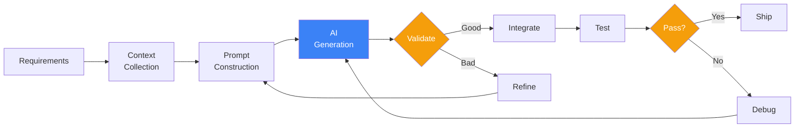
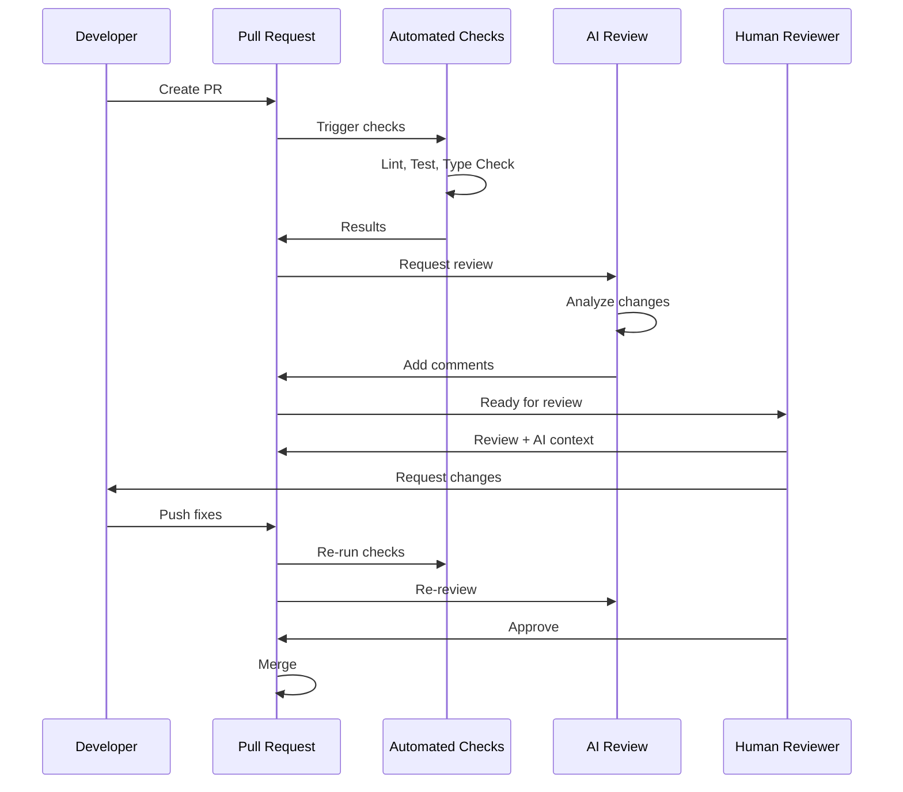
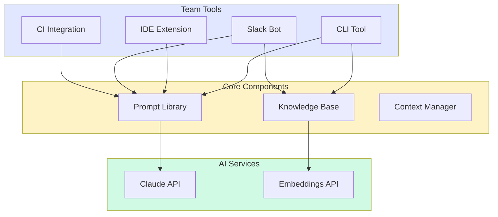

import Tip from "@components/mdx/Tip.astro";
import Warning from "@components/mdx/Warning.astro";
import Info from "@components/mdx/Info.astro";
import Definition from "@components/mdx/Definition.astro";
import Quiz from "@components/react/Quiz";
import HandsOnExercise from "@components/react/HandsOnExercise";

You have learned how AI works, how to prompt effectively, and how to build agents. Now comes the hard part: making AI actually useful in your day-to-day work.

The challenge is not technical. It is cultural and practical. AI tools promise productivity gains, but poorly integrated AI creates friction, introduces errors, and wastes time. The goal is not to use AI everywhere; it is to use AI where it helps and avoid it where it hurts.

Most developers fall into one of two traps. The Skeptic Trap assumes that because an initial experience with AI produced bad results, AI is useless. This ignores that AI tools require skill to use effectively. You would not conclude that version control is useless because your first merge conflict was frustrating.

The Enthusiast Trap assumes AI can do everything now, leading to attempts to prompt through every task. This ignores that AI outputs require verification, that some tasks are faster to do manually, and that over-reliance creates blind spots in your understanding.

The productive middle ground treats AI as a tool in your toolkit. Use it where it excels. Skip it where it does not. Build intuition through deliberate practice.

## AI in Your Daily Work

<Definition term="Workflow Integration">
  The process of incorporating AI tools into existing development processes in
  ways that enhance productivity without disrupting established practices or
  introducing excessive verification overhead.
</Definition>

AI integrates most naturally at specific points in the development workflow. Code generation, debugging, refactoring, code review, testing, documentation, bug investigation, and migration tasks all represent high-value integration points where AI assistance provides genuine leverage.

```mermaid
graph LR
    subgraph Planning["Planning Phase"]
        P1[Requirements]
        P2[Architecture]
        P3[Task Breakdown]
    end

    subgraph Development["Development Phase"]
        D1[Code Generation]
        D2[Debugging]
        D3[Refactoring]
    end

    subgraph Quality["Quality Phase"]
        Q1[Code Review]
        Q2[Testing]
        Q3[Documentation]
    end

    subgraph Maintenance["Maintenance"]
        M1[Bug Investigation]
        M2[Migration]
        M3[Knowledge Transfer]
    end

    Planning --> Development
    Development --> Quality
    Quality --> Maintenance

    style D1 fill:#22c55e,color:#fff
    style D2 fill:#22c55e,color:#fff
    style Q1 fill:#22c55e,color:#fff
    style Q2 fill:#22c55e,color:#fff
    style Q3 fill:#22c55e,color:#fff
    style M2 fill:#22c55e,color:#fff
```



The highlighted phases indicate where AI currently provides the highest value. This does not mean AI cannot help elsewhere; it means these are the highest-leverage starting points.

### Maximizing Value

To get real value from AI integration, start with high-frequency, low-stakes tasks. Writing boilerplate code, generating test cases, and explaining unfamiliar code are excellent starting points. If AI fails, the cost is minimal. If it succeeds, you save time daily.

Build verification habits into your workflow. Never accept AI output without review. This is not paranoia; it is professionalism. AI will confidently generate subtle bugs, security vulnerabilities, and incorrect logic. Your job is to catch them.

Track what works and what does not. Keep a mental or literal log of where AI helps and where it wastes time. Your experience will differ from generic advice because your codebase, language, and domain are unique.

Invest in prompting skill. The same task can take 30 seconds or 30 minutes depending on how you prompt. Time spent learning effective prompting pays compound returns.

Know when to stop. If you have prompted three times and still have not gotten useful output, do it manually. AI should accelerate work, not become a puzzle to solve.

<Info>
  For most developers, 80% of AI value comes from 20% of use cases: autocomplete
  and inline suggestions, explaining code, generating boilerplate, rubber duck
  debugging, and translation between formats. Master these before pursuing more
  exotic use cases.
</Info>

## Code Generation Workflows

Basic code generation involves pasting code into ChatGPT and getting code back. This breaks down for serious work because AI lacks context about your codebase conventions, generated code may not integrate with existing systems, there is no feedback loop for improvement, and it does not scale to complex features.

Effective code generation workflows address these limitations through deliberate structure and process.

### Scaffolding Workflows

Scaffolding generates structural code that you will fill in with implementation details. This is AI's sweet spot because structure is often boilerplate, patterns are well-established, details require your domain knowledge, and the cost of errors is low since you review before filling in.

Instead of asking AI to write a complete endpoint, scaffold it with explicit context about existing patterns:

```
I'm adding a new API endpoint to my Express.js application.

Existing patterns in my codebase:
- Routes are in /routes/{resource}.js
- Controllers are in /controllers/{resource}Controller.js
- Services are in /services/{resource}Service.js
- We use Joi for validation
- All responses use a standard envelope: { success: boolean, data: any, error?: string }

Generate the scaffolding for a new "comments" resource with:
- GET /comments (list with pagination)
- GET /comments/:id (single comment)
- POST /comments (create)
- PUT /comments/:id (update)
- DELETE /comments/:id (delete)

Include:
1. Route file with all endpoints
2. Controller with handler stubs
3. Service with method stubs
4. Validation schema
5. TODO comments where I need to add business logic

Do not implement the actual database queries or business logic - just structure.
```

This prompt produces useful scaffolding because it provides context about existing patterns, specifies exactly what to generate, explicitly requests stubs rather than implementations, and asks for TODO markers where human work is needed.

### Refactoring Assistance

AI excels at mechanical refactoring tasks where the transformation is well-defined. Renaming and restructuring, modernizing syntax, and extracting patterns all benefit from AI assistance.

For modernizing code:

```
Convert this JavaScript code to use modern ES6+ syntax:
- var -> const/let (prefer const)
- Functions -> arrow functions where appropriate
- Callbacks -> async/await
- String concatenation -> template literals
- Object.assign -> spread operator

[paste code]

Explain each change you make.
```

<Tip>
  Asking AI to explain each change serves two purposes: it helps you verify the
  changes are correct, and it teaches you the patterns so you can apply them
  yourself in the future.
</Tip>

### Migration Assistance

Migrating between technologies is tedious and error-prone. AI can accelerate this significantly by creating adapter layers that enable gradual migration without changing all call sites at once.



The code generation pipeline establishes consistent steps: task definition specifying exactly what you need, context gathering to provide AI with necessary information, prompt construction building on templates for common tasks, AI generation potentially producing multiple versions for complex tasks, quality check reviewing for patterns and correctness, integration into your codebase often revealing new issues, and testing to verify functionality.

<Warning>
  Code generation does not work well for complex business logic where AI does
  not know your domain, security-critical code where subtle vulnerabilities can
  emerge, performance-critical code where AI optimizes for appearance rather
  than speed, and highly contextual code depending on runtime state or external
  systems.
</Warning>

## Code Review Automation

Code review is time-consuming and cognitively demanding. AI can assist by catching common issues before human review, explaining unfamiliar code patterns, checking for consistent style, identifying potential security vulnerabilities, and suggesting improvements.

This is assistance, not replacement. Human reviewers catch subtle logic errors, evaluate architectural decisions, and ensure code serves business needs. AI catches the mechanical stuff so humans can focus on what matters.

### Building a Review Pipeline

A practical AI review pipeline runs automatically on pull requests with automated checks running first including linting, tests, type checking, and static security scanning. These are deterministic and must pass. AI review runs next, producing comments and suggestions that are advisory rather than blocking. Human review makes final decisions, considering both automated feedback and business context.



### Security Scanning with AI

AI can identify security issues that static analyzers miss because it understands context. A security review prompt should focus on injection vulnerabilities, authentication and authorization issues, data exposure risks, insecure defaults, missing input validation, and cryptography misuse. For each issue, capture severity, location, description, exploitation potential, and specific remediation.

AI security findings might identify critical SQL injection where user input is concatenated directly into queries, with specific exploitation examples and parameterized query fixes. High severity issues like missing authorization checks on endpoints get flagged with ownership verification solutions.

### Style Checking Beyond Linting

Linters catch syntax issues. AI can catch style issues that require understanding context. Team conventions about functions doing one thing, descriptive names, comments explaining why rather than what, explicit error handling, and named constants for magic numbers all benefit from AI review.

AI style findings identify issues like unclear function names where "process" is vague versus descriptive alternatives, magic numbers that should be named constants, and comments that describe what rather than why.

### Managing False Positives

AI review generates false positives. Handle them by tuning prompts with examples of good code that AI flagged incorrectly, setting confidence thresholds to show only high-confidence issues, learning from dismissals by tracking which comments developers ignore to identify prompt improvement opportunities, and making review optional for specific files or directories.

## Documentation Generation

Documentation is perpetually out of date because writing documentation is less satisfying than writing code, documentation is updated separately from code, there is no automated way to verify documentation accuracy, and documentation requirements are fuzzy.

AI can help by generating initial documentation, updating documentation when code changes, and verifying documentation against code.

### README Generation

For new projects or features, AI can generate comprehensive README files with overview, quick start, installation, configuration, usage examples, API reference, architecture, troubleshooting, and contributing sections based on source code analysis.

### API Documentation

Generate API documentation from code in OpenAPI 3.0 YAML format with summaries and descriptions, request parameters and body schemas, response schemas for all status codes, example requests and responses, and authentication requirements.

For existing documentation, verify accuracy by comparing claims against actual implementation to identify documented features that do not exist, implemented features not documented, parameter mismatches, response format differences, and status code discrepancies.

### Keeping Documentation Updated

The real challenge is keeping documentation current. Pre-commit hooks can check if changed files have corresponding documentation and generate update suggestions. CI documentation checks compare documentation against code and fail if they diverge too much. Scheduled regeneration weekly creates PRs for review. Documentation as code keeps documentation in the same files as code through docstrings and JSDoc so changes are natural.

<Tip>
  Documentation templates ensure consistency. Create templates for different
  documentation types (components, APIs, functions) that specify required
  sections and formats, then use AI to fill them in consistently.
</Tip>

## Testing with AI

AI can generate tests, but the value varies by test type. Unit tests for pure functions, edge case discovery, and test data generation provide high value. Integration tests and snapshot tests provide medium value. End-to-end tests and performance tests provide lower value because they depend too heavily on UI, system state, and profiling.

### Unit Test Generation

For pure functions, AI generates excellent tests when given clear instructions about coverage requirements:

````
Generate comprehensive unit tests for this function.

Function:
```python
def calculate_discount(price: float, customer_type: str, quantity: int) -> float:
    """Calculate discount based on customer type and quantity."""
    base_discount = 0

    if customer_type == "premium":
        base_discount = 0.15
    elif customer_type == "business":
        base_discount = 0.10
    elif customer_type == "regular":
        base_discount = 0.05

    quantity_discount = min(quantity // 10 * 0.02, 0.10)
    total_discount = min(base_discount + quantity_discount, 0.25)

    return round(price * (1 - total_discount), 2)
````

Generate tests covering:

1. Each customer type
2. Quantity discount tiers (0, 10, 50, 100+)
3. Edge cases (zero price, negative values if possible)
4. Maximum discount cap
5. Rounding behavior

Use pytest with clear test names describing the scenario.

````

### Edge Case Discovery

AI excels at thinking of edge cases. For a date range parsing function, AI might identify input format variations like extra whitespace or tab characters, invalid inputs like missing delimiters or empty strings, date format issues including wrong formats or invalid dates, and boundary conditions like same day, year boundaries, or extreme dates.

### Coverage Improvement

Use AI to improve test coverage by providing the test file, coverage report showing uncovered lines, and source file. AI generates additional tests targeting specific uncovered lines with explanations of why each scenario matters.

### Test Data Generation

AI generates realistic test data when given model definitions and requirements for diversity covering various configurations, edge cases, and realistic but fictional data.

## Building Team Tools

Generic AI tools work generically. Custom tools work for your team because they encode your codebase conventions, include project-specific context, integrate with your existing workflows, and solve your specific problems.

Building custom tools is not complex. It is about wrapping AI APIs with your context.

### Custom Assistants

Build assistants specialized for your codebase by loading conventions, architecture, and code examples into the system prompt:

```python
CONVENTIONS = open("docs/CONVENTIONS.md").read()
ARCHITECTURE = open("docs/ARCHITECTURE.md").read()
EXAMPLES = open("docs/CODE_EXAMPLES.md").read()

SYSTEM_PROMPT = f"""You are a coding assistant for our team's codebase.

Our conventions:
{CONVENTIONS}

Our architecture:
{ARCHITECTURE}

Code examples showing our patterns:
{EXAMPLES}

When helping with code:
1. Follow our established patterns
2. Use our naming conventions
3. Reference our existing utilities rather than reimplementing
4. Suggest tests following our test patterns
5. Consider our deployment constraints

Be concise. We're experienced developers who want help, not tutorials.
"""
````

### Shared Prompt Libraries

Create a library of prompts your team shares organized by category. Code review prompts for security and performance analysis, generation prompts for API endpoints and components, and documentation prompts for functions and modules all benefit from standardization.

```yaml
# prompts/library.yaml
code_review:
  security:
    name: "Security Review"
    description: "Review code for security vulnerabilities"
    template: |
      Review this code for security issues following OWASP Top 10.

      Focus areas:
      - Injection vulnerabilities
      - Authentication issues
      - Sensitive data exposure
      - Access control

      Code to review:
      {code}

generation:
  api_endpoint:
    name: "API Endpoint Generator"
    description: "Generate REST API endpoint following our patterns"
    template: |
      Generate a REST endpoint for {resource}.

      Our patterns:
      - Framework: FastAPI
      - Database: SQLAlchemy with async
      - Validation: Pydantic models
      - Auth: JWT via dependency injection
```



### Knowledge Bases

Build team knowledge bases that AI can reference by indexing documentation with embeddings, creating query interfaces, and testing with real questions from new team members.

### Tool Distribution

Make tools easy for your team to use through CLI tools, IDE integration through custom commands or extensions, and Slack or Teams bots for quick questions.

<Quiz
  client:visible
  quizId="module-19-knowledge-check"
  moduleSlug="real-world-workflow-integration"
  questions={[
    {
      id: "q1",
      type: "multiple-choice",
      question:
        "You are building an AI-assisted code review pipeline. Where in the review process should AI review run?",
      options: [
        {
          id: "a",
          text: "After human review, to catch anything the human missed",
        },
        {
          id: "b",
          text: "Before human review, so humans can focus on high-level concerns",
        },
        { id: "c", text: "Instead of human review for small changes" },
        { id: "d", text: "In parallel with human review to save time" },
      ],
      correctAnswer: "b",
      explanation:
        "AI review should run before human review. This lets AI catch mechanical issues (style, common bugs, security patterns) so human reviewers can focus on what AI cannot assess: business logic correctness, architectural fit, and maintainability decisions. Running AI after human review wastes the human's time on things AI could have caught.",
    },
    {
      id: "q2",
      type: "multiple-choice",
      question: "When is AI code generation LEAST appropriate?",
      options: [
        { id: "a", text: "Generating boilerplate for a new API endpoint" },
        {
          id: "b",
          text: "Implementing a core algorithm that determines pricing for customers",
        },
        { id: "c", text: "Creating test cases for a utility function" },
        { id: "d", text: "Converting code from one framework to another" },
      ],
      correctAnswer: "b",
      explanation:
        "AI code generation is least appropriate for critical business logic. Pricing algorithms directly affect revenue and customer trust. AI does not understand your business domain and may generate subtly incorrect logic. For such critical code, humans must design and implement the logic, using AI only for peripheral tasks like test generation.",
    },
    {
      id: "q3",
      type: "multiple-choice",
      question:
        "Your team creates a shared prompt library. What is the most important characteristic for prompts in this library?",
      options: [
        { id: "a", text: "They should be as long and detailed as possible" },
        {
          id: "b",
          text: "They should encode team-specific conventions and context",
        },
        { id: "c", text: "They should work with multiple AI providers" },
        {
          id: "d",
          text: "They should be written by the most senior developer",
        },
      ],
      correctAnswer: "b",
      explanation:
        "Shared prompts provide value by encoding team-specific knowledge that generic prompts lack: your coding conventions, architecture decisions, common patterns, and project constraints. This context makes AI output immediately useful rather than requiring manual adaptation.",
    },
    {
      id: "q4",
      type: "multiple-choice",
      question:
        "You notice your AI documentation generator frequently produces inaccurate descriptions of function behavior. What is the best approach to fix this?",
      options: [
        { id: "a", text: "Switch to a more capable AI model" },
        { id: "b", text: "Include example inputs and outputs in the prompt" },
        { id: "c", text: "Generate documentation less frequently" },
        {
          id: "d",
          text: "Add a disclaimer that documentation may be inaccurate",
        },
      ],
      correctAnswer: "b",
      explanation:
        "When AI generates inaccurate descriptions, the issue is usually insufficient context, not model capability. Including example inputs and outputs shows the AI what the function actually does rather than relying on it to infer behavior from code alone.",
    },
    {
      id: "q5",
      type: "multiple-choice",
      question:
        "What is the primary benefit of having AI catch mechanical issues in code review before human review?",
      options: [
        {
          id: "a",
          text: "It eliminates the need for human reviewers entirely",
        },
        {
          id: "b",
          text: "It allows human reviewers to focus on logic, architecture, and business requirements",
        },
        {
          id: "c",
          text: "It makes the code review process faster for everyone",
        },
        { id: "d", text: "It ensures perfect code quality" },
      ],
      correctAnswer: "b",
      explanation:
        "The primary benefit of AI catching mechanical issues is freeing human reviewers to focus on what AI cannot assess well: business logic correctness, architectural fit, maintainability decisions, and whether the code actually solves the right problem. This division of labor uses both AI and human capabilities optimally.",
    },
  ]}
  passingScore={70}
  allowRetry={true}
/>

<HandsOnExercise
  client:visible
  moduleSlug="real-world-workflow-integration"
  exerciseId="workflow-tool"
  title="Build a Development Workflow Tool"
  objective="Create an integrated AI-assisted development workflow tool for a specific recurring task in your actual work environment that you will continue to use."
  totalTime="90-120 minutes"
  setupInstructions={[
    "Choose a recurring task from your actual work (the one you do most often)",
    "Set up a new Python project with virtual environment",
    "Install required packages: anthropic or openai, click or argparse for CLI",
    "Gather any conventions/documentation files that provide context for your task",
  ]}
  parts={[
    {
      id: "identify-and-document",
      title: "Identify Task and Current Process",
      duration: "15 min",
      instructions: [
        "Choose one recurring task: code review, test generation, documentation, boilerplate creation, refactoring, etc.",
        "Document current process: What are the manual steps? How long does it take? What's tedious about it?",
        "Identify pain points: What takes the most time? What's error-prone? What's boring?",
        "Estimate frequency: How often do you do this task? (daily, weekly, monthly)",
        "Calculate potential time savings: If AI could handle 60-80% of it, how much time would you save?",
      ],
      observePrompt:
        "Is this task really the highest-value one to automate based on frequency and pain? Or are you choosing what seems coolest?",
    },
    {
      id: "design-integration",
      title: "Design AI Integration",
      duration: "20 min",
      instructions: [
        "Specify what context AI needs: codebase conventions, existing patterns, examples of good output",
        "Define input format: What will user provide? (file path, code snippet, requirements)",
        "Define output format: What should AI generate? (structured data, code, documentation)",
        "Design verification approach: How will user verify AI output is correct?",
        "Create fallback plan: Under what conditions should user abandon AI and do it manually? (3 failed attempts, output is nonsense, etc.)",
      ],
      observePrompt:
        "Have you made it easy for AI to succeed by providing clear context? Have you made it easy for users to verify output?",
    },
    {
      id: "implement-mvp",
      title: "Build Minimum Viable Tool",
      duration: "35 min",
      instructions: [
        "Implement context loading: Read conventions/examples from files (not hardcoded)",
        "Build prompt construction: Combine system context + user input into effective prompt",
        "Add API integration: Call LLM with proper error handling and retries",
        "Create CLI interface: Simple command like `python tool.py generate --file path/to/code`",
        "Add output formatting: Present results clearly, include TODO markers where human work needed",
      ],
      observePrompt:
        "Can you use your own tool successfully? Is it genuinely faster than doing the task manually?",
    },
    {
      id: "test-and-refine",
      title: "Test and Refine Prompts",
      duration: "25 min",
      instructions: [
        "Test with typical case: Does it work well on common scenarios?",
        "Test with edge case: Does it handle unusual inputs gracefully?",
        "Test where AI might struggle: Does it fail gracefully or produce nonsense?",
        "Track what works and what doesn't: Document which prompt changes improved quality",
        "Refine prompts based on results: Iterate 2-3 times to improve output quality",
      ],
      observePrompt:
        "What percentage of outputs are immediately usable? What pattern causes the most failures?",
    },
    {
      id: "document-and-share",
      title: "Document for Team Use",
      duration: "15 min",
      instructions: [
        "Write README: Purpose (what problem does this solve?), Installation (how to set up), Usage (examples of common commands), Limitations (what it can't do)",
        "Document the verification process: How should users check AI output?",
        "Document the fallback plan: When to abandon AI and do it manually",
        "Optional: Share with a teammate, observe them use it, iterate based on feedback",
        "Commit to actually using this tool in your work for the next week",
      ],
      observePrompt:
        "Would someone else on your team find this tool useful? What would make them actually use it versus just saying 'cool'?",
    },
  ]}
  successCriteria={[
    {
      id: "real-task",
      text: "Chose a task you actually do frequently in your real work",
    },
    {
      id: "clear-design",
      text: "Designed integration with clear context requirements, I/O formats, and verification approach",
    },
    {
      id: "working-tool",
      text: "Built functional CLI tool that loads context, calls AI API, and formats output",
    },
    {
      id: "tested-refined",
      text: "Tested on multiple examples including edge cases and refined prompts based on results",
    },
    {
      id: "proper-documentation",
      text: "Created documentation that would enable teammates to use the tool",
    },
    {
      id: "actually-useful",
      text: "Tool genuinely saves time compared to manual approach (60%+ of cases)",
    },
  ]}
/>

## Summary

AI integration is not about using AI everywhere. It is about using AI where it provides genuine leverage while maintaining the verification habits that catch AI errors.

AI works best at specific integration points. Code generation, testing, review, and documentation are high-value areas. Planning and architecture require more human judgment. Start with high-frequency, low-stakes tasks and build from there.

Code generation requires context and verification. Provide AI with your conventions and patterns through explicit context in prompts. Always verify generated code through review and testing. Use scaffolding approaches that generate structure while leaving implementation details for human work.

Review automation augments humans rather than replacing them. AI catches mechanical issues including style violations, common bugs, and security patterns. Human reviewers focus on logic, architecture, and business requirements. Run AI review before human review to maximize human attention on what matters.

Documentation generation keeps docs current by generating and updating documentation from code. AI can produce initial documentation, update it when code changes, and verify accuracy against implementation. Humans must still review for correctness.

Testing with AI focuses on coverage and edge cases. AI excels at generating test cases for pure functions, identifying edge cases you might miss, and creating realistic test data. Unit tests provide highest value while end-to-end tests provide less because they depend heavily on system state.

Custom team tools encode your specific knowledge. Generic AI is generic. Build tools that include your conventions, patterns, and constraints through shared prompt libraries, knowledge bases indexed with embeddings, and CLI tools or bots that make AI assistance readily available to your entire team.

## References

**Industry Resources**

GitHub Copilot Documentation at docs.github.com/copilot covers using Copilot effectively for code generation and completion.

Cursor Documentation at docs.cursor.com guides AI-assisted coding with the Cursor editor.

Anthropic Claude API Documentation at docs.anthropic.com provides reference for building custom AI tools with Claude.

**Research and Best Practices**

"Measuring GitHub Copilot's Impact on Developer Productivity" from GitHub (2022) provides research on productivity effects of AI coding assistants, important for setting realistic expectations.

"Large Language Models for Code: Security Hardening and Adversarial Testing" by Pearce et al. (2022) covers security implications of AI-generated code, essential for understanding risks.

OWASP AI Security and Privacy Guide at owasp.org covers security considerations when integrating AI into applications.

**Tools and Frameworks**

LangChain at langchain.com provides a framework for building applications with LLMs including chains and agents.

ChromaDB at trychroma.com offers a vector database for building knowledge bases and retrieval systems.

Semantic Kernel from Microsoft at learn.microsoft.com/semantic-kernel provides an SDK for integrating AI into applications.
