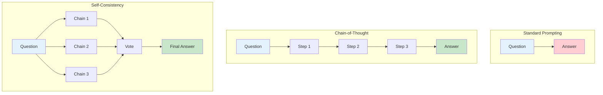
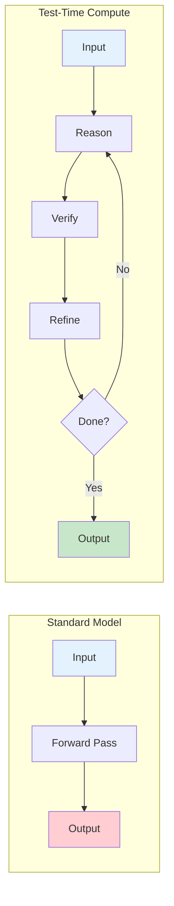
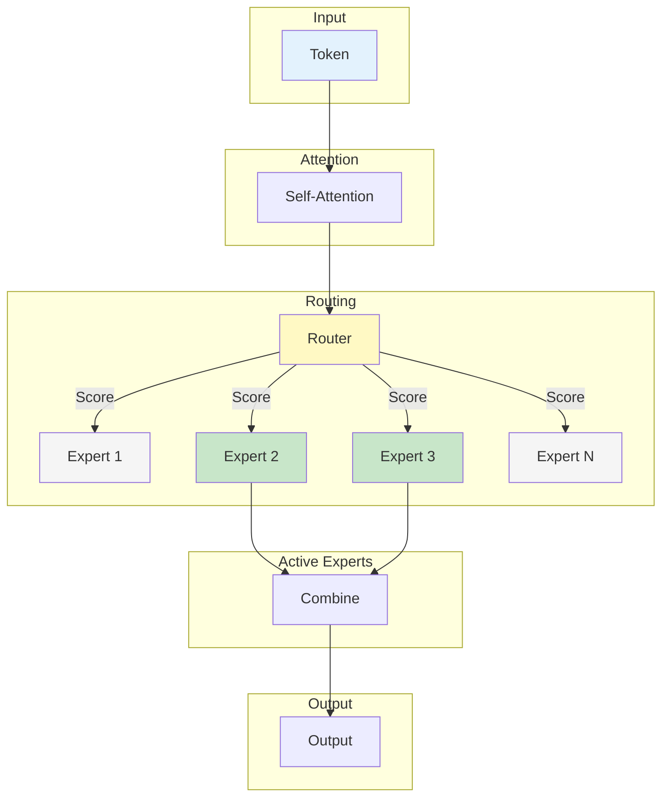
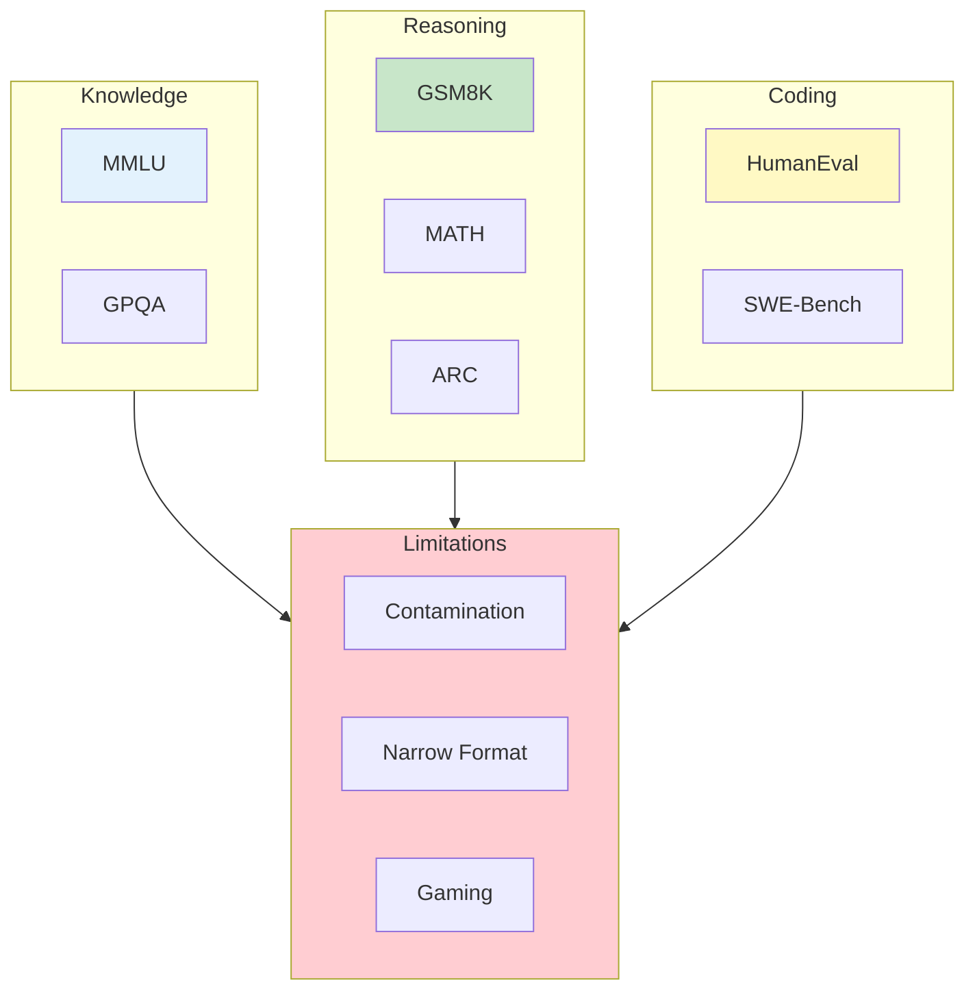
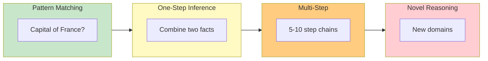

import Tip from "@components/mdx/Tip.astro";
import Warning from "@components/mdx/Warning.astro";
import Info from "@components/mdx/Info.astro";
import Definition from "@components/mdx/Definition.astro";
import Quiz from "@components/react/Quiz";
import HandsOnExercise from "@components/react/HandsOnExercise";

# Reasoning Models and Current Frontiers

Language models have made remarkable progress on many tasks, yet reasoning remains stubbornly difficult. A model that can write poetry, translate languages, and explain quantum physics may stumble on a logic puzzle a child could solve. This is not an accident. Reasoning requires something fundamentally different from pattern matching in training data.

This module explores the frontier of AI reasoning: techniques that coax better reasoning from existing models, architectures designed for complex problem-solving, and the benchmarks we use to measure progress. Understanding these frontiers matters for developers. It shapes expectations about what current models can and cannot do, informs decisions about which problems to tackle with AI, and provides context for the rapid advances that will continue to reshape our field.

## The Reasoning Challenge

Large language models learn to predict the next token based on patterns in training data. This works remarkably well for many tasks: if the training data contains examples of good code, the model learns to generate good code. If it contains accurate facts, the model often reproduces them correctly.

Reasoning is different. Consider this problem: If all bloops are razzies, and all razzies are lazzies, are all bloops lazzies? This requires applying logical rules to novel terms. The answer, which is yes, does not come from having seen this specific example before. It comes from understanding the structure of transitivity: if A implies B, and B implies C, then A implies C.

<Definition term="Reasoning">
  The process of drawing conclusions from premises through logical rules, rather
  than retrieving patterns from memory. True reasoning applies abstract
  principles to novel situations, including those that may contradict
  statistical patterns in training data.
</Definition>

The fundamental tension is this: language models learn statistical patterns, but reasoning requires applying rules to novel situations, including situations that may contradict those statistical patterns.

### Where Standard LLMs Fail

Research has identified consistent failure modes in LLM reasoning.

Multi-step arithmetic often fails because models lose track of intermediate results. A problem requiring sequential operations like 7 times 23 plus 15 times 8 minus 42 divided by 6 may produce an incorrect answer even when the model can perform each operation individually. The intermediate results compound, and errors cascade through the chain.

Logical consistency proves difficult to maintain across a problem. When asked whether 847 is prime, a model might note that it ends in 7 (odd), is not divisible by 2, 3, or 5, and conclude it is prime. This reasoning misses that 847 equals 7 times 121, which equals 7 times 11 times 11. The model did not systematically check all relevant factors.

<Warning>
  Models can produce confident, well-structured reasoning that leads to wrong
  answers. The appearance of step-by-step logic does not guarantee correct
  conclusions. Always verify reasoning on critical tasks.
</Warning>

Counterfactual reasoning poses particular challenges. When asked how keyboards would differ if humans had four arms instead of two, models may default to describing real keyboards, struggle to maintain the hypothetical premise, or produce superficial responses rather than thinking through the implications.

Planning and search problems that require exploring a solution space often fail. Finding a path through a graph, solving a puzzle that requires backtracking, or generating a plan with multiple dependencies can all break down even when individual steps would be easy.

### The Limits of Pure Scaling

Early evidence suggested that larger models reason better. GPT-4 solves problems GPT-3.5 cannot. But scaling alone has limitations.

Diminishing returns set in as models grow. Each doubling of parameters yields smaller improvements. Going from 7 billion to 70 billion parameters is more impactful than going from 70 billion to 700 billion.

Reasoning does not scale linearly with other capabilities. Some reasoning abilities show minimal improvement with scale, while others improve dramatically. Logical consistency improves less than factual recall.

<Info>
  The cost and data constraints of scaling have driven research toward methods
  that improve reasoning without proportional increases in training compute:
  better prompting, test-time compute, and architectural innovations.
</Info>

Cost prohibitions become severe at the frontier. Training models 10 times larger requires roughly 10 times more compute. We are approaching limits of what is economically feasible through pure scaling.

Data exhaustion compounds these challenges. We are running out of high-quality training data. Reasoning improvements from scale assume more data, but the internet is finite, and not all of it contains the kind of structured reasoning we want models to learn.

### The Reasoning Spectrum

Not all reasoning is equally difficult. A useful framework distinguishes several levels.

Pattern matching is easy. Questions like "What is the capital of France?" have answers that exist directly in training data.

One-step inference is moderate. Combining two facts to reach a conclusion, like inferring that the Eiffel Tower is in France because it is in Paris and Paris is the capital of France, requires a simple deductive step.

Multi-step inference is hard. Problems requiring chains of 5 to 10 steps with intermediate results that must be tracked challenge current systems.

Novel reasoning is very hard. Applying logical structures to completely unfamiliar domains, or discovering non-obvious solution strategies, remains largely out of reach.

Current frontier models handle pattern matching and one-step inference reliably. Multi-step inference is improving but inconsistent. Novel reasoning remains an open challenge.

## Chain-of-Thought and Beyond

In 2022, researchers discovered that explicitly prompting models to "think step by step" dramatically improved reasoning performance. This technique, called Chain-of-Thought prompting, was surprisingly simple yet remarkably effective.

### The Chain-of-Thought Revolution

Consider a standard prompting approach to a math problem. You present the question, and the model produces an answer. For "Roger has 5 tennis balls. He buys 2 more cans of tennis balls. Each can has 3 tennis balls. How many tennis balls does he have now?" the model might jump directly to an answer, often getting it wrong.

<Definition term="Chain-of-Thought (CoT)">
  A prompting technique that encourages models to generate intermediate
  reasoning steps before producing a final answer. By externalizing the
  reasoning process, models can reference previous steps and catch errors.
</Definition>

With Chain-of-Thought prompting, you add "Let's think step by step" or provide examples showing the reasoning process. The model then walks through: Roger starts with 5 tennis balls, he buys 2 cans with 3 balls each, that is 2 times 3 equals 6 new balls, total is 5 plus 6 equals 11 tennis balls.

By showing the reasoning process, or simply asking the model to explain its thinking, accuracy improves substantially. On the GSM8K math benchmark, CoT improved GPT-3's accuracy from 18 percent to 57 percent.

### Why Chain-of-Thought Works

Several mechanisms explain CoT's effectiveness.

Decomposition breaks complex problems into simpler sub-problems that the model can solve reliably. Each step is easier than tackling the whole problem at once.

Working memory externalization uses the model's context window as external working memory. Intermediate results written in text can be referenced, whereas internal computations are opaque and limited.

<Tip>
  The phrase "Let's think step by step" is remarkably effective as a zero-shot
  technique. Adding it to any question often triggers more structured reasoning,
  even without examples of the desired format.
</Tip>

Eliciting learned procedures activates capabilities the model may have acquired during training but does not apply by default. CoT prompts trigger these latent abilities.

Error detection becomes possible when reasoning is explicit. The model can sometimes catch its own mistakes. Implicit reasoning does not allow for this self-correction.

Attention focusing keeps relevant information in the model's attention at each step, preventing the context from being overwhelmed by irrelevant details.

### Self-Consistency

A single chain of thought can be wrong. Self-consistency improves reliability by sampling multiple reasoning paths and taking the majority answer.

The process works as follows. Generate N different reasoning chains for the same problem using temperature greater than 0 to get variety. Extract the final answer from each chain. Return the most common answer through majority vote.

<Info>
  Self-consistency works because correct reasoning paths tend to converge on the
  same answer, while incorrect paths produce varied wrong answers. With enough
  samples, the correct answer typically wins.
</Info>

Consider the famous bat-and-ball problem: "A bat and ball cost $1.10. The bat costs $1 more than the ball. How much does the ball cost?" The intuitive wrong answer is $0.10. The correct answer is $0.05.

One reasoning chain might produce the wrong intuitive answer. Another might set up the algebra correctly and arrive at $0.05. A third might also reason correctly. With majority voting across multiple chains, the correct answer emerges even if some chains fail.

The trade-offs include increased latency and cost from multiple inference calls, best performance when there is a clear correct answer, less effectiveness for open-ended generation, and diminishing returns beyond 10 to 20 samples.

### Tree of Thoughts

Tree of Thoughts extends CoT by explicitly exploring multiple reasoning paths and allowing backtracking when a path seems unpromising.

The key insight is that some problems require exploring alternatives, not just step-by-step reasoning. If you realize mid-solution that your approach will not work, you should try a different path.

<Definition term="Tree of Thoughts (ToT)">
  A reasoning framework that structures problem-solving as tree search. At each
  step, multiple possible continuations are generated, evaluated, and explored,
  with the ability to backtrack from unpromising paths.
</Definition>

How ToT works: Decompose the problem into steps. Generate multiple possible next steps at each point. Evaluate each candidate step using the model itself or heuristics. Search the tree of possibilities using breadth-first, depth-first, or best-first strategies. Backtrack when paths seem unpromising.

On the Game of 24, where you must use four numbers with arithmetic to make 24, GPT-4 with standard prompting solves 7.3 percent of problems. With Tree of Thoughts, it solves 74 percent.

### Limitations of Prompting-Based Approaches

These techniques improve reasoning but have limits.

Context window constraints mean that long chains of thought consume tokens. Very complex problems may exceed context limits.

Compounding errors accumulate as each step can introduce mistakes. Long chains may fail despite step-by-step reasoning.

<Warning>
  Prompt sensitivity affects performance significantly. "Think step by step"
  works differently than "Reason carefully" or "Show your work." Experiment with
  different phrasings for your specific tasks.
</Warning>

Prompt sensitivity means performance depends heavily on phrasing. Small changes in how you ask can produce large changes in quality.

Not all tasks benefit from decomposition. Creative writing, for instance, does not improve much from CoT.

Cost and latency increase with self-consistency and ToT because they require multiple inference calls.

These limitations motivated research into models that are trained to reason, rather than prompted to reason.

## Test-Time Compute

Traditional LLMs spend a fixed amount of compute per token generated, regardless of problem difficulty. A trivial question like "What color is the sky?" uses the same compute as a complex one like "Prove that there are infinitely many primes." This seems wrong.

### The Core Insight

Test-time compute refers to techniques that allow models to spend more computation on harder problems. Instead of a fixed forward pass, the model can "think" for varying amounts of time depending on the problem.

This mirrors human cognition: easy questions get fast, reflexive answers, while hard questions require deliberation.

<Definition term="Test-Time Compute">
  Techniques that allow AI models to allocate variable computational resources
  during inference based on problem difficulty. Harder problems receive more
  reasoning steps, verification passes, or search iterations.
</Definition>

### The Thinking Paradigm

One of the first prominent examples of this approach was OpenAI's o1 (released in late 2024). Rather than generating an answer immediately, o1-style models produce an extended internal reasoning trace before the final response.

The observable behavior is that the model may take extra time (seconds to minutes on hard problems) to "think" before responding. This reasoning is typically not shown to the user but strongly influences the quality of the final answer.

<Info>
  Test-time compute models trade latency for accuracy. They can spend more
  tokens on internal reasoning for hard problems, achieving substantially better
  results on math, coding, and logic benchmarks at the cost of higher latency
  and expense.
</Info>

Key characteristics of these models include being trained with reinforcement learning to produce reasoning traces, the ability to spend more tokens on internal reasoning for hard problems, substantially better performance on math, coding, and logic benchmarks, and higher latency and cost than standard models. Later generations have continued to improve speed and reliability.

### How Test-Time Compute Works

Several mechanisms enable test-time compute.

Extended generation lets the model produce a long internal monologue, solving intermediate sub-problems before producing the final answer. More tokens of reasoning equals more computation.

Iterative refinement has the model produce a draft answer, critique it, and refine. This can repeat multiple times.

Search and verification generates multiple candidate solutions and verifies each, selecting the best one or recognizing that none work and trying different approaches.

Adaptive depth in some architectures allows the model to dynamically decide how many layers or iterations to use, spending more compute on harder inputs.

### Scaling Laws for Test-Time Compute

Research suggests that test-time compute follows its own scaling laws, complementary to training-time scaling.

Training compute shows that larger models trained on more data are generally more capable, but with diminishing returns and enormous costs.

<Tip>
  It may be more efficient to train a medium-sized model that can allocate
  variable inference compute than to train an enormous model that uses fixed
  compute per token. This insight is reshaping how frontier labs think about
  model development.
</Tip>

Test-time compute shows that given a fixed model, spending more inference compute through more reasoning tokens, more samples, or more search improves results on hard problems. This scales more efficiently for some problem types.

The insight is that for the same total cost, a smaller model with test-time search may outperform a larger model with fixed compute on difficult reasoning tasks.

### Verification and Self-Critique

A key component of test-time compute is the ability to verify answers.

The generate-and-verify pattern works as follows: generate a candidate solution, check if the solution is correct using the model itself or external tools, if incorrect analyze the error and try again, repeat until a valid solution is found or resources are exhausted.

Self-critique prompts the model to check its own work. "Check if 42 is correct by substituting back into the original equation..." The model may then discover "42 gives left side 85, right side 87. This is incorrect. Let me try again..."

<Info>
  Verification is often easier than generation. A model that struggles to solve
  a math problem directly may reliably verify whether a proposed answer is
  correct. This enables sample-and-verify approaches.
</Info>

### Tool Use in Reasoning

Advanced reasoning often combines language models with external tools.

Code execution lets the model generate code to solve a problem, execute it, and use the result. For "What is the 47th Fibonacci number?", writing Python is more reliable than manual calculation.

Calculator and symbolic math tools offload precise computation to reliable systems.

Search engines retrieve information needed for reasoning.

Formal verifiers for proofs use theorem provers to verify steps.

Tool use extends the model's capabilities by combining linguistic reasoning with precise computation.

### Challenges and Open Questions

Test-time compute raises several challenges.

Latency concerns arise because users may not want to wait minutes for an answer, even if it is more accurate. Balancing speed and accuracy is an open problem.

Cost increases with more computation. Who pays for extended reasoning?

Diminishing returns make it unclear when additional reasoning will not help. Some problems are fundamentally hard, and more thinking will not solve them.

Reliable termination is challenging. How does the model know when to stop reasoning? It may spin indefinitely on impossible problems.

Hallucinated reasoning can extend hallucinations. More steps create more opportunities for errors.

Evaluation is difficult. Comparing a model that thinks for 10 seconds versus one that thinks for 10 minutes is not straightforward.

## Mixture of Experts

Scaling language models has been remarkably effective, but standard dense transformers have a problem: every parameter is used for every token. A 175 billion parameter model requires activating all 175 billion parameters for each input token.

### The Efficiency Problem

This creates challenges in memory, where all parameters must be in GPU memory; in compute, where all parameters participate in each forward pass; and in energy, where larger models consume proportionally more power.

<Definition term="Mixture of Experts (MoE)">
  An architecture where models have many expert networks but only activate a
  subset for each input. A router network decides which experts process each
  token, enabling larger total parameter counts with lower active compute per
  token.
</Definition>

The question is whether we can build models that are "large" in some sense but do not use all their capacity for every input.

### How MoE Works

In a standard transformer layer, input flows through self-attention then a feed-forward network to produce output.

In an MoE layer, input flows through self-attention to a router, which selects the top-k experts from many available, combines their outputs, and produces the final output.

The router, a small learned network, examines each token and decides which experts should process it. Only the selected experts, typically 1 or 2 out of 8 to 64, are activated.

<Info>
  Different experts can specialize in different types of content. A token like
  "mitochondria" might route to biology and chemistry experts, while "touchdown"
  routes to a sports expert. The router learns to match tokens to appropriate
  specialists.
</Info>

### Scaling Properties

MoE models have unique scaling properties.

Total parameters across all experts might reach 1 trillion.

Active parameters for any given token might be only 100 billion, comprising the shared layers plus 2 of 16 experts.

This means training can leverage all parameters for learning capacity, inference only requires compute proportional to active parameters, but memory requirements are still for all parameters, which is a limitation.

A dense model with 175 billion parameters activates all 175 billion per token. An MoE model with 1 trillion parameters might only activate 100 billion per token. The MoE model has more knowledge capacity but similar inference compute to a smaller dense model.

### Real-World MoE Models

Several influential models use MoE.

Switch Transformer from Google in 2021 was one of the first successful large MoE LLMs, simplified routing to send each token to exactly one expert, and showed MoE can train efficiently at scale.

<Tip>
  Mixtral 8x7B demonstrates the efficiency advantage of MoE: with 8 experts and
  2 active per token, its roughly 47 billion total parameters achieve
  performance matching or exceeding Llama 2 70B at lower inference cost.
</Tip>

Mixtral 8x7B (Mistral, 2023–2024) was an influential early demonstration of the MoE pattern at accessible scale: 8 experts, 2 active per token.

GPT-4, while OpenAI has not confirmed architecture details, is widely speculated to use MoE based on industry analysis of its capability level relative to reported parameter counts.

### Routing Challenges

The router in MoE models faces several challenges.

Load balancing is essential because if all tokens go to the same expert, you lose the efficiency benefits. Training includes auxiliary losses to encourage balanced routing.

Expert specialization ideally means experts specialize meaningfully, with one for code, one for medicine, and so on. In practice, specialization is often subtle and emergent.

Routing instability early in training can produce unstable or random routing decisions. Careful initialization and training procedures are needed.

Token dropping occurs in some architectures that drop tokens when experts are overloaded, which can hurt quality. Modern approaches use load balancing to avoid this.

### MoE Advantages and Limitations

Advantages include compute efficiency with larger effective model size for similar FLOPS, specialization where experts can develop distinct capabilities, scalability to more total parameters than dense models, and training efficiency with more parameters trained on the same compute.

<Warning>
  MoE models require all expert weights in memory even though only some are
  active. This can make deployment more challenging than dense models with the
  same active parameter count.
</Warning>

Limitations include memory requirements for all expert weights, routing overhead adding computational and architectural complexity, communication costs in distributed training from cross-device routing, difficulty analyzing which experts do what, and load balancing requiring careful design.

### The Future of Sparse Models

MoE represents a broader trend toward sparse computation.

The key insight is that not every part of a model is relevant to every input. Selectively activating relevant components can improve efficiency without sacrificing capability.

Extensions include learned sparsity not just in experts but in attention patterns and other components, conditional computation deciding dynamically how much compute to use, and modular networks routing to entirely different sub-networks for different tasks.

This connects to test-time compute: MoE is about routing tokens to the right parameters, while test-time compute is about spending the right amount of compute on each problem.

## Benchmarks and Evaluation

Benchmarks drive research direction. What we measure shapes what we optimize. Understanding current benchmarks, their strengths, and their limitations is essential for interpreting AI progress claims.

### Why Benchmarks Matter

A cautionary note: benchmarks measure specific capabilities under specific conditions. High benchmark scores do not guarantee real-world reliability. Low scores on one benchmark do not mean a model is useless.

<Info>
  Benchmarks are proxies for capability, not measures of it. A model that scores
  90 percent on a math benchmark may still fail on the math problems you
  actually care about. Always evaluate on your specific use cases.
</Info>

### Major Reasoning and Knowledge Benchmarks (as of 2024–early 2025)

MMLU (Massive Multitask Language Understanding) covers 57 tasks spanning STEM, humanities, and social sciences with multiple-choice questions from elementary to professional level. It tests broad knowledge and basic reasoning. At the time, frontier models were reaching the mid-to-high 80s to low 90s percent accuracy on the original version (many older benchmarks have since saturated or been replaced by harder variants).

GSM8K (Grade School Math) contains 8,500 grade-school math word problems requiring multi-step reasoning. It tests arithmetic and word problem comprehension. Strong models with CoT were achieving high 80s to mid-90s percent.

HumanEval has 164 programming problems testing code generation from docstrings, measured by pass@k. Capable models were reaching the 70–90% range depending on the exact setup.

ARC (AI2 Reasoning Challenge) and MATH remain useful signals, though real progress is better measured on newer, harder evaluations designed to resist contamination and saturation.

GPQA (Graduate-Level Google-Proof Q&A) is particularly valuable because it was written by domain experts and is hard for both models and people without deep expertise.

> **Important**: Benchmarks are moving targets. Once a benchmark becomes popular, models are often optimized specifically for it. Always evaluate on _your_ actual tasks rather than relying solely on published numbers.

### Limitations of Current Benchmarks

Benchmarks have significant limitations.

Contamination means models may have seen benchmark questions during training. Newer benchmarks try to prevent this, but it is a constant concern.

Narrow scope limits what multiple-choice and short-answer formats capture. Helping a user debug code is harder than passing HumanEval.

<Warning>
  Once a benchmark becomes popular, models may be optimized specifically for it,
  inflating scores without improving general capability. This "teaching to the
  test" effect limits what benchmarks tell us about real progress.
</Warning>

Gaming occurs when models are optimized specifically for popular benchmarks, inflating scores without improving general capability.

Static nature means benchmarks are fixed while real-world tasks evolve. A benchmark from 2020 may not capture 2025 challenges.

Missing skills may not be measured, including long-horizon planning, learning from feedback within a conversation, knowing when to ask for clarification, and maintaining consistency across long conversations.

Ceiling effects occur as models approach human-level or above on benchmarks, making the benchmarks less informative.

### Reasoning-Specific Benchmarks

For reasoning specifically, several benchmarks target these capabilities.

BIG-Bench (Beyond the Imitation Game) has over 200 diverse tasks from more than 450 authors, includes novel reasoning tasks spanning math, logic, language, and common sense, and is designed to resist contamination.

LogiQA and LogiQA 2.0 contain logical reasoning from civil service exams, testing formal logic understanding and multi-step deductive reasoning.

CLUTRR tests kinship reasoning from natural language, like inferring who is whose uncle, testing systematic relational reasoning.

PrOntoQA uses synthetic reasoning with made-up terms like "All bloops are razzies," testing pure logical inference without world knowledge.

### Evaluation Beyond Benchmarks

Real capability assessment often requires more than benchmark scores.

Human evaluation has humans rate model outputs on specific criteria. It is more expensive but captures nuance. Challenges include consistency, scale, and defining criteria.

<Tip>
  For production systems, A/B testing on real user tasks is the gold standard
  for evaluation. It measures actual utility rather than proxy metrics, though
  it requires enough usage volume to be statistically meaningful.
</Tip>

A/B testing compares models on real user tasks, measures actual utility not proxy metrics, and is the gold standard for production systems.

Red teaming uses adversarial testing for failures and vulnerabilities, finds weaknesses benchmarks miss, and is essential for safety evaluation.

Longitudinal evaluation tracks performance over extended interactions, is important for consistency and reliability, and is not captured by standard benchmarks.

### Interpreting Benchmark Claims

When reading about model performance, check the benchmark to see if it is well-known and validated, how old it is given contamination risk increases with age, and whether it measures what you care about.

Check the methodology for few-shot or fine-tuned approaches, standard or optimized prompts, and how many attempts were allowed (pass@1 versus pass@10).

Compare fairly using the same benchmark version, same evaluation protocol, and reported confidence intervals.

Consider real-world relevance by asking whether benchmark performance predicts actual utility, what capabilities are not measured, and how performance degrades on harder or longer tasks.

## Research Frontiers

AI research moves rapidly. Techniques that were frontier six months ago may be mainstream today.

### Promising Research Directions

Scaling test-time compute is early in our understanding. Research questions include what is the optimal balance between model size and reasoning depth, how do we train models to use test-time compute effectively, and can we predict problem difficulty to allocate compute adaptively.

<Info>
  The research frontier moves quickly. Techniques that seem exotic today may be
  standard practice next year. Understanding the current landscape prepares you
  to adopt new approaches as they mature.
</Info>

Improved chain-of-thought research continues since CoT works but we do not fully understand why. Ongoing research addresses what makes some reasoning traces better than others, whether we can train models to produce better CoT natively, and how to combine CoT with external verification.

Formal reasoning integration combines neural networks with formal methods, using LLMs to generate proofs verified with theorem provers, developing neuro-symbolic architectures that combine learning and logic, and enabling guaranteed-correct reasoning for high-stakes domains.

Multimodal reasoning integrates multiple modalities including visual reasoning with diagrams, charts, and geometric problems, audio understanding combined with linguistic reasoning, and embodied reasoning about physical situations.

Long-context reasoning faces new challenges as context windows grow beyond 100K tokens, including maintaining coherence over long reasoning chains, integrating information from distant context, and avoiding lost-in-the-middle problems.

Agentic systems involve models that take actions, observe results, and iterate, including tool use for reliable computation, multi-step task completion, and error recovery and planning.

### Open Questions

Fundamental questions remain unanswered.

What is reasoning? We use the term but lack a precise definition. Is statistical pattern matching over training data "reasoning"? At what point does it become something more?

Can LLMs reason, or just simulate reasoning? Debate continues over whether current models perform genuine reasoning or sophisticated pattern matching. Practically, the distinction may not matter if they solve real problems. Theoretically, it matters for understanding limits.

What are the fundamental limits? Are there reasoning tasks that transformer architectures fundamentally cannot do? Or can any reasoning ability emerge given sufficient scale and training?

How much is in the training data? Do models generalize reasoning procedures, or do they memorize and retrieve? If a model solves a novel math problem, did it learn mathematical reasoning or retrieve a similar problem from training?

How should we evaluate progress? Current benchmarks have known limitations. What should the benchmarks of 2030 look like?

### What to Watch For

Signals of important advances include consistent multi-step reasoning where models reliably solve 10-plus step problems rather than sometimes getting them right, transfer to novel domains where reasoning learned in one domain applies to completely new ones, self-correction where models catch and fix their own mistakes reliably, formal verification integration where LLMs can generate and verify proofs in automated theorem provers, efficient scaling getting more capability without proportionally more compute, and reliability reducing variance in model performance on similar problems.

Watch for these not as binary achieved or not achieved but as gradual improvements that accumulate toward more capable systems.

## Diagrams

### Chain-of-Thought Reasoning Flow

### Test-Time Compute Model

### Mixture of Experts Architecture

### Benchmark Landscape

### Reasoning Difficulty Spectrum

## Hands-On Exercise

<HandsOnExercise
  client:visible
  moduleSlug="reasoning-models-frontiers"
  exerciseId="benchmark-exploration"
  title="Benchmark Exploration"
  objective="Understand how reasoning techniques improve performance and identify the limitations of current benchmark evaluation methods"
  totalTime="45-60 minutes"
  setupInstructions={[
    "Get access to a frontier LLM (Claude, GPT-4, or similar)",
    "Open a document or notebook for recording observations",
    "Prepare to test multiple problems with different prompting approaches",
  ]}
  parts={[
    {
      id: "cot-testing",
      title: "Test Chain-of-Thought",
      duration: "20 min",
      instructions: [
        "Easy problem: 'A train travels at 60 mph for 2 hours. How far does it travel?' - Test with direct prompting (just ask)",
        "Test the same easy problem with zero-shot CoT by adding 'Let's think step by step'",
        "Test with structured CoT asking for explicit numbered reasoning steps",
        "Medium problem: 'A store offers a 20% discount, then applies a 10% loyalty discount on the reduced price. What is the total percentage off?' - Repeat all three prompting approaches",
        "Hard problem: 'In a family, each daughter has the same number of brothers as sisters. Each son has twice as many sisters as brothers. How many sons and daughters?' - Repeat all three approaches",
        "Document which approach works best for each difficulty level",
        "Note where errors occur and whether CoT helps catch them",
      ],
      observePrompt:
        "When does CoT help most? Does the benefit increase with problem difficulty? Are there cases where CoT makes things worse?",
    },
    {
      id: "self-consistency",
      title: "Test Self-Consistency",
      duration: "15 min",
      instructions: [
        "Use the bat-and-ball problem: 'A bat and ball cost $1.10 total. The bat costs $1.00 more than the ball. How much does the ball cost?'",
        "Note that the intuitive wrong answer is $0.10 and the correct answer is $0.05",
        "Ask this question 5 times with fresh context each time (start new conversation or clear context)",
        "For each trial, record the answer given, whether reasoning was shown, and whether the reasoning was correct",
        "Calculate whether majority voting across the 5 trials gives the correct answer",
        "Observe whether the model falls into the intuitive trap or reasons correctly",
      ],
      observePrompt:
        "Does the model consistently get this right or wrong? How does self-consistency voting help with problems that have intuitive wrong answers?",
    },
    {
      id: "benchmark-questions",
      title: "Try Benchmark Questions",
      duration: "15 min",
      instructions: [
        "Find or create an MMLU-style question (knowledge + reasoning) about enzyme kinetics, constitutional law, or similar domain",
        "Try an ARC-style question (science reasoning): 'Why does a candle go out in a sealed jar?'",
        "Create a GSM8K-style multi-step word problem about buying and selling items",
        "For each question, use CoT prompting ('Let's think step by step')",
        "Evaluate whether the answer was correct",
        "Assess whether the reasoning was sound even if the answer was wrong",
        "Note where errors occurred in the reasoning chain",
      ],
      observePrompt:
        "Which benchmark types does the model handle best? What kinds of reasoning errors are most common?",
    },
    {
      id: "identify-limitations",
      title: "Identify Limitations",
      duration: "15 min",
      instructions: [
        "List what skills these benchmarks test (factual knowledge, arithmetic, logical deduction, etc.)",
        "List what skills they do NOT test (long-horizon planning, learning from feedback, handling ambiguity, etc.)",
        "Describe how high benchmark scores might be misleading about real-world capability",
        "Design a novel benchmark question that tests something current benchmarks miss",
        "Explain what capability your question tests",
        "Explain why existing benchmarks don't capture this capability",
      ],
      observePrompt:
        "If you were building an AI product, would benchmark scores tell you everything you need to know about model capabilities? What else would you test?",
    },
  ]}
  successCriteria={[
    {
      id: "cot-testing",
      text: "Tested CoT on problems of varying difficulty and documented when it helps",
    },
    {
      id: "self-consistency",
      text: "Explored self-consistency across multiple trials",
    },
    {
      id: "benchmarks",
      text: "Attempted questions from at least 2 different benchmark types",
    },
    {
      id: "limitations",
      text: "Identified specific limitations of benchmark evaluation",
    },
    {
      id: "novel-approach",
      text: "Proposed at least one novel evaluation approach or question",
    },
  ]}
/>

## Knowledge Check

<Quiz
  client:load
  questions={[
    {
      question:
        "What is the primary mechanism by which Chain-of-Thought prompting improves reasoning performance?",
      options: [
        "It increases the model's parameter count during inference",
        "It externalizes intermediate reasoning steps, allowing the model to reference and build on them",
        "It accesses a separate reasoning module in the model architecture",
        "It fine-tunes the model on the specific problem during inference",
      ],
      correctAnswer: 1,
      explanation:
        "Chain-of-Thought works by externalizing intermediate reasoning steps into the context. This allows the model to 'see' its previous reasoning and build on it, effectively using the context window as working memory. It doesn't change parameters or access separate modules.",
    },
    {
      question:
        "What distinguishes test-time compute models like o1 from standard LLMs?",
      options: [
        "They use larger parameter counts for every query",
        "They spend variable amounts of compute based on problem difficulty, thinking longer on harder problems",
        "They require less compute than standard models",
        "They only work on mathematical problems",
      ],
      correctAnswer: 1,
      explanation:
        "The key innovation of test-time compute models is variable inference compute. They can spend more reasoning tokens on difficult problems, effectively 'thinking longer' before responding. This contrasts with standard LLMs that use fixed compute per token regardless of difficulty.",
    },
    {
      question:
        "In a Mixture of Experts architecture, what is the role of the router?",
      options: [
        "To compress the model for faster inference",
        "To decide which subset of expert networks should process each token",
        "To translate between different languages",
        "To store the model's long-term memory",
      ],
      correctAnswer: 1,
      explanation:
        "The router in MoE architectures examines each token and determines which experts (typically top-1 or top-2 out of many) should process it. This selective activation enables large total parameter counts with lower active compute per token.",
    },
    {
      question:
        "Which of the following is NOT a significant limitation of current AI benchmarks?",
      options: [
        "Potential contamination from benchmark data appearing in training sets",
        "Narrow task formats that don't capture real-world complexity",
        "Benchmarks being too difficult for any model to make progress",
        "Risk of models being optimized specifically for benchmarks rather than general capability",
      ],
      correctAnswer: 2,
      explanation:
        "Current frontier models perform very well on most benchmarks, often approaching or exceeding human performance. The real limitations are contamination, narrow formats, and benchmark-specific optimization. The challenge is often that benchmarks are too easy or narrow, not too hard.",
    },
    {
      question:
        "What advantage does self-consistency provide over a single Chain-of-Thought response?",
      options: [
        "It reduces the number of tokens generated",
        "Correct reasoning paths tend to converge while incorrect paths vary, so majority voting improves accuracy",
        "It allows the model to access more training data",
        "It bypasses the model's safety filters",
      ],
      correctAnswer: 1,
      explanation:
        "Self-consistency samples multiple reasoning chains and uses majority voting. Correct reasoning tends to converge on the same answer, while different errors produce varied wrong answers. With enough samples, the correct answer typically wins the vote.",
    },
  ]}
/>

## Summary

This module explored the frontier of AI reasoning.

The reasoning challenge remains difficult for language models. While they excel at pattern matching, systematic reasoning requiring multi-step inference, logical consistency, and novel problem-solving continues to challenge even frontier systems. Pure scaling helps but has diminishing returns and limits.

Chain-of-Thought and its extensions dramatically improve reasoning performance. By prompting models to externalize their thinking step by step, accuracy improves substantially. Self-consistency adds robustness through multiple sampling and voting. Tree of Thoughts enables explicit search over reasoning paths. These techniques work by using the context window as external working memory and enabling error detection.

Test-time compute represents a new paradigm where models spend variable computation based on problem difficulty. Rather than fixed compute per token, models can "think longer" on hard problems through extended generation, iterative refinement, and search. This complements training-time scaling with a new axis of improvement, trading latency for accuracy.

Mixture of Experts architectures achieve efficiency by activating only relevant experts for each token. With total parameters potentially reaching trillions but only a fraction active per token, MoE enables larger effective capacity with manageable inference costs. Routing and load balancing present engineering challenges, but MoE is becoming standard in frontier models.

Benchmarks drive research direction but have significant limitations. Contamination, narrow formats, gaming, and missing capabilities all limit what benchmark scores tell us. Real capability assessment requires multiple evaluation approaches including human judgment, A/B testing, and red teaming.

Research frontiers include scaling test-time compute, improved CoT training, formal reasoning integration, multimodal reasoning, and agentic systems. Fundamental questions remain about the nature of reasoning in neural networks and whether genuine understanding emerges from scale.

For developers, the practical implications are clear: use CoT prompting for complex reasoning tasks, consider self-consistency for high-stakes decisions, do not over-trust benchmark scores, evaluate on your specific use cases, and expect continued rapid progress alongside continued limitations.

## What's Next

In the next module, we will explore safe and responsible AI use. We will examine how to deploy AI systems responsibly, understand the risks and mitigations for AI applications, and develop practices for beneficial AI development. As AI capabilities grow, responsible use becomes increasingly important.

## References

### Foundational Papers

- Wei, J., et al. (2022). "Chain-of-Thought Prompting Elicits Reasoning in Large Language Models." NeurIPS 2022. The paper that introduced CoT prompting.

- Wang, X., et al. (2022). "Self-Consistency Improves Chain of Thought Reasoning in Language Models." ICLR 2023. Introduces sampling multiple reasoning paths and majority voting.

- Yao, S., et al. (2023). "Tree of Thoughts: Deliberate Problem Solving with Large Language Models." NeurIPS 2023. Extends CoT to explicit tree search.

- Kaplan, J., et al. (2020). "Scaling Laws for Neural Language Models." Establishes power-law relationships between model size, data, compute, and performance.

### Mixture of Experts

- Fedus, W., et al. (2022). "Switch Transformers: Scaling to Trillion Parameter Models with Simple and Efficient Sparsity." JMLR 2022.

- Mistral AI. (2024). "Mixtral of Experts." Technical report on efficient MoE architecture.

### Test-Time Compute

- Lightman, H., et al. (2023). "Let's Verify Step by Step." Process-based supervision for mathematical reasoning.

- Snell, C., et al. (2024). "Scaling LLM Test-Time Compute Optimally." Framework for optimal test-time compute allocation.

### Benchmarks

- Hendrycks, D., et al. (2020). "Measuring Massive Multitask Language Understanding." Introduces MMLU.

- Cobbe, K., et al. (2021). "Training Verifiers to Solve Math Word Problems." Introduces GSM8K.

- Chen, M., et al. (2021). "Evaluating Large Language Models Trained on Code." Introduces HumanEval.

- Srivastava, A., et al. (2022). "Beyond the Imitation Game: Quantifying and Extrapolating the Capabilities of Language Models." The BIG-Bench collaborative benchmark.
