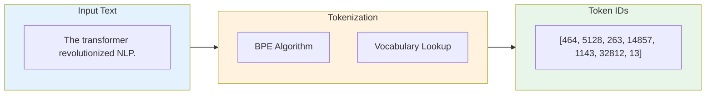
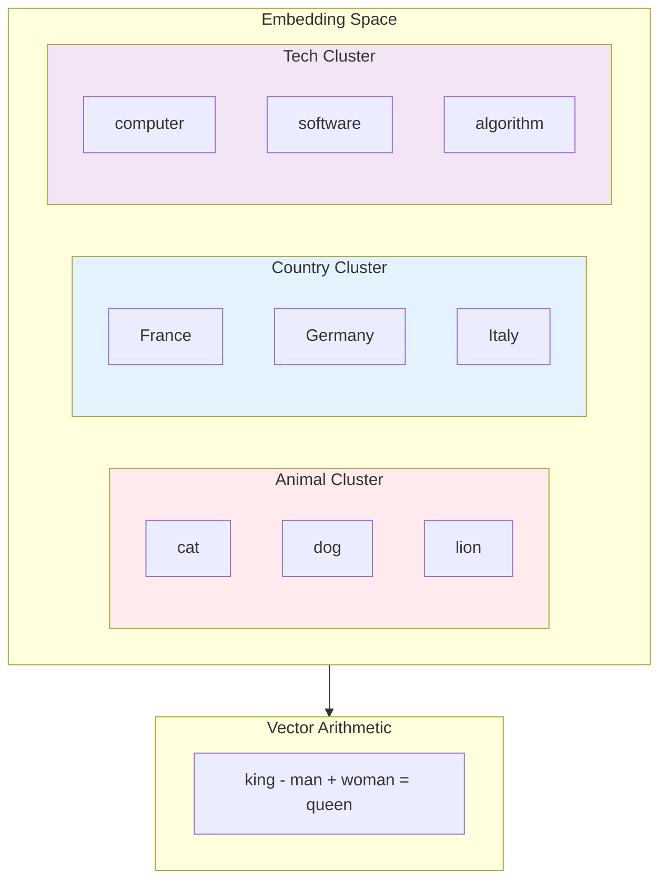
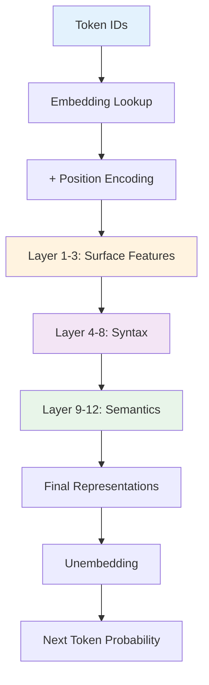
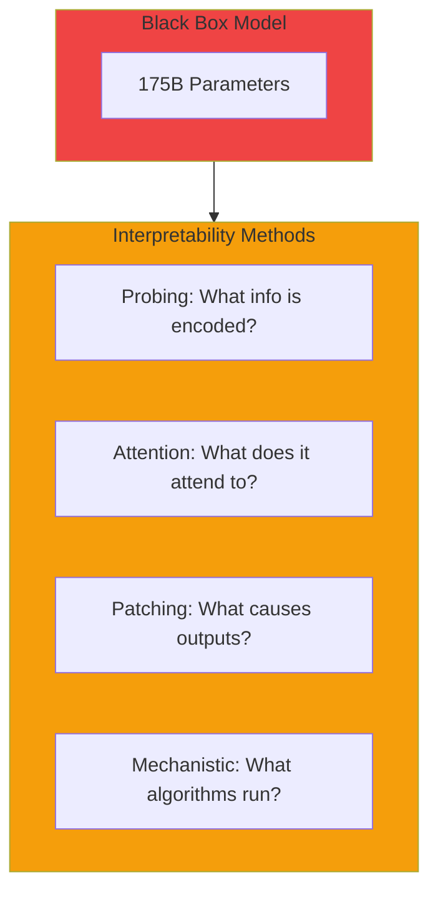
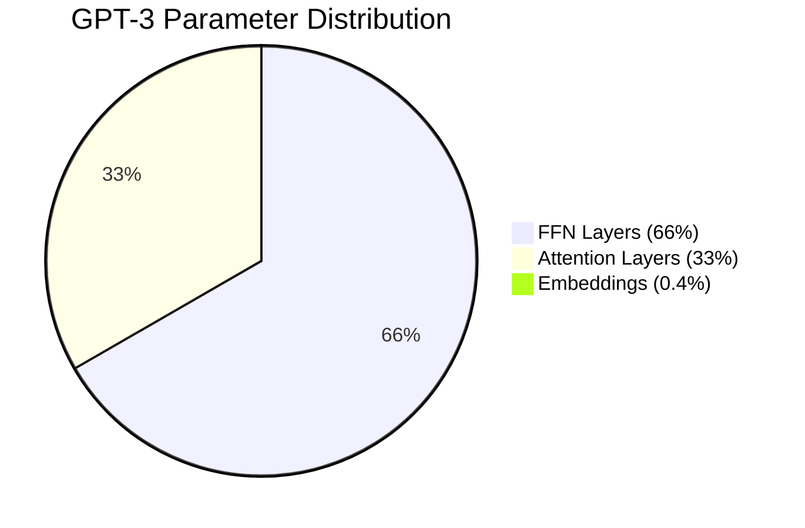

import Tip from "@components/mdx/Tip.astro";
import Warning from "@components/mdx/Warning.astro";
import Info from "@components/mdx/Info.astro";
import Definition from "@components/mdx/Definition.astro";
import Quiz from "@components/react/Quiz";
import HandsOnExercise from "@components/react/HandsOnExercise";

## Section 1: From Text to Numbers

### The Fundamental Problem

Computers operate on numbers. Language models are neural networks that perform matrix operations, compute gradients, and adjust floating-point weights. Yet we interact with them using words. Something must bridge this gap.

This is the representation problem: how do we convert human language into a form that mathematical operations can manipulate?

The answer involves two steps. Tokenization breaks text into discrete pieces called tokens. Embedding maps those pieces to dense numerical vectors.

Every word you type into ChatGPT or Claude goes through this transformation before the model can process it. Understanding this process reveals why models behave the way they do.

### Historical Approaches

The history of text representation reflects the evolution of AI itself.

One-hot encoding is the simplest approach. Each word gets a unique position in a vocabulary-sized vector. "Cat" might be [1,0,0,...], "dog" [0,1,0,...], and so on. The problems are that vectors are enormous for vocabulary sizes of 100,000 or more, there are no semantic relationships so "cat" is equally different from "dog" as from "spaceship", and there is no way to handle unknown words.

Word-level tokenization splits text on whitespace and punctuation where each word is a token. The problems are that vocabulary explodes with morphology where "run", "runs", "running", and "runner" are separate tokens, out-of-vocabulary words cannot be represented, and rare words have poor representations due to limited training examples.

Character-level tokenization makes each character a token so vocabulary is tiny at just 26 letters plus punctuation plus numbers. The problems are that sequences become very long where a 500-word document becomes about 2,500 characters, long-range dependencies are harder to learn, and computational cost scales with sequence length.

Each approach trades vocabulary size against sequence length. Modern tokenization finds a middle ground.

<Info title="Why Tokenization Matters for Developers">
Understanding tokenization is not just academic. Token limits mean GPT-4's context window is measured in tokens, not words. A 128K token limit might be 90K-100K words depending on content. API costs from OpenAI, Anthropic, and other providers are charged per token. Code with short tokens like braces and equals signs uses more tokens per line than prose. Model behavior is affected because tokenization affects what the model "sees".
</Info>

---

## Section 2: Modern Tokenization

### Subword Tokenization

Modern language models use subword tokenization, which splits text into pieces smaller than words but larger than characters. This achieves a balance where common words stay intact like "the", "and", and "hello", rare words split into recognizable pieces where "tokenization" becomes ["token", "ization"], and novel words can still be represented through composition.

The key insight is that you can represent any text with a fixed, manageable vocabulary by allowing words to be decomposed into subparts.

<Definition term="Byte Pair Encoding (BPE)">
The most widely used subword tokenization algorithm, used by GPT models. BPE starts with a character-level vocabulary, counts all adjacent pair frequencies in the training corpus, merges the most frequent pair into a new token, and repeats until vocabulary reaches target size. This learns which character sequences commonly appear together, creating tokens that balance vocabulary size against sequence length.
</Definition>

### The BPE Algorithm

The algorithm starts with a character-level vocabulary. Then it counts all adjacent pair frequencies in the training corpus, merges the most frequent pair into a new token, and repeats until vocabulary reaches target size.

For example, training on "low lower lowest" would start with characters, then merge the most frequent pair (l, o) to "lo", then merge (lo, w) to "low", then merge (e, r) to "er", and continue until reaching the target vocabulary size.

After training, the tokenizer has a vocabulary of subword units and rules for applying them. For new text, BPE greedily applies learned merges.

### WordPiece and SentencePiece

WordPiece, used by BERT, is similar to BPE but uses a different merge criterion. Instead of raw frequency, it maximizes the likelihood of the training data. WordPiece also uses a special prefix for continuation tokens, so "tokenization" becomes ["token", "##ization"] where ## indicates this token continues the previous word.

SentencePiece treats the input as a raw byte stream, handling whitespace as a regular character represented as an underscore. It does not require pre-tokenization. Key advantages include being language-agnostic without assuming whitespace-separated words, being reversible so you can perfectly reconstruct original text, and working well for Chinese, Japanese, and other languages without spaces.

### Tokenization Quirks and Gotchas

Understanding tokenization explains many model behaviors.

Arithmetic struggles occur because "123456" might tokenize as ["123", "456"], making digit-level operations hard. The model sees two tokens, not six digits.

Spacing sensitivity means "Hello world" and "Hello  world" with two spaces produce different token sequences.

Capitalization effects mean "THE" and "the" are different tokens using different embedding space positions.

Programming quirks mean variable names affect token count. "calculateTotalPrice" might be 3 or more tokens while "calc_tot" might be 2.

Non-English penalties mean Chinese text often uses 2-3 times more tokens than equivalent English text, effectively reducing context window size and increasing costs.

<Warning title="Multilingual Token Costs">
English-centric tokenizers represent non-English text with more tokens than equivalent English. This means non-English users effectively get smaller context windows and pay higher API costs for the same semantic content. When building multilingual applications, test token efficiency across your target languages.
</Warning>

---

## Section 3: The Embedding Revolution

### What Are Embeddings?

After tokenization, each token becomes an integer ID. But neural networks work better with dense, continuous representations. Embeddings map discrete token IDs to dense vectors.

An embedding is a learned lookup table. Token "cat" maps to ID 5847 which maps to a vector like [0.23, -0.91, 0.15, ..., 0.44] with perhaps 768 dimensions. Token "dog" maps to ID 3029 which maps to a vector like [0.28, -0.84, 0.22, ..., 0.51].

The key insight is that these vectors are not arbitrary. Through training, semantically similar tokens end up with similar vectors.

### The Word2Vec Revolution

Before transformers, Word2Vec demonstrated that word embeddings could capture semantic relationships. The training approach predicts a word from its context or context from a word.

The famous discovery was that word arithmetic works. Vector("king") minus vector("man") plus vector("woman") approximately equals vector("queen"). Vector("Paris") minus vector("France") plus vector("Germany") approximately equals vector("Berlin").

This showed that the embedding space was not random. Directions in the space corresponded to semantic relationships like male/female, capital city, verb tense, and comparative/superlative.

<Definition term="Cosine Similarity">
The standard metric for comparing embeddings, measuring the cosine of the angle between two vectors. Values range from -1 (opposite) to 1 (identical direction). Cosine similarity captures semantic similarity: "cat" and "dog" might have similarity around 0.85, while "cat" and "car" might have similarity around 0.30. This metric is preferred over Euclidean distance because it focuses on direction rather than magnitude.
</Definition>

### Static vs. Contextual Embeddings

Word2Vec and similar methods produce static embeddings: one vector per word, regardless of context. The problem is that "bank" in a financial context and "bank" as a river bank have the same embedding despite different meanings.

Contextual embeddings from ELMo, BERT, and GPT solve this. The same word gets different vectors depending on context. "I deposited money at the bank" produces a financial meaning vector for "bank", while "I sat by the river bank" produces a different river meaning vector for "bank".

This is a key innovation of transformer models: every token's representation is conditioned on its entire context through attention.

### How Transformer Embeddings Work

In transformers, embeddings have multiple stages.

Token embedding is the initial lookup from the embedding matrix. Positional encoding is added to token embeddings. Layer processing means each transformer layer refines embeddings, with layer 0 handling surface-level features, middle layers handling syntactic patterns, and final layers handling semantic understanding. Output representations are the final layer embeddings that are highly contextualized.

The model does not just look up a vector. It transforms and refines it through every layer based on the full context.

### The Embedding Matrix

The embedding matrix is one of the largest components of language models. GPT-3 has 50,257 tokens times 12,288 dimensions equaling 617 million parameters just for embeddings. LLaMA 2 has 32,000 tokens times 4,096 dimensions equaling 131 million parameters.

At the output, the same matrix or its transpose is often used to project back to vocabulary probabilities. This weight tying improves efficiency and creates interesting properties where input and output spaces are aligned.

---

## Section 4: Inside the Model

### What Happens in Each Layer

Research has revealed that different layers serve different purposes.

Early layers from 0 to 3 detect surface patterns like capitalization and punctuation, learn basic positional relationships, and build local context with adjacent word relationships.

Middle layers from 4 to 8 handle syntactic structure like subject-verb-object, part-of-speech patterns, and phrase boundaries.

Late layers from 9 to 12 and beyond handle semantic meaning, long-range dependencies, task-specific computation, and factual knowledge retrieval.

This has been validated through probing experiments where simple classifiers are trained on layer outputs to predict linguistic properties.

<Tip title="The Feed-Forward Networks as Memory">
Feed-forward networks in transformers are surprisingly important. Research suggests they act as key-value memories storing factual knowledge. When the model answers "The Eiffel Tower is in [Paris]", middle layer attention identifies "Eiffel Tower" in context, FFN recognizes this pattern and activates certain neurons, and FFN outputs information about Paris toward the final token. This explains why knowledge can be edited by modifying specific weight matrices.
</Tip>

### Attention Patterns

Different attention heads learn different functions.

Positional heads attend to fixed positions like next word or previous word. Syntactic heads follow grammatical structure connecting subjects to verbs and nouns to modifiers. Rare word heads copy rare tokens to output positions. Induction heads pattern-match sequences so if A follows B earlier and B appears now, they predict A.

Induction heads are particularly interesting. They implement in-context learning by finding and copying patterns from earlier in the context.

### The Residual Stream View

An elegant way to understand transformers is the residual stream. Each position has a residual stream that accumulates information. Starting with the embedded token plus position, after attention x becomes x plus attention_output, after FFN x becomes x plus ffn_output, and this pattern continues through all layers until the final output is projected to vocabulary.

The residual stream is a working memory that each layer reads from and writes to. Attention moves information between positions while FFN processes information at each position.

This view explains several phenomena: skip connections preserve information, layers can be added without destroying earlier computation, and information from early layers persists to late layers.

### Model Scale and Parameters

Understanding where parameters live helps explain model behavior. In GPT-3 with 175 billion parameters, embeddings account for 617 million or 0.4% of parameters. Attention layers across 96 layers account for about 58 billion or 33% of parameters. FFN layers across 96 layers account for about 116 billion or 66% of parameters.

The FFN layers dominate. This supports the FFN as memory hypothesis where most model capacity stores knowledge in feed-forward weights.

---

## Section 5: Interpretability Basics

### Why Interpretability Matters

Language models are black boxes. They produce impressive outputs, but we do not know why. This creates problems for safety because we cannot trust systems we do not understand, for debugging because when it fails we do not know how to fix it, for alignment because we cannot verify the model is doing what we think, and for science because we want to know what the model has actually learned.

Interpretability research aims to open the black box. While we cannot fully understand 175 billion parameters, we can make progress.

### Probing Classifiers

The technique trains simple classifiers on model representations to detect what information they contain.

For example, to test if layer 6 encodes part-of-speech information, you run the model and extract layer 6 outputs, train a logistic regression to predict POS tags, and high accuracy means layer 6 encodes POS information.

Results consistently show early layers encode surface features, middle layers encode syntax, and late layers encode semantics. Probing reveals the information geography of the model.

### Attention Visualization

Attention weights tell us what positions the model focuses on. We can visualize which tokens attend to which.

What we learn is that some heads attend to the previous token as positional patterns, some heads track syntactic dependencies like subject to verb, and some heads focus on specific tokens like periods or names.

Limitations exist because attention shows where the model looks, not what it does with that information. High attention does not mean the attended position influenced the output.

<Definition term="Mechanistic Interpretability">
A research approach that aims to reverse-engineer neural networks into understandable algorithms. Key discoveries include induction heads (two-layer circuits implementing pattern matching that enable in-context learning), indirect object identification (circuits tracking who did what to whom), and modular arithmetic (models trained on simple tasks developing interpretable Fourier-based algorithms). This research suggests models implement interpretable algorithms rather than just memorization.
</Definition>

### Limitations of Current Interpretability

We are still far from fully understanding large models.

Scale is a challenge because techniques that work on small models may not scale to 175 billion parameters. Polysemanticity means single neurons often respond to multiple unrelated concepts through superposition. Distributed computation means information is spread across many components and not localized. Causal complexity means interactions between components are highly non-linear.

Current interpretability gives us useful tools but not complete understanding. The field is advancing rapidly.

---

## Section 6: Practical Implications

### Token Limits and Context Windows

Understanding tokens helps you work within context limits.

For estimation, 1 token is approximately 4 characters in English, or roughly 0.75 words. So 4K tokens is about 3K words or 6 pages, while 128K tokens is about 96K words or a short book.

Optimization strategies include summarizing long documents before including in context, using retrieval to select relevant passages, and being concise in system prompts.

Code is expensive because programming tokens are short, so code uses more tokens per line than prose.

### Embedding-Based Applications

Embeddings power many practical applications.

Semantic search embeds documents and queries then finds nearest neighbors. Clustering groups similar documents without labeled data. Classification fine-tunes on embeddings for downstream tasks using the final layer embedding. Recommendation finds items similar to user preferences.

<Info title="RAG (Retrieval-Augmented Generation)">
A powerful pattern combining embeddings with generation. Embed the user query, find relevant documents via vector similarity search, include those documents in context, and have the LLM generate a response grounded in retrieved content. This extends model knowledge beyond training data and provides citations for responses.
</Info>

### Cost Optimization

Token-based pricing means tokenization affects costs.

To measure token counts, use libraries like tiktoken for OpenAI models. For optimization, use shorter system prompts since they repeat every request, compressed output formats like JSON instead of verbose explanations, strategic truncation of long inputs, and batching similar requests.

At scale, tokenization efficiency matters significantly. The difference between efficient and inefficient prompts can mean thousands of dollars monthly.

### Debugging with Tokenization Awareness

When models behave unexpectedly, check tokenization.

If the model struggles with specific words, check how they tokenize. Many tokens means harder for the model to handle.

If there is inconsistent handling of similar inputs, check token boundaries. "email" as one token versus "e-mail" as three tokens gives different representations and different behavior.

If there is poor non-English performance, check token efficiency. Non-English text often requires more tokens for the same content.

---

## Diagrams

### Tokenization Process

### Embedding Space Structure

### Model Information Flow

### Interpretability Techniques

### Parameter Distribution

---

## Hands-On Exercise: Tokenization Explorer

<HandsOnExercise
  client:visible
  moduleSlug="tokens-embeddings-internals"
  exerciseId="tokenization-explorer"
  title="Tokenization Explorer"
  objective="Build intuition for how tokenizers work by exploring their behavior on different types of text. Discover why models behave differently for different inputs and languages."
  totalTime="45-60 minutes"
  setupInstructions={[
    "Install required libraries: pip install transformers tiktoken torch",
    "Ensure you have Python 3.8 or higher",
    "Have a notebook or Python environment ready"
  ]}
  parts={[
    {
      id: "compare-tokenizers",
      title: "Compare Different Tokenizers",
      duration: "15 min",
      instructions: [
        "Load GPT-4 (tiktoken), BERT, and LLaMA tokenizers",
        "Tokenize the same text with each: 'The quick brown fox jumps over the lazy dog.'",
        "Compare token counts and boundaries",
        "Test on code: 'def calculate_total(items): return sum(items)'",
        "Test on numbers: '12345 + 67890 = 80235'"
      ],
      observePrompt: "Which tokenizer produces the fewest tokens for English prose? How do they differ on code and numbers?"
    },
    {
      id: "multilingual",
      title: "Multilingual Token Efficiency",
      duration: "10 min",
      instructions: [
        "Tokenize 'Hello, how are you today?' with GPT-4 tokenizer",
        "Tokenize equivalent phrases in Spanish, French, German, and Chinese (pinyin)",
        "Calculate chars/token ratio for each language",
        "Consider what this means for context windows and API costs"
      ],
      observePrompt: "Which languages get the best token efficiency? What are the implications for non-English users?"
    },
    {
      id: "edge-cases",
      title: "Edge Cases and Quirks",
      duration: "10 min",
      instructions: [
        "Test whitespace sensitivity: 'Hello world' vs 'Hello  world' (double space)",
        "Test capitalization: 'hello' vs 'HELLO' vs 'Hello'",
        "Test code patterns: 'calculateTotalPrice' vs 'calculate_total_price'",
        "Find at least 3 surprising tokenization behaviors"
      ],
      observePrompt: "What surprising behaviors did you find? How might these affect model behavior?"
    },
    {
      id: "cost-analysis",
      title: "Cost Analysis",
      duration: "10 min",
      instructions: [
        "Create a token counter function",
        "Estimate cost for: short question, code review request, long document summary",
        "Calculate monthly costs at 10,000 requests/day for each scenario",
        "Identify strategies to reduce token usage"
      ]
    },
    {
      id: "build-tool",
      title: "Build a Token Counter Tool",
      duration: "10 min",
      instructions: [
        "Create a TokenCounter class with methods: count(text), analyze(text), estimate_cost(text)",
        "Add a truncate_to_limit(text, max_tokens) method",
        "Test on sample text and verify it works",
        "Consider how you would use this in a production application"
      ]
    }
  ]}
  successCriteria={[
    { id: "compared-tokenizers", text: "Compared at least 3 different tokenizers" },
    { id: "multilingual-tested", text: "Analyzed token efficiency across languages" },
    { id: "edge-cases-found", text: "Found at least 3 surprising edge cases" },
    { id: "costs-calculated", text: "Calculated costs for realistic scenarios" },
    { id: "tool-built", text: "Built working token counter tool" }
  ]}
/>

---

## Knowledge Check

<Quiz
  client:visible
  quizId="module-10-knowledge-check"
  moduleSlug="tokens-embeddings-internals"
  questions={[
    {
      id: "q1",
      type: "multiple-choice",
      question: "What is the main advantage of subword tokenization (BPE) over word-level tokenization?",
      options: [
        { id: "a", text: "It produces shorter sequences" },
        { id: "b", text: "It handles rare and unknown words by breaking them into known subword pieces" },
        { id: "c", text: "It requires less compute to train" },
        { id: "d", text: "It produces more accurate embeddings" }
      ],
      correctAnswer: "b",
      explanation: "Subword tokenization's key advantage is handling out-of-vocabulary words. If the tokenizer has not seen 'tokenization' during training, it can still represent it as ['token', 'ization']. Word-level tokenization would either fail or produce an unknown token. This vocabulary coverage comes at the cost of slightly longer sequences for rare words, but the tradeoff is worthwhile."
    },
    {
      id: "q2",
      type: "multiple-choice",
      question: "Why do contextual embeddings (like those from BERT or GPT) represent a major advance over static embeddings (like Word2Vec)?",
      options: [
        { id: "a", text: "They use fewer parameters" },
        { id: "b", text: "They are faster to compute" },
        { id: "c", text: "They produce different vectors for the same word based on context, handling polysemy" },
        { id: "d", text: "They do not require tokenization" }
      ],
      correctAnswer: "c",
      explanation: "Static embeddings assign one vector per word regardless of context, so 'bank' (financial) and 'bank' (river) have identical representations. Contextual embeddings from transformers produce different vectors based on surrounding context, allowing the model to distinguish word senses. This is possible because attention mechanisms incorporate the full sequence when computing each token's representation."
    },
    {
      id: "q3",
      type: "multiple-choice",
      question: "Where does most of the parameter count reside in large transformer language models?",
      options: [
        { id: "a", text: "The embedding matrix" },
        { id: "b", text: "The attention weight matrices" },
        { id: "c", text: "The feed-forward network (MLP) layers" },
        { id: "d", text: "The positional encodings" }
      ],
      correctAnswer: "c",
      explanation: "In models like GPT-3, approximately 66% of parameters are in the feed-forward networks (FFN). Each layer has two large matrices: one projecting from d_model to about 4x larger dimension, and one projecting back. Research suggests these FFN layers serve as key-value memories storing factual knowledge. Attention layers contain the next largest portion at about 33%, while embeddings are relatively small at about 0.4% in GPT-3."
    },
    {
      id: "q4",
      type: "multiple-choice",
      question: "What does probing classifier research reveal about transformer layers?",
      options: [
        { id: "a", text: "All layers learn the same representations" },
        { id: "b", text: "Early layers encode syntax, late layers encode surface features" },
        { id: "c", text: "Early layers encode surface features, middle layers encode syntax, late layers encode semantics" },
        { id: "d", text: "Layers do not specialize; all information is distributed uniformly" }
      ],
      correctAnswer: "c",
      explanation: "Probing experiments consistently show that transformer layers develop specialized functions. Early layers (0-3) capture surface-level features like capitalization and word boundaries. Middle layers (4-8) encode syntactic structure like part-of-speech and dependencies. Late layers (9+) encode semantic meaning and task-specific computations. This layered abstraction enables transformers to build complex understanding from simple foundations."
    },
    {
      id: "q5",
      type: "multiple-choice",
      question: "Why might a model struggle with arithmetic despite being highly capable at language tasks?",
      options: [
        { id: "a", text: "Models are not trained on any mathematical content" },
        { id: "b", text: "Tokenization may split numbers in ways that obscure digit-level operations" },
        { id: "c", text: "Arithmetic requires different hardware than language processing" },
        { id: "d", text: "Models cannot process numerical data at all" }
      ],
      correctAnswer: "b",
      explanation: "Tokenization significantly affects arithmetic capability. A number like '123456' might tokenize as ['123', '456'], so the model sees two tokens rather than six digits. This makes digit-level operations like carrying in addition difficult. The model must learn arithmetic patterns at the token level rather than the digit level, which is less intuitive and more prone to errors."
    }
  ]}
  passingScore={70}
  allowRetry={true}
/>

---

## Summary

This module explored the journey from human-readable text to model-processable numbers.

Tokenization breaks text into subword pieces. BPE, WordPiece, and SentencePiece balance vocabulary size against sequence length. Tokenizer training determines what becomes a single token. Tokenization quirks explain many model behaviors including arithmetic struggles and multilingual performance differences.

Embeddings map discrete tokens to dense vectors. Static embeddings like Word2Vec capture semantic relationships but miss context. Contextual embeddings from transformers produce context-dependent representations. Vector operations reveal meaningful semantic structure.

Model internals reveal how transformers process language. Different layers serve different functions moving from surface patterns to syntax to semantics. Feed-forward networks act as key-value memories storing knowledge. Attention patterns implement various computational functions. The residual stream provides a unified view of information flow.

Interpretability opens the black box. Probing classifiers reveal what layers encode. Attention visualization shows where models focus. Mechanistic interpretability reverse-engineers algorithms. Much remains unknown about large model behavior.

Practical implications affect everyday work. Token counts determine context limits and costs. Embeddings power semantic search and RAG systems. Understanding tokenization helps debug model behavior. Cost optimization requires token awareness.

---

## What's Next

**Module 11: Diffusion and Multimodal AI**

We will cover:

- How diffusion models generate images through iterative denoising
- The connection between diffusion and score matching
- Multimodal models that combine vision and language
- CLIP, Stable Diffusion, and modern image generation
- Vision transformers and their applications
- The convergence of modalities in modern AI

This expands your understanding beyond text to the broader landscape of generative AI.

---

## References

### Tokenization

1. **"Neural Machine Translation of Rare Words with Subword Units"** - Sennrich et al. (2016)
   The paper introducing BPE for neural MT.
   [arxiv.org/abs/1508.07909](https://arxiv.org/abs/1508.07909)

2. **"SentencePiece: A simple and language independent subword tokenizer"** - Kudo & Richardson (2018)
   Language-agnostic tokenization used by LLaMA and multilingual models.
   [arxiv.org/abs/1808.06226](https://arxiv.org/abs/1808.06226)

### Embeddings

3. **"Efficient Estimation of Word Representations in Vector Space"** - Mikolov et al. (2013)
   The Word2Vec paper demonstrating semantic arithmetic.
   [arxiv.org/abs/1301.3781](https://arxiv.org/abs/1301.3781)

4. **"Deep contextualized word representations"** - Peters et al. (ELMo, 2018)
   First widely-used contextual embeddings.
   [arxiv.org/abs/1802.05365](https://arxiv.org/abs/1802.05365)

### Model Internals

5. **"A Mathematical Framework for Transformer Circuits"** - Elhage et al., Anthropic (2021)
   Technical deep-dive into transformer computation.
   [transformer-circuits.pub/2021/framework](https://transformer-circuits.pub/2021/framework/index.html)

6. **"In-context Learning and Induction Heads"** - Olsson et al., Anthropic (2022)
   Identifies induction heads as the mechanism for in-context learning.
   [transformer-circuits.pub/2022/in-context-learning-and-induction-heads](https://transformer-circuits.pub/2022/in-context-learning-and-induction-heads/index.html)

7. **"Locating and Editing Factual Knowledge in GPT"** - Meng et al. (2022)
   Demonstrates that factual knowledge is stored in MLP layers.
   [arxiv.org/abs/2202.05262](https://arxiv.org/abs/2202.05262)

### Interpretability

8. **"What BERT Looks At: An Analysis of BERT's Attention"** - Clark et al. (2019)
   Systematic analysis of BERT attention patterns.
   [arxiv.org/abs/1906.04341](https://arxiv.org/abs/1906.04341)

### Practical Tools

9. **tiktoken** - OpenAI's BPE tokenization library.
   [github.com/openai/tiktoken](https://github.com/openai/tiktoken)

10. **Hugging Face Tokenizers** - Fast, production-grade tokenization.
    [huggingface.co/docs/tokenizers](https://huggingface.co/docs/tokenizers)

11. **"The Illustrated Word2vec"** - Jay Alammar
    Visual explanation of word embeddings.
    [jalammar.github.io/illustrated-word2vec](https://jalammar.github.io/illustrated-word2vec/)

12. **Anthropic Transformer Circuits Thread** - Ongoing mechanistic interpretability research.
    [transformer-circuits.pub](https://transformer-circuits.pub)
