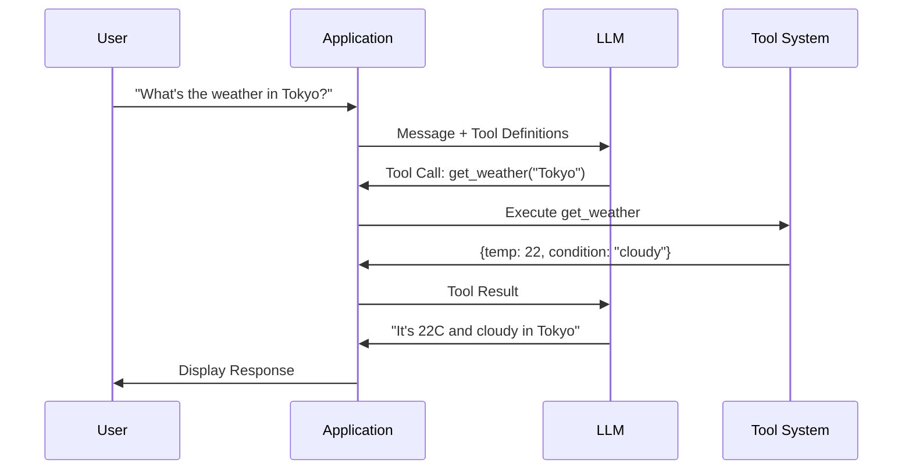
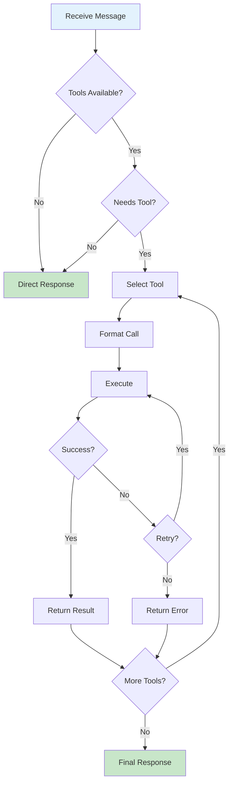
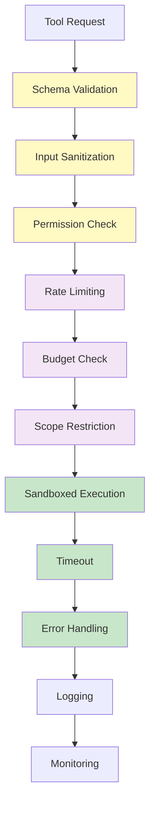
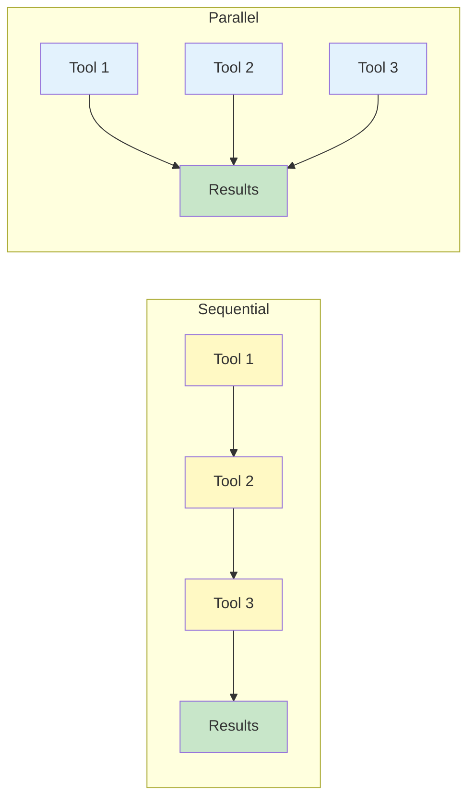
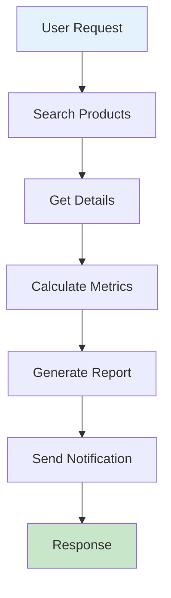

import Tip from "@components/mdx/Tip.astro";
import Warning from "@components/mdx/Warning.astro";
import Info from "@components/mdx/Info.astro";
import Definition from "@components/mdx/Definition.astro";
import Quiz from "@components/react/Quiz";
import HandsOnExercise from "@components/react/HandsOnExercise";

# Tool Use and Function Calling

Language models are powerful but fundamentally constrained. They cannot access real-time information because training data has a cutoff date. They cannot perform precise calculations because despite appearing to do math, they are pattern-matching, not calculating. They cannot interact with systems because they can describe how to send an email but cannot actually send one. They cannot verify facts because they generate plausible-sounding content without access to ground truth.

These are not bugs to be fixed with more training. They are fundamental to what a language model is: a system that predicts text based on patterns in training data. Tools solve this by giving LLMs the ability to take actions in the world.

## Why Tools Matter

Consider the difference between interactions with and without tools.

Without tools, when a user asks "What's the weather in Tokyo?", the LLM responds: "I don't have access to current weather data, but typical weather in Tokyo..."

<Definition term="Tool Use">
A structured protocol that enables language models to interact with external systems, APIs, and functions. The model decides when to call tools, formats proper requests, receives results, and incorporates those results into its response.
</Definition>

With tools, when a user asks the same question, the LLM calls weather_api("Tokyo"), receives temperature, condition, and humidity data, then responds: "It's currently 22 degrees Celsius and partly cloudy in Tokyo with 65 percent humidity."

The model does not magically know the weather. It recognizes that a tool can provide this information, formats a proper request, receives the result, and incorporates it into its response.

### The Tool Use Mental Model

Think of tool use as giving an LLM hands to interact with the world.

Without tools, the LLM is a brain in a jar. Incredibly capable at processing and generating language, but isolated from external reality.

<Info>
With tools, the LLM gains the ability to read from external sources like search engines, databases, and APIs. It can write to external systems like sending emails, creating tickets, and updating records. It can execute computations through calculators, code interpreters, and data analysis. It can control other systems including home automation, robots, and software.
</Info>

This transforms LLMs from passive text generators into active agents that can accomplish tasks.

### Common Tool Categories

Tools typically fall into several categories.

Information retrieval includes web search, database queries, document retrieval, and API calls to external services.

Computation includes calculators, code execution, data analysis, and mathematical proofs.

<Tip>
System interaction includes file operations, email and messaging, calendar management, and CRM updates. External actions include e-commerce, payments, IoT control, and robotics.
</Tip>

Each category has different risk profiles and execution patterns. A search is relatively safe; a payment requires careful validation.

### Why This Matters for Developers

Understanding tool use is essential for several reasons.

It is how modern AI applications work. ChatGPT plugins, Claude's computer use, GitHub Copilot's workspace features all rely on tool use.

You will build tool-using systems. Any AI feature that interacts with your systems needs well-designed tools.

<Warning>
Security depends on proper tool design. Poorly designed tools create attack vectors. Understanding the patterns helps you build safely.
</Warning>

Cost and latency are affected. Each tool call has overhead. Design choices directly impact user experience and bills.

## Function Calling Mechanics

Function calling is a structured protocol where you define available tools with their schemas, the model decides when to call tools and with what arguments, you execute the tool and return results, and the model incorporates results into its response. This is not prompt engineering. It is a distinct API feature with structured inputs and outputs.

<Definition term="Function Calling">
The API feature that enables language models to request execution of defined functions with structured arguments. The model outputs a function name and parameters; your code executes the function and returns results; the model continues based on those results.
</Definition>

### Tool Definition Anatomy

A tool definition includes several components.

The name is a unique identifier the model uses to call the tool. The description is critical for the model to understand when to use the tool. The parameters are a JSON Schema defining expected arguments. The required field specifies which parameters must be provided.

A well-formed tool definition for getting weather might specify name as "get_weather", description as "Get current weather for a location. Use this when the user asks about weather conditions, temperature, or forecasts.", and parameters including location (a string for city name or coordinates) and units (an enum of celsius or fahrenheit), with location being required.

### The Tool Execution Loop

Both OpenAI and Anthropic patterns follow the same logical flow.

User sends message. Model receives message plus tool definitions. Model decides to respond directly or call tools. If tool call, model outputs structured tool call request, your code executes the tool, you send tool result back to model, and the model may call more tools or respond. Finally, the model generates a final response.

<Info>
This loop can continue multiple times. A complex query might require several tool calls before the model can respond. Understanding this loop is fundamental to building tool-using applications.
</Info>

### Tool Choice Control

You can control tool usage in several ways.

Auto mode, the default, lets the model decide whether to use tools. Required mode forces the model to use at least one tool. Specific tool mode forces the model to use a particular tool. None mode disables tools for the request.

### Parallel vs Sequential Tool Calls

Models can request multiple tools simultaneously. When you receive multiple tool calls, execute in parallel when tools are independent such as weather for different cities. Execute sequentially when there are dependencies. Return all results before continuing the conversation.

## Tool Design Principles

The model decides which tool to use based primarily on descriptions. Poor descriptions lead to wrong tool choices or no tool use at all.

### The Description Is Everything

A bad description says only "Search function" for a tool named "search."

<Tip>
A good description says "Search the web for current information. Use this when the user asks about recent events, needs up-to-date facts, or asks questions about topics that may have changed since your knowledge cutoff. Returns a list of relevant web pages with titles, URLs, and snippets."
</Tip>

Elements of a good description include what it does with a clear, specific action, when to use it with conditions that trigger usage, what it returns with the shape of the response, and what it does not do to clarify boundaries and prevent misuse.

### Atomic Actions

Each tool should do one thing well. Avoid "god tools" that do everything.

Bad design creates a single "database" tool with an operation enum of read, write, delete, update, query, create_table, and so on, plus table and data parameters.

<Warning>
God tools are harder for the model to understand, have larger blast radius for errors, are harder to test, and are less composable. Prefer many small atomic tools over one large complex tool.
</Warning>

Good design creates separate tools for get_user to retrieve a user by ID, update_user_email to update a user's email address, and list_users to list users with optional filtering. Atomic tools are easier for the model to understand, safer with limited blast radius, easier to test, and more composable.

### Parameter Design

Parameters should be clearly named using descriptive names rather than abbreviations. Instead of "q" and "n", use "search_query" and "max_results".

Parameters should be well constrained using JSON Schema features. Amount might be a number with minimum 0, maximum 10000, and description explaining the transfer limit. Priority might be a string enum of low, medium, high, and critical. Email might be a string with email format.

Parameters should be appropriately required, only requiring what is truly necessary. Required fields might be just user_id, while include_metadata has a default of false and fields is optional with no default.

### Error Handling in Schema Design

Design tools to return structured errors with status, error_code, message, and any relevant context. Success responses include status success, transaction ID, and new balance. Error responses include status error, error code like INSUFFICIENT_FUNDS, message explaining the issue, and relevant data like available balance. The model can then communicate errors appropriately to users.

### Composable Tool Sets

Design tools that work together. A shopping workflow might include search_products to search by name or category returning product IDs and basic info, get_product_details to get detailed information including price, availability, and reviews, add_to_cart to add a product to the shopping cart, get_cart to view current cart contents and totals, and checkout to process checkout requiring user confirmation.

<Info>
This enables workflows where the model searches for products, gets details on top results, presents options, adds selected items to cart, and processes checkout. Each tool is simple, but together they enable complex interactions.
</Info>

## Execution Patterns

A robust tool execution loop handles multiple scenarios.

### The Execution Loop

The loop receives initial messages and tools, sets a maximum iterations count, and loops. In each iteration, it calls the model with messages and tools. If stop reason is end_turn, the task is complete. If stop reason is tool_use, it adds the assistant's response to messages, processes each tool call to execute and collect results, adds tool results to messages, and continues the loop. If maximum iterations are reached, it returns the current state.

### Error Handling Strategies

Tool execution can fail in many ways. Handle each appropriately.

<Definition term="Tool Error Types">
Common error types include validation errors from bad input, execution errors when the tool fails, timeout errors when execution takes too long, permission errors when the action is not allowed, not_found errors when resources are missing, and rate_limit errors when there are too many requests.
</Definition>

Error handling should validate input first, returning validation errors with suggestions to check input format. Check permissions next, returning permission errors if the operation is not permitted. Execute with timeout, catching timeout errors and suggesting the service may be slow. Handle resource not found errors by suggesting the user verify the resource exists. Handle rate limit errors by including retry_after time and suggesting the user wait. Log unexpected errors for debugging and return a generic error message suggesting the user try again.

### Retry Patterns

Implement intelligent retries for transient failures.

Retry with backoff calculates delay with exponential increase capped at a maximum, adds jitter for randomization, handles rate limits with retry-after times, and only retries specific retryable errors like timeout, connection, and rate limit errors.

### Parallel Execution

When the model requests multiple independent tools, execute in parallel with concurrency limits.

<Tip>
Parallel execution uses a semaphore to limit concurrent executions, gathers results handling any exceptions, and processes results to handle exceptions as error responses. This improves latency for independent tool calls.
</Tip>

### Result Formatting

Format tool results for optimal model consumption.

Handle errors by returning status error with error type, message, and suggestion. Handle empty results by returning status success with message noting no results found. Handle large results by truncating with notice that results are truncated and users should request specific items for more detail. Return normal results with status success and data.

### State Management

For multi-turn conversations with tools, manage state carefully.

A tool session tracks session ID, messages, tool call history, accumulated context, creation time, and last activity time. It records each tool call with timestamp, tool name, input, and result. It updates context based on tool results, extracting relevant information like current user or last search results. It provides context summary for the model.

## Production Considerations

Tool use introduces security risks that do not exist in pure text generation.

### Security Fundamentals

Never trust model-generated input.

<Warning>
Dangerous code passes command directly to shell with shell=True. Safe code parses and validates the command, checks against an allowed list, and uses list form to prevent shell injection with shell=False.
</Warning>

Scope limitation restricts what tools can access. A scoped database tool verifies table access against an allowed list, always filters by user ID, and uses parameterized queries.

Action confirmation requires confirmation for destructive actions. Destructive tools like delete_user, send_email, transfer_funds, and cancel_order should set a pending confirmation before executing. Verify confirmation matches the pending action before proceeding.

### Rate Limiting

Protect your systems from excessive tool use.

Rate limiters track calls per user per tool with configurable limits. Default might be 100 calls per minute. Web search might be 30 per minute. Email sends might be 10 per hour. Database queries might be 200 per minute. Check limits before allowing calls and track reset times for users who hit limits.

### Cost Management

Tool use can significantly increase costs through additional API calls for each tool use round-trip, token usage for tool definitions and results, and external service costs for API calls and compute.

<Info>
Cost trackers record costs per category per day and check against budgets for OpenAI tokens, web searches, email sends, and other resources. Usage reports show current usage, budget, and remaining budget per category.
</Info>

Strategies to reduce costs include caching tool results since many queries return the same data, batching operations to combine multiple similar tool calls, limiting tool definitions to include only relevant tools, and setting token budgets to limit response sizes.

### Monitoring and Observability

Track tool usage for debugging and optimization.

Tool events record timestamp, session ID, tool name, tool input, result, duration in milliseconds, and any error. Log entries include timestamp, session ID, tool name, input size, result size, duration, and error status.

Tool monitors log for debugging and aggregate metrics. Tool statistics include call count, success rate, average duration, 95th percentile duration, and maximum duration.

### Graceful Degradation

Handle tool failures without breaking the user experience.

<Tip>
Execute with fallback tries to execute the tool and returns success with data. If the tool is unavailable and a fallback message exists, return success false with fallback true and the fallback message. Otherwise return success false with error message asking the user to try again later.
</Tip>

Fallback messages provide helpful alternatives. Weather unavailable suggests checking weather.com. Web search unavailable offers to answer based on training data. Stock price unavailable suggests checking a brokerage app.

## Building Your Toolkit

Build a library of reusable tool patterns.

### Common Tool Patterns

Search pattern includes name as `search_{domain}`, description for searching domain for query type with paginated results, and parameters for query, optional filters, page with default 1, and limit with default 10 and maximum 50.

CRUD pattern includes name as `{action}_{resource}`, description for the action and resource with details, and parameters for id and data as appropriate.

Confirmation pattern includes name as `confirm_{action}`, description for confirming a pending action that must be called after the action to complete it, and parameters for confirmation_token and confirmed boolean.

### Tool Composition

Combine tools for complex workflows. Define atomic tools for data gathering like get_customer, get_orders, and get_products. Add analysis tools like calculate_metrics and generate_report. Add action tools like send_notification and create_ticket. The model can now compose these into workflows: get customer, get their orders, calculate metrics, generate report, and send notification.

### Starting Your Toolkit

Begin with high-value, low-risk tools.

<Info>
Phase 1 covers read-only tools including search and retrieval, data lookups, and calculations. Phase 2 adds controlled write operations including create with validation, updates with confirmation, and append-only operations. Phase 3 adds full CRUD including delete with safeguards, bulk operations with limits, and external integrations. Each phase should include monitoring, rate limiting, and cost controls before moving to the next.
</Info>

## Diagrams

### Tool Execution Flow

### Tool Decision Tree

### Security Layers

### Parallel vs Sequential Execution

### Tool Composition Workflow

## Hands-On Exercise

<HandsOnExercise
  client:visible
  moduleSlug="tool-use-function-calling"
  exerciseId="build-tool-using-agent"
  title="Build a Tool-Using Agent"
  objective="Create a functional tool-using agent with proper tool definitions, execution loop, error handling, and multi-tool coordination"
  totalTime="45-60 minutes"
  setupInstructions={[
    "Install Python 3.8 or higher",
    "Set up API access to Claude or OpenAI",
    "Open your code editor and create a new Python project"
  ]}
  parts={[
    {
      id: "define-tools",
      title: "Define Your Tools",
      duration: "12 min",
      instructions: [
        "Create get_weather tool with description: 'Get current weather conditions for a city. Use when user asks about weather, temperature, or conditions.'",
        "Add parameters: city (string, required, description: 'City name or coordinates')",
        "Specify returns: temperature (number), condition (string), humidity (number)",
        "Create calculate tool with description: 'Perform mathematical calculations. Use for arithmetic, algebra, or mathematical expressions.'",
        "Add parameters: expression (string, required, description: 'Mathematical expression to evaluate')",
        "Create convert_temperature tool with description: 'Convert temperature between Celsius and Fahrenheit'",
        "Add parameters: value (number, required), from_unit (enum: celsius/fahrenheit, required), to_unit (enum: celsius/fahrenheit, required)",
        "Ensure each description explains when to use the tool and what it returns"
      ],
      observePrompt: "How does the description quality affect the model's ability to choose the right tool? What happens if descriptions are vague or missing?"
    },
    {
      id: "implement-tools",
      title: "Implement Tool Execution",
      duration: "12 min",
      instructions: [
        "Implement get_weather: Return mock data for known cities (London: 15C/cloudy, Tokyo: 22C/sunny, Paris: 18C/rainy, Sydney: 25C/clear)",
        "For unknown cities, return structured error: {success: false, error: 'unknown_city', message: 'City not found. Try major cities like London, Tokyo, Paris, or Sydney'}",
        "Implement calculate: Safely evaluate expressions using Python's ast.literal_eval or similar safe evaluation",
        "Validate input contains only numbers, operators, and parentheses",
        "Return error for invalid expressions or division by zero",
        "Implement convert_temperature: Celsius to Fahrenheit formula: (value * 9/5) + 32, Fahrenheit to Celsius: (value - 32) * 5/9",
        "Each function should return structured results: {success: true/false, data: {...}, error: {...}}"
      ],
      observePrompt: "What edge cases should your tool implementations handle? How do structured error responses help the model respond appropriately?"
    },
    {
      id: "build-agent-loop",
      title: "Build the Agent Loop",
      duration: "15 min",
      instructions: [
        "Initialize agent with API client and tool definitions",
        "Send user message with tools to the model",
        "Check stop_reason from model response",
        "If 'end_turn': extract and return text response",
        "If 'tool_use': process tool calls by iterating through each requested tool",
        "For each tool call: log the tool name and input, execute the tool, log the result, collect tool results",
        "Add assistant message and tool results to conversation history",
        "Continue loop until completion or max iterations (e.g., 10)",
        "Print trace output showing each step: tool requested, input provided, result received, model response"
      ],
      observePrompt: "What happens if the model requests unknown tools? How does the iteration limit protect against infinite loops?"
    },
    {
      id: "error-handling",
      title: "Add Error Handling",
      duration: "12 min",
      instructions: [
        "Wrap tool execution in try/except blocks",
        "Implement retry logic with exponential backoff (1s, 2s, 4s) for transient failures",
        "Skip retries for validation errors (user input problems)",
        "Retry network errors, timeouts, and rate limits",
        "Return structured error responses: {success: false, error_type: '...', message: '...', suggestion: '...'}",
        "Handle API errors gracefully with informative messages",
        "Track iteration count and exit with message if max iterations reached",
        "Test with error-triggering queries: unknown city, invalid math expression, malformed requests"
      ],
      observePrompt: "Which errors should trigger retries versus immediate failure? How do you communicate errors to the model so it can respond helpfully to users?"
    },
    {
      id: "test-agent",
      title: "Test Your Agent",
      duration: "14 min",
      instructions: [
        "Test basic tool use: 'What's the weather in Tokyo?' - should use get_weather",
        "Test calculation: 'What is 25 * 4 + 100?' - should use calculate and get 200",
        "Test multiple tools: 'What's the weather in Paris in Fahrenheit?' - should use get_weather then convert_temperature",
        "Test error handling: 'What's the weather in Narnia?' - should handle unknown city gracefully",
        "Test no tool needed: 'Hello, how are you?' - should respond directly without tools",
        "Test complex query: 'Compare temperatures in London and Sydney' - should call get_weather twice",
        "Verify each test produces appropriate output and handles errors gracefully",
        "Check trace output to understand decision-making process"
      ],
      observePrompt: "Which queries work best? Where does the agent struggle? How could you improve tool descriptions or implementations based on test results?"
    }
  ]}
  successCriteria={[
    { id: "tool-definitions", text: "Defined at least 3 tools with proper schemas and descriptions" },
    { id: "execution-loop", text: "Implemented the tool execution loop correctly" },
    { id: "error-handling", text: "Handled both success and error cases appropriately" },
    { id: "multi-tool", text: "Tested with queries requiring multiple tool calls" },
    { id: "retry-logic", text: "Added retry logic for transient failures" },
    { id: "graceful-errors", text: "Agent responds appropriately to unknown cities and invalid input" }
  ]}
/>

## Knowledge Check

<Quiz
  client:visible
  quizId="module-16-knowledge-check"
  moduleSlug="tool-use-function-calling"
  questions={[
    {
      id: "q1",
      type: "multiple-choice",
      question: "What is the primary purpose of the tool description field in a tool definition?",
      options: [
        { id: "a", text: "To document the tool for developers" },
        { id: "b", text: "To help the model decide when to use the tool and how to call it correctly" },
        { id: "c", text: "To validate the tool's response format" },
        { id: "d", text: "To set rate limits on tool usage" }
      ],
      correctAnswer: "b",
      explanation: "The description is critical for the model's decision-making. It reads the description to understand when the tool should be used, what it does, and how to format requests. A poor description leads to the model using wrong tools or failing to use tools when appropriate."
    },
    {
      id: "q2",
      type: "multiple-choice",
      question: "When a model requests multiple tool calls simultaneously, what is the recommended approach?",
      options: [
        { id: "a", text: "Execute them one at a time in order received" },
        { id: "b", text: "Reject multiple tool calls and ask for one at a time" },
        { id: "c", text: "Execute independent tools in parallel, dependent tools sequentially" },
        { id: "d", text: "Always execute all tools in parallel regardless of dependencies" }
      ],
      correctAnswer: "c",
      explanation: "Independent tool calls should be parallelized for efficiency. However, if tools have dependencies, they must be executed sequentially. Understanding the dependency graph is key to optimal execution."
    },
    {
      id: "q3",
      type: "multiple-choice",
      question: "Which security practice is MOST important for tools that can modify data?",
      options: [
        { id: "a", text: "Rate limiting" },
        { id: "b", text: "Logging all calls" },
        { id: "c", text: "Input validation and scope restriction" },
        { id: "d", text: "Caching responses" }
      ],
      correctAnswer: "c",
      explanation: "While all options are valuable, input validation and scope restriction are most critical for write operations. A model might generate malicious or malformed input. Validating inputs and restricting tools to operate only within appropriate scope prevents data corruption, unauthorized access, and security breaches."
    },
    {
      id: "q4",
      type: "multiple-choice",
      question: "What should a tool return when it encounters an error?",
      options: [
        { id: "a", text: "An empty response" },
        { id: "b", text: "A structured error object with type, message, and suggested action" },
        { id: "c", text: "The exception stack trace" },
        { id: "d", text: "A boolean false" }
      ],
      correctAnswer: "b",
      explanation: "The model needs actionable information to respond appropriately to users. A structured error with type, message, and suggestion enables the model to communicate effectively. Empty responses confuse the model; stack traces may leak sensitive info; booleans provide no context for recovery."
    },
    {
      id: "q5",
      type: "multiple-choice",
      question: "Why should tools be designed as atomic actions rather than combining multiple operations?",
      options: [
        { id: "a", text: "Atomic tools are faster to execute" },
        { id: "b", text: "Atomic tools are easier for the model to understand, safer, and more composable" },
        { id: "c", text: "Atomic tools use less memory" },
        { id: "d", text: "Atomic tools require fewer API calls" }
      ],
      correctAnswer: "b",
      explanation: "Atomic tools are easier for the model to understand since each does one clear thing. They are safer because errors have limited blast radius. They are easier to test since each function is isolated. They are more composable since the model can combine them for complex workflows."
    }
  ]}
  passingScore={70}
  allowRetry={true}
/>

## Summary

In this module, you learned why tools matter. LLMs are powerful but limited. Tools extend their capabilities to interact with the real world by accessing live data, performing calculations, and taking actions.

Function calling mechanics involve a structured protocol for tool use. You define schemas, receive tool call requests, execute tools, and return results in a loop until completion.

Tool design principles emphasize that effective tools have clear descriptions, atomic actions, well-constrained parameters, and structured error responses. The description is the most important element for model decision-making.

Execution patterns cover handling single and parallel tool calls, implementing retries with backoff, formatting results consistently, and managing state across multi-turn conversations.

Production considerations include security through input validation, scope restriction, and confirmation for destructive actions. Cost management, rate limiting, monitoring, and graceful degradation are essential for reliable systems.

Building toolkits starts with read-only tools, adds write operations with safeguards, and composes atomic tools into powerful workflows.

Tool use transforms LLMs from passive text generators into active agents. Understanding these patterns lets you build AI systems that can accomplish real tasks in the world safely and effectively.

## What's Next

In the next module, we will explore multi-agent orchestration. We will cover how multiple specialized agents can collaborate, patterns for agent communication and coordination, managing complex workflows across agents, and building reliable multi-agent systems.

## References

### Official Documentation

- **Anthropic Tool Use Guide.** Comprehensive guide to tool use with Claude, including patterns and best practices.
  [docs.anthropic.com/en/docs/build-with-claude/tool-use](https://docs.anthropic.com/en/docs/build-with-claude/tool-use)

- **OpenAI Function Calling Guide.** Official documentation for OpenAI's function calling feature.
  [platform.openai.com/docs/guides/function-calling](https://platform.openai.com/docs/guides/function-calling)

- **JSON Schema Specification.** The schema language used to define tool parameters.
  [json-schema.org](https://json-schema.org/)

### Research

- Schick, T., et al. (2023). **"Toolformer: Language Models Can Teach Themselves to Use Tools."** Research on training language models to use tools autonomously.
  [arxiv.org/abs/2302.04761](https://arxiv.org/abs/2302.04761)

- Yao, S., et al. (2022). **"ReAct: Synergizing Reasoning and Acting in Language Models."** Foundational paper on combining reasoning and tool use.
  [arxiv.org/abs/2210.03629](https://arxiv.org/abs/2210.03629)

- Patil, S., et al. (2023). **"Gorilla: Large Language Model Connected with Massive APIs."** Research on training LLMs specifically for API usage.
  [arxiv.org/abs/2305.15334](https://arxiv.org/abs/2305.15334)

### Practical Guides

- **LangChain Tools Documentation.** Framework for building tool-using applications.
  [python.langchain.com/docs/modules/tools](https://python.langchain.com/docs/modules/tools)

- **Anthropic Cookbook.** Practical examples and patterns for tool use.
  [github.com/anthropics/anthropic-cookbook](https://github.com/anthropics/anthropic-cookbook)

### Security

- **OWASP LLM Security Guidelines.** Security considerations for LLM applications including tool use.
  [owasp.org/www-project-top-10-for-large-language-model-applications](https://owasp.org/www-project-top-10-for-large-language-model-applications/)
