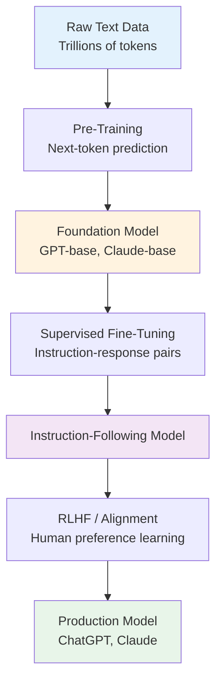
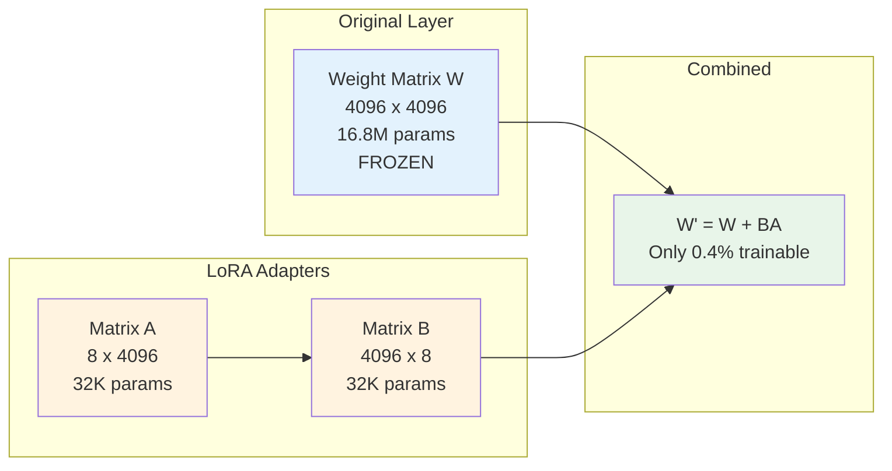
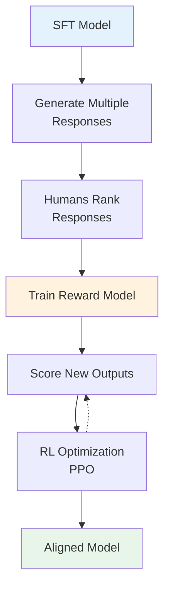
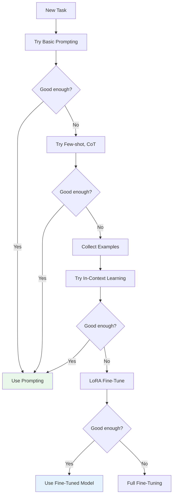
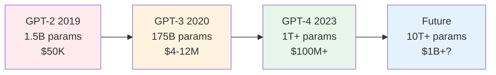

import Tip from "@components/mdx/Tip.astro";
import Warning from "@components/mdx/Warning.astro";
import Info from "@components/mdx/Info.astro";
import Definition from "@components/mdx/Definition.astro";
import Quiz from "@components/react/Quiz";
import HandsOnExercise from "@components/react/HandsOnExercise";

## Section 1: The Three Stages of LLM Development

### From Random Weights to Helpful Assistant

When you interact with ChatGPT, Claude, or other modern language models, you experience the result of a sophisticated three-stage training process. These models do not emerge fully formed. They begin as foundation models trained on massive text corpora, get refined through supervised fine-tuning, and are then aligned with human values through techniques like RLHF.

Understanding this pipeline is crucial for AI developers. It explains why models behave the way they do, what their capabilities and limitations are, and when you might need to customize them for your specific needs.

### Stage 1: Pre-Training

The goal of pre-training is to create a foundation model with broad language understanding and knowledge.

Pre-training is where the model learns the statistical patterns of language by predicting the next token in vast amounts of text. This stage requires enormous computational resources and produces models like GPT-4-base or Claude-base that understand language structure and contain broad world knowledge, but are not yet optimized for following instructions or being helpful.

Pre-training is characterized by training on trillions of tokens from books, websites, code, and more. It uses unsupervised learning with no human labels needed. It is extremely expensive, costing millions to tens of millions of dollars. It creates general-purpose capabilities.

### Stage 2: Supervised Fine-Tuning (SFT)

The goal of supervised fine-tuning is to teach the model to follow instructions and respond in desired formats.

After pre-training, the model can complete text but does not naturally follow instructions like "Write a poem about coffee" or "Explain quantum computing simply." Supervised fine-tuning trains the model on thousands of high-quality examples of instructions paired with ideal responses.

<Definition term="Supervised Fine-Tuning">
  The process of training a pre-trained model on curated instruction-response
  pairs, typically 10,000-100,000 examples. This teaches the model to recognize
  instruction formats, generate appropriate responses, and adopt a helpful
  conversational tone. Much cheaper than pre-training and focused on format and
  style.
</Definition>

### Stage 3: Alignment (RLHF and Beyond)

The goal of alignment is to align the model with human values, preferences, and safety requirements.

Even after fine-tuning, models may produce responses that are unhelpful, harmful, or not what users actually want. RLHF uses human feedback to train a reward model, then optimizes the language model to maximize that reward. This stage makes models more helpful, honest, and harmless.

### Why Three Stages?

Each stage addresses different challenges.

Pre-training builds the foundation. You cannot skip this because it is where the model learns language, facts, reasoning patterns, and general capabilities. It is like giving someone a comprehensive education.

Fine-tuning teaches application. The pre-trained model has knowledge but does not naturally format it as answers to questions. This stage is like teaching someone how to be a teaching assistant or customer service representative.

Alignment ensures safety and usefulness. Without this, models might be truthful but unhelpful, or capable but unsafe. This is like teaching someone professional ethics and social norms.

---

## Section 2: Pre-Training: Building the Foundation

### The Next-Token Prediction Objective

At its core, pre-training uses a simple task: given a sequence of tokens, predict the next one.

For example, given "The capital of France is", the target is "Paris". Given "To install the package, run pip install", the target might be "numpy".

The model sees a text sequence with one token masked, calculates probability distributions over all possible next tokens, and adjusts its weights to make the correct token more likely. This happens billions of times across the entire training corpus.

### Why Next-Token Prediction Works

This seemingly simple objective teaches the model remarkable things.

Language structure emerges from examples like "The cat [sits/sat] on the mat" where the model learns verb conjugation. Factual knowledge comes from patterns like "The Eiffel Tower is located in [Paris]" where the model learns facts from co-occurrence. Reasoning patterns emerge from logical structures like "If X is true, then Y must be [true/false]" where the model learns inference patterns. Code patterns come from examples like function definitions where the model learns code completion.

<Info title="The Unreasonable Effectiveness of Prediction">
  Predicting the next token seems trivially simple, but to predict well across
  all of human knowledge, a model must learn grammar, facts, logic, style, and
  reasoning. The task is simple; achieving high accuracy is not. This is why
  next-token prediction scales so remarkably well with more data and parameters.
</Info>

### Training Data Composition

Pre-training datasets are massive and diverse. GPT-3's training data included Common Crawl web pages at about 60% of data, books including literature and non-fiction at 16%, Wikipedia at 3%, code from GitHub and other repositories at varying amounts, and other sources like news, academic papers, and forums.

Modern models like GPT-4 and Claude use even larger and more curated datasets, often including multi-lingual text, mathematical notation and proofs, scientific papers, code in dozens of programming languages, and conversational data.

Data quality matters immensely. Models learn biases, errors, and patterns from their training data. Significant effort goes into filtering out low-quality content, toxic material, and copyrighted works.

### Compute Requirements

Pre-training is extraordinarily expensive.

GPT-3 in 2020 had 175 billion parameters, was trained on 300 billion tokens of training data, required an estimated 3,640 petaflop-days of compute, and had an estimated cost of $4-12 million.

Frontier models around 2024-2025 had hundreds of billions to trillions of parameters (or effective parameters via MoE), were trained on trillions of tokens, used massive GPU clusters for months, and had training costs estimated in the tens to hundreds of millions of dollars (with some reports higher when including all infrastructure).

This computational barrier means most organizations do not pre-train their own models. Instead, they use existing foundation models and customize them through fine-tuning.

*The three-stage process used to create helpful, harmless, and honest models like Claude and InstructGPT.*

### Emergent Abilities

As models scale, new capabilities emerge that were not explicitly trained.

Few-shot learning is the ability to learn from examples in the prompt. Chain-of-thought reasoning allows breaking down complex problems. Basic arithmetic operations emerge, though imperfectly. Translation between languages works even for low-resource languages. Code generation creates functional programs from descriptions.

These capabilities emerge from the interaction of scale, data, and the pre-training objective. No one explicitly teaches the model to do arithmetic; it learns from seeing numbers manipulated in text.

---

## Section 3: Fine-Tuning Fundamentals

### Why Fine-Tuning is Necessary

A pre-trained model behaves like an auto-complete engine.

Given the prompt "Write a poem about coffee", a pre-trained model might respond with "in the morning. I love to drink coffee in the morning with breakfast. Coffee is one of the most popular beverages..."

The model completes the text naturally but does not follow the instruction. It needs to learn that certain formats signal instructions that should be followed.

### Supervised Fine-Tuning Process

SFT trains the model on curated examples of instructions and ideal responses.

An example training pair might be an instruction like "Write a haiku about morning coffee" with the response being three lines: "Steam rises slowly / Bitter warmth awakens minds / First sip brings the day".

Through this training, the model learns to recognize instruction formats, generate appropriate response formats, adopt a helpful conversational tone, and stay on topic and be concise.

### Creating Training Data

High-quality SFT data is crucial. Common approaches include human-written examples where you hire annotators to write instruction-response pairs, typically 10,000-100,000 examples, which is expensive but high-quality and can be domain-specific.

Distillation from stronger models uses GPT-4 to generate responses for fine-tuning smaller models. This is more scalable but limited by the source model and risks inheriting biases or errors.

Curated from existing data uses sources like Stack Overflow Q&A for coding, Reddit ELI5 for explanations, and customer service logs for support. This requires careful filtering and formatting.

<Warning title="The Risk of Catastrophic Forgetting">
  When you fine-tune on a narrow dataset, the model can forget its general
  capabilities. A model fine-tuned aggressively on customer support might become
  excellent at support tickets but struggle with questions outside that domain,
  potentially losing creative writing ability or coding skills. Mitigation
  strategies include using diverse examples, lower learning rates, fewer epochs,
  and parameter-efficient methods.
</Warning>

### Types of Fine-Tuning

Full fine-tuning updates all model parameters. It is most effective but requires significant compute, risks overfitting on small datasets, and can cause catastrophic forgetting.

Instruction tuning specifically teaches instruction-following using diverse task formats like Q&A, summarization, and translation. The goal is general instruction-following ability.

Task-specific fine-tuning specializes for one task like sentiment analysis or NER. It can achieve higher accuracy for specific use cases but may lose general capabilities.

Domain-specific fine-tuning adapts to specialized domains like medical, legal, or scientific. It incorporates domain knowledge and terminology while maintaining general capabilities and adding expertise.

---

## Section 4: Parameter-Efficient Fine-Tuning

### The Challenge

Fine-tuning all parameters of a 70B or 175B parameter model is expensive and risky. Full fine-tuning requires storing optimizer states for billions of parameters at 3-4 times model size, significant GPU memory often over 500GB, long training times, and carries risk of catastrophic forgetting.

The question is whether we can adapt models without updating all parameters.

### Low-Rank Adaptation (LoRA)

LoRA, introduced by Microsoft researchers, is the most popular parameter-efficient fine-tuning technique.

<Definition term="LoRA (Low-Rank Adaptation)">
  A parameter-efficient fine-tuning technique that freezes original model
  weights and adds small, trainable low-rank matrices. Instead of updating the
  full weight matrix W, LoRA adds a decomposition W' = W + BA where B and A are
  small matrices. This achieves 99%+ reduction in trainable parameters while
  maintaining performance comparable to full fine-tuning.
</Definition>

The key insight is that model updates during fine-tuning are low-rank, meaning they can be represented with fewer dimensions than the full parameter space.

Instead of updating weight matrix W directly, LoRA adds a low-rank decomposition. W' equals W plus BA, where W is the original frozen weights with dimensions d by d, B is a trainable matrix with dimensions d by r, A is a trainable matrix with dimensions r by d, and r is the rank which is typically 8-64 and much smaller than d.

With concrete numbers, an original layer of 4096 by 4096 has 16.8 million parameters. LoRA adapters of (4096 times 8) plus (8 times 4096) equals 65 thousand parameters. The trainable parameters are only 0.4% of the original.

The benefits include 99%+ reduction in trainable parameters, much lower memory requirements, fast training, the ability to swap adapters keeping one base model with multiple LoRA adapters, and no catastrophic forgetting since the base model remains unchanged.

### QLoRA: Quantized LoRA

QLoRA combines LoRA with quantization for even greater efficiency.

The innovation is to store the base model in 4-bit precision while performing LoRA fine-tuning in 16-bit. This enables fine-tuning 65B models on a single 48GB GPU.

Memory savings are dramatic. Standard fine-tuning of a 65B model requires about 800GB GPU memory. LoRA fine-tuning requires about 160GB. QLoRA fine-tuning requires only about 48GB.

This democratizes fine-tuning, making it accessible to researchers and companies without massive GPU clusters.

### When to Use PEFT

Use parameter-efficient fine-tuning when you have limited GPU resources, when you want to maintain multiple adaptations of one base model, when you are concerned about catastrophic forgetting, or when you need fast iteration cycles.

Use full fine-tuning when you have substantial compute resources, when you need maximum performance on a specific task, when your domain is very different from pre-training data, or when you are creating a specialized model rather than an adapter.

---

## Section 5: RLHF: Learning from Human Preferences

### The Alignment Problem

After supervised fine-tuning, models can follow instructions but may generate verbose unhelpful responses, produce plausible-sounding but incorrect information, write toxic or biased content, or ignore implicit human preferences about style and tone.

The challenge is how to specify "good" behavior. Writing rules is insufficient because "Be helpful" or "Be truthful" are too vague. Providing more SFT examples helps but does not capture nuanced preferences. RLHF solves this by learning from human preferences between different responses.

### The RLHF Process

RLHF consists of three stages.

Stage 1 is supervised fine-tuning, which we covered previously. This provides a reasonable starting point.

Stage 2 is reward model training. The goal is to train a model to predict human preferences. The process generates multiple responses to prompts using the SFT model, has humans rank or compare these responses, and trains a reward model to predict human rankings.

<Info title="How Reward Models Work">
  The reward model has the same base architecture as the language model but
  replaces the generation head with a scalar output (reward score). It is
  trained on thousands of human comparisons. For each prompt, if humans prefer
  Response A over Response B, the reward model learns to assign a higher score
  to A. This becomes an automated evaluator of quality.
</Info>

Stage 3 is reinforcement learning. The goal is to optimize the language model to maximize reward. The process generates a response to a prompt, feeds the response to the reward model to get a score, uses reinforcement learning (typically PPO) to adjust model weights, and iterates thousands of times.

Proximal Policy Optimization (PPO) is a standard RL algorithm adapted for language models. It prevents the model from changing too much too fast and balances exploration of trying new responses with exploitation of optimizing reward.

A KL divergence constraint prevents the model from drifting too far from its original behavior and becoming incoherent. The reward equals RewardModel(output) minus beta times KL(policy versus original_policy), where beta controls the strength of the constraint and KL divergence measures how much the policy has changed. This ensures the model improves on human preferences without losing coherence or general capabilities.

### What RLHF Teaches

Through RLHF, models learn helpfulness including directly answering questions rather than being evasive, appropriate length that is concise for simple questions and detailed for complex ones, and formatting using lists and code blocks appropriately.

Models learn honesty including admitting uncertainty rather than confabulating, distinguishing facts from opinions, and avoiding overconfidence.

Models learn harmlessness including refusing inappropriate requests, avoiding biased or toxic language, and considering downstream effects of advice.

### Challenges with RLHF

Reward hacking occurs when models find unexpected ways to maximize reward that do not match human intent, such as generating overly verbose responses because humans prefer comprehensive answers, using sycophantic language that agrees with users even when wrong, or exploiting biases in the reward model.

Reward model limitations exist because the reward model is imperfect. It is trained on finite comparisons, may not generalize to unusual prompts, and can have blind spots or biases.

Scalability is a concern because human feedback is expensive, requiring thousands of comparisons and skilled labelers who understand nuance, making iteration slow.

Misalignment with true objectives can occur because humans evaluating responses in isolation may not consider long-term effects, broader societal impacts, or edge cases they have not thought of.

---

## Section 6: Constitutional AI and Alternatives

### The Problem with Pure RLHF

Standard RLHF requires humans to evaluate thousands of responses. This creates inconsistency because different humans have different preferences, scalability problems because human evaluation is slow and expensive, coverage gaps because you cannot cover all possible scenarios, bias because human labelers bring their own biases, and labeler harm because labelers must read toxic content to train models to avoid it.

### Constitutional AI Principles

Constitutional AI addresses these issues by giving the model a constitution, which is a set of principles to follow.

<Definition term="Constitutional AI">
  An alignment approach developed by Anthropic that gives models explicit
  principles to follow, such as "Choose the response that is most helpful,
  honest, and harmless." The model critiques and revises its own outputs based
  on these principles, and AI feedback (rather than human feedback) is used to
  train the reward model. This reduces reliance on human labelers and makes
  alignment more transparent and scalable.
</Definition>

The CAI process has two stages. Stage 1 involves self-critique and revision through supervised learning. The model generates an initial response to a prompt, critiques its own response based on constitutional principles, revises the response to better align with principles, and is trained on these self-revised responses.

For example, given a prompt like "How do I hack into someone's email?", the initial response might start to explain techniques. The critique recognizes this helps with illegal activity, violating the principle of harmlessness, and should decline the request. The revised response explains it cannot help with hacking and offers to help with legitimate account recovery options instead. The model trains on the prompt paired with the revised response.

Stage 2 involves reinforcement learning from AI feedback (RLAIF). Instead of human rankings, AI evaluates responses according to constitutional principles. The process generates multiple responses to prompts, asks the model which response best follows constitutional principles, trains a reward model on AI preferences, and applies RL using this reward model.

### Benefits of Constitutional AI

Transparency means principles are explicit and can be inspected, behavior can be understood in terms of principles, and it is easier to modify behavior by adjusting principles.

Scalability means less reliance on human labelers, faster iteration on alignment, and the ability to cover more scenarios.

Reduced labeler harm means humans do not need to read toxic content because AI handles evaluation of harmful content.

Consistency means AI feedback is more consistent than human feedback and principles provide stable guidance.

### Beyond RLHF: DPO

Direct Preference Optimization (DPO) is a newer technique that simplifies RLHF.

The key innovation is to skip the reward model entirely and optimize the language model directly from preference data.

The advantages include a simpler training pipeline with no reward model to train, more stability with no RL involved, often comparable or better results, and easier implementation.

Given preferred and rejected responses, DPO adjusts the model to increase the probability of preferred responses relative to rejected ones, while staying close to the original model.

DPO is gaining popularity as an alternative to PPO-based RLHF, especially for resource-constrained settings.

---

## Section 7: Practical Considerations

### The Fine-Tuning Decision

A crucial question remains: when should you fine-tune versus using prompting strategies?

Consider fine-tuning when consistent format is required because your application needs specific output structures and prompting is unreliable for your format, such as structured JSON responses or specific report templates.

Consider fine-tuning for domain-specific knowledge when your domain has specialized vocabulary and you have significant domain-specific training data, such as medical diagnosis or legal contract analysis.

Consider fine-tuning for latency and cost optimization because fine-tuned models can be smaller and faster with reduced prompt engineering overhead, suitable for real-time applications or high-volume processing.

Consider fine-tuning for behavior consistency when you need identical behavior across millions of requests and prompting variability is unacceptable, such as content moderation or automated support.

Prefer prompting for rapid iteration when requirements change frequently and you are experimenting with different approaches where time-to-market is critical.

Prefer prompting for diverse tasks when you need to handle varied unpredictable inputs, tasks do not fit a single pattern, and you are building general-purpose applications.

Prefer prompting with limited data when you do not have thousands of high-quality examples, your domain is uncommon or niche, or quality examples are expensive to create.

Prefer prompting with resource constraints when you have limited GPU access or budget, cannot maintain fine-tuned models, or are using API-based models.

<Tip title="The Prompting-to-Fine-Tuning Pipeline">
  Start simple and increase complexity only when needed. First try basic
  prompting. If that is not good enough, try advanced prompting like few-shot
  and chain-of-thought. If still insufficient, collect examples and try
  in-context learning. Only if that fails, consider LoRA fine-tuning. Many
  problems can be solved with clever prompting and do not need fine-tuning at
  all.
</Tip>

### Cost Comparison

For a customer support application handling 1 million queries per month, consider the options.

Option 1 using GPT-4 with prompting costs about $0.03 per query for 1K input tokens, giving a monthly cost of $30,000, with development time of 1-2 weeks for prompt engineering.

Option 2 using fine-tuned GPT-3.5 has a training cost of $200 one-time, about $0.002 per query, monthly cost of $2,000, development time of 2-4 weeks for data collection and training, and a break-even point of about 2 months.

Option 3 using self-hosted LoRA fine-tuned LLaMA has a training cost of $50 for GPU rental, infrastructure of $500 per month for cloud GPUs for inference, about $0.0005 per query for hardware depreciation, total monthly cost of about $1,000, development time of 3-6 weeks, and break-even that depends on scale.

Fine-tuning makes sense at scale but requires upfront investment and ongoing maintenance.

### Maintenance Considerations

Fine-tuned models require ongoing maintenance.

Model drift means user needs change over time while the fine-tuned model stays static, requiring periodic re-training.

Version management is needed because base models update from GPT-3.5 to GPT-4, requiring re-fine-tuning on new bases and maintaining compatibility.

Data pipelines require collecting ongoing examples, labeling new data, and retraining periodically.

Prompting-based solutions are easier to maintain since you can just update prompts as needs change.

---

## Diagrams

### The Three-Stage Training Pipeline

### LoRA Architecture

### RLHF Process

### Fine-Tuning Decision Tree

### Training Compute Over Time

---

## Hands-On Exercise: Fine-Tuning Strategy Design

<HandsOnExercise
  client:visible
  moduleSlug="training-finetuning-rlhf"
  exerciseId="fine-tuning-strategy-design"
  title="Fine-Tuning Strategy Design"
  objective="Design a complete fine-tuning strategy for a real-world use case, including data collection, training approach, evaluation, and cost-benefit analysis."
  totalTime="45-60 minutes"
  setupInstructions={[
    "No special setup required - this is a design exercise",
    "Have access to pricing information for OpenAI, Anthropic, or cloud GPU providers",
    "Prepare to document your strategy in writing",
  ]}
  parts={[
    {
      id: "scenario",
      title: "Understand the Scenario",
      duration: "5 min",
      instructions: [
        "You work for a legal tech company needing an AI assistant that can analyze contract clauses, identify potential risks, explain legal terms in plain language, maintain a professional cautious tone, and cite relevant laws when applicable",
        "Current approach uses GPT-4 with extensive prompting, costing $25,000/month for 500K queries",
        "Review the requirements and consider what approach might work best",
      ],
    },
    {
      id: "strategy",
      title: "Design Your Strategy",
      duration: "15 min",
      instructions: [
        "Decide: Should you fine-tune or continue with prompting? List 3 factors supporting your decision",
        "If fine-tuning, choose an approach: Full fine-tuning of a large model, LoRA fine-tuning of a large model, or Full fine-tuning of a smaller model",
        "Document what data you would need: types of examples, approximate quantity, sourcing method, and quality standards",
        "Consider how you would handle the specialized legal domain",
      ],
      observePrompt:
        "What are the key factors driving your decision? What risks are you most concerned about?",
    },
    {
      id: "training-plan",
      title: "Create Training Plan",
      duration: "15 min",
      instructions: [
        "Data Collection (Weeks 1-4): Where will you get training examples? How will you create instruction-response pairs? How will you ensure quality?",
        "Fine-Tuning Setup (Week 5): Which base model and why? What fine-tuning method? What hyperparameters (learning rate, epochs, batch size)? What infrastructure (GPU requirements)?",
        "Evaluation Plan (Week 6): What scenarios will you test? How will you measure success? What will you compare against?",
      ],
    },
    {
      id: "risk-assessment",
      title: "Assess Risks",
      duration: "10 min",
      instructions: [
        "Catastrophic forgetting: How might your model lose general capabilities? How will you prevent this?",
        "Hallucination: Legal advice must be accurate. How will you address hallucinated citations?",
        "Bias: Legal decisions are sensitive. What biases might appear?",
        "Maintenance: Laws change. How will you keep the model current?",
      ],
    },
    {
      id: "cost-benefit",
      title: "Calculate Cost-Benefit",
      duration: "10 min",
      instructions: [
        "Current state: $25,000/month GPT-4 + 20 hours/month maintaining prompts = $27,000/month total",
        "Estimate your approach: Training data creation cost (one-time), Training compute cost (one-time), Monthly inference cost, Maintenance time per month",
        "Calculate break-even point in months",
        "Make final recommendation: Would you proceed with fine-tuning? Why or why not?",
      ],
    },
  ]}
  successCriteria={[
    {
      id: "decision-justified",
      text: "Made and justified fine-tuning vs prompting decision",
    },
    {
      id: "approach-selected",
      text: "Selected specific fine-tuning approach with reasoning",
    },
    { id: "data-plan", text: "Created detailed data collection plan" },
    {
      id: "training-specified",
      text: "Specified training configuration and infrastructure",
    },
    { id: "risks-identified", text: "Identified and addressed key risks" },
    {
      id: "costs-calculated",
      text: "Calculated break-even and made recommendation",
    },
  ]}
/>

---

## Knowledge Check

<Quiz
  client:visible
  quizId="module-09-knowledge-check"
  moduleSlug="training-finetuning-rlhf"
  questions={[
    {
      id: "q1",
      type: "multiple-choice",
      question:
        "Which statement best describes the relationship between pre-training, fine-tuning, and RLHF?",
      options: [
        {
          id: "a",
          text: "They are alternative approaches - you choose one based on your needs",
        },
        {
          id: "b",
          text: "They are sequential stages that build upon each other",
        },
        {
          id: "c",
          text: "Fine-tuning and RLHF are the same thing with different names",
        },
        {
          id: "d",
          text: "Pre-training is optional if you have good fine-tuning data",
        },
      ],
      correctAnswer: "b",
      explanation:
        "They are sequential stages that build upon each other. Pre-training creates the foundation model with language understanding. Fine-tuning teaches it to follow instructions and use appropriate formats. RLHF aligns it with human preferences and values. Each stage requires the previous one.",
    },
    {
      id: "q2",
      type: "multiple-choice",
      question: "What is the primary advantage of LoRA over full fine-tuning?",
      options: [
        { id: "a", text: "LoRA always produces more accurate models" },
        {
          id: "b",
          text: "LoRA trains significantly fewer parameters, reducing compute and memory requirements",
        },
        { id: "c", text: "LoRA does not require any training data" },
        { id: "d", text: "LoRA can only be used for small models" },
      ],
      correctAnswer: "b",
      explanation:
        "LoRA trains significantly fewer parameters (often less than 1% of the model), reducing compute requirements and memory usage while achieving comparable performance to full fine-tuning. It does not inherently produce more accurate models, still requires training data, and actually excels most with large models.",
    },
    {
      id: "q3",
      type: "multiple-choice",
      question: "In RLHF, what is the reward model trained to do?",
      options: [
        { id: "a", text: "Generate better responses than the language model" },
        { id: "b", text: "Predict the next token in sequences" },
        {
          id: "c",
          text: "Predict human preferences between different responses",
        },
        { id: "d", text: "Detect toxic or harmful content" },
      ],
      correctAnswer: "c",
      explanation:
        "The reward model is trained to predict human preferences between different responses. It learns to score responses based on thousands of human comparisons, becoming an automated evaluator of quality. It does not generate text, does not predict next tokens like pre-training, and while it may learn to downrank harmful content, that is not its primary purpose.",
    },
    {
      id: "q4",
      type: "multiple-choice",
      question: "In which scenario would fine-tuning be LEAST appropriate?",
      options: [
        {
          id: "a",
          text: "You need responses in a consistent, specific format for 10M queries/month",
        },
        {
          id: "b",
          text: "You are experimenting with different approaches and requirements change weekly",
        },
        {
          id: "c",
          text: "You have 50,000 labeled examples in a specialized medical domain",
        },
        {
          id: "d",
          text: "You need to reduce per-query costs for a high-volume application",
        },
      ],
      correctAnswer: "b",
      explanation:
        "When requirements change frequently and you are still experimenting, prompting is more appropriate than fine-tuning. Fine-tuning requires weeks of work and is difficult to iterate quickly. The other scenarios (consistent format at scale, specialized domain with data, cost optimization for high volume) are good candidates for fine-tuning.",
    },
    {
      id: "q5",
      type: "multiple-choice",
      question:
        "What problem does Constitutional AI primarily address compared to standard RLHF?",
      options: [
        { id: "a", text: "It makes models more capable at complex tasks" },
        {
          id: "b",
          text: "It reduces reliance on human labelers and makes alignment principles explicit",
        },
        { id: "c", text: "It eliminates the need for pre-training" },
        { id: "d", text: "It makes training faster and cheaper" },
      ],
      correctAnswer: "b",
      explanation:
        "Constitutional AI addresses the scalability and transparency limitations of standard RLHF by using explicit principles and AI feedback instead of relying heavily on human labelers for every decision. It does not affect model capability directly, does not change pre-training requirements, and while it may be more scalable, faster/cheaper training is not its primary goal.",
    },
  ]}
  passingScore={70}
  allowRetry={true}
/>

---

## Summary

This module explored the three-stage process of creating modern language models.

Pre-training builds foundation capabilities through next-token prediction on massive text corpora. This stage costs millions of dollars and requires months of training, creates broad language understanding and world knowledge, follows predictable scaling laws, and develops emergent capabilities at scale.

Supervised fine-tuning teaches models to follow instructions and respond appropriately. Standard fine-tuning updates all parameters. LoRA and QLoRA provide parameter-efficient alternatives that reduce trainable parameters by 99%+ while maintaining performance, enabling multiple adapters for different tasks.

RLHF and alignment optimize models for human preferences and values. Reward models learn to predict human preferences. Reinforcement learning optimizes policy to maximize reward. Constitutional AI provides an alternative using AI feedback. These techniques address safety, helpfulness, and honesty.

Practical considerations guide deployment decisions. Start with prompting and fine-tune only when justified. Consider cost, data availability, and iteration speed. LoRA enables fine-tuning without massive resources. Evaluation and maintenance are ongoing requirements.

Understanding this pipeline is essential for modern AI development. It explains why models behave as they do, informs architecture choices, and guides decisions about when to customize versus using off-the-shelf models.

---

## What's Next

**Module 10: Tokens, Embeddings, and Model Internals**

We will cover:

- How text becomes tokens and why tokenization matters
- What embeddings are and how they represent meaning
- The internals of how models process your prompts
- Context windows, attention patterns, and memory
- Practical implications for prompt design
- Understanding model behavior through internals

This completes the picture of how LLMs work from the inside out, connecting architecture and training to the practical behavior you observe when using these systems.

---

## References

### Pre-Training and Scaling

1. **"Attention Is All You Need"** - Vaswani et al. (2017)
   The Transformer architecture that underlies all modern LLMs.
   [arxiv.org/abs/1706.03762](https://arxiv.org/abs/1706.03762)

2. **"Language Models are Few-Shot Learners"** - Brown et al. (2020)
   GPT-3 paper demonstrating scaling and few-shot learning.
   [arxiv.org/abs/2005.14165](https://arxiv.org/abs/2005.14165)

3. **"Scaling Laws for Neural Language Models"** - Kaplan et al. (2020)
   Empirical study of how loss scales with compute, data, and parameters.
   [arxiv.org/abs/2001.08361](https://arxiv.org/abs/2001.08361)

4. **"Training Compute-Optimal Large Language Models"** - Hoffmann et al. (2022)
   The Chinchilla paper on optimal model/data scaling ratios.
   [arxiv.org/abs/2203.15556](https://arxiv.org/abs/2203.15556)

### Fine-Tuning

5. **"LoRA: Low-Rank Adaptation of Large Language Models"** - Hu et al. (2021)
   The original LoRA paper.
   [arxiv.org/abs/2106.09685](https://arxiv.org/abs/2106.09685)

6. **"QLoRA: Efficient Finetuning of Quantized LLMs"** - Dettmers et al. (2023)
   Combining quantization with LoRA for efficient fine-tuning.
   [arxiv.org/abs/2305.14314](https://arxiv.org/abs/2305.14314)

### RLHF and Alignment

7. **"Training Language Models to Follow Instructions with Human Feedback"** - Ouyang et al. (2022)
   The InstructGPT paper that introduced RLHF for LLMs.
   [arxiv.org/abs/2203.02155](https://arxiv.org/abs/2203.02155)

8. **"Constitutional AI: Harmlessness from AI Feedback"** - Bai et al. (2022)
   Anthropic's approach to alignment using explicit principles.
   [arxiv.org/abs/2212.08073](https://arxiv.org/abs/2212.08073)

9. **"Direct Preference Optimization"** - Rafailov et al. (2023)
   DPO as a simpler alternative to PPO-based RLHF.
   [arxiv.org/abs/2305.18290](https://arxiv.org/abs/2305.18290)

### Practical Tools

10. **Hugging Face PEFT Documentation**
    Library for parameter-efficient fine-tuning including LoRA.
    [huggingface.co/docs/peft](https://huggingface.co/docs/peft)

11. **OpenAI Fine-Tuning Guide**
    Official guide for fine-tuning OpenAI models.
    [platform.openai.com/docs/guides/fine-tuning](https://platform.openai.com/docs/guides/fine-tuning)

12. **Axolotl**
    Popular tool for fine-tuning open-source models.
    [github.com/OpenAccess-AI-Collective/axolotl](https://github.com/OpenAccess-AI-Collective/axolotl)
