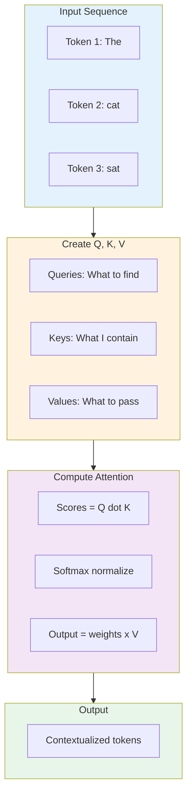
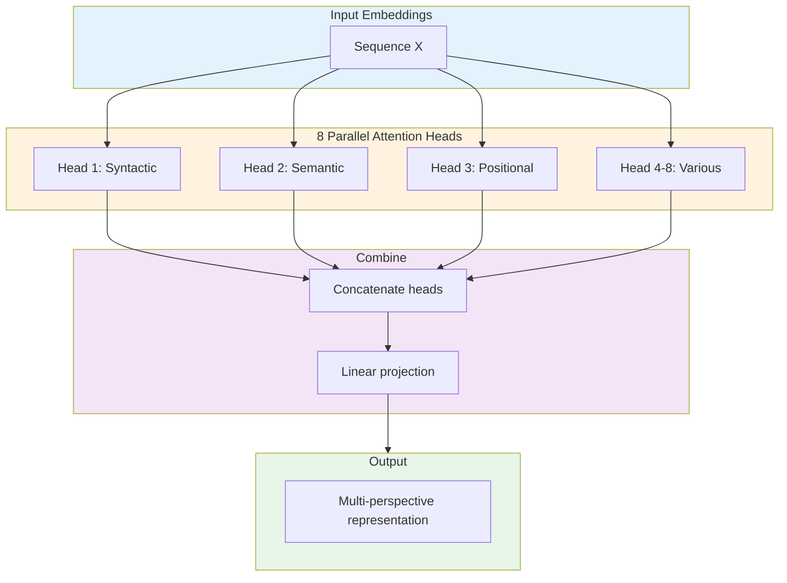
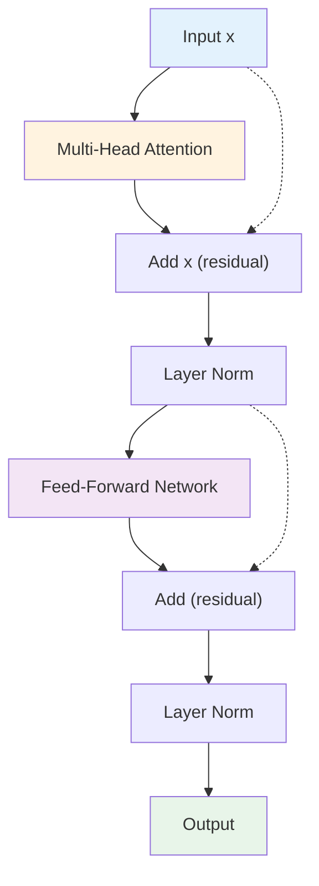
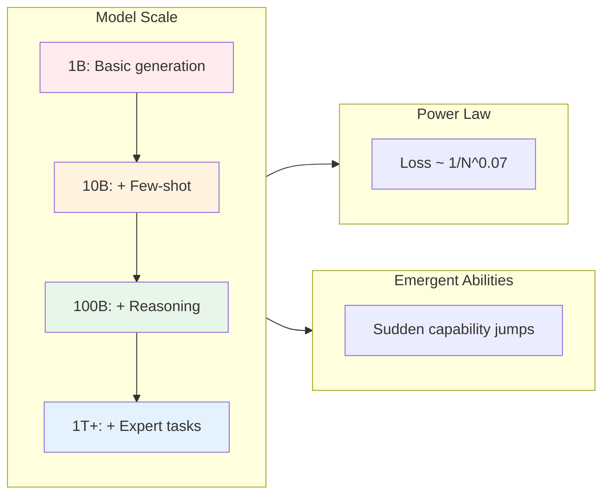

import Tip from "@components/mdx/Tip.astro";
import Warning from "@components/mdx/Warning.astro";
import Info from "@components/mdx/Info.astro";
import Definition from "@components/mdx/Definition.astro";
import Quiz from "@components/react/Quiz";
import HandsOnExercise from "@components/react/HandsOnExercise";

## Section 1: Attention Is All You Need

### The AI Timeline Before 2017

In 2017, deep learning was already successful but hitting walls. Convolutional Neural Networks dominated computer vision. They were great at images but struggled with sequences like text, speech, and time series data.

Recurrent Neural Networks and their variants like LSTMs and GRUs handled sequences. They could process text word by word, maintaining a hidden state that captured context. But they had fatal flaws.

The sequential bottleneck meant each word had to be processed before the next. No parallelization meant slow training. Vanishing gradients caused information from early in a sequence to degrade over time. Long-range dependencies were hard to learn. The fixed capacity of hidden states meant they had to compress all context into a fixed-size vector. More context meant more compression loss.

Machine translation exemplified these struggles. State-of-the-art systems used sequence-to-sequence models where an RNN encoder processed the source sentence into a context vector, then an RNN decoder generated the translation. They worked, but poorly for long sentences and slowly for everything.

### The Paper That Changed Everything

In June 2017, a team at Google Brain and Google Research published "Attention Is All You Need." The title was a provocation. The prevailing wisdom was that attention mechanisms were useful additions to RNNs. This paper claimed you could throw out the RNN entirely and build everything from attention.

The results were striking. Better quality meant state-of-the-art translation on WMT 2014 English-to-German with BLEU score 28.4, improving by more than 2 points. Faster training meant training time reduced from 3.5 days to 12 hours on the same hardware. Simpler design meant the architecture was more elegant, more parallelizable, and more interpretable.

Within months, transformers started dominating NLP. Within two years, BERT in 2018 and GPT-2 in 2019 showed that pre-trained transformers could be fine-tuned for almost any language task. By 2020, GPT-3 demonstrated few-shot learning at scale. By 2022, ChatGPT brought transformers to mainstream awareness.

<Definition term="Transformer">
  A neural network architecture based entirely on attention mechanisms,
  introduced in the 2017 paper "Attention Is All You Need." Transformers process
  sequences by letting every position directly attend to every other position,
  solving the parallelization and long-range dependency problems that limited
  RNNs. This architecture underlies all modern large language models.
</Definition>

### What Problem Did Transformers Solve?

The core insight is that all inputs should be able to attend to all other inputs simultaneously.

In RNNs, information flows sequentially. Word 1 affects word 2, which affects word 3, and so on. To connect word 1 to word 50, information must traverse 49 steps, degrading along the way.

In transformers, word 1 can attend directly to word 50. Every position can look at every other position in one step. This enables parallelization where all positions process simultaneously and training becomes massively parallelizable on GPUs. It enables long-range dependencies where direct connections mean no degradation over distance. It enables dynamic weighting where the model learns which connections matter, rather than treating all sequential connections equally.

The fundamental mechanism enabling this is self-attention. Let us understand how it works.

---

## Section 2: Self-Attention Mechanism

### The Intuition: Dynamic Relevance

Imagine reading this sentence: "The animal didn't cross the street because it was too tired."

What does "it" refer to? Your brain instantly resolves this. "It" means the animal, not the street. You do this by paying attention to context. "Tired" relates to animals, not streets.

Self-attention formalizes this intuition. For each word, the mechanism looks at all other words in the sequence, computes how relevant each word is to the current word, and creates a new representation that mixes information based on relevance.

Consider a simpler example: "The cat sat on the mat."

For the word "cat", self-attention might determine that "The" has low relevance as it is just an article, "cat" itself has high relevance for self-reference helping with identity, "sat" has high relevance as this is what the cat did, "on" has medium relevance as a preposition indicating relationship, "the" has low relevance, and "mat" has medium relevance as the location of sitting.

The output representation of "cat" would be a weighted combination of all these words, with "cat" and "sat" contributing most.

### The Math: Query, Key, Value

Self-attention implements this through three learned transformations of each input.

Query represents "What am I looking for?" Key represents "What information do I contain?" Value represents "What information should I pass along?"

<Info title="The Database Analogy">
  Think of Query, Key, and Value like a database lookup system. Query is your
  search term. Key is the index you search against. Value is the actual data you
  retrieve. The dot product between Query and Key determines relevance, and that
  relevance weights how much of each Value contributes to the output.
</Info>

For each position in the sequence, first transform inputs by applying learned weight matrices to create Q, K, V vectors. Q equals X times W_Q, K equals X times W_K, and V equals X times W_V.

Next compute attention scores. For each position, compute how much it should attend to every position. The score from position i to j equals Q_i dot K_j. This measures compatibility: how well position i's query matches position j's key.

Then normalize with softmax to convert scores to probabilities that sum to 1. Attention from i to j equals softmax of the score, dividing by the square root of d_k for stable gradients.

Finally create a weighted combination by mixing values according to attention weights. Output_i equals the sum over j of Attention times V_j.

### The Equation

The complete self-attention equation, as written in the original paper:

```
Attention(Q, K, V) = softmax(QK^T / sqrt(d_k)) V
```

QK transposed is matrix multiplication of queries with keys transposed. This computes all pairwise compatibility scores at once. Dividing by the square root of d_k scales by the square root of key dimension. This prevents dot products from becoming too large, which would push softmax into saturation regions with tiny gradients. Softmax converts each row of scores to probabilities where each row sums to 1. Multiplying by V computes the weighted combinations.

The genius is that everything happens in parallel. All positions compute their attention simultaneously. A single matrix multiplication computes all pairwise interactions.

### Concrete Example with Numbers

Let us trace through a tiny example with the sequence "cat sat" embedded as 4-dimensional vectors.

Starting with input embeddings, "cat" is represented as [1.0, 0.5, 0.3, 0.8] and "sat" as [0.2, 0.9, 0.7, 0.1].

With learned weight matrices that project to 2D for simplicity, we create Q, K, V vectors for each token. Then we compute attention scores using dot products, scale and apply softmax to get attention weights, and finally compute the weighted sum of values.

Through this process, the output representation of "cat" now incorporates information from both "cat" and "sat", weighted by their relevance. If the attention weight from "cat" to itself is 0.52 and to "sat" is 0.48, then the output mixes roughly half of each token's value vector.

<Tip title="Why Self-Attention Works">
  Self-attention succeeds because relevance is learned, not fixed. The Q, K, V
  transformations are learned parameters. The model discovers what makes words
  relevant to each other through training. This content-based addressing means
  "cat" can attend strongly to "sat" or weakly to it based on learned semantics,
  not just position.
</Tip>

### What Self-Attention Cannot Do (Yet)

Self-attention has no inherent sense of position. "Cat sat mat" and "mat sat cat" produce the same attention patterns without positional information. We address this with positional encoding later.

Self-attention is also O(n squared) in sequence length: every position attends to every position. For a 1000-word document, that is 1,000,000 interactions. This becomes the bottleneck for very long sequences.

---

## Section 3: Multi-Head Attention

### Why Multiple Attention Heads?

Self-attention lets the model learn one pattern of relevance. But language has many types of relationships.

Syntactic relationships include subject-verb agreement and pronoun resolution. Semantic relationships include thematic similarity, contradiction, and entailment. Positional relationships capture nearby words and distant dependencies. Functional relationships connect modifiers to nouns and arguments to verbs.

A single attention mechanism must compromise between these. Multi-head attention runs several attention mechanisms in parallel, each learning different patterns.

### The Architecture

Instead of one set of Q, K, V transformations, use h parallel heads (typically h equals 8 or 16). For each head i, create separate Q_i, K_i, V_i by projecting inputs through different weight matrices. Compute attention separately for each head. Concatenate all head outputs and apply a final linear transformation.

```
MultiHead(Q,K,V) = Concat(head_1, ..., head_h) × W_O

where head_i = Attention(QW^Q_i, KW^K_i, VW^V_i)
```

Each head has its own learned weight matrices. Each learns its own attention patterns. The outputs are concatenated and linearly transformed.

### Intuitive Example

Consider the sentence: "The bank can guarantee deposits will eventually cover future tuition costs because it has reliable income."

Different heads might specialize in different ways.

Head 1 focused on syntactic patterns might connect "bank" to "can" for subject-verb agreement, "it" to "bank" for pronoun resolution, and "deposits" to "cover" for another subject-verb relationship.

Head 2 focused on financial semantics might connect "bank" strongly to "deposits", "guarantee", and "income" while connecting "costs" to "tuition" and "cover".

Head 3 focused on temporal semantics might connect "eventually" to "future" and "will" while connecting "costs" to "future".

Head 4 focused on causal reasoning might connect "guarantee" to "because" and "because" to "has" and "income".

Each head forms a different understanding of the sentence. The model learns to route different aspects of meaning through different heads.

<Definition term="Multi-Head Attention">
  Running multiple attention mechanisms in parallel, each with separate learned
  Q, K, V transformations. Different heads learn to capture different types of
  relationships (syntactic, semantic, positional). Outputs are concatenated and
  combined, providing multiple perspectives on the input data.
</Definition>

### Empirical Observations

Researchers have analyzed what different heads learn in trained models.

Positional heads attend primarily to adjacent words or words at fixed relative positions. These capture local n-gram patterns.

Syntactic heads learn to follow syntactic dependencies connecting subjects to verbs, adjectives to nouns, and pronouns to antecedents.

Semantic heads group semantically related words, connecting "bank" with financial terms when used in financial contexts.

Rare heads develop specialized, hard-to-interpret patterns that nonetheless improve performance.

Importantly, this specialization emerges from training. Heads are not designed for specific roles. They learn them.

---

## Section 4: The Complete Transformer Block

### Beyond Attention: The Full Architecture

Self-attention is the star, but a complete transformer block includes several other crucial components. Each serves a specific purpose in making the model trainable and effective.

A single transformer block consists of multi-head self-attention, add and normalize operations with residual connections and layer normalization, a position-wise feed-forward network, and another add and normalize operation.

### Residual Connections

Deep networks face the vanishing gradient problem. As gradients backpropagate through many layers, they can become vanishingly small, making learning slow or impossible.

Residual connections from ResNet in 2015 solve this. Instead of learning output equals F(input), the layer learns the residual: output minus input equals F(input), so output equals F(input) plus input.

This creates gradient highways. Gradients can flow backward through the identity connection without being diminished by transformations. Even if F contributes little, the gradient passes through.

In transformers, after attention, x becomes x plus MultiHeadAttention(x). After feed-forward, x becomes x plus FeedForward(x). The input is always added back. If attention or the feed-forward network does not improve the representation, the original is preserved.

### Layer Normalization

Training deep networks requires keeping activations in a reasonable range. Batch normalization works well for CNNs but poorly for variable-length sequences.

Layer normalization normalizes across the feature dimension for each position. It ensures each position's representation has mean 0 and standard deviation 1 before applying learned scale and shift parameters. This stabilizes training and enables deeper networks.

In transformers, layer norm is applied after each residual connection.

### Position-Wise Feed-Forward Network

After attention mixes information across positions, each position independently passes through a feed-forward network. This is two linear transformations with a ReLU activation between them. "Position-wise" means the same network applies to each position independently with no mixing across positions here since that is attention's job.

The feed-forward layer typically expands to higher dimension then projects back. Input dimension is d_model, for example 512. Hidden dimension is 4 times d_model, for example 2048. Output dimension is d_model again.

<Warning title="Where the Parameters Live">
  Most parameters in a transformer are in the feed-forward networks, not the
  attention mechanism. For GPT-3 with 175 billion parameters, the attention
  layers contain relatively few parameters compared to the massive feed-forward
  networks. Attention gathers information; feed-forward processes it.
</Warning>

### Stacking Blocks

Modern transformers stack many blocks. GPT-3 has 96 blocks. GPT-4 is rumored to have 120 or more.

Each block refines representations. Early blocks learn surface patterns like syntax and local context. Deeper blocks learn abstract patterns like semantics, long-range dependencies, and reasoning.

---

## Section 5: Positional Encoding

### The Position Problem

Self-attention has no inherent notion of position. It computes attention based purely on content. This means "cat sat mat" produces the same attention patterns as "mat sat cat".

Position is crucial for language. Word order changes meaning. "Dog bites man" is different from "man bites dog". "Not bad" is different from "bad not".

We need to inject positional information into the model.

### Requirements for Position Encoding

A good positional encoding should be unique so each position has a different encoding. It should be generalizable so the model handles sequences longer than those seen in training. It should capture distance so relative distances between positions are meaningful. It should be deterministic so the same position always gets the same encoding.

### Sinusoidal Positional Encoding

The original transformer paper used a clever sinusoidal scheme. Even dimensions use sine and odd dimensions use cosine, with frequency decreasing for higher dimension indices.

```
PE(pos, 2i)   = sin(pos / 10000^(2i/d_model))
PE(pos, 2i+1) = cos(pos / 10000^(2i/d_model))
```

Low dimensions oscillate rapidly, capturing fine-grained position. High dimensions oscillate slowly, capturing coarse-grained position.

This works because each position gets a unique pattern of sines and cosines. All values are bounded in [-1, 1]. There are no parameters to learn. And for any fixed offset k, PE(pos+k) can be expressed as a linear function of PE(pos), so the model can learn to attend to relative positions.

### Learned Positional Embeddings

An alternative is learning positional embeddings like word embeddings. Each position from 0 to max_length gets a learned vector.

This has advantages: the model can learn optimal encodings for the task and often performs slightly better empirically. But it has disadvantages: it requires specifying max sequence length upfront, does not naturally generalize to longer sequences, and adds parameters.

Modern models like BERT and GPT typically use learned positional embeddings.

### Adding Position to Embeddings

Positional encodings are added to token embeddings, not concatenated. Addition preserves dimensionality and creates an inductive bias where position modulates token meaning rather than being an independent feature.

The model learns to use position information through attention. Queries and keys incorporate position, so attention patterns can be position-aware.

---

## Section 6: Encoder-Decoder vs. Decoder-Only

### Two Architectural Paradigms

The original transformer paper described an encoder-decoder architecture for machine translation. But modern LLMs diverged into different designs.

Encoder-Decoder architectures like the original Transformer, T5, and BART have separate encoder and decoder stacks. Encoder-Only architectures like BERT have just the encoder stack. Decoder-Only architectures like GPT, LLaMA, and Claude have just the decoder stack.

Each suits different tasks. Understanding the differences clarifies why GPT and BERT behave so differently.

### Encoder-Decoder Architecture

The structure has an encoder which is a stack of transformer blocks with full self-attention where each token attends to all tokens in the input. The decoder is a stack of transformer blocks with masked self-attention and cross-attention to encoder outputs.

Encoder self-attention is bidirectional where each token sees all tokens. Decoder self-attention is causal or masked where each token sees only previous tokens. Decoder cross-attention lets each decoder token attend to all encoder tokens.

This suits tasks with distinct input and output like machine translation from English input to French output, summarization from long document input to short summary output, and question answering from context plus question input to answer output.

### Encoder-Only Architecture (BERT)

The structure is a stack of encoder blocks with bidirectional self-attention. The training objective is masked language modeling where 15% of tokens are randomly masked and the model trains to predict masked tokens from context.

This suits understanding tasks where you have the full input and want representations for classification, named entity recognition, question answering with context, and semantic similarity.

The bidirectional nature helps understanding because for classifying sentiment, every word should see every other word. But BERT cannot generate text fluently. It predicts individual masked tokens but does not naturally produce sequences.

### Decoder-Only Architecture (GPT)

The structure is a stack of decoder blocks with causal masked self-attention. The training objective is autoregressive language modeling: predict the next token given all previous tokens.

<Info title="Causal Masking">
  Causal masking ensures that position n can only attend to positions 0 through
  n-1. This is implemented via an attention mask that zeros out future
  positions. Token 0 sees only itself. Token 1 sees tokens 0 and 1. Token 2 sees
  tokens 0, 1, and 2. And so on. This enables autoregressive generation where
  each token is generated based only on previous context.
</Info>

The key insight is that decoder-only models can handle virtually any task via prompting. Instead of fine-tuning task-specific models, you prompt a general-purpose generator. For classification: `"Sentence: {text}. Sentiment: positive/negative/neutral. Answer:"` and generate `"positive"`. For translation: `"English: The cat. French:"` and generate `"Le chat"`. For QA: `"Context: {...}. Question: {...}. Answer:"` and generate the answer.

This unified interface made decoder-only models dominant.

### Why Decoder-Only Dominates for LLMs

Several factors favor decoder-only architectures. Simplicity means one stack and one attention pattern, which is easier to scale. Data efficiency means next-token prediction uses every token as a training example, so in a 1000-token sequence you get 1000 predictions. Prompting naturally supports decoder-only architecture since you provide a prefix and the model continues. Scale works cleaner for decoder-only models without needing to balance encoder and decoder sizes. And a unified interface means one model for all tasks, eliminating task-specific architectures.

---

## Section 7: Scaling and Emergent Abilities

### The Scaling Hypothesis

Around 2020, researchers observed something remarkable: as you make language models larger, performance improves predictably across a wide range of tasks.

This led to the scaling hypothesis: model capability scales as a power law with compute, data, and parameters.

Empirical scaling laws from OpenAI and DeepMind found that doubling compute reduces loss by about 5%. This relationship holds across many orders of magnitude.

This was revolutionary because it suggested a clear path forward: build bigger models with more data and compute, and performance will improve predictably.

### Scaling Dimensions

Three factors scale together.

Model size (parameters or effective capacity) grew from GPT-2 at 1.5 billion to GPT-3 at 175 billion, with GPT-4-era systems estimated in the trillions when including mixture-of-experts structures or total trained parameters.

Data size grew from GPT-2 (~10 billion tokens) to GPT-3 (300 billion) to GPT-4-class runs estimated at trillions of tokens (frequently augmented with synthetic data in later training).

Compute (FLOPs) grew from ~10^21 for GPT-2 to ~3×10^23 for GPT-3 to estimates around 10^25 or higher for GPT-4-class training.

These must scale together. A huge model with tiny data overfits. Massive data with a small model undertrains. The optimal ratio is roughly tokens equal to 20 times parameters.

<Definition term="Emergent Abilities">
  Capabilities that appear suddenly at scale without being explicitly trained
  for. Examples include few-shot learning (learning from examples in the
  prompt), multi-digit arithmetic, multi-step reasoning, and instruction
  following. These abilities emerge somewhere between 10 billion and 100+
  billion parameters, suggesting that scale unlocks qualitatively new
  capabilities.
</Definition>

### Emergent Abilities

As models scale, new capabilities emerge that were not present at smaller scales.

Few-shot learning was not possible in GPT-2 but emerged in GPT-3. This ability appeared somewhere between 10 billion and 100 billion parameters.

Arithmetic on small models fails for multi-digit addition. Around 10 billion parameters, this ability emerges.

Reasoning chains are difficult for models below about 100 billion parameters. Larger models can follow chains of logic, though imperfectly.

Instruction following for complex, multi-part instructions without fine-tuning emerged in very large models of 100 billion parameters or more.

These are not programmed. They emerge from scale. The model is not designed to add; it learns to add from seeing arithmetic in text.

### The Emergent Abilities Debate

Recently, researchers questioned whether emergence is real or a measurement artifact.

The pro-emergence view holds that abilities genuinely appear suddenly at scale as the model crosses a capability threshold.

The anti-emergence view argues that abilities improve gradually, but metrics like accuracy are non-linear, making smooth improvements look sudden.

For example, if a task requires getting all 5 steps correct, then 50% per-step accuracy yields 3% task accuracy (0.5^5), 80% per-step accuracy yields 33% task accuracy (0.8^5), and 90% per-step accuracy yields 59% task accuracy (0.9^5). Gradual per-step improvement looks like sudden task emergence.

The truth is likely mixed: some abilities emerge smoothly but appear sudden due to metrics while others may have genuine phase transitions.

### Scaling Limits and Challenges

Scaling faces practical limits.

Training costs for GPT-4-class systems were estimated at well over $100 million (with later frontier runs often reported in the hundreds of millions or more when including experimentation and full infrastructure). Scaling further has remained extraordinarily expensive.

Data quality is limited because the internet contains roughly 10 trillion tokens of text. We are approaching the limit of available text data. Future scaling requires better data curation or synthetic data.

Architectural bottlenecks arise because attention is O(n squared) in sequence length. Scaling to book-length context of 100,000 or more tokens requires architectural innovation.

Diminishing returns mean scaling laws predict improvement, but practical usefulness matters. Going from 95% to 96% accuracy might not justify 10 times more compute.

Environmental impact is real because training large models consumes massive energy.

---

## Diagrams

### Self-Attention Step-by-Step



### Multi-Head Attention Architecture



### Complete Transformer Block



### Architecture Comparison

```mermaid
graph TB
    subgraph ED["Encoder-Decoder (T5)"]
        ED1["Input"] --> ED2["Encoder: Bidirectional"]
        ED2 --> ED3["Decoder: Causal + Cross"]
        ED3 --> ED4["Output"]
    end

    subgraph EO["Encoder-Only (BERT)"]
        EO1["Input with MASK"] --> EO2["Encoder: Bidirectional"]
        EO2 --> EO3["Predictions"]
    end

    subgraph DO["Decoder-Only (GPT)"]
        DO1["Prompt"] --> DO2["Decoder: Causal"]
        DO2 --> DO3["Generation"]
    end

    style ED2 fill:#e3f2fd
    style ED3 fill:#f3e5f5
    style EO2 fill:#e3f2fd
    style DO2 fill:#fff3e0
```



### Scaling Laws and Emergence



---

## Hands-On Exercise: Transformer Internals Lab

<HandsOnExercise
  client:visible
  moduleSlug="transformer-revolution"
  exerciseId="transformer-internals-lab"
  title="Transformer Internals Lab"
  objective="Build intuition for how transformers process sequences by visualizing attention patterns and tracing token transformations through a model."
  totalTime="45-60 minutes"
  setupInstructions={[
    "Install required libraries: pip install torch transformers matplotlib seaborn numpy",
    "Download a small model (GPT-2) which will happen automatically on first use",
    "Have a Python environment or Jupyter notebook ready for experimentation",
  ]}
  parts={[
    {
      id: "attention-viz",
      title: "Visualizing Attention Patterns",
      duration: "20 min",
      instructions: [
        "Load GPT-2 model with output_attentions=True",
        "Process the sentence: 'The animal didn't cross the street because it was too tired.'",
        "Extract attention weights from different layers and heads",
        "Create heatmaps showing attention patterns",
        "Focus on how 'it' attends to other words - does any head connect 'it' to 'animal'?",
      ],
      observePrompt:
        "Which heads show clear patterns (diagonal, vertical lines, semantic connections)? Document 3 distinct attention patterns you observe.",
    },
    {
      id: "layer-analysis",
      title: "Token Transformation Through Layers",
      duration: "15 min",
      instructions: [
        "Load model with output_hidden_states=True",
        "Process a single word like 'Transformer'",
        "Extract the hidden state at each layer (embedding + 12 transformer layers)",
        "Compute cosine similarity between consecutive layers",
        "Plot how representation changes through the network",
      ],
      observePrompt:
        "Do representations change more in early or late layers? Where are the biggest transformations happening?",
    },
    {
      id: "sentence-comparison",
      title: "Comparing Attention Across Sentences",
      duration: "15 min",
      instructions: [
        "Process three different sentence types: simple ('The cat sat.'), complex with clauses ('Although it rained, we went.'), nested ('She said that he thought that they knew.')",
        "Compute average attention across all heads for each sentence",
        "Compare patterns - do complex sentences show different attention distributions?",
        "Look for how punctuation and function words affect attention",
      ],
      observePrompt:
        "How do attention patterns differ for simple vs complex sentences? What gets the most attention overall?",
    },
    {
      id: "reflection",
      title: "Connecting Observations to LLM Behavior",
      duration: "10 min",
      instructions: [
        "Review your documented observations from all three parts",
        "Write a brief reflection connecting attention patterns to LLM behavior you have experienced",
        "Consider: How might attention patterns explain context window limitations?",
        "Consider: How might head specialization relate to the model understanding different types of relationships?",
      ],
    },
  ]}
  successCriteria={[
    {
      id: "attention-visualized",
      text: "Created attention heatmaps for at least 3 different heads",
    },
    {
      id: "patterns-identified",
      text: "Identified and documented distinct attention patterns",
    },
    {
      id: "layers-analyzed",
      text: "Traced token transformation through layers with similarity metrics",
    },
    {
      id: "sentences-compared",
      text: "Compared attention across different sentence structures",
    },
    {
      id: "reflection-written",
      text: "Connected observations to practical LLM behavior",
    },
  ]}
/>

---

## Knowledge Check

<Quiz
  client:visible
  quizId="module-08-knowledge-check"
  moduleSlug="transformer-revolution"
  questions={[
    {
      id: "q1",
      type: "multiple-choice",
      question:
        "What is the primary advantage of self-attention over RNNs for sequence processing?",
      options: [
        { id: "a", text: "Self-attention uses less memory" },
        {
          id: "b",
          text: "Self-attention can process all positions in parallel and capture long-range dependencies directly",
        },
        { id: "c", text: "Self-attention requires fewer parameters" },
        { id: "d", text: "Self-attention is more interpretable" },
      ],
      correctAnswer: "b",
      explanation:
        "The key innovation of self-attention is that every position can attend to every other position simultaneously, enabling parallel processing (unlike sequential RNNs) and direct connections between distant positions (no degradation through many steps). This solved the two main bottlenecks of RNNs: slow training due to sequential processing, and vanishing gradients over long sequences.",
    },
    {
      id: "q2",
      type: "multiple-choice",
      question:
        "In the attention mechanism, what roles do Query (Q), Key (K), and Value (V) play?",
      options: [
        {
          id: "a",
          text: "Q is the output, K is the input, V is the hidden state",
        },
        {
          id: "b",
          text: "Q represents what to look for, K represents what information each position contains, V represents the information to pass along",
        },
        { id: "c", text: "Q, K, V are three different attention patterns" },
        { id: "d", text: "They are interchangeable learned embeddings" },
      ],
      correctAnswer: "b",
      explanation:
        "The Q/K/V framework is a learned content-based addressing system. Query represents 'what am I looking for?' Key represents 'what information do I contain?' and their dot product determines relevance (attention scores). Value represents 'what information should I pass along?' and is weighted by the attention scores. Think of it like a database: Query is your search term, Key is the index, Value is the data you retrieve.",
    },
    {
      id: "q3",
      type: "multiple-choice",
      question:
        "Why do transformers use multiple attention heads instead of a single attention mechanism?",
      options: [
        { id: "a", text: "To reduce computation time" },
        { id: "b", text: "To enable parallel processing across GPUs" },
        {
          id: "c",
          text: "To learn different types of relationships (syntactic, semantic, positional) simultaneously",
        },
        { id: "d", text: "To increase model size for better performance" },
      ],
      correctAnswer: "c",
      explanation:
        "Multiple heads allow the model to learn diverse patterns of attention simultaneously. One head might focus on syntactic relationships (subject-verb), another on semantic similarity, another on positional patterns. This representational diversity improves performance. It is not about parallelization (a single large head could be equally parallel) or size (total parameters are similar) - it is about learning multiple perspectives on the data.",
    },
    {
      id: "q4",
      type: "multiple-choice",
      question:
        "What problem does positional encoding solve, and why is it necessary?",
      options: [
        { id: "a", text: "It speeds up training by marking important tokens" },
        {
          id: "b",
          text: "Self-attention has no inherent notion of token position, so positional encoding injects order information",
        },
        {
          id: "c",
          text: "It reduces memory usage by compressing position information",
        },
        { id: "d", text: "It enables attention to work with longer sequences" },
      ],
      correctAnswer: "b",
      explanation:
        "Self-attention computes relationships based purely on content similarity (Q dot K), with no awareness of position. 'Cat sat mat' and 'mat sat cat' would produce identical attention patterns without positional encoding. Since word order matters in language, we must inject position information. Positional encodings (sinusoidal or learned) are added to embeddings, allowing attention to become position-aware.",
    },
    {
      id: "q5",
      type: "multiple-choice",
      question:
        "What is the main reason decoder-only architectures (like GPT) have become dominant over encoder-decoder architectures for large language models?",
      options: [
        {
          id: "a",
          text: "Decoder-only models are smaller and faster to train",
        },
        {
          id: "b",
          text: "Decoder-only models can handle any task via prompting, providing a unified interface",
        },
        { id: "c", text: "Decoder-only models are always more accurate" },
        {
          id: "d",
          text: "Encoder-decoder models cannot scale beyond 10 billion parameters",
        },
      ],
      correctAnswer: "b",
      explanation:
        "Decoder-only models trained on next-token prediction can handle virtually any task by prompting: generation naturally, but also classification, translation, QA, etc. by framing them as generation tasks. This unified interface eliminates the need for task-specific architectures and fine-tuning. While encoder-decoder models excel at specific tasks, the flexibility and simplicity of decoder-only models made them the foundation for general-purpose LLMs.",
    },
  ]}
  passingScore={70}
  allowRetry={true}
/>

---

## Summary

In this module, you learned how transformers revolutionized AI through a fundamentally new approach to sequence processing.

The transformer revolution came from the 2017 paper "Attention Is All You Need" which showed that attention mechanisms alone, without recurrence, could outperform RNNs while enabling massive parallelization.

Self-attention enables every position to attend to every other position simultaneously through Query, Key, Value transformations. Attention scores from Q dot K determine relevance, and Values are weighted accordingly. This solves long-range dependency problems and enables parallel processing.

Multi-head attention runs multiple attention mechanisms in parallel, each learning different types of relationships including syntactic, semantic, and positional patterns. Heads specialize through training without explicit design.

The complete transformer block combines multi-head attention with residual connections for gradient flow, layer normalization for training stability, and feed-forward networks for non-linear processing.

Positional encoding injects position information since self-attention has no inherent notion of order. Both sinusoidal and learned approaches work, with modern models typically using learned embeddings.

Architectural variants include encoder-decoder for sequence-to-sequence tasks, encoder-only like BERT for understanding, and decoder-only like GPT for generation and everything via prompting. Decoder-only dominates for general-purpose LLMs.

Scaling laws show capability improves predictably with model size, data, and compute. Emergent abilities like few-shot learning and reasoning appear at scale, though whether emergence is sudden or gradual remains debated.

Understanding transformers deeply helps you predict what LLMs can and cannot do, debug unexpected behaviors, choose appropriate models for tasks, and anticipate how capabilities change with scale.

---

## What's Next

**Module 9: Training, Finetuning, and RLHF**

We will cover:

- Pre-training objectives: next-token prediction and masked language modeling
- The training process: optimization, learning rates, batch sizes
- Fine-tuning for specific tasks
- Reinforcement learning from human feedback (RLHF)
- Constitutional AI and other alignment techniques
- Why aligned models behave differently than raw pre-trained models

This completes your understanding of the full pipeline: from architecture (Module 8) to training (Module 9) to inference and use.

---

## References

### Foundational Papers

1. **"Attention Is All You Need"** - Vaswani et al. (2017)
   The original transformer paper. Dense but essential. Introduces the architecture that powers modern LLMs.
   [arxiv.org/abs/1706.03762](https://arxiv.org/abs/1706.03762)

2. **"BERT: Pre-training of Deep Bidirectional Transformers"** - Devlin et al. (2018)
   Showed how to pre-train transformers with masked language modeling for encoder-only architecture.
   [arxiv.org/abs/1810.04805](https://arxiv.org/abs/1810.04805)

3. **"Language Models are Unsupervised Multitask Learners"** - Radford et al. (GPT-2, 2019)
   Demonstrated that decoder-only language models can handle diverse tasks via prompting.

4. **"Language Models are Few-Shot Learners"** - Brown et al. (GPT-3, 2020)
   Showed that scaling leads to few-shot learning - models can learn tasks from examples in context.
   [arxiv.org/abs/2005.14165](https://arxiv.org/abs/2005.14165)

### Scaling and Emergent Abilities

5. **"Scaling Laws for Neural Language Models"** - Kaplan et al. (2020)
   Empirical study of how loss scales with model size, data, and compute.
   [arxiv.org/abs/2001.08361](https://arxiv.org/abs/2001.08361)

6. **"Emergent Abilities of Large Language Models"** - Wei et al. (2022)
   Documents abilities that appear suddenly at scale: few-shot learning, reasoning, etc.
   [arxiv.org/abs/2206.07682](https://arxiv.org/abs/2206.07682)

7. **"Are Emergent Abilities of Large Language Models a Mirage?"** - Schaeffer et al. (2023)
   Challenges the emergence narrative, arguing it is partially a measurement artifact.
   [arxiv.org/abs/2304.15004](https://arxiv.org/abs/2304.15004)

### Explainers and Visualizations

8. **"The Illustrated Transformer"** - Jay Alammar
   Visual, intuitive explanation of transformer architecture. The best first resource.
   [jalammar.github.io/illustrated-transformer/](https://jalammar.github.io/illustrated-transformer/)

9. **"The Annotated Transformer"** - Harvard NLP
   Transformer implementation with line-by-line explanations.
   [nlp.seas.harvard.edu/annotated-transformer/](https://nlp.seas.harvard.edu/annotated-transformer/)

10. **"Attention? Attention!"** - Lilian Weng
    Technical blog post diving deep into various attention mechanisms.
    [lilianweng.github.io/posts/2018-06-24-attention/](https://lilianweng.github.io/posts/2018-06-24-attention/)

### Architectural Variants

11. **"Transformer-XL"** - Dai et al. (2019)
    Introduces relative positional encoding and recurrence for longer context.
    [arxiv.org/abs/1901.02860](https://arxiv.org/abs/1901.02860)

12. **"Reformer: The Efficient Transformer"** - Kitaev et al. (2020)
    Addresses efficiency challenges with locality-sensitive hashing attention.
    [arxiv.org/abs/2001.04451](https://arxiv.org/abs/2001.04451)
